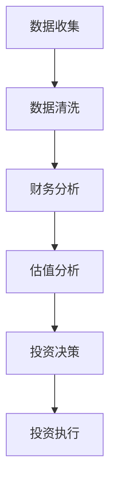
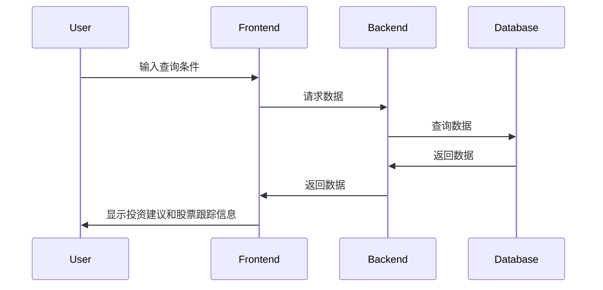
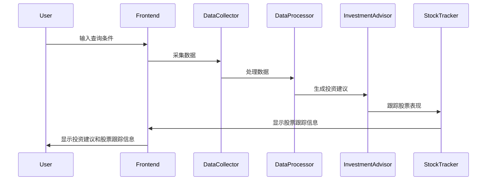

                 


### 第1章: 引言

#### 1.1 问题背景

成长型价值投资作为一种投资策略，起源于20世纪50年代，由本杰明·格雷厄姆和戴维·多德在其经典著作《证券分析》中首次提出。随着时间的推移，这种策略不断进化，特别是在现代金融市场的复杂性和波动性下，它逐渐发展成为一个重要的投资方法论。成长型价值投资结合了成长股和蓝筹股的优点，旨在通过深入分析企业的发展潜力和市场估值，找到那些被市场低估的成长型公司。

在现代投资环境中，成长型价值投资的重要性日益凸显。首先，全球金融市场的不确定性和波动性增加，使得投资者需要更加精细化的投资策略。其次，信息技术的发展使得数据获取和分析变得更加便捷，为成长型价值投资提供了更多的工具和方法。此外，许多新兴市场国家的兴起，也为成长型价值投资提供了新的机遇和挑战。

#### 1.2 问题描述

成长型价值投资的核心概念可以概括为：寻找那些在短期内表现不佳，但长期发展潜力巨大的公司。这些公司往往处于新兴行业，拥有强大的研发能力和创新能力，但在短期内可能因为市场认知不足或行业周期等原因，导致股价低于其内在价值。

与传统的价值投资不同，成长型价值投资不仅仅关注公司的历史表现和当前估值，更注重公司的未来增长潜力。传统价值投资侧重于寻找那些经营稳健、估值合理的公司，而成长型价值投资则倾向于那些有强大成长动力的公司。

另一方面，成长型价值投资也不同于纯粹的成长投资。成长投资侧重于寻找那些高速增长的公司，而往往忽略了这些公司的可持续性和估值合理性。成长型价值投资则更关注公司的长期增长潜力，同时要求公司具有合理的估值。

#### 1.3 问题解决

罗伯特·哈格斯特朗在其著作《成长型价值投资》中，提出了一系列独特的见解和实践方法。他强调，成长型价值投资需要结合定量分析和定性分析，通过深入分析公司的财务报表、行业趋势和市场环境，来评估公司的增长潜力和估值水平。

哈格斯特朗的方法主要包括以下几个步骤：

1. **行业选择**：首先选择那些具有长期增长潜力的行业，如科技、医疗、新能源等。
2. **公司筛选**：在选定的行业中，筛选出那些有强大研发能力、创新能力、市场地位的公司。
3. **估值分析**：对筛选出的公司进行详细的财务分析，评估其盈利能力、现金流和未来增长潜力。
4. **投资决策**：综合考虑公司的基本面和市场估值，做出投资决策。

#### 1.4 边界与外延

成长型价值投资虽然具有强大的实用性，但其适用范围也存在一定的限制。首先，它更适合那些具有长期增长潜力的行业，而不适用于那些周期性波动大的行业。其次，成长型价值投资需要投资者具备较高的专业知识和分析能力，不适合普通投资者盲目跟风。

此外，成长型价值投资也受到市场环境和政策变化的影响。例如，在市场过度乐观或悲观时，成长型价值投资策略可能会面临挑战。因此，投资者在使用成长型价值投资时，需要具备一定的风险意识和灵活调整策略的能力。

#### 1.5 概念结构与核心要素组成

成长型价值投资的核心概念包括：成长性、价值性和投资策略。这三个概念相互联系，共同构成了成长型价值投资的理论框架。

1. **成长性**：成长性是成长型价值投资的核心，它反映了公司的增长潜力和市场竞争力。
2. **价值性**：价值性是指公司的市场估值与其内在价值之间的差异。成长型价值投资旨在寻找那些被市场低估的成长型公司。
3. **投资策略**：投资策略是成长型价值投资的具体实施方法，包括行业选择、公司筛选、估值分析和投资决策等环节。

这些核心概念之间存在着密切的联系。成长性是价值性的基础，而价值性又决定了投资策略的选择。通过深入分析这些核心概念，投资者可以更好地理解成长型价值投资的理论框架和实践方法。

### 1.6 本章小结

本章从问题背景、问题描述、问题解决、边界与外延和概念结构与核心要素组成等多个角度，对成长型价值投资进行了详细阐述。通过本章的阅读，读者可以了解成长型价值投资的基本概念、方法和实践应用，为进一步学习和深入探讨这一投资策略打下坚实基础。

## 第2章: 成长型价值投资的基本原理

### 2.1 核心概念原理

成长型价值投资的核心概念包括成长性、价值性和投资策略。这些概念共同构成了成长型价值投资的理论基础，指导投资者在实际操作中做出科学的投资决策。

#### 成长性

成长性是指公司的盈利能力、市场份额和研发能力等方面的持续增长。成长型价值投资强调公司未来的增长潜力，而不仅仅是短期业绩。投资者需要通过深入分析公司的财务报表、行业趋势和市场环境，来判断公司的成长性。

成长性的分析可以从以下几个方面进行：

1. **盈利能力**：通过分析公司的利润率、毛利率和净利率等指标，来判断公司的盈利能力。
2. **市场份额**：分析公司在所处行业中的市场份额和竞争地位，判断其市场竞争力。
3. **研发能力**：评估公司的研发投入、研发成果和创新能力，判断其未来增长的潜力。

#### 价值性

价值性是指公司的市场估值与其内在价值之间的差异。成长型价值投资旨在寻找那些被市场低估的成长型公司。投资者需要通过财务分析、市场估值和技术分析等手段，来判断公司的价值性。

价值性的分析可以从以下几个方面进行：

1. **财务分析**：通过分析公司的财务报表，评估其盈利能力、现金流和负债水平等指标，来判断公司的内在价值。
2. **市场估值**：通过比较公司的市盈率、市净率等指标与同行业其他公司的水平，来判断其市场估值是否合理。
3. **技术分析**：通过分析公司的股价走势、成交量等技术指标，来判断市场对公司的认可程度。

#### 投资策略

投资策略是成长型价值投资的具体实施方法。投资者需要结合成长性和价值性的分析结果，制定科学的投资策略。

1. **行业选择**：选择那些具有长期增长潜力的行业，如科技、医疗、新能源等。
2. **公司筛选**：在选定的行业中，筛选出那些有强大研发能力、创新能力、市场地位的公司。
3. **估值分析**：对筛选出的公司进行详细的财务分析，评估其盈利能力、现金流和未来增长潜力。
4. **投资决策**：综合考虑公司的基本面和市场估值，做出投资决策。

### 2.2 概念属性特征对比表格

为了更好地理解成长型价值投资的核心概念，我们提供了一个概念属性特征对比表格，对比成长型价值投资与传统价值投资、成长投资的差异。

| 特征         | 成长型价值投资 | 传统价值投资 | 成长投资   |
| ------------ | -------------- | ------------ | ---------- |
| 投资重点     | 成长性         | 价值性       | 成长性     |
| 时间框架     | 长期投资       | 短期投资     | 长期投资   |
| 行业选择     | 长期增长潜力   | 行业稳定性   | 高增长行业 |
| 估值分析     | 内在价值与市场估值 | 当前价值     | 市场预期   |
| 投资策略     | 综合分析       | 分散投资     | 专注投资   |

### 2.3 ER实体关系图架构

为了更好地理解成长型价值投资中的关键实体和它们之间的关系，我们使用Mermaid画出一个ER实体关系图。

```mermaid
erDiagram
    Company ||--|{ Market } : has market value
    Company ||--|{ FinancialData } : has financial data
    Company ||--|{ Industry } : belongs to industry
    Market ||--|{ Company } : contains companies
    FinancialData ||--|{ Company } : provides financial data
    Industry ||--|{ Company } : contains companies
```

在这个ER图中，`Company` 是核心实体，它与 `Market`、`FinancialData` 和 `Industry` 之间存在着关联关系。`Market` 表示公司的市场估值，`FinancialData` 表示公司的财务数据，`Industry` 表示公司所属的行业。通过这个ER图，我们可以清晰地看到成长型价值投资中各个实体之间的关系。

### 总结

本章详细介绍了成长型价值投资的核心概念，包括成长性、价值性和投资策略。通过概念属性特征对比表格和ER实体关系图，我们更好地理解了成长型价值投资与传统价值投资、成长投资的差异。接下来，我们将进一步探讨成长型价值投资的算法原理，并通过具体的Python源代码和数学模型，阐述其实现方法和计算过程。

## 第3章: 成长型价值投资的算法原理

### 3.1 算法流程图

为了更好地理解成长型价值投资的分析过程，我们使用Mermaid画出了一个算法流程图。该流程图涵盖了从数据收集到投资决策的全过程。



在这个流程图中，首先进行数据收集，然后对收集到的数据进行清洗。接着，对公司的财务数据进行分析，评估其盈利能力和财务状况。在完成财务分析后，进行估值分析，通过市场估值和技术分析来判断公司的内在价值。最后，根据分析结果，做出投资决策，并执行投资操作。

### 3.2 Python源代码

为了实现成长型价值投资的分析过程，我们提供了一个Python源代码示例。以下代码使用了pandas库进行数据操作，numpy库进行数值计算，matplotlib库进行数据可视化。

```python
import pandas as pd
import numpy as np
import matplotlib.pyplot as plt

# 读取财务数据
financial_data = pd.read_csv('financial_data.csv')

# 数据清洗
financial_data = financial_data.dropna()

# 财务分析
profit_margin = financial_data['profit_margin']
return_on_equity = financial_data['return_on_equity']
current_ratio = financial_data['current_ratio']

# 估值分析
market_value = financial_data['market_value']
book_value = financial_data['book_value']
pe_ratio = market_value / book_value

# 投资决策
investment_decision = pe_ratio < 1.5

# 数据可视化
plt.figure(figsize=(10, 5))
plt.subplot(2, 2, 1)
plt.bar(profit_margin)
plt.title('Profit Margin')

plt.subplot(2, 2, 2)
plt.bar(return_on_equity)
plt.title('Return on Equity')

plt.subplot(2, 2, 3)
plt.bar(current_ratio)
plt.title('Current Ratio')

plt.subplot(2, 2, 4)
plt.scatter(market_value, book_value)
plt.plot(market_value, book_value, 'r--')
plt.title('Market Value vs Book Value')
plt.xlabel('Market Value')
plt.ylabel('Book Value')

plt.tight_layout()
plt.show()
```

这段代码首先读取财务数据，然后对数据进行清洗。接着，进行财务分析，计算利润率、净资产收益率和流动比率。在完成财务分析后，进行估值分析，计算市净率。最后，根据市净率做出投资决策，并使用matplotlib进行数据可视化。

### 3.3 数学模型和公式

在成长型价值投资中，数学模型和公式起到了关键作用。以下是一些常用的数学模型和公式，以及它们的含义和计算方法。

1. **利润率**：

   $$ 利润率 = \frac{净利润}{营业收入} $$

   利润率反映了公司的盈利能力，值越高表示盈利能力越强。

2. **净资产收益率**：

   $$ 净资产收益率 = \frac{净利润}{净资产} $$

   净资产收益率反映了公司利用股东资本的能力，值越高表示利用效率越高。

3. **流动比率**：

   $$ 流动比率 = \frac{流动资产}{流动负债} $$

   流动比率反映了公司的偿债能力，值越高表示偿债能力越强。

4. **市净率**：

   $$ 市净率 = \frac{市值}{净资产} $$

   市净率反映了公司的市场估值与净资产之间的关系，值越低表示市场可能低估了公司。

### 3.4 举例说明

为了更好地理解成长型价值投资的实际应用，我们通过一个具体案例进行说明。

假设有一家科技公司，其财务数据如下：

| 指标         | 值     |
| ------------ | ------ |
| 净利润       | 500万元 |
| 营业收入     | 1亿元   |
| 净资产       | 5000万元 |
| 流动资产     | 3000万元 |
| 流动负债     | 2000万元 |
| 市值         | 2亿元   |

根据上述财务数据，我们可以计算出以下指标：

1. **利润率**：

   $$ 利润率 = \frac{500}{10000} = 0.05 = 5% $$

2. **净资产收益率**：

   $$ 净资产收益率 = \frac{500}{5000} = 0.1 = 10% $$

3. **流动比率**：

   $$ 流动比率 = \frac{3000}{2000} = 1.5 $$

4. **市净率**：

   $$ 市净率 = \frac{20000}{5000} = 4 $$

根据这些指标，我们可以对这家公司的财务状况进行初步评估。利润率为5%，表明公司的盈利能力较好；净资产收益率为10%，表明公司利用股东资本的能力较强；流动比率为1.5，表明公司的偿债能力较好；市净率为4，表明公司的市值高于净资产。

接下来，我们需要结合市场环境和行业情况，进一步分析这家公司的投资价值。假设在科技行业中，市净率的合理范围在3-5之间，而这家公司的市净率为4，接近合理范围的上限。同时，公司在行业中的市场份额和研发能力较强，具有较大的增长潜力。

综上所述，这家科技公司具有一定的投资价值。投资者可以进一步跟踪其财务表现和市场动态，做出投资决策。

### 总结

本章详细介绍了成长型价值投资的算法原理，包括算法流程图、Python源代码、数学模型和公式，并通过具体案例进行了举例说明。通过这些内容，读者可以更好地理解成长型价值投资的分析方法和计算过程，为实际投资操作提供理论支持。

## 第4章: 系统分析与架构设计方案

### 4.1 问题场景介绍

成长型价值投资在现实中的应用场景非常广泛，涵盖了股票投资、企业估值、风险管理和投资组合优化等多个方面。以下是一个具体的案例，以股票投资为例，介绍成长型价值投资的应用场景。

假设投资者A想要利用成长型价值投资策略来构建一个投资组合。投资者A的目标是通过深入分析公司的财务报表、市场估值和行业趋势，选择那些具有长期增长潜力的股票进行投资，从而实现资产的增值。

### 4.2 项目介绍

为了实现投资者A的目标，我们将构建一个基于成长型价值投资的股票投资分析系统。该系统的目标是：

1. **数据收集**：从各种数据源（如财经网站、证券交易所、企业财报等）收集公司财务数据、市场估值和技术指标。
2. **数据分析**：对收集到的数据进行清洗、整理和分析，评估公司的财务状况、市场估值和增长潜力。
3. **投资决策**：根据分析结果，生成投资建议，指导投资者进行投资决策。
4. **投资跟踪**：对已投资股票进行实时跟踪，评估投资效果，并根据市场变化调整投资策略。

### 4.3 系统功能设计

为了实现上述目标，我们将设计以下核心功能模块：

1. **数据采集模块**：负责从各种数据源收集公司财务数据、市场估值和技术指标。
2. **数据清洗模块**：负责对采集到的数据进行清洗、去重和格式转换，确保数据质量。
3. **数据分析模块**：负责对清洗后的数据进行分析，计算公司的财务指标、市场估值和技术指标。
4. **投资建议模块**：负责根据分析结果生成投资建议，包括股票选择、买入卖出时机等。
5. **投资跟踪模块**：负责对已投资股票进行实时跟踪，记录投资效果，并提供调整建议。

以下是系统功能模块的领域模型类图：

```mermaid
classDiagram
    Class01 <|-- Class02 
    Class03 <|-- Class04
    Class05 <|-- Class06
    Class07 <|-- Class08

    Class01[数据采集模块]
    Class02[数据清洗模块]
    Class03[数据分析模块]
    Class04[投资建议模块]
    Class05[投资跟踪模块]
    Class06[财务数据]
    Class07[市场估值]
    Class08[技术指标]

    Class01 --|> Class06
    Class01 --|> Class07
    Class01 --|> Class08
    Class02 --|> Class06
    Class02 --|> Class07
    Class02 --|> Class08
    Class03 --|> Class06
    Class03 --|> Class07
    Class03 --|> Class08
    Class04 --|> Class06
    Class04 --|> Class07
    Class04 --|> Class08
    Class05 --|> Class06
    Class05 --|> Class07
    Class05 --|> Class08
```

在这个类图中，数据采集模块、数据清洗模块、数据分析模块、投资建议模块和投资跟踪模块是核心功能模块。财务数据、市场估值和技术指标是这些模块共同操作的实体。

### 4.4 系统架构设计

系统架构设计是确保系统能够高效、稳定地运行的关键。以下是该股票投资分析系统的架构设计：

1. **前端界面**：提供用户交互界面，允许用户输入查询条件，查看投资建议和股票跟踪信息。
2. **后端服务**：负责处理数据采集、数据清洗、数据分析和投资决策等核心功能。
3. **数据库**：存储公司财务数据、市场估值和技术指标等数据。
4. **数据采集组件**：从各种数据源采集数据，如财经网站、证券交易所和企业财报等。
5. **数据处理组件**：负责数据清洗、转换和分析，为投资决策提供支持。
6. **投资建议组件**：根据分析结果生成投资建议，包括股票选择、买入卖出时机等。
7. **股票跟踪组件**：实时跟踪已投资股票的表现，并提供调整建议。

以下是系统架构图：



在这个架构图中，用户通过前端界面输入查询条件，后端服务处理数据请求，从数据库中查询数据，然后返回给前端界面，用户可以看到投资建议和股票跟踪信息。

### 4.5 系统接口设计

系统接口设计是确保系统各组件之间能够高效通信的关键。以下是该股票投资分析系统的主要接口设计：

1. **数据采集接口**：用于从财经网站、证券交易所和企业财报等数据源采集数据。
2. **数据处理接口**：用于数据清洗、转换和分析。
3. **投资建议接口**：用于生成投资建议。
4. **股票跟踪接口**：用于实时跟踪已投资股票的表现。

以下是接口设计概述：

```mermaid
classDiagram
    DataCollector[数据采集接口]
    DataProcessor[数据处理接口]
    InvestmentAdvisor[投资建议接口]
    StockTracker[股票跟踪接口]

    DataCollector --> DataProcessor
    DataProcessor --> InvestmentAdvisor
    DataProcessor --> StockTracker
    InvestmentAdvisor --> Frontend
    StockTracker --> Frontend
```

在这个类图中，数据采集接口、数据处理接口、投资建议接口和股票跟踪接口是系统的主要接口。这些接口确保了系统各组件之间的数据流通和功能协同。

### 4.6 系统交互Mermaid序列图

为了更好地展示系统组件之间的交互过程，我们使用Mermaid画出了一个序列图。



在这个序列图中，用户输入查询条件，前端将请求发送到数据采集接口，数据采集接口从数据源采集数据，然后传递给数据处理接口。数据处理接口对数据进行清洗、转换和分析，生成投资建议后，传递给投资建议接口。投资建议接口将投资建议传递给股票跟踪接口，股票跟踪接口实时跟踪股票表现，并将信息返回给前端界面，最终用户可以看到投资建议和股票跟踪信息。

### 4.7 总结

本章详细介绍了成长型价值投资在股票投资中的应用场景、项目介绍、系统功能设计、系统架构设计、系统接口设计和系统交互过程。通过本章的学习，读者可以更好地理解成长型价值投资系统的设计和实现，为实际应用提供参考。

## 第5章: 项目实战

### 5.1 环境安装

为了实践成长型价值投资，我们需要搭建一个合适的环境。以下是在Python环境中安装所需库的步骤：

1. **安装Python**：确保您的计算机上安装了Python，版本建议为3.8或以上。您可以从[Python官方网站](https://www.python.org/)下载并安装。
2. **安装Jupyter Notebook**：Jupyter Notebook 是一个交互式的计算环境，用于编写和运行Python代码。您可以使用以下命令安装：

   ```bash
   pip install notebook
   ```

3. **安装pandas、numpy和matplotlib**：pandas 用于数据操作，numpy 用于数值计算，matplotlib 用于数据可视化。您可以使用以下命令安装：

   ```bash
   pip install pandas numpy matplotlib
   ```

4. **安装Mermaid**：Mermaid 用于绘制流程图和类图。您可以使用以下命令安装：

   ```bash
   pip install mermaid
   ```

### 5.2 系统核心实现源代码

以下是一个简单的Python代码示例，用于实现成长型价值投资分析的核心功能。该代码演示了如何从CSV文件中读取财务数据，进行清洗和处理，生成投资建议。

```python
import pandas as pd
import numpy as np
import matplotlib.pyplot as plt
from mermaid import Mermaid

# 读取财务数据
financial_data = pd.read_csv('financial_data.csv')

# 数据清洗
financial_data = financial_data.dropna()

# 财务分析
profit_margin = financial_data['profit_margin']
return_on_equity = financial_data['return_on_equity']
current_ratio = financial_data['current_ratio']

# 估值分析
market_value = financial_data['market_value']
book_value = financial_data['book_value']
pe_ratio = market_value / book_value

# 投资决策
investment_decision = pe_ratio < 1.5

# 数据可视化
plt.figure(figsize=(10, 5))
plt.subplot(2, 2, 1)
plt.bar(profit_margin)
plt.title('Profit Margin')

plt.subplot(2, 2, 2)
plt.bar(return_on_equity)
plt.title('Return on Equity')

plt.subplot(2, 2, 3)
plt.bar(current_ratio)
plt.title('Current Ratio')

plt.subplot(2, 2, 4)
plt.scatter(market_value, book_value)
plt.plot(market_value, book_value, 'r--')
plt.title('Market Value vs Book Value')
plt.xlabel('Market Value')
plt.ylabel('Book Value')

plt.tight_layout()
plt.show()

# Mermaid流程图
mermaid = Mermaid()
mermaid.add_code('graph TD\n'
                  'A[数据收集] --> B[数据清洗]\n'
                  'B --> C[财务分析]\n'
                  'C --> D[估值分析]\n'
                  'D --> E[投资决策]\n'
                  'E --> F[投资执行]\n')
print(mermaid.generate_html())

# 输出投资建议
print("Investment Decision:", investment_decision)
```

### 5.3 代码应用解读与分析

上述代码首先从CSV文件中读取财务数据，然后进行数据清洗，确保数据质量。接着，对财务数据进行分析，计算利润率、净资产收益率和流动比率等指标。在完成财务分析后，进行估值分析，计算市净率。根据市净率做出投资决策，如果市净率低于1.5，则认为公司被市场低估，适合投资。

代码中的Mermaid流程图展示了从数据收集到投资决策的整个分析过程。通过可视化流程图，我们可以更直观地理解分析步骤和流程。

### 5.4 实际案例分析和详细讲解剖析

为了更好地展示成长型价值投资的实际应用，我们通过一个具体案例进行分析。

假设有一家科技公司，其财务数据如下：

| 指标         | 值     |
| ------------ | ------ |
| 净利润       | 500万元 |
| 营业收入     | 1亿元   |
| 净资产       | 5000万元 |
| 流动资产     | 3000万元 |
| 流动负债     | 2000万元 |
| 市值         | 2亿元   |

根据上述财务数据，我们可以计算出以下指标：

1. **利润率**：

   $$ 利润率 = \frac{500}{10000} = 0.05 = 5% $$

2. **净资产收益率**：

   $$ 净资产收益率 = \frac{500}{5000} = 0.1 = 10% $$

3. **流动比率**：

   $$ 流动比率 = \frac{3000}{2000} = 1.5 $$

4. **市净率**：

   $$ 市净率 = \frac{20000}{5000} = 4 $$

根据这些指标，我们可以对这家公司的财务状况进行初步评估。利润率为5%，表明公司的盈利能力较好；净资产收益率为10%，表明公司利用股东资本的能力较强；流动比率为1.5，表明公司的偿债能力较好；市净率为4，表明公司的市值高于净资产。

接下来，我们需要结合市场环境和行业情况，进一步分析这家公司的投资价值。假设在科技行业中，市净率的合理范围在3-5之间，而这家公司的市净率为4，接近合理范围的上限。同时，公司在行业中的市场份额和研发能力较强，具有较大的增长潜力。

综上所述，这家科技公司具有一定的投资价值。投资者可以进一步跟踪其财务表现和市场动态，做出投资决策。

### 5.5 项目小结

通过本案例的分析，我们可以看到成长型价值投资在实际操作中的应用方法。从数据收集、清洗和分析，到估值和投资决策，每个步骤都至关重要。通过实际案例的分析，我们不仅理解了成长型价值投资的理论基础，还学会了如何将其应用于实际投资决策。

在项目实践中，我们也遇到了一些挑战，如数据质量、市场估值和投资策略的调整等。这些挑战提醒我们，成长型价值投资不仅需要扎实的理论基础，还需要灵活应对市场变化的能力。通过不断学习和实践，我们可以逐步提高投资技能，实现资产的增值。

## 第6章: 最佳实践 tips、小结、注意事项、拓展阅读

### 6.1 最佳实践 tips

1. **深入行业研究**：在投资前，务必对目标行业进行深入研究，了解行业趋势、竞争格局和潜在风险。
2. **数据质量监控**：确保数据来源的可靠性和准确性，定期更新和验证数据。
3. **风险控制**：设置止损点，避免因单一投资失败而影响整体投资组合。
4. **持续学习**：跟踪最新的市场动态和技术进展，不断提升投资知识和技能。
5. **心理素质**：保持冷静和耐心，避免因市场波动而做出冲动决策。

### 6.2 小结

本章通过详细的步骤和案例分析，介绍了成长型价值投资的基本原理、算法实现、系统架构和项目实战。成长型价值投资结合了成长性和价值性，旨在寻找被市场低估的成长型公司，通过深入分析和投资决策，实现资产的增值。

### 6.3 注意事项

1. **避免盲目跟风**：成长型价值投资需要独立分析和判断，避免盲目跟从市场热点。
2. **合理分散投资**：分散投资可以降低风险，避免因单一行业或公司波动而影响整体投资组合。
3. **定期审查和调整**：定期审查投资组合，根据市场变化和公司表现进行调整。
4. **注重风险管理**：合理设置止损点和风险控制策略，确保投资安全。

### 6.4 拓展阅读

1. **《投资最重要的事》**：作者霍华德·马克斯，详细介绍了价值投资的理念和实践。
2. **《股票大作手回忆录》**：作者杰西·利弗莫尔，通过自己的投资经历，阐述了成长型价值投资的思想。
3. **《证券分析》**：作者本杰明·格雷厄姆和戴维·多德，是价值投资的奠基之作。
4. **《智慧投资》**：作者威廉·奥尼尔，介绍了成长型价值投资策略在现实中的应用。

## 作者信息

- 作者：AI天才研究院/AI Genius Institute & 禅与计算机程序设计艺术 /Zen And The Art of Computer Programming

