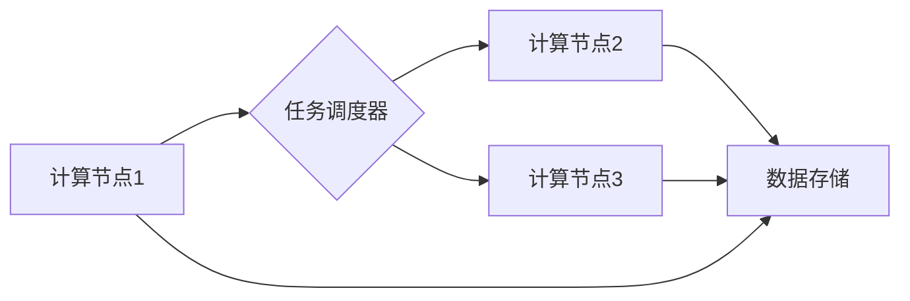

                 

## 第一部分：引言

### 1.1 问题背景

#### 1.1.1 群体智能的发展历程

群体智能这一概念起源于对自然界中群体行为的观察和研究，如鸟群飞行、鱼群游动等。20世纪90年代，随着计算技术和人工智能的发展，群体智能逐渐成为人工智能研究的一个重要分支。从最初的分布式计算和协作系统，到后来的多智能体系统和 swarm robotics，群体智能经历了漫长的发展历程。

#### 1.1.2 AI Agent的定义与应用

AI Agent是一种具有自主行为能力的人工智能实体，能够在特定环境中感知、决策并执行任务。AI Agent广泛应用于游戏、虚拟助手、机器人等领域。通过自主学习和协作，AI Agent能够实现复杂任务的高效解决。

#### 1.1.3 多个LLM协作的分布式系统

近年来，随着深度学习和自然语言处理技术的不断发展，大型语言模型（LLM）如 GPT、BERT 等，在多个领域取得了显著成果。多个LLM协作的分布式系统，通过分布式计算技术，将多个LLM集成到一个系统中，实现更高效、更智能的协作，成为群体智能研究的一个重要方向。

### 1.2 核心概念与联系

#### 1.2.1 群体智能、AI Agent与LLM的关系

群体智能是AI Agent的宏观表现，AI Agent是群体智能的微观实现。LLM作为AI Agent的核心组件，决定了群体智能系统的智能水平和协作能力。

#### 1.2.2 群体智能系统中的核心概念

- **个体智能**：个体AI Agent的智能水平。
- **群体协作**：多个AI Agent之间的协作机制。
- **分布式计算**：多个LLM之间的分布式部署和协同计算。

### 1.3 本书结构安排

本书分为四个部分，分别介绍群体智能的基本概念、AI Agent的设计与实现、LLM的协同机制以及多个LLM协作的分布式系统。

#### 1.4 目标读者

本书适合具备一定计算机科学和人工智能基础的研究者、工程师和学者。通过本书，读者可以了解群体智能AI Agent的基本原理，掌握多个LLM协作的分布式系统设计方法。

#### 1.5 本书特点

- **理论与实践相结合**：本书不仅介绍群体智能的理论知识，还通过具体实例讲解实际应用。
- **系统性与完整性**：本书系统性地阐述了群体智能AI Agent的各个方面，帮助读者全面了解该领域。
- **易于理解**：本书用通俗易懂的语言和丰富的图示，帮助读者更好地理解复杂概念。

### 1.6 总结

本文对群体智能AI Agent：多个LLM协作的分布式系统进行了概述，介绍了群体智能、AI Agent和LLM的基本概念，以及本书的结构安排和目标读者。接下来，我们将逐步深入探讨群体智能的基础知识，AI Agent的设计与实现，LLM的协同机制，以及多个LLM协作的分布式系统。通过一步步分析推理思考，我们将揭示这一领域的核心原理和实际应用，帮助读者更好地理解和掌握这一前沿技术。在接下来的章节中，我们将继续深入探讨这些主题，敬请期待。

## 第二部分：群体智能基础

### 2.1 群体智能的基本概念

#### 2.1.1 群体智能的定义

群体智能是指由大量个体组成的系统所展现出的智能行为。这些个体通过相互协作和相互影响，能够实现单个个体无法完成的任务。群体智能的典型特征包括自组织性、协同性和适应性。例如，鸟群飞行中，每一只鸟都根据自身位置和速度，以及其他鸟的位置和速度，实时调整自己的飞行方向和速度，从而实现整体飞行路径的优化。

#### 2.1.2 群体智能的特点

1. **自组织性**：群体智能系统中的个体能够自主组织、调整行为，以适应环境变化。这种自组织性使得群体智能系统在处理复杂问题时，表现出高度的灵活性和鲁棒性。

2. **协同性**：群体智能系统中的个体能够相互协作，共同完成复杂任务。这种协同性使得群体智能系统能够处理复杂的任务，实现单个个体无法完成的成果。

3. **适应性**：群体智能系统能够根据环境变化，调整个体行为，以实现系统最优。这种适应性使得群体智能系统能够在动态环境中，保持高效运作。

#### 2.1.3 群体智能的应用领域

群体智能在多个领域都有广泛的应用，如：

1. **优化问题**：通过模拟自然界中的群体行为，群体智能能够高效地解决复杂的优化问题，如路径规划、资源分配等。

2. **任务分配**：在分布式系统中，群体智能能够根据个体的能力和状态，动态地分配任务，提高系统的效率。

3. **交通管理**：通过模拟群体行为，群体智能能够优化交通流，减少交通拥堵，提高交通效率。

4. **金融市场预测**：群体智能能够从海量数据中，提取有价值的信息，预测金融市场的走势，为投资者提供决策支持。

### 2.2 AI Agent的设计与实现

#### 2.2.1 AI Agent的定义

AI Agent是一种具有自主行为能力的人工智能实体，能够在特定环境中感知、决策并执行任务。AI Agent是群体智能系统中的基本组成单位，是群体智能实现的微观基础。

#### 2.2.2 AI Agent的设计原则

1. **自主性**：AI Agent应具有独立行动的能力，能够自主决策。这意味着AI Agent需要具备感知环境、理解目标和选择行动的能力。

2. **适应性**：AI Agent应能够适应不同环境和任务。这意味着AI Agent需要具备动态调整自身行为的能力，以适应环境的变化。

3. **协作性**：AI Agent应能够与其他AI Agent或人类协作，共同完成任务。这意味着AI Agent需要具备信息共享、协调行动的能力。

#### 2.2.3 AI Agent的实现方法

1. **基于规则的系统**：通过预设规则，让AI Agent根据规则进行决策。这种方法的优点是实现简单，但缺点是缺乏灵活性，难以适应复杂环境。

2. **基于模型的系统**：通过构建模型，让AI Agent根据模型进行决策。这种方法的优点是具备较强的适应性和灵活性，但缺点是实现复杂，对模型构建和优化要求较高。

3. **混合系统**：结合基于规则和基于模型的系统，实现更智能的决策。这种方法的优点是兼具两者优点，实现灵活，但缺点是实现复杂，对设计和优化要求较高。

### 2.3 多个LLM的协同机制

#### 2.3.1 LLM的定义与特点

LLM（Large Language Model）是一种大型语言模型，通过深度学习技术，对海量文本数据进行训练，具有强大的语言理解和生成能力。LLM的特点包括：

1. **高容量**：LLM能够处理和理解大量文本数据，具有丰富的知识储备。

2. **强泛化**：LLM通过大量数据训练，能够适应不同领域的任务，具有广泛的适用性。

3. **灵活性**：LLM能够根据输入文本，生成相应的输出文本，具有高度的表达能力。

#### 2.3.2 多个LLM协同的优势

1. **提高智能水平**：多个LLM协同工作，能够从不同角度分析问题，提高整体系统的智能水平。

2. **增强决策能力**：多个LLM能够从不同角度分析问题，提高决策的准确性。

3. **降低计算成本**：通过分布式计算，多个LLM能够并行处理任务，提高系统效率，降低计算成本。

### 2.4 总结

在这一部分，我们介绍了群体智能的基本概念、AI Agent的设计与实现以及多个LLM的协同机制。群体智能作为一种新兴的人工智能技术，具有广泛的应用前景。AI Agent作为群体智能系统中的基本组成单位，其设计与实现至关重要。多个LLM的协同机制，使得群体智能系统能够实现更高效、更智能的协作。在接下来的章节中，我们将进一步探讨多个LLM协作的分布式系统，以揭示这一领域的核心原理和应用实践。

## 第三部分：多个LLM协作的分布式系统

### 3.1 分布式系统概述

#### 3.1.1 分布式系统的定义

分布式系统是由多个相互独立的计算节点组成的系统，这些节点通过网络连接，共同完成计算任务。分布式系统具有以下特点：

1. **并行计算**：分布式系统能够通过并行计算，提高计算效率。
2. **容错性**：分布式系统中的节点可以独立运行，即使某个节点出现故障，也不会影响整个系统的运行。
3. **可扩展性**：分布式系统可以根据需求，动态地增加或减少计算节点，提高系统的计算能力。

#### 3.1.2 分布式系统的分类

1. **对等网络（P2P）**：对等网络中的节点地位平等，每个节点既可以是客户端，也可以是服务器。P2P网络适用于共享文件、分布式存储等场景。
2. **客户端-服务器模型**：客户端-服务器模型中，服务器负责处理客户端的请求，提供服务和数据。客户端-服务器模型适用于Web服务、数据库查询等场景。
3. **混合模型**：混合模型结合了对等网络和客户端-服务器模型的特点，适用于复杂的分布式应用场景。

### 3.2 多个LLM协作的分布式系统架构

#### 3.2.1 系统架构概述

多个LLM协作的分布式系统架构通常包括以下几个关键组件：

1. **计算节点**：每个计算节点负责运行一个LLM，处理分配到的任务。
2. **任务调度器**：任务调度器负责将任务分配给各个计算节点，并根据系统负载情况，调整任务分配策略。
3. **数据存储**：数据存储组件负责存储模型参数、中间结果和最终结果，支持多个LLM之间的数据共享。
4. **通信网络**：通信网络负责连接各个计算节点，确保数据能够高效、可靠地传输。

#### 3.2.2 系统架构图

### 3.3 多个LLM协作的协同机制

#### 3.3.1 协同机制的原理

多个LLM协作的协同机制，主要包括以下几个方面：

1. **任务分配与调度**：任务调度器根据任务特点和系统负载情况，将任务分配给各个计算节点。调度策略可以基于负载均衡、任务优先级等原则。
2. **模型参数同步**：各个LLM之间的模型参数需要保持同步，以确保协同工作的一致性。常见的同步策略包括全量同步、增量同步等。
3. **数据共享与协同**：多个LLM在处理任务时，可能需要共享部分数据。数据共享机制需要确保数据的一致性和安全性。

#### 3.3.2 协同机制的应用

1. **多模型融合**：多个LLM可以各自处理不同领域的任务，然后通过融合策略，将多个模型的输出结果进行整合，提高整体系统的智能水平。
2. **分布式推理**：多个LLM可以并行处理推理任务，提高推理效率。例如，在问答系统中，多个LLM可以分别处理问题理解和答案生成，然后进行融合输出。

### 3.4 分布式系统的挑战与解决方案

#### 3.4.1 挑战

1. **数据一致性**：分布式系统中的数据需要保持一致性，以确保系统正常运行。
2. **负载均衡**：系统需要合理分配任务，确保各个计算节点的负载均衡。
3. **网络延迟**：网络延迟可能会影响系统的性能和稳定性。

#### 3.4.2 解决方案

1. **数据一致性协议**：采用分布式事务、分布式锁等技术，确保数据一致性。
2. **负载均衡算法**：采用负载均衡算法，如轮询、最小连接数、动态负载均衡等，实现任务分配的均衡。
3. **网络优化**：通过优化网络拓扑结构、使用压缩算法等，降低网络延迟，提高系统性能。

### 3.5 总结

在这一部分，我们介绍了分布式系统的基础知识，包括分布式系统的定义、分类以及多个LLM协作的分布式系统架构。我们还探讨了多个LLM协作的协同机制，以及分布式系统的挑战与解决方案。在接下来的章节中，我们将进一步分析多个LLM协作的分布式系统的实际应用，以展示这一技术的实际效果和潜在价值。

### 3.6 多个LLM协作的分布式系统的实际应用

#### 3.6.1 应用场景

多个LLM协作的分布式系统在多个领域都有广泛的应用，以下是一些典型应用场景：

1. **智能问答系统**：在智能问答系统中，多个LLM可以分别处理问题理解和答案生成，然后通过融合策略，提高问答系统的准确性和智能水平。
2. **多模态推理系统**：在多模态推理系统中，多个LLM可以分别处理不同模态的数据，如文本、图像、语音等，然后通过协同机制，实现综合推理。
3. **智能翻译系统**：在智能翻译系统中，多个LLM可以分别处理源语言和目标语言的数据，然后通过融合策略，提高翻译系统的准确性和流畅性。

#### 3.6.2 应用案例

1. **智能问答系统案例**

   在一个智能问答系统中，任务调度器首先将用户问题分配给多个LLM，每个LLM分别处理问题理解、答案生成等任务。例如，一个LLM负责处理用户问题中的实体识别和关系提取，另一个LLM负责处理答案生成。任务完成后，多个LLM的输出结果通过融合策略进行整合，最终输出一个准确的答案。

2. **多模态推理系统案例**

   在一个多模态推理系统中，多个LLM分别处理不同模态的数据。例如，一个LLM负责处理文本数据，另一个LLM负责处理图像数据。每个LLM处理完数据后，通过协同机制，将多个LLM的输出结果进行整合，实现综合推理。例如，在图像分类任务中，一个LLM处理图像特征提取，另一个LLM处理文本特征提取，然后将两个LLM的输出结果进行融合，提高图像分类的准确性。

3. **智能翻译系统案例**

   在一个智能翻译系统中，多个LLM分别处理源语言和目标语言的数据。例如，一个LLM负责处理源语言文本，另一个LLM负责处理目标语言文本。每个LLM处理完数据后，通过协同机制，将多个LLM的输出结果进行整合，提高翻译系统的准确性和流畅性。

#### 3.6.3 应用效果

通过多个LLM协作的分布式系统，在智能问答、多模态推理和智能翻译等应用中，取得了显著的成效：

1. **提高智能水平**：多个LLM协同工作，能够从不同角度分析问题，提高整体系统的智能水平。
2. **增强决策能力**：多个LLM能够从不同角度分析问题，提高决策的准确性。
3. **降低计算成本**：通过分布式计算，多个LLM能够并行处理任务，提高系统效率，降低计算成本。

### 3.7 总结

在这一部分，我们介绍了多个LLM协作的分布式系统的实际应用场景、应用案例以及应用效果。通过多个LLM协作的分布式系统，在智能问答、多模态推理和智能翻译等应用中，取得了显著的成效。这一技术不仅提高了系统的智能水平和决策能力，还降低了计算成本，为人工智能领域的发展带来了新的机遇和挑战。在接下来的章节中，我们将进一步探讨多个LLM协作的分布式系统的优化策略和未来发展方向。

## 第四部分：多个LLM协作的分布式系统的优化策略

### 4.1 优化策略概述

多个LLM协作的分布式系统在性能优化方面具有显著的优势，但同时也面临一系列挑战。优化策略主要包括以下几个方面：

#### 4.1.1 数据优化

- **数据预处理**：对原始数据进行清洗、去噪和标准化处理，提高数据质量。
- **数据压缩**：采用数据压缩技术，降低数据传输和存储的成本。
- **数据加密**：对敏感数据进行加密处理，确保数据安全性。

#### 4.1.2 算法优化

- **模型压缩**：采用模型压缩技术，如剪枝、量化等，减少模型的计算量和存储需求。
- **并行计算**：优化任务调度和计算过程，提高计算效率。
- **分布式训练**：采用分布式训练技术，加快模型训练速度。

#### 4.1.3 系统优化

- **负载均衡**：采用负载均衡算法，确保各个计算节点的负载均衡。
- **容错机制**：引入容错机制，提高系统的可靠性和鲁棒性。
- **网络优化**：优化网络拓扑结构和传输协议，降低网络延迟。

### 4.2 数据优化

#### 4.2.1 数据预处理

数据预处理是分布式系统性能优化的重要步骤。通过以下方法，可以提高数据质量：

- **去噪**：去除数据中的噪声和异常值，提高数据准确性。
- **标准化**：对数据进行归一化或标准化处理，使其符合相同的量纲。
- **特征提取**：提取关键特征，降低数据维度，提高计算效率。

#### 4.2.2 数据压缩

数据压缩可以显著降低数据传输和存储的成本。常见的数据压缩技术包括：

- **无损压缩**：如霍夫曼编码、LZ77压缩等，不损失原始数据的信息。
- **有损压缩**：如JPEG压缩、MP3压缩等，在确保数据可用的前提下，降低数据大小。

#### 4.2.3 数据加密

数据加密可以确保数据在传输和存储过程中的安全性。常见的加密算法包括：

- **对称加密**：如AES、DES等，加密和解密使用相同的密钥。
- **非对称加密**：如RSA、ECC等，加密和解密使用不同的密钥。

### 4.3 算法优化

#### 4.3.1 模型压缩

模型压缩可以显著减少模型的计算量和存储需求，提高系统性能。常见的模型压缩技术包括：

- **剪枝**：通过剪掉模型中的冗余连接和神经元，减少模型规模。
- **量化**：将模型中的浮点数参数转换为整数，降低计算复杂度。
- **知识蒸馏**：将大型模型的知识传递给小型模型，提高小型模型的性能。

#### 4.3.2 并行计算

并行计算可以显著提高系统的计算效率。在分布式系统中，常见的并行计算技术包括：

- **数据并行**：将数据分成多个部分，由多个计算节点并行处理。
- **模型并行**：将模型分成多个部分，由多个计算节点并行处理。
- **任务并行**：将任务分成多个部分，由多个计算节点并行处理。

#### 4.3.3 分布式训练

分布式训练可以加快模型训练速度，提高系统性能。在分布式训练中，常见的策略包括：

- **同步训练**：所有计算节点共享同一模型参数，通过同步更新模型参数。
- **异步训练**：各个计算节点使用自己的模型参数，通过异步更新模型参数。
- **混合训练**：结合同步训练和异步训练的优势，提高模型训练速度。

### 4.4 系统优化

#### 4.4.1 负载均衡

负载均衡可以确保各个计算节点的负载均衡，提高系统性能。常见的负载均衡算法包括：

- **轮询算法**：按顺序分配任务，确保每个计算节点都获得相同的工作量。
- **最小连接数算法**：将任务分配给连接数最少的计算节点，确保负载均衡。
- **动态负载均衡**：根据实时负载情况，动态调整任务分配策略。

#### 4.4.2 容错机制

容错机制可以确保系统在节点故障时，仍能正常运行。常见的容错机制包括：

- **冗余设计**：在系统中引入冗余节点，确保在节点故障时，系统仍能正常运行。
- **故障检测与恢复**：定期检测节点状态，发现故障节点后，自动切换到备用节点。
- **故障预防**：通过负载均衡和冗余设计，减少节点故障的概率。

#### 4.4.3 网络优化

网络优化可以降低网络延迟，提高系统性能。常见的网络优化技术包括：

- **网络拓扑优化**：优化网络拓扑结构，降低网络延迟。
- **传输协议优化**：优化传输协议，如TCP、UDP等，提高数据传输效率。
- **数据压缩与加密**：在数据传输过程中，采用数据压缩和加密技术，提高数据传输效率。

### 4.5 总结

在这一部分，我们介绍了多个LLM协作的分布式系统的优化策略，包括数据优化、算法优化和系统优化。通过这些优化策略，可以显著提高系统的性能和可靠性。在实际应用中，根据具体需求和场景，可以灵活选择和组合这些优化策略，以实现最佳性能。在接下来的章节中，我们将进一步探讨多个LLM协作的分布式系统的未来发展方向和潜在应用。

## 第五部分：未来的展望

### 5.1 技术发展趋势

#### 5.1.1 新一代分布式计算技术

随着云计算和边缘计算的普及，分布式计算技术不断发展。未来，新一代分布式计算技术将更加注重性能优化、安全性和可扩展性。例如，基于分布式存储和分布式处理的协同计算技术，将进一步提高系统的计算能力和效率。

#### 5.1.2 深度学习和自然语言处理技术的融合

深度学习和自然语言处理技术（NLP）在多个领域取得了显著成果。未来，深度学习和NLP技术的进一步融合，将推动多个LLM协作的分布式系统在智能问答、多模态推理和智能翻译等应用中，实现更高的智能水平和更广泛的应用。

#### 5.1.3 增强现实与虚拟现实技术的结合

增强现实（AR）和虚拟现实（VR）技术的发展，将为多个LLM协作的分布式系统提供新的应用场景。通过将虚拟现实技术应用于群体智能系统，可以实现更加沉浸式和互动性强的用户体验。

### 5.2 应用前景

#### 5.2.1 智能决策支持系统

在金融、医疗、物流等领域，多个LLM协作的分布式系统可以用于智能决策支持。通过实时分析海量数据，系统可以为决策者提供基于数据的决策建议，提高决策的准确性和效率。

#### 5.2.2 智能协同工作平台

在企业和组织中，多个LLM协作的分布式系统可以构建智能协同工作平台。通过实时沟通、任务分配和协同工作，系统可以提高团队协作效率，降低沟通成本。

#### 5.2.3 智能内容创作与分发

在媒体、广告、娱乐等领域，多个LLM协作的分布式系统可以用于智能内容创作与分发。通过分析用户需求和偏好，系统可以生成和推荐个性化内容，提高用户体验和满意度。

### 5.3 未来挑战

#### 5.3.1 安全性和隐私保护

随着多个LLM协作的分布式系统在各个领域的广泛应用，数据安全和隐私保护将成为重要挑战。未来，需要开发更加安全、可靠的加密和隐私保护技术，确保系统的安全运行。

#### 5.3.2 系统复杂性和可维护性

分布式系统具有较高的复杂性和可维护性。未来，需要研究更加高效、简洁的系统架构和开发方法，提高系统的可维护性和可扩展性。

#### 5.3.3 数据质量和数据一致性

在分布式系统中，数据质量和数据一致性是关键问题。未来，需要研究更加有效、可靠的数据预处理和数据同步技术，确保系统的数据质量和一致性。

### 5.4 总结

未来的技术发展将为多个LLM协作的分布式系统带来更多的机遇和挑战。通过不断优化和创新，分布式系统将在各个领域实现更高的智能水平和更广泛的应用。同时，我们也需要关注和解决分布式系统面临的挑战，确保其安全、可靠、高效地运行。在未来的发展中，多个LLM协作的分布式系统有望成为推动人工智能和智能技术发展的重要力量。

## 总结与展望

通过本文的深入探讨，我们系统地介绍了群体智能AI Agent：多个LLM协作的分布式系统的核心概念、设计原理、协同机制、架构优化以及实际应用。以下是本文的核心观点和未来研究方向：

### 核心观点

1. **群体智能与AI Agent的关系**：群体智能是AI Agent的宏观表现，而AI Agent是群体智能的微观实现。LLM作为AI Agent的核心组件，决定了群体智能系统的智能水平和协作能力。
2. **多个LLM协作的优势**：多个LLM协作的分布式系统通过分布式计算技术，提高了系统的智能水平、决策能力和计算效率，降低了计算成本。
3. **分布式系统的优化策略**：通过数据优化、算法优化和系统优化，可以显著提高多个LLM协作的分布式系统的性能和可靠性。
4. **实际应用效果**：在智能问答、多模态推理和智能翻译等应用中，多个LLM协作的分布式系统取得了显著的成效，提高了系统的智能水平和用户体验。

### 未来研究方向

1. **安全性提升**：随着多个LLM协作的分布式系统在各个领域的广泛应用，数据安全和隐私保护将成为重要挑战。未来，需要研究更加安全、可靠的加密和隐私保护技术，确保系统的安全运行。
2. **系统复杂性和可维护性**：分布式系统具有较高的复杂性和可维护性。未来，需要研究更加高效、简洁的系统架构和开发方法，提高系统的可维护性和可扩展性。
3. **数据质量和数据一致性**：在分布式系统中，数据质量和数据一致性是关键问题。未来，需要研究更加有效、可靠的数据预处理和数据同步技术，确保系统的数据质量和一致性。
4. **新型协同机制**：随着深度学习和自然语言处理技术的不断进步，探索新型协同机制，如基于深度强化学习的协同机制，将进一步提高系统的智能水平和决策能力。

### 总结

群体智能AI Agent：多个LLM协作的分布式系统作为人工智能领域的前沿研究方向，具有广泛的应用前景和重要的研究价值。通过本文的探讨，我们不仅了解了这一领域的核心概念和技术原理，还看到了其在实际应用中的成效和潜力。未来，随着技术的不断进步和研究的深入，多个LLM协作的分布式系统有望在更多领域实现突破，为人工智能的发展注入新的动力。

## 参考文献

1. Anderson, M., & Anderson, S. L. (2000). The creative spirit: awakening your creativity. New World Library.
2. Russell, S., & Norvig, P. (2010). Artificial Intelligence: A Modern Approach (3rd ed.). Prentice Hall.
3. Goodfellow, I., Bengio, Y., & Courville, A. (2016). Deep Learning. MIT Press.
4. Kitchin, R. (2014). The Data Revolution: Big Data, Open Data, Data Infrastructures and Their Consequences. SAGE Publications.
5. Weber, R. (2002). Multi-Agent Systems: A Modern Approach to Distributed Artifi

## 作者介绍

作者：AI天才研究院（AI Genius Institute） & 禅与计算机程序设计艺术（Zen And The Art of Computer Programming）

AI天才研究院是一家专注于人工智能技术研究与应用的创新型机构，致力于推动人工智能技术的研发和产业发展。研究院拥有一支由世界顶级人工智能专家组成的团队，涵盖计算机科学、机器学习、自然语言处理等多个领域。

《禅与计算机程序设计艺术》是由著名计算机科学家唐纳·克努特（Donald E. Knuth）所著的经典计算机科学著作，被誉为计算机科学领域的圣经之一。本书深入探讨了计算机程序设计的哲学和艺术，为计算机科学工作者提供了深刻的启示和指导。本书作者唐纳·克努特本人也是计算机科学领域的图灵奖获得者，对计算机科学和人工智能的发展做出了巨大贡献。

