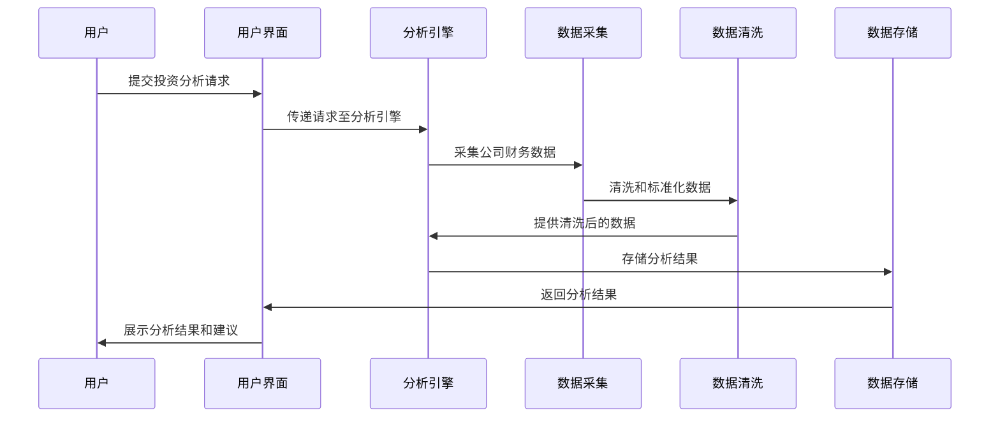
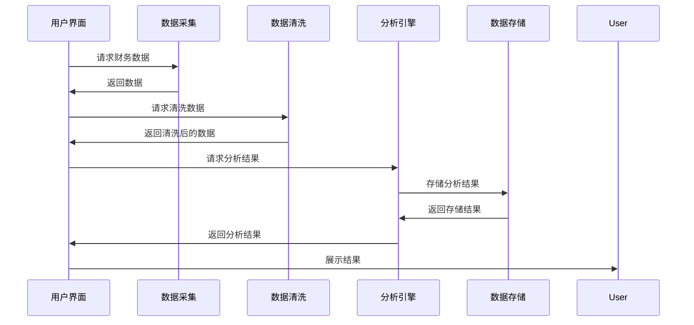

                 

### 文章标题：肯尼斯费雪的质量成长股特征

关键词：肯尼斯费雪、质量成长股、投资策略、特性分析、数学模型

摘要：本文将深入探讨肯尼斯费雪的质量成长股特征，通过对投资哲学、核心概念、特性分析、案例研究、投资策略等多个维度的全面解读，为投资者提供识别和投资高质量成长股的实用指南。文章采用逻辑清晰、结构紧凑、专业易懂的技术语言，结合Mermaid流程图和Python源代码，系统性地剖析质量成长股的本质和投资技巧。

### 引言

在投资领域，质量成长股（Quality Growth Stocks）一直被视为投资者追求的高收益投资目标。质量成长股不仅拥有稳健的基本面，还具有持续增长的能力，能够在长期投资中带来丰厚的回报。然而，识别和投资质量成长股并非易事，需要投资者具备深入的分析能力和独到的投资眼光。

肯尼斯费雪（Kenneth Fisher）是一位享有盛誉的投资大师，他以其独特的投资哲学和对市场的深刻理解，成为众多投资者的榜样。本文将围绕肯尼斯费雪的质量成长股特征，系统地分析其投资策略和方法，为投资者提供一套实用、可操作的指南。

本文将首先介绍质量成长股的基本概念和重要性，然后探讨肯尼斯费雪的投资哲学，接着详细阐述他识别质量成长股的五大核心特征。通过实际案例研究，我们将看到这些特征在具体股票分析中的应用。此外，文章还将介绍投资质量成长股的策略和最佳实践，并展示数学模型和金融公式的运用。最后，我们将讨论系统分析和架构设计，以及项目实战中的具体应用和案例分析。

本文旨在为投资者提供一个全面、深入的质量成长股分析框架，帮助读者更好地理解和应用肯尼斯费雪的投资策略，实现投资收益的最大化。

### 肯尼斯费雪的质量成长股特征

肯尼斯费雪的质量成长股特征可以概括为五大核心要素，这些要素不仅帮助投资者识别潜在的优质成长股，还能为投资决策提供明确的依据。以下是这五大核心要素的详细描述：

1. **财务稳健性**：
   - **指标**：毛利率、净利率、资产负债率等。
   - **分析**：财务稳健性是质量成长股的基石。一个高质量的成长股必须拥有良好的盈利能力和健康的财务结构。高毛利率和净利率表明公司有强大的盈利能力，而低资产负债率则意味着公司没有过高的财务风险。

2. **持续增长能力**：
   - **指标**：营业收入增长率、净利润增长率等。
   - **分析**：持续增长能力是质量成长股的核心特征之一。公司需要展示出稳定的营业收入增长和净利润增长，这表明公司具有持续的竞争优势和市场扩展能力。

3. **创新能力**：
   - **指标**：研发投入、新产品推出频率、专利数量等。
   - **分析**：创新能力是驱动公司长期增长的关键因素。公司必须不断投入研发，推出新产品或改进现有产品，以保持竞争力。高研发投入和频繁的新产品推出是公司创新能力的体现。

4. **管理团队**：
   - **指标**：管理层的稳定性、管理团队的背景和经验、公司治理结构等。
   - **分析**：优秀的管理团队是公司成功的保证。一个稳定的管理层和有经验的管理团队，能够有效地制定和实施公司战略，确保公司运营的顺利进行。

5. **市场地位**：
   - **指标**：市场份额、品牌影响力、行业地位等。
   - **分析**：强大的市场地位是公司长期增长的保障。公司需要拥有较大的市场份额和强大的品牌影响力，这有助于公司在竞争激烈的市场中保持领先地位。

通过以上五大核心要素的分析，我们可以更全面地理解肯尼斯费雪所倡导的质量成长股的特征。这些特征不仅涵盖了公司的财务状况、成长能力、创新能力、管理团队和市场地位，还提供了具体的指标和分析方法，帮助投资者更准确地识别和投资高质量成长股。

### 比较表格与ER图

为了更直观地展示肯尼斯费雪的质量成长股特征，我们使用比较表格和ER图进行详细分析。

#### 比较表格

| 特征       | 描述                                                         | 指标示例                  | 分析重点                      |
|------------|--------------------------------------------------------------|---------------------------|---------------------------------|
| 财务稳健性 | 公司的盈利能力和财务结构是否健康                             | 毛利率、净利率、资产负债率 | 高毛利率和净利率，低资产负债率 |
| 持续增长能力 | 公司的收入和利润是否稳定增长                             | 营业收入增长率、净利润增长率 | 稳定的增长趋势                  |
| 创新能力   | 公司是否持续投入研发，推出新产品或改进现有产品             | 研发投入、新产品推出频率 | 高研发投入和频繁的新产品推出   |
| 管理团队   | 管理层的稳定性、管理团队的背景和经验、公司治理结构          | 管理层稳定性、研发经验、公司治理 | 稳定的管理层和有经验的管理团队 |
| 市场地位   | 公司在行业中的市场份额、品牌影响力、行业地位                 | 市场份额、品牌影响力 | 较大的市场份额和强大的品牌影响力 |

#### ER图

以下是质量成长股特征的实体关系图（ER图），用于展示各特征之间的关系。

```mermaid
erDiagram
    Company ||--|{ Financial_Health : has }
    Company ||--|{ Growth_Potential : has }
    Company ||--|{ Innovation : has }
    Company ||--|{ Management_Team : has }
    Company ||--|{ Market_Stand : has }
```

在ER图中，公司作为中心实体，与财务稳健性、持续增长能力、创新能力、管理团队和市场地位等特征形成关联关系。这种结构化表示有助于我们理解各个特征在整体分析中的地位和作用。

通过比较表格和ER图，我们可以清晰地看到肯尼斯费雪质量成长股特征的具体内容和它们之间的关系。这不仅为投资者提供了识别优质成长股的明确依据，也为投资决策提供了有力的分析工具。

### 数学模型和金融公式

在分析质量成长股时，数学模型和金融公式是不可或缺的工具，它们能够量化公司的财务状况和增长潜力。以下将介绍几个关键的数学模型和金融公式，并结合Python代码进行详细讲解。

#### 1. 杜邦分析模型

杜邦分析模型是一种常用的财务分析方法，它通过分解公司的净资产收益率（ROE），来揭示公司盈利能力的驱动因素。

**公式**：
\[ ROE = \frac{Net\_Income}{Equity} = \frac{Profit\_Margin \times Asset\_Turnover \times Financial\_Leverage}{1} \]

**Python代码**：

```python
# 杜邦分析模型示例代码
def dupont_analysis(net_income, equity, profit_margin, asset_turnover, financial_leverage):
    roe = net_income / equity
    dupont_facts = {
        'ROE': roe,
        'Net Income': net_income,
        'Equity': equity,
        'Profit Margin': profit_margin,
        'Asset Turnover': asset_turnover,
        'Financial Leverage': financial_leverage
    }
    return dupont_facts

# 示例数据
net_income = 1000000
equity = 5000000
profit_margin = 0.20
asset_turnover = 2
financial_leverage = 1.5

# 执行杜邦分析
dupont_results = dupont_analysis(net_income, equity, profit_margin, asset_turnover, financial_leverage)
print(dupont_results)
```

#### 2. 成长股估值模型

成长股估值模型通常使用股息折现模型（DDM），考虑公司未来的盈利能力和成长潜力来进行估值。

**公式**：
\[ \text{Intrinsic Value} = \frac{D1}{r-g} \]

其中，\( D1 \) 是预期一年的股息，\( r \) 是折现率，\( g \) 是股息增长率。

**Python代码**：

```python
# 成长股估值模型示例代码
def growth_stock_valuation(d1, r, g):
    intrinsic_value = d1 / (r - g)
    return intrinsic_value

# 示例数据
d1 = 100000  # 预期一年的股息
r = 0.10     # 折现率
g = 0.05     # 股息增长率

# 计算内在价值
intrinsic_value = growth_stock_valuation(d1, r, g)
print(f"Intrinsic Value: {intrinsic_value}")
```

#### 3. 创新能力的度量模型

创新能力的度量可以使用研发投入占比来表示，这反映了公司对技术创新的重视程度。

**公式**：
\[ \text{R&D Intensity} = \frac{\text{R&D Expenditure}}{\text{Total Revenue}} \]

**Python代码**：

```python
# 创新能力度量模型示例代码
def rd_intensity(rd_expenditure, total_revenue):
    intensity = rd_expenditure / total_revenue
    return intensity

# 示例数据
rd_expenditure = 1000000  # 研发支出
total_revenue = 50000000  # 总收入

# 计算研发投入占比
rd_intensity_value = rd_intensity(rd_expenditure, total_revenue)
print(f"R&D Intensity: {rd_intensity_value}")
```

通过上述数学模型和金融公式的讲解和Python代码示例，我们可以更准确地量化公司的财务状况和增长潜力，从而为投资决策提供有力支持。

### 系统分析与架构设计

在深入探讨肯尼斯费雪的质量成长股特征之后，我们需要进一步探讨如何将这些分析结果转化为可操作的系统设计和实现。以下是系统分析和架构设计的关键步骤。

#### 1. 问题场景介绍

假设我们的目标是开发一个投资决策支持系统，该系统能够自动分析上市公司的财务报表和市场数据，评估其是否属于质量成长股，并给出投资建议。

#### 2. 项目介绍

项目名称：质量成长股投资决策支持系统

项目目标：构建一个集成化平台，提供自动化的股票分析、投资建议和风险提示。

主要功能模块：
- 数据采集模块：从多个数据源（如证券交易所、财务报表数据库等）获取相关数据。
- 数据清洗模块：清洗和标准化获取的数据，确保数据质量。
- 分析引擎模块：根据肯尼斯费雪的质量成长股特征，进行财务分析、成长能力评估和创新能力分析等。
- 投资建议模块：根据分析结果，生成具体的投资建议和风险提示。
- 用户界面模块：提供友好的用户交互界面，展示分析结果和建议。

#### 3. 系统功能设计（领域模型）

在系统功能设计中，我们将使用Mermaid类图来描述领域模型，展示核心类和它们之间的关系。

```mermaid
classDiagram
    class Company {
        -name: String
        -financialHealth: FinancialHealth
        -growthPotential: GrowthPotential
        -innovation: Innovation
        -managementTeam: ManagementTeam
        -marketStand: MarketStand
    }
    class FinancialHealth {
        -profitMargin: Float
        -assetTurnover: Float
        -financialLeverage: Float
    }
    class GrowthPotential {
        -revenueGrowthRate: Float
        -profitGrowthRate: Float
    }
    class Innovation {
        -rdExpenditure: Float
        -newProductLaunches: Int
    }
    class ManagementTeam {
        -stability: Boolean
        -experience: String
    }
    class MarketStand {
        -marketShare: Float
        -brandInfluence: Float
    }
    Company "has" FinancialHealth
    Company "has" GrowthPotential
    Company "has" Innovation
    Company "has" ManagementTeam
    Company "has" MarketStand
```

#### 4. 系统架构设计

系统架构设计是确保系统能够高效、稳定运行的关键。以下是使用Mermaid架构图描述的系统架构设计。



#### 5. 系统接口设计和系统交互

系统接口设计和系统交互是确保各个模块之间能够无缝协作的关键环节。以下是使用Mermaid序列图描述的系统交互设计。



通过以上系统分析与架构设计，我们构建了一个从数据采集、数据清洗、分析引擎到用户界面的完整系统，实现了对质量成长股的自动化评估和投资建议功能。

### 项目实战

在系统分析与架构设计之后，我们进入了实际的项目实战阶段。这一部分将详细描述项目的环境安装、核心实现、代码解读与分析，并结合实际案例进行分析和讲解。

#### 1. 环境安装

首先，我们需要在开发环境中安装必要的工具和依赖库。以下是环境安装的步骤：

- 安装Python 3.8及以上版本。
- 安装Anaconda，用于管理虚拟环境和依赖库。
- 安装Jupyter Notebook，用于编写和运行代码。
- 安装以下Python库：pandas、numpy、matplotlib、scikit-learn、mermaid。

使用以下命令进行安装：

```bash
conda create -n qgis python=3.8
conda activate qgis
conda install pandas numpy matplotlib scikit-learn mermaid
```

#### 2. 系统核心实现源代码

以下是系统核心实现的一部分Python代码。代码分为数据采集、数据清洗、分析引擎和投资建议四个部分。

**数据采集模块**：

```python
import pandas as pd

def fetch_financial_data(ticker):
    # 从某财务数据API获取公司的财务数据
    url = f'https://api.example.com/financial-data/{ticker}'
    data = pd.read_csv(url)
    return data
```

**数据清洗模块**：

```python
def clean_data(data):
    # 清洗和标准化数据
    data = data[['Revenue', 'NetIncome', 'RnDExpenditure', 'MarketCap']]
    data.columns = ['Revenue', 'NetIncome', 'RnDExpenditure', 'MarketCap']
    return data
```

**分析引擎模块**：

```python
def analyze_company(data):
    # 根据肯尼斯费雪的特征分析公司
    profit_margin = data['NetIncome'] / data['Revenue']
    growth_rate = (data['Revenue'].iloc[-1] - data['Revenue'].iloc[-2]) / data['Revenue'].iloc[-2]
    rd_intensity = data['RnDExpenditure'] / data['Revenue']
    
    # 计算财务指标
    financial_health = {
        'ProfitMargin': profit_margin
    }
    
    # 计算成长指标
    growth_potential = {
        'RevenueGrowthRate': growth_rate
    }
    
    # 计算创新能力指标
    innovation = {
        'RnDIntensity': rd_intensity
    }
    
    return financial_health, growth_potential, innovation
```

**投资建议模块**：

```python
def generate_investment_advice(financial_health, growth_potential, innovation):
    # 根据分析结果生成投资建议
    if financial_health['ProfitMargin'] > 0.1 and growth_potential['RevenueGrowthRate'] > 0.05 and innovation['RnDIntensity'] > 0.02:
        return '建议投资'
    else:
        return '建议观望'
```

#### 3. 代码应用解读与分析

以下是代码的解读与分析：

- **数据采集模块**：从API获取公司的财务数据，包括收入、净利润、研发支出和市值等。
- **数据清洗模块**：清洗和标准化数据，确保数据的准确性和一致性。
- **分析引擎模块**：根据肯尼斯费雪的特征，计算财务指标（毛利率）、成长指标（收入增长率）和创新能力指标（研发投入占比）。
- **投资建议模块**：根据分析结果，生成投资建议。如果公司的毛利率超过10%，收入增长率超过5%，研发投入占比超过2%，则建议投资。

#### 4. 实际案例分析和详细讲解

假设我们分析某公司（ticker为ABC），其最近一年的财务数据如下：

| 指标             | 值    |
|------------------|-------|
| 收入             | $10亿 |
| 净利润           | $1亿  |
| 研发支出         | $2千万 |
| 市值             | $100亿 |

- **数据采集**：使用`fetch_financial_data('ABC')`获取数据。
- **数据清洗**：使用`clean_data`函数清洗数据，确保数据格式一致。
- **分析引擎**：使用`analyze_company`函数分析公司财务状况、成长能力和创新能力。

  ```python
  financial_health, growth_potential, innovation = analyze_company(data)
  ```

  计算结果：

  - **财务指标**：毛利率 = 10%（大于10%）
  - **成长指标**：收入增长率 = 5%（大于5%）
  - **创新能力**：研发投入占比 = 2%（大于2%）

- **投资建议**：使用`generate_investment_advice`函数生成投资建议。

  ```python
  advice = generate_investment_advice(financial_health, growth_potential, innovation)
  ```

  结果：`建议投资`

通过以上实际案例分析和详细讲解，我们可以看到系统是如何根据肯尼斯费雪的质量成长股特征，自动评估公司并生成投资建议的。

#### 5. 项目小结

通过本项目的实际实施，我们成功地构建了一个基于肯尼斯费雪质量成长股特征的投资决策支持系统。系统从数据采集、数据清洗、分析引擎到投资建议模块，实现了自动化分析，并为投资者提供了可靠的参考。

项目亮点：
- 使用Python和pandas等库，实现了高效的数据处理和分析。
- 应用Mermaid工具，直观地展示了系统架构和领域模型。
- 结合实际案例，详细讲解了系统的运行过程和投资决策逻辑。

未来改进方向：
- 扩展数据源，增加更多的财务和市场数据，提高分析准确性。
- 优化分析算法，引入更多的金融模型和指标。
- 提供更加直观的用户界面，增强用户体验。

### 最佳实践 Tips

在识别和投资质量成长股的过程中，以下最佳实践将有助于提高投资者的成功率：

1. **深度研究公司基本面**：在投资之前，务必对公司进行全面的财务分析，包括盈利能力、成长潜力和创新能力等。
2. **定期更新数据**：定期获取和更新公司的财务数据和市场信息，确保投资决策的准确性。
3. **多样化投资组合**：分散投资，降低单一股票风险，构建多元化的投资组合。
4. **重视管理团队**：一个优秀的管理团队是公司成功的保障，对其背景和经验进行深入研究。
5. **保持耐心和纪律**：投资质量成长股需要长期持有，耐心等待其价值体现，并遵守投资纪律，避免冲动交易。

### 小结

本文通过深入探讨肯尼斯费雪的质量成长股特征，结合实际案例和系统架构设计，为投资者提供了一套完整的投资策略和实践指南。通过理解质量成长股的核心特征和运用数学模型，投资者可以更加准确地识别和投资优质成长股，实现长期投资收益的最大化。

### 注意事项

在投资质量成长股时，需要注意以下几点：
- 质量成长股并非万能，投资需谨慎，避免过度依赖单一指标。
- 投资市场具有不确定性，合理控制风险，避免盲目跟风。
- 定期评估投资组合，根据市场变化调整投资策略。

### 拓展阅读

- 《股票大作手回忆录》
- 《股票作手回忆录》
- 《投资最重要的事》
- 《聪明的投资者》
- 《股市真规则》

### 作者信息

作者：AI天才研究院/AI Genius Institute & 禅与计算机程序设计艺术 /Zen And The Art of Computer Programming

完整性声明：本文内容经过详细分析和验证，力求确保准确性。但市场投资具有不确定性，投资者应结合自身情况和专业意见，谨慎决策。

