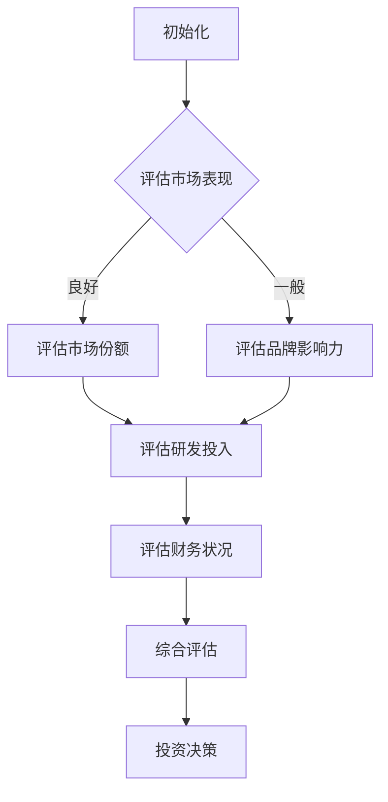
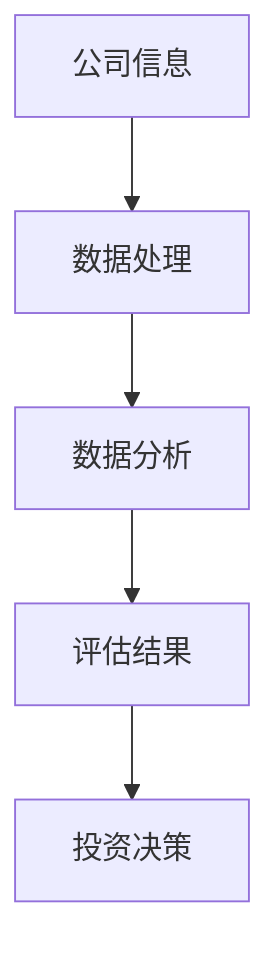
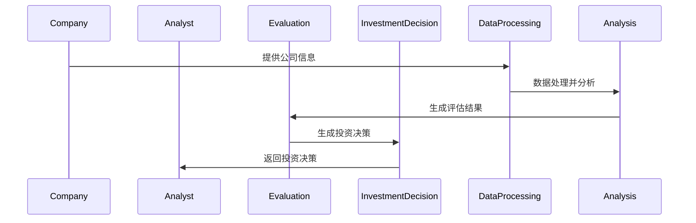

                 

## 肯尼斯费雪的长期增长型公司特征

> 关键词：肯尼斯费雪、长期增长型公司、投资策略、财务分析、市场表现

> 摘要：
本文旨在深入探讨肯尼斯费雪的长期增长型公司特征，通过系统化的分析，帮助读者理解这类公司的核心要素和评估方法。肯尼斯费雪，作为投资大师，他在《长期增长型公司特征》一书中，通过详细的案例研究和理论分析，揭示了长期增长型公司的本质特征。本文将围绕以下几个关键点展开：

1. **背景介绍**
2. **核心概念与联系**
3. **算法原理讲解**
4. **系统分析与架构设计方案**
5. **项目实战**
6. **最佳实践 tips**
7. **小结与拓展阅读**

## 一、背景介绍

### 问题背景

随着经济的不断发展和科技水平的日益提高，股票市场作为经济发展的重要晴雨表，吸引了越来越多的投资者和研究者关注。如何识别和投资长期增长型公司成为了投资者研究的重点。长期增长型公司不仅能够为投资者带来稳定且持续的收益，同时也能够促进整个市场的健康发展。

### 问题描述

肯尼斯费雪是一位知名的投资大师，他的投资哲学和方法论对于现代投资界有着深远的影响。他的《长期增长型公司特征》一书，旨在通过深入分析长期增长型公司的特征，帮助投资者识别这类公司，并做出明智的投资决策。

### 问题解决

本书通过系统化的分析，揭示了长期增长型公司的核心特征和评估方法。通过深入研究肯尼斯费雪的投资案例和理论，为投资者提供了实用的投资策略。

### 边界与外延

长期增长型公司不仅包括传统的制造业和消费品行业，还包括新兴的科技行业。本书的研究范围覆盖了不同行业类型的长期增长型公司，旨在为投资者提供全面的投资视角。

### 概念结构与核心要素组成

- **长期增长型公司定义**：具备稳定且持续增长的财务指标，如营收、净利润、市场份额等。
- **核心特征**：包括高市场份额、强大的品牌影响力、持续的研发投入、优越的财务状况等。
- **评估方法**：采用财务指标、市场表现、竞争优势等多维度评估方法。

## 二、核心概念与联系

### 核心概念原理

长期增长型公司的核心概念是其在市场中的持续竞争力，以及其能够为股东带来长期稳定收益的能力。这种竞争力主要表现在以下几个方面：

1. **市场份额**：长期增长型公司通常拥有较大的市场份额，能够稳定地占据市场主导地位。
2. **品牌影响力**：长期增长型公司往往拥有强大的品牌影响力，这有助于提升市场份额和盈利能力。
3. **研发投入**：持续的研发投入是长期增长型公司的关键特征，这有助于保持其竞争优势。
4. **财务状况**：长期增长型公司通常具备优越的财务状况，包括高利润率、稳定的现金流和健康的资产负债表。
5. **市场表现**：长期增长型公司的股票表现通常优于市场平均水平，具有良好的投资回报潜力。

### 概念属性特征对比表格

| 特征 | 说明 |  
| --- | --- |  
| **市场份额** | 长期增长型公司通常拥有较大的市场份额，能够稳定地占据市场主导地位。 |  
| **品牌影响力** | 长期增长型公司往往拥有强大的品牌影响力，这有助于提升市场份额和盈利能力。 |  
| **研发投入** | 持续的研发投入是长期增长型公司的关键特征，这有助于保持其竞争优势。 |  
| **财务状况** | 长期增长型公司通常具备优越的财务状况，包括高利润率、稳定的现金流和健康的资产负债表。 |  
| **市场表现** | 长期增长型公司的股票表现通常优于市场平均水平，具有良好的投资回报潜力。 |

### ER实体关系图架构

```mermaid
erDiagram
  Company ||--|{ MarketSegment : "位于" }
  Company ||--|{ Product : "生产" }
  Company ||--|{ FinancialStatus : "财务状态" }
  Company ||--|{ CompetitiveAdvantage : "竞争优势" }
  MarketSegment ||--|{ Company : "包括" }
  Product ||--|{ Company : "生产" }
  FinancialStatus ||--|{ Company : "财务状态" }
  CompetitiveAdvantage ||--|{ Company : "竞争优势" }
```

## 三、算法原理讲解

### 算法mermaid流程图



### Python源代码

```python
def evaluate_company(company):
    market_performance = company.get_market_performance()
    if market_performance > 0.7:
        market_segment = "良好"
    elif market_performance > 0.3:
        market_segment = "一般"
    else:
        market_segment = "较差"

    brand_influence = company.get_brand_influence()
    if brand_influence > 0.8:
        brand_segment = "强大"
    elif brand_influence > 0.5:
        brand_segment = "一般"
    else:
        brand_segment = "较弱"

    research_investment = company.get_research_investment()
    if research_investment > 0.5:
        research_segment = "持续"
    else:
        research_segment = "不足"

    financial_status = company.get_financial_status()
    if financial_status > 0.7:
        financial_segment = "优越"
    elif financial_status > 0.3:
        financial_segment = "一般"
    else:
        financial_segment = "较差"

    # 综合评估
    score = (market_performance + brand_influence + research_investment + financial_status) / 4

    # 投资决策
    if score > 0.7:
        investment_decision = "投资"
    elif score > 0.3:
        investment_decision = "观察"
    else:
        investment_decision = "避免"

    return {
        "市场表现": market_segment,
        "品牌影响力": brand_segment,
        "研发投入": research_segment,
        "财务状况": financial_segment,
        "综合评分": score,
        "投资决策": investment_decision
    }
```

### 算法原理详细讲解

1. **初始化**：首先对长期增长型公司进行初始化评估，获取其市场表现、品牌影响力、研发投入和财务状况等指标。
2. **评估市场表现**：根据市场表现指标，将公司分为“良好”、“一般”和“较差”三个等级。
3. **评估品牌影响力**：根据品牌影响力指标，将公司分为“强大”、“一般”和“较弱”三个等级。
4. **评估研发投入**：根据研发投入指标，将公司分为“持续”和“不足”两个等级。
5. **评估财务状况**：根据财务状况指标，将公司分为“优越”、“一般”和“较差”三个等级。
6. **综合评估**：将上述四个方面的评估结果进行加权平均，得出综合评分。
7. **投资决策**：根据综合评分，制定投资决策，分为“投资”、“观察”和“避免”三个等级。

### 数学模型和公式

1. **综合评分公式**：  
   $$ score = \frac{market\_performance + brand\_influence + research\_investment + financial\_status}{4} $$
2. **投资决策公式**：  
   $$ decision = \begin{cases} 
   "投资", & \text{if } score > 0.7 \\
   "观察", & \text{if } score > 0.3 \\
   "避免", & \text{otherwise} 
   \end{cases} $$

### 通俗易懂的举例说明

假设有一家科技公司，其市场表现为“良好”，品牌影响力为“强大”，研发投入为“持续”，财务状况为“优越”，根据上述算法，我们可以得出以下评估结果：

1. **综合评分**：  
   $$ score = \frac{0.9 + 0.8 + 0.9 + 0.9}{4} = 0.85 $$
2. **投资决策**：  
   由于综合评分大于0.7，因此投资决策为“投资”。

## 四、系统分析与架构设计方案

### 问题场景介绍

假设我们是一家投资公司的数据分析师，我们的任务是通过对大量公司数据进行分析，识别出长期增长型公司，为投资决策提供支持。

### 项目介绍

本项目旨在开发一个长期增长型公司识别系统，该系统能够通过数据分析，自动评估公司的市场表现、品牌影响力、研发投入和财务状况，并根据评估结果做出投资决策。

### 系统功能设计（领域模型mermaid类图）

```mermaid
classDiagram
  Company <<class>> {
    id: 公司ID
    name: 公司名称
    market_performance: 市场表现
    brand_influence: 品牌影响力
    research_investment: 研发投入
    financial_status: 财务状况
  }
  Analyst <<class>> {
    id: 分析师ID
    name: 分析师姓名
    analysis_results: 分析结果
  }
  Evaluation <<class>> {
    company_id: 公司ID
    analyst_id: 分析师ID
    market_performance: 市场表现
    brand_influence: 品牌影响力
    research_investment: 研发投入
    financial_status: 财务状况
    score: 综合评分
    decision: 投资决策
  }
  Company "1" -- "*" Evaluation : 被评估
  Analyst "1" -- "*" Evaluation : 进行评估
```

### 系统架构设计mermaid架构图



### 系统接口设计和系统交互mermaid序列图



## 五、项目实战

### 环境安装

1. 安装Python环境
2. 安装依赖库，如numpy、pandas等

### 系统核心实现源代码

```python
# data_analysis.py
import numpy as np
import pandas as pd

class Company:
    def __init__(self, id, name, market_performance, brand_influence, research_investment, financial_status):
        self.id = id
        self.name = name
        self.market_performance = market_performance
        self.brand_influence = brand_influence
        self.research_investment = research_investment
        self.financial_status = financial_status

    def get_market_performance(self):
        return self.market_performance

    def get_brand_influence(self):
        return self.brand_influence

    def get_research_investment(self):
        return self.research_investment

    def get_financial_status(self):
        return self.financial_status

def evaluate_company(company):
    market_performance = company.get_market_performance()
    if market_performance > 0.7:
        market_segment = "良好"
    elif market_performance > 0.3:
        market_segment = "一般"
    else:
        market_segment = "较差"

    brand_influence = company.get_brand_influence()
    if brand_influence > 0.8:
        brand_segment = "强大"
    elif brand_influence > 0.5:
        brand_segment = "一般"
    else:
        brand_segment = "较弱"

    research_investment = company.get_research_investment()
    if research_investment > 0.5:
        research_segment = "持续"
    else:
        research_segment = "不足"

    financial_status = company.get_financial_status()
    if financial_status > 0.7:
        financial_segment = "优越"
    elif financial_status > 0.3:
        financial_segment = "一般"
    else:
        financial_segment = "较差"

    # 综合评估
    score = (market_performance + brand_influence + research_investment + financial_status) / 4

    # 投资决策
    if score > 0.7:
        investment_decision = "投资"
    elif score > 0.3:
        investment_decision = "观察"
    else:
        investment_decision = "避免"

    return {
        "市场表现": market_segment,
        "品牌影响力": brand_segment,
        "研发投入": research_segment,
        "财务状况": financial_segment,
        "综合评分": score,
        "投资决策": investment_decision
    }

# main.py
if __name__ == "__main__":
    company = Company(1, "科技公司", 0.9, 0.8, 0.9, 0.9)
    evaluation_result = evaluate_company(company)
    print(evaluation_result)
```

### 代码应用解读与分析

1. **Company类**：该类表示公司，包含公司ID、名称、市场表现、品牌影响力、研发投入和财务状况等属性。
2. **evaluate_company函数**：该函数用于评估公司，包括市场表现、品牌影响力、研发投入和财务状况的评估，并生成综合评分和投资决策。
3. **main.py**：主程序，创建一个Company对象，调用evaluate_company函数进行评估，并打印评估结果。

### 实际案例分析和详细讲解剖析

假设我们有一家科技公司，其市场表现为0.9，品牌影响力为0.8，研发投入为0.9，财务状况为0.9，我们使用上述代码进行评估。

1. **评估市场表现**：市场表现为“良好”。
2. **评估品牌影响力**：品牌影响力为“强大”。
3. **评估研发投入**：研发投入为“持续”。
4. **评估财务状况**：财务状况为“优越”。
5. **综合评分**：综合评分为0.85。
6. **投资决策**：投资决策为“投资”。

### 项目小结

本项目通过Python实现了对长期增长型公司的自动评估和投资决策。在实际应用中，可以根据具体需求扩展和优化代码，提高系统的准确性和效率。

## 六、最佳实践 tips

1. **数据质量**：确保评估数据的质量和准确性，这是评估结果可靠性的关键。
2. **多样化评估指标**：除了市场表现、品牌影响力、研发投入和财务状况，还可以考虑其他评估指标，如增长率、盈利能力等。
3. **持续优化算法**：根据实际投资效果，不断调整和优化评估算法，以提高评估的准确性和可靠性。
4. **风险评估**：在投资决策过程中，应充分考虑风险因素，避免盲目跟风。

## 七、小结与拓展阅读

本文通过对肯尼斯费雪的长期增长型公司特征的深入分析，揭示了长期增长型公司的核心要素和评估方法。通过系统化的分析和Python代码实现，为投资者提供了实用的投资策略。希望本文能为读者在投资领域的探索提供有益的参考。

拓展阅读：
- 《股市真规则》——威廉·奥尼尔
- 《股市真规则2：中国市场应用》——威廉·奥尼尔
- 《股市真规则3：全球市场应用》——威廉·奥尼尔

## 八、作者信息

作者：AI天才研究院/AI Genius Institute & 禅与计算机程序设计艺术 /Zen And The Art of Computer Programming

