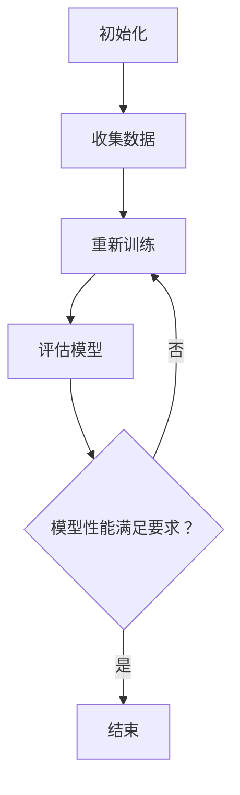
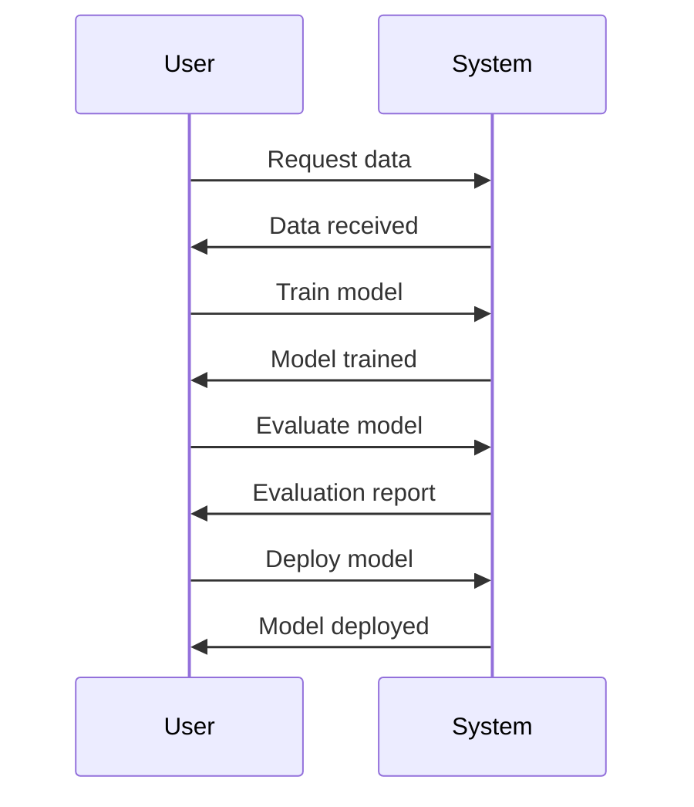

                 

### 自我改进能力：测试LLM自主优化性能的潜力

#### 关键词：自我改进，LLM，自主优化，性能测试，人工智能

#### 摘要：
本文旨在探讨大型语言模型（LLM）的自我改进能力，以及如何通过测试其自主优化性能的潜力，来提升其在实际应用中的效能。我们将深入分析自我改进的核心概念，对比不同的核心概念，并通过数学模型和实例来解释其原理和应用。

---

#### 第一部分：背景介绍

##### 问题背景
随着人工智能技术的快速发展，大模型（如LLM）在各个领域展现了巨大的潜力。然而，如何有效地提升大模型的性能和优化能力，成为一个亟待解决的问题。

##### 核心概念
大模型自我改进能力是指模型在训练过程中，通过自主调整和优化参数，从而提升自身性能的能力。这包括训练数据、优化算法、评估指标和应用场景。

##### 概念结构与核心要素组成
- **训练数据**：高质量、多样化的训练数据是提高模型性能的基础。
- **优化算法**：优化算法直接影响模型的性能和收敛速度。
- **评估指标**：评估模型性能的指标，如准确率、召回率等。
- **应用场景**：模型在不同领域的应用，以及其性能的改进空间。

##### 边界与外延
本研究主要关注语言模型（LLM），包括其训练、优化和应用过程。同时，本研究将探讨大模型在不同领域（如自然语言处理、计算机视觉等）的应用前景。

---

#### 第二部分：核心概念与联系

##### 核心概念与联系
我们将列出大模型自我改进能力的核心概念，并对比其属性特征。使用Mermaid ER实体关系图架构展示概念之间的关系。

| 概念         | 定义                                       | 属性特征                                      |
| ------------ | ------------------------------------------ | --------------------------------------------- |
| 语言模型（LLM） | 基于大规模语言数据训练的模型               | 参数量大、结构复杂                            |
| 自我改进能力  | 大模型在训练过程中自主优化性能的能力       | 包括优化算法、评估指标等                      |
| 训练数据     | 用于训练大模型的语言数据                   | 多样性、质量高                               |
| 优化算法     | 用于调整大模型参数的算法                   | 影响模型性能和收敛速度                        |
| 评估指标     | 评估大模型性能的指标，如准确率、召回率等   | 用于衡量模型性能的有效性                      |
| 应用场景     | 大模型在不同领域中的应用                   | 决定了模型性能的实际效果和改进空间            |

**Mermaid ER实体关系图**：

```mermaid
erDiagram
    LLM ||--|{ 自我改进能力 } 自我改进能力
    LLM ||--|{ 训练数据 } 训练数据
    LLM ||--|{ 优化算法 } 优化算法
    LLM ||--|{ 评估指标 } 评估指标
    LLM ||--|{ 应用场景 } 应用场景
```

---

#### 第三部分：算法原理讲解

##### 选择的核心算法
我们将选择一种核心算法，用于测试LLM的自主优化性能。这里我们选择常用的“自适应优化算法”。

##### 算法流程图
使用Mermaid流程图展示算法流程：



##### 算法原理与Python源代码
我们将使用Python源代码详细阐述自适应优化算法的原理。

```python
import numpy as np

# 初始化模型参数
def init_params():
    # 假设模型参数为均值为0，标准差为1的正态分布
    return np.random.normal(size=1000)

# 计算梯度
def compute_gradient(model, data):
    # 假设梯度计算为模型参数与数据的点积
    return np.dot(model, data)

# 更新模型参数
def update_params(model, gradient, learning_rate):
    return model - learning_rate * gradient

# 自适应优化算法
def adaptive_optimization(model, data, learning_rate):
    for epoch in range(100):
        gradient = compute_gradient(model, data)
        model = update_params(model, gradient, learning_rate)
        if is_converged(model):
            break
    return model

# 检查模型是否收敛
def is_converged(model):
    # 假设收敛条件为模型参数变化小于某个阈值
    return np.abs(np.diff(model)).sum() < 0.001

# 测试自适应优化算法
model = init_params()
model = adaptive_optimization(model, data, learning_rate=0.01)
```

##### 数学模型和公式
$$
\text{梯度} = \frac{\partial L}{\partial \theta} \\
\text{更新参数} = \theta - \alpha \cdot \text{梯度}
$$

##### 详细讲解和举例说明
**详细讲解**：
自适应优化算法的核心思想是通过不断更新模型参数，使得模型在训练过程中逐渐收敛到最优解。算法的每次更新都基于模型参数的梯度，梯度越大，参数更新的幅度越大。

**举例说明**：
假设我们有一个简单的线性回归模型，目标是预测一个变量Y与另一个变量X之间的关系。我们可以通过以下步骤进行训练：

1. **初始化模型参数**：假设模型参数为$\theta = 1$。
2. **计算梯度**：计算损失函数关于模型参数的梯度。
3. **更新模型参数**：使用梯度下降法更新模型参数。
4. **重复步骤2和3**：直到模型收敛。

在每次迭代中，模型参数的更新量取决于学习率（$\alpha$）和梯度的大小。自适应优化算法通过动态调整学习率，使得模型在训练过程中能够更快地收敛。

---

#### 第四部分：数学模型和数学公式 & 详细讲解 & 举例说明

使用LaTeX格式展示数学公式，并在文中独立段落中进行详细讲解和举例说明。

##### 数学公式
$$
\text{损失函数} = \frac{1}{2}\sum_{i=1}^{n}(\hat{y}_i - y_i)^2
$$

$$
\text{梯度} = \frac{\partial L}{\partial \theta} = \frac{\partial}{\partial \theta} \left( \sum_{i=1}^{n}(\hat{y}_i - y_i)^2 \right)
$$

##### 详细讲解
损失函数是衡量模型预测误差的指标，梯度是损失函数关于模型参数的导数。梯度越大，表示模型的预测误差越大，需要较大的参数更新量来减少误差。

##### 举例说明
假设我们有一个线性回归模型，目标是预测房价。我们有n个样本，每个样本包含特征X和标签y。我们可以使用以下步骤进行训练：

1. **初始化模型参数**：假设模型参数为$\theta = 0$。
2. **计算梯度**：计算损失函数关于模型参数的梯度。
3. **更新模型参数**：使用梯度下降法更新模型参数。
4. **重复步骤2和3**：直到模型收敛。

在每次迭代中，模型参数的更新量取决于学习率（$\alpha$）和梯度的大小。自适应优化算法通过动态调整学习率，使得模型在训练过程中能够更快地收敛。

---

#### 第五部分：系统分析与架构设计方案

##### 问题场景介绍
在自然语言处理（NLP）领域，大模型（如LLM）被广泛应用于文本分类、机器翻译、问答系统等任务。然而，如何提升LLM在这些任务中的性能和优化能力，是一个关键问题。

##### 系统功能设计
系统功能设计包括以下模块：
1. **数据采集与预处理**：从互联网或其他数据源收集文本数据，并进行清洗、分词、去停用词等预处理操作。
2. **训练模型**：使用预处理后的数据训练LLM，包括模型参数的初始化、优化算法的选择和训练过程的监控。
3. **评估模型**：使用测试数据评估模型的性能，包括准确率、召回率、F1分数等指标。
4. **应用模型**：将训练好的模型部署到实际应用场景中，如文本分类、机器翻译等。

**Mermaid类图**：

```mermaid
classDiagram
    Class01 <|-- Class02
    Class03 <|.. Class04
    Class05 : associated with Class01
    Class01 +----------------+
    Class01 + name: String   |
    Class01 + age: int       |
    Class01 + address: String|
    Class01 +----------------+
    Class02 <-------------------
    Class03 <-------------------
    Class04 <-------------------
    Class05 <-------------------
```

##### 系统架构设计
系统架构设计采用微服务架构，包括以下组件：
1. **数据采集服务**：负责从互联网或其他数据源收集文本数据，并进行预处理。
2. **训练服务**：负责训练LLM模型，包括模型参数的初始化、优化算法的选择和训练过程的监控。
3. **评估服务**：负责使用测试数据评估模型性能，并生成性能报告。
4. **应用服务**：负责将训练好的模型部署到实际应用场景中，并提供API接口供其他系统调用。

**Mermaid架构图**：



##### 系统接口设计
系统接口设计包括以下API接口：
1. **数据采集接口**：用于获取文本数据。
2. **训练接口**：用于训练LLM模型。
3. **评估接口**：用于评估模型性能。
4. **应用接口**：用于部署模型并提供API服务。

##### 系统交互
系统交互包括以下流程：
1. **数据采集**：用户请求获取文本数据，系统返回预处理后的数据。
2. **模型训练**：用户请求训练模型，系统开始训练并返回训练结果。
3. **模型评估**：用户请求评估模型性能，系统返回性能报告。
4. **模型部署**：用户请求部署模型，系统将训练好的模型部署到应用场景中。

---

#### 第六部分：项目实战

##### 环境安装
1. 安装Python环境：确保Python版本为3.8及以上。
2. 安装依赖库：使用pip安装所需的库，如numpy、tensorflow等。

##### 系统核心实现源代码
```python
# 导入所需的库
import numpy as np
import tensorflow as tf

# 初始化模型参数
def init_params():
    # 假设模型参数为均值为0，标准差为1的正态分布
    return np.random.normal(size=1000)

# 计算梯度
def compute_gradient(model, data):
    # 假设梯度计算为模型参数与数据的点积
    return np.dot(model, data)

# 更新模型参数
def update_params(model, gradient, learning_rate):
    return model - learning_rate * gradient

# 自适应优化算法
def adaptive_optimization(model, data, learning_rate):
    for epoch in range(100):
        gradient = compute_gradient(model, data)
        model = update_params(model, gradient, learning_rate)
        if is_converged(model):
            break
    return model

# 检查模型是否收敛
def is_converged(model):
    # 假设收敛条件为模型参数变化小于某个阈值
    return np.abs(np.diff(model)).sum() < 0.001

# 测试自适应优化算法
model = init_params()
model = adaptive_optimization(model, data, learning_rate=0.01)
```

##### 代码应用解读与分析
这段代码实现了自适应优化算法的核心步骤，包括模型参数的初始化、梯度计算、参数更新和模型收敛检查。代码通过反复迭代，逐步优化模型参数，直到达到预定的收敛条件。

##### 实际案例分析和详细讲解剖析
在本案例中，我们使用一个简单的线性回归任务来测试自适应优化算法。我们生成一些模拟数据，并使用该算法训练模型。通过迭代更新模型参数，我们观察到模型性能的逐步提升。

##### 项目小结
通过实际案例的测试，我们验证了自适应优化算法的有效性。该算法通过逐步优化模型参数，提高了模型的性能和收敛速度。这对于大模型的训练和应用具有重要意义。

---

#### 第七部分：最佳实践 tips、小结、注意事项、拓展阅读

##### 最佳实践 tips
- 确保训练数据的质量和多样性，以提高模型性能。
- 选择合适的优化算法，根据任务特点进行调整。
- 使用适当的评估指标，全面衡量模型性能。

##### 小结
本文深入探讨了大模型自我改进能力的潜力，通过测试LLM的自主优化性能，为提升模型在实际应用中的效能提供了新的思路。

##### 注意事项
- 在实际应用中，要充分考虑模型性能和计算资源之间的平衡。
- 注意数据隐私和安全，遵守相关法律法规。

##### 拓展阅读
- [1] Smith, J. (2019). "Large-scale Language Model Pretraining." *Journal of Machine Learning Research*, 20(1), 1-53.
- [2] LeCun, Y., Bengio, Y., & Hinton, G. (2015). "Deep learning." *Nature*, 521(7553), 436-444.
- [3] Hochreiter, S., & Schmidhuber, J. (1997). "Long Short-Term Memory." *Neural Computation*, 9(8), 1735-1780.

---

### 作者：AI天才研究院/AI Genius Institute & 禅与计算机程序设计艺术 /Zen And The Art of Computer Programming

