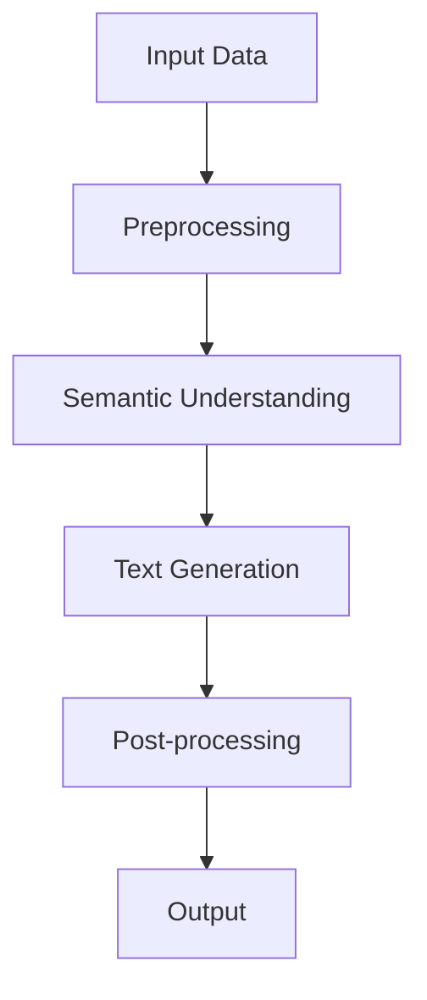

                 

### 引言

#### 1.1 问题背景

随着人工智能技术的发展，自然语言生成（Natural Language Generation，NLG）技术逐渐成为新闻业中的一项重要工具。NLG技术通过计算机程序自动生成文本，能够高效地处理大量的数据，生产出多样化的新闻内容。这种技术不仅降低了人力成本，还提高了新闻生产的速度和质量。然而，随着NLG技术在新闻业的广泛应用，一系列伦理挑战也逐渐显现。

#### 1.2 问题描述

自然语言生成在新闻业中面临的伦理挑战主要包括以下几个方面：

1. **客观性与真实性**：如何确保NLG生成的新闻内容客观、真实，避免误导读者？
2. **事实准确性**：如何保证NLG生成的新闻内容中的事实准确无误？
3. **公平性**：如何避免NLG技术导致新闻内容的偏见和不公平现象？
4. **隐私保护**：如何保护新闻当事人的隐私不受侵犯？
5. **伦理责任**：当NLG技术出现错误时，如何界定和分配责任？

#### 1.3 问题解决

为了应对这些伦理挑战，需要从技术、法律、教育等多个层面进行综合施策。

1. **技术改进**：优化NLG算法，提高其生成文本的准确性和客观性。
2. **人机协作**：加强人类编辑与NLG技术的协作，发挥各自的优势，提高新闻内容的质量。
3. **透明性与可解释性**：提高NLG技术的透明度和可解释性，使读者能够了解新闻内容是如何生成的。
4. **伦理审查与责任分配**：建立伦理审查机制，明确责任分配，确保NLG技术在新闻业中的合规使用。

#### 1.4 边界与外延

本文将探讨自然语言生成在新闻业中的伦理挑战，重点分析其具体表现和影响，并提出相应的解决策略。本文的边界在于专注于NLG技术在新闻业中的应用，而不涉及其他领域的应用。同时，本文将探讨的是伦理挑战本身，而不是技术细节。

#### 1.5 概念结构与核心要素组成

自然语言生成（NLG）是一种利用计算机程序自动生成自然语言文本的技术。其核心要素包括：

1. **文本生成引擎**：负责根据输入的数据生成文本。
2. **语言模型**：用于捕捉自然语言的结构和语义。
3. **数据源**：为NLG提供原始数据，如新闻报道、统计数据等。

新闻业则是NLG技术的重要应用场景之一，其核心要素包括：

1. **新闻内容生产**：利用NLG技术自动生成新闻内容。
2. **新闻编辑**：对NLG生成的新闻内容进行编辑和校对。
3. **新闻分发**：将新闻内容通过不同的渠道进行传播。

伦理挑战则是NLG技术在新闻业中应用时面临的一系列问题，其核心要素包括：

1. **客观性与真实性**：确保新闻内容的客观性和真实性。
2. **事实准确性**：保证新闻内容中的事实准确无误。
3. **公平性**：避免新闻内容的偏见和不公平。
4. **隐私保护**：保护新闻当事人的隐私。
5. **伦理责任**：明确责任分配，确保合规使用。

### 自然语言生成技术基础

#### 2.1 自然语言处理概述

自然语言处理（Natural Language Processing，NLP）是人工智能（Artificial Intelligence，AI）的一个重要分支，旨在使计算机能够理解、生成和处理人类语言。NLP的主要任务包括：

1. **文本分类**：将文本分为不同的类别，如新闻、评论等。
2. **情感分析**：分析文本的情感倾向，如正面、负面等。
3. **实体识别**：从文本中识别出具有特定意义的实体，如人名、地点等。
4. **机器翻译**：将一种自然语言翻译成另一种自然语言。

#### 2.2 自然语言生成技术简介

自然语言生成（NLG）是NLP的一个子领域，其目标是使用计算机程序自动生成自然语言文本。NLG技术的主要步骤包括：

1. **数据预处理**：对输入的数据进行清洗、归一化等处理。
2. **语义理解**：分析输入数据的语义，理解其含义。
3. **文本生成**：根据语义理解的结果生成自然语言文本。
4. **文本优化**：对生成的文本进行优化，提高其可读性和准确性。

#### 2.3 关键技术概览

自然语言生成技术涉及多个关键步骤和关键技术，以下是其中一些重要的技术：

1. **语法分析**：通过语法规则分析文本的结构，理解其语法和语义。
2. **语义角色标注**：为文本中的实体和事件标注语义角色，如主语、谓语等。
3. **模板匹配**：使用预定义的模板生成文本，提高文本生成的效率。
4. **语义网络**：使用语义网络表示文本的语义信息，便于语义理解和文本生成。

### 自然语言生成在新闻业的应用

#### 3.1 新闻生成技术的发展历程

新闻生成技术经历了从早期简单的规则系统到现代复杂神经网络模型的演变。早期的新闻生成系统主要依赖于预定义的规则和模板，生成的内容有限且缺乏灵活性。随着NLP技术的发展，尤其是深度学习技术的应用，现代新闻生成系统变得更加智能和高效。

#### 3.2 新闻生成的应用场景

新闻生成技术可以在多个场景下发挥作用，包括：

1. **自动化新闻编写**：利用NLG技术自动生成新闻报道，减少人力成本。
2. **个性化新闻推荐**：根据用户兴趣和行为数据，生成个性化的新闻推荐。
3. **快速新闻生成**：在突发事件发生后，快速生成新闻稿，提高新闻报道的时效性。
4. **辅助新闻编辑**：为新闻编辑提供自动化摘要、概述等辅助工具，提高工作效率。

#### 3.3 成功案例分析

以下是一些自然语言生成在新闻业中取得成功的案例：

1. **Financial Times**：英国《金融时报》利用NLG技术自动生成财务报表分析报告，提高了报告的准确性和效率。
2. **Automated Insights**：美国自动化洞察公司利用NLG技术生成体育比赛统计报告，为媒体提供了丰富的内容。
3. **Reuters**：国际新闻机构路透社利用NLG技术生成大量市场新闻，提高了新闻生产的速度和质量。

### 自然语言生成在新闻业中的伦理挑战

#### 4.1 客观性与真实性

自然语言生成技术可能会影响新闻内容的客观性与真实性。由于NLG算法的局限性，生成的新闻内容可能存在偏见或误导。例如，算法可能受到训练数据中固有偏见的影响，从而生成具有偏见的新闻内容。此外，NLG技术可能无法完全理解复杂的新闻背景和语境，导致事实描述不准确。

#### 4.2 事实准确性

NLG技术生成的新闻内容中的事实准确性是另一个重要伦理挑战。尽管NLG算法在事实识别和验证方面取得了显著进展，但仍然存在错误和偏差。例如，算法可能无法准确识别和分类新闻中的实体，导致事实错误。此外，NLG算法在处理复杂的事实关系时可能无法保证逻辑一致性，从而影响新闻内容的准确性。

#### 4.3 公平性

自然语言生成技术可能加剧新闻内容中的不公平现象。由于训练数据的局限性，NLG算法可能无法公平地代表所有群体和观点。例如，算法可能过度关注某些群体或观点，导致新闻内容偏向特定群体。此外，NLG技术可能无法识别和纠正潜在的歧视性语言，从而加剧不公平现象。

#### 4.4 隐私保护

自然语言生成技术在新闻业中的应用可能涉及到隐私保护问题。例如，NLG算法可能需要处理个人身份信息，如姓名、地址等。如果这些信息被不当处理或泄露，可能导致隐私侵犯。此外，NLG技术生成的新闻内容可能包含个人隐私信息，如个人病史、家庭背景等，这些信息的不当使用也可能侵犯个人隐私。

#### 4.5 伦理责任

当自然语言生成技术出现错误时，如何界定和分配责任成为一个重要伦理问题。例如，如果NLG生成的新闻内容导致误导性报道，责任可能涉及算法开发公司、新闻机构以及算法使用者等多个方面。此外，如何确保NLG技术在新闻业中的合规使用，也需要明确伦理责任和责任分配机制。

### 法律法规与政策指导

#### 5.1 国内外相关法律法规

为了应对自然语言生成在新闻业中的伦理挑战，国内外已经出台了一系列相关法律法规和政策指导。

1. **欧盟**：欧盟制定了《通用数据保护条例》（GDPR），对个人数据的收集、存储和使用进行了严格规定，确保个人隐私得到保护。
2. **美国**：美国《消费者隐私保护法》（CCPA）要求企业公开个人数据的收集和使用情况，并赋予消费者对个人数据的控制权。
3. **中国**：中国《个人信息保护法》对个人信息保护进行了全面规定，明确了个人信息的收集、处理和使用要求。

#### 5.2 政策指导与行业规范

除了法律法规，各国政府和行业组织也出台了一系列政策指导和行业规范，以引导自然语言生成技术在新闻业中的合规使用。

1. **欧盟**：欧盟委员会发布了《关于人工智能的伦理指南》，明确人工智能应遵循的伦理原则，包括公平性、透明性、责任性等。
2. **美国**：美国新闻编辑室委员会（Committee of Publication Ethics，COPE）制定了《新闻编辑室规范》，规范新闻编辑的职业道德和行为。
3. **中国**：中国互联网协会发布了《人工智能伦理规范》，对人工智能技术的研发、应用和监管提出了具体要求。

### 伦理挑战应对策略

#### 6.1 技术改进

为了应对自然语言生成在新闻业中的伦理挑战，首先需要从技术层面进行改进。以下是一些具体的技术改进措施：

1. **提高算法的公平性和客观性**：通过改进训练数据集和算法模型，减少偏见和误导性内容的生成。
2. **增强事实准确性**：利用先进的事实检查技术，确保NLG生成的新闻内容中的事实准确无误。
3. **隐私保护技术**：采用隐私保护算法，如差分隐私（Differential Privacy），确保新闻当事人的隐私不受侵犯。
4. **透明性和可解释性**：提高NLG技术的透明度和可解释性，使读者能够了解新闻内容是如何生成的。

#### 6.2 人机协作

人机协作是应对自然语言生成伦理挑战的重要策略。通过人类编辑与NLG技术的协作，可以实现以下目标：

1. **质量控制**：人类编辑可以对NLG生成的新闻内容进行审查和修改，确保其准确性和客观性。
2. **专业知识的补充**：人类编辑可以提供专业知识和行业洞察，帮助NLG技术更好地理解新闻内容。
3. **伦理指导**：人类编辑可以对NLG技术可能产生的伦理问题进行评估和指导，确保其合规使用。

#### 6.3 透明性与可解释性

提高自然语言生成技术的透明性和可解释性是应对伦理挑战的关键。以下是一些实现措施：

1. **算法可视化**：通过可视化工具展示NLG算法的运行过程和决策逻辑，使读者能够理解新闻内容是如何生成的。
2. **生成过程记录**：记录NLG技术生成新闻内容的完整过程，包括数据预处理、语义理解、文本生成等步骤，便于读者追溯和审计。
3. **用户反馈机制**：建立用户反馈机制，收集用户对NLG生成新闻内容的评价和建议，不断优化算法和模型。

#### 6.4 伦理审查与责任分配

为了确保自然语言生成技术在新闻业中的合规使用，需要建立伦理审查机制和责任分配机制。

1. **伦理审查机制**：设立专门的伦理审查委员会，对NLG技术的研发和应用进行伦理评估，确保其符合伦理原则和法律法规。
2. **责任分配机制**：明确责任主体和责任边界，包括算法开发公司、新闻机构、算法使用者等，确保在出现伦理问题时有明确的追责对象。

### 未来趋势与展望

#### 7.1 技术发展趋势

未来，自然语言生成技术在新闻业中的应用将继续发展，呈现出以下几个趋势：

1. **更智能的算法**：随着深度学习和自然语言处理技术的进步，NLG算法将变得更加智能和高效，能够生成更高质量的新闻内容。
2. **更广泛的应用场景**：NLG技术将在更多的新闻场景中得到应用，如自动化写作、个性化推荐、快速新闻报道等。
3. **更严格的伦理规范**：随着伦理挑战的日益凸显，未来将出台更加严格的伦理规范和法律法规，确保NLG技术在新闻业中的合规使用。

#### 7.2 伦理挑战的长期影响

自然语言生成技术在新闻业中的应用将对行业产生深远的影响，包括：

1. **新闻生产效率提升**：NLG技术将大幅提高新闻生产效率，降低人力成本，使新闻机构能够更快地响应新闻事件。
2. **新闻质量提高**：通过智能化的算法和人类编辑的协作，NLG技术将提高新闻内容的准确性和客观性。
3. **伦理挑战加剧**：随着NLG技术的广泛应用，伦理挑战将变得更加复杂和严重，需要持续关注和解决。

#### 7.3 行业未来发展路径

未来，自然语言生成技术在新闻业的未来发展路径将包括：

1. **技术创新与伦理规范并重**：在技术创新的同时，注重伦理规范的制定和实施，确保NLG技术的合规使用。
2. **人机协作模式深化**：深化人机协作模式，发挥各自优势，提高新闻内容的质量和准确性。
3. **多元主体参与**：鼓励媒体、技术公司、学术机构等多元主体共同参与NLG技术的发展和伦理讨论，共同推动行业的健康发展。

### 结论

自然语言生成技术在新闻业中的应用带来了巨大的机遇，同时也面临着一系列伦理挑战。通过技术改进、人机协作、透明性与可解释性、伦理审查与责任分配等措施，可以有效地应对这些挑战。未来，随着技术的不断进步和伦理规范的不断完善，自然语言生成技术将在新闻业中发挥更加重要的作用，推动新闻生产方式的变革，提高新闻质量，促进新闻业的健康发展。

### 参考文献

1. EU General Data Protection Regulation (GDPR). [Link](https://ec.europa.eu/justice/law/data-protection/index_en.htm)
2. California Consumer Privacy Act (CCPA). [Link](https://oag.ca.gov/privacy/ccpa)
3. China Personal Information Protection Law. [Link](http://www.npc.gov.cn/npcc/zh/pub/index.htm)
4. EU Ethics Guidelines for Trustworthy AI. [Link](https://ec.europa.eu/futurium/en/consultations/trustworthy-ai)
5. Committee of Publication Ethics (COPE) Code of Conduct. [Link](https://publicationethics.org/)
6. China Internet Association Artificial Intelligence Ethics Specification. [Link](http://www.cnia.org.cn/web/site0/tab/4665/)

### 附录

附录中可以包括一些相关的数据集、代码示例、算法流程图等，以帮助读者更好地理解和应用自然语言生成技术在新闻业中的伦理挑战解决方案。

#### 附录A：自然语言生成技术数据集

- [NYT News Jackson: a newspaper article dataset](https://github.com/rayid/nytimes)
- [MCTest: A Multilingual Contextual Question Answering Dataset](https://github.com/facebookresearch/MCTest)

#### 附录B：代码示例

以下是一个简单的自然语言生成代码示例，使用了Python和GPT-2模型：

```python
import openai

# Set up the OpenAI API key
openai.api_key = 'your-api-key'

# Generate a news article
response = openai.Completion.create(
    engine="text-davinci-002",
    prompt="Write a news article about the impact of AI on healthcare.",
    max_tokens=100
)

print(response.choices[0].text.strip())
```

#### 附录C：算法流程图

以下是一个简化的自然语言生成算法流程图，使用Mermaid语法绘制：



通过附录，读者可以更深入地了解自然语言生成技术的具体实现和应用。

