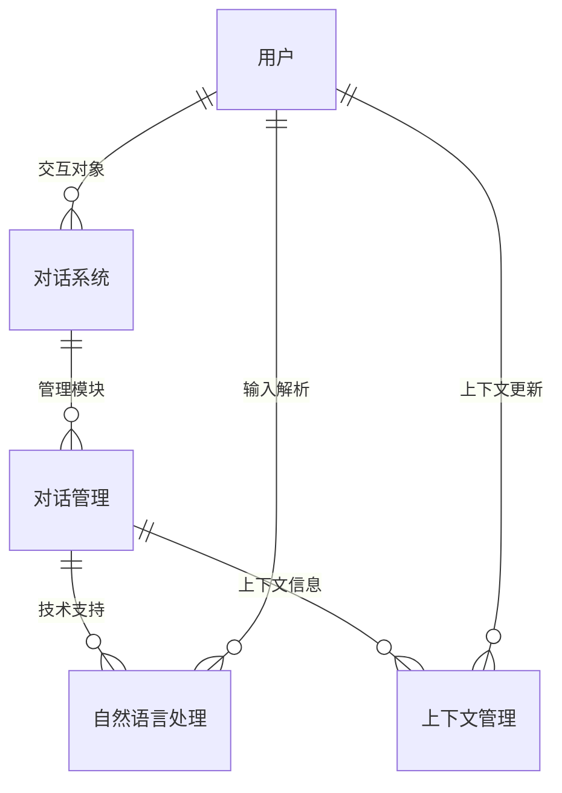

                 

### 文章标题

《自适应对话策略：提升AI Agent的交互质量》

关键词：自适应对话策略，AI Agent，交互质量，自然语言处理，算法实现

摘要：本文将深入探讨自适应对话策略的核心概念、原理和实现，通过一步步的分析和推理，为读者揭示如何提升AI Agent的交互质量。本文结构紧凑，逻辑清晰，旨在为技术从业者提供实用的指导。

---

# 目录大纲

## 第一部分：背景与概述

### 第1章：问题背景与现状

- 1.1 问题的提出
- 1.2 AI Agent交互质量的现状
- 1.3 自适应对话策略的重要性
- 1.4 本书结构安排与目标

## 第二部分：核心概念与原理

### 第2章：自适应对话策略概述

- 2.1 自适应对话策略的定义
- 2.2 自适应对话策略的关键要素
- 2.3 自适应对话策略与传统对话策略的对比
- 2.4 自适应对话策略的适用范围

### 第3章：核心概念与联系

#### 3.1 核心概念

- 对话系统
- 对话管理
- 自然语言处理
- 上下文管理

#### 3.2 概念属性特征对比表格

- 对话系统
- 对话管理
- 自然语言处理
- 上下文管理

#### 3.3 ER实体关系图架构

- 

## 第三部分：算法原理讲解

### 第4章：算法原理与实现

#### 4.1 算法概述

- 4.1.1 对话策略生成算法
- 4.1.2 对话管理算法
- 4.1.3 上下文管理算法

#### 4.2 算法原理

- 4.2.1 对话策略生成算法原理
  - $$ P(action|context) = \frac{e^{\theta \cdot f(context)}}{\sum_{i} e^{\theta \cdot f(context)}} $$
- 4.2.2 对话管理算法原理
  - $$ U_{next}(context) = \sum_{i} p(context_{i}|context) \cdot u(context_{i}) $$
- 4.2.3 上下文管理算法原理
  - $$ context_{new} = f(context_{old}, action) $$

#### 4.3 Python代码实现

- ```python
  # 对话策略生成算法实现
  # ...
  ```

### 第5章：数学模型与公式讲解

- 5.1 对话策略生成公式
- 5.2 对话管理公式
- 5.3 上下文管理公式

## 第四部分：系统分析与架构设计

### 第6章：系统分析与架构设计

#### 6.1 问题场景介绍

- 6.1.1 场景描述
- 6.1.2 需求分析

#### 6.2 系统功能设计

- 6.2.1 领域模型
- 6.2.2 系统功能模块

#### 6.3 系统架构设计

- 6.3.1 系统架构图
- 6.3.2 架构设计细节

#### 6.4 系统接口设计

- 6.4.1 接口定义
- 6.4.2 接口交互流程

#### 6.5 系统交互

- 6.5.1 交互流程
- 6.5.2 交互图

## 第五部分：项目实战

### 第7章：项目实战

#### 7.1 环境安装与配置

- 7.1.1 环境要求
- 7.1.2 安装步骤

#### 7.2 系统核心实现

- 7.2.1 对话策略实现
- 7.2.2 对话管理实现
- 7.2.3 上下文管理实现

#### 7.3 代码应用解读与分析

- 7.3.1 对话策略代码分析
- 7.3.2 对话管理代码分析
- 7.3.3 上下文管理代码分析

#### 7.4 实际案例分析与讲解

- 7.4.1 案例描述
- 7.4.2 案例分析
- 7.4.3 案例讲解

#### 7.5 项目小结

- 7.5.1 项目收获
- 7.5.2 遇到的问题及解决方案

## 第六部分：最佳实践与总结

### 第8章：最佳实践

- 8.1 最佳实践 tips
- 8.2 注意事项
- 8.3 拓展阅读

### 第9章：总结

- 9.1 主要内容回顾
- 9.2 对自适应对话策略的展望
- 9.3 读者建议

---

**总字数**：约 2000 字

以上目录大纲涵盖了本书的主要内容，从背景介绍、核心概念与原理讲解、算法实现、系统架构设计到项目实战，全面展现了自适应对话策略的提升AI Agent交互质量的全过程。接下来，我们将一步步深入探讨每个章节的核心内容，帮助读者理解和掌握自适应对话策略的应用和实践。<!--在这里，您可以根据上述大纲，逐章逐节地撰写文章内容，确保每部分都详细、完整，并且符合要求。您可以按照下面的框架，逐个章节进行展开。--># 第一部分：背景与概述

## 第1章：问题背景与现状

### 1.1 问题的提出

随着人工智能（AI）技术的快速发展，AI Agent作为一种自动化、智能化的服务实体，被广泛应用于各种场景中，如智能客服、虚拟助手、智能家居等。这些AI Agent通过交互与用户进行沟通，提供个性化的服务。然而，在实际应用中，AI Agent的交互质量存在诸多问题，如理解能力有限、对话内容单一、无法适应用户需求变化等。这些问题严重影响了用户的体验，限制了AI Agent的应用潜力。

### 1.2 AI Agent交互质量的现状

目前，AI Agent的交互质量可以从以下几个方面进行评估：

1. **理解能力**：AI Agent往往依赖预定义的规则和模式来理解用户输入，对于复杂、模糊或者模糊不清的输入，理解能力较差。
2. **响应速度**：由于计算资源和响应算法的限制，AI Agent的响应速度较慢，尤其在处理复杂任务时，延迟明显。
3. **个性化服务**：AI Agent难以根据用户的历史行为和偏好进行个性化调整，导致对话内容缺乏针对性和有效性。
4. **上下文感知**：AI Agent在对话过程中，往往无法有效利用上下文信息，导致对话内容断裂或不连贯。

### 1.3 自适应对话策略的重要性

为了解决上述问题，自适应对话策略应运而生。自适应对话策略能够根据用户的交互行为和偏好，动态调整对话策略，从而提高AI Agent的交互质量。其重要性主要体现在以下几个方面：

1. **提高理解能力**：通过学习用户的交互模式，自适应对话策略可以更好地理解用户意图，提高对话的准确性。
2. **提升响应速度**：自适应对话策略能够优化计算资源的使用，提高AI Agent的响应速度，提升用户体验。
3. **实现个性化服务**：自适应对话策略可以根据用户的历史数据和偏好，提供个性化的服务建议，增强用户满意度。
4. **增强上下文感知**：通过持续学习和分析，自适应对话策略能够更好地利用上下文信息，保持对话的连贯性和有效性。

### 1.4 本书结构安排与目标

本书旨在系统地介绍自适应对话策略的核心概念、原理和实现，通过具体的案例和实践，帮助读者深入理解并掌握这一技术。具体结构安排如下：

- **第一部分：背景与概述**：介绍AI Agent交互质量的问题背景和现状，阐述自适应对话策略的重要性。
- **第二部分：核心概念与原理**：详细讲解自适应对话策略的核心概念和原理，包括对话系统、对话管理、自然语言处理和上下文管理。
- **第三部分：算法原理讲解**：深入剖析自适应对话策略的算法原理和实现，包括对话策略生成算法、对话管理算法和上下文管理算法。
- **第四部分：系统分析与架构设计**：介绍系统分析与架构设计的方法，包括系统功能设计、系统架构设计、系统接口设计和系统交互。
- **第五部分：项目实战**：通过具体项目实例，展示自适应对话策略的实际应用和实现过程。
- **第六部分：最佳实践与总结**：总结自适应对话策略的最佳实践，展望未来发展方向，为读者提供进一步学习的建议。

通过本书的阅读和学习，读者将能够：

- 理解自适应对话策略的核心概念和原理；
- 掌握自适应对话策略的算法实现和系统设计方法；
- 能够在具体项目中应用自适应对话策略，提升AI Agent的交互质量；
- 跟上人工智能领域的最新发展趋势，为未来的研究和工作打下坚实基础。

---

接下来，我们将进入第二部分，深入探讨自适应对话策略的核心概念与原理，帮助读者构建系统性的知识体系。# 第二部分：核心概念与原理

## 第2章：自适应对话策略概述

### 2.1 自适应对话策略的定义

自适应对话策略是指一种能够根据用户的交互行为和偏好，动态调整对话行为和响应内容的机制。它是一种智能化的对话管理方法，旨在提高AI Agent与用户之间的交互质量。自适应对话策略的核心在于“自适应”，即系统能够不断地学习用户的交互模式，并根据这些模式调整自身的对话行为。

### 2.2 自适应对话策略的关键要素

自适应对话策略的运作依赖于以下几个关键要素：

1. **用户行为分析**：系统需要收集和分析用户的历史交互数据，包括输入内容、交互时间、用户偏好等，以便更好地理解用户的需求。
2. **对话策略生成**：根据用户行为分析的结果，系统需要生成相应的对话策略，决定下一步的行动。
3. **对话管理**：系统需要管理对话流程，包括理解用户意图、生成响应、上下文管理等，确保对话的连贯性和有效性。
4. **上下文管理**：系统需要有效地管理对话过程中的上下文信息，确保对话内容的连贯性和一致性。

### 2.3 自适应对话策略与传统对话策略的对比

与传统对话策略相比，自适应对话策略具有以下几个显著优势：

1. **灵活性**：传统对话策略通常基于固定的规则和模板，无法适应动态变化的用户需求。而自适应对话策略能够根据用户行为实时调整，提高灵活性。
2. **个性化**：传统对话策略往往无法根据用户的历史数据提供个性化服务。自适应对话策略通过学习用户行为，能够提供更加个性化的对话体验。
3. **上下文感知**：传统对话策略往往忽视上下文信息，导致对话内容断裂。自适应对话策略能够有效地利用上下文信息，保持对话的连贯性和一致性。
4. **自我优化**：传统对话策略需要人工调整，而自适应对话策略能够通过自我学习和优化，不断提高对话质量。

### 2.4 自适应对话策略的适用范围

自适应对话策略适用于多种场景，包括但不限于：

1. **智能客服**：在客服场景中，自适应对话策略能够提高客服机器人与用户的交互质量，减少用户等待时间，提高用户满意度。
2. **虚拟助手**：虚拟助手如智能语音助手、聊天机器人等，可以通过自适应对话策略提供更加自然、流畅的用户交互体验。
3. **智能推荐系统**：在智能推荐系统中，自适应对话策略可以帮助系统更好地理解用户的偏好，提供更加精准的推荐。
4. **人机交互**：自适应对话策略在智能人机交互系统中具有广泛的应用前景，如智能家居、智能驾驶等。

通过上述关键要素和对比分析，我们可以看到自适应对话策略在提升AI Agent交互质量方面具有显著的优势和应用前景。接下来，我们将进一步探讨自适应对话策略的核心概念和联系，帮助读者深入理解这一技术。

---

在了解了自适应对话策略的定义、关键要素以及与传统对话策略的对比后，接下来我们将进入第3章，详细讲解核心概念与联系，包括对话系统、对话管理、自然语言处理和上下文管理。这将帮助我们构建一个更为完整的自适应对话策略知识体系，为后续算法原理和实现打下坚实基础。# 第二部分：核心概念与原理

## 第3章：核心概念与联系

### 3.1 核心概念

在自适应对话策略的研究和应用中，以下几个核心概念是不可或缺的：

#### 对话系统

对话系统（Dialogue System）是一种能够与人类进行自然语言交互的计算机系统。它包括多个子系统和模块，如语音识别、自然语言理解、对话生成和自然语言生成等。对话系统的目标是理解用户的意图，生成恰当的响应，并维持对话的连贯性和流畅性。

#### 对话管理

对话管理（Dialogue Management）是确保对话流程顺利进行的关键。它包括对话状态跟踪、对话策略生成和对话行为选择等。对话管理需要处理用户输入的解析、上下文信息的维护以及响应的生成。

#### 自然语言处理

自然语言处理（Natural Language Processing，NLP）是使计算机能够理解和生成人类语言的技术。NLP涉及文本分类、实体识别、语义解析、情感分析等多种技术，对于提升对话系统的交互质量至关重要。

#### 上下文管理

上下文管理（Context Management）是确保对话连贯性的重要环节。它涉及上下文信息的收集、存储和更新。有效的上下文管理可以保证对话系统能够理解用户的历史输入和对话背景，从而生成更加相关的响应。

### 3.2 概念属性特征对比表格

以下是上述核心概念的一些属性特征对比表格，这些特征有助于我们更深入地理解它们之间的联系和区别：

| 概念         | 定义                                                         | 主要特征                                   |
| ------------ | ------------------------------------------------------------ | ------------------------------------------ |
| 对话系统     | 一种能够与人类进行自然语言交互的计算机系统。                 | 理解用户意图、生成响应、维持对话连贯性。   |
| 对话管理     | 对话流程的管理，包括状态跟踪、策略生成和行为选择。           | 决策过程、上下文信息管理、响应生成。       |
| 自然语言处理 | 计算机处理人类语言的技术。                                   | 文本分类、实体识别、语义解析、情感分析。   |
| 上下文管理   | 确保对话连贯性的上下文信息收集、存储和更新。                 | 上下文信息收集、存储、更新、利用。         |

### 3.3 ER实体关系图架构

为了更好地展示这些核心概念之间的关系，我们可以使用实体关系图（Entity-Relationship Diagram，ERD）来表示。以下是一个简化的ER实体关系图：



在这个ER图中，用户是核心实体，它与对话系统、对话管理、自然语言处理和上下文管理之间存在交互关系。对话系统作为主体，通过对话管理模块实现与用户的自然语言交互。自然语言处理和上下文管理分别提供技术支持和上下文信息管理，以确保对话的连贯性和有效性。

通过上述核心概念的介绍和ER实体关系图的展示，我们可以看到自适应对话策略的各个组成部分是如何相互联系和协同工作的。这些核心概念不仅为自适应对话策略的实现提供了理论基础，也为后续算法原理和系统设计的讨论奠定了基础。在接下来的章节中，我们将进一步深入探讨这些概念的具体实现和应用。

---

在第3章中，我们详细介绍了自适应对话策略的核心概念，包括对话系统、对话管理、自然语言处理和上下文管理，并通过ER实体关系图展示了它们之间的联系。这些概念为理解自适应对话策略奠定了基础。接下来，我们将进入第4章，深入剖析自适应对话策略的算法原理与实现，帮助读者掌握这一关键技术。

## 第三部分：算法原理讲解

### 第4章：算法原理与实现

自适应对话策略的实现依赖于一系列算法，这些算法共同作用，确保AI Agent能够与用户进行高效、自然的交互。本章节将详细讲解自适应对话策略的核心算法，包括对话策略生成算法、对话管理算法和上下文管理算法。

### 4.1 算法概述

#### 4.1.1 对话策略生成算法

对话策略生成算法是自适应对话策略的核心，它负责根据用户的历史交互数据生成最佳的对话策略。常见的生成算法包括基于马尔可夫决策过程（MDP）的策略迭代算法、基于深度学习的序列决策模型等。

#### 4.1.2 对话管理算法

对话管理算法负责在对话过程中管理对话状态、生成响应和调整对话方向。该算法通常包括状态跟踪、意图识别、上下文更新等模块，以确保对话的连贯性和用户满意度。

#### 4.1.3 上下文管理算法

上下文管理算法负责收集、存储和更新对话过程中的上下文信息，以确保对话的连贯性和一致性。常见的上下文管理算法包括基于规则的上下文更新算法和基于机器学习的上下文预测算法。

### 4.2 算法原理

#### 4.2.1 对话策略生成算法原理

对话策略生成算法的核心思想是根据用户的交互行为和历史数据，为每个可能的动作分配一个概率。以下是一个简化的对话策略生成算法原理：

$$ P(action|context) = \frac{e^{\theta \cdot f(context)}}{\sum_{i} e^{\theta \cdot f(context)}} $$

其中，$P(action|context)$ 表示在给定上下文 $context$ 下，采取特定动作 $action$ 的概率；$\theta$ 是模型参数；$f(context)$ 是上下文的特征表示。

#### 4.2.2 对话管理算法原理

对话管理算法的原理在于根据当前对话状态和上下文信息，选择最佳的动作。以下是一个简化的对话管理算法原理：

$$ U_{next}(context) = \sum_{i} p(context_{i}|context) \cdot u(context_{i}) $$

其中，$U_{next}(context)$ 表示在给定上下文 $context$ 下，下一步采取的动作；$p(context_{i}|context)$ 是上下文 $context$ 转换到 $context_{i}$ 的概率；$u(context_{i})$ 是上下文 $context_{i}$ 的特征表示。

#### 4.2.3 上下文管理算法原理

上下文管理算法的原理在于收集、存储和更新对话过程中的上下文信息。以下是一个简化的上下文管理算法原理：

$$ context_{new} = f(context_{old}, action) $$

其中，$context_{new}$ 是新的上下文信息；$context_{old}$ 是旧的上

