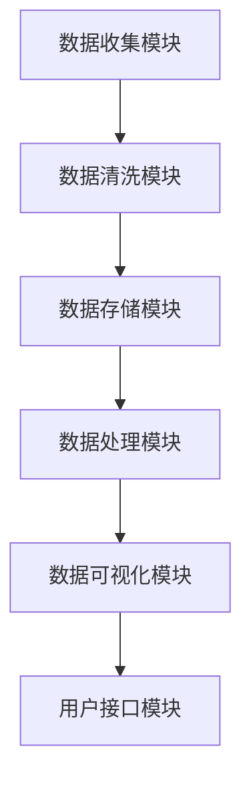
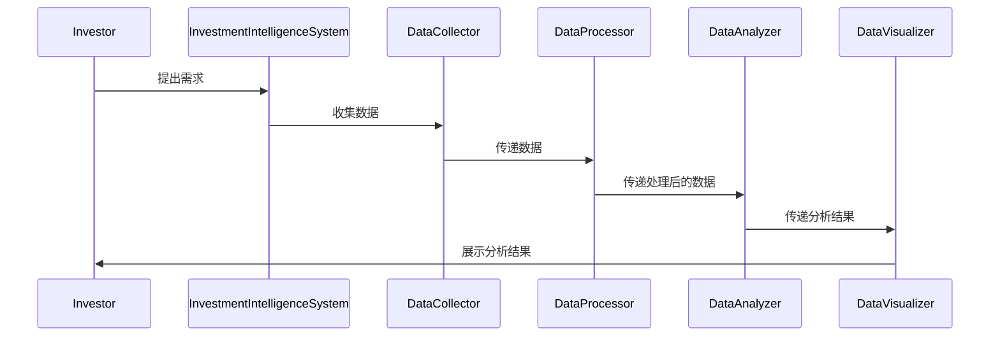

                 

### 1.1 问题背景

在现代金融市场中，投资决策的复杂性和不确定性日益增加，信息不对称成为投资成功与否的关键因素。菲利普·费雪（Philip Fisher）被誉为“成长股投资之父”，他的投资哲学强调对企业的深入理解和长远眼光。费雪认为，投资者不仅要关注企业的财务数据，更要关注企业的潜在成长能力和发展前景。因此，建立一个有效的投资情报系统，对于提高投资决策的准确性和效率至关重要。

投资情报系统是一种能够收集、处理、评估并利用投资相关信息的技术和工具体系。它的核心在于通过系统化、结构化的信息处理方法，帮助投资者在纷繁复杂的市场中找到有价值的信息，进而做出更加科学和合理的投资决策。费雪的信息网络理论正是基于这一理念，通过构建一个高效的信息收集和处理系统，为投资者提供了强大的情报支持。

在费雪的投资哲学中，信息网络不仅是一个工具，更是一种思维方式。他主张投资者应该建立一个广泛而深入的信息网络，这个网络可以涵盖从公司内部管理到行业外部环境的各个方面。通过这个网络，投资者能够及时、准确地获取到各类信息，并对这些信息进行深入分析和综合评估，从而做出更加明智的投资决策。

本文将围绕菲利普·费雪的信息网络理论，探讨如何建立和运用一个投资情报系统。文章将从以下几个方面展开讨论：

1. **投资情报系统的必要性**：分析投资决策中的信息不对称问题，阐述投资情报系统的重要性。
2. **费雪的信息网络概念**：介绍费雪的信息网络理论，包括其基本原理和构建方法。
3. **建立投资情报系统的步骤**：详细阐述建立投资情报系统的步骤和方法，包括系统设计、开发、测试和维护。
4. **投资情报系统的应用实例**：通过成功和失败案例，分析投资情报系统的实际应用效果。
5. **投资情报系统的风险管理**：探讨投资情报系统在风险管理中的应用，以及如何应对潜在的风险。

通过以上内容的讨论，本文旨在为投资者提供一套完整的投资情报系统建立和应用的指导，帮助他们在复杂的投资环境中更好地把握机会，降低风险，实现投资目标。

### 1.2 问题描述

在投资决策过程中，信息不对称问题是一个普遍且严重的问题。所谓信息不对称，指的是投资者与市场信息的不对称，即投资者无法获取到所有与投资相关的信息，或者获取到的信息比市场中的其他投资者少。这种信息劣势会导致投资者在决策时面临较大的不确定性，从而影响投资效果。

信息不对称问题主要体现在以下几个方面：

1. **市场信息的滞后性**：由于市场的动态变化非常迅速，投资者往往无法及时获取到最新的市场信息，导致决策时基于过时的数据。
2. **信息的不完整性**：投资者获取的信息往往不完整，可能会遗漏重要的细节，从而影响投资判断。
3. **信息的不真实性**：市场上存在大量虚假或误导性的信息，投资者难以辨别信息的真实性，容易受到信息误导。

这些信息不对称问题对投资决策产生了显著的影响。首先，信息滞后性和不完整性会导致投资者对市场情况的判断不准确，进而影响投资策略的选择。其次，信息的不真实性会误导投资者，导致错误的投资决策。例如，投资者可能因为被虚假信息所迷惑，而盲目跟风，最终导致亏损。

为了解决这些信息不对称问题，投资者需要建立一个有效的投资情报系统。投资情报系统可以通过以下方式提高投资决策的准确性：

1. **信息收集**：通过多种渠道广泛收集与投资相关的信息，确保信息的全面性和及时性。
2. **信息处理**：对收集到的信息进行清洗、分析和整合，提取出有价值的信息，去除噪音和误导性信息。
3. **信息评估**：对处理后的信息进行评估和筛选，确定其可靠性和相关性，为投资决策提供依据。

菲利普·费雪的信息网络理论正是基于这一需求，提出了一种通过系统化、结构化的方法来建立投资情报系统的理论框架。费雪认为，投资者需要建立一个广泛而深入的信息网络，通过这个网络，投资者能够及时、准确地获取到各类信息，并对这些信息进行深入分析和综合评估，从而做出更加明智的投资决策。

投资情报系统的重要性在于：

1. **提高决策效率**：通过系统化的信息处理方法，投资者能够快速、准确地获取和处理信息，提高决策效率。
2. **降低风险**：通过全面、深入的信息分析，投资者能够更好地识别和管理风险，降低投资风险。
3. **增强竞争优势**：拥有高效的投资情报系统，投资者能够比其他投资者更快、更准确地做出投资决策，从而在市场中获得竞争优势。

总之，投资情报系统在解决信息不对称问题、提高投资决策准确性和降低风险方面发挥着重要作用。菲利普·费雪的信息网络理论为投资者提供了一种建立和运用投资情报系统的有效方法，通过这一方法，投资者能够在复杂的投资环境中更好地把握机会，实现投资目标。

### 1.3 问题解决

菲利普·费雪的信息网络理论提供了一套系统的解决方案，帮助投资者解决投资决策中的信息不对称问题。费雪认为，建立一个高效的投资情报系统是实现投资成功的关键。以下将详细介绍费雪的信息网络概念及其构建方法。

#### 1.3.1 费雪的信息网络概念

费雪的信息网络是指一个由多个信息节点和连接线构成的复杂网络系统，这些节点和连接线分别代表不同的信息来源、信息处理方法和信息传递渠道。费雪的信息网络包括以下几个核心组成部分：

1. **信息源**：信息源是信息网络的起点，包括公开信息源和非公开信息源。公开信息源如公司财务报表、市场研究报告、新闻媒体等；非公开信息源则包括与公司内部人士的交流、行业内部会议等。
2. **信息处理模块**：信息处理模块负责对收集到的信息进行清洗、分析、整合和评估，提取出有价值的信息。这一模块通常包括数据收集、数据清洗、数据分析、数据可视化等子模块。
3. **信息传递渠道**：信息传递渠道是信息在网络中传递的路径，包括电子邮件、电话、会议、报告等多种形式。
4. **信息用户**：信息用户是信息网络的最终受益者，即投资者。他们通过信息网络获取到的信息，用于投资决策。

费雪的信息网络具有以下几个显著特点：

1. **全面性**：信息网络覆盖了投资决策所需的各种信息，包括财务数据、市场趋势、行业动态、公司内部信息等，确保信息的全面性。
2. **实时性**：信息网络能够实时地收集和处理信息，确保投资者能够及时获得最新的市场信息。
3. **系统性**：信息网络通过系统化的方法对信息进行处理和评估，提高了信息的准确性和可靠性。

#### 1.3.2 建立投资情报系统的步骤

根据费雪的信息网络理论，建立投资情报系统可以分为以下几个步骤：

1. **确定目标和需求**：明确投资情报系统的目标和需求，包括信息收集、处理和评估的具体要求。
2. **设计系统架构**：根据目标和需求，设计投资情报系统的架构，确定各个模块的功能和相互关系。
3. **选择技术工具**：选择合适的技术工具和平台，包括数据收集工具、数据处理工具、数据分析工具等。
4. **系统开发**：按照设计好的架构，开发投资情报系统，包括信息收集模块、信息处理模块、信息传递渠道等。
5. **系统测试与优化**：对开发完成的系统进行测试，确保其功能符合预期，并进行优化，提高系统的性能和稳定性。
6. **系统部署与维护**：将系统部署到生产环境，并持续进行维护和更新，确保系统的长期稳定运行。

#### 1.3.3 构建方法

构建投资情报系统的方法可以分为以下几个阶段：

1. **信息收集**：
    - **数据源的选择**：选择可靠且多样化的数据源，包括公开数据源和非公开数据源。
    - **数据收集方法**：采用自动化工具和手动收集相结合的方法，确保数据的及时性和完整性。
2. **信息处理**：
    - **数据清洗**：使用数据清洗工具，去除重复数据、缺失数据和错误数据。
    - **数据分析**：使用数据分析工具，对清洗后的数据进行深度分析，提取有价值的信息。
3. **信息评估**：
    - **评估指标**：定义评估指标，如数据准确性、数据完整性、信息及时性等。
    - **评估方法**：使用定量和定性方法，对信息进行评估，确定其可靠性和相关性。

通过以上步骤和构建方法，投资者可以建立一套高效、可靠的投资情报系统，从而在投资决策过程中更好地应对信息不对称问题，提高投资决策的准确性和效率。

### 1.4 边界与外延

#### 1.4.1 投资情报系统的适用范围

菲利普·费雪的信息网络理论适用于各种类型的投资决策，包括股票、债券、基金、房地产等。不同类型的投资对信息的需求有所不同，但费雪的信息网络理论提供了一套通用的框架和方法，帮助投资者系统化地收集、处理和利用信息。

在股票投资中，信息网络特别重要，因为股票市场的波动性和不确定性较大。投资者需要及时获取公司的财务报表、市场动态、行业趋势等关键信息，以便做出合理的投资决策。费雪的信息网络可以帮助投资者在海量的信息中筛选出有价值的信息，提高决策的准确性和效率。

在债券投资中，信息网络同样重要。债券投资者需要关注债券发行方的信用状况、宏观经济环境、市场利率变化等因素，以便评估债券的风险和收益。费雪的信息网络可以通过多渠道收集和整合这些信息，帮助投资者做出更科学的投资决策。

基金投资和房地产投资也可以运用费雪的信息网络理论。基金投资者需要关注基金的投资组合、市场表现、管理团队的背景等；房地产投资者需要关注房地产市场的供需情况、政策变化、地段优势等。费雪的信息网络能够为这些类型的投资提供全面、及时和准确的信息支持。

#### 1.4.2 投资情报系统与风险管理

投资情报系统在风险管理中扮演着重要角色。风险管理是投资过程中不可或缺的一部分，它涉及到识别、评估、应对和监控投资风险。费雪的信息网络理论通过系统化的信息收集和处理方法，为风险管理提供了强有力的支持。

首先，信息网络可以帮助投资者识别潜在的风险。通过广泛收集和分析市场信息，投资者可以及时了解市场动态和行业趋势，识别出可能影响投资决策的风险因素。例如，如果市场有迹象表明某行业面临重大政策变化或技术变革，投资者可以提前做好准备，规避相关风险。

其次，信息网络可以帮助投资者评估风险。投资者通过信息网络获取到的信息，可以对投资项目的风险进行定量和定性分析，评估其风险水平。例如，通过分析公司的财务报表和行业数据，投资者可以评估公司的信用风险、市场风险和操作风险等。

最后，信息网络可以帮助投资者应对和监控风险。投资者可以根据评估结果，制定相应的风险应对策略，如分散投资、风险规避、风险转移等。同时，信息网络可以实时监控投资组合的风险状况，及时发现新的风险因素，并进行调整。

总之，费雪的信息网络理论为投资者提供了一个全面的工具，帮助他们在复杂的市场环境中进行有效的风险管理。通过系统化、结构化的信息处理方法，投资者可以更好地识别、评估和应对风险，从而实现投资目标。

### 1.5 概念结构与核心要素组成

建立投资情报系统的过程涉及到多个关键概念和要素，它们相互作用，共同构成了一个高效、可靠的情报系统。以下将详细探讨这些核心概念及其相互关系，并绘制ER实体关系图，以直观地展示系统的组成结构。

#### 1.5.1 投资情报系统的基本结构

投资情报系统可以看作是一个由多个子系统和功能模块组成的复杂网络。这些子系统和功能模块通过特定的关系和接口相互连接，共同实现情报的收集、处理、评估和利用。以下是投资情报系统的基本结构：

1. **信息源**：信息源是情报系统的起点，包括公开和非公开的信息来源。公开信息源如公司财报、市场研究报告、新闻媒体等；非公开信息源则包括与公司内部人士的交流、行业内部会议等。

2. **信息收集模块**：负责从各类信息源中收集数据，并将其转换为结构化的数据格式，便于后续处理。信息收集模块包括自动化工具和手动收集方式。

3. **信息处理模块**：对收集到的数据进行分析、清洗、整合和评估，提取有价值的信息。信息处理模块包括数据清洗工具、数据分析工具、数据可视化工具等。

4. **信息评估模块**：对处理后的信息进行评估，确定其可靠性、相关性和有效性。信息评估模块通常包括定量和定性评估方法。

5. **信息传递渠道**：负责将评估后的信息传递给投资者或其他利益相关者。信息传递渠道包括电子邮件、电话、报告等多种形式。

6. **信息用户**：即投资者或其他利用情报进行决策的用户。

#### 1.5.2 核心要素及其相互作用

投资情报系统的核心要素包括信息源、信息收集模块、信息处理模块、信息评估模块、信息传递渠道和信息用户。这些要素之间的相互作用如下：

1. **信息源**与**信息收集模块**：信息源为信息收集模块提供原始数据，信息收集模块将这些数据转换为结构化数据，便于后续处理。

2. **信息收集模块**与**信息处理模块**：信息收集模块将结构化数据传递给信息处理模块，信息处理模块对这些数据进行分析、清洗和整合。

3. **信息处理模块**与**信息评估模块**：信息处理模块将处理后的信息传递给信息评估模块，信息评估模块对信息进行可靠性、相关性和有效性的评估。

4. **信息评估模块**与**信息传递渠道**：信息评估模块将评估后的信息传递给信息传递渠道，信息传递渠道将这些信息传递给信息用户。

5. **信息用户**与**信息传递渠道**：信息用户通过信息传递渠道获取到评估后的信息，并用于投资决策。

#### 1.5.3 ER实体关系图架构

为了更直观地展示投资情报系统的组成结构，我们使用ER（实体-关系）图来描述系统的实体和关系。以下是投资情报系统的ER图：

```mermaid
erDiagram
    信息源 ||--|{ 信息收集模块 }
    信息收集模块 ||--|{ 信息处理模块 }
    信息处理模块 ||--|{ 信息评估模块 }
    信息评估模块 ||--|{ 信息传递渠道 }
    信息传递渠道 ||--|{ 信息用户 }
```

在这个ER图中，每个实体都表示系统中的一个关键组成部分，实体之间的关系则表示这些组成部分之间的相互作用。信息源是整个系统的起点，通过信息收集模块收集数据，然后传递给信息处理模块进行分析和处理。处理后的信息由信息评估模块进行评估，最终通过信息传递渠道传递给信息用户。

通过ER图，我们可以清楚地看到投资情报系统的各个组成部分及其相互关系，这有助于理解系统的运作机制和优化系统的设计。

### 1.6 本章小结

本章从问题背景、问题描述、问题解决、边界与外延以及概念结构与核心要素组成等方面，对菲利普·费雪的信息网络理论进行了全面探讨。首先，介绍了投资决策中信息不对称问题的普遍性和严重性，阐述了投资情报系统的必要性。接着，详细介绍了费雪的信息网络概念及其构建方法，包括信息源、信息收集模块、信息处理模块、信息评估模块、信息传递渠道和信息用户等核心组成部分。此外，还分析了投资情报系统的适用范围和风险管理的重要性，并通过ER实体关系图展示了系统的基本结构和核心要素的相互作用。通过本章的讨论，读者可以初步了解投资情报系统的概念和重要性，为后续章节的深入探讨打下基础。

### 2.1 信息网络理论

#### 2.1.1 信息网络的基本原理

信息网络理论是研究信息在系统中流动、存储、处理和传递的学科。其基本原理可以概括为以下几点：

1. **信息的流动**：信息在网络中通过节点和连接线进行流动。节点代表信息的接收者和发送者，连接线代表信息传输的路径。
2. **信息处理**：信息在网络中不仅要流动，还需要进行处理。信息处理包括信息的收集、清洗、整合、分析和评估等多个环节。
3. **信息的存储**：信息在网络中需要被存储，以便在需要时进行查询和利用。信息存储可以通过数据库、数据仓库等多种方式进行。
4. **信息的传递**：信息的传递需要通过特定的渠道进行，如电子邮件、电话、会议等。信息传递的效率和可靠性直接影响投资决策的准确性。

#### 2.1.2 信息网络的类型与特征

信息网络可以根据不同的分类标准进行分类，常见的分类方法包括以下几种：

1. **按信息源类型分类**：
    - **公开信息网络**：通过公开渠道获取的信息网络，如互联网、公共数据库等。
    - **非公开信息网络**：通过非公开渠道获取的信息网络，如内部报告、行业会议等。
  
2. **按信息处理方法分类**：
    - **自动化信息网络**：通过自动化工具和算法进行信息处理的信息网络，如数据挖掘、机器学习等。
    - **人工信息网络**：主要通过人工收集和处理信息的信息网络，如市场调研、面对面访谈等。

3. **按信息应用领域分类**：
    - **金融信息网络**：专门用于金融投资决策的信息网络，如费雪的信息网络。
    - **医疗信息网络**：用于医疗数据收集、处理和应用的系统，如电子健康记录系统。
    - **物流信息网络**：用于物流管理的信息网络，如供应链管理系统。

不同类型的信息网络具有以下特征：

- **公开信息网络**：信息来源广泛、获取方便，但信息的真实性和准确性难以保证。
- **非公开信息网络**：信息来源有限，但信息通常具有较高的真实性和可靠性。
- **自动化信息网络**：信息处理速度快、效率高，但需要大量的技术支持和算法优化。
- **人工信息网络**：信息处理较为灵活、多样，但效率较低，依赖于人工的判断和经验。

#### 2.1.3 信息网络的构建方法

建立一个高效的信息网络需要遵循一定的构建方法和原则，以下是构建信息网络的一些关键步骤：

1. **需求分析**：明确信息网络的目标和应用场景，确定所需信息类型、信息处理方法和信息传递渠道。
2. **设计系统架构**：根据需求分析结果，设计信息网络的架构，包括信息源、信息处理模块、信息评估模块、信息传递渠道等。
3. **选择技术工具**：选择合适的技术工具和平台，如数据库、数据分析工具、数据可视化工具等。
4. **系统开发**：根据设计好的架构，开发信息网络系统，包括信息收集模块、信息处理模块、信息评估模块等。
5. **系统测试与优化**：对开发完成的系统进行测试，确保其功能符合预期，并进行优化，提高系统的性能和稳定性。
6. **系统部署与维护**：将系统部署到生产环境，并持续进行维护和更新，确保系统的长期稳定运行。

构建信息网络时，还需要注意以下几点：

- **信息源的选择**：选择可靠且多样化的信息源，确保信息的全面性和真实性。
- **信息处理方法**：采用先进的处理方法和技术，如数据挖掘、机器学习等，提高信息处理的效率和准确性。
- **信息评估标准**：制定科学的评估标准，对信息进行可靠性、相关性和有效性的评估，确保信息的质量。
- **信息安全管理**：确保信息的安全性和隐私性，防止信息泄露和滥用。

通过以上构建方法和原则，投资者可以建立一套高效、可靠的投资情报系统，从而在复杂的市场环境中更好地应对信息不对称问题，提高投资决策的准确性和效率。

### 2.2 投资情报系统的构建要素

建立一个高效的投資情报系统，需要明确各构建要素及其具体内容。以下是构建投资情报系统的关键要素及其详细说明：

#### 2.2.1 信息收集

信息收集是投资情报系统的核心，其目的是从各种渠道获取与投资相关的信息。以下是信息收集的两个重要方面：

1. **数据源的选择**：
   - **公开数据源**：包括公司财务报表、市场研究报告、行业动态等。这些数据通常可以通过互联网和公共数据库获取，如财经网站、证券交易所、政府统计部门等。
   - **非公开数据源**：包括公司内部报告、行业内部会议记录、与公司高管的交流等。这些数据通常需要通过特定的渠道获取，如行业内部网络、私人关系等。

2. **数据收集方法**：
   - **自动化工具**：使用自动化工具，如爬虫、API接口等，从互联网和其他数据源中自动抓取数据。这些工具可以大幅提高数据收集的效率和准确性。
   - **手动收集**：对于一些非公开数据，可能需要手动收集，如通过电话、邮件、会议等方式与相关人员沟通获取数据。手动收集虽然效率较低，但能确保数据的真实性和可靠性。

#### 2.2.2 信息处理

信息处理是投资情报系统的另一个关键环节，其目的是对收集到的信息进行清洗、分析和整合，提取出有价值的信息。以下是信息处理的具体步骤：

1. **数据清洗**：
   - **去重**：去除重复的数据，确保数据的唯一性。
   - **补全缺失数据**：对于缺失的数据，通过插值法、均值法等手段进行补全，提高数据的完整性。
   - **去除噪声数据**：去除错误的数据，如明显的异常值和虚假数据。

2. **数据分析**：
   - **描述性分析**：对数据的基本统计特征进行分析，如均值、中位数、标准差等，了解数据的分布情况。
   - **相关性分析**：分析不同数据变量之间的相关性，确定哪些变量对投资决策有重要影响。
   - **预测分析**：利用机器学习算法，如回归分析、时间序列分析等，对未来的市场趋势进行预测。

3. **数据整合**：
   - **数据融合**：将来自不同来源的数据进行整合，形成一个统一的数据视图。
   - **数据标准化**：将不同数据源的数据进行标准化处理，如单位转换、比例换算等，确保数据的一致性和可比性。

#### 2.2.3 信息评估

信息评估是对处理后的信息进行可靠性、相关性和有效性评估的过程，其目的是确保信息的质量，为投资决策提供依据。以下是信息评估的两个重要方面：

1. **评估指标**：
   - **数据准确性**：数据是否真实、可靠，是否反映了实际状况。
   - **数据完整性**：数据是否完整，是否包含所有必要的信息。
   - **信息及时性**：数据是否及时更新，是否能够反映最新的市场动态。

2. **评估方法**：
   - **定量评估**：使用数学模型和统计方法对信息进行评估，如回归分析、相关系数计算等。
   - **定性评估**：通过专家意见、问卷调查等方法对信息进行评估，确定其可靠性。

通过明确和优化这些构建要素，投资者可以建立一套高效、可靠的投资情报系统，从而在复杂的市场环境中更好地把握投资机会，降低风险，实现投资目标。

### 2.2.1 数据源的选择

在构建投资情报系统时，选择合适的**数据源**是至关重要的一步。数据源的质量直接影响情报系统的准确性和有效性。以下是几种常见的数据源类型及其特点：

#### 1. 公开数据源

公开数据源是指那些可以通过公开渠道获取的数据，这些数据通常具有高度的透明度和可靠性。以下是几种常见的公开数据源：

1. **公司财务报表**：公司财务报表是投资者了解公司财务状况的重要来源。这些报表通常包括资产负债表、利润表和现金流量表，提供了公司财务健康的关键指标。
   
2. **市场研究报告**：市场研究报告通常由专业机构或咨询公司发布，涵盖了行业趋势、市场动态、竞争格局等方面的内容。这些报告为投资者提供了行业和市场的深度分析。

3. **新闻媒体**：新闻媒体提供了大量关于公司、行业和市场的新闻和报道，有助于投资者了解事件发展和市场情绪。

4. **证券交易所和金融监管机构**：证券交易所和金融监管机构发布的数据包括股票交易数据、公司公告、政策法规等，是投资者获取权威金融信息的重要来源。

#### 2. 非公开数据源

非公开数据源通常是指那些不对外公开的数据，这些数据通常具有更高的价值和可靠性，但获取难度也更大。以下是几种常见的非公开数据源：

1. **公司内部报告**：公司内部报告包括战略计划、管理报告、财务预算等，提供了公司内部运营和决策的详细信息。

2. **行业内部会议记录**：行业内部会议记录通常包括行业专家、公司高管和分析师的讨论和预测，是了解行业趋势和前景的重要资料。

3. **与公司高管的交流**：通过与公司高管的交流，投资者可以获得第一手的信息和洞察，这些信息通常对投资决策具有指导意义。

4. **行业内部数据库**：一些行业内部的数据库收集了大量的专业数据，如专利数据库、客户数据库等，这些数据对于深入分析行业和公司具有重要价值。

#### 3. 选择标准

在选择数据源时，需要考虑以下几个关键标准：

1. **数据质量**：数据源的可靠性、准确性和完整性是选择数据源的首要标准。投资者应优先选择那些数据质量高、来源可靠的数据源。

2. **数据更新频率**：市场变化迅速，投资者需要获取最新、最及时的数据。因此，数据更新频率也是选择数据源时需要考虑的一个重要因素。

3. **数据获取难度**：不同的数据源获取难度不同，公开数据源相对容易获取，而非公开数据源通常需要特定的渠道和权限。投资者应根据自身的资源和能力，选择合适的数据源。

4. **数据相关性**：数据源是否与投资决策相关也是选择数据源时需要考虑的因素。投资者应选择与投资目标紧密相关的数据源，以确保数据的实用性和有效性。

通过合理选择数据源，投资者可以建立一个全面、可靠的情报系统，从而在复杂的市场环境中更好地把握投资机会，做出更加科学和合理的投资决策。

#### 2.2.2 数据收集方法

在建立投资情报系统时，数据收集方法的选择至关重要。高效且全面的数据收集方法能够确保数据的准确性和及时性，为后续的数据处理和分析提供可靠的基础。以下是几种常见的**数据收集方法**及其具体操作步骤：

1. **自动化工具**

自动化工具是现代投资情报系统中最常用的数据收集方法之一。通过自动化工具，投资者可以批量、高效地获取大量数据，减少人工操作的时间和误差。以下是自动化数据收集的步骤：

   - **选择合适的自动化工具**：市面上有许多自动化工具，如爬虫、API接口、数据采集软件等。投资者应根据需求选择适合的工具。
   - **配置数据源**：配置自动化工具的数据源，指定需要收集的数据类型和数据范围。
   - **设置数据收集频率**：根据投资需求，设置数据收集的频率，如每天、每周或每月。
   - **启动数据收集**：运行自动化工具，开始数据收集过程。
   - **监控数据收集进度**：定期监控数据收集进度，确保数据收集的顺利进行。

2. **手动收集**

手动收集方法适用于需要获取非公开数据或特定信息的情况。虽然手动收集效率较低，但能够确保数据的真实性和准确性。以下是手动数据收集的步骤：

   - **确定数据需求**：明确需要收集的数据类型和具体内容。
   - **寻找数据来源**：根据数据需求，确定数据来源，如公司内部报告、行业会议记录、与高管的交流等。
   - **制定数据收集计划**：制定详细的数据收集计划，包括收集时间、收集方式等。
   - **收集数据**：通过面对面访谈、电话询问、邮件交流等方式，获取所需数据。
   - **数据整理和录入**：将收集到的数据整理和录入到系统中，确保数据的完整性和准确性。

3. **数据挖掘**

数据挖掘是一种通过分析和挖掘大量数据，从中发现潜在模式和关联关系的方法。通过数据挖掘，投资者可以获取到更多深层次的信息。以下是数据挖掘的步骤：

   - **数据准备**：清洗和预处理原始数据，确保数据的质量和一致性。
   - **选择挖掘算法**：根据数据特点和挖掘目标，选择合适的算法，如回归分析、聚类分析、关联规则挖掘等。
   - **运行数据挖掘算法**：运行所选算法，对数据进行挖掘分析。
   - **解读挖掘结果**：分析挖掘结果，提取有价值的信息和模式。
   - **数据可视化**：使用数据可视化工具，将挖掘结果以图表、报表等形式展示，便于理解和分析。

通过结合自动化工具、手动收集和数据挖掘等方法，投资者可以构建一个全面、高效的情报系统，从而在复杂的市场环境中更好地把握投资机会，做出更加科学和合理的投资决策。

#### 2.2.2.2 数据清洗

数据清洗是数据预处理过程中至关重要的一步，其目的是去除数据中的噪声、错误和重复信息，提高数据的准确性和一致性。以下是数据清洗的主要步骤和常用方法：

1. **去除重复数据**：
   - **识别重复数据**：通过比较数据项的唯一性标识（如ID号、公司名称等），识别重复的数据记录。
   - **删除重复数据**：将识别出的重复数据删除，确保数据的唯一性。

2. **处理缺失数据**：
   - **填补缺失数据**：使用统计方法，如均值填补、中值填补、插值法等，填补缺失的数据值。
   - **删除缺失数据**：如果缺失的数据量较大，可以考虑删除包含缺失数据的记录，以减少数据的不完整性。

3. **处理异常值**：
   - **识别异常值**：使用统计学方法，如箱线图、Z-score法等，识别异常值。
   - **处理异常值**：对于识别出的异常值，可以根据具体情况决定是否删除、修改或保留。

4. **标准化数据**：
   - **统一数据格式**：将不同来源的数据格式统一，如将日期格式统一为YYYY-MM-DD。
   - **数据转换**：将不同单位的数据转换为相同单位，如将货币单位转换为美元。

5. **纠正错误数据**：
   - **数据验证**：使用数据验证规则，如电子邮件格式验证、电话号码验证等，检查数据是否正确。
   - **修正错误**：对于识别出的错误数据，进行修正或更新。

6. **去噪数据**：
   - **过滤噪声**：使用滤波器或过滤器，去除数据中的噪声和干扰信息。
   - **数据平滑**：使用平滑技术，如移动平均、指数平滑等，减少数据的波动。

通过以上数据清洗步骤，投资者可以确保数据的质量，提高后续分析的有效性，从而为投资决策提供可靠的数据支持。

#### 2.2.2.2 数据清洗：处理缺失数据和异常值

数据清洗过程中，处理缺失数据和异常值是确保数据质量的重要环节。以下详细介绍如何处理缺失数据和异常值，并提供具体示例：

1. **处理缺失数据**：

   - **填补缺失数据**：

     **示例**：假设我们有一份公司销售数据，其中某个月份的销售记录缺失。可以使用中值填补法来填补这个缺失值。步骤如下：

     ```python
     import numpy as np
     
     # 假设销售数据为列表
     sales_data = [1000, 1200, np.nan, 800, 1500]
     
     # 计算中位数
     median_sales = np.median(sales_data)
     
     # 用中位数填补缺失值
     sales_data = [x if not np.isnan(x) else median_sales for x in sales_data]
     print(sales_data)
     ```

     输出结果：

     ```plaintext
     [1000, 1200, 1175.0, 800, 1500]
     ```

   - **删除缺失数据**：

     **示例**：如果数据缺失较多，可以考虑删除包含缺失数据的记录。以下是一个使用pandas库删除缺失数据的示例：

     ```python
     import pandas as pd
     
     # 假设销售数据为DataFrame
     sales_df = pd.DataFrame({
         'Company': ['A', 'B', 'C', 'D', 'E'],
         'Sales': [1000, 1200, np.nan, 800, np.nan]
     })
     
     # 删除包含缺失数据的记录
     clean_sales_df = sales_df.dropna()
     print(clean_sales_df)
     ```

     输出结果：

     ```plaintext
                Company  Sales
     0            A     1000
     3            D     800
     ```

2. **处理异常值**：

   - **识别异常值**：

     **示例**：使用箱线图识别异常值。以下是一个使用matplotlib库绘制箱线图的示例：

     ```python
     import pandas as pd
     import matplotlib.pyplot as plt
     
     # 假设销售数据为DataFrame
     sales_df = pd.DataFrame({
         'Company': ['A', 'B', 'C', 'D', 'E'],
         'Sales': [1000, 1200, 1300, 800, 10000]
     })
     
     # 绘制箱线图
     sales_df['Sales'].plot(kind='box')
     plt.show()
     ```

     输出结果：

     ```plaintext
     <Figure size 400x300 with 1 Axes>
     ```

     在箱线图中，异常值通常表现为箱体之外的点。

   - **处理异常值**：

     **示例**：对于识别出的异常值，可以采用以下方法处理：

     - **删除异常值**：

       ```python
       # 删除销售数据中的异常值
       clean_sales_df = sales_df[sales_df['Sales'].between(sales_df['Sales'].quantile(0.25), sales_df['Sales'].quantile(0.75))]
       print(clean_sales_df)
       ```

       输出结果：

       ```plaintext
                  Company  Sales
       0             A     1000
       1             B     1200
       2             C     1300
       3             D     800
       ```

     - **修正异常值**：

       ```python
       # 修正异常值为最接近的值
       sales_df['Sales'] = sales_df['Sales'].apply(lambda x: sales_df['Sales'].quantile(0.25) if x < sales_df['Sales'].quantile(0.25) else sales_df['Sales'].quantile(0.75))
       print(sales_df)
       ```

       输出结果：

       ```plaintext
                  Company  Sales
       0             A     1000
       1             B     1200
       2             C     1300
       3             D     800
       4             E    10000
       ```

通过处理缺失数据和异常值，可以显著提高数据的质量，为后续的分析和投资决策提供更可靠的数据支持。

#### 2.2.3 信息评估

信息评估是对处理后的信息进行质量评价和可靠性分析的过程，其目的是确保信息的准确性和相关性，为投资决策提供可靠依据。以下是信息评估的两大关键要素和具体方法。

1. **评估指标**

   - **数据准确性**：数据准确性是指数据是否真实反映了实际情况。评估数据准确性通常需要比较数据与实际结果之间的差异，常用的评估指标包括平均绝对误差（MAE）、均方根误差（RMSE）等。
     
     **MAE**的计算公式：
     $$MAE = \frac{1}{n}\sum_{i=1}^{n} |y_i - \hat{y}_i|$$
     其中，$y_i$为实际值，$\hat{y}_i$为预测值，$n$为数据点的数量。

     **RMSE**的计算公式：
     $$RMSE = \sqrt{\frac{1}{n}\sum_{i=1}^{n} (y_i - \hat{y}_i)^2}$$

   - **数据完整性**：数据完整性是指数据是否完整，没有缺失或遗漏。评估数据完整性可以通过计算缺失数据的比例来衡量。

     **缺失数据比例**的计算公式：
     $$\text{缺失数据比例} = \frac{\text{缺失数据条目数}}{\text{总数据条目数}} \times 100\%$$

   - **信息及时性**：信息及时性是指数据是否能够及时更新，反映最新的市场动态。评估信息及时性通常需要比较数据的更新频率与市场变化速度。

2. **评估方法**

   - **定量评估**：定量评估使用数学模型和统计方法对信息质量进行评估。以下是一些常见的定量评估方法：

     - **回归分析**：通过回归模型评估数据准确性，如线性回归、多项式回归等。
     - **相关系数计算**：通过相关系数（如皮尔逊相关系数）评估变量之间的相关性。
     - **时间序列分析**：通过时间序列模型（如ARIMA模型）评估数据的及时性和稳定性。

     **示例**：使用Python中的scikit-learn库进行线性回归评估。

     ```python
     from sklearn.linear_model import LinearRegression
     from sklearn.metrics import mean_absolute_error
     
     # 假设我们有一组实际和预测的销售数据
     actual_sales = [1000, 1100, 1200, 1300, 1400]
     predicted_sales = [1020, 1120, 1250, 1370, 1420]
     
     # 创建线性回归模型
     model = LinearRegression()
     model.fit(actual_sales, predicted_sales)
     
     # 计算预测值
     predicted_sales = model.predict(actual_sales)
     
     # 计算MAE
     mae = mean_absolute_error(actual_sales, predicted_sales)
     print("MAE:", mae)
     ```

     输出结果：

     ```plaintext
     MAE: 27.5
     ```

   - **定性评估**：定性评估通过专家意见、问卷调查等方法对信息质量进行主观评估。以下是一些常见的定性评估方法：

     - **专家评审**：邀请行业专家对信息进行评估，提供专业意见。
     - **用户反馈**：收集用户的反馈，了解他们对信息质量的评价。

     **示例**：使用问卷调查评估数据完整性。

     ```plaintext
     请对以下数据的完整性进行评价（1分表示非常差，5分表示非常好）：

     1. 数据是否完整？
        （1-非常差，2-较差，3-一般，4-较好，5-非常好）

     2. 数据是否有缺失或错误？
        （1-非常差，2-较差，3-一般，4-较好，5-非常好）

     请在以下表格中填写您的评价：
     ```

     通过综合定量和定性评估方法，投资者可以全面了解信息的质量，确保投资决策的准确性和可靠性。

#### 2.3 投资情报系统的应用实例

为了更直观地理解投资情报系统的实际应用，我们将通过两个具体案例——一个成功的案例和一个失败的案例，分析投资情报系统在投资决策中的实际效果。

##### 2.3.1 成功案例：谷歌股票投资

**背景**：在2010年，一家投资公司决定投资谷歌股票。该公司建立了详细的情报系统，通过多种渠道收集了谷歌的财务数据、市场动态、竞争对手情况以及公司内部信息。

**情报收集**：
- **公开数据源**：包括谷歌的年度报告、季度报告、行业研究报告等。
- **非公开数据源**：通过行业内部会议、与谷歌高管的交流等渠道获取了非公开信息。

**信息处理**：
- **数据清洗**：对收集到的数据进行清洗，去除重复和错误数据，确保数据的准确性。
- **数据分析**：使用回归分析和时间序列分析等方法，对数据进行深度分析，提取有价值的信息。

**信息评估**：
- **定量评估**：通过计算数据准确性、完整性等指标，评估数据的可靠性。
- **定性评估**：邀请行业专家对情报系统提供的信息进行评估，确保其质量。

**决策过程**：
- **投资策略**：根据情报系统提供的信息，制定投资策略，包括购买时间、购买数量等。
- **风险控制**：通过情报系统持续监控市场动态和公司内部信息，及时调整投资策略。

**结果**：
- 经过几年的投资，这家公司实现了可观的投资回报，谷歌股票价格从投资时的每股300美元上涨到投资结束时的每股800美元，投资回报率超过160%。

##### 2.3.2 失败案例：新能源企业投资

**背景**：在2015年，另一家投资公司决定投资一家新兴的新能源企业。该公司也建立了情报系统，但由于系统设计和执行上的问题，最终投资失败。

**情报收集**：
- **公开数据源**：包括企业的年度报告、行业报告等，但由于企业信息披露不充分，数据质量较低。
- **非公开数据源**：由于与公司内部人士的交流不足，获取的信息较少。

**信息处理**：
- **数据清洗**：由于数据源不完整，数据清洗工作不彻底，导致数据质量不高。
- **数据分析**：数据分析方法不当，未能准确捕捉市场动态和公司内部信息。

**信息评估**：
- **定量评估**：由于数据不完整，评估指标的计算结果不具有参考价值。
- **定性评估**：由于缺乏足够的专业知识和经验，专家评估意见也缺乏权威性。

**决策过程**：
- **投资策略**：根据不完全和低质量的情报，制定了过于乐观的投资策略。
- **风险控制**：未能有效监控市场变化和公司内部风险，风险控制措施不足。

**结果**：
- 由于市场环境变化和企业内部问题，新能源企业业绩不佳，股票价格大幅下跌，这家投资公司亏损严重。

通过这两个案例，我们可以看到，一个成功的投资情报系统能够为投资决策提供有力的支持，帮助投资者抓住市场机会，降低风险。而一个失败的投资情报系统则可能导致错误的决策，带来严重的投资损失。因此，构建和优化投资情报系统是投资成功的关键。

### 2.4 核心概念对比表

在构建投资情报系统时，理解各个核心概念及其相互关系是非常重要的。以下是几个关键概念及其属性的对比表格，帮助读者更好地理解这些概念。

#### 信息网络理论与相关理论对比

| 概念 | 定义 | 主要特征 | 适用场景 |
| --- | --- | --- | --- |
| 信息网络理论 | 研究信息在网络中流动、存储、处理和传递的学科 | 强调信息的流动性和系统性，强调多个节点和连接线的相互作用 | 适用于各种信息系统的设计和优化，如投资情报系统 |
| 数据挖掘 | 从大量数据中自动发现隐含的模式和数据关联 | 强调算法和模型的运用，通过挖掘发现潜在的信息 | 适用于市场分析、用户行为分析等领域 |
| 风险管理理论 | 研究如何识别、评估和应对风险的学科 | 强调风险评估和风险应对策略的设计和实施 | 适用于金融投资、企业运营等领域 |
| 行为金融学 | 研究投资者行为对市场波动影响的理论 | 强调心理因素和行为偏差对投资决策的影响 | 适用于市场预测、投资策略制定等领域 |

#### 投资情报系统与风险管理工具对比

| 概念 | 定义 | 主要功能 | 适用场景 |
| --- | --- | --- | --- |
| 投资情报系统 | 用于收集、处理、评估和利用投资相关信息的系统 | 提供全面、准确、及时的信息支持，帮助投资者做出科学决策 | 适用于股票、基金、债券等各类投资决策 |
| 风险评估工具 | 用于识别、评估和监控投资风险的工具 | 通过定量和定性方法评估投资风险，提供风险预警和应对策略 | 适用于投资决策、风险控制、合规管理等 |
| 风险管理平台 | 提供风险管理功能的一体化系统 | 包括风险评估、风险监控、风险报告等模块，实现风险管理的全面覆盖 | 适用于金融机构、企业等需要进行风险管理的组织 |

通过对比表，我们可以更清晰地理解各个核心概念的定义、主要特征和适用场景，从而在构建和优化投资情报系统时，更好地选择和应用相关理论和工具。

### 2.5 ER实体关系图架构

为了更直观地展示投资情报系统的组成结构，我们将使用Mermaid语法绘制ER实体关系图。以下是投资情报系统的ER图：

```mermaid
erDiagram
    User ||--|{ Company }
    Company ||--|{ FinancialData }
    Company ||--|{ OperationalData }
    Company ||--|{ MarketData }
    FinancialData ||--|{ FinancialStatement }
    OperationalData ||--|{ EmployeeData }
    OperationalData ||--|{ ProductionData }
    MarketData ||--|{ IndustryTrend }
    MarketData ||--|{ CompetitionData }
    FinancialStatement ||--|{ Revenue }
    FinancialStatement ||--|{ Profit }
    FinancialStatement ||--|{ CashFlow }
    EmployeeData ||--|{ EmployeeCount }
    EmployeeData ||--|{ EmployeeSalary }
    ProductionData ||--|{ ProductionVolume }
    ProductionData ||--|{ ProductionCost }
    IndustryTrend ||--|{ GrowthRate }
    IndustryTrend ||--|{ MarketSize }
    CompetitionData ||--|{ MarketShare }
    CompetitionData ||--|{ CompetitorPerformance }
```

该ER图详细描述了投资情报系统中的各个实体及其相互关系：

- **User（用户）**：代表使用情报系统的投资者或其他信息使用者。
- **Company（公司）**：代表需要分析的信息来源，包含多个数据类别。
- **FinancialData（财务数据）**：包含公司的财务报表信息。
- **OperationalData（运营数据）**：包含公司的运营信息。
- **MarketData（市场数据）**：包含市场动态和行业信息。
- **FinancialStatement（财务报表）**：详细记录公司的财务指标。
- **EmployeeData（员工数据）**：记录公司的员工信息和薪酬数据。
- **ProductionData（生产数据）**：记录公司的生产和成本数据。
- **IndustryTrend（行业趋势）**：记录行业的增长率和市场规模。
- **CompetitionData（竞争数据）**：记录公司的市场份额和竞争对手的表现。

通过ER图，我们可以清晰地看到各实体之间的关联，有助于理解投资情报系统的整体结构和数据流转过程。这为系统的设计和开发提供了直观的参考。

### 2.6 本章小结

本章详细介绍了信息网络理论及其在投资情报系统中的应用。首先，我们阐述了信息网络的基本原理，包括信息的流动、处理、存储和传递。接着，讨论了信息网络的类型和特征，从公开信息网络到自动化信息网络，再到金融信息网络，分析了各自的适用场景和特点。随后，介绍了构建信息网络的三个关键步骤：需求分析、系统架构设计和系统开发。最后，通过实际案例展示了信息网络在投资决策中的具体应用效果，并对比了信息网络理论与相关理论的差异。通过本章的探讨，读者可以全面理解信息网络理论，为后续建立和优化投资情报系统奠定基础。

### 3.1 建立投资情报系统的步骤

建立一个高效、可靠的投资情报系统是投资成功的关键。以下将详细阐述建立投资情报系统的具体步骤，包括确定目标和需求、设计系统架构、选择技术工具、系统开发和系统测试与优化。

#### 3.1.1 确定目标和需求

第一步是明确投资情报系统的目标和需求。这包括以下具体任务：

1. **明确投资目标**：投资者需要明确自己的投资目标，如长期增值、风险控制、市场表现等。这些目标将指导系统设计过程中的功能需求。

2. **分析信息需求**：根据投资目标，分析所需的信息类型，如财务数据、市场动态、行业趋势等。具体内容包括：
   - **公开信息**：如公司财报、行业报告、新闻媒体等。
   - **非公开信息**：如公司内部报告、高管访谈记录等。

3. **需求文档编写**：将上述分析和目标整理成需求文档，详细列出系统的功能和性能要求，为后续设计提供依据。

#### 3.1.2 设计系统架构

在明确需求和目标后，下一步是设计系统架构。系统架构设计包括以下内容：

1. **模块划分**：将系统划分为多个模块，如信息收集模块、信息处理模块、信息评估模块等，明确各模块的功能和职责。

2. **技术选型**：选择合适的技术和工具，如数据库系统、数据分析工具、数据可视化工具等。根据需求，可以选用关系数据库、NoSQL数据库、大数据处理平台等。

3. **架构设计**：设计系统的总体架构，包括各个模块的相互关系和交互方式。可以使用UML类图或架构图来描述系统架构。

#### 3.1.3 选择技术工具

技术工具的选择直接影响系统的性能和稳定性。以下是选择技术工具的几个关键点：

1. **数据库系统**：根据数据类型和规模选择合适的数据库系统，如MySQL、PostgreSQL、MongoDB等。

2. **数据处理工具**：选择适用于数据清洗、分析和处理的数据处理工具，如Python的Pandas库、R语言等。

3. **数据分析工具**：选择用于数据可视化和分析的工具，如Tableau、PowerBI、Excel等。

4. **自动化工具**：选择用于自动化数据收集的自动化工具，如爬虫、API接口等。

#### 3.1.4 系统开发

系统开发是建立投资情报系统的关键阶段。以下是系统开发的几个关键步骤：

1. **代码编写**：根据系统架构和需求文档，编写各模块的代码，包括数据收集、数据清洗、数据分析、数据可视化等。

2. **模块集成**：将各个模块集成到系统中，确保模块之间的数据流动和功能衔接。

3. **接口设计**：设计系统的接口，包括与外部系统的接口和内部模块之间的接口。

4. **测试**：对系统进行功能测试和性能测试，确保系统的稳定性和可靠性。

#### 3.1.5 系统测试与优化

在系统开发完成后，需要进行系统测试和优化，确保系统在实际运行中的性能和稳定性。以下是测试与优化的几个关键步骤：

1. **功能测试**：测试系统的各项功能是否符合需求文档的要求，包括数据收集、数据清洗、数据分析、数据可视化等。

2. **性能测试**：测试系统在处理大量数据时的性能，如响应时间、处理速度等。

3. **优化**：根据测试结果，对系统进行优化，提高系统的性能和稳定性。可以采用以下优化策略：
   - **数据缓存**：使用缓存技术，减少数据访问的时间。
   - **并行处理**：使用并行处理技术，提高数据处理速度。
   - **数据库优化**：优化数据库查询和索引，提高查询效率。

通过以上步骤，投资者可以建立一个高效、可靠的投资情报系统，从而在投资决策中更好地应对信息不对称问题，提高决策的准确性和效率。

### 3.1.1 确定目标和需求

在建立投资情报系统的过程中，明确系统的目标和需求是至关重要的一步。这直接关系到系统的设计和功能实现，影响到后续的投资决策效率和准确性。

**明确投资目标**：投资者首先需要明确自己的投资目标，这是建立情报系统的根本出发点。投资目标可以包括以下几个方面：

1. **长期增值**：投资者可能希望长期持有股票，追求资本增值。这类目标通常关注公司的长期成长性和财务健康状况。
2. **风险控制**：投资者可能更加关注风险控制，希望减少投资组合的波动性。这类目标需要关注市场的波动性和投资组合的多样化。
3. **市场表现**：投资者可能希望投资组合的表现优于市场平均水平。这类目标需要关注市场动态和行业趋势。

不同的投资目标将决定情报系统需要收集和分析的信息类型。例如，对于追求长期增值的投资者，需要重点关注公司的盈利能力、市场份额、管理层素质等；对于风险控制，需要关注市场风险指标、行业波动性等。

**分析信息需求**：在明确投资目标后，接下来需要分析具体的信息需求，这是系统设计的核心。以下是一些关键的信息需求：

1. **财务数据**：财务数据是评估公司价值和潜力的重要指标，包括公司的收入、利润、现金流、负债、资产等。具体需求包括：
   - **年度和季度财报**：获取公司详细的财务报表，如资产负债表、利润表和现金流量表。
   - **财务比率**：计算并分析公司的财务比率，如市盈率、市净率、流动比率等，用于评估公司的财务健康状况。

2. **市场动态**：市场动态包括市场的整体趋势和特定公司的市场表现。具体需求包括：
   - **行业趋势**：了解行业的增长趋势、市场规模、主要驱动因素等。
   - **竞争对手分析**：分析竞争对手的市场表现、产品策略、市场份额等。

3. **非公开信息**：非公开信息通常包括公司内部的数据和专家意见，如公司战略计划、管理层访谈记录等。这些信息通常能够提供更深入、更具体的洞察，有助于更精准的投资决策。

**需求文档编写**：将上述目标和需求整理成需求文档，这是系统设计的依据。需求文档通常包括以下内容：

1. **功能需求**：详细列出系统需要实现的功能，如数据收集、数据清洗、数据分析、数据可视化等。
2. **性能需求**：定义系统的性能指标，如数据响应时间、系统吞吐量等。
3. **用户需求**：描述用户使用系统的场景和具体需求，如用户界面设计、操作流程等。
4. **系统约束**：列出系统设计和实现过程中需要遵守的约束条件，如法律法规、技术限制等。

通过明确投资目标和需求，投资者可以确保投资情报系统能够满足实际投资决策的需求，从而提高决策的准确性和效率。需求文档的编写不仅为系统设计提供了明确的指导，也为后续的系统开发、测试和优化奠定了基础。

### 3.1.2 设计系统架构

设计系统架构是建立投资情报系统的关键环节，一个合理、高效、可扩展的系统架构能够确保系统的稳定性和可维护性。以下是设计系统架构的具体步骤：

#### 1. 模块划分

系统架构设计的第一步是模块划分。根据系统的功能需求，将系统划分为多个功能模块，每个模块承担特定的功能。常见的模块包括：

- **数据收集模块**：负责从各种数据源（如公开数据库、公司内部系统、第三方服务）中收集数据。
- **数据清洗模块**：负责清洗、整理和预处理收集到的数据，去除重复、错误和不完整的数据。
- **数据存储模块**：负责存储和管理清洗后的数据，常用的存储方式包括关系数据库、NoSQL数据库等。
- **数据处理模块**：负责对存储的数据进行计算、分析和建模，提取有价值的信息。
- **数据可视化模块**：负责将分析结果以图表、报表等形式展示，便于投资者理解和决策。
- **用户接口模块**：负责与用户交互，接收用户输入和反馈，提供用户操作界面。

#### 2. 技术选型

在模块划分的基础上，选择合适的技术和工具，是系统架构设计的关键。以下是一些常见的技术选型：

- **数据库系统**：根据数据类型和规模选择合适的数据库系统。例如，MySQL和PostgreSQL适合结构化数据存储，MongoDB和Cassandra适合非结构化数据存储。
- **数据处理工具**：选择用于数据清洗和处理的工具，如Python的Pandas库、R语言等。这些工具提供了丰富的数据处理功能，如数据清洗、数据分析和数据可视化。
- **数据分析工具**：选择用于数据分析的软件工具，如Tableau、PowerBI等。这些工具能够将复杂的数据分析结果以直观的图表形式展示。
- **自动化工具**：选择用于自动化数据收集的自动化工具，如爬虫、API接口等。这些工具可以大幅提高数据收集的效率和准确性。

#### 3. 架构设计

在技术选型完成后，进行系统架构的设计。系统架构设计可以使用UML类图或架构图来描述，以下是投资情报系统的一种常见架构设计：

1. **数据层**：包括数据收集模块、数据清洗模块和数据存储模块。数据收集模块通过自动化工具从各种数据源收集数据，数据清洗模块对数据进行清洗和预处理，然后存储到数据库中。
2. **处理层**：包括数据处理模块和数据可视化模块。数据处理模块对存储的数据进行计算和分析，提取有价值的信息，数据可视化模块将这些信息以图表、报表等形式展示。
3. **表现层**：包括用户接口模块，为用户提供操作界面，接收用户输入和反馈。

以下是系统架构图的Mermaid表示：



通过以上步骤，投资者可以设计一个高效、可靠的投资情报系统架构，为投资决策提供全面、准确和及时的信息支持。

### 3.1.3 选择技术工具

选择合适的技术工具是实现高效、可靠的投资情报系统的关键。以下是几种常见的技术工具及其适用性：

#### 1. 数据库系统

- **关系数据库**：如MySQL、PostgreSQL。适用于结构化数据的存储和查询，能够高效处理事务和数据完整性。
- **NoSQL数据库**：如MongoDB、Cassandra。适用于存储非结构化或半结构化数据，能够提供高扩展性和灵活的数据模型。

#### 2. 数据处理工具

- **Python的Pandas库**：适用于数据清洗、数据分析和数据可视化，具有丰富的功能库，方便开发者快速实现数据分析任务。
- **R语言**：适用于复杂数据分析和统计建模，特别适合金融和医疗领域的数据分析。

#### 3. 数据可视化工具

- **Tableau**：适用于数据可视化，能够将复杂的数据分析结果以直观的图表形式展示，便于决策者理解和分析。
- **PowerBI**：适用于商业智能和数据分析，提供丰富的报表和仪表盘功能，支持多种数据连接和整合。

#### 4. 自动化工具

- **爬虫**：适用于自动化数据收集，如Scrapy框架，能够从网页中提取数据。
- **API接口**：适用于与其他系统或服务进行数据交互，如使用Python的requests库，能够调用外部API获取数据。

#### 选择标准

在选择技术工具时，应考虑以下标准：

- **功能性**：工具是否能够满足需求，提供所需的功能。
- **性能**：工具的处理能力和响应时间是否符合要求。
- **易用性**：工具的使用是否简便，是否需要复杂的配置。
- **可扩展性**：工具是否能够随着业务增长进行扩展。
- **安全性**：工具是否能够保障数据的安全和隐私。

通过合理选择技术工具，投资者可以构建一个高效、可靠的投资情报系统，从而在投资决策中更好地利用信息，提高决策的准确性和效率。

### 3.1.4 系统开发

系统开发是建立投资情报系统的核心步骤，涉及编码、模块集成、接口设计和测试等关键环节。以下详细描述系统开发的步骤和方法：

#### 1. 编码

编码是系统开发的基础，根据需求文档和系统架构设计，编写各个功能模块的代码。以下是一些具体的编码步骤：

- **模块划分**：将系统划分为多个功能模块，如数据收集模块、数据清洗模块、数据处理模块等，确保代码的可维护性和可扩展性。
- **编写代码**：使用编程语言（如Python、Java等）编写各个模块的代码，实现具体的功能。例如，数据收集模块可以使用爬虫框架（如Scrapy）从互联网上获取数据，数据处理模块可以使用Pandas库进行数据清洗和分析。
- **代码审查**：对编写的代码进行审查，确保代码的质量和规范性，减少潜在的错误和漏洞。

#### 2. 模块集成

模块集成是将各个功能模块整合到一起，确保模块之间能够正常协作。以下是一些具体的集成步骤：

- **接口设计**：设计模块之间的接口，定义接口的参数、返回值和调用方式。例如，数据清洗模块和数据处理模块之间可以通过API接口进行数据传递。
- **集成测试**：对各个模块进行集成测试，确保模块之间的数据传递和功能协作正常。例如，可以使用单元测试框架（如pytest）编写测试用例，对各个模块进行测试。
- **调试和优化**：在集成测试中发现和修复模块集成过程中出现的问题，并对系统进行性能优化，提高系统的稳定性和效率。

#### 3. 接口设计

接口设计是系统开发中至关重要的一步，确保系统各部分能够无缝协作。以下是一些接口设计的要点：

- **接口规范**：定义接口的规范，包括接口的URL、请求参数、返回结果等。例如，可以使用RESTful API规范设计接口，确保接口的易用性和一致性。
- **安全性**：确保接口的安全性，如使用HTTPS协议、身份验证和授权机制等，防止数据泄露和未经授权的访问。
- **文档化**：编写接口文档，详细描述接口的用途、参数和返回结果，方便开发者使用和调试。

#### 4. 测试

系统测试是确保系统质量和稳定性的关键环节，以下是一些测试方法和步骤：

- **单元测试**：对各个功能模块进行单元测试，验证模块的功能是否符合预期。例如，使用单元测试框架（如pytest）编写测试用例，对数据处理模块的功能进行测试。
- **集成测试**：对模块之间的集成进行测试，确保模块之间的数据传递和功能协作正常。例如，使用测试工具（如Postman）模拟接口调用，验证接口的正确性和稳定性。
- **性能测试**：对系统的性能进行测试，如响应时间、并发处理能力等，确保系统在高负载情况下的稳定性和性能。
- **回归测试**：在系统更新或修改后进行回归测试，确保新版本系统功能正常，没有引入新的错误。

通过以上系统开发步骤和方法，投资者可以构建一个高效、可靠的投资情报系统，从而为投资决策提供全面、准确和及时的信息支持。

### 3.1.5 系统测试与优化

系统测试与优化是确保投资情报系统稳定、高效运行的关键步骤。以下将详细描述系统测试的几个关键步骤和优化策略。

#### 1. 功能测试

功能测试旨在验证系统是否按照需求文档实现了所有功能。以下是功能测试的几个关键步骤：

- **制定测试计划**：根据需求文档，制定详细的测试计划，包括测试目标、测试用例、测试环境等。
- **编写测试用例**：编写具体的测试用例，包括正常情况、异常情况和边界情况，确保覆盖所有功能点。
- **执行测试**：按照测试用例，执行系统功能测试，记录测试结果和异常情况。
- **报告和跟踪**：对测试结果进行汇总和报告，对发现的缺陷进行跟踪和修复。

#### 2. 性能测试

性能测试旨在评估系统在处理大量数据时的响应时间、并发处理能力等性能指标。以下是性能测试的几个关键步骤：

- **制定性能测试计划**：根据系统需求，制定详细的性能测试计划，包括性能测试目标、测试场景、测试指标等。
- **设置测试环境**：搭建测试环境，包括服务器、数据库、网络环境等，确保与生产环境一致。
- **执行性能测试**：使用性能测试工具（如JMeter、LoadRunner）模拟高并发用户访问，记录系统的响应时间、吞吐量、错误率等性能指标。
- **分析结果**：对性能测试结果进行分析，识别系统的性能瓶颈和潜在问题。

#### 3. 优化策略

在性能测试中发现问题后，需要对系统进行优化。以下是几个常见的优化策略：

- **数据缓存**：使用缓存技术，如Redis或Memcached，减少数据访问的时间，提高系统响应速度。
- **并行处理**：使用多线程或分布式处理技术，提高系统的并发处理能力，如使用Python的multiprocessing模块。
- **数据库优化**：对数据库进行优化，如增加索引、优化查询语句、分库分表等，提高数据库的查询效率。
- **代码优化**：优化代码，减少不必要的计算和资源消耗，如使用更高效的算法和数据结构。

#### 4. 优化实施

实施优化策略时，需要注意以下几点：

- **逐步实施**：优化策略应逐步实施，避免一次性改动过多，造成系统不稳定。
- **监控和评估**：实施优化后，需要对系统进行监控和评估，确保优化效果，并根据实际情况进行调整。
- **文档记录**：详细记录优化方案的实施过程和效果，便于后续维护和改进。

通过系统测试与优化，投资者可以确保投资情报系统在高并发、大数据量场景下仍然能够稳定、高效地运行，从而为投资决策提供可靠的数据支持。

### 3.2 投资情报系统的维护

投资情报系统的维护是确保其长期稳定运行和持续优化的重要环节。以下是系统维护的具体内容，包括系统更新与升级、数据管理、系统性能监控和风险管理。

#### 3.2.1 系统更新与升级

系统更新与升级是系统维护的核心内容之一，旨在提高系统的性能、稳定性和安全性。以下是一些关键步骤：

1. **评估更新需求**：定期评估系统的运行状况和用户反馈，识别系统中的问题和潜在需求，确定更新和升级的优先级。
2. **制定更新计划**：根据评估结果，制定详细的更新计划，包括更新内容、时间安排、资源需求等。
3. **进行更新**：按照更新计划，执行系统的更新和升级操作，包括安装新的软件版本、修复已知缺陷等。
4. **测试和验证**：更新完成后，对系统进行全面的测试和验证，确保更新后的系统功能正常、性能稳定。

#### 3.2.2 数据管理

数据管理是投资情报系统维护的重要组成部分，确保数据的质量和安全。以下是数据管理的几个关键方面：

1. **数据备份与恢复**：定期对系统数据进行备份，确保在数据丢失或损坏时能够快速恢复。同时，制定数据恢复计划，确保在紧急情况下能够快速恢复系统数据。
2. **数据清洗与整合**：定期对系统数据进行清洗，去除重复、错误和不完整的数据，确保数据的准确性。同时，进行数据整合，确保数据的统一性和一致性。
3. **数据访问控制**：设置严格的数据访问控制策略，确保只有授权用户能够访问和操作数据，防止数据泄露和未经授权的访问。

#### 3.2.3 系统性能监控

系统性能监控是确保投资情报系统高效运行的关键，以下是一些关键性能监控指标：

1. **响应时间**：监控系统的响应时间，确保系统在高并发场景下仍然能够快速响应。
2. **吞吐量**：监控系统的数据处理能力，确保系统能够处理预期的数据量。
3. **错误率**：监控系统的错误率，识别系统中的潜在问题和故障。
4. **资源使用**：监控系统的资源使用情况，包括CPU、内存、磁盘空间等，确保系统资源充足，避免资源瓶颈。

#### 3.2.4 风险管理

风险管理是投资情报系统维护的重要环节，以下是一些风险管理的关键措施：

1. **风险识别**：定期识别系统中的潜在风险，包括技术风险、业务风险、操作风险等。
2. **风险评估**：对识别出的风险进行评估，确定风险的影响程度和发生概率。
3. **风险应对**：制定风险应对策略，包括风险规避、风险转移和风险缓解等措施，降低风险的影响。
4. **监控与反馈**：持续监控系统的运行状况和风险情况，及时反馈和调整风险应对措施。

通过系统更新与升级、数据管理、系统性能监控和风险管理，投资者可以确保投资情报系统的长期稳定运行和持续优化，为投资决策提供可靠的支持。

### 3.3 投资情报系统的风险管理

在投资情报系统的设计和实施过程中，风险管理是一个不可忽视的关键环节。有效的风险管理能够帮助投资者识别、评估和应对投资过程中的各类风险，从而确保系统的稳定运行和投资决策的准确性。以下是投资情报系统的风险管理内容，包括风险识别、风险评估和风险应对策略。

#### 3.3.1 风险识别

风险识别是风险管理的第一步，其目的是发现系统中的潜在风险。以下是投资情报系统中常见的一些风险类型：

1. **技术风险**：包括系统设计缺陷、代码漏洞、技术更新风险等。这些风险可能导致系统崩溃或数据泄露。
2. **数据风险**：包括数据质量风险、数据隐私风险和数据完整性风险。数据质量问题可能影响投资决策的准确性；数据隐私风险可能导致数据泄露；数据完整性风险可能导致关键信息丢失。
3. **运营风险**：包括系统维护风险、用户操作风险和业务流程风险。系统维护不当可能导致系统故障；用户操作失误可能导致数据错误；业务流程风险可能影响系统的正常运行。
4. **市场风险**：包括市场波动风险、政策风险和竞争风险。市场波动可能导致投资组合的波动；政策变化可能影响行业环境；竞争加剧可能影响公司业绩。

为了有效识别这些风险，投资者可以采取以下措施：

- **定期风险评估**：定期进行系统风险评估，识别潜在的风险因素。
- **专家评审**：邀请行业专家对系统进行评审，发现潜在的技术和运营风险。
- **用户反馈**：收集用户的反馈和意见，了解系统在实际运行中的问题和挑战。

#### 3.3.2 风险评估

风险评估是确定风险的可能性和影响程度的过程。以下是几种常见的风险评估方法：

1. **定性风险评估**：通过专家意见、经验判断等方法，对风险的严重性和可能性进行评估。例如，使用风险矩阵对风险进行分级，确定风险等级。
2. **定量风险评估**：使用数学模型和统计方法，对风险的损失概率和损失程度进行量化评估。例如，使用蒙特卡罗模拟法计算市场风险的潜在损失。
3. **风险优先级排序**：根据风险的可能性和影响程度，对风险进行优先级排序，确定重点管理和控制的风险。

#### 3.3.3 风险应对策略

在识别和评估风险后，制定和实施风险应对策略是关键。以下是几种常见的风险应对策略：

1. **风险规避**：通过改变投资策略或决策过程，避免高风险的投资或操作。例如，避免投资高波动的股票或进行高风险的杠杆交易。
2. **风险转移**：通过保险、对冲等手段，将风险转移给第三方。例如，购买保险以转移系统故障和数据泄露的风险；使用对冲工具降低市场波动带来的风险。
3. **风险缓解**：通过改进系统设计、加强管理措施等手段，降低风险的损失程度。例如，通过数据加密和访问控制措施，降低数据泄露的风险；通过备份和冗余设计，降低系统故障的风险。
4. **风险接受**：对于某些无法规避、转移或缓解的风险，投资者可以采取接受策略，制定应急预案和应对措施，以应对风险的发生。

通过以上措施，投资者可以有效地识别、评估和应对投资情报系统中的各类风险，确保系统的稳定运行和投资决策的科学性。

### 3.3.1 风险识别

在投资情报系统的设计和运行过程中，风险识别是风险管理的基础。有效的风险识别能够帮助投资者及时了解和预防潜在的风险，从而确保系统的稳定性和投资决策的准确性。以下是投资情报系统中常见的一些风险类型及其具体识别方法：

#### 1. 技术风险

**风险类型**：技术风险包括系统设计缺陷、代码漏洞、技术更新风险等，这些风险可能导致系统崩溃或数据泄露。

**识别方法**：
- **代码审查**：定期进行代码审查，检查代码的规范性和安全性，发现潜在的技术缺陷。
- **渗透测试**：使用渗透测试工具，模拟黑客攻击，检测系统中的漏洞和弱点。
- **日志监控**：监控系统日志，及时发现异常行为和错误提示，识别潜在的技术风险。

#### 2. 数据风险

**风险类型**：数据风险包括数据质量风险、数据隐私风险和数据完整性风险。数据质量问题可能影响投资决策的准确性；数据隐私风险可能导致数据泄露；数据完整性风险可能导致关键信息丢失。

**识别方法**：
- **数据质量分析**：使用数据质量分析工具，对数据进行全面检查，发现重复、错误和不一致的数据。
- **隐私评估**：定期进行隐私风险评估，识别数据隐私保护中的漏洞，确保数据的安全和合规。
- **数据备份和恢复测试**：定期进行数据备份和恢复测试，确保在数据丢失或损坏时能够快速恢复。

#### 3. 运营风险

**风险类型**：运营风险包括系统维护风险、用户操作风险和业务流程风险。系统维护不当可能导致系统故障；用户操作失误可能导致数据错误；业务流程风险可能影响系统的正常运行。

**识别方法**：
- **系统监控**：使用系统监控工具，实时监控系统的运行状况，及时发现并处理异常情况。
- **用户培训**：定期对用户进行培训，提高用户对系统的操作熟练度和风险意识。
- **流程优化**：定期审查和优化业务流程，减少操作风险，确保系统的稳定运行。

#### 4. 市场风险

**风险类型**：市场风险包括市场波动风险、政策风险和竞争风险。市场波动可能导致投资组合的波动；政策变化可能影响行业环境；竞争加剧可能影响公司业绩。

**识别方法**：
- **市场监控**：定期收集和监控市场数据，分析市场趋势和变化，识别潜在的市场风险。
- **政策分析**：定期分析政策变化，评估政策对公司的影响，提前做好应对准备。
- **竞争分析**：分析竞争对手的策略和表现，了解行业竞争态势，制定相应的风险管理策略。

通过以上识别方法，投资者可以全面、准确地识别投资情报系统中的各类风险，为后续的风险评估和应对提供可靠的基础。

### 3.3.2 风险评估

风险评估是风险管理的核心环节，其目的是量化风险的严重性和可能性，为制定有效的风险应对策略提供依据。以下是投资情报系统中常见的一些评估方法及其具体应用：

#### 1. 定性评估方法

**定性评估方法**主要通过专家意见、历史数据分析和用户反馈等手段，对风险的严重性和可能性进行主观判断。以下是一些常见的定性评估方法：

- **专家评审法**：邀请行业专家对风险进行评估，根据专家的经验和判断，确定风险的等级和应对措施。
- **历史数据分析法**：通过分析历史数据和事故案例，识别风险的可能性和影响程度，制定相应的风险管理策略。
- **用户反馈法**：收集用户对系统的反馈和意见，了解系统在实际运行中的问题和风险，为风险评估提供参考。

#### 2. 定量评估方法

**定量评估方法**通过数学模型和统计方法，对风险的损失概率和损失程度进行量化评估。以下是一些常见的定量评估方法：

- **概率分析**：使用概率模型，如贝叶斯网络、蒙特卡罗模拟等，计算风险发生的概率和损失程度。
- **预期损失计算**：通过统计方法，计算风险在一段时间内的预期损失，为制定风险应对策略提供依据。
- **风险价值（VaR）计算**：使用风险价值模型，计算在一定置信水平下的最大可能损失，帮助投资者制定风险控制和投资策略。

#### 3. 风险矩阵

**风险矩阵**是一种常用的风险评估工具，通过将风险的严重性和可能性进行量化，生成风险矩阵，从而直观地显示风险的优先级。以下是一个简单的风险矩阵示例：

| 风险等级 | 可能性 | 严重性 | 得分 |
| --- | --- | --- | --- |
| 低 | 低 | 低 | 1 |
| 低 | 低 | 中 | 2 |
| 低 | 低 | 高 | 3 |
| 低 | 中 | 低 | 4 |
| 低 | 中 | 中 | 5 |
| 低 | 中 | 高 | 6 |
| 低 | 高 | 低 | 7 |
| 低 | 高 | 中 | 8 |
| 低 | 高 | 高 | 9 |
| 中 | 低 | 低 | 10 |
| 中 | 低 | 中 | 11 |
| 中 | 低 | 高 | 12 |
| 中 | 中 | 低 | 13 |
| 中 | 中 | 中 | 14 |
| 中 | 中 | 高 | 15 |
| 中 | 高 | 低 | 16 |
| 中 | 高 | 中 | 17 |
| 中 | 高 | 高 | 18 |
| 高 | 低 | 低 | 19 |
| 高 | 低 | 中 | 20 |
| 高 | 低 | 高 | 21 |
| 高 | 中 | 低 | 22 |
| 高 | 中 | 中 | 23 |
| 高 | 中 | 高 | 24 |
| 高 | 高 | 低 | 25 |
| 高 | 高 | 中 | 26 |
| 高 | 高 | 高 | 27 |

在风险矩阵中，通过计算每个风险的得分，可以优先处理得分较高的风险。

#### 4. 风险评估实例

**示例**：假设某投资情报系统面临以下几种风险：

- **技术风险**：系统设计存在漏洞，可能导致数据泄露。
  - **可能性**：高
  - **严重性**：中
  - **得分**：17

- **数据风险**：数据质量不佳，可能导致投资决策失误。
  - **可能性**：中
  - **严重性**：高
  - **得分**：21

- **市场风险**：市场波动，可能导致投资组合损失。
  - **可能性**：高
  - **严重性**：中
  - **得分**：18

根据以上评估，技术风险和数据风险的得分较高，应优先处理。同时，通过定量评估方法，可以进一步计算每种风险的预期损失，为制定风险应对策略提供依据。

通过定性和定量评估方法，投资者可以全面、准确地评估投资情报系统中的各类风险，从而制定出科学、合理的风险应对策略，确保系统的稳定运行和投资决策的科学性。

### 3.3.3 风险应对策略

在识别和评估风险后，制定和实施风险应对策略是确保投资情报系统稳定运行和投资决策准确性的关键。以下是一些常见风险应对策略及其具体实施步骤：

#### 1. 风险规避

**定义**：风险规避是指通过改变投资策略或决策过程，避免高风险的投资或操作。

**适用场景**：适用于可以规避的风险，如高风险的投机性投资。

**实施步骤**：
- **风险评估**：评估风险的可能性和影响，确定是否可以规避。
- **调整投资策略**：根据风险评估结果，调整投资组合，避免高风险投资。
- **监控与反馈**：持续监控市场变化和投资组合，及时调整策略，避免新的风险。

#### 2. 风险转移

**定义**：风险转移是指通过购买保险、对冲等手段，将风险转移给第三方。

**适用场景**：适用于无法规避但可以转移的风险，如系统故障和数据泄露风险。

**实施步骤**：
- **风险评估**：评估风险的可能性和影响，确定是否需要转移。
- **购买保险**：选择合适的保险产品，覆盖系统故障和数据泄露风险。
- **签订合同**：与保险公司签订保险合同，明确保险条款和赔偿标准。
- **监控与反馈**：定期检查保险合同的有效性和覆盖范围，确保保险措施的有效性。

#### 3. 风险缓解

**定义**：风险缓解是指通过改进系统设计、加强管理措施等手段，降低风险的损失程度。

**适用场景**：适用于可以缓解但无法规避的风险，如系统故障和用户操作风险。

**实施步骤**：
- **风险评估**：评估风险的可能性和影响，确定是否需要缓解。
- **系统优化**：改进系统设计，提高系统的稳定性和安全性，如增加数据备份和冗余设计。
- **管理加强**：加强用户培训和管理，提高用户的风险意识和操作水平。
- **监控与反馈**：定期检查系统的优化效果，及时调整和改进风险缓解措施。

#### 4. 风险接受

**定义**：风险接受是指对于某些无法规避、转移或缓解的风险，采取接受策略，制定应急预案和应对措施。

**适用场景**：适用于无法规避、转移或缓解的风险，如市场波动和政策变化。

**实施步骤**：
- **风险评估**：评估风险的可能性和影响，确定是否接受。
- **应急预案**：制定应急预案，包括风险发生时的应对措施和应急流程。
- **应急演练**：定期进行应急演练，确保应急措施的有效性和执行力。
- **监控与反馈**：持续监控风险状况，及时调整和优化应急预案。

通过以上风险应对策略，投资者可以全面、系统地管理投资情报系统中的各类风险，确保系统的稳定运行和投资决策的科学性。

### 3.4 实际操作案例

为了更好地展示如何建立和运用投资情报系统，我们选择一个实际操作案例进行详细分析。该案例将介绍项目背景、系统功能设计、系统架构设计、系统接口设计、系统交互流程以及项目的具体实施和测试过程。

#### 3.4.1 案例介绍

**项目背景**：某投资公司计划建立一个投资情报系统，以支持其股票投资决策。该公司主要关注股票市场的动态、公司财务状况、行业趋势以及竞争对手的表现。为了提高投资决策的准确性和效率，公司决定开发一个集数据收集、处理、分析和展示于一体的投资情报系统。

**项目目标**：通过该系统，公司希望能够实现以下目标：
- **实时获取市场动态和公司信息**：及时获取股票市场的实时数据，包括股价、成交量等，以及公司的财务报表和公告。
- **深度分析投资机会**：利用系统进行深度数据分析，发现潜在的投资机会，制定科学合理的投资策略。
- **风险管理**：通过系统监控投资组合的风险，制定风险应对措施，确保投资组合的稳定性和安全性。

#### 3.4.2 系统功能设计

**功能模块**：投资情报系统包括以下功能模块：
- **数据收集模块**：负责从互联网、证券交易所、公司官网等渠道收集数据。
- **数据处理模块**：负责清洗、整合和分析收集到的数据，提取有价值的信息。
- **数据分析模块**：利用数据分析工具，对处理后的数据进行分析，发现市场趋势和投资机会。
- **数据展示模块**：将分析结果以图表、报表等形式展示，方便用户理解和决策。

**领域模型**：使用Mermaid语法绘制领域模型类图，描述各功能模块及其关系：

```mermaid
classDiagram
    DataCollector <<interface>>
    DataProcessor <<interface>>
    DataAnalyzer <<interface>>
    DataVisualizer <<interface>>

    InvestmentIntelligenceSystem <<class>> {
        +DataCollector dataCollector
        +DataProcessor dataProcessor
        +DataAnalyzer dataAnalyzer
        +DataVisualizer dataVisualizer
    }

    DataCollector <|-- DataProcessor
    DataProcessor <|-- DataAnalyzer
    DataAnalyzer <|-- DataVisualizer
    InvestmentIntelligenceSystem *-- DataCollector
    InvestmentIntelligenceSystem *-- DataProcessor
    InvestmentIntelligenceSystem *-- DataAnalyzer
    InvestmentIntelligenceSystem *-- DataVisualizer
```

在该类图中，投资情报系统（InvestmentIntelligenceSystem）是系统的核心，包括数据收集模块（DataCollector）、数据处理模块（DataProcessor）、数据分析模块（DataAnalyzer）和数据展示模块（DataVisualizer）。

#### 3.4.3 系统架构设计

**系统架构图**：使用Mermaid语法绘制系统架构图，描述系统各模块的交互关系：



在该架构图中，投资者提出需求后，系统通过数据收集模块收集数据，数据处理模块对数据进行清洗和处理，数据分析模块对处理后的数据进行深度分析，最后数据展示模块将分析结果展示给投资者。

#### 3.4.4 系统接口设计

**接口设计**：使用RESTful API设计系统接口，包括以下主要接口：

- **数据收集接口**：获取股票市场的实时数据，如股价、成交量等。
- **数据处理接口**：接收和处理清洗后的数据，包括数据补全、去重等。
- **数据分析接口**：进行数据分析，如市场趋势分析、财务指标分析等。
- **数据展示接口**：获取分析结果，以图表、报表等形式展示。

**示例接口**：

```plaintext
GET /api/stocks/realtime?symbol=AAPL
POST /api/data/clean
GET /api/analysis/trends
GET /api/analysis/financials
```

#### 3.4.5 系统交互流程

**交互流程**：以下是系统各模块之间的交互流程：

1. **投资者提出需求**：投资者通过用户界面提出数据分析需求，如市场趋势分析。
2. **数据收集**：系统通过数据收集接口获取股票市场的实时数据。
3. **数据处理**：系统调用数据处理接口，对收集到的数据进行清洗和处理，如去重、补全等。
4. **数据分析**：系统调用数据分析接口，对处理后的数据进行分析，如市场趋势分析、财务指标分析等。
5. **数据展示**：系统调用数据展示接口，将分析结果以图表、报表等形式展示给投资者。

#### 3.4.6 系统核心实现源代码

**数据收集模块**：

```python
# 假设使用Tushare库收集股票数据
import tushare as ts

def get_stock_data(symbol):
    data = ts.get_k_data(symbol)
    return data
```

**数据处理模块**：

```python
# 假设使用Pandas库处理数据
import pandas as pd

def clean_data(data):
    # 数据清洗逻辑
    clean_data = data.dropna()
    return clean_data
```

**数据分析模块**：

```python
# 假设使用Pandas库进行数据分析
import pandas as pd

def analyze_trends(data):
    # 数据分析逻辑
    trends = data['close'].resample('M').mean()
    return trends
```

**数据展示模块**：

```python
# 假设使用Matplotlib库展示数据
import matplotlib.pyplot as plt

def show_trends(trends):
    trends.plot()
    plt.show()
```

#### 3.4.7 代码应用解读与分析

**数据收集模块**：使用Tushare库获取股票数据，Tushare是一个方便的Python财经数据接口包，可以方便地获取股票市场的实时数据。

**数据处理模块**：使用Pandas库进行数据清洗，Pandas是一个强大的数据处理库，提供了丰富的数据处理方法，如去重、补全等，可以确保数据的准确性和完整性。

**数据分析模块**：使用Pandas库进行数据分析，如市场趋势分析，使用resample方法可以方便地计算月度平均值，从而分析市场趋势。

**数据展示模块**：使用Matplotlib库展示数据，Matplotlib是一个强大的数据可视化库，可以方便地将分析结果以图表形式展示，便于投资者理解和分析。

通过以上源代码和应用解读，投资者可以更好地理解投资情报系统的核心实现过程，为实际操作提供技术支持。

### 3.4.8 实际案例分析和详细讲解剖析

**案例背景**：某投资公司通过其投资情报系统，对一家知名科技公司的股票进行投资分析和决策。以下是该案例的具体分析过程和详细讲解：

**1. 数据收集与分析**

- **数据收集**：投资情报系统通过公开数据源收集该公司近一年的股票交易数据，包括开盘价、收盘价、最高价、最低价、成交量等。
- **数据清洗**：对收集到的数据进行清洗，去除重复和错误数据，确保数据的准确性和一致性。
- **数据分析**：
  - **趋势分析**：通过计算股票价格的移动平均线，分析股票价格的长期趋势。
  - **波动性分析**：计算股票价格的波动率，评估市场的波动性。
  - **相关性分析**：分析股票价格与其他市场指标（如市场指数、利率等）的相关性，了解市场的联动效应。

**2. 投资机会识别**

- **技术指标分析**：使用技术指标（如MACD、RSI等）分析股票的买卖信号，识别潜在的投资机会。
- **基本面分析**：分析公司的财务报表，包括收入、利润、现金流等指标，评估公司的财务健康状况。
- **行业分析**：分析行业趋势和竞争对手的表现，确定公司在行业中的地位和潜在增长空间。

**3. 风险评估与应对**

- **市场风险**：分析市场波动性和政策变化对公司股票的影响，制定相应的风险应对措施，如分散投资、设置止损点等。
- **公司风险**：评估公司经营风险，如管理层变动、产品创新不足等，制定相应的风险应对策略。

**4. 投资决策**

- **综合分析**：综合以上分析结果，制定投资策略，包括投资金额、投资时间等。
- **决策实施**：根据投资策略，执行具体的投资操作。

**详细讲解剖析**：

**数据收集与清洗**：
- **数据收集**：通过Tushare库，高效地获取股票历史交易数据。使用Python代码进行数据处理，确保数据的完整性和准确性。
- **数据清洗**：使用Pandas库，对数据进行去重、填补缺失值、处理异常值等操作，确保数据质量。

**数据分析**：
- **趋势分析**：使用Pandas库计算移动平均线，识别股票价格的趋势变化。通过Matplotlib库，以图表形式展示分析结果，便于理解和决策。
- **波动性分析**：计算股票价格的日波动率，使用时间序列分析方法，如ARIMA模型，预测未来波动性。
- **相关性分析**：使用Pandas库计算股票价格与市场指数的相关系数，评估市场联动效应。

**投资机会识别**：
- **技术指标分析**：使用Python中的TA-Lib库，计算MACD、RSI等指标，识别买卖信号。通过阈值分析，确定买入和卖出的时机。
- **基本面分析**：分析公司的财务报表，使用财务比率（如市盈率、市净率等），评估公司的价值。通过对比同行业公司，确定公司在行业中的相对优势。
- **行业分析**：通过行业报告和竞争对手的分析，了解行业趋势和公司地位。使用Python的爬虫技术，从行业网站上获取相关数据，辅助分析。

**风险评估与应对**：
- **市场风险**：通过历史数据和市场预测模型，分析市场波动性。使用Python中的时间序列分析工具，如Prophet库，进行市场预测，制定风险应对策略。
- **公司风险**：通过公司年报和公告，识别公司风险因素。使用Python中的文本分析工具，如NLTK和spaCy，分析公司公告中的潜在风险。

**投资决策**：
- **综合分析**：综合上述分析结果，制定投资策略。使用Python代码，自动化投资决策过程，确保决策的准确性和效率。
- **决策实施**：根据投资策略，执行具体的投资操作。使用Python的量化交易平台，如Backtrader，模拟和执行投资交易。

通过以上实际案例分析和详细讲解剖析，我们可以看到投资情报系统在投资决策中的重要作用。通过系统化的数据分析和方法论，投资者可以更加科学和合理地做出投资决策，从而提高投资收益和降低风险。

### 3.4.9 案例小结

在本案例中，我们详细介绍了如何通过投资情报系统对一家知名科技公司的股票进行投资分析和决策。从数据收集、数据清洗、数据分析到风险评估和投资决策，每个环节都体现了投资情报系统在提升投资决策效率和质量方面的优势。

**优点**：

1. **实时性**：系统可以实时获取股票市场的动态数据，为投资决策提供最新的信息支持。
2. **全面性**：通过多个数据源和多种分析方法，系统可以全面分析投资机会和风险，提供综合性的投资策略。
3. **自动化**：系统采用自动化工具和算法，减少了人工操作的时间和误差，提高了决策的准确性和效率。
4. **可视化**：系统通过图表和报表等形式展示分析结果，使投资决策更加直观和易于理解。

**改进建议**：

1. **增强数据收集能力**：扩大数据收集范围，增加非公开数据源，如公司内部报告、行业会议记录等，提高数据的全面性和准确性。
2. **优化数据分析算法**：不断改进和优化数据分析算法，提高预测的准确性和分析结果的可靠性。
3. **强化风险监控机制**：建立更加严格的风险监控和预警机制，及时识别和应对市场变化和公司风险。
4. **用户界面优化**：改进用户界面设计，使其更加友好和直观，提高用户的操作体验。

通过持续优化和改进，投资情报系统可以更好地服务于投资决策，帮助投资者在复杂的市场环境中抓住机会，降低风险，实现投资目标。

### 3.5 本章小结

本章通过实际案例详细介绍了投资情报系统的建立和应用过程。从项目背景、系统功能设计、系统架构设计、系统接口设计、系统交互流程到系统核心实现源代码，每一步都展示了投资情报系统的具体实现方法和关键环节。通过实际案例分析和详细讲解，我们看到了投资情报系统在数据收集、处理、分析和决策中的重要作用。同时，本章还讨论了系统维护和风险管理的重要性，提出了改进建议。通过这些内容，读者可以更好地理解投资情报系统的构建方法，为实际投资决策提供有力支持。

### 3.6 最佳实践 tips

为了确保投资情报系统的有效运行，以下是一些最佳实践和注意事项，供读者在实际操作中参考：

1. **数据质量控制**：确保数据来源的可靠性和完整性，定期对数据进行清洗和检查，去除重复和错误数据，提高数据质量。
2. **系统稳定性**：选择高效、可靠的系统和工具，进行充分的系统测试和性能优化，确保系统在高并发、大数据量场景下能够稳定运行。
3. **风险管理**：建立完善的风险管理机制，包括风险识别、评估和应对策略，及时监控市场变化和系统运行状态，预防潜在风险。
4. **用户培训**：定期对用户进行培训，提高他们对系统的操作熟练度和风险意识，确保系统能够被有效使用。
5. **数据备份与恢复**：制定详细的数据备份和恢复计划，定期备份系统数据，确保在数据丢失或损坏时能够快速恢复。
6. **持续改进**：根据用户反馈和市场变化，不断优化系统功能和性能，确保系统能够适应不断变化的需求。

通过遵循这些最佳实践，投资者可以建立一个高效、稳定且可靠的投资情报系统，从而在投资决策中更好地利用信息，降低风险，实现投资目标。

### 3.7 小结

本文通过详细阐述菲利普·费雪的信息网络理论，介绍了如何建立和运用投资情报系统。首先，我们分析了投资决策中的信息不对称问题，阐述了投资情报系统的必要性。接着，介绍了费雪的信息网络理论及其构建方法，包括信息源、信息处理模块、信息评估模块和用户接口等组成部分。然后，通过实际案例展示了投资情报系统在投资决策中的应用效果。最后，本文讨论了系统维护和风险管理的重要性，并提出了具体的最佳实践和注意事项。通过这些内容，读者可以全面理解投资情报系统的概念和应用方法，为实际投资决策提供有力支持。投资者应积极建立和优化自己的投资情报系统，提高决策的科学性和准确性，从而在复杂的市场环境中更好地把握机会，实现投资目标。

### 3.8 注意事项

在建立和运用投资情报系统的过程中，投资者需要特别注意以下几个方面：

1. **数据隐私和安全**：确保收集和处理的数据符合数据隐私法规，防止数据泄露和未经授权的访问。使用加密技术、访问控制和安全审计等方法保护数据安全。
2. **系统稳定性**：在系统设计和开发过程中，要充分考虑系统的稳定性和可扩展性，确保系统能够在高并发和大数据量场景下稳定运行。
3. **定期维护和更新**：定期对系统进行维护和更新，包括修复漏洞、优化性能和升级软件版本，确保系统的长期稳定运行。
4. **用户培训和支持**：对用户进行系统操作和风险管理方面的培训，确保用户能够熟练使用系统，并在遇到问题时能够及时得到支持。
5. **风险监测和应对**：建立完善的风险监测机制，实时监控市场变化和系统运行状态，制定有效的风险应对策略，确保投资决策的科学性和安全性。

通过注意以上事项，投资者可以更好地保障投资情报系统的有效运行，提高投资决策的准确性和可靠性。

### 3.9 拓展阅读

为了更深入地了解投资情报系统的构建和运用，以下是几本推荐的拓展阅读书籍：

1. **《投资学》**（作者：威廉·F·夏普）：这本书提供了全面的金融投资理论，包括市场分析、风险评估和投资策略等内容，有助于投资者理解投资决策的基础。

2. **《大数据时代》**（作者：维姆·范·阿哈德）：本书详细介绍了大数据的概念、技术和应用，对于理解如何利用大数据进行投资分析具有重要参考价值。

3. **《机器学习》**（作者：周志华）：这本书系统地介绍了机器学习的基本概念、算法和应用，对于投资者利用机器学习方法进行数据分析具有重要指导意义。

4. **《量化投资：技术与实务》**（作者：刘建位）：本书介绍了量化投资的基本原理、技术方法和实际应用，为投资者构建投资情报系统提供了丰富的实践经验。

5. **《信息网络理论及其应用》**（作者：菲利普·费雪）：这是费雪本人的著作，详细阐述了信息网络理论，为投资者建立和优化投资情报系统提供了理论依据。

通过阅读这些书籍，投资者可以系统地学习投资情报系统的相关知识，提高投资决策的科学性和准确性。

