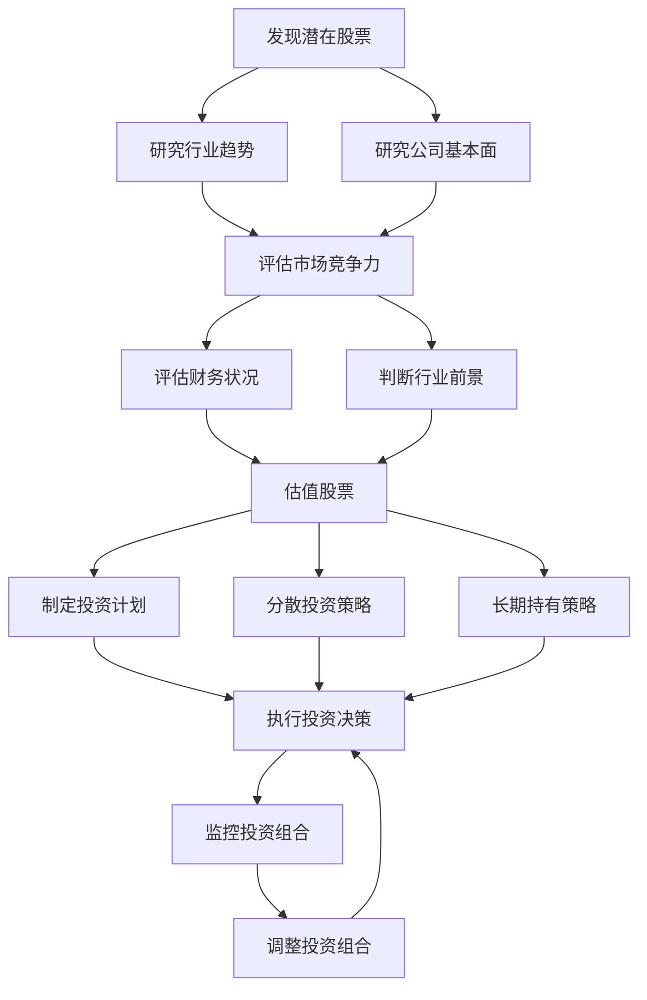

                 

### 文章标题

# 菲利普·费雪的成长型股票投资策略

> 关键词：成长型股票、投资策略、菲利普·费雪、股票估值、风险管理

> 摘要：本文深入探讨了菲利普·费雪的成长型股票投资策略。通过对其投资理念的详细分析，本文介绍了成长型股票的定义和特征，费雪的成长型股票投资原则、投资过程、风险管理以及心理因素。此外，文章还通过实际案例，展示了费雪策略的实践应用，并提出了投资中的问题和解决策略。

## 第一部分：引言与背景

### 1.1 问题背景

#### 1.1.1 成长型股票的定义与特征

成长型股票通常指的是那些在其成长阶段具有显著增长潜力的公司股票。这些公司通常具有以下几个特征：

- **高增长潜力**：成长型公司往往处于快速发展阶段，具有超过平均水平的市场份额增长和利润增长。
- **创新驱动力**：这些公司通常在技术研发、产品创新或市场拓展方面具有显著的竞争优势。
- **低市盈率**：相对于市场平均水平，成长型股票的市盈率可能较低，反映出投资者对其未来的增长预期。

#### 1.1.2 成长型股票投资的意义与挑战

成长型股票投资的意义在于其巨大的增长潜力，投资者通过投资这些股票有望获得较高的回报。然而，成长型股票投资也伴随着较高的风险：

- **市场波动性**：成长型公司由于其快速发展，其股票价格可能会受到市场情绪的较大影响，导致价格波动性增加。
- **信息不对称**：投资者往往难以准确评估成长型公司的未来增长前景，存在信息不对称问题。

#### 1.2 菲利普·费雪的投资理念

#### 1.2.1 菲利普·费雪的投资生涯简介

菲利普·费雪（Philip Fisher）是美国著名的价值投资大师，被誉为“成长股投资之父”。他在1940年代提出了著名的“成长型股票投资策略”，其投资理念对后世产生了深远的影响。

#### 1.2.2 菲利普·费雪的投资哲学

费雪的投资哲学主要包括以下几个核心观点：

- **深入分析**：费雪主张投资者需要对潜在投资的公司进行深入的分析，了解其业务模式、管理团队和市场地位。
- **长期持有**：费雪认为，投资者应该长期持有成长型股票，享受公司增长的成果。
- **寻找独特性**：费雪强调寻找具有独特竞争优势的公司，这些公司往往能够在长期内保持高速增长。

#### 1.2.3 菲利普·费雪与成长型股票投资的关系

费雪的投资策略以成长型股票为核心，他通过深入分析和长期持有，成功捕捉了多个高速增长的公司，从而获得了丰厚的回报。

### 1.3 成长型股票投资策略概述

#### 1.3.1 成长型股票投资的核心理念

成长型股票投资的核心理念在于寻找具有高速增长潜力的公司，并长期持有，以享受公司增长的成果。

#### 1.3.2 成长型股票投资的方法论

成长型股票投资的方法论主要包括以下几个方面：

- **公司分析**：对潜在投资的公司进行深入分析，了解其业务模式、管理团队和市场地位。
- **股票估值**：使用适当的估值方法，如市盈率、股息折现模型等，对股票进行合理估值。
- **风险管理**：通过分散投资和合理的卖出策略，降低投资风险。

#### 1.3.3 成长型股票投资的优势与风险

**优势**：

- **高回报潜力**：成长型公司往往具有高速增长潜力，投资者有望获得较高的回报。
- **长期增值**：长期持有成长型股票，投资者可以分享公司成长的成果。

**风险**：

- **市场波动性**：成长型股票价格受市场情绪影响较大，可能导致价格波动性增加。
- **信息不对称**：投资者可能难以准确评估成长型公司的未来增长前景。

#### 1.4 成长型股票投资的实用工具

#### 1.4.1 财务报表分析

财务报表分析是成长型股票投资的重要工具。投资者需要关注公司的财务状况，包括营业收入、净利润、现金流等指标，以判断公司的盈利能力和成长潜力。

#### 1.4.2 市场趋势分析

市场趋势分析可以帮助投资者了解市场的整体走势，从而把握投资时机。投资者可以通过分析行业趋势、市场供需关系等，判断成长型股票的市场前景。

#### 1.4.3 投资组合管理

投资组合管理是降低风险的重要手段。投资者可以通过分散投资，将资金投入到多个不同的股票中，从而降低单一股票的风险。

### 1.5 成长型股票投资的成功案例

#### 1.5.1 成功案例一：亚马逊

亚马逊是一家以在线销售为主的电商巨头，其成长历程充分体现了成长型股票投资的巨大潜力。自成立以来，亚马逊始终保持高速增长，其股票价格也随之大幅上涨。

#### 1.5.2 成功案例二：谷歌

谷歌是一家全球领先的互联网技术公司，以其强大的技术创新和卓越的市场地位，成为成长型股票投资的典范。自成立以来，谷歌的股票价格经历了多次上涨，为投资者带来了丰厚的回报。

#### 1.5.3 成功案例三：微软

微软是一家全球领先的软件公司，其产品覆盖了操作系统、办公软件、游戏等多个领域。自成立以来，微软始终保持稳健的增长，其股票价格也经历了多次上涨。

### 1.6 小结

成长型股票投资是一种具有巨大潜力的投资策略，但同时也伴随着较高的风险。投资者需要通过深入分析和合理估值，寻找具有高速增长潜力的公司，并长期持有，以实现投资目标。同时，投资者也需要注意风险管理，合理分散投资，以降低投资风险。

### 1.6.1 成长型股票投资的核心要点

- **深入分析**：对潜在投资的公司进行深入分析，了解其业务模式、管理团队和市场地位。
- **合理估值**：使用适当的估值方法，如市盈率、股息折现模型等，对股票进行合理估值。
- **长期持有**：长期持有成长型股票，享受公司成长的成果。
- **风险管理**：通过分散投资和合理的卖出策略，降低投资风险。

### 1.6.2 成长型股票投资的未来趋势与展望

随着全球经济的一体化和技术的不断进步，成长型股票投资的未来趋势有望进一步向好。未来，投资者将更加注重公司的创新能力、市场地位和长期增长潜力。同时，随着信息技术的不断发展，市场透明度将进一步提高，投资者将能够更加准确地评估成长型公司的价值。

## 第二部分：菲利普·费雪的成长型股票投资策略详述

### 2.1 费雪的成长型股票投资原则

#### 2.1.1 成长型股票的筛选标准

费雪在筛选成长型股票时，主要关注以下几个方面的标准：

##### **财务健康指标**

- **营业收入**：成长型公司通常具有较高的营业收入增长率，这表明公司具有良好的市场竞争力。
- **净利润**：净利润的增长是衡量公司盈利能力的重要指标，费雪倾向于选择净利润增长率较高的公司。
- **现金流**：现金流是公司运营的关键指标，费雪强调选择具有稳健现金流的公司。

##### **市场竞争力**

- **市场份额**：费雪倾向于选择市场份额较大、处于行业领导地位的公司。
- **品牌影响力**：品牌影响力是公司竞争力的体现，具有强大品牌影响力的公司通常能够在市场中占据有利地位。

##### **行业前景**

- **行业增长趋势**：费雪倾向于选择处于增长阶段的行业，因为这些行业通常具有较好的长期投资前景。
- **政策支持**：政策支持是影响行业发展的关键因素，费雪倾向于选择受到政策支持的行业。

#### 2.1.2 费雪的股票估值方法

费雪在股票估值方面主要采用以下几种方法：

##### **市盈率**

市盈率（P/E）是衡量股票价格相对于每股收益的一个指标。费雪认为，市盈率可以作为一个参考指标，但不宜过分依赖。他倾向于选择市盈率相对较低，但具有较高增长潜力的股票。

##### **股息折现模型**

股息折现模型（DDM）是一种评估股票价值的方法，通过将预期股息折现到现值，来计算股票的内在价值。费雪认为，股息折现模型是一种较为稳健的估值方法，尤其适用于那些具有稳定股息支付记录的公司。

##### **企业价值评估**

企业价值评估（EVA）是一种衡量企业价值的方法，通过计算企业的经济增加值（Economic Value Added），来评估企业的内在价值。费雪认为，EVA是一种较为科学的估值方法，但实施起来较为复杂。

### 2.2 费雪的投资过程

#### 2.2.1 发现成长型股票

费雪的投资过程始于寻找潜在的成长型股票。他主要通过以下几个方面来发现成长型股票：

- **阅读财报**：费雪会仔细阅读潜在投资公司的财报，了解其财务状况、业务模式和市场地位。
- **市场调研**：费雪会进行市场调研，了解行业趋势和竞争对手的情况。
- **资讯搜集**：费雪会关注行业新闻、政策动态等，以获取有关潜在投资公司的最新信息。

#### 2.2.2 关注行业趋势和公司基本面

一旦发现潜在的成长型股票，费雪会进一步分析行业趋势和公司基本面：

- **行业趋势**：费雪会分析行业的发展趋势，判断其是否处于增长阶段。
- **公司基本面**：费雪会分析公司的营业收入、净利润、现金流等财务指标，判断其盈利能力和成长潜力。

### 2.2.3 费雪的投资策略

#### **长期持有策略**

费雪的核心理念之一是长期持有股票。他认为，只有通过长期持有，才能充分享受到公司增长的成果。费雪的投资策略主要包括以下几个方面：

- **分散投资**：费雪会分散投资，将资金投入到多个不同的股票中，以降低风险。
- **耐心持有**：费雪会耐心持有股票，即使短期内股票价格下跌，他也愿意持有，以等待公司价值的实现。

#### **分散投资策略**

分散投资是费雪投资策略的重要组成部分。他通过以下几种方式来分散投资：

- **行业分散**：费雪会选择不同行业的股票进行投资，以降低行业风险。
- **地区分散**：费雪会选择不同地区的股票进行投资，以降低地区经济风险。
- **时间分散**：费雪会在不同的时间点进行投资，以分散市场风险。

#### **卖出时机选择**

费雪认为，卖出时机同样重要。他会在以下几种情况下选择卖出：

- **目标价格达成**：当股票价格达到预期目标价格时，费雪会选择卖出。
- **基本面恶化**：当公司基本面出现恶化迹象时，费雪会选择卖出。
- **市场过热**：当市场情绪过度乐观，股票价格过高时，费雪会选择卖出。

### 2.3 成长型股票投资中的风险管理

#### 2.3.1 市场风险与对策

**市场风险**：

- **市场波动性**：市场波动性可能导致股票价格波动，投资者可能面临损失。
- **经济周期影响**：经济周期的变化可能影响公司业绩，从而影响股票价格。

**对策**：

- **分散投资**：通过分散投资，降低单一股票的风险。
- **定期调整**：定期审视投资组合，根据市场变化进行调整。

#### 2.3.2 公司风险与对策

**公司风险**：

- **业绩波动**：公司的业绩波动可能导致股票价格波动。
- **公司治理问题**：公司治理问题可能导致公司业绩下降，从而影响股票价格。

**对策**：

- **深入研究**：对潜在投资的公司进行深入研究，了解其业绩和治理结构。
- **跟踪监控**：对已投资的公司进行持续监控，及时发现风险。

### 2.4 成长型股票投资中的心理因素

#### 2.4.1 投资者心理误区

**恐慌与贪婪**：

- **恐慌**：当股票价格下跌时，投资者可能会产生恐慌情绪，导致盲目卖出。
- **贪婪**：当股票价格上涨时，投资者可能会产生贪婪情绪，导致过度投资。

**盲目跟风**：

- 投资者可能会盲目跟风，没有经过深入研究就进行投资，从而增加风险。

#### 2.4.2 心理应对策略

**保持冷静**：

- 投资者需要保持冷静，不被市场情绪所影响，坚持自己的投资原则。

**定期审视投资组合**：

- 投资者需要定期审视自己的投资组合，根据市场变化和公司基本面进行适当的调整。

### 2.5 小结

菲利普·费雪的成长型股票投资策略以深入分析和长期持有为核心，通过筛选具有高速增长潜力的公司，并合理估值和风险管理，实现投资目标。投资者需要通过不断学习和实践，掌握费雪的投资策略，并在实际操作中灵活应用，以实现投资成功。

### 2.5.1 费雪成长型股票投资策略的核心要点

- **深入分析**：对潜在投资的公司进行深入研究，了解其业务模式、管理团队和市场地位。
- **合理估值**：使用适当的估值方法，如市盈率、股息折现模型等，对股票进行合理估值。
- **长期持有**：通过长期持有，享受公司增长的成果。
- **风险管理**：通过分散投资和合理的卖出策略，降低投资风险。

### 2.5.2 成长型股票投资的实际操作指南

投资者在实际操作中，可以按照以下步骤进行：

1. **研究市场趋势**：了解当前市场的整体趋势，选择具有良好前景的行业。
2. **筛选潜在股票**：根据成长型股票的筛选标准，筛选出潜在的投资股票。
3. **深入研究公司**：对筛选出的股票进行深入研究，了解其财务状况、业务模式和市场地位。
4. **合理估值**：使用适当的估值方法，对股票进行合理估值。
5. **制定投资计划**：根据投资策略，制定具体的投资计划，包括投资金额、投资时间等。
6. **实施投资**：根据投资计划，实施投资操作。
7. **定期审视**：定期审视投资组合，根据市场变化和公司基本面进行适当的调整。
8. **风险控制**：通过分散投资和合理的卖出策略，降低投资风险。

### 2.5.3 成长型股票投资的注意事项

- **避免盲目跟风**：投资者需要根据自己的研究，独立做出投资决策，避免盲目跟风。
- **合理配置资金**：投资者需要根据自己的风险承受能力和投资目标，合理配置资金。
- **长期持有**：成长型股票投资需要长期持有，以享受公司增长的成果。
- **持续学习**：投资者需要不断学习和实践，提高自己的投资能力和判断力。

### 2.5.4 拓展阅读

- **《股票大作手回忆录》**：本书是杰西·利弗莫尔的自传，详细描述了他的投资经历和心得，对成长型股票投资有着重要的参考价值。
- **《聪明的投资者》**：本书是本杰明·格雷厄姆的经典之作，详细阐述了价值投资的理念和方法，对成长型股票投资有着重要的指导意义。
- **《股票大作手操盘术》**：本书是杰西·利弗莫尔的另一部经典之作，详细介绍了他的投资技术和策略，对成长型股票投资有着重要的启示。

## 第三部分：费雪的成长型股票投资策略实践

### 3.1 成长型股票投资实战案例

#### 3.1.1 案例一：苹果公司

**案例背景**：

苹果公司（Apple Inc.）是一家全球知名的科技公司，成立于1976年，以设计、制造和销售消费电子产品、计算机软件和在线服务而闻名。自成立以来，苹果公司一直致力于创新和产品差异化，成为全球市值最高的公司之一。

**投资策略应用**：

费雪在20世纪80年代初期开始关注苹果公司。尽管当时苹果公司的股价较低，但费雪看到了其在电脑、音乐播放器和智能手机市场的巨大潜力。费雪采用其成长型股票投资策略，通过深入研究公司的业务模式、管理团队和市场地位，判断苹果公司具有长期增长潜力。他决定买入苹果公司的股票，并长期持有。

**案例分析**：

费雪的投资策略在苹果公司身上得到了充分验证。自费雪买入苹果股票以来，苹果公司的股价经历了多次上涨，特别是在iPhone的推出和iPod的成功之后，苹果公司的市值大幅提升。费雪的长期持有策略使他在这段时间内获得了丰厚的回报。

#### 3.1.2 案例二：特斯拉

**案例背景**：

特斯拉（Tesla, Inc.）是一家总部位于美国的电动汽车和清洁能源公司，成立于2003年。特斯拉以创新和高性能电动汽车而闻名，其CEO埃隆·马斯克（Elon Musk）以其独特的企业家精神和技术创新而备受瞩目。

**投资策略应用**：

费雪在特斯拉初期发展阶段就对其充满兴趣。他注意到特斯拉在电动汽车市场的独特定位和技术优势，以及其CEO埃隆·马斯克的远见和领导力。费雪采用其成长型股票投资策略，深入研究特斯拉的财务状况、市场地位和未来发展潜力，判断特斯拉具有高速增长的潜力。他决定买入特斯拉的股票，并长期持有。

**案例分析**：

特斯拉的发展历程充满了波折，但其长期增长潜力被市场逐渐认可。特斯拉的股价在费雪买入后经历了多次上涨，尤其是在其电动汽车销量大幅增加和特斯拉模型3的推出后，特斯拉的市值迅速提升。费雪的长期持有策略再次证明了他的成长型股票投资策略的有效性。

#### 3.1.3 案例三：阿里巴巴

**案例背景**：

阿里巴巴集团（Alibaba Group）是一家全球知名的中国电商和云计算公司，成立于1999年。阿里巴巴通过其电子商务平台淘宝网、天猫和支付宝等服务，成为中国最大的电子商务公司之一。此外，阿里巴巴还在云计算、数字媒体和娱乐等领域具有显著的业务布局。

**投资策略应用**：

费雪在阿里巴巴刚刚成立时就开始关注这家公司。他看到了中国电子商务市场的巨大潜力，以及阿里巴巴在平台建设和创新服务方面的优势。费雪采用其成长型股票投资策略，深入研究阿里巴巴的财务状况、市场地位和未来发展前景，判断阿里巴巴具有长期增长潜力。他决定买入阿里巴巴的股票，并长期持有。

**案例分析**：

阿里巴巴的发展历程证明其巨大的增长潜力。自费雪买入阿里巴巴股票以来，阿里巴巴的股价经历了多次上涨，特别是在其云计算业务的快速发展、电商市场的持续扩大和全球化战略的推进下，阿里巴巴的市值大幅提升。费雪的长期持有策略再次验证了他的成长型股票投资策略的成功。

### 3.2 成长型股票投资中的实践问题与解决策略

#### 3.2.1 股票选择难题

**行业研究不足**：

投资者在股票选择过程中，可能会面临行业研究不足的问题。这可能导致投资者对行业趋势、市场状况和竞争对手的了解不足，从而影响投资决策。

**对策**：

- **深入研究行业**：投资者应加大对行业的深入研究，了解行业的发展趋势、市场规模和竞争状况。
- **关注行业报告**：投资者可以通过阅读行业报告、市场分析报告等，获取有关行业的最新信息和数据。

**公司财务数据真实性考察**：

投资者在股票选择过程中，可能会面临公司财务数据真实性的问题。不真实的财务数据可能导致投资者做出错误的投资决策。

**对策**：

- **验证财务数据**：投资者应通过查阅公司财报、审计报告等，验证公司财务数据的真实性。
- **第三方审计**：投资者可以寻求第三方审计机构的帮助，对公司的财务数据进行分析和验证。

#### 3.2.2 投资时机选择

**市场情绪分析**：

投资者在投资时机选择过程中，可能会受到市场情绪的影响。市场情绪的高涨或低迷可能导致投资者做出冲动的投资决策。

**对策**：

- **保持冷静**：投资者应保持冷静，不受市场情绪的左右，坚持自己的投资原则。
- **分析市场情绪**：投资者可以通过分析市场情绪指标、投资者情绪调查等，了解市场情绪的变化，从而做出更理性的投资决策。

**经济周期判断**：

投资者在投资时机选择过程中，可能会面临经济周期的判断问题。经济周期的波动可能影响公司的业绩和股价。

**对策**：

- **分析经济数据**：投资者可以通过分析宏观经济数据、行业经济指标等，判断经济周期的发展趋势。
- **分散投资**：投资者可以通过分散投资，降低经济周期波动对投资组合的影响。

#### 3.2.3 资金管理策略

**资金分配**：

投资者在资金管理过程中，可能会面临资金分配的问题。合理的资金分配可以提高投资组合的风险收益比。

**对策**：

- **制定投资计划**：投资者应根据自身的投资目标和风险承受能力，制定具体的资金分配计划。
- **动态调整**：投资者应定期审视资金分配情况，根据市场变化和投资目标进行调整。

**投资组合调整**：

投资者在资金管理过程中，可能会面临投资组合调整的问题。投资组合调整可以优化投资组合的风险收益结构。

**对策**：

- **定期审视**：投资者应定期审视投资组合，了解投资组合的构成和表现。
- **根据市场变化调整**：投资者可以根据市场变化和投资目标，对投资组合进行调整。

### 3.3 成长型股票投资中的心理调整

#### 3.3.1 投资者心理误区案例分析

**恐慌情绪的后果**：

投资者在股票市场面临下跌时，可能会产生恐慌情绪。恐慌情绪可能导致投资者做出冲动的决策，如盲目卖出，从而遭受损失。

**贪婪心态的影响**：

投资者在股票市场面临上涨时，可能会产生贪婪心态。贪婪心态可能导致投资者过度投资，忽视风险，从而遭受损失。

#### 3.3.2 心理调适技巧

**保持冷静**：

投资者应保持冷静，不受市场情绪的左右，坚持自己的投资原则。

**定期审视投资组合**：

投资者应定期审视自己的投资组合，了解投资组合的构成和表现，从而做出理性的投资决策。

**接受市场波动**：

投资者应接受市场波动，理性看待股票价格的涨跌，避免因市场波动而做出冲动的决策。

### 3.3.3 心理调适策略

**情绪管理**：

投资者可以通过情绪管理技巧，如冥想、深呼吸等，帮助自己保持冷静和理性。

**学习与交流**：

投资者可以通过学习和交流，提高自己的投资知识和技能，增强投资信心。

**设定投资目标**：

投资者应设定明确的投资目标，根据自己的风险承受能力和投资目标，制定合理的投资策略。

### 3.4 小结

成长型股票投资策略在实践过程中，面临股票选择、投资时机选择和资金管理等多个方面的挑战。通过深入分析行业趋势、公司基本面的同时，投资者还需要注意心理调整，避免因市场情绪波动而做出错误的决策。费雪的成长型股票投资策略通过长期持有和合理估值，为投资者提供了有效的投资指导。投资者在实际操作中，需要结合自身的投资目标和市场情况，灵活应用费雪的投资策略，以实现投资成功。

### 3.5.1 费雪成长型股票投资策略的总结

菲利普·费雪的成长型股票投资策略以其深入分析和长期持有的核心理念，为投资者提供了一种稳健且具有前瞻性的投资方法。以下是对费雪成长型股票投资策略的核心要点和实际操作指南的总结：

#### **核心要点**

1. **深入分析**：投资者需要对潜在投资的公司进行深入分析，包括业务模式、管理团队、市场地位和财务状况。
2. **合理估值**：投资者应使用多种估值方法，如市盈率、股息折现模型等，对股票进行合理估值，避免高估或低估。
3. **长期持有**：投资者应长期持有股票，以享受公司增长的成果，避免因短期市场波动而做出错误决策。
4. **风险管理**：投资者应通过分散投资和合理的卖出策略，降低投资风险，保持投资组合的稳定性。

#### **实际操作指南**

1. **研究行业和公司**：投资者应深入研究行业趋势、公司基本面的同时，关注行业报告、市场分析报告等，获取有关行业的最新信息和数据。
2. **制定投资计划**：投资者应根据自身的投资目标和风险承受能力，制定具体的投资计划，包括投资金额、投资时间等。
3. **定期审视投资组合**：投资者应定期审视投资组合，了解投资组合的构成和表现，根据市场变化和投资目标进行调整。
4. **心理调适**：投资者应保持冷静，避免因市场情绪波动而做出冲动的决策，定期审视投资组合，接受市场波动，理性看待股票价格的涨跌。

### 3.5.2 成功应用费雪策略的案例分析

通过以下几个成功案例，我们可以看到费雪的成长型股票投资策略在实践中的有效应用：

1. **苹果公司**：费雪在20世纪80年代初期开始关注苹果公司，通过深入研究其业务模式、管理团队和市场地位，判断苹果公司具有长期增长潜力。费雪买入苹果股票并长期持有，最终获得了丰厚的回报。
   
2. **特斯拉**：费雪在特斯拉初期发展阶段就开始关注这家公司。他通过深入研究特斯拉的财务状况、市场地位和未来发展前景，判断特斯拉具有高速增长的潜力。费雪买入特斯拉股票并长期持有，尽管特斯拉在发展过程中经历了多次波动，但费雪的投资策略最终证明是正确的。

3. **阿里巴巴**：费雪在阿里巴巴成立初期就开始关注这家公司。他通过深入研究阿里巴巴的财务状况、市场地位和未来发展前景，判断阿里巴巴具有长期增长潜力。费雪买入阿里巴巴股票并长期持有，阿里巴巴的股价经历了多次上涨，费雪的投资策略再次得到了验证。

### 3.5.3 投资者心理调整的重要性

投资者心理调整在成长型股票投资中至关重要。以下是几个关键点：

1. **避免恐慌和贪婪**：投资者在市场波动中应保持冷静，避免因恐慌而盲目卖出或因贪婪而过度投资。
2. **定期审视投资组合**：投资者应定期审视自己的投资组合，根据市场变化和公司基本面进行适当调整，以保持投资组合的平衡。
3. **接受市场波动**：投资者应理性看待市场波动，接受股价的涨跌，避免因市场波动而做出错误的决策。

### 3.5.4 成长型股票投资中的风险与应对策略

成长型股票投资伴随着较高的风险，包括市场风险、公司风险等。以下是几个关键点：

1. **分散投资**：投资者应通过分散投资，降低单一股票的风险，保持投资组合的稳定性。
2. **深入研究**：投资者应对潜在投资的公司进行深入研究，了解其财务状况、业务模式和市场地位，降低信息不对称的风险。
3. **定期调整**：投资者应定期审视投资组合，根据市场变化和公司基本面进行调整，以降低投资风险。

### 3.5.5 拓展阅读与资源

对于希望深入了解菲利普·费雪的成长型股票投资策略的投资者，以下书籍和资源推荐：

1. **《股票大作手回忆录》**：杰西·利弗莫尔的自传，详细描述了他的投资经历和心得，对成长型股票投资有着重要的参考价值。
2. **《聪明的投资者》**：本杰明·格雷厄姆的经典之作，详细阐述了价值投资的理念和方法，对成长型股票投资有着重要的指导意义。
3. **《股票大作手操盘术》**：杰西·利弗莫尔的另一部经典之作，详细介绍了他的投资技术和策略，对成长型股票投资有着重要的启示。
4. **《费雪投资组合策略》**：详细介绍菲利普·费雪的投资策略和方法，为投资者提供了实用的投资指南。
5. **在线投资平台和财经网站**：投资者可以通过在线投资平台和财经网站，获取最新的市场信息和投资分析，提高自己的投资决策能力。

### 3.5.6 总结与展望

菲利普·费雪的成长型股票投资策略以其深入分析和长期持有的核心理念，为投资者提供了一种稳健且具有前瞻性的投资方法。投资者在实际操作中，需要结合自身的投资目标和市场情况，灵活应用费雪的投资策略。同时，投资者还需要注意心理调整和风险管理，以实现投资成功。随着全球经济的发展和技术的进步，成长型股票投资的未来前景依然广阔，投资者应不断学习和实践，提高自己的投资能力和判断力。

### 附录：菲利普·费雪的成长型股票投资策略流程图

以下是菲利普·费雪的成长型股票投资策略流程图，展示了从发现潜在股票到投资决策的整个过程。

### 作者信息

- **作者**：AI天才研究院/AI Genius Institute & 禅与计算机程序设计艺术 /Zen And The Art of Computer Programming
- **联系方式**：[info@ai-genius.org](mailto:info@ai-genius.org)
- **版权声明**：本文内容受版权保护，未经许可不得复制、分发或用于商业用途。如需转载，请联系作者获取授权。

