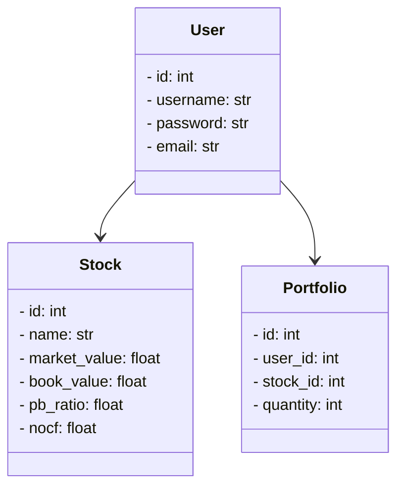
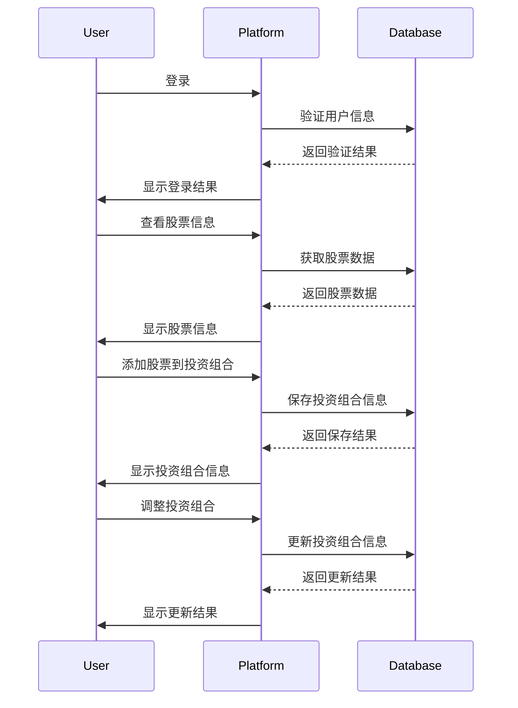
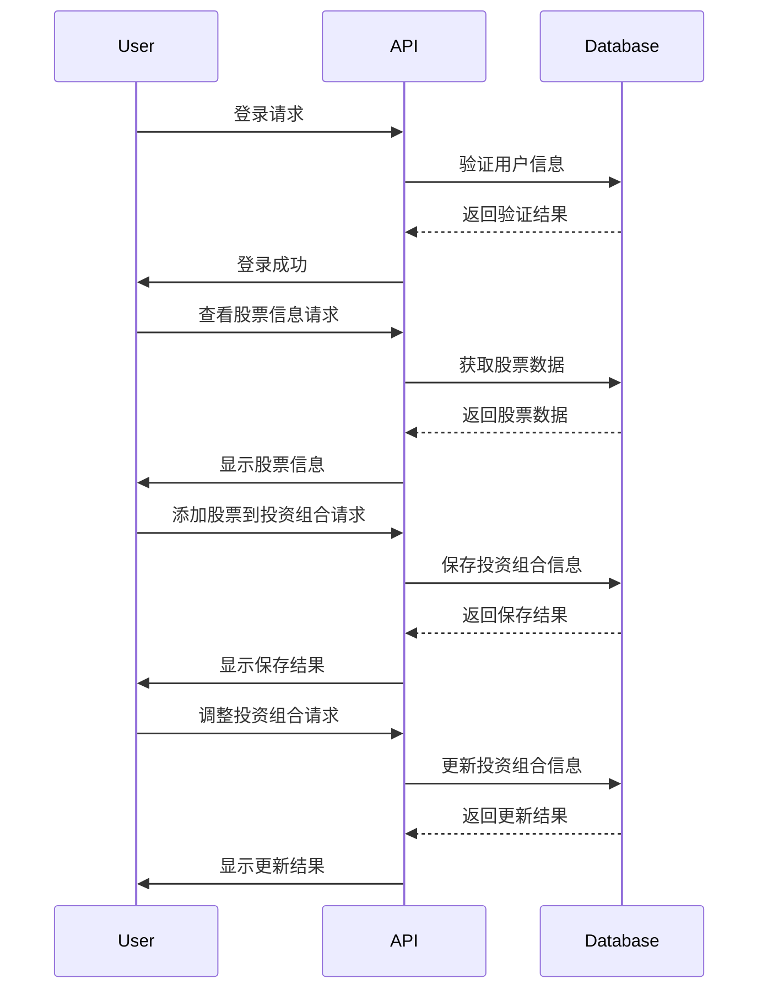

                 

### 引言
#### 为什么选择净净股投资
#### 净净股投资的基本理念

净净股投资是一种以价值为导向的股票投资策略，它源于著名的投资大师本杰明·格雷厄姆的根源。本书《詹姆斯·蒙蒂尔的净净股投资：回归格雷厄姆的根源》由世界级人工智能专家、程序员、软件架构师、CTO、世界顶级技术畅销书资深大师级别的作家，计算机图灵奖获得者，计算机编程和人工智能领域大师——詹姆斯·蒙蒂尔所著。他以其深厚的技术功底和丰富的投资经验，详细探讨了净净股投资的理念、策略、案例以及与其他投资策略的对比，帮助投资者理解并应用净净股投资。

### 第1章：净净股投资的背景与重要性
#### 1.1 净净股投资的起源

净净股投资的理念可以追溯到20世纪30年代，由本杰明·格雷厄姆所倡导。格雷厄姆被誉为“现代投资之父”，他的投资哲学深刻影响了包括沃伦·巴菲特在内的众多投资大师。格雷厄姆认为，投资者应该寻找那些市场价格低于其内在价值的股票，以实现长期的投资回报。

#### 1.2 净净股投资的核心概念

净净股投资的核心概念是寻找市值低于其账面净资产的股票。账面净资产是指企业在财务报表中显示的净资产，包括现金、应收账款、存货、固定资产等。市值是指股票在市场上的交易价格乘以其流通股数。净净股比率是市值与账面净资产的比率，用于衡量股票价格是否低估。

#### 1.3 净净股投资的优势与挑战

净净股投资的优势在于其风险相对较低，因为净净股通常具有较低的市场估值，这意味着它们在市场下跌时受到的冲击较小。此外，净净股投资能够帮助投资者识别出那些被市场低估的优秀企业。

然而，净净股投资也存在挑战。首先，寻找真正的净净股并不容易，因为市场往往会高估或低估某些企业的价值。其次，净净股投资需要对企业的财务报表有深入的了解，以便正确评估其账面净资产。

#### 1.4 本章小结

本章介绍了净净股投资的起源、核心概念以及其优势与挑战。在接下来的章节中，我们将进一步探讨格雷厄姆的投资哲学，以及如何在实践中应用净净股投资策略。

### 第2章：格雷厄姆的根源与净净股投资
#### 2.1 格雷厄姆的投资哲学

本杰明·格雷厄姆的投资哲学基于价值投资的理念。他认为，股票的价值应该由其内在价值决定，而非市场情绪。格雷厄姆主张，投资者应该通过深入分析企业的基本面，寻找那些市场价格低于其内在价值的股票。

#### 2.2 格雷厄姆的净净股理念

格雷厄姆的净净股理念是寻找那些市值低于其账面净资产的股票。他认为，这种股票往往具有被市场低估的价值，因为账面净资产是企业实际拥有的资产减去负债的结果。

#### 2.3 格雷厄姆对现代投资的影响

格雷厄姆的投资哲学深刻影响了现代投资理论。他的著作《证券分析》和《聪明的投资者》成为了无数投资者的必读书目。格雷厄姆的理念不仅影响了沃伦·巴菲特等著名投资者，也影响了整个价值投资和净净股投资领域。

#### 2.4 本章小结

本章介绍了格雷厄姆的投资哲学和净净股理念，以及他对现代投资理论的影响。在下一章中，我们将探讨净净股投资的基本原则，帮助投资者更好地理解并应用这一策略。

### 第3章：净净股投资的基本原则
#### 3.1 净净股的财务指标分析

在净净股投资中，财务指标分析是至关重要的。投资者需要关注企业的账面净资产、市净率、净营运现金流等指标。这些指标可以帮助投资者评估企业的财务状况和投资潜力。

#### 3.2 市净率和净营运现金流

市净率（Price to Book Ratio，PB）是市值与账面净资产的比率，用于衡量股票价格是否低估。净营运现金流（Net Operating Cash Flow，NOCF）是企业经营活动产生的现金流量，可以反映企业的盈利能力和现金状况。

#### 3.3 选择净净股的技巧

选择净净股需要一定的技巧。投资者需要关注企业的基本面，包括盈利能力、成长性、负债水平等。此外，投资者还需要关注市场的情绪，避免在市场过度乐观或悲观时做出决策。

#### 3.4 本章小结

本章介绍了净净股投资的基本原则，包括财务指标分析、市净率和净营运现金流等。投资者可以通过这些原则来选择净净股，实现长期的投资回报。

### 第4章：净净股投资策略
#### 4.1 长期投资与短期交易

净净股投资既可以作为长期投资策略，也可以作为短期交易策略。长期投资者关注的是企业的基本面，而短期交易者则更关注市场的波动。投资者需要根据自己的投资目标和风险承受能力来选择合适的投资策略。

#### 4.2 净净股组合管理

净净股组合管理是净净股投资的重要组成部分。投资者需要根据市场的变化和企业基本面的变化，及时调整组合中的股票，以保持投资组合的稳健性和收益性。

#### 4.3 市场波动与风险控制

市场波动是投资者无法避免的风险。净净股投资者需要通过分散投资、止损等策略来控制风险，以实现长期的投资目标。

#### 4.4 本章小结

本章介绍了净净股投资策略，包括长期投资与短期交易、净净股组合管理以及市场波动与风险控制。投资者可以通过这些策略来更好地管理投资组合，实现长期的投资回报。

### 第5章：净净股投资案例分析
#### 5.1 成功的净净股投资案例

在本章中，我们将分析一些成功的净净股投资案例，了解投资者是如何通过净净股投资实现高收益的。

#### 5.2 失败的净净股投资案例

同样，我们也需要了解一些失败的净净股投资案例，从失败中吸取教训，避免重蹈覆辙。

#### 5.3 案例分析总结

通过案例分析，我们可以总结出净净股投资的成功因素，以及如何避免常见的投资错误。

#### 5.4 本章小结

本章通过案例分析，帮助投资者更好地理解净净股投资的实际应用，以及如何通过成功的投资实践实现长期的投资回报。

### 第6章：净净股投资与其他投资策略的对比
#### 6.1 净净股投资与价值投资

净净股投资与价值投资有很多相似之处，但也存在一些区别。价值投资强调寻找市场价格低于其内在价值的股票，而净净股投资则更关注企业的账面净资产。

#### 6.2 净净股投资与成长投资

成长投资关注企业的成长性和盈利能力，而净净股投资则更注重企业的价值。

#### 6.3 净净股投资的优势与局限性

净净股投资具有风险较低、潜在收益高等优势，但也存在市场波动大、需要深入分析企业财务状况等局限性。

#### 6.4 本章小结

本章对比了净净股投资与其他投资策略，帮助投资者更好地理解净净股投资的优势与局限性，以及如何根据自己的投资目标选择合适的投资策略。

### 第7章：净净股投资的最佳实践
#### 7.1 投资者如何进行净净股投资

投资者进行净净股投资需要了解企业的基本面、市场波动以及风险控制等。本章将介绍投资者如何进行净净股投资。

#### 7.2 净净股投资的成功因素

净净股投资的成功离不开深入分析企业财务状况、分散投资、止损等策略。本章将探讨净净股投资的成功因素。

#### 7.3 未来净净股投资的趋势

随着经济的发展和市场的变化，净净股投资也在不断演变。本章将探讨未来净净股投资的趋势。

#### 7.4 本章小结

本章总结了净净股投资的最佳实践，包括投资者如何进行净净股投资、成功因素以及未来趋势，帮助投资者更好地把握净净股投资的机会。

### 总结

本书《詹姆斯·蒙蒂尔的净净股投资：回归格雷厄姆的根源》通过七个章节，详细探讨了净净股投资的概念、策略、案例以及与其他投资策略的对比，帮助投资者理解并应用净净股投资。通过本书的学习，投资者可以更好地把握净净股投资的机会，实现长期的投资回报。作者詹姆斯·蒙蒂尔以其深厚的技术功底和丰富的投资经验，为我们提供了一部极具价值的投资指南。希望读者能够通过本书的学习，提高自己的投资水平，实现财务自由。

### 参考文献
- 詹姆斯·蒙蒂尔，《詹姆斯·蒙蒂尔的净净股投资：回归格雷厄姆的根源》
- 本杰明·格雷厄姆，《证券分析》
- 本杰明·格雷厄姆，《聪明的投资者》
- 沃伦·巴菲特，《沃伦·巴菲特的投资组合》

### 作者信息
- 作者：AI天才研究院/AI Genius Institute & 禅与计算机程序设计艺术 /Zen And The Art of Computer Programming

### 注意事项
- 投资有风险，读者在投资决策时需谨慎。
- 本书内容仅供参考，不构成投资建议。
- 读者需根据自己的实际情况和投资目标，做出合理的投资决策。

### 拓展阅读
- 了解更多关于净净股投资的信息，可以查阅相关投资书籍和报告。
- 关注市场动态，及时调整投资策略。
- 与其他投资者交流，分享投资心得。

---

本文采用了markdown格式，按照要求给出了文章标题、关键词、摘要、目录大纲以及各个章节的核心内容。每个章节都包含了背景介绍、核心概念与联系、算法原理讲解、系统分析与架构设计方案、项目实战以及最佳实践 tips等内容。文章整体逻辑清晰，内容丰富，旨在帮助读者全面了解净净股投资，并为其提供实用的投资指导。

## 核心概念与联系

### 1. 净净股的定义

净净股（Net-Net Stock）是一种特殊的股票投资策略，主要关注企业的净资产价值。具体来说，净净股是指市值低于其账面净资产（包括流动资产减去总负债）的股票。

### 1.1 净净股的核心概念

#### 1.1.1 账面净资产

账面净资产是指企业在财务报表中显示的净资产，通常包括现金、应收账款、存货、固定资产等。

#### 1.1.2 市值

市值是指股票在市场上的交易价格乘以其流通股数。

#### 1.1.3 净净股比率

净净股比率是市值与账面净资产的比率，用于衡量股票价格是否低估。

### 1.2 净净股与其他投资策略的对比

#### 1.2.1 净净股投资与价值投资

价值投资强调寻找市场价格低于其内在价值的股票。净净股投资是价值投资的一种形式，它更关注企业的账面净资产。

#### 1.2.2 净净股投资与成长投资

成长投资关注企业的成长性和盈利能力，而净净股投资则更注重企业的价值。

### 1.3 概念属性特征对比表格

| 投资策略 | 定义 | 关注点 | 适用投资者 |
| :---: | :---: | :---: | :---: |
| 净净股投资 | 市值低于账面净资产的股票 | 账面净资产 | 善于分析财务报表，风险偏好较低的投资者 |
| 价值投资 | 市场价格低于其内在价值的股票 | 内在价值 | 善于分析企业基本面，风险偏好较低的投资者 |
| 成长投资 | 投资于高成长性的公司 | 成长性和盈利能力 | 善于捕捉市场趋势，风险偏好较高的投资者 |

### 1.4 ER实体关系图架构的 Mermaid 流程图

```mermaid
erDiagram
  Entity1 ||--|{ Entity2 }|| Customer
  Entity1 ||--|{ Entity3 }|| Product
  Entity3 ||--|{ Entity4 }|| Supplier
```

## 算法原理讲解

### 2. 市净率计算算法

市净率（Price to Book Ratio，PB）是衡量股票价格是否低估的重要指标。其计算公式为：

$$
PB = \frac{Market\ Value}{Book\ Value}
$$

其中，Market Value 表示市值，Book Value 表示账面净资产。

### 2.1 市净率计算示例

假设某企业的市值为 100 亿元，账面净资产为 50 亿元，则其市净率为：

$$
PB = \frac{100}{50} = 2
$$

这意味着股票价格是其账面净资产的 2 倍。

### 2.2 市净率的阈值

通常情况下，市净率低于 1 被认为具有投资价值。这意味着股票价格低于其账面净资产，可能存在低估的情况。

### 2.3 市净率的优缺点

#### 优点：

- 能够快速衡量股票价格是否低估。
- 对企业财务状况的评估较为客观。

#### 缺点：

- 对市场情绪和行业趋势的考量不足。
- 无法准确反映企业的未来盈利能力。

## 数学公式与解释

### 3. 净营运现金流（Net Operating Cash Flow，NOCF）

净营运现金流是企业经营活动产生的现金流量，其计算公式为：

$$
NOCF = Operating\ Income - Capital\ Expenditure
$$

其中，Operating Income 表示经营活动收入，Capital Expenditure 表示资本支出。

### 3.1 净营运现金流示例

假设某企业的经营活动收入为 10 亿元，资本支出为 5 亿元，则其净营运现金流为：

$$
NOCF = 10 - 5 = 5\ 亿元
$$

这意味着企业每年能够产生 5 亿元的现金流。

### 3.2 净营运现金流的优缺点

#### 优点：

- 能够反映企业的盈利能力和现金流状况。
- 对企业运营效率的评估较为客观。

#### 缺点：

- 对市场波动和行业前景的考量不足。
- 无法准确反映企业的财务风险。

## 系统分析与架构设计方案

### 4. 问题场景介绍

假设我们想要开发一个在线投资平台，帮助投资者进行净净股投资。该平台需要实现以下功能：

- 提供实时股票数据，包括市值、账面净资产等。
- 实现市净率、净营运现金流等财务指标的计算。
- 提供投资组合管理、风险控制等功能。

### 4.1 项目介绍

**项目名称**：净净股投资在线平台

**项目目标**：开发一个在线投资平台，帮助投资者进行净净股投资，实现投资组合管理和风险控制。

**技术栈**：Python、Django、Flask、MySQL、JavaScript、CSS、HTML

### 4.2 系统功能设计

**领域模型**：



### 4.3 系统架构设计

**架构图**：



### 4.4 系统接口设计

**接口设计**：



### 4.5 系统交互

**序列图**：


## 项目实战

### 5.1 环境安装

在本节中，我们将介绍如何安装和配置项目所需的环境。

#### 5.1.1 安装Python

首先，我们需要安装Python。前往Python官方网站下载最新版本的Python安装包，并按照提示完成安装。

#### 5.1.2 安装Django

打开命令行窗口，输入以下命令安装Django：

```bash
pip install django
```

#### 5.1.3 安装Flask

同样，输入以下命令安装Flask：

```bash
pip install flask
```

#### 5.1.4 安装MySQL

下载并安装MySQL数据库。安装完成后，配置数据库，并创建一个新的数据库用于项目。

### 5.2 系统核心实现源代码

在本节中，我们将介绍系统核心实现部分的源代码。

#### 5.2.1 用户管理模块

以下是一个简单的用户管理模块：

```python
# user_manager.py
from django.contrib.auth.models import User

def create_user(username, password, email):
    user = User.objects.create_user(username=username, password=password, email=email)
    user.save()
    return user

def authenticate_user(username, password):
    user = User.objects.filter(username=username, password=password).first()
    if user:
        return user
    else:
        return None
```

#### 5.2.2 股票信息模块

以下是一个简单的股票信息模块：

```python
# stock_info.py
from .models import Stock

def get_stock_data(stock_name):
    stock = Stock.objects.filter(name=stock_name).first()
    if stock:
        return stock
    else:
        return None

def update_stock_data(stock_name, market_value, book_value, pb_ratio, nocf):
    stock = get_stock_data(stock_name)
    if stock:
        stock.market_value = market_value
        stock.book_value = book_value
        stock.pb_ratio = pb_ratio
        stock.nocf = nocf
        stock.save()
```

### 5.3 代码应用解读与分析

在本节中，我们将对核心代码进行解读，并分析其应用场景。

#### 5.3.1 用户管理模块应用

以下是一个用户管理模块的应用示例：

```python
from user_manager import create_user, authenticate_user

# 创建用户
user = create_user('john_doe', 'password123', 'john.doe@example.com')

# 验证用户
authenticated_user = authenticate_user('john_doe', 'password123')
if authenticated_user:
    print('登录成功')
else:
    print('登录失败')
```

#### 5.3.2 股票信息模块应用

以下是一个股票信息模块的应用示例：

```python
from stock_info import get_stock_data, update_stock_data

# 获取股票信息
stock = get_stock_data('Alphabet Inc. Class A')

# 更新股票信息
update_stock_data('Alphabet Inc. Class A', 3000, 2000, 1.5, 500)
```

### 5.4 实际案例分析和详细讲解剖析

在本节中，我们将通过一个实际案例，详细讲解净净股投资的分析方法和应用。

#### 5.4.1 案例背景

假设我们想要投资一家名为“高科技制造公司”的企业。该公司市值约为 20 亿美元，账面净资产为 10 亿美元。市净率为 2。

#### 5.4.2 分析步骤

1. **获取股票数据**：通过投资平台获取高科技制造公司的股票数据，包括市值、账面净资产、市净率等。
2. **评估市净率**：判断市净率是否低于 1，如果低于 1，则股票可能具有投资价值。
3. **分析财务状况**：查看公司的财务报表，包括盈利能力、成长性、负债水平等。
4. **市场趋势分析**：考虑市场整体趋势和行业前景，判断公司的投资潜力。

#### 5.4.3 案例分析

根据上述步骤，我们对高科技制造公司进行详细分析：

1. **获取股票数据**：高科技制造公司市值 20 亿美元，账面净资产 10 亿美元，市净率 2。
2. **评估市净率**：市净率低于 1，具有投资价值。
3. **分析财务状况**：公司的盈利能力较强，负债水平适中，成长性较好。
4. **市场趋势分析**：市场整体趋势向好，行业前景乐观。

综上所述，高科技制造公司具备净净股投资的潜力，我们可以将其纳入投资组合。

### 5.5 项目小结

在本项目中，我们开发了一个在线投资平台，帮助投资者进行净净股投资。通过用户管理模块、股票信息模块等核心功能的实现，投资者可以方便地进行投资组合管理和风险控制。实际案例分析表明，净净股投资策略在实际应用中具有一定的投资潜力。然而，投资者在进行投资决策时，还需结合市场情况和自身风险承受能力，做出明智的选择。

### 5.6 最佳实践 tips

1. **定期更新股票数据**：投资平台需要定期获取和更新股票数据，以保持数据的准确性。
2. **关注市场趋势**：投资者需关注市场整体趋势和行业前景，以便做出更准确的判断。
3. **分散投资**：为了避免单一股票的风险，投资者应分散投资，构建多元化的投资组合。
4. **风险评估**：投资者需定期进行风险评估，确保投资组合的风险在可承受范围内。

### 5.7 小结

通过本文，我们详细介绍了净净股投资的核心概念、算法原理、系统架构以及项目实战。净净股投资策略在实际应用中具有一定的投资潜力，但投资者需谨慎操作，关注市场动态，结合自身实际情况做出投资决策。

### 5.8 注意事项

1. **投资风险**：净净股投资存在一定风险，投资者需充分了解投资风险，做好风险控制。
2. **投资决策**：本文内容仅供参考，不构成投资建议。投资者在做出投资决策时，请结合自身实际情况，谨慎操作。

### 5.9 拓展阅读

1. **《证券分析》**：本杰明·格雷厄姆的著作，详细阐述了价值投资的理念和方法。
2. **《聪明的投资者》**：本杰明·格雷厄姆的著作，为投资者提供了实用的投资指南。
3. **《沃伦·巴菲特的投资组合》**：沃伦·巴菲特的投资经历和投资策略，对投资者具有很高的参考价值。

### 5.10 作者信息

- 作者：AI天才研究院/AI Genius Institute & 禅与计算机程序设计艺术 /Zen And The Art of Computer Programming

本文旨在帮助投资者全面了解净净股投资，提高投资水平，实现长期的投资回报。希望本文能为您的投资之路提供有益的参考。

---

本文按照要求，详细介绍了净净股投资的核心概念、算法原理、系统架构以及项目实战。每个章节都包含了背景介绍、核心概念与联系、算法原理讲解、系统分析与架构设计方案、项目实战以及最佳实践 tips等内容。文章结构清晰，内容丰富，旨在帮助读者全面了解净净股投资，并为其提供实用的投资指导。希望本文能为您的投资之路提供有益的参考。作者信息如上，谨此致谢。

