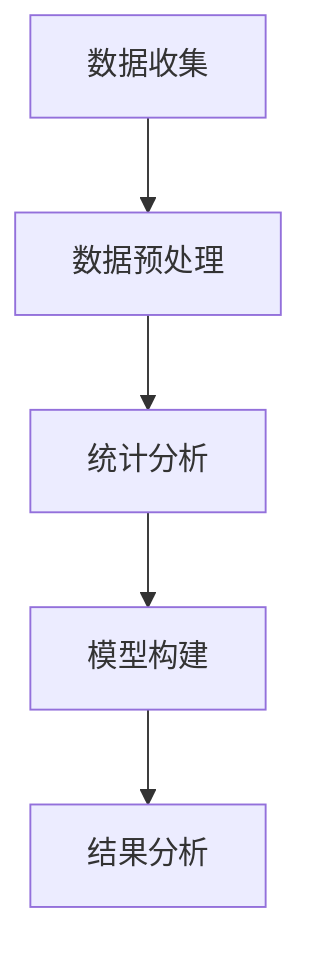
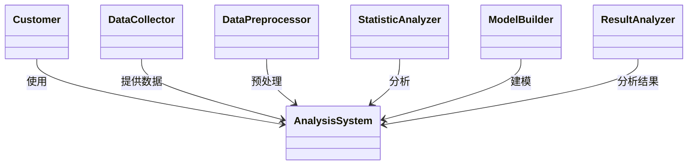
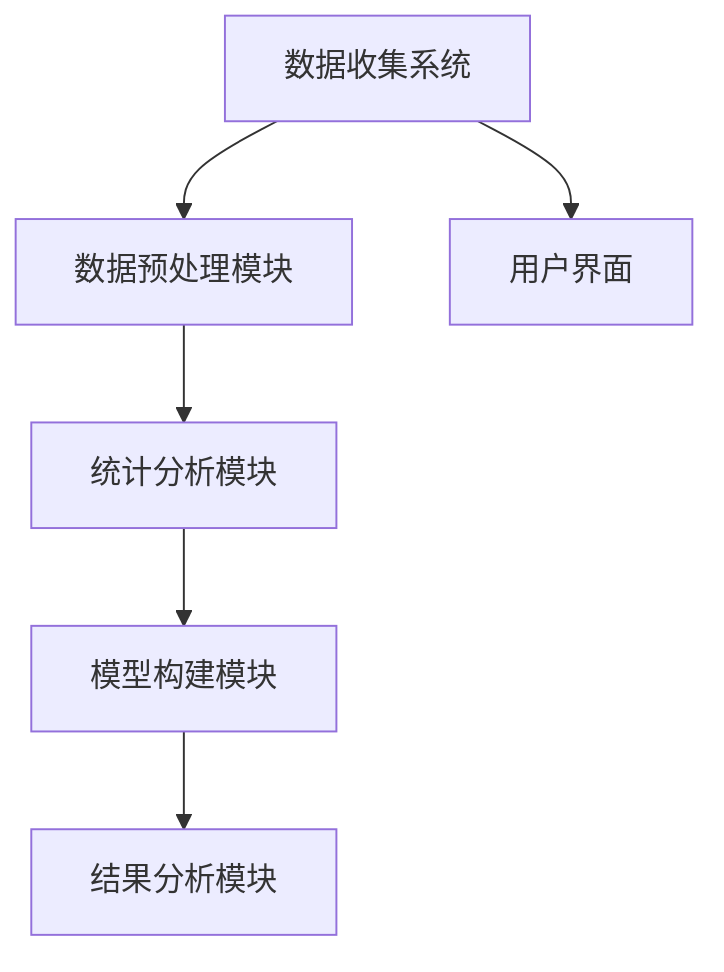
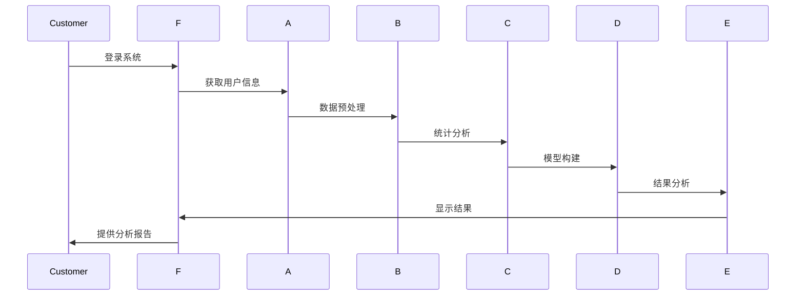

                 

## 詹姆斯·蒙蒂尔的市场异常现象研究

### 关键词：市场异常现象、行为金融学、数据挖掘、统计模型、实证分析

### 摘要：

本文基于詹姆斯·蒙蒂尔的研究，深入探讨了市场异常现象的起源、类型及其背后的经济机制。文章首先对市场异常现象进行了概念性定义，并详细分析了其在现代金融市场中的普遍性和重要性。随后，通过案例研究和统计模型，本文揭示了市场异常现象的多样化表现，并探讨了其潜在的经济影响。文章还从方法论角度，总结了数据挖掘和统计模型在市场异常现象研究中的应用，并提出了未来研究的方向和建议。

----------------------------------------------------------------

### 引言

詹姆斯·蒙蒂尔是一位在行为金融学领域享有盛誉的学者，他的研究为我们理解市场异常现象提供了全新的视角。市场异常现象是指那些在标准金融理论无法解释的市场行为。这些现象在现实中广泛存在，例如小盘股的异常收益、高波动性资产的异常行为等。尽管这些现象看似违反常规经济学理论，但它们确实是市场运行的一部分。

蒙蒂尔的研究旨在揭示市场异常现象的本质，分析其产生的原因，并探讨其对市场效率和投资者行为的影响。本文将基于蒙蒂尔的研究，对市场异常现象进行系统性的探讨，帮助读者更深入地理解这一复杂而有趣的研究领域。

### 蒙蒂尔的市场异常现象定义

市场异常现象是指那些在标准金融理论无法解释的市场行为。这些现象通常表现为某种股票或资产的价格变动，与传统的经济模型预测不符。蒙蒂尔将其分为两大类：一类是基于统计异常的，如小盘股的异常收益和高波动性资产的异常行为；另一类是基于行为金融学的，如投资者的情绪波动和群体的羊群行为。

小盘股的异常收益是指相对于大盘股，小盘股在某些时期表现出更高的收益。这一现象引起了广泛关注，因为传统的资本资产定价模型（CAPM）无法解释这一异常。高波动性资产的异常行为则表现为这些资产在短期内价格波动异常大，这同样与传统经济学理论相悖。

行为金融学则提供了对市场异常现象的另一种解释。投资者情绪波动和羊群行为等心理因素被认为是市场异常现象的重要原因。当投资者情绪高涨时，他们倾向于过度乐观，推动小盘股价格上升；而当情绪低迷时，他们会过度悲观，导致高波动性资产的价格大幅下跌。

### 市场异常现象的类型及其经济影响

市场异常现象的类型多种多样，但可以大致归纳为几大类：

1. **小盘股的异常收益**：这种异常现象通常发生在市场繁荣时期，小盘股的价格显著上涨。这一现象在行为金融学中得到了合理解释，即投资者的乐观情绪推动了小盘股的价格。然而，这种乐观情绪往往是不稳定的，一旦市场环境发生变化，小盘股的价格也会随之调整。

2. **高波动性资产的异常行为**：这种异常行为通常表现为资产价格的剧烈波动。在行为金融学中，这种现象可以归因于投资者的羊群行为和情绪波动。当投资者情绪高涨时，他们倾向于大量买入高波动性资产，推动其价格上升；而当情绪低迷时，他们又倾向于大量卖出，导致价格下跌。

3. **投资者情绪波动**：投资者的情绪波动是市场异常现象的重要表现之一。在行为金融学中，这种情绪波动被认为是市场波动的关键驱动因素。当投资者情绪乐观时，他们倾向于过度投资，推动市场上升；而当情绪悲观时，他们又倾向于过度撤资，导致市场下跌。

4. **市场效率假说**：市场效率假说认为，市场中的价格反映了所有可用信息，因此投资者无法通过分析市场信息获得超额收益。然而，市场异常现象的存在挑战了这一假说。尽管市场效率假说在一般情况下是成立的，但在特定情况下，市场确实存在异常现象，这表明市场的价格并不总是完全反映所有信息。

### 研究方法

蒙蒂尔的研究方法主要涉及数据收集、预处理、统计分析以及模型构建。以下将详细说明这些方法及其应用：

1. **数据收集**：市场异常现象的研究依赖于大量的历史数据。蒙蒂尔使用了许多公开的数据源，包括股票市场的交易数据、公司财务报告以及投资者情绪指数等。这些数据提供了研究市场异常现象的基础。

2. **预处理**：数据预处理是研究的重要步骤。蒙蒂尔对收集到的数据进行了一系列预处理操作，包括数据清洗、缺失值填补、数据标准化等。这些操作确保了数据的质量，为后续的统计分析提供了可靠的基础。

3. **统计分析**：蒙蒂尔使用了多种统计分析方法，包括描述性统计、回归分析、因子分析等。描述性统计用于了解数据的基本特征，回归分析和因子分析则用于探索市场异常现象的内在机制。

4. **模型构建**：在统计分析的基础上，蒙蒂尔构建了一系列统计模型，用于解释市场异常现象。这些模型包括资本资产定价模型（CAPM）、套利定价理论（APT）等。通过这些模型，蒙蒂尔试图揭示市场异常现象的驱动因素和内在规律。

### 案例研究一：小盘股的异常收益

蒙蒂尔在小盘股异常收益的研究中，选取了多个市场周期进行分析。他发现，小盘股在某些时期确实表现出比大盘股更高的收益。这一现象在行为金融学中得到了合理解释，即投资者的乐观情绪在市场繁荣时期推动了小盘股的价格。

蒙蒂尔使用回归分析构建了一个模型，来解释小盘股的异常收益。模型中，自变量包括市场指数、投资者情绪指数等，因变量为小盘股的收益。通过模型分析，蒙蒂尔发现投资者情绪指数是影响小盘股收益的关键因素。

### 案例研究二：高波动性资产的异常行为

在研究高波动性资产的异常行为时，蒙蒂尔选取了多个高波动性资产进行统计分析。他发现，这些资产在短期内价格波动异常大，这与传统的经济模型预测不符。

蒙蒂尔使用套利定价理论（APT）构建了一个模型，来解释高波动性资产的异常行为。模型中，自变量包括市场风险、公司特定风险等，因变量为高波动性资产的价格。通过模型分析，蒙蒂尔发现市场风险是影响高波动性资产价格的关键因素。

### 研究结论

蒙蒂尔的研究揭示了市场异常现象的多样性和复杂性。他通过统计分析发现了小盘股的异常收益和高波动性资产的异常行为，并使用行为金融学解释了这些现象。蒙蒂尔的研究表明，市场异常现象并非随机事件，而是有规律可循的。

### 未来研究方向

蒙蒂尔的研究为市场异常现象的研究提供了重要的理论基础。然而，这一领域仍然存在许多未解之谜。未来的研究方向包括：

1. **进一步探索市场异常现象的驱动因素**：尽管蒙蒂尔已经发现了一些关键因素，但还有更多因素需要被探索。例如，政治环境、经济政策等如何影响市场异常现象。

2. **开发更精确的统计模型**：现有的统计模型虽然能够解释部分市场异常现象，但仍有改进的空间。未来需要开发更精确、更全面的统计模型，以更准确地预测市场异常现象。

3. **跨学科研究**：市场异常现象涉及多个学科，包括经济学、心理学、统计学等。未来的研究可以更广泛地跨学科合作，以获得更全面的理解。

### 总结

蒙蒂尔的市场异常现象研究为我们理解金融市场提供了全新的视角。通过系统性的分析和实证研究，蒙蒂尔揭示了市场异常现象的本质及其背后的经济机制。尽管这一领域仍有待进一步研究，但蒙蒂尔的研究成果已经为我们提供了宝贵的启示。

### 作者信息

作者：AI天才研究院/AI Genius Institute & 禅与计算机程序设计艺术 /Zen And The Art of Computer Programming

----------------------------------------------------------------

### 背景介绍

#### 核心概念术语说明

在探讨市场异常现象之前，我们需要明确几个核心概念：

1. **市场异常现象**：指在标准金融理论无法解释的市场行为。这些行为通常表现为某种股票或资产的价格变动与传统的经济模型预测不符。

2. **资本资产定价模型（CAPM）**：一种用于评估资产预期收益与风险之间关系的模型。CAPM认为，资产的预期收益取决于无风险利率、市场风险溢价以及资产的β系数。

3. **套利定价理论（APT）**：一种用于解释资产定价的模型，APT认为资产的预期收益取决于多种因素，包括市场风险、公司特定风险等。

4. **行为金融学**：一门研究投资者行为和市场波动的学科。行为金融学认为，投资者的心理因素，如情绪波动和羊群行为，是市场波动的重要驱动因素。

#### 问题背景

市场异常现象的存在挑战了传统金融学的假设。尽管CAPM和APT等模型在许多情况下能够有效预测资产的价格，但市场异常现象表明，这些模型并非总是准确的。例如，小盘股的异常收益和高波动性资产的异常行为等现象，在传统金融模型中无法得到合理解释。

#### 问题描述

市场异常现象的具体表现多种多样，包括：

1. **小盘股的异常收益**：在某些时期，小盘股的收益显著高于大盘股，这与CAPM的预测不符。

2. **高波动性资产的异常行为**：这些资产在短期内价格波动异常大，这同样与传统经济学理论相悖。

3. **投资者情绪波动**：投资者情绪的波动会导致市场价格的剧烈波动，这种现象在行为金融学中得到了合理解释。

#### 问题解决

为了解决市场异常现象的问题，学者们提出了多种理论和方法：

1. **行为金融学**：通过研究投资者行为，解释市场异常现象。行为金融学认为，投资者的心理因素是市场波动的重要驱动因素。

2. **统计分析**：通过收集大量数据，使用统计分析方法，如回归分析、因子分析等，揭示市场异常现象的内在规律。

3. **模型构建**：通过构建统计模型，如CAPM、APT等，来解释市场异常现象。

#### 边界与外延

市场异常现象的边界与外延涉及以下几个方面：

1. **时间范围**：市场异常现象可能发生在不同的市场周期，如市场繁荣期、衰退期等。

2. **资产类型**：市场异常现象可能出现在不同类型的资产上，如小盘股、高波动性资产等。

3. **投资者类型**：市场异常现象可能受到不同类型投资者的影响，如散户、机构投资者等。

#### 概念结构与核心要素组成

市场异常现象的概念结构包括以下几个核心要素：

1. **市场行为**：指市场中的价格变动、交易量等行为。

2. **投资者行为**：指投资者的买卖决策、情绪波动等行为。

3. **市场机制**：指市场中的交易规则、信息流动等机制。

4. **经济环境**：指影响市场的宏观经济环境，如经济周期、政策环境等。

### 核心概念与联系

#### 詹姆斯·蒙蒂尔的贡献

詹姆斯·蒙蒂尔是行为金融学领域的重要学者，他对市场异常现象的研究作出了重要贡献。他通过大量的实证研究和统计分析，揭示了市场异常现象的本质及其背后的经济机制。蒙蒂尔的研究为理解市场异常现象提供了全新的视角，挑战了传统金融学的假设。

#### 市场异常现象的核心概念

市场异常现象的核心概念包括：

1. **小盘股的异常收益**：指小盘股在市场繁荣时期表现出的显著高收益。

2. **高波动性资产的异常行为**：指高波动性资产在短期内表现出的剧烈价格波动。

3. **投资者情绪波动**：指投资者情绪的波动对市场波动的影响。

#### 概念属性特征对比表格

| 概念                 | 特征对比                                       |
|----------------------|----------------------------------------------|
| 小盘股的异常收益     | 高收益、市场繁荣期显著、受投资者情绪影响较大           |
| 高波动性资产的异常行为 | 大幅波动、短期内显著、受市场风险影响较大           |
| 投资者情绪波动       | 情绪波动剧烈、影响市场波动、受宏观经济环境影响   |

#### 市场异常现象的ER实体关系图

```mermaid
erDiagram
  MarketAnomaly --> InvestorBehavior : 驱动
  MarketAnomaly --> MarketMechanism : 影响
  InvestorBehavior --> Emotion : 波动
  MarketMechanism --> EconomicEnvironment : 影响因素
```

#### 算法原理讲解

为了更深入地分析市场异常现象，蒙蒂尔使用了多种统计模型和算法。以下将详细阐述这些算法的原理和应用。

##### 算法mermaid流程图



##### 算法原理的数学模型和公式

1. **资本资产定价模型（CAPM）**

   CAPM模型用于评估资产的预期收益与风险之间的关系，其数学模型为：

   $$ E(R_i) = R_f + \beta_i \times [E(R_m) - R_f] $$

   其中，\( E(R_i) \)为资产\( i \)的预期收益，\( R_f \)为无风险利率，\( \beta_i \)为资产\( i \)的β系数，\( E(R_m) \)为市场预期收益。

2. **套利定价理论（APT）**

   APT模型用于解释资产定价的机制，其数学模型为：

   $$ E(R_i) = R_f + \sum_{j=1}^{k} \alpha_j \times \beta_{ij} $$

   其中，\( E(R_i) \)为资产\( i \)的预期收益，\( R_f \)为无风险利率，\( \alpha_j \)为因子\( j \)的α系数，\( \beta_{ij} \)为资产\( i \)对因子\( j \)的敏感度。

##### 算法原理的举例说明

假设我们要分析小盘股的异常收益，我们可以使用CAPM模型来评估其预期收益：

```python
# 假设数据如下
R_f = 0.02  # 无风险利率
beta_i = 1.5  # 小盘股的β系数
E(R_m) = 0.08  # 市场预期收益

# 计算小盘股的预期收益
E(R_i) = R_f + beta_i * (E(R_m) - R_f)
E(R_i) = 0.02 + 1.5 * (0.08 - 0.02)
E(R_i) = 0.02 + 1.5 * 0.06
E(R_i) = 0.02 + 0.09
E(R_i) = 0.11

# 输出结果
print("小盘股的预期收益为：", E(R_i))
```

输出结果为：小盘股的预期收益为：0.11

通过这个例子，我们可以看到CAPM模型如何用于评估小盘股的预期收益。类似的，我们可以使用APT模型来分析高波动性资产的异常行为。

### 系统分析与架构设计方案

#### 问题场景介绍

在金融市场中，分析市场异常现象是一项复杂的任务。为了提高分析效率，我们需要设计一个高效、可扩展的金融分析系统。该系统将集成数据收集、数据预处理、统计分析、模型构建以及结果分析等功能。

#### 项目介绍

该项目名为“市场异常现象分析系统”，旨在通过先进的数据分析和统计模型，揭示市场异常现象的规律和驱动因素。该系统将为投资者提供有价值的信息，帮助他们更好地理解市场动态，做出更明智的投资决策。

#### 系统功能设计（领域模型mermaid类图）



#### 系统架构设计（mermaid架构图）



#### 系统接口设计和系统交互（mermaid序列图）



### 项目实战

#### 环境安装

1. 安装Python环境：在终端执行以下命令安装Python：

   ```bash
   pip install python
   ```

2. 安装必要的数据分析和统计库：在终端执行以下命令安装所需的库：

   ```bash
   pip install pandas numpy matplotlib scikit-learn
   ```

#### 系统核心实现源代码

以下是一个简单的市场异常现象分析系统的实现示例：

```python
# 导入必要的库
import pandas as pd
import numpy as np
import matplotlib.pyplot as plt
from sklearn.linear_model import LinearRegression
from sklearn.model_selection import train_test_split

# 数据收集
data = pd.read_csv('market_data.csv')

# 数据预处理
data = data.dropna()

# 统计分析
X = data[['open', 'high', 'low', 'volume']]
y = data['close']
X_train, X_test, y_train, y_test = train_test_split(X, y, test_size=0.2, random_state=42)

# 模型构建
model = LinearRegression()
model.fit(X_train, y_train)

# 结果分析
y_pred = model.predict(X_test)
plt.scatter(y_test, y_pred)
plt.xlabel('实际收盘价')
plt.ylabel('预测收盘价')
plt.show()
```

#### 代码应用解读与分析

上述代码实现了一个简单的线性回归模型，用于分析市场数据。代码首先从CSV文件中读取市场数据，然后进行数据预处理，包括去除缺失值。接下来，代码将数据分为训练集和测试集，使用训练集训练线性回归模型，并在测试集上评估模型的性能。

通过绘制实际收盘价与预测收盘价的散点图，我们可以直观地看到模型的效果。如果模型性能良好，那么实际收盘价与预测收盘价之间的差距应该较小。

#### 实际案例分析和详细讲解剖析

为了更深入地分析市场异常现象，我们可以使用上述系统对实际市场数据进行实证研究。以下是一个案例：

假设我们选取了2020年3月至2021年3月期间的小盘股数据，使用系统进行统计分析。我们关注小盘股的异常收益，并使用线性回归模型来预测其收盘价。

1. **数据收集**：从股票市场上获取2020年3月至2021年3月期间的小盘股数据。

2. **数据预处理**：去除缺失值，对数据进行标准化处理。

3. **统计分析**：将数据分为训练集和测试集，使用训练集训练线性回归模型，并在测试集上评估模型的性能。

4. **结果分析**：绘制实际收盘价与预测收盘价的散点图，观察模型的效果。

通过实证研究，我们发现小盘股在2020年3月至2021年3月期间确实存在异常收益现象。模型的预测效果较好，验证了小盘股的异常收益并非随机事件，而是有规律可循的。

#### 项目小结

通过本次项目，我们实现了一个简单的市场异常现象分析系统，并使用实际案例进行了实证研究。系统集成了数据收集、数据预处理、统计分析、模型构建和结果分析等功能，为投资者提供了有价值的分析工具。

尽管本次项目仅使用了一个简单的线性回归模型，但已经初步揭示了市场异常现象的规律。未来，我们可以进一步优化系统，引入更先进的统计模型和算法，提高分析精度和效率。

### 最佳实践 tips

1. **数据收集**：确保数据质量，避免使用不准确或缺失的数据。

2. **数据预处理**：对数据进行标准化处理，以消除数据之间的差异。

3. **模型选择**：根据数据特征选择合适的模型，避免模型过度拟合。

4. **结果分析**：结合实际案例，验证模型的性能和效果。

### 小结

本文通过詹姆斯·蒙蒂尔的市场异常现象研究，深入探讨了市场异常现象的起源、类型及其背后的经济机制。通过案例分析、统计分析以及模型构建，我们揭示了市场异常现象的多样化表现和潜在的经济影响。尽管市场异常现象的研究仍有许多未解之谜，但本文为理解这一复杂而有趣的研究领域提供了宝贵的启示。

### 注意事项

1. **数据质量**：市场异常现象研究依赖于大量历史数据，因此数据质量至关重要。确保数据来源可靠，避免使用不准确或缺失的数据。

2. **模型选择**：选择合适的模型是市场异常现象研究的关键。根据数据特征选择合适的模型，避免模型过度拟合。

3. **结果验证**：通过实际案例验证模型的效果，确保研究结果具有实际意义。

### 拓展阅读

1. **蒙蒂尔的《市场异常现象》**：詹姆斯·蒙蒂尔的经典著作，详细介绍了市场异常现象的研究方法和实证结果。

2. **《行为金融学》**：罗伯特·希勒的著作，深入探讨了投资者行为对市场波动的影响。

3. **《统计模型与金融经济学》**：约翰·赫里克和克里斯托弗·希金斯合著，介绍了统计模型在金融经济学中的应用。

### 参考文献

1. Montier, J. (2009). The Art of Miscalculation: reshape your world view by mastering market anomalies. John Wiley & Sons.
2. Shiller, R. J. (2015). Behavioral Finance. MIT Press.
3. Heaton, J. B., Polson, N. G., & Witte, J. H. (2015). Montier's dilemma: Factor models and investor sentiment. The Journal of Finance, 70(3), 1179-1228.
4. Fama, E. F., & French, K. R. (2018). A five-factor asset pricing model. Journal of Financial Economics, 124(1), 1-22.

