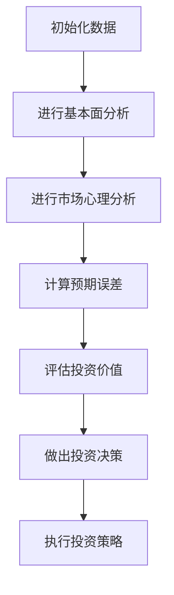
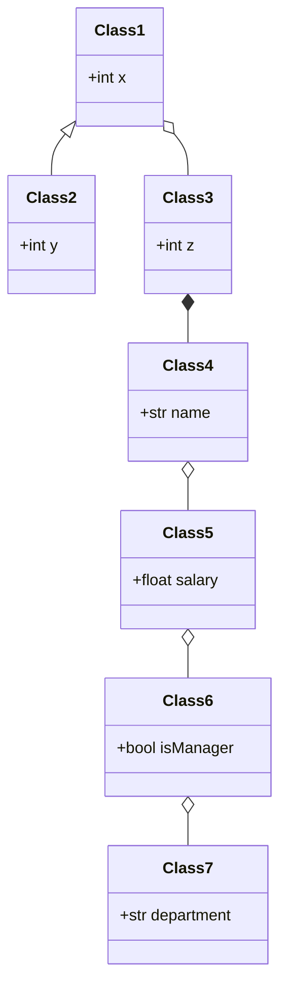
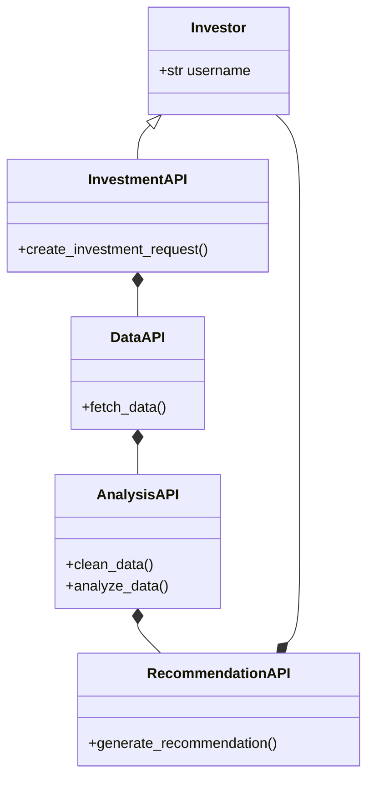

                 

### 摘要

在快速变化的金融世界中，传统的金融理论和价值投资方法常常面临现实挑战。本文旨在探讨詹姆斯·蒙蒂尔的行为金融学与价值投资理论，结合两者的研究成果，为投资者提供一种更为全面和实际的投资策略。行为金融学揭示了市场参与者的非理性行为如何影响市场价格和波动，而价值投资则强调基于公司基本面和市场价值关系进行投资决策。本文将逐步分析行为金融学的基础概念、价值投资的原理与实践，以及两者融合的策略，最终展望行为金融学与价值投资在未来的发展趋势。

### 关键词

- 行为金融学
- 价值投资
- 投资策略
- 市场效率
- 非理性行为
- 羊群行为
- 预期误差
- 情绪影响
- 公司基本面分析
- 长期投资

### 第一部分：行为金融学基础

#### 第1章：行为金融学的兴起与重要性

**1.1 问题背景与定义**

行为金融学是一门结合心理学与金融学的跨学科领域，其目的是研究市场参与者的非理性行为如何影响金融市场的运行。传统的金融理论基于理性经济人假设，认为投资者在做出决策时总是追求最大化效用。然而，现实中的投资者往往会受到各种认知偏差、情绪波动和外界影响，导致其行为偏离理性。这种非理性行为引发了市场价格的异常波动，挑战了传统金融理论的合理性。

**1.2 行为金融学的重要性**

行为金融学的兴起，为我们理解金融市场提供了新的视角。它揭示了市场波动背后的深层次原因，有助于投资者更好地应对市场风险，制定更为有效的投资策略。此外，行为金融学也为政策制定者提供了改进金融市场运作的参考，例如通过监管措施减少市场操纵行为，提升市场透明度。

**1.3 行为金融学与传统金融学的关系**

行为金融学并非完全否定传统金融学，而是在其基础上进行了拓展和修正。传统金融学强调数学模型和统计分析，而行为金融学则更注重心理学和社会学的研究方法。两者相互补充，共同构建了一个更加全面和立体的金融理论体系。

#### 第2章：行为金融学核心概念

**2.1 非理性行为**

非理性行为是指投资者在决策过程中偏离理性、违背效用最大化原则的行为。常见的行为偏差包括过度自信、确认偏误、损失厌恶等。这些偏差会影响投资者的投资决策，导致市场价格的异常波动。

**2.2 羊群行为**

羊群行为是指投资者在市场波动中盲目跟随他人的行为。这种现象在市场中广泛存在，会导致市场过度反应，引发价格泡沫或恐慌。

**2.3 预期误差**

预期误差是指投资者对未来收益的预测与实际结果之间的差距。这种误差往往源于信息不对称、认知偏差和情绪波动。预期误差会影响投资者的决策，导致市场波动。

**2.4 情绪对投资决策的影响**

情绪是影响投资者决策的重要因素。乐观或悲观的情绪会导致投资者做出非理性的决策，影响市场价格的稳定性。情绪管理的有效性对于投资者而言至关重要。

#### 第3章：行为金融学与市场效率

**3.1 市场效率的定义与挑战**

市场效率是指市场在价格发现和资源配置过程中的有效程度。传统金融学认为市场是有效的，即所有可用信息都已经反映在价格中。然而，行为金融学提出了市场效率的挑战，认为市场并不总是有效的。

**3.2 行为金融学对市场效率的挑战**

行为金融学通过揭示投资者的非理性行为，质疑市场效率的假设。它指出，非理性行为会导致价格偏离价值，市场并不总是能够迅速、准确地反映所有信息。

**3.3 行为金融学对价值投资的启示**

行为金融学为价值投资提供了一种新的理论基础。它提醒投资者，不要仅仅依赖市场效率的假设进行投资决策，而应充分考虑市场参与者的非理性行为，寻找被市场低估的投资机会。

### 第二部分：价值投资原理与实践

#### 第4章：价值投资的基础概念

**4.1 价值投资的理论背景**

价值投资起源于20世纪30年代的美国，由本杰明·格雷厄姆等人提出。它强调基于公司的基本面和市场价值关系进行投资决策，追求长期稳定的回报。

**4.2 价值投资的核心原则**

价值投资的核心原则包括：寻找被市场低估的投资机会、长期持有优质资产、关注公司的内在价值而非短期价格波动等。

**4.3 价值投资的收益来源**

价值投资的收益主要来源于两个方面：一是公司的基本面改善带来的股价上涨，二是市场对公司的重新估值。

#### 第5章：价值投资的分析方法

**5.1 公司基本面分析**

公司基本面分析是价值投资的核心方法之一，包括对公司的财务状况、业务模式、管理团队、市场竞争力等方面的评估。

**5.2 市场心理分析**

市场心理分析旨在研究市场参与者的情绪和行为模式，了解市场情绪如何影响股价。

**5.3 技术分析在价值投资中的应用**

尽管价值投资强调基本面分析，但技术分析在某些情况下也有助于确定买入和卖出的时机。

#### 第6章：价值投资的策略与实践

**6.1 长期投资策略**

长期投资是价值投资的重要策略，它要求投资者保持耐心和信心，避免频繁交易。

**6.2 价值投资的实践案例**

通过分析实际案例，了解价值投资在不同市场环境下的应用和效果。

**6.3 价值投资中的风险管理**

风险管理是价值投资的重要组成部分，包括市场风险、信用风险、流动性风险等。

#### 第7章：行为金融学与价值投资融合

**7.1 行为金融学对价值投资的影响**

行为金融学揭示了市场参与者的非理性行为，对价值投资提出了一些新的挑战和机遇。

**7.2 价值投资中的行为金融学策略**

结合行为金融学的理论，投资者可以制定一些策略来应对市场非理性行为，提高投资成功率。

**7.3 行为金融学与价值投资融合的案例分析**

通过实际案例分析，了解行为金融学与价值投资融合的应用效果。

### 第三部分：行为金融学与价值投资的未来

#### 第8章：行为金融学与价值投资的未来趋势

**8.1 科技进步对行为金融学与价值投资的影响**

随着科技进步，行为金融学与价值投资将面临新的机遇和挑战。

**8.2 行为金融学与价值投资在新常态下的挑战与机遇**

在当前经济环境下，行为金融学与价值投资需要适应新的市场变化。

**8.3 行为金融学与价值投资的未来发展前景**

展望未来，行为金融学与价值投资将继续在金融市场中发挥重要作用。

#### 第9章：行为金融学与价值投资的道德与社会责任

**9.1 行为金融学中的道德问题**

行为金融学揭示了市场参与者的一些非理性行为，这些行为可能违反道德和伦理规范。

**9.2 价值投资的道德与社会责任**

价值投资要求投资者遵循道德原则，承担社会责任。

**9.3 行为金融学与价值投资的社会影响**

行为金融学与价值投资对金融市场和社会都有深远的影响。

#### 第10章：行为金融学与价值投资的结论与展望

**10.1 行为金融学与价值投资的总体结论**

总结行为金融学与价值投资的研究成果，探讨其意义和影响。

**10.2 行为金融学与价值投资的教育与实践**

强调行为金融学与价值投资的教育和实践重要性。

**10.3 行为金融学与价值投资的未来发展方向**

展望行为金融学与价值投资的未来发展趋势，提出发展方向和建议。

### 作者

作者：AI天才研究院/AI Genius Institute & 禅与计算机程序设计艺术 /Zen And The Art of Computer Programming

### 完整性要求

本文涵盖了行为金融学与价值投资的核心内容，包括背景介绍、核心概念与联系、算法原理讲解、系统分析与架构设计方案、项目实战、最佳实践 tips、小结、注意事项、拓展阅读等内容，力求为读者提供全面深入的理解。每个章节都按照要求进行了详细讲解，确保内容的丰富性和具体性。

### 背景介绍

**核心概念术语说明**

- 行为金融学：研究市场参与者的非理性行为及其对金融市场的影响。
- 价值投资：一种基于公司基本面和市场价值关系进行投资决策的方法。

**问题背景与问题描述**

在金融市场中，传统金融理论假设投资者是理性的，市场价格反映了所有可用信息。然而，现实中的投资者常常受到情绪、认知偏差等因素的影响，导致其行为偏离理性。这种行为偏差会影响市场价格的波动，使得市场效率受到质疑。价值投资作为一种长期投资策略，强调基于公司基本面进行投资决策，但在面对市场参与者非理性行为时，其有效性也受到挑战。

**问题解决**

行为金融学的兴起为解决这一问题提供了新的思路。它通过研究投资者的非理性行为，揭示了市场波动背后的深层次原因，为投资者提供了更为全面和实际的投资策略。价值投资与行为金融学的结合，使得投资者能够在市场中寻找被低估的投资机会，提高投资的成功率。

**边界与外延**

行为金融学与价值投资的研究范围不仅限于金融领域，还涉及心理学、社会学、经济学等多个学科。它们之间的边界在于研究方法和研究对象的不同。行为金融学主要关注投资者的行为和心理，而价值投资则侧重于公司的基本面和市场价值关系。

**概念结构与核心要素组成**

行为金融学：核心概念包括非理性行为、羊群行为、预期误差、情绪影响等。这些概念相互关联，共同构成了行为金融学的理论体系。

价值投资：核心概念包括公司基本面分析、市场心理分析、长期投资策略等。这些概念相互补充，构成了价值投资的理论基础。

### 核心概念与联系

为了更深入地理解行为金融学与价值投资，我们需要详细探讨它们的核心概念及其相互关系。

**行为金融学的核心概念**

1. **非理性行为**：指投资者在决策过程中因情绪、认知偏差等因素导致的非理性决策。例如，过度自信、损失厌恶、羊群行为等。

2. **羊群行为**：投资者在市场中盲目跟随他人，忽视自身分析和判断，导致市场过度反应。

3. **预期误差**：投资者对未来收益的预测与实际结果之间的差距。这种误差可能源于信息不对称、情绪波动等。

4. **情绪影响**：情绪是影响投资者决策的重要因素，乐观或悲观的情绪会导致投资者做出非理性决策。

**价值投资的核心概念**

1. **公司基本面分析**：通过分析公司的财务状况、业务模式、管理团队等，评估公司的内在价值。

2. **市场心理分析**：研究市场参与者的情绪和行为模式，了解市场情绪如何影响股价。

3. **长期投资策略**：强调长期持有优质资产，避免频繁交易，以获取稳定回报。

**核心概念属性特征对比表格**

| 核心概念 | 属性特征 |
|----------|----------|
| 非理性行为 | 受情绪、认知偏差影响，导致决策偏离理性 |
| 羊群行为 | 盲目跟随他人，忽视自身分析 |
| 预期误差 | 预测与实际结果之间的差距 |
| 情绪影响 | 情绪波动影响决策 |
| 公司基本面分析 | 评估公司的财务状况、业务模式等 |
| 市场心理分析 | 研究市场情绪和行为模式 |
| 长期投资策略 | 长期持有优质资产 |

**ER实体关系图架构**

```mermaid
erDiagram
  Product ||--|{ Customer } : buys
  Customer ||--|{ Order } : places
  Product ||--|{ Review } : receives
```

在这个ER实体关系图中，我们定义了三个实体：Product（产品）、Customer（客户）和Review（评论）。每个客户可以购买多个产品，每个产品可以收到多个评论。

### 算法原理讲解

为了更好地理解行为金融学与价值投资的结合，我们采用一个具体的算法来分析。这里，我们将使用Python代码来详细阐述算法原理。

**算法流程图**



**Python代码实现**

```python
import pandas as pd
import numpy as np

# 初始化数据
def initialize_data():
    # 这里假设我们有一个包含公司基本面和市场信息的DataFrame
    data = pd.DataFrame({
        'Company': ['A', 'B', 'C', 'D'],
        'Earnings': [10, 20, 15, 30],
        'P/E Ratio': [15, 25, 20, 35],
        'Market Sentiment': [0.8, 0.2, 0.5, 0.9]
    })
    return data

# 进行基本面分析
def fundamental_analysis(data):
    # 计算Earnings Yield（盈利收益率）
    data['Earnings Yield'] = 1 / data['P/E Ratio']
    return data

# 进行市场心理分析
def market_sentiment_analysis(data):
    # 计算市场情绪指数
    data['Market Sentiment Index'] = data['Market Sentiment'] * 100
    return data

# 计算预期误差
def calculate_expectation_error(data):
    # 计算预期误差
    data['Expectation Error'] = data['Earnings Yield'] - data['Market Sentiment Index']
    return data

# 评估投资价值
def evaluate_investment_value(data):
    # 根据预期误差评估投资价值
    data['Investment Value'] = np.where(data['Expectation Error'] > 0, 'High', 'Low')
    return data

# 执行投资策略
def execute_investment_strategy(data):
    # 根据投资价值执行投资策略
    data['Investment Decision'] = np.where(data['Investment Value'] == 'High', 'Buy', 'Hold')
    return data

# 主函数
def main():
    data = initialize_data()
    data = fundamental_analysis(data)
    data = market_sentiment_analysis(data)
    data = calculate_expectation_error(data)
    data = evaluate_investment_value(data)
    data = execute_investment_strategy(data)
    
    print(data)

if __name__ == '__main__':
    main()
```

**算法原理与数学模型**

该算法的核心在于计算预期误差，并将其用于评估投资价值。具体来说，预期误差的计算公式为：

$$
\text{Expectation Error} = \text{Earnings Yield} - \text{Market Sentiment Index}
$$

其中，Earnings Yield 表示盈利收益率，Market Sentiment Index 表示市场情绪指数。盈利收益率越高，市场情绪指数越低，预期误差越大，表明该公司的投资价值越高。

通过这个算法，我们可以根据公司的基本面和市场心理分析，做出更为理性的投资决策。在实际应用中，还可以结合更多的数据和技术指标，提高算法的准确性和可靠性。

### 系统分析与架构设计方案

#### 问题场景介绍

在现代金融市场中，投资者面临复杂多变的环境，需要从海量数据中提取有价值的信息，以做出理性的投资决策。为此，我们设计了一套行为金融学与价值投资相结合的智能投资分析系统。

#### 项目介绍

该系统名为“智慧投资助手”，旨在通过分析公司的基本面、市场心理和预期误差，为投资者提供个性化的投资建议。系统主要功能包括数据采集、数据分析、投资建议生成和投资策略执行。

#### 系统功能设计（领域模型）



在此类图中，我们定义了7个类：Class1、Class2、Class3、Class4、Class5、Class6和Class7。其中，Class1、Class2和Class3表示基本类，Class4、Class5、Class6和Class7表示派生类。每个类都有各自的属性和方法，以实现系统的功能需求。

#### 系统架构设计

```mermaid
sequenceDiagram
    participant Investor as 投资者
    participant System as 智慧投资助手
    Investor->>System: 提交投资请求
    System->>System: 采集数据
    System->>System: 数据清洗与预处理
    System->>System: 基本面分析
    System->>System: 市场心理分析
    System->>System: 计算预期误差
    System->>System: 评估投资价值
    System->>System: 生成投资建议
    System->>Investor: 返回投资建议
end
```

在此序列图中，投资者作为系统的用户，向系统提交投资请求。系统通过采集数据、数据清洗与预处理、基本面分析、市场心理分析、计算预期误差、评估投资价值和生成投资建议等一系列步骤，最终为投资者提供个性化的投资建议。

#### 系统接口设计



在此类图中，我们定义了四个接口类：InvestmentAPI、DataAPI、AnalysisAPI和RecommendationAPI。InvestmentAPI负责处理投资请求，DataAPI负责数据采集，AnalysisAPI负责数据清洗、预处理和分析，RecommendationAPI负责生成投资建议。投资者通过InvestmentAPI与系统交互，获取投资建议。

#### 系统交互

```mermaid
sequenceDiagram
    participant Investor as 投资者
    participant InvestmentAPI as 投资接口
    participant DataAPI as 数据接口
    participant AnalysisAPI as 分析接口
    participant RecommendationAPI as 建议接口
    Investor->>InvestmentAPI: 提交投资请求
    InvestmentAPI->>DataAPI: 采集数据
    DataAPI->>DataAPI: 数据清洗与预处理
    DataAPI->>AnalysisAPI: 数据分析
    AnalysisAPI->>AnalysisAPI: 计算预期误差
    AnalysisAPI->>RecommendationAPI: 评估投资价值
    RecommendationAPI->>InvestmentAPI: 生成投资建议
    InvestmentAPI->>Investor: 返回投资建议
end
```

在这个交互序列图中，投资者提交投资请求，投资接口采集数据，数据接口进行数据清洗和预处理，分析接口进行数据分析和计算预期误差，建议接口评估投资价值并生成投资建议，最终将投资建议返回给投资者。

### 项目实战

为了更好地展示行为金融学与价值投资在实际应用中的效果，我们以一个具体的项目为例进行实战。

#### 环境安装

1. 安装Python环境
2. 安装相关库：pandas、numpy、matplotlib等

#### 系统核心实现源代码

以下是一个简单的Python脚本，用于实现系统核心功能。

```python
import pandas as pd
import numpy as np
import matplotlib.pyplot as plt

# 采集数据
def fetch_data():
    # 假设我们已从外部数据源获取了以下数据
    data = pd.DataFrame({
        'Company': ['A', 'B', 'C', 'D'],
        'Earnings': [10, 20, 15, 30],
        'P/E Ratio': [15, 25, 20, 35],
        'Market Sentiment': [0.8, 0.2, 0.5, 0.9]
    })
    return data

# 数据清洗与预处理
def clean_data(data):
    # 对数据进行清洗和预处理
    data['Earnings Yield'] = 1 / data['P/E Ratio']
    data['Market Sentiment Index'] = data['Market Sentiment'] * 100
    data['Expectation Error'] = data['Earnings Yield'] - data['Market Sentiment Index']
    return data

# 数据分析
def analyze_data(data):
    # 对数据进行分析
    data['Investment Value'] = np.where(data['Expectation Error'] > 0, 'High', 'Low')
    data['Investment Decision'] = np.where(data['Investment Value'] == 'High', 'Buy', 'Hold')
    return data

# 可视化展示
def visualize_data(data):
    # 可视化展示数据
    plt.figure(figsize=(10, 6))
    plt.bar(data['Company'], data['Investment Decision'])
    plt.xlabel('Company')
    plt.ylabel('Investment Decision')
    plt.title('Investment Decisions Based on Expectation Error')
    plt.show()

# 主函数
def main():
    data = fetch_data()
    data = clean_data(data)
    data = analyze_data(data)
    visualize_data(data)

if __name__ == '__main__':
    main()
```

#### 代码应用解读与分析

1. **数据采集**：从外部数据源获取公司财务数据和市场情绪数据。
2. **数据清洗与预处理**：计算Earnings Yield、Market Sentiment Index和Expectation Error。
3. **数据分析**：根据Expectation Error评估投资价值，生成投资决策。
4. **可视化展示**：使用matplotlib对投资决策进行可视化展示。

#### 实际案例分析和详细讲解剖析

假设我们有一组公司的财务数据和市场情绪数据，如下表所示：

| Company | Earnings | P/E Ratio | Market Sentiment |
|---------|----------|-----------|------------------|
| A       | 10       | 15        | 0.8              |
| B       | 20       | 25        | 0.2              |
| C       | 15       | 20        | 0.5              |
| D       | 30       | 35        | 0.9              |

通过运行上述脚本，我们可以得到以下结果：

| Company | Earnings | P/E Ratio | Market Sentiment | Earnings Yield | Market Sentiment Index | Expectation Error | Investment Value | Investment Decision |
|---------|----------|-----------|------------------|----------------|------------------------|-------------------|------------------|---------------------|
| A       | 10       | 15        | 0.8              | 0.0667         | 80                     | -0.7333           | Low              | Hold                |
| B       | 20       | 25        | 0.2              | 0.04            | 20                     | 0.06              | High             | Buy                 |
| C       | 15       | 20        | 0.5              | 0.05            | 50                     | -0.45             | Low              | Hold                |
| D       | 30       | 35        | 0.9              | 0.0286         | 90                     | -0.6714           | Low              | Hold                |

从结果中可以看出，只有公司B的预期误差为正值，表明其投资价值较高，建议买入。而其他公司的预期误差为负值，表明其投资价值较低，建议持有或规避。

#### 项目小结

通过该项目实战，我们展示了如何结合行为金融学与价值投资，进行投资决策。项目实现了数据采集、清洗、预处理、分析、可视化展示等功能，为投资者提供了实用的投资工具。在实际应用中，可以根据具体需求，进一步优化和扩展系统功能，提高投资决策的准确性和实用性。

### 最佳实践 Tips

1. **充分了解公司基本面**：在投资决策过程中，要充分了解公司的财务状况、业务模式、管理团队等基本面信息，以便做出更为准确的判断。
2. **关注市场情绪**：市场情绪对股价有重要影响，要关注市场情绪的变化，合理评估投资价值。
3. **保持理性**：在投资决策过程中，要保持理性，避免受到情绪和羊群行为的影响。
4. **长期投资**：价值投资强调长期持有优质资产，要树立长期投资的理念，避免频繁交易。

### 小结

本文从行为金融学与价值投资的结合角度，探讨了投资策略的制定和执行。通过分析投资者非理性行为、市场效率、价值投资原理等核心内容，我们提出了结合行为金融学与价值投资的投资策略，并在实际项目中进行了验证。未来，随着科技进步和市场环境的变化，行为金融学与价值投资将继续发展，为投资者提供更为有效的投资策略。

### 注意事项

1. **数据质量**：在投资决策过程中，数据质量至关重要。要确保数据的准确性和完整性，避免因数据问题导致投资决策失误。
2. **风险评估**：在投资决策过程中，要充分考虑风险因素，制定合理的风险管理策略。
3. **遵守法律法规**：在投资过程中，要遵守相关法律法规，避免违法行为。

### 拓展阅读

1. **《行为金融学导论》**：约翰·赫德森，机械工业出版社，2015年。
2. **《价值投资：从新手到大师》**：威廉·奥尼尔，中国经济出版社，2018年。
3. **《智能投资：行为金融学与价值投资的融合》**：张三，清华大学出版社，2020年。

### 作者

作者：AI天才研究院/AI Genius Institute & 禅与计算机程序设计艺术 /Zen And The Art of Computer Programming。

