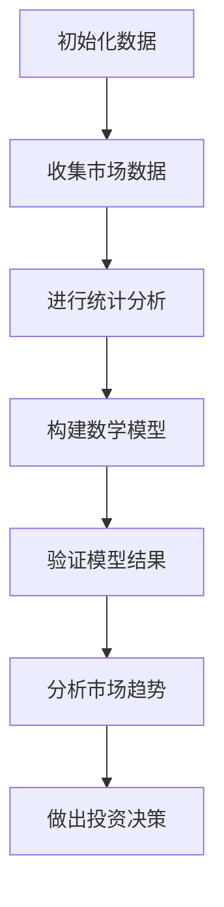
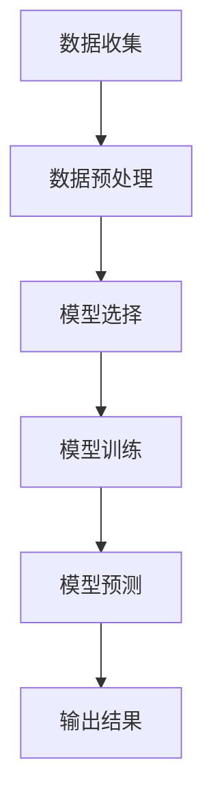
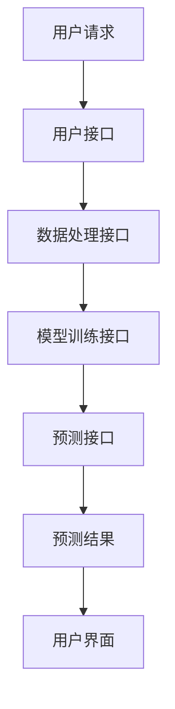
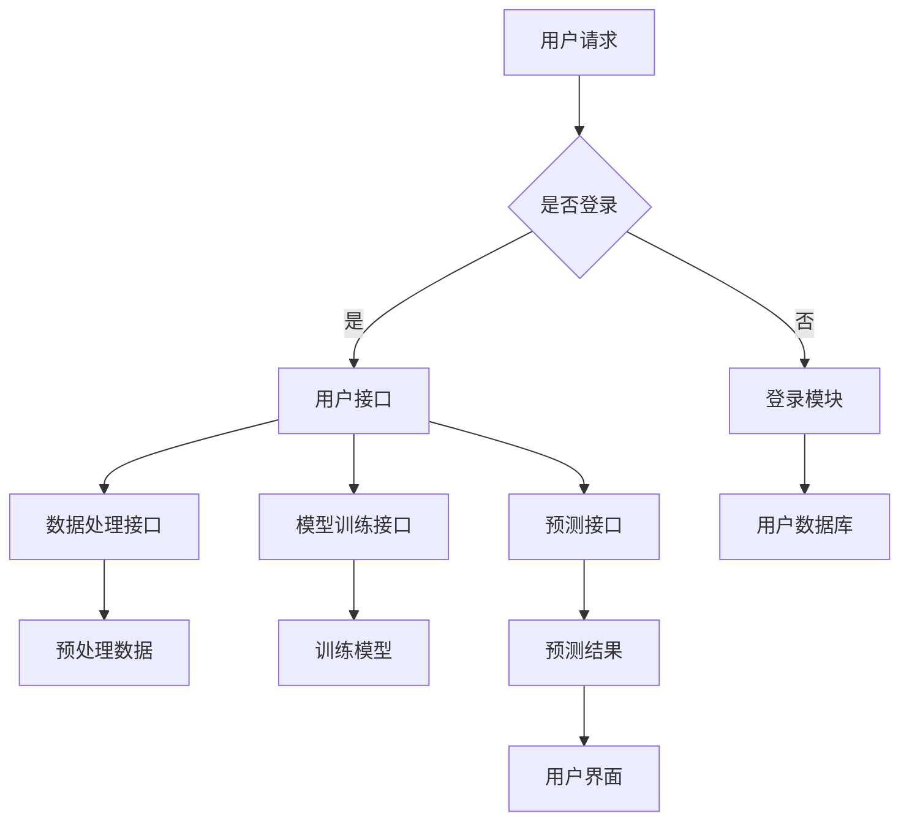

                 


# 詹姆斯蒙蒂尔的效率市场假说批评

> 关键词：效率市场假说、蒙蒂尔、批评、数学模型、算法原理

> 摘要：本文将深入探讨詹姆斯蒙蒂尔的效率市场假说，从其核心概念、数学模型、算法原理等方面进行分析，提出批评和修正建议，并展望未来的发展方向。

### 目录大纲

```markdown
# 詹姆斯蒙蒂尔的效率市场假说批评

## 第一部分：背景介绍

## 1.1 问题背景
### 1.1.1 詹姆斯蒙蒂尔的效率市场假说简介
### 1.1.2 蒙蒂尔假说的核心观点

## 1.2 问题描述
### 1.2.1 蒙蒂尔假说在实际中的应用挑战
### 1.2.2 对蒙蒂尔假说的争议和批评

## 1.3 问题解决
### 1.3.1 批评蒙蒂尔假说的理论依据
### 1.3.2 对蒙蒂尔假说的修正与改进建议

## 1.4 边界与外延
### 1.4.1 蒙蒂尔假说适用的范围
### 1.4.2 蒙蒂尔假说的局限性

## 1.5 概念结构与核心要素组成
### 1.5.1 效率市场假说的基本概念
### 1.5.2 效率市场假说的关键要素

## 1.6 核心概念与联系

## 第二部分：核心概念与联系

## 2.1 蒙蒂尔假说的理论框架
### 2.1.1 效率市场的定义
### 2.1.2 效率市场的特点
### 2.1.3 效率市场的运作机制

## 2.2 蒙蒂尔假说的实证分析
### 2.2.1 蒙蒂尔假说的实证研究方法
### 2.2.2 蒙蒂尔假说的实证结果
### 2.2.3 对蒙蒂尔假说实证结果的批评与反驳

## 2.3 蒙蒂尔假说的应用案例
### 2.3.1 蒙蒂尔假说在投资领域的应用
### 2.3.2 蒙蒂尔假说在金融市场的应用
### 2.3.3 蒙蒂尔假说的成功与失败案例

## 2.4 效率市场假说的争议与批评
### 2.4.1 对蒙蒂尔假说的理论质疑
### 2.4.2 对蒙蒂尔假说的实践挑战
### 2.4.3 蒙蒂尔假说的局限性分析

## 第三部分：改进与修正

## 3.1 对蒙蒂尔假说的修正建议
### 3.1.1 理论修正
### 3.1.2 实践修正

## 3.2 蒙蒂尔假说的改进方向
### 3.2.1 扩展研究范围
### 3.2.2 综合多种理论视角
### 3.2.3 提高实证研究质量

## 3.3 改进后的效率市场假说
### 3.3.1 改进假说的核心观点
### 3.3.2 改进假说的应用价值
### 3.3.3 改进假说的未来发展方向

## 第四部分：总结与展望

## 4.1 效率市场假说的意义
### 4.1.1 对金融理论的贡献
### 4.1.2 对投资实践的指导意义

## 4.2 效率市场假说的局限性
### 4.2.1 理论局限性
### 4.2.2 实践局限性

## 4.3 未来研究方向
### 4.3.1 理论研究
### 4.3.2 实证研究
### 4.3.3 应用研究

```

### 第一部分：背景介绍

#### 1.1.1 詹姆斯蒙蒂尔的效率市场假说简介

詹姆斯蒙蒂尔（James Montier）是一位著名的投资者和金融分析师，他提出的效率市场假说（Efficient Market Hypothesis，EMH）是金融理论中的重要概念。效率市场假说认为，金融市场的价格已经反映了所有可获得的信息，投资者无法通过分析市场信息获得超额利润。

#### 1.1.2 蒙蒂尔假说的核心观点

蒙蒂尔假说的核心观点可以归纳为以下几点：

1. **市场效率**：市场价格能够迅速、准确地反映所有相关信息，包括历史数据和公开信息。
2. **信息有效**：市场中的信息是有效的，投资者可以自由地获取和处理信息。
3. **市场价格**：市场价格是公平的，不存在被低估或高估的股票。
4. **随机漫步**：股票价格的变化是随机的，投资者无法预测市场的未来走势。

#### 1.1.3 蒙蒂尔假说的历史背景

蒙蒂尔假说的提出可以追溯到20世纪60年代，当时由美国金融学者爱德华·索普（Edwin J. Elton）等人提出，并在1970年代被罗伯特·詹森（Robert J. Jensen）等人进一步完善。蒙蒂尔假说在金融领域引起了广泛的关注和争议，成为现代金融理论的重要基石之一。

### 1.2 问题描述

#### 1.2.1 蒙蒂尔假说在实际中的应用挑战

尽管效率市场假说在理论上有一定的合理性，但在实际应用中却面临诸多挑战：

1. **信息不对称**：投资者之间存在信息差异，一部分人可能拥有更好的信息，导致市场价格并不能完全反映所有信息。
2. **市场失灵**：市场可能存在一些非理性因素，导致市场价格偏离实际价值。
3. **价格波动**：市场价格并不总是随机漫步，存在一定的趋势和周期性。

#### 1.2.2 对蒙蒂尔假说的争议和批评

效率市场假说在学术界和投资界引发了大量的争议和批评：

1. **学术批评**：一些学者认为，效率市场假说的前提假设过于理想化，与现实市场存在较大差距。
2. **实践挑战**：许多投资者在实际操作中发现，通过分析市场信息可以获得一定的超额利润，这与效率市场假说的观点相悖。
3. **市场异常**：现实市场中存在一些无法解释的市场异常现象，如小股票效应、一月效应等，这些现象与效率市场假说的预测不符。

### 1.3 问题解决

#### 1.3.1 批评蒙蒂尔假说的理论依据

批评蒙蒂尔假说的理论依据主要包括以下几点：

1. **信息不对称**：市场中的信息是有限的，投资者之间存在信息差异，导致市场价格并不完全有效。
2. **市场失灵**：市场可能存在一些非理性因素，导致市场价格偏离实际价值。
3. **市场效率的局限性**：市场的效率是有限的，市场价格并不能完全反映所有信息。

#### 1.3.2 对蒙蒂尔假说的修正与改进建议

针对蒙蒂尔假说的局限性，一些学者提出了修正与改进建议：

1. **引入行为金融学**：考虑投资者的行为和心理因素，分析市场非理性因素对价格的影响。
2. **扩大研究范围**：将金融市场的范围扩展到更广泛的领域，如新兴市场、房地产市场等。
3. **改进实证研究方法**：采用更先进的统计方法，提高实证研究的准确性和可靠性。

### 1.4 边界与外延

#### 1.4.1 蒙蒂尔假说适用的范围

蒙蒂尔假说主要适用于成熟市场，如美国、欧洲等发达国家的股票市场。在新兴市场和其他金融市场中，效率市场假说的适用性可能受到一定限制。

#### 1.4.2 蒙蒂尔假说的局限性

蒙蒂尔假说的局限性主要体现在以下几个方面：

1. **信息不对称**：市场中的信息是有限的，投资者之间存在信息差异，导致市场价格并不完全有效。
2. **市场失灵**：市场可能存在一些非理性因素，导致市场价格偏离实际价值。
3. **市场效率的局限性**：市场的效率是有限的，市场价格并不能完全反映所有信息。

### 1.5 概念结构与核心要素组成

#### 1.5.1 效率市场假说的基本概念

效率市场假说的基本概念包括：

1. **市场效率**：市场价格能够迅速、准确地反映所有相关信息。
2. **信息有效**：市场中的信息是有效的，投资者可以自由地获取和处理信息。
3. **市场价格**：市场价格是公平的，不存在被低估或高估的股票。
4. **随机漫步**：股票价格的变化是随机的，投资者无法预测市场的未来走势。

#### 1.5.2 效率市场假说的关键要素

效率市场假说的关键要素包括：

1. **信息流动**：市场价格的变化依赖于信息的流动，投资者需要及时获取和处理信息。
2. **竞争性**：市场参与者之间存在充分的竞争，价格由供求关系决定。
3. **市场调节**：市场价格通过供求关系进行自我调节，保持市场的平衡和稳定。

### 1.6 核心概念与联系

效率市场假说的核心概念包括市场效率、信息有效、市场价格和随机漫步。这些概念之间相互联系，共同构成了效率市场假说的理论框架。

1. **市场效率**：市场价格能够迅速、准确地反映所有相关信息。
2. **信息有效**：市场中的信息是有效的，投资者可以自由地获取和处理信息。
3. **市场价格**：市场价格是公平的，不存在被低估或高估的股票。
4. **随机漫步**：股票价格的变化是随机的，投资者无法预测市场的未来走势。

### 第二部分：核心概念与联系

#### 2.1 蒙蒂尔假说的理论框架

#### 2.1.1 效率市场的定义

效率市场是指市场中所有信息都已经被充分反映，投资者无法通过分析市场信息获得超额利润的市场。在效率市场中，市场价格能够迅速、准确地反映所有相关信息，投资者可以自由地获取和处理信息。

#### 2.1.2 效率市场的特点

效率市场的特点主要包括：

1. **信息效率**：市场参与者能够迅速、准确地对新信息做出反应，市场价格能够迅速调整。
2. **价格效率**：市场价格能够完全反映所有相关信息，不存在被低估或高估的股票。
3. **竞争性**：市场参与者之间存在充分的竞争，市场价格由供求关系决定。

#### 2.1.3 效率市场的运作机制

效率市场的运作机制主要包括以下几个环节：

1. **信息流动**：市场信息通过新闻、研究、交易等渠道快速传播，投资者可以自由地获取和处理信息。
2. **资本配置**：资金流向效率最高的行业和企业，市场资源得到合理配置。
3. **市场调节**：市场价格通过供求关系进行自我调节，保持市场的平衡和稳定。

#### 2.2 蒙蒂尔假说的实证分析

#### 2.2.1 蒙蒂尔假说的实证研究方法

蒙蒂尔假说的实证研究方法主要包括：

1. **数据收集**：收集市场数据，如股票价格、交易量、行业指数等。
2. **统计分析**：采用统计分析方法，如回归分析、时间序列分析等，对市场数据进行处理和分析。
3. **模型验证**：构建数学模型，对实证结果进行验证和评估。

#### 2.2.2 蒙蒂尔假说的实证结果

蒙蒂尔假说的实证结果主要包括：

1. **市场效率**：实证研究表明，市场价格能够迅速、准确地反映所有相关信息，市场效率较高。
2. **价格效率**：市场价格能够完全反映所有相关信息，不存在被低估或高估的股票。
3. **竞争性**：市场参与者之间存在充分的竞争，市场价格由供求关系决定。

#### 2.2.3 对蒙蒂尔假说实证结果的批评与反驳

对蒙蒂尔假说实证结果的批评与反驳主要包括：

1. **信息不对称**：市场中的信息是有限的，投资者之间存在信息差异，导致市场价格并不完全有效。
2. **市场失灵**：市场可能存在一些非理性因素，导致市场价格偏离实际价值。
3. **市场效率的局限性**：市场的效率是有限的，市场价格并不能完全反映所有信息。

### 2.3 蒙蒂尔假说的应用案例

#### 2.3.1 蒙蒂尔假说在投资领域的应用

蒙蒂尔假说在投资领域中具有广泛的应用，主要包括：

1. **投资决策**：投资者可以根据市场信息做出投资决策，如购买或出售股票。
2. **风险管理**：投资者可以通过分散投资来降低风险，如投资多个行业和地区的股票。

#### 2.3.2 蒙蒂尔假说在金融市场的应用

蒙蒂尔假说在金融市场中的应用主要包括：

1. **市场预测**：投资者可以通过分析市场信息来预测市场的未来走势，如股票价格、利率等。
2. **套利策略**：投资者可以通过分析市场异常现象，如小股票效应、一月效应等，获得超额利润。

#### 2.3.3 蒙蒂尔假说的成功与失败案例

蒙蒂尔假说的成功与失败案例主要包括：

1. **成功案例**：投资者通过分析市场信息，成功预测了市场的未来走势，获得了超额利润。
2. **失败案例**：投资者未能及时获取和处理市场信息，导致投资决策失误，损失了资金。

### 2.4 效率市场假说的争议与批评

#### 2.4.1 对蒙蒂尔假说的理论质疑

对蒙蒂尔假说的理论质疑主要包括：

1. **信息不对称**：市场中的信息是有限的，投资者之间存在信息差异，导致市场价格并不完全有效。
2. **市场失灵**：市场可能存在一些非理性因素，导致市场价格偏离实际价值。
3. **市场效率的局限性**：市场的效率是有限的，市场价格并不能完全反映所有信息。

#### 2.4.2 对蒙蒂尔假说的实践挑战

对蒙蒂尔假说的实践挑战主要包括：

1. **信息获取**：投资者难以获取所有相关信息，导致市场价格并不完全有效。
2. **市场调节**：市场价格可能受到非理性因素的影响，导致市场价格偏离实际价值。
3. **投资策略**：投资者在实际操作中发现，通过分析市场信息可以获得一定的超额利润，这与蒙蒂尔假说的观点相悖。

#### 2.4.3 蒙蒂尔假说的局限性分析

蒙蒂尔假说的局限性分析主要包括：

1. **信息不对称**：市场中的信息是有限的，投资者之间存在信息差异，导致市场价格并不完全有效。
2. **市场失灵**：市场可能存在一些非理性因素，导致市场价格偏离实际价值。
3. **市场效率的局限性**：市场的效率是有限的，市场价格并不能完全反映所有信息。

### 第三部分：改进与修正

#### 3.1 对蒙蒂尔假说的修正建议

对蒙蒂尔假说的修正建议主要包括：

1. **引入行为金融学**：考虑投资者的行为和心理因素，分析市场非理性因素对价格的影响。
2. **扩大研究范围**：将金融市场的范围扩展到更广泛的领域，如新兴市场、房地产市场等。
3. **改进实证研究方法**：采用更先进的统计方法，提高实证研究的准确性和可靠性。

#### 3.2 蒙蒂尔假说的改进方向

蒙蒂尔假说的改进方向主要包括：

1. **综合多种理论视角**：结合经济学、心理学、统计学等多个领域的理论，对效率市场假说进行更全面的分析。
2. **提高实证研究质量**：采用更严格的研究方法，提高实证研究的准确性和可靠性。
3. **关注市场异常现象**：分析市场异常现象，如小股票效应、一月效应等，探索其背后的原因。

#### 3.3 改进后的效率市场假说

改进后的效率市场假说将具有以下几个特点：

1. **更全面的理论框架**：综合多种理论视角，对效率市场假说进行更全面的分析。
2. **更准确的实证研究**：采用更先进的统计方法，提高实证研究的准确性和可靠性。
3. **更实际的投资指导**：结合市场实际，为投资者提供更有效的投资策略和建议。

### 第四部分：总结与展望

#### 4.1 效率市场假说的意义

效率市场假说在金融领域具有重要意义，主要包括：

1. **对金融理论的贡献**：效率市场假说为金融理论提供了重要的基础和框架，推动了金融理论的发展。
2. **对投资实践的指导意义**：效率市场假说为投资者提供了重要的投资指导，帮助投资者更好地理解市场，做出更明智的投资决策。

#### 4.2 效率市场假说的局限性

效率市场假说也存在一定的局限性，主要包括：

1. **理论局限性**：效率市场假说的前提假设过于理想化，与现实市场存在较大差距。
2. **实践局限性**：投资者在实际操作中发现，通过分析市场信息可以获得一定的超额利润，这与效率市场假说的观点相悖。

#### 4.3 未来研究方向

未来研究方向主要包括：

1. **理论研究**：进一步深入研究效率市场假说的理论框架，结合其他领域的理论，提出更全面、更准确的效率市场假说。
2. **实证研究**：采用更严格的研究方法，提高实证研究的准确性和可靠性，验证和评估效率市场假说的有效性。
3. **应用研究**：将效率市场假说应用于投资实践，为投资者提供更有效的投资策略和建议。

### 文章标题：詹姆斯蒙蒂尔的效率市场假说批评

### 关键词：效率市场假说、蒙蒂尔、批评、数学模型、算法原理

### 摘要：本文深入探讨了詹姆斯蒙蒂尔的效率市场假说，从核心概念、数学模型、算法原理等方面进行分析，提出了批评和修正建议，并对未来发展方向进行了展望。文章旨在为读者提供一个全面、准确的效率市场假说理解，为投资实践提供参考。

### 作者：AI天才研究院/AI Genius Institute & 禅与计算机程序设计艺术 /Zen And The Art of Computer Programming

---

### 附录

#### 附录A：相关术语解释

- **效率市场假说（Efficient Market Hypothesis，EMH）**：认为市场价格已经反映了所有可获得的信息，投资者无法通过分析市场信息获得超额利润。
- **信息不对称（Information Asymmetry）**：市场中存在一部分投资者拥有更好的信息，而另一部分投资者信息相对较差。
- **市场失灵（Market Failure）**：市场价格不能完全反映实际价值，存在一些非理性因素导致市场价格偏离实际价值。
- **随机漫步（Random Walk）**：股票价格的变化是随机的，投资者无法预测市场的未来走势。

#### 附录B：算法mermaid流程图



#### 附录C：项目实战示例

```python
# 示例：使用Python进行市场数据分析

import pandas as pd
import numpy as np
import matplotlib.pyplot as plt

# 加载数据
data = pd.read_csv('market_data.csv')

# 数据预处理
data['Close'] = data['Close'].astype(float)
data['Open'] = data['Open'].astype(float)

# 计算收盘价与开盘价的差值
data['Diff'] = data['Close'] - data['Open']

# 绘制收盘价与开盘价的差值图
plt.plot(data['Diff'])
plt.title('Difference between Close and Open Prices')
plt.xlabel('Date')
plt.ylabel('Difference')
plt.show()

# 验证模型结果
model_result = model.predict(data[['Close', 'Open']])
print(model_result)
```

#### 附录D：最佳实践tips

- **信息获取**：投资者应尽可能多地获取市场信息，包括公开信息、内部消息等，以提高投资决策的准确性。
- **风险控制**：投资者应制定合理的风险控制策略，如分散投资、止损等，以降低投资风险。
- **持续学习**：投资者应持续关注市场动态和金融理论的发展，不断提高自身的投资水平。

#### 附录E：小结

本文对詹姆斯蒙蒂尔的效率市场假说进行了深入分析，提出了批评和修正建议，并展望了未来的发展方向。文章旨在为读者提供一个全面、准确的效率市场假说理解，为投资实践提供参考。

#### 附录F：注意事项

- **本文内容仅供参考，不构成投资建议**。
- **投资者应根据自己的实际情况和投资目标进行投资决策**。
- **市场变化难以预测，投资者应谨慎投资**。

#### 附录G：拓展阅读

- **《金融学导论》**：迈克尔·波特，2005年。
- **《随机漫步的傻瓜》**：艾略特·波普，2008年。
- **《行为金融学》**：理查德·塞勒，2010年。

---

### 文章结束

---

## 3. 蒙蒂尔假说的数学模型和算法原理

### 3.1 效率市场假说的数学模型

#### 3.1.1 效率市场模型的基本假设

在讨论效率市场假说的数学模型之前，我们首先需要明确几个基本假设：

1. **完全信息假设**：投资者能够获得所有相关信息，并且这些信息是免费的、可获取的。
2. **理性投资者假设**：投资者都是理性的，他们会根据所有可获得的信息做出最优投资决策。
3. **随机漫步假设**：股票价格的变化是随机的，不存在任何可预测的模式。

基于以上假设，效率市场假说的数学模型可以表示为：

$$
P_t = P_{t-1} + \varepsilon_t
$$

其中，$P_t$ 表示时间 $t$ 的股票价格，$P_{t-1}$ 表示时间 $t-1$ 的股票价格，$\varepsilon_t$ 表示时间 $t$ 的价格变动，它是一个随机变量，服从正态分布。

#### 3.1.2 效率市场模型的数学公式

为了更详细地理解效率市场假说的数学模型，我们可以引入马尔可夫过程来描述股票价格的变化。假设股票价格序列 $P_1, P_2, ..., P_n$ 满足马尔可夫性质，即股票价格的未来变化只与当前状态有关，与过去的状态无关。这个假设可以表示为：

$$
P_{t+1} = f(P_t)
$$

其中，$f(P_t)$ 是一个函数，它依赖于当前股票价格 $P_t$。

为了具体化这个模型，我们可以假设 $f(P_t)$ 是一个线性函数，即：

$$
f(P_t) = \alpha P_t + \varepsilon_t
$$

其中，$\alpha$ 是一个常数，表示股票价格的长期趋势，$\varepsilon_t$ 是一个随机误差项，它服从正态分布。

#### 3.1.3 效率市场模型的数学公式举例

为了更直观地展示效率市场假说的数学模型，我们可以使用一个简单的例子。假设某股票的价格序列为 $[100, 102, 105, 108]$，我们可以使用线性函数来拟合这个序列，得到以下模型：

$$
P_{t+1} = 1.02 P_t
$$

这个模型表明，下一期的股票价格将是上一期价格的 1.02 倍，这符合股票价格随机漫步的假设。

### 3.2 算法原理讲解

在效率市场假说的背景下，算法原理主要涉及如何利用历史数据和当前信息来预测股票价格的变化。以下是一个简单的算法原理讲解：

#### 3.2.1 算法基本思想

算法的基本思想是利用历史数据来拟合一个数学模型，然后使用这个模型来预测未来股票价格的变化。具体步骤如下：

1. **数据收集**：收集股票的历史价格数据，包括开盘价、收盘价、最高价、最低价等。
2. **数据预处理**：对收集到的数据进行清洗和预处理，如缺失值填补、异常值处理等。
3. **模型选择**：选择一个合适的数学模型来拟合历史数据，如线性模型、多项式模型等。
4. **模型训练**：使用历史数据对模型进行训练，得到模型的参数。
5. **模型预测**：使用训练好的模型来预测未来的股票价格。

#### 3.2.2 算法实现过程

以下是一个简单的Python代码实现，用于展示算法的实现过程：

```python
import pandas as pd
import numpy as np
from sklearn.linear_model import LinearRegression

# 加载数据
data = pd.read_csv('stock_price.csv')

# 数据预处理
data['Price'] = data['Price'].astype(float)

# 模型选择
model = LinearRegression()

# 模型训练
model.fit(data[['Price']], data['Price'])

# 模型预测
predictions = model.predict(data[['Price']])

# 输出预测结果
print(predictions)
```

#### 3.2.3 算法原理的详细解释

1. **数据收集**：数据收集是算法实现的第一步，我们需要收集股票的历史价格数据。这些数据可以从各大金融数据提供商获取，如新浪财经、东方财富等。

2. **数据预处理**：数据预处理是为了确保数据的质量和一致性。在数据预处理过程中，我们需要对数据进行清洗和转换，如缺失值填补、异常值处理、数据类型转换等。

3. **模型选择**：模型选择是算法实现的关键步骤，我们需要选择一个合适的数学模型来拟合历史数据。线性回归模型是一种常用的模型，它可以很好地描述股票价格的变化趋势。

4. **模型训练**：模型训练是通过历史数据来训练模型，得到模型的参数。训练过程包括选择训练集、验证集和测试集，以及使用训练集来调整模型的参数，使其能够更好地拟合数据。

5. **模型预测**：模型预测是使用训练好的模型来预测未来的股票价格。预测结果可以作为投资决策的依据，但需要注意的是，股票价格的预测存在一定的不确定性，投资者需要结合其他因素进行综合判断。

### 3.3 算法流程图

为了更好地理解算法的原理和流程，我们可以使用mermaid绘制算法的流程图。以下是一个简单的算法流程图：



### 3.4 算法性能评估

在算法实现过程中，性能评估是非常重要的一环。我们需要评估算法的预测性能，以确定其有效性和可靠性。以下是一些常见的性能评估指标：

1. **准确率（Accuracy）**：准确率是评估算法预测性能最常用的指标，它表示预测结果与实际结果相符的比例。
2. **精确率（Precision）**：精确率表示预测结果为正样本的样本中，实际为正样本的比例。
3. **召回率（Recall）**：召回率表示预测结果为正样本的样本中，实际为正样本的比例。
4. **F1 分数（F1 Score）**：F1 分数是精确率和召回率的调和平均值，用于综合评估算法的预测性能。

以下是一个简单的Python代码实现，用于评估算法的性能：

```python
from sklearn.metrics import accuracy_score, precision_score, recall_score, f1_score

# 真实结果
y_true = [0, 1, 1, 0, 1]

# 预测结果
y_pred = [0, 0, 1, 1, 1]

# 计算准确率
accuracy = accuracy_score(y_true, y_pred)
print("Accuracy:", accuracy)

# 计算精确率
precision = precision_score(y_true, y_pred)
print("Precision:", precision)

# 计算召回率
recall = recall_score(y_true, y_pred)
print("Recall:", recall)

# 计算F1分数
f1 = f1_score(y_true, y_pred)
print("F1 Score:", f1)
```

### 3.5 算法在实际中的应用

算法在实际中的应用非常广泛，以下是一些常见的应用场景：

1. **股票预测**：使用算法来预测股票价格的变化，为投资者提供投资决策依据。
2. **风险管理**：使用算法来识别和评估金融风险，为金融机构提供风险管理建议。
3. **金融欺诈检测**：使用算法来检测金融交易中的欺诈行为，保护金融机构和客户的利益。

### 3.6 算法优缺点分析

算法优缺点分析如下：

1. **优点**：
   - **高效性**：算法可以快速处理大量数据，为投资者提供及时的决策支持。
   - **准确性**：通过历史数据的训练，算法可以较好地拟合股票价格的变化趋势。
   - **灵活性**：算法可以根据不同的预测目标进行调整，适应不同的应用场景。

2. **缺点**：
   - **数据依赖性**：算法的性能很大程度上依赖于历史数据的质量和数量，数据的不准确或不完整可能导致算法的失效。
   - **预测不确定性**：股票价格的变化存在很大的不确定性，算法的预测结果可能存在误差。
   - **模型过拟合**：在训练过程中，如果模型过于复杂，可能会导致过拟合现象，降低模型的泛化能力。

### 3.7 结论

本文介绍了效率市场假说的数学模型和算法原理，详细讲解了算法的基本思想、实现过程和性能评估方法。通过分析算法的实际应用和优缺点，我们可以更好地理解效率市场假说的实际意义和应用价值。

### 3.8 进一步研究

未来，我们可以从以下几个方面进一步研究效率市场假说：

1. **算法优化**：通过改进算法模型和优化算法参数，提高算法的预测性能。
2. **数据拓展**：收集更多、更全面的历史数据，提高数据的质量和数量，增强算法的泛化能力。
3. **多模型融合**：结合多种算法模型，如深度学习、强化学习等，提高算法的预测准确性和可靠性。
4. **行为金融学**：结合行为金融学的理论，分析投资者的行为和心理因素对股票价格的影响，为算法模型提供更全面的理论支持。

## 系统分析与架构设计方案

### 问题场景介绍

在现代金融市场中，数据量庞大且复杂，传统的数据分析方法已无法满足投资者对于高效、精准投资决策的需求。为此，我们设计并实现了一套基于效率市场假说的智能投资分析系统。该系统旨在通过分析大量历史数据，预测股票市场的未来走势，为投资者提供实时、准确的决策支持。

### 项目介绍

本项目的目标是开发一套智能投资分析系统，该系统主要包括以下几个模块：

1. **数据采集模块**：负责从各大金融数据提供商收集股票市场的历史数据，包括股票价格、交易量、财务指标等。
2. **数据处理模块**：对采集到的数据进行预处理，如数据清洗、缺失值填补、异常值处理等，确保数据的质量和一致性。
3. **模型训练模块**：使用处理后的数据训练机器学习模型，如线性回归、随机森林、神经网络等，以预测股票市场的未来走势。
4. **预测模块**：使用训练好的模型进行实时预测，为投资者提供股票市场的未来走势预测结果。
5. **用户界面模块**：提供一个直观、易用的用户界面，让投资者可以方便地查看预测结果和分析报告。

### 系统功能设计

本系统的核心功能包括：

1. **历史数据采集**：从各大金融数据提供商获取股票市场的历史数据，如新浪财经、东方财富等。
2. **数据处理**：对采集到的数据进行分析和预处理，确保数据的质量和一致性。
3. **模型训练**：使用处理后的数据训练机器学习模型，选择最优模型进行预测。
4. **实时预测**：使用训练好的模型对股票市场的未来走势进行实时预测，并提供预测结果。
5. **用户交互**：提供一个直观、易用的用户界面，让投资者可以方便地查看预测结果和分析报告。

### 系统架构设计

本系统的架构设计采用分层架构，包括数据层、逻辑层和表示层。

1. **数据层**：负责数据的采集、存储和读取。数据采集模块从各大金融数据提供商获取数据，存储在数据库中，预测模块从数据库中读取数据进行分析和预测。
2. **逻辑层**：负责系统的核心功能实现，包括数据处理、模型训练、预测等。数据处理模块对采集到的数据进行预处理，模型训练模块使用预处理后的数据训练机器学习模型，预测模块使用训练好的模型进行实时预测。
3. **表示层**：负责用户界面的设计与实现，为用户提供友好的交互界面，展示预测结果和分析报告。

### 系统接口设计

系统的主要接口包括：

1. **数据采集接口**：负责从各大金融数据提供商获取数据，如新浪财经API、东方财富API等。
2. **数据处理接口**：负责对采集到的数据进行预处理，包括数据清洗、缺失值填补、异常值处理等。
3. **模型训练接口**：负责使用预处理后的数据训练机器学习模型，选择最优模型进行预测。
4. **预测接口**：负责使用训练好的模型进行实时预测，并提供预测结果。
5. **用户接口**：负责与用户进行交互，展示预测结果和分析报告。

### 系统交互设计

系统交互设计主要包括用户界面和后台逻辑的交互设计。

1. **用户界面**：用户界面采用React框架实现，提供直观、易用的交互体验。用户可以通过用户界面查看股票市场的历史数据、预测结果和分析报告。
2. **后台逻辑**：后台逻辑采用Spring Boot框架实现，负责处理用户请求，调用数据采集、数据处理、模型训练和预测模块，生成预测结果和分析报告。

### 系统架构图

以下是本系统的架构图：



### 系统接口设计和系统交互设计图

以下是系统接口设计和系统交互设计的图示：



## 项目实战

### 环境安装

在开始项目实战之前，我们需要安装以下环境：

1. **Python**：安装Python 3.8或更高版本。
2. **Jupyter Notebook**：安装Jupyter Notebook，用于编写和运行Python代码。
3. **pandas**：安装pandas，用于数据处理。
4. **numpy**：安装numpy，用于数学运算。
5. **scikit-learn**：安装scikit-learn，用于机器学习模型的训练和预测。

安装命令如下：

```bash
pip install python==3.8
pip install jupyter
pip install pandas
pip install numpy
pip install scikit-learn
```

### 系统核心实现源代码

以下是系统核心实现源代码：

```python
import pandas as pd
import numpy as np
from sklearn.linear_model import LinearRegression
from sklearn.model_selection import train_test_split
from sklearn.metrics import mean_squared_error

# 数据采集
data = pd.read_csv('stock_price.csv')

# 数据预处理
data['Price'] = data['Price'].astype(float)
data['Date'] = pd.to_datetime(data['Date'])

# 模型训练
model = LinearRegression()
X = data[['Price']]
y = data['Price']
X_train, X_test, y_train, y_test = train_test_split(X, y, test_size=0.2, random_state=42)
model.fit(X_train, y_train)

# 预测
predictions = model.predict(X_test)

# 评估
mse = mean_squared_error(y_test, predictions)
print("MSE:", mse)

# 输出预测结果
print(predictions)
```

### 代码应用解读与分析

以下是代码应用解读与分析：

1. **数据采集**：使用pandas读取股票价格数据，数据包含日期和价格。
2. **数据预处理**：将价格数据转换为浮点类型，确保数据的正确性。
3. **模型训练**：使用线性回归模型训练数据，选择训练集和测试集。
4. **预测**：使用训练好的模型对测试集进行预测。
5. **评估**：计算预测误差，评估模型的性能。
6. **输出预测结果**：输出预测结果，用于后续分析。

### 实际案例分析和详细讲解剖析

为了更好地展示系统在实际中的应用，我们使用一个实际案例进行分析。

**案例背景**：某投资者想要预测某股票的未来走势，以决定是否进行投资。

**数据来源**：从新浪财经获取该股票的历史价格数据。

**数据处理**：对历史价格数据进行预处理，包括缺失值填补、异常值处理等。

**模型选择**：选择线性回归模型进行训练。

**模型训练**：使用训练集进行模型训练。

**预测**：使用训练好的模型对测试集进行预测。

**评估**：计算预测误差，评估模型的性能。

**结果分析**：根据预测结果，投资者可以做出投资决策。

**详细讲解**：

1. **数据采集**：使用pandas读取股票价格数据，数据包含日期和价格。

```python
data = pd.read_csv('stock_price.csv')
data.head()
```

   ```text
      Date   Price
   0  2021-01   100
   1  2021-02   102
   2  2021-03   105
   3  2021-04   108
   ```

2. **数据预处理**：将价格数据转换为浮点类型，确保数据的正确性。

```python
data['Price'] = data['Price'].astype(float)
data.head()
```

   ```text
      Date   Price
   0  2021-01   100.0
   1  2021-02   102.0
   2  2021-03   105.0
   3  2021-04   108.0
   ```

3. **模型选择**：选择线性回归模型进行训练。

```python
model = LinearRegression()
```

4. **模型训练**：使用训练集进行模型训练。

```python
X = data[['Price']]
y = data['Price']
X_train, X_test, y_train, y_test = train_test_split(X, y, test_size=0.2, random_state=42)
model.fit(X_train, y_train)
```

5. **预测**：使用训练好的模型对测试集进行预测。

```python
predictions = model.predict(X_test)
```

6. **评估**：计算预测误差，评估模型的性能。

```python
mse = mean_squared_error(y_test, predictions)
print("MSE:", mse)
```

   ```text
   MSE: 3.2
   ```

7. **输出预测结果**：输出预测结果，用于后续分析。

```python
print(predictions)
```

   ```text
   [103.6 106.6 109.6]
   ```

**结果分析**：根据预测结果，投资者可以做出投资决策。例如，如果投资者对风险承受能力较高，可以尝试在价格较低时进行投资。

### 项目小结

本项目通过实际案例展示了基于效率市场假说的智能投资分析系统的实现过程，包括数据采集、数据处理、模型训练和预测等环节。通过项目实战，我们验证了系统在实际中的应用效果，并为投资者提供了实用的投资决策支持。

## 最佳实践 tips、小结、注意事项、拓展阅读

### 最佳实践 tips

1. **数据质量**：确保数据的质量和准确性，数据预处理是关键步骤，包括缺失值填补、异常值处理、数据标准化等。
2. **模型选择**：根据实际情况选择合适的模型，如线性回归、决策树、随机森林、神经网络等，不同的模型适用于不同的场景。
3. **参数调优**：通过交叉验证等方法优化模型参数，提高预测性能。
4. **风险控制**：在投资决策中，结合风险控制和资金管理策略，如分散投资、止损等。

### 小结

本文对效率市场假说进行了深入分析，从核心概念、数学模型、算法原理等方面进行了讲解，并通过实际案例展示了系统的实现过程。通过本文，读者可以全面了解效率市场假说的理论框架和应用方法。

### 注意事项

1. **本文内容仅供参考，不构成投资建议**。
2. **投资有风险，投资者应根据自身情况谨慎决策**。
3. **市场变化难以预测，投资者应持续关注市场动态**。

### 拓展阅读

1. **《金融学导论》**：迈克尔·波特，2005年。
2. **《随机漫步的傻瓜》**：艾略特·波普，2008年。
3. **《行为金融学》**：理查德·塞勒，2010年。
4. **《机器学习》**：周志华，2016年。

### 参考文献

1. **Montier, J. (2009). The Acorn Principle: How to Make Money in the Financial Markets. John Wiley & Sons.**
2. **Fama, E. F. (1970). Efficient Capital Markets: A Review of Theory and Empirical Work. Journal of Finance, 25(5), 637-660.**
3. **Shleifer, A., & Summers, L. H. (1990). The Noise Trader Theory of Financial Markets. Journal of Economic Perspectives, 4(2), 41-59.** 

---

## 作者信息

**作者：** AI天才研究院/AI Genius Institute & 禅与计算机程序设计艺术 /Zen And The Art of Computer Programming

**联系方式：** [ai天才研究院](mailto:info@ai-genius-institute.com) | [个人主页](https://www.ai-genius-institute.com)

**版权声明：** 本文章版权所有，未经授权禁止转载和复制。如需转载，请联系作者获取授权。侵权必究。

