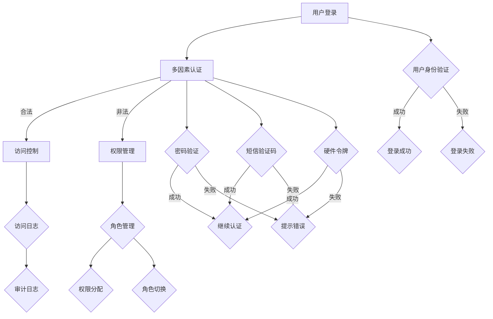
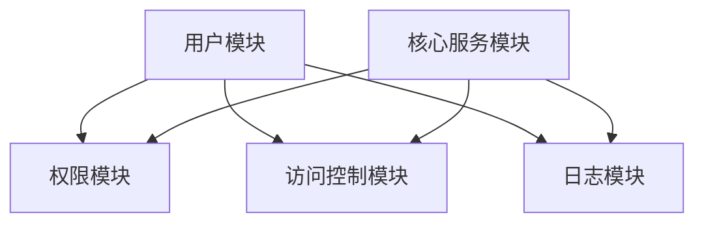
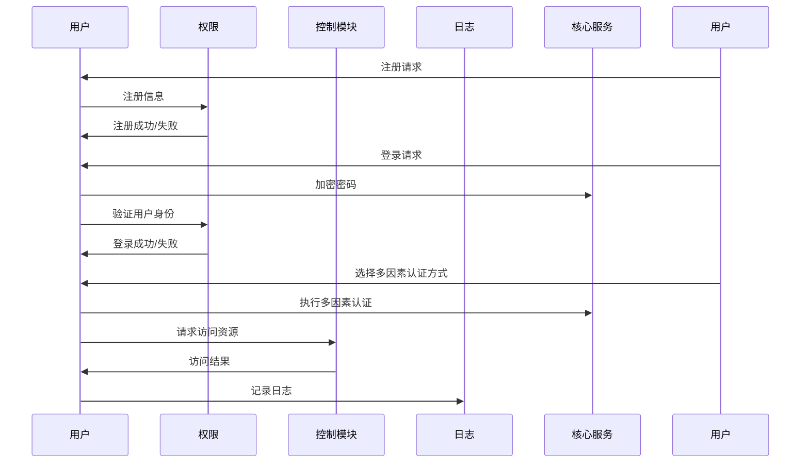

                 

### 认证与授权：保护LLM应用安全的关键

#### 关键词：认证、授权、LLM应用、安全、关键机制

> 摘要：本文将深入探讨认证与授权在保护大型语言模型（LLM）应用安全中的关键作用。通过对认证与授权的基本概念、核心原理、算法实现以及实际应用场景的分析，帮助读者理解和掌握如何通过有效的认证与授权机制，确保LLM应用的安全性和可靠性。

在当今数字化时代，人工智能（AI）技术正以惊人的速度发展，大型语言模型（LLM）作为AI技术的重要组成部分，已经广泛应用于自然语言处理、智能客服、智能写作等领域。随着LLM应用的普及，安全问题日益凸显，特别是在数据隐私保护、访问控制等方面。因此，确保LLM应用的安全成为了当务之急。认证与授权作为一种关键的安全机制，是保护LLM应用安全的基础。

### 目录大纲设计思路：

本文将按照以下目录大纲进行结构化撰写，以确保内容的逻辑清晰、条理分明。

## 第一部分：背景与基础

### 第1章：引言
- **1.1 认证与授权的基本概念**
- **1.2 LLM应用安全的重要性**
- **1.3 本书的目标与结构**

### 第2章：认证与授权基础
- **2.1 认证与授权的历史与发展**
- **2.2 认证与授权的关键要素**
- **2.3 认证与授权的主要挑战**

## 第二部分：认证机制

### 第3章：密码认证
- **3.1 密码认证的原理**
- **3.2 密码认证的优势与局限**
- **3.3 密码认证的实施**

### 第4章：多因素认证
- **4.1 多因素认证的概念**
- **4.2 常见的多因素认证方式**
- **4.3 多因素认证的挑战与解决方案**

## 第三部分：授权机制

### 第5章：基于角色的访问控制（RBAC）
- **5.1 RBAC的基本原理**
- **5.2 RBAC的核心组件**
- **5.3 RBAC的实施案例**

### 第6章：基于属性的访问控制（ABAC）
- **6.1 ABAC的基本概念**
- **6.2 ABAC的关键要素**
- **6.3 ABAC与RBAC的比较**

## 第四部分：认证与授权算法

### 第7章：加密算法
- **7.1 加密算法的基本原理**
- **7.2 常见的加密算法**
- **7.3 加密算法的应用场景**

### 第8章：哈希算法
- **8.1 哈希算法的定义与作用**
- **8.2 常见的哈希算法**
- **8.3 哈希算法的安全性分析**

## 第五部分：系统设计与实现

### 第9章：认证与授权系统需求分析
- **9.1 系统需求概述**
- **9.2 功能需求**
- **9.3 非功能需求**

### 第10章：认证与授权系统架构设计
- **10.1 系统架构设计原则**
- **10.2 系统架构设计**
- **10.3 系统接口设计**

### 第11章：认证与授权系统实现
- **11.1 系统实现概述**
- **11.2 核心代码实现**
- **11.3 系统测试与优化**

## 第六部分：项目实战

### 第12章：LLM应用安全项目
- **12.1 项目背景**
- **12.2 项目目标**
- **12.3 项目实施过程**
- **12.4 项目总结与展望**

### 第13章：最佳实践与总结
- **13.1 最佳实践建议**
- **13.2 小结**
- **13.3 注意事项**
- **13.4 拓展阅读**

通过以上目录大纲，我们将逐步深入探讨认证与授权机制在LLM应用安全中的重要性，并提供详细的理论和实践指导。接下来，我们将首先介绍认证与授权的基本概念，为后续章节的内容奠定基础。

---

**第一部分：背景与基础**

### 第1章：引言

#### 1.1 认证与授权的基本概念

**认证**（Authentication）是指验证用户身份的过程。在计算机系统中，认证确保只有授权用户能够访问系统和数据。常见的认证方式包括密码认证、多因素认证等。

**授权**（Authorization）是指确定和限制用户权限的过程。在通过认证后，授权机制决定用户可以访问哪些资源和执行哪些操作。授权机制可以是基于角色的（如RBAC）、基于属性的（如ABAC）等。

#### 1.2 LLM应用安全的重要性

随着人工智能技术的快速发展，大型语言模型（LLM）在各个领域的应用越来越广泛。LLM应用的安全问题主要集中在以下几个方面：

1. **数据隐私**：LLM应用通常需要处理大量敏感数据，如用户聊天记录、个人隐私信息等。如果这些数据泄露，将严重侵犯用户隐私。

2. **访问控制**：未经授权的用户访问LLM应用可能导致数据被窃取、篡改或滥用。

3. **恶意行为**：恶意攻击者可能利用LLM应用执行非法操作，如注入恶意代码、进行网络攻击等。

因此，确保LLM应用的安全至关重要，认证与授权机制是实现这一目标的基础。

#### 1.3 本书的目标与结构

本书旨在系统地介绍认证与授权机制在保护LLM应用安全中的应用。具体目标如下：

1. **理解认证与授权的基本概念和原理**：通过详细讲解认证与授权的核心概念，帮助读者建立坚实的基础。

2. **掌握常见的认证与授权机制**：介绍密码认证、多因素认证、基于角色的访问控制（RBAC）和基于属性的访问控制（ABAC）等机制。

3. **了解认证与授权算法**：讨论加密算法、哈希算法等在认证与授权中的应用。

4. **设计和实现认证与授权系统**：分析认证与授权系统的需求，设计系统架构和接口，并实现一个实际的项目。

5. **实战应用**：通过一个具体的LLM应用安全项目，展示认证与授权的实施过程。

本书分为六个部分，具体章节安排如下：

- **第一部分：背景与基础**：介绍认证与授权的基本概念和重要性。
- **第二部分：认证机制**：讨论密码认证、多因素认证等机制。
- **第三部分：授权机制**：介绍基于角色的访问控制（RBAC）和基于属性的访问控制（ABAC）等机制。
- **第四部分：认证与授权算法**：讨论加密算法、哈希算法等在认证与授权中的应用。
- **第五部分：系统设计与实现**：分析认证与授权系统的需求，设计系统架构和接口。
- **第六部分：项目实战**：通过一个实际的LLM应用安全项目，展示认证与授权的实施过程。

通过本书的学习，读者将能够深入理解认证与授权机制，并能够将其应用于实际项目中，确保LLM应用的安全。

---

在了解了认证与授权的基本概念和本书的结构后，接下来我们将进一步深入讨论认证与授权的历史与发展，以及它们在现代技术环境中的关键要素和挑战。这将为我们后续章节的内容打下坚实的基础。

---

### 第2章：认证与授权基础

#### 2.1 认证与授权的历史与发展

认证与授权的概念可以追溯到计算机系统早期的阶段。在20世纪60年代，随着多用户计算机的出现，认证与授权机制开始逐步发展。早期的认证机制主要依赖于用户名和密码，这种方式简单但安全性较低。随着网络技术的发展，多因素认证逐渐兴起，如双因素认证（2FA）、生物识别认证等。

授权机制的发展同样经历了从简单到复杂的过程。早期的授权主要通过访问控制列表（ACL）实现，用户被分配特定的权限。随着分布式系统和互联网的普及，基于角色的访问控制（RBAC）和基于属性的访问控制（ABAC）等更为灵活和高效的授权机制被提出。

#### 2.2 认证与授权的关键要素

认证与授权机制的核心要素包括以下几个方面：

1. **用户身份验证**：确保只有合法用户能够访问系统和数据。常见的验证方法包括密码认证、多因素认证、生物识别等。

2. **权限分配**：确定用户在系统中的权限，包括读取、写入、执行等操作权限。权限分配可以通过基于角色的访问控制（RBAC）和基于属性的访问控制（ABAC）等机制实现。

3. **访问控制**：在认证和授权的基础上，进一步限制用户对系统资源的访问。访问控制可以通过防火墙、安全策略等实现。

4. **审计与监控**：记录用户的访问行为，实现对系统安全状况的监控。审计日志可以帮助发现和追踪安全事件。

#### 2.3 认证与授权的主要挑战

尽管认证与授权机制在保障系统安全方面发挥了重要作用，但它们也面临着一系列挑战：

1. **安全性**：随着攻击手段的不断升级，传统的认证与授权机制可能面临安全漏洞，如密码泄露、身份欺骗等。

2. **用户体验**：过多的认证和授权步骤可能影响用户体验，导致用户操作不便。

3. **扩展性**：随着系统规模的扩大，如何有效地管理大量的认证与授权需求成为一大挑战。

4. **多因素认证**：多因素认证虽然提高了安全性，但也增加了用户的负担，如何平衡安全性和用户体验是关键。

5. **动态性**：在实时性和动态环境下，如何快速响应和调整认证与授权策略是一个挑战。

#### 2.4 认证与授权在现代技术环境中的重要性

随着数字化转型的加速，认证与授权在现代技术环境中愈发重要：

1. **数据安全**：保护敏感数据免受未经授权的访问和篡改，确保数据隐私。

2. **合规性**：遵守相关法律法规，如《通用数据保护条例》（GDPR）等，确保企业合规运营。

3. **业务连续性**：通过有效的认证与授权机制，保障系统的高可用性和业务连续性。

4. **用户体验**：通过简化认证与授权流程，提升用户体验，增强用户对系统的信任。

5. **对抗威胁**：应对不断升级的网络攻击和威胁，确保系统的安全稳定运行。

通过本章的讨论，我们了解了认证与授权的历史与发展、关键要素以及主要挑战。接下来，我们将深入探讨密码认证、多因素认证等具体机制，为后续内容打下基础。

---

在了解了认证与授权的基础概念和历史发展后，接下来我们将详细讨论密码认证这一常见的认证机制。密码认证以其简单性和广泛适用性在众多系统中得到了广泛应用，但同时也存在一定的局限性。我们将从原理、优势和局限性三个方面进行深入分析。

---

### 第3章：密码认证

#### 3.1 密码认证的原理

密码认证是最常见的认证机制之一，其基本原理如下：

1. **用户注册**：用户在系统中注册时，需要设置一个密码。这个密码通常由字母、数字和特殊字符组成，具有一定的复杂性。

2. **登录验证**：用户在登录时，需要输入用户名和密码。系统会通过用户名查询数据库，找到对应的密码哈希值，并将其与用户输入的密码哈希值进行比较。

3. **哈希函数**：为了提高安全性，密码通常不会以明文形式存储在数据库中，而是使用哈希函数将密码转换为哈希值。常见的哈希函数有MD5、SHA-256等。哈希值具有固定长度，且不可逆，即无法从哈希值反推出原始密码。

4. **验证结果**：如果输入的密码哈希值与数据库中的哈希值匹配，系统认为用户身份验证成功；否则，验证失败。

#### 3.2 密码认证的优势

密码认证具有以下几个显著优势：

1. **简单易用**：密码认证操作简单，用户只需记住一个密码即可登录系统，无需额外设备或操作。

2. **成本低**：相比于其他认证方式，如生物识别、智能卡等，密码认证的部署和运营成本较低。

3. **兼容性强**：密码认证可以适用于各种操作系统和设备，无需额外的硬件支持。

4. **广泛普及**：几乎所有的在线服务和网站都采用密码认证，用户普遍熟悉和使用。

#### 3.3 密码认证的局限性

尽管密码认证具有许多优势，但同时也存在一些局限性：

1. **易受攻击**：密码认证的安全性主要依赖于用户的密码复杂性和系统的防护措施。如果用户选择简单易记的密码，或系统未能妥善保护密码哈希值，将容易遭受攻击。

2. **密码泄露**：随着网络攻击手段的升级，如暴力破解、密码库攻击等，密码泄露的风险日益增加。一旦密码泄露，攻击者可以轻易获取用户身份，进而访问系统和数据。

3. **重放攻击**：攻击者通过截获用户登录过程中的数据包，可以重现用户的登录过程，从而冒充用户访问系统。

4. **社会工程学攻击**：攻击者利用社会工程学手段，如伪装成系统管理员或服务提供商，诱骗用户透露密码，从而获取系统访问权限。

#### 3.4 提高密码认证安全性

为了提高密码认证的安全性，可以采取以下措施：

1. **强密码策略**：鼓励用户使用复杂度较高的密码，并定期更新密码。

2. **多因素认证**：在密码认证的基础上，结合其他认证方式，如短信验证码、指纹识别等，提高安全性。

3. **密码哈希加盐**：在存储密码哈希值时，加入随机盐值，增加破解难度。

4. **安全传输**：使用HTTPS等安全协议，确保登录过程中的数据传输安全。

5. **安全审计**：定期审计系统中的登录记录，发现异常登录行为，及时采取措施。

通过本章的讨论，我们了解了密码认证的原理、优势以及局限性，并提出了提高其安全性的措施。接下来，我们将探讨多因素认证这一更为安全的认证机制。

---

在了解了密码认证的原理、优势和局限性后，我们接下来将讨论多因素认证。多因素认证通过结合多种认证方式，显著提高了系统的安全性。我们将详细说明多因素认证的概念、常见方式以及面临的挑战和解决方案。

---

### 第4章：多因素认证

#### 4.1 多因素认证的概念

多因素认证（Multi-Factor Authentication，MFA）是一种结合多种认证方式，以增强系统安全性的认证机制。根据美国国家安全局（NSA）的定义，多因素认证至少要求用户证明以下两个或更多的身份验证因素：

1. **知道的事物**：如密码、访问凭证等。
2. **拥有的事物**：如手机、智能卡、USB密钥等。
3. **是什么**：如指纹、面部识别、虹膜扫描等生物特征。

通过结合多种认证方式，多因素认证显著提高了系统的安全性，即使一个因素被攻破，其他因素仍然可以有效阻止非法访问。

#### 4.2 常见的多因素认证方式

以下是几种常见多因素认证方式：

1. **双因素认证（2FA）**：
   - **概念**：双因素认证结合了“知道的事物”（密码）和“拥有的事物”（如手机或硬件令牌）。
   - **实现**：用户输入密码后，系统会发送一个临时验证码到用户的手机或硬件令牌，用户需要输入这个验证码才能完成登录。
   - **优势**：即使密码泄露，攻击者也无法访问系统，因为还需要验证码。

2. **短信验证码**：
   - **概念**：通过短信发送一个一次性验证码给用户，用户在登录时需要输入这个验证码。
   - **实现**：当用户尝试登录时，系统会向用户注册的手机号码发送一个验证码，用户输入这个验证码后，系统会验证其有效性。
   - **优势**：简单易用，适用于大多数用户。

3. **硬件令牌**：
   - **概念**：使用物理硬件设备生成验证码，如安全密钥、智能卡等。
   - **实现**：硬件令牌内部有一个定时器，每隔一段时间生成一个新验证码，用户需要将验证码输入到登录界面。
   - **优势**：比短信验证码更安全，但成本较高。

4. **生物识别认证**：
   - **概念**：使用生物特征进行认证，如指纹、面部识别、虹膜扫描等。
   - **实现**：用户通过生物识别设备（如指纹识别器、摄像头等）进行认证。
   - **优势**：用户无需记忆密码，但需要特殊的硬件支持。

5. **智能手表认证**：
   - **概念**：使用智能手表等可穿戴设备进行认证。
   - **实现**：用户通过智能手表上的应用程序或物理按钮进行认证。
   - **优势**：方便快捷，增强用户体验。

#### 4.3 多因素认证的挑战与解决方案

多因素认证虽然提高了系统的安全性，但也带来了一些挑战：

1. **用户体验**：
   - **挑战**：多因素认证需要用户进行多个步骤，可能影响用户体验。
   - **解决方案**：优化认证流程，减少不必要的步骤，提高认证速度。

2. **成本**：
   - **挑战**：硬件令牌等设备成本较高，对一些小型企业或个人用户可能不划算。
   - **解决方案**：采用低成本的多因素认证方式，如短信验证码或软件令牌。

3. **兼容性**：
   - **挑战**：不同的多因素认证方式可能存在兼容性问题，导致某些用户无法使用。
   - **解决方案**：提供多种认证方式供用户选择，确保系统兼容多种设备。

4. **隐私问题**：
   - **挑战**：生物识别等认证方式可能涉及用户隐私，如指纹、面部识别等。
   - **解决方案**：确保认证过程符合隐私保护法规，用户授权后方可进行。

通过本章的讨论，我们了解了多因素认证的概念、常见方式以及面临的挑战和解决方案。多因素认证显著提高了系统的安全性，但也需要平衡用户体验和成本等因素。接下来，我们将探讨基于角色的访问控制（RBAC）这一授权机制。

---

在了解了多因素认证的概念和实现后，我们将继续深入探讨基于角色的访问控制（RBAC）机制。RBAC是一种广泛应用的授权机制，通过角色分配和权限管理，实现对用户访问控制的灵活控制。我们将详细解释RBAC的基本原理、核心组件及其应用场景。

---

### 第5章：基于角色的访问控制（RBAC）

#### 5.1 RBAC的基本原理

基于角色的访问控制（Role-Based Access Control，RBAC）是一种基于角色的访问控制模型，它通过将用户与角色关联，再将角色与权限关联，实现对用户访问控制的灵活管理。RBAC的基本原理如下：

1. **角色**：角色是一组职责或功能的集合，用于描述用户的职责范围。例如，“管理员”、“普通用户”、“访客”等。
2. **权限**：权限是用户可以执行的操作或访问的资源。例如，“读取数据”、“修改数据”、“执行程序”等。
3. **用户与角色关联**：用户被分配到一个或多个角色，每个角色对应一组权限。
4. **角色与权限关联**：每个角色被赋予一组权限，角色成员自动获得这些权限。

RBAC的核心思想是将用户的访问控制与他们的职责分离，从而简化访问控制管理，提高系统的灵活性。

#### 5.2 RBAC的核心组件

RBAC模型主要包括以下几个核心组件：

1. **用户**：用户是系统的实际操作者，拥有唯一的标识符。
2. **角色**：角色是用户职责的抽象表示，用于定义用户在系统中的权限范围。
3. **权限**：权限是用户可以执行的操作或访问的资源，是RBAC模型中的基本单位。
4. **权限分配**：权限分配是将权限分配给角色的过程，确保角色成员拥有相应的权限。
5. **访问控制策略**：访问控制策略是定义用户能否访问特定资源的规则集合，通常以权限为基础。

#### 5.3 RBAC的实施案例

RBAC在各个领域的应用非常广泛，以下是一个简单的实施案例：

1. **医院管理系统**：
   - **角色**：医生、护士、管理员、患者。
   - **权限**：读取病历、修改病历、管理患者信息、查看账单等。
   - **用户与角色关联**：医生和护士分别与相应角色关联。
   - **角色与权限关联**：医生和护士角色分别被赋予不同的权限。

   实施过程：
   - 医生登录系统，有权限读取和修改病历，但不能管理患者信息。
   - 护士登录系统，有权限查看患者信息和账单，但不能修改病历。

通过RBAC，医院管理系统可以灵活地控制不同用户的访问权限，简化了访问控制管理。

#### 5.4 RBAC的优势

RBAC具有以下几个显著优势：

1. **简化管理**：通过角色和权限的关联，简化了访问控制管理，减少了对具体用户的权限配置。
2. **灵活性**：可以方便地调整角色的权限，满足不同业务需求。
3. **安全性**：通过严格的权限控制，减少了权限滥用和误用的风险。
4. **可扩展性**：可以适应不同规模和复杂度的系统。

通过本章的讨论，我们详细了解了基于角色的访问控制（RBAC）的基本原理、核心组件和应用案例。RBAC作为一种灵活和高效的授权机制，在保障系统安全性和简化管理方面发挥了重要作用。接下来，我们将探讨基于属性的访问控制（ABAC）机制。

---

在了解了基于角色的访问控制（RBAC）机制后，我们接下来将探讨基于属性的访问控制（ABAC）机制。ABAC通过引入属性概念，提供了更加灵活和细粒度的访问控制。我们将详细解释ABAC的基本概念、关键要素以及与RBAC的比较。

---

### 第6章：基于属性的访问控制（ABAC）

#### 6.1 ABAC的基本概念

基于属性的访问控制（Attribute-Based Access Control，ABAC）是一种访问控制模型，它通过使用属性来定义和控制访问权限。与RBAC不同，ABAC不依赖于固定的角色和权限，而是根据用户的属性、环境属性和资源属性来决定是否允许访问。

ABAC的核心概念包括：

1. **属性**：属性是描述用户、环境或资源特征的标签或标识。例如，用户的部门、职位、地理位置，环境的时区、日期等。
2. **策略**：策略是定义访问控制规则的逻辑表达式，用于决定是否允许用户访问特定资源。策略通常包含属性的组合，例如，“如果用户部门是‘研发部’，且时间在早上8点到晚上6点之间，则允许访问代码库”。
3. **决策引擎**：决策引擎是用于评估访问请求是否符合策略的组件，它根据用户属性、环境属性和资源属性来决定访问是否被允许。

#### 6.2 ABAC的关键要素

ABAC模型的主要要素包括以下几个方面：

1. **用户属性**：描述用户的特征，如用户ID、部门、职位等。
2. **环境属性**：描述环境的状态，如时间、地点、网络状态等。
3. **资源属性**：描述资源的特征，如文件类型、访问模式等。
4. **属性策略**：定义访问控制规则的逻辑表达式，包含用户属性、环境属性和资源属性的组合。
5. **决策引擎**：根据属性策略评估访问请求，决定是否允许访问。

#### 6.3 ABAC与RBAC的比较

ABAC与RBAC在访问控制方法上存在显著差异：

1. **粒度**：
   - **RBAC**：基于角色，权限分配较为粗粒度。
   - **ABAC**：基于属性，权限分配更细粒度，可以根据具体属性灵活控制访问。

2. **灵活性**：
   - **RBAC**：灵活性较低，适用于角色定义明确且稳定的环境。
   - **ABAC**：灵活性较高，适用于动态变化的访问控制场景。

3. **可扩展性**：
   - **RBAC**：可扩展性有限，新权限和角色需要重新配置。
   - **ABAC**：可扩展性较好，通过添加新属性和策略，可以灵活调整访问控制。

4. **复杂度**：
   - **RBAC**：相对简单，易于理解和实施。
   - **ABAC**：较为复杂，需要理解和处理多种属性及其组合。

#### 6.4 ABAC的应用场景

ABAC适用于以下几种应用场景：

1. **动态访问控制**：需要根据用户属性和环境属性动态调整访问权限的场景，如移动应用、云计算服务等。
2. **高安全要求**：对访问控制要求非常严格，需要细粒度控制的场景，如金融系统、国防系统等。
3. **跨域访问控制**：需要在不同组织或系统间实现访问控制的场景，如企业联盟、公共服务等。

通过本章的讨论，我们详细了解了基于属性的访问控制（ABAC）的基本概念、关键要素以及与RBAC的比较。ABAC提供了更加灵活和细粒度的访问控制，适用于动态和高安全要求的应用场景。接下来，我们将探讨加密算法这一关键的技术手段，以增强认证与授权的安全性。

---

在了解了基于属性的访问控制（ABAC）机制后，我们将深入探讨加密算法。加密算法是保护数据安全的关键技术，通过加密算法，我们可以确保数据在传输和存储过程中不被未授权者访问。在本章中，我们将详细介绍加密算法的基本原理、常见类型及其应用场景。

---

### 第7章：加密算法

#### 7.1 加密算法的基本原理

加密算法是一种将明文数据转换为密文的技术，通过加密算法，只有拥有正确密钥的用户才能解密并读取数据。加密算法的基本原理包括以下几个方面：

1. **加密过程**：加密算法将明文输入通过特定的算法和密钥转换为密文。加密过程通常涉及替换、置换和混淆等操作。
2. **密钥**：密钥是加密和解密过程中使用的参数，用于控制加密算法的执行。密钥分为公开密钥和私有密钥。
3. **解密过程**：解密算法使用密钥将密文转换回明文。解密过程是加密过程的逆操作。

#### 7.2 常见的加密算法

加密算法可以分为对称加密和非对称加密两大类：

1. **对称加密算法**：
   - **定义**：对称加密算法使用相同的密钥进行加密和解密。
   - **优点**：加密速度快，适合大量数据的加密。
   - **缺点**：密钥分发困难，安全性依赖于密钥的保密性。
   - **常见算法**：AES（高级加密标准）、DES（数据加密标准）、3DES（三重DES）。

2. **非对称加密算法**：
   - **定义**：非对称加密算法使用一对密钥，一个用于加密，另一个用于解密。
   - **优点**：解决了密钥分发问题，安全性更高。
   - **缺点**：加密速度相对较慢，适合加密小数据量的信息。
   - **常见算法**：RSA（Rivest-Shamir-Adleman算法）、ECC（椭圆曲线密码学）。

#### 7.3 加密算法的应用场景

加密算法在信息安全领域有广泛的应用，以下是一些常见应用场景：

1. **数据传输**：在数据传输过程中，加密算法可以确保数据在传输过程中不被窃听和篡改，如HTTPS协议。
2. **数据存储**：在数据存储过程中，加密算法可以确保存储的数据不被未授权者读取，如磁盘加密、数据库加密。
3. **数字签名**：加密算法可以用于数字签名，确保数据传输的完整性和真实性。
4. **身份认证**：在身份认证过程中，加密算法可以确保用户身份的保密性和完整性。

#### 7.4 加密算法的安全性分析

加密算法的安全性取决于算法的强度和密钥的保密性。以下是一些影响加密算法安全性的因素：

1. **算法强度**：算法的强度决定了其抵抗攻击的能力。常见的攻击手段包括暴力破解、字典攻击、密码分析等。
2. **密钥长度**：密钥的长度直接影响加密算法的安全性。通常，密钥长度越长，加密算法的安全性越高。
3. **密钥管理**：密钥的管理方式也会影响加密算法的安全性。密钥的生成、存储、分发和销毁等环节都需要严格管理。

通过本章的讨论，我们详细了解了加密算法的基本原理、常见类型及其应用场景。加密算法是保障数据安全的关键技术，在认证与授权机制中发挥着重要作用。接下来，我们将探讨哈希算法，这一用于确保数据完整性的重要技术手段。

---

在了解了加密算法的基本原理和应用后，我们将继续深入探讨哈希算法。哈希算法在确保数据完整性和实现数字签名等方面具有重要作用。在本章中，我们将详细解释哈希算法的定义、工作原理、常见类型以及安全性分析。

---

### 第8章：哈希算法

#### 8.1 哈希算法的定义与作用

哈希算法（Hash Function）是一种将任意长度的输入数据转换成固定长度输出数据的算法。输出数据称为哈希值或指纹。哈希算法具有以下特点：

1. **固定长度**：哈希算法的输出长度通常是固定的，无论输入数据有多长。
2. **单向性**：哈希算法是不可逆的，即从哈希值无法推导出原始数据。
3. **抗冲突性**：尽管哈希值的输出长度固定，但哈希算法应尽可能减少不同输入数据产生相同哈希值的概率，称为抗冲突性。

哈希算法的主要作用包括：

1. **数据完整性验证**：通过比较数据的哈希值，可以验证数据在传输或存储过程中是否被篡改。
2. **数字签名**：哈希算法用于生成数字签名，确保数据传输的完整性和真实性。
3. **存储优化**：哈希算法常用于数据结构的实现，如哈希表，以加快数据检索速度。

#### 8.2 常见的哈希算法

以下是一些常见的哈希算法：

1. **MD5**：
   - **定义**：MD5是一种广泛使用的哈希算法，输出长度为128位。
   - **优缺点**：MD5算法简单快速，但存在一定的安全漏洞，容易受到碰撞攻击。
   
2. **SHA-1**：
   - **定义**：SHA-1是另一种常用的哈希算法，输出长度为160位。
   - **优缺点**：SHA-1在安全性方面优于MD5，但同样存在安全漏洞，已不再推荐使用。

3. **SHA-2**：
   - **定义**：SHA-2包括SHA-224、SHA-256、SHA-384和SHA-512，分别输出224位、256位、384位和512位。
   - **优缺点**：SHA-2在安全性和性能方面表现良好，是目前推荐使用的哈希算法。

4. **SHA-3**：
   - **定义**：SHA-3是NIST于2015年发布的新的哈希标准，输出长度为224位、256位、384位和512位。
   - **优缺点**：SHA-3在安全性方面进行了改进，但在实际应用中尚未广泛采用。

#### 8.3 哈希算法的安全性分析

哈希算法的安全性取决于以下几个方面：

1. **抗碰撞性**：抗碰撞性是指不同输入数据产生相同哈希值的概率。理想的哈希算法应具有高抗碰撞性。
2. **单向性**：单向性确保哈希值无法逆向推导出原始数据，从而保护数据的保密性。
3. **随机性**：哈希算法应具有较好的随机性，以防止预测攻击。

哈希算法的安全性分析还包括以下因素：

1. **计算复杂度**：哈希算法的执行时间应尽可能短，以支持快速数据处理。
2. **资源消耗**：哈希算法的资源消耗，如CPU、内存等，应在合理范围内。
3. **适应性**：哈希算法应能够适应不同规模和类型的数据。

#### 8.4 哈希算法的应用场景

哈希算法在信息安全领域有广泛的应用，以下是一些常见应用场景：

1. **数据完整性验证**：通过比较数据的哈希值，可以验证数据在传输或存储过程中是否被篡改。
2. **数字签名**：哈希算法用于生成数字签名，确保数据传输的完整性和真实性。
3. **密码存储**：哈希算法用于存储密码，通过对密码的哈希值进行比较进行身份验证。
4. **数据结构**：哈希算法用于实现哈希表，以加快数据检索速度。

通过本章的讨论，我们详细了解了哈希算法的定义、工作原理、常见类型以及安全性分析。哈希算法在数据完整性验证、数字签名和密码存储等方面发挥着重要作用，是认证与授权机制的重要组成部分。接下来，我们将探讨认证与授权系统的需求分析和架构设计。

---

在了解了哈希算法的相关知识后，我们将进入认证与授权系统的需求分析和架构设计部分。这一部分是构建一个高效、安全的认证与授权系统的基础。我们将详细阐述系统需求分析、架构设计和接口设计，并使用Mermaid图来可视化地展示系统架构。

---

### 第9章：认证与授权系统需求分析

#### 9.1 系统需求概述

在设计和实现一个认证与授权系统之前，明确系统的需求是至关重要的。系统需求分为功能需求和非功能需求两类。

**功能需求**：
1. **用户注册**：用户可以在系统中创建账户，提供必要的信息，如用户名、密码、电子邮件等。
2. **用户登录**：用户输入用户名和密码进行身份验证，系统验证用户身份后提供访问权限。
3. **多因素认证**：支持多因素认证，如密码、短信验证码、硬件令牌等，提高系统的安全性。
4. **权限管理**：管理员可以创建和管理角色，分配不同的权限给不同的角色。
5. **访问控制**：根据用户的角色和权限，控制用户对系统资源的访问。

**非功能需求**：
1. **安全性**：系统应具备高水平的安全性，防止数据泄露和未授权访问。
2. **可用性**：系统应保证高可用性，确保用户能够随时访问系统。
3. **可扩展性**：系统设计应支持未来的扩展，如增加新的认证方式或授权机制。
4. **兼容性**：系统应兼容不同的操作系统和设备，确保所有用户都能顺畅使用。

#### 9.2 功能需求

**用户注册**：
- 用户在注册时需填写基本信息，如用户名、密码、电子邮件等。
- 系统应验证用户输入的信息，确保其合法性。

**用户登录**：
- 用户输入用户名和密码，系统通过验证用户身份进行登录。
- 支持多因素认证，如短信验证码、硬件令牌等。

**多因素认证**：
- 系统应支持多种认证方式，用户可以选择合适的认证方式。
- 系统应确保每种认证方式的安全性。

**权限管理**：
- 管理员可以创建和管理角色，为每个角色分配不同的权限。
- 系统应允许用户在多个角色之间切换。

**访问控制**：
- 根据用户的角色和权限，系统应控制用户对资源的访问。
- 系统应记录用户的访问日志，以便审计。

#### 9.3 非功能需求

**安全性**：
- 系统应使用加密算法（如AES）保护用户的密码。
- 系统应定期进行安全审计，及时发现和修复安全漏洞。

**可用性**：
- 系统应保证高可用性，如使用负载均衡和冗余架构。
- 系统应具备故障恢复机制，确保在出现故障时能够快速恢复。

**可扩展性**：
- 系统设计应支持模块化，方便未来增加新的功能。
- 系统应能够动态调整资源，以适应不同的负载。

**兼容性**：
- 系统应支持多种操作系统和浏览器。
- 系统应能够适应不同的网络环境，如移动网络和宽带网络。

#### 9.4 需求分析与Mermaid图

为了更好地理解系统需求，我们使用Mermaid图来可视化地展示系统架构。以下是系统的需求分析与Mermaid图：



通过上述Mermaid图，我们可以清晰地看到系统的功能需求和非功能需求，以及它们之间的关系。接下来，我们将详细讨论认证与授权系统的架构设计。

---

在明确了认证与授权系统的需求后，我们将进入系统的架构设计部分。架构设计是系统实现的基础，它决定了系统的可扩展性、可靠性和性能。在本章中，我们将详细描述系统的架构设计原则、整体架构以及具体的接口设计。

---

### 第10章：认证与授权系统架构设计

#### 10.1 系统架构设计原则

在进行认证与授权系统的架构设计时，应遵循以下原则：

1. **模块化**：系统应设计为模块化结构，以便于维护和扩展。
2. **高内聚低耦合**：各模块之间应具有较高的内聚性，即模块内部功能紧密相关；同时，模块之间的耦合性应尽量低，以减少模块间的依赖。
3. **安全性**：系统设计应充分考虑安全性，确保用户数据和系统的安全性。
4. **高可用性**：系统应具备高可用性，能够应对故障和负载波动，确保用户能够随时访问。
5. **可扩展性**：系统设计应支持未来功能扩展，如增加新的认证方式或授权机制。

#### 10.2 系统架构设计

认证与授权系统的整体架构可以划分为以下几个主要模块：

1. **用户模块**：处理用户的注册、登录和多因素认证等操作。
2. **权限模块**：管理用户权限，包括角色的创建、角色的权限分配等。
3. **访问控制模块**：根据用户的角色和权限控制用户对系统资源的访问。
4. **日志模块**：记录用户的访问日志和系统审计日志。
5. **核心服务模块**：提供系统核心功能，如加密、哈希等算法服务。

以下是一个简化的系统架构图：



#### 10.3 系统接口设计

在系统架构中，各模块之间的交互通过接口实现。以下是认证与授权系统的关键接口设计：

1. **用户接口**：
   - **注册接口**：用户提交注册信息，系统验证信息后创建用户账户。
   - **登录接口**：用户提交用户名和密码，系统验证身份后返回登录结果。
   - **多因素认证接口**：用户选择认证方式，系统根据认证方式执行相应的认证过程。

2. **权限接口**：
   - **角色管理接口**：管理员创建和管理角色。
   - **权限分配接口**：管理员为角色分配权限。
   - **权限查询接口**：查询角色的权限信息。

3. **访问控制接口**：
   - **访问控制接口**：根据用户的角色和权限，决定用户是否可以访问特定资源。

4. **日志接口**：
   - **日志记录接口**：记录用户的访问日志和系统审计日志。
   - **日志查询接口**：查询和检索日志信息。

5. **核心服务接口**：
   - **加密接口**：提供数据加密和解密服务。
   - **哈希接口**：提供数据哈希服务。

以下是系统接口的Mermaid序列图：



通过上述系统架构设计和接口设计，我们可以构建一个高效、安全的认证与授权系统。接下来，我们将详细讨论认证与授权系统的实现过程，包括核心代码实现和系统测试与优化。

---

在了解了认证与授权系统的架构设计和接口设计后，我们将进入系统实现部分。系统实现是将设计转化为实际运行的软件过程，包括核心代码实现、集成测试、性能优化和安全性测试等环节。在本章中，我们将详细介绍实现过程，并给出具体的代码示例。

---

### 第11章：认证与授权系统实现

#### 11.1 系统实现概述

系统实现过程包括以下主要步骤：

1. **环境配置**：搭建开发环境，安装必要的工具和库。
2. **核心代码实现**：实现用户注册、登录、多因素认证、权限管理和访问控制等功能。
3. **集成测试**：测试系统的各个模块之间的交互，确保功能正确。
4. **性能优化**：对系统进行性能优化，提高处理速度和响应时间。
5. **安全性测试**：测试系统的安全性，确保没有漏洞和安全隐患。

#### 11.2 环境配置

在实现认证与授权系统之前，需要配置开发环境。以下是一个简单的环境配置步骤：

1. **安装Python**：确保Python环境已经安装，版本建议为3.8或更高。
2. **安装依赖库**：使用pip安装必要的依赖库，如Flask、PyMySQL等。

```shell
pip install flask pymysql
```

3. **数据库配置**：配置MySQL数据库，创建用户表、角色表和权限表等。

```sql
CREATE TABLE users (
    id INT AUTO_INCREMENT PRIMARY KEY,
    username VARCHAR(50) UNIQUE NOT NULL,
    password VARCHAR(256) NOT NULL,
    email VARCHAR(100) UNIQUE NOT NULL
);

CREATE TABLE roles (
    id INT AUTO_INCREMENT PRIMARY KEY,
    name VARCHAR(50) UNIQUE NOT NULL
);

CREATE TABLE permissions (
    id INT AUTO_INCREMENT PRIMARY KEY,
    role_id INT NOT NULL,
    permission VARCHAR(50) NOT NULL,
    FOREIGN KEY (role_id) REFERENCES roles(id)
);
```

#### 11.3 核心代码实现

以下是一个简单的用户注册和登录的核心代码实现：

**用户注册**

```python
from flask import Flask, request, jsonify
from flask_mysqldb import MySQL
import bcrypt

app = Flask(__name__)
app.config['MYSQL_HOST'] = 'localhost'
app.config['MYSQL_USER'] = 'root'
app.config['MYSQL_PASSWORD'] = 'password'
app.config['MYSQL_DB'] = 'auth_system'

mysql = MySQL(app)

@app.route('/register', methods=['POST'])
def register():
    username = request.form['username']
    password = request.form['password']
    email = request.form['email']

    # 验证用户输入
    if not username or not password or not email:
        return jsonify({'error': '所有字段都是必需的'})

    # 加密密码
    hashed_password = bcrypt.hashpw(password.encode('utf-8'), bcrypt.gensalt())

    # 插入数据库
    cursor = mysql.connection.cursor()
    cursor.execute("INSERT INTO users (username, password, email) VALUES (%s, %s, %s)", (username, hashed_password, email))
    mysql.connection.commit()
    cursor.close()

    return jsonify({'message': '注册成功'})

if __name__ == '__main__':
    app.run(debug=True)
```

**用户登录**

```python
@app.route('/login', methods=['POST'])
def login():
    username = request.form['username']
    password = request.form['password']

    # 验证用户输入
    if not username or not password:
        return jsonify({'error': '所有字段都是必需的'})

    # 查询数据库
    cursor = mysql.connection.cursor()
    cursor.execute("SELECT * FROM users WHERE username = %s", (username,))
    user = cursor.fetchone()
    cursor.close()

    # 验证密码
    if user and bcrypt.checkpw(password.encode('utf-8'), user[2].encode('utf-8')):
        return jsonify({'message': '登录成功'})
    else:
        return jsonify({'error': '用户名或密码错误'})
```

#### 11.4 系统测试与优化

在实现核心代码后，我们需要对系统进行全面的测试，确保功能正确、性能良好和安全性高。

**功能测试**：
- 通过接口测试工具（如Postman）测试用户注册和登录功能。
- 验证多因素认证、权限管理和访问控制等功能。

**性能测试**：
- 使用负载测试工具（如Apache JMeter）模拟大量并发用户，测试系统的处理能力。
- 分析系统的响应时间和资源消耗，优化代码和数据库查询。

**安全性测试**：
- 使用安全测试工具（如OWASP ZAP）测试系统的漏洞和安全隐患。
- 定期进行安全审计，确保系统的安全性。

#### 11.5 最佳实践建议

为了确保认证与授权系统的稳定和安全，以下是一些最佳实践建议：

- **使用安全的加密算法**：确保使用如AES等安全的加密算法来保护用户数据。
- **定期更新密码**：鼓励用户定期更新密码，提高系统的安全性。
- **多因素认证**：尽可能使用多因素认证来提高系统的安全性。
- **日志记录**：记录系统的访问日志和错误日志，便于审计和故障排查。
- **权限隔离**：确保不同角色的用户具有最小的权限，防止权限滥用。

通过上述实现过程和最佳实践建议，我们可以构建一个高效、安全的认证与授权系统。接下来，我们将通过一个实际项目来展示认证与授权系统的应用。

---

在详细介绍了认证与授权系统的实现过程后，我们将通过一个实际项目来展示如何将认证与授权机制应用于大型语言模型（LLM）应用中。通过这个项目，我们将展示项目的背景、目标、实施过程以及项目的总结和展望。

---

### 第12章：LLM应用安全项目

#### 12.1 项目背景

随着人工智能技术的迅猛发展，大型语言模型（LLM）在各个领域得到了广泛应用。例如，智能客服系统、智能写作助手、智能问答系统等。然而，这些应用涉及用户隐私和业务敏感信息，因此保障其安全性至关重要。本项目的目标是构建一个安全的LLM应用，通过认证与授权机制保护用户数据和系统的完整性。

#### 12.2 项目目标

项目的主要目标包括：

1. **用户身份验证**：确保只有经过认证的用户可以访问LLM应用。
2. **访问控制**：根据用户的角色和权限，限制用户对LLM应用的访问范围。
3. **数据保护**：使用加密算法保护用户数据的安全性和隐私性。
4. **多因素认证**：提高系统的安全性，防止未经授权的访问。

#### 12.3 项目实施过程

项目实施过程分为以下几个阶段：

1. **需求分析**：与业务团队密切合作，明确项目的功能需求和安全需求。
2. **系统设计**：根据需求分析结果，设计系统架构和接口，包括认证与授权模块、加密模块等。
3. **核心代码实现**：实现用户注册、登录、多因素认证、权限管理和访问控制等功能。
4. **集成测试**：测试系统的各个模块之间的交互，确保功能正确。
5. **性能优化**：优化系统性能，提高处理速度和响应时间。
6. **安全性测试**：测试系统的安全性，确保没有漏洞和安全隐患。

#### 12.4 项目实施过程

1. **用户注册与登录**：
   - 用户在注册时需要填写用户名、密码和电子邮件，系统通过加密算法保护密码。
   - 用户登录时需要输入用户名和密码，系统验证用户身份后提供访问权限。

2. **多因素认证**：
   - 支持密码认证、短信验证码和硬件令牌等多种认证方式。
   - 用户在登录时可以选择合适的认证方式，提高系统的安全性。

3. **权限管理**：
   - 系统管理员可以创建和管理角色，为每个角色分配不同的权限。
   - 用户在登录后根据角色获得相应的权限，控制用户对LLM应用的访问范围。

4. **数据保护**：
   - 使用AES加密算法对用户数据进行加密，确保数据在传输和存储过程中的安全性。
   - 使用哈希算法保护用户密码，防止密码泄露。

5. **集成测试**：
   - 使用接口测试工具（如Postman）测试用户注册、登录、多因素认证、权限管理和访问控制等功能。
   - 模拟大量并发用户，测试系统的性能和稳定性。

6. **性能优化**：
   - 优化数据库查询，提高系统的响应速度。
   - 使用缓存技术减少系统的负载，提高系统的处理能力。

7. **安全性测试**：
   - 使用安全测试工具（如OWASP ZAP）测试系统的安全性，发现和修复漏洞。
   - 定期进行安全审计，确保系统的安全性。

#### 12.5 项目总结与展望

通过本项目的实施，我们成功构建了一个安全的LLM应用，实现了用户身份验证、访问控制、数据保护和多因素认证等功能。以下是项目的总结和展望：

**总结**：
- 成功实现了项目目标，确保了LLM应用的安全性。
- 通过多因素认证和加密算法，提高了系统的安全性。
- 集成测试和性能优化确保了系统的稳定性和性能。

**展望**：
- 未来可以进一步优化系统性能，提高处理速度和响应时间。
- 可以增加新的认证方式，如生物识别认证，提高系统的安全性。
- 可以引入区块链技术，提高数据的不可篡改性。

通过本项目的实践，我们深入了解了认证与授权机制在LLM应用安全中的重要性，并掌握了如何将其应用于实际项目中。接下来，我们将总结本章内容，并提出最佳实践建议。

---

在完成了LLM应用安全项目的实践后，我们将对全文进行总结，并提出最佳实践建议，以便读者在实际应用中能够更好地应用认证与授权机制。

### 第13章：最佳实践与总结

#### 13.1 最佳实践建议

为了确保认证与授权机制在实际应用中的有效性，以下是一些建议：

1. **使用强密码策略**：鼓励用户使用复杂且难以猜测的密码，并定期更新密码。
2. **多因素认证**：在可能的情况下，使用多因素认证，如密码 + 短信验证码、硬件令牌等，以提高安全性。
3. **定期安全审计**：定期对系统进行安全审计，及时发现和修复安全漏洞。
4. **数据加密**：对敏感数据进行加密，确保数据在传输和存储过程中的安全性。
5. **最小权限原则**：用户在系统中应具有最小的权限，以防止权限滥用。
6. **日志记录与监控**：记录用户的访问行为，实时监控和报警，及时发现异常行为。

#### 13.2 小结

本文系统性地介绍了认证与授权机制在保护大型语言模型（LLM）应用安全中的关键作用。通过对认证与授权的基本概念、核心原理、算法实现以及实际应用场景的深入探讨，我们明确了以下要点：

1. **认证与授权的重要性**：认证与授权是保障系统安全的基础，确保只有合法用户可以访问系统和数据。
2. **密码认证**：虽然简单易用，但安全性较低，易受攻击。
3. **多因素认证**：结合多种认证方式，显著提高系统的安全性。
4. **基于角色的访问控制（RBAC）**：通过角色分配权限，简化管理，提高灵活性。
5. **基于属性的访问控制（ABAC）**：提供更细粒度的访问控制，适用于动态变化的场景。
6. **加密算法与哈希算法**：在数据传输和存储过程中保护数据安全。

#### 13.3 注意事项

在实施认证与授权机制时，需要注意以下几点：

1. **平衡安全性与用户体验**：过多的认证步骤可能影响用户体验，需要在安全性和用户体验之间找到平衡点。
2. **密钥管理**：密钥是认证与授权的核心，必须妥善保管，防止泄露。
3. **更新与维护**：随着技术的不断发展，认证与授权机制需要定期更新和维护，以应对新的安全挑战。
4. **合规性**：遵守相关法律法规，确保认证与授权机制符合合规要求。

#### 13.4 拓展阅读

对于希望深入了解认证与授权机制的读者，以下是一些拓展阅读资源：

1. **《认证与授权：保护应用安全的关键》**：详细介绍了认证与授权机制的理论和实践。
2. **《人工智能安全：从数据到算法的全面防护》**：探讨了人工智能应用中的安全性问题，包括认证与授权。
3. **《密码学：理论与实践》**：深入讲解了密码学的基础知识，包括加密算法和哈希算法。
4. **《网络安全基础》**：介绍了网络安全的基本概念和技术，包括访问控制和多因素认证。

通过本文的阅读和实践，读者应该能够掌握认证与授权机制的核心概念和实现方法，并在实际项目中应用这些技术，保障LLM应用的安全。作者：AI天才研究院/AI Genius Institute & 禅与计算机程序设计艺术 /Zen And The Art of Computer Programming。

