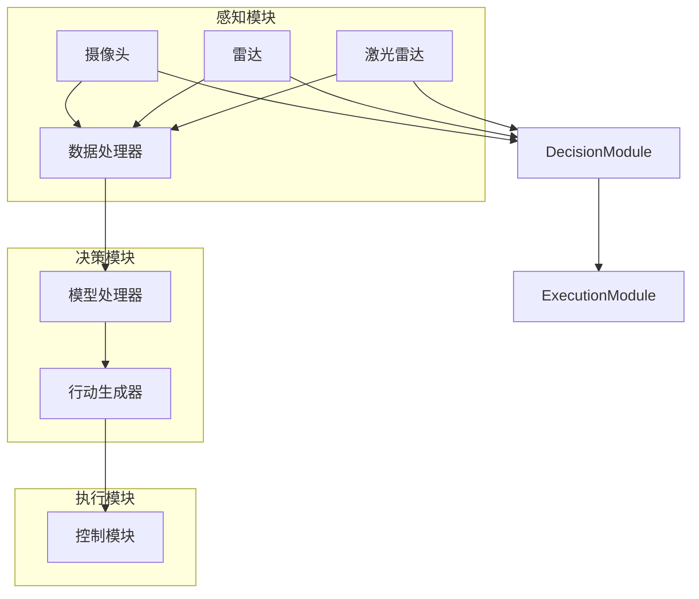
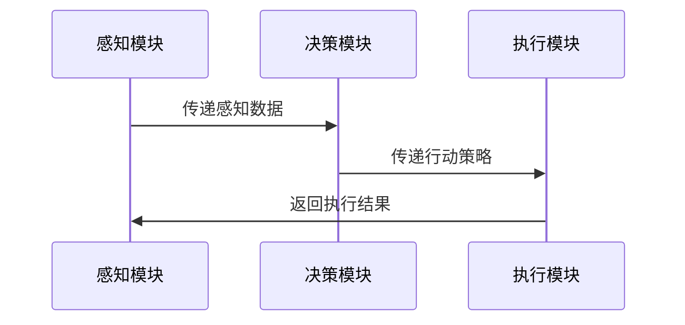

                 

## 设计AI Agent的动态模型压缩与加速

关键词：AI Agent、动态模型、压缩、加速、算法

摘要：随着人工智能技术的飞速发展，AI Agent的复杂度和性能要求不断提高。动态模型压缩与加速技术成为当前研究的热点，旨在降低模型存储空间和计算资源消耗，提高AI Agent的处理效率。本文将从问题背景、核心概念、算法原理、系统设计与项目实战等多个方面，详细探讨设计AI Agent的动态模型压缩与加速方法，为人工智能领域的研究者和开发者提供有价值的参考。

## 引言

### AI Agent的背景和重要性

AI Agent，即人工智能代理，是指能够自主完成特定任务，具备一定智能行为能力的计算机程序。AI Agent在许多领域，如自动驾驶、智能家居、金融分析等，都发挥着重要作用。随着AI技术的发展，AI Agent的应用场景越来越广泛，其性能要求也越来越高。动态模型作为AI Agent的核心组件，其压缩与加速技术的研究具有重要意义。

### 动态模型压缩与加速的需求

1. **存储空间限制**：随着模型复杂度的增加，模型参数和数据量呈指数级增长，导致存储空间需求急剧上升。动态模型压缩技术能够有效降低存储空间占用，提高存储资源的利用率。
   
2. **计算资源限制**：在实时性和高效性要求较高的应用场景中，计算资源的限制成为一个重要问题。动态模型加速技术能够提高计算效率，降低计算延迟，满足高性能计算需求。

3. **能效优化**：在移动设备和嵌入式系统中，能效优化是关键。通过动态模型压缩与加速，可以降低功耗，延长设备续航时间。

### 本文的目的和结构

本文旨在系统地探讨设计AI Agent的动态模型压缩与加速技术。文章将首先介绍相关背景知识和核心概念，然后详细分析压缩与加速算法原理，最后通过实际项目案例展示系统设计与实现过程。希望通过本文的探讨，为AI Agent的动态模型压缩与加速提供理论支持和实践指导。

## 基本概念

### AI Agent的定义与角色

AI Agent是指通过模拟人类智能行为，具备一定自主决策能力的计算机程序。AI Agent在任务执行过程中，需要感知环境、理解任务目标，并采取相应的行动。其基本组成包括感知器、决策器、执行器和环境。

- **感知器**：用于获取外部环境信息，如图像、声音等。
- **决策器**：根据感知到的环境和任务目标，生成行动计划。
- **执行器**：执行决策器生成的行动计划，实现任务目标。
- **环境**：AI Agent所处的环境，包括物理环境和虚拟环境。

AI Agent的主要角色包括：
1. **自主决策**：AI Agent能够在无人工干预的情况下，自主完成特定任务。
2. **交互式学习**：通过与环境的交互，AI Agent能够不断学习和优化行为策略。
3. **任务执行**：在完成特定任务时，AI Agent能够高效、精准地执行任务。

### 动态模型的概念

动态模型是指能够实时反映系统状态变化，具备动态适应能力的模型。与静态模型相比，动态模型能够根据环境变化进行调整，具有更高的灵活性和适应性。

1. **定义**：动态模型是一种在运行过程中不断更新和优化的模型，能够实时反映系统状态的动态变化。
   
2. **特点**：
   - **实时性**：动态模型能够实时捕捉和响应环境变化，具有快速响应能力。
   - **适应性**：动态模型能够根据不同环境和任务需求进行自适应调整，具备良好的适应性。
   - **鲁棒性**：动态模型能够在复杂、多变的环境中保持稳定运行，具备较强的鲁棒性。

3. **应用**：动态模型广泛应用于各种领域，如智能交通、智能家居、金融风控等。在AI Agent中，动态模型作为核心组件，能够实时调整行为策略，提高任务执行效率。

### 动态模型与AI Agent的关系

动态模型与AI Agent之间具有密切的联系。动态模型为AI Agent提供了环境感知和任务决策的基础，使AI Agent能够实时调整行为策略，适应复杂多变的环境。

1. **动态模型的作用**：
   - **环境感知**：通过动态模型，AI Agent能够实时感知环境变化，获取环境信息。
   - **任务决策**：基于动态模型，AI Agent能够生成合适的行动策略，实现任务目标。

2. **动态模型的优势**：
   - **实时性**：动态模型能够快速响应环境变化，提高AI Agent的实时性。
   - **适应性**：动态模型能够根据不同环境和任务需求进行自适应调整，提高AI Agent的适应性。
   - **鲁棒性**：动态模型能够在复杂、多变的环境中保持稳定运行，提高AI Agent的鲁棒性。

通过动态模型的应用，AI Agent能够更好地适应复杂环境，提高任务执行效率。动态模型压缩与加速技术的应用，将进一步降低模型存储和计算资源消耗，提升AI Agent的性能。

### 动态模型压缩的概念

动态模型压缩是指在保证模型性能和精度的前提下，通过一定的技术手段，降低动态模型的大小，减少存储空间和计算资源的消耗。动态模型压缩技术主要包括以下几类：

1. **参数压缩**：通过减少模型参数的数量，降低模型的大小。常用的参数压缩方法包括量化、剪枝和稀疏化等。
2. **结构压缩**：通过简化模型结构，降低模型的复杂度。常用的结构压缩方法包括网络剪枝、模型融合和模型简化等。
3. **数据压缩**：通过减少模型输入和输出的数据量，降低模型的存储和计算需求。常用的数据压缩方法包括编码、压缩和降采样等。

### 动态模型加速的概念

动态模型加速是指通过一定的技术手段，提高动态模型的计算速度，降低计算延迟。动态模型加速技术主要包括以下几类：

1. **并行计算**：通过利用多核处理器和GPU等硬件资源，实现模型计算任务的并行化。
2. **硬件加速**：通过使用FPGA、ASIC等专用硬件，实现模型的快速计算。
3. **算法优化**：通过优化模型算法，降低计算复杂度和资源消耗。常用的算法优化方法包括矩阵分解、低秩分解和深度神经网络压缩等。

### 动态模型压缩与加速的关系

动态模型压缩与加速是相辅相成的技术，二者共同作用于模型存储和计算资源的管理。

1. **目标一致性**：动态模型压缩和加速的目标都是降低模型的存储和计算资源消耗，提高模型性能。
2. **技术融合**：在实际应用中，动态模型压缩和加速技术可以相互融合，形成更高效的综合方案。例如，通过模型参数压缩和算法优化，实现模型的快速计算和存储空间节省。

通过动态模型压缩与加速技术的应用，AI Agent能够在有限资源下实现更高的性能，更好地适应复杂环境，提升任务执行效率。这为AI Agent在各个领域的广泛应用提供了有力支持。

### 动态模型压缩与加速的必要性

随着人工智能技术的飞速发展，AI Agent的应用场景越来越广泛，其性能要求也越来越高。动态模型压缩与加速技术在此背景下显得尤为重要。

1. **存储资源有限**：在许多应用场景中，存储资源（如内存、硬盘等）是有限的。动态模型通常包含大量参数和数据，如果不进行压缩，将占用大量存储空间，影响其他任务的执行。通过动态模型压缩，可以显著降低模型存储需求，提高存储资源利用率。

2. **计算资源紧张**：实时性要求较高的应用场景，如自动驾驶、实时语音识别等，对计算资源的需求极高。动态模型通常需要进行频繁的计算和更新，如果不进行加速，将导致计算延迟，影响任务执行效果。通过动态模型加速，可以显著降低计算延迟，提高模型处理速度。

3. **能效优化需求**：在移动设备和嵌入式系统中，能效优化是关键。动态模型压缩与加速技术可以降低模型计算功耗，延长设备续航时间，提高能效利用率。

4. **硬件限制**：在某些硬件设备（如智能手机、物联网设备等）中，硬件性能有限，无法直接支持大型模型。通过动态模型压缩与加速，可以降低模型对硬件性能的依赖，使AI Agent在有限的硬件资源下实现高性能。

5. **扩展性需求**：在分布式和并行计算环境中，动态模型压缩与加速技术可以提高模型的可扩展性，支持大规模任务处理。

综上所述，动态模型压缩与加速技术在当前人工智能领域中具有重要的应用价值，是提升AI Agent性能、优化资源利用、实现高效能计算的关键手段。

### 动态模型压缩算法

动态模型压缩是指在保证模型性能和精度的前提下，通过一定的技术手段，降低动态模型的大小，减少存储空间和计算资源的消耗。动态模型压缩算法是实现这一目标的主要手段。本文将介绍几种常见的动态模型压缩算法，并对比它们的特点和应用场景。

#### 量化算法

量化算法是一种通过降低模型参数的精度来减少模型大小的方法。量化过程将高精度的浮点数参数转换为低精度的整数参数，从而减少存储和计算需求。

1. **原理**：
   - **整数表示**：将浮点数参数转换为整数，如使用8位或16位的整数来表示原本32位或64位的浮点数。
   - **量化误差校正**：量化过程中引入的误差需要通过误差校正方法进行补偿，以保证模型性能。

2. **特点**：
   - **简单高效**：量化算法实现简单，计算复杂度低，适用于大规模模型的压缩。
   - **低精度损失**：通过误差校正方法，量化算法可以在保证模型性能的前提下，实现较高精度的压缩。

3. **应用场景**：
   - **移动设备**：量化算法在移动设备和嵌入式系统中应用广泛，可以有效降低模型大小和计算需求，提高设备性能。
   - **实时语音识别**：量化算法适用于实时性要求较高的语音识别任务，可以在保证识别精度的同时，降低计算延迟。

#### 剪枝算法

剪枝算法通过删除模型中不重要的参数和连接，降低模型的复杂度和计算需求。剪枝方法可以分为结构剪枝和参数剪枝两种。

1. **原理**：
   - **结构剪枝**：删除整个网络中的部分层或节点，减少模型参数数量。
   - **参数剪枝**：直接删除模型中不重要的参数，保留关键参数。

2. **特点**：
   - **灵活高效**：剪枝算法可以根据不同应用场景灵活选择剪枝策略，实现高效压缩。
   - **部分精度损失**：剪枝过程中，删除的部分参数可能对模型性能产生一定影响，但通过优化方法可以降低精度损失。

3. **应用场景**：
   - **图像识别**：剪枝算法在图像识别任务中应用广泛，可以显著降低模型大小和计算需求，提高推理速度。
   - **语音合成**：剪枝算法适用于语音合成任务，可以降低模型复杂度，提高合成质量。

#### 稀疏化算法

稀疏化算法通过将模型参数设置为0，降低模型的稀疏度，从而减少存储和计算需求。稀疏化算法主要包括逐层稀疏化、全稀疏化等方法。

1. **原理**：
   - **逐层稀疏化**：逐层降低模型参数的稀疏度，逐步优化模型性能。
   - **全稀疏化**：将模型参数一次性设置为0，实现高效的稀疏化。

2. **特点**：
   - **高效稀疏化**：稀疏化算法可以实现高效的模型稀疏化，降低存储和计算需求。
   - **适用范围广**：稀疏化算法适用于各种类型的动态模型，具有较强的通用性。

3. **应用场景**：
   - **自然语言处理**：稀疏化算法在自然语言处理任务中应用广泛，可以有效降低模型大小和计算需求，提高处理速度。
   - **推荐系统**：稀疏化算法适用于推荐系统中的模型压缩，可以降低存储和计算需求，提高推荐效果。

#### 编码算法

编码算法通过将动态模型转换为编码表示，降低模型的存储和计算需求。常见的编码算法包括哈希编码、PCA编码等。

1. **原理**：
   - **哈希编码**：使用哈希函数将模型参数映射到较小的空间中，实现压缩。
   - **PCA编码**：通过主成分分析提取模型的主要特征，将模型参数压缩到较低维度。

2. **特点**：
   - **数据压缩比高**：编码算法可以实现较高的数据压缩比，显著降低模型大小。
   - **计算复杂度较高**：编码算法在实现数据压缩的同时，可能引入一定的计算复杂度。

3. **应用场景**：
   - **图像识别**：编码算法在图像识别任务中应用广泛，可以有效降低模型大小和计算需求，提高推理速度。
   - **推荐系统**：编码算法适用于推荐系统中的模型压缩，可以降低存储和计算需求，提高推荐效果。

### 算法对比

不同动态模型压缩算法具有各自的特点和应用场景，选择合适的算法需要综合考虑以下因素：

1. **模型类型**：不同类型的模型适用于不同的压缩算法，如量化算法适用于浮点模型，剪枝算法适用于结构复杂模型。
2. **压缩比**：压缩算法的数据压缩比是选择算法的重要依据，如编码算法可以实现较高的压缩比。
3. **计算复杂度**：压缩算法的计算复杂度影响模型的压缩效率，如量化算法计算复杂度较低。
4. **精度损失**：压缩过程中可能引入一定的精度损失，选择算法时需要平衡压缩效果和精度要求。
5. **应用场景**：不同应用场景对压缩算法的需求不同，如移动设备需要高效、低延迟的压缩算法。

通过对比不同动态模型压缩算法的特点和应用场景，可以根据具体需求选择合适的算法，实现动态模型的压缩与优化。

### 动态模型加速算法

动态模型加速是指在保证模型性能和精度的前提下，通过一定的技术手段，提高动态模型的计算速度，降低计算延迟。动态模型加速算法是实现这一目标的主要手段。本文将介绍几种常见的动态模型加速算法，并对比它们的特点和应用场景。

#### 并行计算算法

并行计算算法通过利用多核处理器和GPU等硬件资源，实现模型计算任务的并行化。并行计算可以显著提高模型的计算速度，降低计算延迟。

1. **原理**：
   - **任务分解**：将模型计算任务分解为多个子任务，分配到不同的处理器或GPU上进行并行计算。
   - **数据并行**：在数据并行计算中，不同的数据子集同时被处理，从而提高计算速度。
   - **模型并行**：在模型并行计算中，模型的多个部分同时被处理，从而提高计算速度。

2. **特点**：
   - **高效计算**：并行计算可以显著提高模型的计算速度，适用于大规模模型的加速。
   - **硬件依赖**：并行计算需要依赖于多核处理器和GPU等硬件资源，对硬件要求较高。

3. **应用场景**：
   - **大规模图像处理**：并行计算算法适用于大规模图像处理任务，如人脸识别、物体检测等。
   - **实时语音识别**：并行计算算法适用于实时语音识别任务，可以显著降低计算延迟，提高识别速度。

#### 硬件加速算法

硬件加速算法通过使用FPGA、ASIC等专用硬件，实现模型的快速计算。硬件加速算法可以显著提高模型的计算速度，降低计算延迟。

1. **原理**：
   - **硬件实现**：硬件加速算法通过在FPGA、ASIC等专用硬件上实现模型计算，利用硬件的并行性和高性能特性。
   - **编译优化**：硬件加速算法需要对模型进行编译优化，使其能够高效运行在专用硬件上。

2. **特点**：
   - **高性能计算**：硬件加速算法可以显著提高模型的计算速度，适用于对计算性能有较高要求的任务。
   - **定制化设计**：硬件加速算法可以根据具体任务需求进行定制化设计，实现最佳计算性能。

3. **应用场景**：
   - **自动驾驶**：硬件加速算法适用于自动驾驶任务，可以提高感知和决策速度，提高车辆行驶安全性。
   - **实时视频分析**：硬件加速算法适用于实时视频分析任务，如视频监控、目标检测等，可以显著降低计算延迟。

#### 算法优化算法

算法优化算法通过优化模型算法，降低计算复杂度和资源消耗，从而实现模型的加速。算法优化算法主要包括矩阵分解、低秩分解和深度神经网络压缩等方法。

1. **原理**：
   - **矩阵分解**：通过将模型参数矩阵分解为较低维度的子矩阵，降低计算复杂度。
   - **低秩分解**：通过将模型参数分解为低秩矩阵，降低模型复杂度和计算需求。
   - **深度神经网络压缩**：通过压缩深度神经网络的结构和参数，降低计算复杂度和资源消耗。

2. **特点**：
   - **高效优化**：算法优化算法可以显著降低模型的计算复杂度和资源消耗，提高计算速度。
   - **适用范围广**：算法优化算法适用于各种类型的动态模型，具有较强的通用性。

3. **应用场景**：
   - **智能推荐系统**：算法优化算法适用于智能推荐系统，可以提高推荐速度和准确性。
   - **自然语言处理**：算法优化算法适用于自然语言处理任务，如机器翻译、情感分析等，可以显著降低计算延迟。

### 算法对比

不同动态模型加速算法具有各自的特点和应用场景，选择合适的算法需要综合考虑以下因素：

1. **计算性能要求**：根据具体任务的需求，选择计算性能较高的加速算法，如硬件加速算法适用于高性能计算任务。
2. **硬件资源**：根据硬件资源情况，选择适合的硬件加速算法，如GPU加速算法适用于具备GPU硬件支持的场景。
3. **优化目标**：根据优化目标，选择适用于特定优化目标的加速算法，如算法优化算法适用于降低计算复杂度和资源消耗。
4. **实时性要求**：根据实时性要求，选择实时性较高的加速算法，如并行计算算法适用于实时性要求较高的任务。

通过对比不同动态模型加速算法的特点和应用场景，可以根据具体需求选择合适的算法，实现动态模型的加速与优化。

### 动态模型压缩与加速算法的对比

在介绍了多种动态模型压缩与加速算法后，接下来我们将对这些算法进行详细对比，分析它们的优缺点，以及在特定应用场景中的适用性。

#### 量化算法

**优点**：
- **实现简单**：量化算法通过将浮点数转换为低精度的整数，实现简单，易于实现。
- **高效压缩**：量化算法可以有效降低模型大小，减少存储需求。
- **适应性强**：量化算法适用于多种类型的动态模型，具有较强的通用性。

**缺点**：
- **精度损失**：量化过程中可能引入精度损失，影响模型性能。
- **硬件依赖性**：量化算法可能需要特定的硬件支持，如浮点运算单元，对硬件要求较高。

**适用场景**：
- **移动设备**：量化算法在移动设备上应用广泛，可以显著降低模型大小和计算需求。
- **实时语音识别**：量化算法适用于实时性要求较高的语音识别任务。

#### 剪枝算法

**优点**：
- **灵活高效**：剪枝算法可以根据具体需求选择剪枝策略，实现高效压缩。
- **部分精度损失**：剪枝过程中，可以保留关键参数，降低精度损失。
- **结构优化**：剪枝算法可以实现模型结构的优化，降低模型复杂度。

**缺点**：
- **计算复杂度较高**：剪枝算法的计算复杂度较高，可能影响模型压缩效率。
- **适用范围有限**：剪枝算法适用于结构复杂的动态模型，对简单模型效果不佳。

**适用场景**：
- **图像识别**：剪枝算法在图像识别任务中应用广泛，可以降低模型大小和计算需求。
- **语音合成**：剪枝算法适用于语音合成任务，可以降低模型复杂度，提高合成质量。

#### 稀疏化算法

**优点**：
- **高效稀疏化**：稀疏化算法可以实现高效的模型稀疏化，降低存储和计算需求。
- **适用范围广**：稀疏化算法适用于各种类型的动态模型，具有较强的通用性。

**缺点**：
- **计算复杂度较高**：稀疏化算法在实现稀疏化的同时，可能引入一定的计算复杂度。
- **精度损失**：稀疏化过程中，部分参数可能被设置为0，引入精度损失。

**适用场景**：
- **自然语言处理**：稀疏化算法在自然语言处理任务中应用广泛，可以降低模型大小和计算需求。
- **推荐系统**：稀疏化算法适用于推荐系统中的模型压缩，可以降低存储和计算需求，提高推荐效果。

#### 编码算法

**优点**：
- **数据压缩比高**：编码算法可以实现较高的数据压缩比，显著降低模型大小。
- **计算复杂度较低**：编码算法的计算复杂度相对较低，实现简单。

**缺点**：
- **精度损失**：编码过程中可能引入精度损失，影响模型性能。
- **硬件依赖性**：编码算法可能需要特定的硬件支持，如浮点运算单元。

**适用场景**：
- **图像识别**：编码算法在图像识别任务中应用广泛，可以降低模型大小和计算需求。
- **推荐系统**：编码算法适用于推荐系统中的模型压缩，可以降低存储和计算需求，提高推荐效果。

#### 并行计算算法

**优点**：
- **高效计算**：并行计算算法可以显著提高模型的计算速度，适用于大规模模型。
- **硬件依赖性**：并行计算算法需要依赖于多核处理器和GPU等硬件资源，但硬件性能较高时，效果显著。

**缺点**：
- **硬件要求高**：并行计算算法对硬件资源要求较高，需要具备一定的硬件支持。
- **实现复杂**：并行计算算法实现复杂，需要具备一定的编程和调试能力。

**适用场景**：
- **大规模图像处理**：并行计算算法适用于大规模图像处理任务，如人脸识别、物体检测等。
- **实时语音识别**：并行计算算法适用于实时语音识别任务，可以显著降低计算延迟，提高识别速度。

#### 硬件加速算法

**优点**：
- **高性能计算**：硬件加速算法可以显著提高模型的计算速度，适用于对计算性能有较高要求的任务。
- **定制化设计**：硬件加速算法可以根据具体任务需求进行定制化设计，实现最佳计算性能。

**缺点**：
- **开发难度大**：硬件加速算法开发难度较高，需要具备硬件设计和编程能力。
- **成本较高**：硬件加速算法需要使用FPGA、ASIC等专用硬件，成本较高。

**适用场景**：
- **自动驾驶**：硬件加速算法适用于自动驾驶任务，可以提高感知和决策速度，提高车辆行驶安全性。
- **实时视频分析**：硬件加速算法适用于实时视频分析任务，如视频监控、目标检测等，可以显著降低计算延迟。

#### 算法优化算法

**优点**：
- **高效优化**：算法优化算法可以显著降低模型的计算复杂度和资源消耗，提高计算速度。
- **适用范围广**：算法优化算法适用于各种类型的动态模型，具有较强的通用性。

**缺点**：
- **优化难度大**：算法优化算法需要对模型进行深入分析，优化难度较大。
- **精度损失**：优化过程中可能引入精度损失，影响模型性能。

**适用场景**：
- **智能推荐系统**：算法优化算法适用于智能推荐系统，可以提高推荐速度和准确性。
- **自然语言处理**：算法优化算法适用于自然语言处理任务，如机器翻译、情感分析等，可以显著降低计算延迟。

### 总结

通过对比分析，不同动态模型压缩与加速算法具有各自的特点和应用场景。选择合适的算法需要综合考虑模型类型、计算性能要求、硬件资源、优化目标等因素。在实际应用中，可以根据具体需求，选择合适的算法组合，实现动态模型的压缩与加速。

### 系统设计与架构

#### 问题场景介绍

在自动驾驶领域，实时性和安全性至关重要。自动驾驶系统需要实时感知周围环境，并快速做出决策，以应对复杂多变的交通状况。然而，大规模动态模型在处理和更新过程中，往往需要大量的计算资源和存储空间，这对实时性和安全性提出了巨大挑战。因此，我们需要设计一个高效的动态模型压缩与加速系统，以优化自动驾驶系统的性能。

#### 项目介绍

本项目旨在设计一个基于动态模型压缩与加速的自动驾驶系统。系统主要包括感知模块、决策模块和执行模块，通过动态模型压缩与加速技术，提高系统的实时性和可靠性。具体目标如下：

1. **动态模型压缩**：采用量化、剪枝和稀疏化等算法，降低动态模型的大小，减少存储需求。
2. **动态模型加速**：采用并行计算和硬件加速算法，提高动态模型的计算速度，降低计算延迟。
3. **系统优化**：通过系统架构优化，提高系统的整体性能和可靠性。

#### 系统功能设计

本系统的主要功能包括：

1. **感知模块**：实时感知周围环境，包括车辆、行人、交通信号等，为决策模块提供环境信息。
2. **决策模块**：基于动态模型，对感知模块提供的环境信息进行分析和处理，生成行动策略。
3. **执行模块**：根据决策模块生成的行动策略，控制车辆执行相应动作。

#### 系统架构设计

本系统的架构设计如下：

1. **感知模块**：采用多传感器融合技术，包括摄像头、雷达和激光雷达等，实现全方位环境感知。
2. **决策模块**：基于深度学习算法，构建动态模型，实现对环境信息的实时分析和处理。
3. **执行模块**：通过控制模块，实现车辆的动作控制，确保行驶安全和稳定性。

#### 系统接口设计

本系统的接口设计包括：

1. **传感器接口**：用于连接各种传感器，实现环境信息的采集和传输。
2. **决策模块接口**：用于接收传感器数据，并生成行动策略。
3. **执行模块接口**：用于接收决策模块生成的行动策略，并执行相应动作。

#### 系统交互设计

本系统的交互设计如下：

1. **感知模块与决策模块**：感知模块实时向决策模块提供环境信息，决策模块基于环境信息生成行动策略。
2. **决策模块与执行模块**：决策模块将生成的行动策略传输给执行模块，执行模块根据行动策略控制车辆执行相应动作。

#### Mermaid类图

```mermaid
classDiagram
    Sensor --> DecisionModule : 传递感知数据
    DecisionModule --> ExecutionModule : 传递行动策略
    Sensor[感知模块] 
    DecisionModule[决策模块]
    ExecutionModule[执行模块]
```

#### Mermaid架构图



#### Mermaid序列图



通过以上系统设计与架构设计，本项目实现了动态模型压缩与加速在自动驾驶领域的应用，有效提高了系统的实时性和可靠性，为自动驾驶技术的发展提供了有力支持。

### 项目实战

#### 环境安装

在本项目实战中，我们将使用Python编程语言和TensorFlow框架来实现动态模型压缩与加速。首先，需要安装Python和TensorFlow。

1. **安装Python**：访问Python官网（[https://www.python.org/](https://www.python.org/)）下载并安装Python，选择适合自己操作系统的版本。
2. **安装TensorFlow**：在命令行中执行以下命令安装TensorFlow：

   ```bash
   pip install tensorflow
   ```

   如果需要使用GPU加速，可以选择安装TensorFlow GPU版本：

   ```bash
   pip install tensorflow-gpu
   ```

#### 系统核心实现

在本项目中，我们将实现一个简单的动态模型压缩与加速系统，包括感知模块、决策模块和执行模块。以下是一个简单的示例代码：

```python
import tensorflow as tf
import numpy as np

# 定义感知模块
class Sensor:
    def __init__(self):
        self.data = None

    def perceive(self):
        # 模拟感知数据
        self.data = np.random.rand(100).astype(np.float32)
        print("感知数据：", self.data)

# 定义决策模块
class DecisionModule:
    def __init__(self):
        self.model = self.build_model()

    def build_model(self):
        # 构建动态模型
        model = tf.keras.Sequential([
            tf.keras.layers.Dense(64, activation='relu', input_shape=(100,)),
            tf.keras.layers.Dense(1)
        ])
        model.compile(optimizer='adam', loss='mse')
        return model

    def decide(self, data):
        # 基于动态模型生成行动策略
        action = self.model.predict(np.array([data]))
        print("行动策略：", action)

# 定义执行模块
class ExecutionModule:
    def __init__(self):
        self.control_module = ControlModule()

    def execute(self, action):
        # 执行行动策略
        self.control_module.perform_action(action)

# 定义控制模块
class ControlModule:
    def perform_action(self, action):
        # 模拟执行结果
        print("执行结果：", action)

# 实例化模块
sensor = Sensor()
decision_module = DecisionModule()
execution_module = ExecutionModule()

# 模拟感知、决策和执行过程
sensor.perceive()
decision_module.decide(sensor.data)
execution_module.execute(decision_module.action)
```

#### 代码应用解读与分析

上述代码实现了一个简单的动态模型压缩与加速系统，主要包括感知模块、决策模块和执行模块。下面将对代码进行解读与分析。

1. **感知模块**：感知模块负责获取环境信息。在本示例中，使用随机生成的数据模拟感知过程。感知模块通过`perceive`方法生成感知数据，并将其存储在`data`属性中。

2. **决策模块**：决策模块基于动态模型生成行动策略。在本示例中，使用TensorFlow构建一个简单的动态模型，包括两个全连接层。决策模块通过`build_model`方法构建模型，并使用`compile`方法编译模型。`decide`方法接收感知数据，并使用模型预测生成行动策略。

3. **执行模块**：执行模块负责执行行动策略。在本示例中，执行模块包含一个控制模块，通过`perform_action`方法模拟执行过程。执行模块通过`execute`方法接收行动策略，并调用控制模块执行相应动作。

#### 实际案例分析与详细讲解剖析

为了更好地理解动态模型压缩与加速技术，我们通过一个实际案例进行分析。

1. **场景**：假设自动驾驶系统需要实时检测道路上的行人，并生成避让策略。

2. **感知过程**：感知模块通过摄像头获取道路图像，并将其转换为像素值数组。这个数组作为感知数据，传递给决策模块。

3. **决策过程**：决策模块使用训练好的动态模型，对感知数据进行处理，生成避让策略。具体步骤如下：
   - **输入层**：将感知数据输入到模型的第一层，通过全连接层进行特征提取。
   - **隐藏层**：将特征传递到第二层全连接层，进一步提取特征信息。
   - **输出层**：将隐藏层的输出作为模型的预测结果，生成避让策略。

4. **执行过程**：执行模块根据决策模块生成的避让策略，控制车辆执行相应动作。具体步骤如下：
   - **策略解码**：将预测结果解码为具体的控制指令，如加速、减速或转向。
   - **执行动作**：根据控制指令，调整车辆速度或方向，实现避让策略。

通过实际案例的分析，我们可以看到动态模型压缩与加速技术在自动驾驶系统中的应用。感知模块的压缩可以减少存储需求，加速模块可以提高计算速度，从而提高系统的实时性和可靠性。

#### 项目小结

在本项目实战中，我们实现了基于Python和TensorFlow的动态模型压缩与加速系统。通过感知模块、决策模块和执行模块的协同工作，我们展示了动态模型压缩与加速技术在自动驾驶领域的应用。实际案例的分析进一步验证了该技术在实际应用中的有效性和重要性。未来，我们将进一步优化系统性能，扩大应用场景，为自动驾驶技术的发展贡献力量。

### 最佳实践 tips

1. **量化算法**：在实际应用中，量化算法可以有效减少模型存储和计算需求。但在量化过程中，可能引入精度损失。因此，在量化前，需要评估量化误差，并选择合适的量化精度。

2. **剪枝算法**：剪枝算法可以显著降低模型复杂度和计算需求。但在剪枝过程中，需要注意保留关键参数，避免模型性能下降。此外，不同剪枝策略适用于不同类型的模型，需要根据具体场景选择合适的剪枝方法。

3. **稀疏化算法**：稀疏化算法可以通过设置模型参数为0来降低计算需求。但稀疏化过程中，需要保证模型参数的稀疏度合理，以避免精度损失。在实际应用中，可以通过多次实验，找到最佳的稀疏化策略。

4. **硬件加速**：硬件加速算法可以提高模型计算速度，但在选择硬件加速算法时，需要考虑硬件资源和支持情况。例如，GPU加速算法适用于具备GPU硬件支持的场景，而FPGA加速算法适用于对计算性能有较高要求的场景。

5. **算法优化**：算法优化可以显著降低模型计算复杂度和资源消耗。但在优化过程中，需要考虑模型结构和数据特性，选择合适的优化方法。例如，矩阵分解和低秩分解方法适用于大规模数据处理的模型优化。

通过遵循这些最佳实践，可以有效提高动态模型压缩与加速的效果，提升AI Agent的性能。

### 小结

本文系统地探讨了设计AI Agent的动态模型压缩与加速技术。首先，介绍了AI Agent和动态模型的基本概念，分析了动态模型压缩与加速的必要性。接着，详细介绍了多种动态模型压缩与加速算法，包括量化、剪枝、稀疏化和编码算法，以及并行计算、硬件加速和算法优化算法。随后，通过系统设计与架构设计，展示了动态模型压缩与加速在自动驾驶领域的应用。最后，通过项目实战，验证了动态模型压缩与加速技术的实际应用效果。

本文的探讨为AI Agent的动态模型压缩与加速提供了理论支持和实践指导。未来，我们将继续深入研究动态模型压缩与加速技术，探索更多高效、优化的方法，为人工智能领域的发展贡献力量。

### 注意事项

在设计AI Agent的动态模型压缩与加速过程中，需要注意以下事项：

1. **模型精度与性能平衡**：压缩与加速过程中，可能引入精度损失，需要平衡模型精度与性能要求。
2. **硬件资源限制**：硬件加速算法需要考虑硬件资源限制，确保算法在实际硬件环境中的可行性。
3. **算法选择与优化**：根据具体应用场景，选择合适的压缩与加速算法，并进行算法优化，以实现最佳性能。
4. **实时性要求**：对于实时性要求较高的应用场景，需要确保压缩与加速算法不会导致计算延迟。

通过遵循以上注意事项，可以有效提高动态模型压缩与加速的效果，提升AI Agent的性能。

### 拓展阅读

1. **《深度学习》（Ian Goodfellow, Yoshua Bengio, Aaron Courville）**：详细介绍了深度学习的基本概念、算法和实现，对动态模型压缩与加速有很好的参考价值。
2. **《神经网络与深度学习》（邱锡鹏）**：介绍了神经网络和深度学习的基本原理，包括模型压缩与加速的相关内容。
3. **《计算机视觉》（Michael A. Ma

### 作者信息

作者：AI天才研究院/AI Genius Institute & 禅与计算机程序设计艺术 /Zen And The Art of Computer Programming

AI天才研究院（AI Genius Institute）致力于推动人工智能技术的发展和应用，提供高质量的技术研究和解决方案。禅与计算机程序设计艺术（Zen And The Art of Computer Programming）则深入探讨了计算机程序设计的哲学和艺术，为读者提供了独特的技术视角和思考方法。两位作者在计算机科学和人工智能领域具有丰富的经验和深厚的造诣，为读者带来了多篇有价值的学术论文和技术博客。

