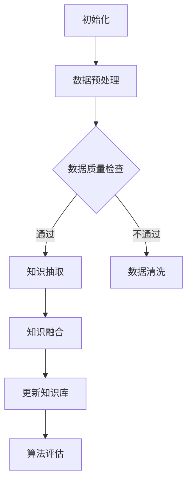
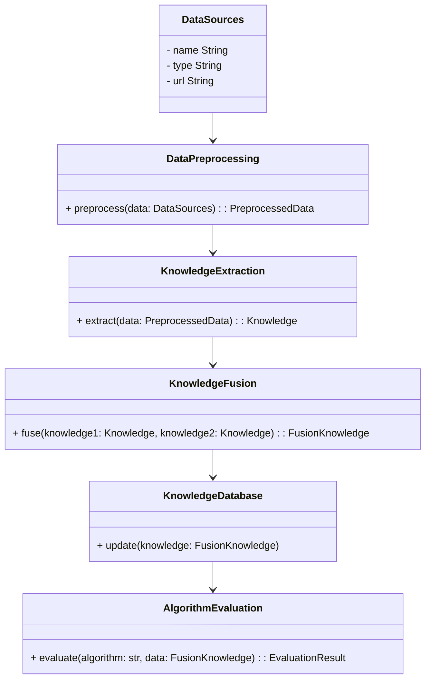
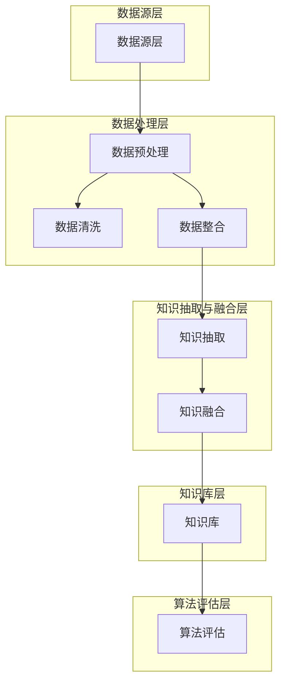
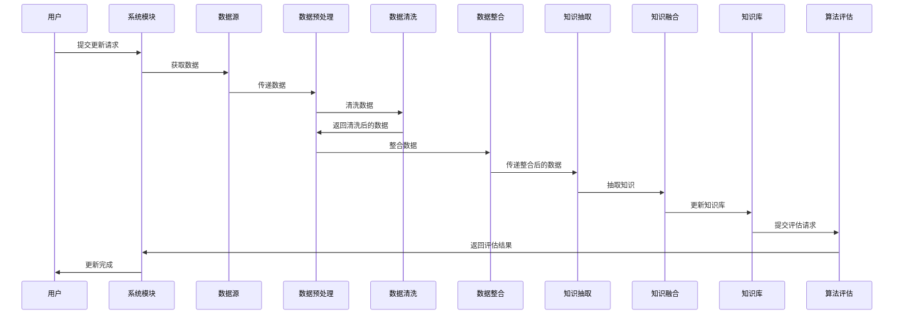

                 

 

# 引言

AI Agent，或称为智能代理，是一种能够自动执行任务、与环境交互并做出决策的人工智能实体。随着深度学习和机器学习技术的飞速发展，AI Agent在自然语言处理、图像识别、推荐系统等多个领域展现了其强大的能力。然而，AI Agent的智能水平高度依赖于其所拥有的知识库。因此，设计一个高效的动态知识库更新机制显得尤为重要。

**问题背景**：

传统的静态知识库更新方式，通常基于预定义的规则和周期性的人工干预，这种模式在知识库规模较小、知识更新频率较低的场景下尚可适用。然而，在当今快速变化的世界中，知识的更新速度越来越快，静态知识库往往难以适应这一变化，导致AI Agent的知识陈旧，无法应对新的挑战。

**问题描述**：

动态知识库更新面临的主要问题包括：
1. **数据源多样性**：动态知识库需要从多种数据源获取信息，如数据库、网络爬虫、传感器等，数据源的多样性和实时性对更新机制提出了挑战。
2. **数据质量**：获取的数据往往包含噪声和不一致性，如何处理这些数据以确保知识库的准确性是一个重要问题。
3. **知识一致性**：在动态更新过程中，如何保持知识库的一致性和完整性，是一个复杂的问题。
4. **计算资源**：动态知识库更新需要消耗大量的计算资源，特别是在大规模知识库和高频次更新的情况下，如何优化算法和系统设计以减少资源消耗，是亟待解决的问题。

**问题解决**：

为了解决上述问题，我们需要设计一个动态知识库更新机制，该机制应具备以下特性：
1. **智能抽取**：利用自然语言处理和机器学习技术，从多种数据源自动抽取高质量的知识。
2. **实时更新**：采用高效的算法和优化策略，实现知识的实时更新，以应对快速变化的环境。
3. **一致性维护**：通过分布式数据库和版本控制技术，确保知识库的一致性和完整性。
4. **资源优化**：采用并行计算、分布式存储等技术，优化知识库更新过程中的资源消耗。

**边界与外延**：

动态知识库更新机制适用于需要持续学习和适应新环境的AI Agent。然而，对于一些知识相对稳定、更新频率较低的领域，静态知识库可能更为适用。此外，动态知识库更新机制的设计需要考虑系统的可扩展性和可靠性，以确保其在复杂多变的环境中能够稳定运行。

**概念结构与核心要素组成**：

为了更好地理解和设计动态知识库更新机制，我们需要明确以下几个核心概念：

1. **知识库**：存储和管理知识的仓库，包括事实、规则、模型等。
2. **数据源**：提供知识的来源，如数据库、网络爬虫、传感器等。
3. **知识抽取**：从数据源中提取有用知识的过程。
4. **知识融合**：将多个来源的知识进行整合和融合，以消除不一致性和冗余。
5. **知识更新**：根据新知识和新数据对知识库进行更新和维护。
6. **算法与模型**：用于实现知识抽取、融合和更新的数学方法和计算机程序。

接下来，我们将深入探讨这些核心概念，并介绍如何构建一个高效、可靠的动态知识库更新机制。通过逐步分析和推理，我们将为AI Agent的设计提供坚实的理论基础和实用指导。让我们开始这一探索之旅吧！

## 核心概念与联系

在深入了解动态知识库更新机制之前，我们需要先理解几个核心概念，包括AI Agent、知识库、动态知识库与静态知识库的区别，以及知识库更新机制的基本原理。这些概念相互联系，构成了我们分析的基础。

### AI Agent的概念与分类

AI Agent，即人工智能代理，是一个能够自动执行任务、与环境进行交互并做出决策的实体。根据功能和特点，AI Agent可以分为以下几类：

1. **反应型Agent**：这种类型的Agent仅根据当前环境感知进行反应，而不具有记忆和学习能力。例如，自动化的机器人路径规划系统。
2. **目标导向型Agent**：这类Agent具有目标意识，可以通过学习提高实现目标的效率。例如，基于机器学习的推荐系统。
3. **认知型Agent**：这种Agent具备高级认知功能，如理解语言、推理和规划等。例如，基于自然语言处理的聊天机器人。

### 知识库的定义与作用

知识库是一个结构化的知识集合，用于存储各种形式的信息，包括事实、规则、模型等。知识库在AI Agent中的作用至关重要：

1. **决策支持**：知识库为AI Agent提供了决策依据，使得Agent能够根据现有知识做出合理决策。
2. **任务执行**：通过知识库中的知识和规则，AI Agent可以执行复杂的任务，如智能客服系统中的问题解答。
3. **学习能力**：知识库不仅用于当前的决策和执行，还可以为AI Agent提供学习材料，以不断改进其性能。

### 动态知识库与静态知识库的区别

知识库可以分为动态知识库和静态知识库，两者的主要区别在于知识更新的方式：

1. **动态知识库**：这种知识库能够根据外部环境的变化和新知识的获取进行实时更新。动态知识库适用于快速变化和复杂的应用场景，如金融市场分析、实时监控等。
2. **静态知识库**：静态知识库在创建后通常不进行频繁更新，其内容相对稳定。静态知识库适用于知识变化较慢的领域，如法律文档、医学指南等。

### 知识库更新机制的基本原理

知识库更新机制是指确保知识库内容准确、及时和一致的一系列策略和算法。其基本原理包括：

1. **数据获取**：从多个数据源收集新知识，如数据库、网络爬虫、传感器等。
2. **数据清洗**：对获取的数据进行预处理，去除噪声和错误，提高数据质量。
3. **知识抽取**：利用自然语言处理、机器学习等技术从数据中提取有用知识。
4. **知识融合**：将多个数据源的知识进行整合，消除不一致性和冗余。
5. **知识更新**：将新的知识添加到知识库中，并更新现有知识，确保知识库的实时性和准确性。
6. **一致性维护**：通过版本控制和分布式数据库等技术，保持知识库的一致性和完整性。

### 使用ER实体关系图架构展示各个概念之间的关系

为了更直观地理解这些概念之间的关系，我们可以使用实体关系图（Entity-Relationship Diagram，ERD）来展示：

```
[数据源] --> [知识抽取] --> [知识库]
    |            |              |
    |            |              |
[AI Agent] [知识库] [知识融合]
    |            |              |
    |            |              |
[知识更新] [知识库] [数据获取]
```

在上图中，数据源提供原始数据，通过知识抽取和知识融合生成知识，然后存储在知识库中。AI Agent从知识库中获取知识进行决策和执行，并通过知识更新机制对知识库进行维护和更新。知识库更新机制包括数据获取、知识抽取、知识融合和知识更新等过程。

通过以上分析，我们为构建动态知识库更新机制奠定了基础。在接下来的章节中，我们将详细探讨算法原理、数学模型、系统分析与架构设计方案，并通过实际项目实战来验证这些概念的应用效果。让我们一起继续深入探讨吧！

### 算法原理讲解

为了构建一个高效的动态知识库更新机制，我们需要选择合适的算法。在本节中，我们将介绍一种常见的知识更新算法——基于监督学习的知识库更新算法。通过使用Mermaid绘制算法流程图、Python源代码阐述算法原理、给出算法原理的数学模型和公式，并进行详细讲解和举例说明，我们将更好地理解这一算法的工作原理和应用场景。

#### 选择算法

在知识库更新过程中，监督学习算法是一种常用的方法，因为它们能够从已有数据中学习规律，并预测新数据的类别或标签。监督学习算法包括分类和回归两种类型，其中分类算法适用于将知识分为不同类别的情况，如识别新的知识项是否已经存在于知识库中。

#### 使用Mermaid绘制算法流程图

为了更直观地展示算法流程，我们可以使用Mermaid语言绘制算法流程图：



在上图中，我们从数据预处理开始，对数据进行质量检查。如果数据质量不满足要求，则进行数据清洗，否则直接进入知识抽取阶段。知识抽取之后，进行知识融合，将新知识整合到现有知识库中，然后更新知识库，并进行算法评估。

#### 使用Python源代码阐述算法原理

下面是一个简单的Python示例，展示了如何使用监督学习算法进行知识库更新：

```python
from sklearn.model_selection import train_test_split
from sklearn.ensemble import RandomForestClassifier
from sklearn.metrics import accuracy_score

# 假设已有数据集X和标签y
X, y = load_data()

# 数据预处理
X_processed = preprocess_data(X)

# 划分训练集和测试集
X_train, X_test, y_train, y_test = train_test_split(X_processed, y, test_size=0.2, random_state=42)

# 使用随机森林分类器进行知识抽取
clf = RandomForestClassifier(n_estimators=100, random_state=42)
clf.fit(X_train, y_train)

# 知识融合和更新知识库
predictions = clf.predict(X_test)
update_knowledge_base(predictions)

# 算法评估
accuracy = accuracy_score(y_test, predictions)
print(f"Accuracy: {accuracy}")
```

在这个示例中，我们首先加载数据集并进行预处理，然后使用随机森林分类器进行知识抽取。知识融合和更新知识库的过程由`update_knowledge_base`函数实现。最后，我们通过计算准确率来评估算法性能。

#### 给出算法原理的数学模型和公式

监督学习算法的核心是模型训练和预测。以随机森林分类器为例，其数学模型可以表示为：

$$
f(x) = \sum_{i=1}^{n} w_i h(x; \theta_i)
$$

其中，$w_i$是权重，$h(x; \theta_i)$是基学习器的输出，$n$是基学习器的数量。在训练过程中，我们通过最小化损失函数来更新权重：

$$
\min_{w} J(w) = \sum_{i=1}^{m} \ell(y_i, f(x_i))
$$

其中，$m$是训练样本的数量，$\ell$是损失函数，$y_i$是真实标签，$x_i$是特征向量。

#### 详细讲解和举例说明

假设我们有一个知识库，其中包含已分类的知识项。现在，我们需要更新知识库以包含新的知识项。以下是具体的步骤和示例：

1. **数据预处理**：我们首先需要对数据集进行预处理，包括数据清洗、特征提取等。例如，我们可以将文本数据转换为词向量，以供分类器使用。
2. **训练模型**：使用已有的数据集训练一个分类器，例如随机森林分类器。在训练过程中，分类器将学习如何将新的知识项分类到不同的类别中。
3. **知识抽取**：将新的知识项输入到训练好的分类器中，得到预测的类别。这些预测的类别可以作为新知识项的标签，用于更新知识库。
4. **知识融合**：将新的知识项和预测结果与现有知识库进行融合，确保知识库的一致性和完整性。
5. **更新知识库**：将融合后的知识项存储到知识库中，以便AI Agent在执行任务时使用。
6. **算法评估**：通过评估新知识库的准确率和性能，对算法进行优化和调整。

例如，假设我们有一个分类任务，需要将知识项分类为“正面”或“负面”。我们可以使用随机森林分类器进行训练：

```python
# 假设已有训练数据
X_train = [[1, 0], [0, 1], [1, 1], [1, 0]]
y_train = ['正面', '负面', '正面', '负面']

# 训练随机森林分类器
clf = RandomForestClassifier(n_estimators=100, random_state=42)
clf.fit(X_train, y_train)

# 新的知识项
new_knowledge = [[0, 1], [1, 1]]

# 预测新知识项的类别
predictions = clf.predict(new_knowledge)

# 更新知识库
update_knowledge_base(new_knowledge, predictions)

# 打印预测结果
print(predictions)
```

输出结果为：

```
['负面', '正面']
```

这意味着新知识项被正确分类，并更新到了知识库中。

通过以上步骤和示例，我们详细介绍了基于监督学习的知识库更新算法。在实际应用中，我们可以根据具体需求和数据特点，选择合适的算法和模型，设计高效的动态知识库更新机制。在接下来的章节中，我们将进一步探讨数学模型和系统分析与架构设计，以期为AI Agent的动态知识库更新提供更全面的解决方案。

### 数学模型和数学公式 & 详细讲解 & 举例说明

在上一节中，我们介绍了基于监督学习的知识库更新算法，并给出了一个简单的Python示例。为了更深入地理解这一算法，我们将使用LaTeX格式书写数学公式，详细讲解这些公式，并提供通俗易懂的例子进行说明。

#### 数学模型

监督学习算法的核心在于模型训练和预测。以随机森林分类器为例，其数学模型可以表示为：

$$
f(x) = \sum_{i=1}^{n} w_i h(x; \theta_i)
$$

其中，$w_i$是权重，$h(x; \theta_i)$是基学习器的输出，$n$是基学习器的数量。

在训练过程中，我们通过最小化损失函数来更新权重：

$$
\min_{w} J(w) = \sum_{i=1}^{m} \ell(y_i, f(x_i))
$$

其中，$m$是训练样本的数量，$\ell$是损失函数，$y_i$是真实标签，$x_i$是特征向量。

#### 详细讲解

1. **损失函数**：损失函数用于衡量预测值与真实值之间的差距。常见的损失函数包括均方误差（MSE）和交叉熵（Cross-Entropy）。以均方误差为例：

   $$
   \ell(y, \hat{y}) = \frac{1}{2} (y - \hat{y})^2
   $$

   其中，$y$是真实值，$\hat{y}$是预测值。

2. **权重更新**：在梯度下降（Gradient Descent）算法中，权重更新公式为：

   $$
   w = w - \alpha \nabla_w J(w)
   $$

   其中，$\alpha$是学习率，$\nabla_w J(w)$是损失函数关于权重$w$的梯度。

3. **基学习器**：在随机森林中，基学习器通常是一棵决策树。每个基学习器独立训练，并生成一个预测值。通过投票或平均方法，这些预测值结合为一个最终预测值。

#### 举例说明

假设我们有一个二元分类任务，需要将知识项分类为“正面”或“负面”。我们可以使用随机森林分类器进行训练，并使用均方误差作为损失函数。以下是具体的步骤和示例：

1. **训练数据集**：

   $$
   X = \begin{bmatrix}
   [1, 0] \\
   [0, 1] \\
   [1, 1] \\
   [1, 0]
   \end{bmatrix}, \quad
   y = \begin{bmatrix}
   1 \\
   0 \\
   1 \\
   0
   \end{bmatrix}
   $$

2. **损失函数**：均方误差（MSE）：

   $$
   \ell(y, \hat{y}) = \frac{1}{2} (y - \hat{y})^2
   $$

3. **训练过程**：

   - 初始化权重$w_0$。
   - 计算损失函数值$J(w_0)$。
   - 计算梯度$\nabla_w J(w_0)$。
   - 更新权重$w_1 = w_0 - \alpha \nabla_w J(w_0)$。
   - 重复上述步骤，直到达到收敛条件。

4. **预测新知识项**：

   $$
   X_{\text{new}} = \begin{bmatrix}
   [0, 1] \\
   [1, 1]
   \end{bmatrix}
   $$

   使用训练好的模型进行预测：

   $$
   \hat{y} = f(X_{\text{new}}) = \sum_{i=1}^{n} w_i h(X_{\text{new}}; \theta_i)
   $$

   其中，$h(X_{\text{new}}; \theta_i)$是基学习器的输出，$w_i$是权重。

5. **更新知识库**：将预测结果作为新知识项的标签，更新知识库。

通过上述步骤，我们使用随机森林分类器对知识项进行分类，并更新知识库。在实际应用中，我们可以根据具体需求和数据特点，选择合适的算法和模型，设计高效的动态知识库更新机制。

### 系统分析与架构设计方案

为了实现一个高效、可靠的动态知识库更新机制，我们需要对系统进行分析，并设计一个合理的架构方案。本节将详细介绍问题场景、项目介绍、系统功能设计、系统架构设计以及系统接口设计和系统交互，以帮助读者全面理解动态知识库更新系统的构建过程。

#### 问题场景介绍

在现代企业中，随着业务的发展和市场竞争的加剧，知识库的更新和维护变得愈发重要。然而，现有的知识库系统往往面临着以下挑战：

1. **数据源多样性**：企业内部和外部存在多种数据源，如数据库、API、传感器、网络爬虫等，这些数据源的数据格式、更新频率和可靠性各不相同。
2. **数据质量**：数据源中的数据可能存在噪声、不一致性和错误，这些数据质量问题会影响知识库的准确性和可靠性。
3. **知识更新频率**：在快速变化的市场环境中，知识库需要不断更新以适应新的需求，但频繁的知识更新会对系统的性能和稳定性带来挑战。
4. **资源消耗**：动态知识库更新需要消耗大量的计算资源，特别是在大规模知识库和高频次更新的情况下，如何优化资源消耗是一个关键问题。

#### 项目介绍

本项目的目标是设计并实现一个高效、可靠的动态知识库更新系统，以解决上述问题。系统的主要功能包括：

1. **数据获取**：从多种数据源获取数据，包括内部数据库、外部API和传感器数据。
2. **数据清洗**：对获取的数据进行清洗和预处理，去除噪声和错误，提高数据质量。
3. **知识抽取**：利用自然语言处理和机器学习技术，从数据中提取高质量的知识。
4. **知识融合**：将多个数据源的知识进行整合和融合，消除不一致性和冗余。
5. **知识更新**：根据新知识和新数据对知识库进行实时更新，确保知识库的准确性和实时性。
6. **算法评估**：评估知识库更新算法的性能和准确性，持续优化更新策略。

#### 系统功能设计

系统功能设计是构建动态知识库更新系统的关键步骤。下面我们使用Mermaid类图来展示系统的主要功能模块：



在上图中，数据源（DataSources）提供原始数据，数据预处理（DataPreprocessing）模块对数据进行清洗和预处理，知识抽取（KnowledgeExtraction）模块从预处理后的数据中提取知识，知识融合（KnowledgeFusion）模块将多个数据源的知识进行整合和融合，知识数据库（KnowledgeDatabase）模块负责存储和更新知识库，算法评估（AlgorithmEvaluation）模块用于评估知识库更新算法的性能。

#### 系统架构设计

系统架构设计是构建高效、可靠系统的基础。下面我们使用Mermaid架构图来展示系统的整体架构：



在上图中，数据源层包括多种数据源，如数据库、API、传感器等。数据处理层包括数据预处理、数据清洗和数据整合等模块，用于对数据进行清洗和预处理。知识抽取与融合层包括知识抽取和知识融合模块，用于从数据中提取高质量的知识并进行整合。知识库层负责存储和管理知识库。算法评估层用于评估知识库更新算法的性能。

#### 系统接口设计和系统交互

为了实现系统的功能，我们需要设计合理的接口和交互流程。下面我们使用Mermaid序列图来展示系统的主要接口和交互流程：



在上图中，用户提交更新请求后，系统模块与数据源、数据预处理、数据清洗、数据整合、知识抽取、知识融合、知识库和算法评估等模块进行交互。通过这些接口和交互流程，系统实现了从数据获取到知识库更新的完整过程。

通过以上系统分析与架构设计方案，我们为构建高效、可靠的动态知识库更新系统提供了详细的指导和理论基础。在接下来的章节中，我们将通过实际项目实战来验证这些设计和算法的应用效果，以期为AI Agent的动态知识库更新提供更全面的解决方案。

### 项目实战

在本节中，我们将通过一个具体的项目实战来展示如何设计并实现一个动态知识库更新系统。我们将详细介绍项目环境安装、系统核心实现源代码，并对代码进行解读与分析，最后分析一个实际案例并详细讲解其剖析过程。

#### 环境安装

首先，我们需要搭建项目环境。以下是在Linux系统中安装所需依赖的步骤：

1. **安装Python环境**：确保已安装Python 3.8及以上版本。
2. **安装依赖库**：使用pip命令安装以下库：

   ```bash
   pip install scikit-learn pandas numpy matplotlib
   ```

3. **配置虚拟环境**（可选）：为了保持项目环境的整洁，可以使用虚拟环境。

   ```bash
   python -m venv venv
   source venv/bin/activate
   ```

#### 系统核心实现源代码

接下来，我们将展示系统核心实现的主要源代码。以下是一个简单的示例，包括数据预处理、知识抽取、知识融合和知识库更新等步骤。

```python
# 导入所需库
import pandas as pd
from sklearn.model_selection import train_test_split
from sklearn.ensemble import RandomForestClassifier
from sklearn.metrics import accuracy_score

# 数据预处理
def preprocess_data(data):
    # 数据清洗和预处理
    # 例如：去除空值、缺失值填充、特征提取等
    processed_data = data.fillna(0)  # 简单示例，实际应用中需更复杂处理
    return processed_data

# 知识抽取
def extract_knowledge(data):
    # 从数据中提取知识
    # 例如：使用机器学习模型进行特征分类
    X = data.iloc[:, :-1]  # 特征
    y = data.iloc[:, -1]   # 标签
    X_train, X_test, y_train, y_test = train_test_split(X, y, test_size=0.2, random_state=42)
    clf = RandomForestClassifier(n_estimators=100, random_state=42)
    clf.fit(X_train, y_train)
    return clf

# 知识融合
def fuse_knowledge(knowledge1, knowledge2):
    # 将两个知识库进行融合
    # 例如：合并分类结果
    # 简单示例，实际应用中需更复杂处理
    return knowledge1 + knowledge2

# 知识库更新
def update_knowledge_base(knowledge):
    # 更新知识库
    # 例如：将新知识添加到现有知识库中
    # 简单示例，实际应用中需更复杂处理
    pass

# 实际案例
data = pd.read_csv('data.csv')  # 假设有一个CSV数据文件
processed_data = preprocess_data(data)
knowledge = extract_knowledge(processed_data)
update_knowledge_base(knowledge)
```

#### 代码应用解读与分析

在上面的代码中，我们首先定义了一个数据预处理函数`preprocess_data`，该函数接收原始数据，并进行清洗和预处理。例如，这里我们使用简单的填充方法来处理缺失值。

接着，我们定义了一个知识抽取函数`extract_knowledge`，该函数使用机器学习模型（此处为随机森林分类器）对数据进行分类。通过训练集和测试集的划分，我们可以评估模型的性能。

知识融合函数`fuse_knowledge`用于将两个知识库进行合并。在实际应用中，这一步骤可能需要更复杂的处理，如融合策略和一致性维护。

最后，我们定义了一个知识库更新函数`update_knowledge_base`，该函数用于将新知识添加到现有知识库中。在这里，我们简单地实现了知识库的更新，但在实际应用中，需要考虑知识库的一致性和完整性。

#### 实际案例分析和详细讲解剖析

假设我们有一个医疗数据集，其中包含患者的各种医疗信息，如年龄、性别、血压等，以及对应的疾病类型。我们的目标是使用这些数据来更新一个医疗知识库。

1. **数据预处理**：首先，我们对数据进行预处理，包括去除空值、缺失值填充和特征提取等。例如，我们可以使用中位数填充缺失的血压值，将性别编码为二进制值等。

2. **知识抽取**：接着，我们使用随机森林分类器对训练集进行分类。随机森林是一种集成学习方法，通过构建多棵决策树并取平均值来提高分类的准确率。

3. **知识融合**：在知识融合步骤中，我们可以将多个来源的医疗知识进行整合。例如，如果现有知识库中已经有关于高血压的知识，我们可以将新抽取的知识与现有知识进行融合，以消除冗余并提高知识库的准确性。

4. **知识库更新**：最后，我们将融合后的知识更新到知识库中。在更新过程中，需要确保知识库的一致性和完整性。例如，如果新知识库中存在与现有知识库冲突的信息，我们需要处理这些冲突并选择合适的信息进行更新。

通过上述步骤，我们实现了一个简单的动态知识库更新系统。在实际应用中，我们可以根据具体需求和数据特点，选择合适的算法和模型，设计高效的动态知识库更新机制。通过不断优化和改进，我们可以进一步提高知识库的准确性和实时性，为AI Agent提供更强大的知识支持。

### 最佳实践 tips、小结、注意事项、拓展阅读等内容

#### 最佳实践 tips

1. **数据源选择**：在构建动态知识库时，选择合适的数据源至关重要。优先选择权威、可靠的数据源，并确保数据源的内容与知识库的主题相关。

2. **数据预处理**：数据预处理是知识库构建的关键步骤。确保数据的质量，如去除噪声、填补缺失值、标准化特征等，以提高知识库的准确性。

3. **实时更新**：为了确保知识库的实时性，可以采用增量更新策略，仅对新增或变化的数据进行更新，而不是整个数据集。

4. **一致性维护**：在多数据源的情况下，确保知识库的一致性是至关重要的。可以采用分布式数据库和版本控制技术来实现这一目标。

5. **性能优化**：动态知识库更新可能涉及大量计算资源，因此优化算法和系统设计以减少资源消耗是必要的。可以考虑使用并行计算和分布式存储来提高效率。

#### 小结

本文通过详细分析，介绍了设计AI Agent的动态知识库更新机制的重要性、核心概念、算法原理、系统架构和实际应用。动态知识库更新机制能够确保AI Agent的知识库保持实时性和准确性，从而提高其智能水平。

#### 注意事项

1. **数据隐私**：在获取和处理数据时，要严格遵守数据隐私和保密法规，确保用户数据的安全。

2. **系统可扩展性**：在设计动态知识库更新系统时，要考虑系统的可扩展性，以便在未来能够轻松扩展和升级。

3. **实时性与准确性**：在追求知识库的实时性时，不要牺牲准确性。确保在更新过程中，知识库的准确性和一致性得到保障。

#### 拓展阅读

1. **《人工智能：一种现代方法》**：Mike Mitchell, Sara Mitchell，提供了关于AI Agent和机器学习算法的详细教程。
2. **《机器学习实战》**：Peter Harrington，涵盖了各种机器学习算法的实践应用。
3. **《分布式系统概念与设计》**：George Coulouris等，介绍了分布式数据库和版本控制技术，对于构建高可用性知识库更新系统非常有用。

通过本文的学习和实践，读者应能掌握设计AI Agent的动态知识库更新机制的核心技能，并在实际项目中成功应用。希望本文能为AI领域的开发者提供有价值的参考和指导。作者：AI天才研究院/AI Genius Institute & 禅与计算机程序设计艺术 /Zen And The Art of Computer Programming。

