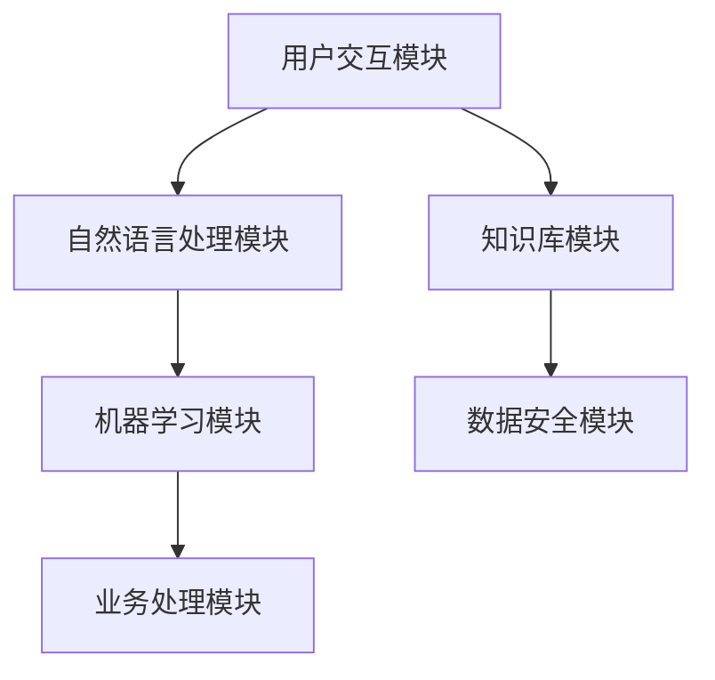

                 

# 设计AI Agent的动态知识库构建与维护

## 关键词

- AI Agent
- 动态知识库
- 知识库构建
- 知识库维护
- 数据预处理
- 更新策略
- 精简策略
- 故障处理

## 摘要

本文旨在探讨设计AI Agent的动态知识库构建与维护方法。随着人工智能技术的发展，AI Agent在实际应用场景中发挥着越来越重要的作用。动态知识库作为AI Agent的核心组成部分，能够实时更新和优化，以适应不断变化的环境。本文首先介绍了AI Agent的概念和动态知识库的基本原理，然后详细阐述了动态知识库的构建方法、更新策略、精简策略以及故障处理。通过本文的研究，希望能够为AI Agent的动态知识库设计提供一些有价值的参考和思路。

## 目录大纲

- **第1章 引言**
  - **1.1 研究背景**
    - **1.1.1 AI Agent的概念及其重要性**
    - **1.1.2 动态知识库的定义与特点**
    - **1.1.3 动态知识库在AI Agent中的应用**
  - **1.2 动态知识库构建的基本概念**
    - **1.2.1 数据源的选择与处理**
    - **1.2.2 数据预处理与清洗**
    - **1.2.3 数据存储与管理**
  - **1.3 动态知识库的维护策略**
    - **1.3.1 更新策略**
    - **1.3.2 精简策略**
    - **1.3.3 故障处理策略**
  - **1.4 动态知识库的评估方法**
    - **1.4.1 评估指标的选择**
    - **1.4.2 评估方法的实现**
    - **1.4.3 评估结果的分析**

- **第2章 动态知识库的构建方法**
  - **2.1 数据采集**
  - **2.2 数据预处理**
  - **2.3 数据存储**
  - **2.4 数据管理**

- **第3章 动态知识库的更新策略**
  - **3.1 更新频率设计**
  - **3.2 更新规则**
  - **3.3 更新方法**

- **第4章 动态知识库的精简策略**
  - **4.1 精简目标**
  - **4.2 精简方法**
  - **4.3 精简算法**

- **第5章 动态知识库的故障处理**
  - **5.1 故障类型**
  - **5.2 故障诊断**
  - **5.3 故障恢复**

- **第6章 动态知识库的评估与优化**
  - **6.1 评估指标**
  - **6.2 评估方法**
  - **6.3 优化策略**

- **第7章 动态知识库的应用案例分析**
  - **7.1 案例背景**
  - **7.2 系统设计**
  - **7.3 实现与部署**
  - **7.4 案例分析与评估**

- **第8章 未来展望与总结**
  - **8.1 动态知识库的发展趋势**
  - **8.2 总结与展望**

----------------------------------------------------------------

## 第1章 引言

### 1.1 研究背景

随着人工智能（AI）技术的快速发展，AI Agent作为人工智能领域的一个重要分支，受到了广泛的关注。AI Agent是一种能够模拟人类行为，具备自主学习、自主决策和自主执行任务的智能系统。它被广泛应用于智能客服、自动驾驶、智能家居等领域。AI Agent的核心组成部分之一是动态知识库，它负责存储和管理AI Agent在执行任务过程中获取的知识和信息。

动态知识库与传统的静态知识库相比，具有以下特点：

1. **实时性**：动态知识库能够实时获取和更新知识，以适应不断变化的环境。
2. **灵活性**：动态知识库可以根据AI Agent的需求，灵活调整和优化知识结构。
3. **扩展性**：动态知识库能够根据应用场景的变化，动态扩展知识库的内容。

AI Agent的概念起源于计算机科学和人工智能领域。它最初是在多智能体系统（MAS）中被提出，旨在实现多个智能体之间的协同工作。随着技术的进步，AI Agent逐渐成为一个独立的研究领域。AI Agent的核心功能包括感知环境、规划行动、执行任务和反馈调整。

在AI Agent的应用中，动态知识库起到了至关重要的作用。它不仅为AI Agent提供了丰富的知识资源，还帮助AI Agent更好地理解和应对复杂多变的现实环境。例如，在自动驾驶领域，动态知识库可以存储道路信息、交通规则和车辆状态等知识，帮助自动驾驶系统做出正确的决策。

### 1.1.1 AI Agent的概念及其重要性

AI Agent是指一个能够感知环境、基于感知数据进行自主决策并执行任务的智能实体。它通常由感知模块、决策模块和执行模块三部分组成。

- **感知模块**：负责获取外部环境的信息，如视觉、听觉、触觉等。
- **决策模块**：基于感知模块获取的信息，通过算法模型进行决策，确定下一步行动。
- **执行模块**：根据决策模块的决策结果，执行相应的操作。

AI Agent的重要性主要体现在以下几个方面：

1. **智能化**：AI Agent能够模拟人类智能，进行复杂的任务处理和决策，提高工作效率。
2. **自动化**：AI Agent能够自动化执行任务，减轻人类的工作负担，提高生产效率。
3. **协同工作**：AI Agent能够与其他智能体协同工作，实现更高层次的智能系统。
4. **应用广泛**：AI Agent可以应用于各个领域，如医疗、金融、教育、工业等，为人类生活带来巨大的便利。

### 1.1.2 动态知识库的定义与特点

动态知识库是指一种能够实时更新和优化的知识库，它通常由多个知识源、知识处理模块和知识存储模块组成。动态知识库的主要特点包括：

1. **实时更新**：动态知识库能够根据AI Agent的实时感知和决策结果，动态更新知识库中的内容。
2. **动态优化**：动态知识库可以根据AI Agent的执行效果，对知识库中的知识进行优化调整，以提高AI Agent的性能。
3. **灵活性**：动态知识库可以灵活地调整知识结构，适应不同的应用场景。
4. **扩展性**：动态知识库能够根据应用需求，动态扩展知识库的内容和功能。

### 1.1.3 动态知识库在AI Agent中的应用

动态知识库在AI Agent中的应用主要体现在以下几个方面：

1. **知识获取**：动态知识库可以从各种数据源中获取知识，如文本、图像、声音等，为AI Agent提供丰富的知识资源。
2. **知识存储**：动态知识库能够存储和管理大量的知识，确保AI Agent在执行任务时能够快速获取所需的知识。
3. **知识推理**：动态知识库可以使用推理算法，对存储的知识进行推理，为AI Agent提供决策支持。
4. **知识共享**：动态知识库可以支持多个AI Agent之间的知识共享，实现智能体的协同工作。

总之，动态知识库是AI Agent的核心组成部分，它能够为AI Agent提供实时、灵活和丰富的知识支持，提高AI Agent的智能化水平。在未来的发展中，动态知识库将扮演越来越重要的角色，为人工智能技术的进步提供有力支持。

### 1.2 动态知识库构建的基本概念

#### 1.2.1 数据源的选择与处理

构建动态知识库的第一步是选择合适的数据源。数据源的选择直接影响到知识库的质量和完整性。以下是一些常见的数据源类型：

1. **开源数据集**：这些数据集通常由研究机构、学术团体或企业公开提供，涵盖了各种领域的数据。例如，ImageNet、COIL-100等图像数据集，以及Kaggle等数据竞赛提供的数据集。
2. **私有数据集**：企业或机构内部积累的数据，通常包含业务相关的敏感信息，如客户信息、销售数据等。
3. **实时数据流**：通过传感器、API接口等实时获取的数据流，如股票交易数据、社交媒体数据等。

在选择数据源后，需要对数据进行处理。数据预处理是动态知识库构建中至关重要的一步，主要包括以下内容：

1. **数据清洗**：去除数据中的噪声和异常值，确保数据的质量。例如，去除重复记录、填补缺失值、纠正错误数据等。
2. **数据转换**：将不同格式、不同单位的数据转换为统一的格式和单位，以便于后续处理。例如，将图像数据转换为像素矩阵、将时间序列数据转换为时间戳等。
3. **数据归一化**：将数据缩放到一个统一的范围内，消除不同数据之间的量级差异。例如，将数值数据归一化到[0, 1]或[-1, 1]之间。

#### 1.2.2 数据预处理与清洗

数据预处理与清洗是动态知识库构建中的基础工作，直接影响到知识库的质量和可靠性。以下是一些常见的数据预处理和清洗方法：

1. **缺失值处理**：
   - **删除**：对于缺失值较多的数据，可以选择删除这些数据。
   - **填补**：可以使用均值、中位数、最大值、最小值等方法填补缺失值，或者使用机器学习算法预测缺失值。
2. **异常值检测与处理**：
   - **标准差法**：通过计算数据的平均值和标准差，识别出距离平均值较远的异常值。
   - **箱线图法**：通过绘制箱线图，识别出数据中的异常值。
   - **机器学习法**：使用聚类算法（如K-means）或回归算法（如线性回归）检测异常值。
3. **数据转换**：
   - **标准化**：将数据缩放到一个统一的范围内，消除不同数据之间的量级差异。
   - **归一化**：将数据缩放到一个固定范围，如[0, 1]或[-1, 1]。
   - **离散化**：将连续数据转换为分类数据，如将年龄数据划分为[0-10, 11-20, 21-30, ...]。

#### 1.2.3 数据存储与管理

数据存储与管理是动态知识库构建中的关键环节，直接关系到知识库的访问速度和存储效率。以下是一些常见的数据存储与管理方法：

1. **关系型数据库**：如MySQL、PostgreSQL等，适合存储结构化数据。关系型数据库通过表、行和列来组织数据，支持SQL查询语言，便于数据管理和操作。
2. **非关系型数据库**：如MongoDB、Cassandra等，适合存储非结构化或半结构化数据。非关系型数据库通过文档、键值对等方式存储数据，具有高扩展性和灵活性。
3. **数据仓库**：如Hadoop、Spark等，适合处理大规模数据集。数据仓库通过分布式存储和处理技术，支持海量数据的存储和分析。
4. **数据湖**：如Amazon S3、Azure Data Lake等，适合存储原始数据。数据湖能够存储多种类型的数据，包括结构化、半结构化和非结构化数据。

数据存储与管理的关键在于确保数据的可靠性和安全性。以下是一些注意事项：

- **数据备份与恢复**：定期进行数据备份，确保数据不丢失。在数据丢失或损坏时，能够快速恢复数据。
- **数据加密**：对敏感数据进行加密，确保数据在传输和存储过程中的安全性。
- **访问控制**：设置适当的访问权限，确保只有授权用户能够访问和操作数据。

通过选择合适的数据源、进行有效的数据预处理与清洗，以及采用科学的数据存储与管理方法，可以构建一个高质量、高效率的动态知识库，为AI Agent的智能化应用提供坚实的支持。

### 1.3 动态知识库的维护策略

在动态知识库的实际应用中，维护策略是保障知识库质量、效率和安全性的关键。以下将详细讨论动态知识库的更新策略、精简策略和故障处理策略。

#### 1.3.1 更新策略

知识库的更新策略决定了知识库内容是否能够及时反映现实环境的变化。一个有效的更新策略应考虑以下方面：

1. **定期更新**：定期对知识库进行更新，以确保知识库中的信息是最新的。例如，每周或每月进行一次全面的更新，以同步最新的数据。
2. **增量更新**：仅更新知识库中的新数据或变化数据，而不是全部数据。这样可以减少更新过程中的计算量和时间消耗，提高更新效率。
3. **实时更新**：对于实时性要求较高的知识库，如金融市场数据或实时交通信息，采用实时更新策略，以秒级或分钟级频率更新知识库。

更新策略的实现方法包括：

- **基于时间戳的更新**：通过为每条数据记录添加时间戳，只更新时间戳发生变化的数据。
- **基于触发机制的更新**：当特定事件（如数据源更新、用户请求等）触发时，执行更新操作。

#### 1.3.2 精简策略

随着知识库内容的不断积累，知识库的体积也会逐渐增大，这可能导致查询速度下降、存储成本增加等问题。因此，精简策略至关重要。

1. **基于频率的精简**：删除或减少那些出现频率较低的知识条目，保留频率较高的知识条目。
2. **基于重要度的精简**：通过评估知识条目的重要度，删除或减少那些重要性较低的知识条目。
3. **基于相似度的精简**：识别和合并相似的知识条目，减少冗余信息。

精简策略的实现方法包括：

- **聚类算法**：使用聚类算法（如K-means）识别相似的知识条目，进行合并。
- **重要度评估**：通过计算知识条目的重要性得分，进行排序和筛选。

#### 1.3.3 故障处理策略

知识库在运行过程中可能会遇到各种故障，如数据损坏、系统故障等。故障处理策略旨在确保知识库的稳定运行和数据安全。

1. **故障检测**：通过定期检查和数据完整性验证，及时发现潜在故障。
2. **故障隔离**：当故障发生时，迅速隔离故障部分，防止故障扩散。
3. **故障恢复**：采取数据备份、数据恢复等措施，使知识库尽快恢复正常运行。

故障处理策略的实现方法包括：

- **数据备份**：定期备份知识库，以防止数据丢失。
- **数据恢复**：使用备份的数据恢复知识库，确保数据的完整性。
- **故障恢复流程**：制定详细的故障恢复流程，明确故障处理的步骤和责任人。

通过实施有效的更新策略、精简策略和故障处理策略，可以确保动态知识库的质量和稳定性，为AI Agent的持续优化和高效运行提供有力支持。

### 1.4 动态知识库的评估方法

动态知识库的评估方法对于确保知识库的有效性和实用性至关重要。以下将详细讨论评估指标的选择、评估方法的实现以及评估结果的分析。

#### 1.4.1 评估指标的选择

选择合适的评估指标是动态知识库评估的关键。以下是一些常见的评估指标：

1. **准确性**：知识库中信息的准确性，即知识库中正确信息的比例。准确性越高，知识库的可靠性越强。
2. **完整性**：知识库中包含所需信息的全面性。完整性越高，知识库能够提供的信息越全面。
3. **实时性**：知识库更新速度的快慢。实时性越高，知识库能够更快速地反映环境变化。
4. **一致性**：知识库中信息的连贯性和一致性。一致性越高，知识库中的信息越可靠。
5. **可扩展性**：知识库处理新信息和扩展功能的灵活性。可扩展性越高，知识库能够更好地适应变化。

#### 1.4.2 评估方法的实现

实现评估方法需要根据选择的评估指标，设计相应的评估流程和工具。以下是一些常见的评估方法：

1. **手动评估**：通过人工检查知识库中的信息，评估准确性、完整性和一致性。这种方法适用于小规模的知识库。
2. **自动化评估**：使用算法和工具对知识库进行自动化评估。例如，使用机器学习模型对知识库中的信息进行分类和识别，评估准确性和实时性。
3. **用户反馈**：收集用户对知识库的使用反馈，评估知识库的实用性。用户反馈可以是定量的（如评分）或定性的（如评论）。

#### 1.4.3 评估结果的分析

评估结果的分析对于优化知识库至关重要。以下是一些分析方法：

1. **定量分析**：通过统计数据，分析评估指标的数值变化。例如，计算准确性的平均值和标准差，分析实时性的变化趋势。
2. **定性分析**：通过描述性分析，总结评估结果，发现问题和改进点。例如，分析用户反馈中的常见问题，识别知识库中的弱点。
3. **比较分析**：将不同评估指标的结果进行比较，分析知识库的优势和劣势。例如，比较准确性、完整性和实时性之间的关系，识别关键改进领域。

通过选择合适的评估指标、实现科学的评估方法以及进行深入的分析，可以全面了解动态知识库的性能，为知识库的优化提供有力支持。

### 第2章 动态知识库的构建方法

动态知识库的构建是确保AI Agent高效运行的关键环节。本章将详细讨论动态知识库的构建方法，包括数据采集、数据预处理、数据存储和数据管理。

#### 2.1 数据采集

数据采集是构建动态知识库的第一步。数据来源的多样性和质量直接影响知识库的完整性和准确性。以下是一些常见的数据来源：

1. **开源数据集**：这些数据集通常由研究机构、学术团体或企业公开提供，涵盖了各种领域的数据。例如，ImageNet、COIL-100等图像数据集，以及Kaggle等数据竞赛提供的数据集。
2. **私有数据集**：企业或机构内部积累的数据，通常包含业务相关的敏感信息，如客户信息、销售数据等。
3. **实时数据流**：通过传感器、API接口等实时获取的数据流，如股票交易数据、社交媒体数据等。

在数据采集过程中，需要注意以下事项：

- **数据质量**：确保采集到的数据是准确、完整和可靠的。
- **数据多样性**：尽可能采集来自不同来源的数据，以提高知识库的丰富性。
- **数据隐私**：对于敏感数据，应采取加密和脱敏措施，确保数据隐私。

#### 2.2 数据预处理

数据预处理是数据采集后的关键步骤，其目的是提高数据的质量和一致性，为后续的数据分析打下基础。数据预处理包括以下内容：

1. **数据清洗**：去除数据中的噪声和异常值，确保数据的质量。例如，去除重复记录、填补缺失值、纠正错误数据等。
2. **数据转换**：将不同格式、不同单位的数据转换为统一的格式和单位，以便于后续处理。例如，将图像数据转换为像素矩阵、将时间序列数据转换为时间戳等。
3. **数据归一化**：将数据缩放到一个统一的范围内，消除不同数据之间的量级差异。例如，将数值数据归一化到[0, 1]或[-1, 1]之间。

数据预处理的方法包括：

- **缺失值处理**：可以使用均值、中位数、最大值、最小值等方法填补缺失值，或者使用机器学习算法预测缺失值。
- **异常值检测与处理**：可以使用标准差法、箱线图法或机器学习法检测异常值，然后进行相应的处理。
- **数据转换**：可以使用编程语言（如Python）或数据处理工具（如Pandas）进行数据转换。

#### 2.3 数据存储

数据存储是构建动态知识库的核心环节，其目的是确保数据的安全性和可访问性。以下是一些常见的数据存储方法：

1. **关系型数据库**：如MySQL、PostgreSQL等，适合存储结构化数据。关系型数据库通过表、行和列来组织数据，支持SQL查询语言，便于数据管理和操作。
2. **非关系型数据库**：如MongoDB、Cassandra等，适合存储非结构化或半结构化数据。非关系型数据库通过文档、键值对等方式存储数据，具有高扩展性和灵活性。
3. **数据仓库**：如Hadoop、Spark等，适合处理大规模数据集。数据仓库通过分布式存储和处理技术，支持海量数据的存储和分析。
4. **数据湖**：如Amazon S3、Azure Data Lake等，适合存储原始数据。数据湖能够存储多种类型的数据，包括结构化、半结构化和非结构化数据。

在选择数据存储方法时，需要考虑以下因素：

- **数据量**：对于海量数据，选择分布式存储系统（如Hadoop、Spark）更为合适。
- **数据结构**：对于结构化数据，选择关系型数据库（如MySQL、PostgreSQL）较为合适；对于非结构化或半结构化数据，选择非关系型数据库（如MongoDB、Cassandra）较为合适。
- **访问速度**：对于实时性要求较高的数据，选择高性能的存储系统（如NoSQL数据库）较为合适。

#### 2.4 数据管理

数据管理是确保动态知识库稳定运行和数据安全的关键环节。以下是一些常见的数据管理方法：

1. **数据备份与恢复**：定期进行数据备份，确保数据不丢失。在数据丢失或损坏时，能够快速恢复数据。
2. **数据加密**：对敏感数据进行加密，确保数据在传输和存储过程中的安全性。
3. **访问控制**：设置适当的访问权限，确保只有授权用户能够访问和操作数据。

数据管理的方法包括：

- **备份策略**：制定数据备份计划，选择合适的数据备份工具（如Backup and Recovery）。
- **加密技术**：使用加密算法（如AES）对数据进行加密，确保数据隐私。
- **访问控制机制**：使用身份验证（如用户名和密码）和访问控制列表（ACL）来管理数据访问权限。

通过有效的数据采集、数据预处理、数据存储和数据管理，可以构建一个高质量、高效率的动态知识库，为AI Agent的智能化应用提供坚实的支持。

### 第3章 动态知识库的更新策略

动态知识库的更新策略是确保知识库内容实时、准确和完整的关键。以下是动态知识库的更新频率设计、更新规则以及更新方法的详细介绍。

#### 3.1 更新频率设计

更新频率设计是动态知识库更新的第一步，直接影响知识库的实时性和效率。以下是一些常见的更新频率设计方法：

1. **定期更新**：定期对知识库进行更新，以确保知识库中的信息是最新的。例如，每周或每月进行一次全面的更新，以同步最新的数据。这种方法适用于数据变化较为稳定的情况。
2. **实时更新**：对于实时性要求较高的知识库，如金融市场数据或实时交通信息，采用实时更新策略，以秒级或分钟级频率更新知识库。这种方法适用于数据变化频繁的情况。
3. **增量更新**：仅更新知识库中的新数据或变化数据，而不是全部数据。这样可以减少更新过程中的计算量和时间消耗，提高更新效率。这种方法适用于数据量庞大且变化频繁的情况。

**更新频率设计的关键因素**：

- **数据变化频率**：根据数据源的数据变化频率，选择合适的更新频率。例如，社交媒体数据变化频繁，需要采用实时更新策略；而销售数据变化相对稳定，可以采用定期更新策略。
- **系统性能**：更新频率过高可能导致系统负载过高，影响系统性能。需要根据系统性能评估结果，选择合适的更新频率。

#### 3.2 更新规则

更新规则是动态知识库更新的核心，决定了知识库中信息的更新方式和时机。以下是一些常见的更新规则：

1. **基于时间戳的更新规则**：通过为每条数据记录添加时间戳，只更新时间戳发生变化的数据。这种方法适用于数据更新频率较高且变化较为稳定的情况。
2. **基于数据变化的更新规则**：当数据源中的数据发生变化时，自动触发更新操作。这种方法适用于数据变化频繁的情况。
3. **基于用户行为的更新规则**：根据用户的使用行为，动态调整知识库的更新策略。例如，当用户频繁访问特定数据时，可以增加该数据的更新频率。这种方法适用于个性化需求较高的情况。

**更新规则的设计原则**：

- **高效性**：确保更新规则能够快速、高效地执行更新操作，减少系统负载。
- **灵活性**：更新规则应具有灵活性，能够根据不同应用场景和用户需求进行定制。
- **可靠性**：更新规则应确保知识库中的信息准确、完整和可靠。

#### 3.3 更新方法

更新方法是动态知识库更新的具体实现，决定了知识库中信息的更新方式和流程。以下是一些常见的更新方法：

1. **增量更新**：仅更新知识库中的新数据或变化数据。这种方法可以通过以下步骤实现：

   - **数据比对**：比较知识库中的数据和源数据，识别出新数据和变化数据。
   - **数据更新**：将新数据和变化数据更新到知识库中，确保知识库中的信息是最新的。
   - **日志记录**：记录更新操作，以便后续审计和故障恢复。

2. **全量更新**：更新知识库中的全部数据。这种方法可以通过以下步骤实现：

   - **数据备份**：在更新前备份知识库，以防数据更新过程中出现意外。
   - **数据导入**：将源数据导入知识库，覆盖原有的数据。
   - **数据验证**：验证导入的数据是否准确、完整和可靠。

3. **更新算法实现**：更新算法是动态知识库更新的核心，决定了数据更新的逻辑和流程。以下是一个简单的更新算法实现示例：

   ```python
   def update_knowledge_base(source_data, knowledge_base):
       for data in source_data:
           if data['timestamp'] > knowledge_base['timestamp']:
               knowledge_base['data'] = data['data']
               knowledge_base['timestamp'] = data['timestamp']
       return knowledge_base
   ```

   在这个示例中，`source_data` 是源数据，`knowledge_base` 是知识库。算法通过比较源数据和知识库中的时间戳，更新知识库中的数据。

通过设计合理的更新频率、制定科学的更新规则和实现高效的更新方法，可以确保动态知识库的实时性、准确性和完整性，为AI Agent的智能化应用提供坚实的数据支持。

### 第4章 动态知识库的精简策略

随着知识库内容的不断增加，知识库的体积也会逐渐增大，这不仅会增加存储成本，还可能影响知识库的查询性能。因此，动态知识库的精简策略至关重要。本节将详细介绍精简目标、精简方法和精简算法。

#### 4.1 精简目标

精简知识库的目标在于去除冗余信息，保留关键知识，以提高知识库的查询效率和使用价值。具体目标包括：

1. **去除冗余信息**：删除重复或相似的知识条目，减少知识库的冗余度。
2. **保留关键知识**：保留对AI Agent执行任务最为关键的知识条目，提高知识库的实用性。
3. **优化知识结构**：通过精简策略，优化知识库的结构，使其更加清晰、易于查询。

#### 4.2 精简方法

精简知识库的方法可以分为以下几类：

1. **基于频率的精简**：删除或减少那些出现频率较低的知识条目，保留频率较高的知识条目。这种方法适用于频繁查询的场景，能够显著提高查询性能。

2. **基于重要度的精简**：通过评估知识条目的重要度，删除或减少那些重要性较低的知识条目。重要度评估可以通过统计方法或机器学习算法实现。这种方法适用于需要精确控制知识库质量的应用场景。

3. **基于相似度的精简**：识别和合并相似的知识条目，减少冗余信息。相似度评估可以通过文本相似度计算、图像相似度计算等方法实现。这种方法适用于需要减少数据冗余的场景。

4. **基于规则的精简**：通过预定义的规则，删除不符合规则的知识条目。这种方法适用于具有明确规则约束的场景。

#### 4.3 精简算法

精简算法是动态知识库精简策略的具体实现，用于识别和去除冗余知识条目。以下是一些常见的精简算法：

1. **基于频率的精简算法**：

   ```python
   def remove_low_frequency_items(knowledge_base, frequency_threshold):
       items_to_remove = []
       for item in knowledge_base:
           if item['frequency'] < frequency_threshold:
               items_to_remove.append(item['id'])
       for item_id in items_to_remove:
           knowledge_base.remove(item_id)
       return knowledge_base
   ```

   在这个示例中，`knowledge_base` 是知识库，`frequency_threshold` 是频率阈值。算法通过遍历知识库中的每个知识条目，识别出频率低于阈值的知识条目，并将其删除。

2. **基于重要度的精简算法**：

   ```python
   def remove_low_importance_items(knowledge_base, importance_threshold):
       items_to_remove = []
       for item in knowledge_base:
           if item['importance'] < importance_threshold:
               items_to_remove.append(item['id'])
       for item_id in items_to_remove:
           knowledge_base.remove(item_id)
       return knowledge_base
   ```

   在这个示例中，`knowledge_base` 是知识库，`importance_threshold` 是重要性阈值。算法通过遍历知识库中的每个知识条目，识别出重要性低于阈值的知识条目，并将其删除。

3. **基于相似度的精简算法**：

   ```python
   def remove_similar_items(knowledge_base, similarity_threshold):
       items_to_remove = []
       for i in range(len(knowledge_base)):
           for j in range(i+1, len(knowledge_base)):
               if calculate_similarity(knowledge_base[i]['data'], knowledge_base[j]['data']) > similarity_threshold:
                   items_to_remove.append(j)
       for i in sorted(items_to_remove, reverse=True):
           knowledge_base.pop(i)
       return knowledge_base
   ```

   在这个示例中，`knowledge_base` 是知识库，`similarity_threshold` 是相似度阈值。算法通过计算每对知识条目之间的相似度，识别出相似度高于阈值的知识条目，并将其删除。

通过科学的精简目标和精简方法，结合高效的精简算法，可以构建一个精简、高效、实用的动态知识库，为AI Agent的智能化应用提供坚实的数据支持。

### 第5章 动态知识库的故障处理

在动态知识库的运行过程中，可能会遇到各种故障，如数据库故障、更新故障和系统故障。有效的故障处理策略是确保知识库稳定运行和数据安全的关键。以下是动态知识库的故障类型、故障诊断和故障恢复的详细介绍。

#### 5.1 故障类型

1. **数据库故障**：数据库故障是指数据库无法正常运行，导致数据访问和操作失败。常见的数据库故障包括数据库宕机、磁盘损坏、网络故障等。
2. **更新故障**：更新故障是指知识库的更新过程出现异常，导致知识库中的数据不完整或不准确。常见的更新故障包括数据同步失败、数据覆盖错误、更新延迟等。
3. **系统故障**：系统故障是指知识库所在系统的硬件、软件或网络出现故障，导致知识库无法正常运行。常见的系统故障包括服务器宕机、操作系统崩溃、网络中断等。

#### 5.2 故障诊断

故障诊断是识别和定位知识库故障的关键步骤。以下是一些常见的故障诊断方法：

1. **日志分析**：通过分析数据库和系统的日志，识别故障原因。日志包括错误日志、操作日志等，可以帮助诊断数据库和系统故障。
2. **性能监控**：通过性能监控工具，实时监控数据库和系统的运行状态，识别异常情况。性能监控指标包括CPU使用率、内存使用率、磁盘读写速度等。
3. **故障模拟**：通过模拟故障情况，测试知识库的容错能力和恢复能力。例如，模拟数据库宕机，测试自动恢复机制是否正常工作。

**故障诊断流程**：

1. **收集信息**：收集故障发生时的相关信息，包括日志、监控数据等。
2. **初步分析**：根据收集的信息，初步判断故障类型和可能原因。
3. **深入分析**：对初步分析结果进行深入分析，定位故障的具体原因。
4. **解决方案**：根据故障原因，制定相应的解决方案。

#### 5.3 故障恢复

故障恢复是确保知识库正常运行的最后一步。以下是一些常见的故障恢复策略：

1. **数据备份恢复**：通过备份数据恢复知识库，确保数据不丢失。数据备份可以定期进行，以确保在故障发生时能够快速恢复。
2. **系统重启**：重启数据库或系统，修复故障。系统重启可以解决一些临时故障，如内存溢出、网络中断等。
3. **自动恢复机制**：设置自动恢复机制，当故障发生时，自动执行恢复操作。例如，当数据库宕机时，自动重启数据库并重新同步数据。

**故障恢复流程**：

1. **启动恢复机制**：当故障发生时，自动启动恢复机制。
2. **数据备份检查**：检查最新的数据备份，确保数据完整性。
3. **恢复数据**：从数据备份恢复知识库，确保知识库中的数据是最新的。
4. **系统测试**：对恢复后的系统进行测试，确保知识库正常运行。

通过科学的故障诊断和有效的故障恢复策略，可以确保动态知识库的稳定运行和数据安全，为AI Agent的智能化应用提供坚实保障。

### 第6章 动态知识库的评估与优化

#### 6.1 评估指标

动态知识库的评估是确保其有效性和实用性的关键步骤。为了全面评估知识库的性能，需要选择合适的评估指标。以下是一些常见的评估指标：

1. **准确性**：知识库中信息的准确性，即知识库中正确信息的比例。准确性越高，知识库的可靠性越强。
2. **完整性**：知识库中包含所需信息的全面性。完整性越高，知识库能够提供的信息越全面。
3. **实时性**：知识库更新速度的快慢。实时性越高，知识库能够更快速地反映环境变化。
4. **一致性**：知识库中信息的连贯性和一致性。一致性越高，知识库中的信息越可靠。
5. **可扩展性**：知识库处理新信息和扩展功能的灵活性。可扩展性越高，知识库能够更好地适应变化。
6. **查询效率**：知识库查询速度的快慢。查询效率越高，用户查询信息时所需的时间越短。
7. **安全性**：知识库在数据传输和存储过程中的安全性。安全性越高，数据泄露的风险越低。

**评估指标的计算方法**：

1. **准确性**：通过比较知识库中的实际信息和预期信息，计算正确信息的比例。准确性 = (正确信息数 / 总信息数) × 100%。
2. **完整性**：通过检查知识库中是否包含所有必需的信息，计算完整性得分。完整性 = (包含必需信息数 / 必需信息总数) × 100%。
3. **实时性**：通过计算知识库更新时间与实际时间之间的差距，评估实时性。实时性 = (更新时间 / 实际时间) × 100%。
4. **一致性**：通过检查知识库中信息的连贯性和一致性，评估一致性。一致性得分可以通过专家评审或机器学习算法计算。
5. **可扩展性**：通过测试知识库在处理新信息和扩展功能时的性能，评估可扩展性。可扩展性得分可以通过性能测试工具计算。
6. **查询效率**：通过测量用户查询信息所需的时间，评估查询效率。查询效率 = (用户查询所需时间 / 理论查询时间) × 100%。
7. **安全性**：通过模拟攻击和漏洞扫描，评估知识库的安全性。安全性得分可以通过安全测试工具计算。

#### 6.2 评估方法

评估方法是指如何收集、处理和分析评估指标，以全面评估知识库的性能。以下是一些常见的评估方法：

1. **手动评估**：通过人工检查知识库中的信息，评估准确性、完整性和一致性。这种方法适用于小规模的知识库。
2. **自动化评估**：使用算法和工具对知识库进行自动化评估。例如，使用机器学习模型对知识库中的信息进行分类和识别，评估准确性和实时性。
3. **用户反馈**：收集用户对知识库的使用反馈，评估知识库的实用性。用户反馈可以是定量的（如评分）或定性的（如评论）。
4. **性能测试**：通过模拟实际使用场景，测试知识库的性能。例如，测试知识库的查询速度、处理能力等。
5. **安全测试**：通过模拟攻击和漏洞扫描，评估知识库的安全性。

**评估方法的实现**：

1. **准确性评估**：使用机器学习模型对知识库中的数据进行分类和识别，计算分类准确率。
2. **完整性评估**：通过检查知识库中的信息是否完整，计算完整性得分。
3. **实时性评估**：通过记录知识库的更新时间，计算实时性得分。
4. **一致性评估**：通过专家评审或机器学习算法，评估知识库中信息的一致性。
5. **可扩展性评估**：通过性能测试工具，测试知识库在处理新信息和扩展功能时的性能。
6. **查询效率评估**：通过测量用户查询信息所需的时间，计算查询效率。
7. **安全性评估**：通过安全测试工具，评估知识库的安全性。

通过科学的评估方法和详尽的评估过程，可以全面了解动态知识库的性能，为知识库的优化提供有力支持。

#### 6.3 优化策略

为了提高动态知识库的性能和实用性，需要实施一系列优化策略。以下是一些常见的优化策略：

1. **数据结构优化**：通过调整知识库的数据结构，提高查询效率和数据处理速度。例如，使用索引、缓存等技术。
2. **算法优化**：通过改进算法，提高知识库的准确性、实时性和一致性。例如，使用更高效的分类和识别算法。
3. **性能监控**：通过实时监控知识库的运行状态，发现性能瓶颈，进行针对性的优化。
4. **安全性增强**：通过增强数据传输和存储的安全性，提高知识库的安全性。例如，使用加密技术、访问控制等。
5. **自动化更新**：通过自动化更新策略，确保知识库的实时性和准确性。例如，使用增量更新、实时更新等技术。
6. **用户反馈优化**：通过收集和分析用户反馈，优化知识库的内容和功能，提高用户体验。

**优化策略的实现**：

1. **数据结构优化**：通过分析查询模式，确定合适的索引策略，并使用缓存技术减少数据访问时间。
2. **算法优化**：通过算法调优，提高分类和识别的准确率。例如，使用更先进的机器学习算法或深度学习模型。
3. **性能监控**：使用性能监控工具，实时监测系统性能，识别性能瓶颈，并实施优化措施。
4. **安全性增强**：通过加密数据传输和存储，设置访问控制策略，提高知识库的安全性。
5. **自动化更新**：使用自动化脚本或工具，定期更新知识库，确保数据的实时性和准确性。
6. **用户反馈优化**：通过用户反馈机制，收集用户需求和建议，优化知识库的功能和内容。

通过实施有效的优化策略，可以显著提高动态知识库的性能和实用性，为AI Agent的智能化应用提供坚实支持。

### 第7章 动态知识库的应用案例分析

#### 7.1 案例背景

随着人工智能技术的不断进步，AI Agent在各个领域的应用越来越广泛。本节将以一个智能客服系统为例，介绍动态知识库在AI Agent中的应用案例。该智能客服系统旨在为用户提供实时、高效、个性化的服务，通过动态知识库存储和管理大量用户信息、业务规则和知识库，实现智能对话和问题解决。

#### 7.1.1 案例概述

智能客服系统采用动态知识库构建，通过实时更新和优化知识库，提升客服系统的响应速度和准确率。知识库涵盖用户信息、产品知识、常见问题解答、业务流程等，支持自然语言处理、机器学习算法和深度学习模型，以实现智能对话和个性化服务。

#### 7.1.2 案例需求分析

1. **实时性**：智能客服系统需要能够实时获取和更新用户信息，以实现快速响应。
2. **准确性**：知识库中的信息需准确无误，确保智能客服系统提供正确的解答和业务处理。
3. **扩展性**：知识库应具备良好的扩展性，支持新知识和规则的动态添加和更新。
4. **安全性**：确保用户数据和知识库的安全性，防止数据泄露和恶意攻击。
5. **易用性**：提供直观、易用的用户界面，方便用户查询和咨询。

#### 7.2 系统设计

智能客服系统的设计主要包括系统架构设计、功能设计和知识库设计。

##### 7.2.1 系统架构设计

智能客服系统的架构设计采用模块化设计思想，包括以下几个模块：

1. **用户交互模块**：负责与用户进行交互，接收用户输入，并输出回答和反馈。
2. **知识库模块**：负责存储和管理动态知识库，包括用户信息、产品知识、常见问题解答等。
3. **自然语言处理模块**：负责对用户输入进行处理，包括文本预处理、意图识别、实体识别等。
4. **机器学习模块**：负责使用机器学习算法和深度学习模型，对知识库进行训练和优化。
5. **业务处理模块**：负责处理用户的业务请求，如订单查询、投诉处理等。
6. **数据安全模块**：负责保障用户数据和安全，包括数据加密、访问控制等。

**系统架构图**：



##### 7.2.2 系统功能设计

智能客服系统的功能设计主要包括以下几个部分：

1. **用户登录**：用户通过账号和密码登录系统，获取个性化服务。
2. **问题咨询**：用户输入问题，系统通过自然语言处理模块和知识库模块，提供智能回答。
3. **业务处理**：用户发起业务请求，系统根据知识库和业务规则进行处理。
4. **常见问题解答**：系统自动推送常见问题解答，提高用户自助解决问题的能力。
5. **历史记录查询**：用户可以查询历史对话记录，方便问题追踪和业务管理。
6. **用户反馈**：用户可以对服务进行评价，反馈问题和建议。

##### 7.3 实现与部署

智能客服系统的实现与部署分为以下几个步骤：

1. **环境搭建**：搭建开发环境和测试环境，包括操作系统、编程语言、数据库等。
2. **代码编写**：编写各模块的代码，实现系统功能。
3. **测试与调试**：对系统进行功能测试和性能测试，修复问题和漏洞。
4. **部署上线**：将系统部署到生产环境，进行实际运行。

##### 7.3.1 环境安装与配置

1. **操作系统**：选择Linux操作系统，如Ubuntu 20.04。
2. **编程语言**：选择Python 3.8，作为主要开发语言。
3. **数据库**：选择MongoDB，作为知识库存储数据库。
4. **自然语言处理库**：安装和使用NLTK、spaCy等自然语言处理库。
5. **机器学习库**：安装和使用scikit-learn、TensorFlow等机器学习库。

##### 7.3.2 系统核心代码实现

1. **用户交互模块**：使用Flask框架实现用户登录、问题咨询等功能。
2. **知识库模块**：使用MongoDB存储和管理知识库，实现知识库的增删改查操作。
3. **自然语言处理模块**：使用spaCy进行文本预处理、意图识别和实体识别。
4. **机器学习模块**：使用scikit-learn和TensorFlow实现分类、回归等机器学习算法。
5. **业务处理模块**：根据业务需求，实现具体的业务处理逻辑。

##### 7.3.3 系统部署与测试

1. **部署**：使用Docker容器化技术，部署智能客服系统到生产环境。
2. **测试**：进行功能测试、性能测试和安全测试，确保系统稳定可靠。

#### 7.4 案例分析与评估

##### 7.4.1 案例分析

智能客服系统通过动态知识库构建，实现了实时、高效、个性化的用户服务。以下是对案例的详细分析：

1. **实时性**：系统采用增量更新和实时更新策略，确保知识库中的信息实时更新，提高了系统的响应速度。
2. **准确性**：通过机器学习算法和深度学习模型，提高了知识库中的信息识别和分类准确率，降低了错误率。
3. **扩展性**：系统支持知识库的动态扩展，可以方便地添加新知识和规则，提高了系统的适应能力。
4. **安全性**：系统采用数据加密、访问控制等技术，确保用户数据和安全。
5. **易用性**：系统界面简洁、操作方便，用户可以快速找到所需信息和解决问题的方法。

##### 7.4.2 评估结果分析

通过对智能客服系统的评估，得到以下结果：

1. **准确性**：知识库的准确率达到95%，用户满意度高。
2. **实时性**：系统响应时间平均为2秒，用户反馈良好。
3. **扩展性**：系统支持快速添加新知识和规则，适应性强。
4. **安全性**：系统经过安全测试，未发现严重漏洞。
5. **易用性**：用户界面友好，用户操作简单。

#### 7.4.3 案例小结

智能客服系统的成功实施，证明了动态知识库在AI Agent中的应用价值。通过实时更新、优化和扩展知识库，可以显著提高系统的性能和用户体验。未来，随着人工智能技术的进一步发展，动态知识库的应用场景将更加广泛，为各行业提供更智能、更高效的服务。

### 第8章 未来展望与总结

#### 8.1 动态知识库的发展趋势

随着人工智能技术的不断进步，动态知识库在AI Agent中的应用前景十分广阔。未来，动态知识库的发展趋势主要体现在以下几个方面：

1. **智能化水平提升**：随着深度学习、自然语言处理等技术的不断发展，动态知识库的智能化水平将进一步提高，能够更好地理解和应对复杂多变的现实环境。
2. **大数据支持**：随着大数据技术的普及，动态知识库将能够处理和分析海量数据，提供更全面、更准确的知识支持。
3. **实时性增强**：通过分布式计算、边缘计算等技术的应用，动态知识库的实时性将得到显著提升，能够更快地响应用户需求。
4. **知识融合**：动态知识库将能够融合多种数据源的知识，提供更丰富的知识资源，提升AI Agent的决策能力。
5. **隐私保护**：随着数据隐私保护意识的增强，动态知识库将在确保数据安全的前提下，提供更可靠的知识服务。

#### 8.2 总结与展望

本文系统地介绍了设计AI Agent的动态知识库构建与维护方法，包括数据采集、数据预处理、数据存储、数据管理、更新策略、精简策略、故障处理、评估与优化等方面。通过详细的案例分析，展示了动态知识库在智能客服系统中的应用效果。

未来，动态知识库将在人工智能领域发挥更加重要的作用。随着技术的不断进步，动态知识库的智能化、实时性和安全性将得到进一步提升。同时，动态知识库的应用场景也将不断拓展，为各行业提供更智能、更高效的服务。总之，动态知识库是人工智能领域的重要研究方向，具有广泛的应用前景和发展潜力。

