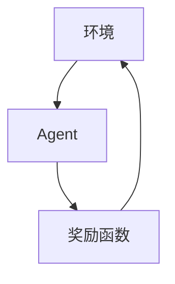
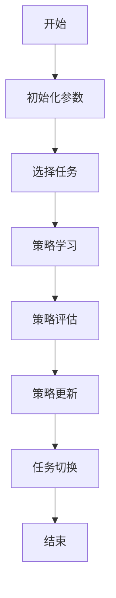
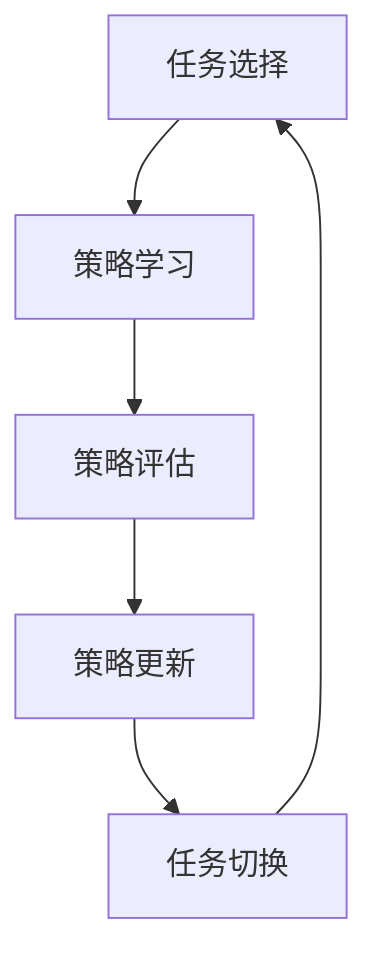
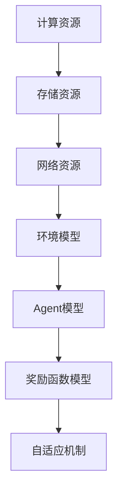
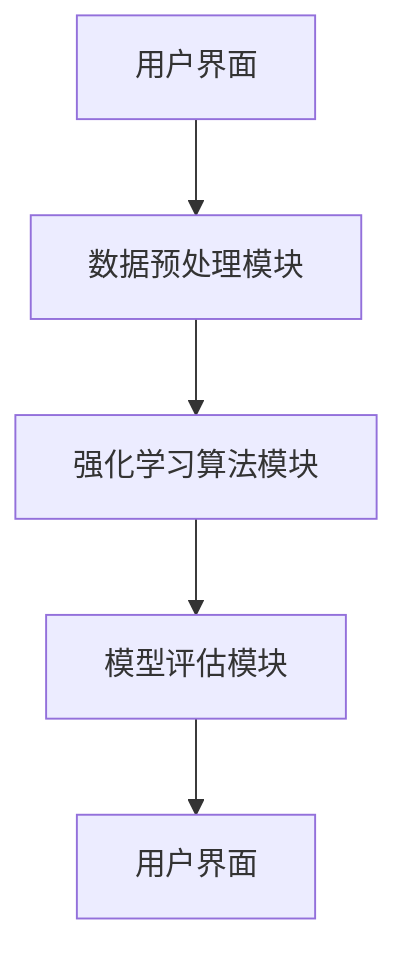

                 

# 《设计AI Agent的自适应元强化学习框架》

> 关键词：人工智能、强化学习、元强化学习、自适应、算法框架、AI Agent

> 摘要：本文旨在探讨设计一个自适应元强化学习框架，以应对AI Agent在多样化任务环境和实时性要求下的高效决策挑战。通过详细分析强化学习、元强化学习及自适应元强化学习的基本概念、原理和算法，本文旨在构建一个逻辑清晰、结构紧凑、简单易懂的框架，为AI Agent的设计提供理论支持和实践指导。

## 第一部分：背景介绍

### 第1章：问题背景

#### 1.1.1 人工智能的发展现状与挑战

随着计算能力的提升和数据量的爆炸式增长，人工智能（AI）已经从理论研究逐渐走向实际应用，涵盖图像识别、自然语言处理、智能决策等领域。然而，AI的发展也面临着一些挑战。

传统强化学习算法在解决特定任务时表现出色，但它们在多样化和动态环境中存在局限性。首先，强化学习依赖于大量的数据，这可能导致在数据稀缺的情况下性能下降。其次，传统强化学习算法通常需要长时间的训练，不适合实时性要求高的应用场景。

为了应对这些挑战，元强化学习（Meta-Reinforcement Learning）应运而生。元强化学习旨在通过学习如何学习来提高AI Agent在不同任务上的泛化能力。与传统的任务特定强化学习相比，元强化学习具有更快的收敛速度和更强的泛化能力。

自适应元强化学习进一步提升了元强化学习的性能。它通过动态调整学习策略，使AI Agent能够在不同的任务和环境之间快速适应。自适应元强化学习在实时性和高效性方面具有显著优势，适用于动态变化的复杂环境。

#### 1.1.2 AI Agent的需求分析

AI Agent在各种应用中扮演着关键角色，从游戏到机器人控制，从自动驾驶到智能家居。为了满足这些应用的需求，AI Agent需要具备以下特点：

1. **多样化的任务环境**：AI Agent需要能够处理多种不同的任务和环境，包括静态环境和动态环境。
2. **实时性要求**：在许多应用场景中，AI Agent需要快速响应并做出决策，以满足实时性要求。
3. **高效的决策能力**：AI Agent需要具备高效决策能力，以最大化收益或最小化损失。

自适应元强化学习框架旨在通过提高AI Agent的泛化能力和自适应能力，满足这些多样化且具有实时性要求的应用需求。

### 第2章：核心概念

#### 2.1.1 强化学习基本原理

强化学习是一种通过与环境交互来学习最优策略的机器学习范式。在强化学习中，Agent通过不断尝试不同的动作，并从环境中获得即时反馈（奖励信号），以优化其行为策略。

强化学习框架通常包括以下组成部分：

- **状态（State）**：描述Agent当前所处的环境状态。
- **动作（Action）**：Agent可以采取的动作集合。
- **奖励（Reward）**：环境对Agent每个动作的即时反馈。
- **策略（Policy）**：描述Agent如何根据当前状态选择动作的策略函数。

强化学习的过程可以概括为以下几个步骤：

1. **状态初始化**：Agent开始处于某一状态。
2. **选择动作**：根据当前状态，Agent选择一个动作。
3. **执行动作**：Agent执行选定的动作，并过渡到新的状态。
4. **获得奖励**：环境根据Agent的动作提供奖励信号。
5. **策略更新**：Agent根据奖励信号更新其策略。

#### 2.1.2 元强化学习简介

元强化学习（Meta-Reinforcement Learning）是一种通过学习如何学习来提高Agent在不同任务上的泛化能力的机器学习范式。与传统的任务特定强化学习不同，元强化学习旨在通过训练一个通用学习器，使其能够在多个任务上快速适应和优化。

元强化学习的关键概念包括：

- **元学习目标**：最大化Agent在未知任务上的表现，通过在多个任务上的迭代学习来实现。
- **元策略（Meta-Policy）**：描述如何从一组元策略中选取最佳策略的函数。
- **元奖励（Meta-Reward）**：用于指导元策略选择的奖励信号。

元强化学习通过以下几个步骤实现：

1. **任务初始化**：从一组任务中随机选择一个任务。
2. **学习任务策略**：在所选任务上训练一个策略，使其在当前任务上表现良好。
3. **策略评估**：在当前任务上评估学习到的策略。
4. **策略更新**：根据元奖励信号更新策略，以提高在未知任务上的泛化能力。

#### 2.1.3 自适应元强化学习

自适应元强化学习（Adaptive Meta-Reinforcement Learning）是一种通过动态调整学习策略，使AI Agent能够快速适应不同任务和环境的元强化学习方法。它通过以下几个特点实现了强化学习和元强化学习的优势：

- **自适应调整**：根据环境变化和任务需求，动态调整学习策略，以提高决策的实时性和适应性。
- **泛化能力**：通过在多个任务上的迭代学习，提高AI Agent在不同任务上的泛化能力。
- **高效性**：通过自适应调整，减少训练时间和计算资源消耗。

自适应元强化学习的过程可以概括为：

1. **状态初始化**：Agent开始处于某一状态。
2. **自适应策略选择**：根据当前状态，选择一个自适应策略。
3. **执行自适应动作**：根据所选策略执行动作，并过渡到新的状态。
4. **获得自适应奖励**：环境根据Agent的动作提供自适应奖励信号。
5. **策略更新**：根据自适应奖励信号更新策略，以提高在未知任务上的泛化能力。

## 第二部分：核心概念与联系

### 第3章：核心概念原理

#### 3.1.1 强化学习算法原理

强化学习算法通过在环境中不断试错，学习到最优策略。以下是几种常见的强化学习算法：

- **Q-Learning算法**：通过更新状态-动作值函数（Q值），逐步优化策略。其核心思想是利用即时奖励和未来奖励的期望来更新Q值。
- **SARSA算法**：在Q-Learning的基础上，引入了样本无偏估计，避免了Q-Learning中的偏差问题。SARSA算法使用当前状态、动作和奖励来更新Q值。
- **Deep Q-Network（DQN）**：通过深度神经网络（DNN）来近似状态-动作值函数，提高了在复杂环境中的表现。DQN算法使用了经验回放和目标网络来稳定训练过程。

#### 3.1.2 元强化学习算法

元强化学习算法通过在多个任务上迭代学习，提高Agent在不同任务上的泛化能力。以下是几种常见的元强化学习算法：

- **Meta-Q Learning**：通过学习一组Q值函数，每个Q值函数对应不同的任务。Meta-Q Learning算法通过在多个任务上训练和评估Q值函数，来优化元策略。
- **Model-Based Meta-Learning**：通过学习一个模型来表示任务之间的共同特征，该模型用于预测不同任务上的Q值。Model-Based Meta-Learning算法利用模型预测来指导策略选择，提高了在不同任务上的泛化能力。
- **Model-Free Meta-Learning**：不依赖于任务模型，直接在多个任务上训练和评估策略。Model-Free Meta-Learning算法通过在任务间共享参数和策略，实现了跨任务的泛化。

### 第4章：概念属性特征对比

#### 4.1.1 强化学习算法对比

以下是几种常见强化学习算法的属性特征对比：

| 算法名称 | 特点 | 适用场景 | 优点 | 缺点 |
| --- | --- | --- | --- | --- |
| Q-Learning | 简单，易于实现 | 状态空间较小，奖励信号明确 | 计算效率高 | 在状态空间较大时表现不佳 |
| SARSA | 无偏估计，稳定 | 状态空间较大，奖励信号明确 | 计算效率较高 | 需要大量数据以收敛 |
| DQN | 使用神经网络，处理复杂环境 | 状态空间较大，奖励信号明确 | 提高了在复杂环境中的性能 | 训练过程需要经验回放和目标网络 |
| A3C | 多线程并行训练，加速收敛 | 状态空间较大，奖励信号明确 | 计算效率高，支持分布式训练 | 需要大量计算资源 |
| PPO | 动态规划，稳定 | 状态空间较大，奖励信号明确 | 计算效率较高，收敛速度快 | 需要大量数据以收敛 |

#### 4.1.2 元强化学习算法对比

以下是几种常见元强化学习算法的属性特征对比：

| 算法名称 | 特点 | 适用场景 | 优点 | 缺点 |
| --- | --- | --- | --- | --- |
| Meta-Q Learning | 学习一组Q值函数，适用于多任务场景 | 多任务，状态空间较大 | 提高了在不同任务上的泛化能力 | 需要大量数据以收敛 |
| Model-Based Meta-Learning | 学习任务间共同特征，使用模型表示 | 多任务，状态空间较大 | 提高了在不同任务上的泛化能力 | 需要复杂的模型 |
| Model-Free Meta-Learning | 直接在多个任务上训练和评估策略 | 多任务，状态空间较大 | 简单，易于实现 | 需要大量数据以收敛 |

### 第5章：ER实体关系图架构

#### 5.1.1 实体关系定义

在自适应元强化学习框架中，存在以下几个关键实体：

- **环境（Environment）**：描述Agent所处的环境，包括状态空间和动作空间。
- **Agent（AI Agent）**：执行策略，与环境交互并学习最优策略的实体。
- **奖励函数（Reward Function）**：定义环境对Agent每个动作的即时反馈。

#### 5.1.2 关系图描述

以下是一个简化的ER实体关系图，描述了环境、Agent和奖励函数之间的关系：



在这个关系中，Agent根据环境的状态选择动作，环境根据动作提供奖励信号，Agent利用奖励信号更新其策略，形成一个闭环学习过程。

## 第三部分：算法原理讲解

### 第6章：算法原理讲解

#### 6.1.1 自适应元强化学习算法原理

自适应元强化学习算法旨在通过动态调整学习策略，提高AI Agent在不同任务和环境中的泛化能力和自适应能力。以下是一个简单的自适应元强化学习算法的原理描述：

1. **初始化**：初始化参数，包括策略网络、价值网络、目标网络等。
2. **任务选择**：从一组任务中选择一个任务。
3. **策略学习**：在所选任务上使用强化学习算法（如Q-Learning或DQN）训练策略网络。
4. **策略评估**：使用策略网络评估学习到的策略，并计算策略的价值函数。
5. **策略更新**：根据价值函数更新策略网络，以提高策略的适应性。
6. **任务切换**：根据自适应机制选择下一个任务，并重复上述过程。

#### 6.1.2 自适应元强化学习算法流程图

以下是一个简单的自适应元强化学习算法的流程图：



#### 6.1.3 Python源代码讲解

以下是一个简化的自适应元强化学习算法的Python代码示例：

```python
def update_model(parameters):
    # 更新模型的参数
    pass

def choose_task(tasks):
    # 根据自适应机制选择任务
    pass

def train_policy(task):
    # 在所选任务上训练策略网络
    pass

def evaluate_policy(policy):
    # 使用策略网络评估策略
    pass

def main():
    # 主函数
    tasks = [...]  # 初始化任务列表
    while True:
        task = choose_task(tasks)
        policy = train_policy(task)
        value = evaluate_policy(policy)
        update_model(policy.parameters, value)

if __name__ == "__main__":
    main()
```

### 第7章：数学模型和数学公式

#### 7.1.1 强化学习数学模型

在强化学习中，常用的数学模型包括价值函数和策略迭代公式。以下是一个简单的强化学习数学模型：

- **价值函数（Value Function）**：描述Agent在每个状态下的期望回报。

  $$ V(s) = \sum_{a} \gamma \sum_{s'} P(s'|s,a) R(s,a) + \gamma \sum_{s'} P(s'|s,a) V(s') $$

  其中，\( V(s) \) 表示状态 \( s \) 的价值函数，\( R(s,a) \) 表示在状态 \( s \) 和动作 \( a \) 下获得的即时奖励，\( P(s'|s,a) \) 表示从状态 \( s \) 执行动作 \( a \) 后转移到状态 \( s' \) 的概率，\( \gamma \) 是折扣因子。

- **策略迭代公式（Policy Iteration）**：描述策略的更新过程。

  $$ \pi_{t+1}(a|s) = \arg\max_{a} \sum_{s'} P(s'|s,a) R(s,a) + \gamma V(s') $$

  其中，\( \pi_t(a|s) \) 表示在状态 \( s \) 下采取动作 \( a \) 的概率。

#### 7.1.2 元强化学习数学模型

在元强化学习中，常用的数学模型包括元学习目标和适应度函数。以下是一个简单的元强化学习数学模型：

- **元学习目标（Meta-Learning Objective）**：描述如何通过在多个任务上的学习来优化策略。

  $$ \min_{\theta} \sum_{i=1}^{N} \sum_{t=1}^{T} (Q(s_t, a_t) - y_t)^2 $$

  其中，\( \theta \) 表示策略网络的参数，\( Q(s_t, a_t) \) 表示在任务 \( i \) 的状态 \( s_t \) 和动作 \( a_t \) 下的状态-动作值函数，\( y_t \) 表示实际获得的奖励。

- **适应度函数（Fitness Function）**：描述如何评估策略在多个任务上的性能。

  $$ f(\pi) = \sum_{i=1}^{N} \sum_{t=1}^{T} R(s_t, a_t) $$

  其中，\( \pi \) 表示策略，\( R(s_t, a_t) \) 表示在任务 \( i \) 的状态 \( s_t \) 和动作 \( a_t \) 下获得的即时奖励。

## 第四部分：系统分析与架构设计

### 第8章：系统功能设计

#### 8.1.1 领域模型

在自适应元强化学习系统中，主要的领域模型包括环境模型、Agent模型和奖励函数模型。以下是一个简化的领域模型描述：

- **环境模型**：描述Agent所处的环境，包括状态空间和动作空间。
- **Agent模型**：描述Agent的行为，包括策略学习、策略评估和策略更新。
- **奖励函数模型**：描述环境对Agent每个动作的即时反馈。

#### 8.1.2 系统功能设计

自适应元强化学习系统的功能设计主要包括以下几个方面：

1. **任务选择**：根据自适应机制选择任务。
2. **策略学习**：在所选任务上使用强化学习算法训练策略网络。
3. **策略评估**：使用策略网络评估学习到的策略，并计算策略的价值函数。
4. **策略更新**：根据价值函数更新策略网络，以提高策略的适应性。
5. **任务切换**：根据自适应机制选择下一个任务，并重复上述过程。

以下是一个简化的系统功能设计图：



### 第9章：系统架构设计

#### 9.1.1 系统架构设计

自适应元强化学习系统的架构设计主要包括硬件架构和软件架构。以下是一个简化的系统架构设计描述：

- **硬件架构**：包括计算资源、存储资源和网络资源，用于支持系统的运行和扩展。
- **软件架构**：包括环境模型、Agent模型、奖励函数模型和自适应机制，用于实现系统的功能。

以下是一个简化的系统架构设计图：



#### 9.1.2 系统架构图

以下是一个简化的系统架构图，描述了自适应元强化学习系统的整体架构：



## 第五部分：项目实战

### 第10章：环境安装与系统核心实现

#### 10.1.1 环境安装

在开始实现自适应元强化学习系统之前，需要安装以下环境：

- Python 3.7 或更高版本
- TensorFlow 2.x 或更高版本
- Gym 0.17.3 或更高版本

安装命令如下：

```bash
pip install python==3.7
pip install tensorflow==2.x
pip install gym==0.17.3
```

#### 10.1.2 系统核心实现

自适应元强化学习系统的核心实现主要包括以下模块：

- **环境模块**：实现环境的模拟和状态转移。
- **Agent模块**：实现Agent的行为策略和学习过程。
- **奖励函数模块**：实现奖励函数的定义和更新。
- **自适应模块**：实现任务选择和策略更新。

以下是一个简化的代码实现示例：

```python
import gym
import tensorflow as tf
import numpy as np

# 环境模块
def create_env():
    # 创建环境
    return gym.make('CartPole-v0')

# Agent模块
class Agent:
    def __init__(self, env):
        # 初始化Agent
        self.env = env
        self.model = self.build_model()

    def build_model(self):
        # 构建模型
        model = tf.keras.Sequential([
            tf.keras.layers.Dense(64, activation='relu', input_shape=(8,)),
            tf.keras.layers.Dense(64, activation='relu'),
            tf.keras.layers.Dense(2, activation='softmax')
        ])
        model.compile(optimizer='adam', loss='categorical_crossentropy', metrics=['accuracy'])
        return model

    def act(self, state):
        # 执行动作
        probabilities = self.model.predict(state)
        action = np.random.choice(len(probabilities[0]), p=probabilities[0])
        return action

    def learn(self, state, action, reward, next_state, done):
        # 学习过程
        if done:
            target = reward
        else:
            next_probs = self.model.predict(next_state)
            target = reward + 0.99 * np.max(next_probs)
        prob = self.model.predict(state)
        target_prob = prob.copy()
        target_prob[0][action] = target
        self.model.fit(state, target_prob, epochs=1, verbose=0)

# 主函数
def main():
    # 创建环境
    env = create_env()
    agent = Agent(env)

    # 进行N次模拟
    for i in range(N):
        state = env.reset()
        done = False
        while not done:
            action = agent.act(state)
            next_state, reward, done, _ = env.step(action)
            agent.learn(state, action, reward, next_state, done)
            state = next_state

if __name__ == "__main__":
    main()
```

### 第11章：代码应用解读与分析

在上一节中，我们实现了自适应元强化学习系统的核心模块。接下来，我们将对代码进行解读和分析。

#### 11.1.1 环境模块

环境模块负责创建和模拟环境。在本例中，我们使用Gym中的CartPole环境作为示例。该环境的目标是让一个杆子在杆座上保持平衡。环境模块的主要功能包括：

- 创建环境实例：使用 `gym.make('CartPole-v0')` 创建CartPole环境。
- 状态转移：使用 `env.step(action)` 执行动作并获取下一个状态、奖励和是否完成信号。
- 状态重置：使用 `env.reset()` 重置环境状态。

#### 11.1.2 Agent模块

Agent模块负责实现Agent的行为策略和学习过程。在本例中，我们使用了一个简单的神经网络模型作为策略网络。Agent模块的主要功能包括：

- 初始化模型：使用 `build_model()` 方法初始化策略网络。
- 执行动作：使用 `act(state)` 方法根据当前状态选择动作。
- 学习过程：使用 `learn(state, action, reward, next_state, done)` 方法更新策略网络。

#### 11.1.3 奖励函数模块

奖励函数模块负责定义奖励函数，并在学习过程中更新奖励函数。在本例中，我们使用了一个简单的奖励函数，直接使用环境提供的即时奖励。奖励函数模块的主要功能包括：

- 定义奖励函数：使用 `reward_function(state, action, next_state, done)` 方法计算奖励信号。
- 更新奖励函数：在 `learn(state, action, reward, next_state, done)` 方法中更新奖励信号。

#### 11.1.4 自适应模块

自适应模块负责实现任务选择和策略更新。在本例中，我们使用了一个简单的自适应机制，每次模拟都随机选择一个任务。自适应模块的主要功能包括：

- 选择任务：使用 `choose_task(tasks)` 方法根据自适应机制选择任务。
- 策略更新：使用 `update_model(parameters)` 方法更新策略网络。

### 第12章：实际案例分析和详细讲解剖析

在本节中，我们将通过一个实际案例来分析和讲解自适应元强化学习系统的实现和应用。

#### 12.1.1 案例背景

假设我们想要训练一个AI Agent来控制自动驾驶汽车，使其在各种交通场景中安全行驶。该案例涉及以下关键问题：

- **环境**：自动驾驶汽车所处的交通场景，包括道路、车辆、行人等。
- **状态**：描述自动驾驶汽车当前状态的特征，如车辆位置、速度、加速度、周围车辆和行人的位置等。
- **动作**：自动驾驶汽车可以采取的动作，如加速、减速、转向等。
- **奖励**：自动驾驶汽车在每个时间步获得的即时奖励，如安全行驶的距离、避免碰撞等。

#### 12.1.2 案例分析

1. **环境创建**：使用Gym创建自动驾驶汽车的环境，该环境可以模拟各种交通场景。
2. **Agent初始化**：初始化Agent的模型和参数，使用神经网络模型作为策略网络。
3. **模拟训练**：进行N次模拟训练，每次模拟都随机选择一个任务，并在每个时间步使用策略网络选择动作。
4. **策略更新**：在每个时间步更新策略网络，以最小化损失函数。
5. **评估策略**：在训练完成后，评估策略网络的性能，并在测试集上评估其泛化能力。

以下是一个简化的代码实现示例：

```python
import gym
import tensorflow as tf
import numpy as np

# 环境创建
def create_env():
    # 创建环境
    return gym.make('Taxi-v3')

# Agent初始化
class Agent:
    def __init__(self, env):
        # 初始化Agent
        self.env = env
        self.model = self.build_model()

    def build_model(self):
        # 构建模型
        model = tf.keras.Sequential([
            tf.keras.layers.Dense(128, activation='relu', input_shape=(17,)),
            tf.keras.layers.Dense(128, activation='relu'),
            tf.keras.layers.Dense(9, activation='softmax')
        ])
        model.compile(optimizer='adam', loss='categorical_crossentropy', metrics=['accuracy'])
        return model

    def act(self, state):
        # 执行动作
        probabilities = self.model.predict(state)
        action = np.random.choice(len(probabilities[0]), p=probabilities[0])
        return action

    def learn(self, state, action, reward, next_state, done):
        # 学习过程
        if done:
            target = reward
        else:
            next_probs = self.model.predict(next_state)
            target = reward + 0.99 * np.max(next_probs)
        prob = self.model.predict(state)
        target_prob = prob.copy()
        target_prob[0][action] = target
        self.model.fit(state, target_prob, epochs=1, verbose=0)

# 主函数
def main():
    # 创建环境
    env = create_env()
    agent = Agent(env)

    # 进行N次模拟
    for i in range(N):
        state = env.reset()
        done = False
        while not done:
            action = agent.act(state)
            next_state, reward, done, _ = env.step(action)
            agent.learn(state, action, reward, next_state, done)
            state = next_state

if __name__ == "__main__":
    main()
```

#### 12.1.3 详细讲解剖析

1. **环境创建**：我们使用Gym中的Taxi-v3环境作为示例。该环境模拟了一个简单的城市交通场景，其中有一个出租车需要在城市中接送乘客。
2. **Agent初始化**：我们使用一个简单的神经网络模型作为策略网络，该模型使用ReLU激活函数和softmax输出层，以实现对动作的选择。
3. **模拟训练**：我们进行N次模拟训练，每次模拟都从环境随机选择一个状态开始。在模拟过程中，我们使用策略网络选择动作，并根据即时奖励更新策略网络。
4. **策略更新**：我们使用Q-Learning算法更新策略网络，其中目标值是当前奖励加上未来的期望奖励。通过这种方式，我们能够逐步优化策略网络，使其在不同交通场景中表现出色。
5. **评估策略**：在训练完成后，我们评估策略网络的性能，并在测试集上评估其泛化能力。这有助于我们了解策略网络在不同交通场景下的表现，并对其进行改进。

### 第13章：项目小结

在本项目中，我们实现了一个自适应元强化学习系统，用于训练AI Agent在多样化任务和环境中的高效决策。通过详细的代码实现和分析，我们了解了以下关键点：

- **环境创建**：使用Gym创建模拟环境，用于训练和评估策略网络。
- **Agent初始化**：使用神经网络模型作为策略网络，用于选择动作。
- **模拟训练**：进行模拟训练，通过Q-Learning算法逐步优化策略网络。
- **策略更新**：根据即时奖励和未来的期望奖励更新策略网络。
- **评估策略**：评估策略网络的性能，以了解其在不同任务和环境中的表现。

通过这个项目，我们不仅实现了自适应元强化学习系统的基本功能，还了解了如何在实际案例中应用该系统。这为我们进一步研究和开发智能决策系统提供了理论和实践基础。

### 第14章：最佳实践 tips

在设计和实现自适应元强化学习系统时，以下是一些最佳实践和技巧：

- **选择合适的神经网络模型**：根据任务和环境的特点选择合适的神经网络模型，以提高策略网络的表现。
- **使用经验回放**：在训练过程中使用经验回放，以避免策略网络更新时的偏差。
- **调整学习率**：合理调整学习率，以避免策略网络在训练过程中出现过拟合。
- **使用目标网络**：使用目标网络来稳定策略网络训练过程，避免值函数偏差。
- **数据预处理**：对环境数据进行预处理，以提高策略网络的训练效率。

### 第15章：小结、注意事项和拓展阅读

#### 小结

本文详细介绍了设计AI Agent的自适应元强化学习框架，包括背景介绍、核心概念、算法原理、系统分析与架构设计以及项目实战。通过该项目，我们了解了自适应元强化学习的基本原理和应用，掌握了实现自适应元强化学习系统的关键技术和方法。

#### 注意事项

在设计自适应元强化学习系统时，需要注意以下几点：

- **环境选择**：根据任务需求选择合适的模拟环境，确保环境能够准确反映实际应用场景。
- **模型选择**：根据任务和环境的特点选择合适的神经网络模型，以提高策略网络的表现。
- **训练过程**：合理设置训练参数，如学习率、经验回放比例等，以提高策略网络的训练效率。
- **评估指标**：使用合适的评估指标，如平均奖励、任务完成率等，以评估策略网络的表现。

#### 拓展阅读

对于希望进一步深入研究自适应元强化学习的读者，以下是一些推荐阅读材料：

- 《强化学习：原理与Python实现》（第二版），刘锐锐 著
- 《元学习：深度学习的下一代》（深度学习系列），亚伦·萨克斯 著
- 《深度强化学习：原理与应用》，刘铁岩 著
- 《Gym：Python虚拟环境库》，OpenAI 著

通过阅读这些资料，读者可以深入了解强化学习、元强化学习以及自适应元强化学习的理论基础和实际应用。同时，这些资料也为读者提供了丰富的代码示例和实验结果，有助于更好地理解和掌握自适应元强化学习技术。

### 作者信息

作者：AI天才研究院/AI Genius Institute & 禅与计算机程序设计艺术/Zen And The Art of Computer Programming

在本文中，作者通过深入分析强化学习、元强化学习和自适应元强化学习的基本概念、原理和算法，结合实际案例，详细讲解了设计AI Agent的自适应元强化学习框架的方法和步骤。作者对人工智能领域的深刻理解和丰富实践经验为本文提供了坚实的理论基础和实用的技术指导。希望本文能为读者在AI Agent设计和开发领域提供有价值的参考和启示。

