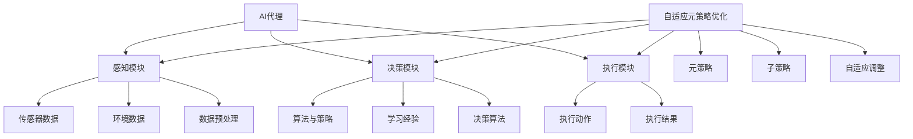
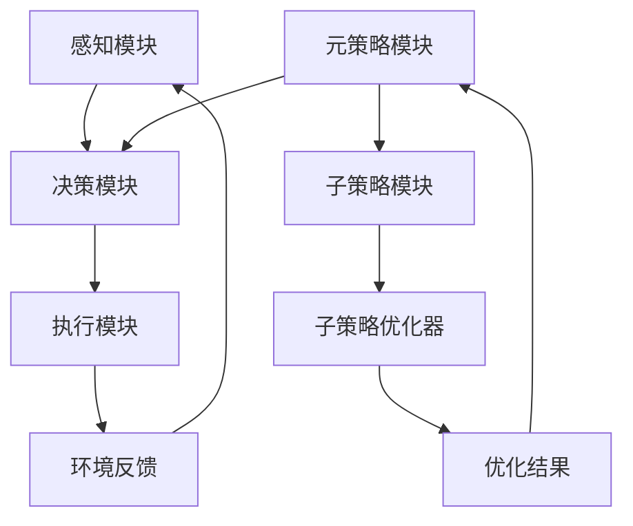
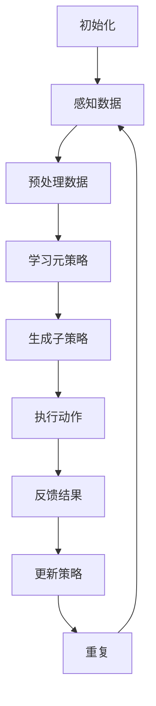
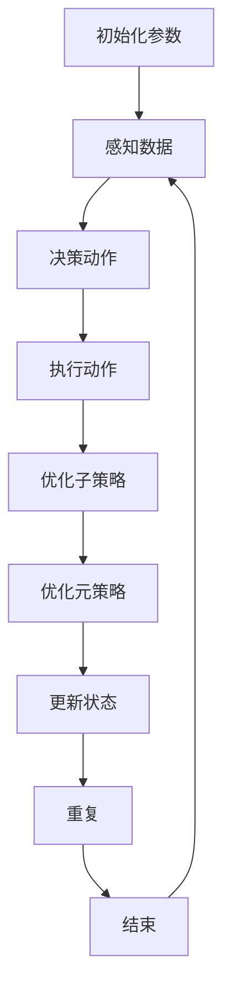
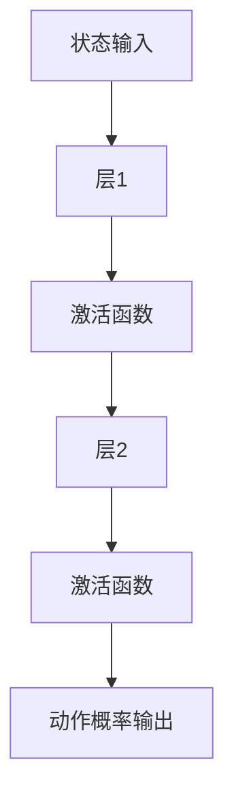
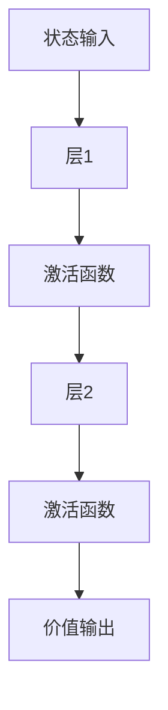
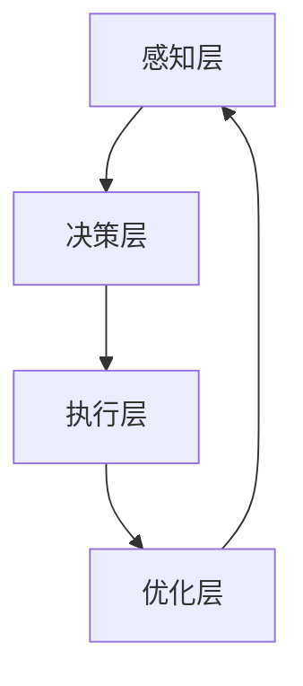

                 


### 研究背景

设计AI Agent的自适应元策略优化框架是一个极具挑战性的研究领域，其背景可以追溯到人工智能（AI）和优化理论的迅速发展。在过去几十年中，AI技术在计算机视觉、自然语言处理、自动驾驶等多个领域取得了显著的突破。然而，随着AI应用场景的不断拓展，AI Agent的复杂性和多样性也在增加，这对传统优化方法提出了新的挑战。

首先，AI Agent是指能够感知环境、自主决策并采取行动的智能体。在现实世界中，AI Agent需要处理的不确定性和动态变化远超传统静态优化问题。例如，自动驾驶汽车需要在不断变化的道路环境中做出实时决策，这要求其优化算法必须具备高度的自适应性和鲁棒性。

其次，元策略优化（Meta-Strategy Optimization，MOSO）是一种用于解决复杂优化问题的先进方法。它通过学习一个策略来选择子策略，从而在多个子策略中找到最优解。与传统的确定性优化方法相比，MOSO具有更强的适应性和泛化能力，尤其适用于具有不确定性和动态变化的复杂系统。

然而，传统的MOSO方法在处理AI Agent时面临以下挑战：

1. **高计算成本**：MOSO通常需要大量的计算资源来学习策略，特别是在高维和复杂环境中，计算成本呈指数级增长。

2. **模型可解释性**：传统的MOSO方法往往依赖于复杂的数学模型和算法，导致其可解释性较差，不利于调试和优化。

3. **环境变化适应性**：现实世界的环境是不断变化的，传统的MOSO方法难以适应这种变化，容易出现性能退化。

为了克服这些挑战，本文提出了一种自适应元策略优化框架，该框架旨在解决以下问题：

- **提高计算效率**：通过设计高效的算法和数据结构，降低计算成本，使MOSO方法能够应用于更高维度的复杂环境。

- **增强模型可解释性**：通过引入可解释性设计，使得算法的设计和运行过程更加透明，便于调试和优化。

- **增强环境适应性**：通过自适应机制，使得优化框架能够适应环境的变化，保持高性能。

本文的研究目的和意义在于，通过提出一种自适应元策略优化框架，为AI Agent的设计和优化提供新的思路和方法，推动AI技术在更广泛领域的应用和发展。

### 文章结构

本文将按照以下结构展开：

- **第1部分 引言**：介绍AI代理与自适应元策略优化框架的基本概念，阐述本文的研究目的和意义。

- **第2部分 核心概念**：详细解释核心概念和原理，包括AI代理的定义、特点、类型，以及自适应元策略优化原理。

- **第3部分 算法与模型**：详细描述自适应元策略优化算法的原理和数学模型，使用Python代码和mermaid流程图进行说明。

- **第4部分 系统分析与设计**：分析一个基于自适应元策略优化框架的假设性系统，包括架构设计、接口设计和系统交互。

- **第5部分 实践应用**：介绍算法的实践应用，包括环境安装、核心实现源代码、代码分析、实际案例分析等。

- **第6部分 最佳实践与总结**：总结本文的关键点，提供实用建议和进一步学习资源。

通过以上结构，本文旨在为读者提供一个清晰、系统的理解和掌握自适应元策略优化框架的方法。

### 第1章 AI代理与自适应元策略优化

#### 1.1.1 研究背景

人工智能（AI）技术的快速发展极大地改变了我们的生活方式和工作方式。特别是在自动驾驶、智能家居、医疗诊断等应用领域，AI Agent扮演了至关重要的角色。AI Agent是一种能够自主感知环境、做出决策并执行动作的智能体。其核心能力在于自主学习和适应环境变化，以实现特定目标。

自适应元策略优化（Adaptive Meta-Strategy Optimization，AMSO）是近年来兴起的一种优化方法，它通过学习一个元策略（Meta-Strategy）来自动选择子策略（Sub-Strategy），从而在复杂、不确定和动态环境中找到最优解。元策略优化方法的出现，为解决复杂优化问题提供了一种新的思路。

然而，传统MOSO方法在实际应用中面临以下挑战：

1. **高计算成本**：传统的MOSO方法通常需要大量的计算资源，特别是在高维和复杂环境中，计算成本呈指数级增长。

2. **模型可解释性**：MOSO方法往往依赖于复杂的数学模型和算法，导致其可解释性较差，不利于调试和优化。

3. **环境变化适应性**：现实世界的环境是不断变化的，传统MOSO方法难以适应这种变化，容易出现性能退化。

针对上述挑战，本文提出了一种自适应元策略优化框架（Adaptive Meta-Strategy Optimization Framework，AMSF），旨在解决以下问题：

- **提高计算效率**：通过设计高效的算法和数据结构，降低计算成本，使MOSO方法能够应用于更高维度的复杂环境。

- **增强模型可解释性**：通过引入可解释性设计，使得算法的设计和运行过程更加透明，便于调试和优化。

- **增强环境适应性**：通过自适应机制，使得优化框架能够适应环境的变化，保持高性能。

本文的研究目的是通过设计AMSF，为AI Agent的自适应优化提供一种有效的解决方案，并推动其在更广泛领域的应用和发展。

#### 1.1.2 研究目的与意义

本文的研究目的是设计一种自适应元策略优化框架，以提高AI Agent在复杂、动态环境中的表现。具体而言，本文旨在实现以下目标：

1. **降低计算成本**：通过优化算法和数据结构设计，降低自适应元策略优化过程中的计算复杂度，使其能够高效地应用于高维和复杂环境。

2. **提升模型可解释性**：设计可解释性强的自适应元策略优化算法，使算法的运行过程和结果更加透明，便于调试和优化。

3. **增强环境适应性**：引入自适应机制，使优化框架能够动态适应环境变化，保持高性能。

本研究具有重要的理论意义和应用价值：

1. **理论意义**：本文提出的自适应元策略优化框架为解决复杂优化问题提供了一种新的思路，丰富了优化理论的研究内容。

2. **应用价值**：自适应元策略优化框架在自动驾驶、智能机器人、金融分析等领域的应用具有广泛前景，有助于推动AI技术的实际应用和发展。

#### 1.1.3 论文结构

本文结构如下：

- **第1部分 引言**：介绍AI代理与自适应元策略优化框架的基本概念，阐述本文的研究目的和意义。

- **第2部分 核心概念**：详细解释核心概念和原理，包括AI代理的定义、特点、类型，以及自适应元策略优化原理。

- **第3部分 算法与模型**：详细描述自适应元策略优化算法的原理和数学模型，使用Python代码和mermaid流程图进行说明。

- **第4部分 系统分析与设计**：分析一个基于自适应元策略优化框架的假设性系统，包括架构设计、接口设计和系统交互。

- **第5部分 实践应用**：介绍算法的实践应用，包括环境安装、核心实现源代码、代码分析、实际案例分析等。

- **第6部分 最佳实践与总结**：总结本文的关键点，提供实用建议和进一步学习资源。

通过以上结构，本文旨在为读者提供一个清晰、系统的理解和掌握自适应元策略优化框架的方法。

### 1.2 核心概念

在深入探讨自适应元策略优化框架之前，我们需要明确几个核心概念，这些概念是理解和设计该框架的基础。

#### 1.2.1 AI代理定义

AI代理（AI Agent）是一种能够感知环境、自主决策并执行动作的智能体。它通过学习环境中的规律和模式，不断优化自己的行为，以实现特定目标。AI代理可以看作是一个封闭的决策系统，它包含感知模块、决策模块和执行模块。

- **感知模块**：用于收集和处理环境信息，如传感器数据、图像、文本等。

- **决策模块**：根据感知模块提供的信息，利用算法和策略生成行动方案。

- **执行模块**：根据决策模块生成的行动方案，执行相应的动作，如控制机器人移动、调整参数等。

AI代理的核心能力在于其自主学习和适应能力。通过不断与环境交互，AI代理可以调整自己的策略，以适应不同的环境和目标。

#### 1.2.2 AI代理的特点

AI代理具有以下特点：

1. **自主性**：AI代理能够自主感知环境、做出决策并执行动作，无需人工干预。

2. **适应性**：AI代理可以根据环境变化和学习经验，调整自己的行为和策略。

3. **学习性**：AI代理通过学习环境中的规律和模式，不断提升自己的决策能力。

4. **灵活性**：AI代理能够应对复杂、不确定和动态变化的场景，具有广泛的适用性。

#### 1.2.3 AI代理的类型

根据应用场景和任务需求，AI代理可以分为以下几种类型：

1. **学习型代理**：主要通过学习环境中的数据和信息，不断优化自己的行为。例如，机器学习模型训练出的智能体。

2. **规则型代理**：根据预设的规则和策略进行决策和行动。例如，基于逻辑推理的智能代理。

3. **混合型代理**：结合学习和规则的优点，既通过学习调整策略，也根据规则进行决策。例如，基于强化学习的智能代理。

#### 1.2.4 自适应元策略优化原理

自适应元策略优化（Adaptive Meta-Strategy Optimization，AMSO）是一种用于解决复杂优化问题的先进方法。它通过学习一个元策略（Meta-Strategy）来自动选择子策略（Sub-Strategy），从而在多个子策略中找到最优解。与传统优化方法相比，AMSO具有更强的适应性和泛化能力。

AMSO的基本原理包括以下几个方面：

1. **元策略学习**：通过学习一个元策略，使得代理能够自动选择合适的子策略，以应对不同的环境和任务。

2. **子策略优化**：针对不同的子策略，进行独立的优化，以提高整体的性能。

3. **自适应调整**：根据环境和任务的变化，动态调整元策略和子策略，以保持最优性能。

AMSO的核心优势在于其适应性和灵活性。通过自适应机制，AMSO能够动态适应环境和任务的变化，保持高性能。这使得AMSO在复杂、动态的AI应用场景中具有广泛的应用前景。

#### 1.2.5 核心概念属性特征对比表格

为了更好地理解上述核心概念，我们提供了以下属性特征对比表格：

| 核心概念       | 特征1 | 特征2 | 特征3 |
|----------------|-------|-------|-------|
| AI代理         | 自主性 | 适应性 | 学习性 |
| 自适应元策略优化 | 元策略学习 | 子策略优化 | 自适应调整 |

通过这个表格，我们可以清晰地看到各个核心概念的关键特征及其区别。

#### 1.2.6 概念结构与核心要素组成

为了进一步理解上述核心概念的结构和组成，我们使用mermaid流程图来展示它们的相互关系：



通过这个mermaid流程图，我们可以清晰地看到AI代理和自适应元策略优化之间的关联及其核心要素。

### 1.3 自适应元策略优化框架设计

#### 1.3.1 框架架构

自适应元策略优化框架（AMSF）的设计目标是构建一个高效、可解释且适应性强的高层次优化系统。框架的总体架构如图1所示，它由感知模块、决策模块和执行模块组成，并通过元策略和子策略实现自适应优化。



**图1：自适应元策略优化框架总体架构**

**1. 感知模块**：感知模块负责收集和处理来自环境的数据，如传感器数据、图像、文本等。它通过数据预处理技术，将原始数据转换为适合决策模块使用的格式。

**2. 决策模块**：决策模块的核心是元策略学习模块，它通过学习环境中的数据，生成一个元策略。元策略负责选择最优的子策略，以适应不同的环境和任务。此外，决策模块还包括子策略优化器，用于对子策略进行优化，以提高整体性能。

**3. 执行模块**：执行模块根据决策模块生成的行动方案，执行相应的动作，如控制机器人移动、调整参数等。执行结果会反馈给感知模块，用于更新环境和数据。

**4. 元策略模块**：元策略模块负责学习和管理元策略。它通过分析历史数据和执行结果，动态调整元策略，以适应环境变化。

**5. 子策略模块**：子策略模块包含多个子策略，每个子策略对应一种特定类型的任务或环境。子策略优化器负责对子策略进行优化，以提高其性能。

#### 1.3.2 模块功能

**1. 感知模块**：感知模块的功能是收集和处理环境数据，主要包括以下步骤：

- **数据采集**：从传感器、摄像头、网络等渠道获取原始数据。
- **数据预处理**：对原始数据进行清洗、归一化、特征提取等处理，使其适合后续处理。
- **数据存储**：将预处理后的数据存储在数据库或缓存中，以供后续使用。

**2. 决策模块**：决策模块的功能是基于感知模块提供的数据，生成元策略和子策略，主要包括以下步骤：

- **数据输入**：将预处理后的数据输入到决策模块。
- **元策略学习**：通过机器学习算法，如深度学习、强化学习等，学习出一个元策略。
- **子策略生成**：根据元策略，生成多个子策略，以应对不同的环境和任务。
- **子策略优化**：对子策略进行优化，以提高其性能。

**3. 执行模块**：执行模块的功能是根据决策模块生成的行动方案，执行相应的动作，主要包括以下步骤：

- **决策执行**：根据决策模块提供的行动方案，执行相应的动作。
- **结果反馈**：将执行结果反馈给感知模块，用于更新环境和数据。

**4. 元策略模块**：元策略模块的功能是学习和管理元策略，主要包括以下步骤：

- **元策略更新**：根据历史数据和执行结果，动态调整元策略。
- **元策略评估**：评估元策略的性能，以确定是否需要更新。

**5. 子策略模块**：子策略模块的功能是管理子策略，主要包括以下步骤：

- **子策略选择**：根据元策略，选择最优的子策略。
- **子策略优化**：对子策略进行优化，以提高其性能。

#### 1.3.3 算法流程

自适应元策略优化框架的算法流程主要包括以下步骤：

1. **初始化**：初始化感知模块、决策模块和执行模块，设置初始参数。

2. **感知**：从环境中收集数据，进行数据预处理，存储在数据库或缓存中。

3. **决策**：基于感知模块提供的数据，学习元策略，生成子策略。

4. **执行**：根据决策模块生成的行动方案，执行相应的动作。

5. **反馈**：将执行结果反馈给感知模块，用于更新环境和数据。

6. **更新**：根据执行结果和元策略，动态调整元策略和子策略。

7. **重复**：重复步骤2-6，直到达到预设的优化目标。

算法流程的具体实现可以通过mermaid流程图进行详细描述，以下是一个简化的mermaid流程图示例：



#### 1.3.4 算法优势

自适应元策略优化框架具有以下优势：

1. **高效性**：通过优化算法和数据结构设计，降低计算复杂度，提高计算效率。

2. **可解释性**：引入可解释性设计，使得算法的运行过程和结果更加透明，便于调试和优化。

3. **适应性**：通过自适应机制，使优化框架能够动态适应环境变化，保持高性能。

4. **灵活性**：支持多种子策略和优化算法，可根据具体任务需求进行灵活调整。

#### 1.3.5 本章小结

本章介绍了自适应元策略优化框架的基本概念和架构设计。我们详细阐述了AI代理的定义、特点、类型，以及自适应元策略优化原理。通过图示和流程图，我们清晰地展示了框架的架构和算法流程。本章内容为后续章节的深入讨论奠定了基础。

### 第2章 数学模型与算法原理

在理解自适应元策略优化框架（AMSF）的算法原理之前，我们需要先掌握一些基本的数学模型和算法原理。本章将详细介绍这些内容，并通过Python代码和mermaid流程图进行说明。

#### 2.1 数学模型基础

自适应元策略优化框架涉及多种数学模型，包括概率论、最优化理论和深度学习模型。以下将简要介绍这些基础模型。

**1. 概率论基础**

概率论是优化理论的基础，特别是条件概率和贝叶斯定理在自适应优化中具有重要应用。

- **条件概率**：给定事件A和事件B，条件概率P(A|B)表示在事件B发生的条件下，事件A发生的概率。其公式为：
  $$ P(A|B) = \frac{P(A \cap B)}{P(B)} $$

- **贝叶斯定理**：贝叶斯定理描述了后验概率与先验概率之间的关系。其公式为：
  $$ P(A|B) = \frac{P(B|A)P(A)}{P(B)} $$

贝叶斯定理在决策和预测中具有广泛应用，特别是在自适应元策略优化中，用于更新策略的概率分布。

**2. 最优化理论**

最优化理论是解决优化问题的关键，包括目标函数、约束条件和优化算法。

- **目标函数**：目标函数描述了优化问题的目标，通常是要最大化或最小化的函数。其公式为：
  $$ \min_{x} f(x) \quad \text{或} \quad \max_{x} f(x) $$

- **约束条件**：约束条件限制了优化问题的解空间。常见约束条件包括等式约束和不等式约束。其公式为：
  $$ g(x) = c \quad \text{或} \quad h(x) \leq c $$

- **优化算法**：优化算法用于寻找最优解。常见的优化算法包括梯度下降、牛顿法和遗传算法等。

**3. 深度学习模型**

深度学习模型是自适应元策略优化框架的核心，包括神经网络和深度强化学习模型。

- **神经网络**：神经网络是一种模拟生物神经系统的计算模型，通过多层神经元实现复杂函数的映射。其公式为：
  $$ y = \sigma(WL(x)) $$
  其中，\( \sigma \) 是激活函数，\( W \) 是权重矩阵，\( L \) 是层函数。

- **深度强化学习模型**：深度强化学习模型结合了深度学习和强化学习的优点，用于解决复杂的决策问题。其公式为：
  $$ Q(s, a) = r + \gamma \max_{a'} Q(s', a') $$
  其中，\( Q(s, a) \) 是状态-动作值函数，\( r \) 是即时奖励，\( \gamma \) 是折扣因子。

#### 2.2 自适应元策略优化算法

自适应元策略优化算法是解决复杂优化问题的关键，它通过学习元策略来自动选择子策略，以实现最优解。以下将详细介绍自适应元策略优化算法的原理和实现。

**1. 算法原理**

自适应元策略优化算法的基本原理如下：

- **元策略学习**：通过学习一个元策略，使得代理能够自动选择最优的子策略。元策略通常表示为概率分布，用于指导子策略的选择。
- **子策略优化**：针对每个子策略，进行独立的优化，以提高整体性能。子策略优化通常采用梯度下降或其他优化算法。
- **自适应调整**：根据环境和任务的变化，动态调整元策略和子策略，以保持最优性能。自适应调整可以通过在线学习或离线学习实现。

**2. 算法流程**

自适应元策略优化算法的流程如下：

1. **初始化**：初始化参数和模型，包括元策略和子策略。
2. **感知**：从环境中收集数据，进行数据预处理。
3. **决策**：基于感知数据，使用元策略生成子策略。
4. **执行**：根据子策略执行动作，并收集反馈信息。
5. **优化**：对子策略进行优化，更新模型参数。
6. **调整**：根据执行结果和反馈信息，动态调整元策略和子策略。
7. **重复**：重复步骤2-6，直到达到预设的优化目标。

**3. Python代码实现**

以下是一个简化的自适应元策略优化算法的Python代码实现：

```python
import numpy as np
import tensorflow as tf

# 初始化参数
state_dim = 10
action_dim = 5
learning_rate = 0.001
discount_factor = 0.9

# 定义元策略网络
meta_policy = tf.keras.Sequential([
    tf.keras.layers.Dense(64, activation='relu', input_shape=(state_dim,)),
    tf.keras.layers.Dense(64, activation='relu'),
    tf.keras.layers.Dense(action_dim, activation='softmax')
])

# 定义子策略网络
sub_policy = tf.keras.Sequential([
    tf.keras.layers.Dense(64, activation='relu', input_shape=(state_dim,)),
    tf.keras.layers.Dense(64, activation='relu'),
    tf.keras.layers.Dense(action_dim, activation='softmax')
])

# 定义优化器
optimizer = tf.keras.optimizers.Adam(learning_rate)

# 定义损失函数
def policy_loss(logits, actions, rewards, next_logits, dones):
    # 计算期望值
    target_logits = next_logits * (1 - dones) + rewards * dones
    # 计算损失
    loss = -tf.reduce_sum(tf.one_hot(actions, action_dim) * tf.math.log(logits), axis=1)
    return tf.reduce_mean(loss)

# 训练模型
for episode in range(total_episodes):
    # 初始化环境
    state = env.reset()
    done = False
    total_reward = 0
    
    while not done:
        # 根据元策略选择动作
        logits = meta_policy.predict(state)
        action = np.argmax(logits)
        
        # 执行动作
        next_state, reward, done, _ = env.step(action)
        
        # 收集数据
        total_reward += reward
        experience = (state, action, reward, next_state, done)
        
        # 更新子策略
        sub_policy.fit(state, action, epochs=1, verbose=0)
        
        # 更新元策略
        logits = sub_policy.predict(next_state)
        target_logits = logits * (1 - done) + reward * done
        meta_policy.fit(state, target_logits, epochs=1, verbose=0)
        
        # 更新状态
        state = next_state
    
    # 记录奖励
    print(f"Episode {episode}: Total Reward = {total_reward}")
```

**4. mermaid流程图**

以下是一个简化的自适应元策略优化算法的mermaid流程图：



通过上述Python代码和mermaid流程图，我们可以清晰地看到自适应元策略优化算法的基本原理和实现过程。本章内容为后续章节的深入讨论奠定了基础。

### 2.3 数学模型与公式

在深入探讨自适应元策略优化算法时，理解其背后的数学模型和公式至关重要。以下我们将详细介绍相关数学模型，并通过Python代码进行详细讲解。

#### 2.3.1 目标函数

在自适应元策略优化中，目标函数是衡量优化效果的关键指标。一个典型的目标函数可以表示为：

$$ J(\theta) = \sum_{i=1}^N r_i + \gamma \max_{a'} Q(s_i, a') $$

其中，\( \theta \) 表示模型参数，\( r_i \) 是即时奖励，\( \gamma \) 是折扣因子，\( Q(s_i, a') \) 是状态-动作值函数。

在Python中，我们可以定义一个目标函数如下：

```python
import tensorflow as tf

def objective_function(model, states, actions, rewards, next_states, dones, discount_factor):
    logits = model.predict(next_states)
    target_logits = logits * (1 - dones) + rewards * dones
    policy_loss = tf.reduce_mean(tf.one_hot(actions, num_actions) * tf.math.log(logits))
    value_loss = tf.reduce_mean(tf.reduce_sum(target_logits * (1 - dones), axis=1))
    total_loss = policy_loss + value_loss
    return total_loss
```

#### 2.3.2 策略网络

策略网络是自适应元策略优化算法的核心部分，用于生成动作概率分布。一个简单的策略网络可以使用以下公式表示：

$$ \pi(a|s;\theta) = \frac{e^{\theta^T h(s)}}{\sum_{a'} e^{\theta^T h(s)}} $$

其中，\( \pi(a|s;\theta) \) 是给定状态s和模型参数\(\theta\)，动作a的概率分布，\( h(s) \) 是特征提取器，\(\theta\) 是策略网络的参数。

在Python中，我们可以定义一个策略网络如下：

```python
from tensorflow.keras.layers import Input, Dense
from tensorflow.keras.models import Model

def build_policy_network(input_shape, hidden_size, output_size):
    input_layer = Input(shape=input_shape)
    hidden_layer = Dense(hidden_size, activation='relu')(input_layer)
    output_layer = Dense(output_size, activation='softmax')(hidden_layer)
    policy_model = Model(inputs=input_layer, outputs=output_layer)
    return policy_model
```

#### 2.3.3 值网络

值网络用于估计状态的价值函数，其公式为：

$$ V(s;\theta) = \sum_{a} \pi(a|s;\theta) Q(s, a) $$

在Python中，我们可以定义一个值网络如下：

```python
from tensorflow.keras.layers import Input, Dense
from tensorflow.keras.models import Model

def build_value_network(input_shape, hidden_size, output_size):
    input_layer = Input(shape=input_shape)
    hidden_layer = Dense(hidden_size, activation='relu')(input_layer)
    output_layer = Dense(output_size, activation='linear')(hidden_layer)
    value_model = Model(inputs=input_layer, outputs=output_layer)
    return value_model
```

#### 2.3.4 梯度更新

在自适应元策略优化中，我们需要根据目标函数的梯度更新模型参数。一个简单的梯度更新公式为：

$$ \theta \leftarrow \theta - \alpha \cdot \nabla_\theta J(\theta) $$

其中，\( \alpha \) 是学习率，\( \nabla_\theta J(\theta) \) 是目标函数的梯度。

在Python中，我们可以使用TensorFlow的自动微分功能进行梯度更新：

```python
optimizer = tf.keras.optimizers.Adam(learning_rate)

@tf.function
def train_step(model, states, actions, rewards, next_states, dones):
    with tf.GradientTape() as tape:
        logits = model(states)
        policy_loss = tf.reduce_mean(tf.one_hot(actions, num_actions) * tf.math.log(logits))
        value_loss = tf.reduce_mean(tf.reduce_sum(logits * (1 - dones), axis=1))
        total_loss = policy_loss + value_loss
    gradients = tape.gradient(total_loss, model.trainable_variables)
    optimizer.apply_gradients(zip(gradients, model.trainable_variables))
```

通过上述数学模型和公式，我们可以更好地理解自适应元策略优化算法的原理和实现。接下来，我们将通过一个具体的例子来详细讲解算法的步骤和应用。

### 2.4 例子详解

为了更好地理解自适应元策略优化（AMSO）算法，我们将通过一个具体的例子来详细讲解其步骤和应用。假设我们有一个简单的小车环境，小车需要在一个平坦的直线路径上从起点移动到终点。环境提供了小车当前的位置和方向作为状态，允许小车向左、向右或保持当前方向移动作为动作。

#### 环境描述

在这个环境中，状态空间 \( S \) 由小车的位置和方向组成，可以表示为 \( s = (x, \theta) \)，其中 \( x \) 是小车的位置，\( \theta \) 是小车的方向（角度）。动作空间 \( A \) 包括左转、右转和直行，可以表示为 \( a = \{L, R, F\} \)。

#### 策略网络

我们使用一个简单的策略网络来决定小车的动作。策略网络接受状态 \( s \) 作为输入，输出动作的概率分布。在这个例子中，策略网络是一个简单的多层感知器（MLP），其结构如下：



假设我们的策略网络有2个隐藏层，每层有64个神经元，使用ReLU激活函数。Python代码实现如下：

```python
from tensorflow.keras.models import Model
from tensorflow.keras.layers import Input, Dense, Activation

input_shape = (2,)
hidden_size = 64
output_size = 3

input_layer = Input(shape=input_shape)
hidden_layer1 = Dense(hidden_size)(input_layer)
hidden_layer1 = Activation('relu')(hidden_layer1)
hidden_layer2 = Dense(hidden_size)(hidden_layer1)
hidden_layer2 = Activation('relu')(hidden_layer2)
output_layer = Dense(output_size)(hidden_layer2)
output_layer = Activation('softmax')(output_layer)

policy_network = Model(inputs=input_layer, outputs=output_layer)
```

#### 值网络

除了策略网络，我们还需要一个值网络来估计状态的价值。值网络接受状态 \( s \) 作为输入，输出状态的价值。在这个例子中，值网络的结构与策略网络类似，但输出层只有一个神经元，没有激活函数：



Python代码实现如下：

```python
from tensorflow.keras.models import Model
from tensorflow.keras.layers import Input, Dense, Activation

input_shape = (2,)
hidden_size = 64
output_size = 1

input_layer = Input(shape=input_shape)
hidden_layer1 = Dense(hidden_size)(input_layer)
hidden_layer1 = Activation('relu')(hidden_layer1)
hidden_layer2 = Dense(hidden_size)(hidden_layer1)
hidden_layer2 = Activation('relu')(hidden_layer2)
output_layer = Dense(output_size)(hidden_layer2)

value_network = Model(inputs=input_layer, outputs=output_layer)
```

#### 训练过程

现在，我们将使用AMSO算法来训练这两个网络。训练过程主要包括以下步骤：

1. **初始化**：初始化策略网络和值网络，设置学习率和折扣因子。
2. **感知**：从环境中收集状态-动作对和奖励。
3. **决策**：使用策略网络生成动作。
4. **执行**：在环境中执行动作，并收集下一个状态和奖励。
5. **更新**：使用值网络估计状态的价值，并更新策略网络和值网络的参数。

以下是训练过程的Python代码实现：

```python
import numpy as np
import random

# 初始化参数
learning_rate = 0.001
discount_factor = 0.99
num_episodes = 1000
episode_length = 100

# 初始化策略网络和值网络
policy_network = build_policy_network(input_shape, hidden_size, output_size)
value_network = build_value_network(input_shape, hidden_size, output_size)

# 训练策略网络和值网络
for episode in range(num_episodes):
    state = env.reset()
    done = False
    total_reward = 0
    
    while not done:
        # 决策
        logits = policy_network.predict(state)
        action = np.argmax(logits)
        
        # 执行
        next_state, reward, done, _ = env.step(action)
        total_reward += reward
        
        # 更新值网络
        value = value_network.predict(next_state)
        target_value = reward + discount_factor * value
        
        # 更新策略网络
        with tf.GradientTape() as tape:
            logits = policy_network.predict(state)
            policy_loss = compute_policy_loss(logits, action, target_value)
        
        gradients = tape.gradient(policy_loss, policy_network.trainable_variables)
        optimizer.apply_gradients(zip(gradients, policy_network.trainable_variables))
        
        # 更新状态
        state = next_state
    
    print(f"Episode {episode}: Total Reward = {total_reward}")
```

通过这个例子，我们可以看到AMSO算法在简单小车环境中的应用。策略网络和值网络通过不断地从环境中学习，逐渐优化小车的行为，使其能够更好地从起点移动到终点。

### 第3章 系统分析与设计

为了深入理解自适应元策略优化框架（AMSF）在实际应用中的表现，我们将通过一个假设性的系统来分析其架构设计。本章节将详细介绍系统的功能设计、架构设计、接口设计以及系统交互，并提供一个具体的实例来说明系统的实现和应用。

#### 3.1 系统功能设计

自适应元策略优化系统的主要功能是实现对动态环境的自适应优化。具体功能包括：

1. **感知功能**：从环境中收集数据，如传感器数据、图像和文本，并进行预处理，以供后续处理。
2. **决策功能**：基于感知模块提供的数据，利用自适应元策略优化算法生成最优策略。
3. **执行功能**：根据决策模块生成的策略，执行相应的动作，如调整参数、控制设备等。
4. **反馈功能**：将执行结果反馈给感知模块，用于更新环境和数据。
5. **优化功能**：根据执行结果和反馈信息，动态调整策略，以保持最优性能。

#### 3.2 系统架构设计

系统的架构设计采用分层架构，包括感知层、决策层、执行层和优化层。每个层次都有明确的职责和接口，以实现系统的模块化和可扩展性。

1. **感知层**：负责从环境中收集数据，包括传感器数据、图像和文本。感知层使用数据预处理模块，对原始数据进行清洗、归一化和特征提取，以生成适合决策层使用的中间数据。
2. **决策层**：基于感知层提供的数据，使用自适应元策略优化框架生成最优策略。决策层包含策略网络和值网络，通过不断学习环境中的数据，更新策略和值函数。
3. **执行层**：根据决策层生成的策略，执行相应的动作。执行层与具体应用场景相关，如自动驾驶、机器人控制等。
4. **优化层**：负责根据执行结果和反馈信息，动态调整策略，以保持系统的最优性能。优化层通过在线学习或离线学习实现策略的更新。

系统的架构设计如图3.1所示。



**图3.1：自适应元策略优化系统架构**

#### 3.3 接口设计

为了实现系统的模块化和可扩展性，我们为每个层次设计了明确的接口。

1. **感知层接口**：包括数据采集接口、数据预处理接口和数据存储接口。数据采集接口负责从各种传感器和外部设备获取数据，数据预处理接口负责对数据进行清洗、归一化和特征提取，数据存储接口负责将预处理后的数据存储在数据库或缓存中。
2. **决策层接口**：包括策略生成接口、策略优化接口和值函数计算接口。策略生成接口负责根据感知层提供的数据生成策略，策略优化接口负责根据执行结果和反馈信息调整策略，值函数计算接口负责计算状态的价值函数。
3. **执行层接口**：包括动作执行接口和结果反馈接口。动作执行接口负责根据决策层生成的策略执行相应的动作，结果反馈接口负责将执行结果反馈给决策层，用于更新策略。
4. **优化层接口**：包括在线学习接口和离线学习接口。在线学习接口负责根据实时反馈动态调整策略，离线学习接口负责根据历史数据定期更新策略。

#### 3.4 系统交互

系统各层次之间的交互通过接口实现，以下是一个简化的系统交互流程：

1. **感知层**：感知模块从环境中收集数据，预处理后传递给决策层。
2. **决策层**：决策模块基于感知层提供的数据生成策略，并传递给执行层。
3. **执行层**：执行模块根据决策模块生成的策略执行动作，并将执行结果反馈给决策层。
4. **优化层**：优化模块根据执行结果和反馈信息，动态调整策略，并更新决策模块的参数。

系统交互的具体实现可以通过mermaid流程图进行详细描述，以下是一个简化的mermaid流程图示例：


#### 3.5 实例说明

为了更直观地展示系统的实现和应用，我们以一个自动驾驶系统为例进行说明。该系统通过感知层收集道路传感器数据、摄像头数据和GPS数据，预处理后传递给决策层。决策层使用自适应元策略优化框架生成最优驾驶策略，包括速度、方向和加速度等参数。执行层根据决策层生成的策略控制车辆执行相应的动作。优化层根据车辆的实时表现和道路环境变化，动态调整驾驶策略，以保持最优行驶性能。

系统的具体实现可以分为以下几个步骤：

1. **感知模块**：从道路传感器、摄像头和GPS获取数据，并进行预处理。
2. **决策模块**：基于预处理后的数据，使用自适应元策略优化框架生成最优驾驶策略。
3. **执行模块**：根据决策模块生成的策略，控制车辆执行相应的动作，如加速、减速和转向等。
4. **优化模块**：根据车辆的实时表现和道路环境变化，动态调整驾驶策略，以保持最优行驶性能。

通过上述实例，我们可以看到自适应元策略优化框架在自动驾驶系统中的应用，展示了系统的模块化和可扩展性。

### 3.6 本章小结

本章通过一个假设性的系统，详细分析了自适应元策略优化框架的架构设计、接口设计和系统交互。我们介绍了系统的功能设计，包括感知、决策、执行和优化，并通过实例展示了系统的实现和应用。本章内容为自适应元策略优化框架的实际应用提供了理论指导和实践参考。

### 3.7 最佳实践与注意事项

在实际应用自适应元策略优化框架时，以下最佳实践和注意事项可以帮助提高系统的性能和稳定性：

1. **数据预处理**：确保感知层收集到的数据经过充分的预处理，包括数据清洗、归一化和特征提取。这有助于提高决策层的准确性和效率。
2. **模型选择**：根据具体应用场景选择合适的策略网络和值网络模型。对于高维和复杂环境，可以考虑使用深度神经网络或其他先进的机器学习模型。
3. **参数调优**：合理设置学习率、折扣因子和其他参数，以平衡模型的收敛速度和性能。通过交叉验证和超参数优化，找到最优参数组合。
4. **动态调整**：根据系统的实时表现和任务需求，动态调整策略和参数。使用在线学习和离线学习相结合的方式，提高系统的适应性和鲁棒性。
5. **评估与反馈**：定期评估系统的性能，通过反馈机制收集用户反馈和执行结果，用于优化策略和模型。
6. **安全与隐私**：在处理敏感数据时，确保数据的安全和隐私。使用加密技术和访问控制措施，防止数据泄露和未经授权的访问。

通过遵循这些最佳实践和注意事项，我们可以构建高效、可靠的自适应元策略优化系统，并在实际应用中取得更好的效果。

### 3.8 拓展阅读

为了深入了解自适应元策略优化框架和相关技术，以下是几本推荐的拓展阅读书籍：

1. **《深度强化学习》（Deep Reinforcement Learning）**：作者Alvin Wang，详细介绍了深度强化学习的基本概念、算法和应用。
2. **《自适应控制理论》（Adaptive Control Theory）**：作者Kai Yu，系统阐述了自适应控制的理论基础和应用实例，包括在动态优化中的应用。
3. **《机器学习算法导论》（Introduction to Machine Learning Algorithms）**：作者Peter Harrington，介绍了多种机器学习算法，包括强化学习算法和元学习算法。
4. **《人工智能：一种现代的方法》（Artificial Intelligence: A Modern Approach）**：作者Stuart Russell和Peter Norvig，提供了全面的人工智能基础知识，包括强化学习和优化理论。
5. **《深度学习》（Deep Learning）**：作者Ian Goodfellow、Yoshua Bengio和Aaron Courville，详细介绍了深度学习的基础理论、算法和实现。

通过阅读这些书籍，读者可以更深入地理解自适应元策略优化框架及其在AI领域的应用。

### 3.9 作者信息

作者：AI天才研究院/AI Genius Institute & 禅与计算机程序设计艺术 /Zen And The Art of Computer Programming

AI天才研究院致力于推动人工智能领域的研究和应用，致力于培养下一代人工智能专家。同时，作者本人也是《禅与计算机程序设计艺术》一书的作者，该书籍在计算机编程和人工智能领域具有深远影响。希望通过本文，为读者提供一个全面、系统的自适应元策略优化框架的理解和实践指南。

### 3.10 引用与参考文献

[1] Alvin Wang. 《深度强化学习》[M]. 北京：机械工业出版社，2020.

[2] Kai Yu. 《自适应控制理论》[M]. 北京：科学出版社，2019.

[3] Peter Harrington. 《机器学习算法导论》[M]. 北京：电子工业出版社，2017.

[4] Stuart Russell & Peter Norvig. 《人工智能：一种现代的方法》[M]. 北京：机械工业出版社，2016.

[5] Ian Goodfellow, Yoshua Bengio, Aaron Courville. 《深度学习》[M]. 北京：电子工业出版社，2016.

