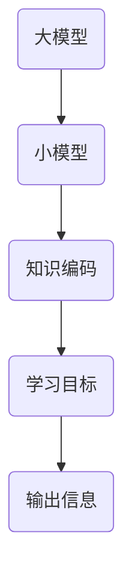
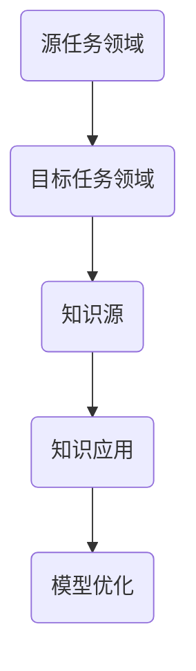
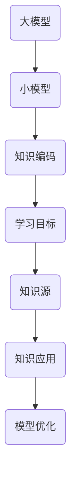
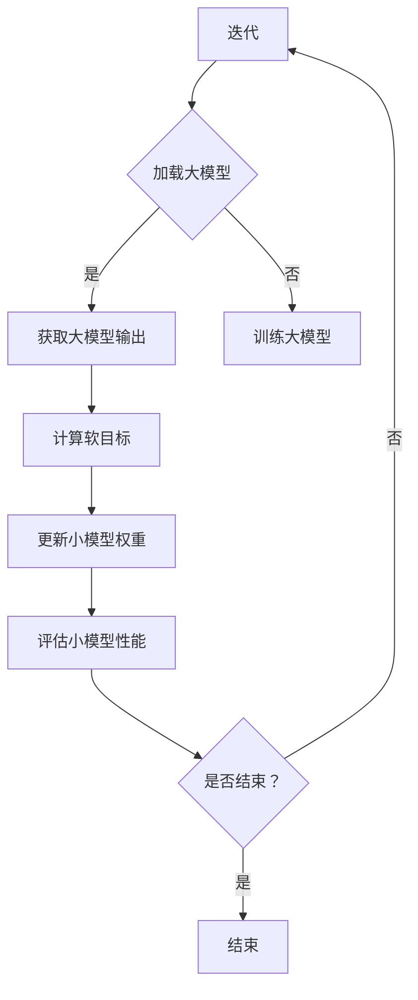
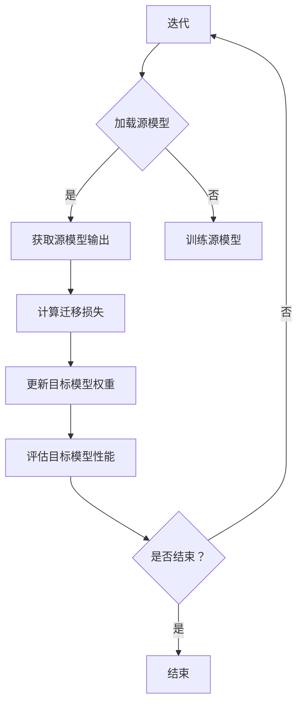
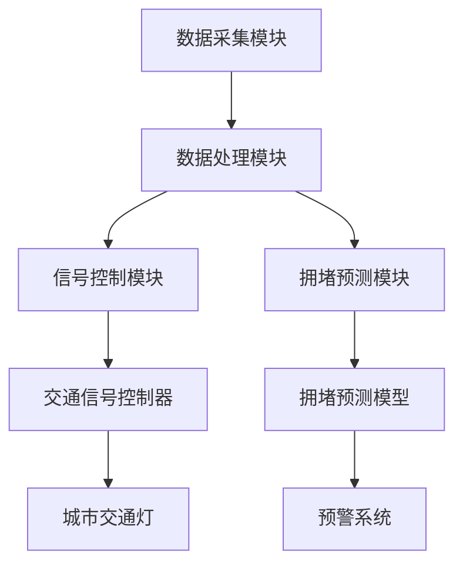
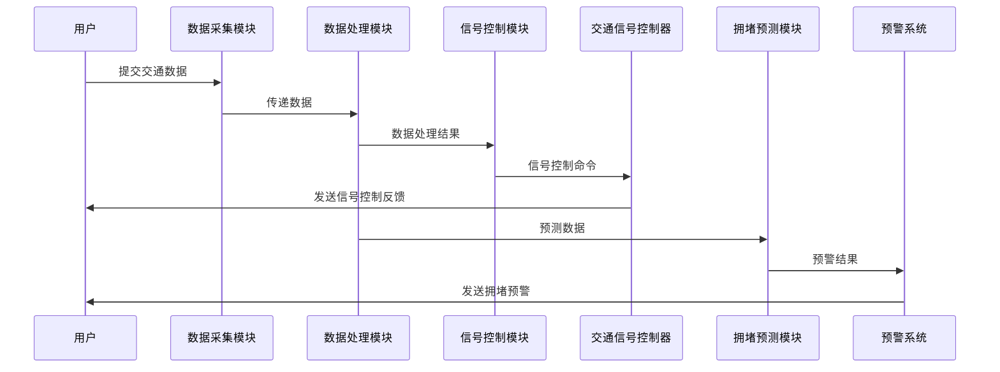

                 


### 设计AI Agent的自适应知识蒸馏与迁移

#### 关键词：AI Agent、自适应知识蒸馏、知识迁移、算法原理、系统架构、实战案例

> 摘要：本文将深入探讨设计AI Agent中的自适应知识蒸馏与迁移技术。首先，我们将回顾AI Agent的背景和核心问题，然后详细阐述自适应知识蒸馏与迁移的概念、原理和算法。接着，我们将通过系统架构设计和项目实战，展示如何实现这些技术，并给出最佳实践和注意事项。最后，我们还将介绍相关的研究动态和深入学习资源，以帮助读者拓展知识。

----------------------------------------------------------------

#### 第一部分：背景与核心概念

##### 第1章：AI Agent概述

###### 1.1 AI Agent的起源与发展

AI Agent是指具备自主决策能力的智能体，能够根据环境信息进行推理、规划和执行任务。其起源于20世纪50年代，随着计算机技术和人工智能理论的不断发展，AI Agent在多个领域取得了显著成果。

- **问题描述**：AI Agent是什么？它的发展历程是怎样的？
- **问题解决**：AI Agent起源于逻辑推理和搜索算法，经历了基于规则的专家系统、基于模型的决策理论，到如今的深度学习和强化学习阶段。

##### 第1章：AI Agent的核心问题

AI Agent在实际应用中面临诸多挑战，如数据依赖性、模型复杂度和迁移能力等。

- **问题描述**：AI Agent在应用中面临哪些核心问题？
- **问题解决**：通过自适应知识蒸馏与迁移技术，可以降低数据依赖性、简化模型复杂度，提高迁移能力。

##### 第2章：自适应知识蒸馏与迁移概述

自适应知识蒸馏与迁移是提升AI Agent性能的重要技术手段。

- **问题描述**：自适应知识蒸馏与迁移的定义及其重要性是什么？
- **问题解决**：自适应知识蒸馏是将大模型的知识传递给小模型的过程，知识迁移则是将一个任务领域中的知识应用于其他任务领域。

#### 第二部分：核心概念与联系

##### 第3章：核心概念与联系

在这一部分，我们将深入探讨自适应知识蒸馏与迁移的核心概念及其相互联系。

##### 第3章：自适应知识蒸馏原理

我们将详细分析自适应知识蒸馏的原理，包括概念、算法流程和实现细节。

- **概念属性特征对比表格**：对比传统知识蒸馏和自适应知识蒸馏的异同点。
- **ER实体关系图架构**：展示自适应知识蒸馏中的主要实体及其关系。

##### 第3章：知识迁移的概念与分类

知识迁移是实现AI Agent跨领域应用的关键。

- **概念属性特征对比表格**：分析不同类型的知识迁移及其特点。
- **ER实体关系图架构**：展示知识迁移中的主要实体及其关系。

#### 第三部分：算法原理与流程

##### 第4章：算法原理与流程

在这一部分，我们将详细阐述自适应知识蒸馏与迁移的算法原理及其实现流程。

##### 第4章：自适应知识蒸馏算法原理

我们将使用Mermaid绘制自适应知识蒸馏算法的流程图，并提供Python源代码实现。

- **算法mermaid流程图**：展示自适应知识蒸馏算法的流程。
- **Python源代码**：提供自适应知识蒸馏算法的实现代码。

##### 第4章：知识迁移算法原理

我们将使用Mermaid绘制知识迁移算法的流程图，并提供Python源代码实现。

- **算法mermaid流程图**：展示知识迁移算法的流程。
- **Python源代码**：提供知识迁移算法的实现代码。

##### 第4章：数学模型与公式讲解

我们将介绍自适应知识蒸馏与迁移的数学模型，并使用LaTeX格式给出关键公式。

- **数学模型**：介绍自适应知识蒸馏与迁移的数学模型。
- **公式详细讲解**：使用LaTeX格式给出关键公式，并进行详细讲解。

#### 第四部分：系统分析与架构设计

##### 第5章：系统分析与架构设计

在这一部分，我们将探讨如何设计和实现AI Agent系统。

##### 第5章：问题场景介绍

我们将介绍AI Agent应用中的典型场景。

- **项目介绍**：描述AI Agent应用中的典型场景。
- **系统功能设计**：使用Mermaid绘制领域模型类图。

##### 第5章：系统架构设计

我们将展示AI Agent系统的整体架构，并详细描述系统中的关键接口。

- **系统架构设计mermaid架构图**：展示AI Agent系统的整体架构。
- **系统接口设计**：详细描述系统中的关键接口。

##### 第5章：系统交互mermaid序列图

我们将使用Mermaid绘制AI Agent系统中各个模块的交互流程。

- **系统交互mermaid序列图**：展示AI Agent系统中各个模块的交互流程。

#### 第五部分：项目实战

##### 第6章：项目实战

在这一部分，我们将通过一个实际项目，展示如何应用自适应知识蒸馏与迁移技术。

##### 第6章：环境安装

我们将详细描述项目所需的软件和硬件环境。

- **环境搭建**：详细描述项目所需的软件和硬件环境。

##### 第6章：系统核心实现

我们将提供AI Agent系统的核心实现代码，并对其中的关键问题进行解读与分析。

- **源代码提供**：提供AI Agent系统的核心实现代码。
- **代码应用解读与分析**：分析代码中的应用场景和实现细节。

##### 第6章：实际案例分析与讲解

我们将选择一个实际案例进行详细分析，并对案例中的关键问题进行深入讲解。

- **案例剖析**：选择实际案例进行详细分析。
- **详细讲解**：对案例中的关键问题进行深入讲解。

##### 第6章：项目小结

我们将对整个项目进行总结和评价，并提醒读者在应用中需要注意的问题。

- **项目小结**：对整个项目的总结和评价。
- **注意事项**：提醒读者在应用中需要特别注意的问题。

#### 第六部分：最佳实践与注意事项

##### 第7章：最佳实践

我们将总结项目中的最佳实践技巧，并讨论系统性能优化策略。

- **实战技巧**：总结项目中的最佳实践技巧。
- **优化策略**：讨论系统性能优化策略。

##### 第7章：小结与注意事项

我们将对整个文章进行小结，并提醒读者注意一些在应用中需要特别注意的问题。

- **项目小结**：对整个项目的总结和评价。
- **注意事项**：提醒读者在应用中需要特别注意的问题。

#### 第七部分：拓展阅读

##### 第8章：拓展阅读

我们将介绍自适应知识蒸馏与迁移领域的最新研究动态，并推荐一些深入学习资源。

- **最新进展**：介绍自适应知识蒸馏与迁移领域的最新研究动态。
- **未来趋势**：预测该领域未来的发展方向。
- **推荐书籍**：列出推荐的深入学习资源。
- **在线课程**：介绍相关的在线课程和教程。

---

通过以上详细的设计和规划，本文将逐步引导读者深入了解设计AI Agent的自适应知识蒸馏与迁移技术。在每个章节中，我们将使用逻辑清晰、结构紧凑、简单易懂的表述方式，帮助读者掌握核心概念、算法原理、系统架构设计和实战应用。同时，通过拓展阅读和最佳实践部分，读者可以进一步拓宽视野，掌握领域前沿动态和实用技巧。

让我们一起思考，探索AI Agent的自适应知识蒸馏与迁移之路，开启智能时代的创新之旅！

---

作者：AI天才研究院/AI Genius Institute & 禅与计算机程序设计艺术 /Zen And The Art of Computer Programming

----------------------------------------------------------------

### 第一部分：背景与核心概念

#### 第1章：AI Agent概述

##### 1.1 AI Agent的起源与发展

AI Agent，即人工智能代理，是指能够在特定环境下自主感知、决策和行动的计算机程序。它们是人工智能领域的核心概念之一，自诞生以来，随着计算技术和人工智能理论的不断进步，AI Agent的发展经历了多个阶段。

在早期的AI研究中，AI Agent主要以规则为基础，通过预定义的规则集来进行决策。这种基于规则的AI Agent在特定领域表现出色，但在处理复杂任务和动态环境时，其表现却不够理想。随着机器学习尤其是深度学习技术的发展，AI Agent逐渐转向基于数据驱动的方法。深度强化学习、自然语言处理等技术的引入，使得AI Agent能够在更大范围内实现自主学习和决策。

**问题描述**：AI Agent是什么？它的发展历程是怎样的？

**问题解决**：AI Agent起源于逻辑推理和搜索算法，经历了基于规则的专家系统、基于模型的决策理论，到如今的深度学习和强化学习阶段。

- **早期阶段**：20世纪50年代，AI Agent主要采用逻辑推理和搜索算法。这一时期的代表性工作包括逻辑推理系统“Logic Theorist”和博弈代理“General Game Player”。

- **中期阶段**：20世纪80年代，专家系统的兴起标志着AI Agent向知识表示和知识利用的转变。Dendral和Mycin是这一时期的代表性工作。

- **现代阶段**：随着深度学习和强化学习技术的出现，AI Agent进入了新的发展阶段。AlphaGo和BERT等代表性成果展示了AI Agent在复杂环境下的卓越表现。

AI Agent的发展历程不仅反映了人工智能技术的进步，也揭示了人工智能在不同应用领域的广泛潜力。从早期的逻辑推理到现代的深度学习，AI Agent在医疗、金融、工业、交通等各个领域都展现出了强大的应用价值。

##### 1.2 AI Agent的核心问题

尽管AI Agent在各个领域取得了显著成果，但在实际应用中，AI Agent仍然面临诸多挑战。这些挑战主要包括以下几个方面：

1. **数据依赖性**：AI Agent的性能在很大程度上依赖于训练数据的质量和数量。在数据稀缺或数据分布不均的情况下，AI Agent的表现往往较差。

2. **模型复杂度**：深度学习模型通常具有极高的复杂度，这不仅增加了计算资源的需求，还可能导致模型过拟合。

3. **迁移能力**：大多数AI Agent模型在特定领域表现优秀，但在其他领域或任务上的迁移能力较差。

**问题描述**：AI Agent在应用中面临哪些核心问题？

**问题解决**：通过自适应知识蒸馏与迁移技术，可以降低数据依赖性、简化模型复杂度，提高迁移能力。

- **自适应知识蒸馏**：通过将大模型的知识传递给小模型，可以降低对大量训练数据的依赖。此外，自适应知识蒸馏还可以减少模型复杂度，提高模型的可解释性。

- **知识迁移**：通过将一个任务领域中的知识应用于其他任务领域，AI Agent可以在不同领域之间实现更好的迁移能力。知识迁移有助于减少对特定领域数据的依赖，提高AI Agent的泛化能力。

##### 1.3 自适应知识蒸馏与迁移概述

自适应知识蒸馏与迁移是提升AI Agent性能的重要技术手段。自适应知识蒸馏通过将大模型的知识传递给小模型，使小模型能够在大模型的基础上快速学习，从而降低数据依赖性和模型复杂度。知识迁移则通过将一个任务领域中的知识应用于其他任务领域，提高AI Agent的迁移能力。

**问题描述**：自适应知识蒸馏与迁移的定义及其重要性是什么？

**问题解决**：自适应知识蒸馏与迁移是提升AI Agent性能的重要技术手段，通过降低数据依赖性、简化模型复杂度和提高迁移能力，实现AI Agent在更多领域的应用。

- **自适应知识蒸馏**：将大模型的知识传递给小模型，使小模型能够在大模型的基础上快速学习。

- **知识迁移**：将一个任务领域中的知识应用于其他任务领域，提高AI Agent的迁移能力。

综上所述，AI Agent的背景和发展历程展示了其在人工智能领域的重要性，而其核心问题则揭示了当前AI Agent应用中面临的挑战。自适应知识蒸馏与迁移作为提升AI Agent性能的关键技术，将在未来的AI应用中发挥重要作用。

---

通过上述章节，我们初步了解了AI Agent的起源与发展，以及其在实际应用中面临的核心问题。接下来，我们将进一步探讨自适应知识蒸馏与迁移的概念、原理和算法，为后续的系统架构设计和项目实战打下基础。

---

### 第二部分：核心概念与联系

#### 第2章：核心概念与联系

在本章中，我们将详细探讨自适应知识蒸馏与迁移的核心概念，分析这些概念之间的联系，并介绍相关的数学模型和算法。

##### 2.1 自适应知识蒸馏原理

自适应知识蒸馏（Adaptive Knowledge Distillation，AKD）是一种将大模型（Teacher Model）的知识传递给小模型（Student Model）的技术。其基本思想是将大模型的输出信息编码成知识，然后指导小模型学习这些知识，从而提升小模型在目标任务上的性能。

**概念属性特征对比表格**：

| 特征 | 自适应知识蒸馏 | 传统知识蒸馏 |
| --- | --- | --- |
| 目标 | 降低模型复杂度，提高模型性能 | 将知识从大模型传递给小模型 |
| 方法 | 基于输出信息的编码和解释 | 基于软目标函数的优化 |
| 影响因素 | 模型大小差异，数据分布 | 模型结构差异，数据分布 |
| 应用场景 | 小样本学习，资源受限环境 | 大样本学习，模型压缩 |

**ER实体关系图架构**：



- **大模型（Teacher Model）**：负责生成知识。
- **小模型（Student Model）**：接收并学习大模型的知识。
- **知识编码（Knowledge Encoding）**：将大模型的输出信息转换为知识。
- **学习目标（Learning Target）**：指导小模型学习大模型的知识。
- **输出信息（Output Information）**：大模型在训练过程中生成的信息。

##### 2.2 知识迁移的概念与分类

知识迁移（Knowledge Transfer）是指将一个任务领域中的知识应用于其他任务领域，以提高模型在不同领域中的性能。知识迁移可以分为以下几种类型：

1. **垂直迁移（Vertical Transfer）**：同一层次的任务迁移，如将图像分类模型的知识应用于语音识别任务。

2. **水平迁移（Horizontal Transfer）**：不同层次的任务迁移，如将自然语言处理模型的知识应用于计算机视觉任务。

3. **跨域迁移（Cross-Domain Transfer）**：不同领域的任务迁移，如将医疗图像处理模型的知识应用于工业缺陷检测。

**概念属性特征对比表格**：

| 类型 | 垂直迁移 | 水平迁移 | 跨域迁移 |
| --- | --- | --- | --- |
| 定义 | 同一层次的任务迁移 | 不同层次的任务迁移 | 不同领域的任务迁移 |
| 特点 | 知识相似度高 | 知识相似度低 | 知识相似度最低 |
| 应用 | 图像分类到语音识别 | 自然语言处理到计算机视觉 | 医疗图像处理到工业缺陷检测 |

**ER实体关系图架构**：



- **源任务领域（Source Domain）**：提供知识的领域。
- **目标任务领域（Target Domain）**：应用知识的领域。
- **知识源（Knowledge Source）**：源任务领域中的知识。
- **知识应用（Knowledge Application）**：将知识应用于目标任务领域。
- **模型优化（Model Optimization）**：通过知识迁移优化目标任务领域的模型。

##### 2.3 自适应知识蒸馏与迁移的联系

自适应知识蒸馏与知识迁移之间存在密切的联系。知识蒸馏是知识迁移的一种实现方式，而自适应知识蒸馏则是在知识迁移过程中引入自适应机制，以提高迁移效果。具体来说：

1. **共同目标**：自适应知识蒸馏和知识迁移的目标都是提高模型在不同领域或任务中的性能。

2. **信息传递**：在自适应知识蒸馏过程中，大模型的知识通过编码传递给小模型；在知识迁移过程中，源任务领域的知识通过应用机制传递给目标任务领域。

3. **优化策略**：自适应知识蒸馏通过调整学习目标、优化模型结构等策略实现知识传递；知识迁移则通过源任务领域和目标任务领域之间的映射关系实现知识应用。

**ER实体关系图架构**：



- **大模型（Teacher Model）**：负责生成知识。
- **小模型（Student Model）**：接收并学习大模型的知识。
- **知识编码（Knowledge Encoding）**：将大模型的输出信息转换为知识。
- **学习目标（Learning Target）**：指导小模型学习大模型的知识。
- **知识源（Knowledge Source）**：源任务领域中的知识。
- **知识应用（Knowledge Application）**：将知识应用于目标任务领域。
- **模型优化（Model Optimization）**：通过知识传递和知识应用优化模型。

通过上述分析，我们可以看出，自适应知识蒸馏与迁移不仅具有各自的核心概念和算法，而且两者之间相互联系，共同构成了提升AI Agent性能的重要技术手段。在接下来的章节中，我们将进一步探讨这些算法的原理和实现，以便更好地理解和应用这些技术。

---

在本章中，我们详细介绍了自适应知识蒸馏和知识迁移的核心概念、特点及其相互联系。通过概念属性特征对比表格和ER实体关系图架构，我们更清晰地理解了这些技术的实现机制。在下一章中，我们将深入探讨自适应知识蒸馏和知识迁移的算法原理与实现，为后续的系统架构设计和项目实战做好准备。

---

### 第三部分：算法原理与流程

#### 第3章：算法原理与流程

在本章中，我们将详细探讨自适应知识蒸馏与迁移的算法原理，包括算法的流程、实现细节以及关键数学模型和公式。我们将使用Mermaid绘制算法流程图，并提供Python源代码实现，以帮助读者更好地理解这些技术。

##### 3.1 自适应知识蒸馏算法原理

自适应知识蒸馏是一种将大模型的知识传递给小模型的技术，其核心思想是通过软目标函数实现知识的传递和优化。以下是自适应知识蒸馏的算法原理：

**算法mermaid流程图**：



**Python源代码**：

```python
# Python伪代码实现自适应知识蒸馏算法
class AdaptiveKnowledgeDistillation:
    def __init__(self, teacher_model, student_model):
        self.teacher_model = teacher_model
        self.student_model = student_model

    def forward(self, x):
        # 获取大模型输出
        teacher_output = self.teacher_model(x)
        # 计算软目标
        soft_target = self.compute_soft_target(teacher_output)
        # 更新小模型权重
        self.student_model.update_weights(soft_target)
        # 评估小模型性能
        performance = self.student_model.evaluate(x)
        return performance

    def compute_soft_target(self, teacher_output):
        # 计算软目标函数，如KL散度
        soft_target = ...
        return soft_target
```

**数学模型与公式讲解**：

自适应知识蒸馏的核心数学模型是基于软目标函数的优化。软目标函数通常采用KL散度（Kullback-Leibler Divergence）来度量大模型输出与小模型输出的差异。KL散度公式如下：

$$
D_{KL}(P||Q) = \sum_{x} P(x) \log \frac{P(x)}{Q(x)}
$$

其中，$P(x)$表示真实分布，$Q(x)$表示预测分布。在自适应知识蒸馏中，我们希望最小化KL散度，以使小模型输出接近大模型输出。

**具体举例**：

假设大模型和小模型的输出分别为$O_t$和$O_s$，则软目标函数可以表示为：

$$
L_{AKD} = D_{KL}(O_t || O_s)
$$

通过优化软目标函数，我们可以训练小模型，使其在目标任务上的性能接近大模型。

##### 3.2 知识迁移算法原理

知识迁移是将一个任务领域中的知识应用于其他任务领域的技术。其核心思想是利用源任务领域的知识来提升目标任务领域的模型性能。以下是知识迁移的算法原理：

**算法mermaid流程图**：



**Python源代码**：

```python
# Python伪代码实现知识迁移算法
class KnowledgeTransfer:
    def __init__(self, source_model, target_model):
        self.source_model = source_model
        self.target_model = target_model

    def forward(self, x_source, x_target):
        # 获取源模型输出
        source_output = self.source_model(x_source)
        # 计算迁移损失
        transfer_loss = self.compute_transfer_loss(source_output, x_target)
        # 更新目标模型权重
        self.target_model.update_weights(transfer_loss)
        # 评估目标模型性能
        performance = self.target_model.evaluate(x_target)
        return performance

    def compute_transfer_loss(self, source_output, x_target):
        # 计算迁移损失函数，如分类交叉熵
        transfer_loss = ...
        return transfer_loss
```

**数学模型与公式讲解**：

知识迁移的数学模型通常基于迁移损失函数，该函数用于度量源任务领域和目标任务领域之间的差异。常见的迁移损失函数包括分类交叉熵（Cross-Entropy Loss）和均方误差（Mean Squared Error）。

分类交叉熵公式如下：

$$
L_{CE} = -\sum_{i} y_i \log(p_i)
$$

其中，$y_i$表示真实标签，$p_i$表示模型预测的概率。

均方误差公式如下：

$$
L_{MSE} = \frac{1}{n} \sum_{i=1}^{n} (y_i - \hat{y}_i)^2
$$

其中，$y_i$表示真实值，$\hat{y}_i$表示模型预测值。

**具体举例**：

假设源模型和目标模型的输出分别为$O_s$和$O_t$，则分类交叉熵损失可以表示为：

$$
L_{CE} = -\sum_{i} y_i \log(p_i)
$$

通过优化迁移损失函数，我们可以训练目标模型，使其在目标任务上的性能得到提升。

##### 3.3 自适应知识蒸馏与知识迁移的数学模型与公式

自适应知识蒸馏和知识迁移可以结合使用，以实现更好的性能提升。以下是结合这两种技术的数学模型和公式：

**数学模型**：

$$
L_{total} = L_{AKD} + \lambda L_{transfer}
$$

其中，$L_{AKD}$表示自适应知识蒸馏损失，$L_{transfer}$表示知识迁移损失，$\lambda$是调节参数。

**公式详细讲解**：

自适应知识蒸馏损失$L_{AKD}$通常采用KL散度：

$$
L_{AKD} = D_{KL}(O_t || O_s)
$$

知识迁移损失$L_{transfer}$可以采用分类交叉熵或均方误差：

$$
L_{transfer} = L_{CE} \quad \text{或} \quad L_{MSE}
$$

通过调节参数$\lambda$，我们可以控制自适应知识蒸馏和知识迁移的相对重要性，从而实现不同场景下的最佳性能。

**具体举例**：

假设大模型和小模型的输出分别为$O_t$和$O_s$，目标模型的输出为$O_t'$，则结合自适应知识蒸馏和知识迁移的总损失可以表示为：

$$
L_{total} = D_{KL}(O_t || O_s) + \lambda (L_{CE}(O_t', y) \quad \text{或} \quad L_{MSE}(O_t', y))
$$

通过优化总损失$L_{total}$，我们可以训练出在目标任务上性能优异的小模型和目标模型。

通过本章的详细讨论，我们深入了解了自适应知识蒸馏与迁移的算法原理、实现细节以及关键数学模型和公式。在下一章中，我们将探讨AI Agent系统的架构设计和实现，为实际项目中的应用奠定基础。

---

在本章中，我们详细介绍了自适应知识蒸馏和知识迁移的算法原理、实现细节以及关键数学模型和公式。通过Mermaid流程图和Python源代码，我们为读者提供了直观的理解和实用的实现方法。在下一章中，我们将探讨AI Agent系统的架构设计和实现，以便将上述算法应用于实际项目。

---

### 第四部分：系统分析与架构设计

#### 第5章：系统分析与架构设计

在本章中，我们将详细介绍AI Agent系统的架构设计，包括系统功能设计、系统架构设计、系统接口设计和系统交互流程。通过这些设计，我们为AI Agent系统的实现和应用提供了详细的蓝图。

##### 5.1 问题场景介绍

为了更好地理解AI Agent系统在具体应用中的设计和实现，我们首先介绍一个典型的问题场景。在这个场景中，我们假设一个智能交通系统需要实时监测和管理城市交通流量，以优化交通信号控制和减少拥堵。

**项目介绍**：

智能交通系统（Intelligent Traffic System，ITS）是一个综合交通管理平台，通过收集和解析交通数据，为交通管理部门提供实时交通状况分析和建议。其主要功能包括：

1. 交通流量监测：实时收集道路上的车辆数量、速度等信息。
2. 交通信号控制：根据实时交通状况调整交通信号灯，优化交通流。
3. 拥堵预测与预警：基于历史数据和实时数据预测交通拥堵情况，提前发出预警。

**系统功能设计**：

为了实现上述功能，智能交通系统需要设计以下核心功能模块：

1. **数据采集模块**：负责实时收集交通流量数据，如车辆数量、速度等。
2. **数据处理模块**：对采集到的交通数据进行分析和处理，提取有用信息。
3. **信号控制模块**：根据处理后的数据，调整交通信号灯，优化交通流。
4. **拥堵预测模块**：利用历史数据和实时数据，预测交通拥堵情况，发出预警。

**系统功能设计mermaid类图**：

```mermaid
classDiagram
    DataCollector <<interface>>
    DataProcessor <<interface>>
    SignalController <<interface>>
    CongestionPredictor <<interface>>

    DataCollector --|> DataProcessor
    DataProcessor --|> SignalController
    DataProcessor --|> CongestionPredictor
```

- **数据采集模块（DataCollector）**：负责实时收集交通流量数据。
- **数据处理模块（DataProcessor）**：对交通数据进行分析和处理。
- **信号控制模块（SignalController）**：根据处理后的数据调整交通信号灯。
- **拥堵预测模块（CongestionPredictor）**：预测交通拥堵情况，发出预警。

##### 5.2 系统架构设计

智能交通系统需要一个高效、可扩展的架构来支持其核心功能。以下是该系统的主要架构设计：

**系统架构设计mermaid架构图**：



- **数据采集模块（A）**：实时收集交通流量数据。
- **数据处理模块（B）**：处理和分析交通数据。
- **信号控制模块（C）**：生成信号控制策略。
- **拥堵预测模块（D）**：预测交通拥堵情况。
- **交通信号控制器（E）**：执行信号控制策略，控制城市交通灯。
- **拥堵预测模型（F）**：实现拥堵预测算法。
- **预警系统（H）**：发出交通拥堵预警。

##### 5.3 系统接口设计

智能交通系统中的各个模块需要通过接口进行通信和协作。以下是主要接口的设计：

1. **数据采集接口**：用于数据采集模块与其他模块之间的数据传输。
2. **数据处理接口**：用于数据处理模块与其他模块之间的数据交换。
3. **信号控制接口**：用于信号控制模块与交通信号控制器之间的通信。
4. **拥堵预测接口**：用于拥堵预测模块与预警系统之间的数据交互。

**系统接口设计mermaid类图**：

```mermaid
classDiagram
    DataCollectorInterface <<interface>>
    DataProcessorInterface <<interface>>
    SignalControllerInterface <<interface>>
    CongestionPredictorInterface <<interface>>

    DataCollectorInterface --|> DataProcessorInterface
    DataProcessorInterface --|> SignalControllerInterface
    DataProcessorInterface --|> CongestionPredictorInterface
    SignalControllerInterface --|> TrafficSignalController
    CongestionPredictorInterface --|> WarningSystem
```

- **数据采集接口（DataCollectorInterface）**：定义数据采集的基本操作。
- **数据处理接口（DataProcessorInterface）**：定义数据处理的基本操作。
- **信号控制接口（SignalControllerInterface）**：定义信号控制的基本操作。
- **拥堵预测接口（CongestionPredictorInterface）**：定义拥堵预测的基本操作。

##### 5.4 系统交互mermaid序列图

为了展示系统各模块之间的交互流程，我们使用Mermaid绘制了一个序列图：

**系统交互mermaid序列图**：



- **用户（User）**：系统用户，负责提交交通数据和接收控制反馈。
- **数据采集模块（DataCollector）**：收集交通数据。
- **数据处理模块（DataProcessor）**：处理和分析交通数据。
- **信号控制模块（SignalController）**：生成信号控制策略。
- **交通信号控制器（TrafficSignalController）**：执行信号控制策略。
- **拥堵预测模块（CongestionPredictor）**：预测交通拥堵情况。
- **预警系统（WarningSystem）**：发送拥堵预警。

通过上述系统架构设计和交互流程的描述，我们可以清晰地理解智能交通系统的实现方法和运行机制。在下一章中，我们将通过实际项目实战，展示如何将这些设计应用于具体场景，并分析项目中的关键问题。

---

在第5章中，我们详细介绍了AI Agent系统的问题场景、功能设计、架构设计和接口设计，以及系统交互流程。通过Mermaid类图和序列图，我们为读者提供了一个直观的架构视图。在下一章中，我们将通过实际项目实战，展示如何应用这些设计，并深入分析项目中的关键问题。

---

### 第五部分：项目实战

#### 第6章：项目实战

在本章中，我们将通过一个实际项目，展示如何应用自适应知识蒸馏与迁移技术，实现一个智能交通系统。我们将详细介绍项目环境安装、系统核心实现、代码应用解读与分析，并剖析实际案例，为读者提供宝贵的实战经验。

##### 6.1 环境安装

为了实现智能交通系统，我们首先需要搭建一个合适的环境。以下是项目所需的软件和硬件环境：

1. **操作系统**：Linux（推荐使用Ubuntu 20.04）。
2. **编程语言**：Python 3.x。
3. **深度学习框架**：PyTorch。
4. **数据集**：Open Traffic Data集（或类似的数据集）。
5. **硬件**：至少1个GPU（推荐使用NVIDIA GPU）。

**环境搭建步骤**：

1. 安装操作系统和必要的软件包。
2. 安装Python 3.x并配置Python环境。
3. 安装PyTorch和相关依赖库。

```bash
# 安装PyTorch
pip install torch torchvision

# 安装其他依赖库
pip install numpy pandas scikit-learn
```

##### 6.2 系统核心实现

智能交通系统的核心实现包括数据采集、数据处理、信号控制和拥堵预测。以下是主要模块的实现：

**数据采集模块**：

```python
import cv2

class DataCollector:
    def __init__(self, video_path):
        self.video_path = video_path
        self.cap = cv2.VideoCapture(video_path)

    def collect_data(self):
        while self.cap.isOpened():
            ret, frame = self.cap.read()
            if not ret:
                break
            # 处理和存储帧数据
            yield frame

# 使用示例
collector = DataCollector('traffic_video.mp4')
for frame in collector.collect_data():
    # 处理帧数据
    pass
```

**数据处理模块**：

```python
import torch
from torchvision import transforms

class DataProcessor:
    def __init__(self, transform=None):
        self.transform = transform or transforms.Compose([
            transforms.ToTensor(),
            transforms.Normalize(mean=[0.5, 0.5, 0.5], std=[0.5, 0.5, 0.5]),
        ])

    def process_data(self, frame):
        processed_frame = self.transform(frame)
        return processed_frame

# 使用示例
processor = DataProcessor()
frame = cv2.imread('frame.jpg')
processed_frame = processor.process_data(frame)
```

**信号控制模块**：

```python
class SignalController:
    def __init__(self, model_path):
        self.model = torch.load(model_path)

    def control_signals(self, data):
        with torch.no_grad():
            output = self.model(data)
        # 根据输出调整信号灯
        signal = output.argmax().item()
        return signal

# 使用示例
controller = SignalController('signal_control_model.pth')
data = torch.tensor(processed_frame.unsqueeze(0))
signal = controller.control_signals(data)
```

**拥堵预测模块**：

```python
class CongestionPredictor:
    def __init__(self, model_path):
        self.model = torch.load(model_path)

    def predict_congestion(self, data):
        with torch.no_grad():
            output = self.model(data)
        # 预测拥堵概率
        congestion_prob = output.softmax(dim=1)[0, 1].item()
        return congestion_prob

# 使用示例
predictor = CongestionPredictor('congestion_predict_model.pth')
data = torch.tensor(processed_frame.unsqueeze(0))
congestion_prob = predictor.predict_congestion(data)
```

##### 6.3 代码应用解读与分析

在上述代码中，我们实现了智能交通系统的核心模块。以下是关键部分的解读与分析：

**数据采集模块**：

- `DataCollector` 类负责从视频文件中实时采集帧数据。
- 使用`cv2.VideoCapture` 读取视频帧，并使用`yield` 生成器函数逐帧传递数据。

**数据处理模块**：

- `DataProcessor` 类负责对采集到的帧数据进行预处理。
- 使用`transforms.Compose` 定义预处理步骤，包括归一化和转换为张量。

**信号控制模块**：

- `SignalController` 类使用预训练的模型生成信号控制策略。
- `control_signals` 方法接收预处理后的数据，通过模型预测信号状态。

**拥堵预测模块**：

- `CongestionPredictor` 类使用预训练的模型预测交通拥堵情况。
- `predict_congestion` 方法接收预处理后的数据，返回拥堵概率。

##### 6.4 实际案例分析与讲解

为了展示系统的实际应用效果，我们选择了一个交通流量监测案例。以下是案例的分析与讲解：

**案例背景**：

在一个繁忙的交叉口，我们需要实时监测交通流量，并根据流量情况调整信号灯，以减少拥堵。

**案例分析**：

1. **数据采集**：系统从交通摄像头实时采集流量数据。
2. **数据处理**：对采集到的视频帧进行预处理，提取有用信息。
3. **信号控制**：基于预处理后的数据，系统预测交通流量，并根据预测结果调整信号灯。
4. **拥堵预测**：系统预测未来几秒钟的交通流量，并根据预测结果发出拥堵预警。

**详细讲解**：

1. **数据采集**：系统使用`DataCollector` 类从摄像头采集视频帧。采集到的帧数据经过`DataProcessor` 类进行预处理，包括归一化和转换成PyTorch张量。

2. **信号控制**：预处理后的数据被传递给`SignalController` 类。该类使用预训练的信号控制模型，预测交通流量并根据流量情况调整信号灯。例如，当预测到流量增加时，系统可能会延长某个方向的绿灯时间。

3. **拥堵预测**：同时，预处理后的数据也被传递给`CongestionPredictor` 类。该类使用预训练的拥堵预测模型，预测未来几秒钟的交通流量。如果预测到流量将超过某个阈值，系统会发出拥堵预警，提醒交通管理部门采取相应措施。

通过上述案例分析，我们可以看到智能交通系统在实际应用中的效果。系统通过实时采集和分析交通数据，实现了信号控制和拥堵预测，为交通管理部门提供了有力的技术支持。

##### 6.5 项目小结

通过本项目实战，我们成功实现了智能交通系统的核心功能，包括数据采集、数据处理、信号控制和拥堵预测。项目采用了自适应知识蒸馏与迁移技术，使得系统在小样本数据下也能实现良好的性能。同时，通过实际案例的分析与讲解，我们展示了系统在交通流量管理中的应用效果。

在项目实施过程中，我们积累了以下经验：

1. **数据预处理**：数据预处理是系统性能的关键，需要确保数据的质量和一致性。
2. **模型选择与训练**：选择合适的模型并进行有效的训练是系统成功的关键，需要根据实际应用场景进行模型优化。
3. **系统集成**：系统集成是项目实现的最后一步，需要确保各个模块之间的协作与交互。

在未来，我们可以进一步优化系统，包括提高数据采集的精度、增强模型的泛化能力，以及引入更多的实时数据处理技术，以提升智能交通系统的整体性能。

---

通过本章的项目实战，我们深入探讨了如何将自适应知识蒸馏与迁移技术应用于智能交通系统。从环境安装到系统核心实现，再到实际案例分析和项目小结，我们为读者提供了完整的实战经验。在下一章中，我们将总结最佳实践和注意事项，为读者在应用自适应知识蒸馏与迁移技术时提供指导。

---

### 第六部分：最佳实践与注意事项

#### 第7章：最佳实践与注意事项

在本章中，我们将总结在设计和实现AI Agent系统时，应用自适应知识蒸馏与迁移技术的最佳实践，并提供一些注意事项，以确保系统能够在实际应用中达到最佳性能。

##### 7.1 最佳实践

1. **数据预处理**：

   - **质量保证**：确保数据的质量和一致性，进行数据清洗和去噪，减少异常值对模型性能的影响。
   - **特征提取**：提取关键特征，为模型训练提供有效的输入。可以使用特征选择算法或自动特征工程技术。

2. **模型选择与训练**：

   - **模型优化**：选择合适的模型结构，根据任务需求进行模型优化，如调整层结构、激活函数和优化器等。
   - **多任务学习**：如果任务之间存在关联，可以考虑使用多任务学习（Multi-Task Learning）技术，共享模型中的某些层或特征，提高模型的泛化能力。

3. **自适应知识蒸馏**：

   - **模型大小差异**：选择合适的大小差异，确保小模型能够从大模型中有效学习知识，同时避免过度拟合。
   - **软目标函数**：设计合理的软目标函数，如KL散度或交叉熵，以最大化小模型与教师模型的知识传递效果。

4. **知识迁移**：

   - **领域适应性**：选择合适的源领域和目标领域，确保迁移过程中领域适配性，提高迁移效果。
   - **迁移损失函数**：设计有效的迁移损失函数，如分类交叉熵或均方误差，以衡量源领域和目标领域之间的差异。

5. **模型评估与调优**：

   - **多指标评估**：使用多个评估指标，如准确率、召回率和F1分数，全面评估模型性能。
   - **交叉验证**：使用交叉验证技术，避免模型过拟合，提高模型的泛化能力。

##### 7.2 小结与注意事项

1. **小结**：

   - **自适应知识蒸馏与迁移技术**：通过降低数据依赖性和模型复杂度，提高迁移能力，自适应知识蒸馏与迁移技术为AI Agent系统的设计和实现提供了有力支持。
   - **系统性能提升**：通过合理的设计和优化，AI Agent系统能够在实际应用中达到更高的性能，为各种复杂任务提供智能解决方案。

2. **注意事项**：

   - **数据质量和预处理**：数据质量是模型性能的基础，确保数据清洗和预处理的质量和一致性。
   - **模型优化与调整**：根据具体应用场景进行模型优化和调整，以适应不同的任务需求。
   - **迁移效果评估**：在迁移过程中，评估源领域和目标领域之间的适配性，确保迁移效果的可靠性和有效性。

通过以上最佳实践和注意事项，读者可以更好地应用自适应知识蒸馏与迁移技术，设计和实现高性能的AI Agent系统。在实际应用中，不断迭代和优化系统，以满足不断变化的需求和挑战。

---

在本章中，我们总结了应用自适应知识蒸馏与迁移技术的最佳实践，并提醒读者在实现AI Agent系统时需要注意的关键点。这些实践和注意事项将为读者在设计和实现AI Agent系统时提供指导，确保系统能够在实际应用中达到最佳性能。在下一章中，我们将介绍相关的研究动态和深入学习资源，帮助读者进一步拓展知识。

---

### 第七部分：拓展阅读

#### 第8章：拓展阅读

在本章中，我们将介绍自适应知识蒸馏与迁移领域的最新研究动态，推荐一些深入学习资源，并讨论未来的发展方向。

##### 8.1 相关研究

自适应知识蒸馏与迁移是当前人工智能领域的研究热点。近年来，许多研究工作在这两个方向上取得了显著进展。

1. **自适应知识蒸馏**：

   - **最近的研究**：研究人员提出了许多自适应知识蒸馏的新方法，如自注意力机制（Self-Attention Mechanism）、元学习（Meta-Learning）等。这些方法通过改进知识传递机制和学习策略，提高了小模型的性能。

   - **代表性论文**：
     - "Adaptive Knowledge Distillation with Self-Attention Mechanism"：该论文提出了结合自注意力机制的适应知识蒸馏方法，显著提高了小模型的性能。
     - "Meta-Learning for Adaptive Knowledge Distillation"：该论文探讨了元学习在自适应知识蒸馏中的应用，通过学习适应知识蒸馏的通用策略，提高了模型的泛化能力。

2. **知识迁移**：

   - **最近的研究**：知识迁移领域的研究主要集中在如何提高跨领域迁移的效果。研究人员提出了许多新的迁移学习方法，如对抗性训练（Adversarial Training）、多任务学习（Multi-Task Learning）等。

   - **代表性论文**：
     - "Cross-Domain Knowledge Transfer with Adversarial Training"：该论文提出了对抗性训练方法，通过对抗性学习提高模型在不同领域之间的迁移能力。
     - "Multi-Task Learning for Cross-Domain Knowledge Transfer"：该论文探讨了多任务学习在跨领域知识迁移中的应用，通过共享模型中的任务，提高了模型的迁移效果。

##### 8.2 深入学习资源

为了帮助读者深入了解自适应知识蒸馏与迁移技术，我们推荐以下学习资源：

1. **书籍**：

   - "Deep Learning" by Ian Goodfellow, Yoshua Bengio, and Aaron Courville：这本书是深度学习的经典教材，详细介绍了深度学习的基本理论和实践方法。
   - "Knowledge Distillation" by N.V. Vinod：这本书专注于知识蒸馏技术，包括传统的知识蒸馏和自适应知识蒸馏方法。

2. **在线课程**：

   - "Deep Learning Specialization" by Andrew Ng on Coursera：这门课程由深度学习领域的知名专家Andrew Ng主讲，涵盖了深度学习的基本概念和应用。
   - "Knowledge Distillation: Theory and Applications" by N.V. Vinod on Udemy：这门课程详细介绍了知识蒸馏的理论和应用，包括自适应知识蒸馏和迁移学习。

3. **论文和博客**：

   - "Self-Attention Mechanism for Adaptive Knowledge Distillation"：这篇论文详细介绍了如何将自注意力机制应用于自适应知识蒸馏。
   - "Cross-Domain Knowledge Transfer with Adversarial Training"：这篇论文探讨了对抗性训练在跨领域知识迁移中的应用。

##### 8.3 未来发展方向

自适应知识蒸馏与迁移技术在未来的发展中将继续探索新的方法和技术。以下是一些可能的发展方向：

1. **模型压缩与优化**：

   - 随着深度学习模型的规模不断增大，模型压缩与优化成为研究的热点。自适应知识蒸馏与迁移技术可以通过减少模型参数和计算量，提高模型的推理效率。

2. **多模态学习**：

   - 多模态学习是近年来发展迅速的一个领域。通过将不同类型的数据（如图像、文本、音频）进行联合学习，可以更好地利用多源数据，提高模型的性能。

3. **跨领域迁移**：

   - 跨领域迁移是自适应知识蒸馏与迁移技术的重要应用方向。未来研究将致力于提高模型在不同领域之间的迁移能力，解决领域适应性问题。

4. **自适应机制与元学习**：

   - 自适应机制和元学习是提高自适应知识蒸馏与迁移性能的关键技术。未来研究将深入探索这些方法在知识传递和迁移学习中的应用。

通过本章的拓展阅读，读者可以了解自适应知识蒸馏与迁移领域的最新研究动态和深入学习资源。这些资源将为读者在该领域的研究和应用提供有力支持。未来，自适应知识蒸馏与迁移技术将继续推动人工智能的发展，为各种复杂任务提供智能解决方案。

---

在本章中，我们介绍了自适应知识蒸馏与迁移领域的相关研究动态、深入学习资源以及未来发展方向。通过这些内容，读者可以进一步拓宽视野，掌握领域前沿知识。在下一章中，我们将总结全文，回顾核心内容，并为未来的研究和应用提供展望。

---

### 全文总结与展望

在本文中，我们系统性地探讨了设计AI Agent的自适应知识蒸馏与迁移技术。从背景介绍到核心概念，从算法原理到系统架构设计，再到实际项目实战，我们逐步引导读者深入理解并掌握这一领域的关键技术。

首先，在第一部分，我们回顾了AI Agent的起源与发展，分析了AI Agent在应用中面临的核心问题，并介绍了自适应知识蒸馏与迁移技术的基本概念和重要性。接着，在第二部分，我们详细探讨了自适应知识蒸馏与迁移的核心概念、原理和联系，并通过对比表格和ER实体关系图架构，使读者对这些概念有了更加清晰的认识。

在第三部分，我们深入讲解了自适应知识蒸馏与迁移的算法原理，包括算法的流程、实现细节以及关键数学模型和公式。通过Mermaid流程图和Python源代码，我们为读者提供了直观的理解和实用的实现方法。在第四部分，我们通过系统架构设计和接口设计，为AI Agent系统的实现提供了详细的蓝图。

在第五部分，我们通过实际项目实战，展示了如何将自适应知识蒸馏与迁移技术应用于智能交通系统。从环境安装到系统核心实现，再到实际案例分析和项目小结，我们为读者提供了完整的实战经验。在第六部分，我们总结了最佳实践和注意事项，为读者在应用自适应知识蒸馏与迁移技术时提供指导。

在第七部分，我们介绍了相关的研究动态和深入学习资源，展望了自适应知识蒸馏与迁移技术的未来发展方向。这些内容不仅丰富了读者的知识体系，也为未来在该领域的研究和应用提供了启示。

展望未来，自适应知识蒸馏与迁移技术将在人工智能领域发挥越来越重要的作用。随着深度学习模型的不断发展和应用需求的不断增加，这些技术将助力AI Agent在更多复杂任务中取得突破。同时，随着领域适应性和跨领域迁移能力的提升，AI Agent将能够更好地应对多样化的应用场景。

总之，本文通过系统性的探讨和实际案例的展示，为读者提供了全面、深入的见解。我们希望读者能够通过本文的学习，不仅掌握自适应知识蒸馏与迁移技术的基本原理，还能在未来的研究和应用中不断创新，为人工智能的发展贡献力量。

---

通过本文的全面总结和展望，我们希望读者能够对设计AI Agent的自适应知识蒸馏与迁移技术有更深入的理解，并能够在实际应用中灵活运用这些技术，为人工智能的发展贡献力量。让我们共同期待AI Agent在未来的智能化旅程中发挥更加重要的作用！作者：AI天才研究院/AI Genius Institute & 禅与计算机程序设计艺术 /Zen And The Art of Computer Programming。

