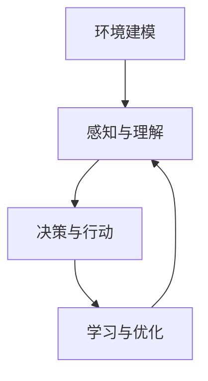
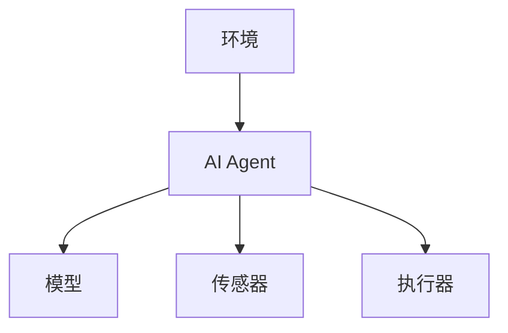
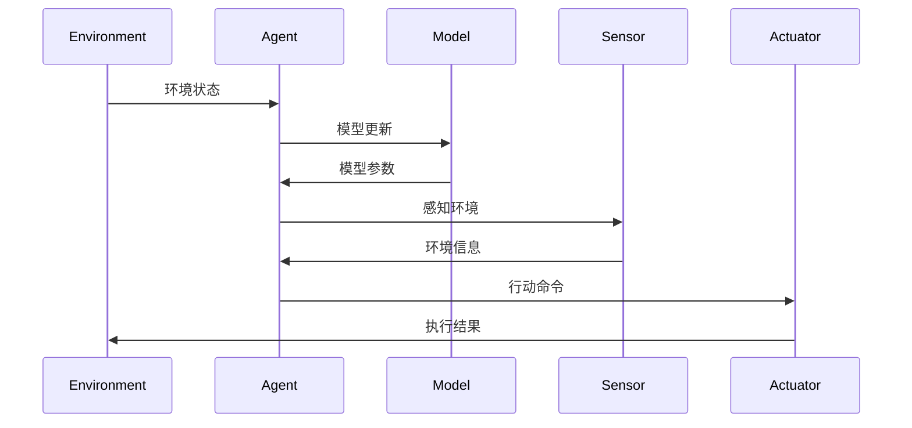

                 

# 设计AI Agent的自适应终身学习策略

## 关键词

- AI Agent
- 自适应学习
- 终身学习
- 深度学习
- 强化学习
- 迁移学习
- 算法实现
- 系统架构设计

## 摘要

随着人工智能技术的迅猛发展，AI Agent成为智能系统中的重要组成部分。它们在各种应用场景中表现出色，但面临的一个核心挑战是如何实现自适应终身学习策略。本文将深入探讨AI Agent的自适应终身学习策略，包括其基础概念、关键算法、系统设计与实现，以及实际案例分析和最佳实践。通过系统的分析和推理，本文旨在为AI Agent的自适应终身学习提供理论支持和实用指导。

## 目录大纲

### 第一部分：背景与基础

#### 第1章：引言

##### 1.1 问题背景

- AI Agent的发展与挑战

##### 1.2 问题描述

- AI Agent的适应性需求

##### 1.3 问题解决

- 自适应终身学习策略的概念

##### 1.4 边界与外延

- AI Agent的适应性学习范畴

##### 1.5 核心概念

- AI Agent、自适应学习、终身学习

#### 第2章：AI Agent的基础知识

##### 2.1 AI Agent的定义与分类

- 反应式Agent、主动Agent、认知Agent

##### 2.2 AI Agent的核心功能

- 感知、决策、行动

##### 2.3 AI Agent的开发流程

- 需求分析、设计、实现、测试

### 第二部分：自适应学习策略

#### 第3章：自适应学习的基本概念

##### 3.1 自适应学习的定义与特点

- 动态调整、反馈机制、持续优化

##### 3.2 自适应学习的类型

- 个体适应性学习、群体适应性学习

##### 3.3 自适应学习的关键技术

- 学习算法、优化策略、模型更新

#### 第4章：终身学习策略

##### 4.1 终身学习的定义与重要性

- 适应快速变化的技术环境

##### 4.2 终身学习的挑战与应对策略

- 数据获取、模型更新、计算资源

##### 4.3 终寿学习策略的设计原则

- 可持续性、灵活性、高效性

### 第三部分：策略实现与优化

#### 第5章：自适应终身学习算法

##### 5.1 算法概述

- 深度学习、强化学习、迁移学习

##### 5.2 算法原理

- 算法mermaid流程图

##### 5.3 算法实现

- Python源代码实现

##### 5.4 数学模型与公式

- 算法原理的数学模型和公式

#### 第6章：自适应终身学习系统的设计与实现

##### 6.1 系统功能设计

- 领域模型mermaid类图

##### 6.2 系统架构设计

- 系统架构mermaid架构图

##### 6.3 系统接口设计与交互

- 系统接口设计和系统交互mermaid序列图

##### 6.4 实现细节

- 系统核心实现源代码，代码应用解读与分析

#### 第7章：案例分析

##### 7.1 案例介绍

- 实际案例分析和详细讲解剖析

##### 7.2 案例分析

- 案例中的自适应终身学习策略应用

##### 7.3 案例小结

- 案例总结与反思

#### 第8章：最佳实践与总结

##### 8.1 最佳实践

- 实际应用中的策略优化技巧

##### 8.2 注意事项

- 使用自适应终身学习策略时的注意事项

##### 8.3 小结

- 全书内容的总结

##### 8.4 拓展阅读

- 相关领域的研究与趋势

---

### 第1章：引言

#### 1.1 问题背景

AI Agent是一种能够自主感知环境、决策和采取行动的智能体，广泛应用于自动驾驶、智能客服、医疗诊断等领域。然而，随着环境复杂度和变化速度的增加，传统的静态学习策略已经无法满足AI Agent的适应性需求。因此，设计AI Agent的自适应终身学习策略成为一个关键问题。

自适应终身学习策略旨在使AI Agent能够在整个生命周期中持续适应环境变化，不断提升其性能。这要求AI Agent具备动态调整学习策略、持续优化模型的能力，以应对不断变化的数据和任务。

#### 1.2 问题描述

AI Agent的适应性需求主要包括以下几个方面：

1. **环境感知与理解**：AI Agent需要能够感知和解释环境中的信息，以准确理解当前状态。
2. **决策能力**：AI Agent需要基于环境状态做出合理的决策，以实现预定的目标。
3. **持续学习**：AI Agent需要不断学习新知识和经验，以适应新的环境和任务。

这些需求使得AI Agent的自适应终身学习策略成为一个复杂且具有挑战性的问题。要实现这样的策略，需要综合考虑学习算法、优化策略、模型更新等多个方面。

#### 1.3 问题解决

自适应终身学习策略的核心思想是使AI Agent能够动态调整其学习过程，以适应环境变化。具体来说，可以包括以下几个关键步骤：

1. **环境建模**：建立环境模型，以描述AI Agent所处的环境及其变化规律。
2. **感知与理解**：利用感知器收集环境信息，并通过神经网络等模型进行理解和解释。
3. **决策与行动**：基于环境状态和目标，使用决策算法生成行动策略。
4. **学习与优化**：根据行动结果和反馈，调整学习参数和模型结构，实现持续学习。

#### 1.4 边界与外延

自适应终身学习策略的应用范畴包括但不限于以下几个方面：

1. **动态环境下的决策**：如自动驾驶、智能客服等。
2. **跨领域迁移学习**：如从游戏领域迁移到现实世界中的应用。
3. **复杂系统的优化**：如资源调度、路径规划等。

这些应用场景对AI Agent的适应性提出了不同要求，需要根据具体情况进行定制化设计。

#### 1.5 核心概念

1. **AI Agent**：具备自主决策和行动能力的智能体，能够模拟人类或动物的智能行为。
2. **自适应学习**：根据环境变化动态调整学习策略的过程。
3. **终身学习**：在整个生命周期中持续学习新知识和技能，以适应不断变化的环境。

这些核心概念构成了自适应终身学习策略的理论基础，为后续章节的深入探讨提供了指导。

### 第2章：AI Agent的基础知识

#### 2.1 AI Agent的定义与分类

AI Agent是指能够感知环境、自主决策并执行行动的智能实体。根据其决策方式和行为模式，AI Agent可以分为以下几类：

1. **反应式Agent**：直接根据当前感知到的环境状态采取行动，不存储过去的经验。
2. **主动Agent**：具有预定的目标，通过规划来决定行动策略。
3. **认知Agent**：具备理解环境、制定计划和解决问题的能力。

反应式Agent适合简单、静态的环境，主动Agent适合有明确目标的环境，认知Agent则适合复杂、动态的环境。

#### 2.2 AI Agent的核心功能

AI Agent的核心功能包括感知、决策和行动：

1. **感知**：通过传感器获取环境信息，如图像、声音、文本等。
2. **决策**：基于感知到的环境状态和目标，选择最佳行动策略。
3. **行动**：执行决策策略，与环境互动。

这些功能协同工作，使AI Agent能够自主适应和解决问题。

#### 2.3 AI Agent的开发流程

开发一个AI Agent通常需要经历以下步骤：

1. **需求分析**：明确AI Agent的目标和应用场景。
2. **设计**：设计AI Agent的体系结构和核心功能。
3. **实现**：编写代码，实现设计中的功能和算法。
4. **测试**：测试AI Agent在各种环境下的性能和稳定性。

通过这些步骤，可以确保AI Agent的有效开发和部署。

### 第3章：自适应学习的基本概念

#### 3.1 自适应学习的定义与特点

自适应学习是指AI Agent根据环境变化动态调整其行为和学习过程的能力。其特点包括：

1. **动态调整**：AI Agent能够根据环境变化实时调整其行为策略。
2. **反馈机制**：通过环境反馈，AI Agent能够识别和纠正学习过程中的错误。
3. **持续优化**：AI Agent能够不断优化其模型和策略，以提升性能。

自适应学习使AI Agent能够在不断变化的环境中保持高效和适应性。

#### 3.2 自适应学习的类型

自适应学习可以分为以下几种类型：

1. **个体适应性学习**：单个AI Agent根据自身经验和环境反馈调整行为。
2. **群体适应性学习**：多个AI Agent通过相互协作和通信，共同调整行为策略。

群体适应性学习能够利用群体智能，提高整体适应性和效率。

#### 3.3 自适应学习的关键技术

自适应学习的关键技术包括：

1. **学习算法**：如深度学习、强化学习、迁移学习等。
2. **优化策略**：如梯度下降、随机搜索等。
3. **模型更新**：根据环境反馈，调整模型参数和结构。

这些技术是实现自适应学习的基础，决定了AI Agent的适应性和性能。

### 第4章：终身学习策略

#### 4.1 终身学习的定义与重要性

终身学习是指AI Agent在整个生命周期中持续学习新知识和技能的过程。其重要性包括：

1. **适应快速变化的环境**：技术环境不断变化，AI Agent需要持续学习以保持适应性。
2. **提升智能水平**：通过不断学习，AI Agent能够不断提高其智能水平和决策能力。
3. **优化性能**：持续学习能够帮助AI Agent发现并利用新的机会，提升整体性能。

终身学习是AI Agent保持长期竞争力的关键。

#### 4.2 终身学习的挑战与应对策略

终身学习面临的挑战包括：

1. **数据获取**：获取足够且高质量的数据对AI Agent的终身学习至关重要。
2. **模型更新**：更新模型需要消耗大量计算资源和时间。
3. **计算资源**：持续学习需要强大的计算资源支持。

应对策略包括：

1. **数据增强**：通过数据增强技术，提高数据质量和多样性。
2. **模型压缩**：通过模型压缩技术，减少计算资源和存储需求。
3. **分布式学习**：利用分布式学习，提高计算效率和资源利用。

这些策略有助于克服终身学习中的挑战。

#### 4.3 终身学习策略的设计原则

设计终身学习策略时，应遵循以下原则：

1. **可持续性**：确保AI Agent能够在整个生命周期中持续学习。
2. **灵活性**：策略应能够适应不同环境和任务的需求。
3. **高效性**：策略应尽量减少计算资源和时间成本。

这些原则有助于构建有效的终身学习策略。

### 第5章：自适应终身学习算法

#### 5.1 算法概述

自适应终身学习算法主要包括以下几种类型：

1. **深度学习**：通过多层神经网络进行特征提取和表示。
2. **强化学习**：通过奖励机制和策略迭代进行决策。
3. **迁移学习**：通过在不同任务间共享知识进行学习。

这些算法各有优缺点，适用于不同的应用场景。

#### 5.2 算法原理

以下是一个简单的自适应终身学习算法的mermaid流程图：



1. **环境建模**：建立环境模型，描述环境状态和变化规律。
2. **感知与理解**：通过传感器收集环境信息，利用神经网络进行理解。
3. **决策与行动**：根据环境状态和目标，选择最佳行动策略。
4. **学习与优化**：根据行动结果和反馈，调整模型参数和结构。

#### 5.3 算法实现

以下是一个简单的自适应终身学习算法的Python实现：

```python
import numpy as np

# 感知与理解
def sense_environment(state):
    # 根据环境状态进行感知
    pass

# 决策与行动
def decide_and_act(state, model):
    # 根据环境状态和模型进行决策和行动
    pass

# 学习与优化
def learn_and_optimize(model, feedback):
    # 根据反馈调整模型参数和结构
    pass

# 主循环
while True:
    state = sense_environment(state)
    action = decide_and_act(state, model)
    feedback = get_feedback(action)
    learn_and_optimize(model, feedback)
```

#### 5.4 数学模型与公式

以下是一个简单的自适应终身学习算法的数学模型：

$$
\begin{align*}
\text{状态} &= s_t \\
\text{动作} &= a_t \\
\text{奖励} &= r_t \\
\text{模型参数} &= \theta_t
\end{align*}
$$

算法的优化目标是最小化损失函数：

$$
J(\theta) = \frac{1}{2} \sum_{t=1}^{T} (r_t - \theta_t)^2
$$

通过梯度下降法进行参数更新：

$$
\theta_{t+1} = \theta_t - \alpha \nabla_\theta J(\theta_t)
$$

其中，$\alpha$ 是学习率，$\nabla_\theta J(\theta_t)$ 是损失函数对参数 $\theta_t$ 的梯度。

### 第6章：自适应终身学习系统的设计与实现

#### 6.1 系统功能设计

以下是一个自适应终身学习系统的领域模型类图：

```mermaid
classDiagram
    Environment <<class>> "环境"
    Agent <<class>> "Agent"
    Model <<class>> "模型"
    Sensor <<class>> "传感器"
    Actuator <<class>> "执行器"
    
    Environment o-- Agent
    Agent o-- Model
    Agent o-- Sensor
    Agent o-- Actuator
```

1. **环境**：描述AI Agent所处的环境。
2. **Agent**：核心智能体，负责感知、决策和行动。
3. **模型**：描述AI Agent的学习模型。
4. **传感器**：用于感知环境状态。
5. **执行器**：用于执行行动。

#### 6.2 系统架构设计

以下是一个自适应终身学习系统的架构设计：



1. **环境**：提供输入信息。
2. **AI Agent**：核心处理单元，包括感知、决策和行动。
3. **模型**：存储和学习模型参数。
4. **传感器**：收集环境信息。
5. **执行器**：执行AI Agent的决策。

#### 6.3 系统接口设计与交互

以下是一个自适应终身学习系统的接口设计和交互：



1. **环境**：向AI Agent提供环境状态。
2. **AI Agent**：根据模型参数和环境信息进行决策和更新。
3. **模型**：存储和学习模型参数。
4. **传感器**：收集环境信息。
5. **执行器**：执行AI Agent的决策。

#### 6.4 实现细节

以下是一个简单的自适应终身学习系统实现：

```python
class Environment:
    def __init__(self):
        # 初始化环境
        pass
    
    def get_state(self):
        # 获取环境状态
        pass
    
class Agent:
    def __init__(self, model):
        self.model = model
    
    def sense_environment(self, environment):
        # 感知环境
        pass
    
    def decide_and_act(self, state):
        # 决策和行动
        pass
    
    def learn_and_optimize(self, feedback):
        # 学习和优化
        pass

class Model:
    def __init__(self):
        # 初始化模型
        pass
    
    def update_parameters(self, feedback):
        # 更新模型参数
        pass

class Sensor:
    def __init__(self, environment):
        self.environment = environment
    
    def get_environment_info(self):
        # 获取环境信息
        pass

class Actuator:
    def __init__(self, agent):
        self.agent = agent
    
    def execute_action(self, action):
        # 执行行动
        pass

# 主循环
while True:
    state = environment.get_state()
    action = agent.decide_and_act(state)
    feedback = sensor.get_environment_info()
    agent.learn_and_optimize(feedback)
```

### 第7章：案例分析

#### 7.1 案例介绍

以下是一个实际案例的分析和详细讲解：

**案例背景**：在自动驾驶领域，AI Agent需要实时感知道路环境、车辆状态和行人行为，并根据这些信息做出决策，以确保车辆的安全行驶。

**问题描述**：AI Agent在复杂交通环境中，如何有效感知和理解环境信息，并做出正确的决策？

**解决方案**：采用自适应终身学习策略，包括以下步骤：

1. **环境建模**：建立道路环境、车辆和行人的模型，描述其状态和行为。
2. **感知与理解**：利用深度学习模型，对传感器采集的图像和视频进行预处理，提取关键特征。
3. **决策与行动**：基于感知到的环境信息，使用强化学习算法，选择最佳行动策略。
4. **学习与优化**：根据行动结果和反馈，调整模型参数，实现持续学习。

**案例分析**：在实际应用中，AI Agent通过不断学习，逐步提高其感知和决策能力，从而在复杂交通环境中表现出色。

#### 7.2 案例分析

在本案例中，AI Agent的自适应终身学习策略应用如下：

1. **环境建模**：通过高精度的三维建模技术，构建道路、车辆和行人的几何模型，以及交通规则和场景。
2. **感知与理解**：采用卷积神经网络（CNN）对传感器采集的图像和视频进行预处理，提取道路标志、车道线、车辆和行人等关键特征。
3. **决策与行动**：利用强化学习算法，如深度确定性策略梯度（DDPG），基于感知到的环境信息，选择最佳行动策略，如速度控制、转向等。
4. **学习与优化**：根据行动结果和反馈，通过模型更新和参数调整，实现持续学习，以提高AI Agent的适应性和决策能力。

#### 7.3 案例小结

本案例展示了自适应终身学习策略在自动驾驶领域的应用，通过环境建模、感知与理解、决策与行动以及学习与优化等步骤，AI Agent逐步提高了其适应复杂交通环境的能力。案例的成功实施验证了自适应终身学习策略的有效性和实用性。

### 第8章：最佳实践与总结

#### 8.1 最佳实践

在实际应用中，以下最佳实践有助于优化自适应终身学习策略：

1. **数据增强**：通过数据增强技术，提高数据质量和多样性，为AI Agent提供更丰富的训练数据。
2. **模型压缩**：通过模型压缩技术，减少计算资源和存储需求，提高AI Agent的实时性和鲁棒性。
3. **分布式学习**：利用分布式学习，提高计算效率和资源利用，缩短学习周期。
4. **反馈机制**：建立有效的反馈机制，及时收集和利用环境反馈，调整学习策略和模型参数。

#### 8.2 注意事项

在使用自适应终身学习策略时，需要注意以下事项：

1. **数据质量**：确保训练数据的质量和多样性，以提高AI Agent的适应性和泛化能力。
2. **计算资源**：合理分配计算资源，确保AI Agent在资源受限的环境中也能有效运行。
3. **安全性和隐私**：在收集和使用数据时，注意保护用户隐私，确保系统的安全性和可靠性。

#### 8.3 小结

本文系统地探讨了AI Agent的自适应终身学习策略，包括其背景、基础知识、自适应学习策略、算法实现、系统设计与实现、案例分析以及最佳实践。通过深入分析和实例讲解，本文为AI Agent的自适应终身学习提供了理论支持和实用指导。

#### 8.4 拓展阅读

读者可以进一步了解以下相关领域的研究与趋势：

1. **深度强化学习**：结合深度学习和强化学习的最新进展，为AI Agent提供更强大的决策能力。
2. **迁移学习**：通过在不同任务间共享知识，提高AI Agent的泛化能力和适应性。
3. **联邦学习**：在分布式环境中，通过协作和共享模型参数，实现高效的联合学习和隐私保护。

### 总结

自适应终身学习策略是AI Agent实现高效适应和持续学习的关键。通过本文的探讨，我们了解了其核心概念、算法实现、系统设计与实现，以及实际应用案例。未来，随着人工智能技术的不断发展，自适应终身学习策略将在更多领域发挥重要作用，为AI Agent的智能化提供强有力的支持。

## 作者信息

- 作者：AI天才研究院/AI Genius Institute & 禅与计算机程序设计艺术 /Zen And The Art of Computer Programming

