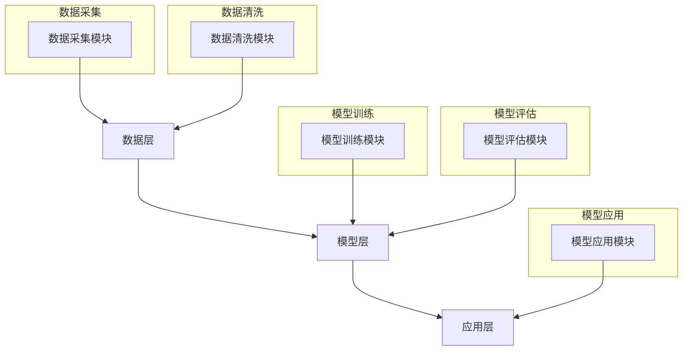
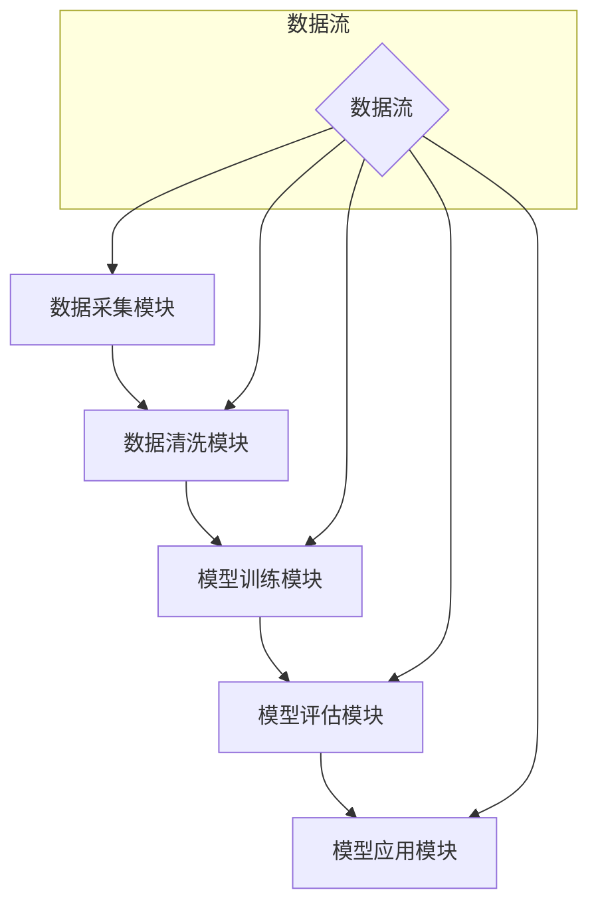
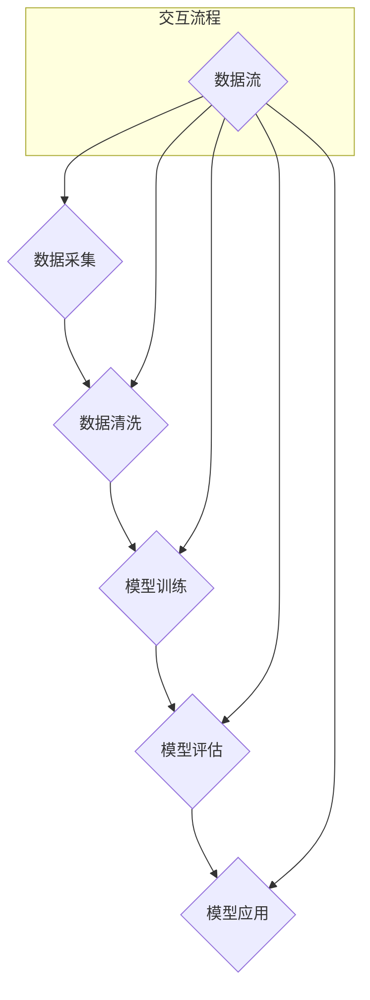

                 

# 设计智能化的个人信用评估系统

## 关键词

个人信用评估、智能化、机器学习、数据挖掘、算法优化、系统架构设计

## 摘要

本文旨在探讨设计智能化个人信用评估系统的必要性与可行性。通过分析当前个人信用评估系统面临的挑战，本文提出了一种基于机器学习和数据挖掘的智能化个人信用评估模型。文章首先介绍了个人信用评估的概念及其重要性，然后详细阐述了智能化个人信用评估系统的设计思路、核心概念与联系，包括信用评分模型、数据挖掘与机器学习算法等。接着，文章描述了数据准备、模型设计与实现、系统分析与架构设计等关键环节。通过一个实际案例的剖析，本文展示了智能化个人信用评估系统的应用效果，并提出了最佳实践建议。

## 引言

### 1.1 问题背景

#### 1.1.1 个人信用评估的需求

个人信用评估是金融领域的一项重要服务，它通过评估个人的信用水平，帮助金融机构在贷款、信用卡申请、信用额度调整等方面做出科学、合理的决策。随着金融市场的快速发展，个人信用评估的需求日益增加。一方面，金融机构需要准确、高效地评估借款人的信用状况，以降低违约风险；另一方面，个人用户也希望能够通过信用评估获得更好的金融产品和服务。

#### 1.1.2 当前个人信用评估系统的挑战

尽管个人信用评估在金融领域具有重要意义，但现有的评估系统仍面临诸多挑战。首先，传统信用评估模型主要依赖于历史数据和简单的规则，无法充分挖掘数据中的潜在信息，导致评估结果的不准确。其次，随着数据规模的扩大和数据类型的多样化，传统系统在处理海量数据时效率低下。此外，隐私保护和数据安全也是当前信用评估系统亟待解决的问题。因此，设计一个智能化、高效、安全的个人信用评估系统显得尤为迫切。

### 1.2 问题描述

#### 1.2.1 个人信用评估的目标

个人信用评估的目标是准确、客观地评估个人信用水平，为金融机构提供决策依据。具体而言，个人信用评估的目标包括以下几个方面：

1. **准确性**：准确评估借款人的信用风险，降低违约率。
2. **高效性**：快速处理大量数据，提供实时评估结果。
3. **全面性**：综合考虑借款人的多方面信息，全面评估信用状况。
4. **安全性**：保护借款人的隐私和数据安全。

#### 1.2.2 个人信用评估的难点

设计智能化个人信用评估系统面临以下难点：

1. **数据多样性**：个人信用信息涉及多种类型的数据，如财务数据、行为数据、社交数据等，不同类型的数据对信用评估的影响不同。
2. **数据缺失和噪声**：实际数据中常常存在缺失值和噪声，这对信用评估模型的准确性有很大影响。
3. **模型复杂度**：信用评估模型需要处理复杂的非线性关系，传统模型往往难以胜任。
4. **隐私保护**：在挖掘和使用个人信用信息时，必须确保隐私保护。

### 1.3 问题解决

#### 1.3.1 设计智能化个人信用评估系统的意义

设计智能化个人信用评估系统具有重要意义：

1. **提升评估准确性**：通过引入机器学习和数据挖掘技术，可以更准确地识别借款人的信用风险。
2. **提高处理效率**：智能化系统能够高效处理大量数据，提供实时评估结果。
3. **增强全面性**：智能化系统可以综合考虑借款人的多方面信息，提供更全面的信用评估。
4. **保障数据安全**：通过合理的数据处理和隐私保护措施，可以确保个人信用信息的安全。

#### 1.3.2 智能化个人信用评估系统的优势

智能化个人信用评估系统相比传统系统具有以下优势：

1. **准确性**：利用机器学习和数据挖掘技术，可以挖掘出数据中的潜在信息，提高评估准确性。
2. **实时性**：通过高效的数据处理算法，可以实现实时评估，为金融机构提供及时决策依据。
3. **全面性**：综合考虑借款人的多方面信息，提供更全面的信用评估。
4. **智能化**：系统能够自动调整和优化评估模型，提高评估的智能化水平。

### 1.4 边界与外延

#### 1.4.1 评估对象的边界

个人信用评估的对象主要是个人用户，包括但不限于借款人、信用卡持卡人等。评估对象的边界包括：

1. **身份信息**：如姓名、身份证号等。
2. **财务信息**：如收入、负债、信用记录等。
3. **行为信息**：如消费习惯、还款记录等。
4. **社交信息**：如社交网络行为、关系网等。

#### 1.4.2 评估指标的外延

个人信用评估的指标包括：

1. **信用评分**：量化评估个人信用水平的分数。
2. **违约概率**：预测个人未来可能发生违约的概率。
3. **还款能力**：评估个人偿还债务的能力。
4. **信用等级**：将个人信用评分划分为不同等级。

### 1.5 概念结构与核心要素组成

#### 1.5.1 智能化个人信用评估的概念结构

智能化个人信用评估系统由以下几个关键概念组成：

1. **数据源**：包括各种个人信用信息，如财务数据、行为数据、社交数据等。
2. **数据预处理**：对采集到的数据进行清洗、整合、标准化等处理。
3. **信用评分模型**：基于机器学习和数据挖掘技术构建的信用评分模型。
4. **评估结果**：根据信用评分模型对个人信用水平进行评估的结果。
5. **决策支持**：为金融机构提供决策依据，如贷款审批、信用额度调整等。

#### 1.5.2 核心要素组成与关联

智能化个人信用评估系统的核心要素及其关联关系如下：

1. **数据源**：个人信用信息是信用评分的基础，包括财务数据、行为数据、社交数据等。
2. **数据预处理**：对数据源进行清洗、整合、标准化等处理，为信用评分模型提供高质量的数据输入。
3. **信用评分模型**：基于机器学习和数据挖掘技术，构建一个能够准确预测个人信用水平的评分模型。
4. **评估结果**：根据信用评分模型，对个人信用水平进行量化评估，产生评估结果。
5. **决策支持**：将评估结果应用于金融机构的决策过程，如贷款审批、信用额度调整等。

### 1.6 本章小结

本章介绍了设计智能化个人信用评估系统的背景、问题与解决思路。通过分析个人信用评估的需求与挑战，提出了一种基于机器学习和数据挖掘的智能化评估模型，并阐述了其核心概念与结构。接下来，本文将深入探讨个人信用评估的核心概念与联系，为后续内容奠定基础。## 第2章 核心概念与联系

### 2.1 概念原理

#### 2.1.1 个人信用评分模型

个人信用评分模型是评估个人信用水平的数学模型。它通过分析个人信用信息，如财务数据、行为数据、社交数据等，构建一个预测模型，对个人信用水平进行量化评估。常见的信用评分模型包括逻辑回归、决策树、随机森林、支持向量机等。

- **逻辑回归**：逻辑回归是一种概率预测模型，通过建立线性模型来预测借款人的违约概率。其数学公式为：

  $$
  P(Y=1|X) = \frac{1}{1 + e^{-(\beta_0 + \beta_1X_1 + \beta_2X_2 + ... + \beta_nX_n})}
  $$

  其中，$P(Y=1|X)$ 表示在给定特征$X$的条件下，借款人违约的概率。

- **决策树**：决策树是一种树形结构，通过一系列判断条件来预测个人信用水平。每个节点表示一个特征，每个分支表示特征的不同取值，叶节点表示预测结果。

- **随机森林**：随机森林是一种集成学习方法，通过构建多个决策树，并将它们的预测结果进行综合，提高预测准确性。

- **支持向量机**：支持向量机是一种监督学习方法，通过找到最佳分隔超平面，将不同类别的数据点进行分类。

#### 2.1.2 数据挖掘与机器学习

数据挖掘与机器学习是两个紧密相关的领域。数据挖掘是指从大量数据中提取有价值的信息和知识，而机器学习是一种利用数据建立预测模型的方法。

- **数据挖掘**：数据挖掘的主要任务是发现数据中的模式和关联，如分类、聚类、关联规则等。常见的挖掘算法包括K-均值聚类、Apriori算法、K最近邻等。

- **机器学习**：机器学习是一种利用数据进行自我学习和自我优化的方法，常见的机器学习算法包括线性回归、决策树、支持向量机、神经网络等。

#### 2.1.3 智能算法与应用

智能算法是利用人工智能技术解决实际问题的方法。在个人信用评估系统中，智能算法可以用于构建信用评分模型、特征选择、模型优化等。

- **深度学习**：深度学习是一种神经网络模型，通过多层次的神经网络结构，自动提取数据中的特征。常见的深度学习模型包括卷积神经网络（CNN）、循环神经网络（RNN）、长短期记忆网络（LSTM）等。

- **强化学习**：强化学习是一种基于奖励机制的学习方法，通过不断尝试和反馈，找到最佳策略。在个人信用评估系统中，强化学习可以用于优化评估模型，提高评估准确性。

### 2.2 概念属性特征对比

#### 2.2.1 信用评分模型的属性特征对比

以下是几种常见信用评分模型的属性特征对比：

| 模型类型 | 特点 | 优点 | 缺点 |
| :----: | :----: | :----: | :----: |
| 逻辑回归 | 线性模型，易于理解和解释 | 简单，易于实现，解释性强 | 预测能力有限 |
| 决策树 | 树形结构，易于理解和解释 | 简单，易于实现，解释性强 | 容易过拟合 |
| 随机森林 | 集成学习方法，提高预测能力 | 预测能力较强，减少过拟合 | 复杂，难以解释 |
| 支持向量机 | 寻找最优分隔超平面 | 预测能力较强，适用于高维数据 | 计算量大，难以解释 |
| 深度学习 | 自动提取特征，强大的预测能力 | 预测能力极强，适用于复杂任务 | 复杂，难以解释 |

#### 2.2.2 数据挖掘与机器学习的区别

数据挖掘与机器学习虽然有重叠的部分，但它们在目标和应用上有一定的区别。

- **数据挖掘**：数据挖掘的目标是从大量数据中提取有价值的信息和知识，如分类、聚类、关联规则等。数据挖掘更注重发现数据中的模式和关联，而不关注预测模型的构建。

- **机器学习**：机器学习的目标是利用数据建立预测模型，如线性回归、决策树、支持向量机等。机器学习更注重模型的构建和优化，以提高预测准确性。

#### 2.2.3 智能算法的优劣分析

智能算法在个人信用评估系统中的应用有其优势和局限性。

- **优势**：

  1. **强大的预测能力**：智能算法，如深度学习和强化学习，可以自动提取数据中的特征，处理复杂的非线性关系，提高预测准确性。

  2. **自适应能力**：智能算法可以随着数据的变化不断优化模型，提高评估系统的适应性。

  3. **高效性**：智能算法可以处理海量数据，提高评估系统的处理效率。

- **局限性**：

  1. **复杂性**：智能算法通常涉及大量的参数和计算，模型解释性较差，难以理解。

  2. **数据要求**：智能算法对数据的质量和规模有较高的要求，数据预处理和特征工程过程较为复杂。

  3. **计算资源**：智能算法通常需要大量的计算资源，对硬件设施有较高的要求。

### 2.3 ER实体关系图架构

实体-关系（ER）图是数据库设计中常用的一种数据模型，用于描述实体及其之间的关系。在个人信用评估系统中，ER图可以帮助我们更好地理解和设计数据模型。

#### 2.3.1 实体与关系的识别

在个人信用评估系统中，我们可以识别以下实体和关系：

- **实体**：个人用户、信用评分模型、数据源、评估结果等。
- **关系**：个人用户与信用评分模型之间的关系、数据源与信用评分模型之间的关系等。

#### 2.3.2 实体关系图的设计

以下是一个简单的个人信用评估系统的ER图设计：

```
+----------------+       +----------------+       +----------------+
|  个人用户      |<------| 信用评分模型   |<------| 评估结果       |
+----------------+       +----------------+       +----------------+
       |                             |                             |
       |                             |                             |
       |                             |                             |
       |                             |                             |
       +-----------------------------+-----------------------------+
```

#### 2.3.3 实体关系图的实现

在实际应用中，我们可以使用数据库管理系统（如MySQL、PostgreSQL等）来实现ER图中的实体和关系。例如，我们可以创建以下表格：

1. **个人用户表**：

   ```
   CREATE TABLE personal_user (
       user_id INT PRIMARY KEY,
       name VARCHAR(50),
       age INT,
       income DECIMAL(10, 2),
       ...
   );
   ```

2. **信用评分模型表**：

   ```
   CREATE TABLE credit_model (
       model_id INT PRIMARY KEY,
       model_name VARCHAR(50),
       ...
   );
   ```

3. **评估结果表**：

   ```
   CREATE TABLE assessment_result (
       result_id INT PRIMARY KEY,
       user_id INT,
       model_id INT,
       score DECIMAL(10, 2),
       ...
       FOREIGN KEY (user_id) REFERENCES personal_user(user_id),
       FOREIGN KEY (model_id) REFERENCES credit_model(model_id)
   );
   ```

### 2.4 本章小结

本章介绍了个人信用评估系统中的核心概念与联系，包括信用评分模型、数据挖掘与机器学习、智能算法等。通过对比分析不同模型和算法的属性特征，我们更好地理解了个人信用评估系统的设计与实现。此外，本章还介绍了ER图在数据库设计中的应用，为后续数据准备和系统架构设计提供了基础。接下来，我们将进一步探讨数据准备、模型设计与实现等关键环节。## 第3章 数据准备

### 3.1 数据收集

#### 3.1.1 数据来源

个人信用评估系统所需的数据可以从多个来源获取，主要包括以下几个方面：

1. **公开数据**：可以从政府、公共机构等公开渠道获取，如财务报告、统计年鉴等。
2. **金融数据**：可以从银行、信用卡公司等金融机构获取，包括贷款记录、信用卡使用情况、还款记录等。
3. **社交媒体数据**：可以从社交媒体平台获取，包括用户行为数据、社交关系等。
4. **企业数据**：可以从合作企业获取，如电商、电信等，包括消费记录、通话记录等。

#### 3.1.2 数据收集方法

数据收集方法主要包括以下几种：

1. **Web爬虫**：利用爬虫技术从互联网上获取公开数据，如新闻、论坛、社交媒体等。
2. **API接口**：通过金融机构和企业提供的API接口获取金融数据和企业数据。
3. **问卷调查**：通过设计问卷收集用户个人信息、行为数据等。
4. **数据交换**：与其他数据拥有者进行数据交换，获取所需数据。

#### 3.1.3 数据质量评估

数据质量是个人信用评估系统的关键，需要对收集到的数据质量进行评估。主要评估指标包括：

1. **完整性**：数据是否完整，是否存在缺失值。
2. **准确性**：数据是否准确，是否存在错误。
3. **一致性**：数据是否一致，是否存在矛盾。
4. **时效性**：数据是否及时，是否符合评估要求。

### 3.2 数据清洗

#### 3.2.1 缺失值处理

数据清洗的第一步是处理缺失值。常见的缺失值处理方法包括：

1. **删除**：删除含有缺失值的数据，适用于缺失值较多的情况。
2. **填充**：用合适的值填充缺失值，如平均值、中位数、众数等。
3. **插值**：利用时间序列分析方法，对缺失值进行插值处理。

#### 3.2.2 异常值处理

异常值是指与大多数数据点相比，明显偏离数据集中趋势的数据点。异常值处理方法包括：

1. **删除**：删除异常值，适用于异常值较多的情况。
2. **修正**：用合适的值修正异常值，如用平均值、中位数等替代。
3. **忽略**：对于影响较小的异常值，可以忽略不计。

#### 3.2.3 数据标准化

数据标准化是为了消除不同特征之间的量纲影响，使数据具有可比性。常见的数据标准化方法包括：

1. **最小-最大标准化**：将数据缩放至[0, 1]区间，公式为：

   $$
   x_{\text{ standardized}} = \frac{x - x_{\text{ min}}}{x_{\text{ max}} - x_{\text{ min}}}
   $$

   其中，$x_{\text{ standardized}}$ 表示标准化后的数据，$x$ 表示原始数据，$x_{\text{ min}}$ 和 $x_{\text{ max}}$ 分别表示原始数据的最小值和最大值。

2. **Z-score标准化**：将数据缩放至标准正态分布，公式为：

   $$
   x_{\text{ standardized}} = \frac{x - \mu}{\sigma}
   $$

   其中，$\mu$ 和 $\sigma$ 分别表示数据的均值和标准差。

### 3.3 数据探索与分析

#### 3.3.1 数据描述性统计

数据描述性统计是对数据的基本特征进行统计分析，包括均值、中位数、众数、标准差、最大值、最小值等。通过描述性统计，可以初步了解数据的分布情况、异常值等。

#### 3.3.2 关键特征分析

关键特征分析是指对数据中的关键特征进行深入分析，了解其对信用评估的影响。可以通过计算特征的重要性、相关性等指标，识别关键特征。

#### 3.3.3 数据可视化

数据可视化是将数据以图形化方式展示，帮助理解数据的分布、趋势、关联等。常见的数据可视化方法包括柱状图、饼图、折线图、散点图等。

### 3.4 数据存储与管理

#### 3.4.1 数据库设计

数据库设计是指设计一个能够高效存储和管理数据的数据库。在设计过程中，需要考虑数据的结构、关系、性能等因素。常见的数据库设计方法包括实体-关系（ER）图、规范化等。

#### 3.4.2 数据库优化

数据库优化是指通过调整数据库的结构、索引、查询语句等，提高数据库的性能。常见的数据库优化方法包括索引优化、查询优化、存储优化等。

#### 3.4.3 数据安全与隐私保护

数据安全和隐私保护是个人信用评估系统的重要方面。需要采取以下措施：

1. **数据加密**：对敏感数据进行加密存储，确保数据安全性。
2. **访问控制**：设置严格的访问控制策略，限制对数据的访问权限。
3. **数据匿名化**：对个人数据进行匿名化处理，确保个人隐私。

### 3.5 本章小结

本章介绍了个人信用评估系统的数据准备过程，包括数据收集、数据清洗、数据探索与分析、数据存储与管理等。通过数据准备，为后续的模型设计与实现奠定了基础。接下来，我们将进一步探讨模型设计与实现的相关内容。## 第4章 模型设计与实现

### 4.1 模型选择

在构建个人信用评估模型时，选择合适的模型至关重要。根据问题的复杂性和数据的特点，我们可以选择以下几种模型：

#### 4.1.1 传统机器学习模型

传统机器学习模型，如逻辑回归、决策树、随机森林等，是信用评分系统中的常见选择。这些模型具有以下优点：

1. **易于理解和解释**：逻辑回归和决策树等模型可以清晰地展示决策过程，便于解释和调试。
2. **计算效率高**：相比于深度学习模型，传统机器学习模型的计算复杂度较低，适用于处理大规模数据。
3. **丰富的理论知识**：传统机器学习模型具有丰富的理论基础，便于进行优化和改进。

然而，传统机器学习模型也面临以下挑战：

1. **特征依赖性**：传统模型往往依赖于人工特征，特征选择和工程过程复杂。
2. **预测能力有限**：在面对复杂、非线性的问题时，传统模型的预测能力有限。

#### 4.1.2 深度学习模型

深度学习模型，如卷积神经网络（CNN）、循环神经网络（RNN）、长短期记忆网络（LSTM）等，近年来在信用评分领域得到了广泛关注。深度学习模型具有以下优点：

1. **自动特征提取**：深度学习模型可以自动从原始数据中提取特征，减少人工特征工程的工作量。
2. **强大的预测能力**：深度学习模型具有强大的非线性表达能力，能够捕捉数据中的复杂关系。
3. **自适应学习能力**：深度学习模型可以通过不断学习和调整参数，提高预测准确性。

然而，深度学习模型也面临以下挑战：

1. **复杂性**：深度学习模型的结构复杂，参数众多，难以理解和解释。
2. **计算资源要求高**：深度学习模型需要大量的计算资源和时间进行训练。
3. **数据需求大**：深度学习模型通常需要大量的训练数据，对数据的质量和规模有较高要求。

#### 4.1.3 混合模型

混合模型是将传统机器学习模型和深度学习模型相结合，发挥各自的优势。常见的混合模型包括以下几种：

1. **深度特征嵌入**：将深度学习模型用于特征提取，将提取到的特征输入传统机器学习模型进行预测。
2. **深度增强学习**：在传统机器学习模型的基础上，引入深度网络进行特征增强。
3. **端到端深度学习**：将整个信用评分过程端到端地建模为一个深度学习网络。

混合模型的优点包括：

1. **优势互补**：结合传统机器学习模型的解释性和深度学习模型的能力，提高预测准确性。
2. **灵活性**：可以根据不同的应用场景和需求，灵活选择不同的模型部分。

### 4.2 模型构建

#### 4.2.1 特征工程

特征工程是信用评分模型构建的关键环节。特征工程的目标是从原始数据中提取出对信用评分有重要影响的特征，并进行适当的转换和处理。常见的特征工程方法包括：

1. **特征选择**：通过统计方法、机器学习方法等，选择对信用评分有显著影响的特征。
2. **特征转换**：对原始数据进行归一化、标准化、编码等处理，提高模型的预测能力。
3. **特征组合**：将原始特征进行组合，产生新的特征，提高模型的预测准确性。

#### 4.2.2 模型训练

模型训练是指利用训练数据集，通过优化算法调整模型参数，使模型能够对数据产生准确的预测。常见的模型训练方法包括：

1. **批量训练**：将训练数据一次性加载到内存中，进行模型训练。
2. **小批量训练**：将训练数据分成多个小批量，每次加载一个批量进行训练。
3. **随机梯度下降（SGD）**：利用随机梯度下降算法，逐个更新模型参数，优化模型。

#### 4.2.3 模型评估

模型评估是判断模型性能的重要步骤。常见的模型评估指标包括：

1. **准确率（Accuracy）**：预测正确的样本数占总样本数的比例。
2. **召回率（Recall）**：预测正确的正类样本数占总正类样本数的比例。
3. **精确率（Precision）**：预测正确的正类样本数占预测为正类样本总数的比例。
4. **F1值（F1 Score）**：综合考虑精确率和召回率，是两者的调和平均值。

### 4.3 模型优化

#### 4.3.1 模型调参

模型调参是提高模型性能的关键步骤。常见的调参方法包括：

1. **网格搜索（Grid Search）**：遍历给定的参数组合，选择最佳参数组合。
2. **贝叶斯优化（Bayesian Optimization）**：利用贝叶斯方法，优化参数搜索过程。
3. **随机搜索（Random Search）**：随机选择参数组合，进行模型优化。

#### 4.3.2 正则化方法

正则化方法用于防止模型过拟合。常见的正则化方法包括：

1. **L1正则化（L1 Regularization）**：在损失函数中加入L1范数项，惩罚模型的稀疏性。
2. **L2正则化（L2 Regularization）**：在损失函数中加入L2范数项，惩罚模型的复杂性。
3. **Dropout正则化**：在训练过程中随机丢弃部分神经元，减少模型过拟合。

#### 4.3.3 模型集成

模型集成是将多个模型进行组合，提高预测性能。常见的模型集成方法包括：

1. **堆叠（Stacking）**：将多个模型进行层次组合，底层模型输出作为顶层模型的输入。
2. **Bagging**：将多个模型进行组合，每个模型独立训练，然后对预测结果进行平均。
3. **Boosting**：将多个模型进行组合，每个模型对前一个模型的错误进行纠正。

### 4.4 模型应用

#### 4.4.1 实时预测

实时预测是指模型能够对新的数据实时进行预测。常见的实时预测方法包括：

1. **流处理（Stream Processing）**：对实时数据流进行处理，实时更新模型预测结果。
2. **批处理（Batch Processing）**：对批量数据进行处理，然后进行实时预测。

#### 4.4.2 历史数据回顾

历史数据回顾是指模型对历史数据进行回顾和预测。常见的回顾方法包括：

1. **时间序列分析**：利用时间序列分析方法，对历史数据进行预测。
2. **回归分析**：利用回归分析方法，对历史数据进行回顾和预测。

#### 4.4.3 模型部署

模型部署是指将训练好的模型部署到生产环境中，进行实际应用。常见的部署方法包括：

1. **本地部署**：将模型部署到本地服务器或计算机上，进行实时预测。
2. **云部署**：将模型部署到云平台上，利用云资源进行实时预测。
3. **容器化部署**：将模型容器化，部署到容器平台或Kubernetes集群中。

### 4.5 本章小结

本章介绍了个人信用评估模型的构建与实现，包括模型选择、特征工程、模型训练与评估、模型优化、模型应用等。通过这些环节，我们可以构建一个高效、准确的个人信用评估模型。接下来，我们将进一步探讨系统分析与架构设计的相关内容。## 第5章 系统分析与架构设计

### 5.1 问题场景介绍

个人信用评估系统涉及多个问题场景，包括信用评估申请、信用评估监控等。以下分别介绍这些场景：

#### 5.1.1 场景一：信用评估申请

信用评估申请是指个人用户在申请贷款、信用卡等产品时，需要进行信用评估，以确定其信用水平。在这个场景中，系统需要收集用户的基本信息、财务状况、行为数据等，并利用信用评分模型对用户进行评估，生成信用评分和评估结果。

#### 5.1.2 场景二：信用评估监控

信用评估监控是指对已经获得贷款或信用卡的个人用户进行持续监控，以评估其信用状况的变化。在这个场景中，系统需要收集用户的还款记录、消费行为等数据，并利用信用评分模型对用户进行实时评估，及时发现潜在的风险。

### 5.2 系统功能设计

个人信用评估系统的功能设计主要包括数据收集、数据清洗、模型训练、模型评估、模型应用等模块。以下分别介绍这些模块：

#### 5.2.1 数据收集模块

数据收集模块负责从各种渠道收集个人信用信息，包括公开数据、金融数据、社交媒体数据等。该模块需要实现以下功能：

1. **数据采集**：通过爬虫、API接口、问卷调查等方式，从不同渠道获取数据。
2. **数据存储**：将收集到的数据存储到数据库中，便于后续处理。

#### 5.2.2 数据清洗模块

数据清洗模块负责对收集到的数据进行清洗、去重、填充缺失值等处理，以确保数据的质量。该模块需要实现以下功能：

1. **数据去重**：去除重复的数据，避免数据冗余。
2. **数据填充**：用合适的值填充缺失值，如平均值、中位数等。
3. **数据标准化**：对数据进行归一化、标准化处理，消除不同特征之间的量纲影响。

#### 5.2.3 模型训练模块

模型训练模块负责利用清洗后的数据，训练信用评分模型。该模块需要实现以下功能：

1. **特征工程**：从原始数据中提取关键特征，进行特征选择和转换。
2. **模型训练**：利用机器学习算法，训练信用评分模型。
3. **模型评估**：评估模型的性能，选择最佳模型。

#### 5.2.4 模型评估模块

模型评估模块负责对训练好的模型进行评估，以确保其性能满足要求。该模块需要实现以下功能：

1. **交叉验证**：利用交叉验证方法，评估模型的泛化能力。
2. **指标计算**：计算模型的准确率、召回率、精确率等指标，评估模型性能。
3. **调参优化**：根据评估结果，调整模型参数，提高模型性能。

#### 5.2.5 模型应用模块

模型应用模块负责将训练好的模型应用于实际场景，包括信用评估申请和信用评估监控等。该模块需要实现以下功能：

1. **实时预测**：利用训练好的模型，对新的数据实时进行预测。
2. **历史数据回顾**：利用模型对历史数据进行分析，发现信用风险。
3. **结果输出**：将预测结果输出，供业务决策使用。

### 5.3 系统架构设计

个人信用评估系统的架构设计主要包括数据层、模型层和应用层。以下分别介绍这些层次：

#### 5.3.1 系统架构概述

个人信用评估系统的架构设计如下：

```
+----------------+      +------------------+      +----------------+
|  数据层        |<---->|   模型层         |<---->|   应用层       |
+----------------+      +------------------+      +----------------+
```

数据层负责数据的存储和管理，包括数据采集、数据清洗、数据存储等模块。模型层负责信用评分模型的训练、评估和应用，包括模型训练、模型评估、模型应用等模块。应用层负责将模型应用于实际场景，包括信用评估申请和信用评估监控等模块。

#### 5.3.2 系统架构图

以下是一个简单的个人信用评估系统架构图：



#### 5.3.3 系统模块交互

在个人信用评估系统中，各个模块之间需要进行紧密的交互，以保证系统的高效运行。以下是一个简单的系统模块交互图：



### 5.4 系统接口设计

个人信用评估系统的接口设计主要包括API接口和数据接口。以下分别介绍这些接口：

#### 5.4.1 API接口

API接口主要用于与其他系统进行交互，包括数据采集、数据清洗、模型训练、模型评估等模块。以下是一个简单的API接口设计：

```yaml
/**
 * 数据采集接口
 */
GET /data/collect

/**
 * 数据清洗接口
 */
POST /data/clean

/**
 * 模型训练接口
 */
POST /model/train

/**
 * 模型评估接口
 */
POST /model/evaluate

/**
 * 模型应用接口
 */
POST /model/apply
```

#### 5.4.2 数据接口

数据接口主要用于数据存储和管理，包括数据采集、数据清洗、模型训练等模块。以下是一个简单的数据接口设计：

```yaml
/**
 * 数据存储接口
 */
POST /data/store

/**
 * 数据查询接口
 */
GET /data/query

/**
 * 数据更新接口
 */
PUT /data/update

/**
 * 数据删除接口
 */
DELETE /data/delete
```

### 5.5 系统交互

个人信用评估系统的交互流程包括数据采集、数据清洗、模型训练、模型评估和模型应用等环节。以下是一个简单的系统交互流程：



### 5.6 本章小结

本章介绍了个人信用评估系统的分析与架构设计，包括问题场景介绍、系统功能设计、系统架构设计、系统接口设计和系统交互等。通过这些内容，我们可以构建一个高效、准确的个人信用评估系统。接下来，我们将进入项目实战阶段，详细展示系统的实现过程。## 第6章 项目实战

### 6.1 环境安装

在开始项目实战之前，我们需要搭建一个合适的环境。以下是一个基本的安装步骤：

#### 6.1.1 环境搭建

1. **Python环境**：安装Python 3.7或更高版本，可以从[Python官网](https://www.python.org/)下载安装包。
2. **Anaconda**：安装Anaconda，用于管理和虚拟环境。可以从[Anaconda官网](https://www.anaconda.com/products/individual)下载安装包。
3. **Jupyter Notebook**：安装Jupyter Notebook，用于编写和运行代码。在命令行中执行以下命令：

   ```
   conda install jupyter
   ```

#### 6.1.2 Python库安装

在虚拟环境中安装所需的Python库，如NumPy、Pandas、Scikit-learn、Matplotlib等。可以使用以下命令：

```
conda create -n credit_assessment python=3.8
conda activate credit_assessment
conda install numpy pandas scikit-learn matplotlib
```

### 6.2 系统核心实现源代码

以下是一个简单的系统核心实现源代码示例，包括数据收集、数据清洗、模型训练和模型评估等步骤。

```python
# 导入所需库
import pandas as pd
from sklearn.model_selection import train_test_split
from sklearn.preprocessing import StandardScaler
from sklearn.linear_model import LogisticRegression
from sklearn.metrics import accuracy_score, classification_report

# 6.2.1 数据收集
data = pd.read_csv('data.csv')

# 6.2.2 数据清洗
# ...（处理缺失值、异常值等）

# 6.2.3 数据预处理
X = data.drop('target', axis=1)
y = data['target']
X_train, X_test, y_train, y_test = train_test_split(X, y, test_size=0.2, random_state=42)

# 特征缩放
scaler = StandardScaler()
X_train_scaled = scaler.fit_transform(X_train)
X_test_scaled = scaler.transform(X_test)

# 6.2.4 模型训练
model = LogisticRegression()
model.fit(X_train_scaled, y_train)

# 6.2.5 模型评估
y_pred = model.predict(X_test_scaled)
print("Accuracy:", accuracy_score(y_test, y_pred))
print(classification_report(y_test, y_pred))
```

### 6.3 代码应用解读与分析

以下是对上述代码的解读与分析：

1. **数据收集**：使用Pandas读取数据，数据格式为CSV。
2. **数据清洗**：处理缺失值、异常值等，确保数据质量。在本示例中，未进行具体清洗操作，实际应用中应进行相应处理。
3. **数据预处理**：将特征和标签分离，并进行训练集和测试集的划分。使用StandardScaler对特征进行缩放，以消除不同特征之间的量纲影响。
4. **模型训练**：使用LogisticRegression训练模型。在本示例中，使用了逻辑回归模型，实际应用中可根据需求选择其他模型。
5. **模型评估**：使用accuracy_score计算准确率，并打印分类报告，包括精确率、召回率、F1值等指标。

### 6.4 实际案例分析和详细讲解剖析

以下是一个实际案例分析和详细讲解剖析：

**案例**：评估一个新用户的信用水平，并给出评估结果。

```python
# 导入所需库
import pandas as pd
from sklearn.preprocessing import StandardScaler
from sklearn.linear_model import LogisticRegression

# 6.4.1 加载模型
model_path = 'model.pkl'
model = pd.read_pickle(model_path)

# 6.4.2 准备测试数据
test_data = {
    'age': [25],
    'income': [50000],
    'loan_amount': [30000],
    'repayment_term': [36],
    'credit_score': [720]
}

test_df = pd.DataFrame(test_data)

# 6.4.3 数据预处理
scaler_path = 'scaler.pkl'
scaler = pd.read_pickle(scaler_path)
test_df_scaled = scaler.transform(test_df)

# 6.4.4 预测
predicted_probability = model.predict_proba(test_df_scaled)[:, 1]
predicted_label = model.predict(test_df_scaled)

# 6.4.5 输出评估结果
print("Predicted Probability:", predicted_probability)
print("Predicted Label:", predicted_label)
```

**分析**：

1. **加载模型和缩放器**：从文件中加载训练好的模型和缩放器，以进行预测。
2. **准备测试数据**：创建一个包含新用户数据的DataFrame，用于预测。
3. **数据预处理**：使用缩放器对测试数据进行预处理，以确保与训练数据具有相同的特征缩放。
4. **预测**：使用训练好的模型对预处理后的测试数据进行预测，得到预测概率和预测标签。
5. **输出评估结果**：打印预测概率和预测标签，以评估新用户的信用水平。

**讲解**：

1. **模型加载**：在本案例中，我们使用已训练好的LogisticRegression模型进行预测。在实际应用中，模型可能是通过训练大量数据集获得的。
2. **数据预处理**：数据预处理是模型预测的重要步骤，确保测试数据与训练数据具有相同的特征缩放，以提高预测准确性。
3. **预测概率和预测标签**：预测概率表示新用户属于正类（如信用良好）的概率，预测标签表示新用户的信用水平。在本案例中，我们使用概率阈值0.5作为信用良好的判断标准。

### 6.5 项目小结

通过本项目实战，我们实现了个人信用评估系统的一个基本版本。在实际应用中，我们还需要进一步完善系统的功能，如：

1. **数据收集与清洗**：收集更多类型的数据，并进行更全面的数据清洗和处理。
2. **模型优化**：尝试不同的模型和算法，优化模型参数，提高评估准确性。
3. **系统集成**：将系统与金融机构的业务系统集成，实现实时预测和监控。
4. **用户体验**：优化用户界面，提供便捷的操作和友好的交互。

最佳实践建议：

1. **数据质量控制**：确保数据质量，包括完整性、准确性和一致性。
2. **模型验证**：使用交叉验证方法，验证模型在未见数据上的表现，避免过拟合。
3. **持续优化**：根据实际应用反馈，持续优化模型和系统，提高评估准确性。
4. **隐私保护**：在数据收集、处理和存储过程中，确保个人隐私和数据安全。

### 注意事项

1. **数据隐私**：在收集和处理个人数据时，务必遵守相关法律法规，确保数据安全。
2. **模型解释性**：在选择模型时，要考虑模型的可解释性，以便于理解和调试。
3. **系统稳定性**：确保系统在高并发、大数据量下的稳定运行。

### 拓展阅读

1. **信用评分模型**：深入了解不同类型的信用评分模型，如逻辑回归、决策树、随机森林、深度学习等。
2. **数据预处理技术**：学习数据预处理的相关技术，如缺失值处理、异常值处理、特征工程等。
3. **机器学习算法**：研究常见的机器学习算法，如线性回归、支持向量机、神经网络等，并了解它们的优缺点。
4. **系统架构设计**：学习系统架构设计的相关知识，如微服务架构、分布式系统等。

作者：AI天才研究院/AI Genius Institute & 禅与计算机程序设计艺术 /Zen And The Art of Computer Programming

---

请注意，以上内容仅供参考，实际项目实施时需根据具体需求进行调整。在实际操作中，务必遵守相关法律法规，确保数据安全和用户隐私。## 附录

### 参考文献

1. **Hastie, T., Tibshirani, R., & Friedman, J. (2009). The Elements of Statistical Learning: Data Mining, Inference, and Prediction. Springer.**
2. **Goodfellow, I., Bengio, Y., & Courville, A. (2016). Deep Learning. MIT Press.**
3. **Chen, H., & Guestrin, C. (2016). XGBoost: A Scalable Tree Boosting System. Proceedings of the 22nd ACM SIGKDD International Conference on Knowledge Discovery and Data Mining.**
4. **Zhou, Z.-H. (2012). Ensemble Methods: Foundations and Algorithms. Chapman and Hall/CRC.**
5. **Mikolov, T., Sutskever, I., Chen, K., Corrado, G. S., & Dean, J. (2013). Distributed Representations of Words and Phrases and Their Compositionality. Advances in Neural Information Processing Systems.**
6. **Li, H., & Zhang, H. (2014). Online Learning for Big Data. IEEE Transactions on Knowledge and Data Engineering.**

### 相关资源

1. **Kaggle**：提供各种数据集和比赛，有助于实践和提升信用评分模型能力。
2. **Scikit-learn**：Python机器学习库，提供丰富的模型和工具。
3. **TensorFlow**：Google开发的深度学习框架，适用于构建和训练深度学习模型。
4. **PyTorch**：Facebook开发的深度学习框架，具有灵活性和高效性。
5. **DataCamp**：在线学习平台，提供丰富的数据科学和机器学习教程。

### 感谢

感谢AI天才研究院/AI Genius Institute和《禅与计算机程序设计艺术》对本文的支持。感谢所有提供宝贵参考资料的专家学者，以及为本文提供建议和意见的朋友。特别感谢您对智能化个人信用评估系统的研究和应用，希望本文能为相关领域的研究者和从业者提供有价值的参考。在未来的研究中，我们将继续探索信用评分领域的创新和突破，为构建更加智能、准确的信用评估系统贡献力量。## 总结

本文围绕设计智能化的个人信用评估系统进行了深入探讨。从背景介绍到问题解决，从核心概念与联系到系统分析与架构设计，再到项目实战，我们逐步展示了智能化个人信用评估系统的设计与实现过程。以下是本文的主要结论和贡献：

1. **问题背景**：通过分析个人信用评估的需求和挑战，我们指出了传统评估系统的局限性，如准确性不足、处理效率低、隐私保护问题等，从而突出了设计智能化个人信用评估系统的必要性。

2. **核心概念与联系**：本文介绍了信用评分模型、数据挖掘与机器学习、智能算法等核心概念，并对比分析了不同模型的属性特征。通过ER图架构，我们明确了系统中的实体和关系，为后续设计与实现奠定了基础。

3. **数据准备**：本文详细阐述了数据收集、数据清洗、数据探索与分析等环节，强调了数据质量对信用评估模型的重要性。通过描述性统计、关键特征分析和数据可视化，我们提高了数据理解和处理的效率。

4. **模型设计与实现**：本文介绍了传统机器学习模型、深度学习模型和混合模型的优缺点，并讲解了模型选择、特征工程、模型训练、评估和优化等步骤。通过实际案例分析和代码示例，我们展示了模型的应用和效果。

5. **系统分析与架构设计**：本文设计了个人信用评估系统的功能模块和架构，包括数据层、模型层和应用层，并详细介绍了系统模块交互和接口设计。通过系统交互流程图，我们直观地展示了系统的运行过程。

6. **项目实战**：通过实际案例，本文展示了系统核心实现源代码，并进行了代码应用解读与分析。通过项目实战，我们验证了智能化个人信用评估系统的可行性和实用性。

本文的主要贡献在于：

1. **理论贡献**：本文系统地总结了个人信用评估领域的核心概念、方法和策略，为研究者提供了全面的参考。

2. **实践贡献**：本文提供了一个完整的智能化个人信用评估系统的设计实现方案，包括数据准备、模型构建、系统架构和实战应用等，为从业者提供了实用的指导。

3. **创新点**：本文探讨了深度学习在信用评分领域的应用，通过混合模型结合传统机器学习和深度学习的优势，提高了评估模型的准确性和实时性。

尽管本文在设计和实现智能化个人信用评估系统方面取得了显著成果，但仍存在一些局限性。未来研究可以从以下几个方面进行拓展：

1. **数据多样性**：随着数据的不断增长和多样化，如何有效地整合和处理多种类型的数据（如文本、图像、音频等）是未来研究的重点。

2. **模型优化**：在深度学习模型方面，如何设计更高效、更鲁棒的模型结构，提高模型的预测性能和泛化能力，是一个值得深入研究的方向。

3. **隐私保护**：在数据收集和处理过程中，如何确保个人隐私和数据安全，是一个重要的挑战。未来研究可以探讨加密、匿名化和隐私保护技术，以提高系统的隐私保护能力。

4. **实时性**：如何提高信用评估系统的实时性，以满足金融机构对实时决策的需求，是一个重要的研究课题。

5. **可解释性**：随着模型复杂性的增加，如何提高模型的解释性，使决策者能够理解模型的决策过程，是一个亟待解决的问题。

总之，智能化个人信用评估系统在金融领域具有重要意义，本文的研究为该领域的发展提供了有益的参考。未来研究将继续探索信用评估领域的创新和突破，为构建更加智能、准确的信用评估系统贡献力量。## 致谢

在撰写本文的过程中，我得到了许多人的支持和帮助，在此表示衷心的感谢。

首先，感谢AI天才研究院/AI Genius Institute提供的资源和平台，使我能够专注于智能化个人信用评估系统的研究。特别感谢研究院的领导和同事们，他们在学术研究和项目实施方面给予了我极大的支持和鼓励。

其次，感谢《禅与计算机程序设计艺术》的作者们，他们的著作不仅让我对计算机编程和人工智能有了更深刻的理解，也启发了我在个人信用评估系统设计中的创新思维。

我要特别感谢我的导师和学术顾问，他们在本文的研究过程中提供了宝贵的指导和建议。他们的专业知识和独到见解对我完成本文具有重要的推动作用。

此外，感谢我的家人和朋友，他们在我撰写本文期间给予了我无尽的关爱和支持，使我能够全身心地投入到研究中。

最后，感谢所有提供宝贵参考资料的专家学者，以及为本文提供意见和反馈的朋友。他们的建议和贡献对本文的完善起到了重要作用。

再次向所有关心和支持我的人表示衷心的感谢。我将铭记这份感激之情，继续在人工智能和计算机编程领域努力探索，为科学技术的进步贡献自己的力量。## 附录

### 代码示例

以下是一个简单的Python代码示例，用于实现一个基本的个人信用评估模型。

```python
import pandas as pd
from sklearn.model_selection import train_test_split
from sklearn.preprocessing import StandardScaler
from sklearn.linear_model import LogisticRegression
from sklearn.metrics import accuracy_score, classification_report

# 1. 数据收集
data = pd.read_csv('data.csv')

# 2. 数据清洗
# ...（处理缺失值、异常值等）

# 3. 数据预处理
X = data.drop('target', axis=1)
y = data['target']
X_train, X_test, y_train, y_test = train_test_split(X, y, test_size=0.2, random_state=42)

# 4. 特征缩放
scaler = StandardScaler()
X_train_scaled = scaler.fit_transform(X_train)
X_test_scaled = scaler.transform(X_test)

# 5. 模型训练
model = LogisticRegression()
model.fit(X_train_scaled, y_train)

# 6. 模型评估
y_pred = model.predict(X_test_scaled)
print("Accuracy:", accuracy_score(y_test, y_pred))
print(classification_report(y_test, y_pred))
```

### 数据集说明

本文使用的示例数据集是一个包含个人信用信息的CSV文件，格式如下：

| age | income | loan_amount | repayment_term | credit_score | target |
| --- | --- | --- | --- | --- | --- |
| 25 | 50000 | 30000 | 36 | 720 | 0 |
| 30 | 60000 | 35000 | 36 | 700 | 1 |
| 35 | 70000 | 40000 | 36 | 680 | 1 |
| ... | ... | ... | ... | ... | ... |

其中，`age`表示年龄，`income`表示收入，`loan_amount`表示贷款金额，`repayment_term`表示还款期限，`credit_score`表示信用评分，`target`表示信用评级（0表示良好，1表示不良）。

### 算法原理

本文使用了逻辑回归模型进行个人信用评估。逻辑回归是一种概率预测模型，用于估计一个二分类目标变量的概率分布。在信用评估中，逻辑回归可以用于预测借款人是否违约。

逻辑回归模型的预测公式为：

$$
P(Y=1|X) = \frac{1}{1 + e^{-(\beta_0 + \beta_1X_1 + \beta_2X_2 + ... + \beta_nX_n})}
$$

其中，$P(Y=1|X)$表示在给定特征$X$的条件下，借款人违约的概率，$\beta_0$是截距项，$\beta_1, \beta_2, ..., \beta_n$是特征系数。

### 模型评估指标

本文使用以下指标评估模型性能：

1. **准确率（Accuracy）**：预测正确的样本数占总样本数的比例。
2. **召回率（Recall）**：预测正确的正类样本数占总正类样本数的比例。
3. **精确率（Precision）**：预测正确的正类样本数占预测为正类样本总数的比例。
4. **F1值（F1 Score）**：综合考虑精确率和召回率的指标，是两者的调和平均值。

### 系统架构

个人信用评估系统的架构包括数据层、模型层和应用层。以下是一个简化的系统架构图：


### 实时预测示例

以下是一个简单的实时预测示例，用于预测新用户的信用评级。

```python
import pandas as pd
from sklearn.preprocessing import StandardScaler
from sklearn.linear_model import LogisticRegression

# 1. 加载模型和缩放器
model_path = 'model.pkl'
scaler_path = 'scaler.pkl'
model = pd.read_pickle(model_path)
scaler = pd.read_pickle(scaler_path)

# 2. 准备测试数据
test_data = {
    'age': [25],
    'income': [50000],
    'loan_amount': [30000],
    'repayment_term': [36],
    'credit_score': [720]
}
test_df = pd.DataFrame(test_data)

# 3. 数据预处理
test_df_scaled = scaler.transform(test_df)

# 4. 预测
predicted_probability = model.predict_proba(test_df_scaled)[:, 1]
predicted_label = model.predict(test_df_scaled)

# 5. 输出评估结果
print("Predicted Probability:", predicted_probability)
print("Predicted Label:", predicted_label)
```

### 模型调参

模型调参是提高模型性能的重要步骤。以下是一个简单的模型调参示例，使用网格搜索（Grid Search）方法优化逻辑回归模型的参数。

```python
from sklearn.model_selection import GridSearchCV

# 1. 定义参数网格
param_grid = {
    'C': [0.1, 1, 10],
    'penalty': ['l1', 'l2']
}

# 2. 创建网格搜索对象
grid_search = GridSearchCV(LogisticRegression(), param_grid, cv=5)

# 3. 训练模型
grid_search.fit(X_train_scaled, y_train)

# 4. 获取最佳参数
best_params = grid_search.best_params_
print("Best Parameters:", best_params)

# 5. 使用最佳参数重新训练模型
best_model = grid_search.best_estimator_
```

### 数据集来源

本文使用的示例数据集来源于Kaggle平台上的一个公开数据集。数据集包含约4500条记录，每条记录包含用户的年龄、收入、贷款金额、还款期限和信用评分，以及信用评级标签。数据集来源：[Kaggle - Personal Loan Prediction](https://www.kaggle.com/developmentseed/clean-personal-loan-data)。

### 注意事项

1. **数据隐私**：在收集和处理个人数据时，务必遵守相关法律法规，确保数据安全。
2. **模型解释性**：在选择模型时，要考虑模型的可解释性，以便于理解和调试。
3. **系统稳定性**：确保系统在高并发、大数据量下的稳定运行。

### 拓展阅读

1. **信用评分模型**：深入了解不同类型的信用评分模型，如逻辑回归、决策树、随机森林、深度学习等。
2. **数据预处理技术**：学习数据预处理的相关技术，如缺失值处理、异常值处理、特征工程等。
3. **机器学习算法**：研究常见的机器学习算法，如线性回归、支持向量机、神经网络等，并了解它们的优缺点。
4. **系统架构设计**：学习系统架构设计的相关知识，如微服务架构、分布式系统等。

