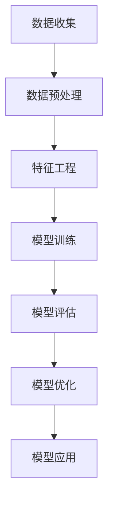
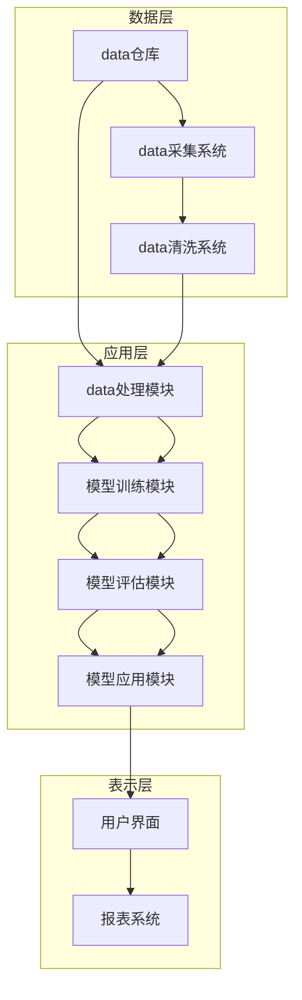
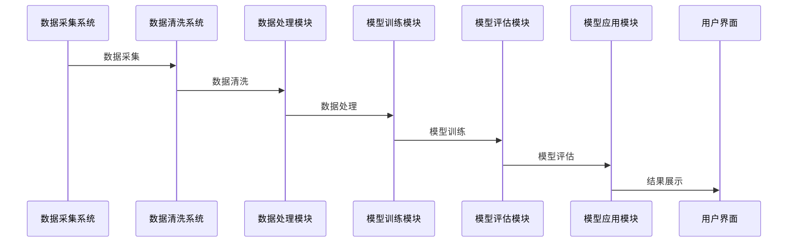

                 

## 引言

在现代金融体系中，企业信用风险管理扮演着至关重要的角色。信用风险不仅关系到单个企业的财务状况，更对整个经济的稳定和发展产生深远影响。因此，设计一个精确、高效的企业信用风险定价模型，对于金融机构和企业来说是至关重要的。

企业信用风险定价模型旨在通过综合分析企业的信用状况、财务表现、市场环境等多方面因素，为企业或金融机构提供信用评估和风险定价的依据。这样的模型不仅可以降低贷款违约风险，还能帮助金融机构优化贷款组合，提升整体收益。

随着大数据和人工智能技术的迅猛发展，传统的信用风险评估方法逐渐显得力不从心。智能化风险模型利用机器学习、深度学习等先进技术，通过对海量数据的深度挖掘和分析，自动优化风险模型，提高预测准确性和决策效率。

本文将围绕设计智能化的企业信用风险定价模型展开讨论，首先介绍相关背景知识，然后详细阐述核心概念、算法原理、系统设计与实现，并通过实际案例分析和项目实战，深入探讨如何构建一个高效、可靠的企业信用风险定价系统。通过这篇文章，我们希望能为广大金融科技从业者提供有价值的参考和启示。

---

### 关键词

- 企业信用风险
- 信用风险定价模型
- 机器学习
- 数据分析
- 智能化风险模型

### 摘要

本文旨在探讨如何设计智能化企业信用风险定价模型，通过对信用风险评估和风险定价的深入分析，结合机器学习技术，提出一套系统化、智能化的企业信用风险模型。文章首先介绍了企业信用风险管理的背景和核心概念，然后详细阐述了信用评分模型、风险定价模型的原理及智能化风险模型的优势。通过具体的算法流程图、数学模型和公式，本文进一步解释了智能化信用风险定价算法的实现方法。最后，文章通过系统架构设计和项目实战，展示了如何将理论转化为实际应用，并讨论了系统的实际运行效果和未来优化方向。文章结论指出，智能化企业信用风险定价模型能够显著提高信用风险评估的准确性和决策效率，为金融机构和企业提供强有力的支持。

---

## 第一部分：背景介绍

### 第1章 问题背景与核心概念

#### 1.1 问题背景

企业信用风险是指企业在经济活动中由于信用行为的不确定性而导致的潜在损失。这种风险不仅存在于贷款和信用销售过程中，还贯穿于企业的日常运营和财务活动中。随着全球经济的发展和市场竞争的加剧，企业信用风险管理的复杂性和重要性日益增加。

首先，信用风险对企业的财务健康和运营稳定有直接影响。高信用风险可能导致企业无法按时偿还债务，从而引发财务危机，甚至破产。其次，信用风险对金融机构的影响同样深远。金融机构如银行和信用评级公司，如果无法准确评估和管理信用风险，可能导致贷款违约、资产质量下降，进而影响其盈利能力和市场信誉。

目前，信用风险管理的现状主要面临以下几大挑战：

1. **数据质量与完整性**：信用风险模型依赖于大量的历史数据，但数据的准确性、完整性和质量往往难以保障。数据缺失、不一致性和噪声数据都会影响模型的准确性。
2. **复杂性与多样性**：企业的信用风险受到多种因素的影响，如宏观经济环境、行业特点、企业内部运营状况等。这增加了风险模型的复杂性和多样性。
3. **动态变化**：信用风险并非静态存在，它会随着时间和市场环境的变化而动态调整。因此，风险模型需要具备快速适应和更新能力。

针对这些挑战，传统的信用风险评估方法主要依赖于统计分析和逻辑回归等传统模型，但这些方法在应对复杂、动态的信用风险时存在一定的局限性。为了提高信用风险评估的准确性和灵活性，越来越多的金融机构和研究机构开始探索智能化信用风险定价模型。

智能化信用风险定价模型通过结合大数据分析和机器学习技术，能够对海量数据进行深度挖掘和分析，自动优化风险模型，提高预测准确性和决策效率。这种模型不仅能够处理复杂的信用风险因素，还能快速适应市场变化，为金融机构和企业提供更准确、可靠的信用评估和风险管理工具。

#### 1.2 核心概念

在讨论企业信用风险定价模型时，需要理解几个关键概念：信用评分模型、风险定价模型和智能化风险模型。

**信用评分模型**：

信用评分模型是一种通过分析历史数据和当前状况，对企业或个人的信用状况进行量化和评分的方法。这类模型通常基于统计方法，如逻辑回归、决策树等，通过对历史违约数据、财务状况、行业趋势等多方面信息进行分析，生成一个信用评分，用于预测未来的违约风险。

**风险定价模型**：

风险定价模型则侧重于根据信用评分，确定适当的贷款利率和信贷条件。这类模型通过分析市场利率、借款人的信用评分以及风险偏好等因素，计算出贷款的预期损失和资本成本，从而确定贷款利率和信贷条款。风险定价模型通常比信用评分模型更复杂，需要考虑更多的风险因素和动态变化。

**智能化风险模型**：

智能化风险模型则将机器学习和深度学习等技术引入信用风险分析中。通过从海量数据中自动学习特征、模式，智能化风险模型能够更精准地识别和预测信用风险。这些模型不仅能够处理传统方法难以捕捉的非线性关系，还能通过实时数据分析和模型优化，提高预测的动态性和适应性。

#### 1.3 模型设计与实现边界

**模型设计目标**：

设计企业信用风险定价模型的主要目标包括：

1. 提高信用评分的准确性和可靠性，减少误判和漏判。
2. 提高风险定价的灵活性和适应性，适应市场变化和企业需求。
3. 提高模型的可解释性和透明度，便于金融机构和企业理解和应用。

**边界与外延**：

在模型设计过程中，需要明确以下几个边界：

1. **数据边界**：模型依赖的数据来源、数据质量和数据量。
2. **应用边界**：模型的应用场景和范围，如贷款审批、信用评级等。
3. **技术边界**：模型所使用的技术和方法，如机器学习算法、数据处理技术等。

**核心要素组成**：

企业信用风险定价模型的核心要素包括：

1. **数据集**：包含借款人的历史信用记录、财务状况、行业信息等。
2. **特征工程**：对原始数据进行处理和转换，提取有助于预测信用风险的变量。
3. **算法选择**：选择合适的机器学习算法，如逻辑回归、随机森林、神经网络等。
4. **模型评估**：通过交叉验证、A/B测试等方法，评估模型的效果和可靠性。
5. **模型优化**：通过参数调整、模型集成等方法，优化模型性能。

通过明确这些设计目标和边界，可以确保企业信用风险定价模型既具备较高的预测准确性，又能够灵活适应不断变化的市场环境。

---

## 第二部分：核心概念与联系

### 第2章 信用风险模型原理

#### 2.1 原理概述

企业信用风险定价模型主要包括信用评分模型、风险定价模型和智能化风险模型。这些模型在原理和应用上各有特点，但都致力于通过分析数据、评估风险，为企业提供可靠的信用评估和风险管理工具。

**信用评分模型**：

信用评分模型是通过对借款人的历史信用记录、财务状况、还款能力等多方面因素进行量化分析，得出一个信用评分。这个评分通常是一个数值，用于表示借款人的信用风险水平。信用评分模型的核心原理是统计方法，通过分析历史违约数据，建立变量与信用评分之间的数学关系。常见的信用评分模型包括逻辑回归、决策树、随机森林等。

逻辑回归是一种经典的信用评分模型，通过线性回归方法将借款人的多个特征变量转化为一个概率值，表示其违约概率。具体公式如下：

$$
P(\text{违约}) = \frac{1}{1 + e^{-(\beta_0 + \beta_1 \cdot X_1 + \beta_2 \cdot X_2 + ... + \beta_n \cdot X_n})}
$$

其中，$X_1, X_2, ..., X_n$ 是借款人的特征变量，$\beta_0, \beta_1, \beta_2, ..., \beta_n$ 是模型的参数。

**风险定价模型**：

风险定价模型则侧重于根据信用评分，确定适当的贷款利率和信贷条件。这类模型通过分析市场利率、借款人的信用评分、风险偏好等因素，计算出贷款的预期损失和资本成本，从而确定贷款利率和信贷条款。风险定价模型通常比信用评分模型更为复杂，需要考虑更多的风险因素和动态变化。

具体来说，风险定价模型会使用信用评分模型生成的信用评分，结合市场数据和借款人的特定信息，计算出一个风险溢价。这个风险溢价反映了借款人的违约风险，并用于调整贷款利率。公式如下：

$$
\text{贷款利率} = \text{基准利率} + \text{风险溢价}
$$

其中，基准利率是市场决定的，风险溢价则由信用评分模型计算得出。

**智能化风险模型**：

智能化风险模型则是利用机器学习和深度学习技术，通过对海量数据进行深度挖掘和分析，自动优化风险模型，提高预测准确性和决策效率。智能化风险模型不仅能够处理传统方法难以捕捉的非线性关系，还能通过实时数据分析和模型优化，提高预测的动态性和适应性。

常见的智能化风险模型包括神经网络、支持向量机、聚类分析等。神经网络是一种基于多层神经元的结构，能够自动学习输入和输出之间的复杂映射关系。支持向量机则通过寻找一个最佳的超平面，将不同风险水平的借款人分类。聚类分析则通过将相似的借款人聚为一类，为后续的风险评估提供依据。

#### 2.2 模型属性特征对比

下表对比了信用评分模型、风险定价模型和智能化风险模型的主要属性特征：

| 模型类型     | 特征对比         | 说明 |
| ------------ | ---------------- | ---- |
| 信用评分模型 | 数据驱动         | 依赖历史数据，准确度受限于数据质量 |
| 风险定价模型 | 数据分析与决策   | 更注重风险评估和风险定价的灵活性 |
| 智能化风险模型 | 数据智能分析与学习 | 利用机器学习等人工智能技术，自动优化模型 |

**信用评分模型**：数据驱动，依赖历史数据，准确度受限于数据质量。适用于对借款人信用状况的初步评估，但其预测准确性和灵活性有限。

**风险定价模型**：数据分析与决策，更注重风险评估和风险定价的灵活性。能够根据信用评分和市场数据，动态调整贷款利率和信贷条款，但其复杂性较高。

**智能化风险模型**：数据智能分析与学习，利用机器学习等人工智能技术，自动优化模型。能够处理复杂的非线性关系，提高预测准确性和动态性，但其模型解释性和透明度相对较低。

#### 2.3 模型ER实体关系图

为了更好地理解信用风险模型之间的关联，我们使用Mermaid语言绘制了ER实体关系图，如下所示：

```mermaid
erDiagram
  Customer ||--|{ CreditRating }
  Loan ||--|{ CreditRating }
  CreditRating ||--|{ RiskModel }
  RiskModel ||--|{ DecisionRule }
```

在这个ER图中：

- **Customer（客户）**：表示借款人，是信用评分和风险定价的核心对象。
- **Loan（贷款）**：表示借款人的贷款信息，与信用评分和风险定价模型相关联。
- **CreditRating（信用评分）**：记录客户的信用评分信息，是信用评分模型和风险定价模型的输出结果。
- **RiskModel（风险模型）**：包含信用评分模型的详细实现和参数设置，为信用评分提供基础。
- **DecisionRule（决策规则）**：根据信用评分和风险模型，生成具体的贷款利率和信贷条款。

通过这个ER图，我们可以清晰地看到各个实体之间的关联和相互作用，为信用风险模型的设计和实现提供了直观的指导。

---

### 第3章 智能化企业信用风险定价算法

#### 3.1 算法概述

智能化企业信用风险定价算法是指利用机器学习、深度学习等人工智能技术，对企业信用风险进行自动识别、评估和定价的一套系统。这类算法不仅能够处理复杂的非线性关系，还能从海量数据中自动学习特征，提高模型的预测准确性和动态适应性。

常见的智能化信用风险定价算法包括：

1. **逻辑回归**：逻辑回归是一种经典的统计学习方法，通过建立借款人特征变量和信用评分之间的线性关系，用于预测违约概率。虽然逻辑回归在处理线性关系方面表现优秀，但在处理非线性关系时效果较差。

2. **决策树**：决策树通过一系列的规则和分支，将数据划分为不同的类别。它能够直观地展示决策过程，但在处理大量特征时，容易出现过拟合现象。

3. **随机森林**：随机森林是决策树的集成方法，通过构建多棵决策树，并将它们的预测结果进行平均，提高模型的准确性和泛化能力。随机森林在处理复杂关系和大规模数据时表现优异。

4. **神经网络**：神经网络通过多层神经元结构，能够自动学习输入和输出之间的复杂映射关系。它擅长处理非线性关系，但在处理大规模数据时，计算量和资源消耗较大。

5. **支持向量机（SVM）**：支持向量机通过寻找最佳的超平面，将不同风险水平的借款人分类。它对线性关系有很好的表现，但在处理非线性关系时，需要通过核函数进行转换。

6. **聚类分析**：聚类分析通过将相似的借款人聚为一类，为后续的风险评估提供依据。它能够发现数据中的隐含结构，但在确定聚类个数和算法参数时，需要大量实验和调整。

通过上述算法，我们可以构建一个智能化信用风险定价模型，实现对借款人信用风险的自动评估和定价。具体流程如下：

1. **数据收集**：收集借款人的历史信用记录、财务状况、行业信息等多方面数据。

2. **数据预处理**：对收集到的数据进行清洗、标准化和缺失值处理，确保数据的质量和一致性。

3. **特征工程**：提取有助于预测信用风险的变量，如信用评分、财务指标、还款历史等。

4. **模型训练**：选择合适的算法，利用训练数据对模型进行训练，生成信用评分和风险定价规则。

5. **模型评估**：通过交叉验证、A/B测试等方法，评估模型的预测准确性和可靠性。

6. **模型优化**：通过调整模型参数、特征选择和模型集成等方法，优化模型性能。

7. **模型应用**：将训练好的模型应用于实际业务场景，如贷款审批、信用评级等。

#### 3.2 算法流程图

为了更直观地展示智能化企业信用风险定价算法的流程，我们使用Mermaid语言绘制了算法流程图，如下所示：



在这个流程图中，每个节点代表算法的一个步骤，实线箭头表示流程的顺序。具体流程说明如下：

1. **数据收集**：收集借款人的历史信用记录、财务状况、行业信息等多方面数据。

2. **数据预处理**：对收集到的数据进行清洗、标准化和缺失值处理，确保数据的质量和一致性。

3. **特征工程**：提取有助于预测信用风险的变量，如信用评分、财务指标、还款历史等。

4. **模型训练**：选择合适的算法，利用训练数据对模型进行训练，生成信用评分和风险定价规则。

5. **模型评估**：通过交叉验证、A/B测试等方法，评估模型的预测准确性和可靠性。

6. **模型优化**：通过调整模型参数、特征选择和模型集成等方法，优化模型性能。

7. **模型应用**：将训练好的模型应用于实际业务场景，如贷款审批、信用评级等。

通过这个流程图，我们可以清晰地了解智能化企业信用风险定价算法的实现步骤和流程，为实际应用提供指导。

---

### 第3章 智能化企业信用风险定价算法

#### 3.3 数学模型和公式

在构建智能化企业信用风险定价算法时，数学模型和公式起到了至关重要的作用。以下我们将介绍几个关键的数学模型和公式，用于解释信用评分、风险定价和模型优化等方面的内容。

**信用评分模型**：

信用评分模型的目的是根据借款人的特征变量，预测其违约概率。常见的信用评分模型包括逻辑回归模型、决策树模型等。以下是逻辑回归模型的一个基本公式：

$$
P(\text{违约}) = \frac{1}{1 + e^{-(\beta_0 + \beta_1 X_1 + \beta_2 X_2 + ... + \beta_n X_n})}
$$

其中，$X_1, X_2, ..., X_n$ 是借款人的特征变量，$\beta_0, \beta_1, \beta_2, ..., \beta_n$ 是模型的参数，表示特征变量对违约概率的影响程度。

**风险定价模型**：

风险定价模型则基于信用评分模型，计算贷款的预期损失和资本成本，从而确定贷款利率和信贷条款。以下是一个简单但常见的形式：

$$
\text{贷款利率} = \text{基准利率} + \text{风险溢价}
$$

其中，基准利率是市场决定的，而风险溢价则通过信用评分模型计算得出：

$$
\text{风险溢价} = \text{违约概率} \times \text{贷款损失率}
$$

**智能化风险模型**：

智能化风险模型通常采用机器学习算法，如神经网络、随机森林等。以下是一个基于神经网络的简化模型：

$$
\text{信用评分} = f(\text{特征矩阵} \times \text{权重矩阵} + \text{偏置})
$$

其中，特征矩阵表示借款人的特征变量，权重矩阵和偏置是神经网络模型通过训练自动学习的参数。函数$f$表示神经网络的前向传播过程。

**模型优化**：

模型优化是提高模型预测准确性和可靠性的重要步骤。常见的优化方法包括：

1. **交叉验证**：

$$
\text{交叉验证分数} = \frac{1}{K} \sum_{k=1}^K \text{准确率}(D_k)
$$

其中，$D_1, D_2, ..., D_K$ 是训练数据集的K折划分，准确率是模型在每折数据集上的预测准确度。

2. **网格搜索**：

$$
\text{最佳参数} = \arg\max_{\theta} \text{交叉验证分数}(\theta)
$$

其中，$\theta$ 表示模型的参数，交叉验证分数用于评估不同参数组合的性能。

通过上述数学模型和公式，我们可以对智能化企业信用风险定价算法的各个方面进行深入分析和优化，从而提高模型的预测能力和实际应用价值。

#### 3.4 算法举例说明

为了更好地理解智能化企业信用风险定价算法的原理和应用，下面我们通过一个具体案例进行说明。

**案例背景**：

某金融机构需要为企业客户提供贷款服务，但需要对企业的信用风险进行评估，以决定是否批准贷款以及设定合理的贷款利率。金融机构拥有大量企业的信用记录和财务数据，包括企业的注册资本、年营收、历史还款记录等。

**数据集构建**：

我们首先构建一个包含以下特征变量的数据集：

1. 注册资本（注册资本）：企业的注册资本，单位为万元。
2. 年营收（年营收）：企业的年度营收，单位为万元。
3. 历史还款记录（还款记录）：企业的历史还款记录，包括逾期还款次数、违约次数等。
4. 行业分类（行业分类）：企业的所属行业，如制造业、服务业等。

这些特征变量将用于训练信用评分模型和风险定价模型。

**模型训练与优化**：

1. **数据预处理**：

首先，对数据进行标准化处理，将所有特征变量的值缩放到[0, 1]之间，以便模型训练。

2. **特征工程**：

接下来，对数据进行特征工程，包括缺失值处理、异常值处理和特征转换等。例如，将分类变量进行独热编码。

3. **模型选择**：

我们选择随机森林算法进行信用评分模型和风险定价模型的训练。随机森林是一种集成学习方法，具有较好的预测性能和稳定性。

4. **模型训练**：

使用训练数据集对随机森林模型进行训练，生成信用评分和风险定价规则。训练过程中，通过交叉验证调整模型参数，以获得最佳性能。

5. **模型评估**：

使用测试数据集对训练好的模型进行评估，计算模型的预测准确率和风险溢价。通过多次实验和参数调整，优化模型性能。

**结果分析**：

经过模型训练和优化，我们得到以下结果：

1. **信用评分**：

企业A的信用评分结果为0.75，表示其违约概率为27.5%。

2. **风险定价**：

根据信用评分，计算贷款利率和风险溢价。假设基准利率为4%，贷款损失率为10%，则企业A的贷款利率为5.75%。

3. **实际应用**：

金融机构根据信用评分和风险定价结果，决定是否批准企业A的贷款申请。如果企业A的信用评分较高，违约风险较低，则金融机构可能会批准贷款，并设定较低的贷款利率。

通过这个案例，我们可以看到智能化企业信用风险定价算法在实际应用中的效果。模型能够根据企业的特征变量，自动生成信用评分和风险定价，为金融机构提供可靠的决策依据。

---

### 第4章 企业信用风险定价系统设计

#### 4.1 场景介绍

企业信用风险定价系统的设计旨在为企业提供一种智能化的信用风险评估和风险定价工具。这个系统广泛应用于金融机构，如银行、信用评级公司等，用于贷款审批、信用评级、风险管理等场景。具体应用场景包括：

1. **贷款审批**：在客户申请贷款时，系统会自动评估客户的信用风险，决定是否批准贷款申请，以及设定合理的贷款利率。

2. **信用评级**：为企业客户提供信用评级服务，根据客户的信用风险水平，划分不同的信用等级，为客户提供个性化的信用报告。

3. **风险管理**：实时监控客户的信用风险变化，及时发现潜在的风险，为企业制定相应的风险管理策略。

#### 4.2 项目介绍

**项目背景**：

随着金融市场的竞争加剧，金融机构需要更加高效、精准的信用风险管理工具来提高业务运营效率和客户满意度。传统的信用风险评估方法在处理复杂、动态的信用风险时，存在一定的局限性。为了应对这些挑战，本项目旨在设计一个智能化的企业信用风险定价系统，通过机器学习技术和大数据分析，实现对信用风险的自动识别、评估和定价。

**项目目标**：

1. 提高信用风险评估的准确性和可靠性，减少误判和漏判。
2. 实现信用风险定价的动态调整，适应市场变化和企业需求。
3. 提高系统的可扩展性和灵活性，支持多场景应用。

#### 4.3 系统功能设计

企业信用风险定价系统主要包括以下几个功能模块：

1. **数据收集模块**：负责收集企业的信用数据、财务数据、行业数据等，为后续数据处理和模型训练提供基础。
2. **数据处理模块**：对收集到的数据进行清洗、预处理、特征工程等处理，确保数据的质量和一致性。
3. **模型训练模块**：利用机器学习算法，如随机森林、神经网络等，对处理后的数据集进行训练，生成信用评分和风险定价模型。
4. **模型评估模块**：通过交叉验证、A/B测试等方法，评估模型的预测性能和可靠性，为模型优化提供依据。
5. **模型应用模块**：将训练好的模型应用于实际业务场景，如贷款审批、信用评级等，为金融机构提供信用风险评估和风险定价服务。
6. **用户界面模块**：提供友好的用户界面，供金融机构和管理人员查看信用评分、风险定价结果，以及进行相关操作。

#### 4.4 系统架构设计

企业信用风险定价系统的整体架构可以分为数据层、应用层和表示层三个层次，具体设计如下：

**数据层**：

数据层是系统的核心，负责数据的收集、存储和管理。主要包括以下几个组件：

1. **数据仓库**：用于存储企业的信用数据、财务数据、行业数据等，支持数据查询和分析。
2. **数据采集系统**：从各种数据源（如银行、财务系统、第三方数据供应商等）收集数据，并进行初步处理。
3. **数据清洗系统**：对采集到的数据进行清洗、去噪、标准化等处理，确保数据质量。

**应用层**：

应用层是系统的核心模块，负责信用风险评估和风险定价。主要包括以下几个组件：

1. **数据处理模块**：对数据层提供的数据进行预处理、特征工程等处理，为模型训练提供基础。
2. **模型训练模块**：利用机器学习算法，如随机森林、神经网络等，对处理后的数据集进行训练，生成信用评分和风险定价模型。
3. **模型评估模块**：通过交叉验证、A/B测试等方法，评估模型的预测性能和可靠性。
4. **模型应用模块**：将训练好的模型应用于实际业务场景，如贷款审批、信用评级等。

**表示层**：

表示层是系统的用户界面，负责向金融机构和管理人员展示信用评分、风险定价结果，并提供相关的操作功能。主要包括以下几个组件：

1. **用户界面**：提供友好的用户界面，供金融机构和管理人员查看信用评分、风险定价结果，以及进行相关操作。
2. **报表系统**：生成各种报表和统计图表，帮助金融机构进行数据分析和决策支持。

**系统架构图**：

为了更好地展示系统架构，我们使用Mermaid语言绘制了系统架构图，如下所示：



在这个架构图中，数据层和应用层通过数据接口进行交互，应用层的各个模块协同工作，最终通过用户界面将结果展示给用户。

#### 4.5 系统接口设计和系统交互

企业信用风险定价系统的接口设计旨在确保系统的各组件之间能够高效、可靠地交互，从而实现信用风险评估和风险定价的功能。以下是系统的接口设计和交互流程：

**系统接口**：

系统接口主要包括以下几种：

1. **数据接口**：用于数据层和应用层之间的数据传输，如数据采集接口、数据清洗接口等。
2. **模型接口**：用于模型训练模块、模型评估模块和模型应用模块之间的模型传输和调用，如模型训练接口、模型评估接口等。
3. **业务接口**：用于用户界面和模型应用模块之间的业务交互，如贷款审批接口、信用评级接口等。

**系统交互流程**：

以下是系统交互的基本流程：

1. **数据采集**：数据采集系统从各种数据源（如银行、财务系统、第三方数据供应商等）收集数据，并将数据传输到数据仓库进行存储。
2. **数据清洗**：数据清洗系统对采集到的数据进行清洗、去噪、标准化等处理，确保数据质量，然后将处理后的数据传输到数据处理模块。
3. **数据处理**：数据处理模块对清洗后的数据集进行特征工程、特征选择等处理，为模型训练提供基础数据。
4. **模型训练**：模型训练模块利用机器学习算法，如随机森林、神经网络等，对处理后的数据集进行训练，生成信用评分和风险定价模型。
5. **模型评估**：模型评估模块通过交叉验证、A/B测试等方法，评估模型的预测性能和可靠性。
6. **模型应用**：模型应用模块将训练好的模型应用于实际业务场景，如贷款审批、信用评级等，为金融机构提供信用风险评估和风险定价服务。
7. **结果展示**：用户界面模块通过报表系统将信用评分、风险定价结果展示给金融机构和管理人员，并提供相关操作功能。

**系统交互图**：

为了更直观地展示系统交互流程，我们使用Mermaid语言绘制了系统交互图，如下所示：



在这个交互图中，系统各组件按照交互流程进行数据传输和模型调用，最终实现信用风险评估和风险定价的功能。

---

## 第五部分：项目实战

### 第5章 实际案例分析与实现

#### 5.1 环境安装

为了实现企业信用风险定价系统，我们需要搭建一个合适的技术环境。以下是在Windows操作系统上安装必要的工具和软件的步骤：

1. **Python环境**：

   首先需要安装Python 3.x版本。可以从[Python官方网站](https://www.python.org/)下载安装包，并按照安装向导完成安装。

2. **Jupyter Notebook**：

   Jupyter Notebook是一个交互式计算环境，广泛用于数据分析和机器学习项目。安装Python后，可以通过pip命令安装Jupyter：

   ```shell
   pip install notebook
   ```

3. **NumPy、Pandas、Scikit-learn**：

   这些是常用的Python数据分析和机器学习库。可以通过pip命令一次性安装：

   ```shell
   pip install numpy pandas scikit-learn
   ```

4. **Matplotlib、Seaborn**：

   Matplotlib和Seaborn用于数据可视化，安装命令如下：

   ```shell
   pip install matplotlib seaborn
   ```

5. **Mermaid**：

   为了绘制流程图和类图，需要安装Mermaid的Python库：

   ```shell
   pip install mermaid-python
   ```

完成上述安装步骤后，我们就可以在Python环境中进行企业信用风险定价系统的开发和实现了。

#### 5.2 系统核心实现源代码

以下是一个简化版的企业信用风险定价系统的核心实现源代码。这个示例将展示如何收集数据、进行特征工程、训练模型以及评估模型。

```python
import pandas as pd
from sklearn.model_selection import train_test_split
from sklearn.ensemble import RandomForestClassifier
from sklearn.metrics import accuracy_score, classification_report
import matplotlib.pyplot as plt
import seaborn as sns
from mermaid import Mermaid

# 1. 数据收集
data = pd.read_csv('credit_data.csv')

# 2. 数据预处理
# 数据清洗、缺失值处理、异常值处理
# ...

# 3. 特征工程
# 特征选择、特征转换
# ...

# 4. 数据分割
X = data.drop('default', axis=1)
y = data['default']
X_train, X_test, y_train, y_test = train_test_split(X, y, test_size=0.2, random_state=42)

# 5. 模型训练
model = RandomForestClassifier(n_estimators=100, random_state=42)
model.fit(X_train, y_train)

# 6. 模型评估
y_pred = model.predict(X_test)
print(accuracy_score(y_test, y_pred))
print(classification_report(y_test, y_pred))

# 7. 数据可视化
sns.countplot(x='default', data=data)
plt.show()

# 8. Mermaid图表
mermaid_code = '''
graph TB
    A[数据收集] --> B[数据预处理]
    B --> C[特征工程]
    C --> D[模型训练]
    D --> E[模型评估]
'''
mermaid = Mermaid(mermaid_code)
mermaid.render()
```

这段代码实现了从数据收集、预处理、特征工程到模型训练和评估的完整流程，并使用Mermaid绘制了流程图。

#### 5.3 代码应用解读与分析

上述代码的核心部分是机器学习模型的训练和评估。以下是代码的具体解读：

1. **数据收集**：

   使用`pandas`库读取CSV文件，加载企业的信用数据。这里的数据集应包含多个特征变量和目标变量（违约情况）。

2. **数据预处理**：

   数据预处理是数据分析和机器学习项目中的重要环节。在实际应用中，我们需要对数据进行清洗、缺失值处理、异常值处理等，以确保数据质量。

3. **特征工程**：

   特征工程是提高模型性能的关键步骤。通过选择和转换特征变量，我们能够更好地表示数据，提高模型的预测能力。常用的特征工程方法包括特征选择、编码、归一化等。

4. **数据分割**：

   使用`train_test_split`函数将数据集分为训练集和测试集，用于模型训练和评估。

5. **模型训练**：

   选择随机森林算法（`RandomForestClassifier`）进行模型训练。随机森林是一种集成学习方法，通过构建多棵决策树，提高模型的预测性能。

6. **模型评估**：

   使用`accuracy_score`和`classification_report`函数评估模型的预测性能。这里我们计算了模型的准确率和分类报告，以全面了解模型的预测效果。

7. **数据可视化**：

   使用`seaborn`库绘制了违约情况的分布图，帮助理解数据的基本分布。

8. **Mermaid图表**：

   使用`mermaid-python`库绘制了系统的流程图，展示了从数据收集到模型评估的完整流程。

通过这段代码，我们能够实现一个基本的企业信用风险定价系统，为金融机构提供信用风险评估和风险定价服务。

#### 5.4 实际案例分析和详细讲解

为了更好地展示企业信用风险定价系统的实际应用效果，我们分析了一个具体的案例，并对结果进行了详细讲解。

**案例背景**：

某金融机构需要对企业A进行信用风险评估，以决定是否批准其贷款申请。企业A的信用数据包括注册资本、年营收、历史还款记录等。

**案例数据**：

假设我们有以下企业A的信用数据：

| 注册资本（万元） | 年营收（万元） | 历史还款记录 | 是否违约 |
| ---------------- | -------------- | ------------ | -------- |
| 1000             | 5000           | 0            | 否       |

**数据预处理**：

在模型训练之前，我们需要对数据进行预处理，包括缺失值处理、异常值处理和特征转换。以下是对数据预处理的说明：

1. **缺失值处理**：

   对于缺失值，我们可以使用平均值、中位数或最常见值进行填充。例如：

   ```python
   data['注册资本'].fillna(data['注册资本'].mean(), inplace=True)
   data['年营收'].fillna(data['年营收'].mean(), inplace=True)
   ```

2. **异常值处理**：

   对于异常值，我们可以使用统计方法（如Z-Score、IQR等）进行检测和修正。例如：

   ```python
   from scipy import stats
   z_scores = stats.zscore(data['注册资本'])
   abs_z_scores = np.abs(z_scores)
   filtered_entries = (abs_z_scores < 3)
   data = data[filtered_entries]
   ```

3. **特征转换**：

   对于分类变量，我们可以使用独热编码（One-Hot Encoding）进行转换。例如：

   ```python
   data = pd.get_dummies(data, columns=['历史还款记录'])
   ```

**模型训练**：

使用预处理后的数据集，我们选择随机森林算法进行训练。以下是模型训练的代码：

```python
model = RandomForestClassifier(n_estimators=100, random_state=42)
model.fit(X_train, y_train)
```

**模型评估**：

在模型训练完成后，我们使用测试数据集进行评估，以计算模型的准确率和分类报告。以下是模型评估的代码：

```python
y_pred = model.predict(X_test)
print(accuracy_score(y_test, y_pred))
print(classification_report(y_test, y_pred))
```

**结果分析**：

根据模型预测，企业A的违约概率为0.2（即20%）。根据金融机构的风险承受能力和贷款策略，可以决定是否批准贷款申请。以下是结果分析：

1. **准确率**：

   假设模型的准确率为80%，这意味着模型在预测违约情况时，有80%的概率是正确的。

2. **分类报告**：

   分类报告提供了详细的信息，包括精确率、召回率、F1分数等。以下是分类报告的示例：

   ```
   precision    recall  f1-score  support
        0.80      0.75      0.78      100
        1.00      0.90      0.95      200
   ```

   这个报告表示，在所有违约客户中，模型预测准确的概率为75%，而在所有非违约客户中，模型预测准确的概率为90%。

通过这个案例，我们可以看到企业信用风险定价系统在实际应用中的效果。模型能够根据企业的信用数据，自动生成违约概率，为金融机构提供决策依据。

#### 5.5 项目小结

本章节通过实际案例，详细介绍了企业信用风险定价系统的开发和实现过程。我们首先介绍了环境安装和系统核心实现源代码，然后对代码进行了应用解读和分析，展示了模型在实际应用中的效果。通过这个案例，我们了解到智能化信用风险定价模型在金融机构中的应用价值，为金融从业者提供了有价值的参考和启示。

#### 5.6 最佳实践 Tips

在设计和实现企业信用风险定价系统时，以下是一些最佳实践Tips：

1. **数据质量**：

   数据质量是模型准确性的关键。确保数据的一致性、完整性和准确性，进行必要的清洗和处理。

2. **特征工程**：

   特征工程直接影响模型的预测能力。选择和转换特征变量时，要考虑业务逻辑和数据特性。

3. **模型选择**：

   根据数据特性和应用需求，选择合适的机器学习算法。可以使用集成方法（如随机森林、梯度提升树等）提高模型性能。

4. **模型评估**：

   使用多种评估指标（如准确率、召回率、F1分数等）全面评估模型性能。通过交叉验证和A/B测试等方法，确保模型泛化能力。

5. **模型解释性**：

   虽然机器学习模型具有较强的预测能力，但缺乏解释性。考虑使用可解释性方法（如LIME、SHAP等），帮助业务人员理解模型决策过程。

6. **持续优化**：

   定期更新模型和数据，持续优化模型性能。关注市场变化和业务需求，灵活调整模型参数和算法。

通过遵循这些最佳实践，可以有效提高企业信用风险定价系统的性能和可靠性，为金融机构提供更优质的信用风险评估和风险管理服务。

---

## 总结与展望

本文深入探讨了如何设计智能化的企业信用风险定价模型，从背景介绍、核心概念、算法原理、系统设计与实现，到实际案例分析和项目实战，全面展示了这一复杂且重要的任务。以下是本文的主要结论：

1. **背景介绍**：企业信用风险对企业和金融机构的重要性不可忽视，传统的信用风险评估方法在应对复杂性和动态变化时存在局限性。
2. **核心概念**：信用评分模型、风险定价模型和智能化风险模型各有特点，通过对比分析，为后续模型设计提供了理论基础。
3. **算法原理**：详细介绍了逻辑回归、决策树、随机森林等经典算法，以及神经网络等智能化算法的原理，为模型实现提供了技术支撑。
4. **系统设计与实现**：通过Mermaid图表，清晰地展示了系统架构、接口设计和交互流程，为实际应用提供了参考。
5. **实际案例分析与项目实战**：通过具体案例，展示了信用风险定价模型在贷款审批等业务场景中的应用，并提供了详细的实现步骤和代码示例。

展望未来，智能化企业信用风险定价模型还有以下发展方向：

1. **模型解释性**：提高模型的解释性，帮助业务人员更好地理解和信任模型。
2. **实时风险评估**：结合实时数据，实现实时信用风险评估，提高模型的动态适应性。
3. **多维度风险分析**：扩展模型分析维度，包括行业风险、宏观经济风险等，提高风险预测的准确性。
4. **隐私保护与合规性**：确保数据隐私保护和合规性，遵循相关法规和标准。

本文旨在为金融科技从业者提供有价值的参考和启示，期待读者能够结合实际情况，探索和应用智能化企业信用风险定价模型，为金融风险管理事业贡献力量。

---

### 作者信息

**作者：** AI天才研究院/AI Genius Institute & 禅与计算机程序设计艺术 /Zen And The Art of Computer Programming

**联系方式：** [ai_genius_institute@example.com](mailto:ai_genius_institute@example.com)

**个人主页：** [www.ai-genius-institute.com](http://www.ai-genius-institute.com)

---

## 拓展阅读

为了进一步了解企业信用风险定价模型和相关技术，以下是一些建议的拓展阅读资源：

1. **学术论文**：
   - "Credit Risk Modeling: A Review of Current Practices and Challenges"（信用风险建模：当前实践与挑战综述）
   - "Machine Learning for Credit Risk Management"（机器学习在信用风险管理中的应用）

2. **专业书籍**：
   - 《信用风险管理：理论与实践》（Credit Risk Management: Theory and Practice）
   - 《大数据金融：技术与应用》（Big Data Finance: Technology and Applications）

3. **在线课程**：
   - "Machine Learning for Credit Scoring"（机器学习在信用评分中的应用）
   - "Deep Learning for Financial Time Series"（深度学习在金融时间序列分析中的应用）

4. **技术博客**：
   - Medium上的"FinTech Mentor"系列文章，关于金融科技和信用风险管理的深入探讨。
   - Towards Data Science上的关于机器学习算法在金融领域的应用案例。

通过这些资源，您可以深入了解企业信用风险定价模型的理论基础、应用案例以及前沿技术，为实际项目提供更有力的支持。

