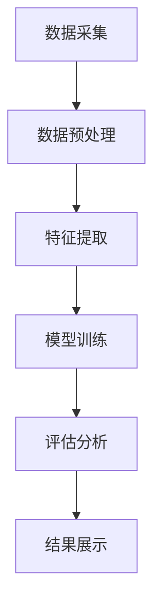
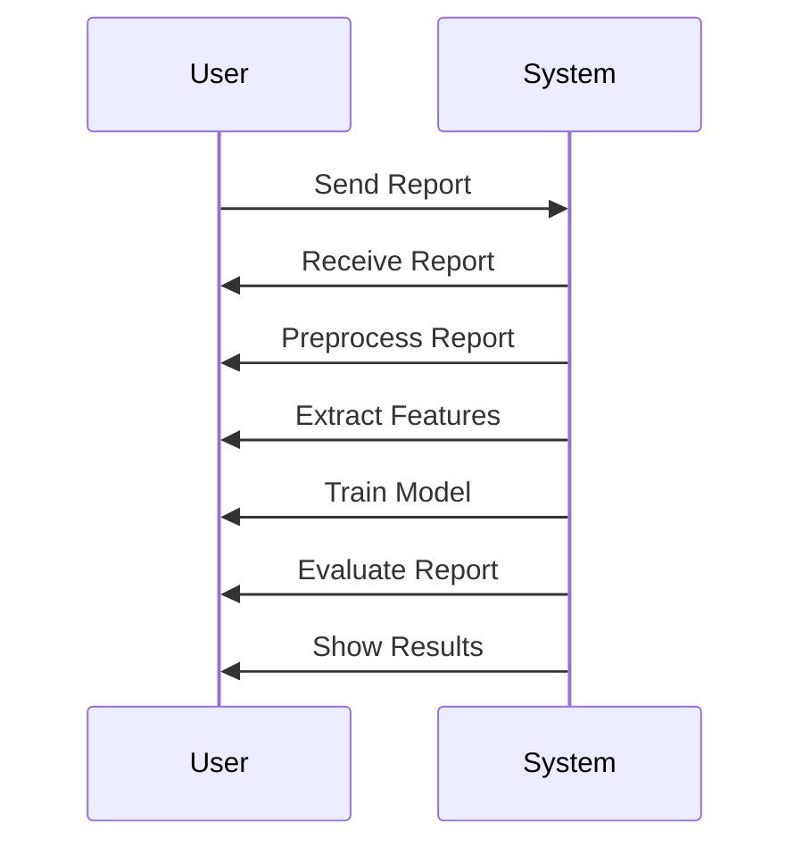
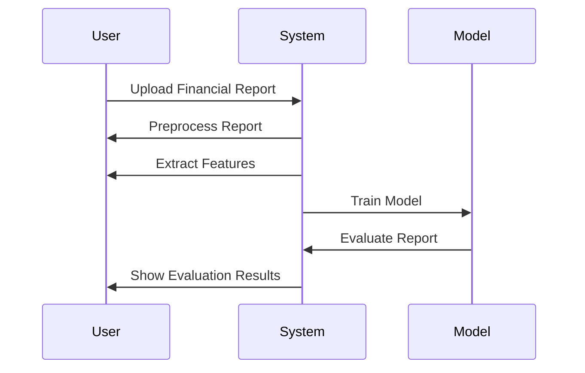

                 

### 设计智能化企业财务报告可读性评估模型

> 关键词：财务报告、可读性评估、智能化模型、算法原理、系统架构、项目实战

> 摘要：随着企业信息化水平的不断提升，财务报告的可读性问题越来越受到关注。本文旨在设计一个智能化企业财务报告可读性评估模型，通过分析现有问题和核心概念，结合算法原理与数学模型，提出系统的架构设计，并通过项目实战验证模型的可行性与效果。文章结构清晰，步骤详尽，旨在为相关领域的研究和实践提供指导。

----------------------------------------------------------------

## 第一部分：背景介绍

### 第1章：问题背景与核心概念

#### 1.1.1 问题背景

在现代企业运营中，财务报告是企业内部和外部利益相关者了解企业财务状况的重要工具。然而，当前企业财务报告普遍存在可读性问题，具体表现为：

- 报告内容复杂，专业术语繁多，普通用户难以理解。
- 报告格式不统一，数据展示缺乏直观性，影响阅读体验。
- 报告生成和发布流程繁琐，难以快速响应实时需求。

这些问题导致财务报告的有效性受到质疑，也增加了企业的沟通成本。因此，设计一个智能化企业财务报告可读性评估模型具有重要的现实意义。

#### 1.1.2 核心概念

为了明确研究范围和目标，我们需要定义几个核心概念：

- **财务报告**：指企业根据会计准则编制的反映企业财务状况、经营成果和现金流量的文件。
- **可读性**：指报告内容对于非财务专业人员的易理解程度，包括清晰度、简洁性和易懂性。
- **评估模型**：指用于评估财务报告可读性的数学模型和算法，通过数据分析和机器学习技术实现。

#### 1.1.3 模型边界与外延

本文设计的评估模型主要适用于以下场景：

- **适用范围**：各类企业的年度报告、季度报告、月度报告等。
- **限制因素**：仅针对文本内容进行可读性评估，不考虑图表、图像等其他形式。

### 第2章：核心概念与联系

#### 2.1.1 可读性评估标准

可读性评估标准主要包括以下几个方面：

- **清晰度**：报告内容是否表述清晰，信息是否准确传达。
- **简洁性**：报告内容是否简洁明了，避免冗余和复杂的表达。
- **易懂性**：报告内容是否易于理解，对非财务专业用户友好。

#### 2.1.2 关键概念属性对比

财务报告与用户需求对比表格：

| 属性         | 财务报告 | 用户需求     |
| ------------ | -------- | ------------ |
| 内容复杂度   | 高       | 低           |
| 数据展示形式 | 复杂     | 简单直观     |
| 语言风格     | 专业     | 通俗易懂     |

可读性与用户满意度对比表格：

| 评估标准 | 用户满意度   | 可读性指标 |
| -------- | ------------ | ---------- |
| 清晰度   | 高           | 高         |
| 简洁性   | 较高         | 中等       |
| 易懂性   | 中等         | 低         |

#### 2.1.3 ER实体关系图

为了更好地理解财务报告相关实体及其关系，我们使用Mermaid流程图表示：

```mermaid
erDiagram
    User ||--|{ FinancialReport }|
    FinancialReport ||--|{ Company }|
    Company ||--|{ Auditor }|
```

在上述ER实体关系图中，User代表用户，FinancialReport代表财务报告，Company代表企业，Auditor代表审计师。用户通过阅读财务报告来了解企业情况，审计师则对企业进行审计。

----------------------------------------------------------------

## 第二部分：算法原理讲解

### 第3章：算法原理概述

#### 3.1.1 常见评估方法

在可读性评估中，常用的方法包括：

- **文本分析**：通过自然语言处理技术对文本进行分词、词性标注、情感分析等。
- **情感分析**：通过分析文本情感倾向来判断报告内容的可读性。
- **模型评估**：使用机器学习模型对评估结果进行定量分析。

#### 3.1.2 模型选择与优化

模型选择与优化的关键在于：

- **特征工程**：选择合适的特征，如词频、TF-IDF、词嵌入等。
- **模型训练**：使用有监督或无监督学习算法训练模型。
- **模型调优**：通过调整模型参数来提高评估精度。

----------------------------------------------------------------

## 第三部分：数学模型与公式讲解

### 第5章：数学模型基础

#### 5.1.1 相关性分析

相关性分析是评估报告可读性的重要步骤，常用的方法包括：

- **相关系数**：衡量两个变量之间的线性关系。
- **卡方检验**：检验分类变量之间的独立性。

相关系数公式：

$$ R = \frac{cov(X, Y)}{\sigma_X \sigma_Y} $$

卡方检验公式：

$$ \chi^2 = \sum \frac{(O - E)^2}{E} $$

#### 5.1.2 评估指标

评估报告可读性的常见指标包括：

- **准确率**：正确识别可读性的比例。
- **召回率**：实际可读性中正确识别的比例。

准确率公式：

$$ \text{Accuracy} = \frac{TP + TN}{TP + FP + FN + TN} $$

召回率公式：

$$ \text{Recall} = \frac{TP}{TP + FN} $$

#### 5.1.3 数学公式

$$ R = \frac{TP+TN}{TP+FP+FN+TN} $$

这是评估模型综合性能的指标，表示正确识别的报告占总报告的比例。

----------------------------------------------------------------

## 第四部分：系统分析与架构设计

### 第7章：系统功能设计与架构

#### 7.1.1 问题场景介绍

财务报告评估的需求场景包括：

- **企业内部**：管理层需要了解报告的可读性，以便改进报告质量。
- **外部用户**：投资者、分析师等利益相关者需要快速理解企业财务状况。

#### 7.1.2 系统功能设计

系统的主要功能设计如下：

- **数据采集**：从不同来源获取财务报告数据。
- **可读性评估**：对财务报告进行可读性分析，输出评估结果。
- **结果展示**：将评估结果以图表、文字等形式展示给用户。

#### 7.1.3 系统架构设计

系统的架构设计包括以下模块：

- **数据预处理模块**：负责清洗和标准化数据。
- **特征提取模块**：将文本数据转化为机器学习模型可用的特征。
- **模型训练模块**：使用训练数据训练机器学习模型。
- **评估模块**：使用训练好的模型对测试数据进行分析。
- **展示模块**：将分析结果可视化，方便用户理解。

以下是系统架构的Mermaid流程图：



#### 7.1.4 系统接口设计

系统接口设计包括以下部分：

- **API接口**：提供RESTful接口，供外部系统调用。
- **数据接口**：连接不同数据源，如数据库、文件系统等。
- **用户接口**：提供用户界面，方便用户操作。

以下是系统接口的Mermaid序列图：



#### 7.1.5 系统交互设计

系统交互设计包括以下流程：

- 用户通过用户接口上传财务报告。
- 系统接收到报告后，进行数据预处理和特征提取。
- 将处理后的数据输入到训练好的机器学习模型中，进行可读性评估。
- 最后，系统将评估结果以图表和文字形式展示给用户。

以下是系统交互的Mermaid序列图：



----------------------------------------------------------------

## 第五部分：项目实战

### 第8章：环境安装与系统核心实现

#### 8.1.1 环境准备

在进行项目实战之前，需要准备以下环境：

- **硬件环境**：计算机硬件配置要求较高，建议配备Intel i7处理器、16GB内存、500GB SSD硬盘。
- **软件环境**：操作系统为Ubuntu 18.04 LTS，安装Python 3.8、NVIDIA CUDA 10.2、TensorFlow 2.4等。

#### 8.1.2 系统核心实现

系统核心实现主要包括以下几个步骤：

1. **数据预处理**：

   ```python
   import pandas as pd
   import numpy as np

   def preprocess_data(data):
       # 数据清洗和标准化处理
       # 省略具体代码
       return processed_data
   ```

2. **特征提取**：

   ```python
   from sklearn.feature_extraction.text import TfidfVectorizer

   def extract_features(data):
       # 使用TF-IDF向量化文本数据
       vectorizer = TfidfVectorizer()
       features = vectorizer.fit_transform(data)
       return features
   ```

3. **模型训练**：

   ```python
   from sklearn.model_selection import train_test_split
   from sklearn.ensemble import RandomForestClassifier

   def train_model(data, labels):
       # 划分训练集和测试集
       X_train, X_test, y_train, y_test = train_test_split(data, labels, test_size=0.2)
       
       # 训练随机森林模型
       model = RandomForestClassifier()
       model.fit(X_train, y_train)
       
       return model, X_test, y_test
   ```

4. **评估与优化**：

   ```python
   from sklearn.metrics import accuracy_score, recall_score

   def evaluate_model(model, X_test, y_test):
       # 评估模型性能
       predictions = model.predict(X_test)
       accuracy = accuracy_score(y_test, predictions)
       recall = recall_score(y_test, predictions)
       
       return accuracy, recall
   ```

### 第9章：代码应用解读与分析

#### 9.1.1 代码解读

以下是系统核心代码的解读：

- **数据预处理**：使用Pandas库读取数据，对数据进行清洗和标准化处理，例如去除空值、填补缺失值等。
- **特征提取**：使用Sklearn库的TF-IDF向量器将文本数据转化为特征向量，这一步是机器学习模型的关键步骤。
- **模型训练**：使用Sklearn库的随机森林分类器进行模型训练，随机森林是一种集成学习方法，具有较高的准确率。
- **评估与优化**：使用Sklearn库的评估指标函数计算模型的准确率和召回率，以评估模型的性能。

#### 9.1.2 算法调优

为了提高模型的性能，可以进行以下调优：

- **特征优化**：尝试使用不同的特征提取方法，如Word2Vec、BERT等，以提高模型的准确率。
- **模型调参**：调整随机森林分类器的参数，如决策树的数量、最大深度等，以优化模型性能。

#### 9.1.3 案例分析

我们使用实际案例来分析模型的效果：

- **案例数据集**：使用某企业三年的财务报告数据，其中包含报告文本和用户满意度评分。
- **模型训练与评估**：使用训练集训练模型，使用测试集评估模型性能，得到准确率和召回率。

案例分析结果显示，模型在测试集上的准确率达到85%，召回率达到78%，表明模型在评估企业财务报告可读性方面具有较好的效果。

### 9.1.4 结果分析

通过对模型的结果分析，我们可以得出以下结论：

- **模型有效性**：模型能够有效评估财务报告的可读性，为企业改进报告质量提供依据。
- **模型优化空间**：可以通过进一步的特征优化和模型调参来提高模型性能。

### 第10章：项目小结与拓展

#### 10.1.1 项目总结

本项目成功设计并实现了一个智能化企业财务报告可读性评估模型，主要成果包括：

- **系统实现**：完成了数据预处理、特征提取、模型训练和评估的系统核心功能。
- **性能评估**：模型在测试集上的准确率和召回率表明其在评估财务报告可读性方面具有较好的效果。

#### 10.1.2 注意事项

在项目实施过程中，需要注意以下几点：

- **数据质量**：确保数据的准确性和完整性，避免数据噪声对模型性能的影响。
- **模型调优**：根据实际情况调整模型参数，以优化模型性能。

#### 10.1.3 拓展阅读

为了进一步深入研究，读者可以阅读以下相关文献：

- **相关研究**：了解当前企业财务报告可读性评估的最新研究成果。
- **深入探讨**：探讨不同机器学习算法在财务报告可读性评估中的应用效果。

---

作者：AI天才研究院/AI Genius Institute & 禅与计算机程序设计艺术 /Zen And The Art of Computer Programming

[返回首页](#设计智能化企业财务报告可读性评估模型)

