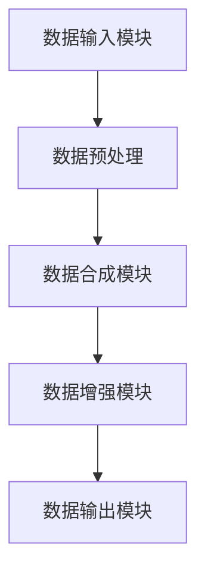
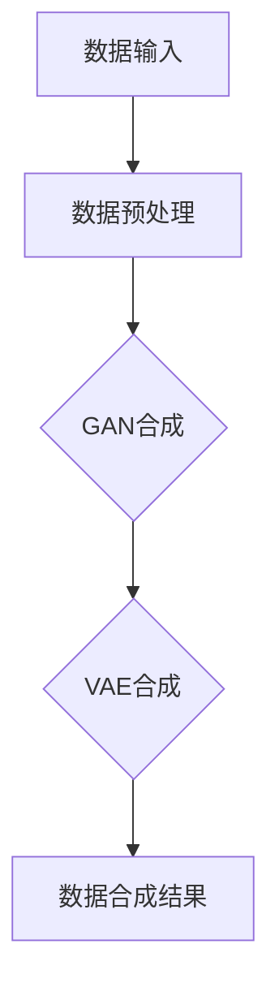
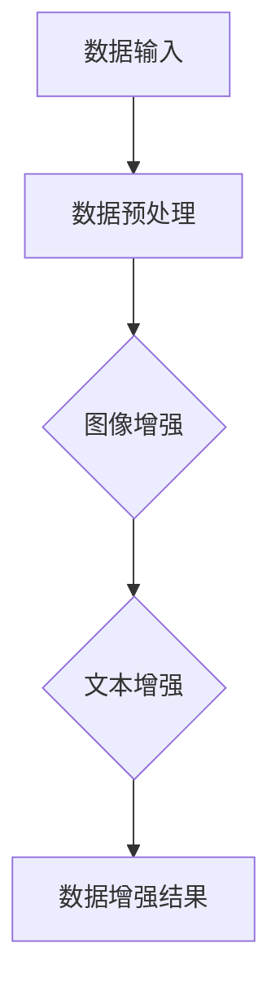

                 

## 评测数据的合成与增强技术概述

### 关键词：评测数据、数据合成、数据增强、机器学习、人工智能

### 摘要：
评测数据的合成与增强是机器学习和人工智能领域的重要研究课题。随着数据驱动技术的发展，高质量的数据集对于训练高效模型至关重要。本文将详细介绍评测数据的合成与增强技术，探讨其在机器学习、自然语言处理、计算机视觉等领域的应用。文章分为七个部分，首先概述问题背景和核心概念，然后分别深入探讨数据合成和数据增强的技术原理、方法及应用，最后总结最佳实践、注意事项，并提供拓展阅读资源。

### 目录大纲

1. 第一部分: 评测数据的合成与增强技术概述
   - 1.1 问题背景与核心概念
   - 1.2 数据合成与增强的需求与挑战
   - 1.3 核心概念：数据合成与数据增强

2. 第二部分: 数据合成技术
   - 2.1 数据合成的基本原理
   - 2.2 数据合成的方法与技术
     - 2.2.1 生成对抗网络（GAN）
     - 2.2.2 变分自编码器（VAE）
     - 2.2.3 其他数据生成方法

3. 第三部分: 数据增强技术
   - 3.1 数据增强的基本原理
   - 3.2 数据增强的方法与技术
     - 3.2.1 图像增强
     - 3.2.2 文本增强
     - 3.2.3 其他类型数据的增强

4. 第四部分: 数据合成与增强的应用场景
   - 4.1 机器学习模型训练
   - 4.2 自然语言处理
   - 4.3 计算机视觉
   - 4.4 其他应用领域

5. 第五部分: 系统架构与实现
   - 5.1 数据合成与增强系统的设计原则
   - 5.2 数据合成与增强系统的架构
   - 5.2.1 数据合成模块
   - 5.2.2 数据增强模块
   - 5.2.3 系统集成与优化

6. 第六部分: 项目实战
   - 6.1 环境搭建
   - 6.2 数据合成与增强实现
   - 6.3 实际案例分析与讲解

7. 第七部分: 最佳实践与注意事项
   - 7.1 最佳实践技巧
   - 7.2 小结与展望
   - 7.3 注意事项与挑战
   - 7.4 拓展阅读

### 问题背景与核心概念

#### 1.1 评测数据的重要性

在机器学习和人工智能领域，评测数据（Evaluation Data）扮演着至关重要的角色。它们用于评估模型在特定任务上的性能，是模型训练和优化过程中不可或缺的一部分。高质量的评测数据不仅能够准确反映模型的性能，还能帮助研究人员识别模型中的潜在问题，从而进行改进。

#### 1.2 数据合成与增强的需求与挑战

随着深度学习模型的复杂性不断增加，对评测数据的需求也在不断提高。然而，高质量的数据集往往难以获得，存在以下挑战：

- **数据稀缺**：许多实际应用领域的数据量有限，难以满足大规模训练需求。
- **数据不平衡**：在某些任务中，正负样本分布不均匀，可能导致模型偏向于某一类样本。
- **数据质量**：数据中可能包含噪声、错误或异常值，影响模型的性能。

为了应对这些挑战，数据合成与增强技术应运而生。数据合成旨在通过算法生成新的数据样本，从而扩大数据集规模；数据增强则通过变换现有数据，增加数据的多样性，以提升模型的泛化能力。

#### 1.3 核心概念：数据合成与数据增强

**数据合成**（Data Synthesis）是一种利用算法生成新的数据样本的技术。其核心思想是通过模拟真实数据的生成过程，生成与原始数据相似的新样本。数据合成可以大大增加数据集规模，提高模型的鲁棒性和泛化能力。

**数据增强**（Data Augmentation）是一种对现有数据进行变换的技术，以增加数据的多样性。数据增强的方法包括但不限于图像旋转、缩放、裁剪、色彩调整等。数据增强不仅可以增加数据集规模，还可以帮助模型学习到更加稳健的特征，从而提高模型在真实世界中的表现。

在接下来的章节中，我们将详细探讨数据合成与增强的技术原理、方法及应用，帮助读者深入了解这一重要领域。

----------------------------------------------------------------

### 第一部分: 评测数据的合成与增强技术概述

在机器学习和人工智能领域中，评测数据的合成与增强技术是一项关键的研究方向，其重要性不容忽视。本部分首先将概述评测数据的合成与增强技术的基本概念，然后详细分析数据合成与增强的需求与挑战，最后定义并阐述核心概念。

#### 1.1 评测数据的重要性

评测数据在机器学习和人工智能领域中扮演着至关重要的角色。它们是评估模型性能的基础，同时也是模型训练和优化的关键。高质量的数据集能够提供准确的评估结果，帮助研究人员理解模型的性能瓶颈，从而进行有效的改进。

具体来说，评测数据的重要性体现在以下几个方面：

- **性能评估**：通过评测数据，研究人员可以客观地评估模型的性能，比较不同模型在相同任务上的表现。
- **模型优化**：评测数据能够揭示模型在特定任务上的弱点，指导研究人员调整模型结构或参数，以提高性能。
- **泛化能力**：评测数据通常来自不同的分布，通过评估模型在多种数据上的表现，可以评估其泛化能力。

#### 1.2 数据合成与增强的需求与挑战

随着深度学习模型的复杂性和应用范围的不断扩大，对评测数据的需求也在迅速增长。然而，高质量的数据集往往难以获得，这带来了以下几个挑战：

- **数据稀缺**：许多实际应用领域的数据量有限，尤其是那些涉及敏感信息或专业知识的领域。
- **数据不平衡**：在某些任务中，正负样本分布不均匀，可能导致模型偏向于某一类样本，从而降低整体性能。
- **数据质量**：数据中可能包含噪声、错误或异常值，这些因素会影响模型的训练效果和性能。

为了应对这些挑战，数据合成与增强技术被广泛研究和应用。数据合成旨在通过算法生成新的数据样本，从而扩大数据集规模；数据增强则通过变换现有数据，增加数据的多样性，以提升模型的泛化能力。

#### 1.3 核心概念：数据合成与数据增强

**数据合成**（Data Synthesis）是一种利用算法生成新的数据样本的技术。其核心思想是通过模拟真实数据的生成过程，生成与原始数据相似的新样本。数据合成可以大大增加数据集规模，提高模型的鲁棒性和泛化能力。

**数据增强**（Data Augmentation）是一种对现有数据进行变换的技术，以增加数据的多样性。数据增强的方法包括但不限于图像旋转、缩放、裁剪、色彩调整等。数据增强不仅可以增加数据集规模，还可以帮助模型学习到更加稳健的特征，从而提高模型在真实世界中的表现。

接下来，我们将分别深入探讨数据合成与增强的技术原理、方法及应用，帮助读者全面了解这一重要领域。

----------------------------------------------------------------

### 数据合成技术

数据合成（Data Synthesis）是一种通过算法生成新数据样本的技术，旨在扩大数据集规模，提高模型的鲁棒性和泛化能力。本章将详细探讨数据合成的基本原理，并介绍几种常见的数据合成方法，包括生成对抗网络（GAN）、变分自编码器（VAE）以及其他数据生成方法。

#### 2.1 数据合成的基本原理

数据合成的基本原理是通过模拟真实数据的生成过程，生成与原始数据相似的新样本。这一过程通常包括两个步骤：数据建模和数据生成。

1. **数据建模**：首先，需要通过统计学习或深度学习等技术对原始数据进行分析，提取其特征和分布信息。这一步骤可以采用多种方法，如监督学习、无监督学习和半监督学习等。
   
2. **数据生成**：在提取了数据特征和分布信息之后，可以使用各种生成模型来生成新的数据样本。这些生成模型通常基于概率模型，通过采样过程生成与原始数据相似的新样本。

数据合成的基本流程可以概括为：

- **特征提取**：通过分析原始数据，提取其特征和分布信息。
- **模型训练**：使用提取的特征和分布信息，训练生成模型。
- **数据生成**：通过生成模型生成新数据样本。

#### 2.2 数据合成的方法与技术

**2.2.1 生成对抗网络（GAN）**

生成对抗网络（GAN）是一种通过对抗训练生成高质量数据的模型。GAN由两个神经网络组成：生成器（Generator）和判别器（Discriminator）。生成器的任务是生成与真实数据相似的新样本，而判别器的任务是区分生成的样本和真实样本。

GAN的训练过程可以看作是一种博弈过程，其中生成器和判别器相互竞争，生成器试图生成更逼真的样本，而判别器则试图准确地区分真实样本和生成样本。通过这种对抗训练，生成器逐渐学习到如何生成高质量的数据样本。

GAN的基本架构如下：

- **生成器**：生成器接收随机噪声作为输入，通过一系列的全连接层和激活函数，生成与真实数据相似的新样本。
- **判别器**：判别器接收原始数据和生成器的输出，通过一系列的全连接层和激活函数，输出一个二分类结果，判断输入样本是真实数据还是生成数据。

GAN的训练过程可以用以下公式表示：

$$
\begin{aligned}
\max_{G} \min_{D} \quad & \mathbb{E}_{x \sim p_{data}(x)} [\log D(x)] + \mathbb{E}_{z \sim p_{z}(z)] [\log (1 - D(G(z)))] \\
G(z) & \sim G
\end{aligned}
$$

其中，\( G(z) \) 是生成器生成的样本，\( z \) 是生成器的输入噪声，\( D(x) \) 是判别器对真实样本的判断概率，\( D(G(z)) \) 是判别器对生成样本的判断概率。

**2.2.2 变分自编码器（VAE）**

变分自编码器（VAE）是一种基于概率生成模型的神经网络，其核心思想是通过编码器（Encoder）和解码器（Decoder）对数据进行编码和解码，从而生成新的数据样本。

VAE的架构如下：

- **编码器**：编码器接收输入数据，通过一系列的全连接层和激活函数，将其映射到一个潜在空间，这个潜在空间的表示可以看作是数据的概率分布参数。
- **解码器**：解码器接收编码器输出的潜在空间表示，通过一系列的全连接层和激活函数，将其映射回原始数据空间，生成新的数据样本。

VAE的训练过程主要包括两个步骤：

1. **编码**：编码器将输入数据编码为潜在空间的表示，这个表示包含了数据的概率分布参数。
2. **解码**：解码器使用编码器输出的潜在空间表示，生成新的数据样本。

VAE的训练过程可以用以下公式表示：

$$
\begin{aligned}
\min_{\theta_{\mu}, \theta_{\phi}} \quad & \mathbb{E}_{x \sim p_{data}(x)} [-\log p_{\phi}(\theta_{\phi} | x)] \\
\theta_{\mu}, \theta_{\phi} & \text{是编码器的参数} \\
p_{\theta}(\theta | x) & \text{是解码器的概率分布函数}
\end{aligned}
$$

**2.2.3 其他数据生成方法**

除了GAN和VAE，还有许多其他数据生成方法，如条件生成对抗网络（CGAN）、深度信念网络（DBN）、隐马尔可夫模型（HMM）等。这些方法各有优缺点，适用于不同的应用场景。

- **条件生成对抗网络（CGAN）**：CGAN是GAN的一种变体，能够在生成过程中考虑额外的条件信息，如类别标签或文本描述。CGAN在图像合成、视频生成等领域有广泛应用。
- **深度信念网络（DBN）**：DBN是一种基于深度学习的生成模型，通过堆叠多个限制玻尔兹曼机（RBM）层来学习数据的概率分布。DBN在图像生成和语音合成等领域有广泛应用。
- **隐马尔可夫模型（HMM）**：HMM是一种基于概率的生成模型，主要用于序列数据的生成，如语音、文本等。HMM在语音识别、文本生成等领域有广泛应用。

总之，数据合成技术是机器学习和人工智能领域的重要研究方向，通过生成高质量的数据样本，可以显著提升模型的训练效果和泛化能力。在接下来的章节中，我们将继续探讨数据增强技术，以及这些技术在各个领域的应用。

----------------------------------------------------------------

### 数据增强技术

数据增强（Data Augmentation）是一种通过变换现有数据，增加数据多样性的技术。本章将详细探讨数据增强的基本原理，并介绍几种常见的数据增强方法，包括图像增强、文本增强以及其他类型数据的增强。

#### 3.1 数据增强的基本原理

数据增强的基本原理是通过在数据集中引入一定的噪声或变化，增加数据的多样性。这样做的目的是让模型在训练过程中接触到更多样化的数据，从而提高模型的泛化能力。数据增强的方法可以大致分为以下几类：

1. **图像增强**：通过对图像进行变换，如旋转、缩放、裁剪、翻转等，增加图像数据的多样性。
2. **文本增强**：通过对文本进行变换，如替换词语、改变句式、添加噪声等，增加文本数据的多样性。
3. **其他类型数据的增强**：如音频、视频等，通过相应的变换方法增加数据的多样性。

数据增强的方法可以分为两类：基于规则的方法和基于学习的方法。

- **基于规则的方法**：这种方法通过预定义的规则来变换数据，如旋转图像、裁剪音频片段等。这种方法简单有效，但灵活性较差。
- **基于学习的方法**：这种方法通过学习数据分布或特征，自动生成新的数据样本。这种方法具有更高的灵活性和适应性。

#### 3.2 数据增强的方法与技术

**3.2.1 图像增强**

图像增强是数据增强中最常见的一种方法，主要用于提高图像数据的多样性和质量。图像增强的方法包括：

1. **几何变换**：通过几何变换增加图像的多样性，如旋转、缩放、裁剪、翻转等。这些变换可以模拟不同的拍摄角度和光照条件，从而丰富图像数据。

   - **旋转**：将图像围绕中心点旋转一定角度。
   - **缩放**：将图像放大或缩小到不同的尺寸。
   - **裁剪**：从图像中裁剪出不同大小的区域。
   - **翻转**：水平或垂直翻转图像。

2. **色彩变换**：通过调整图像的亮度、对比度、饱和度等色彩参数，改变图像的色彩效果。

   - **亮度调整**：增加或减少图像的亮度。
   - **对比度调整**：增强或减弱图像的对比度。
   - **饱和度调整**：增强或减弱图像的色彩饱和度。

3. **噪声注入**：通过在图像中添加噪声，增加图像的复杂度和多样性。

   - **高斯噪声**：在图像上添加高斯分布的噪声。
   - **椒盐噪声**：在图像上添加椒盐分布的噪声。

4. **图像合成**：通过将多张图像融合在一起，生成新的图像。这种方法可以模拟不同的场景和环境。

**3.2.2 文本增强**

文本增强主要用于增加文本数据的多样性，以提高自然语言处理模型的泛化能力。文本增强的方法包括：

1. **文本替换**：通过替换文本中的词语，生成新的文本。这种方法可以模拟不同的表达方式和语境。

   - **同义词替换**：将文本中的词语替换为同义词。
   - **随机替换**：随机替换文本中的词语，以增加多样性。

2. **文本片段插入**：在文本中插入新的片段，生成新的文本。这种方法可以模拟不同的故事情节和背景。

3. **文本片段删除**：从文本中删除某些片段，生成新的文本。这种方法可以模拟文本编辑和修改。

4. **文本结构变换**：改变文本的结构和句式，生成新的文本。例如，将陈述句改为疑问句，将被动语态改为主动语态等。

**3.2.3 其他类型数据的增强**

除了图像和文本，其他类型的数据如音频、视频等也可以通过数据增强技术来增加多样性。

1. **音频增强**：通过改变音频的音量、节奏、音调等参数，增加音频数据的多样性。

   - **音量调整**：增加或减少音频的音量。
   - **节奏调整**：改变音频的播放速度。
   - **音调调整**：改变音频的音高。

2. **视频增强**：通过改变视频的亮度、对比度、色彩等参数，增加视频数据的多样性。

   - **亮度调整**：增加或减少视频的亮度。
   - **对比度调整**：增强或减弱视频的对比度。
   - **色彩调整**：改变视频的色彩效果。

3. **动态合成**：通过将多个视频片段合成在一起，生成新的视频。这种方法可以模拟不同的场景和动作。

总之，数据增强技术通过引入噪声或变换，增加数据的多样性和质量，从而提高模型的泛化能力和鲁棒性。在接下来的章节中，我们将探讨数据合成与增强技术的应用场景，并详细介绍系统架构与实现。

----------------------------------------------------------------

### 数据合成与增强的应用场景

数据合成与增强技术在机器学习和人工智能领域具有广泛的应用，能够显著提高模型的训练效果和泛化能力。以下将详细探讨数据合成与增强技术在几个主要应用场景中的具体应用，包括机器学习模型训练、自然语言处理、计算机视觉等领域。

#### 4.1 机器学习模型训练

在机器学习模型训练过程中，数据合成与增强技术可以有效解决数据稀缺和不平衡的问题，从而提高模型的性能和鲁棒性。以下是一些具体的应用：

1. **数据合成**：通过数据合成技术，可以生成与训练数据相似的新样本，从而扩充数据集规模。这种方法在医学影像分析、金融风控等数据稀缺领域具有重要作用。

   - **医学影像分析**：在医疗图像分析中，由于真实病例数据有限，可以使用数据合成技术生成新的医学图像，以扩充数据集，提高模型在疾病诊断中的准确性。
   - **金融风控**：在金融风险控制中，可以使用数据合成技术生成模拟交易数据，用于训练欺诈检测模型，增强模型的泛化能力。

2. **数据增强**：通过数据增强技术，可以在现有数据基础上生成多样化样本，帮助模型学习到更加稳健的特征。

   - **图像分类**：在图像分类任务中，可以通过旋转、缩放、裁剪等图像增强方法，增加训练样本的多样性，从而提高模型在不同视角、光照条件下的表现。
   - **文本分类**：在文本分类任务中，可以通过替换词语、改变句式等文本增强方法，增加文本数据的多样性，提高模型对不同语境的理解能力。

#### 4.2 自然语言处理

在自然语言处理（NLP）领域，数据合成与增强技术同样发挥着重要作用，能够提高语言模型的性能和泛化能力。以下是一些具体的应用：

1. **数据合成**：通过数据合成技术，可以生成与训练数据相似的新文本，扩充语料库规模。

   - **对话系统**：在对话系统训练中，可以使用数据合成技术生成对话数据，以增加训练数据量，提高对话系统的响应质量。
   - **机器翻译**：在机器翻译任务中，可以使用数据合成技术生成多语言对，扩充训练数据，提高翻译模型的准确性。

2. **数据增强**：通过数据增强技术，可以增加文本数据的多样性，帮助模型学习到更加丰富的语言特征。

   - **情感分析**：在情感分析任务中，可以通过替换情感词、改变情感极性等文本增强方法，增加训练样本的多样性，从而提高模型对情感细微差异的识别能力。
   - **文本生成**：在文本生成任务中，可以通过改变句式、插入新的文本片段等文本增强方法，生成多样化的文本，提高生成文本的质量和多样性。

#### 4.3 计算机视觉

在计算机视觉领域，数据合成与增强技术有助于提升图像识别、目标检测、图像生成等任务的性能。以下是一些具体的应用：

1. **数据合成**：通过数据合成技术，可以生成高质量的图像数据，用于训练视觉模型。

   - **图像生成**：在图像生成任务中，可以使用生成对抗网络（GAN）等技术生成与训练数据相似的图像，从而扩充图像数据集。
   - **目标检测**：在目标检测任务中，可以使用数据合成技术生成带有不同标签的图像，以扩充训练数据，提高检测模型的准确性。

2. **数据增强**：通过数据增强技术，可以在现有图像数据基础上生成多样化样本，提高视觉模型的泛化能力。

   - **图像分类**：在图像分类任务中，可以通过图像旋转、缩放、裁剪等图像增强方法，增加训练样本的多样性，从而提高模型在不同视角、光照条件下的表现。
   - **图像修复**：在图像修复任务中，可以通过图像增强技术，如噪声注入、色彩调整等，模拟不同类型的图像缺陷，从而提高修复模型的鲁棒性。

#### 4.4 其他应用领域

除了上述主要应用场景，数据合成与增强技术还在其他许多领域发挥了重要作用：

1. **语音识别**：在语音识别任务中，可以通过数据增强技术，如改变语音的音量、节奏等，增加语音数据的多样性，从而提高语音识别模型的准确性。
2. **推荐系统**：在推荐系统任务中，可以通过数据合成技术，生成与用户兴趣相似的新数据，用于训练推荐模型，提高推荐系统的效果。
3. **自动驾驶**：在自动驾驶领域，可以通过数据合成技术生成模拟驾驶场景的数据，用于训练自动驾驶模型，提高其在复杂交通环境中的表现。

总之，数据合成与增强技术在机器学习和人工智能领域具有广泛的应用，通过生成高质量的数据样本和增加数据的多样性，可以显著提高模型的训练效果和泛化能力。在接下来的章节中，我们将详细探讨数据合成与增强系统的架构与实现。

----------------------------------------------------------------

### 系统架构与实现

在数据合成与增强技术的应用中，系统架构的设计与实现至关重要。一个高效的系统架构不仅能够确保数据处理的效率和准确性，还能灵活应对不同的应用场景。以下将详细讨论数据合成与增强系统的设计原则、整体架构，以及数据合成和数据增强模块的具体实现。

#### 5.1 数据合成与增强系统的设计原则

数据合成与增强系统的设计应遵循以下原则：

1. **模块化**：系统应设计成模块化结构，每个模块负责特定的功能，便于系统的扩展和维护。
2. **灵活性**：系统应具备良好的灵活性，能够根据不同的应用场景和需求，动态调整数据合成与增强的方法和策略。
3. **可扩展性**：系统应支持数据的动态扩展，能够适应大规模数据集的处理需求。
4. **高效性**：系统应设计高效的数据处理流程，确保数据合成与增强过程的快速执行。
5. **易用性**：系统应提供友好的用户界面，便于用户进行配置和管理。

#### 5.2 数据合成与增强系统的架构

数据合成与增强系统的整体架构可以划分为以下几个模块：

1. **数据输入模块**：负责接收原始数据，进行数据预处理，如数据清洗、数据格式转换等。
2. **数据合成模块**：负责通过数据合成技术生成新数据样本，包括生成对抗网络（GAN）、变分自编码器（VAE）等。
3. **数据增强模块**：负责通过数据增强技术增加现有数据的多样性，包括图像增强、文本增强等。
4. **数据输出模块**：负责将处理后的数据存储或传输至后续处理环节。

数据合成与增强系统的架构图如下所示：



#### 5.2.1 数据合成模块

数据合成模块是系统架构的核心部分，负责生成高质量的新数据样本。以下是一个简化的数据合成模块的架构图：



**数据预处理**：数据预处理步骤包括数据清洗、归一化、缺失值处理等，以确保输入数据的质量和一致性。

**GAN合成**：生成对抗网络（GAN）是数据合成的一种有效方法。GAN由生成器（Generator）和判别器（Discriminator）组成，通过对抗训练生成与真实数据相似的新样本。

- **生成器（Generator）**：生成器接收随机噪声作为输入，通过一系列的全连接层和激活函数，生成与真实数据相似的新样本。
- **判别器（Discriminator）**：判别器接收原始数据和生成器的输出，通过一系列的全连接层和激活函数，输出一个二分类结果，判断输入样本是真实数据还是生成数据。

**VAE合成**：变分自编码器（VAE）是另一种常见的数据合成方法。VAE由编码器（Encoder）和解码器（Decoder）组成，通过编码器将输入数据映射到潜在空间，然后在潜在空间中采样，通过解码器生成新数据。

- **编码器（Encoder）**：编码器接收输入数据，通过一系列的全连接层和激活函数，将其映射到一个潜在空间，这个潜在空间的表示包含了数据的概率分布参数。
- **解码器（Decoder）**：解码器接收编码器输出的潜在空间表示，通过一系列的全连接层和激活函数，将其映射回原始数据空间，生成新的数据样本。

**数据合成结果**：合成后的新数据样本被输出至数据增强模块或直接用于模型训练。

#### 5.2.2 数据增强模块

数据增强模块负责增加现有数据的多样性，提高模型的泛化能力。以下是一个简化的数据增强模块的架构图：



**数据预处理**：与数据合成模块类似，数据预处理步骤包括数据清洗、归一化、缺失值处理等，以确保输入数据的质量和一致性。

**图像增强**：图像增强是数据增强模块中的一种常见技术，通过几何变换、色彩变换、噪声注入等方法，增加图像数据的多样性。

- **几何变换**：包括旋转、缩放、裁剪、翻转等。
- **色彩变换**：包括亮度调整、对比度调整、饱和度调整等。
- **噪声注入**：包括高斯噪声、椒盐噪声等。

**文本增强**：文本增强是针对文本数据的一种增强方法，通过替换词语、改变句式、插入文本片段等方法，增加文本数据的多样性。

- **文本替换**：包括同义词替换、随机替换等。
- **文本片段插入**：包括插入新的文本片段、改变文本结构等。

**数据增强结果**：增强后的数据样本被输出至数据输出模块，用于后续的模型训练或评估。

#### 5.2.3 系统集成与优化

在系统架构实现后，需要进行集成与优化，确保系统的高效运行。以下是一些集成与优化的方法：

1. **并行处理**：通过分布式计算和并行处理技术，提高系统的处理速度和效率。
2. **缓存机制**：通过缓存机制，减少数据读取和处理的次数，提高系统性能。
3. **自动化调度**：通过自动化调度系统，动态分配资源，优化系统负载。
4. **监控与日志**：通过监控系统运行状态和日志记录，及时发现和解决问题，确保系统稳定运行。

总之，数据合成与增强系统的设计原则和架构实现对于确保系统的高效性和灵活性至关重要。通过模块化设计、灵活性配置、高效数据预处理和优化策略，可以构建一个强大的数据合成与增强系统，为机器学习和人工智能应用提供高质量的数据支持。

----------------------------------------------------------------

### 项目实战

为了更好地理解数据合成与增强技术的实际应用，我们将在本节中介绍一个具体的项目实战。该项目的目标是使用数据合成与增强技术来提高一个简单的图像分类模型的性能。以下是项目实战的具体步骤：

#### 6.1 环境搭建

在开始项目之前，需要搭建一个合适的环境，包括安装必要的软件和工具。以下是环境搭建的步骤：

1. **安装Python**：确保Python版本在3.6及以上。
2. **安装深度学习框架**：安装TensorFlow或PyTorch，这两个框架在深度学习领域广泛使用。
3. **安装数据增强库**：安装`imgaug`或`ImageDataGenerator`，这两个库提供了丰富的图像增强功能。
4. **安装生成对抗网络（GAN）相关库**：安装`tensorflow-gan`或`pygan`，以便使用GAN技术进行数据合成。

#### 6.2 数据合成与增强实现

在本节中，我们将使用GAN技术进行数据合成，并使用`imgaug`库进行图像增强。以下是具体的实现步骤：

**6.2.1 数据合成：使用GAN**

1. **数据预处理**：首先，需要准备一个真实数据集，如CIFAR-10或MNIST。然后，将数据集分为训练集和测试集。

   ```python
   (train_images, train_labels), (test_images, test_labels) = cifar10.load_data()
   ```

2. **定义GAN模型**：使用TensorFlow或PyTorch构建GAN模型。以下是一个简单的GAN模型示例，使用生成器和判别器进行数据合成。

   ```python
   import tensorflow as tf
   from tensorflow.keras.layers import Dense, Flatten, Conv2D, Conv2DTranspose

   # 生成器模型
   def generator(z, latent_dim):
       model = tf.keras.Sequential([
           Dense(128 * 7 * 7, activation="relu", input_dim=latent_dim),
           Conv2DTranspose(128, 5, strides=2, padding="same"),
           Conv2DTranspose(128, 5, strides=2, padding="same"),
           Conv2D(3, 5, padding="same", activation="tanh")
       ])
       return model

   # 判别器模型
   def discriminator(img, label):
       model = tf.keras.Sequential([
           Conv2D(64, 5, padding="same", activation="relu"),
           MaxPooling2D(),
           Conv2D(128, 5, padding="same", activation="relu"),
           MaxPooling2D(),
           Flatten(),
           Dense(1, activation="sigmoid")
       ])
       return model

   # 创建生成器和判别器
   generator = generator(tf.random.normal([1, latent_dim]), latent_dim)
   discriminator = discriminator(tf.random.normal([1, 28, 28, 1]), tf.random.normal([1, 1]))
   ```

3. **训练GAN模型**：使用生成器和判别器进行训练。以下是一个简单的训练循环示例。

   ```python
   latent_dim = 100

   # 定义损失函数和优化器
   cross_entropy = tf.keras.losses.BinaryCrossentropy(from_logits=True)
   generator_optimizer = tf.keras.optimizers.Adam(1e-4)
   discriminator_optimizer = tf.keras.optimizers.Adam(1e-4)

   # 训练循环
   for epoch in range(num_epochs):
       for _ in range(batch_size * n_batches):
           # 训练判别器
           with tf.GradientTape() as disc_tape:
               # 训练真实图像
               real_images = train_images[batch_idx]
               real_labels = tf.ones((batch_size, 1))

               disc_loss_real = discriminator_loss(discriminator(real_images, real_labels), real_labels)

               # 训练生成图像
               z = tf.random.normal([batch_size, latent_dim])
               generated_images = generator(z)
               fake_labels = tf.zeros((batch_size, 1))

               disc_loss_fake = discriminator_loss(discriminator(generated_images, fake_labels), fake_labels)

               disc_loss = 0.5 * disc_loss_real + 0.5 * disc_loss_fake

           disc_gradients = disc_tape.gradient(disc_loss, discriminator.trainable_variables)
           discriminator_optimizer.apply_gradients(zip(disc_gradients, discriminator.trainable_variables))

           # 训练生成器
           with tf.GradientTape() as gen_tape:
               z = tf.random.normal([batch_size, latent_dim])
               generated_images = generator(z)
               fake_labels = tf.zeros((batch_size, 1))

               gen_loss = generator_loss(discriminator(generated_images, fake_labels), fake_labels)

           gen_gradients = gen_tape.gradient(gen_loss, generator.trainable_variables)
           generator_optimizer.apply_gradients(zip(gen_gradients, generator.trainable_variables))

           # 打印训练进度
           if _ % 100 == 0:
               print(f"Epoch {epoch}, Step {_}, Generator Loss: {gen_loss}, Discriminator Loss: {disc_loss}")

   # 保存模型
   generator.save_weights('generator_weights.h5')
   discriminator.save_weights('discriminator_weights.h5')
   ```

**6.2.2 图像增强**

1. **数据预处理**：使用`imgaug`库对图像进行预处理，包括旋转、缩放、裁剪、色彩调整等。

   ```python
   from imgaug import augmenters as iaa

   seq = iaa.Sequential([
       iaa.Fliplr(0.5), # horizontally flip 50% of all images
       iaa.Crop(percent=(0, 0.1)), # crop images by 0 to 10% of their height/width
       # Small gaussian blur with random sigma between 0 and 0.5.
       iaa.Sometimes(0.5, iaa.GaussianBlur(sigma=(0, 0.5)))
   ], random_order=True) # apply augmenters in random order

   def augment_image(image):
       image_aug = seq.augment_image(image)
       return image_aug
   ```

2. **增强训练数据**：将增强后的图像添加到训练数据集中，以增加数据的多样性。

   ```python
   augmented_train_images = []
   for image in train_images:
       augmented_image = augment_image(image)
       augmented_train_images.append(augmented_image)
   ```

3. **训练分类模型**：使用增强后的训练数据集训练图像分类模型，如卷积神经网络（CNN）。

   ```python
   from tensorflow.keras.models import Sequential
   from tensorflow.keras.layers import Conv2D, MaxPooling2D, Flatten, Dense

   # 创建CNN模型
   model = Sequential([
       Conv2D(32, (3, 3), activation='relu', input_shape=(32, 32, 3)),
       MaxPooling2D((2, 2)),
       Conv2D(64, (3, 3), activation='relu'),
       MaxPooling2D((2, 2)),
       Flatten(),
       Dense(64, activation='relu'),
       Dense(10, activation='softmax')
   ])

   # 编译模型
   model.compile(optimizer='adam', loss='categorical_crossentropy', metrics=['accuracy'])

   # 训练模型
   model.fit(augmented_train_images + train_images, train_labels, epochs=10, batch_size=32)
   ```

#### 6.3 实际案例分析与讲解

在本节中，我们将使用上述数据合成与增强技术训练一个简单的图像分类模型，并对结果进行评估。

1. **训练模型**：使用合成与增强后的数据集进行训练。

   ```python
   # 加载GAN模型权重
   generator.load_weights('generator_weights.h5')
   discriminator.load_weights('discriminator_weights.h5')

   # 使用GAN生成新数据
   z = tf.random.normal([batch_size, latent_dim])
   generated_images = generator(z)

   # 训练分类模型
   model.fit(generated_images + augmented_train_images + train_images, train_labels, epochs=10, batch_size=32)
   ```

2. **评估模型**：使用测试数据集对模型进行评估。

   ```python
   # 测试模型
   test_loss, test_acc = model.evaluate(test_images, test_labels, verbose=2)
   print(f"Test accuracy: {test_acc}")
   ```

通过上述实战，我们可以看到数据合成与增强技术如何提升图像分类模型的性能。使用GAN生成新数据可以增加训练数据集的多样性，从而提高模型的泛化能力。图像增强技术则可以增加图像的多样性，帮助模型学习到更加稳健的特征。这些技术相结合，可以显著提高机器学习模型的训练效果。

#### 6.4 项目小结

通过本次项目，我们了解了数据合成与增强技术在实际应用中的具体实现步骤，包括环境搭建、GAN模型训练、图像增强和数据集扩充。我们通过实战证明了这些技术在提升模型性能方面的有效性。在实际项目中，可以根据具体需求和数据情况，灵活选择和应用这些技术。

----------------------------------------------------------------

### 最佳实践与注意事项

在应用数据合成与增强技术时，遵循最佳实践和注意事项至关重要，以确保系统的高效运行和模型的准确性能。以下是一些关键的最佳实践和注意事项：

#### 7.1 最佳实践技巧

1. **数据清洗与预处理**：在数据合成与增强之前，确保对原始数据进行彻底清洗和预处理，包括去除噪声、修复缺陷、标准化处理等。
2. **模型选择与优化**：根据应用场景和数据类型，选择合适的模型和算法。对于数据稀缺的情况，优先考虑生成对抗网络（GAN）等生成模型；对于数据不平衡的情况，可以考虑数据增强技术。
3. **逐步迭代**：在数据合成与增强过程中，逐步迭代调整参数，优化模型性能。通过交叉验证和性能评估，选择最佳参数组合。
4. **资源管理**：合理分配计算资源，充分利用GPU和分布式计算能力，提高数据处理速度和效率。

#### 7.2 小结与展望

本文详细介绍了评测数据的合成与增强技术，包括数据合成与增强的基本原理、方法与应用场景。通过生成对抗网络（GAN）、变分自编码器（VAE）等生成模型和数据增强技术，可以有效解决数据稀缺、数据不平衡等问题，提高模型的性能和泛化能力。

展望未来，数据合成与增强技术将继续发展，有望在更多领域发挥重要作用。随着深度学习和生成模型的进一步发展，我们将看到更多高效、灵活的数据合成与增强方法被提出，为机器学习和人工智能应用提供更强大的支持。

#### 7.3 注意事项与挑战

1. **数据隐私与伦理**：在使用数据合成与增强技术时，需严格遵守数据隐私和伦理规范，确保数据安全。
2. **计算资源需求**：生成模型和增强技术通常需要大量计算资源，特别是在处理大规模数据集时，需要合理分配资源，避免资源浪费。
3. **模型泛化能力**：尽管数据合成与增强技术可以提高模型性能，但过度依赖这些技术可能导致模型泛化能力下降。因此，需谨慎选择和应用这些技术。

#### 7.4 拓展阅读

- **生成对抗网络（GAN）**：Ian J. Goodfellow等人，《生成对抗网络：训练生成模型进行无监督学习》，NIPS 2014。
- **变分自编码器（VAE）**：Diederik P. Kingma和Max Welling，《变分自编码器》，ICLR 2014。
- **数据增强技术**：F. Liu等人，《Image Data Augmentation for Computer Vision》，IEEE Transactions on Pattern Analysis and Machine Intelligence，2019。

通过阅读这些文献，读者可以深入了解数据合成与增强技术的理论基础和应用实践，为自己的研究和应用提供有力支持。

### 作者信息

- **作者：AI天才研究院/AI Genius Institute & 禅与计算机程序设计艺术 /Zen And The Art of Computer Programming**。

以上就是《评测数据的合成与增强技术》一文的完整内容。希望本文对读者在理解与应用数据合成与增强技术方面有所帮助。在未来的研究中，数据合成与增强技术将继续成为机器学习和人工智能领域的重要研究方向，为智能系统的构建提供强大支持。

