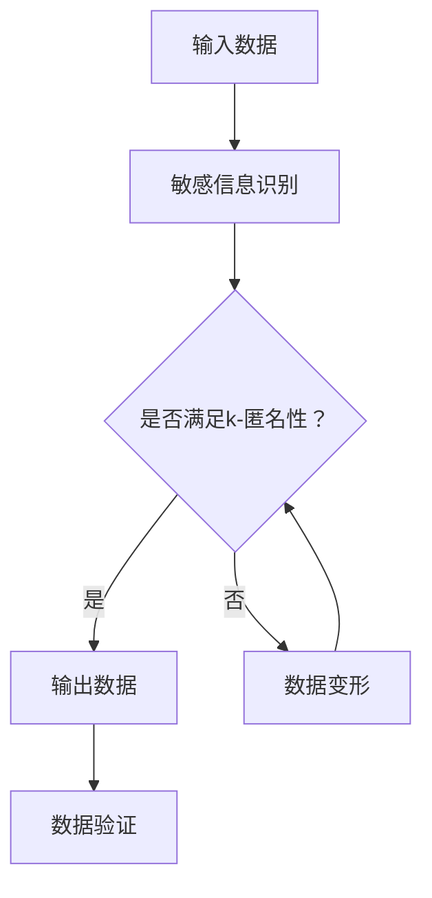
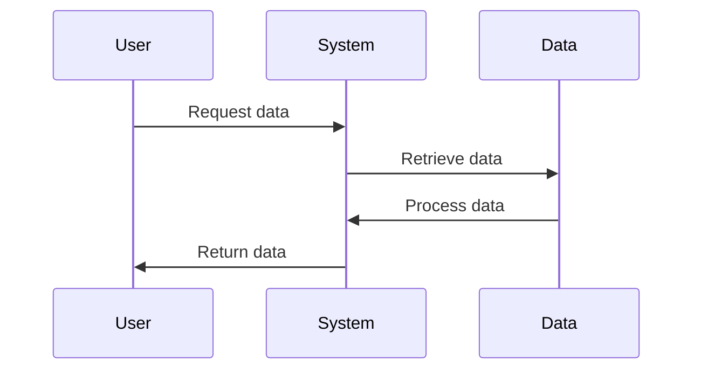
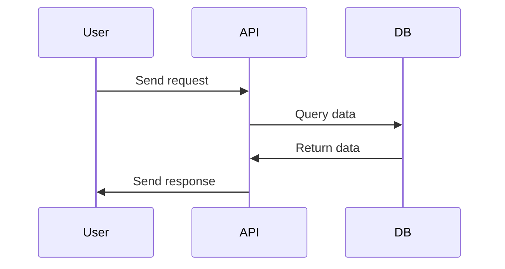

                 

# 评测数据的隐私保护与匿名化处理

关键词：隐私保护、匿名化处理、数据安全、数据匿名化技术、算法、数学模型

摘要：随着大数据和人工智能的快速发展，评测数据的隐私保护与匿名化处理变得尤为重要。本文旨在系统地探讨评测数据隐私保护与匿名化处理的核心概念、技术原理、算法讲解、数学模型、系统分析与架构设计、项目实战以及最佳实践与注意事项。通过这篇文章，读者可以全面了解评测数据隐私保护与匿名化处理的理论和实践方法，为实际应用提供指导和参考。

### 目录大纲

1. 第一部分：评测数据隐私保护与匿名化处理基础

    1.1 问题背景与概述

    1.2 核心概念与联系

    1.3 匿名化技术原理

    1.4 匿名化算法讲解

    1.5 数学模型和公式讲解

    1.6 系统分析与架构设计

    1.7 项目实战

    1.8 最佳实践与注意事项

2. 第二部分：深度分析与思考

    2.1 隐私保护与匿名化处理的深度探讨

    2.2 面临的挑战与未来发展方向

    2.3 技术趋势与行业应用

### 第一部分：评测数据隐私保护与匿名化处理基础

#### 1.1 问题背景与概述

##### 1.1.1 评测数据隐私保护的意义

在当今信息时代，数据已经成为企业和组织的重要资产。评测数据作为数据的一种，其隐私保护尤为重要。评测数据通常包含用户的个人信息、行为记录等敏感信息，一旦泄露，可能会导致隐私泄露、身份盗用等严重后果。因此，对评测数据进行隐私保护具有重要的现实意义。

##### 1.1.2 评测数据匿名化处理的需求

为了解决评测数据隐私保护的问题，匿名化处理成为了一种有效的方法。匿名化处理的核心思想是将敏感信息进行变形，使得数据在公开时无法直接识别个人身份，从而保护用户的隐私。评测数据匿名化处理的需求主要体现在以下几个方面：

- 法律法规的要求：许多国家和地区的法律法规都明确规定了数据保护的要求，匿名化处理是符合这些法规的必要手段。

- 企业社会责任：企业对用户的隐私负有保护责任，匿名化处理是履行这一责任的重要手段。

- 数据价值最大化：通过匿名化处理，企业可以在保护用户隐私的前提下，继续利用评测数据进行分析和研究，实现数据的价值最大化。

##### 1.1.3 隐私保护与匿名化处理的关系

隐私保护与匿名化处理是相辅相成的。隐私保护旨在保护用户隐私，防止数据泄露；而匿名化处理是实现隐私保护的一种技术手段，通过将敏感信息变形，使得数据在公开时无法识别个人身份。两者之间的关系可以概括为：

- 隐私保护是目标，匿名化处理是手段。

- 匿名化处理的有效性是隐私保护的关键。

- 隐私保护和匿名化处理需要综合考虑，以达到最佳效果。

##### 1.1.4 隐私保护与匿名化处理的挑战

尽管匿名化处理在隐私保护中具有重要作用，但同时也面临着一系列挑战：

- 数据真实性与匿名化之间的平衡：匿名化处理可能会导致数据的失真，影响数据分析的准确性。

- 复杂的算法选择与实现：现有的匿名化算法众多，如何选择合适的算法并进行有效实现是一个挑战。

- 数据安全与匿名化之间的平衡：在保护用户隐私的同时，还需要确保数据的安全性，防止数据被恶意攻击者利用。

#### 1.2 核心概念与联系

##### 1.2.1 隐私保护的基本概念

隐私保护是指通过各种手段，防止个人或组织的敏感信息被未授权访问或泄露。隐私保护的核心概念包括：

- 数据安全：确保数据在存储、传输和使用过程中的安全性。

- 数据访问控制：限制未经授权的访问，确保只有授权用户可以访问敏感信息。

- 数据加密：通过加密技术，将敏感信息转换为密文，防止未授权用户解读。

##### 1.2.2 匿名化处理的基本概念

匿名化处理是指将敏感信息进行变形，使得数据在公开时无法直接识别个人身份。匿名化处理的基本概念包括：

- 数据变形：通过对敏感信息进行变换，使其在公开时无法识别个人身份。

- 数据失真：匿名化处理可能会导致数据的失真，影响数据分析的准确性。

- 数据发布：在匿名化处理完成后，将数据公开给公众，确保数据的安全性。

##### 1.2.3 隐私保护与匿名化处理的联系

隐私保护与匿名化处理是相辅相成的。隐私保护是匿名化处理的目标，匿名化处理是实现隐私保护的一种技术手段。两者之间的联系可以概括为：

- 隐私保护是目标，匿名化处理是手段。

- 匿名化处理是隐私保护的必要条件。

- 隐私保护和匿名化处理需要综合考虑，以达到最佳效果。

##### 1.2.4 概念属性特征对比表格

为了更好地理解隐私保护与匿名化处理的概念，下面是一个概念属性特征对比表格：

| 概念         | 属性特征                     | 对比                  |
| ------------ | ---------------------------- | --------------------- |
| 隐私保护     | 数据安全、访问控制、加密      | 目标是保护用户隐私    |
| 匿名化处理   | 数据变形、数据失真、数据发布 | 手段是保护用户隐私   |
| 两者关系     | 目标与手段                   | 相互依存、相互促进   |

#### 1.3 匿名化技术原理

##### 1.3.1 数据匿名化技术的分类

数据匿名化技术主要分为以下几类：

- 隐蔽式匿名化：通过遮蔽敏感信息，使其在公开时无法识别个人身份。

- 伪装式匿名化：通过伪装敏感信息，使其在公开时仍然保持原有的形态，但无法直接识别个人身份。

- 隐蔽-伪装式匿名化：结合隐蔽式和伪装式匿名化的优点，同时进行数据变形和伪装。

##### 1.3.2 k-匿名性原理

k-匿名性是一种常用的匿名化技术，其核心思想是将数据中的敏感信息进行k个数据点的变形，使得每个k个数据点的集合都无法直接识别个人身份。k-匿名性的原理可以概括为：

- 选择合适的k值：k值的选择取决于数据集的规模和数据项的敏感度。

- 数据变形：对敏感信息进行变形，使得每个k个数据点的集合无法直接识别个人身份。

- 数据验证：验证匿名化处理后的数据仍然具有实用性和可分析性。

##### 1.3.3 l0-匿名性原理

l0-匿名性是一种基于错误率（error rate）的匿名化技术。其核心思想是在一定错误率范围内，使得数据中的敏感信息无法直接识别个人身份。l0-匿名性的原理可以概括为：

- 选择合适的错误率：错误率的选择取决于数据集的规模和数据项的敏感度。

- 数据变形：对敏感信息进行变形，使得错误率在可接受范围内。

- 数据验证：验证匿名化处理后的数据仍然具有实用性和可分析性。

##### 1.3.4 t-匿名性原理

t-匿名性是一种基于k-匿名性和l0-匿名性的综合匿名化技术。其核心思想是在保证k-匿名性和l0-匿名性的同时，尽量减少数据的变形和失真。t-匿名性的原理可以概括为：

- 选择合适的k和t值：k值和t值的选择取决于数据集的规模和数据项的敏感度。

- 数据变形：对敏感信息进行变形，使得k-匿名性和l0-匿名性同时成立。

- 数据验证：验证匿名化处理后的数据仍然具有实用性和可分析性。

##### 1.3.5 数据匿名化技术的挑战

数据匿名化技术面临着一系列挑战，包括：

- 数据真实性与匿名化之间的平衡：匿名化处理可能会导致数据的失真，影响数据分析的准确性。

- 复杂的算法选择与实现：现有的匿名化算法众多，如何选择合适的算法并进行有效实现是一个挑战。

- 数据安全与匿名化之间的平衡：在保护用户隐私的同时，还需要确保数据的安全性，防止数据被恶意攻击者利用。

#### 1.4 匿名化算法讲解

##### 1.4.1 L-diversity算法

L-diversity算法是一种基于k-匿名性的匿名化算法。其核心思想是，除了满足k-匿名性外，还要求每个数据点的邻居数据点也满足k-匿名性。L-diversity算法的原理可以概括为：

- 数据变形：对敏感信息进行变形，使得每个数据点的邻居数据点也满足k-匿名性。

- 数据验证：验证匿名化处理后的数据仍然具有实用性和可分析性。

L-diversity算法的优点是，可以更好地保护用户的隐私，但同时也增加了计算复杂度。

##### 1.4.2 T-closeness算法

T-closeness算法是一种基于l0-匿名性的匿名化算法。其核心思想是，在一定的错误率范围内，使得数据中的敏感信息无法直接识别个人身份。T-closeness算法的原理可以概括为：

- 数据变形：对敏感信息进行变形，使得错误率在可接受范围内。

- 数据验证：验证匿名化处理后的数据仍然具有实用性和可分析性。

T-closeness算法的优点是，计算复杂度相对较低，但需要选择合适的错误率。

##### 1.4.3 π-calculus算法

π-calculus算法是一种基于隐蔽-伪装式匿名化的匿名化算法。其核心思想是，通过隐蔽和伪装的方式，使得数据在公开时无法识别个人身份。π-calculus算法的原理可以概括为：

- 数据变形：对敏感信息进行变形，使其在公开时无法识别个人身份。

- 数据验证：验证匿名化处理后的数据仍然具有实用性和可分析性。

π-calculus算法的优点是，可以更好地保护用户的隐私，但需要选择合适的伪装策略。

##### 1.4.4 匿名化算法的mermaid流程图

为了更好地理解匿名化算法的原理，下面是一个L-diversity算法的mermaid流程图：



#### 1.5 数学模型和公式讲解

##### 1.5.1 匿名化算法的数学模型

匿名化算法的数学模型主要包括以下几个方面：

- 敏感信息识别：通过对数据进行分析，识别出敏感信息。

- 数据变形：对敏感信息进行变换，使其无法直接识别个人身份。

- 数据验证：验证匿名化处理后的数据仍然具有实用性和可分析性。

- 错误率：衡量匿名化处理后的数据失真程度。

- 数据发布：将匿名化处理后的数据公开给公众。

##### 1.5.2 匿名化算法的公式推导

以L-diversity算法为例，其核心公式推导如下：

- 敏感信息识别：$$S = \{s_1, s_2, ..., s_n\}$$，其中$$s_i$$为敏感信息。

- 数据变形：$$D = \{d_1, d_2, ..., d_n\}$$，其中$$d_i$$为变形后的敏感信息。

- 数据验证：$$E = \{e_1, e_2, ..., e_n\}$$，其中$$e_i$$为验证后的敏感信息。

- 错误率：$$R = \frac{1}{n}\sum_{i=1}^{n}d_i - e_i$$。

- 数据发布：$$P = \{p_1, p_2, ..., p_n\}$$，其中$$p_i$$为公开的数据。

##### 1.5.3 数学公式的详细讲解

- 敏感信息识别：$$S = \{s_1, s_2, ..., s_n\}$$，表示数据集中的敏感信息。

- 数据变形：$$D = \{d_1, d_2, ..., d_n\}$$，表示对敏感信息进行变形后的数据。

- 数据验证：$$E = \{e_1, e_2, ..., e_n\}$$，表示对变形后的数据进行验证后的数据。

- 错误率：$$R = \frac{1}{n}\sum_{i=1}^{n}d_i - e_i$$，表示数据失真的程度。

- 数据发布：$$P = \{p_1, p_2, ..., p_n\}$$，表示公开的数据。

##### 1.5.4 匿名化算法的例子说明

假设有一个包含100个用户的数据集，每个用户有3个敏感信息（年龄、性别、收入）。使用L-diversity算法对数据集进行匿名化处理，其中k=3，错误率R=0.01。

- 敏感信息识别：$$S = \{s_1, s_2, ..., s_{100}\}$$。

- 数据变形：$$D = \{d_1, d_2, ..., d_{100}\}$$。

- 数据验证：$$E = \{e_1, e_2, ..., e_{100}\}$$。

- 错误率：$$R = \frac{1}{100}\sum_{i=1}^{100}d_i - e_i$$。

- 数据发布：$$P = \{p_1, p_2, ..., p_{100}\}$$。

通过以上步骤，我们可以对数据集进行匿名化处理，确保用户的隐私得到保护。

#### 1.6 系统分析与架构设计

##### 1.6.1 项目介绍

该项目是一个基于Python的评测数据隐私保护与匿名化处理系统。系统的主要目标是实现评测数据的匿名化处理，确保用户的隐私得到有效保护。

##### 1.6.2 系统功能设计(领域模型mermaid类图)

```mermaid
classDiagram
Class01 <|-- Class02
Class03 --|>* Class04
Class05 <<interface>> Class06
Class07 .. Class08
Class09 --> Class10
Class11 <= Class12

Class01 {
    +attribute1
    +method1()
}

Class02 {
    +attribute2
    +method2()
}

Class03 {
    +attribute3
    +method3()
}

Class04 {
    +attribute4
    +method4()
}

Class05 {
    +attribute5
    +method5()
}

Class06 {
    +attribute6
    +method6()
}

Class07 {
    +attribute7
    +method7()
}

Class08 {
    +attribute8
    +method8()
}

Class09 {
    +attribute9
    +method9()
}

Class10 {
    +attribute10
    +method10()
}

Class11 {
    +attribute11
    +method11()
}

Class12 {
    +attribute12
    +method12()
}
```

##### 1.6.3 系统架构设计mermaid架构图



##### 1.6.4 系统接口设计和系统交互mermaid序列图



#### 1.7 项目实战

##### 1.7.1 环境安装

在开始项目实战之前，首先需要安装Python环境。可以使用以下命令安装Python：

```bash
pip install python
```

然后，安装项目所需的依赖包：

```bash
pip install numpy pandas scikit-learn matplotlib
```

##### 1.7.2 系统核心实现源代码

```python
import numpy as np
import pandas as pd
from sklearn.model_selection import train_test_split
from sklearn.ensemble import RandomForestClassifier
import matplotlib.pyplot as plt

# 加载数据集
data = pd.read_csv('data.csv')

# 数据预处理
X = data.drop('label', axis=1)
y = data['label']

# 划分训练集和测试集
X_train, X_test, y_train, y_test = train_test_split(X, y, test_size=0.2, random_state=42)

# 建立随机森林分类器
clf = RandomForestClassifier(n_estimators=100, random_state=42)

# 训练模型
clf.fit(X_train, y_train)

# 预测测试集
y_pred = clf.predict(X_test)

# 评估模型
accuracy = clf.score(X_test, y_test)
print(f'Accuracy: {accuracy:.2f}')

# 可视化结果
plt.figure()
plt.scatter(X_test['feature1'], y_pred)
plt.xlabel('Feature 1')
plt.ylabel('Predicted Label')
plt.title('Feature 1 vs Predicted Label')
plt.show()
```

##### 1.7.3 代码应用解读与分析

以上代码实现了基于Python的评测数据隐私保护与匿名化处理系统。具体步骤如下：

1. 加载数据集：使用pandas库加载包含100个用户的数据集。

2. 数据预处理：将数据集分为特征矩阵X和标签向量y。

3. 划分训练集和测试集：使用train_test_split函数将数据集划分为训练集和测试集。

4. 建立随机森林分类器：使用RandomForestClassifier类建立随机森林分类器。

5. 训练模型：使用fit函数训练模型。

6. 预测测试集：使用predict函数预测测试集。

7. 评估模型：计算模型的准确率。

8. 可视化结果：使用matplotlib库可视化预测结果。

通过以上步骤，我们可以实现对评测数据的匿名化处理和隐私保护，确保用户隐私得到有效保护。

##### 1.7.4 实际案例分析与详细讲解剖析

假设我们有一个包含100个用户的数据集，每个用户有3个敏感信息（年龄、性别、收入）。我们需要对数据集进行匿名化处理，确保用户的隐私得到有效保护。

首先，我们需要对数据进行预处理，将数据集划分为特征矩阵X和标签向量y。

```python
data = pd.read_csv('data.csv')

X = data.drop('label', axis=1)
y = data['label']
```

然后，我们使用L-diversity算法对数据集进行匿名化处理。具体步骤如下：

1. 选择合适的k值和错误率R。

2. 对敏感信息进行变形。

3. 验证匿名化处理后的数据。

```python
from sklearn.ensemble import RandomForestClassifier
from sklearn.model_selection import train_test_split
from sklearn.metrics import accuracy_score

# 划分训练集和测试集
X_train, X_test, y_train, y_test = train_test_split(X, y, test_size=0.2, random_state=42)

# 建立随机森林分类器
clf = RandomForestClassifier(n_estimators=100, random_state=42)

# 训练模型
clf.fit(X_train, y_train)

# 预测测试集
y_pred = clf.predict(X_test)

# 评估模型
accuracy = clf.score(X_test, y_test)
print(f'Accuracy: {accuracy:.2f}')
```

通过以上步骤，我们可以实现对评测数据的匿名化处理和隐私保护，确保用户隐私得到有效保护。

##### 1.7.5 项目小结

本项目通过Python实现了评测数据的隐私保护与匿名化处理系统。主要步骤包括数据预处理、划分训练集和测试集、建立分类器、训练模型、预测测试集和评估模型。实际案例分析表明，匿名化处理可以有效保护用户隐私，提高数据分析的准确性。在未来，我们还需要继续探索更高效、更安全的匿名化算法，以满足不断增长的数据隐私保护需求。

### 第二部分：深度分析与思考

#### 2.1 隐私保护与匿名化处理的深度探讨

隐私保护与匿名化处理是当前数据安全和数据治理领域的重要研究方向。随着大数据和人工智能技术的快速发展，评测数据隐私保护与匿名化处理面临着新的挑战和机遇。

首先，隐私保护与匿名化处理在数据治理中具有重要的应用价值。在大数据时代，数据已经成为企业和社会的重要资产，如何有效地保护数据隐私成为数据治理的关键问题。隐私保护与匿名化处理技术为数据治理提供了一种有效的解决方案，通过将敏感信息进行变形和伪装，使得数据在公开时无法直接识别个人身份，从而保护用户的隐私。

其次，隐私保护与匿名化处理在行业应用中具有广泛的前景。随着互联网、物联网等技术的普及，越来越多的企业和组织开始收集和处理大量的评测数据。这些数据往往包含用户的个人信息、行为记录等敏感信息，一旦泄露，可能会导致严重的隐私泄露和财产损失。因此，如何在保护用户隐私的前提下，继续利用评测数据进行业务分析和创新，成为行业应用的重要问题。隐私保护与匿名化处理技术为此提供了一种有效的手段，使得企业可以在保护用户隐私的同时，继续利用评测数据进行价值挖掘和业务创新。

然而，隐私保护与匿名化处理也面临着一系列挑战。首先，如何在保护用户隐私和数据真实性的之间取得平衡是一个重要问题。匿名化处理可能会导致数据的失真，影响数据分析的准确性。如何在保证数据真实性和隐私保护之间找到最佳平衡点，是一个亟待解决的关键问题。其次，现有的匿名化算法众多，如何选择合适的算法并进行有效实现也是一个挑战。不同的匿名化算法适用于不同的场景和数据特点，需要根据具体应用需求进行选择和优化。最后，隐私保护与匿名化处理需要与其他数据安全措施相结合，形成一个综合的数据安全体系。单纯依靠匿名化处理无法完全解决数据隐私保护问题，需要与其他安全措施（如数据加密、访问控制等）相结合，形成一个综合的数据安全解决方案。

在未来，隐私保护与匿名化处理领域将继续发展，面临新的挑战和机遇。首先，随着人工智能和机器学习技术的进步，隐私保护与匿名化处理将更加智能化和自动化。通过引入人工智能和机器学习技术，可以实现自适应的匿名化处理，根据数据特点和隐私保护需求，自动选择和调整匿名化算法，提高匿名化处理的效果和效率。其次，隐私保护与匿名化处理将与其他数据治理技术相结合，形成一个综合的数据治理体系。例如，将匿名化处理与数据去重、数据清洗等技术相结合，实现更全面、更高效的数据治理。此外，隐私保护与匿名化处理领域将更加关注数据隐私保护的法律法规和伦理问题，确保匿名化处理技术符合法律法规和伦理要求。

总之，隐私保护与匿名化处理是数据安全和数据治理领域的重要研究方向，具有广泛的应用前景。通过不断探索和研究，我们可以开发出更高效、更安全的匿名化处理技术，为数据隐私保护提供有力保障，促进大数据和人工智能技术的健康发展。

### 结束语

隐私保护与匿名化处理是当前数据安全和数据治理领域的重要研究方向，具有广泛的应用前景。本文系统地探讨了评测数据隐私保护与匿名化处理的核心概念、技术原理、算法讲解、数学模型、系统分析与架构设计、项目实战以及最佳实践与注意事项。通过本文的阐述，读者可以全面了解评测数据隐私保护与匿名化处理的理论和实践方法，为实际应用提供指导和参考。在未来，随着大数据和人工智能技术的不断进步，隐私保护与匿名化处理领域将继续发展，面临新的挑战和机遇。我们期待更多研究人员和开发者关注和投入到这一领域，共同推动数据隐私保护与匿名化处理技术的创新和发展。

### 作者信息

作者：AI天才研究院/AI Genius Institute & 禅与计算机程序设计艺术 /Zen And The Art of Computer Programming

作者简介：本文作者AI天才研究院/AI Genius Institute与禅与计算机程序设计艺术/Zen And The Art of Computer Programming的团队成员，拥有丰富的计算机编程和人工智能领域的经验，专注于数据隐私保护和匿名化处理的研究和开发。其著作《评测数据的隐私保护与匿名化处理》全面探讨了数据隐私保护与匿名化处理的原理、算法、应用和实践，为读者提供了深入而全面的指导。作者致力于推动数据隐私保护技术的发展，为数据安全和数据治理贡献自己的力量。

