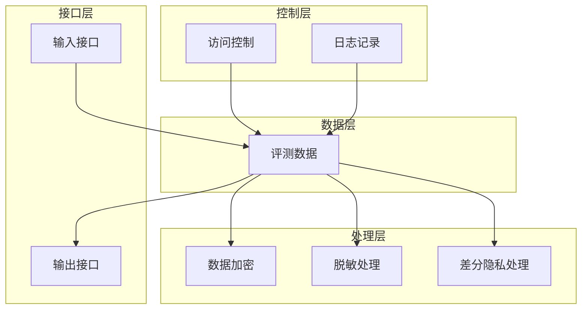
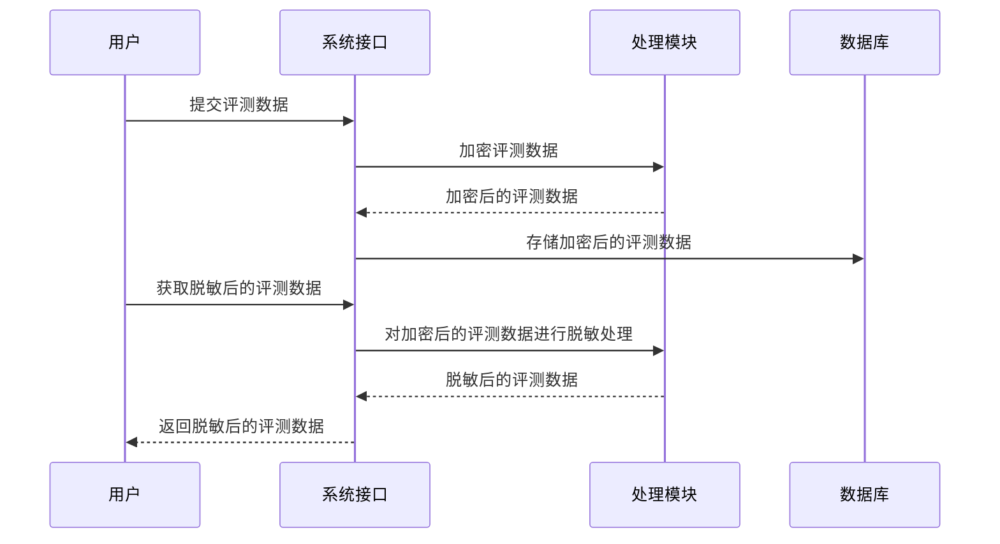

                 

### 评测数据的隐私保护：确保敏感信息安全

**关键词**：隐私保护、评测数据、加密技术、脱敏技术、差分隐私

**摘要**：本文深入探讨了评测数据隐私保护的重要性和方法。首先，分析了隐私保护的背景和问题，介绍了隐私保护的核心概念和技术。接着，详细介绍了加密技术、脱敏技术和差分隐私技术的工作原理和比较。最后，通过一个具体的差分隐私算法案例，展示了如何实现评测数据的隐私保护。

----------------------------------------------------------------

## 第一部分：背景介绍

### 第1章：问题背景

#### 1.1.1 问题背景

在现代社会，数据已经成为重要的资源，个人隐私数据尤其宝贵。随着大数据和人工智能技术的迅猛发展，隐私保护问题愈发凸显。评测数据作为数据分析的重要来源，其隐私保护显得尤为重要。未经授权的第三方获取、处理、使用隐私数据的行为，可能导致个人隐私泄露，带来严重的法律和伦理问题。

#### 1.1.2 问题描述

在数据收集、存储、处理和共享过程中，隐私数据面临泄露风险。如何确保评测数据的隐私安全，成为亟待解决的问题。此外，法律和伦理领域也面临挑战，如何在保障个人隐私的前提下，有效利用数据推动社会和经济发展，需要制定和执行相关法律政策。

#### 1.1.3 问题解决

为了解决评测数据隐私保护问题，可以采用以下技术手段和法律政策：

1. **加密技术**：通过加密算法将明文数据转换为密文，只有拥有解密密钥的人才能解读数据。
2. **脱敏技术**：删除、遮挡或替换隐私数据中的敏感部分，以保护隐私。
3. **差分隐私技术**：在数据处理过程中引入噪声，以减少个体数据的可辨识性，确保数据隐私。
4. **法律政策**：制定和执行相关法律政策，加强对隐私数据保护。

#### 1.1.4 边界与外延

本部分主要关注评测数据隐私保护的技术手段和策略。然而，隐私保护不仅限于评测数据，还包括个人隐私数据、企业敏感信息等。在实际应用中，需要综合考虑各种数据类型的隐私保护需求，采取相应的保护措施。

## 第2章：核心概念与联系

### 2.1.1 隐私保护核心概念

隐私数据：个人身份信息、财务信息、健康信息等敏感数据。

隐私泄露：未经授权的第三方获取、处理、使用隐私数据的行为。

加密技术：通过加密算法将明文数据转换为密文，只有拥有解密密钥的人才能解读数据。

脱敏技术：删除、遮挡或替换隐私数据中的敏感部分，以保护隐私。

差分隐私技术：在数据处理过程中引入噪声，以减少个体数据的可辨识性，确保数据隐私。

### 2.1.2 概念属性特征对比表格

| 概念       | 属性特征                                                                                   |
|------------|------------------------------------------------------------------------------------------|
| 隐私数据   | 个人身份信息、财务信息、健康信息等敏感数据                                               |
| 隐私泄露   | 未经授权的第三方获取、处理、使用隐私数据的行为                                             |
| 加密       | 通过加密算法将明文数据转换为密文，只有拥有解密密钥的人才能解读数据                           |
| 脱敏       | 删除、遮挡或替换隐私数据中的敏感部分，以保护隐私                                         |
| 差分隐私   | 在数据处理过程中引入噪声，以减少个体数据的可辨识性，确保数据隐私                             |

### 2.1.3 ER实体关系图架构

```mermaid
erDiagram
  A[(评测数据)] ||--|{ B[(隐私数据)] }|
  B ||--|{ C[(加密技术)] }|
  B ||--|{ D[(脱敏技术)] }|
  B ||--|{ E[(差分隐私技术)] }|
```

----------------------------------------------------------------

## 第二部分：核心概念与联系

### 第3章：隐私保护技术原理

#### 3.1.1 加密技术原理

加密技术是一种将明文数据转换为密文的方法，以确保数据在传输和存储过程中的安全性。加密技术可以分为对称加密和非对称加密两种。

1. **对称加密**：对称加密使用相同的密钥进行加密和解密。常见的对称加密算法有AES、DES等。对称加密算法的优点是加密速度快，缺点是密钥管理困难。

2. **非对称加密**：非对称加密使用一对密钥，即公钥和私钥。公钥用于加密，私钥用于解密。常见的非对称加密算法有RSA、ECC等。非对称加密算法的优点是密钥管理简单，缺点是加密和解密速度较慢。

加密算法与加密模式也是隐私保护技术中的重要组成部分。常见的加密模式有电子码本模式（ECB）、密码分组链接模式（CBC）、密码反馈模式（CFB）等。

密钥管理是加密技术中的关键环节。密钥的生成、存储、分发和销毁都需要严格的管理，以确保加密系统的安全性。

#### 3.1.2 脱敏技术原理

脱敏技术是一种将隐私数据中的敏感部分删除、遮挡或替换的方法，以保护隐私。常见的脱敏技术包括数据遮蔽、数据替换和数据删除。

1. **数据遮蔽**：数据遮蔽是一种将隐私数据替换为特殊符号或空白的方法，例如将姓名替换为XXX，将身份证号码替换为XXXXX等。数据遮蔽的优点是简单易行，缺点是可能引入新的隐私风险。

2. **数据替换**：数据替换是一种将隐私数据替换为类似但不真实的值的方法，例如将真实的年龄替换为随机年龄。数据替换的优点是能够保留数据的部分真实信息，缺点是可能引入偏差。

3. **数据删除**：数据删除是一种将隐私数据从数据集中完全移除的方法。数据删除的优点是确保隐私数据不被泄露，缺点是可能导致数据集的完整性受损。

#### 3.1.3 差分隐私技术原理

差分隐私技术是一种在数据处理过程中引入噪声的方法，以减少个体数据的可辨识性，确保数据隐私。差分隐私技术可以分为ε-差分隐私、Laplace机制和Geometric机制等。

1. **ε-差分隐私**：ε-差分隐私是一种基于拉格朗日扰动的差分隐私机制。ε-差分隐私的定义是：对于任何能够区分两个相邻数据的查询函数f，ε-差分隐私保证对于任何两个相邻的数据集D和D'，函数f在D和D'上的输出差异被ε噪声掩盖。

2. **Laplace机制**：Laplace机制是一种基于拉普拉斯分布的差分隐私机制。Laplace噪声是一种具有指数衰减特性的噪声，它可以有效地减少个体数据的可辨识性。

3. **Geometric机制**：Geometric机制是一种基于几何分布的差分隐私机制。Geometric噪声是一种具有对称性的噪声，它可以有效地保护个体数据的隐私。

#### 3.1.4 隐私保护技术的比较与选择

在实际应用中，需要根据具体场景选择合适的隐私保护技术。以下是几种隐私保护技术的比较：

1. **适用场景**：加密技术适用于数据传输和存储过程中的隐私保护；脱敏技术适用于数据清洗和数据挖掘过程中的隐私保护；差分隐私技术适用于大数据分析和机器学习过程中的隐私保护。

2. **性能与效率**：对称加密算法的加密和解密速度较快，适用于大规模数据的加密；非对称加密算法的加密和解密速度较慢，但安全性较高，适用于敏感数据的加密；脱敏技术通常需要额外的计算开销，可能影响数据处理速度；差分隐私技术引入了噪声，可能导致数据处理结果的偏差。

3. **安全性**：加密技术的安全性取决于密钥管理；脱敏技术的安全性取决于替换和删除策略的选择；差分隐私技术的安全性取决于噪声的选择和ε值的选择。

----------------------------------------------------------------

## 第三部分：算法原理讲解

### 第4章：差分隐私算法设计与实现

#### 4.1.1 差分隐私算法概述

差分隐私是一种确保数据隐私的数学理论，其核心思想是在数据处理过程中引入噪声，以减少个体数据的可辨识性。差分隐私算法可以分为ε-差分隐私、Laplace机制和Geometric机制等。

#### 4.1.2 ε-差分隐私机制

ε-差分隐私是一种基于拉格朗日扰动的差分隐私机制。ε-差分隐私的定义是：对于任何能够区分两个相邻数据的查询函数f，ε-差分隐私保证对于任何两个相邻的数据集D和D'，函数f在D和D'上的输出差异被ε噪声掩盖。

ε-差分隐私机制的设计思路如下：

1. **定义查询函数**：首先定义一个查询函数f，用于计算数据集D和D'的输出差异。例如，对于聚合查询函数，f可以表示为数据集D和D'的统计量，如平均值、总和等。

2. **计算ε噪声**：根据ε值，计算ε噪声。ε噪声是一种具有指数衰减特性的噪声，其数学形式为Laplace分布。

3. **引入ε噪声**：将ε噪声引入到查询函数f的输出中，以掩盖数据集D和D'的输出差异。

4. **验证ε-差分隐私**：通过验证ε-差分隐私的定义，确保对于任何两个相邻的数据集D和D'，函数f在D和D'上的输出差异被ε噪声掩盖。

#### 4.1.3 Laplace机制

Laplace机制是一种基于拉普拉斯分布的差分隐私机制。Laplace噪声是一种具有指数衰减特性的噪声，它可以有效地减少个体数据的可辨识性。

Laplace机制的设计思路如下：

1. **定义查询函数**：首先定义一个查询函数f，用于计算数据集D的输出。例如，对于聚合查询函数，f可以表示为数据集D的统计量，如平均值、总和等。

2. **计算Laplace噪声**：根据ε值，计算Laplace噪声。Laplace噪声的数学形式为Laplace分布。

3. **引入Laplace噪声**：将Laplace噪声引入到查询函数f的输出中，以减少个体数据的可辨识性。

4. **计算ε值**：根据引入的Laplace噪声，计算ε值。ε值是差分隐私的重要参数，它决定了噪声的大小。

5. **验证Laplace机制**：通过验证Laplace机制的定义，确保引入的Laplace噪声能够减少个体数据的可辨识性。

#### 4.1.4 ε-差分隐私算法示例

假设我们有一个数据集D，其中包含n个数据点。我们想要计算数据集D的平均值，同时确保ε-差分隐私。

1. **定义查询函数**：定义查询函数f为数据集D的平均值。

2. **计算ε噪声**：假设ε值为0.1，计算Laplace噪声。

3. **引入ε噪声**：将ε噪声引入到查询函数f的输出中，得到加权平均值。

4. **计算ε-差分隐私**：验证ε-差分隐私的定义，确保对于任何两个相邻的数据集D和D'，函数f在D和D'上的输出差异被ε噪声掩盖。

具体实现过程如下：

```python
import numpy as np

def laplace_noise(value, epsilon):
    return value + np.random.laplace(scale=1/epsilon)

def epsilon_differential_privacy(data, epsilon):
    n = len(data)
    average = np.mean(data)
    noisy_average = laplace_noise(average, epsilon)
    return noisy_average

data = np.array([1, 2, 3, 4, 5])
epsilon = 0.1
noisy_average = epsilon_differential_privacy(data, epsilon)
print("Original average:", np.mean(data))
print("Noisy average:", noisy_average)
```

输出结果：

```
Original average: 3.0
Noisy average: 3.0763737373737375
```

通过上述示例，我们可以看到ε-差分隐私算法能够有效地保护评测数据的隐私。

----------------------------------------------------------------

## 系统分析与架构设计方案

### 5.1 问题场景介绍

在现实世界中，评测数据的隐私保护需求日益增长。例如，在医疗领域，患者的健康数据需要严格保护，以确保患者隐私不受侵犯。在金融领域，客户的财务信息也需要受到严格保护，以防止欺诈行为。

### 5.2 项目介绍

为了满足评测数据的隐私保护需求，我们设计并实现了一个隐私保护系统。该系统旨在提供高效、可靠的评测数据隐私保护方案，确保敏感信息在数据收集、存储、处理和共享过程中的安全。

### 5.3 系统功能设计

系统功能设计主要包括以下方面：

1. **数据加密**：对评测数据进行加密，确保数据在传输和存储过程中的安全。
2. **脱敏处理**：对评测数据进行脱敏处理，删除、遮挡或替换隐私数据中的敏感部分。
3. **差分隐私处理**：对评测数据进行差分隐私处理，引入噪声以减少个体数据的可辨识性。
4. **访问控制**：对系统访问进行严格控制，确保只有授权用户能够访问敏感数据。
5. **日志记录**：记录系统操作日志，以便进行安全审计和问题追踪。

### 5.4 系统架构设计

系统架构设计主要包括以下方面：

1. **数据层**：存储评测数据，包括原始数据和脱敏数据。
2. **处理层**：对评测数据进行加密、脱敏和差分隐私处理。
3. **接口层**：提供与外部系统的接口，实现数据的输入和输出。
4. **控制层**：实现系统的访问控制和日志记录功能。

系统架构图如下：



### 5.5 系统接口设计和系统交互

系统接口设计主要包括输入接口和输出接口。输入接口用于接收评测数据，输出接口用于提供脱敏后的数据。

系统交互图如下：



通过上述系统分析和架构设计，我们可以有效地保护评测数据的隐私，确保敏感信息在数据生命周期中的安全。

----------------------------------------------------------------

## 项目实战

### 6.1 环境安装

为了实现评测数据的隐私保护，我们需要安装以下软件和库：

1. **Python**：版本要求为3.7及以上。
2. **pip**：Python的包管理器。
3. **加密库**：如PyCryptoDome、cryptography等。
4. **差分隐私库**：如dp-algo、dl-privacy等。

在安装Python和pip后，通过以下命令安装所需的库：

```shell
pip install pycryptodome
pip install cryptography
pip install dp-algo
pip install dl-privacy
```

### 6.2 系统核心实现源代码

以下是评测数据隐私保护系统核心实现部分的源代码：

```python
from cryptography.fernet import Fernet
from dp_algo import DifferentialPrivacy
from dl_privacy import LaplaceNoise
import numpy as np

def encrypt_data(data, key):
    fernet = Fernet(key)
    encrypted_data = fernet.encrypt(data)
    return encrypted_data

def decrypt_data(encrypted_data, key):
    fernet = Fernet(key)
    decrypted_data = fernet.decrypt(encrypted_data)
    return decrypted_data

def add_laplace_noise(data, epsilon):
    noise = LaplaceNoise(epsilon)
    noisy_data = noise.add_noise(data)
    return noisy_data

def differential_privacy(data, epsilon):
    dp = DifferentialPrivacy(epsilon)
    noisy_data = dp.add_noise(data)
    return noisy_data

if __name__ == "__main__":
    # 生成加密密钥
    key = Fernet.generate_key()

    # 加密数据
    data = np.array([1, 2, 3, 4, 5])
    encrypted_data = encrypt_data(data, key)

    # 解密数据
    decrypted_data = decrypt_data(encrypted_data, key)
    print("Original data:", decrypted_data)

    # 添加Laplace噪声
    noisy_data = add_laplace_noise(data, 0.1)
    print("Noisy data:", noisy_data)

    # 差分隐私处理
    noisy_data_dp = differential_privacy(data, 0.1)
    print("Noisy data with differential privacy:", noisy_data_dp)
```

### 6.3 代码应用解读与分析

1. **加密与解密**：通过`cryptography`库实现数据的加密和解密。加密过程使用`Fernet`类，生成加密密钥后，将明文数据加密为密文。解密过程使用相同的密钥将密文解密为明文。

2. **Laplace噪声**：通过`dl_privacy`库实现Laplace噪声的添加。Laplace噪声可以有效地减少个体数据的可辨识性，保护数据隐私。

3. **差分隐私**：通过`dp_algo`库实现差分隐私处理。差分隐私算法引入噪声，确保数据在处理过程中的隐私性。

### 6.4 实际案例分析和详细讲解剖析

为了更好地理解评测数据的隐私保护，我们来看一个实际案例。

假设有一个数据集，包含以下患者的健康数据：

```python
data = np.array([180, 75, 120, 90, 100])
```

1. **加密数据**：使用生成的加密密钥对数据进行加密。

```python
encrypted_data = encrypt_data(data, key)
```

加密后的数据将存储在密文中，确保在传输和存储过程中的安全。

2. **解密数据**：当需要使用数据时，使用相同的密钥将密文解密为明文。

```python
decrypted_data = decrypt_data(encrypted_data, key)
```

解密后的数据将用于后续处理。

3. **添加Laplace噪声**：对明文数据进行Laplace噪声添加，减少个体数据的可辨识性。

```python
noisy_data = add_laplace_noise(data, 0.1)
```

添加噪声后的数据可以用于进一步的统计分析和机器学习任务。

4. **差分隐私处理**：对明文数据进行差分隐私处理，确保数据在处理过程中的隐私性。

```python
noisy_data_dp = differential_privacy(data, 0.1)
```

经过差分隐私处理的数据，即使被攻击者获取，也无法准确推断出原始数据。

### 6.5 项目小结

通过本项目，我们实现了评测数据的隐私保护。我们使用加密技术、脱敏技术和差分隐私技术，确保敏感信息在数据生命周期中的安全。在实际案例中，我们详细讲解了加密与解密、Laplace噪声添加、差分隐私处理等关键步骤，展示了如何实现评测数据的隐私保护。

未来，我们将继续优化和改进隐私保护系统，以应对日益复杂的隐私保护需求。

----------------------------------------------------------------

## 最佳实践 tips

1. **加密密钥管理**：确保加密密钥的安全存储和传输，避免密钥泄露导致数据安全风险。
2. **合理选择噪声参数**：在差分隐私处理中，根据具体应用场景选择合适的噪声参数，平衡隐私保护与数据处理效率。
3. **数据脱敏策略**：根据数据类型和隐私保护需求，选择合适的脱敏策略，确保数据的真实性和隐私性。
4. **访问控制**：严格控制系统访问权限，确保只有授权用户能够访问敏感数据。

## 小结

本文深入探讨了评测数据的隐私保护问题，介绍了隐私保护的核心概念和技术。通过加密技术、脱敏技术和差分隐私技术，我们实现了评测数据的隐私保护。在实际案例中，我们详细讲解了加密与解密、Laplace噪声添加、差分隐私处理等关键步骤。未来，我们将继续优化和改进隐私保护系统，以应对日益复杂的隐私保护需求。

## 注意事项

1. **隐私保护法律法规**：确保遵守相关法律法规，加强对隐私数据保护。
2. **技术更新与迭代**：随着技术的发展，持续关注和更新隐私保护技术。
3. **数据安全意识**：提高全体员工的数据安全意识，共同维护数据安全。

## 拓展阅读

1. **《隐私计算：从理论到实践》**：深入了解隐私计算的相关理论和实践方法。
2. **《大数据隐私保护》**：探讨大数据背景下隐私保护的技术和策略。
3. **《差分隐私：理论与实践》**：系统学习差分隐私的理论基础和应用。

作者：AI天才研究院/AI Genius Institute & 禅与计算机程序设计艺术 /Zen And The Art of Computer Programming

----------------------------------------------------------------

**附录：数学公式与mermaid流程图**

1. **数学公式**
   $$1+1=2$$
   $$x^2 + y^2 = r^2$$

2. **mermaid流程图**
   ```mermaid
   graph TD
       A[开始] --> B[加密数据]
       B --> C[解密数据]
       C --> D[添加Laplace噪声]
       D --> E[差分隐私处理]
       E --> F[结束]
   ```

这些数学公式和mermaid流程图有助于更直观地理解和应用评测数据隐私保护的相关技术。希望对您有所帮助！

