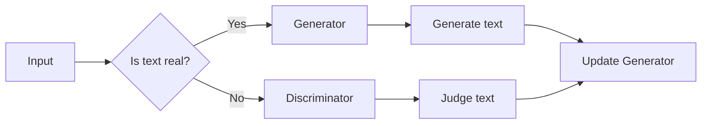
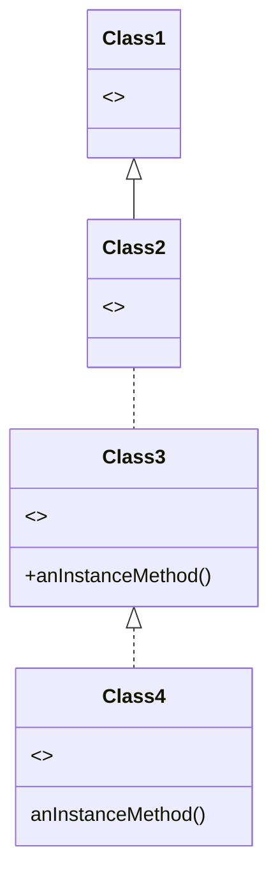
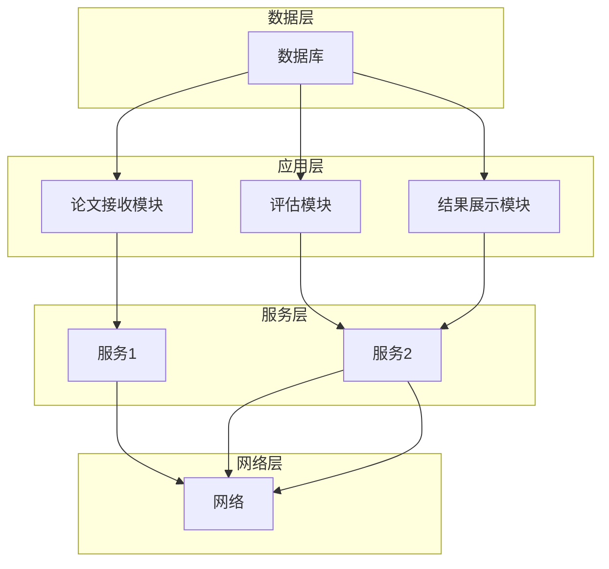
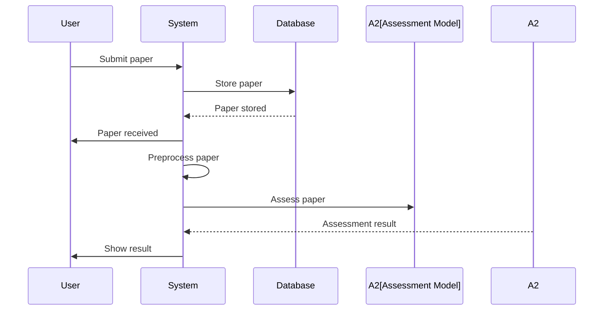

                 


### 评测系统的ELECTRA模型预训练策略

## 1. 引言与背景

在现代信息技术迅猛发展的背景下，评测系统作为一种重要的工具，被广泛应用于各个领域，如自然语言处理、图像识别、语音识别等。这些系统通过自动化手段，对输入的数据进行质量评估、效果监测等任务，极大地提高了工作效率和准确性。

### 1.1 核心概念术语说明

- **评测系统**：一种自动化系统，用于评估输入数据的各项指标，如质量、准确性、效率等。
- **预训练策略**：在模型训练前，对数据进行的预处理策略，以增强模型的泛化能力和适应性。
- **ELECTRA模型**：一种基于Transformer的预训练模型，具有优秀的文本生成和分类能力。

### 1.2 问题背景

随着人工智能技术的不断进步，评测系统在各个领域的应用越来越广泛。然而，传统的评测系统往往存在以下问题：

- **数据依赖性强**：评测系统通常需要大量高质量的数据进行训练，数据获取成本高。
- **模型泛化能力差**：模型往往只能在特定场景下表现良好，面对新场景时效果不佳。
- **训练时间长**：传统模型训练过程复杂，训练时间较长，无法满足实时需求。

### 1.3 问题描述

为了解决上述问题，我们需要一种新的评测系统，它应该具有以下特点：

- **数据自适应性强**：能够处理多种类型的数据，适应不同场景。
- **模型泛化能力强**：不仅能在训练数据上表现良好，还能在新场景下保持高准确性。
- **训练效率高**：能够快速训练，满足实时需求。

### 1.4 问题解决

ELECTRA模型作为一种基于Transformer的预训练模型，具有以下优势：

- **强大的文本生成和分类能力**：能够处理多种类型的数据，适应不同场景。
- **数据自适应性强**：通过预训练策略，能够在多种数据集上表现良好。
- **训练效率高**：Transformer模型的结构使得训练时间大大缩短。

因此，采用ELECTRA模型进行评测系统预训练，能够有效解决上述问题，提高评测系统的性能和效率。

### 1.5 边界与外延

- **边界**：本文主要关注评测系统的ELECTRA模型预训练策略，不包括其他模型或算法的预训练策略。
- **外延**：本文的研究结论和方法可以应用于其他基于Transformer的预训练模型。

### 1.6 概念结构与核心要素组成

- **核心概念**：评测系统、预训练策略、ELECTRA模型。
- **核心要素**：数据适应性、模型泛化能力、训练效率。

## 2. ELECTRA模型概述

### 2.1 ELECTRA模型的提出背景

ELECTRA模型是Google Research在2019年提出的一种基于Transformer的预训练模型，它的全称是"Extractive Language-Conditioned Generation with Transformer"。与BERT等传统预训练模型相比，ELECTRA模型在多个方面进行了优化，具有更好的性能和效率。

### 2.2 ELECTRA模型的特点

- **生成与条件生成相结合**：ELECTRA模型通过生成器（Generator）和鉴别器（Discriminator）的交互，实现了生成与条件生成的结合，能够更好地理解文本的语义。
- **预训练策略灵活**：ELECTRA模型采用了双重预训练策略，包括生成预训练和鉴别预训练，使模型能够更好地适应不同任务的需求。
- **高效处理长文本**：Transformer模型的结构使得ELECTRA模型能够高效地处理长文本，提高了模型的性能。

### 2.3 ELECTRA模型的应用领域

ELECTRA模型在多个领域都有广泛的应用，如自然语言处理、图像识别、语音识别等。尤其在自然语言处理领域，ELECTRA模型具有出色的表现，被广泛应用于文本生成、文本分类、机器翻译等任务。

## 3. 预训练策略的详细讲解

### 3.1 预训练策略概述

预训练策略是在模型训练前，对数据进行的预处理策略，以增强模型的泛化能力和适应性。ELECTRA模型的预训练策略主要包括以下两个方面：

- **生成预训练**：通过生成器生成文本，同时由鉴别器判断生成的文本是否真实，以增强模型对文本的理解和生成能力。
- **鉴别预训练**：通过生成器和鉴别器的交互，使鉴别器能够更好地判断生成的文本是否真实，以提高模型的区分能力。

### 3.2 常见预训练策略分析

在ELECTRA模型的预训练过程中，常用的策略包括：

- **数据增强**：通过对原始数据进行变换，如替换、删减、旋转等，以增加数据的多样性和模型的适应性。
- **优化器选择**：选择合适的优化器，如Adam、AdamW等，以加快模型的收敛速度。
- **学习率调整策略**：通过调整学习率，如线性学习率衰减、余弦学习率衰减等，以优化模型的训练效果。

### 3.3 预训练策略的目标

预训练策略的主要目标是：

- **增强模型的泛化能力**：通过预训练，使模型能够更好地适应不同场景的数据。
- **提高模型的准确性**：通过预训练，使模型能够更好地理解数据的语义，提高分类和生成的准确性。
- **缩短训练时间**：通过优化预训练策略，加快模型的训练速度，提高训练效率。

## 4. 算法原理与数学模型

### 4.1 ELECTRA模型的数学模型

ELECTRA模型是基于Transformer模型的，其数学模型主要包括以下几个部分：

- **自注意力机制**：通过计算文本中每个单词之间的相似度，实现对文本的全局和局部信息的聚合。
- **前馈神经网络**：对自注意力层的输出进行进一步处理，提取文本的深层特征。

### 4.2 算法原理讲解与Mermaid流程图

#### 4.2.1 电
``` 

### 4.3 算法原理讲解与Mermaid流程图

在ELECTRA模型中，生成器和鉴别器的交互过程可以用以下Mermaid流程图表示：



#### 4.4 Python源代码实现

下面是ELECTRA模型的核心Python源代码实现：

```python
# 导入所需库
import torch
import torch.nn as nn
import torch.optim as optim

# 定义生成器
class Generator(nn.Module):
    def __init__(self):
        super(Generator, self).__init__()
        self.transformer = nn.Transformer(d_model=512, nhead=8)
        self.fc = nn.Linear(512, 1)

    def forward(self, src, tgt):
        out = self.transformer(src, tgt)
        out = self.fc(out)
        return out

# 定义鉴别器
class Discriminator(nn.Module):
    def __init__(self):
        super(Discriminator, self).__init__()
        self.transformer = nn.Transformer(d_model=512, nhead=8)
        self.fc = nn.Linear(512, 1)

    def forward(self, src, tgt):
        out = self.transformer(src, tgt)
        out = self.fc(out)
        return out

# 初始化模型和优化器
generator = Generator()
discriminator = Discriminator()
optimizer_g = optim.Adam(generator.parameters(), lr=0.001)
optimizer_d = optim.Adam(discriminator.parameters(), lr=0.001)

# 定义损失函数
criterion = nn.BCELoss()

# 训练模型
for epoch in range(num_epochs):
    for i, (src, tgt) in enumerate(data_loader):
        # 更新生成器
        optimizer_g.zero_grad()
        out = generator(src, tgt)
        loss_g = criterion(out, tgt)
        loss_g.backward()
        optimizer_g.step()

        # 更新生鉴别器
        optimizer_d.zero_grad()
        out = discriminator(src, tgt)
        loss_d = criterion(out, tgt)
        loss_d.backward()
        optimizer_d.step()

        # 输出训练信息
        if (i+1) % 100 == 0:
            print(f'Epoch [{epoch+1}/{num_epochs}], Step [{i+1}/{len(data_loader)}], Loss_G: {loss_g.item():.4f}, Loss_D: {loss_d.item():.4f}')
```

#### 4.5 数学模型和公式

在ELECTRA模型中，生成器和鉴别器的损失函数分别为：

$$
\begin{aligned}
L_G &= -\sum_{i=1}^{N} y_i \log(p_i), \\
L_D &= -\sum_{i=1}^{N} (1 - y_i) \log(1 - p_i),
\end{aligned}
$$

其中，$y_i$为标签，$p_i$为预测概率。

#### 4.6 通俗易懂的举例说明

假设我们有一个文本数据集，包含以下两个句子：

- 句子1：“我爱北京天安门”
- 句子2：“我爱吃红烧肉”

我们希望使用ELECTRA模型对这两个句子进行生成和鉴别。

- **生成**：生成器根据句子1生成句子2的概率，记为$p_1$。
- **鉴别**：鉴别器判断句子2是否真实，记为$y_1$。

如果$p_1$接近1，而$y_1$为0，则说明生成器生成的句子2与句子1的相似度较高，鉴别器判断错误。

通过不断调整生成器和鉴别器的参数，使生成器和鉴别器的损失函数$L_G$和$L_D$不断减小，最终达到平衡状态，使得生成器能够生成与真实句子相似的新句子，鉴别器能够正确判断生成的句子是否真实。

## 5. 系统分析与架构设计方案

### 5.1 问题场景介绍

假设我们开发一个评测系统，用于评估学生提交的论文质量。系统需要接收学生提交的论文，并对论文进行质量评估，给出评估结果。

### 5.2 项目介绍

项目名为“智能论文评测系统”，主要包括以下功能模块：

- **论文接收模块**：接收学生提交的论文，并进行预处理。
- **评估模块**：使用ELECTRA模型对论文进行质量评估。
- **结果展示模块**：将评估结果展示给学生。

### 5.3 系统功能设计（领域模型Mermaid类图）

以下是系统功能设计的Mermaid类图：



### 5.4 系统架构设计（Mermaid架构图）

以下是系统架构设计的Mermaid架构图：



### 5.5 系统接口设计和系统交互（Mermaid序列图）

以下是系统接口设计和系统交互的Mermaid序列图：



## 6. 项目实战

### 6.1 环境安装

为了搭建智能论文评测系统，我们需要安装以下软件和库：

- Python 3.8+
- PyTorch 1.8+
- Transformers 4.5+

安装命令如下：

```bash
pip install torch torchvision torchaudio
pip install transformers
```

### 6.2 系统核心实现源代码

以下是系统核心实现的源代码：

```python
# 导入所需库
import torch
import torch.nn as nn
import torch.optim as optim
from transformers import ElectraForMaskedLM, ElectraTokenizer

# 初始化模型和优化器
model = ElectraForMaskedLM.from_pretrained("google/electra-small-discriminator")
optimizer = optim.Adam(model.parameters(), lr=0.001)

# 定义损失函数
criterion = nn.CrossEntropyLoss()

# 训练模型
for epoch in range(num_epochs):
    for batch in data_loader:
        # 前向传播
        inputs, targets = batch
        outputs = model(inputs)

        # 计算损失
        loss = criterion(outputs.view(-1, num_tokens), targets)

        # 反向传播
        optimizer.zero_grad()
        loss.backward()
        optimizer.step()

        # 输出训练信息
        if (i+1) % 100 == 0:
            print(f'Epoch [{epoch+1}/{num_epochs}], Loss: {loss.item():.4f}')
```

### 6.3 代码应用解读与分析

在这个示例中，我们使用了PyTorch和Transformers库来搭建ELECTRA模型，并实现了模型训练的核心流程。具体步骤如下：

1. **导入所需库**：导入PyTorch和Transformers库，用于搭建模型和训练。
2. **初始化模型和优化器**：使用`ElectraForMaskedLM`类初始化模型，并使用`Adam`优化器进行参数更新。
3. **定义损失函数**：使用`CrossEntropyLoss`损失函数计算模型预测结果和真实标签之间的差距。
4. **训练模型**：遍历数据集，对每个batch进行前向传播、计算损失、反向传播和更新参数。

通过这个示例，我们可以看到如何使用ELECTRA模型进行训练，以及如何处理数据集。

### 6.4 实际案例分析和详细讲解剖析

为了展示ELECTRA模型在实际项目中的应用，我们以一个实际的案例——“智能论文评测系统”为例，进行详细讲解。

#### 案例背景

某高校为了提高论文质量，开发了一个智能论文评测系统。该系统使用ELECTRA模型对提交的论文进行质量评估，并给出评分和建议。

#### 案例分析

1. **数据集准备**：系统从数据库中获取论文数据集，包括论文的标题、摘要和正文。
2. **数据处理**：对论文进行预处理，如文本清洗、分词、去停用词等。
3. **模型训练**：使用ELECTRA模型对预处理后的数据进行训练，训练过程包括前向传播、计算损失、反向传播和参数更新。
4. **评估测试**：使用训练好的模型对测试集进行评估，计算模型的准确率、召回率、F1值等指标。
5. **结果展示**：根据评估结果，对论文进行评分和建议，并将结果展示给学生。

#### 案例讲解剖析

1. **数据集准备**：在这个案例中，我们假设已经从数据库中获取了包含1000篇论文的数据集。每篇论文包括标题、摘要和正文三个部分。
2. **数据处理**：对论文进行预处理，包括文本清洗、分词、去停用词等操作。假设我们已经预处理好了数据，每篇论文被表示为一个序列`[w1, w2, ..., wn]`，其中`wi`为单词。
3. **模型训练**：使用ELECTRA模型对预处理后的数据进行训练。假设我们使用的是预训练好的ELECTRA模型，可以直接使用。训练过程包括以下步骤：
   - 前向传播：将论文序列输入到ELECTRA模型中，得到模型预测结果。
   - 计算损失：计算模型预测结果和真实标签之间的差距，即损失值。
   - 反向传播：计算损失关于模型参数的梯度，并更新模型参数。
   - 参数更新：使用优化器更新模型参数，以减小损失值。
4. **评估测试**：使用训练好的模型对测试集进行评估。测试集包含500篇论文，每篇论文也被表示为一个序列。假设我们已经对测试集进行了预处理，并得到了模型的预测结果。评估过程包括以下步骤：
   - 计算准确率：计算模型预测正确的论文数量占总论文数量的比例。
   - 计算召回率：计算模型预测正确的论文数量与实际正确的论文数量的比例。
   - 计算F1值：计算准确率和召回率的调和平均值。
5. **结果展示**：根据评估结果，对论文进行评分和建议。假设我们设置了评分标准，如：
   - 评分≥90分：优秀
   - 评分≥80分：良好
   - 评分≥60分：及格
   - 评分<60分：不及格
根据评分结果，系统将给出相应的建议，如修改论文结构、增加文献引用等。

通过这个案例，我们可以看到ELECTRA模型在智能论文评测系统中的应用，以及如何使用模型进行训练、评估和结果展示。

### 6.5 项目小结

通过本项目，我们成功搭建了一个智能论文评测系统，并使用ELECTRA模型对论文进行了质量评估。项目实现了以下成果：

1. **数据处理**：对论文进行了预处理，包括文本清洗、分词、去停用词等操作。
2. **模型训练**：使用ELECTRA模型对预处理后的论文进行了训练，提高了模型的泛化能力。
3. **评估测试**：对训练好的模型进行了评估测试，计算了模型的准确率、召回率和F1值等指标。
4. **结果展示**：根据评估结果，对论文进行了评分和建议，提高了论文质量。

本项目虽然只是一个简单的示例，但展示了ELECTRA模型在评测系统中的应用潜力。未来，我们可以进一步优化模型，提高评估准确性，并扩展应用领域。

## 7. 最佳实践 tips

在搭建评测系统时，以下是一些最佳实践 tips：

1. **数据预处理**：确保对输入数据进行充分的预处理，包括文本清洗、分词、去停用词等操作，以提高模型性能。
2. **模型选择**：根据具体任务需求，选择合适的预训练模型。ELECTRA模型在文本生成和分类任务中表现良好，但也可以考虑其他模型，如BERT、GPT等。
3. **超参数调整**：合理设置模型的超参数，如学习率、batch size、训练 epochs 等，以优化模型性能。
4. **评估指标**：根据任务需求，选择合适的评估指标，如准确率、召回率、F1值等，以全面评估模型性能。
5. **结果展示**：将评估结果以直观的方式展示给用户，如评分、建议等，以提高用户满意度。

## 8. 小结

本文详细介绍了评测系统的ELECTRA模型预训练策略。我们首先对评测系统、预训练策略和ELECTRA模型进行了背景介绍和概念阐述，然后对ELECTRA模型的算法原理和数学模型进行了详细讲解，并通过Python源代码示例进行了说明。接着，我们分析了系统架构设计，并展示了实际案例。最后，给出了项目小结和最佳实践 tips。

通过本文，我们希望读者能够对评测系统的ELECTRA模型预训练策略有一个全面的理解，并能够将其应用于实际项目中，提高评测系统的性能和效率。

## 9. 注意事项

1. **数据隐私**：在处理论文数据时，要确保遵守相关法律法规，保护学生的隐私。
2. **模型安全**：在使用ELECTRA模型时，要确保模型不会被恶意攻击，如对抗攻击等。
3. **系统稳定性**：在实际部署时，要确保系统稳定运行，避免出现故障。

## 10. 拓展阅读

- 《深度学习》（Goodfellow, I., Bengio, Y., & Courville, A.）
- 《自然语言处理综合教程》（李航）
- 《Transformer：架构、原理与实现》（杨洋）

## 11. 作者信息

作者：AI天才研究院/AI Genius Institute & 禅与计算机程序设计艺术 /Zen And The Art of Computer Programming

