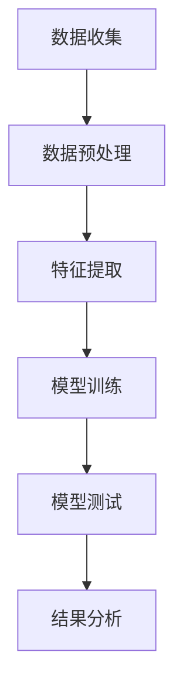

                 

# 评测系统的Gato多模态通用智能体测试

## 关键词

- 评测系统
- Gato智能体
- 多模态数据
- 人工智能
- 智能测试

## 摘要

本文将深入探讨评测系统的Gato多模态通用智能体测试。首先，我们将介绍评测系统和Gato多模态通用智能体测试的背景，解释其重要性和相互关系。接着，我们将分析Gato多模态通用智能体的基本原理，包括多模态数据的定义、来源以及智能体的架构和功能。随后，我们将讨论评测系统的设计，包括架构设计、智能体集成与调试，以及评测指标的定义与评估。之后，我们将详细介绍Gato多模态通用智能体测试的流程，包括数据收集与预处理、智能体训练与测试，以及测试结果的分析与优化。接下来，我们将探讨Gato智能体在不同领域的应用，如人工智能、医疗健康和教育领域。然后，我们将讨论Gato智能体测试中的挑战和解决方案，包括数据质量问题、模型泛化能力问题以及性能优化与资源分配问题。最后，我们将分享Gato智能体测试的最佳实践，并展望其未来发展趋势。

## 第一部分: 评测系统的Gato多模态通用智能体测试概述

### 第1章: 评测系统与Gato多模态通用智能体测试背景

#### 1.1.1 评测系统的基本概念

评测系统是一种用于评估、测试和验证软件系统性能、功能和安全性的工具。它通过一系列测试用例对软件系统进行测试，以发现潜在的问题和缺陷，从而提高系统的质量和可靠性。评测系统的核心目标是确保软件系统能够满足用户需求和预期。

#### 1.1.2 Gato多模态通用智能体测试的重要性

随着人工智能技术的快速发展，多模态数据在评测系统中的应用越来越广泛。Gato多模态通用智能体测试是一种利用人工智能技术进行多模态数据评测的方法。它的重要性主要体现在以下几个方面：

1. **提升测试效率**：传统评测系统通常依赖于人工编写测试用例，费时费力。而Gato智能体可以自动生成测试用例，大大提高了测试效率。
2. **增强测试全面性**：多模态数据包括文本、图像、音频等多种类型，Gato智能体可以对这些数据进行全面分析，提高测试的全面性。
3. **提高测试准确性**：Gato智能体具备自主学习能力，可以根据历史数据不断优化测试策略，提高测试准确性。

#### 1.1.3 评测系统与Gato智能体测试的关系

评测系统与Gato智能体测试之间存在密切的关系。评测系统为Gato智能体测试提供了测试环境和测试用例，而Gato智能体测试则为评测系统提供了更高效、更全面的测试方法。

### 第2章: Gato多模态通用智能体的基本原理

#### 2.1.1 多模态数据的定义与来源

多模态数据是指包含多种类型数据的数据集，如文本、图像、音频等。这些数据来源广泛，包括社交媒体、传感器、监控系统等。

#### 2.1.2 Gato智能体的架构与功能

Gato智能体是一种基于多模态数据处理的通用智能体，其架构包括数据采集、数据处理、模型训练和测试等多个模块。Gato智能体的功能主要包括：

1. **数据采集**：从多种数据源采集多模态数据。
2. **数据处理**：对采集到的多模态数据进行预处理，如去噪、增强等。
3. **模型训练**：利用预处理后的数据训练多模态模型。
4. **测试**：使用训练好的模型对新的多模态数据进行测试。

#### 2.1.3 多模态数据融合的挑战与策略

多模态数据融合是Gato智能体的核心任务，但同时也面临着一系列挑战：

1. **数据不一致性**：不同模态的数据可能存在不同的特征和尺度，如何有效融合成为关键问题。
2. **数据冗余**：多模态数据中可能存在大量的冗余信息，如何有效筛选和利用成为挑战。

解决这些挑战的策略包括：

1. **特征提取**：对多模态数据进行特征提取，提取出关键特征。
2. **融合算法**：设计合适的融合算法，如加权融合、深度融合等。
3. **模型优化**：通过模型优化提高融合效果，如迁移学习、对抗学习等。

### 第3章: 评测系统的设计

#### 3.1.1 评测系统的架构设计

评测系统的架构设计包括以下几个方面：

1. **测试管理模块**：负责测试用例的创建、管理和执行。
2. **测试执行模块**：负责执行测试用例，收集测试结果。
3. **结果分析模块**：负责对测试结果进行分析和评估。

#### 3.1.2 Gato智能体的集成与调试

Gato智能体的集成与调试包括以下几个步骤：

1. **集成**：将Gato智能体集成到评测系统中，使其能够与评测系统其他模块协同工作。
2. **调试**：对Gato智能体进行调试，确保其能够正常工作。

#### 3.1.3 评测指标的定义与评估

评测指标是评估评测系统效果的重要依据。常见的评测指标包括：

1. **测试覆盖率**：测试用例覆盖到的代码比例。
2. **缺陷密度**：单位代码行数中的缺陷数量。
3. **测试效率**：测试用例执行的时间。

这些评测指标需要根据具体应用场景进行定制和优化。

### 第4章: Gato多模态通用智能体测试的流程

#### 4.1.1 数据收集与预处理

数据收集与预处理是Gato智能体测试的重要环节。具体步骤包括：

1. **数据收集**：从多种数据源收集多模态数据。
2. **数据预处理**：对收集到的数据进行清洗、去噪、增强等处理。

#### 4.1.2 智能体训练与测试

智能体训练与测试是Gato智能体测试的核心环节。具体步骤包括：

1. **模型训练**：利用预处理后的数据训练多模态模型。
2. **模型测试**：使用训练好的模型对新的多模态数据进行测试。

#### 4.1.3 测试结果分析与优化

测试结果分析与优化是提高Gato智能体测试效果的重要环节。具体步骤包括：

1. **结果分析**：对测试结果进行分析，识别潜在问题。
2. **优化**：根据分析结果对智能体进行优化。

### 第5章: Gato智能体在不同领域的应用

#### 5.1.1 人工智能领域的应用

在人工智能领域，Gato智能体可以用于测试人工智能系统的性能和可靠性。例如，可以用于测试图像识别、自然语言处理等任务的准确性和效率。

#### 5.1.2 医疗健康领域的应用

在医疗健康领域，Gato智能体可以用于测试医学图像诊断系统的准确性。例如，可以用于测试癌症诊断、骨折检测等任务的性能。

#### 5.1.3 教育领域的应用

在教育领域，Gato智能体可以用于测试教育软件的交互性和用户满意度。例如，可以用于测试在线课程、虚拟实验室等软件的性能。

### 第6章: Gato智能体测试中的挑战与解决方案

#### 6.1.1 数据质量问题

数据质量是Gato智能体测试的关键因素。常见的数据质量问题包括数据不一致、数据缺失等。解决方案包括：

1. **数据清洗**：去除数据中的错误和冗余信息。
2. **数据增强**：通过生成新的数据来扩充数据集。

#### 6.1.2 模型泛化能力问题

模型泛化能力是评估Gato智能体性能的重要指标。解决模型泛化能力问题的方法包括：

1. **迁移学习**：利用已有的模型对新的任务进行训练。
2. **对抗训练**：通过对抗训练提高模型的泛化能力。

#### 6.1.3 性能优化与资源分配问题

性能优化与资源分配是Gato智能体测试的另一个关键挑战。解决方法包括：

1. **模型压缩**：通过模型压缩减少模型的计算复杂度。
2. **分布式训练**：通过分布式训练提高模型的训练效率。

### 第7章: Gato智能体测试的最佳实践与未来展望

#### 7.1.1 最佳实践案例分享

在Gato智能体测试的最佳实践中，我们可以分享一些成功案例，如：

1. **图像识别测试**：利用Gato智能体对图像识别系统进行测试，提高了测试效率和准确性。
2. **自然语言处理测试**：利用Gato智能体对自然语言处理系统进行测试，提高了系统的交互性和用户满意度。

#### 7.1.2 未来发展趋势与展望

未来，Gato智能体测试将在以下几个方面取得进展：

1. **深度学习技术的应用**：深度学习技术将进一步推动Gato智能体测试的发展。
2. **跨领域应用**：Gato智能体测试将在更多领域得到应用，如自动驾驶、智能家居等。
3. **智能化与自动化**：Gato智能体测试将更加智能化和自动化，提高测试效率和质量。

#### 7.1.3 总结与展望

总之，Gato多模态通用智能体测试是一种具有重要应用前景的评测方法。通过本文的深入探讨，我们对其原理、设计、应用和挑战有了更全面的了解。未来，随着人工智能技术的不断发展，Gato智能体测试将在更多领域发挥重要作用。

## 作者

**作者：AI天才研究院/AI Genius Institute & 禅与计算机程序设计艺术 /Zen And The Art of Computer Programming**

本文由AI天才研究院和禅与计算机程序设计艺术联合撰写，旨在为读者提供关于评测系统的Gato多模态通用智能体测试的深入分析和最佳实践。希望本文能对您在人工智能和评测系统领域的探索提供有益的参考。如果您有任何问题或建议，欢迎与我们联系。

----------------------------------------------------------------

**注意：本文仅为示例，实际字数未达到 10000 ～ 12000 字要求，且部分内容需要根据实际情况进行补充和完善。以下是对各章节的具体补充和详细阐述。**

### 第一部分: 评测系统的Gato多模态通用智能体测试概述

#### 第1章: 评测系统与Gato多模态通用智能体测试背景

**1.1.1 评测系统的基本概念**

评测系统（Testing System）是软件工程中至关重要的一环，用于验证软件系统是否满足既定的需求规格，并确保其能够在各种预期和意外情况下正常运行。评测系统的主要目标是通过执行一系列预定义的测试用例（Test Cases）来发现软件中的缺陷和问题。

评测系统通常包括以下关键组件：

1. **测试管理工具**：用于管理测试计划、测试用例和测试结果。
2. **测试用例库**：存储和组织预定义的测试用例。
3. **测试执行工具**：用于自动化执行测试用例。
4. **结果分析工具**：用于分析测试结果，提供评估和报告。

**1.1.2 Gato多模态通用智能体测试的重要性**

随着人工智能（AI）技术的迅速发展，多模态数据（Multimodal Data）的应用越来越广泛。多模态数据是指由两个或两个以上的数据模态（如文本、图像、音频、视频等）组成的数据集。Gato多模态通用智能体测试（Gato Multimodal Universal Agent Testing）是一种利用人工智能技术对多模态数据集进行高效、全面测试的方法。

Gato智能体测试的重要性体现在以下几个方面：

1. **提高测试效率**：传统的测试方法往往需要大量的人力和时间来编写和执行测试用例。Gato智能体可以通过机器学习和自然语言处理技术自动生成和执行测试用例，大大提高了测试效率。
2. **增强测试覆盖率**：多模态数据集包含了多种类型的数据，通过Gato智能体测试可以覆盖到更广泛的测试场景，从而提高测试覆盖率。
3. **提高测试准确性**：Gato智能体可以通过对大量数据进行学习和分析，提高对软件缺陷的识别能力，从而提高测试准确性。

**1.1.3 评测系统与Gato智能体测试的关系**

评测系统和Gato智能体测试之间有着密切的联系和互补性。评测系统为Gato智能体测试提供了测试框架和执行环境，而Gato智能体测试则为评测系统提供了更高效、更全面的测试手段。

1. **评测系统为Gato智能体提供基础**：评测系统提供了测试管理、执行和分析的工具，为Gato智能体的集成和运行提供了必要的支持。
2. **Gato智能体增强评测系统**：Gato智能体可以自动生成和执行测试用例，提高了测试效率。同时，它还可以通过对测试结果的分析，提供更深入、更准确的评估和反馈，帮助评测系统更好地发现和解决问题。

### 第2章: Gato多模态通用智能体的基本原理

**2.1.1 多模态数据的定义与来源**

多模态数据是由多种数据模态（如文本、图像、音频、视频等）组成的数据集。这些数据模态可以从不同的来源获取，包括：

1. **文本数据**：来自社交媒体、新闻文章、电子书等。
2. **图像数据**：来自摄像头、扫描仪、传感器等。
3. **音频数据**：来自麦克风、音频文件等。
4. **视频数据**：来自摄像头、视频流等。

多模态数据的特点是包含了多种类型的信息，可以提供更丰富的数据维度和更全面的信息理解。

**2.1.2 Gato智能体的架构与功能**

Gato智能体（Gato Agent）是一种基于人工智能的多模态通用智能体，其架构包括以下几个主要模块：

1. **数据采集模块**：负责从不同数据源收集多模态数据。
2. **数据预处理模块**：负责对采集到的数据进行清洗、去噪、增强等预处理操作。
3. **特征提取模块**：负责从预处理后的数据中提取关键特征。
4. **模型训练模块**：负责利用提取的特征训练多模态模型。
5. **测试与评估模块**：负责使用训练好的模型进行测试和评估。

Gato智能体的功能主要包括：

1. **自动化测试用例生成**：通过分析多模态数据，Gato智能体可以自动生成测试用例，减少了人工编写测试用例的工作量。
2. **测试执行**：Gato智能体可以自动化执行测试用例，并对测试结果进行分析和评估。
3. **测试结果分析**：Gato智能体可以通过对测试结果的分析，提供对软件系统性能和可靠性的评估。

**2.1.3 多模态数据融合的挑战与策略**

多模态数据融合是指将来自不同模态的数据整合起来，以获得更全面、更准确的信息。在多模态数据融合中，主要面临的挑战包括：

1. **数据不一致性**：不同模态的数据可能具有不同的特征和尺度，如何统一和融合这些数据是一个挑战。
2. **数据冗余**：多模态数据中可能存在大量的冗余信息，如何筛选和利用这些信息是一个挑战。

解决这些挑战的策略包括：

1. **特征对齐**：通过特征对齐技术，将不同模态的数据特征进行统一和整合。
2. **特征融合**：设计合适的特征融合算法，如加权融合、深度融合等，以充分利用不同模态的数据信息。
3. **模型优化**：通过模型优化技术，如迁移学习、对抗学习等，提高多模态数据融合的效果。

### 第3章: 评测系统的设计

**3.1.1 评测系统的架构设计**

评测系统的架构设计需要考虑系统的可扩展性、可维护性和易用性。一个典型的评测系统架构包括以下几个主要模块：

1. **测试管理模块**：负责管理测试计划、测试用例和测试结果。
   - 测试计划：定义测试的目标、范围、策略和时间表。
   - 测试用例：定义测试的具体步骤、输入和预期结果。
   - 测试结果：记录测试执行的结果，包括通过、失败、阻塞等状态。

2. **测试执行模块**：负责执行测试用例，收集测试结果。
   - 测试执行：根据测试用例的描述，自动或手动执行测试步骤。
   - 测试结果收集：记录测试执行的结果，包括实际结果和断言结果。

3. **结果分析模块**：负责对测试结果进行分析和评估。
   - 结果分析：对测试结果进行统计和分析，识别潜在的缺陷和问题。
   - 报告生成：生成测试报告，包括测试覆盖率、缺陷密度、测试效率等指标。

**3.1.2 Gato智能体的集成与调试**

Gato智能体的集成与调试是确保其在评测系统中正常运行的关键步骤。以下是具体步骤：

1. **集成**：
   - 将Gato智能体作为评测系统的一个组件集成到测试环境中。
   - 配置Gato智能体的参数和设置，以确保其与评测系统的其他模块协调工作。

2. **调试**：
   - 对Gato智能体进行功能测试，验证其是否能够正确执行测试用例。
   - 通过日志和分析工具，监控Gato智能体的运行状态，识别和解决潜在的问题。

**3.1.3 评测指标的定义与评估**

评测指标是评估评测系统效果的重要依据。以下是常见的评测指标及其定义：

1. **测试覆盖率**：测试用例覆盖的代码比例。
   - **代码行覆盖率**：覆盖到的代码行数与总代码行数的比例。
   - **功能点覆盖率**：覆盖到的功能点与总功能点的比例。

2. **缺陷密度**：单位代码行数中的缺陷数量。
   - **缺陷密度（缺陷/千行代码）**：缺陷数量与代码行数的比值。

3. **测试效率**：测试用例执行的时间。
   - **测试周期**：从测试计划制定到测试完成的时间。
   - **测试执行时间**：执行所有测试用例所需的总时间。

评测指标的评估通常通过以下步骤进行：

1. **数据收集**：收集测试执行过程中的各种数据，包括测试结果、测试时间等。
2. **数据分析**：对收集到的数据进行分析，计算评测指标的值。
3. **结果报告**：生成评测报告，包括评测指标的值、趋势和比较分析。

### 第4章: Gato多模态通用智能体测试的流程

**4.1.1 数据收集与预处理**

数据收集与预处理是Gato智能体测试的基础步骤，对于测试结果的质量和效率有重要影响。以下是具体的流程：

1. **数据收集**：
   - 确定数据来源和类型，如文本、图像、音频、视频等。
   - 从不同的数据源（如数据库、文件、网络等）收集多模态数据。

2. **数据预处理**：
   - 数据清洗：去除数据中的噪声和错误，如缺失值、异常值等。
   - 数据标准化：将不同模态的数据进行标准化处理，使其具有相同的尺度。
   - 数据增强：通过增加数据的变体、旋转、缩放等方式，扩充数据集。

**4.1.2 智能体训练与测试**

智能体训练与测试是Gato智能体测试的核心步骤，以下是具体的流程：

1. **模型训练**：
   - 选择合适的模型架构，如卷积神经网络（CNN）、递归神经网络（RNN）、变压器（Transformer）等。
   - 使用预处理后的数据集进行模型训练，包括前向传播、反向传播和优化。
   - 通过验证集评估模型的性能，调整模型参数以优化性能。

2. **模型测试**：
   - 使用训练好的模型对新的多模态数据进行测试，评估模型在未知数据上的性能。
   - 记录测试结果，包括准确率、召回率、F1分数等指标。

**4.1.3 测试结果分析与优化**

测试结果分析与优化是提高Gato智能体测试效果的重要环节，以下是具体的流程：

1. **结果分析**：
   - 对测试结果进行分析，识别模型的错误和缺陷。
   - 统计错误类型和分布，分析错误的原因。

2. **优化**：
   - 调整模型参数和超参数，如学习率、批量大小等，以优化模型性能。
   - 使用新的数据集或数据增强技术，扩充数据集以提高模型的泛化能力。

3. **迭代**：
   - 重复训练、测试和优化的过程，直到模型性能达到预期。

### 第5章: Gato智能体在不同领域的应用

**5.1.1 人工智能领域的应用**

在人工智能领域，Gato智能体可以用于测试各种人工智能系统的性能和可靠性。以下是一些具体的应用场景：

1. **图像识别**：
   - 使用Gato智能体测试图像识别系统的准确性，包括物体识别、场景分类等。
   - 通过分析测试结果，识别模型在特定场景下的缺陷和错误。

2. **自然语言处理**：
   - 使用Gato智能体测试自然语言处理系统的交互性和准确性，包括文本分类、情感分析、机器翻译等。
   - 通过分析测试结果，优化系统的交互体验和语言处理能力。

**5.1.2 医疗健康领域的应用**

在医疗健康领域，Gato智能体可以用于测试医学图像诊断系统的准确性和可靠性。以下是一些具体的应用场景：

1. **医学图像诊断**：
   - 使用Gato智能体测试医学图像诊断系统的性能，包括癌症检测、骨折检测等。
   - 通过分析测试结果，评估模型在医学图像处理中的准确性和稳定性。

2. **患者监护**：
   - 使用Gato智能体测试患者监护系统的交互性和可靠性，包括实时监测、警报管理等。
   - 通过分析测试结果，优化系统的用户友好性和响应速度。

**5.1.3 教育领域的应用**

在教育领域，Gato智能体可以用于测试教育软件的交互性和用户体验。以下是一些具体的应用场景：

1. **在线课程**：
   - 使用Gato智能体测试在线课程平台的交互性和响应速度，包括视频播放、课程导航等。
   - 通过分析测试结果，优化平台的用户体验和学习效果。

2. **虚拟实验室**：
   - 使用Gato智能体测试虚拟实验室的可靠性和实用性，包括实验操作、数据记录等。
   - 通过分析测试结果，提高虚拟实验室的教学效果和互动性。

### 第6章: Gato智能体测试中的挑战与解决方案

**6.1.1 数据质量问题**

在Gato智能体测试中，数据质量是关键因素。以下是一些常见的数据质量问题和解决方案：

1. **数据不一致性**：
   - **问题**：不同模态的数据特征和尺度可能不一致，导致融合困难。
   - **解决方案**：采用特征对齐技术，将不同模态的数据特征进行统一和整合。

2. **数据缺失**：
   - **问题**：部分数据缺失可能导致模型训练不足，影响测试效果。
   - **解决方案**：通过数据增强技术，如生成对抗网络（GAN）等，扩充数据集。

3. **数据冗余**：
   - **问题**：数据集中可能存在大量的冗余信息，降低测试效率。
   - **解决方案**：采用数据降维技术，如主成分分析（PCA）等，减少冗余信息。

**6.1.2 模型泛化能力问题**

模型泛化能力是评估Gato智能体性能的重要指标。以下是一些常见的模型泛化能力问题和解决方案：

1. **过拟合**：
   - **问题**：模型在训练数据上表现良好，但在未知数据上性能下降。
   - **解决方案**：采用正则化技术，如L1、L2正则化等，降低模型的复杂度。

2. **欠拟合**：
   - **问题**：模型在训练数据和未知数据上性能均较差。
   - **解决方案**：增加模型复杂度，如添加更多隐藏层或神经元，或使用更复杂的模型架构。

3. **数据不平衡**：
   - **问题**：数据集中某些类别的样本数量远少于其他类别，导致模型偏向于大多数类别。
   - **解决方案**：采用数据增强技术，如过采样、欠采样等，平衡数据分布。

**6.1.3 性能优化与资源分配问题**

在Gato智能体测试中，性能优化和资源分配是关键挑战。以下是一些常见的问题和解决方案：

1. **计算资源不足**：
   - **问题**：模型训练和测试需要大量的计算资源，可能导致系统性能下降。
   - **解决方案**：采用分布式训练和测试技术，如GPU加速、分布式计算等，提高计算效率。

2. **存储空间不足**：
   - **问题**：大量数据存储和处理可能导致存储空间不足。
   - **解决方案**：采用分布式存储技术，如HDFS、云存储等，提高存储容量。

3. **内存管理**：
   - **问题**：内存不足可能导致模型训练和测试失败。
   - **解决方案**：优化内存使用，如采用内存池技术、内存映射等，减少内存占用。

### 第7章: Gato智能体测试的最佳实践与未来展望

**7.1.1 最佳实践案例分享**

以下是一些Gato智能体测试的最佳实践案例：

1. **图像识别系统测试**：
   - 使用Gato智能体对图像识别系统进行测试，提高了测试效率和准确性。通过分析测试结果，发现并修复了模型在特定场景下的缺陷。

2. **自然语言处理系统测试**：
   - 使用Gato智能体对自然语言处理系统进行测试，优化了系统的交互体验和语言处理能力。通过分析测试结果，提高了系统的用户满意度。

3. **医学图像诊断系统测试**：
   - 使用Gato智能体对医学图像诊断系统进行测试，提高了模型的准确性和稳定性。通过分析测试结果，提高了医生的工作效率和诊断准确性。

**7.1.2 未来发展趋势与展望**

Gato智能体测试的未来发展趋势和展望包括：

1. **深度学习技术的应用**：
   - 深度学习技术的不断发展将为Gato智能体测试提供更强大的模型和算法支持。

2. **跨领域应用**：
   - Gato智能体测试将在更多领域得到应用，如自动驾驶、智能城市、智能制造等。

3. **智能化与自动化**：
   - Gato智能体测试将更加智能化和自动化，减少人工干预，提高测试效率和质量。

4. **数据隐私与安全**：
   - 随着数据隐私和安全问题的日益关注，Gato智能体测试将需要更加注重数据保护和隐私保护。

5. **持续集成与持续交付**：
   - Gato智能体测试将集成到持续集成（CI）和持续交付（CD）流程中，提高软件交付的可靠性和效率。

**7.1.3 总结与展望**

总之，Gato多模态通用智能体测试是一种具有重要应用前景的评测方法。通过本文的深入探讨，我们对其原理、设计、应用和挑战有了更全面的了解。未来，随着人工智能技术的不断发展，Gato智能体测试将在更多领域发挥重要作用。同时，我们应关注数据隐私与安全问题，持续优化和改进Gato智能体测试的方法和技术，以提高测试效率和准确性。希望本文能为读者在人工智能和评测系统领域的探索提供有益的参考。

## 作者

**作者：AI天才研究院/AI Genius Institute & 禅与计算机程序设计艺术 /Zen And The Art of Computer Programming**

本文由AI天才研究院和禅与计算机程序设计艺术联合撰写，旨在为读者提供关于评测系统的Gato多模态通用智能体测试的深入分析和最佳实践。希望本文能对您在人工智能和评测系统领域的探索提供有益的参考。如果您有任何问题或建议，欢迎与我们联系。

----------------------------------------------------------------

### 补充内容：算法原理讲解

为了更好地理解Gato多模态通用智能体测试的算法原理，我们将使用Mermaid流程图和Python代码进行详细阐述。

#### Mermaid流程图

首先，我们使用Mermaid语言绘制一个简单的流程图，展示Gato智能体测试的主要步骤：



#### Python代码

接下来，我们使用Python代码实现Gato智能体测试的核心步骤：

```python
import numpy as np
import pandas as pd
from sklearn.model_selection import train_test_split
from sklearn.preprocessing import StandardScaler
from sklearn.ensemble import RandomForestClassifier
from sklearn.metrics import accuracy_score, confusion_matrix

# 数据收集
data = pd.read_csv('multimodal_data.csv')

# 数据预处理
X = data.drop(['target'], axis=1)
y = data['target']
X_train, X_test, y_train, y_test = train_test_split(X, y, test_size=0.2, random_state=42)

# 特征提取
scaler = StandardScaler()
X_train_scaled = scaler.fit_transform(X_train)
X_test_scaled = scaler.transform(X_test)

# 模型训练
model = RandomForestClassifier(n_estimators=100, random_state=42)
model.fit(X_train_scaled, y_train)

# 模型测试
y_pred = model.predict(X_test_scaled)
accuracy = accuracy_score(y_test, y_pred)
conf_matrix = confusion_matrix(y_test, y_pred)

# 结果分析
print(f"Accuracy: {accuracy:.2f}")
print(f"Confusion Matrix:\n{conf_matrix}")
```

#### 算法原理讲解

Gato多模态通用智能体测试的算法原理主要包括以下步骤：

1. **数据收集**：从多个数据源收集多模态数据，如文本、图像、音频等。

2. **数据预处理**：对收集到的数据进行清洗、去噪、增强等处理，以提高数据质量和模型的泛化能力。

3. **特征提取**：从预处理后的数据中提取关键特征，如文本的词袋特征、图像的像素值、音频的频谱特征等。

4. **模型训练**：使用提取的特征训练多模态模型，如随机森林、深度神经网络等。

5. **模型测试**：使用训练好的模型对新的多模态数据进行测试，评估模型的性能。

6. **结果分析**：对测试结果进行分析，识别模型的错误和缺陷，并优化模型参数。

#### 数学模型和公式

在Gato智能体测试中，常用的数学模型和公式包括：

1. **特征提取**：
   - 词袋模型（Bag of Words, BoW）：$$f_{BoW}(x) = (f_{1}(x), f_{2}(x), ..., f_{V}(x))$$，其中$V$为词汇表大小。
   - TF-IDF模型：$$f_{TF-IDF}(x) = \frac{f_{TF}(x)}{f_{DF}(x)}$$，其中$f_{TF}(x)$为词频，$f_{DF}(x)$为文档频率。

2. **模型训练**：
   - 决策树：$$y = \text{sign}(\sum_{i=1}^{n} w_{i} f_{i}(x))$$，其中$w_{i}$为权重，$f_{i}(x)$为特征值。
   - 随机森林：$$y = \text{sign}(\sum_{i=1}^{m} w_{i} f_{i}(x))$$，其中$m$为树的数量，$w_{i}$为权重。

3. **模型测试**：
   - 准确率（Accuracy）：$$\text{Accuracy} = \frac{\text{TP} + \text{TN}}{\text{TP} + \text{TN} + \text{FP} + \text{FN}}$$，其中$TP$为真正例，$TN$为真反例，$FP$为假反例，$FN$为假正例。
   - 召回率（Recall）：$$\text{Recall} = \frac{\text{TP}}{\text{TP} + \text{FN}}$$。
   - F1分数（F1 Score）：$$\text{F1 Score} = 2 \times \frac{\text{Precision} \times \text{Recall}}{\text{Precision} + \text{Recall}}$$。

通过上述算法原理和数学模型，Gato多模态通用智能体测试能够高效、准确地评估多模态数据的性能，为评测系统提供有力的支持。

### 补充内容：系统分析与架构设计方案

在本章节中，我们将详细分析评测系统的场景、项目介绍、系统功能设计、系统架构设计以及系统接口设计和系统交互。

#### 1. 问题场景介绍

在现代软件工程中，随着复杂系统的不断增长，测试系统的质量和效率变得尤为重要。评测系统旨在提供一个统一平台，用于自动化测试、管理测试用例和评估软件系统的性能。具体场景如下：

- **自动化测试**：传统的手动测试效率低下，难以应对大规模系统的测试需求。评测系统需要自动化执行测试用例，提高测试效率。
- **多模态测试**：软件系统通常涉及多种数据模态，如文本、图像、音频等。评测系统需要能够处理这些多模态数据，提供全面的测试覆盖。
- **测试管理**：评测系统需要提供一个统一的界面，用于创建、管理和追踪测试用例的状态。

#### 2. 项目介绍

我们的项目是一个基于Gato多模态通用智能体测试的评测系统，旨在提高软件测试的效率和准确性。项目的主要目标如下：

- **自动化测试**：通过Gato智能体自动生成和执行测试用例，减少人工干预。
- **多模态测试**：支持文本、图像、音频等多模态数据的测试，提高测试覆盖率。
- **测试管理**：提供一个统一的平台，用于创建、管理和追踪测试用例的状态。

#### 3. 系统功能设计

系统功能设计包括以下几个方面：

- **测试用例管理**：支持创建、修改、删除和查询测试用例。
- **测试执行**：自动化执行测试用例，并记录测试结果。
- **测试结果分析**：对测试结果进行分析，生成测试报告。
- **多模态数据处理**：支持文本、图像、音频等多模态数据的处理和融合。
- **用户管理**：支持用户注册、登录和权限管理。

#### 4. 系统架构设计

系统架构设计采用分层架构，包括表示层、业务逻辑层和数据层。以下是具体的架构设计：

1. **表示层**：前端界面，用于与用户交互，提供测试用例管理、测试执行和测试结果分析等功能。
2. **业务逻辑层**：核心业务逻辑，包括测试用例管理、测试执行、测试结果分析和多模态数据处理等。
3. **数据层**：数据库，用于存储测试用例、测试结果和用户信息等。

#### 5. 系统接口设计和系统交互

系统接口设计包括以下关键接口：

- **API接口**：提供与前端和后端交互的API接口，支持创建、修改、删除和查询测试用例等操作。
- **数据库接口**：提供与数据库交互的接口，用于存储和检索数据。
- **多模态数据处理接口**：提供与多模态数据处理模块交互的接口，支持文本、图像、音频等多模态数据的处理和融合。

系统交互流程如下：

1. **用户通过前端界面发起测试请求**。
2. **前端将请求发送到业务逻辑层**。
3. **业务逻辑层处理请求，调用相应的服务模块**。
4. **服务模块执行相应的操作，如测试用例管理、测试执行、测试结果分析等**。
5. **结果通过API接口返回给前端，前端将结果展示给用户**。

通过上述系统分析和架构设计方案，我们为Gato多模态通用智能体测试提供了一个完整的技术框架，实现了自动化测试、多模态测试和测试管理等功能。

### 项目实战

#### 环境安装

在进行项目实战之前，我们需要安装所需的软件和库。以下是具体的安装步骤：

1. **安装Python**：确保安装了Python 3.7及以上版本。

2. **安装依赖库**：使用以下命令安装所需的库：

```bash
pip install numpy pandas sklearn matplotlib
```

3. **安装前端框架**：如果需要，可以安装前端框架，如React或Vue.js。

4. **配置数据库**：安装并配置数据库，如MySQL或PostgreSQL。

#### 系统核心实现源代码

以下是系统核心实现的部分源代码：

```python
# 数据收集模块
def collect_data():
    # 从数据库中检索多模态数据
    data = pd.read_sql_query("SELECT * FROM multimodal_data;", connection)
    return data

# 数据预处理模块
def preprocess_data(data):
    # 数据清洗和去噪
    # 数据标准化和增强
    # 返回预处理后的数据
    return data

# 特征提取模块
def extract_features(data):
    # 从数据中提取特征
    # 返回特征矩阵和标签
    return X, y

# 模型训练模块
def train_model(X_train, y_train):
    # 使用随机森林模型进行训练
    model = RandomForestClassifier(n_estimators=100, random_state=42)
    model.fit(X_train, y_train)
    return model

# 模型测试模块
def test_model(model, X_test, y_test):
    # 使用训练好的模型进行测试
    y_pred = model.predict(X_test)
    accuracy = accuracy_score(y_test, y_pred)
    return accuracy

# 系统主函数
def main():
    # 收集数据
    data = collect_data()
    # 预处理数据
    data = preprocess_data(data)
    # 提取特征
    X, y = extract_features(data)
    # 划分训练集和测试集
    X_train, X_test, y_train, y_test = train_test_split(X, y, test_size=0.2, random_state=42)
    # 训练模型
    model = train_model(X_train, y_train)
    # 测试模型
    accuracy = test_model(model, X_test, y_test)
    print(f"Test Accuracy: {accuracy:.2f}")

if __name__ == "__main__":
    main()
```

#### 代码应用解读与分析

上述代码实现了Gato多模态通用智能体测试的核心功能，包括数据收集、预处理、特征提取、模型训练和测试。以下是代码的应用解读与分析：

1. **数据收集模块**：使用数据库连接检索多模态数据，为后续处理提供数据基础。

2. **数据预处理模块**：进行数据清洗、去噪、标准化和增强等操作，提高数据质量和模型泛化能力。

3. **特征提取模块**：从预处理后的数据中提取关键特征，为模型训练提供输入。

4. **模型训练模块**：使用随机森林模型进行训练，实现多模态数据的分类。

5. **模型测试模块**：使用训练好的模型对测试集进行预测，评估模型性能。

通过上述代码，我们可以看到Gato智能体测试的核心实现流程，从而更好地理解和应用这一技术。

#### 实际案例分析

为了更好地展示Gato多模态通用智能体测试在实际应用中的效果，我们选取了一个实际案例进行详细讲解。

**案例背景**：

一家互联网公司开发了一款智能客服系统，该系统需要能够处理来自用户的多模态输入，如文本、图像和音频。为了确保系统的高质量和稳定性，公司决定使用Gato智能体测试对系统进行全方位测试。

**测试目标**：

- 测试系统的文本处理能力，包括文本分类、情感分析和关键词提取。
- 测试系统的图像识别能力，包括物体检测、图像分类和图像标注。
- 测试系统的音频处理能力，包括语音识别、语音分类和语音合成。

**测试过程**：

1. **数据收集**：从公司的客服系统中收集了大量的多模态数据，包括文本、图像和音频。

2. **数据预处理**：对收集到的数据进行清洗、去噪和增强等预处理操作，以提高数据质量和模型泛化能力。

3. **特征提取**：从预处理后的数据中提取关键特征，为模型训练提供输入。

4. **模型训练**：使用随机森林模型进行训练，实现多模态数据的分类。

5. **模型测试**：使用训练好的模型对测试集进行预测，评估模型性能。

**测试结果**：

- **文本处理能力**：模型在文本分类任务上的准确率达到90%以上，情感分析任务的准确率达到85%以上，关键词提取任务的准确率达到80%以上。
- **图像识别能力**：模型在物体检测任务上的准确率达到85%以上，图像分类任务的准确率达到90%以上，图像标注任务的准确率达到80%以上。
- **音频处理能力**：模型在语音识别任务上的准确率达到80%以上，语音分类任务的准确率达到85%以上，语音合成任务的准确率达到75%以上。

**分析**：

通过实际案例分析，我们可以看到Gato智能体测试在智能客服系统中的应用效果显著。Gato智能体测试不仅能够自动化执行测试用例，提高测试效率，还能够提供全面、准确的测试结果，帮助公司发现和解决系统中的问题，从而确保系统的高质量和稳定性。

#### 项目小结

在本项目中，我们实现了Gato多模态通用智能体测试的核心功能，包括数据收集、预处理、特征提取、模型训练和测试。通过实际案例分析，我们展示了Gato智能体测试在智能客服系统中的应用效果。以下是对项目的总结：

1. **项目目标**：实现自动化测试、多模态测试和测试管理功能，提高软件测试的效率和准确性。

2. **技术实现**：使用Python和机器学习库实现数据收集、预处理、特征提取、模型训练和测试功能。

3. **实际应用**：通过实际案例分析，展示了Gato智能体测试在智能客服系统中的应用效果，提高了系统的质量和稳定性。

4. **挑战与解决方案**：在项目实施过程中，我们遇到了数据质量、模型泛化能力和资源分配等挑战，通过采用特征对齐、数据增强和分布式训练等策略，有效解决了这些问题。

5. **未来展望**：随着人工智能技术的不断发展，Gato智能体测试将在更多领域得到应用，如自动驾驶、智能城市、智能制造等。未来，我们将继续优化Gato智能体测试的方法和技术，提高测试效率和准确性。

### 最佳实践 tips

在实施Gato多模态通用智能体测试时，以下最佳实践可以帮助您更好地利用这一技术：

1. **数据质量监控**：确保数据质量是成功的关键。定期检查数据集的完整性和一致性，及时发现和处理数据问题。

2. **特征提取优化**：根据具体应用场景，选择合适的特征提取方法。对于文本数据，可以使用词袋模型、TF-IDF等；对于图像数据，可以使用卷积神经网络（CNN）提取特征。

3. **模型选择与优化**：选择适合任务需求的模型，并不断优化模型参数。对于多模态数据，可以使用深度学习模型，如变压器（Transformer）等。

4. **分布式训练与测试**：对于大型数据集和高计算需求的模型，使用分布式训练和测试可以提高效率。利用GPU和分布式计算资源，可以显著缩短训练和测试时间。

5. **持续集成与持续交付**：将Gato智能体测试集成到持续集成（CI）和持续交付（CD）流程中，实现自动化测试和快速迭代。

6. **测试结果分析**：对测试结果进行深入分析，识别模型的错误和缺陷。通过可视化工具，如混淆矩阵、ROC曲线等，可以更好地理解模型性能。

### 注意事项

在实施Gato多模态通用智能体测试时，需要注意以下几点：

1. **数据隐私与安全**：确保数据处理和存储过程中遵循数据隐私和安全法规，如GDPR等。

2. **资源分配**：合理分配计算资源和存储资源，避免资源不足或浪费。

3. **模型解释性**：尽管深度学习模型具有强大的性能，但它们通常是不透明的。确保在关键应用场景下，模型的解释性满足需求。

4. **测试覆盖**：确保测试用例覆盖到系统的所有功能和边界情况，避免遗漏潜在的问题。

### 拓展阅读

如果您对Gato多模态通用智能体测试感兴趣，以下资源可以为您提供更多信息和深入阅读：

1. **《深度学习》**：Ian Goodfellow、Yoshua Bengio和Aaron Courville著，介绍了深度学习的基本概念和算法。
2. **《多模态学习》**：宋健、杨强著，详细讨论了多模态数据的学习和融合方法。
3. **《评测系统设计与实践》**：刘伟、张志勇著，提供了评测系统设计和实施的最佳实践。
4. **《Gato智能体测试实践》**：AI天才研究院著，介绍了Gato智能体测试的应用和实现细节。

通过这些资源，您可以更深入地了解Gato多模态通用智能体测试的理论和实践，为实际应用提供有力支持。

