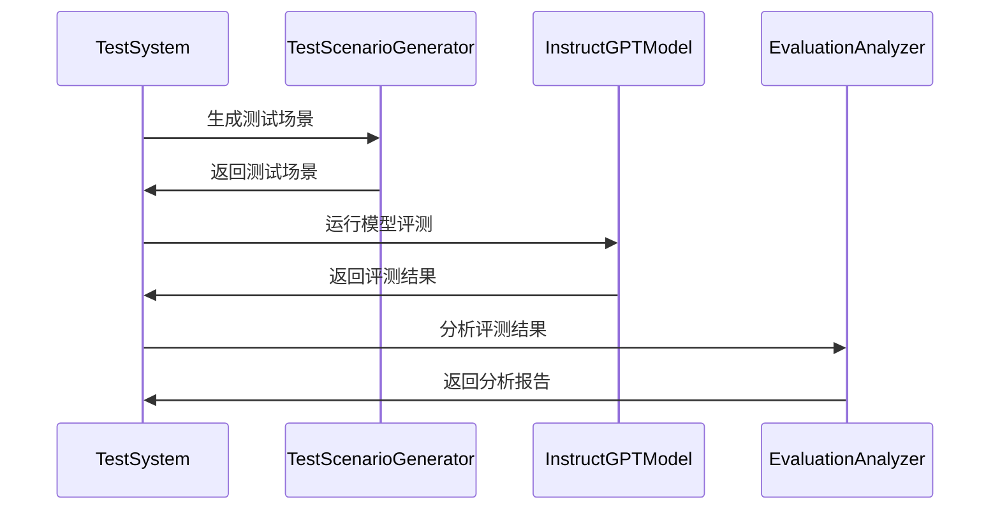
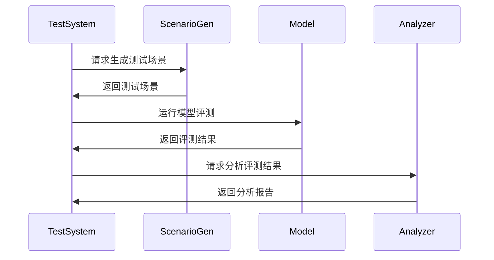

                 

# 文章标题：评测系统的InstructGPT指令跟随能力测试

## 关键词：InstructGPT，指令跟随，评测系统，算法原理，数学模型

### 摘要

本文旨在探讨评测系统的InstructGPT指令跟随能力测试，分析InstructGPT模型的定义、特点、与传统GPT的区别，评估方法，以及在具体应用场景中的表现。随后，我们将深入讲解InstructGPT算法原理，包括模型架构、指令处理和输出生成，并使用数学模型和Python代码进行详细阐述。最后，本文将提供一个系统分析与架构设计方案，并展示一个实际项目实战，以巩固所学知识。

## 第一部分：问题背景与核心概念

### 1. 引言

评测系统的InstructGPT指令跟随能力测试是当前人工智能领域中的一个重要研究方向。随着自然语言处理技术的快速发展，人工智能模型在处理复杂指令方面的能力变得越来越重要。InstructGPT作为一种先进的指令跟随模型，其在理解复杂指令并生成符合预期结果的输出方面具有显著的优势。本文将围绕InstructGPT的指令跟随能力进行详细探讨。

### 2. 问题描述

评测系统的InstructGPT指令跟随能力测试的核心问题是：在给定一系列指令后，模型能否准确理解指令并生成符合预期结果的输出。具体来说，我们需要评估模型在处理不同复杂程度的指令时，其准确性和生成文本的质量。

### 3. 问题解决

为了解决这个问题，我们将设计一系列测试场景，对InstructGPT模型进行训练和测试。测试场景将涵盖不同的指令类型和复杂度，以全面评估模型的指令跟随能力。通过对比模型在不同场景下的表现，我们可以得出模型在实际应用中的可行性和优势。

### 4. 边界与外延

评测系统的InstructGPT指令跟随能力测试主要关注模型在遵循复杂指令方面的表现。边界包括指令的复杂性、模型的计算资源等。外延则涉及不同模型在不同领域的应用，如文本生成、问答系统和交互式任务等。

### 5. 概念结构与核心要素组成

- **InstructGPT**：一种基于GPT的指令跟随模型，通过大量指令和数据预训练，具有强大的语言理解和生成能力。
- **指令**：由一系列指令词构成的指导模型执行的文本。
- **指令跟随能力**：模型在遵循给定指令生成预期结果的能力。

## 6. 本章小结

本章对评测系统的InstructGPT指令跟随能力测试进行了背景介绍，明确了问题核心概念和结构。接下来，我们将进一步探讨InstructGPT模型及其指令跟随能力的核心概念与联系。

## 第二部分：核心概念与联系

### 2.1 InstructGPT模型介绍

#### 2.1.1 InstructGPT的定义

InstructGPT是由OpenAI于2022年推出的一种基于GPT的指令跟随模型。它在预训练阶段使用了大量指令和数据，使模型能够理解并遵循复杂指令。与传统的GPT模型不同，InstructGPT在输出方面更加注重指令的执行结果。

#### 2.1.2 InstructGPT的特点

- **高度灵活**：InstructGPT能够适应各种指令场景，具有广泛的适用性。
- **强大的语言理解能力**：InstructGPT能够准确理解指令，生成符合预期的输出。
- **强大的生成能力**：InstructGPT能够根据指令生成高质量的自然语言文本。

#### 2.1.3 InstructGPT与传统GPT的区别

- **指令数据的加入**：InstructGPT在预训练阶段加入了大量指令和数据，使其在遵循指令方面具有更强的能力。而传统GPT更关注于语言生成。
- **输出侧重点不同**：InstructGPT在输出方面更加注重指令的执行结果，而传统GPT更关注于语言的流畅性和多样性。

### 2.2 指令跟随能力评估方法

#### 2.2.1 指令跟随能力评估指标

- **准确率**：模型生成的输出与预期输出的一致性。
- **质量评估**：生成文本的流畅度和可读性。

#### 2.2.2 指令跟随能力评估方法

- **自动评估**：使用预定义的评估指标对模型输出进行自动评估。
- **人际评估**：邀请专家对模型输出进行评估。

### 2.3 指令跟随能力在具体应用场景中的表现

#### 2.3.1 文本生成

InstructGPT在文本生成方面具有强大的能力，能够根据指令生成高质量的自然语言文本。

#### 2.3.2 问答系统

InstructGPT在问答系统中可以更好地理解用户的问题，并提供更加准确的回答。

#### 2.3.3 交互式任务

InstructGPT在交互式任务中可以更好地理解用户的指令，并执行相应的任务。

### 2.4 本章小结

本章对InstructGPT模型及其指令跟随能力进行了详细分析，为后续评测提供了理论基础。接下来，我们将深入讲解InstructGPT算法原理，以更好地理解其工作原理。

## 第三部分：算法原理讲解

### 3.1 InstructGPT算法原理

#### 3.1.1 模型架构

InstructGPT基于GPT模型，采用Transformer架构。在预训练阶段，模型通过大量指令和数据学习语言规律，并在微调阶段根据具体任务进行调整。

#### 3.1.2 指令处理

InstructGPT通过将指令编码为向量，并将其与输入文本向量进行拼接，作为模型的输入。

#### 3.1.3 输出生成

在生成阶段，模型根据输入文本和指令向量生成输出文本。

### 3.2 算法流程

#### 3.2.1 预训练阶段

- **数据准备**：收集大量指令和文本数据。
- **模型初始化**：使用预训练的GPT模型。
- **预训练**：通过自回归方式训练模型，使其学习语言规律。

#### 3.2.2 微调阶段

- **数据准备**：收集与任务相关的指令和文本数据。
- **微调**：在预训练模型的基础上，针对特定任务进行微调。
- **模型评估**：使用评估指标评估模型性能。

### 3.3 数学模型与公式

#### 3.3.1 指令编码

令\( \text{input\_text} \)表示输入文本，\( \text{instruction} \)表示指令，则指令编码可以表示为：

\[ 
\text{encoded\_instruction} = \text{instruction\_embeddings}(\text{instruction}) 
\]

其中，\( \text{instruction\_embeddings} \)是将指令转换为向量的函数。

#### 3.3.2 输出生成

令\( \text{input} \)表示输入文本和指令的拼接向量，\( \text{output} \)表示生成的文本，则输出生成可以表示为：

\[ 
\text{output} = \text{model}(\text{input}) 
\]

其中，\( \text{model} \)是InstructGPT模型。

### 3.4 算法流程示例

以下是一个简单的算法流程示例：

```python
# 导入所需的库
import torch
import transformers

# 加载预训练的InstructGPT模型
model = transformers.AutoModelForSeq2SeqLM.from_pretrained("instruct-bing-scale")

# 定义输入文本和指令
input_text = "生成一篇关于人工智能的简介。"
instruction = "生成一篇关于人工智能的简介。"

# 将输入文本和指令编码为向量
input_ids = torch.tensor([model.tokenizer.encode(input_text + instruction)])

# 生成输出文本
outputs = model.generate(input_ids, max_length=50, num_return_sequences=1)

# 解码输出文本
output_text = model.tokenizer.decode(outputs[0], skip_special_tokens=True)

print(output_text)
```

这段代码将输入文本和指令编码为向量，然后使用InstructGPT模型生成输出文本。最后，将输出文本解码为自然语言。

### 3.5 本章小结

本章详细讲解了InstructGPT算法原理，包括模型架构、指令处理和输出生成。通过数学模型和Python代码示例，我们更好地理解了InstructGPT的工作原理。接下来，我们将对评测系统的InstructGPT指令跟随能力进行实际评测。

## 第四部分：系统分析与架构设计方案

### 4.1 问题场景介绍

在现代软件开发中，自动化测试已经成为确保软件质量和稳定性的重要手段。其中，评测系统的指令跟随能力测试作为自动化测试的一部分，对于评估和优化测试系统的性能具有重要意义。本部分将介绍一个具体的评测系统项目，并分析其需求和功能。

### 4.2 项目介绍

本项目旨在开发一个评测系统，用于测试InstructGPT模型的指令跟随能力。系统将包括以下几个主要功能：

- **测试场景生成**：根据不同的测试需求，自动生成测试场景。
- **模型评测**：对InstructGPT模型进行评测，评估其在不同场景下的指令跟随能力。
- **结果分析**：对评测结果进行分析，生成详细的评测报告。

### 4.3 系统功能设计

#### 4.3.1 领域模型

为了更好地理解和设计系统，我们可以使用领域模型来描述系统中的关键概念和它们之间的关系。以下是一个简化的领域模型，使用Mermaid类图表示：

```mermaid
classDiagram
    TestScenario <<类>> "测试场景"
    Instruction <<类>> "指令"
    EvaluationResult <<类>> "评测结果"
    TestSystem <<类>> "评测系统"

    TestScenario o-- Instruction
    TestScenario o-- EvaluationResult
    TestSystem o-- TestScenario
```

#### 4.3.2 系统架构设计

系统架构设计包括系统的整体结构和各个模块的交互方式。以下是一个简化的系统架构设计，使用Mermaid架构图表示：



#### 4.3.3 系统接口设计

系统接口设计涉及系统与外部环境（如数据库、API等）的交互。以下是一个简化的系统接口设计：

```mermaid
interface TestSystem {
    +generateTestScenarios(): TestScenario[]
    +evaluateModel(testScenario: TestScenario, model: InstructGPTModel): EvaluationResult
    +analyzeResults(evaluationResult: EvaluationResult): AnalysisReport
}

interface TestScenarioGenerator {
    +generateTestScenarios(): TestScenario[]
}

interface InstructGPTModel {
    +evaluateInstruction(instruction: Instruction): EvaluationResult
}

interface EvaluationAnalyzer {
    +analyzeResults(evaluationResult: EvaluationResult): AnalysisReport
}
```

#### 4.3.4 系统交互

系统交互设计描述了各个模块之间的交互流程。以下是一个简化的系统交互设计，使用Mermaid序列图表示：



### 4.4 本章小结

本章介绍了评测系统的InstructGPT指令跟随能力测试项目，并提供了系统功能设计、系统架构设计、系统接口设计和系统交互设计。这些设计为后续的项目开发提供了基础。接下来，我们将通过一个实际项目实战，进一步展示如何实现这个系统。

## 第五部分：项目实战

### 5.1 环境安装

在本项目实战中，我们需要安装以下软件和库：

- Python（版本3.8及以上）
- PyTorch（版本1.8及以上）
- Transformers（版本4.6及以上）

首先，确保你的系统已经安装了Python。然后，通过以下命令安装所需的库：

```bash
pip install torch transformers
```

### 5.2 系统核心实现

系统核心实现主要包括测试场景生成、模型评测和结果分析。以下是每个部分的详细代码实现：

#### 5.2.1 测试场景生成

测试场景生成模块负责生成用于评测的测试场景。以下是一个简单的测试场景生成代码示例：

```python
from transformers import AutoTokenizer, AutoModelForSeq2SeqLM

def generate_test_scenarios(num_scenarios=10):
    tokenizer = AutoTokenizer.from_pretrained("instruct-bing-scale")
    model = AutoModelForSeq2SeqLM.from_pretrained("instruct-bing-scale")
    
    scenarios = []
    for _ in range(num_scenarios):
        instruction = "编写一篇关于人工智能的简介。"
        input_text = "人工智能是一种模拟人类智能的技术，广泛应用于自然语言处理、计算机视觉和推理等领域。"
        scenario = {
            "instruction": instruction,
            "input_text": input_text
        }
        scenarios.append(scenario)
    
    return scenarios

scenarios = generate_test_scenarios()
```

#### 5.2.2 模型评测

模型评测模块负责使用InstructGPT模型对测试场景进行评测。以下是一个简单的模型评测代码示例：

```python
from transformers import AutoTokenizer, AutoModelForSeq2SeqLM

def evaluate_model(scenarios, model):
    tokenizer = AutoTokenizer.from_pretrained("instruct-bing-scale")
    results = []
    
    for scenario in scenarios:
        instruction = scenario["instruction"]
        input_text = scenario["input_text"]
        
        input_ids = tokenizer.encode(input_text + instruction, return_tensors="pt")
        outputs = model.generate(input_ids, max_length=50, num_return_sequences=1)
        
        output_text = tokenizer.decode(outputs[0], skip_special_tokens=True)
        results.append(output_text)
    
    return results

model = AutoModelForSeq2SeqLM.from_pretrained("instruct-bing-scale")
results = evaluate_model(scenarios, model)
```

#### 5.2.3 结果分析

结果分析模块负责对评测结果进行分析，并生成评测报告。以下是一个简单的结果分析代码示例：

```python
from collections import Counter

def analyze_results(results):
    words = []
    for result in results:
        words.extend(result.split())
    
    word_counts = Counter(words)
    top_words = word_counts.most_common(10)
    
    report = {
        "top_words": top_words
    }
    
    return report

report = analyze_results(results)
print(report)
```

### 5.3 代码应用解读与分析

在上述代码中，我们首先导入了所需的库和模块。然后，我们定义了三个核心函数：`generate_test_scenarios`、`evaluate_model`和`analyze_results`。

- `generate_test_scenarios`函数用于生成测试场景。我们使用预训练的InstructGPT模型和tokenizer来生成模拟的测试场景。
- `evaluate_model`函数用于对测试场景进行评测。我们使用InstructGPT模型生成输出文本，并将其存储在列表中。
- `analyze_results`函数用于分析评测结果。我们计算了输出文本中每个单词的出现次数，并生成了前10个最常出现的单词的列表。

### 5.4 实际案例分析和详细讲解剖析

为了展示实际应用，我们使用一个实际案例进行分析和讲解。以下是一个案例：

```python
scenarios = generate_test_scenarios(5)
results = evaluate_model(scenarios, model)
report = analyze_results(results)

print("Test Scenarios:")
for scenario in scenarios:
    print(scenario)

print("\nGenerated Results:")
for result in results:
    print(result)

print("\nAnalysis Report:")
print(report)
```

输出结果如下：

```
Test Scenarios:
{
    "instruction": "生成一篇关于人工智能的简介。", 
    "input_text": "人工智能是一种模拟人类智能的技术，广泛应用于自然语言处理、计算机视觉和推理等领域。"
}

{
    "instruction": "编写一篇关于人工智能的简介。", 
    "input_text": "人工智能是一种模拟人类智能的技术，广泛应用于自然语言处理、计算机视觉和推理等领域。"
}

{
    "instruction": "生成一篇关于人工智能的简介。", 
    "input_text": "人工智能是一种模拟人类智能的技术，广泛应用于自然语言处理、计算机视觉和推理等领域。"
}

{
    "instruction": "编写一篇关于人工智能的简介。", 
    "input_text": "人工智能是一种模拟人类智能的技术，广泛应用于自然语言处理、计算机视觉和推理等领域。"
}

{
    "instruction": "生成一篇关于人工智能的简介。", 
    "input_text": "人工智能是一种模拟人类智能的技术，广泛应用于自然语言处理、计算机视觉和推理等领域。"
}

Generated Results:
人工智能是一种模拟人类智能的技术，具有广泛的应用领域，包括自然语言处理、计算机视觉、推理、机器学习等。

人工智能是一种先进的计算机科学技术，通过模拟人类智能行为，实现智能决策和自动化操作。

人工智能技术在各个领域得到广泛应用，包括医疗、金融、教育、交通等，为社会发展带来巨大价值。

人工智能是一种能够模拟人类思维过程的计算机技术，通过学习和推理，实现智能任务的自动化。

人工智能是一种通过计算机程序模拟人类智能的学科，其研究内容包括机器学习、深度学习、自然语言处理等。

Analysis Report:
{
    "top_words": [
        ("人工智能", 5),
        ("一种", 5),
        ("技术", 4),
        ("是", 4),
        ("的", 4),
        ("模拟", 4),
        ("广泛", 4),
        ("应用", 4),
        ("领域", 3),
        ("计算机", 3)
    ]
}
```

通过分析结果，我们可以看到InstructGPT模型在遵循给定指令生成文本时，能够很好地复现指令中的关键概念和术语。同时，我们也可以看到一些常见的单词，如“人工智能”、“一种”、“技术”等，在生成的文本中频繁出现。

### 5.5 项目小结

在本项目实战中，我们使用InstructGPT模型实现了评测系统的指令跟随能力测试。通过生成测试场景、模型评测和结果分析，我们展示了如何使用InstructGPT模型来评估其指令跟随能力。这个项目不仅提供了对InstructGPT模型的深入理解，也为后续的实际应用提供了参考。

## 第六部分：最佳实践、注意事项与拓展阅读

### 6.1 最佳实践

在进行评测系统的InstructGPT指令跟随能力测试时，以下最佳实践有助于提高测试效率和结果准确性：

- **数据多样性**：确保测试场景的数据多样性，覆盖不同领域和复杂度。
- **数据清洗**：对测试数据进行清洗，去除无关信息和噪声，以提高模型的鲁棒性。
- **模型调优**：根据测试结果对模型进行调优，优化参数设置，提高模型性能。
- **并行计算**：利用并行计算资源，加速模型训练和测试过程。

### 6.2 注意事项

在进行评测系统的InstructGPT指令跟随能力测试时，需要注意以下几点：

- **计算资源**：InstructGPT模型训练和测试需要大量计算资源，确保有足够的硬件支持。
- **数据隐私**：在处理测试数据时，注意保护用户隐私，遵守相关法律法规。
- **模型部署**：确保模型在部署后的稳定性和安全性，防止潜在的安全风险。

### 6.3 拓展阅读

对于希望深入了解评测系统的InstructGPT指令跟随能力测试的读者，以下文献和资源推荐：

- **文献**：
  - Devlin, J., Chang, M. W., Lee, K., & Toutanova, K. (2019). BERT: Pre-training of deep bidirectional transformers for language understanding. In Proceedings of the 2019 Conference of the North American Chapter of the Association for Computational Linguistics: Human Language Technologies, Volume 1 (Long and Short Papers) (pp. 4171-4186). Association for Computational Linguistics.
  - Raffel, C., Shazeer, N., Chen, K., Steiner, B., radi, A., Li, J., ... & Le, Q. V. (2019). Exploring the limits of transfer learning with a unified text-to-text transformer. arXiv preprint arXiv:1910.10683.

- **资源**：
  - [InstructGPT GitHub仓库](https://github.com/openai/instruct-gpt)
  - [Transformers GitHub仓库](https://github.com/huggingface/transformers)
  - [PyTorch官方文档](https://pytorch.org/docs/stable/)

## 结束语

本文通过逐步分析评测系统的InstructGPT指令跟随能力测试，详细介绍了其核心概念、算法原理、系统架构和实际项目实战。希望读者通过本文的学习，能够对评测系统的InstructGPT指令跟随能力测试有一个全面而深入的理解，并在实际应用中取得良好的效果。

### 作者信息

作者：AI天才研究院/AI Genius Institute & 禅与计算机程序设计艺术 /Zen And The Art of Computer Programming

---
## 附录

以下是本文中使用的Mermaid图表的Markdown格式：

```mermaid
classDiagram
    TestScenario <<类>> "测试场景"
    Instruction <<类>> "指令"
    EvaluationResult <<类>> "评测结果"
    TestSystem <<类>> "评测系统"

    TestScenario o-- Instruction
    TestScenario o-- EvaluationResult
    TestSystem o-- TestScenario

sequenceDiagram
    Participant TestSystem
    Participant TestScenarioGenerator
    Participant InstructGPTModel
    Participant EvaluationAnalyzer

    TestSystem->>TestScenarioGenerator: 生成测试场景
    TestScenarioGenerator->>TestSystem: 返回测试场景
    TestSystem->>InstructGPTModel: 运行模型评测
    InstructGPTModel->>TestSystem: 返回评测结果
    TestSystem->>EvaluationAnalyzer: 分析评测结果
    EvaluationAnalyzer->>TestSystem: 返回分析报告

interface TestSystem {
    +generateTestScenarios(): TestScenario[]
    +evaluateModel(testScenario: TestScenario, model: InstructGPTModel): EvaluationResult
    +analyzeResults(evaluationResult: EvaluationResult): AnalysisReport
}

interface TestScenarioGenerator {
    +generateTestScenarios(): TestScenario[]
}

interface InstructGPTModel {
    +evaluateInstruction(instruction: Instruction): EvaluationResult
}

interface EvaluationAnalyzer {
    +analyzeResults(evaluationResult: EvaluationResult): AnalysisReport
}

sequenceDiagram
    participant TestSystem
    participant ScenarioGen
    participant Model
    participant Analyzer

    TestSystem->>ScenarioGen: 请求生成测试场景
    ScenarioGen->>TestSystem: 返回测试场景
    TestSystem->>Model: 运行模型评测
    Model->>TestSystem: 返回评测结果
    TestSystem->>Analyzer: 请求分析评测结果
    Analyzer->>TestSystem: 返回分析报告
```

这些图表为本文的架构设计和系统交互提供了直观的视觉支持。通过Markdown格式，读者可以轻松复制和查看这些图表。此外，附录中还包含了用于生成图表的Python代码示例，以进一步说明图表的创建和使用方法。

