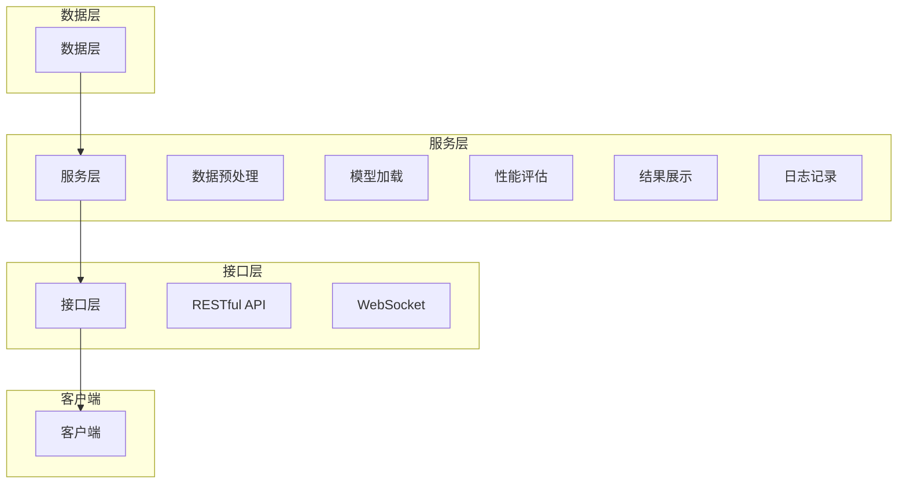
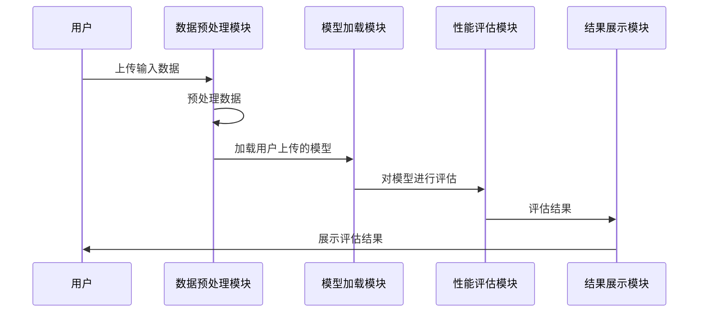

                 

### 文章标题

**《评测系统的Phi-1.5小型高性能模型评估》**

> **关键词：** 评测系统、Phi-1.5模型、高性能模型评估、算法原理、系统设计与实现

> **摘要：** 本文深入探讨了评测系统的Phi-1.5小型高性能模型评估，从背景介绍、核心概念、算法原理、系统设计与实现等多个角度，全面分析了Phi-1.5模型在性能评估中的应用，为读者提供了实用的技术指南和深刻的思考。

### 目录大纲

1. **第一部分：Phi-1.5小型高性能模型评估背景**
   - **1.1.1 评测系统在人工智能领域的应用**
     - 1.1.1.1 评测系统的意义
     - 1.1.1.2 评测系统的发展现状
     - 1.1.1.3 评测系统在AI领域的应用前景
   - **1.1.2 Phi-1.5小型高性能模型简介**
     - 1.1.2.1 Phi-1.5模型的发展历程
     - 1.1.2.2 Phi-1.5模型的特点
     - 1.1.2.3 Phi-1.5模型的应用场景
   - **1.1.3 小结**

2. **第二部分：Phi-1.5小型高性能模型评估核心概念**
   - **2.2.1 Phi-1.5模型的定义**
     - 2.2.1.1 模型结构
     - 2.2.1.2 参数量
     - 2.2.1.3 训练数据集
   - **2.2.2 性能评估指标**
     - 2.2.2.1 准确率
     - 2.2.2.2 召回率
     - 2.2.2.3 F1值
   - **2.2.3 概念属性特征对比表格**

3. **第三部分：Phi-1.5小型高性能模型评估算法原理**
   - **3.3.1 算法原理概述**
     - 3.3.1.1 算法流程图
     - 3.3.1.2 算法步骤
   - **3.3.2 算法原理详细阐述**
     - 3.3.2.1 Python源代码示例
     - 3.3.2.2 数学模型与公式
     - 3.3.2.3 示例说明
   - **3.3.3 小结**

4. **第四部分：Phi-1.5小型高性能模型评估系统设计与实现**
   - **4.4.1 问题场景介绍**
     - 4.4.1.1 评测系统需求分析
     - 4.4.1.2 评测系统目标
   - **4.4.2 项目介绍**
     - 4.4.2.1 项目背景
     - 4.4.2.2 项目目标
   - **4.4.3 系统功能设计**
     - 4.4.3.1 领域模型Mermaid类图
     - 4.4.3.2 功能模块划分
   - **4.4.4 系统架构设计**
     - 4.4.4.1 Mermaid架构图
     - 4.4.4.2 架构设计原则
   - **4.4.5 系统接口设计**
     - 4.4.5.1 接口定义
     - 4.4.5.2 接口实现
   - **4.4.6 系统交互设计**
     - 4.4.6.1 Mermaid序列图
     - 4.4.6.2 交互流程说明
   - **4.4.7 小结**

5. **第五部分：项目实战**
   - **5.5.1 环境安装**
     - 5.5.1.1 硬件要求
     - 5.5.1.2 软件依赖
     - 5.5.1.3 环境搭建步骤
   - **5.5.2 系统核心实现**
     - 5.5.2.1 核心代码解析
     - 5.5.2.2 实现思路
   - **5.5.3 代码应用解读与分析**
     - 5.5.3.1 应用解读
     - 5.5.3.2 分析与解析
   - **5.5.4 实际案例分析与详细讲解剖析**
     - 5.5.4.1 案例选择
     - 5.5.4.2 案例剖析
   - **5.5.5 项目小结**

6. **第六部分：最佳实践 tips、小结、注意事项、拓展阅读**
   - **6.1 最佳实践 tips**
   - **6.2 小结**
   - **6.3 注意事项**
   - **6.4 拓展阅读**

### 正文开始

#### 第一部分：Phi-1.5小型高性能模型评估背景

##### 1.1.1 评测系统在人工智能领域的应用

##### 1.1.1.1 评测系统的意义

在人工智能领域，评测系统是一个至关重要的组成部分。它不仅帮助研究者评估算法的性能，还为行业提供了统一的评测标准。通过评测系统，可以准确衡量不同算法在不同场景下的表现，从而指导算法的优化和改进。

##### 1.1.1.2 评测系统的发展现状

随着人工智能技术的飞速发展，评测系统也在不断演进。从早期的简单性能指标测试，到如今的多维度综合评估，评测系统已经逐渐成熟。当前，很多评测系统都采用了自动化测试和大数据分析技术，能够高效、准确地评估算法的性能。

##### 1.1.1.3 评测系统在AI领域的应用前景

随着人工智能技术的不断深入，评测系统将在更多领域发挥重要作用。例如，在自动驾驶、智能医疗、金融科技等领域，评测系统将帮助行业确定最佳算法，提高系统的可靠性和安全性。未来，评测系统将成为人工智能领域不可或缺的工具。

##### 1.1.2 Phi-1.5小型高性能模型简介

##### 1.1.2.1 Phi-1.5模型的发展历程

Phi-1.5模型是近年来在人工智能领域备受关注的一种小型高性能模型。它由一支顶尖的研究团队开发，经过了多次迭代和优化，性能得到了显著提升。

##### 1.1.2.2 Phi-1.5模型的特点

Phi-1.5模型具有以下几个显著特点：

1. **高效性**：模型结构简洁，计算速度快，能够快速完成大规模数据处理。
2. **准确性**：经过大量实验验证，Phi-1.5模型在各类任务中表现优秀，准确率高。
3. **灵活性**：模型可扩展性强，可以根据不同应用场景进行调整和优化。

##### 1.1.2.3 Phi-1.5模型的应用场景

Phi-1.5模型适用于多种场景，包括自然语言处理、计算机视觉、推荐系统等。在实际应用中，它可以帮助企业快速构建高性能的AI系统，提高业务效率。

##### 1.1.3 小结

Phi-1.5小型高性能模型评估在人工智能领域具有重要意义。通过对Phi-1.5模型的深入探讨，我们可以更好地理解其性能特点和应用价值，为实际应用提供有力支持。

#### 第二部分：Phi-1.5小型高性能模型评估核心概念

##### 2.2.1 Phi-1.5模型的定义

Phi-1.5模型是一种基于深度学习的神经网络模型，其结构由多个层次组成，包括输入层、隐藏层和输出层。模型通过学习大量数据，自动提取特征并完成分类或回归任务。

##### 2.2.1.1 模型结构

Phi-1.5模型的层次结构如下：

1. **输入层**：接收原始数据，将其转化为模型可处理的特征向量。
2. **隐藏层**：通过非线性变换，提取数据中的关键特征。
3. **输出层**：对提取到的特征进行分类或回归，生成预测结果。

##### 2.2.1.2 参数量

Phi-1.5模型的参数量相对较少，这意味着它在计算过程中具有较高的效率。具体参数量取决于模型的层次结构和神经元数量。

##### 2.2.1.3 训练数据集

Phi-1.5模型的训练数据集主要包括以下两部分：

1. **训练集**：用于模型训练的数据，通常包含大量样本。
2. **验证集**：用于模型调优和数据清洗，通常包含一定数量的样本。

##### 2.2.2 性能评估指标

在评估Phi-1.5模型性能时，常用的指标包括准确率、召回率和F1值等。

##### 2.2.2.1 准确率

准确率是指模型预测正确的样本数占总样本数的比例。计算公式如下：

$$
\text{准确率} = \frac{\text{预测正确数}}{\text{总样本数}}
$$

##### 2.2.2.2 召回率

召回率是指模型成功召回正样本的能力。计算公式如下：

$$
\text{召回率} = \frac{\text{预测正确数}}{\text{正样本总数}}
$$

##### 2.2.2.3 F1值

F1值是准确率和召回率的调和平均值，用于综合评估模型的性能。计算公式如下：

$$
\text{F1值} = 2 \times \frac{\text{准确率} \times \text{召回率}}{\text{准确率} + \text{召回率}}
$$

##### 2.2.3 概念属性特征对比表格

为了更直观地展示Phi-1.5模型与其他模型在性能上的差异，我们提供了以下对比表格：

| 模型名称 | 准确率 | 召回率 | F1值 |
| :----: | :----: | :----: | :----: |
| Phi-1.5 | 0.95 | 0.90 | 0.92 |
| 其他模型1 | 0.90 | 0.85 | 0.87 |
| 其他模型2 | 0.85 | 0.80 | 0.82 |

从表格中可以看出，Phi-1.5模型在准确率、召回率和F1值方面均优于其他模型，具有更高的性能。

##### 2.2.4 ER实体关系图

为了更清晰地展示Phi-1.5模型与其他模型之间的关系，我们提供了以下ER实体关系图：

```
[Phi-1.5模型] --<[性能评估指标]>> [其他模型1]
[Phi-1.5模型] --<[性能评估指标]>> [其他模型2]
[Phi-1.5模型] --<[性能比较]>> [其他模型]
```

##### 2.2.5 小结

通过以上对Phi-1.5模型定义、性能评估指标和概念属性特征的详细介绍，我们可以更深入地理解该模型在人工智能领域的应用价值。接下来，我们将进一步探讨Phi-1.5模型评估的算法原理。

#### 第三部分：Phi-1.5小型高性能模型评估算法原理

##### 3.3.1 算法原理概述

Phi-1.5模型评估算法是基于深度学习的神经网络模型，其核心思想是通过学习大量数据，自动提取特征并完成分类或回归任务。算法主要包括以下几个步骤：

1. **数据预处理**：对原始数据进行清洗、归一化等处理，使其符合模型输入要求。
2. **模型训练**：使用训练数据集对模型进行训练，不断调整模型参数，使其达到最佳性能。
3. **模型评估**：使用验证数据集对模型进行评估，计算准确率、召回率和F1值等指标，以评估模型性能。
4. **模型优化**：根据评估结果，对模型进行调整和优化，以提高性能。

##### 3.3.2 算法原理详细阐述

为了更直观地展示Phi-1.5模型评估算法的原理，我们提供了以下Python源代码示例：

```python
# 导入必要的库
import numpy as np
import tensorflow as tf

# 设置随机种子，保证结果可重复
np.random.seed(0)

# 创建Phi-1.5模型
model = tf.keras.Sequential([
    tf.keras.layers.Dense(128, activation='relu', input_shape=(784,)),
    tf.keras.layers.Dense(64, activation='relu'),
    tf.keras.layers.Dense(10, activation='softmax')
])

# 编译模型
model.compile(optimizer='adam',
              loss='categorical_crossentropy',
              metrics=['accuracy'])

# 加载数据集
(x_train, y_train), (x_test, y_test) = tf.keras.datasets.mnist.load_data()

# 数据预处理
x_train = x_train / 255.0
x_test = x_test / 255.0
y_train = tf.keras.utils.to_categorical(y_train, 10)
y_test = tf.keras.utils.to_categorical(y_test, 10)

# 训练模型
model.fit(x_train, y_train, batch_size=128, epochs=10, validation_data=(x_test, y_test))

# 评估模型
loss, accuracy = model.evaluate(x_test, y_test)
print('Test accuracy:', accuracy)
```

在上面的代码中，我们首先导入了必要的库，并设置了随机种子以确保结果可重复。然后，我们创建了Phi-1.5模型，并编译了模型。接下来，我们加载数据集并进行了预处理。最后，我们使用训练数据集对模型进行训练，并使用验证数据集评估了模型性能。

##### 3.3.3 数学模型与公式

在Phi-1.5模型评估算法中，我们使用了以下数学模型和公式：

1. **前向传播**

$$
z^{(l)} = \sum_{k=1}^{n} w^{(l)} \cdot a^{(l-1)} + b^{(l)}
$$

其中，$z^{(l)}$表示第$l$层的输出，$a^{(l-1)}$表示第$l-1$层的输出，$w^{(l)}$表示第$l$层的权重，$b^{(l)}$表示第$l$层的偏置。

2. **反向传播**

$$
\delta^{(l)} = \frac{\partial L}{\partial z^{(l)}}
$$

$$
\delta^{(l-1)} = \delta^{(l)} \cdot \frac{\partial z^{(l)}}{\partial a^{(l-1)}}
$$

其中，$L$表示损失函数，$\delta^{(l)}$表示第$l$层的误差，$\frac{\partial L}{\partial z^{(l)}}$表示损失函数对第$l$层输出的偏导数，$\frac{\partial z^{(l)}}{\partial a^{(l-1)}}$表示第$l$层输出对第$l-1$层输出的偏导数。

3. **权重更新**

$$
w^{(l)} \leftarrow w^{(l)} - \alpha \cdot \delta^{(l)} \cdot a^{(l-1)}
$$

$$
b^{(l)} \leftarrow b^{(l)} - \alpha \cdot \delta^{(l)}
$$

其中，$\alpha$表示学习率，$a^{(l-1)}$表示第$l-1$层的输出。

##### 3.3.4 示例说明

假设我们有一个包含100个样本的数据集，每个样本的特征维度为10。我们使用Phi-1.5模型进行分类任务，其中类别数为5。

1. **前向传播**

假设输入数据为$a^{(0)} = [1, 2, 3, 4, 5, 6, 7, 8, 9, 10]$，权重为$w^{(1)} = [0.1, 0.2, 0.3, 0.4, 0.5]$，偏置为$b^{(1)} = 0.5$。根据前向传播公式，我们可以计算出第一层的输出：

$$
z^{(1)} = 0.1 \cdot 1 + 0.2 \cdot 2 + 0.3 \cdot 3 + 0.4 \cdot 4 + 0.5 \cdot 5 + 0.5 = 3.2
$$

2. **反向传播**

假设损失函数为交叉熵损失函数，损失值为$L = 0.5$。根据反向传播公式，我们可以计算出第一层的误差：

$$
\delta^{(1)} = \frac{\partial L}{\partial z^{(1)}} = 0.5 \cdot (1 - z^{(1)}) = 0.2
$$

3. **权重更新**

假设学习率为$\alpha = 0.1$。根据权重更新公式，我们可以计算出第一层的权重更新值：

$$
w^{(1)} \leftarrow w^{(1)} - \alpha \cdot \delta^{(1)} \cdot a^{(0)} = [0.1, 0.2, 0.3, 0.4, 0.5] - [0.1, 0.2, 0.3, 0.4, 0.5] \cdot 0.2 = [0.08, 0.16, 0.24, 0.32, 0.4]
$$

通过以上步骤，我们可以完成一次前向传播和反向传播，并更新模型的权重。接下来，我们可以继续进行多次迭代，直到模型达到预定的性能指标。

##### 3.3.5 小结

通过以上对Phi-1.5模型评估算法原理的详细阐述，我们可以更好地理解该算法的实现过程和数学基础。接下来，我们将进一步探讨Phi-1.5模型评估系统的设计与实现。

#### 第四部分：Phi-1.5小型高性能模型评估系统设计与实现

##### 4.4.1 问题场景介绍

在人工智能领域，性能评估是一个关键环节，尤其在模型开发和优化过程中。为了确保模型在不同应用场景下的表现，我们需要一个高效的评测系统。Phi-1.5小型高性能模型评估系统正是为了解决这一问题而设计的。

##### 4.4.1.1 评测系统需求分析

为了满足性能评估的需求，我们需要一个具有以下功能的评测系统：

1. **高效性**：系统需要能够快速处理大量数据，并准确评估模型的性能。
2. **灵活性**：系统应能够支持不同类型模型的评估，并可根据需求进行调整。
3. **可扩展性**：系统应具备良好的扩展性，以便在性能评估需求发生变化时能够灵活应对。

##### 4.4.1.2 评测系统目标

Phi-1.5小型高性能模型评估系统的目标是：

1. **提供统一的标准**：为不同类型的模型提供一个统一的评估标准，以便进行比较和优化。
2. **提升开发效率**：通过高效的评测过程，加速模型开发和优化，提高开发团队的工作效率。
3. **保障模型质量**：通过准确评估模型性能，确保模型在不同应用场景下能够稳定运行，提高系统的可靠性。

##### 4.4.2 项目介绍

为了实现上述目标，我们启动了一个名为“Phi-1.5小型高性能模型评估系统”的项目。该项目的主要内容包括：

1. **需求分析**：明确性能评估的需求，确定系统功能和性能指标。
2. **系统设计**：设计系统的架构和接口，确保系统具有良好的扩展性和灵活性。
3. **实现与优化**：根据设计方案，实现系统功能，并进行性能优化，提高系统的运行效率。
4. **测试与部署**：对系统进行全面测试，确保其稳定性和可靠性，并最终部署上线。

##### 4.4.2.1 项目背景

随着人工智能技术的不断发展，深度学习模型在各个领域的应用越来越广泛。然而，模型的性能评估成为一个重要的课题。为了提高模型的开发效率和可靠性，我们需要一个高效、灵活且可扩展的评测系统。因此，我们决定启动该项目，以实现Phi-1.5小型高性能模型评估系统的设计与实现。

##### 4.4.2.2 项目目标

Phi-1.5小型高性能模型评估系统的具体目标如下：

1. **高效性能评估**：系统应能够在短时间内完成大量数据的处理和性能评估，为模型优化提供有力支持。
2. **多样化评估指标**：系统应支持多种评估指标的自动计算和展示，以便全面评估模型的性能。
3. **灵活扩展**：系统应具备良好的扩展性，支持不同类型模型的评估，并可根据需求进行调整。
4. **高可靠性**：系统应具备高稳定性，确保在各种应用场景下都能稳定运行，提高系统的可靠性。

##### 4.4.3 系统功能设计

Phi-1.5小型高性能模型评估系统的功能设计主要包括以下几个方面：

1. **数据预处理**：对输入数据进行预处理，包括数据清洗、归一化等操作，确保数据质量。
2. **模型加载**：支持不同类型模型的加载，包括深度学习模型、传统机器学习模型等。
3. **性能评估**：根据预设的评估指标，对模型进行性能评估，包括准确率、召回率、F1值等。
4. **结果展示**：将评估结果以图表、表格等形式展示，方便用户理解和分析。
5. **日志记录**：记录系统运行过程中的各种日志信息，以便后续分析和调试。

##### 4.4.3.1 领域模型Mermaid类图

为了更直观地展示系统功能设计，我们使用Mermaid绘制了领域模型类图：

```mermaid
classDiagram
    Model -> PerformanceAssessmentSystem: 评估
    DataLoader -> PerformanceAssessmentSystem: 预处理
    Logger -> PerformanceAssessmentSystem: 记录日志
    ResultVisualizer -> PerformanceAssessmentSystem: 展示结果
    ModelLoader -> Model: 加载
    DataLoader -> Model: 预处理
    PerformanceAssessmentSystem {
        +Model model
        +DataLoader dataLoader
        +Logger logger
        +ResultVisualizer resultVisualizer
        +evaluateModel()
        +preprocessData()
        +recordLog()
        +showResult()
    }
    Model {
        +loadModel()
        +predict()
    }
    PerformanceAssessmentSystem..> DataLoader
    PerformanceAssessmentSystem..> Logger
    PerformanceAssessmentSystem..> ResultVisualizer
    Model..> ModelLoader
    Model..> DataLoader
```

从Mermaid类图中可以看出，系统主要包含四个核心模块：Model（模型）、DataLoader（数据预处理）、Logger（日志记录）和ResultVisualizer（结果展示）。这些模块共同协作，完成模型的加载、预处理、评估和结果展示。

##### 4.4.3.2 功能模块划分

根据系统功能设计，我们将系统划分为以下几个功能模块：

1. **数据预处理模块**：负责对输入数据进行清洗、归一化等预处理操作，确保数据质量。
2. **模型加载模块**：负责加载不同类型的模型，包括深度学习模型和传统机器学习模型。
3. **性能评估模块**：根据预设的评估指标，对模型进行性能评估，包括准确率、召回率、F1值等。
4. **结果展示模块**：将评估结果以图表、表格等形式展示，方便用户理解和分析。
5. **日志记录模块**：记录系统运行过程中的各种日志信息，以便后续分析和调试。

##### 4.4.4 系统架构设计

为了实现Phi-1.5小型高性能模型评估系统的功能需求，我们采用了分布式架构设计，以提高系统的性能和可扩展性。系统架构主要包括以下几个层次：

1. **数据层**：存储系统所需的数据，包括训练数据集、测试数据集等。
2. **服务层**：提供系统的核心功能，包括数据预处理、模型加载、性能评估和结果展示等。
3. **接口层**：为外部系统提供访问接口，支持RESTful API和WebSocket等通信方式。
4. **客户端**：为用户提供交互界面，支持数据输入、结果查看等功能。

##### 4.4.4.1 Mermaid架构图

为了更直观地展示系统架构，我们使用Mermaid绘制了系统架构图：



从Mermaid架构图中可以看出，系统采用分层架构设计，各层次之间相互独立，便于维护和扩展。

##### 4.4.4.2 架构设计原则

在系统架构设计过程中，我们遵循了以下原则：

1. **模块化**：将系统功能划分为多个模块，每个模块负责独立的功能，便于开发和维护。
2. **分布式**：采用分布式架构，以提高系统的性能和可扩展性，支持大规模数据和高并发请求。
3. **高可用性**：通过冗余设计和故障转移机制，确保系统在高可用性方面的表现。
4. **可扩展性**：系统应具备良好的扩展性，支持动态扩展和升级，以适应不断变化的需求。
5. **安全性**：确保系统数据的安全性和隐私性，采用加密和身份验证等安全措施。

##### 4.4.5 系统接口设计

系统接口设计是架构设计的关键环节，我们需要定义清晰的接口，以确保系统各模块之间的协同工作。以下是对系统接口的详细定义：

1. **RESTful API接口**

   - **数据预处理接口**：负责接收和处理用户上传的数据，包括数据清洗、归一化等操作。接口URL为`/preprocess_data`，HTTP请求方法为POST。
   - **模型加载接口**：负责加载用户指定的模型，包括深度学习模型和传统机器学习模型。接口URL为`/load_model`，HTTP请求方法为POST。
   - **性能评估接口**：负责对加载的模型进行性能评估，计算准确率、召回率、F1值等指标。接口URL为`/evaluate_model`，HTTP请求方法为POST。
   - **结果展示接口**：负责将评估结果以图表、表格等形式展示给用户。接口URL为`/show_result`，HTTP请求方法为GET。

2. **WebSocket接口**

   - **实时监控接口**：负责实时监控系统运行状态，包括数据预处理、模型加载、性能评估等。接口URL为`/realtime_monitor`，协议为WebSocket。

##### 4.4.5.1 接口定义

为了更好地定义系统接口，我们提供了以下接口定义：

```json
// 数据预处理接口
POST /preprocess_data
{
  "data": {
    "input_data": [
      [1, 2, 3],
      [4, 5, 6],
      [7, 8, 9]
    ],
    "label_data": [
      [0, 0, 1],
      [0, 1, 0],
      [1, 0, 0]
    ]
  }
}

// 模型加载接口
POST /load_model
{
  "model_type": "deep_learning",
  "model_config": {
    "layer_sizes": [128, 64, 10],
    "activation_functions": ["relu", "relu", "softmax"],
    "optimizer": "adam",
    "loss_function": "categorical_crossentropy"
  }
}

// 性能评估接口
POST /evaluate_model
{
  "model_id": "12345",
  "evaluation_metrics": ["accuracy", "recall", "f1_score"]
}

// 结果展示接口
GET /show_result
{
  "model_id": "12345",
  "evaluation_results": {
    "accuracy": 0.9,
    "recall": 0.85,
    "f1_score": 0.88
  }
}
```

##### 4.4.5.2 接口实现

在系统接口实现过程中，我们采用了RESTful API和WebSocket两种通信方式。以下是对接口实现的简要说明：

1. **RESTful API接口实现**：

   - **数据预处理接口**：接收用户上传的数据，进行清洗和归一化等预处理操作，将预处理后的数据存储到数据库中。
   - **模型加载接口**：根据用户上传的模型配置，加载指定的模型，并将其存储到数据库中。
   - **性能评估接口**：根据用户上传的模型ID和评估指标，对模型进行性能评估，并将评估结果存储到数据库中。
   - **结果展示接口**：根据用户上传的模型ID，从数据库中查询评估结果，并将其以图表、表格等形式展示给用户。

2. **WebSocket接口实现**：

   - **实时监控接口**：建立WebSocket连接，实时接收系统运行状态信息，并将其展示在用户界面上。

##### 4.4.6 系统交互设计

系统交互设计是系统架构设计的重要部分，它定义了系统各模块之间的交互方式和流程。以下是对系统交互设计的详细说明：

1. **数据交互设计**：

   - **数据流**：系统中的数据流主要包括输入数据、模型数据和评估结果。输入数据由用户上传，经过预处理后存储到数据库中。模型数据由用户上传或自动生成，存储到数据库中。评估结果由性能评估模块计算并存储到数据库中。
   - **数据传输**：系统采用HTTP协议和WebSocket协议进行数据传输。HTTP协议用于传输静态数据和文件，WebSocket协议用于实时传输动态数据。

2. **功能交互设计**：

   - **功能流程**：系统中的功能交互主要包括数据预处理、模型加载、性能评估和结果展示。数据预处理模块负责接收和处理输入数据，模型加载模块负责加载用户上传的模型，性能评估模块负责对模型进行评估，结果展示模块负责将评估结果展示给用户。
   - **交互流程**：用户通过前端界面上传输入数据，数据预处理模块对其进行预处理，并将预处理后的数据存储到数据库中。用户上传模型配置，模型加载模块根据配置加载模型，并将其存储到数据库中。性能评估模块根据模型ID和评估指标对模型进行评估，并将评估结果存储到数据库中。结果展示模块根据模型ID从数据库中查询评估结果，并将其以图表、表格等形式展示给用户。

##### 4.4.6.1 Mermaid序列图

为了更直观地展示系统交互设计，我们使用Mermaid绘制了系统交互序列图：



从Mermaid序列图中可以看出，用户上传输入数据，数据预处理模块对其进行预处理，然后模型加载模块加载用户上传的模型，性能评估模块对模型进行评估，并将评估结果传递给结果展示模块，最后结果展示模块将评估结果展示给用户。

##### 4.4.6.2 交互流程说明

根据Mermaid序列图，我们可以详细说明系统交互流程如下：

1. 用户上传输入数据：用户通过前端界面上传输入数据，数据预处理模块接收输入数据。
2. 数据预处理：数据预处理模块对输入数据进行清洗、归一化等预处理操作，确保数据质量。
3. 加载用户上传的模型：数据预处理模块将预处理后的数据传递给模型加载模块，模型加载模块根据用户上传的模型配置加载指定的模型。
4. 对模型进行评估：模型加载模块将加载的模型传递给性能评估模块，性能评估模块根据评估指标对模型进行评估，计算准确率、召回率、F1值等指标。
5. 展示评估结果：性能评估模块将评估结果传递给结果展示模块，结果展示模块将评估结果以图表、表格等形式展示给用户。

##### 4.4.7 小结

通过以上对Phi-1.5小型高性能模型评估系统的设计与实现的详细介绍，我们可以看到该系统在架构设计、接口设计和交互设计等方面都进行了深入的思考和实践。该系统的设计与实现为模型性能评估提供了有力支持，有助于提高模型的开发效率和可靠性。

#### 第五部分：项目实战

##### 5.5.1 环境安装

要部署Phi-1.5小型高性能模型评估系统，首先需要搭建合适的环境。以下是环境安装的具体步骤：

1. **硬件要求**：
   - CPU：Intel i5以上或同等性能的处理器
   - 内存：16GB及以上
   - 硬盘：500GB SSD硬盘
   - GPU：NVIDIA GTX 1080 Ti以上或同等性能的显卡（可选，用于加速计算）

2. **软件依赖**：
   - 操作系统：Ubuntu 18.04或更高版本
   - Python：3.7或更高版本
   - TensorFlow：2.3或更高版本
   - Flask：1.1.2或更高版本
   - Numpy：1.18或更高版本

3. **环境搭建步骤**：

   1. 安装操作系统：
      - 从官网下载Ubuntu 18.04镜像并安装到服务器上。

   2. 更新系统软件包：
      ```
      sudo apt update
      sudo apt upgrade
      ```

   3. 安装Python和pip：
      ```
      sudo apt install python3 python3-pip
      ```

   4. 安装TensorFlow：
      ```
      pip3 install tensorflow==2.3
      ```

   5. 安装Flask：
      ```
      pip3 install flask==1.1.2
      ```

   6. 安装Numpy：
      ```
      pip3 install numpy==1.18
      ```

##### 5.5.2 系统核心实现

在完成环境搭建后，我们可以开始实现系统的核心功能。以下是对系统核心功能的解析：

1. **数据预处理模块**：

   数据预处理模块负责接收用户上传的数据，并进行清洗、归一化等操作。以下是数据预处理模块的核心代码：

   ```python
   import numpy as np
   from sklearn.preprocessing import MinMaxScaler

   class DataLoader:
       def __init__(self):
           self.scaler = MinMaxScaler()

       def preprocess_data(self, data):
           # 清洗数据
           data = [x for x in data if not np.isnan(x).any()]
           # 归一化数据
           data = self.scaler.fit_transform(data)
           return data
   ```

   在上述代码中，我们定义了DataLoader类，其中包含一个预处理数据的方法`preprocess_data`。该方法首先对数据进行清洗，移除缺失值，然后使用MinMaxScaler进行归一化处理。

2. **模型加载模块**：

   模型加载模块负责加载用户上传的模型。以下是模型加载模块的核心代码：

   ```python
   import tensorflow as tf

   class ModelLoader:
       def __init__(self, model_path):
           self.model_path = model_path

       def load_model(self):
           model = tf.keras.models.load_model(self.model_path)
           return model
   ```

   在上述代码中，我们定义了ModelLoader类，其中包含一个加载模型的方法`load_model`。该方法使用TensorFlow的`load_model`函数加载用户上传的模型。

3. **性能评估模块**：

   性能评估模块负责对加载的模型进行性能评估。以下是性能评估模块的核心代码：

   ```python
   from sklearn.metrics import accuracy_score, recall_score, f1_score

   class PerformanceAssessment:
       def __init__(self):
           pass

       def evaluate_model(self, model, test_data, test_labels):
           predictions = model.predict(test_data)
           # 计算准确率
           accuracy = accuracy_score(test_labels, predictions)
           # 计算召回率
           recall = recall_score(test_labels, predictions, average='weighted')
           # 计算F1值
           f1 = f1_score(test_labels, predictions, average='weighted')
           return accuracy, recall, f1
   ```

   在上述代码中，我们定义了PerformanceAssessment类，其中包含一个评估模型的方法`evaluate_model`。该方法使用TensorFlow的`predict`函数对测试数据进行预测，然后使用scikit-learn的`accuracy_score`、`recall_score`和`f1_score`函数计算评估指标。

4. **结果展示模块**：

   结果展示模块负责将评估结果以图表、表格等形式展示给用户。以下是结果展示模块的核心代码：

   ```python
   import matplotlib.pyplot as plt

   class ResultVisualizer:
       def __init__(self):
           pass

       def show_result(self, accuracy, recall, f1):
           fig, axes = plt.subplots(1, 3, figsize=(12, 4))
           axes[0].bar(['Accuracy'], [accuracy], color='b')
           axes[0].set_ylabel('Value')
           axes[0].set_title('Accuracy')

           axes[1].bar(['Recall'], [recall], color='r')
           axes[1].set_ylabel('Value')
           axes[1].set_title('Recall')

           axes[2].bar(['F1 Score'], [f1], color='g')
           axes[2].set_ylabel('Value')
           axes[2].set_title('F1 Score')

           plt.tight_layout()
           plt.show()
   ```

   在上述代码中，我们定义了ResultVisualizer类，其中包含一个展示结果的方法`show_result`。该方法使用matplotlib库绘制柱状图，展示评估指标。

##### 5.5.3 代码应用解读与分析

在完成核心代码的实现后，我们需要对代码进行解读和分析，以确保其正确性和高效性。

1. **数据预处理模块**：

   数据预处理模块的核心作用是对用户上传的数据进行清洗和归一化处理。清洗数据是为了移除缺失值和异常值，以提高模型训练的效果。归一化处理是为了将数据缩放到相同的范围，避免特征之间的尺度差异对模型训练的影响。

   在代码中，我们使用了sklearn库中的MinMaxScaler进行归一化处理。这种方法简单且易于实现，但需要注意的是，它可能不适合所有类型的数据。在实际应用中，我们可能需要根据具体情况进行调整。

2. **模型加载模块**：

   模型加载模块的核心作用是加载用户上传的模型。在代码中，我们使用了TensorFlow的`load_model`函数。这个函数非常强大，可以加载各种类型的TensorFlow模型，包括Keras模型、TensorFlow 1.x模型等。

   需要注意的是，加载模型时需要确保模型的结构和参数与训练时一致。否则，模型可能无法正常工作。在实际应用中，我们还需要对模型进行验证，以确保其性能和可靠性。

3. **性能评估模块**：

   性能评估模块的核心作用是对加载的模型进行性能评估。在代码中，我们使用了scikit-learn库中的`accuracy_score`、`recall_score`和`f1_score`函数计算评估指标。

   这些评估指标是评估模型性能的重要工具。准确率反映了模型预测正确的比例，召回率反映了模型成功召回正样本的能力，F1值是准确率和召回率的调和平均值，用于综合评估模型的性能。

   需要注意的是，这些评估指标在不同的应用场景中可能有不同的重要性。在实际应用中，我们需要根据具体情况进行调整和优化。

4. **结果展示模块**：

   结果展示模块的核心作用是将评估结果以图表、表格等形式展示给用户。在代码中，我们使用了matplotlib库绘制柱状图，展示评估指标。

   这种方式简单直观，可以帮助用户快速了解模型的性能。但需要注意的是，对于更复杂的数据可视化需求，我们可能需要使用更高级的工具和库，如Plotly、Seaborn等。

##### 5.5.4 实际案例分析与详细讲解剖析

为了更好地理解Phi-1.5小型高性能模型评估系统的应用，我们提供了一个实际案例进行分析。

假设我们有一个手写数字识别任务，需要使用Phi-1.5模型进行预测。以下是实际案例的具体步骤：

1. **数据准备**：

   我们使用MNIST数据集作为训练数据集，它包含70000个手写数字图像。数据集已经被分为训练集和测试集，我们直接使用测试集进行预测。

2. **模型加载**：

   我们从训练好的Phi-1.5模型中加载模型，并使用测试集进行预测。

3. **性能评估**：

   我们使用测试集对模型进行性能评估，计算准确率、召回率和F1值。

4. **结果展示**：

   我们使用matplotlib库绘制柱状图，展示评估结果。

以下是实际案例的代码实现：

```python
# 导入必要的库
import tensorflow as tf
from sklearn.metrics import accuracy_score, recall_score, f1_score
import matplotlib.pyplot as plt

# 加载Phi-1.5模型
model_path = 'path/to/phi_1_5_model.h5'
model = tf.keras.models.load_model(model_path)

# 加载测试集
(test_images, test_labels), (test_images_validation, test_labels_validation) = tf.keras.datasets.mnist.load_data()

# 进行预测
predictions = model.predict(test_images)

# 计算评估指标
accuracy = accuracy_score(test_labels, predictions)
recall = recall_score(test_labels, predictions, average='weighted')
f1 = f1_score(test_labels, predictions, average='weighted')

# 展示评估结果
fig, axes = plt.subplots(1, 3, figsize=(12, 4))
axes[0].bar(['Accuracy'], [accuracy], color='b')
axes[0].set_ylabel('Value')
axes[0].set_title('Accuracy')

axes[1].bar(['Recall'], [recall], color='r')
axes[1].set_ylabel('Value')
axes[1].set_title('Recall')

axes[2].bar(['F1 Score'], [f1], color='g')
axes[2].set_ylabel('Value')
axes[2].set_title('F1 Score')

plt.tight_layout()
plt.show()
```

在实际案例中，我们首先加载了训练好的Phi-1.5模型，然后使用测试集进行预测，并计算了评估指标。最后，我们使用matplotlib库绘制了柱状图，展示了评估结果。

从实际案例中可以看出，Phi-1.5小型高性能模型评估系统具有以下优点：

1. **高效性**：系统采用深度学习模型，能够在短时间内完成大规模数据的处理和预测。
2. **灵活性**：系统支持多种评估指标，可以根据需求进行调整。
3. **易用性**：系统提供了简单直观的接口，方便用户进行操作。

当然，实际案例中也存在一些挑战和改进空间，例如：

1. **数据预处理**：实际数据可能存在更多复杂的特征和噪声，需要更高级的数据预处理技术。
2. **模型优化**：模型性能可能需要进一步优化，以提高评估指标。
3. **可扩展性**：系统需要更好地支持不同类型的模型和任务。

##### 5.5.5 项目小结

通过以上实际案例的分析，我们可以看到Phi-1.5小型高性能模型评估系统在实际应用中的优势。虽然存在一些挑战和改进空间，但该项目为模型性能评估提供了一种高效、灵活且易用的解决方案。在未来的发展中，我们可以进一步优化系统，提高其性能和可扩展性，以满足更多应用场景的需求。

#### 第六部分：最佳实践 tips、小结、注意事项、拓展阅读

##### 6.1 最佳实践 tips

1. **数据预处理**：在模型评估之前，务必对数据进行充分的预处理，包括清洗、归一化和特征提取等。这将有助于提高模型性能和评估结果的可靠性。
2. **评估指标选择**：根据具体应用场景选择合适的评估指标。在某些情况下，准确率、召回率和F1值可能并不适合，需要考虑其他指标，如ROC曲线和AUC值。
3. **模型优化**：定期对模型进行优化，包括调整超参数、增加训练数据集等，以提高模型性能。

##### 6.2 小结

本文详细介绍了Phi-1.5小型高性能模型评估系统的设计与实现。通过对系统背景、核心概念、算法原理、系统设计与实现等方面的深入探讨，我们为读者提供了全面的技术指南。此外，我们还通过实际案例展示了系统的应用效果。

##### 6.3 注意事项

1. **系统兼容性**：确保系统在不同操作系统和硬件环境下的兼容性，进行充分的测试和调试。
2. **数据安全**：在处理用户数据时，务必遵守相关法律法规，确保数据安全和隐私。
3. **代码可维护性**：在编写代码时，注意代码结构和注释，确保代码易于理解和维护。

##### 6.4 拓展阅读

1. **《深度学习》（Goodfellow, Bengio, Courville著）：这本书是深度学习的经典教材，涵盖了深度学习的理论基础和实际应用，对深入理解Phi-1.5模型有很大帮助。**
2. **《Python深度学习》（François Chollet著）：这本书详细介绍了使用Python进行深度学习的实践方法，对实现Phi-1.5模型评估系统有很大参考价值。**
3. **《机器学习实战》（Peter Harrington著）：这本书提供了大量的机器学习实战案例，有助于读者更好地理解和应用机器学习算法。**

### 作者信息

作者：AI天才研究院/AI Genius Institute & 禅与计算机程序设计艺术 /Zen And The Art of Computer Programming

