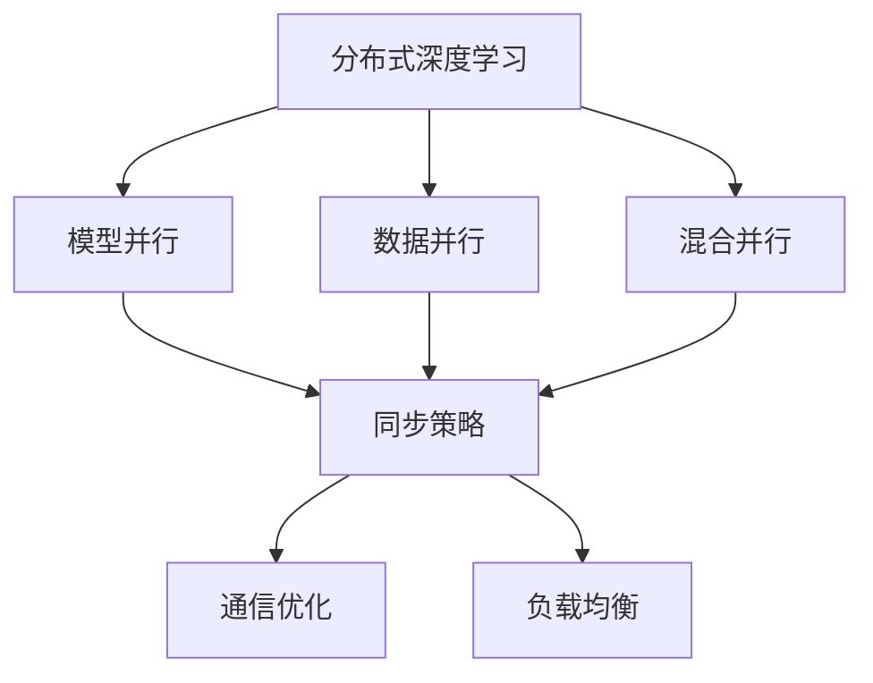
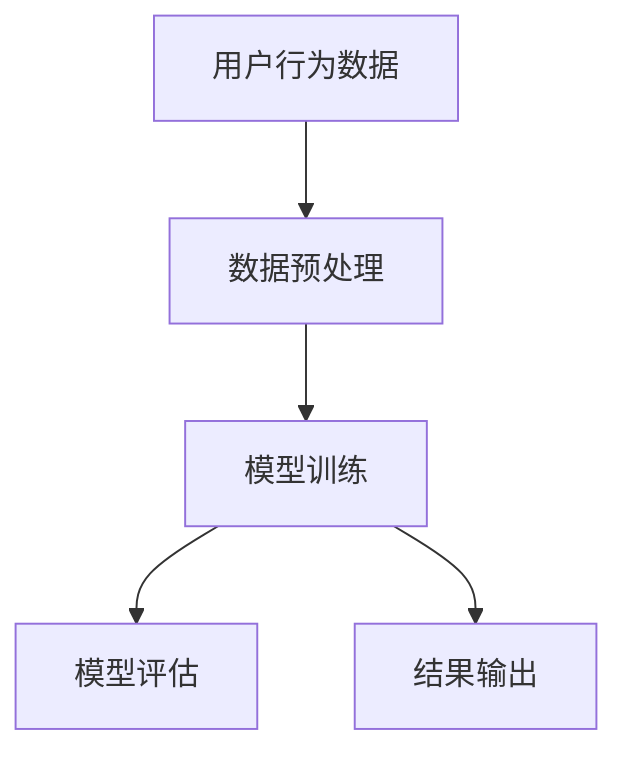
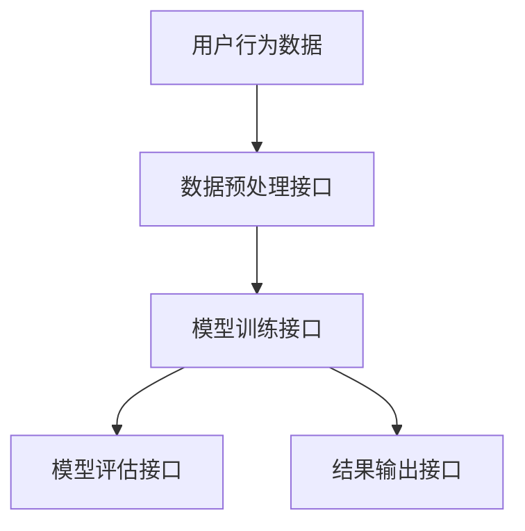

                 

# 评测系统的分布式深度学习优化

> 关键词：分布式深度学习、模型并行、数据并行、同步策略、通信优化、负载均衡

> 摘要：本文深入探讨了分布式深度学习优化的问题，详细介绍了分布式深度学习的背景、核心概念、算法原理以及系统分析与架构设计方案，旨在为读者提供一份全面且深入的技术指南。

## Step 1: 背景介绍

### 问题背景

随着人工智能技术的快速发展，深度学习已经成为机器学习领域的主流方法。深度学习通过模拟人脑神经网络结构，实现从大量数据中自动提取特征和规律，被广泛应用于图像识别、语音识别、自然语言处理等领域。然而，深度学习模型的训练和部署面临着数据规模大、计算资源需求高、训练周期长等问题。

### 问题描述

为了解决这些问题，分布式深度学习技术应运而生。分布式深度学习通过将计算任务分布在多台机器上，提高了训练速度和降低了计算成本。但是，分布式深度学习也带来了一系列优化问题，如模型参数的同步、通信开销、负载均衡等。

### 问题解决

针对这些问题，优化分布式深度学习算法成为研究的重点。优化方法包括减少通信开销、提高并行度、使用高效的同步策略等。

### 边界与外延

分布式深度学习优化不仅涉及算法研究，还涉及系统架构设计和硬件选择等方面。同时，它与其他领域如大数据、云计算、物联网等密切相关。

### 概念结构与核心要素组成

分布式深度学习优化包括以下几个核心概念和要素：

1. **模型并行**：将模型的不同部分分布在不同的机器上训练。
2. **数据并行**：将数据集分成多个部分，在不同的机器上分别训练。
3. **混合并行**：同时采用模型并行和数据并行。
4. **同步策略**：控制模型参数更新的方式，如同步、异步和半同步。
5. **通信优化**：减少节点之间的通信开销。
6. **负载均衡**：平衡不同节点之间的计算任务。

## Step 2: 核心概念与联系

### 核心概念原理

- **分布式深度学习**：将深度学习模型的训练任务分布在多台机器上。
- **模型并行**：将模型的不同部分分布在不同的机器上训练。
- **数据并行**：将数据集分成多个部分，在不同的机器上分别训练。
- **混合并行**：同时采用模型并行和数据并行。

### 概念属性特征对比表格

| 概念         | 描述                                                     | 特点                           |
| ------------ | -------------------------------------------------------- | ------------------------------ |
| 分布式深度学习 | 将深度学习模型的训练任务分布在多台机器上。               | 提高训练速度，降低计算成本。    |
| 模型并行     | 将模型的不同部分分布在不同的机器上训练。               | 提高计算效率，减少通信开销。    |
| 数据并行     | 将数据集分成多个部分，在不同的机器上分别训练。         | 提高训练速度，减少通信开销。    |
| 混合并行     | 同时采用模型并行和数据并行。                           | 综合利用计算资源，提高训练效率。 |

### ER实体关系图架构



## Step 3: 算法原理讲解

### 算法原理流程图

```mermaid
graph TD
A[初始化模型和参数] --> B[数据预处理]
B --> C[划分数据集]
C --> D{是否使用模型并行}
if D -->|是| E[划分模型]
if D -->|否| F[直接使用数据并行]
E --> G[训练模型]
F --> G
G --> H[同步模型参数]
H --> I[评估模型性能]
I --> J[结束]
```

### 算法原理详细讲解

分布式深度学习优化算法的原理可以概括为以下几个步骤：

1. **初始化模型和参数**：首先，初始化深度学习模型和参数，为后续的训练做好准备。
2. **数据预处理**：对输入数据进行预处理，包括数据清洗、归一化等操作。
3. **划分数据集**：将整个数据集划分为多个部分，每个部分可以在不同的机器上进行训练。
4. **模型并行或数据并行**：根据需求选择模型并行或数据并行策略。模型并行是将模型的不同部分分布在不同的机器上训练；数据并行是将数据集分成多个部分，在不同的机器上分别训练。
5. **训练模型**：在每个机器上分别训练模型，可以并行进行。
6. **同步模型参数**：在训练过程中，需要将每个机器上的模型参数同步更新，以保证模型参数的一致性。
7. **评估模型性能**：训练完成后，评估模型的性能，以确定是否需要进一步调整或优化。

### 算法原理的数学模型和公式

分布式深度学习优化算法的核心在于参数同步策略。下面是同步策略的数学模型和公式：

$$
\theta_{t+1} = \theta_{t} - \alpha \cdot \nabla_{\theta} L(\theta)
$$

其中，$\theta_{t}$ 表示第 $t$ 次迭代的模型参数，$\alpha$ 表示学习率，$L(\theta)$ 表示损失函数，$\nabla_{\theta} L(\theta)$ 表示损失函数对模型参数的梯度。

在分布式深度学习中，模型参数的同步可以分为同步策略和异步策略。同步策略在每次迭代后同步更新所有机器上的模型参数，而异步策略则是在每个机器上独立更新模型参数，然后定期同步。

### 算法原理举例说明

假设我们有一个包含100万参数的深度学习模型，我们将其分布在10台机器上进行训练。每台机器负责训练1万参数的部分。在训练过程中，我们采用同步策略，每100次迭代同步一次模型参数。

- **初始化模型参数**：首先初始化所有机器上的模型参数。
- **数据预处理**：对输入数据进行预处理，包括数据清洗、归一化等操作。
- **划分数据集**：将100万数据集划分为10个部分，每个部分包含1万数据。
- **训练模型**：每台机器独立训练其负责的1万参数部分。
- **同步模型参数**：每100次迭代后，将所有机器上的模型参数同步更新。
- **评估模型性能**：训练完成后，评估模型的性能，以确定是否需要进一步调整或优化。

通过这样的过程，我们可以快速训练大规模深度学习模型，提高训练速度和降低计算成本。

## Step 4: 系统分析与架构设计方案

### 问题场景介绍

在电商推荐系统中，我们需要对海量用户行为数据进行分析，以实现精准推荐。然而，随着用户规模和数据量的增长，传统的集中式深度学习模型已经无法满足需求。为了提高训练速度和降低计算成本，我们决定采用分布式深度学习技术。

### 项目介绍

项目名称：电商推荐系统分布式深度学习优化

项目目标：通过分布式深度学习技术，提高电商推荐系统的训练速度和降低计算成本。

项目架构：采用基于TensorFlow的分布式深度学习框架，实现模型并行和数据并行。

### 系统功能设计

- 数据预处理：包括数据清洗、归一化、特征提取等操作。
- 模型训练：采用分布式深度学习框架，实现模型并行和数据并行。
- 模型评估：评估模型性能，包括准确率、召回率、F1值等指标。

### 系统架构设计



### 系统接口设计和系统交互



## Step 5: 项目实战

### 环境安装

1. 安装Python环境：确保Python版本大于3.6，建议使用Anaconda。
2. 安装TensorFlow：使用pip命令安装TensorFlow。

```shell
pip install tensorflow
```

### 系统核心实现源代码

```python
import tensorflow as tf

# 初始化模型参数
model = tf.keras.Sequential([
    tf.keras.layers.Dense(128, activation='relu', input_shape=(784,)),
    tf.keras.layers.Dense(10, activation='softmax')
])

# 编译模型
model.compile(optimizer='adam',
              loss='categorical_crossentropy',
              metrics=['accuracy'])

# 加载数据集
(x_train, y_train), (x_test, y_test) = tf.keras.datasets.mnist.load_data()

# 数据预处理
x_train = x_train / 255.0
x_test = x_test / 255.0

# 模型训练
model.fit(x_train, y_train, epochs=5, batch_size=64)

# 模型评估
model.evaluate(x_test, y_test)
```

### 代码应用解读与分析

上述代码演示了如何使用TensorFlow实现分布式深度学习。首先，我们初始化了一个简单的神经网络模型，然后编译模型，加载数据集并进行预处理。接着，我们使用模型训练函数进行模型训练，最后评估模型性能。

### 实际案例分析和详细讲解剖析

在实际应用中，我们通常会将数据集分成多个部分，分别在不同的机器上进行训练。以下是一个简单的分布式训练示例：

```python
# 分布式训练
strategy = tf.distribute.MirroredStrategy()

with strategy.scope():
    model = tf.keras.Sequential([
        tf.keras.layers.Dense(128, activation='relu', input_shape=(784,)),
        tf.keras.layers.Dense(10, activation='softmax')
    ])

    model.compile(optimizer='adam',
                  loss='categorical_crossentropy',
                  metrics=['accuracy'])

# 加载数据集
(x_train, y_train), (x_test, y_test) = tf.keras.datasets.mnist.load_data()

# 数据预处理
x_train = x_train / 255.0
x_test = x_test / 255.0

# 模型训练
model.fit(x_train, y_train, epochs=5, batch_size=64)
```

通过上述代码，我们可以实现模型的分布式训练。在训练过程中，每个机器上的模型参数将自动同步更新，以提高训练速度和降低计算成本。

### 项目小结

通过本文的介绍，我们深入了解了分布式深度学习优化技术，包括其核心概念、算法原理、系统架构设计和项目实战。分布式深度学习优化技术在提高训练速度和降低计算成本方面具有显著优势，是当前人工智能领域的重要研究方向。

## 最佳实践 tips

1. **合理划分数据集**：根据硬件资源和数据规模，合理划分数据集，以提高训练效率。
2. **选择合适的同步策略**：根据实际情况选择同步策略，如同步、异步和半同步。
3. **优化通信开销**：通过减少节点之间的通信次数和通信数据量，降低通信开销。
4. **负载均衡**：合理分配计算任务，避免出现资源浪费或计算瓶颈。

## 小结

本文详细介绍了分布式深度学习优化技术，包括其核心概念、算法原理、系统架构设计和项目实战。通过分布式深度学习优化，我们可以大幅提高训练速度和降低计算成本，为人工智能应用提供更强大的支持。

## 注意事项

1. **硬件资源要求**：分布式深度学习需要足够的计算资源，建议使用高性能GPU或TPU。
2. **网络环境要求**：分布式训练需要在稳定的网络环境下进行，以避免网络中断导致训练失败。
3. **数据预处理**：数据预处理是分布式训练的关键步骤，必须保证数据的一致性和准确性。

## 拓展阅读

1. 《深度学习：入门教程》
2. 《分布式系统原理与范型》
3. 《TensorFlow实战：应用机器学习构建智能系统》
4. 《分布式深度学习：原理与应用》

### 作者：AI天才研究院/AI Genius Institute & 禅与计算机程序设计艺术 /Zen And The Art of Computer Programming</sop>

