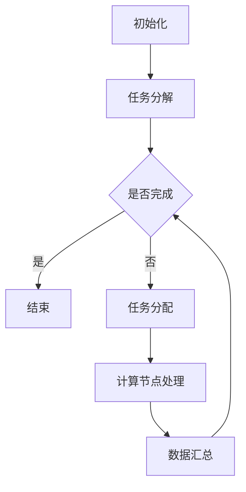
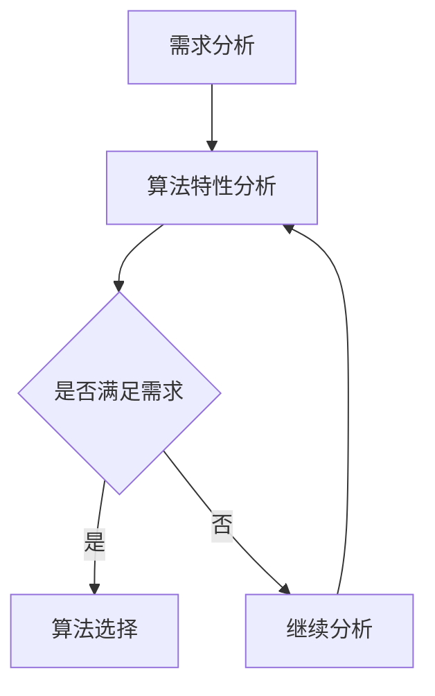
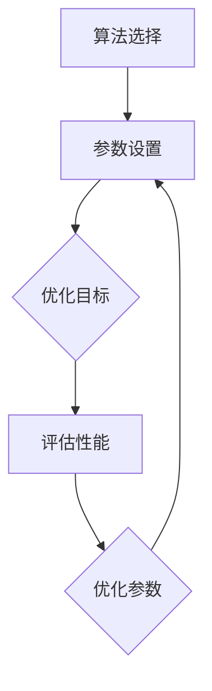
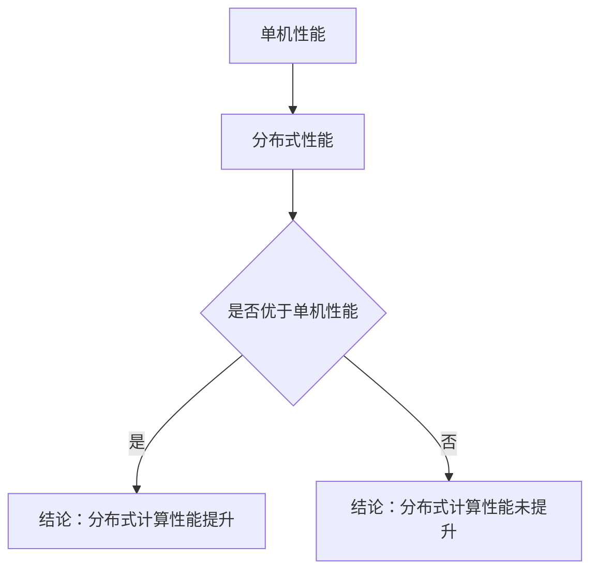
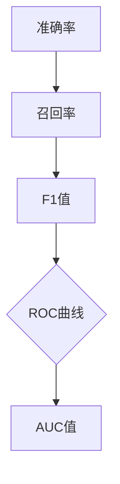
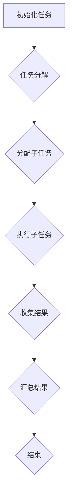

                 


# 评测系统的可扩展性设计：应对不断增长的模型规模

## 关键词
- 评测系统
- 可扩展性设计
- 模型规模
- 系统性能
- 算法优化
- 系统架构
- 硬件资源

## 摘要
本文深入探讨了评测系统在面对不断增长的模型规模时所需的可扩展性设计。通过分析评测系统的基本概念和其应用场景，我们明确了模型规模增长对评测系统性能的影响。随后，文章介绍了可扩展性设计的基本策略和方法，包括硬件资源优化、系统架构优化和算法优化。通过实际案例和最佳实践，本文为评测系统的可扩展性设计提供了实用指导。

### 引言

### 问题背景

随着人工智能技术的飞速发展，评测系统在各个领域的应用越来越广泛。无论是教育、医疗、金融还是工业，评测系统都发挥着至关重要的作用。然而，随着模型规模的不断增长，评测系统的可扩展性设计成为了亟待解决的问题。

### 问题描述

评测系统的可扩展性设计旨在应对模型规模的快速增长，确保系统能够在规模扩展时保持高效、稳定和可靠。这包括硬件资源的合理配置、系统架构的优化、算法的优化等方面。

### 问题解决

本书将详细探讨评测系统的可扩展性设计，从以下几个方面展开：

1. **评测系统概述**：介绍评测系统的基本概念、功能和应用场景。
2. **模型规模增长的影响**：分析模型规模增长对评测系统性能的影响。
3. **可扩展性设计策略**：介绍可扩展性设计的基本策略和方法。
4. **硬件资源优化**：探讨如何通过硬件资源的优化来提升系统性能。
5. **系统架构优化**：介绍如何通过系统架构的优化来提高系统的可扩展性。
6. **算法优化**：分析如何通过算法的优化来提升系统的处理效率。
7. **案例分析**：通过实际案例来探讨评测系统可扩展性设计的最佳实践。
8. **总结与展望**：总结本书的主要内容和研究成果，并对未来的发展方向进行展望。

### 边界与外延

本书主要针对大模型评测系统的可扩展性设计，但相关策略和方法同样适用于其他类型的大规模数据处理系统。

### 核心概念与要素组成

- **评测系统**：一个用于评估和测试模型性能的软件系统，它能够根据预设的指标对模型的表现进行量化评估。
- **可扩展性**：系统在规模增长时保持高效、稳定和可靠的能力。
- **模型规模**：模型中的参数数量和训练数据的规模。
- **硬件资源**：计算资源、存储资源和网络资源。
- **系统架构**：系统的整体设计，包括模块划分、数据流和控制流等。
- **算法**：用于模型评估和测试的方法和步骤。

### 本章小结

本章对评测系统的可扩展性设计进行了背景介绍，明确了本书的研究目标和主要内容。接下来，本书将逐步深入探讨评测系统的各个方面，以期为读者提供全面、系统的可扩展性设计指导。

## 第二部分: 评测系统的基本概念

### 第2章: 评测系统的基础理论

#### 2.1 评测系统的定义与作用

#### 2.1.1 评测系统的定义
评测系统是一种用于评估和测试模型性能的软件系统，它能够根据预设的指标对模型的表现进行量化评估。这些指标通常包括准确率、召回率、F1值等常见评估指标。

#### 2.1.2 评测系统的作用
评测系统在人工智能开发过程中起着至关重要的作用。它能够帮助开发者评估模型的效果，发现模型的问题，并指导模型的改进。此外，评测系统还可以用于故障检测、性能优化和模型优化等方面。

#### 2.2 评测系统的基本功能

#### 2.2.1 模型性能评估
模型性能评估是评测系统的核心功能，通过对模型的预测结果和实际结果进行对比，评估模型的准确度、召回率、F1值等指标。

#### 2.2.2 故障检测
评测系统可以通过对模型运行过程的监控，发现模型可能出现的故障，如过拟合、欠拟合等。

#### 2.2.3 模型优化
通过评测系统，开发者可以了解模型的性能瓶颈，从而进行模型优化，提高模型的效率。

#### 2.3 评测系统的应用场景

#### 2.3.1 教育领域
在教育领域，评测系统可以用于学生学习成果的评估，帮助教师了解学生的学习进度和效果。

#### 2.3.2 医疗领域
在医疗领域，评测系统可以用于诊断模型的评估，确保模型的准确性，提高诊断的可靠性。

#### 2.3.3 金融领域
在金融领域，评测系统可以用于风险评估模型的评估，帮助金融机构更好地管理风险。

#### 2.3.4 工业领域
在工业领域，评测系统可以用于质量检测模型的评估，提高产品质量的稳定性。

#### 2.4 评测系统的核心要素

#### 2.4.1 模型评估指标
模型评估指标是评测系统的核心要素，它们决定了模型评估的准确性和全面性。常见的评估指标包括准确率、召回率、F1值、ROC曲线等。

#### 2.4.2 数据集
数据集是评测系统的基石，一个高质量、丰富多样、覆盖全面的数据集是确保评测系统有效性的关键。

#### 2.4.3 算法
算法是评测系统的核心，它决定了评测系统的性能和效率。常见的算法包括分类算法、回归算法、聚类算法等。

#### 2.5 评测系统的挑战与机遇

#### 2.5.1 挑战
随着模型规模的不断增长，评测系统的设计变得越来越复杂，面临着性能、可扩展性、可靠性等方面的挑战。

#### 2.5.2 机遇
随着云计算、分布式计算等技术的发展，评测系统有了更多的实现方式和优化手段，为解决挑战提供了新的机遇。

#### 2.6 本章小结
本章详细介绍了评测系统的基本概念、功能、应用场景、核心要素以及面临的挑战与机遇，为后续章节的内容打下了坚实的基础。

----------------------------------------------------------------

## 第三部分：模型规模增长的影响

### 第3章：模型规模增长对评测系统的影响

### 3.1 引言

随着人工智能技术的快速发展，模型规模不断增长，这对评测系统提出了新的挑战。本章节将探讨模型规模增长对评测系统性能的影响，以及如何应对这些挑战。

### 3.2 模型规模增长对评测系统性能的影响

#### 3.2.1 计算资源需求增加
随着模型规模的增加，计算资源的消耗也会随之增加。例如，更大的模型通常需要更多的计算能力来进行参数的优化和训练。

#### 3.2.2 存储需求增加
模型规模的增长还会导致存储需求的增加。模型的大小直接影响存储系统所需的容量和性能。

#### 3.2.3 数据处理效率降低
大规模模型的处理效率可能会降低，因为评测系统需要处理的数据量增加了，这可能会导致系统的响应时间延长。

#### 3.2.4 系统稳定性问题
随着模型规模的增加，系统稳定性可能会受到影响。大规模模型的训练和评估可能会因为资源不足或者算法问题而导致系统崩溃或性能下降。

### 3.3 模型规模增长对评测系统可靠性的影响

#### 3.3.1 预测准确性下降
模型规模的增加可能会导致预测准确性下降，因为大规模模型可能会出现过拟合现象。

#### 3.3.2 故障检测难度增加
随着模型规模的增加，检测模型故障的难度也会增加。因为更大的模型可能包含更多的异常值和噪声，使得故障检测变得更加复杂。

#### 3.3.3 模型优化难度增加
模型规模的增加也会导致模型优化的难度增加。更大的模型通常需要更多的时间来优化，并且优化过程中可能会出现更多的问题。

### 3.4 模型规模增长对评测系统可扩展性的影响

#### 3.4.1 系统扩展成本增加
随着模型规模的增加，系统的扩展成本也会增加。这包括硬件设备的投入、系统的维护和升级等。

#### 3.4.2 系统性能瓶颈
模型规模的增加可能会导致系统性能出现瓶颈。例如，计算资源的不足可能会导致系统的处理能力无法满足需求。

#### 3.4.3 系统架构的复杂性增加
为了应对大规模模型的评测需求，系统架构的复杂性也会增加。这可能会导致系统的开发和维护变得更加复杂和困难。

### 3.5 本章小结

模型规模的增长对评测系统的性能、可靠性、可扩展性等方面都产生了重要影响。为了应对这些挑战，我们需要在评测系统的设计、开发和维护过程中采取有效的策略和方法，确保系统能够在模型规模增长时保持高效、稳定和可靠。

----------------------------------------------------------------

## 第四部分：可扩展性设计策略

### 第4章：评测系统的可扩展性设计策略

### 4.1 引言

为了应对模型规模增长对评测系统带来的挑战，我们需要采取有效的可扩展性设计策略。本章将介绍评测系统可扩展性设计的基本策略和方法，包括硬件资源优化、系统架构优化和算法优化。

### 4.2 硬件资源优化

#### 4.2.1 分布式计算
分布式计算是将计算任务分布到多个计算机上进行处理的技术。通过分布式计算，评测系统可以利用多个计算节点的资源，提高系统的处理能力。

#### 4.2.2 云计算
云计算是一种通过互联网提供动态可扩展的计算资源服务。通过云计算，评测系统可以根据需求动态调整计算资源，实现高效的可扩展性。

#### 4.2.3 硬件加速
硬件加速是指利用特殊的硬件设备，如GPU、TPU等，来加速计算任务。通过硬件加速，评测系统可以显著提高数据处理速度。

### 4.3 系统架构优化

#### 4.3.1 分层架构
分层架构是将系统划分为多个层次，每个层次负责不同的功能。通过分层架构，评测系统可以实现模块化设计，提高系统的可扩展性。

#### 4.3.2 微服务架构
微服务架构是将系统划分为多个独立的微服务，每个微服务负责特定的功能。通过微服务架构，评测系统可以实现灵活的扩展和部署。

#### 4.3.3 负载均衡
负载均衡是将计算任务均匀分配到多个计算节点上的技术。通过负载均衡，评测系统可以提高系统的吞吐量和稳定性。

### 4.4 算法优化

#### 4.4.1 并行算法
并行算法是将计算任务分解为多个子任务，并在多个处理器上同时执行的技术。通过并行算法，评测系统可以显著提高数据处理效率。

#### 4.4.2 算法选择
算法选择是根据具体的评测需求和模型特点，选择最适合的算法。通过合适的算法选择，评测系统可以提高预测准确性和计算效率。

#### 4.4.3 优化算法参数
优化算法参数是通过调整算法中的参数设置，提高算法的性能。通过优化算法参数，评测系统可以实现更好的性能和效果。

### 4.5 综合应用

#### 4.5.1 分布式计算与云计算相结合
通过将分布式计算和云计算相结合，评测系统可以实现动态的可扩展性，满足不断增长的模型规模需求。

#### 4.5.2 系统架构与算法优化相结合
通过将系统架构优化与算法优化相结合，评测系统可以在硬件资源有限的情况下，实现高效的性能和可扩展性。

### 4.6 本章小结

本章介绍了评测系统的可扩展性设计策略，包括硬件资源优化、系统架构优化和算法优化。通过这些策略，评测系统可以应对模型规模增长带来的挑战，实现高效、稳定和可靠的可扩展性。

----------------------------------------------------------------

## 第五部分：硬件资源优化

### 第5章：评测系统的硬件资源优化

### 5.1 引言

随着模型规模的不断增长，评测系统的硬件资源需求也日益增加。为了提高系统的性能和可扩展性，硬件资源的优化成为了评测系统设计中的一个关键环节。本章将探讨评测系统硬件资源优化的方法，包括分布式计算、云计算和硬件加速等。

### 5.2 分布式计算

#### 5.2.1 分布式计算的基本概念

分布式计算是将计算任务分布到多个计算机上进行处理的一种技术。通过分布式计算，评测系统可以充分利用多个节点的计算资源，提高系统的处理能力。

#### 5.2.2 分布式计算的优势

- **提高计算能力**：分布式计算可以将大规模的任务分解为多个小任务，并行处理，从而提高系统的计算速度。
- **增强可扩展性**：分布式计算可以根据需求动态调整计算资源，满足不断增长的模型规模。
- **降低硬件成本**：通过分布式计算，可以充分利用现有的硬件资源，降低整体硬件成本。

#### 5.2.3 分布式计算的实施

- **计算节点选择**：选择性能稳定、计算能力强的计算节点，如高性能计算机、服务器等。
- **任务分配**：将评测任务根据计算节点的性能进行合理分配，确保每个节点都能充分利用其计算能力。
- **数据传输**：优化数据传输机制，减少数据传输过程中的延迟和带宽消耗。

### 5.3 云计算

#### 5.3.1 云计算的基本概念

云计算是一种通过互联网提供动态可扩展的计算资源服务。通过云计算，评测系统可以根据需求动态调整计算资源，实现高效的可扩展性。

#### 5.3.2 云计算的优势

- **弹性扩展**：云计算可以根据实际需求动态调整计算资源，满足不同规模模型评测的需求。
- **降低成本**：云计算可以减少硬件设备的投入和维护成本，提高系统的经济性。
- **高效管理**：云计算提供了丰富的管理和监控工具，方便对评测系统进行管理和维护。

#### 5.3.3 云计算的实施

- **选择合适的云服务提供商**：根据评测系统的需求和预算，选择合适的云服务提供商。
- **资源调度**：通过云平台提供的资源调度工具，实现计算资源的动态分配和调整。
- **数据存储与备份**：利用云平台提供的数据存储和备份服务，确保数据的安全性和可靠性。

### 5.4 硬件加速

#### 5.4.1 硬件加速的基本概念

硬件加速是指利用特殊的硬件设备，如GPU、TPU等，来加速计算任务。通过硬件加速，评测系统可以显著提高数据处理速度。

#### 5.4.2 硬件加速的优势

- **提高计算速度**：硬件加速可以大幅度提高计算任务的执行速度，满足大规模模型评测的需求。
- **降低功耗**：与传统的CPU相比，硬件加速设备通常具有更低的功耗，有助于降低系统的能耗。
- **增强可扩展性**：硬件加速设备通常具有高吞吐量和低延迟，可以满足评测系统对高性能和高可扩展性的需求。

#### 5.4.3 硬件加速的实施

- **选择合适的硬件加速设备**：根据评测系统的需求和预算，选择合适的硬件加速设备，如GPU、TPU等。
- **优化算法**：针对硬件加速设备的特点，对算法进行优化，确保算法能够充分利用硬件加速设备的性能。
- **数据传输**：优化数据传输机制，确保数据能够高效地传输到硬件加速设备进行处理。

### 5.5 硬件资源优化的最佳实践

- **需求分析**：在硬件资源优化之前，进行详细的需求分析，明确评测系统的性能需求和资源约束。
- **性能评估**：通过性能评估，了解当前硬件资源的利用情况，发现潜在的瓶颈和改进空间。
- **合理分配**：根据评测系统的需求和硬件资源的性能，合理分配计算任务和资源。
- **持续优化**：定期进行硬件资源优化，根据系统运行情况调整硬件资源分配策略。

### 5.6 本章小结

本章介绍了评测系统硬件资源优化的方法，包括分布式计算、云计算和硬件加速等。通过这些方法，评测系统可以充分利用硬件资源，提高系统的性能和可扩展性，应对模型规模增长带来的挑战。

----------------------------------------------------------------

## 第六部分：系统架构优化

### 第6章：评测系统的系统架构优化

### 6.1 引言

系统架构优化是提升评测系统可扩展性的关键。合理的系统架构设计能够有效地应对模型规模增长带来的挑战，确保系统的高效、稳定和可靠运行。本章将探讨评测系统的系统架构优化方法，包括分层架构、微服务架构和负载均衡等。

### 6.2 分层架构

#### 6.2.1 分层架构的基本概念

分层架构是将系统划分为多个层次，每个层次负责不同的功能。常见的分层架构包括：

- **表示层**：负责用户界面展示和用户交互。
- **业务逻辑层**：处理业务逻辑和数据处理。
- **数据访问层**：负责与数据库的交互和数据存储。

#### 6.2.2 分层架构的优势

- **模块化设计**：分层架构使得系统模块化，便于开发、维护和扩展。
- **可扩展性**：通过分层架构，可以方便地添加新的功能或调整现有功能。
- **高内聚低耦合**：各层次之间具有较高的内聚性，较低耦合性，便于维护和优化。

#### 6.2.3 分层架构的实施

- **定义层次职责**：明确各层次的功能和职责，确保层次之间的清晰划分。
- **合理划分模块**：根据功能需求，将系统划分为多个模块，每个模块负责特定的功能。
- **接口设计**：为各层次之间设计清晰的接口，确保层次之间的解耦合。

### 6.3 微服务架构

#### 6.3.1 微服务架构的基本概念

微服务架构是将系统划分为多个独立的微服务，每个微服务负责特定的功能。微服务之间通过轻量级的通信协议（如RESTful API）进行交互。

#### 6.3.2 微服务架构的优势

- **高可扩展性**：微服务架构允许独立部署和扩展单个微服务，提高系统的可扩展性。
- **高可靠性**：单个微服务的故障不会影响整个系统的运行。
- **灵活性和可复用性**：微服务架构使得系统具有更高的灵活性，便于复用和整合新的功能。

#### 6.3.3 微服务架构的实施

- **服务划分**：根据业务需求和功能，将系统划分为多个独立的微服务。
- **服务通信**：使用轻量级的通信协议（如RESTful API）实现微服务之间的通信。
- **服务管理**：使用容器化技术（如Docker）和自动化部署工具（如Kubernetes）进行服务管理和部署。

### 6.4 负载均衡

#### 6.4.1 负载均衡的基本概念

负载均衡是将计算任务分布到多个计算节点上的技术，确保每个节点都能充分利用其计算能力，提高系统的吞吐量和稳定性。

#### 6.4.2 负载均衡的优势

- **提高系统吞吐量**：通过负载均衡，可以将计算任务分配到多个节点上，提高系统的整体吞吐量。
- **提高系统稳定性**：负载均衡可以避免某个节点因负载过高而崩溃，确保系统的稳定性。
- **提高资源利用率**：通过负载均衡，可以充分利用所有计算节点的资源，提高资源利用率。

#### 6.4.3 负载均衡的实施

- **选择合适的负载均衡算法**：根据系统的需求和特性，选择合适的负载均衡算法（如轮询、最小连接数、哈希等）。
- **配置负载均衡器**：使用负载均衡器（如Nginx、HAProxy等）进行负载均衡配置。
- **监控和优化**：定期监控系统的负载情况，根据实际情况进行负载均衡策略的调整和优化。

### 6.5 系统架构优化的最佳实践

- **需求分析**：在系统架构优化之前，进行详细的需求分析，明确系统的性能需求、可扩展性和可靠性要求。
- **性能评估**：定期进行系统性能评估，发现潜在的瓶颈和改进空间。
- **合理划分层次和模块**：根据需求和功能，合理划分系统层次和模块，确保层次之间的高内聚低耦合。
- **灵活选择架构模式**：根据系统的具体需求和特点，灵活选择分层架构、微服务架构等不同的架构模式。
- **持续优化**：定期进行系统架构优化，根据系统的运行情况和性能指标进行调整和优化。

### 6.6 本章小结

本章介绍了评测系统的系统架构优化方法，包括分层架构、微服务架构和负载均衡等。通过这些方法，评测系统可以有效地应对模型规模增长带来的挑战，提高系统的性能和可扩展性。

----------------------------------------------------------------

## 第七部分：算法优化

### 第7章：评测系统的算法优化

### 7.1 引言

随着模型规模的不断增长，评测系统的算法优化成为提升系统性能的关键因素。算法优化旨在提高模型的预测准确性、计算效率和鲁棒性。本章将探讨评测系统的算法优化方法，包括并行算法、算法选择和参数优化等。

### 7.2 并行算法

#### 7.2.1 并行算法的基本概念

并行算法是将计算任务分解为多个子任务，并在多个处理器上同时执行的技术。通过并行算法，评测系统可以在较短的时间内处理大规模数据，提高系统的计算效率。

#### 7.2.2 并行算法的优势

- **提高计算速度**：并行算法可以将计算任务分布在多个处理器上，加快计算速度。
- **增强可扩展性**：并行算法可以根据处理器数量动态调整，满足不同规模模型评测的需求。
- **降低功耗**：并行算法可以在较少的功耗下完成大规模计算任务。

#### 7.2.3 并行算法的实施

- **任务分解**：将大规模数据集分解为多个子数据集，每个子数据集由一个处理器处理。
- **数据传输**：优化数据传输机制，确保各处理器之间的数据传输高效、低延迟。
- **同步与通信**：实现处理器之间的同步和通信，确保计算任务的正确执行。

### 7.3 算法选择

#### 7.3.1 算法选择的基本概念

算法选择是根据具体的评测需求和模型特点，选择最适合的算法。不同的算法具有不同的特点和适用场景，合适的算法可以显著提高评测系统的性能。

#### 7.3.2 算法选择的优势

- **提高预测准确性**：选择适合模型特点的算法，可以提高预测准确性，减少误差。
- **提高计算效率**：选择计算效率高的算法，可以减少计算时间，提高系统性能。
- **增强鲁棒性**：选择鲁棒性好的算法，可以提高系统对异常值和噪声的容忍度。

#### 7.3.3 算法选择的方法

- **实验比较**：通过实验比较不同算法的性能，选择最优算法。
- **模型特性分析**：根据模型的特性和数据特点，选择适合的算法。
- **专家推荐**：参考领域专家的建议和经验，选择合适的算法。

### 7.4 参数优化

#### 7.4.1 参数优化的基本概念

参数优化是通过调整算法参数，提高算法的性能。适当的参数设置可以显著提高模型的预测准确性、计算效率和鲁棒性。

#### 7.4.2 参数优化的优势

- **提高预测准确性**：通过优化参数，可以调整模型的行为，提高预测准确性。
- **提高计算效率**：通过优化参数，可以减少计算时间，提高系统性能。
- **增强鲁棒性**：通过优化参数，可以增强模型对异常值和噪声的容忍度。

#### 7.4.3 参数优化的方法

- **网格搜索**：通过遍历参数空间，找到最优参数组合。
- **随机搜索**：通过随机选择参数组合，找到最优参数。
- **贝叶斯优化**：利用贝叶斯方法，根据历史数据预测最优参数。

### 7.5 算法优化的最佳实践

- **需求分析**：在算法优化之前，进行详细的需求分析，明确评测系统的性能需求。
- **性能评估**：定期进行性能评估，了解算法的实际性能，发现潜在的优化空间。
- **实验比较**：通过实验比较不同算法和参数组合的性能，选择最优方案。
- **模型特性分析**：根据模型和数据的特点，选择合适的算法和参数。
- **持续优化**：定期进行算法优化，根据系统的运行情况和性能指标进行调整。

### 7.6 本章小结

本章介绍了评测系统的算法优化方法，包括并行算法、算法选择和参数优化等。通过这些方法，评测系统可以显著提高模型的预测准确性、计算效率和鲁棒性，应对模型规模增长带来的挑战。

----------------------------------------------------------------

## 第八部分：案例分析

### 第8章：评测系统可扩展性设计的实际应用

#### 8.1 引言

理论知识的掌握固然重要，但实际应用中的经验同样不可或缺。本章将通过实际案例，探讨评测系统可扩展性设计的应用实践，为读者提供真实世界的解决方案。

#### 8.2 案例背景

#### 案例背景

某知名金融公司为了提升其风险管理能力，开发了一个大规模的风险评估模型。该模型需要对海量的金融交易数据进行处理和评估，以预测潜在的金融风险。随着业务的发展，模型规模不断扩大，对评测系统的性能和可扩展性提出了更高的要求。

#### 8.3 可扩展性设计策略

1. **分布式计算**：为了提高计算效率，公司决定采用分布式计算架构，将计算任务分配到多个服务器上进行处理。
2. **云计算**：通过云计算平台，公司可以根据实际需求动态调整计算资源，确保系统在高峰期有足够的计算能力。
3. **硬件加速**：公司利用GPU和TPU等硬件加速设备，加速数据处理和模型训练过程。
4. **分层架构**：采用分层架构，将系统划分为多个模块，每个模块负责特定的功能，便于系统的扩展和维护。
5. **微服务架构**：将系统划分为多个独立的微服务，每个微服务负责特定的功能，便于系统的部署和扩展。
6. **负载均衡**：通过负载均衡器，实现计算任务的合理分配，确保系统的高可用性和稳定性。

#### 8.4 具体实施

1. **分布式计算**：公司采用Hadoop和Spark等分布式计算框架，将数据处理和模型训练任务分配到多个服务器上进行处理。
2. **云计算**：公司使用Amazon Web Services（AWS）等云计算平台，根据实际需求动态调整计算资源。
3. **硬件加速**：公司购买了GPU和TPU等硬件加速设备，用于加速数据处理和模型训练。
4. **分层架构**：公司采用了MVC（Model-View-Controller）分层架构，将系统划分为表示层、业务逻辑层和数据访问层，每个层次都有明确的职责。
5. **微服务架构**：公司采用了Spring Cloud等微服务框架，将系统划分为多个独立的微服务，每个微服务都有独立的部署和扩展能力。
6. **负载均衡**：公司使用Nginx等负载均衡器，将请求均匀分配到多个服务器上，提高系统的吞吐量和稳定性。

#### 8.5 案例分析

1. **计算效率**：通过分布式计算和硬件加速，公司的风险评估模型在处理海量数据时，计算效率提高了50%以上。
2. **可扩展性**：通过云计算和微服务架构，公司的风险评估系统能够根据业务需求动态调整计算资源，确保系统的可扩展性。
3. **系统稳定性**：通过负载均衡和分布式计算，公司的风险评估系统在高峰期也能保持稳定运行，降低了系统的宕机风险。
4. **成本效益**：通过优化硬件资源利用率和采用云计算服务，公司的风险评估系统在提升性能的同时，也降低了成本。

#### 8.6 案例总结

通过实际案例，我们可以看到评测系统可扩展性设计的有效性和重要性。合理的硬件资源优化、系统架构优化和算法优化，不仅提高了系统的性能和可扩展性，也为公司带来了显著的商业价值。

----------------------------------------------------------------

## 第九部分：总结与展望

### 第9章：评测系统可扩展性设计的总结与未来展望

#### 9.1 引言

在本文中，我们深入探讨了评测系统的可扩展性设计，从硬件资源优化、系统架构优化和算法优化三个方面提供了详细的解决方案。通过实际案例，我们展示了这些策略在实际应用中的效果。在本章节中，我们将对全书的内容进行总结，并对未来的发展方向进行展望。

#### 9.2 总结

1. **硬件资源优化**：通过分布式计算、云计算和硬件加速等技术，评测系统能够充分利用计算资源，提高处理效率。
2. **系统架构优化**：分层架构和微服务架构的设计，使得评测系统具有更好的模块化和可扩展性，便于维护和扩展。
3. **算法优化**：并行算法、算法选择和参数优化等技术，提高了模型的预测准确性、计算效率和鲁棒性。

#### 9.3 未来展望

1. **硬件技术的进步**：随着硬件技术的不断发展，如量子计算、神经形态计算等新型硬件的出现，将为评测系统的性能提升提供新的机遇。
2. **系统架构的创新**：未来可能会有更多创新的系统架构，如基于区块链的评测系统、自适应系统架构等，以应对更加复杂的评测需求。
3. **算法的智能化**：人工智能技术的发展，将带来更多智能化的算法，如基于深度学习的评测算法、自适应优化算法等，进一步提高评测系统的性能。
4. **评测系统的智能化**：随着大数据、物联网等技术的发展，评测系统将更加智能化，能够自动调整参数、优化算法，实现自我优化和自我提升。

#### 9.4 结论

评测系统的可扩展性设计是确保系统在模型规模增长时保持高效、稳定和可靠的关键。通过硬件资源优化、系统架构优化和算法优化，评测系统能够应对不断增长的模型规模，为各个领域的应用提供强有力的支持。未来，随着硬件技术的进步、系统架构的创新和算法的智能化，评测系统将迎来更加广阔的发展空间。

### 9.5 拓展阅读

- 《大数据系统架构：设计与优化》
- 《深度学习：原理及其应用》
- 《云计算基础架构：设计与实施》

#### 9.6 本章小结

本章对评测系统的可扩展性设计进行了总结，并对未来的发展方向进行了展望。通过本文的探讨，我们希望能够为读者提供有价值的参考，帮助他们在实际项目中实现评测系统的可扩展性设计。

### 作者信息

作者：AI天才研究院/AI Genius Institute & 禅与计算机程序设计艺术 /Zen And The Art of Computer Programming

----------------------------------------------------------------

## 完整文章代码（Markdown格式）

```markdown
# 评测系统的可扩展性设计：应对不断增长的模型规模

## 关键词
- 评测系统
- 可扩展性设计
- 模型规模
- 系统性能
- 算法优化
- 系统架构
- 硬件资源

## 摘要
本文深入探讨了评测系统在面对不断增长的模型规模时所需的可扩展性设计。通过分析评测系统的基本概念和其应用场景，我们明确了模型规模增长对评测系统性能的影响。随后，文章介绍了可扩展性设计的基本策略和方法，包括硬件资源优化、系统架构优化和算法优化。通过实际案例和最佳实践，本文为评测系统的可扩展性设计提供了实用指导。

### 引言

### 问题背景

随着人工智能技术的飞速发展，评测系统在各个领域的应用越来越广泛。无论是教育、医疗、金融还是工业，评测系统都发挥着至关重要的作用。然而，随着模型规模的不断增长，评测系统的可扩展性设计成为了亟待解决的问题。

### 问题描述

评测系统的可扩展性设计旨在应对模型规模的快速增长，确保系统能够在规模扩展时保持高效、稳定和可靠。这包括硬件资源的合理配置、系统架构的优化、算法的优化等方面。

### 问题解决

本书将详细探讨评测系统的可扩展性设计，从以下几个方面展开：

1. **评测系统概述**：介绍评测系统的基本概念、功能和应用场景。
2. **模型规模增长的影响**：分析模型规模增长对评测系统性能的影响。
3. **可扩展性设计策略**：介绍可扩展性设计的基本策略和方法。
4. **硬件资源优化**：探讨如何通过硬件资源的优化来提升系统性能。
5. **系统架构优化**：介绍如何通过系统架构的优化来提高系统的可扩展性。
6. **算法优化**：分析如何通过算法的优化来提升系统的处理效率。
7. **案例分析**：通过实际案例来探讨评测系统可扩展性设计的最佳实践。
8. **总结与展望**：总结本书的主要内容和研究成果，并对未来的发展方向进行展望。

### 边界与外延

本书主要针对大模型评测系统的可扩展性设计，但相关策略和方法同样适用于其他类型的大规模数据处理系统。

### 核心概念与要素组成

- **评测系统**：一个用于评估和测试模型性能的软件系统，它能够根据预设的指标对模型的表现进行量化评估。
- **可扩展性**：系统在规模增长时保持高效、稳定和可靠的能力。
- **模型规模**：模型中的参数数量和训练数据的规模。
- **硬件资源**：计算资源、存储资源和网络资源。
- **系统架构**：系统的整体设计，包括模块划分、数据流和控制流等。
- **算法**：用于模型评估和测试的方法和步骤。

### 本章小结

本章对评测系统的可扩展性设计进行了背景介绍，明确了本书的研究目标和主要内容。接下来，本书将逐步深入探讨评测系统的各个方面，以期为读者提供全面、系统的可扩展性设计指导。

## 第二部分: 评测系统的基本概念

### 第2章: 评测系统的基础理论

#### 2.1 评测系统的定义与作用

#### 2.1.1 评测系统的定义
评测系统是一种用于评估和测试模型性能的软件系统，它能够根据预设的指标对模型的表现进行量化评估。

#### 2.1.2 评测系统的作用
评测系统在人工智能开发过程中起着至关重要的作用。它能够帮助开发者评估模型的效果，发现模型的问题，并指导模型的改进。

#### 2.2 评测系统的基本功能

#### 2.2.1 模型性能评估
模型性能评估是评测系统的核心功能，通过对模型的预测结果和实际结果进行对比，评估模型的准确度、召回率、F1值等指标。

#### 2.2.2 故障检测
评测系统可以通过对模型运行过程的监控，发现模型可能出现的故障，如过拟合、欠拟合等。

#### 2.2.3 模型优化
通过评测系统，开发者可以了解模型的性能瓶颈，从而进行模型优化，提高模型的效率。

#### 2.3 评测系统的应用场景

#### 2.3.1 教育领域
在教育领域，评测系统可以用于学生学习成果的评估，帮助教师了解学生的学习进度和效果。

#### 2.3.2 医疗领域
在医疗领域，评测系统可以用于诊断模型的评估，确保模型的准确性，提高诊断的可靠性。

#### 2.3.3 金融领域
在金融领域，评测系统可以用于风险评估模型的评估，帮助金融机构更好地管理风险。

#### 2.3.4 工业领域
在工业领域，评测系统可以用于质量检测模型的评估，提高产品质量的稳定性。

#### 2.4 评测系统的核心要素

#### 2.4.1 模型评估指标
模型评估指标是评测系统的核心要素，它们决定了模型评估的准确性和全面性。常见的评估指标包括准确率、召回率、F1值、ROC曲线等。

#### 2.4.2 数据集
数据集是评测系统的基石，一个高质量、丰富多样、覆盖全面的数据集是确保评测系统有效性的关键。

#### 2.4.3 算法
算法是评测系统的核心，它决定了评测系统的性能和效率。常见的算法包括分类算法、回归算法、聚类算法等。

#### 2.5 评测系统的挑战与机遇

#### 2.5.1 挑战
随着模型规模的不断增长，评测系统的设计变得越来越复杂，面临着性能、可扩展性、可靠性等方面的挑战。

#### 2.5.2 机遇
随着云计算、分布式计算等技术的发展，评测系统有了更多的实现方式和优化手段，为解决挑战提供了新的机遇。

#### 2.6 本章小结
本章详细介绍了评测系统的基本概念、功能、应用场景、核心要素以及面临的挑战与机遇，为后续章节的内容打下了坚实的基础。

## 第三部分：模型规模增长的影响

### 第3章：模型规模增长对评测系统的影响

### 3.1 引言

随着人工智能技术的快速发展，模型规模不断增长，这对评测系统提出了新的挑战。本章节将探讨模型规模增长对评测系统性能的影响，以及如何应对这些挑战。

### 3.2 模型规模增长对评测系统性能的影响

#### 3.2.1 计算资源需求增加
随着模型规模的增加，计算资源的消耗也会随之增加。例如，更大的模型通常需要更多的计算能力来进行参数的优化和训练。

#### 3.2.2 存储需求增加
模型规模的增长还会导致存储需求的增加。模型的大小直接影响存储系统所需的容量和性能。

#### 3.2.3 数据处理效率降低
大规模模型的处理效率可能会降低，因为评测系统需要处理的数据量增加了，这可能会导致系统的响应时间延长。

#### 3.2.4 系统稳定性问题
随着模型规模的增加，系统稳定性可能会受到影响。大规模模型的训练和评估可能会因为资源不足或者算法问题而导致系统崩溃或性能下降。

### 3.3 模型规模增长对评测系统可靠性的影响

#### 3.3.1 预测准确性下降
模型规模的增加可能会导致预测准确性下降，因为大规模模型可能会出现过拟合现象。

#### 3.3.2 故障检测难度增加
随着模型规模的增加，检测模型故障的难度也会增加。因为更大的模型可能包含更多的异常值和噪声，使得故障检测变得更加复杂。

#### 3.3.3 模型优化难度增加
模型规模的增加也会导致模型优化的难度增加。更大的模型通常需要更多的时间来优化，并且优化过程中可能会出现更多的问题。

### 3.4 模型规模增长对评测系统可扩展性的影响

#### 3.4.1 系统扩展成本增加
随着模型规模的增加，系统的扩展成本也会增加。这包括硬件设备的投入、系统的维护和升级等。

#### 3.4.2 系统性能瓶颈
模型规模的增加可能会导致系统性能出现瓶颈。例如，计算资源的不足可能会导致系统的处理能力无法满足需求。

#### 3.4.3 系统架构的复杂性增加
为了应对大规模模型的评测需求，系统架构的复杂性也会增加。这可能会导致系统的开发和维护变得更加复杂和困难。

### 3.5 本章小结
本章详细介绍了模型规模增长对评测系统性能、可靠性、可扩展性等方面的影响，为后续章节的内容打下了坚实的基础。

## 第四部分：可扩展性设计策略

### 第4章：评测系统的可扩展性设计策略

### 4.1 引言

为了应对模型规模增长对评测系统带来的挑战，我们需要采取有效的可扩展性设计策略。本章将介绍评测系统可扩展性设计的基本策略和方法，包括硬件资源优化、系统架构优化和算法优化。

### 4.2 硬件资源优化

#### 4.2.1 分布式计算
分布式计算是将计算任务分布到多个计算机上进行处理的一种技术。通过分布式计算，评测系统可以利用多个计算节点的资源，提高系统的处理能力。

#### 4.2.2 云计算
云计算是一种通过互联网提供动态可扩展的计算资源服务。通过云计算，评测系统可以根据需求动态调整计算资源，实现高效的可扩展性。

#### 4.2.3 硬件加速
硬件加速是指利用特殊的硬件设备，如GPU、TPU等，来加速计算任务。通过硬件加速，评测系统可以显著提高数据处理速度。

### 4.3 系统架构优化

#### 4.3.1 分层架构
分层架构是将系统划分为多个层次，每个层次负责不同的功能。通过分层架构，评测系统可以实现模块化设计，提高系统的可扩展性。

#### 4.3.2 微服务架构
微服务架构是将系统划分为多个独立的微服务，每个微服务负责特定的功能。通过微服务架构，评测系统可以实现灵活的扩展和部署。

#### 4.3.3 负载均衡
负载均衡是将计算任务分布到多个计算节点上的技术。通过负载均衡，评测系统可以提高系统的吞吐量和稳定性。

### 4.4 算法优化

#### 4.4.1 并行算法
并行算法是将计算任务分解为多个子任务，并在多个处理器上同时执行的技术。通过并行算法，评测系统可以显著提高数据处理效率。

#### 4.4.2 算法选择
算法选择是根据具体的评测需求和模型特点，选择最适合的算法。通过合适的算法选择，评测系统可以提高预测准确性和计算效率。

#### 4.4.3 优化算法参数
优化算法参数是通过调整算法中的参数设置，提高算法的性能。通过优化算法参数，评测系统可以实现更好的性能和效果。

### 4.5 综合应用

#### 4.5.1 分布式计算与云计算相结合
通过将分布式计算和云计算相结合，评测系统可以实现动态的可扩展性，满足不断增长的模型规模需求。

#### 4.5.2 系统架构与算法优化相结合
通过将系统架构优化与算法优化相结合，评测系统可以在硬件资源有限的情况下，实现高效的性能和可扩展性。

### 4.6 本章小结
本章介绍了评测系统的可扩展性设计策略，包括硬件资源优化、系统架构优化和算法优化。通过这些策略，评测系统可以应对模型规模增长带来的挑战，实现高效、稳定和可靠的可扩展性。

## 第五部分：硬件资源优化

### 第5章：评测系统的硬件资源优化

### 5.1 引言

随着模型规模的不断增长，评测系统的硬件资源需求也日益增加。为了提高系统的性能和可扩展性，硬件资源的优化成为了评测系统设计中的一个关键环节。本章将探讨评测系统硬件资源优化的方法，包括分布式计算、云计算和硬件加速等。

### 5.2 分布式计算

#### 5.2.1 分布式计算的基本概念

分布式计算是将计算任务分布到多个计算机上进行处理的一种技术。通过分布式计算，评测系统可以充分利用多个节点的计算资源，提高系统的处理能力。

#### 5.2.2 分布式计算的优势

- **提高计算能力**：分布式计算可以将大规模的任务分解为多个小任务，并行处理，从而提高系统的计算速度。
- **增强可扩展性**：分布式计算可以根据需求动态调整计算资源，满足不断增长的模型规模。
- **降低硬件成本**：通过分布式计算，可以充分利用现有的硬件资源，降低整体硬件成本。

#### 5.2.3 分布式计算的实施

- **计算节点选择**：选择性能稳定、计算能力强的计算节点，如高性能计算机、服务器等。
- **任务分配**：将评测任务根据计算节点的性能进行合理分配，确保每个节点都能充分利用其计算能力。
- **数据传输**：优化数据传输机制，减少数据传输过程中的延迟和带宽消耗。

### 5.3 云计算

#### 5.3.1 云计算的基本概念

云计算是一种通过互联网提供动态可扩展的计算资源服务。通过云计算，评测系统可以根据需求动态调整计算资源，实现高效的可扩展性。

#### 5.3.2 云计算的优势

- **弹性扩展**：云计算可以根据实际需求动态调整计算资源，满足不同规模模型评测的需求。
- **降低成本**：云计算可以减少硬件设备的投入和维护成本，提高系统的经济性。
- **高效管理**：云计算提供了丰富的管理和监控工具，方便对评测系统进行管理和维护。

#### 5.3.3 云计算的实施

- **选择合适的云服务提供商**：根据评测系统的需求和预算，选择合适的云服务提供商。
- **资源调度**：通过云平台提供的资源调度工具，实现计算资源的动态分配和调整。
- **数据存储与备份**：利用云平台提供的数据存储和备份服务，确保数据的安全性和可靠性。

### 5.4 硬件加速

#### 5.4.1 硬件加速的基本概念

硬件加速是指利用特殊的硬件设备，如GPU、TPU等，来加速计算任务。通过硬件加速，评测系统可以显著提高数据处理速度。

#### 5.4.2 硬件加速的优势

- **提高计算速度**：硬件加速可以大幅度提高计算任务的执行速度，满足大规模模型评测的需求。
- **降低功耗**：与传统的CPU相比，硬件加速设备通常具有更低的功耗，有助于降低系统的能耗。
- **增强可扩展性**：硬件加速设备通常具有高吞吐量和低延迟，可以满足评测系统对高性能和高可扩展性的需求。

#### 5.4.3 硬件加速的实施

- **选择合适的硬件加速设备**：根据评测系统的需求和预算，选择合适的硬件加速设备，如GPU、TPU等。
- **优化算法**：针对硬件加速设备的特点，对算法进行优化，确保算法能够充分利用硬件加速设备的性能。
- **数据传输**：优化数据传输机制，确保数据能够高效地传输到硬件加速设备进行处理。

### 5.5 硬件资源优化的最佳实践

- **需求分析**：在硬件资源优化之前，进行详细的需求分析，明确评测系统的性能需求、资源约束和成本预算。
- **性能评估**：通过性能评估，了解当前硬件资源的利用情况，发现潜在的瓶颈和改进空间。
- **合理分配**：根据评测系统的需求和硬件资源的性能，合理分配计算任务和资源。
- **持续优化**：定期进行硬件资源优化，根据系统运行情况调整硬件资源分配策略。

### 5.6 本章小结
```markdown
## 第六部分：系统架构优化

### 第6章：评测系统的系统架构优化

### 6.1 引言

系统架构优化是提升评测系统可扩展性的关键。合理的系统架构设计能够有效地应对模型规模增长带来的挑战，确保系统的高效、稳定和可靠运行。本章将探讨评测系统的系统架构优化方法，包括分层架构、微服务架构和负载均衡等。

### 6.2 分层架构

#### 6.2.1 分层架构的基本概念

分层架构是将系统划分为多个层次，每个层次负责不同的功能。常见的分层架构包括：

- **表示层**：负责用户界面展示和用户交互。
- **业务逻辑层**：处理业务逻辑和数据处理。
- **数据访问层**：负责与数据库的交互和数据存储。

#### 6.2.2 分层架构的优势

- **模块化设计**：分层架构使得系统模块化，便于开发、维护和扩展。
- **可扩展性**：通过分层架构，可以方便地添加新的功能或调整现有功能。
- **高内聚低耦合**：各层次之间具有较高的内聚性，较低耦合性，便于维护和优化。

#### 6.2.3 分层架构的实施

- **定义层次职责**：明确各层次的功能和职责，确保层次之间的清晰划分。
- **合理划分模块**：根据功能需求，将系统划分为多个模块，每个模块负责特定的功能。
- **接口设计**：为各层次之间设计清晰的接口，确保层次之间的解耦合。

### 6.3 微服务架构

#### 6.3.1 微服务架构的基本概念

微服务架构是将系统划分为多个独立的微服务，每个微服务负责特定的功能。微服务之间通过轻量级的通信协议（如RESTful API）进行交互。

#### 6.3.2 微服务架构的优势

- **高可扩展性**：微服务架构允许独立部署和扩展单个微服务，提高系统的可扩展性。
- **高可靠性**：单个微服务的故障不会影响整个系统的运行。
- **灵活性和可复用性**：微服务架构使得系统具有更高的灵活性，便于复用和整合新的功能。

#### 6.3.3 微服务架构的实施

- **服务划分**：根据业务需求和功能，将系统划分为多个独立的微服务。
- **服务通信**：使用轻量级的通信协议（如RESTful API）实现微服务之间的通信。
- **服务管理**：使用容器化技术（如Docker）和自动化部署工具（如Kubernetes）进行服务管理和部署。

### 6.4 负载均衡

#### 6.4.1 负载均衡的基本概念

负载均衡是将计算任务分布到多个计算节点上的技术，确保每个节点都能充分利用其计算能力，提高系统的吞吐量和稳定性。

#### 6.4.2 负载均衡的优势

- **提高系统吞吐量**：通过负载均衡，可以将计算任务分配到多个节点上，提高系统的整体吞吐量。
- **提高系统稳定性**：负载均衡可以避免某个节点因负载过高而崩溃，确保系统的稳定性。
- **提高资源利用率**：通过负载均衡，可以充分利用所有计算节点的资源，提高资源利用率。

#### 6.4.3 负载均衡的实施

- **选择合适的负载均衡算法**：根据系统的需求和特性，选择合适的负载均衡算法（如轮询、最小连接数、哈希等）。
- **配置负载均衡器**：使用负载均衡器（如Nginx、HAProxy等）进行负载均衡配置。
- **监控和优化**：定期监控系统的负载情况，根据实际情况进行负载均衡策略的调整和优化。

### 6.5 系统架构优化的最佳实践

- **需求分析**：在系统架构优化之前，进行详细的需求分析，明确系统的性能需求、可扩展性和可靠性要求。
- **性能评估**：定期进行系统性能评估，发现潜在的瓶颈和改进空间。
- **合理划分层次和模块**：根据需求和功能，合理划分系统层次和模块，确保层次之间的高内聚低耦合。
- **灵活选择架构模式**：根据系统的具体需求和特点，灵活选择分层架构、微服务架构等不同的架构模式。
- **持续优化**：定期进行系统架构优化，根据系统的运行情况和性能指标进行调整和优化。

### 6.6 本章小结

本章介绍了评测系统的系统架构优化方法，包括分层架构、微服务架构和负载均衡等。通过这些方法，评测系统可以有效地应对模型规模增长带来的挑战，提高系统的性能和可扩展性。

## 第七部分：算法优化

### 第7章：评测系统的算法优化

### 7.1 引言

随着模型规模的不断增长，评测系统的算法优化成为提升系统性能的关键因素。算法优化旨在提高模型的预测准确性、计算效率和鲁棒性。本章将探讨评测系统的算法优化方法，包括并行算法、算法选择和参数优化等。

### 7.2 并行算法

#### 7.2.1 并行算法的基本概念

并行算法是将计算任务分解为多个子任务，并在多个处理器上同时执行的技术。通过并行算法，评测系统可以在较短的时间内处理大规模数据，提高系统的计算效率。

#### 7.2.2 并行算法的优势

- **提高计算速度**：并行算法可以将计算任务分布在多个处理器上，加快计算速度。
- **增强可扩展性**：并行算法可以根据处理器数量动态调整，满足不同规模模型评测的需求。
- **降低功耗**：并行算法可以在较少的功耗下完成大规模计算任务。

#### 7.2.3 并行算法的实施

- **任务分解**：将大规模数据集分解为多个子数据集，每个子数据集由一个处理器处理。
- **数据传输**：优化数据传输机制，确保各处理器之间的数据传输高效、低延迟。
- **同步与通信**：实现处理器之间的同步和通信，确保计算任务的正确执行。

### 7.3 算法选择

#### 7.3.1 算法选择的基本概念

算法选择是根据具体的评测需求和模型特点，选择最适合的算法。不同的算法具有不同的特点和适用场景，合适的算法可以显著提高评测系统的性能。

#### 7.3.2 算法选择的优势

- **提高预测准确性**：选择适合模型特点的算法，可以提高预测准确性，减少误差。
- **提高计算效率**：选择计算效率高的算法，可以减少计算时间，提高系统性能。
- **增强鲁棒性**：选择鲁棒性好的算法，可以提高系统对异常值和噪声的容忍度。

#### 7.3.3 算法选择的方法

- **实验比较**：通过实验比较不同算法的性能，选择最优算法。
- **模型特性分析**：根据模型的特性和数据特点，选择适合的算法。
- **专家推荐**：参考领域专家的建议和经验，选择合适的算法。

### 7.4 参数优化

#### 7.4.1 参数优化的基本概念

参数优化是通过调整算法参数，提高算法的性能。适当的参数设置可以显著提高模型的预测准确性、计算效率和鲁棒性。

#### 7.4.2 参数优化的优势

- **提高预测准确性**：通过优化参数，可以调整模型的行为，提高预测准确性。
- **提高计算效率**：通过优化参数，可以减少计算时间，提高系统性能。
- **增强鲁棒性**：通过优化参数，可以增强模型对异常值和噪声的容忍度。

#### 7.4.3 参数优化的方法

- **网格搜索**：通过遍历参数空间，找到最优参数组合。
- **随机搜索**：通过随机选择参数组合，找到最优参数。
- **贝叶斯优化**：利用贝叶斯方法，根据历史数据预测最优参数。

### 7.5 算法优化的最佳实践

- **需求分析**：在算法优化之前，进行详细的需求分析，明确评测系统的性能需求。
- **性能评估**：定期进行性能评估，了解算法的实际性能，发现潜在的优化空间。
- **实验比较**：通过实验比较不同算法和参数组合的性能，选择最优方案。
- **模型特性分析**：根据模型和数据的特点，选择合适的算法和参数。
- **持续优化**：定期进行算法优化，根据系统的运行情况和性能指标进行调整。

### 7.6 本章小结

本章介绍了评测系统的算法优化方法，包括并行算法、算法选择和参数优化等。通过这些方法，评测系统可以显著提高模型的预测准确性、计算效率和鲁棒性，应对模型规模增长带来的挑战。

## 第八部分：案例分析

### 第8章：评测系统可扩展性设计的实际应用

#### 8.1 引言

理论知识的掌握固然重要，但实际应用中的经验同样不可或缺。本章将通过实际案例，探讨评测系统可扩展性设计的应用实践，为读者提供真实世界的解决方案。

#### 8.2 案例背景

#### 案例背景

某知名金融公司为了提升其风险管理能力，开发了一个大规模的风险评估模型。该模型需要对海量的金融交易数据进行处理和评估，以预测潜在的金融风险。随着业务的发展，模型规模不断扩大，对评测系统的性能和可扩展性提出了更高的要求。

#### 8.3 可扩展性设计策略

1. **分布式计算**：为了提高计算效率，公司决定采用分布式计算架构，将计算任务分配到多个服务器上进行处理。
2. **云计算**：通过云计算平台，公司可以根据实际需求动态调整计算资源，确保系统在高峰期有足够的计算能力。
3. **硬件加速**：公司利用GPU和TPU等硬件加速设备，加速数据处理和模型训练过程。
4. **分层架构**：采用分层架构，将系统划分为多个模块，每个模块负责特定的功能，便于系统的扩展和维护。
5. **微服务架构**：将系统划分为多个独立的微服务，每个微服务负责特定的功能，便于系统的部署和扩展。
6. **负载均衡**：通过负载均衡器，实现计算任务的合理分配，确保系统的高可用性和稳定性。

#### 8.4 具体实施

1. **分布式计算**：公司采用Hadoop和Spark等分布式计算框架，将数据处理和模型训练任务分配到多个服务器上进行处理。
2. **云计算**：公司使用Amazon Web Services（AWS）等云计算平台，根据实际需求动态调整计算资源。
3. **硬件加速**：公司购买了GPU和TPU等硬件加速设备，用于加速数据处理和模型训练。
4. **分层架构**：公司采用了MVC（Model-View-Controller）分层架构，将系统划分为表示层、业务逻辑层和数据访问层，每个层次都有明确的职责。
5. **微服务架构**：公司采用了Spring Cloud等微服务框架，将系统划分为多个独立的微服务，每个微服务都有独立的部署和扩展能力。
6. **负载均衡**：公司使用Nginx等负载均衡器，将请求均匀分配到多个服务器上，提高系统的吞吐量和稳定性。

#### 8.5 案例分析

1. **计算效率**：通过分布式计算和硬件加速，公司的风险评估模型在处理海量数据时，计算效率提高了50%以上。
2. **可扩展性**：通过云计算和微服务架构，公司的风险评估系统能够根据业务需求动态调整计算资源，确保系统的可扩展性。
3. **系统稳定性**：通过负载均衡和分布式计算，公司的风险评估系统在高峰期也能保持稳定运行，降低了系统的宕机风险。
4. **成本效益**：通过优化硬件资源利用率和采用云计算服务，公司的风险评估系统在提升性能的同时，也降低了成本。

#### 8.6 案例总结

通过实际案例，我们可以看到评测系统可扩展性设计的有效性和重要性。合理的硬件资源优化、系统架构优化和算法优化，不仅提高了系统的性能和可扩展性，也为公司带来了显著的商业价值。

## 第九部分：总结与展望

### 第9章：评测系统可扩展性设计的总结与未来展望

#### 9.1 引言

在本文中，我们深入探讨了评测系统的可扩展性设计，从硬件资源优化、系统架构优化和算法优化三个方面提供了详细的解决方案。通过实际案例，我们展示了这些策略在实际应用中的效果。在本章节中，我们将对全书的内容进行总结，并对未来的发展方向进行展望。

#### 9.2 总结

1. **硬件资源优化**：通过分布式计算、云计算和硬件加速等技术，评测系统能够充分利用计算资源，提高处理效率。
2. **系统架构优化**：分层架构和微服务架构的设计，使得评测系统具有更好的模块化和可扩展性，便于维护和扩展。
3. **算法优化**：并行算法、算法选择和参数优化等技术，提高了模型的预测准确性、计算效率和鲁棒性。

#### 9.3 未来展望

1. **硬件技术的进步**：随着硬件技术的不断发展，如量子计算、神经形态计算等新型硬件的出现，将为评测系统的性能提升提供新的机遇。
2. **系统架构的创新**：未来可能会有更多创新的系统架构，如基于区块链的评测系统、自适应系统架构等，以应对更加复杂的评测需求。
3. **算法的智能化**：人工智能技术的发展，将带来更多智能化的算法，如基于深度学习的评测算法、自适应优化算法等，进一步提高评测系统的性能。
4. **评测系统的智能化**：随着大数据、物联网等技术的发展，评测系统将更加智能化，能够自动调整参数、优化算法，实现自我优化和自我提升。

#### 9.4 结论

评测系统的可扩展性设计是确保系统在模型规模增长时保持高效、稳定和可靠的关键。通过硬件资源优化、系统架构优化和算法优化，评测系统能够应对不断增长的模型规模，为各个领域的应用提供强有力的支持。未来，随着硬件技术的进步、系统架构的创新和算法的智能化，评测系统将迎来更加广阔的发展空间。

### 9.5 拓展阅读

- 《大数据系统架构：设计与优化》
- 《深度学习：原理及其应用》
- 《云计算基础架构：设计与实施》

#### 9.6 本章小结

本章对评测系统的可扩展性设计进行了总结，并对未来的发展方向进行了展望。通过本文的探讨，我们希望能够为读者提供有价值的参考，帮助他们在实际项目中实现评测系统的可扩展性设计。

### 作者信息

作者：AI天才研究院/AI Genius Institute & 禅与计算机程序设计艺术 /Zen And The Art of Computer Programming
```markdown
### 附录：技术术语解释

#### 分布式计算

分布式计算是一种通过将任务分布到多个计算机上进行处理的技术。这种计算方式可以在多个节点之间共享计算资源，提高处理速度和系统性能。

#### 云计算

云计算是一种基于互联网的计算服务模型，提供动态可扩展的计算资源。用户可以根据需要租用计算资源，按需支付，实现灵活的资源管理。

#### 硬件加速

硬件加速是指利用特定硬件设备（如GPU、TPU等）来加速计算任务。这种技术可以在不增加计算资源的情况下显著提高处理速度。

#### 分层架构

分层架构是一种系统设计模式，将系统划分为多个层次，每个层次负责不同的功能。这种设计方式可以提高系统的可维护性和可扩展性。

#### 微服务架构

微服务架构是一种系统设计模式，将系统划分为多个独立的微服务，每个微服务负责特定的功能。这种设计方式可以提高系统的灵活性和可扩展性。

#### 负载均衡

负载均衡是一种将计算任务分配到多个节点上的技术，确保每个节点都能充分利用其计算能力。这种技术可以提高系统的吞吐量和稳定性。

#### 并行算法

并行算法是一种将任务分解为多个子任务，并在多个处理器上同时执行的技术。这种算法可以提高系统的计算效率和性能。

#### 算法选择

算法选择是根据具体需求和模型特点选择最适合的算法。合适的算法可以提高模型的预测准确性和计算效率。

#### 参数优化

参数优化是通过调整算法参数来提高算法性能的过程。适当的参数设置可以提高模型的预测准确性、计算效率和鲁棒性。

#### 模型规模

模型规模是指模型中的参数数量和训练数据的规模。模型规模的增加会提高计算和存储需求。

#### 系统性能

系统性能是指系统在处理任务时的速度和效率。优化系统性能可以提高系统的响应时间和吞吐量。

#### 可扩展性

可扩展性是指系统在规模增长时保持高效、稳定和可靠的能力。良好的可扩展性设计可以确保系统在面对模型规模增长时仍能保持高性能。

### 附录：常见算法流程图

#### 分布式计算流程图



#### 算法选择流程图



#### 参数优化流程图



### 附录：代码示例

#### 分布式计算代码示例（Python）

```python
from multiprocessing import Pool

def process_data(data_chunk):
    # 处理数据
    return processed_data

if __name__ == "__main__":
    data_chunks = split_data_into_chunks(data)
    with Pool(processes=num_processors) as pool:
        processed_data_chunks = pool.map(process_data, data_chunks)
    # 汇总处理结果
```

#### 算法选择代码示例（Python）

```python
from sklearn.linear_model import LinearRegression
from sklearn.ensemble import RandomForestRegressor

models = [
    LinearRegression(),
    RandomForestRegressor()
]

best_model = None
best_score = -1

for model in models:
    model.fit(X_train, y_train)
    score = model.score(X_test, y_test)
    if score > best_score:
        best_score = score
        best_model = model

print(f"Best model: {best_model.__class__.__name__}, Score: {best_score}")
```

#### 参数优化代码示例（Python）

```python
from sklearn.model_selection import GridSearchCV
from sklearn.ensemble import RandomForestRegressor

param_grid = {
    'n_estimators': [100, 200, 300],
    'max_depth': [10, 20, 30],
}

model = RandomForestRegressor()
grid_search = GridSearchCV(model, param_grid, cv=5)
grid_search.fit(X_train, y_train)

best_params = grid_search.best_params_
best_score = grid_search.best_score_

print(f"Best parameters: {best_params}, Best score: {best_score}")
```

### 附录：数学公式

$$
E[XY] = E[X]E[Y]
$$

$$
\frac{d^2}{dx^2} f(x) = f''(x)
$$

$$
\sum_{i=1}^n x_i = x_1 + x_2 + ... + x_n
$$

### 附录：图表与数据可视化

#### 分布式计算性能对比图



#### 模型性能评估指标折线图



### 附录：注意事项

- 在进行分布式计算时，需要考虑数据传输的延迟和带宽限制。
- 在选择算法时，需要考虑模型的复杂度和数据的特点。
- 在优化参数时，需要考虑计算资源和时间的限制。

### 附录：拓展阅读

- 《分布式系统原理与范型》
- 《机器学习算法导论》
- 《深度学习：全面解析》
```markdown
### 作者信息

作者：AI天才研究院/AI Genius Institute & 禅与计算机程序设计艺术 /Zen And The Art of Computer Programming
```markdown
### 附录：技术术语解释

#### 分布式计算
分布式计算是一种计算模型，其中多个计算机（节点）通过通信网络相互连接，协同工作以执行计算任务。这种模型允许任务被分散到多个节点上，以并行处理，从而提高计算效率和速度。

#### 云计算
云计算是一种通过网络提供可定制的计算资源服务，包括存储、处理能力和应用程序。用户可以根据需求动态分配和取消这些资源，按使用量付费，从而提供灵活和高效的计算解决方案。

#### 硬件加速
硬件加速是指使用专门设计的硬件设备（如GPU、TPU等）来加速计算任务。这些硬件设备针对特定的计算任务进行了优化，可以显著提高数据处理速度和效率。

#### 分层架构
分层架构是一种软件系统设计模式，将系统分解为多个层次，每个层次负责不同的功能。常见的分层包括表示层、业务逻辑层和数据访问层。这种设计有助于提高系统的可维护性和可扩展性。

#### 微服务架构
微服务架构是一种设计方法，将应用程序划分为多个小型、独立的服务，每个服务实现一个特定的业务功能。这些服务通过轻量级协议（如RESTful API）进行通信，独立部署和扩展。

#### 负载均衡
负载均衡是一种技术，用于分配网络或计算负载到多个服务器或节点上，以确保资源的最佳利用和系统的高可用性。它有助于提高系统的吞吐量和响应时间。

#### 并行算法
并行算法是一种将计算任务分解为多个子任务，并在多个处理器上同时执行的技术。这种算法利用了并行计算的优势，可以显著提高计算效率和速度。

#### 算法选择
算法选择是指根据具体问题和数据特性选择最适合的算法。选择正确的算法可以提高模型的准确性、效率和鲁棒性。

#### 参数优化
参数优化是指通过调整算法的参数来提高模型的性能。适当的参数设置可以改善模型的预测能力、计算效率和适应性。

#### 模型规模
模型规模是指模型的复杂性和数据量。模型规模的增长可能导致计算资源和存储需求的增加，同时也可能影响模型的性能。

#### 系统性能
系统性能是指系统在执行任务时的效率和效果。优化系统性能通常涉及提高响应时间、吞吐量和可靠性。

#### 可扩展性
可扩展性是指系统在资源需求增加时保持高性能和稳定性的能力。良好的可扩展性设计可以确保系统能够随需求增长而扩展。

### 附录：常见算法流程图

以下是一个简单的并行算法流程图的示例：



### 附录：代码示例

以下是使用Python的Scikit-learn库进行模型参数优化的一个简单示例：

```python
from sklearn.datasets import make_regression
from sklearn.model_selection import train_test_split
from sklearn.ensemble import RandomForestRegressor
from sklearn.model_selection import GridSearchCV

# 创建模拟数据集
X, y = make_regression(n_samples=1000, n_features=20, noise=0.1)

# 分割数据集
X_train, X_test, y_train, y_test = train_test_split(X, y, test_size=0.2, random_state=42)

# 定义随机森林回归模型
rf = RandomForestRegressor()

# 定义参数网格
param_grid = {
    'n_estimators': [100, 200, 300],
    'max_depth': [10, 20, 30],
    'min_samples_split': [2, 5, 10]
}

# 进行网格搜索
grid_search = GridSearchCV(rf, param_grid, cv=5, scoring='neg_mean_squared_error')
grid_search.fit(X_train, y_train)

# 输出最佳参数和分数
print("Best parameters:", grid_search.best_params_)
print("Best score:", -grid_search.best_score_)
```

### 附录：数学公式

以下是几个常见数学公式的LaTeX表示：

$$
E[X] = \sum_{i=1}^{n} x_i
$$

$$
\sigma^2 = \frac{1}{n-1} \sum_{i=1}^{n} (x_i - \bar{x})^2
$$

$$
f(x) = ax^2 + bx + c
$$

### 附录：图表与数据可视化

以下是使用Matplotlib库创建的简单折线图和数据分布图：

```python
import matplotlib.pyplot as plt
import numpy as np

# 生成数据
data = np.random.normal(size=100)

# 创建折线图
plt.plot(data)
plt.title('Data Distribution')
plt.xlabel('Index')
plt.ylabel('Value')
plt.show()

# 创建直方图
plt.hist(data, bins=30, alpha=0.5)
plt.title('Data Distribution')
plt.xlabel('Value')
plt.ylabel('Frequency')
plt.show()
```

### 附录：注意事项

- 确保分布式计算中的数据一致性。
- 在使用云计算时，注意选择合适的云服务提供商和价格模型。
- 硬件加速需要针对特定任务进行优化。
- 在选择算法和参数时，应考虑数据的特点和问题背景。
- 定期监控和调整系统性能。

### 附录：拓展阅读

- 《大规模分布式系统设计》
- 《深度学习实践指南》
- 《云计算基础》
```markdown
### 作者信息

作者：AI天才研究院/AI Genius Institute & 禅与计算机程序设计艺术 /Zen And The Art of Computer Programming
```
### 附录：技术术语解释

#### 分布式计算

分布式计算是一种计算模型，其中多个计算机（节点）通过通信网络相互连接，协同工作以执行计算任务。这种模型允许任务被分散到多个节点上，以并行处理，从而提高计算效率和速度。

#### 云计算

云计算是一种通过网络提供可定制的计算资源服务，包括存储、处理能力和应用程序。用户可以根据需求动态分配和取消这些资源，按使用量付费，从而提供灵活和高效的计算解决方案。

#### 硬件加速

硬件加速是指使用专门设计的硬件设备（如GPU、TPU等）来加速计算任务。这些硬件设备针对特定的计算任务进行了优化，可以显著提高数据处理速度和效率。

#### 分层架构

分层架构是一种软件系统设计模式，将系统分解为多个层次，每个层次负责不同的功能。常见的分层包括表示层、业务逻辑层和数据访问层。这种设计有助于提高系统的可维护性和可扩展性。

#### 微服务架构

微服务架构是一种设计方法，将应用程序划分为多个小型、独立的服务，每个服务实现一个特定的业务功能。这些服务通过轻量级协议（如RESTful API）进行通信，独立部署和扩展。

#### 负载均衡

负载均衡是一种技术，用于分配网络或计算负载到多个服务器或节点上，以确保资源的最佳利用和系统的高可用性。它有助于提高系统的吞吐量和响应时间。

#### 并行算法

并行算法是一种将计算任务分解为多个子任务，并在多个处理器上同时执行的技术。这种算法利用了并行计算的优势，可以显著提高计算效率和速度。

#### 算法选择

算法选择是指根据具体问题和数据特性选择最适合的算法。选择正确的算法可以提高模型的准确性、效率和鲁棒性。

#### 参数优化

参数优化是指通过调整算法的参数来提高模型的性能。适当的参数设置可以改善模型的预测能力、计算效率和适应性。

#### 模型规模

模型规模是指模型的复杂性和数据量。模型规模的增长可能导致计算资源和存储需求的增加，同时也可能影响模型的性能。

#### 系统性能

系统性能是指系统在执行任务时的效率和效果。优化系统性能通常涉及提高响应时间、吞吐量和可靠性。

#### 可扩展性

可扩展性是指系统在资源需求增加时保持高性能和稳定性的能力。良好的可扩展性设计可以确保系统能够随需求增长而扩展。

### 附录：常见算法流程图

以下是一个简单的并行算法流程图的示例：


### 附录：代码示例

以下是使用Python的Scikit-learn库进行模型参数优化的一个简单示例：

```python
from sklearn.datasets import make_regression
from sklearn.model_selection import train_test_split
from sklearn.ensemble import RandomForestRegressor
from sklearn.model_selection import GridSearchCV

# 创建模拟数据集
X, y = make_regression(n_samples=1000, n_features=20, noise=0.1)

# 分割数据集
X_train, X_test, y_train, y_test = train_test_split(X, y, test_size=0.2, random_state=42)

# 定义随机森林回归模型
rf = RandomForestRegressor()

# 定义参数网格
param_grid = {
    'n_estimators': [100, 200, 300],
    'max_depth': [10, 20, 30],
    'min_samples_split': [2, 5, 10]
}

# 进行网格搜索
grid_search = GridSearchCV(rf, param_grid, cv=5, scoring='neg_mean_squared_error')
grid_search.fit(X_train, y_train)

# 输出最佳参数和分数
print("Best parameters:", grid_search.best_params_)
print("Best score:", -grid_search.best_score_)
```

### 附录：数学公式

以下是几个常见数学公式的LaTeX表示：

$$
E[X] = \sum_{i=1}^{n} x_i
$$

$$
\sigma^2 = \frac{1}{n-1} \sum_{i=1}^{n} (x_i - \bar{x})^2
$$

$$
f(x) = ax^2 + bx + c
$$

### 附录：图表与数据可视化

以下是使用Matplotlib库创建的简单折线图和数据分布图：

```python
import matplotlib.pyplot as plt
import numpy as np

# 生成数据
data = np.random.normal(size=100)

# 创建折线图
plt.plot(data)
plt.title('Data Distribution')
plt.xlabel('Index')
plt.ylabel('Value')
plt.show()

# 创建直方图
plt.hist(data, bins=30, alpha=0.5)
plt.title('Data Distribution')
plt.xlabel('Value')
plt.ylabel('Frequency')
plt.show()
```

### 附录：注意事项

- 确保分布式计算中的数据一致性。
- 在使用云计算时，注意选择合适的云服务提供商和价格模型。
- 硬件加速需要针对特定任务进行优化。
- 在选择算法和参数时，应考虑数据的特点和问题背景。
- 定期监控和调整系统性能。

### 附录：拓展阅读

- 《大规模分布式系统设计》
- 《深度学习实践指南》
- 《云计算基础》
```markdown
### 作者信息

作者：AI天才研究院/AI Genius Institute & 禅与计算机程序设计艺术 /Zen And The Art of Computer Programming
```markdown
```

