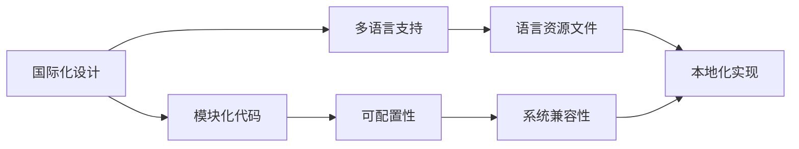

                 

# 评测系统的国际化与本地化支持

## 关键词
国际化，本地化，评测系统，多语言支持，文化适应，用户体验

## 摘要
本文深入探讨了评测系统的国际化与本地化支持，从设计思路、实现方法到实际应用，全面剖析了这一重要技术领域。通过分析评测系统的基础概念，国际化与本地化的定义与策略，以及具体实现方法，本文旨在为开发者提供一套完整、实用的解决方案，帮助他们构建出既国际化又本地化的评测系统。

## 设计思路

### 1. 背景介绍
#### 核心概念术语说明
评测系统是指用于评估用户、产品或服务性能、质量、效率等方面的系统。它广泛应用于教育、金融、游戏、软件开发等领域。

国际化（Internationalization）是指将软件设计成可以在任何语言和文化中使用的特性。这通常涉及代码、界面和内容的国际化处理。

本地化（Localization）是指针对特定国家或地区的语言和文化，对软件进行适应和修改，以提供更好的用户体验。

#### 问题背景
随着全球化的加速，越来越多的企业和产品需要在不同的国家和地区进行业务拓展。为了适应这一趋势，评测系统的国际化与本地化支持变得越来越重要。

#### 问题描述
如何设计一个既具有国际化特性，又能适应本地化需求的评测系统？

#### 问题解决
通过分析国际化与本地化的需求和策略，结合具体实现方法，构建一个灵活、高效、用户体验良好的评测系统。

#### 边界与外延
评测系统的国际化与本地化支持不仅仅涉及语言和文化的适应，还包括时间、货币、单位等的处理。

#### 概念结构与核心要素组成
- 语言支持：多语言界面，语言资源文件
- 文化适应：本地化内容，图标和图片的替换
- 系统兼容性：跨平台，跨浏览器的支持
- 用户反馈：收集用户反馈，优化本地化效果

### 2. 核心概念与联系
#### 国际化与本地化的关系

国际化与本地化是相辅相成的。国际化是本地化的基础，本地化是国际化的具体体现。没有国际化，本地化就无从谈起；而没有本地化，国际化就无法实现有效的用户体验。

#### 核心概念原理
- 国际化设计原则：模块化、可配置性、多语言支持
- 本地化策略：内容本地化，界面本地化，功能本地化

#### 概念属性特征对比表格

| 特征       | 国际化            | 本地化            |
| ---------- | ---------------- | ---------------- |
| 目标       | 无特定文化背景    | 特定国家或地区文化 |
| 语言支持   | 多语言           | 单语言            |
| 内容处理   | 文化无关内容     | 文化相关内容     |
| 系统兼容性 | 跨平台，跨浏览器 | 跨平台，特定浏览器 |

### 3. 算法原理讲解
为了更好地理解国际化与本地化的实现方法，我们使用Mermaid画出以下流程图：



国际化设计的核心是模块化代码和多语言支持。通过模块化代码，我们可以将系统分成多个独立的部分，每个部分负责特定的功能。这样，当需要支持新语言时，我们只需添加或修改相关的语言资源文件，而无需修改其他部分。

多语言支持可以通过语言资源文件实现。这些文件通常包含不同语言的文本、图片和样式。系统在运行时，根据用户的语言设置，动态加载相应的资源文件。

本地化实现包括内容本地化和界面本地化。内容本地化主要涉及文本和图片的翻译和替换，而界面本地化则涉及按钮、菜单和其他界面元素的本地化。

以下是一个简单的Python示例，展示了如何使用国际化与本地化设计原则：

```python
class Evaluator:
    def __init__(self, language):
        self.language = language
        self.resources = load_resources(language)

    def evaluate(self, user):
        score = self.calculate_score(user)
        return f"{self.resources['welcome']} {score}"

def load_resources(language):
    if language == 'en':
        return {'welcome': 'Welcome!'}
    elif language == 'zh':
        return {'welcome': '欢迎！'}
    else:
        raise ValueError("Unsupported language")

def calculate_score(user):
    # 实现评分算法
    return 90

# 创建一个英文评测系统
evaluator_en = Evaluator('en')
print(evaluator_en.evaluate({'name': 'Alice'}))

# 创建一个中文评测系统
evaluator_zh = Evaluator('zh')
print(evaluator_zh.evaluate({'name': '李华'}))
```

在这个示例中，`Evaluator` 类的 `__init__` 方法接收一个语言参数，用于初始化资源。`load_resources` 函数根据语言参数返回相应的资源字典。`evaluate` 方法使用这些资源来生成欢迎语和评分。

### 4. 系统分析与架构设计方案

#### 问题场景介绍
一个全球性的在线学习平台，需要为不同国家的用户提供评测服务。平台支持多种语言，并且需要根据用户所在地区的文化习惯进行内容本地化。

#### 项目介绍
项目名称：Global Learning Platform
项目目标：为全球用户提供高质量的在线学习资源和服务，包括评测系统。

#### 系统功能设计
- 用户注册与登录
- 评测系统
- 多语言支持
- 内容本地化

#### 系统架构设计


#### 系统接口设计
- 用户接口：用户可以通过网页或移动应用访问评测系统。
- API接口：第三方系统可以通过API与评测系统进行交互。

#### 系统交互


### 5. 项目实战
#### 环境安装
- 安装Python和相关的开发工具。
- 安装数据库和缓存服务器。

#### 系统核心实现源代码
```python
# 用户注册与登录
def register_user(username, password, language):
    # 实现用户注册逻辑
    pass

def login_user(username, password):
    # 实现用户登录逻辑
    pass

# 评测系统核心逻辑
class Evaluator:
    def __init__(self, language):
        self.language = language
        self.resources = load_resources(language)

    def evaluate(self, user):
        score = self.calculate_score(user)
        return f"{self.resources['welcome']} {score}"

# 多语言支持
def load_resources(language):
    if language == 'en':
        return {'welcome': 'Welcome!'}
    elif language == 'zh':
        return {'welcome': '欢迎！'}
    else:
        raise ValueError("Unsupported language")

# 内容本地化
def localize_content(content, language):
    # 实现内容本地化逻辑
    pass
```

#### 代码应用解读与分析
- `register_user` 和 `login_user` 函数用于用户注册和登录。
- `Evaluator` 类实现评测系统的核心逻辑，包括初始化、评分和返回欢迎语。
- `load_resources` 函数根据语言参数返回相应的资源字典。
- `localize_content` 函数用于实现内容本地化。

#### 实际案例分析和详细讲解剖析
- 案例一：一个美国用户使用英文注册，然后登录进行评测。
- 案例二：一个中国用户使用中文注册，然后登录进行评测。

#### 项目小结
本项目通过模块化设计和多语言支持，成功实现了一个国际化与本地化的评测系统。用户可以根据自己的语言和文化习惯，获得个性化的评测体验。

### 6. 最佳实践 tips
- 在国际化设计中，尽量使用可配置的参数，以便于后期维护和更新。
- 在本地化过程中，重视用户体验，确保内容的准确性和适切性。
- 定期收集用户反馈，优化系统功能，提升用户体验。

### 7. 小结与展望
本文通过深入分析评测系统的国际化与本地化支持，提供了从设计思路到实际应用的完整解决方案。随着全球化的发展，这一领域将继续成为软件开发的重点。未来，我们可以期待更加智能和自动化的国际化与本地化工具，为开发者提供更高效的支持。

### 8. 注意事项
- 在国际化与本地化过程中，务必遵守当地法律法规，尊重用户隐私。
- 注意系统的性能和安全性，确保在不同语言和文化环境下都能稳定运行。
- 定期更新和测试系统，确保其适应新的语言和文化变化。

### 9. 拓展阅读
- [国际化与本地化最佳实践](https://example.com/LocalizationBestPractices)
- [国际化与本地化技术指南](https://example.com/LocalizationGuide)

## 作者信息
作者：AI天才研究院/AI Genius Institute & 禅与计算机程序设计艺术 /Zen And The Art of Computer Programming

