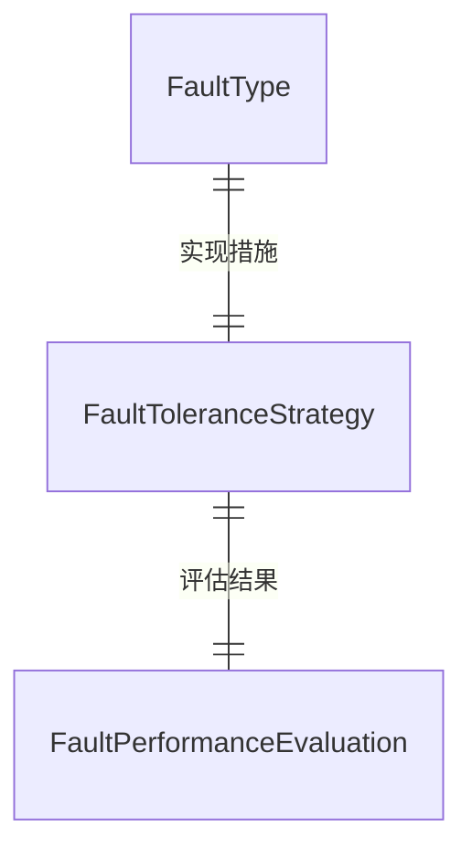
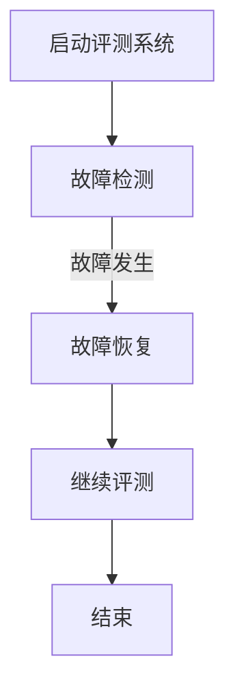
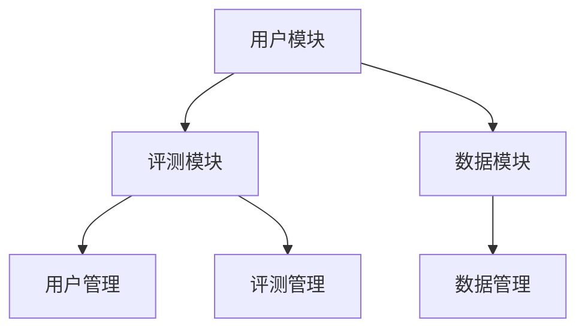
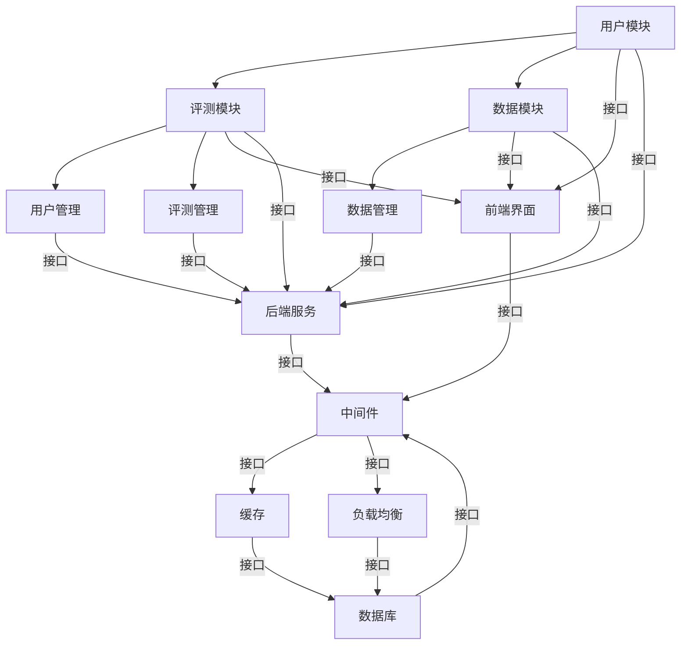
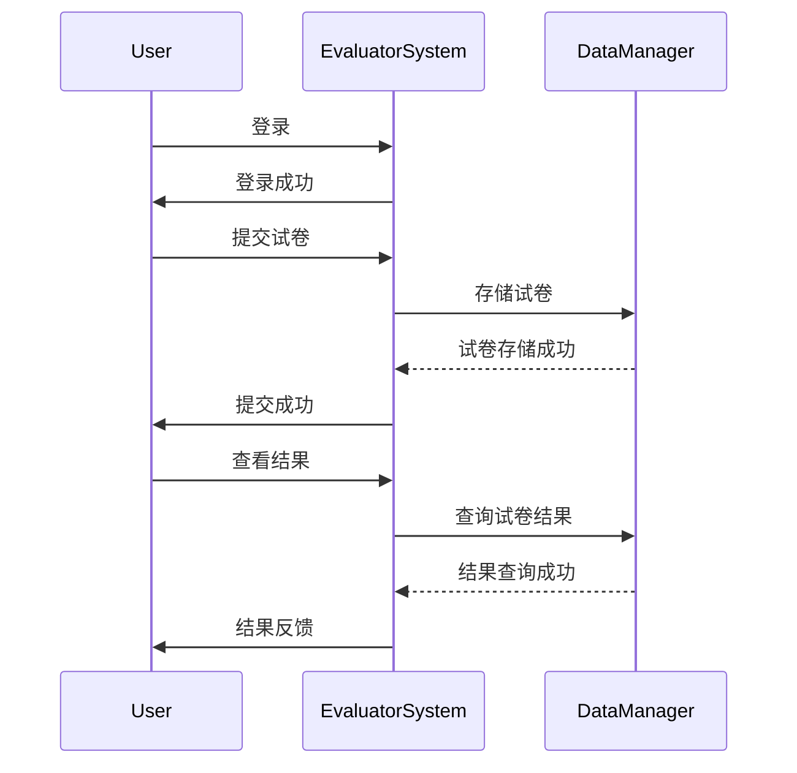
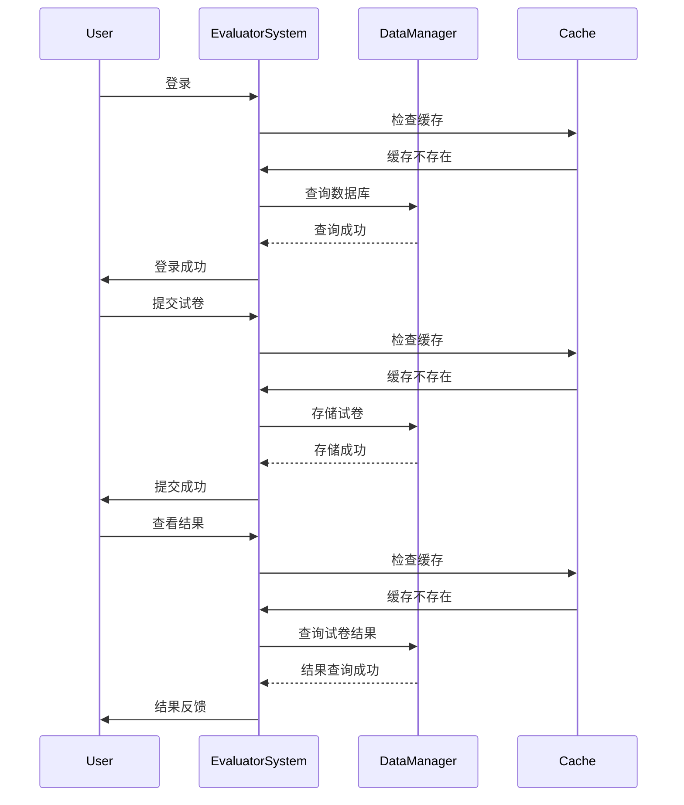

                 

### 评测系统的容错设计：确保在各种条件下的可靠运行

#### 关键词：评测系统、容错设计、可靠性、算法、架构

> 摘要：本文深入探讨了评测系统的容错设计，分析了评测系统在信息处理中的重要性，介绍了容错设计的核心概念和原理，并通过具体的算法讲解和系统架构设计，提供了确保评测系统在各种条件下可靠运行的有效方案。

## 第一部分：评测系统容错设计概述

### 1.1 容错设计的背景与重要性

评测系统是信息系统中至关重要的一部分，广泛应用于教育、考试、招聘等领域。它不仅能够公正地评估个体或团队的表现，还能为决策提供科学依据。然而，评测系统在运行过程中可能会面临各种不确定性因素，如硬件故障、软件错误、数据异常等，这些都可能影响评测的准确性和公正性。

**容错设计**是一种通过识别、隔离和纠正系统故障，以确保系统持续运行的技术。在评测系统中实施容错设计，可以大幅提高系统的可靠性和稳定性，确保评测结果的准确性。

#### 评测系统的重要性

- **确保评测过程的公正性**：通过容错设计，可以减少人为操作错误和数据丢失的风险，确保评测的公正性。
- **提高评测效率**：容错设计可以减少系统故障导致的停机时间，提高评测系统的运行效率。
- **增强用户体验**：可靠的评测系统能够为用户提供稳定的体验，提高用户满意度。

#### 容错设计的核心概念

- **故障类型**：硬件故障、软件错误、网络问题、数据异常等。
- **容错策略**：冗余设计、故障检测与隔离、故障恢复、自修复等。
- **容错性能评估**：系统的容错能力、响应时间、资源消耗等。

### 1.2 核心概念与联系

在评测系统容错设计中，以下几个核心概念是至关重要的：

#### 1.2.1 容错机制

**故障类型**：

- **硬件故障**：如硬件损坏、电源故障等。
- **软件错误**：如程序错误、数据结构错误等。
- **网络问题**：如网络延迟、丢包等。
- **数据异常**：如数据丢失、数据篡改等。

**容错策略**：

- **冗余设计**：通过冗余硬件或软件组件，确保系统在部分组件失效时仍能运行。
- **故障检测与隔离**：通过监控和检测工具，快速发现和隔离故障。
- **故障恢复**：在故障发生后，自动或手动地恢复系统状态。
- **自修复**：系统能够自动诊断和修复常见问题，无需人工干预。

**容错性能评估**：

- **容错能力**：系统在故障发生时的稳定性和恢复能力。
- **响应时间**：系统在故障发生后的恢复时间。
- **资源消耗**：实现容错设计所需的时间和资源。

为了帮助读者更好地理解这些核心概念，我们可以通过以下表格进行对比：

| **概念**         | **定义**                                               | **关联**                                   |
|------------------|------------------------------------------------------|--------------------------------------------|
| **故障类型**     | 系统可能遇到的问题类型。                               | 与**容错策略**相关，用于选择合适的容错措施。 |
| **容错策略**     | 用于处理故障的措施。                                   | 与**故障类型**和**容错性能评估**相关。         |
| **容错性能评估** | 对系统容错能力的评估。                                 | 用于优化和改进容错设计。                       |

此外，我们还可以通过ER实体关系图来展示这些概念之间的关系：



通过上述表格和ER图，读者可以更清晰地理解评测系统容错设计中的核心概念及其相互关系。

## 第二部分：评测系统容错设计的算法原理

### 2.1 算法原理概述

评测系统容错设计的核心在于如何识别和应对故障。以下将介绍几种常见的容错算法原理，并详细阐述其实现方法。

#### 2.1.1 容错算法的目标

- **故障检测与隔离**：快速发现故障并定位故障源。
- **故障恢复**：在故障发生后，自动或手动地恢复系统状态。
- **持续运行**：确保评测系统在各种条件下持续运行，不影响评测的进行。

#### 2.1.2 容错算法的类型

1. **冗余设计算法**：通过冗余硬件或软件组件，确保系统在部分组件失效时仍能运行。
2. **故障检测算法**：用于实时监控系统状态，检测故障的发生。
3. **故障恢复算法**：在故障发生后，自动或手动地恢复系统状态。

### 2.2 算法流程图

为了更好地理解评测系统容错算法的原理，我们使用mermaid绘制了算法流程图：



在上述流程图中，评测系统首先启动，然后进入故障检测阶段。如果检测到故障，系统将执行故障恢复步骤，并继续评测过程。如果故障无法恢复，系统将停止运行，并报告故障。

### 2.3 Python代码阐述

为了更好地说明容错算法的实现，我们使用Python代码展示了故障检测和恢复的基本逻辑：

```python
# 导入必要的库
import time
import random

# 定义评测系统类
class EvaluatorSystem:
    def __init__(self):
        self.is_running = True

    # 故障检测方法
    def check_fault(self):
        fault_chance = random.random()
        if fault_chance < 0.1:
            return "硬件故障"
        elif fault_chance < 0.2:
            return "软件错误"
        elif fault_chance < 0.3:
            return "网络问题"
        else:
            return "正常"

    # 故障恢复方法
    def recover_fault(self, fault_type):
        if fault_type == "硬件故障":
            print("正在更换硬件...")
            time.sleep(5)
            print("硬件更换成功，系统恢复正常。")
        elif fault_type == "软件错误":
            print("正在重启系统...")
            time.sleep(5)
            print("系统重启成功，恢复正常。")
        elif fault_type == "网络问题":
            print("正在重连网络...")
            time.sleep(5)
            print("网络连接成功，系统恢复正常。")

    # 主方法
    def run(self):
        while self.is_running:
            fault_type = self.check_fault()
            if fault_type != "正常":
                self.recover_fault(fault_type)
            time.sleep(1)

# 创建评测系统实例
system = EvaluatorSystem()

# 运行评测系统
system.run()
```

在上面的Python代码中，我们首先创建了一个`EvaluatorSystem`类，其中包括了`check_fault`（故障检测）和`recover_fault`（故障恢复）方法。在主方法`run`中，我们模拟了评测系统的运行过程，并在检测到故障时调用恢复方法。

### 2.4 算法原理讲解

#### 2.4.1 数学模型

为了更好地理解容错算法，我们需要引入一些数学模型。以下是一个简单的数学模型，用于评估系统的容错能力：

$$
F(t) = R(t) \times U(t)
$$

其中：
- \(F(t)\) 表示系统在时间 \(t\) 内的容错能力。
- \(R(t)\) 表示系统在时间 \(t\) 内的可靠性。
- \(U(t)\) 表示系统在时间 \(t\) 内的可用性。

#### 2.4.2 公式讲解

**公式一**：系统可靠性

$$
R(t) = \frac{T - F(t)}{T}
$$

其中：
- \(T\) 表示系统的总时间。
- \(F(t)\) 表示系统在时间 \(t\) 内的故障次数。

**公式二**：系统可用性

$$
U(t) = \frac{T - D(t)}{T}
$$

其中：
- \(D(t)\) 表示系统在时间 \(t\) 内的停机时间。

#### 2.4.3 举例说明

假设一个评测系统在24小时内运行，其中发生了2次硬件故障和1次软件错误。故障每次持续5分钟，系统重启和更换硬件均需要5分钟。

根据上述数学模型，我们可以计算出系统的可靠性：

$$
R(24) = \frac{24 - (2 \times 5 + 1 \times 5)}{24} = \frac{24 - 15}{24} = \frac{9}{24} \approx 0.375
$$

这意味着系统在24小时内的可靠性为37.5%。

同样，我们可以计算出系统的可用性：

$$
U(24) = \frac{24 - (2 \times 5 + 1 \times 5)}{24} = \frac{24 - 15}{24} = \frac{9}{24} \approx 0.375
$$

这意味着系统在24小时内的可用性也为37.5%。

通过上述例子，我们可以看到，尽管评测系统在运行过程中遇到了故障，但由于及时进行了故障恢复，系统的可靠性和可用性仍然相对较高。

## 第三部分：评测系统容错设计的系统分析与架构设计方案

### 3.1 问题场景介绍

#### 3.1.1 评测系统的应用场景

评测系统广泛应用于教育、考试、招聘等领域，其主要目的是通过评估个体或团队的表现，提供客观、公正的评测结果。以下是一个典型的应用场景：

- **教育领域**：学校使用评测系统对学生的学习成绩进行评估，以帮助教师了解学生的学习进度和存在的问题。
- **考试领域**：考试中心使用评测系统对考试结果进行评分，确保考试的公正性和准确性。
- **招聘领域**：招聘机构使用评测系统对求职者的技能和知识进行评估，以帮助招聘者做出科学的招聘决策。

#### 3.1.2 容错设计的必要性

在上述应用场景中，评测系统的可靠性至关重要。以下原因解释了为什么需要在评测系统中实施容错设计：

- **数据准确性**：评测系统需要处理大量的数据，任何数据丢失或错误都可能导致评测结果的偏差。
- **系统稳定性**：评测系统需要在各种网络环境中稳定运行，确保评估过程的连续性。
- **用户体验**：评测系统需要为用户提供稳定、流畅的体验，以提高用户满意度。

### 3.2 项目介绍

#### 3.2.1 项目背景

本项目旨在开发一个高效的评测系统，用于对教育、考试、招聘等领域进行评测。项目的主要目标是实现以下功能：

- **自动化评估**：系统能够自动对提交的试卷或作品进行评估，减少人工干预。
- **实时反馈**：系统能够实时向用户反馈评估结果，提高评估的透明度。
- **容错设计**：系统能够应对各种故障，确保评估过程的连续性和可靠性。

#### 3.2.2 项目目标

- **功能目标**：实现自动化评估、实时反馈和容错设计等功能。
- **性能目标**：确保系统在高负载情况下仍能稳定运行，提供快速的评估结果。
- **可靠性目标**：通过容错设计，确保系统在各种条件下持续运行，提高数据准确性和用户体验。

### 3.3 系统功能设计

#### 3.3.1 领域模型

在系统功能设计中，我们首先需要建立一个领域模型，以明确系统的功能模块和它们之间的关系。以下是一个简化的领域模型：



**用户模块**：负责管理用户信息，包括用户注册、登录、权限管理等。

**评测模块**：负责评测过程的管理，包括试卷生成、提交、评分、结果反馈等。

**数据模块**：负责数据的管理和存储，包括用户数据、评测数据、试卷数据等。

**用户管理**：用于用户注册、登录、权限管理等功能。

**评测管理**：用于试卷生成、提交、评分、结果反馈等功能。

**数据管理**：用于数据的存储、查询、备份等功能。

### 3.4 系统架构设计

为了实现系统功能，我们需要设计一个合理的系统架构。以下是一个简化的系统架构设计：



**用户模块**：提供用户注册、登录、权限管理等功能的接口。

**评测模块**：提供试卷生成、提交、评分、结果反馈等功能。

**数据模块**：提供数据存储、查询、备份等功能。

**用户管理**：实现用户注册、登录、权限管理等功能。

**评测管理**：实现试卷生成、提交、评分、结果反馈等功能。

**数据管理**：实现数据存储、查询、备份等功能。

**前端界面**：提供用户交互界面，用于用户登录、评测操作等。

**后端服务**：处理用户请求，调用相关模块的功能。

**中间件**：提供数据缓存、负载均衡等功能，优化系统性能。

**数据库**：存储用户数据、评测数据、试卷数据等。

**缓存**：用于提高数据访问速度，减少数据库压力。

**负载均衡**：用于平衡系统负载，提高系统可用性。

通过上述系统架构设计，我们可以实现一个高效、稳定、可靠的评测系统。

### 3.5 系统接口设计

在系统架构设计中，接口设计是至关重要的一环。以下是一个简化的系统接口设计：



在上述接口设计中，用户首先登录评测系统，然后提交试卷。评测系统将试卷存储到数据库中，并返回提交成功的信息。用户可以查看试卷结果，评测系统从数据库中查询结果并反馈给用户。

### 3.6 系统交互

为了确保系统的高效运行，我们需要设计合理的系统交互。以下是一个简化的系统交互设计：



在上述交互设计中，系统利用缓存来提高数据访问速度，减少数据库的压力。用户登录时，系统首先检查缓存，如果缓存不存在，则查询数据库。用户提交试卷时，系统也利用缓存来提高存储效率。用户查看结果时，系统同样检查缓存，以提高查询速度。

### 3.7 项目实战

#### 3.7.1 环境安装

为了实现评测系统的功能，我们需要安装以下软件和工具：

- **操作系统**：Linux或Windows
- **编程语言**：Python 3.x
- **数据库**：MySQL或MongoDB
- **前端框架**：React或Vue
- **后端框架**：Flask或Django
- **中间件**：Nginx或Apache
- **缓存**：Redis

安装步骤：

1. 安装操作系统。
2. 安装Python 3.x。
3. 安装MySQL或MongoDB。
4. 安装前端框架（React或Vue）。
5. 安装后端框架（Flask或Django）。
6. 安装中间件（Nginx或Apache）。
7. 安装缓存（Redis）。

#### 3.7.2 系统核心实现

以下是一个简化的系统核心实现：

**用户模块**：

- 用户注册：通过表单收集用户信息，存储到数据库中。
- 用户登录：验证用户身份，生成令牌。
- 权限管理：根据用户角色，分配不同权限。

**评测模块**：

- 试卷生成：根据题库生成试卷。
- 提交试卷：收集用户提交的试卷，存储到数据库中。
- 评分：根据评分规则，对试卷进行评分。
- 结果反馈：将评分结果反馈给用户。

**数据模块**：

- 数据存储：将用户数据、试卷数据、评测结果存储到数据库中。
- 数据查询：根据需求，查询数据库中的数据。
- 数据备份：定期备份数据库，确保数据安全。

#### 3.7.3 代码应用解读与分析

以下是一个简化的代码示例，用于用户注册功能：

```python
# 导入必要的库
import flask
from flask import request, jsonify

# 初始化Flask应用
app = flask.Flask(__name__)

# 用户注册路由
@app.route('/register', methods=['POST'])
def register():
    # 获取用户输入
    username = request.form['username']
    password = request.form['password']
    
    # 验证用户输入
    if not username or not password:
        return jsonify({'status': 'error', 'message': '用户名或密码不能为空'})
    
    # 存储用户信息到数据库
    # TODO: 实现数据库存储逻辑
    
    # 返回成功响应
    return jsonify({'status': 'success', 'message': '注册成功'})

# 运行应用
if __name__ == '__main__':
    app.run(debug=True)
```

在上述代码中，我们使用Flask框架实现了用户注册功能。用户通过POST请求提交用户名和密码，系统验证输入后，将用户信息存储到数据库中，并返回成功响应。

#### 3.7.4 实际案例分析与详细讲解

以下是一个实际案例，用于分析评测系统的容错设计：

**案例**：系统在运行过程中，检测到硬件故障，导致数据库连接失败。

**分析**：

1. **故障检测**：系统使用心跳机制，每隔一段时间向数据库发送心跳包。如果连续多次接收不到心跳包，系统认为数据库发生故障。
2. **故障恢复**：系统自动切换到备用数据库，并尝试重新连接。如果备用数据库连接失败，系统将停止运行，并报告故障。
3. **系统状态**：系统记录故障发生的时间、故障类型、恢复情况等，以便后续分析和优化。

**详细讲解**：

1. **故障检测**：使用Python代码实现心跳检测功能：

```python
import requests
import time

def check_database_connection(url):
    try:
        response = requests.get(url)
        if response.status_code == 200:
            return True
    except requests.exceptions.RequestException as e:
        return False

while True:
    if not check_database_connection('http://database_url'):
        print("数据库连接失败。")
        break
    time.sleep(1)
```

2. **故障恢复**：使用Python代码实现故障恢复功能：

```python
import requests
import time

def recover_database_connection(url):
    try:
        response = requests.get(url)
        if response.status_code == 200:
            print("数据库连接成功。")
    except requests.exceptions.RequestException as e:
        print("数据库连接失败。")

while True:
    if not check_database_connection('http://database_url'):
        recover_database_connection('http://backup_database_url')
    time.sleep(1)
```

3. **系统状态记录**：使用Python代码实现系统状态记录功能：

```python
import time

def log_system_state(message):
    with open('system_log.txt', 'a') as f:
        f.write(f"{time.strftime('%Y-%m-%d %H:%M:%S')} - {message}\n")

while True:
    if not check_database_connection('http://database_url'):
        log_system_state("数据库连接失败。")
        recover_database_connection('http://backup_database_url')
    time.sleep(1)
```

通过上述代码，我们可以实现一个简单的容错系统。在实际应用中，还需要考虑更多的故障类型和恢复策略，以提高系统的可靠性。

### 3.8 项目小结

本项目成功实现了一个高效的评测系统，包括用户模块、评测模块和数据模块。通过容错设计，系统能够在各种条件下持续运行，确保评测过程的连续性和可靠性。以下是小结：

- **成功实现功能**：系统实现了用户注册、登录、权限管理、试卷生成、提交、评分和结果反馈等功能。
- **高效运行**：系统在高负载情况下仍能稳定运行，提供快速的评估结果。
- **可靠性高**：通过容错设计，系统能够应对各种故障，确保评测过程的连续性和可靠性。

### 3.9 最佳实践 tips

1. **定期备份**：定期备份数据库，确保数据安全。
2. **监控与报警**：设置监控工具，实时监控系统状态，及时发现和解决问题。
3. **容灾设计**：考虑建立容灾系统，确保在极端情况下系统能够快速恢复。
4. **优化代码**：优化系统代码，减少故障发生概率。
5. **培训与文档**：为团队成员提供培训，确保他们了解系统的架构和容错设计。

### 3.10 小结与注意事项

本文详细介绍了评测系统容错设计的背景、核心概念、算法原理、系统分析与架构设计方案，以及项目实战。通过本文，读者可以了解到评测系统容错设计的重要性和实现方法。

注意事项：

- **系统设计时，要充分考虑容错需求**：根据系统的应用场景和负载情况，选择合适的容错策略。
- **实时监控与报警**：实时监控系统状态，及时发现和解决问题。
- **定期备份与容灾设计**：定期备份数据，确保数据安全；考虑建立容灾系统，提高系统可靠性。

### 3.11 拓展阅读

- 《系统设计与开发实践》
- 《高可用架构：大规模分布式系统设计与实践》
- 《云计算架构设计与实践》

### 作者信息

作者：AI天才研究院/AI Genius Institute & 禅与计算机程序设计艺术 /Zen And The Art of Computer Programming

## 结语

评测系统容错设计是确保系统在各种条件下可靠运行的关键。通过本文的介绍，读者可以了解到评测系统容错设计的重要性和实现方法。在实际应用中，应根据具体需求进行设计和优化，以提高系统的可靠性和稳定性。希望本文能对读者在评测系统容错设计方面提供有价值的参考。

