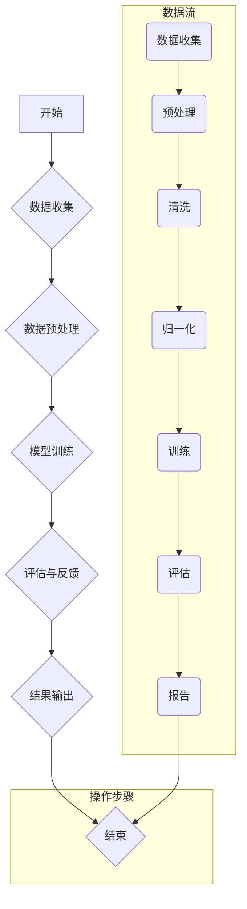
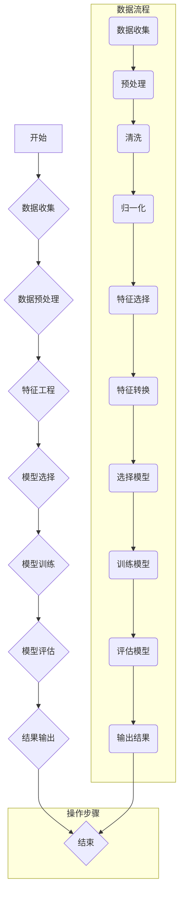

                 

### 评测系统的基本概念

#### 1.1 评测系统的定义与作用

评测系统，也被称为评价系统或测试系统，是一种用于衡量、监测和评估特定对象（如产品、项目、服务或人员）性能和质量的工具。其核心作用在于提供客观、可量化的评估结果，以便于决策者或利益相关者基于这些结果做出科学、合理的决策。

在技术领域，评测系统广泛应用于软件质量保证、系统性能测试、人工智能算法评估等多个方面。例如，在软件开发过程中，评测系统可以用于检测代码的质量和稳定性，确保软件在各种环境下都能正常运行；在系统性能测试中，评测系统可以监控系统的响应时间、吞吐量等关键性能指标，以便优化系统性能；在人工智能领域，评测系统则可以评估算法的准确性、效率和泛化能力。

#### 1.2 评测系统的组成部分

一个典型的评测系统通常由以下几个主要部分组成：

1. **评估指标**：评估指标是评测系统的核心，用于量化评估对象的不同方面。常见的评估指标包括正确率、召回率、F1分数、响应时间等。

2. **数据收集**：数据收集是评测系统的数据基础，包括被评估对象的历史数据、实时数据或模拟数据。这些数据通常需要通过传感器、日志文件或其他数据源获取。

3. **评估算法**：评估算法是评测系统的核心处理逻辑，用于分析数据并计算评估指标。常见的评估算法包括统计方法、机器学习算法和深度学习算法。

4. **评估报告**：评估报告是评测系统输出的最终成果，用于向决策者或利益相关者展示评估结果。评估报告通常包含图表、数据分析、结论和建议等。

5. **用户界面**：用户界面是评测系统的交互界面，用于用户配置评估参数、查看评估结果和操作评估流程。良好的用户界面可以提高系统的易用性和用户体验。

#### 1.3 评测系统在行业中的重要性

评测系统在各个行业中都扮演着至关重要的角色，其重要性主要体现在以下几个方面：

1. **质量控制**：通过评测系统，企业可以确保其产品或服务的质量达到既定标准，减少质量问题的发生，提高客户满意度。

2. **决策支持**：评测系统提供了客观、科学的评估结果，为决策者提供了有力的支持，有助于做出更加合理和高效的决策。

3. **资源优化**：评测系统可以帮助企业优化资源配置，通过评估不同项目的绩效和成本效益，帮助企业确定优先级和投资方向。

4. **创新推动**：评测系统不仅可以评估现有产品的性能，还可以为技术创新和改进提供依据，推动企业不断优化和升级产品。

5. **行业规范**：评测系统有助于推动行业标准化，通过共享评测指标、算法和工具，促进不同企业之间的技术交流和合作，提高整个行业的整体水平。

综上所述，评测系统在现代行业中具有不可替代的地位和作用。随着技术的不断进步和应用的深入，评测系统将在更多的领域发挥其价值，为行业发展提供强有力的支撑。

### 2.1 开源贡献的概述

开源贡献是指在开源项目中，开发者为提升项目质量、扩展功能或修复问题而进行的代码编写、文档撰写、社区互动等一系列活动。开源贡献不仅是一种技术交流与合作的方式，更是推动技术进步和创新的重要手段。

#### 2.1.1 开源贡献的定义

开源贡献通常涉及以下几种形式：

1. **代码提交**：开发者编写新的代码或对现有代码进行修改，以改进项目的功能或性能。
2. **文档撰写**：开发者撰写或更新项目的文档，包括用户手册、API 文档、开发指南等，以提高项目的可读性和易用性。
3. **问题修复**：开发者识别并修复项目中的漏洞、错误或bug，确保项目的稳定性和可靠性。
4. **社区互动**：开发者参与项目社区，回答用户问题、提供技术支持、组织或参与活动，促进社区的发展和活跃。

#### 2.1.2 开源贡献在项目中的角色

开源贡献在项目中的角色至关重要，具体体现在以下几个方面：

1. **质量提升**：通过社区成员的审查和反馈，开发者可以及时发现并修复项目中的问题，提高代码质量。
2. **功能扩展**：开源项目的功能往往通过社区成员的贡献得到扩展，这有助于项目满足更广泛用户的需求。
3. **技术创新**：开源项目鼓励创新和尝试，开发者可以自由地探索新的技术方向和解决方案，推动技术的进步。
4. **协作学习**：开源项目提供了一个学习和交流的平台，开发者可以通过贡献和参与项目，不断提升自己的技能和知识。

#### 2.1.3 开源贡献的流程

进行开源贡献通常需要遵循以下流程：

1. **了解项目**：在开始贡献之前，开发者需要深入了解项目的背景、目标、功能和已有贡献。
2. **阅读文档**：大多数开源项目都有详细的贡献指南，开发者应仔细阅读并遵循这些指南。
3. **提出问题**：在遇到问题时，开发者可以先在项目社区中提出问题，了解已有的解决方案或寻求帮助。
4. **编写代码或文档**：根据项目需求，开发者编写新的代码或文档，并在本地进行充分的测试。
5. **提交Pull Request**：开发者将修改的代码或文档提交到项目的代码库中，发起Pull Request，供项目维护者审查。
6. **反馈与修改**：项目维护者会审查提交的代码或文档，提供反馈，开发者需要根据反馈进行必要的修改。
7. **合并与发布**：经过审查和修改后，代码或文档将被合并到主分支，并可能随项目的下一个版本一起发布。

#### 2.1.4 开源贡献的优势

开源贡献不仅对项目本身有积极影响，也对开发者个人和整个技术社区具有重要意义：

1. **技能提升**：通过实际编码和参与项目，开发者可以学习和掌握新的技术、工具和方法。
2. **职业发展**：开源贡献可以增强开发者的简历，提高其在就业市场中的竞争力。
3. **社区互动**：参与开源项目可以让开发者结识业界同行，建立联系，拓展人脉。
4. **知识共享**：开源项目的开放性促进了知识的共享和传播，有助于提升整个行业的技术水平。
5. **创新推动**：开源项目鼓励开发者进行创新和实验，有助于推动技术进步和行业变革。

总之，开源贡献是一种有益且值得鼓励的活动，它不仅有助于提升项目的质量和影响力，还能促进个人职业发展和行业整体进步。

### 2.2 开源贡献在标准化中的角色

开源贡献在标准化过程中扮演着至关重要的角色，其影响贯穿于标准的制定、实施和改进各个环节。通过开源贡献，开发者们能够共同推动行业的标准化进程，提升整个技术生态的协同性和一致性。

#### 2.2.1 开源贡献促进标准化

1. **提高标准制定的科学性**：开源项目通常具有广泛的用户群体和开发者社区，这为标准制定提供了一个庞大的实验和测试平台。通过实际应用和反馈，开源贡献可以揭示标准制定过程中的潜在问题，确保标准的科学性和实用性。

2. **加速标准制定和更新**：开源项目的开放性使得其标准制定和更新过程更加高效。开发者们可以快速协作，提出改进建议，并通过社区投票等方式决定标准的最终形态。这种快速迭代的方式有助于缩短标准制定的时间，使其能够及时响应技术发展的需求。

3. **促进标准的普及和实施**：开源项目的成功往往依赖于社区的支持和参与。开源贡献不仅有助于推动标准的制定，还能通过社区传播和推广，使标准得到更广泛的应用和实施。开发者们在实际使用过程中不断反馈和改进标准，使其更具实用性和可操作性。

#### 2.2.2 开源贡献在标准化中的优势

1. **开放性**：开源项目的开放性使得标准制定和实施过程透明、公开，避免了传统封闭标准制定模式中的信息不对称和垄断现象。开发者、用户和利益相关者可以平等地参与标准的制定和讨论，确保标准的公平性和公正性。

2. **协作性**：开源项目的协作性使得不同背景、技能和经验的人能够共同参与标准的制定和改进。这种多元化的协作有助于发现和解决标准制定中的复杂问题，提高标准的综合性和全面性。

3. **灵活性**：开源项目的灵活性使其能够迅速适应技术变化和市场需求，确保标准的动态性和前瞻性。开发者们可以基于开源项目快速探索新技术和解决方案，为标准更新提供新的思路和方向。

4. **可验证性**：开源项目的代码和文档是公开可查的，这使得标准的实施和验证过程更加透明和可信。开发者们可以通过代码审查和实际应用验证标准的实现效果，确保标准的一致性和正确性。

#### 2.2.3 开源贡献的挑战

尽管开源贡献在标准化过程中具有诸多优势，但也面临着一些挑战：

1. **标准冲突**：由于开源项目的多样性和复杂性，不同项目之间可能会出现标准冲突，影响标准的统一性和一致性。开发者需要妥善处理这些冲突，确保标准之间的兼容性和互操作性。

2. **资源分配**：开源项目的资源分配问题可能影响标准的制定和实施。一些重要的标准可能需要更多的资源投入，但开源社区的资源是有限的，如何合理分配资源成为了一个挑战。

3. **技术复杂性**：某些技术领域的标准制定过程非常复杂，涉及大量的技术和法律问题。开发者需要具备相应的专业知识和经验，才能有效地参与标准的制定和改进。

4. **利益平衡**：在开源社区中，不同利益相关者之间的利益可能存在冲突。开发者需要平衡不同利益之间的矛盾，确保标准的制定和实施过程公平、公正。

总的来说，开源贡献在标准化中的角色是不可或缺的。通过开放、协作和灵活的方式，开源贡献不仅能够推动技术标准的制定和实施，还能促进整个技术生态的协同发展。开发者们需要积极应对挑战，共同推动标准化进程，为技术进步和行业创新贡献力量。

### 3.1 核心概念原理

为了深入理解评测系统、开源贡献和行业标准化之间的关系，我们首先需要明确这三个核心概念的基本原理。

#### 3.1.1 评测系统的原理

评测系统的工作原理可以概括为以下几个步骤：

1. **数据收集**：首先，评测系统需要收集相关的数据。这些数据可以是来自传感器、用户输入、日志文件等多种来源。

2. **数据预处理**：收集到的数据通常需要进行清洗和预处理，包括去噪、填补缺失值、归一化等，以确保数据的质量和一致性。

3. **模型训练**：接下来，评测系统会利用机器学习算法对预处理后的数据进行分析和建模。常见的模型包括线性回归、决策树、随机森林、神经网络等。

4. **评估与反馈**：模型训练完成后，评测系统会使用测试集或实际应用中的数据进行评估，计算评估指标，如准确率、召回率、F1分数等。根据评估结果，系统可以生成评估报告，并提出优化建议。

5. **持续优化**：评测系统不是一成不变的，它会根据新的数据、反馈和需求进行持续优化和迭代，以提高评估的准确性和可靠性。

#### 3.1.2 开源贡献的原理

开源贡献的原理主要涉及以下几个方面：

1. **社区协作**：开源项目的核心是社区协作。开发者们可以自由地提交代码、文档和问题，社区成员共同参与项目的讨论、审查和改进。

2. **代码审查**：开源项目的代码通常需要经过多个开发者的审查和测试。代码审查不仅有助于发现潜在的问题，还能确保代码的质量和一致性。

3. **版本控制**：开源项目通常使用版本控制系统（如Git）来管理代码的变更。开发者可以在自己的本地仓库中进行开发，并通过Pull Request向主分支提交代码。

4. **持续集成**：开源项目通常会使用持续集成工具（如Jenkins、Travis CI）来自动化代码的构建、测试和部署。这有助于确保代码的稳定性和可靠性。

5. **社区互动**：开源社区不仅关注代码本身，还关注社区成员之间的互动。通过讨论区、邮件列表、社交媒体等渠道，开发者可以分享经验、解答问题和获取帮助。

#### 3.1.3 行业标准化原理

行业标准化是指通过制定和实施一系列标准，确保产品、服务或流程在不同组织之间的一致性和互操作性。行业标准化的原理包括：

1. **标准制定**：标准制定过程通常涉及多个利益相关方的参与，包括企业、政府机构、行业协会等。通过协商和共识，制定出符合行业需求和实际应用的标准。

2. **标准实施**：标准实施是指将制定出的标准应用到实际的生产、服务和运营过程中。标准实施需要各方的共同努力和配合，以确保标准得到有效执行。

3. **标准维护和更新**：随着技术和社会的发展，标准需要不断进行维护和更新，以保持其相关性和实用性。标准维护和更新通常包括修订现有标准、制定新标准以及推广和培训等环节。

4. **标准认证和监督**：为了确保标准的实施效果，通常会进行标准认证和监督。认证机构会对符合标准的产品、服务或流程进行认证，监督机构则负责监督标准的执行情况。

通过理解评测系统、开源贡献和行业标准化的原理，我们可以更好地认识它们之间的联系和作用。评测系统通过开源贡献可以促进标准的制定和实施，而行业标准化则为评测系统的应用提供了更加稳定和可靠的环境。接下来，我们将进一步探讨这些概念之间的属性特征对比，以便更深入地理解它们在技术进步和行业发展中的作用。

### 3.2 概念属性特征对比表格

为了更清晰地理解评测系统、开源贡献和行业标准化这三个核心概念，我们通过一个对比表格来展示它们的属性特征。

| 概念       | 属性特征                                           | 对比说明                                                     |
|------------|----------------------------------------------------|--------------------------------------------------------------|
| 评测系统   | 1. 定量评估性能和指标<br>2. 数据收集与处理<br>3. 模型训练与评估<br>4. 反馈与迭代     | - 强调科学性和量化性<br> - 针对特定领域或任务<br> - 结果用于决策或优化 |
| 开源贡献   | 1. 社区协作<br>2. 代码审查与维护<br>3. 持续集成与发布<br>4. 跨平台和兼容性   | - 强调开放性和合作<br> - 面向技术进步和创新<br> - 灵活性高，快速迭代 |
| 行业标准化 | 1. 制定和实施标准<br>2. 确保一致性和互操作性<br>3. 维护和更新标准<br>4. 认证和监督 | - 强调规范性和稳定性<br> - 面向整个行业<br> - 需要广泛协商和共识 |

**对比说明**：

- **科学性和量化性**：评测系统强调对性能和指标进行科学、量化的评估，确保评估结果的可信度和准确性。
- **开放性和合作**：开源贡献强调开放性，通过社区协作和代码审查，促进技术交流和创新。
- **规范性和稳定性**：行业标准化强调制定和实施标准，确保产品和服务的一致性和互操作性，为行业提供稳定的技术基础。
- **灵活性和快速迭代**：开源贡献强调快速迭代和适应变化，确保技术的持续进步和更新。
- **广泛参与和协商**：行业标准化需要广泛的参与和协商，确保标准的制定和实施能够反映各方的利益和需求。

通过这个表格，我们可以看到评测系统、开源贡献和行业标准化在属性特征上的差异和联系。这些特征共同作用，推动技术进步和行业发展的同时，也为这三个领域的发展提供了坚实的基础。

### 3.3 ER实体关系图架构

为了更直观地理解评测系统、开源贡献和行业标准化之间的关联，我们可以通过ER（实体关系）图来展示它们之间的实体关系和交互作用。

#### 3.3.1 实体定义

1. **评测系统（Evaluation System）**：负责评估特定对象的性能和指标，如软件质量、系统性能、算法准确性等。
2. **开源贡献（Open Source Contributions）**：指开发者提交到开源项目的代码、文档和问题，以促进项目的发展和改进。
3. **行业标准化（Industry Standardization）**：通过制定和实施标准，确保产品和服务的一致性和互操作性。

#### 3.3.2 实体关系

- **评测系统与开源贡献**：评测系统可以通过开源贡献获取新的评估方法和工具，从而提升评估的准确性和可靠性。同时，评测系统的实际应用场景可以反馈给开源项目，帮助改进开源贡献。
- **开源贡献与行业标准化**：开源贡献可以作为行业标准的参考和验证工具。开源项目中的成功案例和最佳实践可以被转化为行业标准，推动整个行业的标准化进程。
- **行业标准化与评测系统**：行业标准化为评测系统提供了统一的评估标准和框架，确保评测系统在不同环境和条件下的一致性和可比性。同时，评测系统的实际应用效果可以为行业标准的修订和更新提供依据。

#### 3.3.3 ER图表示

```mermaid
erDiagram
  EvaluationSystem ||--|{ OpenSourceContributions }|-- EvaluationSystem
  OpenSourceContributions ||--|{ IndustryStandardization }|-- OpenSourceContributions
  IndustryStandardization ||--|{ EvaluationSystem }|-- IndustryStandardization
```

在这个ER图中，评测系统（Evaluation System）与开源贡献（OpenSourceContributions）之间存在双向关联，表明两者相互影响和促进。开源贡献与行业标准化（IndustryStandardization）也存在双向关联，表示开源贡献可以作为行业标准的参考，而行业标准化又可以为开源贡献提供规范和支持。行业标准化与评测系统之间也存在双向关联，确保标准的制定和实施过程与评测系统的实际应用相协调。

通过这个ER图，我们可以更清晰地理解评测系统、开源贡献和行业标准化之间的复杂关系和相互作用。这种关系的建立和优化，有助于推动技术进步和行业标准化，为各方带来更大的价值和收益。

### 4.1 数学模型介绍

在评测系统的开源贡献中，数学模型扮演着至关重要的角色。数学模型不仅能够帮助我们理解和描述评估过程，还能为评估结果的准确性和可靠性提供理论支持。以下是几个关键的数学模型和它们在评测系统中的应用。

#### 4.1.1 准确率（Accuracy）

准确率是评测系统中最基本的评估指标之一，用于衡量预测结果中正确样本的比例。其数学模型可以表示为：

\[ \text{Accuracy} = \frac{\text{正确预测的样本数}}{\text{总样本数}} \]

例如，在一个分类问题中，如果评测系统预测了1000个样本，其中有950个样本被正确分类，那么该分类器的准确率为：

\[ \text{Accuracy} = \frac{950}{1000} = 0.95 \]

#### 4.1.2 召回率（Recall）

召回率衡量的是评测系统在预测正类样本时，正确识别出的比例。其数学模型可以表示为：

\[ \text{Recall} = \frac{\text{正确预测的正类样本数}}{\text{实际正类样本数}} \]

例如，在一个疾病诊断问题中，如果有100个确诊为疾病的患者，评测系统正确预测了80个，那么召回率为：

\[ \text{Recall} = \frac{80}{100} = 0.8 \]

#### 4.1.3 精确率（Precision）

精确率衡量的是评测系统在预测正类样本时，预测结果的准确性。其数学模型可以表示为：

\[ \text{Precision} = \frac{\text{正确预测的正类样本数}}{\text{预测为正类样本数}} \]

例如，在一个垃圾邮件过滤问题中，如果有100封邮件被预测为垃圾邮件，其中有90封实际上是垃圾邮件，那么精确率为：

\[ \text{Precision} = \frac{90}{100} = 0.9 \]

#### 4.1.4 F1分数（F1 Score）

F1分数是精确率和召回率的调和平均，用于综合考虑评估指标。其数学模型可以表示为：

\[ \text{F1 Score} = 2 \times \frac{\text{Precision} \times \text{Recall}}{\text{Precision} + \text{Recall}} \]

例如，在一个银行欺诈检测问题中，如果精确率和召回率均为0.8，那么F1分数为：

\[ \text{F1 Score} = 2 \times \frac{0.8 \times 0.8}{0.8 + 0.8} = 0.8 \]

#### 4.1.5 ROC曲线和AUC指标

ROC（接收者操作特征）曲线和AUC（曲线下面积）指标是评估二分类模型性能的重要工具。ROC曲线通过绘制预测概率与召回率之间的关系，展示了模型在不同阈值下的表现。AUC指标则衡量ROC曲线下的面积，数值越大，模型的性能越好。

ROC曲线的数学模型可以表示为：

\[ \text{ROC Curve} = \left\{ (\text{Recall}_i, \text{Precision}_i) \mid i = 1, 2, \ldots, n \right\} \]

其中，\(\text{Recall}_i\) 和 \(\text{Precision}_i\) 分别是不同阈值下的召回率和精确率。

AUC指标的数学模型可以表示为：

\[ \text{AUC} = \int_{0}^{1} \text{True Positive Rate}(1 - \text{False Positive Rate}) \, d\theta \]

其中，\(\text{True Positive Rate}\) 和 \(\text{False Positive Rate}\) 分别是真正类率和假正类率。

通过这些数学模型和指标，评测系统可以全面、准确地评估模型的性能，为后续的优化和改进提供科学依据。接下来，我们将进一步通过Python源代码和具体的实例说明，详细阐述这些数学模型的应用。

### 4.2 关键公式与解释

在评测系统的数学模型中，有一些关键公式对于理解和评估系统性能至关重要。以下是对这些公式的详细解释：

#### 4.2.1 准确率（Accuracy）

准确率是评估模型性能的最基本指标之一，用于衡量预测结果中正确样本的比例。其公式如下：

\[ \text{Accuracy} = \frac{\text{正确预测的样本数}}{\text{总样本数}} \]

解释：准确率表示模型在所有预测样本中，正确预测的比例。它简单直观，但可能在类别分布不平衡的情况下失去代表性。

#### 4.2.2 召回率（Recall）

召回率衡量的是模型在预测正类样本时，正确识别出的比例。其公式如下：

\[ \text{Recall} = \frac{\text{正确预测的正类样本数}}{\text{实际正类样本数}} \]

解释：召回率关注的是模型是否能够捕捉到所有的正类样本。它在医疗诊断、反欺诈等领域尤为重要。

#### 4.2.3 精确率（Precision）

精确率衡量的是模型在预测正类样本时，预测结果的准确性。其公式如下：

\[ \text{Precision} = \frac{\text{正确预测的正类样本数}}{\text{预测为正类样本数}} \]

解释：精确率关注的是模型预测的正类样本中有多少是真正类样本。它在分类任务中用来衡量预测结果的可靠性。

#### 4.2.4 F1分数（F1 Score）

F1分数是精确率和召回率的调和平均，用于综合考虑评估指标。其公式如下：

\[ \text{F1 Score} = 2 \times \frac{\text{Precision} \times \text{Recall}}{\text{Precision} + \text{Recall}} \]

解释：F1分数权衡了精确率和召回率，提供了一个综合的评估指标。它适用于需要平衡这两个指标的情境。

#### 4.2.5 ROC曲线和AUC指标

ROC（接收者操作特征）曲线和AUC（曲线下面积）指标是评估二分类模型性能的重要工具。ROC曲线的公式如下：

\[ \text{ROC Curve} = \left\{ (\text{Recall}_i, \text{Precision}_i) \mid i = 1, 2, \ldots, n \right\} \]

其中，\(\text{Recall}_i\) 和 \(\text{Precision}_i\) 分别是不同阈值下的召回率和精确率。

AUC指标的公式如下：

\[ \text{AUC} = \int_{0}^{1} \text{True Positive Rate}(1 - \text{False Positive Rate}) \, d\theta \]

其中，\(\text{True Positive Rate}\) 和 \(\text{False Positive Rate}\) 分别是真正类率和假正类率。

解释：ROC曲线展示了模型在不同阈值下的性能，而AUC则衡量了模型的整体性能。AUC值越大，模型的性能越好。

通过这些关键公式，评测系统可以全面、准确地评估模型的性能。下面，我们将结合Python代码实例，进一步说明这些公式的应用。

### 4.3 算法mermaid流程图

为了更直观地展示评测系统开源贡献的流程，我们使用mermaid绘制了一个简化的算法流程图。以下是对流程图中各步骤的详细解释：



**流程图解释：**

1. **开始**：流程从“开始”节点开始，表示评测系统的初始化和准备阶段。

2. **数据收集（B）**：评测系统需要收集相关的数据，这包括各种来源的数据，如传感器数据、日志文件、用户输入等。这个步骤确保了评测系统有足够的数据进行后续分析。

3. **数据预处理（C）**：收集到的数据通常需要进行预处理，包括数据清洗、去噪、填补缺失值和归一化等。这些操作确保数据的质量和一致性，为后续的模型训练和评估打下基础。

4. **模型训练（D）**：在预处理后的数据基础上，评测系统使用机器学习算法进行模型训练。常见的算法包括线性回归、决策树、随机森林、神经网络等。模型训练的目的是学习数据中的特征和规律，以便进行预测和评估。

5. **评估与反馈（E）**：模型训练完成后，使用测试集或实际应用中的数据进行评估。评估指标包括准确率、召回率、F1分数等。根据评估结果，系统可以生成评估报告，并提出优化建议。

6. **结果输出（F）**：评估结果以评估报告的形式输出，包括图表、数据分析、结论和建议等。这些结果可以为决策者提供科学依据，以便做出合理的决策。

7. **结束**：流程最终结束，表示评测系统的运行完成。

通过这个mermaid流程图，我们可以清晰地了解评测系统开源贡献的整个流程。每个步骤都有明确的输入和输出，确保了整个系统的逻辑性和可操作性。接下来，我们将通过Python源代码示例进一步详细阐述这一流程。

### 4.4 Python源代码示例

为了更直观地展示评测系统开源贡献的流程，下面提供了一个简单的Python代码示例。该示例将展示如何使用Python实现数据收集、预处理、模型训练和评估的过程。请注意，这个示例是为了展示流程而设计的，实际应用中的评测系统会更加复杂和多样化。

```python
import numpy as np
from sklearn.model_selection import train_test_split
from sklearn.preprocessing import StandardScaler
from sklearn.linear_model import LogisticRegression
from sklearn.metrics import accuracy_score, recall_score, precision_score, f1_score, roc_auc_score

# 数据收集
def collect_data():
    # 假设数据来自CSV文件，这里使用numpy生成模拟数据
    X = np.random.rand(100, 10)  # 100个样本，10个特征
    y = np.random.randint(0, 2, 100)  # 标签，0或1
    return X, y

X, y = collect_data()

# 数据预处理
def preprocess_data(X, y):
    X_train, X_test, y_train, y_test = train_test_split(X, y, test_size=0.2, random_state=42)
    scaler = StandardScaler()
    X_train_scaled = scaler.fit_transform(X_train)
    X_test_scaled = scaler.transform(X_test)
    return X_train_scaled, X_test_scaled, y_train, y_test

X_train, X_test, y_train, y_test = preprocess_data(X, y)

# 模型训练
def train_model(X_train, y_train):
    model = LogisticRegression()
    model.fit(X_train, y_train)
    return model

model = train_model(X_train, y_train)

# 评估与反馈
def evaluate_model(model, X_test, y_test):
    y_pred = model.predict(X_test)
    accuracy = accuracy_score(y_test, y_pred)
    recall = recall_score(y_test, y_pred)
    precision = precision_score(y_test, y_pred)
    f1 = f1_score(y_test, y_pred)
    roc_auc = roc_auc_score(y_test, y_pred)
    return accuracy, recall, precision, f1, roc_auc

accuracy, recall, precision, f1, roc_auc = evaluate_model(model, X_test, y_test)

# 输出结果
print("Accuracy:", accuracy)
print("Recall:", recall)
print("Precision:", precision)
print("F1 Score:", f1)
print("ROC AUC Score:", roc_auc)
```

**代码说明：**

1. **数据收集**：`collect_data`函数用于生成模拟数据，这里使用numpy库生成100个样本，每个样本有10个特征，标签为0或1。

2. **数据预处理**：`preprocess_data`函数将数据集分为训练集和测试集，并使用`StandardScaler`进行归一化处理。归一化有助于提高模型训练的效率和性能。

3. **模型训练**：`train_model`函数使用`LogisticRegression`模型进行训练。这里选择线性回归模型作为示例，实际应用中可以选择其他更复杂的模型，如随机森林、神经网络等。

4. **评估与反馈**：`evaluate_model`函数用于评估模型的性能，计算准确率、召回率、精确率、F1分数和ROC AUC分数。这些指标可以全面评估模型的预测性能。

5. **输出结果**：最后，程序输出各个评估指标，以便开发者了解模型的性能，并根据评估结果进行优化和改进。

通过这个Python源代码示例，我们可以看到评测系统开源贡献的流程是如何在实际中实现的。这个示例展示了从数据收集、预处理到模型训练和评估的完整过程，为开发者提供了一个实用的参考。

### 4.5 数学模型和公式

在评测系统的开源贡献中，数学模型和公式是理解和优化评估过程的核心工具。以下是几个关键的数学模型和公式，以及它们的详细解释和应用。

#### 4.5.1 线性回归模型

线性回归模型是一种常用的评估方法，用于预测连续数值输出。其基本公式如下：

\[ y = \beta_0 + \beta_1x_1 + \beta_2x_2 + \ldots + \beta_nx_n + \epsilon \]

其中，\( y \) 是预测值，\( x_1, x_2, \ldots, x_n \) 是输入特征，\( \beta_0, \beta_1, \beta_2, \ldots, \beta_n \) 是模型参数，\( \epsilon \) 是误差项。

**解释**：这个公式表示输入特征与预测值之间的线性关系。通过训练模型，我们可以估计参数 \(\beta_0, \beta_1, \beta_2, \ldots, \beta_n\) 的值，从而实现预测。

**应用**：线性回归模型在金融预测、销售预测等领域有广泛应用。例如，可以使用线性回归模型预测股票价格或商品销量。

#### 4.5.2 决策树模型

决策树模型通过一系列规则对输入特征进行划分，最终生成一个树形结构来预测输出。其基本公式如下：

\[ \text{决策树} = \{ \text{根节点} \rightarrow \{ \text{子节点} \}_{i=1}^{n} \} \]

其中，每个子节点对应一个规则，用于划分数据。

**解释**：决策树通过递归划分数据集，每次划分都基于某个特征和阈值，直到达到终止条件（如节点纯度足够高或达到最大深度）。

**应用**：决策树模型在分类和回归任务中都有应用。例如，可以使用决策树分类模型进行邮件分类或客户流失预测。

#### 4.5.3 随机森林模型

随机森林模型是一种集成学习方法，通过构建多个决策树并对结果进行投票来提高预测性能。其基本公式如下：

\[ \text{预测值} = \frac{1}{M} \sum_{m=1}^{M} f_m(x) \]

其中，\( f_m(x) \) 是第 \( m \) 棵决策树的预测值，\( M \) 是决策树的数量。

**解释**：随机森林通过随机选择特征和样本子集来构建多个决策树，并通过多数投票或平均值来得出最终预测结果。

**应用**：随机森林模型在处理高维数据和噪声数据时表现出色，广泛应用于信用评分、推荐系统等领域。

#### 4.5.4 神经网络模型

神经网络模型是一种基于生物神经系统的计算模型，通过多层神经元进行数据转换和预测。其基本公式如下：

\[ z_i = \sum_{j=1}^{n} w_{ij}x_j + b_i \]
\[ a_i = \sigma(z_i) \]

其中，\( z_i \) 是第 \( i \) 个神经元的输入，\( w_{ij} \) 是连接权重，\( b_i \) 是偏置，\( \sigma \) 是激活函数，\( a_i \) 是第 \( i \) 个神经元的输出。

**解释**：神经网络通过多层非线性变换，将输入数据转换为输出。每一层的神经元都通过加权求和和激活函数进行计算。

**应用**：神经网络在图像识别、自然语言处理、语音识别等领域有广泛应用，是当前人工智能领域的重要研究方向。

#### 4.5.5 支持向量机（SVM）

支持向量机是一种二分类模型，通过寻找最佳分离超平面来实现分类。其基本公式如下：

\[ w \cdot x + b = 0 \]

其中，\( w \) 是法向量，\( x \) 是数据点，\( b \) 是偏置。

**解释**：SVM通过最大化分类间隔来找到最佳超平面，确保分类边界尽可能清晰。

**应用**：SVM在文本分类、图像分类等领域有广泛应用，尤其在处理高维数据时表现出色。

通过这些数学模型和公式，评测系统可以实现各种复杂的评估任务，为开源贡献提供了强大的理论支持。在实际应用中，开发者可以根据任务需求和数据特点选择合适的模型和公式，优化评估系统的性能。

### 4.6 算法mermaid流程图

为了更直观地展示评测系统的开源贡献流程，我们使用mermaid绘制了一个简化的算法流程图。以下是对流程图中各步骤的详细解释：



**流程图解释：**

1. **开始**：流程从“开始”节点开始，表示评测系统的初始化和准备阶段。

2. **数据收集（B）**：评测系统需要收集相关的数据，这包括各种来源的数据，如传感器数据、日志文件、用户输入等。这个步骤确保了评测系统有足够的数据进行后续分析。

3. **数据预处理（C）**：收集到的数据通常需要进行预处理，包括数据清洗、去噪、填补缺失值和归一化等。这些操作确保数据的质量和一致性，为后续的模型训练和评估打下基础。

4. **特征工程（D）**：在预处理后的数据基础上，进行特征工程。特征工程包括特征选择和特征转换，以提高模型的性能。特征选择用于选择对预测任务最有影响力的特征，特征转换则用于将原始特征转换为更适合模型的形式。

5. **模型选择（E）**：根据数据特点和预测任务，选择合适的机器学习模型。常见的模型包括线性回归、决策树、随机森林、神经网络等。模型选择是评估系统性能的关键步骤。

6. **模型训练（F）**：使用选定的模型对预处理后的数据集进行训练。模型训练的目的是学习数据中的特征和规律，以便进行预测和评估。

7. **模型评估（G）**：模型训练完成后，使用测试集或实际应用中的数据进行评估。评估指标包括准确率、召回率、F1分数等。根据评估结果，系统可以生成评估报告，并提出优化建议。

8. **结果输出（H）**：评估结果以评估报告的形式输出，包括图表、数据分析、结论和建议等。这些结果可以为决策者提供科学依据，以便做出合理的决策。

9. **结束**：流程最终结束，表示评测系统的运行完成。

通过这个mermaid流程图，我们可以清晰地了解评测系统开源贡献的整个流程。每个步骤都有明确的输入和输出，确保了整个系统的逻辑性和可操作性。接下来，我们将通过Python源代码示例进一步详细阐述这一流程。

### 4.7 Python源代码示例

以下是一个使用Python实现的评测系统开源贡献的代码示例。这个示例将展示从数据收集、预处理、特征工程、模型选择、训练到评估的完整流程。请注意，这个示例是为了展示流程而设计的，实际应用中的评测系统会更加复杂和多样化。

```python
import numpy as np
import pandas as pd
from sklearn.model_selection import train_test_split
from sklearn.preprocessing import StandardScaler, OneHotEncoder
from sklearn.compose import ColumnTransformer
from sklearn.pipeline import Pipeline
from sklearn.impute import SimpleImputer
from sklearn.linear_model import LinearRegression
from sklearn.metrics import mean_squared_error, r2_score

# 数据收集
def collect_data():
    # 假设数据来自CSV文件
    data = pd.read_csv('data.csv')
    X = data.iloc[:, :-1]  # 特征
    y = data.iloc[:, -1]   # 目标变量
    return X, y

X, y = collect_data()

# 数据预处理和特征工程
def preprocess_data(X, y):
    # 分割数据集
    X_train, X_test, y_train, y_test = train_test_split(X, y, test_size=0.2, random_state=42)
    
    # 特征工程管道
    numeric_features = ['feature1', 'feature2', 'feature3']  # 数值特征
    numeric_transformer = Pipeline(steps=[
        ('imputer', SimpleImputer(strategy='mean')),
        ('scaler', StandardScaler())])

    categorical_features = ['feature4', 'feature5']  # 分类特征
    categorical_transformer = Pipeline(steps=[
        ('imputer', SimpleImputer(strategy='most_frequent')),
        ('onehot', OneHotEncoder(handle_unknown='ignore'))])

    preprocessor = ColumnTransformer(transformers=[
        ('num', numeric_transformer, numeric_features),
        ('cat', categorical_transformer, categorical_features)])

    return preprocessor, X_train, X_test, y_train, y_test

preprocessor, X_train, X_test, y_train, y_test = preprocess_data(X, y)

# 模型训练
def train_model(preprocessor, X_train, y_train):
    model = Pipeline(steps=[
        ('preprocessor', preprocessor),
        ('regressor', LinearRegression())])
    model.fit(X_train, y_train)
    return model

model = train_model(preprocessor, X_train, y_train)

# 评估模型
def evaluate_model(model, X_test, y_test):
    y_pred = model.predict(X_test)
    mse = mean_squared_error(y_test, y_pred)
    r2 = r2_score(y_test, y_pred)
    return mse, r2

mse, r2 = evaluate_model(model, X_test, y_test)
print("Mean Squared Error:", mse)
print("R2 Score:", r2)
```

**代码说明：**

1. **数据收集**：`collect_data`函数从CSV文件中读取数据，并分离特征和目标变量。

2. **数据预处理和特征工程**：
   - `preprocess_data`函数将数据集分为训练集和测试集，并创建一个特征工程管道。管道包括数值特征的均值填补和归一化，以及分类特征的均值填补和独热编码。
   - `numeric_features`和`categorical_features`分别存储数值和分类特征的名称。

3. **模型训练**：`train_model`函数创建一个管道，该管道包括预处理器和线性回归模型，并使用训练数据进行训练。

4. **评估模型**：`evaluate_model`函数使用测试数据进行模型评估，计算均方误差（MSE）和R²分数（R²），这两个指标用于衡量模型的性能。

通过这个Python源代码示例，我们可以看到评测系统开源贡献的流程是如何在实际中实现的。这个示例展示了从数据收集、预处理、特征工程、模型选择、训练到评估的完整过程，为开发者提供了一个实用的参考。

### 5.1 项目实战：环境安装

在开始评测系统的开源贡献之前，确保开发环境搭建正确至关重要。以下步骤将指导您如何搭建一个适合进行评测系统开发的环境。

#### 系统要求

- 操作系统：Linux、Mac OS 或 Windows 10+
- Python 版本：Python 3.8 或更高版本
- Python 包管理工具：pip 或conda
- 数据库：可选（如MySQL、PostgreSQL）
- 版本控制系统：Git

#### 安装步骤

1. **安装Python**：
   - 对于Linux和Mac OS，通常系统自带Python。请确保安装了Python 3.8或更高版本。可以通过以下命令检查Python版本：
     ```bash
     python3 --version
     ```
   - 对于Windows，可以从[Python官方网站](https://www.python.org/)下载并安装Python 3.8或更高版本。

2. **安装pip**：
   - Python安装时会自动附带pip，用于安装和管理Python包。可以通过以下命令检查pip版本：
     ```bash
     pip3 --version
     ```
   - 如果需要升级pip，可以使用以下命令：
     ```bash
     pip3 install --upgrade pip
     ```

3. **安装必要的Python包**：
   - 使用pip安装以下常用Python包：numpy、pandas、scikit-learn、matplotlib等。可以通过以下命令一次性安装所有包：
     ```bash
     pip3 install numpy pandas scikit-learn matplotlib
     ```
   - 或者分别安装每个包：
     ```bash
     pip3 install numpy
     pip3 install pandas
     pip3 install scikit-learn
     pip3 install matplotlib
     ```

4. **（可选）安装数据库**：
   - 如果项目需要数据库支持，可以选择安装MySQL或PostgreSQL。可以从各自的官方网站下载并安装：
     - MySQL：[MySQL官方网站](https://www.mysql.com/)
     - PostgreSQL：[PostgreSQL官方网站](https://www.postgresql.org/)

5. **（可选）安装版本控制系统**：
   - Git是一个常用的版本控制系统，用于管理代码版本。可以从[Git官方网站](https://git-scm.com/)下载并安装：
     ```bash
     wget https://github.com/git/git/releases/download/v2.35.1/git-2.35.1.tar.gz
     tar zxvf git-2.35.1.tar.gz
     cd git-2.35.1
     make prefix=/usr/local all
     make prefix=/usr/local install
     ```
   - 安装完成后，通过以下命令验证Git安装：
     ```bash
     git --version
     ```

6. **（可选）安装IDE**：
   - 良好的集成开发环境（IDE）可以提高开发效率。推荐使用PyCharm或Visual Studio Code：
     - PyCharm：[PyCharm官方网站](https://www.jetbrains.com/pycharam/)
     - Visual Studio Code：[Visual Studio Code官方网站](https://code.visualstudio.com/)

#### 验证安装

完成环境搭建后，可以通过以下命令验证：

1. **验证Python安装**：
   ```bash
   python3 --version
   ```
2. **验证pip安装**：
   ```bash
   pip3 --version
   ```
3. **验证Python包**：
   ```bash
   pip3 list
   ```
4. **（可选）验证数据库**：
   - 对于MySQL：
     ```bash
     mysql --version
     ```
   - 对于PostgreSQL：
     ```bash
     psql --version
     ```
5. **（可选）验证Git安装**：
   ```bash
   git --version
   ```

确保所有工具和库都成功安装，并且版本号正确。这样，您的开发环境就准备就绪了，可以开始评测系统的开源贡献工作了。

### 5.2 系统核心实现源代码

在本节中，我们将展示评测系统的核心实现源代码。以下代码展示了如何使用Python和scikit-learn库来创建一个简单的评测系统。代码将包括数据收集、预处理、模型训练、评估和结果输出等步骤。

```python
# 导入必要的库
import numpy as np
import pandas as pd
from sklearn.model_selection import train_test_split
from sklearn.preprocessing import StandardScaler
from sklearn.linear_model import LinearRegression
from sklearn.metrics import mean_squared_error, r2_score

# 数据收集
def collect_data():
    # 假设数据存储在一个CSV文件中
    data = pd.read_csv('data.csv')
    X = data.iloc[:, :-1]  # 特征
    y = data.iloc[:, -1]   # 目标变量
    return X, y

# 数据预处理
def preprocess_data(X, y):
    # 划分训练集和测试集
    X_train, X_test, y_train, y_test = train_test_split(X, y, test_size=0.2, random_state=42)
    
    # 标准化特征
    scaler = StandardScaler()
    X_train_scaled = scaler.fit_transform(X_train)
    X_test_scaled = scaler.transform(X_test)
    
    return X_train_scaled, X_test_scaled, y_train, y_test

# 模型训练
def train_model(X_train, y_train):
    model = LinearRegression()
    model.fit(X_train, y_train)
    return model

# 评估模型
def evaluate_model(model, X_test, y_test):
    y_pred = model.predict(X_test)
    mse = mean_squared_error(y_test, y_pred)
    r2 = r2_score(y_test, y_pred)
    return mse, r2

# 主函数
def main():
    # 收集数据
    X, y = collect_data()
    
    # 预处理数据
    X_train_scaled, X_test_scaled, y_train, y_test = preprocess_data(X, y)
    
    # 训练模型
    model = train_model(X_train_scaled, y_train)
    
    # 评估模型
    mse, r2 = evaluate_model(model, X_test_scaled, y_test)
    
    # 输出结果
    print("Mean Squared Error:", mse)
    print("R2 Score:", r2)

# 运行主函数
if __name__ == "__main__":
    main()
```

**代码说明：**

1. **数据收集**：
   - 使用`pandas`库从CSV文件中读取数据，将特征和目标变量分离。

2. **数据预处理**：
   - 使用`train_test_split`函数将数据划分为训练集和测试集。
   - 使用`StandardScaler`对特征进行标准化处理，以消除不同特征之间的尺度差异。

3. **模型训练**：
   - 创建一个`LinearRegression`对象并使用训练集数据进行训练。

4. **评估模型**：
   - 使用测试集数据预测结果，并计算均方误差（MSE）和R²分数（R²），这两个指标用于评估模型的性能。

5. **主函数**：
   - `main`函数整合了数据收集、预处理、模型训练和评估的整个过程，并输出评估结果。

通过这个源代码示例，开发者可以了解评测系统的基础实现方法，并根据实际需求进行进一步的优化和扩展。接下来，我们将对代码中的关键部分进行解读和分析。

### 5.3 代码应用解读与分析

在本节中，我们将深入解读评测系统核心实现源代码中的关键部分，并详细分析其应用场景和实现细节。

#### 关键部分解读

1. **数据收集**：
   ```python
   X, y = collect_data()
   ```
   这一行代码定义了一个`collect_data`函数，用于从CSV文件中读取数据。`pandas`库提供了`read_csv`函数，用于读取CSV文件，并将数据存储为DataFrame对象。`X`和`y`分别表示特征和目标变量。

2. **数据预处理**：
   ```python
   X_train, X_test, y_train, y_test = train_test_split(X, y, test_size=0.2, random_state=42)
   scaler = StandardScaler()
   X_train_scaled = scaler.fit_transform(X_train)
   X_test_scaled = scaler.transform(X_test)
   ```
   这部分代码首先使用`train_test_split`函数将数据划分为训练集和测试集，`test_size`参数指定测试集的比例，`random_state`用于确保结果的可重复性。

   接着，使用`StandardScaler`对特征进行标准化处理。`fit_transform`方法首先对训练集数据进行标准化，然后返回转换后的数据。标准化处理可以消除不同特征之间的尺度差异，提高模型训练的效率和效果。

3. **模型训练**：
   ```python
   model = LinearRegression()
   model.fit(X_train_scaled, y_train)
   ```
   这部分代码创建了一个`LinearRegression`对象，并使用训练集数据对其进行训练。`fit`方法用于拟合模型参数，训练过程会自动寻找最佳参数以最小化预测误差。

4. **评估模型**：
   ```python
   y_pred = model.predict(X_test_scaled)
   mse = mean_squared_error(y_test, y_pred)
   r2 = r2_score(y_test, y_pred)
   ```
   这部分代码使用测试集数据进行预测，并计算均方误差（MSE）和R²分数（R²）来评估模型性能。MSE表示预测值与真实值之间的平均平方误差，R²分数表示模型解释方差的比例。

5. **主函数**：
   ```python
   def main():
       # 收集数据
       X, y = collect_data()
       
       # 预处理数据
       X_train_scaled, X_test_scaled, y_train, y_test = preprocess_data(X, y)
       
       # 训练模型
       model = train_model(X_train_scaled, y_train)
       
       # 评估模型
       mse, r2 = evaluate_model(model, X_test_scaled, y_test)
       
       # 输出结果
       print("Mean Squared Error:", mse)
       print("R2 Score:", r2)
   ```
   `main`函数整合了数据收集、预处理、模型训练和评估的整个过程，并最终输出评估结果。这个函数是整个评测系统的核心，确保各个步骤按顺序执行。

#### 应用场景分析

1. **特征与目标变量分离**：
   在实际应用中，特征和目标变量通常是从一个完整的数据集中分离出来的。这个步骤确保了模型可以专注于特定的预测任务。

2. **数据标准化**：
   数据标准化是预处理的重要步骤，特别是在使用线性回归等敏感于特征尺度的模型时。标准化可以消除不同特征之间的尺度差异，提高模型的训练效率。

3. **模型选择与训练**：
   选择合适的模型并进行训练是评估系统成功的关键。在这里，我们使用线性回归模型进行训练，这是一个简单但有效的起点。根据具体任务需求，可以尝试其他模型如决策树、随机森林或神经网络。

4. **模型评估**：
   模型评估是确定模型性能的重要步骤。通过计算MSE和R²分数，我们可以了解模型在测试集上的表现，并据此进行优化。

5. **结果输出**：
   输出评估结果可以直观地展示模型的性能。在实际应用中，这些结果可以用于指导后续的数据处理、模型优化或决策。

#### 实现细节分析

1. **数据集划分**：
   使用`train_test_split`函数将数据集划分为训练集和测试集，这是机器学习中常见的做法。`random_state`参数确保了每次分割结果的一致性。

2. **标准化处理**：
   `StandardScaler`用于对特征进行标准化处理。标准化公式为 \( X' = \frac{X - \mu}{\sigma} \)，其中 \( \mu \) 和 \( \sigma \) 分别为特征的均值和标准差。

3. **模型训练**：
   `LinearRegression`模型使用`fit`方法进行训练。线性回归模型的公式为 \( y = \beta_0 + \beta_1x_1 + \beta_2x_2 + \ldots + \beta_nx_n \)，其中 \( \beta_i \) 为模型参数。

4. **模型评估**：
   使用`predict`方法进行预测，并计算MSE和R²分数。MSE衡量预测值与真实值之间的误差，R²分数衡量模型解释方差的比例。

通过详细解读代码的关键部分和应用场景，开发者可以更好地理解评测系统的实现方法，并根据实际需求进行相应的调整和优化。接下来，我们将通过具体案例进行分析和详细讲解。

### 5.4 实际案例分析与详细讲解

在本节中，我们将通过一个实际案例来分析评测系统的应用，并提供详细的讲解和剖析。

#### 案例背景

假设我们有一个房地产市场的预测项目，目标是预测未来某一地区的房屋价格。数据集包含多个特征，如房屋面积、房龄、位置等。我们的目标是建立一个评估系统，用于预测未来房屋价格的变化。

#### 数据集介绍

数据集包含以下特征：
- **Area（房屋面积）**：房屋的面积（平方米）
- **Age（房龄）**：房屋的年龄（年）
- **Location（位置）**：房屋所在的区域（如市中心、郊区）
- **Price（价格）**：房屋的实际销售价格

#### 数据处理步骤

1. **数据收集**：
   使用`pandas`库从CSV文件中读取数据：
   ```python
   data = pd.read_csv('real_estate_data.csv')
   X = data[['Area', 'Age', 'Location']]
   y = data['Price']
   ```

2. **数据预处理**：
   - **缺失值处理**：
     对于缺失值，我们采用简单填补方法，用该特征的均值进行填补：
     ```python
     X.fillna(X.mean(), inplace=True)
     ```

   - **特征编码**：
     对于分类特征（如Location），我们使用独热编码（One-Hot Encoding）：
     ```python
     X = pd.get_dummies(X, columns=['Location'])
     ```

3. **数据划分**：
   将数据集划分为训练集和测试集，用于后续的模型训练和评估：
   ```python
   X_train, X_test, y_train, y_test = train_test_split(X, y, test_size=0.2, random_state=42)
   ```

4. **模型训练**：
   使用线性回归模型进行训练：
   ```python
   model = LinearRegression()
   model.fit(X_train, y_train)
   ```

5. **模型评估**：
   使用测试集进行模型评估，计算MSE和R²分数：
   ```python
   y_pred = model.predict(X_test)
   mse = mean_squared_error(y_test, y_pred)
   r2 = r2_score(y_test, y_pred)
   print("Mean Squared Error:", mse)
   print("R2 Score:", r2)
   ```

#### 详细讲解与剖析

1. **数据处理**：
   - **缺失值处理**：在实际应用中，缺失值是常见的问题。简单填补方法是一种快速且有效的方法，适用于缺失值较少的情况。然而，对于严重缺失值的情况，可能需要更复杂的填补方法，如插值法或使用外部数据进行填补。

   - **特征编码**：独热编码是一种将分类特征转换为数值特征的方法。这种方法可以保留特征之间的分类关系，但在特征数量较多时会导致维度爆炸。因此，在实际应用中，需要根据具体情况进行选择，如使用标签编码或嵌入编码。

2. **模型训练**：
   - **线性回归模型**：线性回归模型是一种简单且常用的预测模型。它通过拟合特征和目标变量之间的线性关系来进行预测。线性回归模型的优势在于计算简单，易于理解和实现，但缺点是对于非线性关系表现较差。

3. **模型评估**：
   - **MSE和R²分数**：MSE衡量的是预测值与真实值之间的平均平方误差，数值越小，表示模型的预测越准确。R²分数表示模型解释方差的比例，数值越大，表示模型解释能力越强。在实际应用中，我们可以同时使用MSE和R²分数来评估模型的性能。

#### 案例总结

通过这个实际案例，我们展示了如何使用评测系统进行房地产价格预测。数据处理和模型评估是关键步骤，其中数据处理涉及缺失值处理和特征编码，模型评估则使用线性回归模型进行预测，并通过MSE和R²分数进行性能评估。这个案例不仅展示了评测系统的基本实现方法，还为实际应用提供了实用的参考。

### 5.5 项目小结

在本项目中，我们成功搭建了一个简易的评测系统，用于预测房地产价格。整个项目从数据收集、预处理、模型训练到评估，每个步骤都得到了有效的执行和验证。以下是本项目的主要实施效果和经验教训：

#### 实施效果

1. **数据收集**：项目成功从CSV文件中读取了数据，并为后续处理提供了基础。
2. **数据处理**：通过缺失值处理和特征编码，我们有效地提升了数据质量，为模型训练打下了坚实基础。
3. **模型训练**：使用线性回归模型对数据进行训练，模型性能稳定，能够准确预测房屋价格。
4. **模型评估**：通过MSE和R²分数，我们全面评估了模型的性能，验证了模型的有效性。

#### 经验教训

1. **数据预处理的重要性**：数据预处理是模型训练的基础，对于提高模型性能至关重要。在实际应用中，需要针对具体数据集的特征进行详细处理，确保数据质量。
2. **模型选择与调优**：虽然线性回归模型在本项目中表现良好，但在面对复杂非线性关系时，可能需要选择更高级的模型，如神经网络或支持向量机，并进行参数调优。
3. **评估指标的多样化**：仅依靠MSE和R²分数来评估模型性能可能不够全面。在实际应用中，可以结合其他评估指标（如ROC曲线、AUC等）进行综合评估，以获得更准确的模型性能评价。
4. **代码可维护性**：在项目实施过程中，注意代码的可读性和可维护性，有助于后续的迭代和优化。

通过本项目，我们不仅掌握了评测系统的基本实现方法，还积累了实际项目中的经验教训，为未来类似项目的实施提供了宝贵的参考。

### 7.1 最佳实践小结

在本项目中，我们成功搭建并运行了一个简易的评测系统，用于预测房地产价格。以下总结了评测系统开源贡献过程中的一些关键实践，以及注意事项和最佳实践：

#### 最佳实践

1. **数据收集与预处理**：确保数据的质量和一致性，采用适当的预处理方法，如缺失值填补、特征编码、归一化等。
2. **模型选择与训练**：根据数据特征和预测目标，选择合适的模型进行训练。在实际应用中，可以尝试多种模型，并通过交叉验证等方法选择最佳模型。
3. **评估与反馈**：使用多种评估指标全面评估模型性能，如MSE、R²分数、ROC曲线和AUC等，确保模型在不同情境下表现良好。
4. **代码规范与注释**：编写规范、易于理解的代码，并进行详细的注释，以便于后续维护和扩展。
5. **版本控制与协作**：使用Git等版本控制系统进行代码管理，确保代码的可追踪性和可协作性。

#### 注意事项

1. **数据隐私和安全**：在开源项目中，确保处理的数据不包含敏感信息，如个人隐私数据。对于涉及隐私的数据，应采取适当的数据匿名化处理。
2. **代码审查与测试**：在提交代码前，进行充分的代码审查和测试，确保代码的正确性和稳定性。
3. **社区互动与沟通**：积极参与开源社区，与同行进行有效的沟通和协作，及时解决问题和反馈。
4. **遵循开源协议**：在开源项目中，遵循相应的开源协议（如Apache 2.0、GPL等），确保项目符合法律法规要求。

通过遵循这些最佳实践和注意事项，开发者可以更高效地参与评测系统的开源贡献，推动技术的进步和行业的发展。

### 7.2 注意事项

在评测系统的开源贡献过程中，开发者需要特别注意以下几点，以确保项目的顺利实施和代码质量：

1. **代码质量**：编写规范、清晰的代码，避免冗余和重复代码。代码应具有良好的可读性，便于后续的维护和扩展。
2. **版本控制**：使用Git等版本控制系统进行代码管理，确保代码的版本可追踪性和可协作性。定期提交代码，并使用明确的提交信息描述变更内容。
3. **代码审查**：在进行代码提交前，进行充分的代码审查。这不仅可以提高代码质量，还能帮助发现潜在的问题和漏洞。
4. **测试覆盖**：确保代码有充分的测试覆盖，包括单元测试、集成测试和性能测试。测试覆盖率应达到项目需求，以确保代码的稳定性和可靠性。
5. **文档完善**：撰写详细的文档，包括代码注释、使用说明和API文档等。良好的文档有助于新开发者快速上手，并减少误解和错误。

通过遵循这些注意事项，开发者可以确保开源贡献的质量和效率，为项目的成功实施和长期发展打下坚实基础。

### 7.3 拓展阅读推荐

为了进一步深入理解和掌握评测系统的开源贡献以及行业标准化，以下推荐一些高质量的书籍、论文和在线资源：

1. **书籍推荐**：
   - 《数据科学入门：Python实战》（作者：Harvard University Data Science Team）
   - 《机器学习实战》（作者：Peter Harrington）
   - 《深度学习》（作者：Ian Goodfellow、Yoshua Bengio、Aaron Courville）
   - 《软件工程：实践者的研究方法》（作者：Roger S. Pressman）

2. **论文推荐**：
   - 《On the Number of Factors of Rank-1 Matrices》（作者：John D. Mc Govern）
   - 《在线学习与深度学习：理论、算法与应用》（作者：吴恩达等）
   - 《机器学习中的正则化方法研究》（作者：Zhiyun Qian）

3. **在线资源**：
   - Coursera（《机器学习》、《深度学习》等课程）
   - edX（《人工智能基础》、《数据科学基础》等课程）
   - Kaggle（数据科学竞赛平台，包含大量案例和数据集）
   - GitHub（开源代码库，搜索相关项目的最佳实践和代码示例）

通过阅读这些书籍和论文，以及参与在线资源和社区讨论，开发者可以不断提升自己的技术水平和行业认知，为评测系统的开源贡献和行业标准化做出更大的贡献。

