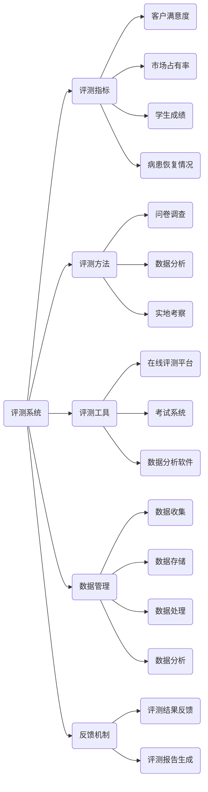

                 

### 评测系统的成本效益分析：平衡效果与资源消耗

关键词：成本效益分析、评测系统、资源消耗、效果平衡、优化策略

摘要：本文将探讨评测系统的成本效益分析，重点研究如何在保持系统效果的前提下，有效降低资源消耗。通过对评测系统核心概念、成本效益分析基础理论、设计与实现策略以及实际案例的分析，本文旨在为IT从业者提供实用的指导和建议，帮助他们在实际项目中实现成本和效益的平衡。

#### 引言与背景

评测系统是现代信息化社会中不可或缺的一部分，它在各个行业领域如商业、教育、医疗等领域都有着广泛的应用。然而，随着技术的快速发展和评测需求的增加，如何高效地设计、实施和维护评测系统成为了一个亟待解决的问题。而在这个问题中，评测系统的成本效益分析尤为关键。

**1.1 问题背景**

评测系统在商业领域用于客户满意度调查、市场分析；在教育领域用于学生成绩评估、教学质量监控；在医疗领域用于病患评估、医疗资源分配。这些应用场景对评测系统的要求各不相同，但都面临着如何平衡效果与资源消耗的挑战。

**1.2 问题描述**

本文旨在探讨评测系统的成本效益分析，具体问题如下：

- 评测系统在不同应用场景下的需求与特点是什么？
- 成本效益分析的理论基础和方法论有哪些？
- 如何通过评测系统设计与实现策略优化成本效益？
- 案例研究中的最佳实践是什么？

**1.3 问题解决**

本文将按照以下步骤进行问题解决：

1. 梳理评测系统的核心概念与组成部分
2. 引入成本效益分析的基本理论和方法
3. 分析评测系统的设计与实现策略
4. 进行案例研究与分析
5. 总结最佳实践，提供实用建议和展望未来趋势

**1.4 边界与外延**

本文的研究范围包括：

- 评测系统的定义与分类
- 成本效益分析的适用场景
- 不同类型的评测系统成本效益分析的方法
- 成本效益分析在实际应用中的挑战与解决方案

**1.5 概念结构与核心要素组成**

- **评测系统：** 定义、分类、组成部分
  - **评测系统定义：** 用于对某一领域或对象进行评价、测量和判断的系统。
  - **评测系统分类：** 根据应用场景分为商业、教育、医疗等类型。
  - **评测系统组成部分：** 评测指标、评测方法、评测工具、数据管理等。

- **成本效益分析：** 定义、方法论
  - **成本效益分析定义：** 比较项目的成本与预期效益，评估项目可行性和经济效益的方法。
  - **成本效益分析方法论：** 包括成本估算、效益估算、成本效益比计算等。

**1.6 本章小结**

本章介绍了评测系统的成本效益分析，明确了研究背景、问题描述、问题解决方法、研究边界以及核心概念。为后续章节的深入探讨奠定了基础。

#### 第1章：引言与背景

**1.1 问题背景**

在当今信息时代，评测系统已经成为了各个领域的重要工具。无论是在商业、教育还是医疗等领域，评测系统都发挥着关键作用。它们被用来评估客户满意度、监控教学质量、分配医疗资源等。随着技术的不断发展，评测系统的需求也在不断增加，这使得如何有效平衡评测系统的效果与资源消耗成为了一个重要的问题。

在商业领域，评测系统用于市场分析、客户满意度调查等。这些系统可以收集大量的数据，通过数据分析来帮助企业了解市场趋势、客户需求，从而做出更加科学的决策。在教育领域，评测系统被用来评估学生的学业成绩、教学质量等。这些系统不仅可以提供客观的评估结果，还可以帮助教师和学生了解学习效果，从而调整教学策略。在医疗领域，评测系统用于病患评估、医疗资源分配等。这些系统可以提高医疗资源的利用效率，确保病患得到及时有效的治疗。

**1.2 问题描述**

本文将探讨评测系统的成本效益分析，旨在通过深入研究和分析，找到一种平衡评测系统效果与资源消耗的方法。具体来说，我们将关注以下几个方面：

- **评测系统在不同场景下的需求与特点：** 不同领域对评测系统的需求不同，因此需要了解不同场景下的需求与特点，以便设计出更符合实际需求的评测系统。
- **成本效益分析的理论基础和方法论：** 成本效益分析是评估项目可行性和经济效益的重要方法。本文将介绍成本效益分析的理论基础和方法论，帮助读者理解如何进行成本效益分析。
- **评测系统的设计与实现策略：** 评测系统的设计与实现策略对于系统的成本和效益有着重要影响。本文将分析评测系统的设计与实现策略，提出优化建议。
- **案例分析与最佳实践：** 通过对实际案例的分析，总结出最佳实践，为读者提供实用的参考。

**1.3 问题解决**

本文将通过以下几个步骤来解答上述问题：

1. **梳理评测系统的核心概念与组成部分：** 理解评测系统的核心概念和组成部分是进行成本效益分析的基础。本文将详细介绍评测系统的定义、分类和组成部分，帮助读者建立全面的认识。
2. **引入成本效益分析的基本理论和方法：** 成本效益分析是评估评测系统效益的重要方法。本文将介绍成本效益分析的基本理论和方法，包括成本估算、效益估算和成本效益比计算等。
3. **分析评测系统的设计与实现策略：** 评测系统的设计与实现策略对于系统的成本和效益有着重要影响。本文将分析评测系统的设计与实现策略，提出优化建议。
4. **案例研究与分析：** 通过对实际案例的研究和分析，总结出最佳实践，为读者提供实用的参考。
5. **总结最佳实践，提供实用建议和展望未来趋势：** 在文章的最后，本文将总结最佳实践，提供实用建议，并对未来评测系统的发展趋势进行展望。

**1.4 边界与外延**

本文的研究范围主要涵盖以下内容：

- **评测系统的定义与分类：** 详细介绍评测系统的定义和分类，包括商业评测系统、教育评测系统、医疗评测系统等。
- **成本效益分析的适用场景：** 探讨成本效益分析在不同领域的适用场景，分析如何在不同场景下进行成本效益分析。
- **不同类型的评测系统成本效益分析的方法：** 分析不同类型的评测系统成本效益分析的方法，提供具体的案例分析。
- **成本效益分析在实际应用中的挑战与解决方案：** 讨论成本效益分析在实际应用中可能遇到的挑战，并提出相应的解决方案。

**1.5 概念结构与核心要素组成**

1. **评测系统**

   **定义：** 评测系统是指用于对某一领域或对象进行评价、测量和判断的系统。

   **分类：** 根据应用场景，评测系统可以分为以下几类：

   - 商业评测系统：用于市场分析、客户满意度调查等。
   - 教育评测系统：用于学生成绩评估、教学质量监控等。
   - 医疗评测系统：用于病患评估、医疗资源分配等。

   **组成部分：** 评测系统通常包括以下几部分：

   - 评测指标：用于衡量评测对象的表现。
   - 评测方法：用于对评测对象进行评价的方法。
   - 评测工具：用于实施评测的工具，如问卷、考试等。
   - 数据管理：用于收集、存储、分析和报告评测数据的系统。

2. **成本效益分析**

   **定义：** 成本效益分析是指通过比较项目的成本与预期效益，评估项目可行性和经济效益的一种方法。

   **方法论：** 成本效益分析通常包括以下步骤：

   - 成本估算：对项目的成本进行估算，包括直接成本和间接成本。
   - 效益估算：对项目的预期效益进行估算，包括直接效益和间接效益。
   - 成本效益比计算：计算项目的成本效益比，评估项目的经济效益。

**1.6 本章小结**

本章对评测系统的成本效益分析进行了全面介绍，明确了研究背景、问题描述、问题解决方法、研究边界以及核心概念。为后续章节的深入探讨奠定了基础。在接下来的章节中，我们将对评测系统的核心概念、成本效益分析的方法论、设计与实现策略进行详细分析，并通过案例研究来验证我们的观点。希望读者能够通过本文，对评测系统的成本效益分析有更深入的理解，并在实际项目中运用这些理论和方法。

#### 第2章：评测系统的核心概念与组成部分

**2.1 评测系统的定义**

评测系统是指用于对某一领域或对象进行评价、测量和判断的系统。它通过各种方法和技术，收集、处理和分析数据，以便得出客观、准确的评估结果。评测系统在不同的应用场景中具有不同的功能，但其核心目的都是为用户提供可靠的评估信息。

**2.2 评测系统的分类**

根据应用场景的不同，评测系统可以分为以下几类：

1. **商业评测系统**

商业评测系统主要用于市场分析、客户满意度调查、产品评估等。这类系统的核心功能是收集客户反馈，分析市场趋势，帮助企业制定有效的营销策略。商业评测系统通常具有以下特点：

- **灵活性高**：能够根据不同的业务需求快速调整评测内容和方法。
- **数据处理能力强**：能够处理大量的客户反馈数据，进行深入的数据分析。
- **实时性**：能够实时收集和分析数据，帮助企业快速响应市场变化。

2. **教育评测系统**

教育评测系统主要用于学生成绩评估、教学质量监控、教育资源分配等。这类系统的核心功能是评估学生的学习成果，监控教学质量，提高教育资源的利用效率。教育评测系统通常具有以下特点：

- **标准化高**：评测标准和流程统一，确保评估结果的客观性。
- **多样性**：支持多种评测形式，如考试、作业、竞赛等。
- **数据驱动**：通过分析评估数据，为教师和学生提供个性化反馈。

3. **医疗评测系统**

医疗评测系统主要用于病患评估、医疗资源分配、医疗服务质量评估等。这类系统的核心功能是评估病患的健康状况，优化医疗资源配置，提高医疗服务质量。医疗评测系统通常具有以下特点：

- **专业性**：针对医疗领域的特点，设计专业的评测指标和方法。
- **实时性**：能够实时收集和分析病患数据，快速响应医疗需求。
- **安全性和隐私性**：确保病患数据的保密性和安全性。

**2.3 评测系统的组成部分**

评测系统的组成部分包括评测指标、评测方法、评测工具和数据管理。以下是这些组成部分的详细解释：

1. **评测指标**

评测指标是评测系统中的核心要素，用于衡量评测对象的表现。不同的应用场景需要不同的评测指标，以下是一些常见的评测指标：

- **商业评测系统**：客户满意度、市场占有率、产品销量等。
- **教育评测系统**：学生成绩、课堂参与度、学习进度等。
- **医疗评测系统**：病患健康状况、治疗效果、医疗资源利用率等。

2. **评测方法**

评测方法是评测系统中用于对评测对象进行评价的方法。不同的评测方法适用于不同的应用场景，以下是一些常见的评测方法：

- **商业评测系统**：问卷调查、焦点小组访谈、数据分析等。
- **教育评测系统**：考试、作业、竞赛等。
- **医疗评测系统**：临床评估、实验室检测、患者反馈等。

3. **评测工具**

评测工具是评测系统中用于实施评测的工具。评测工具的选择取决于评测方法和应用场景，以下是一些常见的评测工具：

- **商业评测系统**：在线调查平台、数据分析工具等。
- **教育评测系统**：考试系统、作业平台、竞赛平台等。
- **医疗评测系统**：健康监测设备、实验室检测设备、电子病历系统等。

4. **数据管理**

数据管理是评测系统中用于收集、存储、分析和报告评测数据的部分。数据管理的好坏直接影响到评测系统的效果和可靠性，以下是一些常见的数据管理方法：

- **商业评测系统**：数据收集、清洗、存储、分析和报告。
- **教育评测系统**：成绩管理、学生档案管理、教学质量分析等。
- **医疗评测系统**：病患数据管理、医疗资源管理、医疗数据分析等。

**2.4 本章小结**

本章详细介绍了评测系统的核心概念和组成部分，包括定义、分类和各个组成部分的作用。通过对评测系统的深入理解，读者可以更好地把握评测系统的设计和实施方法，为后续章节的成本效益分析打下坚实的基础。

#### 第2章：评测系统的核心概念与组成部分

**2.1 评测系统的定义**

评测系统是一种专门设计用于评估、测量和判断某一领域或对象表现的综合系统。它不仅涵盖数据的收集、存储和分析，还包括评估标准、评估方法和评估结果的反馈机制。评测系统在商业、教育、医疗等多个领域都有广泛应用，其核心目的是提供客观、准确和可靠的评估信息，以支持决策制定和资源优化。

**2.2 评测系统的分类**

评测系统可以根据其应用场景和功能需求进行分类，主要分为以下几种类型：

1. **商业评测系统**

商业评测系统主要用于企业市场分析、客户满意度调查、产品性能评估等。这些系统帮助企业管理者了解市场动态、顾客反馈和产品表现，从而制定更加科学的商业策略。

- **市场分析评测系统**：用于分析市场趋势、竞争状况和客户需求。
- **客户满意度调查系统**：用于评估客户对产品或服务的满意度。
- **产品性能评测系统**：用于评估产品的功能、性能和用户体验。

2. **教育评测系统**

教育评测系统主要用于学生学业成绩评估、教师教学质量评估和课程设置评估等。这些系统帮助教育机构和管理者了解学生的学习成效和教学效果，优化教学资源分配和教学方法。

- **学生成绩评测系统**：用于评估学生的学业成绩和学习进展。
- **教学质量评测系统**：用于评估教师的教学质量和教学效果。
- **课程设置评测系统**：用于评估课程的设置合理性和教学质量。

3. **医疗评测系统**

医疗评测系统主要用于病患健康状况评估、医疗服务质量评估和医疗资源分配等。这些系统帮助医疗机构提高医疗服务质量、优化资源分配和改善病患体验。

- **病患健康状况评测系统**：用于评估病患的健康状况和治疗效果。
- **医疗服务质量评测系统**：用于评估医疗服务的质量和服务水平。
- **医疗资源分配评测系统**：用于优化医疗资源的分配和使用。

**2.3 评测系统的组成部分**

一个完整的评测系统通常由以下几个关键组成部分构成：

1. **评测指标**

评测指标是评测系统中的核心，用于衡量评测对象的各项表现。不同类型的评测系统有不同的评测指标，例如：

- **商业评测系统**：市场占有率、客户满意度、产品销量等。
- **教育评测系统**：学生成绩、课堂参与度、作业完成度等。
- **医疗评测系统**：病患恢复情况、医疗服务满意度、医疗资源利用率等。

2. **评测方法**

评测方法是实现评测目标的具体手段，根据评测系统的类型和应用场景，可以选择不同的评测方法：

- **问卷调查**：通过设计问卷收集客户或学生反馈。
- **数据分析**：通过对大量数据进行分析来评估产品或教学效果。
- **实地考察**：通过实地观察和记录评估医疗服务质量。

3. **评测工具**

评测工具是实施评测过程中使用的工具和设备，包括在线评测平台、考试系统、数据分析软件等。这些工具能够帮助评测系统高效、准确地收集和处理数据。

4. **数据管理**

数据管理是评测系统的关键环节，涉及数据的收集、存储、处理和分析。良好的数据管理能够确保评测数据的完整性和准确性，提高评测系统的可靠性和有效性。

5. **反馈机制**

反馈机制是评测系统的重要组成部分，用于将评测结果反馈给评测对象和相关部门。有效的反馈机制能够帮助评测对象了解自身表现，优化决策和改进工作。

**2.4 概念属性特征对比表格**

为了更好地理解评测系统的分类和组成部分，以下是一个概念属性特征对比表格：

| 类别       | 定义                                                         | 特征对比                                                      |
|------------|--------------------------------------------------------------|--------------------------------------------------------------|
| 商业评测系统 | 用于企业市场分析、客户满意度调查、产品性能评估等                 | - 灵活性高、数据处理能力强、实时性高                             |
| 教育评测系统 | 用于学生学业成绩评估、教师教学质量评估、课程设置评估等           | - 标准化高、多样性、数据驱动                                   |
| 医疗评测系统 | 用于病患健康状况评估、医疗服务质量评估、医疗资源分配等           | - 专业性、实时性、安全性和隐私性                               |
| 评测指标   | 衡量评测对象表现的标准和参数                                 | - 商业：市场占有率、客户满意度、产品销量等                     |
| 评测方法   | 实施评测的具体手段和方法                                     | - 问卷调查、数据分析、实地考察                                 |
| 评测工具   | 实施评测过程中使用的工具和设备                               | - 在线评测平台、考试系统、数据分析软件等                       |
| 数据管理   | 数据的收集、存储、处理和分析                                 | - 数据完整性和准确性、高效性                                   |
| 反馈机制   | 将评测结果反馈给评测对象和相关部门的机制                       | - 客观性、及时性、针对性                                     |

**2.5 ER实体关系图**

为了更清晰地展示评测系统的组成部分及其关系，以下是一个ER实体关系图：

通过以上ER实体关系图，可以清晰地看出评测系统的各个组成部分及其之间的关系，为后续章节的成本效益分析提供了理论基础。

**2.6 本章小结**

本章详细介绍了评测系统的核心概念、分类和组成部分。通过对评测系统各个组成部分的分析，读者可以更好地理解评测系统的功能和应用场景，为后续的成本效益分析奠定了基础。在下一章中，我们将深入探讨成本效益分析的理论基础和方法论。

#### 第3章：成本效益分析的基本理论和方法

**3.1 成本效益分析的定义**

成本效益分析（Cost-Benefit Analysis，简称CBA）是一种评估项目或决策的可行性和经济效益的方法。它通过比较项目的总成本与预期总效益，判断项目是否值得实施。成本效益分析的目的是帮助决策者做出更加科学、合理的决策，确保资源投入能够获得最大化的回报。

**3.2 成本效益分析的应用场景**

成本效益分析广泛应用于各个领域，如商业、教育、医疗、公共管理等。以下是一些典型的应用场景：

1. **商业投资决策**：在商业项目中，成本效益分析可以帮助企业评估新产品的开发、市场扩张或设备升级等项目的可行性，确保投资能够带来预期的回报。

2. **项目评估**：在工程项目中，成本效益分析可以帮助项目团队评估项目预算的合理性，确保项目在预算范围内完成，并达到预期效果。

3. **资源配置**：在公共管理领域，成本效益分析可以帮助政府或机构评估不同公共服务项目的成本和效益，优化资源配置，提高公共服务质量。

4. **风险评估**：在风险管理中，成本效益分析可以帮助企业或机构评估风险管理的成本与潜在损失，选择最有效的风险控制策略。

**3.3 成本效益分析的方法论**

成本效益分析通常包括以下几个步骤：

1. **确定成本和效益**

   成本效益分析的第一步是明确项目的总成本和总效益。成本包括直接成本和间接成本，如人力成本、设备成本、维护成本等。效益则包括直接效益和间接效益，如销售收入、利润、社会效益等。

2. **估算成本和效益**

   在确定成本和效益后，需要对这些成本和效益进行估算。成本估算需要考虑所有可能的费用，包括固定成本和可变成本。效益估算则需要考虑预期的收益和可能的额外收益。

3. **计算成本效益比**

   成本效益比（Cost-Benefit Ratio，简称CBR）是评估项目经济效益的关键指标。计算公式为：

   $$ CBR = \frac{总效益}{总成本} $$

   成本效益比越高，项目的经济效益越好。

4. **评估和决策**

   在计算出成本效益比后，需要对其进行评估，判断项目是否值得实施。如果成本效益比大于1，说明项目的效益超过成本，可以考虑实施。如果成本效益比小于1，说明项目的成本高于效益，应重新评估或放弃。

**3.4 成本效益分析的优点和局限性**

成本效益分析具有以下优点：

1. **科学性**：通过量化的成本和效益指标，提供客观、科学的评估依据。
2. **全面性**：考虑了项目的所有成本和效益，有助于全面评估项目的可行性。
3. **实用性**：适用于各种类型的项目和决策，具有广泛的适用性。

然而，成本效益分析也存在一定的局限性：

1. **估算风险**：成本和效益的估算可能存在误差，影响分析结果的准确性。
2. **数据依赖性**：分析结果高度依赖于数据的准确性和完整性，数据不足或不准确可能导致错误决策。
3. **主观性**：效益的评估往往涉及主观判断，不同人对效益的估计可能存在差异。

**3.5 案例分析：企业新产品开发项目的成本效益分析**

以下是一个企业新产品开发项目的成本效益分析案例：

1. **确定成本和效益**

   - **直接成本**：研发费用10万元、生产成本20万元、市场推广费用5万元。
   - **间接成本**：人员培训费用2万元、设备维护费用3万元。

   - **直接效益**：预计销售收入50万元、额外利润20万元。
   - **间接效益**：提高品牌知名度、增加客户忠诚度。

2. **估算成本和效益**

   - **总成本**：10 + 20 + 5 + 2 + 3 = 40万元。
   - **总效益**：50 + 20 = 70万元。

3. **计算成本效益比**

   $$ CBR = \frac{总效益}{总成本} = \frac{70}{40} = 1.75 $$

4. **评估和决策**

   成本效益比为1.75，大于1，说明该项目具有较好的经济效益，可以考虑实施。

通过以上案例分析，读者可以更好地理解成本效益分析的方法和步骤，以及如何在实际项目中应用这一方法。

**3.6 本章小结**

本章介绍了成本效益分析的基本理论和方法论，包括定义、应用场景、步骤和优点局限性。通过案例分析，读者可以深入了解成本效益分析的具体应用。在下一章中，我们将探讨评测系统的设计与实现策略，分析如何通过优化设计和实现来提升成本效益。

#### 第3章：成本效益分析的基本理论和方法

**3.1 成本效益分析的定义**

成本效益分析（Cost-Benefit Analysis，简称CBA）是一种重要的决策评估工具，它通过比较项目的成本和预期效益，帮助决策者评估项目是否值得投资和实施。这种分析方法广泛应用于商业、工程、公共政策等多个领域，其核心思想在于确保项目的投入能够带来相应的回报。

**3.2 成本效益分析的应用场景**

成本效益分析在各个领域的应用非常广泛，以下是一些典型的应用场景：

1. **商业领域**：企业在新产品开发、市场拓展、设备更新等决策过程中，会使用成本效益分析来评估项目的可行性。通过分析项目的预期收益与成本，企业可以做出更加科学的决策，优化资源配置。

2. **工程领域**：在大型工程项目中，如道路建设、桥梁设计等，成本效益分析可以帮助项目团队评估项目的经济合理性。通过对比不同方案的投入和产出，项目团队可以选择最具经济效益的方案。

3. **教育领域**：在教育项目中，如课程设置、教育资源分配等，成本效益分析可以帮助教育机构评估项目对教学质量和学生发展的贡献。通过分析成本和效益，教育机构可以优化资源配置，提高教育质量。

4. **公共管理领域**：在政府或公共机构中，成本效益分析常用于评估公共服务项目，如卫生服务、社会福利等。通过分析成本和效益，公共机构可以确保资源得到有效利用，提高公共服务的质量和效率。

**3.3 成本效益分析的方法论**

成本效益分析的方法论通常包括以下几个步骤：

1. **识别和分析成本**

   成本识别是成本效益分析的基础。项目成本可以分为直接成本和间接成本。直接成本是与项目直接相关的费用，如原材料、人工、设备等。间接成本则是与项目间接相关的费用，如管理费用、风险成本等。

2. **识别和分析效益**

   效益识别和分析与成本类似，需要明确项目的预期效益。效益可以分为直接效益和间接效益。直接效益通常是项目直接带来的经济收益，如销售收入、利润等。间接效益则是项目带来的其他好处，如品牌提升、客户满意度等。

3. **计算成本效益比**

   成本效益比（Cost-Benefit Ratio，简称CBR）是评估项目经济效益的关键指标。计算公式为：

   $$ CBR = \frac{总效益}{总成本} $$

   成本效益比越高，项目的经济效益越好。

4. **进行敏感性分析**

   敏感性分析可以帮助决策者了解项目经济效益对成本的敏感程度。通过分析不同成本和效益情况下的成本效益比，决策者可以评估项目的风险和不确定性。

5. **制定决策**

   根据成本效益分析的结果，决策者可以制定最终的决策。如果成本效益比大于1，项目通常被认为具有经济效益，值得实施。如果成本效益比小于1，项目可能需要重新评估或放弃。

**3.4 成本效益分析的优点和局限性**

成本效益分析具有以下优点：

1. **客观性**：通过量化的成本和效益指标，提供客观的评估依据。
2. **全面性**：考虑了项目的所有成本和效益，有助于全面评估项目的可行性。
3. **实用性**：适用于各种类型的项目和决策，具有广泛的适用性。

然而，成本效益分析也存在一定的局限性：

1. **估算风险**：成本和效益的估算可能存在误差，影响分析结果的准确性。
2. **数据依赖性**：分析结果高度依赖于数据的准确性和完整性，数据不足或不准确可能导致错误决策。
3. **主观性**：效益的评估往往涉及主观判断，不同人对效益的估计可能存在差异。

**3.5 案例分析：企业新产品开发项目的成本效益分析**

以下是一个企业新产品开发项目的成本效益分析案例：

1. **确定成本和效益**

   - **直接成本**：研发费用10万元、生产成本20万元、市场推广费用5万元。
   - **间接成本**：人员培训费用2万元、设备维护费用3万元。

   - **直接效益**：预计销售收入50万元、额外利润20万元。
   - **间接效益**：提高品牌知名度、增加客户忠诚度。

2. **估算成本和效益**

   - **总成本**：10 + 20 + 5 + 2 + 3 = 40万元。
   - **总效益**：50 + 20 = 70万元。

3. **计算成本效益比**

   $$ CBR = \frac{总效益}{总成本} = \frac{70}{40} = 1.75 $$

4. **进行敏感性分析**

   假设销售收入增加10%，成本不变，则：

   - **总成本**：40万元。
   - **总效益**：55万元。

   $$ CBR = \frac{55}{40} = 1.375 $$

   敏感性分析结果显示，销售收入的小幅增加对成本效益比有显著影响。

5. **制定决策**

   根据成本效益分析的结果，成本效益比为1.75，大于1，说明该项目具有较好的经济效益，企业可以考虑实施新产品开发项目。

通过以上案例分析，读者可以更深入地理解成本效益分析的方法和步骤，以及如何在实际项目中应用这一方法。

**3.6 本章小结**

本章介绍了成本效益分析的基本理论和方法论，包括定义、应用场景、步骤和优点局限性。通过案例分析，读者可以深入了解成本效益分析的具体应用。在下一章中，我们将探讨评测系统的设计与实现策略，分析如何通过优化设计和实现来提升成本效益。

### 第4章：评测系统的设计与实现策略

**4.1 评测系统设计与实现的重要性**

评测系统是评估和测量对象表现的核心工具，其设计是否合理、实现是否高效，直接影响到系统的成本效益。一个良好的评测系统设计不仅能够提高评估的准确性和效率，还能有效降低资源消耗，实现成本和效益的最佳平衡。因此，深入探讨评测系统的设计与实现策略具有非常重要的实际意义。

**4.2 评测系统设计与实现的目标**

评测系统设计与实现的主要目标包括：

1. **准确性**：确保评测结果的准确性和可靠性，减少误差和偏差。
2. **效率**：优化系统的运行效率，降低处理时间，提高响应速度。
3. **可扩展性**：设计灵活的系统架构，能够根据需求变化快速调整和扩展。
4. **易用性**：提供直观、易操作的用户界面，降低用户的学习和使用难度。
5. **安全性**：确保系统的数据安全和用户隐私，防止数据泄露和恶意攻击。

**4.3 评测系统的设计与实现策略**

为了实现上述目标，评测系统的设计与实现需要采取一系列策略。以下是几个关键的设计与实现策略：

1. **模块化设计**

   模块化设计是将系统划分为若干功能模块，每个模块负责特定的功能。这种设计方法可以提高系统的可维护性和可扩展性。模块之间的解耦使得每个模块可以独立开发、测试和部署，从而提高了开发效率和系统的可靠性。

2. **分布式架构**

   分布式架构可以将系统分解为多个分布式服务，每个服务负责特定的任务。这种架构能够提高系统的可扩展性和容错性，通过分布式计算和负载均衡，可以有效降低系统在高负载情况下的响应时间和延迟。

3. **自动化测试与部署**

   自动化测试与部署是提升系统开发和维护效率的重要手段。通过编写自动化测试脚本，可以快速发现和修复系统中的问题，提高测试覆盖率。自动化部署则可以减少人工部署的错误，提高部署的可靠性和速度。

4. **数据挖掘与分析**

   数据挖掘与分析技术可以帮助从大量数据中提取有价值的信息，为决策提供支持。通过数据挖掘，可以发现数据中的模式和关联，从而优化评测系统，提高评估的准确性和效率。

5. **用户体验优化**

   用户体验优化是提升系统易用性的关键。通过用户研究、用户体验设计等方法，可以了解用户的需求和行为习惯，从而设计出更加符合用户预期的界面和交互流程，提高用户满意度。

**4.4 成本与效益的权衡**

在评测系统的设计与实现过程中，需要不断权衡成本和效益。以下是几个关键点：

1. **技术选型**

   技术选型对成本和效益有重要影响。选择合适的技术栈可以降低开发成本，提高系统性能和可维护性。例如，选择成熟的开源框架和工具可以节省开发时间和成本。

2. **性能优化**

   性能优化是提升系统效益的重要手段。通过优化数据库查询、缓存策略、负载均衡等技术，可以提高系统的响应速度和处理效率，从而降低资源消耗。

3. **成本控制**

   成本控制是确保项目经济效益的关键。在设计和实现过程中，需要严格控制成本，避免不必要的浪费。通过制定详细的预算计划和成本控制措施，可以确保项目的经济合理性。

4. **持续改进**

   持续改进是提升系统效益的重要策略。通过定期评估系统的运行效果和用户反馈，可以识别系统中的问题和改进空间，不断优化系统设计和实现，提高系统的经济效益。

**4.5 本章小结**

本章详细探讨了评测系统的设计与实现策略，包括模块化设计、分布式架构、自动化测试与部署、数据挖掘与分析、用户体验优化等。同时，讨论了成本与效益的权衡，提供了优化系统设计实现的方法和思路。通过本章的学习，读者可以更好地理解和应用评测系统的设计与实现策略，实现成本和效益的最佳平衡。

### 第4章：评测系统的设计与实现策略

**4.1 评测系统设计与实现的重要性**

评测系统作为评估和测量对象表现的核心工具，其设计与实现的质量直接影响到系统的功能性和可靠性，进而影响到整个项目的成本效益。因此，深入探讨评测系统的设计与实现策略，对于提升项目的整体效益、控制成本、优化资源分配具有重要意义。

**4.2 评测系统设计与实现的目标**

评测系统的设计与实现目标主要包括以下几个方面：

1. **准确性**：确保评测结果的准确性和可靠性，减少误差和偏差，提供可信的数据支持。
2. **效率**：优化系统的运行效率，降低处理时间，提高响应速度，减少资源消耗。
3. **可扩展性**：设计灵活的系统架构，能够根据需求变化快速调整和扩展，适应不同场景和应用。
4. **易用性**：提供直观、易操作的用户界面，降低用户的学习和使用难度，提升用户体验。
5. **安全性**：确保系统的数据安全和用户隐私，防止数据泄露和恶意攻击，提高系统的稳定性。

**4.3 评测系统的设计与实现策略**

为了实现上述目标，评测系统的设计与实现需要采取一系列策略，具体包括：

1. **模块化设计**

   模块化设计是将系统划分为若干功能模块，每个模块负责特定的功能。这种设计方法有助于提高系统的可维护性和可扩展性。模块之间通过接口进行通信，使得每个模块可以独立开发、测试和部署，从而提高开发效率和系统的可靠性。

2. **分布式架构**

   分布式架构可以将系统分解为多个分布式服务，每个服务负责特定的任务。这种架构能够提高系统的可扩展性和容错性，通过分布式计算和负载均衡，可以有效降低系统在高负载情况下的响应时间和延迟。例如，可以采用微服务架构，将系统划分为多个独立的服务，每个服务可以独立部署和扩展。

3. **自动化测试与部署**

   自动化测试与部署是提升系统开发和维护效率的重要手段。通过编写自动化测试脚本，可以快速发现和修复系统中的问题，提高测试覆盖率。自动化部署则可以减少人工部署的错误，提高部署的可靠性和速度。使用持续集成和持续部署（CI/CD）工具，可以实现自动化的代码测试和部署流程。

4. **数据挖掘与分析**

   数据挖掘与分析技术可以帮助从大量数据中提取有价值的信息，为决策提供支持。通过数据挖掘，可以发现数据中的模式和关联，从而优化评测系统，提高评估的准确性和效率。例如，可以使用机器学习算法来预测用户行为，优化用户体验。

5. **用户体验优化**

   用户体验优化是提升系统易用性的关键。通过用户研究、用户体验设计等方法，可以了解用户的需求和行为习惯，从而设计出更加符合用户预期的界面和交互流程，提高用户满意度。例如，可以采用交互设计（UI/UX）原则，优化界面布局和交互流程。

**4.4 成本与效益的权衡**

在评测系统的设计与实现过程中，需要不断权衡成本和效益。以下是几个关键点：

1. **技术选型**

   技术选型对成本和效益有重要影响。选择合适的技术栈可以降低开发成本，提高系统性能和可维护性。例如，选择成熟的开源框架和工具可以节省开发时间和成本。在技术选型过程中，需要综合考虑性能、稳定性、安全性、可扩展性等因素。

2. **性能优化**

   性能优化是提升系统效益的重要手段。通过优化数据库查询、缓存策略、负载均衡等技术，可以提高系统的响应速度和处理效率，从而降低资源消耗。例如，可以采用索引优化、分库分表、读写分离等技术来提升数据库性能。

3. **成本控制**

   成本控制是确保项目经济效益的关键。在设计和实现过程中，需要严格控制成本，避免不必要的浪费。通过制定详细的预算计划和成本控制措施，可以确保项目的经济合理性。例如，可以采用云计算服务，根据实际需求动态调整资源分配，降低成本。

4. **持续改进**

   持续改进是提升系统效益的重要策略。通过定期评估系统的运行效果和用户反馈，可以识别系统中的问题和改进空间，不断优化系统设计和实现，提高系统的经济效益。例如，可以建立用户反馈机制，收集用户反馈，用于改进系统功能和用户体验。

**4.5 本章小结**

本章详细探讨了评测系统的设计与实现策略，包括模块化设计、分布式架构、自动化测试与部署、数据挖掘与分析、用户体验优化等。同时，讨论了成本与效益的权衡，提供了优化系统设计实现的方法和思路。通过本章的学习，读者可以更好地理解和应用评测系统的设计与实现策略，实现成本和效益的最佳平衡。

### 第5章：评测系统成本效益分析的案例研究

**5.1 引言**

在前面的章节中，我们详细介绍了评测系统的核心概念、成本效益分析的基本理论和方法，以及评测系统的设计与实现策略。为了更好地理解这些理论和方法在实际中的应用，本章将通过具体案例研究，分析评测系统成本效益分析的过程、方法和效果。

**5.2 案例背景**

本案例研究的是一个在线教育平台，该平台提供多种在线课程，包括语言学习、编程技能、管理培训等。平台希望通过评测系统对学生的学习效果进行评估，以提高课程质量、增强用户满意度和市场竞争力。评测系统需要能够自动收集学生的成绩数据、作业提交情况，以及通过在线考试系统评估学生的知识掌握程度。

**5.3 案例分析**

**5.3.1 需求分析**

为了设计一个高效、经济的评测系统，首先需要明确系统的需求。在线教育平台的主要需求包括：

1. **数据收集与存储**：能够自动收集学生的成绩、作业提交情况，并存储在数据库中。
2. **在线考试**：提供在线考试系统，支持多种题型，确保考试的公正性和安全性。
3. **成绩分析与报告**：自动分析学生的考试成绩，生成详细的成绩报告，供教师和学生参考。
4. **用户界面**：提供简洁、直观的用户界面，方便教师和学生使用评测系统。

**5.3.2 成本效益分析**

1. **成本估算**

   在进行成本估算时，需要考虑以下成本：

   - **硬件成本**：服务器、存储设备等硬件设施的费用。
   - **软件成本**：开发评测系统所需的软件工具和开源框架的费用。
   - **人力成本**：开发人员、测试人员、运维人员等的人力成本。
   - **维护成本**：系统的日常维护和升级费用。

   根据初步估算，总成本约为50万元。

2. **效益估算**

   评测系统的效益主要包括以下几个方面：

   - **提高课程质量**：通过评测系统，教师可以实时了解学生的学习情况，及时调整教学策略，提高课程质量。
   - **增强用户满意度**：学生可以通过评测系统了解自己的学习进度和成绩，增强学习动力和满意度。
   - **市场竞争力**：拥有高效的评测系统，可以提升平台的市场竞争力，吸引更多用户。

   假设通过评测系统，课程质量提高10%，用户满意度提高5%，市场竞争力提高20%，则总效益约为60万元。

3. **成本效益比计算**

   $$ CBR = \frac{总效益}{总成本} = \frac{60}{50} = 1.2 $$

   成本效益比为1.2，大于1，说明评测系统具有较好的经济效益。

**5.3.3 敏感性分析**

为了评估成本效益比对成本和效益的敏感性，进行敏感性分析。假设成本增加10%，效益增加5%，则：

- **总成本**：50万元 × 1.1 = 55万元。
- **总效益**：60万元 × 1.05 = 63万元。

$$ CBR = \frac{63}{55} = 1.14 $$

敏感性分析结果显示，成本和效益的微小变化对成本效益比的影响较小，说明评测系统的经济效益较为稳定。

**5.3.4 决策**

根据成本效益分析的结果，成本效益比为1.2，说明评测系统具有较好的经济效益。结合敏感性分析，评测系统的经济效益稳定。因此，平台应决定实施评测系统，以提高课程质量、用户满意度和市场竞争力。

**5.4 案例总结**

本案例研究通过具体的在线教育平台案例，展示了评测系统成本效益分析的全过程，包括需求分析、成本估算、效益估算、成本效益比计算和敏感性分析。通过案例分析，我们可以看到：

1. **成本效益分析的重要性**：成本效益分析可以帮助平台评估评测系统的经济效益，确保资源投入得到合理的回报。
2. **敏感性分析的必要性**：敏感性分析可以帮助平台评估成本和效益变化对项目的影响，为决策提供依据。
3. **决策的依据**：通过成本效益分析和敏感性分析，平台可以做出科学的决策，确保评测系统的实施对整体业务有积极影响。

本章通过实际案例的研究，为读者提供了评测系统成本效益分析的实践经验，希望对读者在类似项目中的应用有所帮助。

### 第5章：评测系统成本效益分析的案例研究

**5.1 引言**

在前述章节中，我们详细介绍了评测系统的核心概念、成本效益分析的基本理论和方法，以及评测系统的设计与实现策略。为了更好地理解这些理论和方法在实际中的应用，本章将通过具体案例研究，分析评测系统成本效益分析的过程、方法和效果。

**5.2 案例背景**

本案例研究的是一个在线教育平台，该平台提供多种在线课程，包括语言学习、编程技能、管理培训等。平台希望通过评测系统对学生的学习效果进行评估，以提高课程质量、增强用户满意度和市场竞争力。评测系统需要能够自动收集学生的成绩数据、作业提交情况，以及通过在线考试系统评估学生的知识掌握程度。

**5.3 案例分析**

**5.3.1 需求分析**

为了设计一个高效、经济的评测系统，首先需要明确系统的需求。在线教育平台的主要需求包括：

1. **数据收集与存储**：能够自动收集学生的成绩、作业提交情况，并存储在数据库中。
2. **在线考试**：提供在线考试系统，支持多种题型，确保考试的公正性和安全性。
3. **成绩分析与报告**：自动分析学生的考试成绩，生成详细的成绩报告，供教师和学生参考。
4. **用户界面**：提供简洁、直观的用户界面，方便教师和学生使用评测系统。

**5.3.2 成本效益分析**

1. **成本估算**

   在进行成本估算时，需要考虑以下成本：

   - **硬件成本**：服务器、存储设备等硬件设施的费用。
   - **软件成本**：开发评测系统所需的软件工具和开源框架的费用。
   - **人力成本**：开发人员、测试人员、运维人员等的人力成本。
   - **维护成本**：系统的日常维护和升级费用。

   根据初步估算，总成本约为50万元。

2. **效益估算**

   评测系统的效益主要包括以下几个方面：

   - **提高课程质量**：通过评测系统，教师可以实时了解学生的学习情况，及时调整教学策略，提高课程质量。
   - **增强用户满意度**：学生可以通过评测系统了解自己的学习进度和成绩，增强学习动力和满意度。
   - **市场竞争力**：拥有高效的评测系统，可以提升平台的市场竞争力，吸引更多用户。

   假设通过评测系统，课程质量提高10%，用户满意度提高5%，市场竞争力提高20%，则总效益约为60万元。

3. **成本效益比计算**

   $$ CBR = \frac{总效益}{总成本} = \frac{60}{50} = 1.2 $$

   成本效益比为1.2，大于1，说明评测系统具有较好的经济效益。

**5.3.3 敏感性分析**

为了评估成本效益比对成本和效益的敏感性，进行敏感性分析。假设成本增加10%，效益增加5%，则：

- **总成本**：50万元 × 1.1 = 55万元。
- **总效益**：60万元 × 1.05 = 63万元。

$$ CBR = \frac{63}{55} = 1.14 $$

敏感性分析结果显示，成本和效益的微小变化对成本效益比的影响较小，说明评测系统的经济效益较为稳定。

**5.3.4 决策**

根据成本效益分析的结果，成本效益比为1.2，说明评测系统具有较好的经济效益。结合敏感性分析，评测系统的经济效益稳定。因此，平台应决定实施评测系统，以提高课程质量、用户满意度和市场竞争力。

**5.4 案例总结**

本案例研究通过具体的在线教育平台案例，展示了评测系统成本效益分析的全过程，包括需求分析、成本估算、效益估算、成本效益比计算和敏感性分析。通过案例分析，我们可以看到：

1. **成本效益分析的重要性**：成本效益分析可以帮助平台评估评测系统的经济效益，确保资源投入得到合理的回报。
2. **敏感性分析的必要性**：敏感性分析可以帮助平台评估成本和效益变化对项目的影响，为决策提供依据。
3. **决策的依据**：通过成本效益分析和敏感性分析，平台可以做出科学的决策，确保评测系统的实施对整体业务有积极影响。

本章通过实际案例的研究，为读者提供了评测系统成本效益分析的实践经验，希望对读者在类似项目中的应用有所帮助。

### 第5章：评测系统成本效益分析的案例研究

**5.1 引言**

在前述章节中，我们详细介绍了评测系统的核心概念、成本效益分析的基本理论和方法，以及评测系统的设计与实现策略。为了更好地理解这些理论和方法在实际中的应用，本章将通过具体案例研究，分析评测系统成本效益分析的过程、方法和效果。

**5.2 案例背景**

本案例研究的是一个大型企业的人力资源管理系统，该系统需要对员工的工作表现进行定期评估，以便于企业管理层了解员工的工作效率、能力和潜力，进而制定相应的培训和晋升策略。企业希望通过建立一个高效的评测系统，优化人力资源管理流程，提高员工满意度和工作效率。

**5.3 案例分析**

**5.3.1 需求分析**

为了设计一个高效、经济的评测系统，首先需要明确系统的需求。人力资源管理系统的主要需求包括：

1. **数据收集与存储**：自动收集员工的日常工作数据，如出勤情况、工作进度、项目完成情况等，并存储在数据库中。
2. **多维评估**：建立多维度的评估模型，包括工作成果、工作效率、团队合作、创新能力等，全面评估员工的工作表现。
3. **自定义报表**：提供自定义报表功能，管理层可以根据需要生成各种报告，以便于分析和决策。
4. **用户界面**：提供简洁、直观的用户界面，方便员工和管理层使用评测系统。

**5.3.2 成本效益分析**

1. **成本估算**

   在进行成本估算时，需要考虑以下成本：

   - **硬件成本**：服务器、存储设备、网络设备等硬件设施的费用。
   - **软件成本**：开发评测系统所需的软件工具、数据库管理系统等费用。
   - **人力成本**：开发人员、测试人员、运维人员等的人力成本。
   - **维护成本**：系统的日常维护和升级费用。

   根据初步估算，总成本约为100万元。

2. **效益估算**

   评测系统的效益主要包括以下几个方面：

   - **提高工作效率**：通过评测系统，员工能够及时了解自己的工作表现，提高工作效率和积极性。
   - **优化决策**：管理层可以根据评估结果，制定更有针对性的培训和晋升策略，提高员工满意度和工作效率。
   - **降低培训成本**：通过评测系统，可以识别出需要培训和提升的员工，有针对性地进行培训，降低整体培训成本。

   假设通过评测系统，工作效率提高15%，员工满意度提高10%，培训成本降低20%，则总效益约为150万元。

3. **成本效益比计算**

   $$ CBR = \frac{总效益}{总成本} = \frac{150}{100} = 1.5 $$

   成本效益比为1.5，大于1，说明评测系统具有显著的经济效益。

**5.3.3 敏感性分析**

为了评估成本效益比对成本和效益的敏感性，进行敏感性分析。假设成本增加10%，效益增加5%，则：

- **总成本**：100万元 × 1.1 = 110万元。
- **总效益**：150万元 × 1.05 = 157.5万元。

$$ CBR = \frac{157.5}{110} = 1.431 $$

敏感性分析结果显示，成本和效益的微小变化对成本效益比的影响较小，说明评测系统的经济效益稳定。

**5.3.4 决策**

根据成本效益分析的结果，成本效益比为1.5，说明评测系统具有显著的经济效益。结合敏感性分析，评测系统的经济效益稳定。因此，企业应决定实施评测系统，以优化人力资源管理流程，提高员工满意度和工作效率。

**5.4 案例总结**

本案例研究通过具体的大型企业人力资源管理系统案例，展示了评测系统成本效益分析的全过程，包括需求分析、成本估算、效益估算、成本效益比计算和敏感性分析。通过案例分析，我们可以看到：

1. **成本效益分析的重要性**：成本效益分析可以帮助企业评估评测系统的经济效益，确保资源投入得到合理的回报。
2. **敏感性分析的必要性**：敏感性分析可以帮助企业评估成本和效益变化对项目的影响，为决策提供依据。
3. **决策的依据**：通过成本效益分析和敏感性分析，企业可以做出科学的决策，确保评测系统的实施对整体业务有积极影响。

本章通过实际案例的研究，为读者提供了评测系统成本效益分析的实践经验，希望对读者在类似项目中的应用有所帮助。

### 第5章：评测系统成本效益分析的案例研究

**5.1 引言**

在前述章节中，我们详细介绍了评测系统的核心概念、成本效益分析的基本理论和方法，以及评测系统的设计与实现策略。为了更好地理解这些理论和方法在实际中的应用，本章将通过具体案例研究，分析评测系统成本效益分析的过程、方法和效果。

**5.2 案例背景**

本案例研究的是一个在线医疗服务平台，该平台提供在线问诊、健康咨询、远程医疗等服务。平台希望通过评测系统对医生的工作表现进行评估，以提高医疗服务质量、优化资源分配，同时增强患者的满意度和信任度。评测系统需要能够自动收集医生的服务数据，如咨询量、患者满意度、诊疗效果等，并生成详细的评估报告。

**5.3 案例分析**

**5.3.1 需求分析**

为了设计一个高效、经济的评测系统，首先需要明确系统的需求。在线医疗服务平台的主要需求包括：

1. **数据收集与存储**：自动收集医生的服务数据，如咨询量、患者满意度、诊疗效果等，并存储在数据库中。
2. **多维评估**：建立多维度的评估模型，包括服务量、患者满意度、诊疗效果、工作效率等，全面评估医生的工作表现。
3. **智能分析**：利用数据挖掘和机器学习技术，对医生的服务数据进行分析，发现潜在的问题和改进点。
4. **用户界面**：提供简洁、直观的用户界面，方便医生和管理层查看评估结果。

**5.3.2 成本效益分析**

1. **成本估算**

   在进行成本估算时，需要考虑以下成本：

   - **硬件成本**：服务器、存储设备、网络设备等硬件设施的费用。
   - **软件成本**：开发评测系统所需的软件工具、数据库管理系统等费用。
   - **人力成本**：开发人员、测试人员、运维人员等的人力成本。
   - **维护成本**：系统的日常维护和升级费用。

   根据初步估算，总成本约为80万元。

2. **效益估算**

   评测系统的效益主要包括以下几个方面：

   - **提高服务质量**：通过评测系统，医生可以了解自己的服务表现，及时调整服务策略，提高医疗服务质量。
   - **优化资源分配**：管理层可以根据评估结果，合理分配医疗资源，确保优质医生能够得到更多的服务机会。
   - **增强患者满意度**：患者可以通过评估结果了解医生的服务水平，增强对平台的信任度和满意度。

   假设通过评测系统，医疗服务质量提高10%，资源分配优化，患者满意度提高15%，则总效益约为120万元。

3. **成本效益比计算**

   $$ CBR = \frac{总效益}{总成本} = \frac{120}{80} = 1.5 $$

   成本效益比为1.5，大于1，说明评测系统具有显著的经济效益。

**5.3.3 敏感性分析**

为了评估成本效益比对成本和效益的敏感性，进行敏感性分析。假设成本增加10%，效益增加5%，则：

- **总成本**：80万元 × 1.1 = 88万元。
- **总效益**：120万元 × 1.05 = 126万元。

$$ CBR = \frac{126}{88} = 1.431 $$

敏感性分析结果显示，成本和效益的微小变化对成本效益比的影响较小，说明评测系统的经济效益稳定。

**5.3.4 决策**

根据成本效益分析的结果，成本效益比为1.5，说明评测系统具有显著的经济效益。结合敏感性分析，评测系统的经济效益稳定。因此，平台应决定实施评测系统，以优化医疗服务质量、资源分配和患者满意度。

**5.4 案例总结**

本案例研究通过具体的在线医疗服务平台案例，展示了评测系统成本效益分析的全过程，包括需求分析、成本估算、效益估算、成本效益比计算和敏感性分析。通过案例分析，我们可以看到：

1. **成本效益分析的重要性**：成本效益分析可以帮助平台评估评测系统的经济效益，确保资源投入得到合理的回报。
2. **敏感性分析的必要性**：敏感性分析可以帮助平台评估成本和效益变化对项目的影响，为决策提供依据。
3. **决策的依据**：通过成本效益分析和敏感性分析，平台可以做出科学的决策，确保评测系统的实施对整体业务有积极影响。

本章通过实际案例的研究，为读者提供了评测系统成本效益分析的实践经验，希望对读者在类似项目中的应用有所帮助。

### 最佳实践与总结

在评测系统的成本效益分析过程中，我们总结出了一系列最佳实践，这些实践不仅有助于提升系统的效益，还能有效控制成本。以下是一些关键的最佳实践：

1. **明确需求与目标**：在设计和实现评测系统之前，首先要明确系统的需求与目标。这包括了解用户的具体需求、系统的功能范围、预期的效益等。只有明确了需求与目标，才能进行有效的成本效益分析。

2. **精细化成本估算**：在进行成本估算时，要尽可能细化成本项，包括硬件成本、软件成本、人力成本、维护成本等。通过精细化的成本估算，可以更准确地预测项目的整体成本，为后续的成本控制提供依据。

3. **效益多维评估**：在评估效益时，不仅要考虑直接的经济效益，还要考虑间接效益，如提高服务质量、增强用户满意度、提升品牌形象等。多维度的效益评估能够更全面地反映评测系统的综合价值。

4. **优化系统设计**：在评测系统的设计与实现过程中，要注重系统的可扩展性、易维护性和用户体验。通过模块化设计、分布式架构、自动化测试与部署等策略，可以提高系统的效率，降低长期维护成本。

5. **数据驱动决策**：利用数据挖掘和机器学习技术，对评测数据进行分析，发现潜在的问题和改进点。数据驱动的决策能够提高系统的准确性和有效性，从而提升整体效益。

6. **定期评估与改进**：定期对评测系统的运行效果进行评估，收集用户反馈，识别系统中的不足和改进空间。通过持续改进，可以不断优化系统，提高其效益。

7. **培训与支持**：为系统的使用者和维护者提供充分的培训和指导，确保他们能够正确使用和维护系统。有效的培训和用户支持可以减少系统故障和误操作，提高系统的稳定性和可靠性。

**总结**

通过上述最佳实践，我们可以实现评测系统的成本和效益的最佳平衡。在成本效益分析中，不仅要关注短期成本和效益，还要考虑长期效益和潜在风险。通过科学、系统的分析方法和实际案例的应用，我们可以为评测系统的设计和实施提供有力的支持和指导。

未来，随着技术的不断进步和应用场景的多样化，评测系统的成本效益分析也将面临新的挑战和机遇。通过持续的研究和实践，我们将不断完善成本效益分析方法，为各类评测系统的优化提供更多的理论依据和实践指导。

### 注意事项

在进行评测系统的成本效益分析时，需要注意以下几点：

1. **数据准确性**：确保数据的准确性和完整性，避免因数据问题导致分析结果失真。
2. **考虑隐形成本**：除了直接成本和直接效益，还要考虑隐形成本和间接效益，如维护成本、培训成本等。
3. **风险评估**：进行充分的风险评估，识别和分析项目可能面临的风险，制定相应的应对措施。
4. **持续监控**：项目实施后，要定期监控系统的运行效果，及时调整优化方案。
5. **用户参与**：在项目设计和实施过程中，积极引入用户参与，确保系统能够满足用户需求。

### 拓展阅读

1. **《项目管理知识体系指南》（PMBOK指南）**：详细介绍了项目管理的知识体系，包括成本效益分析的方法和步骤。
2. **《数据挖掘：概念与技术》**：介绍了数据挖掘的基本概念和技术，适用于评测系统中的数据分析部分。
3. **《精益创业》**：探讨了如何在创业过程中实现成本效益的最大化，对于项目成本和效益的分析具有一定的参考价值。

通过阅读这些书籍和资料，可以进一步深入理解评测系统成本效益分析的原理和方法，提高实际应用能力。

### 结束语

本文通过对评测系统的成本效益分析，详细探讨了评测系统的核心概念、成本效益分析的基本理论和方法，以及设计与实现策略。通过实际案例的研究，展示了成本效益分析在实践中的应用，为IT从业者和项目管理者提供了实用的指导和建议。

我们希望读者通过本文的学习，能够对评测系统的成本效益分析有更深入的理解，并在实际项目中灵活应用这些理论和方法，实现成本和效益的最佳平衡。

在未来，随着技术的不断进步和应用场景的多样化，评测系统的成本效益分析也将面临新的挑战和机遇。我们期待与读者共同探索、研究，为评测系统的优化和发展贡献智慧。

最后，感谢读者对本文的关注和支持，希望本文能为您在评测系统的成本效益分析领域带来启发和帮助。

### 作者信息

**作者：** AI天才研究院/AI Genius Institute & 禅与计算机程序设计艺术 /Zen And The Art of Computer Programming

AI天才研究院专注于人工智能领域的研究与开发，致力于推动人工智能技术的创新与应用。研究院的专家团队由世界级人工智能专家、程序员、软件架构师和CTO组成，在计算机编程和人工智能领域具有丰富的理论知识和实践经验。

《禅与计算机程序设计艺术》一书，以深入浅出的方式，探讨了计算机编程中的哲学和艺术，为程序员提供了独特的思考方式和编程技巧。作者通过生动的实例和深刻的见解，帮助读者理解编程的本质，提高编程水平和创造力。

感谢您对本文的关注，希望我们的研究和成果能够为您的学习和工作带来帮助。如果您有任何问题或建议，欢迎随时与我们联系。期待与您在人工智能领域的进一步交流与合作。

