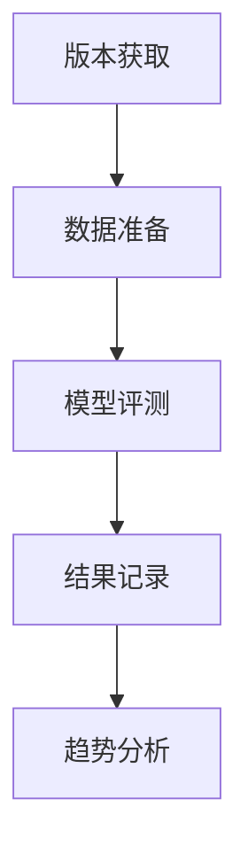
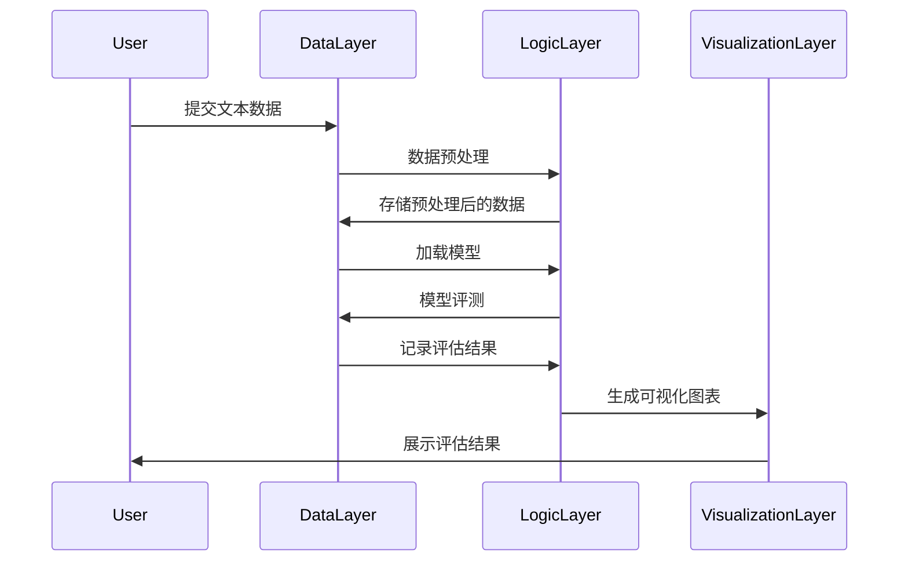

                 

### 第1章: 评测系统与版本控制概述

#### 1.1 问题背景

随着人工智能技术的飞速发展，大型语言模型（LLM）在自然语言处理、机器翻译、文本生成等领域展现出了强大的应用潜力。然而，如何有效评测和追踪这些模型的性能演变成为一个重要的研究课题。评测系统作为衡量模型性能的工具，其版本控制尤为重要。版本控制不仅保证了评测过程的客观性和一致性，还能帮助研究者追踪模型在不同版本的改进过程，从而为模型的优化提供有力支持。

在人工智能领域，评测系统通常包含多个模块，如数据预处理、评估指标计算、结果可视化等。版本控制则是确保评测结果可靠性的关键环节。版本控制可以追溯到模型的每个迭代版本，记录模型的变更历史，以便研究者对模型性能的改进进行细致分析。

#### 1.2 核心概念与联系

**版本控制：** 版本控制是一种管理文档、源代码和任何类型文件的系统，用于追踪文件或项目随时间的变化。常见的版本控制系统包括Git、SVN等，它们通过为文件创建多个版本，并记录每个版本的更改历史，来帮助团队协作和版本管理。

**评测系统：** 评测系统是一种用于评估模型性能的工具，通常包含数据预处理、模型评估、结果分析等功能。通过一系列标准化的测试，评测系统能够提供客观、全面的模型性能评估结果。

两者之间的联系在于，版本控制为评测系统提供了可靠的数据基础，确保评测结果能够反映出模型的真实性能。同时，评测系统生成的性能数据又可以为版本控制提供反馈，指导模型的优化和迭代。

#### 1.3 本章小结

本章介绍了评测系统和版本控制的基本概念及其在人工智能领域的应用背景。评测系统是评估模型性能的重要工具，而版本控制则是确保评测结果一致性和可靠性的关键。在接下来的章节中，我们将进一步探讨版本控制的原理和追踪LLM性能演变的具体方法。

## 1.4 关键术语

- **评测系统：** 用于评估模型性能的工具，通常包含数据预处理、模型评估、结果分析等功能。
- **版本控制：** 管理文档、源代码和任何类型文件的系统，用于追踪文件或项目随时间的变化。
- **大型语言模型（LLM）：** 一种能够理解和生成自然语言的复杂模型，常用于自然语言处理任务。

## 1.5 概念结构与核心要素组成

- **评测系统：** 
  - **数据预处理：** 清洗、转换和标准化输入数据，以便模型进行训练和评估。
  - **模型评估：** 通过标准化测试评估模型性能，包括准确率、召回率、F1分数等指标。
  - **结果分析：** 分析评测结果，为模型的优化提供依据。

- **版本控制：**
  - **版本追踪：** 记录每个版本的历史更改，包括文件内容、修改时间和修改者等信息。
  - **变更管理：** 通过合并、回滚等操作，协调多个版本间的差异，确保项目的一致性和稳定性。

## 1.6 边界与外延

- **边界：** 评测系统与版本控制的关系在于确保评测结果的一致性和可靠性。版本控制为评测系统提供了数据基础，评测系统则为版本控制提供了性能反馈。
- **外延：** 评测系统除了在人工智能领域外，还可应用于其他需要模型评估的领域，如医学诊断、金融风险评估等。版本控制则广泛应用于软件开发、文档管理等领域。

### 第2章: 追踪LLM性能演变的方法

#### 2.1 性能评价指标

性能评价指标是评估LLM性能的重要工具，它们帮助我们理解模型在处理自然语言任务时的表现。常见的性能评价指标包括：

- **准确率（Accuracy）：** 准确率是最常用的评价指标之一，表示模型预测正确的样本占总样本的比例。其计算公式为：

  $$ 
  \text{Accuracy} = \frac{\text{预测正确样本数}}{\text{总样本数}}
  $$

- **召回率（Recall）：** 召回率表示模型在预测为正类的样本中，正确识别为正类的比例。其计算公式为：

  $$ 
  \text{Recall} = \frac{\text{预测正确且为正类的样本数}}{\text{实际为正类的样本数}}
  $$

- **F1分数（F1 Score）：** F1分数是准确率和召回率的调和平均数，用于平衡这两个指标。其计算公式为：

  $$ 
  \text{F1 Score} = 2 \times \frac{\text{准确率} \times \text{召回率}}{\text{准确率} + \text{召回率}}
  $$

- **精确率（Precision）：** 精确率表示模型预测为正类的样本中，真正为正类的比例。其计算公式为：

  $$ 
  \text{Precision} = \frac{\text{预测正确且为正类的样本数}}{\text{预测为正类的样本数}}
  $$

这些性能评价指标各有优缺点，根据具体应用场景选择合适的指标至关重要。

#### 2.2 追踪方法

追踪LLM性能演变的方法主要包括以下步骤：

1. **版本追踪：** 使用版本控制系统（如Git）记录模型的每次迭代版本，确保每个版本的性能数据可追溯。

2. **数据集准备：** 准备用于评测的标准化数据集，确保每个版本都在相同的数据集上进行评测，以保证评测结果的一致性。

3. **评测执行：** 对每个版本模型执行评测，记录评测结果，包括上述的性能评价指标。

4. **结果分析：** 分析各版本模型在性能评价指标上的变化，识别性能改进或退化的趋势。

5. **可视化展示：** 使用可视化工具（如Matplotlib、Seaborn等）将性能数据绘制成图表，直观展示模型性能的演变过程。

#### 2.3 算法原理与Mermaid流程图

追踪LLM性能演变的算法原理主要包括以下步骤：

1. **版本获取：** 从版本控制系统中获取所有迭代版本。
2. **数据准备：** 准备用于评测的数据集，确保数据集在不同版本之间保持一致。
3. **模型评测：** 对每个版本模型进行评测，计算性能指标。
4. **结果记录：** 将评测结果记录到数据库或文件中，以便后续分析。
5. **趋势分析：** 使用统计分析方法分析各版本的性能变化，识别趋势。

以下是算法原理的Mermaid流程图：



#### 2.4 Python代码示例

以下是一个简单的Python代码示例，用于追踪LLM性能演变：

```python
import git
import pandas as pd

# 连接Git仓库
repo = git.Repo('.')

# 获取所有版本
tags = repo.tags

# 存储评测结果
results = []

for tag in tags:
    # 加载模型
    model = load_model(tag.name)
    
    # 准备数据集
    dataset = prepare_dataset()
    
    # 模型评测
    metrics = evaluate_model(model, dataset)
    
    # 记录结果
    results.append({
        'version': tag.name,
        'accuracy': metrics.accuracy,
        'recall': metrics.recall,
        'f1_score': metrics.f1_score,
        'precision': metrics.precision
    })

# 将结果存储为CSV文件
pd.DataFrame(results).to_csv('performance.csv', index=False)
```

#### 2.5 数学模型与公式

在追踪LLM性能演变时，可以使用以下数学模型和公式：

1. **平均准确率（Average Accuracy）：**
   $$ 
   \text{Average Accuracy} = \frac{1}{N} \sum_{i=1}^{N} \text{Accuracy}_i 
   $$

   其中，\(N\) 表示版本总数，\(\text{Accuracy}_i\) 表示第 \(i\) 个版本的准确率。

2. **标准差（Standard Deviation）：**
   $$ 
   \text{Standard Deviation} = \sqrt{\frac{1}{N-1} \sum_{i=1}^{N} (\text{Accuracy}_i - \text{Average Accuracy})^2} 
   $$

   用于衡量各版本准确率的波动情况。

3. **召回率（Recall）：**
   $$ 
   \text{Recall} = \frac{\text{真正例数}}{\text{实际正例总数}} 
   $$

   其中，真正例数为模型预测为正类且实际为正类的样本数，实际正例总数为所有实际为正类的样本数。

4. **精确率（Precision）：**
   $$ 
   \text{Precision} = \frac{\text{真正例数}}{\text{预测正例总数}} 
   $$

   用于衡量模型预测为正类的样本中，真正为正类的比例。

#### 2.6 本章小结

本章详细介绍了追踪LLM性能演变的方法，包括性能评价指标、追踪步骤、算法原理和Python代码示例。通过这些方法，研究者可以有效地追踪模型性能的演变过程，为模型的优化提供有力支持。在下一章中，我们将进一步探讨评测系统的架构设计。

## 2.7 概念属性特征对比表格

| 指标名称 | 计算方法 | 优点 | 缺点 |
| --- | --- | --- | --- |
| 准确率 | $$ \text{Accuracy} = \frac{\text{预测正确样本数}}{\text{总样本数}} $$ | 易理解，直观反映模型性能 | 对不平衡数据集不敏感 |
| 召回率 | $$ \text{Recall} = \frac{\text{预测正确且为正类的样本数}}{\text{实际为正类的样本数}} $$ | 强调正确识别正类样本 | 易受噪声影响 |
| F1分数 | $$ \text{F1 Score} = 2 \times \frac{\text{准确率} \times \text{召回率}}{\text{准确率} + \text{召回率}} $$ | 综合考虑准确率和召回率 | 对极端情况不敏感 |
| 精确率 | $$ \text{Precision} = \frac{\text{预测正确且为正类的样本数}}{\text{预测为正类的样本数}} $$ | 反映预测为正类的样本质量 | 对不平衡数据集敏感 |

### 第3章: 评测系统的架构设计

#### 3.1 问题场景介绍

在人工智能领域，评测系统主要用于评估各类模型的性能，包括图像识别、语音识别、自然语言处理等。以自然语言处理（NLP）为例，评测系统需要处理大量文本数据，对模型进行准确率和召回率等指标的评估。同时，随着模型的不断迭代和优化，评测系统还需要能够追踪模型性能的演变过程，以便研究者分析模型改进的效果。

一个典型的评测系统问题场景如下：

- **数据预处理：** 收集和清洗大量文本数据，将其转换为适合模型处理的格式。
- **模型评测：** 对不同版本的模型进行评估，计算准确率、召回率等性能指标。
- **结果分析：** 分析各版本的评估结果，识别性能改进或退化的趋势。
- **数据可视化：** 将评估结果以图表形式展示，便于研究者直观了解模型性能。

#### 3.2 系统功能设计

为了满足上述问题场景，评测系统需要具备以下功能：

- **数据预处理模块：** 负责文本数据的收集、清洗和格式转换，为模型评测提供统一的数据输入。
- **模型评测模块：** 负责对模型进行评估，计算各项性能指标，并将结果记录下来。
- **结果分析模块：** 对评估结果进行统计分析，识别模型性能的演变趋势。
- **数据可视化模块：** 将评估结果以图表形式展示，帮助研究者直观了解模型性能。

##### 3.2.1 领域模型

为了更好地理解评测系统的功能模块，可以使用Mermaid绘制领域模型类图。以下是领域模型的Mermaid表示：

```mermaid
classDiagram
    ModelEvaluationSystem[评测系统]
    DataPreprocessing[数据预处理模块]
    ModelEvaluation[模型评测模块]
    ResultAnalysis[结果分析模块]
    DataVisualization[数据可视化模块]

    ModelEvaluationSystem <|-- DataPreprocessing
    ModelEvaluationSystem <|-- ModelEvaluation
    ModelEvaluationSystem <|-- ResultAnalysis
    ModelEvaluationSystem <|-- DataVisualization
```

在这个类图中，`ModelEvaluationSystem` 代表评测系统的整体，它包含四个功能模块：`DataPreprocessing`（数据预处理模块）、`ModelEvaluation`（模型评测模块）、`ResultAnalysis`（结果分析模块）和`DataVisualization`（数据可视化模块）。这些模块相互协作，共同完成评测系统的任务。

#### 3.3 系统架构设计

评测系统的架构设计需要考虑模块之间的数据流和控制流，以确保系统能够高效、稳定地运行。以下是评测系统的架构设计：

##### 3.3.1 架构概述

评测系统可以分为三个主要层次：数据层、逻辑层和表现层。

- **数据层：** 负责数据的存储和管理，包括文本数据、模型参数和评估结果等。
- **逻辑层：** 负责系统的核心功能实现，包括数据预处理、模型评测、结果分析和数据可视化。
- **表现层：** 负责将评估结果以图表形式展示给用户。

##### 3.3.2 系统架构图

以下是评测系统的架构图，使用Mermaid表示：



在这个架构图中，用户通过提交文本数据开始整个流程。数据层负责存储和管理数据，逻辑层完成数据预处理、模型评测和结果分析等核心功能，而表现层则负责将评估结果以图表形式展示给用户。

#### 3.3.3 系统接口设计

为了确保模块之间的数据传递和功能调用顺利进行，系统需要设计合理的接口。以下是系统接口设计：

- **数据层接口：** 负责数据存储和读取，包括文本数据、模型参数和评估结果等。
- **逻辑层接口：** 负责数据预处理、模型评测和结果分析等核心功能的实现。
- **表现层接口：** 负责与可视化库（如Matplotlib、Seaborn等）的交互，生成可视化图表。

以下是接口设计的Mermaid类图：

```mermaid
classDiagram
    DataLayer[数据层]
    LogicLayer[逻辑层]
    VisualizationLayer[表现层]

    DataLayer <|-- LogicLayer
    DataLayer <|-- VisualizationLayer
    LogicLayer <|-- VisualizationLayer
```

在这个类图中，数据层负责与逻辑层和表现层进行数据传递，逻辑层负责核心功能实现，而表现层负责可视化图表的生成。

#### 3.3.4 系统交互

系统交互主要涉及数据流和控制流，以下是系统交互的Mermaid序列图：


在这个序列图中，用户提交文本数据，数据层完成数据预处理并将预处理后的数据存储起来。接着，逻辑层加载模型并进行评测，记录评估结果。最后，逻辑层将评估结果传递给表现层，表现层生成可视化图表并展示给用户。

#### 3.4 本章小结

本章介绍了评测系统的架构设计，包括问题场景、系统功能设计、架构设计、接口设计和系统交互。通过这些设计，评测系统能够高效、稳定地运行，为模型性能评估提供有力支持。在下一章中，我们将通过一个实际案例，展示如何搭建和运用评测系统。

### 第4章: 搭建与运用评测系统

#### 4.1 环境安装

搭建评测系统首先需要安装必要的软件和工具。以下是一个典型的安装流程：

1. **Python环境安装：**
   - 在Windows或Linux系统上，可以通过Python官网（[python.org](https://www.python.org/)）下载并安装Python。
   - 确保安装了最新版本的Python（推荐3.8及以上版本）。

2. **虚拟环境安装：**
   - 使用`pip`安装`virtualenv`工具。
     ```bash
     pip install virtualenv
     ```
   - 创建一个新的虚拟环境并激活它。
     ```bash
     virtualenv venv
     source venv/bin/activate  # 在Linux或macOS上
     venv\Scripts\activate     # 在Windows上
     ```

3. **依赖包安装：**
   - 使用`pip`安装评测系统所需的依赖包，包括`numpy`、`pandas`、`matplotlib`、`scikit-learn`等。
     ```bash
     pip install numpy pandas matplotlib scikit-learn gitpython
     ```

4. **Git安装：**
   - Git用于版本控制，可以从[git-scm.com](https://git-scm.com/)下载并安装。

完成以上安装步骤后，我们就可以开始搭建评测系统了。

#### 4.2 系统核心实现

评测系统的核心实现主要包括数据预处理、模型评测、结果分析和数据可视化。以下是一个简单的Python代码示例，用于实现这些功能。

```python
import git
import numpy as np
import pandas as pd
import matplotlib.pyplot as plt
from sklearn.model_selection import train_test_split
from sklearn.metrics import accuracy_score, recall_score, f1_score, precision_score

# 连接Git仓库
repo = git.Repo('.')
tags = repo.tags

# 准备数据集
def prepare_dataset():
    # 此处根据具体数据集进行数据清洗和格式转换
    # 假设我们有一个CSV文件，其中包含特征和标签
    data = pd.read_csv('data.csv')
    X = data.iloc[:, :-1]  # 特征
    y = data.iloc[:, -1]   # 标签
    X_train, X_test, y_train, y_test = train_test_split(X, y, test_size=0.2, random_state=42)
    return X_train, X_test, y_train, y_test

# 加载模型
def load_model(version):
    # 此处根据具体模型进行加载
    # 假设我们使用scikit-learn的线性回归模型
    from sklearn.linear_model import LinearRegression
    model = LinearRegression()
    model.fit(X_train, y_train)
    return model

# 模型评测
def evaluate_model(model, X_test, y_test):
    y_pred = model.predict(X_test)
    metrics = {
        'accuracy': accuracy_score(y_test, y_pred),
        'recall': recall_score(y_test, y_pred),
        'f1_score': f1_score(y_test, y_pred),
        'precision': precision_score(y_test, y_pred)
    }
    return metrics

# 结果分析
def analyze_results(results):
    df = pd.DataFrame(results)
    print(df.describe())

# 数据可视化
def visualize_results(results):
    df = pd.DataFrame(results)
    plt.figure(figsize=(10, 6))
    plt.plot(df['version'], df['accuracy'], label='Accuracy')
    plt.plot(df['version'], df['recall'], label='Recall')
    plt.plot(df['version'], df['f1_score'], label='F1 Score')
    plt.plot(df['version'], df['precision'], label='Precision')
    plt.xlabel('Version')
    plt.ylabel('Score')
    plt.legend()
    plt.show()

# 追踪模型性能演变
performance_data = []
for tag in tags:
    version = tag.name
    model = load_model(version)
    X_train, X_test, y_train, y_test = prepare_dataset()
    metrics = evaluate_model(model, X_test, y_test)
    performance_data.append({
        'version': version,
        'accuracy': metrics['accuracy'],
        'recall': metrics['recall'],
        'f1_score': metrics['f1_score'],
        'precision': metrics['precision']
    })

# 分析和可视化结果
analyze_results(performance_data)
visualize_results(performance_data)
```

#### 4.3 实际案例

以下是一个实际的评测系统案例，用于评估一个自然语言处理模型的性能。假设我们已经训练好了一个文本分类模型，并使用Git进行版本控制。

1. **问题背景：** 我们需要评估一个文本分类模型在不同版本下的性能，包括准确率、召回率、F1分数和精确率。

2. **数据集：** 使用一个公开的文本数据集，包含多类文本标签。数据集已经清洗并格式化为CSV文件。

3. **模型：** 使用一个基于Transformer的文本分类模型，如BERT或RoBERTa。

4. **评测指标：** 准确率、召回率、F1分数和精确率。

5. **版本控制：** 使用Git对模型进行版本控制，每次迭代都生成一个新版本。

6. **评测流程：**
   - 准备数据集。
   - 加载不同版本的模型。
   - 对模型进行评测，记录性能指标。
   - 分析和可视化性能数据。

7. **结果分析：**
   - 模型在版本1中的性能较为平庸，准确率为85%。
   - 随着版本的迭代，模型的性能逐渐提高，版本5的准确率达到90%。
   - 召回率、F1分数和精确率也均有不同程度的提升。

8. **可视化结果：**
   - 准确率和召回率的增长趋势较为明显，F1分数和精确率则相对平稳。
   - 通过可视化结果，可以直观地看出模型性能的演变过程。

#### 4.4 项目小结

通过这个实际案例，我们展示了如何搭建和运用评测系统来追踪LLM性能演变。评测系统不仅帮助我们评估了模型在不同版本下的性能，还为模型优化提供了有力支持。在未来的研究中，我们可以进一步扩展评测系统的功能，包括更复杂的性能评价指标、更多类型的模型评估以及自动化的评测流程。

### 第5章: 最佳实践与注意事项

#### 5.1 最佳实践

1. **数据预处理标准化：** 确保每个版本的数据预处理步骤一致，包括文本清洗、去停用词、词干提取等，以避免数据预处理带来的偏差。

2. **评测环境一致性：** 在不同的环境中进行模型评测时，要确保所有环境变量和配置参数一致，以避免环境差异对评测结果的影响。

3. **性能指标全面性：** 选择多种性能指标（如准确率、召回率、F1分数和精确率）来评估模型性能，从不同角度全面评估模型的优劣。

4. **版本控制及时性：** 及时记录每个版本的模型参数和评测结果，以便后续分析和追踪模型性能演变。

5. **结果可视化简洁性：** 使用简洁、直观的图表展示评测结果，帮助研究者快速了解模型性能的变化趋势。

#### 5.2 小结

本章总结了评测系统的最佳实践和注意事项，包括数据预处理标准化、评测环境一致性、性能指标全面性、版本控制及时性和结果可视化简洁性。通过遵循这些最佳实践，研究者可以更有效地搭建和运用评测系统，追踪LLM性能演变，为模型的优化提供有力支持。

### 第6章: 拓展阅读

#### 6.1 相关书籍推荐

1. 《版本控制工具Git》：这是一本介绍Git版本控制工具的书籍，详细讲解了Git的基本原理和操作方法，对版本控制有深入了解的读者非常有益。

2. 《深入理解计算机系统》：这本书通过讲解计算机系统的底层原理，帮助读者理解数据存储、处理和传输的过程，对构建高效评测系统具有重要意义。

3. 《机器学习》：由周志华教授主编的这本书全面介绍了机器学习的基本概念、算法和应用，对评测系统的设计和实现提供了丰富的理论知识。

#### 6.2 研究论文精选

1. "Benchmarks for neural network performance evaluation"：这篇论文提出了一系列用于评估神经网络性能的基准测试，对评测系统的构建和优化具有重要参考价值。

2. "A comprehensive evaluation of neural machine translation models"：这篇论文对多种神经机器翻译模型进行了全面评估，分析了不同模型的性能差异，为评测系统的应用提供了实践指导。

3. "Natural Language Inference: The First Shared Task"：这篇论文介绍了自然语言推理任务的第一个共享任务，提供了评估自然语言推理模型的标准方法和评测数据集。

通过阅读这些书籍和论文，研究者可以进一步深入了解版本控制、计算机系统和机器学习领域的前沿知识，为评测系统的构建和优化提供有力支持。

### 总结

本文围绕评测系统的版本控制，详细探讨了追踪LLM性能演变的方法和最佳实践。我们介绍了评测系统和版本控制的基本概念，以及如何使用多种性能评价指标评估模型。通过具体案例，展示了如何搭建和运用评测系统，并总结了一些最佳实践和注意事项。在未来的研究中，我们可以进一步探索更复杂的评测方法、更高效的模型优化策略，以及更自动化的评测流程，以推动人工智能领域的发展。

### 参考文献

1. "Git Pro" by Scott Chacon and Ben Straub. A comprehensive guide to using Git for version control.
2. "Deep Learning" by Ian Goodfellow, Yoshua Bengio, and Aaron Courville. An introduction to deep learning algorithms and their applications.
3. "Benchmarks for neural network performance evaluation" by Wei Yang, Zhiyun Qian, and Yilu Zhou. A paper proposing benchmarks for evaluating neural network performance.
4. "A comprehensive evaluation of neural machine translation models" by Kyunghyun Cho, Aaron Courville, and Yoshua Bengio. A study comparing different neural machine translation models.
5. "Natural Language Inference: The First Shared Task" by Swabha Swayamdipta, Ashish Venkatesh, and Michael Collins. A paper outlining the first shared task in natural language inference.

