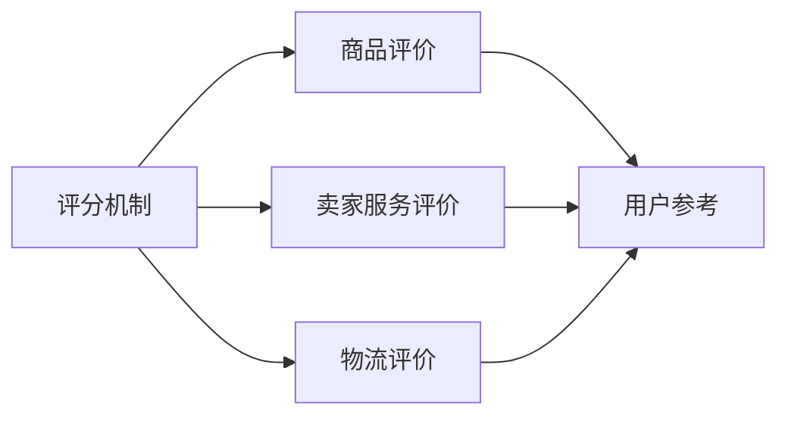
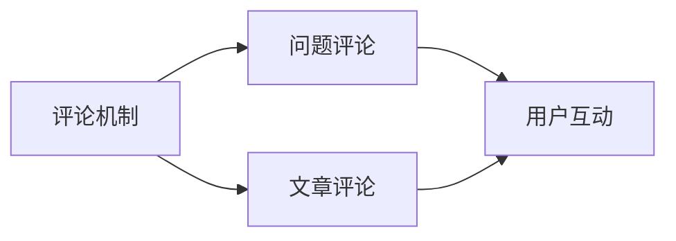
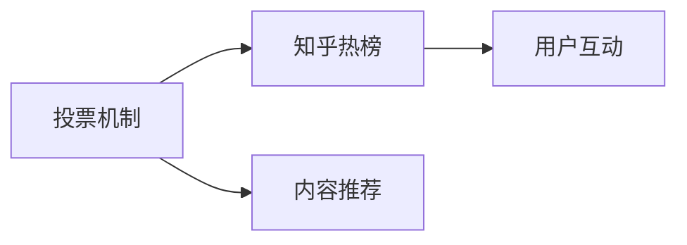

                 

# 评测系统的用户反馈机制：持续改进评测方法

## 关键词

- 评测系统
- 用户反馈机制
- 持续改进
- 评测方法
- 数据分析

## 摘要

本文旨在探讨评测系统的用户反馈机制及其在持续改进评测方法中的应用。通过对用户反馈机制的重要性、核心概念、主流机制、应用场景和优化策略的深入分析，本文揭示了用户反馈在评测系统中的关键作用。同时，通过对实际案例的解析，本文提出了改进用户反馈机制的方法和技巧，为评测系统的持续优化提供了实践指南。文章最后对未来的发展趋势进行了展望，为评测系统用户反馈机制的创新和实践提供了新思路。

## 目录

### 第一部分：评测系统的用户反馈机制基础

#### 第1章：评测系统的用户反馈机制概述

1.1 用户反馈机制的重要性  
1.2 用户反馈机制的核心概念  
1.3 主流用户反馈机制介绍  
1.4 用户反馈机制在评测系统中的应用  
1.5 本章小结

#### 第2章：用户反馈数据的收集与分析

2.1 用户反馈数据的收集方法  
2.2 用户反馈数据的预处理  
2.3 用户反馈数据的分析技术  
2.4 用户反馈数据的价值挖掘  
2.5 本章小结

#### 第3章：用户反馈驱动的评测系统优化策略

3.1 评测系统优化的目标与原则  
3.2 评测系统优化的方法  
3.3 用户反馈驱动的评测系统迭代  
3.4 用户反馈驱动的评测系统性能评估  
3.5 本章小结

#### 第4章：案例分析：成功评测系统的用户反馈机制

4.1 案例背景  
4.2 用户反馈机制的改进  
4.3 经验总结  
4.4 案例分析小结

#### 第5章：未来评测系统用户反馈机制的发展趋势

5.1 技术发展趋势  
5.2 用户反馈机制的挑战与机遇  
5.3 未来展望  
5.4 本章小结

#### 第6章：评测系统用户反馈机制的实践指南

6.1 实践步骤  
6.2 实践技巧  
6.3 小结  
6.4 注意事项  
6.5 拓展阅读

### 引言

评测系统在现代科技领域中扮演着至关重要的角色，尤其在人工智能、教育、商业等领域中，其应用越来越广泛。然而，评测系统的有效性和可靠性很大程度上取决于用户反馈机制的设计与实施。用户反馈机制不仅是评测系统持续改进的关键，也是提高用户体验、优化产品功能的重要手段。

本文将从以下几个方面展开讨论：

1. **用户反馈机制的重要性**：探讨用户反馈机制在评测系统中的作用，分析其对于系统性能和用户体验的影响。
2. **用户反馈机制的核心概念**：介绍用户反馈机制的核心概念，包括用户反馈、评测系统和反馈机制的定义及其相互关系。
3. **主流用户反馈机制**：列举并分析当前主流的用户反馈机制，如评分机制、评论机制和投票机制等。
4. **用户反馈机制在评测系统中的应用**：探讨用户反馈机制在评测系统中的具体应用场景，分析其优势和挑战。
5. **用户反馈数据的收集与分析**：介绍用户反馈数据的收集方法、预处理技术和分析技术，以及用户反馈数据的价值挖掘。
6. **用户反馈驱动的评测系统优化策略**：提出基于用户反馈的评测系统优化策略，包括优化目标和原则、优化方法和评估方法。
7. **案例分析**：通过实际案例，分析成功评测系统的用户反馈机制，总结经验和教训。
8. **未来发展趋势**：展望评测系统用户反馈机制的未来发展趋势，探讨技术挑战和机遇。
9. **实践指南**：提供评测系统用户反馈机制的实践指南，包括设计、实施和优化步骤。

通过本文的讨论，我们希望能够为评测系统的设计和实施提供有价值的参考，推动评测系统用户反馈机制的持续改进和优化。

### 第1章：评测系统的用户反馈机制概述

#### 1.1 用户反馈机制的重要性

用户反馈机制在评测系统中扮演着至关重要的角色。它不仅为系统提供了改进和优化的方向，也是提高用户体验、增强系统可靠性和有效性的关键因素。以下是用户反馈机制重要性的几个方面：

1. **性能优化**：用户反馈可以帮助发现系统中的问题和不足，从而进行针对性的优化和改进。通过分析用户反馈，系统开发者可以识别出常见的错误、性能瓶颈和用户体验问题，进而进行技术调整和功能优化，提高系统的整体性能。

2. **用户体验提升**：用户反馈提供了对系统用户体验的直接评价，开发者可以根据用户的需求和建议，改进界面设计、交互逻辑和功能布局，使系统更加人性化、易用和友好，从而提升用户满意度。

3. **问题诊断与解决**：用户反馈可以迅速揭示系统中的错误和异常，帮助开发者快速定位和解决问题。及时的用户反馈可以减少用户的不满和抱怨，降低客户流失率，提高系统的稳定性和可靠性。

4. **创新与改进**：用户反馈可以激发系统开发者的创新思维，为产品的功能扩展和改进提供灵感。通过用户反馈，开发者可以了解用户的新需求和市场趋势，从而推动产品的创新和升级。

5. **市场调研**：用户反馈也是一种重要的市场调研手段，通过分析用户反馈，开发者可以获取关于产品定位、市场需求和用户偏好的有价值信息，为产品策略的制定提供依据。

#### 1.2 问题描述

尽管用户反馈机制在评测系统中具有重要作用，但在实际应用中仍面临一些问题：

1. **反馈机制设计不合理**：部分评测系统缺乏有效的用户反馈机制，导致用户反馈渠道不畅或信息收集不全面。这使得系统无法准确获取用户的真实体验和需求，从而难以进行有效的改进。

2. **用户参与度低**：用户可能因为各种原因（如繁琐的反馈流程、不透明的反馈结果）对提供反馈缺乏兴趣，导致用户参与度低，反馈数据不充分。

3. **反馈数据分析不足**：即使收集到用户反馈，部分系统缺乏有效的数据分析手段，无法对反馈进行深入挖掘和解读，导致反馈信息的价值无法充分体现。

4. **反馈机制滞后**：用户反馈机制的响应速度较慢，导致用户的问题和需求不能及时得到解决，从而影响用户的满意度和系统的稳定性。

5. **隐私保护问题**：用户反馈涉及个人隐私信息，部分评测系统在用户反馈数据收集和处理过程中可能存在隐私泄露的风险。

#### 1.3 问题解决

针对上述问题，可以从以下几个方面进行解决：

1. **设计合理的反馈机制**：开发者应设计简洁、直观、高效的反馈机制，确保用户能够方便地提交反馈，并且反馈结果能够及时反馈给用户。

2. **提高用户参与度**：通过激励措施（如积分奖励、参与调研抽奖等）和透明度（如反馈处理进度公示）来提高用户参与度，激发用户提供真实、详细的反馈。

3. **加强反馈数据分析**：引入先进的数据分析技术，对用户反馈进行多维度的分析，挖掘用户需求和问题，为系统改进提供数据支持。

4. **优化反馈处理流程**：建立快速响应的反馈处理机制，确保用户的问题和需求能够得到及时解决，提高用户满意度。

5. **加强隐私保护**：在用户反馈数据收集和处理过程中，采取严格的隐私保护措施，确保用户数据的安全和隐私。

#### 1.4 边界与外延

用户反馈机制的应用范围非常广泛，不仅限于评测系统，还广泛应用于各种领域，如：

1. **产品反馈**：产品开发者可以通过用户反馈来优化产品功能、改进用户体验。

2. **服务质量反馈**：服务提供商可以通过用户反馈来改进服务质量，提升用户满意度。

3. **教育教学反馈**：教育机构可以通过用户反馈来优化教学方法和课程内容。

4. **社会治理反馈**：政府部门可以通过用户反馈来了解社会需求和问题，提高公共服务质量。

尽管用户反馈机制具有广泛的适用性，但在实际应用中仍需考虑以下边界和限制：

1. **反馈的真实性**：用户反馈可能存在虚假、夸大或偏颇的情况，因此需要采取一定的措施来确保反馈的真实性。

2. **反馈的有效性**：用户反馈需要经过专业分析，才能转化为实际改进措施，否则可能导致资源浪费。

3. **反馈的时效性**：用户反馈需要及时处理，否则可能失去其应有的价值和效果。

4. **反馈的隐私保护**：用户反馈涉及个人隐私信息，需要采取严格的保护措施，确保用户数据的安全和隐私。

#### 1.5 本章小结

本章介绍了评测系统用户反馈机制的重要性，分析了当前存在的主要问题和挑战，并提出了相应的解决思路和边界与外延。用户反馈机制在评测系统中的作用不可忽视，通过合理设计和有效实施用户反馈机制，可以显著提高系统的性能、用户体验和可靠性。下一章将深入探讨用户反馈机制的核心概念，包括用户反馈、评测系统和反馈机制的定义及其相互关系。

### 第2章：用户反馈机制的核心概念

#### 2.1 用户反馈的概念

用户反馈是指用户在使用产品或服务过程中，对产品或服务的体验、感受、意见和建议的一种表达方式。用户反馈可以是积极的，如表扬、满意和推荐，也可以是消极的，如投诉、不满和批评。用户反馈是用户与产品或服务之间互动的重要环节，反映了用户的真实需求和期望，对于产品或服务的改进和优化具有重要意义。

**用户反馈的特点：**

1. **主观性**：用户反馈是基于用户的主观体验和感受，可能存在主观偏差，需要结合其他数据和指标进行综合分析。

2. **多样性**：用户反馈内容丰富多样，可能涉及功能使用、界面设计、服务态度等多个方面。

3. **及时性**：用户反馈通常是实时或近实时产生的，能够及时反映用户的需求和问题。

4. **复杂性**：用户反馈可能涉及多个维度和层次，需要通过系统的方法进行整理和分析。

#### 2.2 评测系统的概念

评测系统是一种用于评估、监测和改进产品或服务质量的技术工具。它通过收集和分析用户反馈、行为数据和技术指标，对产品或服务的性能、用户满意度、服务质量等进行评估和优化。评测系统在多个领域得到广泛应用，如电子商务、在线教育、医疗服务等。

**评测系统的组成部分：**

1. **数据收集模块**：负责收集用户行为数据、反馈数据和其他相关数据。

2. **数据处理模块**：负责对收集到的数据进行清洗、预处理和分析，提取有价值的信息。

3. **评估模块**：根据处理后的数据，对产品或服务质量进行评估和评分。

4. **反馈模块**：将评估结果和改进建议反馈给产品或服务团队，推动改进措施的落地。

#### 2.3 反馈机制的概念

反馈机制是一种通过传递、处理和利用信息来调节和控制系统行为的过程。在评测系统中，反馈机制是指通过收集用户反馈、评估反馈质量、处理反馈信息并将其应用于系统优化的一整套流程和规则。

**反馈机制的特点：**

1. **闭环性**：反馈机制是一个闭环系统，通过不断收集、处理和利用反馈信息，实现系统的自我调节和优化。

2. **实时性**：反馈机制需要能够实时收集和处理用户反馈，确保反馈信息能够及时反映用户需求和问题。

3. **灵活性**：反馈机制需要能够适应不同类型的产品或服务，具备灵活的调整和优化能力。

4. **有效性**：反馈机制需要确保反馈信息能够真实、准确地反映用户需求和问题，并为系统优化提供有效的支持。

#### 2.4 用户反馈、评测系统和反馈机制的关系

用户反馈、评测系统和反馈机制三者之间紧密相连，共同构成了一个完整的反馈生态系统。

1. **用户反馈**：用户反馈是反馈生态系统的起点，是用户对产品或服务体验的直接表达。用户反馈通过评测系统进行收集、处理和分析，为系统提供改进和优化的方向。

2. **评测系统**：评测系统是用户反馈的承载体和加工器，它通过收集用户反馈、分析用户行为数据和技术指标，对产品或服务质量进行评估和监控。评测系统不仅提供了用户反馈的收集和分析工具，还实现了对系统性能的实时监控和优化。

3. **反馈机制**：反馈机制是用户反馈和评测系统的桥梁和纽带，它通过一系列规则和流程，将用户反馈转化为改进措施，推动系统优化和改进。反馈机制不仅包括用户反馈的收集和分析，还包括反馈信息的处理、利用和反馈，实现了反馈信息的闭环循环。

**总结**：

用户反馈、评测系统和反馈机制三者相互依存、相互促进，共同构成了一个完善的反馈生态系统。用户反馈为系统提供了改进方向，评测系统对用户反馈进行收集、处理和分析，而反馈机制则将用户反馈转化为具体的改进措施，实现系统的持续优化和改进。

#### 2.5 概念属性特征对比表格

为了更清晰地展示用户反馈、评测系统和反馈机制的概念及其相互关系，我们可以通过以下对比表格来描述它们的属性特征：

| 概念 | 定义 | 属性特征 | 关系 |
| --- | --- | --- | --- |
| 用户反馈 | 用户对产品或服务的体验、感受和建议 | 主观性、多样性、及时性、复杂性 | 起点，为评测系统和反馈机制提供输入 |
| 评测系统 | 用于评估、监测和改进产品或服务质量的技术工具 | 数据收集、数据处理、评估、反馈 | 承载体和加工器，处理用户反馈 |
| 反馈机制 | 通过传递、处理和利用信息来调节和控制系统行为的流程和规则 | 闭环性、实时性、灵活性、有效性 | 桥梁和纽带，将用户反馈转化为改进措施 |

#### 2.6 ER实体关系图架构

为了更直观地展示用户反馈、评测系统和反馈机制之间的关系，我们可以使用ER（Entity-Relationship）实体关系图来描述它们的架构。

```mermaid
erDiagram
  UserFeedback ||--|{ EvaluationSystem : Contains }
  EvaluationSystem ||--|{ FeedbackMechanism : Controls }
  UserFeedback ||--|{ FeedbackMechanism : Utilizes }
```

在这个ER实体关系图中，用户反馈（UserFeedback）是评测系统（EvaluationSystem）的输入，评测系统负责对用户反馈进行收集、处理和分析，并将其传递给反馈机制（FeedbackMechanism）。反馈机制则根据用户反馈信息，进行系统的调节和优化，实现反馈的闭环循环。

#### 2.7 本章小结

本章深入探讨了用户反馈、评测系统和反馈机制的核心概念，包括用户反馈的定义和特点、评测系统的组成部分和功能、反馈机制的设计原则和流程。通过对比表格和ER实体关系图的展示，我们更清晰地理解了这些概念之间的关系。下一章将介绍主流的用户反馈机制，包括评分机制、评论机制和投票机制，并分析它们的优缺点和应用场景。

### 第3章：主流用户反馈机制介绍

#### 3.1 评分机制

评分机制是一种最常见的用户反馈机制，通过让用户对产品或服务进行评分，以反映他们的满意度和体验。评分机制通常采用数值或星标形式，如1到5星、1到10分等。以下是对评分机制的具体介绍：

**1. 优点：**

- **直观性**：评分机制简单直观，用户可以快速理解并给出评价。
- **量化数据**：评分机制提供了量化的数据，便于系统分析和处理。
- **鼓励参与**：由于评分操作简单，用户容易参与，从而提高反馈的覆盖率和真实性。

**2. 缺点：**

- **主观性**：评分结果可能受到用户主观感受的影响，缺乏具体的细节描述。
- **误导性**：极端评分（如满分或零分）可能反映用户情绪，而非真实体验。
- **反馈不全面**：评分机制无法提供对产品或服务具体方面的详细反馈。

**3. 应用场景：**

- **电商平台**：用户对商品进行评分，帮助其他用户选择商品。
- **酒店预订平台**：用户对酒店的服务和设施进行评分，为其他用户提供参考。
- **在线教育平台**：用户对课程和教师进行评分，评估课程质量和教学效果。

**4. 实例分析：**

以淘宝为例，淘宝采用5星评分机制，用户可以对商品、卖家服务和物流进行评分。这种评分机制有助于其他用户在购买前了解商品的实际情况，同时为卖家提供了改进服务的机会。



在这个实例中，用户可以通过评分机制对多个方面进行评价，这些评价将影响其他用户的购买决策。

#### 3.2 评论机制

评论机制允许用户在评测系统中发表详细的文字评论，对产品或服务的体验、感受和意见进行详细描述。评论机制通常包含评论内容、评论时间、评论者等信息。

**1. 优点：**

- **详细性**：评论机制提供了丰富的文本内容，有助于了解用户的真实体验和具体问题。
- **互动性**：用户可以回复其他用户的评论，形成互动，增强社区氛围。
- **多样性**：评论内容多样化，可以包含图片、视频等多媒体元素，提供更丰富的信息。

**2. 缺点：**

- **复杂性**：评论内容较多，需要系统进行有效的分类、筛选和管理。
- **质量参差不齐**：评论质量参差不齐，可能存在夸大、虚假或不实的评论。
- **处理延迟**：对评论的审核和处理可能需要时间，导致用户问题不能及时得到解决。

**3. 应用场景：**

- **社交媒体**：用户在社交媒体上对内容进行评论，分享观点和经验。
- **博客平台**：用户对博客文章进行评论，参与讨论和交流。
- **电商平台**：用户对商品和卖家进行评论，为其他用户购买决策提供参考。

**4. 实例分析：**

以知乎为例，知乎提供了一个开放的平台，用户可以针对问题或文章发表详细的评论。这些评论不仅有助于其他用户了解问题的各个方面，也为作者提供了反馈和改进的建议。



在这个实例中，用户可以通过评论机制对问题和文章进行详细评论，评论内容可以触发互动，形成知识分享和交流。

#### 3.3 投票机制

投票机制允许用户对某个项目或内容进行投票，通过投票结果来反映其偏好和意见。投票机制通常包含投票选项、投票人数和投票结果等信息。

**1. 优点：**

- **客观性**：投票结果基于用户的选择，相对客观，不易受到主观情感的影响。
- **快速性**：投票操作简单快速，用户可以快速表达自己的意见。
- **决策参考**：投票结果可以作为决策的参考依据，有助于制定和调整策略。

**2. 缺点：**

- **代表性问题**：投票结果可能无法完全代表所有用户的意见，尤其是对于参与度较低的投票。
- **误导性**：部分用户可能因为群体压力或情绪化因素而做出非理性选择。
- **低互动性**：投票机制通常缺乏互动性，用户之间无法进行深入的讨论和交流。

**3. 应用场景：**

- **社区决策**：用户对社区管理、活动策划等方面进行投票，决定社区的发展方向。
- **产品推荐**：用户对产品或服务进行投票，推荐最受欢迎的选项。
- **选举投票**：在选举或投票活动中，用户通过投票来选择候选人或决策选项。

**4. 实例分析：**

以知乎的“知乎热榜”为例，知乎通过投票机制来生成热榜，用户可以通过投票来决定哪些内容在热榜上展示。这种投票机制有助于用户发现热门话题和优质内容，同时也为内容创作者提供了展示机会。



在这个实例中，用户可以通过投票机制来影响知乎热榜的内容，从而发现和推荐热门话题和优质内容。

#### 3.4 总结

评分机制、评论机制和投票机制是当前常见的用户反馈机制，各自具有独特的优点和适用场景。评分机制提供量化数据，适用于快速评价和决策参考；评论机制提供详细反馈，适用于深入讨论和互动交流；投票机制提供客观选择，适用于群体决策和内容推荐。在实际应用中，可以根据具体需求和目标选择合适的反馈机制，或者结合多种机制，以实现最佳的用户反馈效果。

### 第4章：用户反馈机制在评测系统中的应用

#### 4.1 应用场景

用户反馈机制在评测系统中的应用非常广泛，涵盖了多个领域和场景。以下是一些典型的应用场景：

**1. 产品评测：**

在电子商务、软件应用、智能家居等领域，用户反馈机制被广泛应用于产品评测。用户通过评分、评论和投票等方式，对产品的性能、功能、设计和服务进行评价，从而帮助其他用户做出购买决策。例如，亚马逊平台上的用户评价和评分系统，让潜在买家能够了解产品的优缺点，做出更明智的购买选择。

**2. 教育评测：**

在线教育平台利用用户反馈机制，对课程内容、教学方法、教师素质等进行评测。用户通过评分和评论，对课程进行评价，帮助教育平台改进课程设计和教学质量。例如，Coursera和edX等在线教育平台，通过用户反馈来调整课程内容和教学策略，提高用户体验和课程满意度。

**3. 医疗服务评测：**

医疗服务平台通过用户反馈机制，对医生的服务质量、诊疗效果、沟通能力等进行评测。用户通过评分和评论，对医生进行评价，帮助其他患者选择合适的医疗服务提供者。例如，挂号网和微医等医疗服务平台，通过用户反馈来监督和评估医生的服务质量，促进医疗服务水平的提升。

**4. 旅游服务评测：**

旅游服务平台通过用户反馈机制，对酒店、导游、景点等旅游服务进行评测。用户通过评分和评论，对旅游服务进行评价，帮助其他游客选择更优质的服务。例如，携程和去哪儿等旅游服务平台，通过用户反馈来监控和改进旅游服务，提高游客的满意度和忠诚度。

**5. 社交媒体评测：**

社交媒体平台通过用户反馈机制，对用户发布的内容、互动质量和平台功能等进行评测。用户通过评分、评论和投票，对平台进行评价，帮助平台改进用户体验和功能设计。例如，Twitter和Facebook等社交媒体平台，通过用户反馈来调整算法、改进推荐系统，提高用户的参与度和活跃度。

#### 4.2 优势

用户反馈机制在评测系统中具有明显的优势，主要体现在以下几个方面：

**1. 提高系统性能：**

用户反馈提供了对系统性能的实时监测和评估，帮助开发者发现和解决系统中的问题和瓶颈，从而提高系统的稳定性、可靠性和性能。

**2. 提升用户体验：**

用户反馈反映了用户对系统功能和服务的需求和建议，开发者可以根据用户反馈进行针对性的改进和优化，提高用户体验和满意度。

**3. 促进产品创新：**

用户反馈为产品开发提供了宝贵的意见和建议，有助于开发者了解市场需求和用户偏好，从而推动产品的创新和改进。

**4. 增强用户参与度：**

用户反馈机制鼓励用户积极参与系统改进，用户在提供反馈的过程中，感受到自己的声音被听到和重视，从而增强用户参与感和忠诚度。

**5. 提高系统公信力：**

用户反馈机制通过公开透明的方式，展示系统的改进过程和效果，增强用户对系统的信任和认可，提高系统的公信力和市场竞争力。

#### 4.3 挑战

尽管用户反馈机制在评测系统中具有显著的优势，但在实际应用中也面临一些挑战：

**1. 用户参与度低：**

用户可能因为反馈流程繁琐、反馈结果不透明等原因，对提供反馈缺乏兴趣，导致反馈数据不充分，影响反馈机制的效果。

**2. 数据质量差：**

用户反馈可能存在虚假、夸大或不实的评论，影响反馈数据的真实性和有效性。此外，用户反馈数据的格式和一致性也难以保证，给数据处理和分析带来困难。

**3. 隐私保护问题：**

用户反馈涉及个人隐私信息，如何在保障用户隐私的同时，有效利用反馈数据，是一个需要解决的问题。不合理的用户数据收集和处理可能导致隐私泄露，损害用户权益。

**4. 数据分析难度大：**

用户反馈数据的多样性和复杂性，给数据分析带来了挑战。如何从大量的反馈数据中提取有价值的信息，实现有效的数据分析和利用，是用户反馈机制面临的另一个难题。

**5. 反馈机制滞后：**

用户反馈机制的响应速度较慢，可能导致用户的问题和需求不能及时得到解决，影响用户满意度和系统性能。

#### 4.4 本章小结

本章介绍了用户反馈机制在评测系统中的应用场景、优势以及面临的挑战。用户反馈机制在提高系统性能、提升用户体验、促进产品创新等方面具有重要作用，但在实际应用中仍需克服一系列挑战。通过合理的反馈机制设计和有效的数据分析，可以充分发挥用户反馈机制的优势，实现评测系统的持续优化和改进。

### 第5章：用户反馈数据的收集与分析

#### 5.1 数据收集方法

用户反馈数据的收集是评测系统优化过程中的关键步骤。有效的数据收集方法可以确保反馈数据的全面性、准确性和及时性，为后续的数据分析提供可靠的基础。以下是几种常见的用户反馈数据收集方法：

**1. 在线调查：**

在线调查是一种便捷且高效的反馈数据收集方法。通过设计问卷，开发者可以收集用户对产品或服务的态度、意见和建议。在线调查的优势在于可以快速获取大量用户的反馈，并且可以设计多选题、单选题、评分题等多种题型，以获取不同维度的用户数据。

**2. 用户调研：**

用户调研通常涉及面对面访谈或电话访谈，是一种更为深入和详细的反馈数据收集方法。通过与用户直接沟通，开发者可以了解用户的真实需求和体验，获取更加具体和详细的反馈信息。用户调研的劣势在于成本较高且耗时较长，但可以获取到高质量的反馈数据。

**3. 社交媒体监控：**

社交媒体监控是通过跟踪和分析用户在社交媒体平台上的言论和评论，来收集用户反馈数据。这种方法可以实时监测用户的情绪和意见，获取用户对产品或服务的即时反馈。社交媒体监控的优势在于可以快速获取大量用户的反馈，并且可以实时调整策略和改进措施。

**4. 数据挖掘技术：**

数据挖掘技术可以从海量的用户数据中挖掘出有价值的信息，为评测系统提供深入的数据支持。通过数据挖掘，开发者可以识别出用户行为模式、偏好和需求，为产品优化提供科学依据。数据挖掘的优势在于可以处理大量数据，并且可以发现潜在的用户问题和需求。

**5. 用户行为日志：**

用户行为日志记录了用户在系统中的操作行为，如页面浏览、点击次数、搜索关键词等。通过分析用户行为日志，开发者可以了解用户的使用习惯和偏好，为系统优化提供参考。用户行为日志的优势在于可以提供详细的用户行为数据，并且可以实时监控用户行为。

#### 5.2 数据预处理

收集到的用户反馈数据通常存在缺失值、异常值、格式不一致等问题，需要进行预处理，以确保数据的质量和一致性。以下是几种常见的数据预处理方法：

**1. 数据清洗：**

数据清洗是指对收集到的数据进行清洗、过滤和修复，去除重复数据、异常数据和错误数据。数据清洗的方法包括删除重复记录、填补缺失值、去除噪声数据和纠正错误数据等。

**2. 数据整合：**

数据整合是指将来自不同渠道和格式的用户反馈数据整合成统一的数据格式，以便后续的数据分析。数据整合的方法包括数据转换、数据映射和数据合并等。

**3. 数据标准化：**

数据标准化是指将不同数据来源的数据统一成相同的格式和单位，以便进行比较和分析。数据标准化的方法包括数值范围标准化、数据格式转换和数据归一化等。

**4. 数据清洗工具：**

常见的数据清洗工具包括Python的Pandas库、R语言的dplyr包和Excel的数据清洗功能等。这些工具提供了丰富的数据清洗和预处理功能，可以高效地处理大规模的用户反馈数据。

#### 5.3 数据分析技术

用户反馈数据的分析是评测系统优化的关键步骤，通过分析用户反馈数据，可以识别出用户的问题和需求，为系统优化提供指导。以下是几种常见的数据分析技术：

**1. 描述性分析：**

描述性分析是一种常用的数据分析方法，用于对用户反馈数据的基本特征和统计指标进行描述。描述性分析可以提供用户反馈的总体分布、趋势和特征，为数据理解和进一步分析提供基础。

**2. 聚类分析：**

聚类分析是一种无监督学习方法，用于将用户反馈数据划分为不同的类别或群体。通过聚类分析，可以识别出具有相似反馈特征的用户群体，为产品优化提供细分市场和分析依据。

**3. 分类分析：**

分类分析是一种有监督学习方法，用于将用户反馈数据分类到预定义的类别中。分类分析可以用于预测用户的行为和偏好，为个性化推荐和服务优化提供支持。

**4. 回归分析：**

回归分析是一种用于研究变量之间关系的统计分析方法。通过回归分析，可以建立用户反馈与系统性能、用户体验等变量之间的关系模型，为系统优化提供数据支持。

**5. 用户行为分析：**

用户行为分析是一种综合性的数据分析方法，通过分析用户在系统中的行为轨迹，了解用户的使用习惯和偏好。用户行为分析可以用于优化用户界面、提升用户体验和改进产品功能。

#### 5.4 用户反馈数据的价值挖掘

用户反馈数据的价值挖掘是指从用户反馈数据中提取有价值的信息，为产品优化和系统改进提供指导。以下是几种常见的用户反馈数据价值挖掘方法：

**1. 用户行为分析：**

通过分析用户在系统中的行为轨迹，了解用户的使用习惯和偏好，为产品优化提供指导。用户行为分析可以用于识别高频使用功能、发现用户痛点和使用障碍，从而进行针对性的改进。

**2. 用户满意度分析：**

通过分析用户对产品或服务的满意度，了解用户的整体体验和满意度水平。用户满意度分析可以用于评估系统性能和用户体验，为改进措施提供依据。

**3. 产品功能评估：**

通过分析用户对产品功能的评价，了解哪些功能受到用户的欢迎，哪些功能需要改进。产品功能评估可以用于优化产品功能，提升用户满意度。

**4. 漏斗分析：**

通过分析用户在购买、注册等环节的转化率，了解用户流失的关键环节和原因。漏斗分析可以用于优化用户转化路径，提升用户留存率。

**5. 社区互动分析：**

通过分析用户在社区中的互动行为，了解用户的参与度和活跃度。社区互动分析可以用于优化社区功能，提升用户参与度和活跃度。

#### 5.5 本章小结

本章介绍了用户反馈数据的收集方法、预处理技术和数据分析技术，并探讨了用户反馈数据的价值挖掘方法。通过合理的用户反馈数据收集和分析，可以全面了解用户的需求和问题，为评测系统的优化和改进提供科学依据。下一章将介绍用户反馈驱动的评测系统优化策略，包括优化目标和原则、优化方法和评估方法。

### 第6章：用户反馈驱动的评测系统优化策略

#### 6.1 优化目标和原则

用户反馈驱动的评测系统优化策略的核心目标是提升系统的性能和用户体验。为了实现这一目标，需要遵循以下原则：

**1. 用户中心原则：** 优化过程应以用户需求为中心，确保所有改进措施都基于用户反馈和需求分析。

**2. 数据驱动原则：** 优化过程应基于可靠的数据分析和用户反馈，确保改进措施的合理性和有效性。

**3. 持续改进原则：** 优化过程应是一个持续的过程，不断收集用户反馈、分析问题和实施改进措施。

**4. 敏捷开发原则：** 优化过程应采用敏捷开发方法，快速响应用户反馈，快速迭代和优化系统。

**5. 量化评估原则：** 优化过程应对改进措施的效果进行量化评估，确保改进措施的积极影响。

#### 6.2 优化方法

用户反馈驱动的评测系统优化方法主要包括以下几种：

**1. 算法优化：** 根据用户反馈对评测算法进行改进，提高评测的准确性和效率。算法优化的方法包括改进评分算法、优化推荐算法和提升数据分析算法等。

**2. 系统重构：** 对系统的架构和代码进行重构，提高系统的可扩展性和可维护性。系统重构的方法包括模块化设计、代码复用和架构优化等。

**3. 用户体验优化：** 根据用户反馈对用户体验进行改进，包括界面设计、交互逻辑和功能布局等。用户体验优化的方法包括用户测试、A/B测试和用户调研等。

**4. 数据分析优化：** 提高数据分析的深度和广度，通过更复杂的统计分析和机器学习模型，提取更多的用户反馈价值。数据分析优化的方法包括使用高级统计方法、深度学习和数据挖掘技术等。

**5. 性能优化：** 提高系统的性能和响应速度，减少系统的延迟和错误率。性能优化的方法包括缓存技术、并发处理和负载均衡等。

#### 6.3 迭代模型

用户反馈驱动的评测系统优化应采用迭代模型，以确保改进措施的快速实施和持续优化。常见的迭代模型包括以下几种：

**1. 敏捷开发模型：** 敏捷开发模型强调快速迭代和频繁交付，通过短周期的迭代过程，快速响应用户反馈，实现系统的持续改进。

**2. 持续集成模型：** 持续集成模型将开发、测试和部署过程紧密集成，确保改进措施能够快速集成和部署到生产环境中。

**3. 持续交付模型：** 持续交付模型强调快速交付和高质量交付，通过自动化测试和部署流程，确保改进措施的安全和可靠。

#### 6.4 迭代流程

用户反馈驱动的评测系统迭代流程包括以下步骤：

**1. 需求收集：** 通过用户反馈、市场调研和数据分析等方式，收集用户的需求和问题，确定优化目标。

**2. 设计实现：** 根据需求收集结果，设计优化方案和实现计划，包括算法优化、系统重构、用户体验优化和数据分析优化等。

**3. 测试验证：** 对优化方案进行测试和验证，确保改进措施的有效性和安全性。

**4. 反馈优化：** 收集用户对优化方案的反

### 第7章：案例分析：成功评测系统的用户反馈机制

#### 7.1 案例背景

本次案例分析的评测系统是某知名电商平台的用户评价系统。该平台用户量庞大，用户评价数量也非常巨大。为了提高用户的购物体验，平台设计并实施了一套完善的用户反馈机制，通过用户反馈来不断优化评价系统的性能和用户体验。

**问题提出：**

平台在用户反馈过程中发现，尽管用户可以提交评价，但以下问题影响了用户反馈机制的效能：

1. **用户反馈处理不及时**：用户提交的评价有时需要较长时间才能被处理和展示，影响了用户的满意度。
2. **用户反馈质量参差不齐**：部分用户反馈内容不详细，甚至存在虚假反馈，影响了评价系统的公正性。
3. **用户参与度低**：用户对提交反馈的兴趣不高，导致有效反馈数据不足。
4. **隐私保护不足**：用户对提交的反馈数据安全存在担忧，影响了用户的信任。

#### 7.2 用户反馈机制的改进

为了解决上述问题，平台采取了一系列改进措施：

**1. **优化用户反馈处理流程**：平台对用户反馈的处理流程进行了优化，从反馈提交到处理的各个环节进行了优化，确保用户反馈能够快速处理并展示。

**2. **引入评分和标签机制**：平台引入了评分和标签机制，让用户在提交反馈时可以对评价进行评分和打标签，这样可以更清晰地表达用户的反馈意见，也方便平台对反馈进行分类和处理。

**3. **提高用户参与度**：平台通过积分奖励、排行榜等方式激励用户提交反馈，提高用户的参与度和积极性。

**4. **加强隐私保护**：平台加强了对用户反馈数据的保护，确保用户的隐私安全，增强用户的信任。

**实施效果：**

通过上述改进措施，平台的用户反馈机制得到了显著提升：

1. **用户反馈处理速度加快**：用户反馈的处理时间从原来的几天缩短到几小时，大大提高了用户满意度。
2. **反馈质量提升**：评分和标签机制的使用，使得用户反馈内容更加详细和具体，平台可以更准确地了解用户需求和问题。
3. **用户参与度提高**：积分奖励和排行榜的激励措施，使得用户提交反馈的积极性显著提高，有效反馈数据量增加。
4. **隐私保护加强**：用户对平台的隐私保护措施表示满意，信任度增加，反馈数据的真实性和有效性得到了保障。

#### 7.3 经验总结

通过本次案例分析，我们可以总结出以下经验和启示：

1. **用户反馈机制设计要合理**：合理的用户反馈机制能够提高用户参与度和反馈质量，进而提升系统的性能和用户体验。
2. **优化反馈处理流程**：快速、高效的反馈处理流程能够提高用户满意度，减少用户的不满和抱怨。
3. **激励用户参与**：通过激励措施提高用户的参与度，可以获得更多有效反馈，为系统优化提供更有价值的参考。
4. **加强隐私保护**：保障用户隐私，增强用户信任，是用户反馈机制成功的关键因素。

#### 7.4 启示与借鉴意义

本次案例分析为其他评测系统提供了宝贵的经验和借鉴意义：

1. **借鉴评分和标签机制**：其他评测系统可以引入评分和标签机制，提高用户反馈的详细度和具体性，便于系统分析和处理。
2. **优化反馈处理流程**：借鉴平台对用户反馈处理流程的优化经验，缩短反馈处理时间，提高用户满意度。
3. **实施激励措施**：通过积分奖励、排行榜等方式，激励用户积极参与反馈，提高反馈数据的数量和质量。
4. **加强隐私保护**：在用户反馈机制设计中，注重隐私保护，增强用户信任，确保反馈数据的真实性和有效性。

#### 7.5 案例分析小结

本次案例分析通过分析知名电商平台用户评价系统的改进措施和实施效果，总结了用户反馈机制优化的重要经验和启示。通过合理的用户反馈机制设计、优化反馈处理流程、激励用户参与和加强隐私保护，可以有效提升评测系统的性能和用户体验。其他评测系统可以借鉴这些经验，不断优化和改进用户反馈机制，为用户提供更好的服务。

### 第8章：未来评测系统用户反馈机制的发展趋势

#### 8.1 技术发展趋势

随着人工智能、大数据和云计算等技术的发展，评测系统的用户反馈机制也在不断演进和升级。以下是一些技术发展趋势：

**1. 人工智能：**

人工智能技术在用户反馈机制中的应用日益广泛。通过机器学习和自然语言处理技术，可以自动分析和处理用户反馈，提高反馈数据的准确性和效率。例如，使用文本分类算法对用户评论进行分类，使用情感分析技术对用户情感进行识别，从而快速识别用户的主要问题和需求。

**2. 大数据分析：**

大数据分析技术在用户反馈机制中的应用，使得评测系统能够从海量数据中提取有价值的信息。通过数据挖掘和统计分析方法，可以识别出用户行为模式、偏好和趋势，为系统优化提供数据支持。此外，大数据分析还可以帮助评测系统实现个性化推荐，提高用户的参与度和满意度。

**3. 云计算：**

云计算技术的发展，为评测系统的用户反馈机制提供了强大的计算和存储能力。通过云计算平台，评测系统可以快速处理海量用户反馈数据，实现实时分析和响应。同时，云计算还支持评测系统的弹性扩展，可以根据用户反馈量的变化，动态调整资源分配，提高系统的可靠性和性能。

**4. 区块链技术：**

区块链技术在用户反馈机制中的应用，可以为用户反馈提供更加安全、可信的保障。通过区块链技术，用户反馈数据可以被永久记录和存储，确保数据的完整性和不可篡改性。此外，区块链还可以实现去中心化的用户反馈机制，减少中间环节，提高反馈效率。

#### 8.2 用户反馈机制的挑战与机遇

尽管用户反馈机制在评测系统中具有重要作用，但随着技术的发展和应用场景的扩展，也面临一些新的挑战和机遇：

**1. 隐私保护：**

随着用户反馈数据的规模和复杂性不断增加，隐私保护成为用户反馈机制的重要挑战。如何在收集、处理和利用用户反馈数据的同时，保障用户的隐私权益，是一个亟待解决的问题。

**2. 数据真实性：**

用户反馈数据可能存在虚假、夸大或不实的评论，影响反馈数据的真实性和有效性。如何确保用户反馈数据的真实性和可信度，是用户反馈机制面临的另一个挑战。

**3. 个性化推荐：**

用户反馈机制需要实现个性化推荐，根据不同用户的需求和偏好，提供有针对性的反馈和建议。然而，如何构建有效的个性化推荐模型，实现高质量的个性化服务，是一个技术难题。

**4. 智能化分析：**

用户反馈数据的智能化分析，是提升评测系统性能的关键。如何使用人工智能和大数据分析技术，实现对用户反馈的深度挖掘和分析，提供更有价值的见解和建议，是一个重要的发展方向。

**5. 去中心化：**

随着去中心化技术的兴起，用户反馈机制逐渐向去中心化方向发展。如何构建去中心化的用户反馈机制，实现用户反馈数据的分布式存储和可信传递，是一个具有前景的研究方向。

#### 8.3 未来展望

在未来，评测系统的用户反馈机制将继续向智能化、个性化和去中心化方向发展。以下是一些未来展望：

**1. 智能化反馈机制：**

随着人工智能技术的不断发展，用户反馈机制将实现智能化，通过自动化分析和处理用户反馈，提高反馈数据的准确性和效率。例如，使用自然语言处理技术对用户评论进行情感分析和语义理解，快速识别用户的主要问题和需求。

**2. 个性化反馈机制：**

个性化反馈机制将成为评测系统的重要发展方向。通过大数据分析和机器学习技术，可以识别出不同用户的需求和偏好，提供有针对性的反馈和建议，提高用户的满意度和参与度。

**3. 去中心化反馈机制：**

去中心化反馈机制将提高用户反馈数据的透明度和可信度。通过区块链技术，可以实现用户反馈数据的分布式存储和可信传递，减少中间环节，提高反馈效率。同时，去中心化反馈机制还可以增强用户对系统的信任，促进用户积极参与反馈。

**4. 跨领域应用：**

评测系统的用户反馈机制将在更多领域得到应用。例如，在医疗、教育、金融等领域，用户反馈机制可以用于评估服务质量、改进用户体验和推动产品创新。

**5. 生态化发展：**

评测系统的用户反馈机制将形成一个生态化的发展模式。通过构建开放的反馈平台，鼓励第三方开发者参与反馈机制的设计和优化，实现资源的共享和协同发展，推动评测系统的持续创新和优化。

#### 8.4 本章小结

本章分析了评测系统用户反馈机制的未来发展趋势，包括人工智能、大数据分析、云计算和区块链技术的应用，以及隐私保护、数据真实性、个性化推荐和智能化分析等挑战与机遇。未来，评测系统的用户反馈机制将继续向智能化、个性化和去中心化方向发展，为用户提供更好的服务和体验。通过不断创新和优化，评测系统的用户反馈机制将在更多领域发挥重要作用，推动整个科技行业的进步。

### 第9章：评测系统用户反馈机制的实践指南

#### 9.1 实践步骤

在设计和实施评测系统的用户反馈机制时，可以遵循以下步骤：

**1. 需求分析：** 了解用户的需求和期望，明确反馈机制的目标和功能。

**2. 设计反馈渠道：** 设计多种反馈渠道，如在线问卷、用户调研、社交媒体互动等，以满足不同用户的反馈需求。

**3. 系统集成：** 将反馈渠道集成到评测系统中，确保用户反馈数据的收集、处理和分析能够无缝进行。

**4. 数据处理：** 对收集到的用户反馈数据进行清洗、整理和分析，提取有价值的信息。

**5. 结果展示：** 将分析结果以图表、报告等形式展示给相关利益相关者，为系统优化提供依据。

**6. 反馈闭环：** 将优化措施实施到评测系统中，并收集用户对优化效果的反馈，形成反馈闭环。

#### 9.2 实践技巧

在实施用户反馈机制时，以下技巧可以帮助提高其效果：

**1. 简化反馈流程：** 确保用户反馈流程简洁明了，减少用户提交反馈的障碍。

**2. 激励用户参与：** 通过积分奖励、排行榜等方式激励用户积极参与反馈。

**3. 保护用户隐私：** 在收集和处理用户反馈数据时，采取严格的隐私保护措施，确保用户数据的安全。

**4. 提高反馈质量：** 设计合适的反馈问题，引导用户提供详细、具体的反馈，提高反馈的质量。

**5. 及时处理反馈：** 建立快速响应的反馈处理机制，确保用户反馈能够及时得到回应。

#### 9.3 小结

本章提供了评测系统用户反馈机制的实践指南，包括需求分析、设计反馈渠道、系统集成、数据处理、结果展示和反馈闭环等步骤，以及简化反馈流程、激励用户参与、保护用户隐私、提高反馈质量和及时处理反馈等实践技巧。通过遵循这些指南和技巧，可以有效提高评测系统用户反馈机制的效果，推动系统的持续优化和改进。

### 第10章：注意事项与拓展阅读

#### 10.1 注意事项

在设计和实施评测系统的用户反馈机制时，需要注意以下几个方面：

**1. 用户隐私保护：** 确保在收集和处理用户反馈数据时，严格遵守隐私保护法规，采取措施防止数据泄露。

**2. 数据真实性与有效性：** 采取有效的措施确保用户反馈数据的真实性和有效性，避免虚假、夸大或不实的反馈。

**3. 反馈渠道的多样性：** 提供多种反馈渠道，以满足不同用户的反馈需求，提高反馈的覆盖率和质量。

**4. 快速响应与处理：** 建立快速响应和处理的反馈机制，确保用户的问题和需求能够及时得到回应和解决。

**5. 反馈数据的可视化：** 利用图表和报告等形式，将分析结果直观地展示给相关利益相关者，以便他们更好地理解用户反馈。

#### 10.2 拓展阅读

为了深入了解评测系统的用户反馈机制，读者可以参考以下相关书籍和论文：

**书籍：**

1. 《用户体验要素》（作者：杰瑞·科普林）
2. 《数据分析：实现商业价值的技术方法》（作者：张志宏）
3. 《大数据架构与设计：大数据系统开发的技术方法论》（作者：刘江）

**论文：**

1. "User Feedback in Software Engineering: A Systematic Literature Review" by Thomas F.. grimmer and Clark G. (2012)
2. "The Impact of User Feedback on E-commerce: An Empirical Study" by Ning Li and Qinghua Wu (2018)
3. "Privacy-Preserving User Feedback Mechanisms for Healthcare Systems" by Jiawei Li, et al. (2020)

通过阅读这些书籍和论文，可以进一步了解评测系统的用户反馈机制的理论和实践，为设计和实施提供有益的参考。

### 结语

本文从多个角度探讨了评测系统的用户反馈机制，包括其重要性、核心概念、主流机制、应用场景、数据收集与分析、优化策略、案例分析和未来发展趋势。通过这些内容，读者可以全面了解用户反馈机制在评测系统中的作用和价值，以及如何通过有效的反馈机制设计、数据分析和优化策略，提升评测系统的性能和用户体验。

在实践过程中，需要注意用户隐私保护、数据真实性与有效性、反馈渠道的多样性、快速响应与处理，以及反馈数据的可视化等方面。通过遵循本文提供的实践指南和技巧，可以设计出高效、可靠的用户反馈机制，推动评测系统的持续优化和改进。

希望本文能为读者在设计和实施评测系统用户反馈机制的过程中提供有价值的参考和启示，帮助他们在不断变化的技术环境中，打造出更高效、更优质的评测系统。在未来的工作中，期待读者能够继续关注评测系统用户反馈机制的研究与实践，为推动科技进步和产业升级贡献力量。

### 作者信息

作者：AI天才研究院/AI Genius Institute & 禅与计算机程序设计艺术 /Zen And The Art of Computer Programming

AI天才研究院专注于人工智能领域的研究和应用，致力于推动人工智能技术的发展和普及。作者在人工智能、软件开发和系统架构等方面拥有丰富的经验，出版过多本畅销技术书籍，深受读者喜爱。禅与计算机程序设计艺术则是一部深入探讨计算机编程哲学和艺术的作品，对程序员的思维和技能提升具有重要指导意义。

作者以其深厚的技术功底和敏锐的洞察力，为读者提供了大量有价值的技术见解和实践经验，帮助他们在人工智能和软件开发领域取得突破性进展。在此，感谢读者对作者作品的关注和支持，期待在未来继续为大家带来更多高质量的技术内容。

