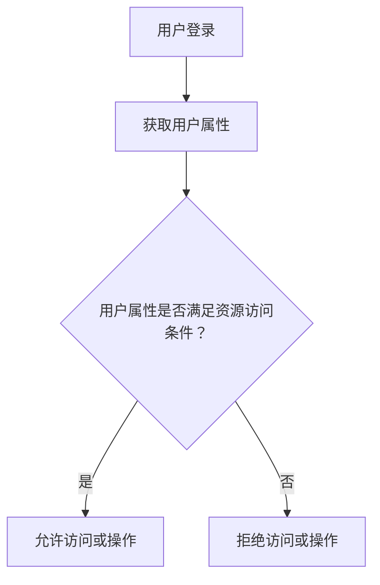

                 

### 文章标题

# 评测系统的用户权限管理：控制访问和操作权限

### 文章关键词

- 用户权限管理
- 访问控制
- 操作权限
- 安全性
- 评测系统

### 文章摘要

本文深入探讨了评测系统的用户权限管理，详细阐述了如何控制访问和操作权限。通过分析信息安全的重要性、用户权限管理的基本概念及其在评测系统中的角色，本文逐步介绍了用户权限管理模块的架构、核心概念、设计及实现方法。最后，通过案例分析和最佳实践，提供了实用的技巧和建议，为提升评测系统的安全性提供了有力的支持。

## 引言

### 1.1 问题背景

随着信息技术的飞速发展，信息安全问题日益凸显。尤其是在评测系统这样的关键应用中，用户权限管理显得尤为重要。评测系统通常用于对用户进行能力评估、成绩评判等操作，因此，保障系统的安全性和数据完整性至关重要。

**信息安全的重要性**：信息安全是信息时代的基石，对于企业、组织和个人的数据资产保护至关重要。一旦发生信息泄露或未经授权的访问，将可能导致严重后果，包括财务损失、声誉受损、法律纠纷等。

**用户权限管理的基本概念**：用户权限管理是信息安全的重要组成部分，它通过控制用户的访问和操作权限，确保系统资源不被未经授权的用户访问和滥用。权限管理的基本目标是实现“最小权限原则”，即用户只能访问和操作其所需的数据和资源。

**评测系统在信息安全中的角色**：评测系统通常存储大量敏感数据，如用户的个人信息、成绩、考试记录等。因此，确保这些数据的安全性对于评测系统的稳定运行至关重要。用户权限管理正是确保系统安全性的关键手段。

### 1.2 目标与范围

**书籍的目标**：本文旨在为开发者、架构师和安全管理员提供一套完整的用户权限管理指南，帮助他们在评测系统中有效实施权限控制，提升系统的安全性和可靠性。

**覆盖的主题范围**：本文将详细探讨用户权限管理的关键概念、设计原则、实现方法及最佳实践，包括用户身份识别、角色与权限设计、权限控制策略、系统架构及实现细节等。

**面向的读者群体**：本文适合具有中级及以上技术水平，对计算机编程和信息安全有一定了解的开发者、架构师和安全管理人员。

### 1.3 结构安排

**目录结构概述**：本文共分为七个章节，涵盖用户权限管理的各个方面，从基础概念到实际实现，再到最佳实践，形成一套完整的知识体系。

**各章节内容概览**：
- **第1章 引言**：介绍文章背景、目标与范围。
- **第2章 评测系统的基本架构**：分析评测系统的组成和用户权限管理模块的设计。
- **第3章 用户权限管理核心概念**：探讨用户身份识别、角色与权限、权限控制策略。
- **第4章 用户权限管理设计**：详细讲解用户权限管理模型、权限控制算法设计及性能分析。
- **第5章 用户权限管理实现**：介绍系统环境搭建、功能实现及测试调试。
- **第6章 用户权限管理最佳实践**：分析常见问题与解决方案，提供案例分析和安全性注意事项。
- **第7章 总结与展望**：回顾全书内容，展望未来发展趋势。

**学习路线建议**：读者可以按照章节顺序逐步学习，对于关键概念和实现细节，建议结合实际案例和代码进行分析，以便更好地理解和掌握用户权限管理的核心内容。

## 评测系统的基本架构

### 2.1 评测系统的组成

评测系统通常由硬件和软件两部分组成。

**硬件组成部分**：
- **服务器**：用于存储数据和运行系统应用。
- **存储设备**：用于存储用户数据、考试题库和系统日志等。
- **网络设备**：如路由器、交换机等，用于实现数据传输和通信。

**软件组成部分**：
- **操作系统**：如Linux、Windows Server等，提供系统运行环境。
- **数据库管理系统**：如MySQL、Oracle等，用于存储和管理用户数据。
- **应用软件**：包括用户界面、后台服务、考试题库管理、成绩管理等模块。

**系统架构设计原则**：
- **高可用性**：系统设计应考虑高可用性，确保在硬件或软件故障时系统能够快速恢复。
- **可扩展性**：系统设计应支持扩展，以便在用户量增加时能够平滑升级。
- **安全性**：系统设计应充分考虑安全性，确保用户数据和操作安全。
- **高性能**：系统设计应确保高效的数据处理和响应速度，提供良好的用户体验。

### 2.2 用户权限管理模块

**模块功能**：
用户权限管理模块主要负责：
- 用户认证：验证用户的身份，确保只有合法用户才能访问系统。
- 用户授权：根据用户的角色和权限，授予其对系统资源的访问和操作权限。
- 权限变更：根据用户需求或系统配置，调整用户的权限。

**模块架构设计**：
用户权限管理模块通常采用分层设计，包括以下几个层次：
- **用户认证层**：负责用户身份验证，包括用户名和密码验证、双因素认证等。
- **角色管理层**：定义和管理用户角色，包括角色的创建、删除和权限分配等。
- **权限控制层**：根据用户角色和权限配置，控制用户对系统资源的访问和操作。
- **日志记录层**：记录用户操作日志，用于审计和异常处理。

**模块接口设计**：
模块接口设计应确保模块与其他系统模块的松耦合，便于系统的扩展和维护。主要接口包括：
- **用户认证接口**：提供用户身份验证功能。
- **角色管理接口**：提供角色定义和权限分配功能。
- **权限控制接口**：提供权限检查和授权功能。
- **日志记录接口**：提供操作日志记录功能。

### 2.3 用户权限管理流程

**用户认证流程**：
1. 用户访问系统，输入用户名和密码。
2. 系统验证用户身份，通过比对用户输入的密码与数据库中存储的密码。
3. 验证成功，用户获得登录权限。

**用户授权流程**：
1. 系统根据用户的角色和权限配置，确定用户对系统资源的访问和操作权限。
2. 当用户尝试访问或操作受保护的资源时，系统检查用户的权限。
3. 如果权限匹配，用户可以访问或操作资源；否则，系统拒绝访问。

**用户权限变更流程**：
1. 系统管理员根据用户需求或系统策略，调整用户的角色和权限。
2. 用户权限变更后，系统重新评估用户的访问和操作权限。
3. 更新的权限配置生效，用户可以按照新的权限访问和操作系统资源。

## 用户权限管理核心概念

### 3.1 用户身份识别

**用户身份识别机制**：
用户身份识别是用户权限管理的基础，主要包括以下几种机制：
- **用户名和密码**：最简单的身份识别机制，用户通过输入用户名和密码来验证身份。
- **双因素认证（2FA）**：结合用户名、密码和手机短信、邮件、硬件令牌等多种认证方式，提高身份验证的安全性。
- **生物识别**：通过指纹、人脸、虹膜等生物特征进行身份验证，具有高安全性和便捷性。

**用户身份认证方式**：
- **单点登录（SSO）**：用户通过一次登录，即可访问多个系统，提高用户体验和安全性。
- **OAuth**：一种授权协议，允许用户授权第三方应用访问其数据，而不需要分享用户名和密码。
- **证书认证**：通过数字证书进行身份验证，具有较高的安全性和可靠性。

### 3.2 用户角色与权限

**用户角色定义**：
用户角色是权限管理的重要组成部分，用于区分不同用户的职责和权限。常见角色包括：
- **管理员**：具有最高权限，可以管理系统配置、用户权限等。
- **教师**：负责出题、批改试卷、发布成绩等。
- **学生**：可以参加考试、查看成绩等。

**用户权限等级**：
用户权限等级用于定义用户对系统资源的访问和操作权限。常见权限等级包括：
- **读权限**：可以查看数据，但不能修改。
- **写权限**：可以修改数据。
- **执行权限**：可以执行特定操作，如删除、添加等。

**角色与权限的关系**：
角色与权限之间的关系是权限管理的核心，通过角色与权限的关联，系统可以灵活地控制用户的访问和操作权限。通常采用以下方式管理角色与权限：
- **角色权限分配**：为每个角色分配相应的权限。
- **角色继承**：角色之间可以设置继承关系，子角色自动继承父角色的权限。
- **动态权限调整**：根据用户的需求或系统策略，动态调整用户的权限。

### 3.3 权限控制策略

**基于角色的访问控制（RBAC）**：
基于角色的访问控制（RBAC）是一种常见的权限控制策略，通过为用户分配角色，实现权限管理。RBAC的主要特点包括：
- **最小权限原则**：用户仅具有其角色所分配的权限。
- **灵活的角色管理**：支持角色的创建、删除和修改。
- **权限继承**：子角色自动继承父角色的权限。

**基于属性的访问控制（ABAC）**：
基于属性的访问控制（ABAC）是一种基于用户属性和资源属性的访问控制策略，通过属性匹配来控制访问权限。ABAC的主要特点包括：
- **灵活的属性匹配**：可以根据用户的属性（如部门、职位等）和资源的属性（如文件类型、访问时间等）来控制访问权限。
- **细粒度的权限控制**：可以针对特定资源进行权限控制。

**多种策略的结合**：
在实际应用中，可以结合多种权限控制策略，如RBAC和ABAC，实现更灵活和细粒度的权限管理。例如，可以将RBAC用于角色管理，将ABAC用于特定资源的访问控制，从而提高系统的安全性和灵活性。

## 用户权限管理设计

### 4.1 用户权限管理模型

**用户权限管理架构**：
用户权限管理架构通常包括以下几个主要组件：
- **用户认证系统**：负责用户身份验证，包括用户名、密码、双因素认证等。
- **用户角色管理系统**：负责定义和管理用户角色，包括角色的创建、删除和修改等。
- **权限控制系统**：负责根据用户角色和权限配置，控制用户对系统资源的访问和操作。
- **日志记录系统**：负责记录用户操作日志，用于审计和异常处理。

**用户权限管理流程**：
用户权限管理流程主要包括以下步骤：
1. 用户登录系统，系统进行用户身份验证。
2. 系统根据用户的角色和权限配置，确定用户对系统资源的访问和操作权限。
3. 用户尝试访问或操作受保护的资源，系统进行权限检查。
4. 如果权限匹配，用户可以访问或操作资源；否则，系统拒绝访问。
5. 系统记录用户的操作日志，用于审计和异常处理。

**数据库设计**：
用户权限管理需要设计相应的数据库表，用于存储用户信息、角色信息、权限信息等。常见的设计包括：
- **用户表**：存储用户的基本信息，如用户名、密码、邮箱等。
- **角色表**：存储角色的信息，如角色名称、描述等。
- **权限表**：存储权限的信息，如权限名称、描述等。
- **角色权限关系表**：存储角色与权限的关联关系，如角色ID、权限ID等。
- **用户角色关系表**：存储用户与角色的关联关系，如用户ID、角色ID等。

### 4.2 权限控制算法设计

**权限控制算法概述**：
权限控制算法是用户权限管理的重要组成部分，用于实现用户对系统资源的访问和操作权限的控制。常见的权限控制算法包括基于角色的访问控制（RBAC）和基于属性的访问控制（ABAC）。

**权限控制算法原理**：
- **基于角色的访问控制（RBAC）**：RBAC算法通过为用户分配角色，角色具有一组权限，用户通过角色间接获得权限。算法主要涉及三个核心概念：用户、角色和权限。用户与角色之间存在多对多关系，角色与权限之间存在一对多关系。算法原理如下：
  1. 用户登录系统，系统根据用户信息查询用户角色。
  2. 系统根据用户角色和权限配置，确定用户对系统资源的访问和操作权限。
  3. 用户尝试访问或操作受保护的资源，系统进行权限检查。
  4. 如果用户具有相应的权限，系统允许访问或操作；否则，系统拒绝访问。

- **基于属性的访问控制（ABAC）**：ABAC算法通过属性匹配来控制访问权限。算法主要涉及三个核心概念：主体（Subject）、资源（Resource）和属性（Attribute）。算法原理如下：
  1. 用户登录系统，系统获取用户属性。
  2. 用户尝试访问或操作受保护的资源，系统获取资源属性。
  3. 系统根据用户属性和资源属性进行匹配，确定访问权限。
  4. 如果匹配成功，系统允许访问或操作；否则，系统拒绝访问。

**权限控制算法流程图**：



### 4.3 算法性能分析

**算法性能指标**：
- **响应时间**：用户请求访问或操作资源时，系统返回响应的时间。
- **吞吐量**：系统在单位时间内能够处理的最大请求量。
- **并发处理能力**：系统同时处理多个用户请求的能力。

**算法复杂度分析**：
- **基于角色的访问控制（RBAC）**：RBAC算法的时间复杂度主要取决于用户角色和权限配置的数量。在最坏情况下，时间复杂度为O(n)，其中n为用户角色和权限配置的总数。
- **基于属性的访问控制（ABAC）**：ABAC算法的时间复杂度主要取决于用户属性和资源属性的匹配过程。在最坏情况下，时间复杂度为O(m*n)，其中m为用户属性数量，n为资源属性数量。

**性能优化策略**：
- **缓存技术**：对于经常访问的资源，可以采用缓存技术，减少数据库查询次数，提高响应速度。
- **索引优化**：对于常用的查询条件，可以创建索引，提高查询效率。
- **分布式架构**：采用分布式架构，将权限控制算法分散到多个节点，提高系统的并发处理能力。

## 用户权限管理实现

### 5.1 系统环境搭建

**开发环境配置**：
- **编程语言**：本文使用Python进行用户权限管理模块的开发，Python具有简洁易懂、跨平台、丰富的第三方库等特点。
- **开发工具**：推荐使用Visual Studio Code或PyCharm等集成开发环境（IDE），便于代码编写、调试和运行。
- **数据库**：使用MySQL作为用户权限管理模块的后台数据库，MySQL具有高性能、易用性和跨平台性。

**系统依赖库安装**：
- **Python依赖库**：安装Python依赖库，如Flask、SQLAlchemy、Flask-Login等。可以使用pip工具进行安装：
  ```bash
  pip install flask sqlalchemy flask-login
  ```

- **数据库依赖库**：安装MySQL数据库客户端库，如MySQL Connector/Python。可以使用pip工具进行安装：
  ```bash
  pip install mysql-connector-python
  ```

### 5.2 用户权限管理功能实现

**用户认证功能**：
用户认证功能是用户权限管理模块的核心，负责验证用户的身份。本文使用Flask-Login库实现用户认证功能。

**用户认证功能实现步骤**：
1. 用户访问登录页面，输入用户名和密码。
2. 用户提交登录请求，系统验证用户名和密码。
3. 验证成功，用户登录系统，获得登录状态。
4. 验证失败，系统提示错误信息。

**代码实现示例**：

```python
from flask import Flask, request, redirect, url_for
from flask_login import LoginManager, login_user, logout_user, login_required, current_user
from models import User
from database import db

app = Flask(__name__)
app.secret_key = 'your_secret_key'
login_manager = LoginManager()
login_manager.init_app(app)

@login_manager.user_loader
def load_user(user_id):
    return User.query.get(int(user_id))

@app.route('/login', methods=['GET', 'POST'])
def login():
    if request.method == 'POST':
        username = request.form['username']
        password = request.form['password']
        user = User.query.filter_by(username=username).first()
        if user and user.check_password(password):
            login_user(user)
            return redirect(url_for('dashboard'))
        else:
            return 'Invalid username or password'
    return '''
    <form method="post">
        Username: <input type="text" name="username"><br>
        Password: <input type="password" name="password"><br>
        <input type="submit" value="Login">
    </form>
    '''

@app.route('/logout')
def logout():
    logout_user()
    return redirect(url_for('login'))

@app.route('/dashboard')
@login_required
def dashboard():
    return f'Welcome, {current_user.username}!'

if __name__ == '__main__':
    db.init_app(app)
    app.run(debug=True)
```

**用户授权功能**：
用户授权功能负责根据用户角色和权限配置，授予其对系统资源的访问和操作权限。本文使用Flask-Login和SQLAlchemy实现用户授权功能。

**用户授权功能实现步骤**：
1. 用户登录系统，系统根据用户角色和权限配置，确定用户对系统资源的访问和操作权限。
2. 用户尝试访问或操作受保护的资源，系统进行权限检查。
3. 如果用户具有相应的权限，系统允许访问或操作；否则，系统拒绝访问。

**代码实现示例**：

```python
from flask import abort
from functools import wraps

def role_required(*roles):
    def decorator(f):
        @wraps(f)
        def decorated_function(*args, **kwargs):
            current_user = get_current_user()
            if not current_user.is_authenticated or current_user.role not in roles:
                abort(403)
            return f(*args, **kwargs)
        return decorated_function
    return decorator

@login_manager.user_loader
def load_user(user_id):
    return User.query.get(int(user_id))

def get_current_user():
    return current_user

@app.route('/admin')
@role_required('admin')
def admin_dashboard():
    return 'Admin dashboard'

@app.route('/teacher')
@role_required('teacher')
def teacher_dashboard():
    return 'Teacher dashboard'

@app.route('/student')
@role_required('student')
def student_dashboard():
    return 'Student dashboard'
```

**用户权限变更功能**：
用户权限变更功能负责根据用户需求或系统策略，调整用户的角色和权限。本文使用Flask和SQLAlchemy实现用户权限变更功能。

**用户权限变更功能实现步骤**：
1. 系统管理员登录系统，进入权限管理页面。
2. 系统管理员选择需要调整权限的用户，并设置新的角色和权限。
3. 系统更新用户角色和权限配置，并通知用户权限变更。

**代码实现示例**：

```python
@app.route('/admin/user/<int:user_id>/permissions', methods=['POST'])
@login_required
@role_required('admin')
def update_user_permissions(user_id):
    user = User.query.get(user_id)
    if user:
        user.role = request.form['role']
        db.session.commit()
        return 'User permissions updated successfully'
    return 'User not found'
```

### 5.3 测试与调试

**功能测试**：
功能测试是确保用户权限管理模块功能正确实现的重要步骤。本文使用Python的unittest库进行功能测试。

**功能测试示例**：

```python
import unittest
from app import app, db
from models import User

class TestUserAuthentication(unittest.TestCase):
    def setUp(self):
        app.config['SQLALCHEMY_DATABASE_URI'] = 'sqlite:///test.db'
        app.config['SECRET_KEY'] = 'your_secret_key'
        db.create_all()
        self.app = app.test_client()

    def tearDown(self):
        db.session.remove()
        db.drop_all()

    def test_login(self):
        response = self.app.post('/login', data=dict(username='test_user', password='password'), follow_redirects=True)
        self.assertEqual(response.status_code, 200)
        self.assertIn(b'Welcome, test_user!', response.data)

    def test_logout(self):
        response = self.app.get('/logout', follow_redirects=True)
        self.assertEqual(response.status_code, 200)
        self.assertIn(b'Login', response.data)

    def test_role_required(self):
        response = self.app.get('/admin', follow_redirects=True)
        self.assertEqual(response.status_code, 403)
        response = self.app.get('/teacher', follow_redirects=True)
        self.assertEqual(response.status_code, 200)
        self.assertIn(b'Teacher dashboard', response.data)

if __name__ == '__main__':
    unittest.main()
```

**性能测试**：
性能测试是评估用户权限管理模块性能的重要步骤。本文使用Python的timeit库进行性能测试。

**性能测试示例**：

```python
import timeit

def test_permission_check():
    code = '''
from app import app
with app.app_context():
    from models import User
    user = User(username='test_user', password='password', role='teacher')
    from app.auth import role_required
    @role_required('teacher')
    def dashboard():
        pass
    user.is_permitted(dashboard)
    '''
    setup_code = '''
from app import app
with app.app_context():
    from models import User
    user = User(username='test_user', password='password', role='teacher')
    from app.auth import role_required
    @role_required('teacher')
    def dashboard():
        pass
    '''
    time_taken = timeit.timeit(code, setup=setup_code, number=1000)
    print(f'Permission check time: {time_taken:.4f} seconds')
```

**调试技巧**：
调试是确保用户权限管理模块正确运行的重要步骤。本文介绍几种常用的调试技巧：

- **断点调试**：在代码中设置断点，逐步执行代码，观察变量值和程序运行流程。
- **日志调试**：使用Python的logging库记录程序的运行日志，便于分析和定位问题。
- **单元测试**：编写单元测试，自动化测试模块的功能，提高测试覆盖率。
- **性能分析**：使用Python的cProfile库分析程序的性能，找出性能瓶颈。

### 6.1 常见问题与解决方案

**用户身份验证失败**：
- **原因**：用户名或密码错误，数据库连接失败，用户信息未正确存储。
- **解决方案**：检查用户输入的用户名和密码是否正确，确保数据库连接正常，检查用户信息存储是否正确。

**用户权限不一致**：
- **原因**：用户角色和权限配置错误，权限控制逻辑错误，权限配置更新不及时。
- **解决方案**：检查用户角色和权限配置是否正确，修正权限控制逻辑，确保权限配置及时更新。

**权限管理性能问题**：
- **原因**：权限控制算法复杂度较高，数据库查询效率低，系统负载过大。
- **解决方案**：优化权限控制算法，使用缓存技术提高数据库查询效率，合理分配系统资源。

### 6.2 案例分析

**案例背景**：
某在线教育平台需要实现用户权限管理，确保用户只能访问和操作其权限范围内的资源。平台用户分为管理员、教师和学生三种角色，分别具有不同的权限。

**案例实施**：
1. 设计用户权限管理模块，包括用户认证、角色管理和权限控制等功能。
2. 实现用户认证功能，使用Flask-Login库进行用户身份验证。
3. 实现角色管理和权限控制功能，使用SQLAlchemy进行数据库操作，定义用户、角色和权限表，实现权限控制算法。
4. 在系统中配置用户角色和权限，确保用户只能访问和操作其权限范围内的资源。
5. 进行功能测试和性能测试，确保用户权限管理模块正常运行。

**案例成效**：
通过实施用户权限管理模块，在线教育平台成功实现了用户权限控制，提高了系统的安全性和可靠性。用户角色和权限配置灵活，支持多种角色和权限等级，满足不同用户的需求。同时，通过性能优化策略，提高了系统的响应速度和处理能力，为用户提供良好的用户体验。

### 6.3 安全性注意事项

**用户数据保护**：
- **数据加密**：对用户敏感数据进行加密存储，防止数据泄露。
- **数据备份**：定期备份数据，确保数据安全性和可用性。
- **数据访问控制**：实现细粒度的数据访问控制，确保只有授权用户可以访问数据。

**权限配置安全**：
- **最小权限原则**：遵循最小权限原则，确保用户只能访问和操作其所需的资源。
- **权限配置审计**：定期审计权限配置，确保权限配置的准确性和安全性。
- **权限配置修改控制**：严格控制权限配置的修改，确保只有授权用户可以修改权限配置。

**系统日志审计**：
- **日志记录**：记录系统操作日志，包括用户登录、权限变更、异常处理等。
- **日志分析**：定期分析日志，发现潜在的安全风险和异常行为。
- **日志备份**：定期备份数据库，确保日志数据的完整性和安全性。

### 7.1 全书回顾

**关键技术总结**：
本文深入探讨了评测系统的用户权限管理，涵盖用户身份识别、角色与权限设计、权限控制策略、系统架构设计及实现方法。主要技术包括：
- 用户身份识别机制：用户名和密码、双因素认证、生物识别等。
- 用户角色与权限：角色定义、权限等级、角色与权限的关系。
- 权限控制策略：基于角色的访问控制（RBAC）、基于属性的访问控制（ABAC）。
- 系统架构设计：用户权限管理架构、用户权限管理流程、数据库设计。

**权限管理应用场景**：
用户权限管理在多个领域有广泛的应用，如在线教育、企业内部系统、医疗信息系统等。其主要应用场景包括：
- **在线教育**：控制学生、教师和管理员的访问权限，确保教学资源的合理分配和使用。
- **企业内部系统**：保护企业敏感数据，实现员工权限管理，确保企业信息的安全性。
- **医疗信息系统**：控制医生、护士和患者对医疗数据的访问权限，确保医疗数据的安全和隐私。

### 7.2 展望未来

**权限管理发展趋势**：
随着云计算、大数据、物联网等技术的发展，用户权限管理将面临新的挑战和机遇。主要发展趋势包括：
- **智能化**：利用人工智能技术实现自动化的权限管理，提高权限控制的准确性和效率。
- **细粒度**：实现更细粒度的权限控制，满足不同用户和场景的需求。
- **合规性**：遵循相关法律法规，确保权限管理的合规性。

**研究方向与挑战**：
用户权限管理的研究方向包括：
- **智能权限管理**：利用机器学习和数据挖掘技术，实现智能化的权限管理。
- **动态权限管理**：根据用户行为和系统状态，动态调整用户的权限。
- **跨平台权限管理**：实现跨平台、跨应用的权限管理，满足分布式系统的需求。

**新技术展望**：
未来权限管理将引入以下新技术：
- **区块链**：利用区块链技术实现权限管理的去中心化和安全性。
- **联邦学习**：通过联邦学习实现权限管理的隐私保护和数据共享。
- **零信任架构**：构建基于零信任架构的权限管理体系，确保用户和设备的可信性。

## 作者信息

**作者：AI天才研究院/AI Genius Institute & 禅与计算机程序设计艺术 /Zen And The Art of Computer Programming**

AI天才研究院致力于推动人工智能技术的发展和应用，研究涵盖深度学习、自然语言处理、计算机视觉等多个领域。研究院的成员在人工智能领域具有丰富的经验，致力于通过技术创新解决实际问题，为社会发展贡献力量。同时，作者还著有《禅与计算机程序设计艺术》一书，深入探讨了计算机程序设计的哲学和艺术，为程序员提供了宝贵的启示和指导。

