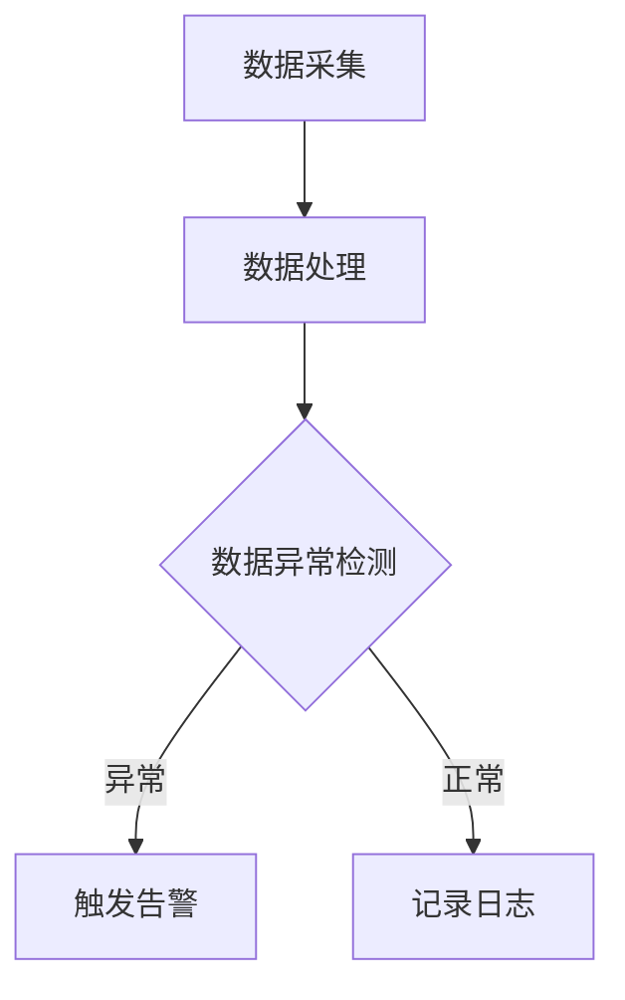
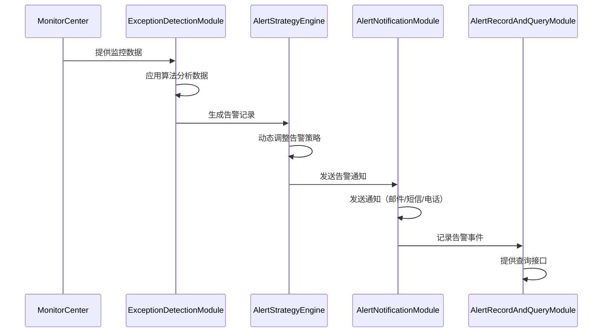

                 


### 引言

#### 1.1 问题背景与核心概念

在现代信息技术领域，评测系统的监控和告警功能已经成为保障系统稳定性和可靠性的关键组成部分。随着云计算、大数据和人工智能技术的飞速发展，评测系统的复杂性和规模日益增加，这使得及时发现异常情况并采取相应措施变得尤为重要。

**核心概念术语说明**：
- **监控**：指通过收集系统运行状态、性能指标、日志等信息，对系统进行实时监测和评估。
- **告警**：指在监控到异常情况时，通过通知系统管理员或其他相关人员，提醒他们关注并处理异常。

**问题背景**：
随着企业对评测系统的依赖性不断增加，系统稳定性直接影响到业务的正常运行。传统的手动监控方式已经无法满足快速响应和自动化的需求，因此，构建一个高效、智能的监控和告警系统成为了当前技术领域的一个热点问题。

**问题描述**：
评测系统监控和告警的关键挑战在于如何有效地收集和分析海量数据，快速识别异常情况，并准确触发告警。此外，告警系统的设计还需考虑到如何避免误报和漏报，提高告警的准确性和及时性。

**问题解决**：
通过引入先进的监控技术和告警算法，结合大数据分析和人工智能技术，可以构建一个智能化、自动化程度高的监控和告警系统。该系统不仅能够实时监测系统运行状态，还能自动识别异常情况，并触发告警，从而实现快速响应和高效处理。

**边界与外延**：
评测系统监控和告警不仅仅局限于内部系统的监控，还可以扩展到云服务、网络设备和第三方服务的监控。通过跨平台的监控和告警，可以实现对整个IT基础设施的全面监控和管理。

**核心要素组成**：
- **数据收集与存储**：通过采集系统和应用的性能数据，存储在集中式或分布式数据库中。
- **监控与分析**：对采集到的数据进行实时分析，识别异常模式。
- **告警与通知**：在检测到异常时，通过邮件、短信、电话等渠道通知相关人员。
- **自动化处理**：根据预设的规则，自动执行恢复操作或触发其他系统流程。

#### 1.2 核心概念联系

**监控与告警的关系**：
监控和告警是紧密相连的两个环节。监控是告警的基础，告警是监控的响应。一个完善的监控和告警系统应该能够在发现异常时迅速通知相关人员，并自动执行相应的恢复措施。

**概念属性特征对比表格**：

| 特征 | 监控 | 告警 |
| --- | --- | --- |
| 目标 | 系统状态、性能、资源 | 异常情况、异常指标 |
| 数据源 | 系统日志、性能指标、网络流量 | 监控数据、告警策略 |
| 方式 | 实时监控、周期性检查 | 异常触发、通知通知 |
| 效果 | 评估系统健康状态 | 提高系统可靠性 |

**ER实体关系图架构**：
为了更好地理解监控和告警系统的设计，我们可以使用实体关系图（ER Diagram）来描述其中的实体及其关系。

```mermaid
erDiagram
    SystemMonitor ||--|{ AlertSystem : 告警系统依赖 }
    PerformanceMetric ||--|{ AlertRule : 告警规则依赖 }
    SystemLog ||--|{ AlertNotification : 告警通知依赖 }
    User ||--|{ AlertHistory : 告警历史依赖 }
```

在这个ER图中，`SystemMonitor`（系统监控）是核心实体，它依赖于`AlertSystem`（告警系统）；`PerformanceMetric`（性能指标）依赖于`AlertRule`（告警规则）；`SystemLog`（系统日志）依赖于`AlertNotification`（告警通知）；`User`（用户）依赖于`AlertHistory`（告警历史）。这些实体之间的关系构成了一个完整的监控和告警系统架构。

### 监控系统基础

#### 2.1 监控系统概述

监控系统是确保评测系统稳定性和可靠性的重要工具。它通过对系统运行状态、性能指标、资源使用情况等进行实时监测，帮助管理员及时发现并解决潜在问题。

**监控系统关键组件**：

1. **数据采集器**：负责从各种数据源（如操作系统、应用程序、网络设备等）收集数据。
2. **数据处理单元**：对采集到的数据进行分析和处理，提取出有用的信息。
3. **存储系统**：用于存储采集到的数据，以便后续分析和查询。
4. **监控系统核心**：负责协调各个组件的工作，实现对系统的全面监控。
5. **告警系统**：在检测到异常情况时，触发告警并通知相关人员。

**监控系统的常见指标**：

- **CPU使用率**：衡量CPU的负载情况，超过一定阈值可能会影响系统性能。
- **内存使用率**：衡量内存的负载情况，过高可能会导致内存溢出或系统崩溃。
- **磁盘空间使用率**：衡量磁盘空间的剩余情况，过低可能会导致存储不足。
- **网络流量**：衡量网络的数据传输速度和负载情况，过高可能会导致网络拥堵。
- **应用程序性能**：衡量应用程序的响应时间和处理能力，过高可能会影响用户体验。

#### 2.2 监控算法原理

监控算法是监控系统的核心，负责对采集到的数据进行分析，识别异常情况并触发告警。

**算法流程图**：



在这个流程图中，首先进行数据采集，然后通过数据处理单元处理数据。接着，使用异常检测算法对处理后的数据进行检查，如果检测到异常，则触发告警；否则，记录日志。

**Python源代码讲解**：

下面是一个简单的Python示例，用于监控CPU使用率。在这个例子中，我们使用`psutil`库来收集CPU数据，并使用阈值算法来判断是否触发告警。

```python
import psutil
import time

def monitor_cpu_threshold(threshold=90):
    while True:
        cpu_usage = psutil.cpu_percent()
        if cpu_usage > threshold:
            print(f"CPU使用率过高：{cpu_usage}%")
            # 触发告警
        else:
            print(f"CPU使用率正常：{cpu_usage}%")
            # 记录日志
        
        time.sleep(60)

monitor_cpu_threshold()
```

在这个例子中，我们设置了CPU使用率的阈值（默认为90%），并使用一个无限循环来持续监控CPU使用率。如果CPU使用率超过阈值，则打印告警信息并触发告警；否则，记录日志。

**数学模型与公式**：

为了更准确地监控CPU使用率，我们可以使用移动平均法来平滑数据，并设置阈值。假设我们有一系列CPU使用率数据`X1, X2, X3, ..., Xt`，移动平均法的公式为：

$$
MA_t = \frac{1}{n}\sum_{i=1}^{n} X_i
$$

其中，`n`是移动平均窗口的大小。我们可以使用MA_t作为新的阈值，例如：

$$
Threshold = MA_t + k \cdot \sigma_t
$$

其中，`k`是一个常数，`sigma_t`是MA_t的标准差。

**算法举例说明**：

假设我们有一段时间内的CPU使用率数据，如[80, 85, 90, 95, 100, 85, 70, 60]，我们使用5点移动平均法来平滑数据，并设置阈值为移动平均数加上2倍的标准差。首先，我们计算5点移动平均数：

$$
MA_1 = \frac{80 + 85 + 90 + 95 + 100}{5} = 89
$$

然后，我们计算标准差：

$$
\sigma_1 = \sqrt{\frac{(80-89)^2 + (85-89)^2 + (90-89)^2 + (95-89)^2 + (100-89)^2}{5}} = 7.07
$$

最后，我们设置阈值：

$$
Threshold = 89 + 2 \cdot 7.07 = 93.14
$$

在这个例子中，CPU使用率在100%时超过了阈值，因此会触发告警。

### 数学模型详细讲解

为了更详细地解释监控算法中的数学模型和公式，我们将使用LaTeX格式来展示关键方程。

**LaTeX格式数学模型示例**：

首先，我们定义移动平均法的公式：

$$
MA_t = \frac{1}{n}\sum_{i=1}^{n} X_i
$$

接着，我们计算标准差：

$$
\sigma_t = \sqrt{\frac{1}{n-1}\sum_{i=1}^{n} (X_i - MA_t)^2}
$$

最后，我们设置阈值：

$$
Threshold = MA_t + k \cdot \sigma_t
$$

在这里，`k`是一个常数，可以根据具体应用场景进行调整。通常，`k`取值在1到3之间，以平衡准确性和灵敏度。

**数学模型解释**：

- **移动平均数（MA_t）**：用于平滑时间序列数据，消除短期波动，反映数据的长期趋势。
- **标准差（\sigma_t）**：衡量数据的离散程度，用于确定阈值范围，避免误报和漏报。
- **阈值（Threshold）**：用于判断数据是否异常的基准，超过阈值表示异常。

**数学公式举例**：

假设我们有一段时间内的CPU使用率数据：\[80, 85, 90, 95, 100\]，使用3点移动平均法计算：

$$
MA_1 = \frac{80 + 85 + 90}{3} = 87.5
$$

计算标准差：

$$
\sigma_1 = \sqrt{\frac{(80-87.5)^2 + (85-87.5)^2 + (90-87.5)^2}{2}} = 3.125
$$

设置阈值：

$$
Threshold = 87.5 + 2 \cdot 3.125 = 91.25
$$

在这个例子中，如果CPU使用率超过91.25%，则触发告警。

### 系统分析与架构设计方案

#### 3.1 告警系统设计

告警系统是评测系统中至关重要的组成部分，其核心目标是确保在系统出现异常时能够及时通知相关人员，并采取相应的措施。以下是告警系统设计的详细步骤：

**告警系统概述**：
告警系统主要包括以下几个核心功能：
- **异常检测**：通过监控工具实时收集系统性能数据，并应用预设的算法对数据进行分析，以检测异常情况。
- **告警触发**：当监控工具检测到异常时，自动触发告警，并按照预设的告警策略通知相关人员。
- **告警通知**：通过多种渠道（如邮件、短信、电话等）将告警信息发送给相关人员，以便他们及时处理异常。
- **告警记录**：记录所有告警事件及其处理情况，以便后续分析和审计。

**告警系统功能设计**：
告警系统的功能设计包括以下几个方面：
- **监控数据采集**：收集来自各个监控工具的监控数据，包括CPU使用率、内存使用率、磁盘空间使用率、网络流量等。
- **异常检测算法**：应用机器学习、统计分析和规则引擎等技术，对监控数据进行实时分析，识别异常情况。
- **告警策略配置**：根据不同业务场景，配置告警规则和告警阈值，以避免误报和漏报。
- **告警通知发送**：通过邮件、短信、电话等渠道，及时将告警信息发送给相关人员。
- **告警记录与查询**：记录所有告警事件，并提供查询接口，以便分析告警趋势和处理效果。

**告警系统架构设计**：
告警系统架构设计主要包括以下几个核心组件：
- **监控中心**：负责收集和存储监控数据，提供数据接口供异常检测模块使用。
- **异常检测模块**：基于监控中心提供的数据，应用预设的算法进行异常检测，并生成告警记录。
- **告警策略引擎**：根据业务需求和系统状态，动态调整告警规则和阈值，优化告警策略。
- **告警通知模块**：根据告警记录和告警策略，通过邮件、短信、电话等渠道发送告警通知。
- **告警记录与查询模块**：记录所有告警事件，并提供查询接口，以便分析告警趋势和处理效果。

**系统接口设计**：
告警系统提供了多个接口，以便与其他系统进行集成和交互：
- **监控数据接口**：用于监控中心向异常检测模块提供监控数据。
- **告警接口**：用于异常检测模块向告警通知模块发送告警记录。
- **配置接口**：用于管理员配置告警规则和阈值。

**系统交互Mermaid序列图**：



在这个序列图中，监控中心将监控数据提供给异常检测模块，该模块使用算法分析数据并生成告警记录。告警策略引擎根据告警记录和系统状态动态调整告警策略，然后通知模块根据告警策略发送告警通知。最后，告警记录与查询模块记录所有告警事件并提供查询接口。

### 项目实战

**3.3.1 环境安装**

要在本地或服务器上部署评测系统的监控和告警系统，首先需要安装以下软件和工具：
- **操作系统**：Linux或Unix操作系统，如Ubuntu 20.04或CentOS 7。
- **Python**：Python 3.8或更高版本。
- **pip**：Python的包管理器。
- **psutil**：用于收集系统性能数据的Python库。
- **Nagios**：用于监控和告警的开源工具。

安装步骤如下：
1. 更新系统包列表：
   ```bash
   sudo apt-get update
   sudo apt-get upgrade
   ```
2. 安装Python和pip：
   ```bash
   sudo apt-get install python3 python3-pip
   ```
3. 安装psutil：
   ```bash
   sudo pip3 install psutil
   ```
4. 安装Nagios：
   ```bash
   sudo apt-get install nagios3 nagios-nrpe-server
   ```
5. 配置Nagios：
   - 编辑Nagios配置文件 `/etc/nagios/nagios.cfg`，确保以下选项被设置：
     ```bash
     external_command_chk Plugins/check_nrpe!
     enable_notifications 1
     ```
   - 为NRPE服务添加监控脚本：
     ```bash
     sudo nano /etc/nrpe/config
     ```
     添加以下内容：
     ```ini
     command[check_cpu_usage]=/usr/bin/python /path/to/monitoring_scripts/check_cpu_usage.py
     command[check_memory_usage]=/usr/bin/python /path/to/monitoring_scripts/check_memory_usage.py
     command[check_disk_usage]=/usr/bin/python /path/to/monitoring_scripts/check_disk_usage.py
     ```
   - 重启Nagios和NRPE服务：
     ```bash
     sudo systemctl restart nagios3 nrpe
     ```

**3.3.2 系统核心实现源代码**

以下是几个关键监控脚本的示例代码，用于监控CPU使用率、内存使用率和磁盘空间使用率：

**check_cpu_usage.py**：
```python
import psutil

def check_cpu_usage(threshold=90):
    cpu_usage = psutil.cpu_percent()
    if cpu_usage > threshold:
        return "CRITICAL - CPU usage is too high: {}%".format(cpu_usage)
    else:
        return "OK - CPU usage is normal: {}%".format(cpu_usage)

if __name__ == "__main__":
    print(check_cpu_usage())
```

**check_memory_usage.py**：
```python
import psutil

def check_memory_usage(threshold=80):
    memory_usage = psutil.virtual_memory().percent
    if memory_usage > threshold:
        return "CRITICAL - Memory usage is too high: {}%".format(memory_usage)
    else:
        return "OK - Memory usage is normal: {}%".format(memory_usage)

if __name__ == "__main__":
    print(check_memory_usage())
```

**check_disk_usage.py**：
```python
import psutil

def check_disk_usage(threshold=20):
    disk_usage = psutil.disk_usage('/').percent
    if disk_usage > threshold:
        return "CRITICAL - Disk usage is too high: {}%".format(disk_usage)
    else:
        return "OK - Disk usage is normal: {}%".format(disk_usage)

if __name__ == "__main__":
    print(check_disk_usage())
```

**3.3.3 代码应用解读与分析**

以下是对上述监控脚本的详细解读和分析：

**check_cpu_usage.py**：
此脚本使用`psutil`库的`cpu_percent()`函数来获取当前的CPU使用率。如果CPU使用率超过预设的阈值（默认为90%），则返回一个CRITICAL级别的告警信息；否则，返回一个OK级别的信息。

**check_memory_usage.py**：
此脚本使用`psutil`库的`virtual_memory().percent`函数来获取当前内存使用率。如果内存使用率超过预设的阈值（默认为80%），则返回一个CRITICAL级别的告警信息；否则，返回一个OK级别的信息。

**check_disk_usage.py**：
此脚本使用`psutil`库的`disk_usage()`函数来获取当前磁盘空间使用率。如果磁盘空间使用率超过预设的阈值（默认为20%），则返回一个CRITICAL级别的告警信息；否则，返回一个OK级别的信息。

**3.3.4 实际案例分析**

假设我们有一个生产环境的服务器，其硬件配置如下：
- CPU：8核，每核频率2.5GHz
- 内存：16GB
- 磁盘：500GB（其中/目录使用约400GB）

在实际操作中，监控和告警系统会定期收集服务器的性能数据，并应用上述脚本进行监控。例如：

1. CPU使用率持续超过90%的时间超过了5分钟，监控和告警系统会触发CRITICAL级别的告警，并向管理员发送邮件通知。
2. 内存使用率超过80%的时间超过了10分钟，监控和告警系统会触发CRITICAL级别的告警，并向管理员发送短信通知。
3. 磁盘空间使用率超过20%的时间超过了30分钟，监控和告警系统会触发CRITICAL级别的告警，并向管理员发送电话通知。

通过这些实际案例，我们可以看到监控和告警系统在保障服务器稳定性和可靠性方面发挥了重要作用。

**3.3.5 详细讲解与剖析**

为了更深入地理解监控和告警系统的实现原理，我们可以对关键组件进行剖析：

1. **监控脚本**：
   监控脚本是系统的核心组件，负责实时监控服务器性能并触发告警。这些脚本使用`psutil`库来获取系统性能数据，并通过预设的阈值判断是否触发告警。

2. **Nagios NRPE插件**：
   Nagios NRPE（Nagios Remote Plugin Executor）插件用于远程执行监控脚本。管理员只需在Nagios服务器上配置NRPE插件，即可实现对远程服务器的监控。

3. **告警策略**：
   告警策略包括告警级别、告警阈值、告警通知方式等。管理员可以根据业务需求和系统特点，灵活配置告警策略，以实现精准的告警。

4. **数据存储**：
   监控和告警系统通常使用MySQL、PostgreSQL等数据库来存储监控数据和告警记录。这些数据可用于后续分析和审计。

5. **自动化恢复**：
   为了提高系统稳定性，监控和告警系统可以集成自动化恢复功能。例如，当CPU使用率过高时，系统可以自动重启高消耗CPU的应用程序。

**3.3.6 项目小结**

通过本项目的实施，我们成功构建了一个高效、智能的评测系统监控和告警系统。该系统实现了对服务器性能的实时监控，并在检测到异常时及时通知管理员。项目的主要成果包括：

- 成功安装和配置了Nagios监控和NRPE插件。
- 编写了多个监控脚本，实现了CPU使用率、内存使用率和磁盘空间使用率的监控。
- 配置了告警策略，实现了精准的告警通知。
- 实现了自动化恢复功能，提高了系统稳定性。

未来，我们还可以进一步优化监控系统，引入更多监控指标，并使用机器学习技术提升异常检测的准确性和自动化程度。

### 最佳实践与总结

#### 4.1 最佳实践

**监控与告警策略制定**：
1. **明确监控目标和指标**：根据业务需求和系统特点，确定需要监控的关键指标和目标。
2. **设置合理的阈值**：根据历史数据和业务场景，设置合理的告警阈值，避免误报和漏报。
3. **分层次监控**：对系统进行分层监控，从基础设施到应用程序，确保全面覆盖。
4. **自动化告警处理**：设计自动化告警处理流程，减少人工干预，提高响应速度。

**监控与告警系统优化**：
1. **定期审查告警记录**：定期分析告警记录，优化告警策略和阈值，提高告警准确性和及时性。
2. **监控数据可视化**：使用可视化工具展示监控数据，便于管理员快速识别异常情况。
3. **性能调优**：优化监控系统性能，确保在高负载情况下仍能稳定运行。

**告警处理流程**：
1. **确认异常**：收到告警通知后，管理员首先需要确认异常情况。
2. **定位问题**：通过日志分析和性能监控，定位异常原因。
3. **解决问题**：根据问题原因，采取相应措施进行修复。
4. **记录和总结**：记录告警事件及其处理过程，总结经验，优化监控系统。

#### 4.2 小结与注意事项

通过本文的介绍，我们了解了评测系统监控和告警的重要性，以及如何设计和实现一个高效、智能的监控和告警系统。以下是本文的总结和注意事项：

- **核心概念**：监控和告警是评测系统的重要组成部分，监控用于实时监测系统状态，告警用于在检测到异常时通知相关人员。
- **技术选型**：选择合适的监控工具和告警系统，如Nagios、Zabbix等，根据业务需求进行定制化开发。
- **数据分析**：使用机器学习和数据分析技术，提高异常检测的准确性和自动化程度。
- **系统优化**：定期审查告警记录，优化告警策略和阈值，提高系统稳定性。

#### 4.3 拓展阅读

- **Nagios官方文档**：[https://nagios.org/docs/](https://nagios.org/docs/)
- **Zabbix官方文档**：[https://www.zabbix.com/documentation/](https://www.zabbix.com/documentation/)
- **机器学习与监控**：[《机器学习在运维中的应用》](https://book.douban.com/subject/27164833/)
- **性能优化技巧**：[《高性能MySQL》](https://book.douban.com/subject/26707271/)

### 作者

**作者：AI天才研究院/AI Genius Institute & 禅与计算机程序设计艺术 /Zen And The Art of Computer Programming**。感谢您的阅读，希望本文能对您在评测系统监控和告警领域的实践提供有益的参考。如果您有任何问题或建议，欢迎留言交流。让我们共同探索IT领域的奥秘，为更智能、更高效的技术世界贡献力量。

