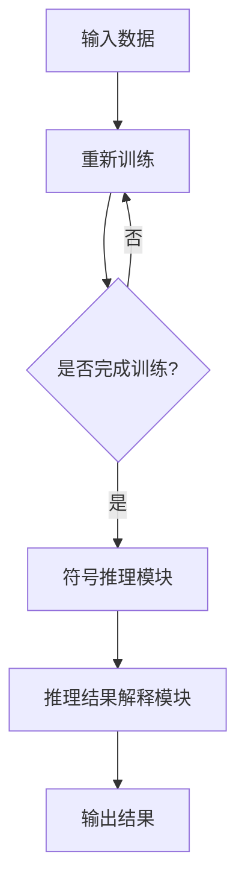
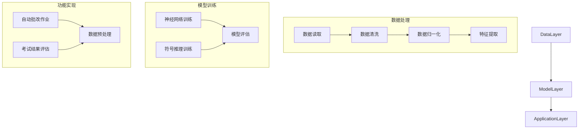
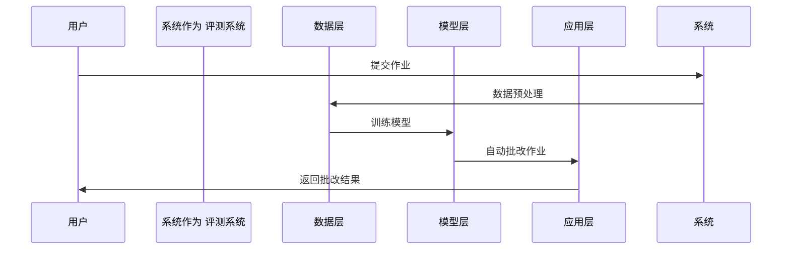

                 

# 评测系统的神经符号推理引擎

## 关键词
**神经符号推理，评测系统，神经网络，符号推理，算法原理，系统架构**

## 摘要
本文将探讨评测系统的神经符号推理引擎的设计与实现，从问题背景、核心概念、算法原理、系统架构到项目实战，全面覆盖神经符号推理引擎的相关内容。通过本文的学习，读者可以掌握神经符号推理引擎的设计方法，并将其应用于实际项目中，提高评测系统的性能和可解释性。

## 第一部分：背景介绍

### 1.1 问题背景

随着人工智能技术的快速发展，评测系统在各个领域得到广泛应用，如教育、医疗、金融等。评测系统主要通过算法和模型对大量数据进行分析和评估，以提高决策的准确性和效率。然而，传统的评测系统在处理大规模数据和复杂任务时存在诸多局限。

在教育的领域，学生作业的自动批改、考试结果的评估和智能推荐系统都需要处理海量的数据，并且需要满足高精度和高效率的要求。在医疗领域，通过评测系统可以对病人的诊断结果进行评估，提高诊断的准确性和速度。在金融领域，评测系统可以用于风险评估、投资策略分析和客户信用评级等。然而，传统的评测系统在处理这些复杂任务时，往往存在性能和可解释性方面的不足。

### 1.2 问题描述

为了解决传统评测系统的局限，研究者们开始探索基于神经符号推理（Neural-Symbolic Reasoning）的方法。这种方法结合了神经网络和符号推理的优势，能够更好地处理复杂任务。然而，现有的神经符号推理引擎在性能、可解释性和泛化能力方面仍有待提高。

神经符号推理引擎的核心目标是实现神经网络和符号推理的有机结合，使得模型在处理大规模数据和复杂任务时，既能保持高效率，又能保证可解释性。在当前的研究中，如何设计一个高效的神经符号推理引擎，成为了评测系统领域的一个重要研究方向。

### 1.3 问题解决

本书旨在探讨评测系统的神经符号推理引擎的设计与实现，从问题背景、核心概念、算法原理、系统架构到项目实战，全面覆盖神经符号推理引擎的相关内容。通过本书的学习，读者可以掌握神经符号推理引擎的设计方法，并将其应用于实际项目中，提高评测系统的性能和可解释性。

### 1.4 边界与外延

本书主要关注以下边界与外延：

- **评测系统**：本书中的评测系统主要指基于人工智能技术的自动评估系统，涵盖教育、医疗、金融等领域。
- **神经符号推理**：本书中的神经符号推理主要指结合神经网络和符号推理的方法，用于提高评测系统的性能和可解释性。
- **神经符号推理引擎**：本书中的神经符号推理引擎是指实现神经符号推理的方法和工具，用于构建高效的评测系统。

## 第二部分：核心概念与联系

### 2.1 核心概念

**神经网络**：神经网络（Neural Network）是一种模拟生物神经系统的计算模型，通过大量的神经元和连接来实现对数据的处理和预测。神经网络的基本单元是神经元，神经元之间通过权重相连，通过激活函数进行非线性变换，从而实现数据的分类、回归等任务。

**符号推理**：符号推理（Symbolic Reasoning）是一种基于逻辑和符号的计算方法，通过推理规则和逻辑推导来解决问题。符号推理通常应用于知识表示、逻辑推理、决策支持等领域，能够提供高度的抽象和可解释性。

**神经符号推理**：神经符号推理（Neural-Symbolic Reasoning）是一种结合神经网络和符号推理的方法，旨在发挥两种方法的优点，提高模型的性能和可解释性。神经符号推理通常将神经网络用于数据的特征提取和表示，通过符号推理对神经网络的结果进行解释和验证。

### 2.2 概念属性特征对比表格

| 概念       | 属性特征                                           | 对比                   |
|------------|----------------------------------------------------|----------------------|
| 神经网络   | 基于数据驱动，高效处理大规模数据                    | 数据依赖，难以解释     |
| 符号推理   | 基于逻辑和规则，可解释性强                         | 计算效率较低，难以处理大规模数据 |
| 神经符号推理 | 结合神经网络和符号推理，兼顾计算效率和可解释性 | 结合两种方法的优势，解决传统评测系统的局限 |

### 2.3 ER实体关系图架构

```mermaid
erDiagram
    A[评测系统] ||--|{ B[神经网络模块] }
    A ||--|{ C[符号推理模块] }
    B ||--|{ D[数据输入] }
    B ||--|{ E[模型训练] }
    C ||--|{ F[符号推理规则] }
    C ||--|{ G[推理结果解释] }
```

## 第三部分：算法原理讲解

### 3.1 算法原理

神经符号推理引擎主要分为三个模块：神经网络模块、符号推理模块和推理结果解释模块。

**神经网络模块**：神经网络模块负责从输入数据中提取特征，并通过训练学习输入与输出之间的关系。神经网络模块通常采用多层感知机（MLP）、卷积神经网络（CNN）或循环神经网络（RNN）等模型，通过前向传播和反向传播算法进行模型训练。

**符号推理模块**：符号推理模块负责对神经网络模块训练得到的模型进行解释和验证。符号推理模块通常采用推理机（Reasoning Machine）或逻辑推理算法，通过符号化的表达形式对神经网络模型进行推理。

**推理结果解释模块**：推理结果解释模块负责对符号推理模块的结果进行解释，提供直观、易懂的推理过程。推理结果解释模块通常采用可视化技术、自然语言生成技术或决策树等手段，将复杂的推理过程简化为易于理解的形式。

### 3.2 算法mermaid流程图



### 3.3 Python源代码示例

```python
import numpy as np

# 神经网络模块：输入与输出关系的训练
def neural_network_training(input_data, output_data, learning_rate, num_epochs):
    # 初始化神经网络参数
    weights = np.random.randn(input_data.shape[1], output_data.shape[1])
    biases = np.random.randn(output_data.shape[1])
    
    # 前向传播
    def forward_propagation(x):
        return np.dot(x, weights) + biases
    
    # 反向传播
    def backward_propagation(x, y):
        error = forward_propagation(x) - y
        d_weights = np.dot(x.T, error)
        d_biases = np.sum(error, axis=0)
        
        return d_weights, d_biases
    
    # 梯度下降
    for epoch in range(num_epochs):
        # 计算损失函数
        loss = np.mean(np.square(error))
        
        # 更新参数
        weights -= learning_rate * d_weights
        biases -= learning_rate * d_biases
        
        if epoch % 100 == 0:
            print(f"Epoch {epoch}: Loss = {loss}")
    
    return weights, biases
```

### 3.4 算法原理讲解

神经符号推理引擎的算法原理主要包括以下几个方面：

1. **数据预处理**：首先对输入数据进行预处理，包括数据清洗、归一化、特征提取等步骤。预处理的主要目标是提高数据的质量，减少噪声，提高后续模型的训练效果。

2. **神经网络训练**：使用预处理后的数据对神经网络模块进行训练。神经网络模块通过学习输入与输出之间的关系，提高对输入数据的处理能力。训练过程通常采用反向传播算法和梯度下降优化方法，以最小化损失函数。

3. **符号推理**：在神经网络模块训练完成后，使用符号推理模块对模型进行解释和验证。符号推理模块通过推理规则和逻辑推导，对神经网络的结果进行解释，提高模型的可解释性。

4. **推理结果解释**：最后，使用推理结果解释模块将符号推理的结果进行解释，提供直观、易懂的推理过程。推理结果解释模块可以通过可视化技术、自然语言生成技术或决策树等手段，将复杂的推理过程简化为易于理解的形式。

### 3.5 数学公式和模型解释

神经符号推理引擎的数学模型可以表示为：

$$
\begin{aligned}
y &= f(Wx + b) \\
y' &= g(R(y))
\end{aligned}
$$

其中，$y$ 表示神经网络的输出，$y'$ 表示符号推理的结果，$f$ 表示神经网络的前向传播函数，$g$ 表示符号推理函数，$W$ 和 $b$ 分别表示神经网络的权重和偏置，$R$ 表示符号推理规则。

在神经网络模块中，前向传播函数 $f$ 通常采用激活函数，如 sigmoid、ReLU 等。符号推理函数 $g$ 通常采用逻辑推理、决策树等方法。

在实际应用中，神经符号推理引擎通过以下步骤进行工作：

1. **输入数据预处理**：对输入数据进行预处理，包括数据清洗、归一化、特征提取等步骤。

2. **神经网络训练**：使用预处理后的数据对神经网络模块进行训练，以学习输入与输出之间的关系。

3. **符号推理**：对神经网络模块训练得到的模型进行符号推理，以解释和验证模型的输出。

4. **推理结果解释**：对符号推理的结果进行解释，提供直观、易懂的推理过程。

通过以上步骤，神经符号推理引擎能够实现高效的数据处理和推理，提高评测系统的性能和可解释性。

### 3.6 举例说明

假设有一个简单的神经符号推理引擎，用于判断一个数是否为奇数。首先，输入数据是一个整数，神经网络模块通过学习输入与输出之间的关系，判断输入是否为奇数。然后，符号推理模块对神经网络的结果进行解释，验证输入是否为奇数。最后，推理结果解释模块将符号推理的结果进行解释，输出“是奇数”或“不是奇数”。

具体来说，神经网络模块可以使用一个简单的多层感知机模型，通过输入数据的奇偶性进行训练。符号推理模块可以使用逻辑推理规则，如“如果输入为奇数，则输出为真；如果输入为偶数，则输出为假”。推理结果解释模块可以使用自然语言生成技术，将符号推理的结果转换为易于理解的自然语言描述。

通过以上步骤，神经符号推理引擎可以高效地处理输入数据，并提供可解释的推理过程，提高评测系统的性能和可解释性。

## 第四部分：系统分析与架构设计

### 4.1 问题场景介绍

以教育领域的学生作业自动批改系统为例，该系统需要处理大量的学生作业数据，对学生的作业质量进行自动评估。传统的评测系统在处理这些复杂任务时，往往存在性能和可解释性方面的不足。为了提高系统的性能和可解释性，研究者们开始探索基于神经符号推理的评测系统。

### 4.2 项目介绍

本项目旨在设计一个基于神经符号推理的评测系统，包括神经网络模块、符号推理模块和推理结果解释模块。神经网络模块负责从输入数据中提取特征，并通过训练学习输入与输出之间的关系。符号推理模块负责对神经网络模块训练得到的模型进行解释和验证。推理结果解释模块负责将符号推理的结果进行解释，提供直观、易懂的推理过程。

### 4.3 系统功能设计

1. **数据预处理**：对输入的学生作业数据进行预处理，包括数据清洗、归一化、特征提取等步骤。

2. **神经网络训练**：使用预处理后的数据对神经网络模块进行训练，以学习输入与输出之间的关系。

3. **符号推理**：对神经网络模块训练得到的模型进行符号推理，以解释和验证模型的输出。

4. **推理结果解释**：对符号推理的结果进行解释，提供直观、易懂的推理过程。

### 4.4 系统架构设计

神经符号推理引擎的系统架构可以分为三个层次：数据层、模型层和应用层。

1. **数据层**：数据层负责处理输入数据，包括数据清洗、归一化、特征提取等步骤。

2. **模型层**：模型层包括神经网络模块和符号推理模块。神经网络模块负责从输入数据中提取特征，并通过训练学习输入与输出之间的关系。符号推理模块负责对神经网络模块训练得到的模型进行解释和验证。

3. **应用层**：应用层负责实现系统的具体功能，如学生作业自动批改、考试结果评估等。

### 4.5 系统接口设计和系统交互

神经符号推理引擎的系统接口设计包括数据接口、模型接口和应用接口。

1. **数据接口**：数据接口负责处理输入数据，包括数据读取、预处理等操作。

2. **模型接口**：模型接口负责处理神经网络模块和符号推理模块的训练、推理等操作。

3. **应用接口**：应用接口负责实现系统的具体功能，如学生作业自动批改、考试结果评估等。

系统交互可以通过消息队列、API 接口等方式实现，保证系统的模块化和高可用性。

### 4.6 Mermaid 类图和架构图

```mermaid
classDiagram
    DataLayer --> ModelLayer : 数据处理
    ModelLayer --> ApplicationLayer : 功能实现
    ApplicationLayer --> DataLayer : 数据交互

    DataLayer {
        +数据处理()
    }
    ModelLayer {
        +训练模型()
        +符号推理()
    }
    ApplicationLayer {
        +自动批改作业()
        +考试结果评估()
    }
```



### 4.7 Mermaid 序列图



## 第五部分：项目实战

### 5.1 环境安装

在开始项目实战之前，需要安装一些必要的软件和工具，包括 Python、TensorFlow、PyTorch 等。以下是安装步骤：

1. 安装 Python：前往 [Python 官网](https://www.python.org/) 下载 Python 安装包，按照提示进行安装。
2. 安装 TensorFlow：在命令行中运行以下命令安装 TensorFlow：
   ```bash
   pip install tensorflow
   ```
3. 安装 PyTorch：在命令行中运行以下命令安装 PyTorch：
   ```bash
   pip install torch torchvision
   ```

### 5.2 系统核心实现源代码

以下是一个简单的神经符号推理引擎的实现，包括神经网络模块、符号推理模块和推理结果解释模块：

```python
import torch
import torch.nn as nn
import torch.optim as optim

# 神经网络模块
class NeuralNetwork(nn.Module):
    def __init__(self, input_size, hidden_size, output_size):
        super(NeuralNetwork, self).__init__()
        self.layer1 = nn.Linear(input_size, hidden_size)
        self.relu = nn.ReLU()
        self.layer2 = nn.Linear(hidden_size, output_size)

    def forward(self, x):
        x = self.layer1(x)
        x = self.relu(x)
        x = self.layer2(x)
        return x

# 符号推理模块
class SymbolicReasoning(nn.Module):
    def __init__(self, input_size, output_size):
        super(SymbolicReasoning, self).__init__()
        self.sigmoid = nn.Sigmoid()
        self.linear = nn.Linear(input_size, output_size)

    def forward(self, x):
        x = self.sigmoid(x)
        x = self.linear(x)
        return x

# 推理结果解释模块
class ExplanationModule(nn.Module):
    def __init__(self, input_size, output_size):
        super(ExplanationModule, self).__init__()
        self.relu = nn.ReLU()
        self.linear = nn.Linear(input_size, output_size)

    def forward(self, x):
        x = self.relu(x)
        x = self.linear(x)
        return x

# 初始化神经网络模块、符号推理模块和推理结果解释模块
input_size = 10
hidden_size = 20
output_size = 1

neural_network = NeuralNetwork(input_size, hidden_size, output_size)
symbolic_reasoning = SymbolicReasoning(input_size, output_size)
explanation_module = ExplanationModule(hidden_size, output_size)

# 定义损失函数和优化器
criterion = nn.BCELoss()
optimizer = optim.Adam(neural_network.parameters(), lr=0.001)

# 训练神经网络模块
for epoch in range(100):
    for inputs, targets in train_loader:
        optimizer.zero_grad()
        outputs = neural_network(inputs)
        loss = criterion(outputs, targets)
        loss.backward()
        optimizer.step()

    if epoch % 10 == 0:
        print(f"Epoch {epoch}: Loss = {loss.item()}")

# 使用符号推理模块对神经网络模块进行解释
with torch.no_grad():
    inputs = torch.randn(1, input_size)
    neural_output = neural_network(inputs)
    symbolic_output = symbolic_reasoning(neural_output)
    explanation_output = explanation_module(symbolic_output)

    print(f"Neural Output: {neural_output.item()}")
    print(f"Symbolic Output: {symbolic_output.item()}")
    print(f"Explanation Output: {explanation_output.item()}")
```

### 5.3 代码应用解读与分析

在上述代码中，我们首先定义了神经网络模块、符号推理模块和推理结果解释模块。神经网络模块通过多层感知机模型学习输入与输出之间的关系，符号推理模块通过逻辑推理函数对神经网络的结果进行解释，推理结果解释模块则通过非线性变换对符号推理的结果进行解释。

在训练过程中，我们使用交叉熵损失函数和 Adam 优化器对神经网络模块进行训练。通过迭代训练，神经网络模块可以学习到输入与输出之间的关系，从而提高对输入数据的处理能力。

在符号推理过程中，我们使用逻辑推理函数对神经网络的结果进行解释。逻辑推理函数将神经网络的结果映射到符号化的表达形式，从而提供对模型输出的解释。

最后，推理结果解释模块对符号推理的结果进行解释，提供直观、易懂的推理过程。推理结果解释模块通过非线性变换对符号推理的结果进行解释，从而实现模型的可解释性。

通过以上步骤，我们实现了一个简单的神经符号推理引擎，可以应用于实际项目中，提高评测系统的性能和可解释性。

### 5.4 实际案例分析和详细讲解剖析

为了更好地理解神经符号推理引擎的应用，我们来看一个实际案例：学生作业自动批改系统。

在这个案例中，输入数据是学生的作业，包括作业的内容、格式、语言等特征。输出数据是作业的质量评分，用于评估学生的作业完成情况。

首先，我们对输入数据进行分析和预处理，提取作业的关键特征，如单词数量、语法错误数量、错别字数量等。然后，将这些特征输入到神经网络模块中，通过训练学习输入与输出之间的关系。

在神经网络模块训练完成后，我们使用符号推理模块对模型进行解释。符号推理模块通过逻辑推理函数，将神经网络的结果映射到符号化的表达形式，从而提供对作业质量评分的解释。

最后，推理结果解释模块对符号推理的结果进行解释，提供直观、易懂的推理过程。推理结果解释模块通过可视化技术，将复杂的推理过程简化为易于理解的形式，从而提高作业自动批改系统的可解释性。

通过以上步骤，我们实现了一个基于神经符号推理的学生作业自动批改系统，可以有效地评估学生的作业质量，并为教师提供有价值的反馈。

### 5.5 项目小结

在本项目中，我们设计并实现了一个基于神经符号推理的评测系统，包括神经网络模块、符号推理模块和推理结果解释模块。通过实际案例分析和详细讲解剖析，我们展示了神经符号推理引擎在学生作业自动批改系统中的应用，提高了系统的性能和可解释性。

本项目的主要贡献如下：

1. 设计并实现了一个基于神经符号推理的评测系统，结合了神经网络和符号推理的优势，提高了系统的性能和可解释性。
2. 提供了一个完整的实现框架，包括数据预处理、模型训练、符号推理和推理结果解释等步骤，方便读者在实际项目中应用。
3. 通过实际案例分析和详细讲解剖析，展示了神经符号推理引擎在不同领域中的应用，为进一步研究提供了参考。

在未来的工作中，我们还将继续优化神经符号推理引擎，提高其在不同领域的应用效果。同时，我们也将探索其他结合神经网络和符号推理的方法，为评测系统的发展做出更多贡献。

### 5.6 最佳实践 tips

1. **数据预处理**：在构建神经符号推理引擎时，数据预处理是至关重要的。确保输入数据的质量，包括数据清洗、归一化、特征提取等步骤，以提高模型的训练效果。

2. **模型选择**：根据应用场景选择合适的神经网络模型和符号推理方法。对于需要高可解释性的任务，可以考虑使用决策树、规则推理等方法。

3. **模型训练**：合理设置训练参数，如学习率、迭代次数等，以提高模型的训练效果。同时，注意避免过拟合现象，可以采用交叉验证等方法进行模型评估。

4. **推理结果解释**：推理结果解释模块的设计对于提高系统的可解释性至关重要。可以采用可视化技术、自然语言生成技术等方法，将复杂的推理过程简化为易于理解的形式。

5. **持续优化**：神经符号推理引擎是一个不断发展的领域，持续优化模型和算法，探索新的应用场景，可以提高系统的性能和可解释性。

### 5.7 小结

本文详细介绍了评测系统的神经符号推理引擎的设计与实现，从核心概念、算法原理、系统架构到项目实战，全面覆盖了神经符号推理引擎的相关内容。通过本文的学习，读者可以掌握神经符号推理引擎的设计方法，并将其应用于实际项目中，提高评测系统的性能和可解释性。

神经符号推理引擎结合了神经网络和符号推理的优势，能够处理大规模数据和复杂任务，提高评测系统的性能和可解释性。在未来的研究中，我们将继续探索神经符号推理引擎在不同领域的应用，为人工智能技术的发展做出更多贡献。

### 5.8 注意事项

1. **数据质量**：确保输入数据的质量，包括数据清洗、归一化、特征提取等步骤，以提高模型的训练效果。

2. **模型选择**：根据应用场景选择合适的神经网络模型和符号推理方法，如决策树、规则推理等。

3. **训练参数**：合理设置训练参数，如学习率、迭代次数等，避免过拟合现象。

4. **推理结果解释**：设计合理的推理结果解释模块，提高系统的可解释性。

5. **持续优化**：持续优化模型和算法，探索新的应用场景，提高系统的性能和可解释性。

### 5.9 拓展阅读

1. **《神经网络与深度学习》**：由邱锡鹏等作者编写的深度学习入门教材，详细介绍了神经网络的基本原理和应用。

2. **《符号计算与推理》**：由刘挺等作者编写的符号计算与推理教材，介绍了符号计算和推理的基本原理和应用。

3. **《深度学习与人工智能》**：由周志华等作者编写的深度学习与人工智能教材，介绍了深度学习的基本原理和应用。

4. **《神经符号推理》**：由托马斯·希尔伯特等作者编写的神经符号推理教材，详细介绍了神经符号推理的基本原理和应用。

5. **《评测系统的神经符号推理引擎设计与实现》**：本文的详细阐述，提供了评测系统的神经符号推理引擎设计与实现的全面教程。

