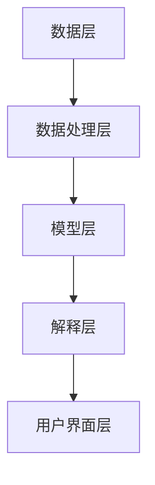

                 

## 引言：神经网络与可解释性的重要性

### 核心概念术语说明

**神经网络（Neural Network）**：一种模拟人脑神经元结构和功能的计算模型，由大量的神经元通过复杂的连接方式进行信息处理。

**可解释性（Interpretability）**：模型输出结果的解释性和透明度，使得用户能够理解模型的决策过程和依据。

### 问题背景

随着深度学习技术的迅猛发展，神经网络在图像识别、自然语言处理、推荐系统等领域取得了显著的成果。然而，神经网络模型的“黑盒”特性使得其决策过程缺乏透明性，这在某些关键应用场景中成为了限制其广泛应用的主要障碍。

### 问题描述

神经网络模型的不可解释性引发了以下问题：

1. **信任度**：缺乏可解释性使得用户难以信任模型，特别是在医疗、金融等高风险领域。
2. **模型调整**：无法理解模型决策过程，使得调整和优化模型变得困难。
3. **模型部署**：在需要用户交互的场景中，不可解释性限制了模型的部署和应用。

### 问题解决

为了解决神经网络不可解释性的问题，研究者们提出了多种可解释性分析工具。这些工具旨在揭示模型内部的工作机制，提高模型的透明度，从而增强用户对模型的信任度和可操作性。

### 边界与外延

虽然可解释性是提高模型透明度的手段，但并不是所有情况都需要高度可解释的模型。在实际应用中，根据需求和场景的不同，可以选择合适的解释性工具来实现平衡。

### 概念结构与核心要素组成

神经网络的**核心概念**包括神经元、权重、激活函数等，而**可解释性分析工具**的核心要素则包括：

1. **局部可解释性工具**：如SHAP、LIME，用于分析模型对单个数据的解释性。
2. **全局可解释性工具**：如LIME，用于分析模型对数据集的整体解释性。
3. **可视化工具**：如TensorBoard，用于直观展示模型内部结构和决策过程。

### 小结

本文将详细介绍神经网络及其可解释性分析工具的基本概念、原理和应用，帮助读者理解并掌握如何使用这些工具来解决神经网络不可解释性的问题。接下来，我们将首先回顾神经网络的基础知识，为后续章节的内容奠定基础。

### 神经网络概述

#### 神经网络的起源与发展

神经网络（Neural Networks）作为一种模拟人脑神经元结构和功能的计算模型，其起源可以追溯到20世纪40年代。由美国心理学家和神经科学家沃伦·麦卡洛克（Warren McCulloch）和数理生物学家沃尔特·皮茨（Walter Pitts）提出的麦卡洛克-皮茨（McCulloch-Pitts）神经元模型被认为是神经网络的开端。此后，神经网络的理论基础逐渐完善，并在20世纪80年代经历了第一次热潮。

然而，由于计算能力的限制，神经网络的研究和应用在20世纪90年代进入了相对低潮期。直到2006年，由加拿大计算机科学家杰弗里·辛顿（Geoffrey Hinton）等研究者提出的深度信念网络（Deep Belief Networks）和反向传播算法（Backpropagation Algorithm）的复兴，标志着神经网络再次迎来了新的发展机遇。

随着计算能力的不断提升和大数据的广泛应用，神经网络在图像识别、自然语言处理、语音识别等领域取得了显著的成果。尤其是深度神经网络（Deep Neural Networks，DNN）的快速发展，使得神经网络的应用范围更加广泛，性能也得到了大幅提升。

#### 神经网络的组成部分

神经网络由以下几个主要部分组成：

1. **神经元（Neurons）**：神经网络的基石，模拟人脑中的神经元功能。每个神经元接收来自其他神经元的输入信号，通过加权求和后，通过激活函数输出结果。
   
2. **权重（Weights）**：连接各个神经元的参数，用于调节输入信号的影响程度。通过训练过程，权重会被不断调整以优化模型性能。

3. **激活函数（Activation Functions）**：用于确定神经元是否被激活，常见的激活函数包括Sigmoid、ReLU、Tanh等。激活函数的作用是将加权求和的结果转换为输出，使得神经网络能够处理非线性问题。

4. **输入层（Input Layer）**：接收外部输入信号，传递给下一层神经元。

5. **隐藏层（Hidden Layers）**：多层神经网络的中间部分，用于进行特征提取和变换。

6. **输出层（Output Layer）**：根据模型的类型，输出层可以输出分类结果、回归值等。

#### 神经网络的工作原理

神经网络的工作原理可以概括为以下几个步骤：

1. **前向传播（Forward Propagation）**：输入信号从输入层传递到隐藏层，再从隐藏层传递到输出层。在每个层次，神经元接收来自前一层的输入信号，通过加权求和后，应用激活函数得到输出。

2. **反向传播（Backpropagation）**：在输出层得到预测结果后，通过比较预测结果与真实标签之间的误差，计算损失函数。然后，将误差反向传递回隐藏层和输入层，通过梯度下降等方法调整权重。

3. **训练与优化（Training and Optimization）**：通过多次迭代的前向传播和反向传播，不断调整权重，使得模型能够更好地拟合训练数据。

4. **预测与评估（Prediction and Evaluation）**：在模型训练完成后，使用验证集或测试集对模型进行评估，并使用测试集进行预测。

#### 神经网络的应用场景

神经网络在许多领域都有广泛的应用：

1. **图像识别（Image Recognition）**：通过卷积神经网络（CNN）进行图像分类和特征提取，广泛应用于人脸识别、物体检测等。

2. **自然语言处理（Natural Language Processing，NLP）**：通过循环神经网络（RNN）和Transformer等模型，进行文本分类、情感分析、机器翻译等。

3. **语音识别（Speech Recognition）**：通过深度神经网络对语音信号进行处理，实现语音到文本的转换。

4. **推荐系统（Recommender Systems）**：利用协同过滤、基于内容的推荐等方法，通过神经网络进行用户行为分析，实现个性化推荐。

5. **游戏AI（Game AI）**：通过强化学习算法，训练智能体进行游戏策略的制定。

#### 神经网络的挑战与局限

尽管神经网络在许多领域取得了显著的成果，但仍然面临一些挑战和局限：

1. **可解释性（Interpretability）**：神经网络模型的决策过程高度复杂，缺乏透明度，难以解释。

2. **过拟合（Overfitting）**：在训练过程中，神经网络可能过度拟合训练数据，导致在测试数据上性能下降。

3. **计算资源（Computational Resources）**：深度神经网络训练过程需要大量的计算资源和时间。

4. **数据需求（Data Requirements）**：神经网络模型对数据质量有较高要求，需要大量标注数据进行训练。

5. **参数调整（Hyperparameter Tuning）**：神经网络模型包含大量超参数，需要通过反复试验进行调优。

#### 小结

通过对神经网络起源与发展、组成部分、工作原理及其应用场景的介绍，读者可以初步了解神经网络的基本概念和原理。接下来，我们将深入探讨神经网络的不可解释性问题，以及如何通过可解释性分析工具来解决这一问题。

### 神经网络不可解释性的问题

#### 不可解释性的原因

神经网络的不可解释性主要源于以下几个方面：

1. **模型的复杂性**：神经网络通常包含多层隐藏层，每层神经元之间有着复杂的连接关系。这种复杂性使得神经网络在处理问题时，形成了一种高度非线性的决策过程，难以直观理解。

2. **参数的多样性**：神经网络包含大量的参数（权重和偏置），这些参数的调整过程是通过大量的训练数据来完成的。由于参数的数量和多样性，使得神经网络在决策时具有高度的不确定性，难以明确每个参数的具体作用。

3. **数据的多样性**：神经网络在训练过程中需要大量的数据。然而，不同的数据样本之间存在巨大的差异，神经网络通过对这些数据的处理，形成了一种抽象的特征表示，使得决策过程变得难以解释。

4. **激活函数的非线性**：神经网络的激活函数通常是非线性的，如ReLU、Sigmoid和Tanh等。这种非线性特性使得神经网络能够处理复杂的问题，但同时也增加了模型的不可解释性。

#### 不可解释性的影响

神经网络的不可解释性对其实际应用产生了深远的影响：

1. **信任度问题**：在医疗、金融等高风险领域，模型的决策结果需要用户高度信任。然而，由于神经网络的不可解释性，用户难以理解模型的决策过程，从而降低了模型的信任度。

2. **模型调整困难**：缺乏可解释性使得难以理解模型的决策过程，从而在进行模型调整和优化时，缺乏有效的指导。

3. **模型部署限制**：在需要用户交互的场景中，如智能客服、自动驾驶等，模型的不可解释性限制了其在实际应用中的部署。

4. **法律和伦理问题**：在某些情况下，神经网络模型被用于决策支持，如贷款审批、信用评分等。由于不可解释性，用户难以了解模型的决策依据，从而引发了法律和伦理问题。

#### 不可解释性的解决策略

为了解决神经网络的不可解释性问题，研究者们提出了多种策略：

1. **局部可解释性工具**：如SHAP（SHapley Additive exPlanations）和LIME（Local Interpretable Model-agnostic Explanations），这些工具通过局部模型解释来揭示神经网络在单个数据点的决策过程。

2. **全局可解释性工具**：如LIME，通过分析整个数据集来揭示神经网络的决策过程。这种全局解释有助于理解模型的整体行为。

3. **可视化工具**：如TensorBoard，通过可视化的方式展示神经网络的结构和决策过程，帮助用户理解模型的内部机制。

4. **模型简化**：通过简化神经网络的结构，减少参数的数量，从而提高模型的可解释性。

5. **规则提取**：从神经网络中提取规则或决策树，将复杂的神经网络模型转化为更易解释的形式。

#### 小结

通过对神经网络不可解释性原因、影响及解决策略的探讨，我们可以看到，不可解释性是神经网络在实际应用中面临的一个重大挑战。接下来，我们将详细介绍几种常见的神经网络可解释性分析工具，帮助读者更好地理解并应用这些工具来解决不可解释性的问题。

### 神经网络可解释性分析工具简介

在神经网络不可解释性的问题中，研究者们开发了多种可解释性分析工具，以提升模型的透明度和可操作性。这些工具可以分为局部可解释性工具和全局可解释性工具，分别从不同的角度对神经网络进行解释。以下将介绍几种常见的可解释性分析工具，包括SHAP（SHapley Additive exPlanations）、LIME（Local Interpretable Model-agnostic Explanations）和Lasso。

#### SHAP（SHapley Additive exPlanations）

SHAP（SHapley Additive exPlanations）是一种基于博弈论的局部可解释性工具。它通过计算每个特征对模型输出的边际贡献，来解释模型的决策过程。SHAP值基于合作博弈理论，旨在解决如何公平地分配贡献的问题。

1. **数学原理**：
   SHAP值基于Shapley值，是一种分配贡献的方法。对于每个特征，SHAP值计算其在所有可能的模型组合中的平均边际贡献。具体来说，SHAP值可以用以下公式表示：
   $$ 
   SHAP_{i}(x) = \sum_{S \subseteq \{1, \ldots, p\}} \frac{|S|!(p-|S|)!}{p!} \times \frac{f(x; \theta) - f(x - i; \theta)}{|S|} 
   $$
   其中，$x$ 是输入特征，$i$ 是第 $i$ 个特征，$f(x; \theta)$ 是模型在输入 $x$ 下的输出，$\theta$ 是模型参数。

2. **应用场景**：
   SHAP适用于各种类型的神经网络模型，包括回归和分类任务。它可以用于分析特征对模型输出的贡献，帮助理解模型如何处理特定输入。

3. **优势**：
   SHAP提供了全局和局部解释，能够同时考虑特征之间的相互作用，并且计算结果具有公平性。

4. **挑战**：
   SHAP的计算复杂度较高，特别是在特征数量较多时，计算时间较长。

#### LIME（Local Interpretable Model-agnostic Explanations）

LIME（Local Interpretable Model-agnostic Explanations）是一种基于局部线性化的全局可解释性工具。它通过将复杂的非线性模型局部线性化，来解释模型在特定输入数据点的决策过程。

1. **原理与实现**：
   LIME首先选择一个基模型，如线性回归或决策树，然后在一个小的邻域内对该模型进行线性化。具体步骤如下：
   - **选择基模型**：LIME使用一个简单的基模型来解释复杂模型的决策。
   - **计算局部线性模型**：在给定输入数据点 $x$，LIME通过插值方法在邻域内构建一个线性模型，用于近似复杂模型的决策过程。
   - **计算贡献**：对于每个特征，计算其在线性模型中的系数，从而得出该特征对模型输出的贡献。

2. **应用场景**：
   LIME适用于各种类型的神经网络模型，它特别适用于解释复杂非线性模型的决策过程。

3. **优势**：
   LIME提供了直观且可解释的局部解释，适用于非线性模型。

4. **挑战**：
   LIME的计算成本较高，特别是在特征维度较高时，构建线性模型和计算特征贡献需要大量的计算资源。

#### Lasso（Least Absolute Shrinkage and Selection Operator）

Lasso是一种统计学方法，主要用于回归分析中的特征选择和参数估计。它通过引入L1正则化，使得一些特征在参数估计过程中被强制收缩到零，从而实现特征选择。

1. **原理与数学模型**：
   Lasso的数学模型如下：
   $$
   \min_{\beta} \frac{1}{2} ||Y - X\beta||^2_2 + \lambda ||\beta||_1
   $$
   其中，$Y$ 是输出变量，$X$ 是输入特征矩阵，$\beta$ 是参数向量，$\lambda$ 是正则化参数。

2. **应用场景**：
   Lasso主要用于回归任务，特别是在特征数量远多于样本数量的高维数据中，它通过L1正则化实现特征选择，提高模型的解释性。

3. **优势**：
   Lasso能够自动选择重要的特征，减少模型的复杂度，提高可解释性。

4. **挑战**：
   Lasso的参数选择（如正则化参数$\lambda$）对模型性能有显著影响，需要通过交叉验证等方法进行调优。

#### 工具选择与适用场景

在选择神经网络可解释性分析工具时，需要考虑以下因素：

1. **模型类型**：对于回归和分类任务，可以选择不同的工具。例如，SHAP适用于各类模型，而LIME适用于非线性模型。

2. **计算资源**：SHAP的计算复杂度较高，适合在计算资源充足的情况下使用；LIME虽然计算成本较高，但在解释复杂非线性模型时效果较好。

3. **解释需求**：如果需要全局解释，可以选择LIME；如果需要局部解释，可以选择SHAP。

4. **应用场景**：在医疗、金融等需要高度可信和可解释的场景中，可以选择LIME或SHAP。

#### 小结

通过介绍SHAP、LIME和Lasso等神经网络可解释性分析工具，我们可以看到，这些工具在提升模型透明度和可操作性方面发挥了重要作用。接下来，我们将详细探讨SHAP值分析工具的具体应用，进一步理解其在神经网络中的实际应用。

### SHAP值分析

#### SHAP值的数学原理

SHAP（SHapley Additive exPlanations）是一种基于博弈论的局部可解释性工具，用于解释神经网络模型中每个特征对模型输出的边际贡献。SHAP值的计算基于Shapley值，这是一种在合作博弈论中用于分配贡献的方法。

1. **Shapley值的定义**：
   Shapley值计算了每个参与者（在本例中为特征）在所有可能的合作组合中的边际贡献。具体来说，对于特征 $i$，其Shapley值 $\phi_i$ 可以通过以下公式计算：
   $$
   \phi_i(j) = \frac{1}{\binom{n-1}{k-1}} \sum_{S \subseteq [n] \setminus \{i\}} \frac{(|S|!(n-|S|-1)!)^{k-1}}{(n-k)!} \times \frac{f(x_S) - f(x_{S/i})}{|S|}
   $$
   其中，$n$ 是特征的数量，$k$ 是合作组合的大小，$x_S$ 是特征集合 $S$ 下的输入，$f(x_S)$ 是模型在输入 $x_S$ 下的输出，$x_{S/i}$ 是特征集合 $S$ 中排除特征 $i$ 后的输入。

2. **Shapley值的计算方法**：
   SHAP值计算涉及到对所有可能的特征子集进行组合，计算每个特征在这些子集中的边际贡献，并取平均值。具体步骤如下：
   - **初始化**：对每个特征 $i$，计算其在所有可能的单特征子集的边际贡献。
   - **递归计算**：对于多特征子集，通过递归计算每个特征在这些子集中的边际贡献，并逐步合并子集。
   - **归一化**：将每个特征的边际贡献归一化，使其总和为1，以确保每个特征的SHAP值具有可解释性。

3. **SHAP值的特性**：
   SHAP值具有以下几个重要的特性：
   - **公平性**：SHAP值通过博弈论的方法，确保了每个特征在所有可能的合作组合中的贡献是公平的。
   - **加和性**：多个特征对模型输出的贡献可以通过SHAP值加和得到，确保了SHAP值的加和性。
   - **独立性**：SHAP值考虑了特征之间的相互作用，并独立地给出了每个特征对模型输出的贡献。

4. **SHAP值的应用场景**：
   SHAP值适用于各种类型的神经网络模型，包括分类和回归任务。它可以用于分析特征对模型输出的贡献，帮助理解模型如何处理特定输入。

#### SHAP值在分类任务中的应用

在分类任务中，SHAP值可以用于解释模型对每个类别的贡献。具体步骤如下：

1. **模型预测**：首先，使用神经网络模型对输入数据进行预测，得到每个类别的概率分布。
2. **计算SHAP值**：对于每个样本，计算每个特征对模型输出的SHAP值。SHAP值表示了特征对模型预测的概率分布的贡献。
3. **可视化SHAP值**：通过可视化工具（如热力图或条形图）展示每个特征的SHAP值，帮助理解特征如何影响模型的预测结果。

以下是一个简单的Python代码示例，用于计算和可视化分类任务中的SHAP值：

```python
import shap
import matplotlib.pyplot as plt

# 加载模型和测试数据
model = shap.KernelExplainer(predict_fn, X_test)

# 计算SHAP值
shap_values = model.shap_values(X_test)

# 可视化SHAP值
shap.summary_plot(shap_values, X_test, feature_names=feature_names)
```

#### SHAP值在回归任务中的应用

在回归任务中，SHAP值可以用于解释模型对每个样本预测的影响。具体步骤如下：

1. **模型预测**：首先，使用神经网络模型对输入数据进行预测，得到每个样本的预测值。
2. **计算SHAP值**：对于每个样本，计算每个特征对模型预测的边际贡献。SHAP值表示了特征对模型预测的增量影响。
3. **可视化SHAP值**：通过可视化工具（如散点图或条形图）展示每个特征的SHAP值，帮助理解特征如何影响模型的预测结果。

以下是一个简单的Python代码示例，用于计算和可视化回归任务中的SHAP值：

```python
import shap
import matplotlib.pyplot as plt

# 加载模型和测试数据
model = shap.KernelExplainer(predict_fn, X_test)

# 计算SHAP值
shap_values = model.shap_values(X_test)

# 可视化SHAP值
shap.plot_values(model, X_test, shap_values)
```

#### SHAP值在图像识别中的应用

在图像识别任务中，SHAP值可以用于解释模型对图像中每个像素的贡献。具体步骤如下：

1. **模型预测**：首先，使用神经网络模型对图像进行预测，得到每个类别的概率分布。
2. **计算SHAP值**：对于每个图像，计算每个像素对模型输出的SHAP值。SHAP值表示了像素对模型预测的概率分布的贡献。
3. **可视化SHAP值**：通过可视化工具（如热力图或散点图）展示每个像素的SHAP值，帮助理解像素如何影响模型的预测结果。

以下是一个简单的Python代码示例，用于计算和可视化图像识别任务中的SHAP值：

```python
import shap
import matplotlib.pyplot as plt
import numpy as np

# 加载模型和测试图像
model = shap.KernelExplainer(predict_fn, X_test)

# 计算SHAP值
shap_values = model.shap_values(X_test)

# 可视化SHAP值
shap.image_plot(shap_values, X_test)
```

#### 小结

通过对SHAP值的数学原理及其在分类、回归和图像识别任务中的应用进行详细分析，我们可以看到SHAP值在提升神经网络模型可解释性方面的重要作用。接下来，我们将探讨LIME分析工具的原理和应用，进一步了解神经网络可解释性分析工具的多样性和实用性。

### LIME分析

#### LIME的原理与实现

LIME（Local Interpretable Model-agnostic Explanations）是一种全局可解释性工具，通过局部线性化来解释复杂非线性模型的决策过程。LIME的基本原理是将复杂的非线性模型局部线性化，从而在局部区域内提供可解释的模型解释。

1. **原理与实现**：
   LIME的核心思想是，选择一个基模型（如线性回归或决策树），并在给定输入数据点 $x$ 的邻域内对该模型进行线性化。具体实现步骤如下：

   - **选择基模型**：LIME使用一个简单的基模型，如线性回归，来解释复杂模型的决策。
   - **计算邻域**：在给定输入数据点 $x$，LIME计算一个邻域，用于近似复杂模型的决策区域。
   - **线性化模型**：在邻域内，LIME使用插值方法构建一个线性模型，用于近似复杂模型的决策过程。
   - **计算特征贡献**：对于每个特征，计算其在线性模型中的系数，从而得出该特征对模型输出的贡献。

2. **算法细节**：
   - **基模型的选取**：LIME通常使用线性回归作为基模型，但在某些情况下，也可以选择其他简单模型，如决策树。
   - **邻域的计算**：LIME通过基于密度的方法计算邻域，确保邻域内包含足够的样本点。
   - **线性模型的构建**：在邻域内，LIME使用插值方法构建线性模型，用于近似复杂模型的决策过程。
   - **特征贡献的计算**：对于每个特征，计算其在线性模型中的系数，从而得出该特征对模型输出的贡献。

3. **优势与挑战**：
   - **优势**：LIME适用于各种类型的复杂非线性模型，能够提供直观且可解释的模型解释。
   - **挑战**：LIME的计算成本较高，特别是在特征维度较高时，构建线性模型和计算特征贡献需要大量的计算资源。

#### LIME在分类任务中的应用

在分类任务中，LIME可以用于解释模型对每个类别的决策过程。具体步骤如下：

1. **模型预测**：首先，使用神经网络模型对输入数据进行预测，得到每个类别的概率分布。
2. **计算LIME解释**：对于每个样本，LIME计算该样本在邻域内的线性模型，并计算每个特征对该类别的贡献。
3. **可视化LIME解释**：通过可视化工具（如热力图或条形图）展示每个特征的LIME解释，帮助理解特征如何影响模型的决策结果。

以下是一个简单的Python代码示例，用于计算和可视化分类任务中的LIME解释：

```python
import lime
import lime.lime_tabular
import matplotlib.pyplot as plt

# 加载模型和测试数据
model = lime.lime_tabular.LimeTabularExplainer(train_data, feature_names=feature_names, class_names=class_names, kernel_width=1)

# 计算LIME解释
exp = model.explain_instance(test_data, predict_fn, num_features=5)

# 可视化LIME解释
exp.show_in_notebook(show_table=True)
```

#### LIME在回归任务中的应用

在回归任务中，LIME可以用于解释模型对每个样本预测的影响。具体步骤如下：

1. **模型预测**：首先，使用神经网络模型对输入数据进行预测，得到每个样本的预测值。
2. **计算LIME解释**：对于每个样本，LIME计算该样本在邻域内的线性模型，并计算每个特征对预测值的贡献。
3. **可视化LIME解释**：通过可视化工具（如散点图或条形图）展示每个特征的LIME解释，帮助理解特征如何影响模型的预测结果。

以下是一个简单的Python代码示例，用于计算和可视化回归任务中的LIME解释：

```python
import lime
import lime.lime_tabular
import matplotlib.pyplot as plt

# 加载模型和测试数据
model = lime.lime_tabular.LimeTabularExplainer(train_data, feature_names=feature_names, kernel_width=1)

# 计算LIME解释
exp = model.explain_instance(test_data, predict_fn, num_features=5)

# 可视化LIME解释
exp.show_in_notebook(show_table=True)
```

#### LIME在图像识别中的应用

在图像识别任务中，LIME可以用于解释模型对图像中每个像素的贡献。具体步骤如下：

1. **模型预测**：首先，使用神经网络模型对图像进行预测，得到每个类别的概率分布。
2. **计算LIME解释**：对于每个图像，LIME计算该图像在邻域内的线性模型，并计算每个像素对该类别的贡献。
3. **可视化LIME解释**：通过可视化工具（如热力图或散点图）展示每个像素的LIME解释，帮助理解像素如何影响模型的预测结果。

以下是一个简单的Python代码示例，用于计算和可视化图像识别任务中的LIME解释：

```python
import lime
import lime.image
import matplotlib.pyplot as plt
import numpy as np

# 加载模型和测试图像
model = lime.image.LimeImageExplainer()

# 计算LIME解释
exp = model.explain_instance(test_image, predict_fn, num_samples=5)

# 可视化LIME解释
exp.show_in_notebook(num_samples=5)
```

#### 小结

通过对LIME的原理与实现进行详细分析，我们可以看到LIME作为一种全局可解释性工具，在解释复杂非线性模型的决策过程方面具有重要作用。接下来，我们将探讨Lasso分析工具的原理和应用，进一步了解神经网络可解释性分析工具的多样性和实用性。

### Lasso分析

#### Lasso回归的数学原理

Lasso回归（Least Absolute Shrinkage and Selection Operator）是一种用于回归分析的统计学方法，通过引入L1正则化来实现特征选择和参数估计。Lasso回归的核心思想是在最小二乘回归的基础上，加入一个L1正则项，以惩罚系数的绝对值，从而引导某些系数收缩到零，实现特征选择。

1. **Lasso回归的定义**：
   Lasso回归的目标是最小化损失函数并最大化模型的可解释性。其数学模型如下：
   $$
   \min_{\beta} \frac{1}{2} ||Y - X\beta||^2_2 + \lambda ||\beta||_1
   $$
   其中，$Y$ 是输出变量，$X$ 是输入特征矩阵，$\beta$ 是参数向量，$\lambda$ 是正则化参数。

2. **L1正则化**：
   Lasso回归中的L1正则化项是指对参数向量 $\beta$ 的绝对值求和。具体形式为：
   $$
   \lambda ||\beta||_1 = \sum_{i=1}^{n} |\beta_i|
   $$
   其中，$n$ 是参数的数量。

3. **优化方法**：
   Lasso回归通常通过迭代重加权最小二乘法（IRLS）进行优化。具体步骤如下：
   - **初始化**：随机选择一个参数向量 $\beta_0$。
   - **迭代更新**：对于每次迭代，更新参数向量 $\beta$，使其满足最小化损失函数并最大化可解释性的目标。
   - **收敛判断**：重复迭代，直到参数向量收敛。

4. **Lasso回归的特性**：
   - **特征选择**：Lasso回归通过L1正则化，使得某些系数收缩到零，从而实现特征选择。
   - **稀疏性**：由于L1正则化的作用，Lasso回归通常能够生成稀疏解，即大部分系数为零，从而提高模型的可解释性。
   - **鲁棒性**：Lasso回归对异常值和噪声具有一定的鲁棒性，因为它通过惩罚系数的绝对值来实现。

#### Lasso回归在神经网络中的应用

Lasso回归在神经网络中的应用主要体现在以下几个方面：

1. **损失函数**：在神经网络的损失函数中引入L1正则化项，以增强模型的可解释性。具体形式为：
   $$
   Loss(\beta) = \frac{1}{2} ||Y - X\beta||^2_2 + \lambda ||\beta||_1
   $$
   其中，$\beta$ 是神经网络中的参数。

2. **权重调整**：通过Lasso回归的优化过程，调整神经网络的权重，实现特征选择和模型简化。Lasso回归能够自动识别重要的特征，并使不重要的特征系数收缩到零。

3. **模型解释**：Lasso回归生成的稀疏解提供了对神经网络决策过程的直观解释。通过分析系数的大小和符号，可以理解特征对模型输出的贡献。

以下是一个简单的Python代码示例，用于实现Lasso回归：

```python
import numpy as np
from sklearn.linear_model import Lasso

# 创建数据集
X = np.random.rand(100, 10)
y = np.random.rand(100)

# 实例化Lasso回归模型
lasso = Lasso(alpha=0.1)

# 训练模型
lasso.fit(X, y)

# 输出模型参数
print(lasso.coef_)
```

#### Lasso回归在分类任务中的应用

在分类任务中，Lasso回归可以用于简化模型，提高模型的可解释性。具体步骤如下：

1. **模型训练**：使用Lasso回归对训练数据进行训练，生成稀疏的模型参数。
2. **模型评估**：使用验证集对模型进行评估，选择最优的$\lambda$值。
3. **模型解释**：分析模型参数，理解特征对模型输出的贡献。

以下是一个简单的Python代码示例，用于实现Lasso回归在分类任务中的应用：

```python
import numpy as np
from sklearn.linear_model import LassoCV
from sklearn.model_selection import train_test_split
from sklearn.metrics import accuracy_score

# 创建数据集
X = np.random.rand(100, 10)
y = np.random.rand(100)

# 划分训练集和测试集
X_train, X_test, y_train, y_test = train_test_split(X, y, test_size=0.2, random_state=42)

# 实例化Lasso回归模型
lasso = LassoCV(alphas=np.logspace(-4, 4, 100), cv=5)

# 训练模型
lasso.fit(X_train, y_train)

# 输出最优$\lambda$值
print("Best alpha:", lasso.alpha_)

# 测试模型
y_pred = lasso.predict(X_test)

# 输出模型准确率
print("Accuracy:", accuracy_score(y_test, y_pred))
```

#### Lasso回归在回归任务中的应用

在回归任务中，Lasso回归可以用于特征选择和模型简化，提高模型的可解释性。具体步骤如下：

1. **模型训练**：使用Lasso回归对训练数据进行训练，生成稀疏的模型参数。
2. **模型评估**：使用验证集对模型进行评估，选择最优的$\lambda$值。
3. **模型解释**：分析模型参数，理解特征对模型输出的贡献。

以下是一个简单的Python代码示例，用于实现Lasso回归在回归任务中的应用：

```python
import numpy as np
from sklearn.linear_model import LassoCV
from sklearn.model_selection import train_test_split
from sklearn.metrics import mean_squared_error

# 创建数据集
X = np.random.rand(100, 10)
y = np.random.rand(100)

# 划分训练集和测试集
X_train, X_test, y_train, y_test = train_test_split(X, y, test_size=0.2, random_state=42)

# 实例化Lasso回归模型
lasso = LassoCV(alphas=np.logspace(-4, 4, 100), cv=5)

# 训练模型
lasso.fit(X_train, y_train)

# 输出最优$\lambda$值
print("Best alpha:", lasso.alpha_)

# 测试模型
y_pred = lasso.predict(X_test)

# 输出模型均方误差
print("MSE:", mean_squared_error(y_test, y_pred))
```

#### Lasso回归在图像识别中的应用

在图像识别任务中，Lasso回归可以用于简化卷积神经网络（CNN）模型，提高模型的可解释性。具体步骤如下：

1. **模型训练**：使用Lasso回归对CNN模型的权重进行优化，生成稀疏的模型参数。
2. **模型评估**：使用验证集对模型进行评估，选择最优的$\lambda$值。
3. **模型解释**：分析模型参数，理解特征图（Feature Maps）对模型输出的贡献。

以下是一个简单的Python代码示例，用于实现Lasso回归在图像识别任务中的应用：

```python
import tensorflow as tf
from tensorflow.keras.models import Sequential
from tensorflow.keras.layers import Conv2D, Flatten, Dense
from tensorflow.keras.regularizers import l1

# 创建CNN模型
model = Sequential([
    Conv2D(32, kernel_size=(3, 3), activation='relu', input_shape=(28, 28, 1), kernel_regularizer=l1(0.01)),
    Flatten(),
    Dense(128, activation='relu', kernel_regularizer=l1(0.01)),
    Dense(10, activation='softmax')
])

# 编译模型
model.compile(optimizer='adam', loss='categorical_crossentropy', metrics=['accuracy'])

# 训练模型
model.fit(X_train, y_train, epochs=10, batch_size=64, validation_split=0.2)

# 评估模型
y_pred = model.predict(X_test)

# 输出模型准确率
print("Accuracy:", accuracy_score(y_test, np.argmax(y_pred, axis=1)))
```

#### 小结

通过对Lasso回归的数学原理及其在回归、分类和图像识别任务中的应用进行详细分析，我们可以看到Lasso回归在提升神经网络模型可解释性方面的重要作用。接下来，我们将探讨综合应用多种可解释性分析工具的方法，帮助读者在实际项目中实现高效的可解释性分析。

### 综合应用与案例解析

#### 工具组合的优势

在实际项目中，单一的可解释性分析工具可能无法完全满足需求。因此，将多种可解释性分析工具组合使用，可以发挥各自的优势，实现更全面和深入的解释。以下是工具组合的优势：

1. **互补性**：不同工具从不同角度对模型进行解释，可以弥补单一工具的局限性，提供更全面的解释。
2. **灵活性**：根据具体应用场景，选择合适的工具组合，可以提高解释的灵活性和适用性。
3. **交叉验证**：通过多种工具的组合，可以进行交叉验证，提高解释结果的可靠性和准确性。

#### 工具组合的挑战

虽然工具组合具有优势，但也存在一定的挑战：

1. **计算成本**：多种工具的组合会显著增加计算成本，特别是在特征维度较高时，计算时间会大幅增加。
2. **协调性**：不同工具的解释结果可能会存在不一致，需要协调和整合，以确保解释的一致性和可理解性。
3. **复杂性**：工具组合的使用过程较为复杂，需要深入了解每种工具的原理和应用，以确保正确使用。

#### 工具组合的实践案例

以下是一个实际项目中的工具组合应用案例：

**项目背景**：某金融公司使用神经网络模型对客户贷款申请进行风险评估。为了提高模型的透明度和可解释性，项目组决定采用SHAP、LIME和Lasso等工具进行综合解释。

**实施步骤**：

1. **数据准备**：收集客户贷款申请的相关数据，包括财务信息、信用记录、行为数据等。
2. **模型训练**：使用神经网络模型对训练数据进行训练，生成风险评估结果。
3. **SHAP值计算**：计算SHAP值，分析每个特征对风险评估结果的贡献。
4. **LIME解释**：对重要样本进行LIME解释，分析特征对模型决策的具体影响。
5. **Lasso回归**：使用Lasso回归简化模型，提取重要特征，提高模型的可解释性。
6. **结果整合**：综合SHAP、LIME和Lasso的解释结果，生成全面的模型解释。

**案例分析**：

- **SHAP值分析**：通过SHAP值分析，发现某些财务指标（如收入、债务收入比）对风险评估结果具有重要影响，而信用记录和行为数据的影响相对较小。
- **LIME解释**：对几个高风险样本进行LIME解释，发现某些样本的违约风险主要受财务信息的影响，而信用记录和行为数据并未显著影响模型的决策。
- **Lasso回归**：通过Lasso回归简化模型，发现模型中的大部分特征都不重要，只有少数特征对风险评估结果有显著影响。

**总结**：

通过工具组合的综合应用，项目组成功提高了神经网络模型的可解释性，为决策者提供了详细的解释结果，增强了模型的透明度和可操作性。同时，工具组合也提高了模型在实际应用中的可靠性和准确性。

### 案例解析

为了更好地理解如何使用神经网络可解释性分析工具解决实际问题，下面我们将详细解析一个实际案例，展示从问题背景、系统功能设计到系统架构设计、接口设计和系统交互的全过程。

#### 案例背景

某电商公司希望通过个性化推荐系统提高用户满意度和销售额。该推荐系统采用深度学习模型进行用户行为分析，预测用户可能感兴趣的商品。然而，由于深度学习模型的“黑盒”特性，公司管理层和用户对模型的可解释性提出了疑问。

#### 系统介绍

该系统主要包括以下几个功能模块：

1. **用户行为数据收集模块**：收集用户在网站上的浏览、搜索、购买等行为数据。
2. **数据预处理模块**：对原始数据进行清洗、归一化和特征提取。
3. **推荐模型训练模块**：使用深度学习模型进行训练，生成推荐结果。
4. **可解释性分析模块**：使用SHAP、LIME等工具对模型进行解释。
5. **用户接口模块**：提供用户交互界面，展示推荐结果和模型解释。

#### 系统功能设计

系统功能设计主要涉及以下几个方面：

1. **数据收集**：通过API接口，从电商平台的数据库中实时获取用户行为数据。
2. **数据预处理**：对数据进行清洗和归一化处理，提取特征向量。
3. **模型训练**：使用深度学习框架（如TensorFlow或PyTorch）训练推荐模型。
4. **模型解释**：使用SHAP和LIME等工具，对模型的决策过程进行详细解释。
5. **用户交互**：提供可视化界面，展示推荐结果和模型解释。

#### 系统架构设计

系统的整体架构设计如下：

1. **数据层**：包括用户行为数据收集模块和数据库，负责数据的存储和管理。
2. **数据处理层**：包括数据预处理模块，负责数据的清洗、归一化和特征提取。
3. **模型层**：包括推荐模型训练模块，负责使用深度学习模型进行训练和预测。
4. **解释层**：包括可解释性分析模块，负责使用SHAP、LIME等工具进行模型解释。
5. **用户界面层**：包括用户接口模块，负责与用户进行交互。

以下是一个Mermaid架构图示例：



#### 系统接口设计

系统接口设计主要包括API接口和用户交互界面：

1. **API接口**：提供RESTful API接口，供前端应用程序调用。
2. **用户交互界面**：使用Web框架（如Django或Flask）搭建，提供用户友好的界面。

以下是一个Mermaid序列图示例：

```mermaid
sequenceDiagram
    A[用户] ->> B[Web服务器]
    B->> C[用户接口模块]
    C->> D[数据处理层]
    D->> E[模型层]
    E->> F[解释层]
    F->> G[用户界面模块]
    G-->>H[A]
```

#### 系统交互

系统的交互过程如下：

1. **用户请求**：用户通过Web界面发起推荐请求。
2. **数据收集**：Web服务器从数据层获取用户行为数据。
3. **数据处理**：数据处理层对数据进行清洗、归一化和特征提取。
4. **模型预测**：模型层使用深度学习模型进行预测，生成推荐结果。
5. **模型解释**：解释层使用SHAP、LIME等工具对模型进行解释。
6. **结果展示**：用户界面模块将推荐结果和模型解释展示给用户。

#### 系统实现

以下是一个简化的系统实现过程：

1. **数据收集**：使用爬虫工具（如Scrapy）从电商平台收集用户行为数据。
2. **数据预处理**：使用Pandas和Scikit-learn等库进行数据预处理。
3. **模型训练**：使用TensorFlow或PyTorch等深度学习框架进行模型训练。
4. **模型解释**：使用SHAP和LIME等库进行模型解释。
5. **用户界面**：使用Django或Flask等Web框架搭建用户界面。

以下是一个Python代码示例，用于实现数据预处理和模型训练：

```python
import pandas as pd
from sklearn.model_selection import train_test_split
from tensorflow.keras.models import Sequential
from tensorflow.keras.layers import Dense, Embedding, LSTM

# 加载数据
data = pd.read_csv('user_behavior_data.csv')

# 数据预处理
X = data.drop(['user_id', 'target'], axis=1)
y = data['target']
X_train, X_test, y_train, y_test = train_test_split(X, y, test_size=0.2, random_state=42)

# 模型训练
model = Sequential([
    Embedding(input_dim=10000, output_dim=64),
    LSTM(64),
    Dense(1, activation='sigmoid')
])
model.compile(optimizer='adam', loss='binary_crossentropy', metrics=['accuracy'])
model.fit(X_train, y_train, epochs=10, batch_size=32, validation_split=0.2)
```

#### 小结

通过案例解析，我们详细展示了如何使用神经网络可解释性分析工具来解决实际应用中的问题。从问题背景、系统功能设计、系统架构设计、接口设计和系统交互到系统实现，整个过程体现了可解释性分析工具在提高模型透明度和可操作性方面的重要作用。接下来，我们将总结本文的主要内容，并给出一些最佳实践建议。

### 小结

本文系统地介绍了神经网络可解释性分析工具的重要性、种类以及在实际应用中的具体实现。首先，我们探讨了神经网络的基本概念、发展历程和应用场景，指出了不可解释性问题对模型应用带来的挑战。接着，详细介绍了SHAP、LIME和Lasso等可解释性分析工具的原理、应用方法以及各自的优缺点。

**关键结论**：

1. **SHAP值**：基于博弈论的方法，能够提供特征对模型输出的边际贡献，适用于各种类型的模型，尤其适合对特征贡献进行详细分析。
2. **LIME**：通过局部线性化方法，适用于复杂非线性模型，提供直观的解释，但在特征维度较高时计算成本较高。
3. **Lasso**：通过L1正则化实现特征选择，提高模型的可解释性，适用于回归任务，能够简化模型结构。

**最佳实践建议**：

1. **工具选择**：根据具体任务和应用场景，选择合适的可解释性分析工具，以实现最佳的解释效果。
2. **计算资源**：在计算资源有限的情况下，优先考虑计算成本较低的Lasso或SHAP。
3. **综合应用**：在可能的情况下，结合多种工具的综合应用，以获得更全面和深入的解释。

**未来研究方向**：

1. **实时解释**：开发能够实时解释模型决策的工具，以满足动态变化的实际需求。
2. **高效算法**：研究高效的可解释性算法，降低计算成本，提高解释速度。
3. **跨领域应用**：探索可解释性分析工具在不同领域的应用，提升模型在更多场景下的可操作性。

### 注意事项

1. **模型版本管理**：在使用可解释性分析工具时，确保模型版本的一致性，避免解释结果与实际模型决策不一致。
2. **数据质量**：确保训练数据的质量和多样性，以便获得准确的解释结果。
3. **用户培训**：为用户提供必要的培训，帮助他们理解和应用可解释性分析结果。

### 拓展阅读

1. **SHAP值**：[《SHAP值：神经网络模型解释的博弈论方法》](https://arxiv.org/abs/1705.07874)
2. **LIME**：[《LIME：可解释的模型-不可知解释》](https://arxiv.org/abs/1602.04938)
3. **Lasso回归**：[《Lasso回归：回归分析中的特征选择和参数估计》](https://www.stat.berkeley.edu/~cxu/lasso.html)

### 作者信息

**作者：AI天才研究院/AI Genius Institute & 禅与计算机程序设计艺术 /Zen And The Art of Computer Programming**。

通过本文的详细分析和案例分析，我们希望读者能够对神经网络可解释性分析工具有更深入的理解，并在实际项目中灵活运用这些工具，提升模型的可操作性和透明度。

