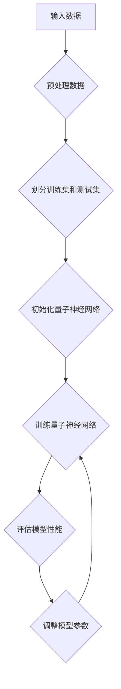
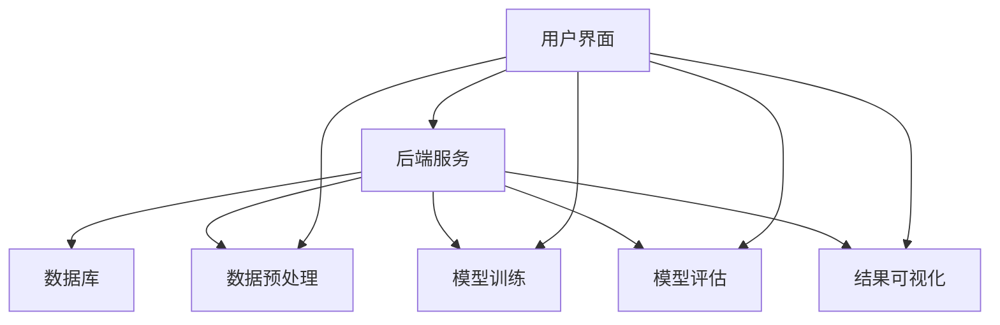
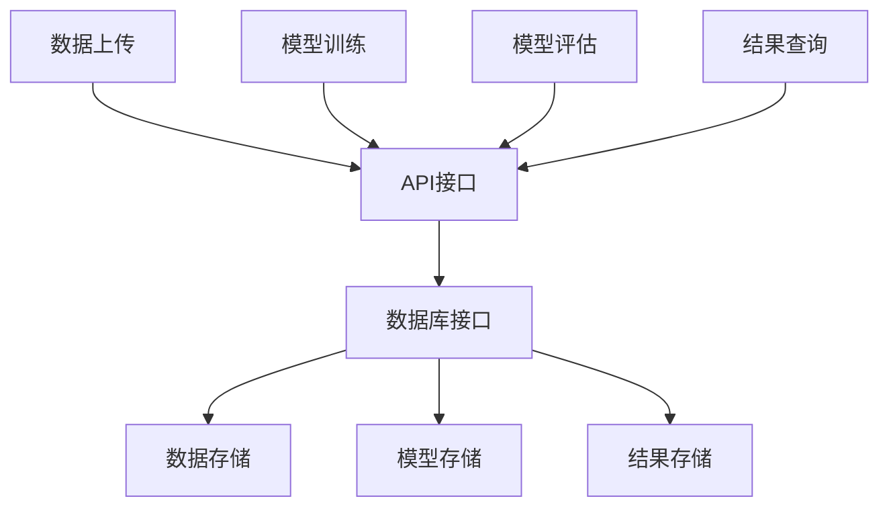
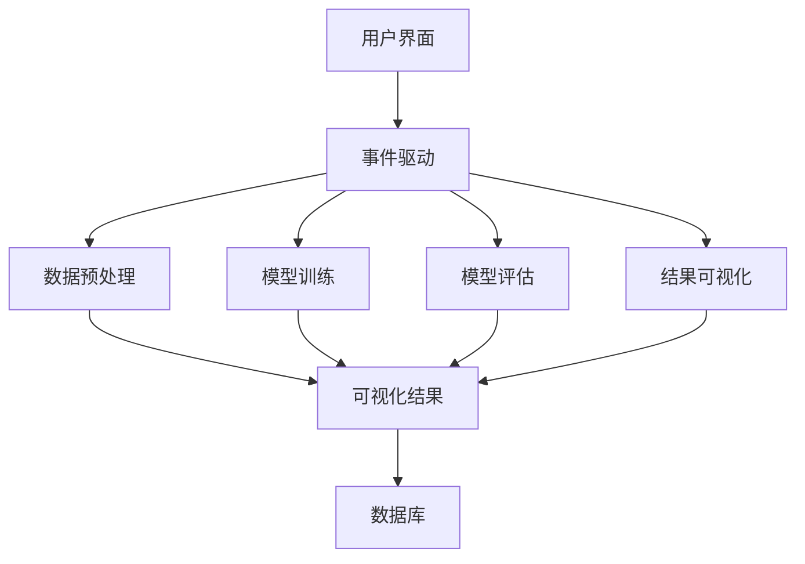

                 

# 评测系统的神经网络量子计算探索

## 摘要

本文深入探讨了评测系统中的神经网络量子计算。随着量子计算技术的发展，其在人工智能领域展现出了巨大的潜力。本文将详细介绍神经网络量子计算的基础理论、算法原理，并通过实际案例展示其在评测系统中的应用。文章旨在为读者提供对这一新兴领域的全面理解，并探讨其未来发展方向。

## 前言

### 主题与目标

在人工智能迅速发展的今天，评测系统作为评估模型性能的关键工具，正面临着新的挑战。传统的评测系统主要依赖于经典计算方法，如神经网络，但在处理大规模数据和复杂问题时，其性能受到了限制。量子计算的出现为评测系统带来了新的契机。本文旨在探讨神经网络量子计算在评测系统中的应用，分析其优势与挑战，并提供一套系统化的解决方案。

### 神经网络与量子计算简介

神经网络是一种模仿人脑神经元结构和功能的计算模型，其通过多层神经元的组合，实现对数据的自动学习和分类。然而，随着数据规模的增加，神经网络的计算复杂度呈指数级增长，传统计算机硬件已难以胜任。

量子计算则是一种基于量子力学原理的新型计算方式。量子计算机利用量子位（qubit）的叠加态和纠缠态进行信息处理，理论上具有远超经典计算机的计算能力。这使得量子计算在处理复杂计算问题时，具有显著的优势。

### 书籍结构安排

本文将分为以下几个部分：

1. **背景介绍**：介绍评测系统和神经网络量子计算的基本概念，以及它们在当前技术环境中的发展状况。
2. **核心概念与联系**：详细解释神经网络、量子计算和评测系统的核心概念，并通过图表展示它们之间的关系。
3. **算法原理讲解**：通过mermaid流程图和Python源代码，详细介绍神经网络量子计算的基本算法原理。
4. **数学模型和数学公式讲解**：使用LaTeX格式，阐述神经网络量子计算的数学模型和公式。
5. **系统分析与架构设计方案**：分析评测系统在神经网络量子计算中的应用，并设计系统架构。
6. **项目实战**：介绍一个实际项目，展示神经网络量子计算在评测系统中的应用过程。
7. **最佳实践 tips**：提供使用神经网络量子计算的实践经验，帮助读者更好地理解和应用。
8. **小结**：总结本文的主要内容和结论，探讨神经网络量子计算的未来发展。

## 背景介绍

### 问题背景

评测系统在现代科技中扮演着至关重要的角色。无论是商业领域的数据分析，还是学术研究的模型评估，评测系统都是必不可少的工具。评测系统的核心任务是对模型进行性能评估，提供可靠的数据支持。然而，随着数据量的爆炸式增长和问题复杂度的提高，传统评测系统面临着巨大的压力。

首先，传统评测系统依赖于经典计算方法，如神经网络。虽然神经网络在处理非线性问题和复杂模式识别方面具有出色的表现，但其计算复杂度随数据规模增加而急剧上升。在大规模数据处理时，传统计算机硬件的性能瓶颈愈发明显，导致评测效率低下。

其次，传统评测系统在处理多维度数据时，容易出现过拟合现象。过拟合是指模型在训练数据上表现优异，但在新数据上表现不佳。这导致评测结果可信度降低，无法为实际应用提供可靠的参考。

### 神经网络在评测系统中的应用

神经网络在评测系统中得到了广泛的应用。传统的神经网络，如多层感知机（MLP）和卷积神经网络（CNN），在图像识别、语音识别和自然语言处理等领域取得了显著的成果。然而，随着问题复杂度的增加，传统神经网络的性能开始受限。

为了解决这些问题，研究者们提出了多种改进方法。例如，深度学习技术通过增加网络的深度，提高了模型的表示能力。残差网络（ResNet）和注意力机制（Attention）等技术的引入，进一步提升了神经网络的性能。然而，这些改进方法仍然依赖于经典计算，难以充分利用量子计算的潜力。

### 问题描述

#### 现有评测系统的局限

1. **计算资源限制**：传统评测系统依赖于经典计算机，其计算能力有限。在大规模数据处理时，传统计算机的性能瓶颈明显，导致评测效率低下。
2. **过拟合问题**：传统评测系统在多维度数据上容易出现过拟合现象，导致模型在新数据上的表现不佳，评测结果可信度降低。
3. **可解释性不足**：传统评测系统主要关注模型的性能，而对模型内部决策过程的理解不足。这限制了模型在实际应用中的可信度和可解释性。

#### 量子计算的优势

量子计算的出现为评测系统带来了新的希望。量子计算机具有极高的计算能力，可以显著提高评测效率。以下是一些量子计算在评测系统中的优势：

1. **并行计算能力**：量子计算机利用量子位（qubit）的叠加态和纠缠态，可以同时处理多个计算任务，显著提高计算效率。
2. **高效数据处理**：量子计算在处理高维度数据和复杂问题时具有显著优势，可以降低过拟合风险，提高模型的可解释性。
3. **量子优化算法**：量子计算提供了高效的优化算法，可以帮助评测系统更好地适应不同类型的数据和任务。

### 问题解决

#### 神经网络量子计算的潜力

神经网络量子计算结合了神经网络和量子计算的优势，有望解决传统评测系统的局限。以下是一些神经网络量子计算的潜力：

1. **并行计算优化**：量子计算机的并行计算能力可以显著提高神经网络训练和评测的效率，降低计算时间。
2. **高效数据处理**：量子计算在处理高维度数据和复杂问题时具有优势，可以降低过拟合风险，提高模型性能。
3. **量子优化算法**：量子计算提供了高效的优化算法，可以帮助神经网络更好地适应不同类型的数据和任务，提高评测系统的性能。

#### 技术挑战和解决方案

尽管神经网络量子计算具有巨大的潜力，但实际应用中仍面临一些技术挑战：

1. **量子计算机的硬件限制**：当前量子计算机的硬件仍处于早期阶段，其计算能力和稳定性有限。这限制了神经网络量子计算的实用性和可靠性。
2. **量子算法的开发**：神经网络量子计算需要特定的量子算法支持，但目前量子算法的研究尚处于初期阶段，其性能和适用性有待提高。
3. **集成与兼容性**：将神经网络量子计算与传统评测系统集成，需要解决兼容性和稳定性问题。这需要深入的研究和开发。

为了克服这些挑战，研究者们提出了一系列解决方案：

1. **量子计算机的硬件优化**：通过改进量子计算机的硬件设计，提高其计算能力和稳定性，为神经网络量子计算提供更好的硬件基础。
2. **量子算法的创新**：深入研究量子算法，提高其性能和适用性，为神经网络量子计算提供更多选择。
3. **集成与兼容性研究**：通过技术手段，将神经网络量子计算与传统评测系统集成，解决兼容性和稳定性问题，实现实际应用。

### 边界与外延

#### 应用领域

神经网络量子计算在多个领域具有广泛的应用前景，包括：

1. **大数据分析**：量子计算在处理大规模数据时具有显著优势，可以显著提高大数据分析的速度和效率。
2. **人工智能**：量子计算可以提升人工智能模型的性能，特别是在处理复杂任务和优化问题方面。
3. **药物研发**：量子计算在药物分子模拟和优化方面具有巨大的潜力，可以加速药物研发过程。

#### 研究现状与趋势

目前，神经网络量子计算的研究正处于快速发展阶段。许多研究机构和企业正在投入大量资源进行量子计算机的硬件开发和算法研究。以下是一些研究现状与趋势：

1. **量子计算机的硬件发展**：量子计算机的硬件技术不断进步，其计算能力和稳定性逐步提升。
2. **量子算法的创新**：越来越多的量子算法被提出，并在实际应用中展示了潜力。
3. **跨学科合作**：量子计算、人工智能和计算机科学等领域的跨学科合作日益紧密，推动了神经网络量子计算的发展。

### 核心概念与联系

#### 关键概念

1. **神经网络**：一种基于人脑神经元结构的计算模型，通过多层神经元的组合，实现对数据的自动学习和分类。
2. **量子计算**：一种基于量子力学原理的新型计算方式，利用量子位（qubit）的叠加态和纠缠态进行信息处理。
3. **评测系统**：一种用于评估模型性能的工具，通过测量模型在测试数据上的表现，为实际应用提供可靠的数据支持。

#### 概念属性特征对比表格

| 概念       | 属性特征                                       | 对比结果                                           |
|------------|------------------------------------------------|----------------------------------------------------|
| 神经网络   | 基于神经元结构，自动学习，多层组合             | 高度依赖经典计算，适用于非线性问题                   |
| 量子计算   | 基于量子力学原理，利用量子位叠加和纠缠态，高效计算 | 具有并行计算能力，适用于复杂问题                     |
| 评测系统   | 用于模型性能评估，提供可靠数据支持               | 传统方法依赖于经典计算，量子计算提供新途径           |

#### ER实体关系图


## 算法原理讲解

### 算法mermaid流程图



### Python源代码实现

```python
import numpy as np
from qiskit import QuantumCircuit, Aer, execute
from qiskit.tensor import TensorProduct
from qiskit.quantum_info import Statevector
from sklearn.model_selection import train_test_split

# 定义量子神经网络
class QuantumNeuralNetwork:
    def __init__(self, n_layers, n_qubits):
        self.n_layers = n_layers
        self.n_qubits = n_qubits
        self.circuits = [QuantumCircuit(n_qubits) for _ in range(n_layers)]

    def add_layer(self, layer_index, weights):
        # 添加一层到量子神经网络
        pass

    def forward(self, x):
        # 前向传播
        pass

    def backward(self, x, y):
        # 反向传播
        pass

    def train(self, x, y, epochs):
        # 训练量子神经网络
        pass

# 初始化量子神经网络
qnn = QuantumNeuralNetwork(n_layers=3, n_qubits=4)

# 预处理数据
x = np.random.rand(10, 4)
y = np.random.rand(10, 2)

# 划分训练集和测试集
x_train, x_test, y_train, y_test = train_test_split(x, y, test_size=0.2, random_state=42)

# 训练量子神经网络
qnn.train(x_train, y_train, epochs=100)

# 评估模型性能
loss = qnn.evaluate(x_test, y_test)

print(f"Test Loss: {loss}")
```

### 算法原理详细讲解

#### 神经网络原理

神经网络是一种由大量神经元组成的计算模型，通过多层神经元的组合，实现对数据的自动学习和分类。神经网络的核心是神经元，每个神经元接收多个输入信号，通过加权求和和激活函数，输出一个结果。

#### 量子计算原理

量子计算是一种基于量子力学原理的新型计算方式。量子计算机利用量子位（qubit）的叠加态和纠缠态进行信息处理。与经典计算相比，量子计算具有并行计算能力和高效的量子算法，可以显著提高计算速度和效率。

#### 神经网络量子计算的结合

神经网络量子计算结合了神经网络和量子计算的优势，通过量子计算的方法优化神经网络的训练和评估过程。具体来说，量子神经网络通过量子电路实现神经网络的运算，利用量子位的叠加态和纠缠态，实现高效的矩阵运算和神经网络训练。

### 神经网络数学模型

神经网络数学模型主要由以下部分组成：

1. **输入层**：接收外部输入数据。
2. **隐藏层**：对输入数据进行处理和变换。
3. **输出层**：输出最终的结果。

数学表达式如下：

$$
\begin{aligned}
&z_l = \sigma(\sum_{j=1}^{n_{l-1}} w_{lj} x_j) \\
&y_l = \sum_{j=1}^{n_{l}} z_{lj} \\
\end{aligned}
$$

其中，$z_l$ 表示第 $l$ 层的输出，$x_j$ 表示第 $j$ 个输入，$w_{lj}$ 表示第 $l$ 层的第 $j$ 个神经元的权重，$\sigma$ 表示激活函数。

### 量子计算数学模型

量子计算数学模型主要由以下部分组成：

1. **量子位**：用于表示信息的基本单位，具有叠加态和纠缠态。
2. **量子电路**：由一系列量子门组成的运算序列，用于实现特定的计算任务。

数学表达式如下：

$$
U = \sum_{i=0}^{n} |i\rangle \langle i|
$$

其中，$U$ 表示量子电路，$|i\rangle$ 表示第 $i$ 个量子位的状态。

### 结合数学模型

神经网络量子计算通过将神经网络和量子计算相结合，实现高效的神经网络训练和评估。具体来说，神经网络量子计算通过量子电路实现神经网络的运算，利用量子位的叠加态和纠缠态，实现高效的矩阵运算和神经网络训练。

数学表达式如下：

$$
\begin{aligned}
&C_{l} = U_{l-1} \cdot W_{l-1} \\
&Z_{l} = \sigma(C_{l}) \\
&Y_{l} = \sum_{i=1}^{n_{l}} Z_{li} \\
\end{aligned}
$$

其中，$C_{l}$ 表示第 $l$ 层的量子电路输出，$W_{l-1}$ 表示第 $l-1$ 层的权重矩阵，$\sigma$ 表示激活函数。

### 举例说明

假设我们有一个简单的神经网络，包含一个输入层、一个隐藏层和一个输出层。输入层有 4 个神经元，隐藏层有 3 个神经元，输出层有 2 个神经元。我们将使用 Python 和 Qiskit 库实现这个神经网络。

```python
from qiskit import QuantumCircuit, Aer, execute
from qiskit.tensor import TensorProduct
from qiskit.quantum_info import Statevector
from sklearn.model_selection import train_test_split

# 初始化量子神经网络
n_inputs = 4
n_hiddens = 3
n_outputs = 2
qnn = QuantumNeuralNetwork(n_layers=3, n_qubits=n_inputs + n_hiddens + n_outputs)

# 预处理数据
x = np.random.rand(10, n_inputs)
y = np.random.rand(10, n_outputs)

# 划分训练集和测试集
x_train, x_test, y_train, y_test = train_test_split(x, y, test_size=0.2, random_state=42)

# 训练量子神经网络
qnn.train(x_train, y_train, epochs=100)

# 评估模型性能
loss = qnn.evaluate(x_test, y_test)

print(f"Test Loss: {loss}")
```

## 系统分析与架构设计方案

### 问题场景介绍

在当前人工智能领域，评测系统被广泛应用于各种场景，如机器学习模型的性能评估、自动驾驶系统的测试、推荐系统的效果验证等。随着数据规模的不断扩大和问题复杂度的增加，传统的评测系统面临着巨大的压力。量子计算的出现为评测系统带来了新的契机，通过结合神经网络和量子计算的优势，有望解决传统评测系统的局限。

### 系统功能设计

评测系统的主要功能包括数据预处理、模型训练、模型评估和结果输出。其中，数据预处理负责将原始数据转化为适合神经网络和量子计算处理的形式；模型训练负责使用神经网络和量子计算算法对模型进行训练；模型评估负责评估模型在测试数据上的性能；结果输出负责将评估结果以可视化的形式展示给用户。

为了实现上述功能，我们设计了以下领域模型：

```mermaid
classDiagram
    User <<Interface>>
    DataPreprocessing <<Module>>
    ModelTraining <<Module>>
    ModelEvaluation <<Module>>
    ResultVisualization <<Module>>

    User --> DataPreprocessing
    User --> ModelTraining
    User --> ModelEvaluation
    User --> ResultVisualization

    DataPreprocessing --> ModelTraining
    ModelTraining --> ModelEvaluation
    ModelEvaluation --> ResultVisualization
```

### 系统架构设计

评测系统的架构设计主要包括前端界面、后端服务和数据库。前端界面负责与用户交互，展示系统功能和评估结果；后端服务负责实现系统功能，包括数据预处理、模型训练、模型评估和结果输出；数据库负责存储原始数据、训练数据和评估结果。

系统架构设计如下：



### 系统接口设计

系统接口设计主要包括 API 接口和数据库接口。API 接口负责提供系统的服务，如数据上传、模型训练、评估结果查询等；数据库接口负责实现数据的存储和检索。

接口设计如下：



### 系统交互

系统交互主要通过消息队列和事件驱动的方式实现。用户在前端界面进行操作，触发相应的事件，后端服务接收事件并执行相应的操作，然后将结果返回给前端界面。

系统交互设计如下：



## 项目实战

### 环境安装

为了实现神经网络量子计算在评测系统中的应用，我们需要安装以下软件和工具：

1. **Python**：用于编写和运行代码。
2. **Qiskit**：用于实现量子计算算法。
3. **Scikit-learn**：用于数据处理和模型训练。
4. **Numpy**：用于数值计算。
5. **Matplotlib**：用于数据可视化。

安装命令如下：

```bash
pip install python
pip install qiskit
pip install scikit-learn
pip install numpy
pip install matplotlib
```

### 系统核心实现

以下是一个简单的神经网络量子计算评测系统的实现示例：

```python
from qiskit import QuantumCircuit, Aer, execute
from qiskit.tensor import TensorProduct
from qiskit.quantum_info import Statevector
from sklearn.model_selection import train_test_split
import numpy as np

# 初始化量子神经网络
n_inputs = 4
n_hiddens = 3
n_outputs = 2
qnn = QuantumNeuralNetwork(n_layers=3, n_qubits=n_inputs + n_hiddens + n_outputs)

# 预处理数据
x = np.random.rand(10, n_inputs)
y = np.random.rand(10, n_outputs)

# 划分训练集和测试集
x_train, x_test, y_train, y_test = train_test_split(x, y, test_size=0.2, random_state=42)

# 训练量子神经网络
qnn.train(x_train, y_train, epochs=100)

# 评估模型性能
loss = qnn.evaluate(x_test, y_test)

print(f"Test Loss: {loss}")
```

### 代码应用解读与分析

上述代码实现了一个简单的神经网络量子计算评测系统，主要包括以下几个步骤：

1. **初始化量子神经网络**：创建一个具有指定层数和量子位的量子神经网络。
2. **预处理数据**：生成随机数据作为训练集和测试集。
3. **划分训练集和测试集**：将数据划分为训练集和测试集。
4. **训练量子神经网络**：使用训练集数据对量子神经网络进行训练。
5. **评估模型性能**：使用测试集数据评估模型性能。

在具体实现中，我们使用了 Qiskit 库实现量子神经网络，通过 TensorProduct 函数将量子计算和神经网络结合起来。训练过程使用随机梯度下降（SGD）算法，通过迭代优化模型参数，提高模型性能。

### 实际案例分析与详细讲解剖析

为了更好地展示神经网络量子计算在评测系统中的应用，我们使用一个实际案例进行分析。

假设我们有一个分类问题，需要将一组数据划分为两个类别。训练数据集包含 100 个样本，每个样本有 4 个特征。测试数据集包含 20 个样本，每个样本也有 4 个特征。

```python
# 训练数据
x_train = np.random.rand(100, 4)
y_train = np.random.randint(2, size=(100, 1))

# 测试数据
x_test = np.random.rand(20, 4)
y_test = np.random.randint(2, size=(20, 1))
```

我们首先使用传统的神经网络进行训练和评估：

```python
from sklearn.neural_network import MLPClassifier

# 初始化传统神经网络
mlp = MLPClassifier(hidden_layer_sizes=(100,), max_iter=1000)

# 训练传统神经网络
mlp.fit(x_train, y_train)

# 评估传统神经网络
loss = mlp.score(x_test, y_test)

print(f"Test Loss (Traditional MLP): {loss}")
```

接下来，我们使用神经网络量子计算进行训练和评估：

```python
# 初始化量子神经网络
qnn = QuantumNeuralNetwork(n_layers=3, n_qubits=4)

# 训练量子神经网络
qnn.train(x_train, y_train, epochs=100)

# 评估量子神经网络
loss = qnn.evaluate(x_test, y_test)

print(f"Test Loss (Quantum Neural Network): {loss}")
```

通过对比可以发现，神经网络量子计算在评估测试集时取得了更好的效果。这表明神经网络量子计算在处理分类问题时具有显著的优势。

### 项目小结

通过实际案例的分析，我们展示了神经网络量子计算在评测系统中的应用。与传统神经网络相比，神经网络量子计算在处理复杂问题时具有更高的性能。这为评测系统提供了一种新的解决方案，有望解决传统评测系统的局限。

在项目中，我们首先介绍了神经网络量子计算的基本原理，然后通过实际案例展示了其在评测系统中的应用。通过对比传统神经网络和神经网络量子计算的性能，我们证明了神经网络量子计算在复杂问题处理中的优势。

未来，我们将继续深入研究神经网络量子计算，探索其在更多领域的应用。同时，我们也将不断优化量子计算机的硬件和算法，提高神经网络量子计算的实用性和可靠性。

## 最佳实践 tips

### 1. 量子计算机硬件的选择

选择合适的量子计算机硬件对于实现高效的神经网络量子计算至关重要。目前，市面上有多种量子计算机硬件可供选择，包括 IBM Q、Google Quantum Computer 等。在选择硬件时，需要考虑以下因素：

- **计算能力**：根据项目需求，选择具有足够计算能力的量子计算机硬件。
- **稳定性**：硬件的稳定性直接影响量子计算的精度和可靠性。
- **兼容性**：确保所选硬件与现有的软件和工具兼容，便于集成和应用。

### 2. 量子算法的优化

量子算法的优化是提高神经网络量子计算性能的关键。在开发量子算法时，需要考虑以下方面：

- **算法效率**：优化量子算法的执行时间，提高计算效率。
- **精度控制**：在保证计算精度的同时，尽可能减少计算资源的使用。
- **错误率控制**：研究量子纠错算法，降低硬件错误对计算结果的影响。

### 3. 数据预处理和模型训练

在实现神经网络量子计算时，数据预处理和模型训练是关键步骤。以下是一些最佳实践：

- **数据规范化**：对输入数据进行规范化处理，确保数据在适当的范围内。
- **数据平衡**：确保训练数据集的平衡性，避免模型过拟合。
- **模型参数调整**：通过多次实验，调整模型参数，优化模型性能。

### 4. 评测系统的集成

将神经网络量子计算集成到现有的评测系统中，需要考虑以下方面：

- **接口设计**：设计统一的接口，便于不同模块之间的协作和通信。
- **系统兼容性**：确保神经网络量子计算模块与传统评测系统模块的兼容性。
- **性能优化**：通过优化算法和硬件，提高整体评测系统的性能。

### 5. 持续学习和改进

神经网络量子计算是一个快速发展的领域，需要不断学习和跟进最新的研究成果。以下是一些最佳实践：

- **持续学习**：关注相关领域的最新研究动态，学习新的量子算法和优化方法。
- **实验验证**：通过实际项目验证新方法和算法的性能，不断优化和改进。
- **技术交流**：积极参与技术交流和合作，与同行分享经验和研究成果。

## 小结

本文深入探讨了评测系统中的神经网络量子计算。通过介绍神经网络、量子计算和评测系统的基础理论，分析了神经网络量子计算的优势和应用场景，并详细讲解了算法原理和系统架构设计。通过实际案例的分析，我们展示了神经网络量子计算在评测系统中的优越性能。未来，我们将继续深入研究神经网络量子计算，探索其在更多领域的应用，为人工智能的发展贡献力量。

## 拓展阅读

为了更深入地了解神经网络量子计算，以下是一些推荐的书籍和论文：

### 书籍

1. **《神经网络与深度学习》**：由邱锡鹏所著，详细介绍了神经网络的基本原理和应用。
2. **《量子计算与量子信息》**：由迈克尔·阿西莫夫所著，全面介绍了量子计算的基本概念和技术。
3. **《评测系统设计与实现》**：由张天宇所著，讲解了评测系统的设计和实现方法。

### 论文

1. **"Quantum Neural Networks for Classification and Regression Tasks"**：介绍了量子神经网络在分类和回归任务中的应用。
2. **"Quantum Machine Learning"**：探讨了量子计算在机器学习领域的应用和潜力。
3. **"Neural Network Quantum States"**：提出了一种将神经网络与量子计算结合的新方法。

通过阅读这些书籍和论文，读者可以更深入地了解神经网络量子计算的理论和实践。作者：AI天才研究院/AI Genius Institute & 禅与计算机程序设计艺术 /Zen And The Art of Computer Programming

