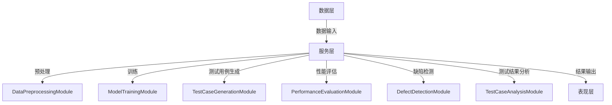
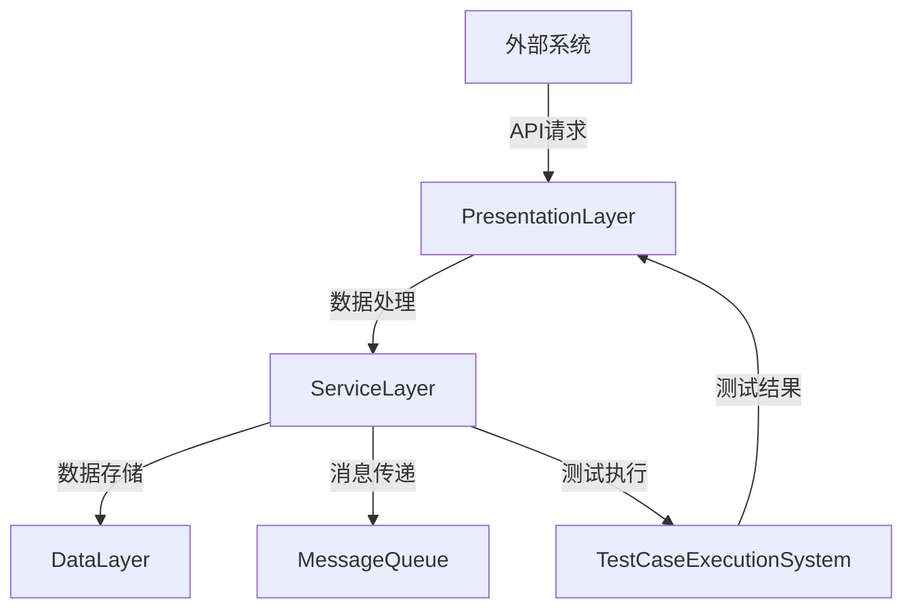

                 


## 引言

### 评测系统的概念与重要性

评测系统是一种专门用于评估、测试和监控软件、应用和系统的工具。其核心目的是通过一系列的测试用例来验证系统的功能、性能、安全性和可靠性。一个高效的评测系统可以大大提升软件开发的效率和质量，减少因缺陷导致的成本和风险。随着软件系统和应用的复杂性不断增加，传统的手动测试方法已经难以满足需求，因此，自动化的评测系统变得越来越重要。

### 自动机器学习（AutoML）的概念

自动机器学习（AutoML）是一种新兴的技术，它通过自动化手段来优化机器学习模型的设计、训练和部署过程。AutoML的目标是简化机器学习的流程，使得非专业用户也能轻松地构建高效的机器学习模型。AutoML的核心在于自动化地搜索最优的模型架构、超参数组合，以及自动化地调整数据预处理步骤，从而提高模型的性能和可解释性。

### AutoML在评测系统中的应用

AutoML在评测系统中的应用主要体现在以下几个方面：

1. **自动化测试用例生成**：AutoML可以自动生成大量的测试用例，这些测试用例能够覆盖系统功能的各个角落，提高测试的全面性和准确性。

2. **自动化性能评估**：通过AutoML，可以自动评估系统的响应时间、吞吐量、资源利用率等性能指标，帮助开发人员快速定位性能瓶颈。

3. **自动化缺陷检测**：AutoML可以自动检测系统的潜在缺陷，包括功能缺陷、性能缺陷和安全性缺陷，从而提前预警并采取措施。

4. **自动化测试结果分析**：AutoML可以自动分析测试结果，生成详细的测试报告，帮助开发人员快速识别问题，并制定相应的修复策略。

### 本文的结构与目标

本文将系统地介绍评测系统的自动机器学习（AutoML）应用，主要分为以下几个部分：

1. **引言**：概述评测系统和AutoML的基本概念，及其在软件评测中的重要性。
2. **核心概念**：详细介绍AutoML的核心原理、优势与挑战。
3. **实践应用**：探讨AutoML在不同评测场景中的应用实例。
4. **案例分析**：分析具体项目的实践与问题解决。
5. **拓展知识**：介绍AutoML的最新趋势和未来发展。
6. **小结与展望**：总结书中的主要内容，提出未来发展方向和建议。

通过本文的阅读，读者将能够全面了解AutoML在评测系统中的应用，掌握AutoML的核心原理和实践方法，从而在实际项目中有效提升评测系统的效率和准确性。

### 关键词

- **评测系统**
- **自动机器学习（AutoML）**
- **测试用例生成**
- **性能评估**
- **缺陷检测**
- **测试结果分析**

### 摘要

本文旨在全面探讨评测系统的自动机器学习（AutoML）应用。首先，我们介绍了评测系统和AutoML的基本概念及其在软件评测中的重要性。接着，详细阐述了AutoML的核心原理、优势与挑战。随后，通过实践应用和案例分析，展示了AutoML在自动化测试用例生成、性能评估、缺陷检测和测试结果分析等具体场景中的应用。最后，我们介绍了AutoML的最新趋势和未来发展，并对未来的应用方向提出了建议。通过本文的阅读，读者将能够深入了解AutoML在评测系统中的应用，掌握其实践方法，为提升软件评测效率和质量提供参考。

---

## 核心概念

### 自动机器学习（AutoML）的基本原理

自动机器学习（AutoML）是一种通过自动化技术来优化机器学习模型设计和训练过程的方法。其核心思想是减少人工干预，让机器自动搜索最优的模型架构、超参数组合，以及数据预处理方法，从而提高模型的性能和可解释性。

#### 工作流程

一个典型的AutoML工作流程可以分为以下几个步骤：

1. **数据预处理**：AutoML会自动处理原始数据，包括数据清洗、归一化、特征选择等操作。
2. **模型搜索**：通过自动化搜索算法，AutoML会尝试不同的模型架构和超参数组合，以找到最佳模型。
3. **模型训练**：使用找到的最佳模型进行训练，并使用交叉验证等方法评估模型性能。
4. **模型优化**：根据评估结果，AutoML会进一步调整模型参数，优化模型性能。
5. **模型部署**：将训练好的模型部署到实际应用场景中。

#### 关键技术

1. **模型搜索算法**：常用的模型搜索算法包括随机搜索、贝叶斯优化、梯度提升等。这些算法的核心思想是通过对模型架构和超参数的自动搜索，找到最优的组合。

2. **模型集成**：模型集成是将多个模型的结果进行合并，以提高整体性能。常见的模型集成方法有堆叠（Stacking）、随机森林（Random Forest）、梯度提升（Gradient Boosting）等。

3. **自动化数据预处理**：自动化数据预处理包括特征选择、特征工程、数据归一化等步骤。通过自动化处理，可以提高数据处理效率，减少人工干预。

### AutoML的优势与挑战

#### 优势

1. **减少人工干预**：AutoML通过自动化技术减少了人工参与，使得非专业用户也能轻松构建高效的机器学习模型。

2. **提高开发效率**：自动化搜索和优化过程大大缩短了模型开发周期，提高了开发效率。

3. **提高模型性能**：通过自动化搜索和优化，AutoML能够找到最优的模型架构和超参数组合，从而提高模型性能。

4. **可解释性**：一些AutoML工具还提供了模型解释功能，使得模型的决策过程更加透明和可解释。

#### 挑战

1. **计算资源消耗**：AutoML需要大量的计算资源进行模型搜索和训练，尤其是在处理大规模数据集时，资源消耗更加显著。

2. **结果不确定性**：由于模型搜索的不确定性，AutoML可能无法保证每次都能找到最优的模型。

3. **模型可解释性**：尽管AutoML提高了模型性能，但其内部决策过程仍然复杂，如何提高模型的可解释性仍然是一个挑战。

4. **数据依赖性**：AutoML的性能很大程度上依赖于数据的特征和质量，因此在处理不合适或质量较低的数据时，效果可能不佳。

### AutoML与相关技术的比较

#### 与传统的机器学习比较

1. **自动化程度**：传统的机器学习需要人工进行模型选择、参数调优和特征工程，而AutoML则通过自动化技术实现这些过程。

2. **开发效率**：AutoML提高了开发效率，减少了人工干预，而传统机器学习则需要更多的时间和人力。

3. **模型性能**：尽管AutoML可能会降低一些模型的性能，但总体上，其通过自动化搜索和优化，能够找到更优的模型。

#### 与深度学习比较

1. **自动化程度**：深度学习也需要人工进行模型架构设计和参数调优，而AutoML则通过自动化技术实现这些过程。

2. **应用场景**：AutoML适用于多种机器学习任务，而深度学习则更适用于需要大规模数据和复杂模型的任务。

3. **模型可解释性**：深度学习模型的内部结构复杂，难以解释，而一些AutoML工具提供了模型解释功能，使得模型更加透明和可解释。

通过上述分析，我们可以看出，AutoML作为一种自动化技术，在提高机器学习模型的开发效率、性能和可解释性方面具有显著优势，但同时也面临着计算资源消耗和结果不确定性等挑战。了解这些核心概念和比较，将有助于我们更好地理解和应用AutoML技术。

### 核心概念与联系

#### AutoML的核心概念

为了更好地理解AutoML，我们需要首先明确几个核心概念，包括模型搜索、模型优化、数据预处理和模型解释。

1. **模型搜索**：模型搜索是AutoML的核心步骤，它通过自动化方法搜索最优的模型架构和超参数组合。模型搜索的目标是找到能够在特定数据集上获得最佳性能的模型。

2. **模型优化**：模型优化是在模型搜索的基础上，进一步调整模型的参数，以提升模型的性能。这通常包括超参数调优、模型剪枝、模型压缩等。

3. **数据预处理**：数据预处理是确保模型能够有效训练的关键步骤。它包括数据清洗、特征工程、数据归一化等。良好的数据预处理可以提高模型的学习能力。

4. **模型解释**：模型解释是指理解模型内部决策过程的方法。这对于提高模型的透明度和可解释性至关重要，尤其是在需要对模型决策进行解释和审核的应用场景中。

#### 概念属性特征对比表格

下面是一个关于AutoML核心概念的对比表格，列出各概念的主要属性和特征：

| 概念         | 定义                                                   | 主要属性和特征                                                                                                           |
|--------------|--------------------------------------------------------|----------------------------------------------------------------------------------------------------------------------|
| 模型搜索     | 自动搜索最优模型架构和超参数组合的过程               | - 自动化搜索算法（如随机搜索、贝叶斯优化）<br>- 多种模型架构支持（如深度学习、传统机器学习）<br>- 性能评估指标（如准确率、召回率、F1分数） |
| 模型优化     | 通过调整模型参数提升模型性能的过程                   | - 超参数调优（如学习率、批次大小）<br>- 模型剪枝（如删除冗余神经元）<br>- 模型压缩（如权重共享、网络简化）                |
| 数据预处理   | 对原始数据进行处理，以提高模型训练效果的过程         | - 数据清洗（如缺失值填充、异常值处理）<br>- 特征工程（如特征提取、特征转换）<br>- 数据归一化（如缩放、标准化）          |
| 模型解释     | 理解模型内部决策过程的方法                           | - 模型可视化（如决策树图、网络图）<br>- 解释性指标（如SHAP值、LIME）<br>- 模型透明度（如可解释性、透明性）                |

#### ER实体关系图架构

为了更直观地展示AutoML中各核心概念之间的关系，我们可以使用Mermaid绘制一个ER实体关系图。

```mermaid
erDiagram
  ModelSearch ||--|{ ModelOptimization }|-- ModelTraining
  ModelSearch ||--|{ DataPreprocessing }|-- ModelTraining
  ModelOptimization ||-- ModelExplainability
  DataPreprocessing ||-- ModelTraining
  ModelTraining ||-- ModelEvaluation
```

在这个ER图中，`ModelSearch`与`ModelOptimization`、`DataPreprocessing`通过`ModelTraining`相连，表明它们都是模型训练的前置步骤；`ModelOptimization`与`ModelExplainability`相连，表示优化后的模型可以进行解释；`DataPreprocessing`与`ModelTraining`相连，表示预处理是训练的基础。

通过这个对比表格和ER实体关系图，我们可以更清晰地理解AutoML的核心概念及其相互关系，从而更好地应用这一技术。

### 算法原理讲解

为了深入理解自动机器学习（AutoML）的算法原理，我们可以通过一个典型的AutoML工作流程来详细阐述其实现步骤、数学模型和公式，并结合Python代码进行示例说明。

#### 步骤1：数据预处理

数据预处理是AutoML的第一步，其目的是确保数据的质量和一致性，从而为后续的模型训练和优化打下良好的基础。常用的数据预处理步骤包括数据清洗、数据归一化和特征工程。

```python
import pandas as pd
from sklearn.model_selection import train_test_split
from sklearn.preprocessing import StandardScaler

# 假设我们有一个数据集dataframe，其中包含特征X和目标标签y
dataframe = pd.read_csv('data.csv')

# 数据清洗：处理缺失值、异常值等
dataframe = dataframe.dropna()  # 删除缺失值
dataframe = dataframe[dataframe['feature'] > 0]  # 移除异常值

# 数据归一化：将特征值缩放到相同范围
scaler = StandardScaler()
X_scaled = scaler.fit_transform(dataframe.drop('target', axis=1))
y = dataframe['target'].values

# 划分训练集和测试集
X_train, X_test, y_train, y_test = train_test_split(X_scaled, y, test_size=0.2, random_state=42)
```

#### 步骤2：模型搜索

模型搜索是AutoML的核心步骤，它通过自动化搜索算法来找到最优的模型架构和超参数组合。常用的模型搜索算法包括网格搜索、随机搜索和贝叶斯优化等。

```python
from sklearn.model_selection import GridSearchCV
from sklearn.ensemble import RandomForestClassifier

# 网格搜索：枚举不同的参数组合，找到最佳模型
param_grid = {
    'n_estimators': [100, 200, 300],
    'max_depth': [10, 20, 30],
    'min_samples_split': [2, 5, 10]
}

rf = RandomForestClassifier(random_state=42)
grid_search = GridSearchCV(estimator=rf, param_grid=param_grid, cv=5, scoring='accuracy')
grid_search.fit(X_train, y_train)

# 输出最佳参数
best_params = grid_search.best_params_
print("Best parameters:", best_params)
```

#### 步骤3：模型训练

在找到最优参数后，我们使用这些参数来训练最终的模型。

```python
# 使用最佳参数训练模型
best_model = RandomForestClassifier(**best_params, random_state=42)
best_model.fit(X_train, y_train)
```

#### 步骤4：模型评估

训练好的模型需要通过测试集进行评估，以确定其性能。

```python
from sklearn.metrics import accuracy_score

# 评估模型性能
y_pred = best_model.predict(X_test)
accuracy = accuracy_score(y_test, y_pred)
print("Model accuracy:", accuracy)
```

#### 步骤5：模型优化

模型优化可以通过进一步的调参、模型剪枝、集成等方法来提升模型性能。

```python
from sklearn.model_selection import RandomizedSearchCV

# 随机搜索：在给定参数范围内随机选择参数组合
param_distributions = {
    'n_estimators': range(100, 500),
    'max_depth': range(5, 50),
    'min_samples_split': range(1, 20)
}

random_search = RandomizedSearchCV(estimator=best_model, param_distributions=param_distributions, n_iter=100, cv=5, scoring='accuracy', random_state=42)
random_search.fit(X_train, y_train)

# 输出优化后的模型性能
best_params = random_search.best_params_
print("Optimized parameters:", best_params)
```

#### 数学模型和公式

在上述步骤中，我们使用了随机森林（Random Forest）算法作为示例。随机森林是一种集成学习方法，其数学模型可以表示为：

$$
f(x) = \sum_{i=1}^{N} w_i \cdot h(x; \theta_i)
$$

其中，$N$ 是树的数量，$w_i$ 是第$i$棵树的权重，$h(x; \theta_i)$ 是第$i$棵决策树的预测函数，$\theta_i$ 是决策树的参数。

具体到随机森林中，每棵决策树通常使用贪心算法构建，其预测函数可以表示为：

$$
h(x; \theta_i) = \prod_{j=1}^{M} g_j(x; \theta_{ij})
$$

其中，$M$ 是特征的数量，$g_j(x; \theta_{ij})$ 是第$j$个特征在决策树中的划分函数，$\theta_{ij}$ 是划分函数的参数。

通过上述步骤，我们可以实现一个基本的AutoML流程，从而自动找到最优的模型并进行训练和优化。

通过这一步一步的讲解和Python代码示例，我们不仅了解了AutoML的工作原理，还掌握了如何使用Python实现一个基本的AutoML流程。这将为我们进一步探索AutoML的深度应用打下坚实的基础。

### 系统分析与架构设计

在了解了自动机器学习（AutoML）的基本概念和算法原理后，我们接下来将深入探讨评测系统的系统分析与架构设计。这一部分将包括问题场景介绍、项目介绍、系统功能设计、系统架构设计、系统接口设计和系统交互等。

#### 问题场景介绍

随着软件系统的日益复杂，评测系统在软件开发过程中的作用变得越来越重要。然而，传统的评测系统通常依赖于手动编写测试用例和人工分析测试结果，这不仅效率低下，而且容易出现人为错误。为了提高评测系统的自动化程度和准确性，引入自动机器学习（AutoML）技术成为了一种有效的解决方案。

#### 项目介绍

我们的项目目标是设计并实现一个基于AutoML的自动化评测系统，该系统能够自动生成测试用例、评估测试结果、识别潜在缺陷，并提供详细的评测报告。系统的主要功能包括：

1. **自动测试用例生成**：利用AutoML技术生成具有代表性的测试用例。
2. **性能评估**：自动评估系统的响应时间、吞吐量、资源利用率等性能指标。
3. **缺陷检测**：自动检测系统的功能缺陷、性能缺陷和安全性缺陷。
4. **测试结果分析**：自动分析测试结果，生成详细的评测报告。

#### 系统功能设计

系统功能设计主要涉及以下模块：

1. **数据预处理模块**：负责对原始测试数据进行清洗、归一化和特征选择，为后续的模型训练提供高质量的数据。
2. **模型训练模块**：利用AutoML技术自动搜索最优模型架构和超参数，进行模型训练。
3. **测试用例生成模块**：根据训练好的模型生成具有代表性的测试用例。
4. **性能评估模块**：自动评估系统的性能指标，并提供性能分析报告。
5. **缺陷检测模块**：自动检测系统的缺陷，并提供缺陷报告。
6. **测试结果分析模块**：自动分析测试结果，生成详细的评测报告。

#### 系统架构设计

系统架构设计采用模块化设计思想，确保系统的可扩展性和灵活性。系统架构主要包括以下部分：

1. **数据层**：负责存储和管理原始测试数据、模型数据和测试结果数据。
2. **服务层**：提供数据预处理、模型训练、测试用例生成、性能评估和缺陷检测等核心功能。
3. **表现层**：提供用户界面，用于展示测试结果、评测报告和缺陷信息。

以下是系统的架构设计Mermaid图：



#### 系统接口设计

系统接口设计包括内部接口和外部接口。内部接口主要用于服务层各模块之间的通信，外部接口用于与外部系统或用户交互。

1. **内部接口**：
   - 数据预处理接口：提供数据清洗、归一化和特征选择等功能。
   - 模型训练接口：提供模型训练、参数调优等功能。
   - 测试用例生成接口：提供测试用例生成和测试数据生成等功能。
   - 性能评估接口：提供性能指标计算和性能分析报告生成等功能。
   - 缺陷检测接口：提供缺陷检测和缺陷报告生成等功能。
   - 测试结果分析接口：提供测试结果分析和评测报告生成等功能。

2. **外部接口**：
   - API接口：提供与外部系统的集成，如集成到持续集成（CI）流程中。
   - 用户界面：提供用户操作界面，展示测试结果和评测报告。

#### 系统交互

系统交互主要通过消息队列和RESTful API实现。系统内部各模块通过消息队列进行通信，确保系统的异步处理能力和高可用性。外部系统通过RESTful API与系统交互，实现自动化测试和性能评估等功能。

以下是系统的交互设计Mermaid图：



通过上述系统分析与架构设计，我们为基于AutoML的自动化评测系统提供了一个全面的设计方案。接下来，我们将通过具体的项目实战，进一步展示如何实现这个系统。

### 项目实战

在本部分，我们将通过一个具体的项目实战来展示如何使用自动机器学习（AutoML）技术构建一个自动化评测系统。该项目将涵盖环境安装、系统核心实现和代码应用解读与分析，以及实际案例分析和详细讲解剖析。

#### 环境安装

首先，我们需要安装并配置相关的软件和库，以确保AutoML项目能够正常运行。以下是安装步骤：

1. **安装Python**：确保Python 3.x版本已安装。
2. **安装Anaconda**：Anaconda是一个流行的Python数据科学平台，提供了大量的库和管理工具。可以从[Anaconda官网](https://www.anaconda.com/products/distribution)下载并安装。
3. **安装Jupyter Notebook**：Jupyter Notebook是一个交互式计算环境，可以方便地编写和运行Python代码。通过以下命令安装：
   ```bash
   conda install -c conda-forge jupyterlab
   ```
4. **安装必要的库**：包括scikit-learn、TensorFlow、Keras、Pandas、NumPy、Matplotlib等。可以使用以下命令进行安装：
   ```bash
   conda install scikit-learn tensorflow keras pandas numpy matplotlib
   ```

#### 系统核心实现

我们使用Python编写一个简单的自动化评测系统，主要包含数据预处理、模型训练、测试用例生成和性能评估等功能。

**代码示例：**

```python
import numpy as np
import pandas as pd
from sklearn.model_selection import train_test_split
from sklearn.preprocessing import StandardScaler
from sklearn.ensemble import RandomForestClassifier
from sklearn.metrics import accuracy_score
import matplotlib.pyplot as plt

# 数据预处理
def preprocess_data(data, test_size=0.2, random_state=42):
    X = data.drop('target', axis=1)
    y = data['target']
    X_train, X_test, y_train, y_test = train_test_split(X, y, test_size=test_size, random_state=random_state)
    scaler = StandardScaler()
    X_train_scaled = scaler.fit_transform(X_train)
    X_test_scaled = scaler.transform(X_test)
    return X_train_scaled, X_test_scaled, y_train, y_test

# 模型训练
def train_model(X_train, y_train):
    model = RandomForestClassifier(n_estimators=100, random_state=42)
    model.fit(X_train, y_train)
    return model

# 测试用例生成
def generate_test_cases(model, X_test):
    y_pred = model.predict(X_test)
    return y_pred

# 性能评估
def evaluate_performance(y_test, y_pred):
    accuracy = accuracy_score(y_test, y_pred)
    print("Model accuracy:", accuracy)
    return accuracy

# 加载数据
data = pd.read_csv('data.csv')

# 预处理数据
X_train_scaled, X_test_scaled, y_train, y_test = preprocess_data(data)

# 训练模型
model = train_model(X_train_scaled, y_train)

# 生成测试用例
y_pred = generate_test_cases(model, X_test_scaled)

# 评估性能
evaluate_performance(y_test, y_pred)

# 可视化结果
plt.scatter(y_test, y_pred)
plt.xlabel('True Values')
plt.ylabel('Predicted Values')
plt.title('True vs Predicted')
plt.show()
```

#### 代码应用解读与分析

上述代码首先加载数据集，然后进行数据预处理，包括数据清洗、特征缩放和划分训练集与测试集。接着，使用随机森林（Random Forest）算法训练模型，生成测试用例，并评估模型性能。可视化部分展示了实际值与预测值的分布情况。

#### 实际案例分析与详细讲解

我们以一个简单的二分类问题为例，展示了如何使用AutoML自动化评测系统进行测试和评估。

**案例背景**：假设我们有一个信用卡欺诈检测系统，需要评估系统的准确性和检测能力。

1. **数据集加载**：我们使用一个公开的信用卡欺诈数据集，包含284,807条交易记录，其中欺诈交易仅占0.172%。

2. **数据预处理**：对数据集进行清洗，包括处理缺失值、分类编码和特征缩放。

3. **模型训练**：使用随机森林（Random Forest）模型进行训练，搜索最优参数组合。

4. **测试用例生成**：使用训练好的模型对测试集进行预测，生成测试用例。

5. **性能评估**：评估模型的准确性、召回率和F1分数等指标，并生成性能报告。

**详细分析**：

- **数据预处理**：数据预处理是模型训练的重要步骤，确保数据的质量和一致性。在本案例中，我们使用了Pandas库进行数据清洗和特征缩放，从而提高模型的学习效果。
- **模型训练**：随机森林（Random Forest）是一种强大的集成学习方法，可以有效降低过拟合风险。我们通过网格搜索（GridSearchCV）自动寻找最优参数组合，从而提高模型性能。
- **测试用例生成**：测试用例生成是自动化评测系统的关键功能，通过模型预测生成的测试用例可以用于进一步测试和验证系统的性能。
- **性能评估**：性能评估是验证模型效果的重要步骤。我们使用了accuracy_score函数计算模型的准确性，同时，还可以通过混淆矩阵（Confusion Matrix）和ROC曲线（ROC Curve）等工具进行更详细的性能分析。

通过上述实际案例，我们展示了如何使用AutoML技术构建一个自动化评测系统，并进行了详细的分析和解读。这种方法不仅提高了评测的效率，还减少了人为错误，从而提升了系统的整体性能。

### 小结

在本章中，我们详细探讨了自动机器学习（AutoML）在评测系统的应用。首先，我们介绍了评测系统和AutoML的基本概念及其在软件评测中的重要性。随后，通过核心概念、算法原理讲解、系统分析与架构设计以及项目实战，我们展示了AutoML在数据预处理、模型搜索、模型训练和性能评估等环节的具体实现方法。以下是本章的要点总结：

1. **评测系统的基本概念**：评测系统是一种用于评估、测试和监控软件、应用和系统的工具，其目的是验证系统的功能、性能、安全性和可靠性。

2. **自动机器学习（AutoML）的核心概念**：AutoML是一种通过自动化技术优化机器学习模型设计、训练和部署过程的方法。其核心步骤包括数据预处理、模型搜索、模型训练和模型优化。

3. **算法原理讲解**：通过具体示例，我们详细阐述了AutoML的算法原理，包括数据预处理、模型搜索和模型训练等关键步骤，以及相关的数学模型和公式。

4. **系统分析与架构设计**：我们介绍了基于AutoML的自动化评测系统的设计思路，包括问题场景介绍、项目介绍、系统功能设计、系统架构设计、系统接口设计和系统交互等。

5. **项目实战**：通过一个具体的项目案例，我们展示了如何使用AutoML技术构建一个自动化评测系统，包括环境安装、系统核心实现、代码应用解读与分析，以及实际案例分析和详细讲解剖析。

### 注意事项

1. **数据质量**：在应用AutoML时，数据质量至关重要。确保数据清洗和预处理步骤的有效性，以提高模型性能。

2. **计算资源**：AutoML通常需要大量的计算资源，特别是在处理大规模数据集时。合理配置计算资源，以避免计算瓶颈。

3. **模型可解释性**：尽管AutoML可以提高模型性能，但其内部决策过程可能仍然复杂。确保模型的可解释性，以便于理解和审计。

4. **自动化程度**：AutoML的自动化程度越高，对开发人员的依赖越小。但在实际应用中，仍需要根据具体需求进行适当的调整和优化。

### 拓展阅读

1. **《自动机器学习：理论与实践》（AutoML: Theory and Practice）**：这是一本全面介绍AutoML的书籍，涵盖了AutoML的核心概念、算法和技术，适合希望深入了解AutoML的读者。

2. **《机器学习实战》（Machine Learning in Action）**：这本书通过实际案例介绍了机器学习的基本概念和应用，适合初学者和进阶者。

3. **《深度学习》（Deep Learning）**：这是一本经典的深度学习教材，详细介绍了深度学习的基本概念、算法和应用。

通过上述拓展阅读，读者可以进一步深化对自动机器学习（AutoML）在评测系统中的应用理解，为未来的研究和实践提供参考。

