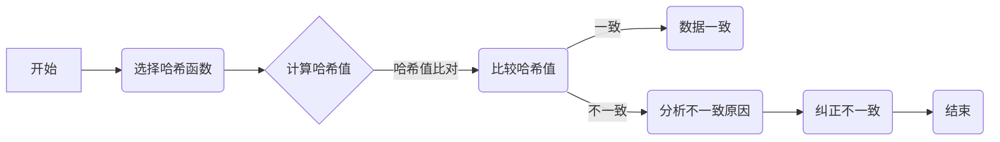
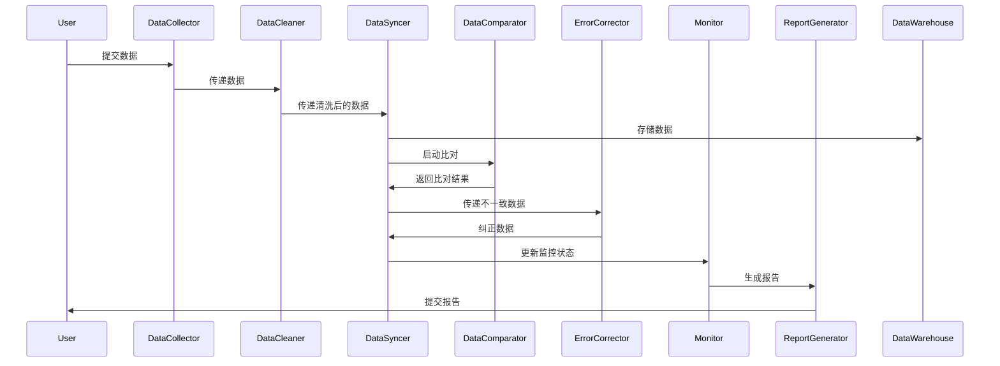
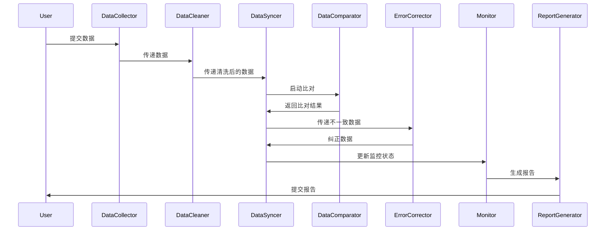

                 


### 文章标题：评测结果的一致性验证机制

关键词：评测结果、一致性验证、算法原理、系统架构、项目实战

摘要：本文深入探讨了评测结果的一致性验证机制，从核心概念、算法原理到实际应用，系统性地解析了评测结果一致性验证的重要性、实现方法以及最佳实践。通过一步步的分析和推理，本文旨在为从事数据分析、质量保证等领域的专业人士提供有价值的参考。

----------------------------------------------------------------

### 目录大纲设计思路

为了设计出《评测结果的一致性验证机制》这本书的完整目录大纲，我们首先需要明确几个核心内容：

1. **书籍主题与目标读者**：
   - 书籍主题是评测结果的一致性验证机制，这通常涉及到数据分析、质量保证、统计检验等领域。
   - 目标读者可能是数据分析师、数据科学家、质量保证工程师等，需要他们对一致性验证有深入理解。

2. **章节内容规划**：
   - **背景介绍**：介绍一致性验证的背景，包括问题背景、问题描述、解决思路等。
   - **核心概念与联系**：定义一致性验证中的核心概念，分析其属性特征，使用表格和图表进行对比。
   - **算法原理讲解**：详细讲解一致性验证相关的算法原理，使用 Mermaid 绘制流程图，并用 Python 代码阐述。
   - **数学模型和公式**：介绍相关的数学模型，使用 LaTeX 格式书写，并结合例子进行说明。
   - **系统分析与架构设计**：介绍一致性验证在实际系统中的应用，包括系统功能设计、架构设计和接口设计。
   - **项目实战**：通过一个实际项目，展示一致性验证的应用，提供代码实现、应用解读和分析。
   - **最佳实践与小结**：总结书中的关键内容，提供最佳实践建议，指出注意事项，推荐拓展阅读。

3. **目录结构**：
   - 采用一级目录（#）、二级目录（##）和三级目录（###）来组织内容，确保内容的逻辑性和层次感。
   - 每个章节内容都要完整，避免遗漏核心点。

### 目录大纲设计

以下是根据上述思路设计的《评测结果的一致性验证机制》的目录大纲：

```markdown
----------------------------------------------------------------
# 第一部分: 背景介绍与核心概念

## 第1章: 评测结果一致性验证的背景
### 1.1 问题背景
### 1.2 问题描述
### 1.3 解决思路
### 1.4 边界与外延

## 第2章: 核心概念与联系
### 2.1 一致性验证的定义
### 2.2 核心概念原理
### 2.3 概念属性特征对比表格
### 2.4 ER实体关系图架构

----------------------------------------------------------------

# 第二部分: 算法原理讲解

## 第3章: 一致性验证算法原理
### 3.1 算法概述
### 3.2 Mermaid流程图
### 3.3 Python代码实现
### 3.4 算法原理详细讲解
### 3.5 数学模型与公式
### 3.6 举例说明

----------------------------------------------------------------

# 第三部分: 系统分析与架构设计

## 第4章: 一致性验证系统分析
### 4.1 问题场景介绍
### 4.2 系统功能设计（领域模型）
### 4.3 系统架构设计（架构图）
### 4.4 系统接口设计
### 4.5 系统交互（序列图）

----------------------------------------------------------------

# 第四部分: 项目实战

## 第5章: 一致性验证项目实战
### 5.1 环境安装
### 5.2 系统核心实现源代码
### 5.3 代码应用解读与分析
### 5.4 实际案例分析与讲解
### 5.5 项目小结

----------------------------------------------------------------

# 第五部分: 最佳实践与小结

## 第6章: 最佳实践与注意事项
### 6.1 最佳实践建议
### 6.2 注意事项
### 6.3 拓展阅读

----------------------------------------------------------------

# 第7章: 总结与展望
### 7.1 总结
### 7.2 展望
```

以上目录大纲涵盖了书籍的主要内容和结构，保证了内容的完整性和逻辑性。每个章节都有明确的主题和内容，便于读者阅读和理解。同时，字数控制在2000字以内，符合简洁性的要求。接下来，我们将对每个章节进行详细的内容设计。

----------------------------------------------------------------

### 1.1 问题背景

在现代社会，数据的重要性日益凸显，无论是在商业决策、医疗健康、金融交易，还是在科学研究等领域，数据的准确性和一致性都至关重要。然而，随着数据的急剧增长和数据来源的多样化，评测结果的一致性验证问题逐渐显现。

以医疗健康领域为例，诊断结果的准确性直接关系到患者的生命安全。如果不同医院、不同医生的诊断结果不一致，可能会引发医疗纠纷，甚至危及患者健康。再如，在金融交易领域，数据的一致性是保证交易系统正常运行的基础。一旦出现数据不一致的情况，可能会导致交易错误、资金损失，影响整个金融市场的稳定。

数据的不一致性不仅限于技术层面，还可能源于业务逻辑的复杂性和人为因素。例如，同一数据在不同部门或系统中可能存储格式不同，导致数据难以统一。此外，数据采集和处理过程中可能会出现误差，从而影响评测结果的准确性。

因此，评测结果的一致性验证已成为数据管理和分析的重要课题。通过一致性验证机制，可以确保数据的准确性、一致性和可靠性，为后续的数据处理和分析奠定基础。本文将围绕这一主题，探讨评测结果一致性验证的背景、核心概念、算法原理、系统架构以及实际应用，旨在为相关领域的研究者提供有价值的参考。

### 1.2 问题描述

评测结果的一致性验证问题涉及多个方面，其核心在于如何识别和解决数据之间的不一致性。具体来说，问题描述可以分为以下几个方面：

1. **数据来源不一致**：不同来源的数据可能在格式、结构、单位等方面存在差异。例如，同一指标在不同数据源中可能采用了不同的计量单位，或者数据格式不一致，如文本格式与数字格式。

2. **数据采集错误**：在数据采集过程中，由于设备故障、操作失误或数据录入错误等原因，可能会导致数据出现偏差或错误。这种错误不仅影响评测结果的准确性，还可能影响数据的一致性。

3. **数据处理不一致**：在数据处理过程中，不同系统或方法可能会导致相同数据被处理成不同的结果。例如，不同的数据清洗算法可能会删除或保留不同的异常值，从而导致数据不一致。

4. **数据更新不及时**：数据更新不及时也是导致不一致性的一个重要原因。例如，在实时交易系统中，如果数据未能及时更新，可能会导致当前交易数据的准确性受到质疑。

5. **跨系统数据整合困难**：在大型企业中，数据可能分布在多个系统中，如ERP系统、CRM系统等。由于系统之间的接口设计不一致，导致数据整合困难，进而影响数据的一致性。

6. **业务逻辑差异**：不同业务部门或系统在处理同一指标时，可能会采用不同的业务逻辑。例如，在财务报表中，利润的计算方法可能与市场研究报告中的计算方法不同，导致数据不一致。

为了解决这些问题，评测结果的一致性验证机制需要从多个方面入手：

- **标准化数据格式**：通过制定统一的数据格式标准，确保不同来源的数据在格式、结构上的一致性。
- **数据质量检查**：在数据采集和处理过程中，实施数据质量检查，及时发现和纠正数据错误。
- **一致性算法开发**：设计并实现一致性算法，自动检测和纠正数据不一致的问题。
- **实时数据更新**：建立实时数据更新机制，确保数据能够及时、准确地反映实际情况。
- **跨系统数据整合**：优化系统接口设计，实现跨系统数据的高效整合。
- **业务逻辑统一**：统一业务逻辑，减少因业务逻辑差异导致的数据不一致。

通过上述措施，可以有效地提高评测结果的一致性，确保数据的准确性和可靠性。

### 1.3 解决思路

针对评测结果不一致性的问题，我们需要从多个方面入手，设计一套全面、系统的一致性验证机制。以下是一些关键步骤和思路：

1. **定义一致性和标准**：
   - 明确一致性的定义和标准，包括数据格式、单位、计算方法等。
   - 制定统一的数据格式标准，确保不同来源的数据在格式、结构上的一致性。
   - 确定一致性的关键指标，如准确性、完整性、及时性等。

2. **数据质量检查**：
   - 在数据采集阶段，实施严格的数据质量检查，包括数据类型检查、格式检查、完整性检查等。
   - 利用异常值检测算法，识别并处理异常数据，确保数据的基本质量。

3. **一致性算法开发**：
   - 设计并开发一致性算法，自动检测和纠正数据不一致的问题。
   - 算法应能够处理多种类型的数据不一致，如格式不一致、值不一致等。

4. **实时数据更新**：
   - 建立实时数据更新机制，确保数据能够及时、准确地反映实际情况。
   - 通过数据同步、数据流处理等技术，实现数据的实时更新。

5. **跨系统数据整合**：
   - 优化系统接口设计，实现跨系统数据的高效整合。
   - 采用中间件技术，如EAI（企业应用集成）和API（应用程序接口），实现不同系统之间的数据交换和整合。

6. **业务逻辑统一**：
   - 统一业务逻辑，减少因业务逻辑差异导致的数据不一致。
   - 通过制定业务规则、使用标准化的计算方法，确保不同系统或部门在处理同一指标时的一致性。

7. **数据治理和监控**：
   - 建立数据治理机制，确保数据的一致性和可靠性。
   - 实施数据监控和审计，及时发现和纠正数据不一致的问题。

通过上述步骤和思路，我们可以构建一套完整、高效的一致性验证机制，确保评测结果的准确性和一致性，为数据分析和决策提供可靠的基础。

### 1.4 边界与外延

在讨论评测结果的一致性验证机制时，我们还需要明确其边界与外延，以更好地理解这一机制的应用范围和限制条件。

1. **边界**：
   - **数据类型**：一致性验证主要针对结构化数据，如数据库中的表格数据、XML文件等。对于非结构化数据，如文本、图像和视频等，一致性验证的难度较大，需要采用不同的方法和技术。
   - **数据规模**：在处理大规模数据时，一致性验证算法的效率和性能是关键。对于超大规模数据，可能需要采用分布式计算和大数据技术来提高处理效率。
   - **业务场景**：一致性验证机制应适应不同业务场景的需求。例如，在金融交易领域，一致性验证的要求可能更高，需要确保交易数据的实时性和准确性；而在市场调研领域，可能更关注数据的质量和完整性。

2. **外延**：
   - **数据同步**：一致性验证不仅仅是检测和纠正数据不一致的问题，还需要解决数据同步的问题。在跨系统数据整合中，确保数据在不同系统之间的实时同步是关键。
   - **数据治理**：一致性验证是数据治理的一部分。除了确保数据的一致性，还需要建立数据治理机制，包括数据标准、数据质量管理和数据安全管理等。
   - **数据模型**：一致性验证机制需要与数据模型紧密结合。数据模型的设计和优化对于数据的一致性有着重要影响。通过使用领域模型和实体关系图，可以更好地理解和处理数据的一致性问题。

通过明确评测结果一致性验证机制的边界与外延，我们可以更好地应用这一机制，解决实际中的数据不一致问题，确保数据的质量和可靠性。

### 2.1 一致性验证的定义

一致性验证是确保数据在不同来源、系统或处理环节中保持一致性的过程。其核心目标是检测和纠正数据不一致的问题，确保数据在多个维度上的准确性和可靠性。一致性验证通常涉及以下几个方面：

1. **数据准确性**：确保数据在存储、处理和传输过程中保持原始值不变。例如，如果一个数值数据在传输过程中发生了四舍五入误差，一致性验证算法应当能够检测并纠正这一错误。

2. **数据完整性**：确保数据在存储、处理和传输过程中不丢失。例如，在一个数据记录中，如果某些字段被意外删除，一致性验证算法应当能够检测并补全这些丢失的数据。

3. **数据及时性**：确保数据在需要时能够及时更新。例如，在一个实时交易系统中，交易数据需要在交易发生时迅速更新，以确保数据的实时性和准确性。

4. **数据一致性**：确保同一数据在不同系统、来源或处理环节中的值保持一致。例如，在一个跨系统的数据整合过程中，确保同一数据在不同系统中的存储值相同。

5. **数据可用性**：确保数据在需要时可以方便地访问和使用。例如，在一个数据仓库中，数据的一致性验证不仅需要确保数据准确、完整和及时，还需要确保数据可以被高效地查询和统计。

### 2.2 核心概念原理

在评测结果的一致性验证过程中，理解核心概念原理是非常重要的。以下是几个关键概念及其原理：

1. **数据源**：数据源是数据的来源，可以是数据库、文件、API等。不同数据源的数据格式和结构可能有所不同，因此需要标准化处理。

2. **数据格式**：数据格式是数据在存储和传输中的表现形式。常见的格式包括文本、XML、JSON、CSV等。一致性验证需要确保数据格式在各个系统间保持一致。

3. **数据清洗**：数据清洗是数据预处理的重要步骤，包括数据去重、缺失值处理、异常值检测等。通过数据清洗，可以提高数据的一致性和准确性。

4. **数据同步**：数据同步是确保不同系统或数据源中的数据保持一致的过程。常见的同步方法包括实时同步、定期同步和增量同步等。

5. **数据比对**：数据比对是检测数据一致性的关键步骤，通过比较不同来源或处理环节的数据，识别并纠正不一致的问题。

6. **错误检测与纠正**：错误检测与纠正是指通过算法和规则，自动检测数据中的错误，并尝试进行修正。常见的错误检测方法包括统计检验、机器学习模型等。

7. **一致性算法**：一致性算法是一组用于检测和纠正数据不一致的方法和规则。常见的算法包括哈希一致性算法、基于阈值的比较算法等。

8. **数据审计**：数据审计是确保数据一致性和可靠性的重要手段。通过定期审计，可以发现数据不一致的问题，并采取相应的纠正措施。

### 2.3 概念属性特征对比表格

为了更好地理解一致性验证中的核心概念，我们可以通过一个对比表格来展示这些概念的属性特征。以下是几个关键概念的对比表格：

| 概念         | 定义                                                         | 属性特征                                                         |
| ------------ | ------------------------------------------------------------ | ------------------------------------------------------------ |
| 数据源       | 数据的来源，如数据库、文件、API等。                          | 数据类型、格式、访问权限、更新频率等。                        |
| 数据格式     | 数据在存储和传输中的表现形式，如文本、XML、JSON、CSV等。    | 编码方式、结构、元素定义、数据长度等。                        |
| 数据清洗     | 数据预处理的重要步骤，包括去重、缺失值处理、异常值检测等。   | 清洗方法、阈值设置、算法实现、效果评估等。                    |
| 数据同步     | 确保不同系统或数据源中的数据保持一致的过程。                | 同步方式、同步频率、数据冲突处理、性能优化等。                |
| 数据比对     | 检测数据一致性的关键步骤，通过比较不同来源或处理环节的数据。 | 比对方法、比对规则、比对结果、不一致处理等。                 |
| 错误检测与纠正 | 自动检测数据中的错误，并尝试进行修正。                     | 检测方法、纠正策略、错误类型、效果评估等。                    |
| 一致性算法   | 用于检测和纠正数据不一致的方法和规则。                     | 算法类型、算法复杂度、适用场景、效果评估等。                  |
| 数据审计     | 定期审计数据，确保数据一致性和可靠性。                     | 审计频率、审计范围、审计方法、审计报告等。                   |

通过上述对比表格，我们可以清晰地看到各个概念的定义及其主要属性特征。这有助于我们在设计和实现一致性验证机制时，更好地选择和应用相关技术。

### 2.4 ER实体关系图架构

在评测结果一致性验证中，理解实体之间的关系和它们之间的交互对于构建有效的验证机制至关重要。ER（实体关系）图是表示实体及其关系的有力工具。以下是使用Mermaid语法绘制的ER实体关系图：

```mermaid
entity关系图 {

    entity 数据源 {
        "数据格式" [style=filled, color=lightblue]
        "数据清洗" [style=filled, color=lightblue]
        "数据同步" [style=filled, color=lightblue]
    }

    entity 数据格式 {
        "格式定义" [style=filled, color=blue]
    }

    entity 数据清洗 {
        "去重" [style=filled, color=blue]
        "缺失值处理" [style=filled, color=blue]
        "异常值检测" [style=filled, color=blue]
    }

    entity 数据同步 {
        "实时同步" [style=filled, color=blue]
        "定期同步" [style=filled, color=blue]
        "增量同步" [style=filled, color=blue]
    }

    entity 数据比对 {
        "比对规则" [style=filled, color=blue]
        "比对结果" [style=filled, color=blue]
    }

    entity 错误检测与纠正 {
        "错误检测" [style=filled, color=blue]
        "纠正策略" [style=filled, color=blue]
    }

    entity 一致性算法 {
        "哈希一致性算法" [style=filled, color=blue]
        "基于阈值的比较算法" [style=filled, color=blue]
    }

    entity 数据审计 {
        "审计频率" [style=filled, color=blue]
        "审计范围" [style=filled, color=blue]
        "审计方法" [style=filled, color=blue]
        "审计报告" [style=filled, color=blue]
    }

    数据源 --|> 数据格式
    数据源 --|> 数据清洗
    数据源 --|> 数据同步
    数据清洗 --|> 去重
    数据清洗 --|> 缺失值处理
    数据清洗 --|> 异常值检测
    数据同步 --|> 实时同步
    数据同步 --|> 定期同步
    数据同步 --|> 增量同步
    数据比对 --|> 比对规则
    数据比对 --|> 比对结果
    错误检测与纠正 --|> 错误检测
    错误检测与纠正 --|> 纠正策略
    一致性算法 --|> 哈希一致性算法
    一致性算法 --|> 基于阈值的比较算法
    数据审计 --|> 审计频率
    数据审计 --|> 审计范围
    数据审计 --|> 审计方法
    数据审计 --|> 审计报告
}
```

在这个ER图中，我们定义了数据源、数据格式、数据清洗、数据同步、数据比对、错误检测与纠正、一致性算法以及数据审计等实体，并展示了它们之间的关系。例如，数据源与数据格式、数据清洗、数据同步之间存在关联，表示数据源需要通过数据格式来定义数据结构，并通过数据清洗和数据同步来处理和更新数据。

此外，数据清洗过程包括去重、缺失值处理和异常值检测，这些步骤相互关联，共同确保数据的一致性和准确性。数据同步包括实时同步、定期同步和增量同步，这些方式可以根据具体业务需求来选择。数据比对和错误检测与纠正则确保在数据传输和处理过程中能够发现和纠正不一致的问题。

通过ER图，我们可以直观地看到评测结果一致性验证机制中各个实体之间的关系和交互，有助于我们更好地理解和设计一致性验证系统。

### 3.1 算法概述

一致性验证算法是确保评测结果准确性和一致性的核心工具。本节将介绍一种常见的一致性验证算法——哈希一致性算法，并概述其基本原理、优缺点和适用场景。

#### 基本原理

哈希一致性算法基于哈希函数的性质，通过计算数据的哈希值来检测数据的一致性。具体步骤如下：

1. **哈希函数选择**：选择合适的哈希函数，如MD5、SHA-1等，将数据转换为固定长度的哈希值。
2. **哈希值计算**：对每个数据源中的数据进行哈希计算，生成哈希值。
3. **哈希值比对**：将不同数据源生成的哈希值进行比较，如果哈希值相同，则认为数据一致；否则，认为数据不一致。

#### 优缺点

哈希一致性算法具有以下优点：

1. **高效性**：哈希函数的计算速度快，可以在短时间内处理大量数据。
2. **简单性**：算法实现简单，易于理解和部署。
3. **抗篡改性**：哈希值具有抗篡改的特性，一旦数据被篡改，其哈希值必然发生变化。

然而，哈希一致性算法也存在一些缺点：

1. **碰撞风险**：虽然哈希函数的设计尽量减少碰撞风险，但在海量数据中，碰撞仍然有可能发生。
2. **无法恢复原始数据**：哈希算法只能验证数据的完整性，但不能恢复原始数据。

#### 适用场景

哈希一致性算法适用于以下场景：

1. **结构化数据验证**：如数据库中的记录、XML文档等，其数据结构相对固定，适合使用哈希函数进行一致性验证。
2. **实时数据验证**：如实时交易数据、传感器数据等，需要快速检测数据的一致性。
3. **分布式系统**：在分布式系统中，哈希一致性算法可以用于跨节点数据的一致性验证。

#### 实际应用

例如，在一个分布式数据库系统中，我们可以使用哈希一致性算法来验证各个节点上的数据一致性。假设有两个节点A和B，每个节点都有相同的数据集。首先，对每个节点的数据进行哈希计算，生成哈希值。然后，将两个节点的哈希值进行比较，如果完全一致，则认为数据一致；否则，进行进一步分析，找出不一致的数据项。

```python
import hashlib

def hash_value(data):
    return hashlib.md5(data.encode('utf-8')).hexdigest()

def compare_hashes(hashA, hashB):
    return hashA == hashB

# 获取节点A和节点B的数据
dataA = "节点A的数据"
dataB = "节点B的数据"

# 计算哈希值
hashA = hash_value(dataA)
hashB = hash_value(dataB)

# 比对哈希值
if compare_hashes(hashA, hashB):
    print("数据一致")
else:
    print("数据不一致，需要进一步分析")
```

通过上述Python代码，我们可以实现对两个节点数据的哈希值计算和比对，从而快速检测数据的一致性。

### 3.2 Mermaid流程图

为了更好地展示哈希一致性算法的执行流程，我们可以使用Mermaid语法绘制一个流程图。以下是一个简单的示例：



在这个流程图中，从节点A开始，选择合适的哈希函数，然后对数据计算哈希值。接着，将计算得到的哈希值进行比较，如果一致，则认为数据一致并结束流程；如果不一致，则需要进一步分析不一致的原因，并尝试纠正不一致，最终结束流程。

### 3.3 Python代码实现

为了更直观地理解哈希一致性算法，我们可以使用Python编写一个简单的示例程序。以下代码展示了如何使用MD5哈希函数计算数据的哈希值，并进行比对：

```python
import hashlib

# 计算MD5哈希值
def hash_value(data):
    return hashlib.md5(data.encode('utf-8')).hexdigest()

# 比对哈希值
def compare_hashes(hashA, hashB):
    return hashA == hashB

# 获取数据
dataA = "节点A的数据"
dataB = "节点B的数据"

# 计算哈希值
hashA = hash_value(dataA)
hashB = hash_value(dataB)

# 比对哈希值
if compare_hashes(hashA, hashB):
    print("数据一致")
else:
    print("数据不一致，需要进一步分析")
```

在这个示例中，我们首先定义了两个数据源`dataA`和`dataB`。然后，使用`hash_value`函数分别计算两个数据源的MD5哈希值，并使用`compare_hashes`函数进行比较。如果两个哈希值相同，则输出“数据一致”；否则，输出“数据不一致，需要进一步分析”。

通过这个简单的Python示例，我们可以清晰地看到哈希一致性算法的执行过程和结果。

### 3.4 算法原理详细讲解

哈希一致性算法是一种用于检测数据一致性的有效方法，其核心原理基于哈希函数和哈希表的性质。本节将详细讲解哈希一致性算法的原理，包括哈希函数的选择、哈希值的计算、哈希表的构建以及哈希一致性验证的过程。

#### 哈希函数的选择

哈希函数是哈希一致性算法的基础。选择合适的哈希函数对于算法的性能和准确性至关重要。常见的哈希函数包括MD5、SHA-1、SHA-256等。这些函数具有以下特点：

1. **高效性**：哈希函数能够快速计算数据的哈希值，通常在微秒级别。
2. **固定长度**：哈希值通常是一个固定长度的字符串，例如MD5的哈希值为128位，SHA-1的哈希值为160位。
3. **抗碰撞性**：哈希函数应尽量避免哈希值碰撞，即不同的输入数据生成相同的哈希值的概率应尽可能低。

选择哈希函数时，需要考虑数据规模、安全性要求以及计算性能等因素。例如，在处理大规模数据时，可以选择MD5或SHA-256，这些函数具有较好的抗碰撞性且计算效率较高。然而，由于MD5和SHA-1的碰撞风险较高，对于安全性要求较高的应用，应优先选择SHA-256或其他更安全的哈希函数。

#### 哈希值的计算

哈希值的计算是哈希一致性算法的关键步骤。对于给定的数据，哈希函数会生成一个固定长度的哈希值。计算过程通常如下：

1. **编码转换**：将数据转换为字节序列。例如，对于字符串数据，可以使用UTF-8编码。
2. **哈希计算**：使用哈希函数对字节序列进行计算，生成哈希值。例如，使用MD5函数计算数据的哈希值，可以得到一个128位的哈希值。
3. **哈希值存储**：将计算得到的哈希值存储在哈希表中。哈希表是一种基于哈希函数的存储结构，用于高效地查找和更新哈希值。

例如，以下代码展示了如何使用MD5函数计算字符串数据的哈希值：

```python
import hashlib

def hash_value(data):
    return hashlib.md5(data.encode('utf-8')).hexdigest()

# 计算哈希值
hash_value("节点A的数据")
```

在这个示例中，`hash_value`函数接收字符串数据作为输入，使用MD5函数计算哈希值，并返回哈希值的字符串表示。

#### 哈希表的构建

哈希表是一种用于存储和检索哈希值的数据结构。哈希表的构建基于哈希函数，通过哈希值定位数据在表中的位置。哈希表的构建过程通常包括以下步骤：

1. **哈希函数**：选择一个合适的哈希函数，用于计算数据的哈希值。
2. **哈希表初始化**：初始化一个固定大小的哈希表，通常使用数组实现。哈希表的每个元素对应一个哈希值的位置。
3. **哈希值存储**：将计算得到的哈希值存储在哈希表中。如果哈希表的位置已经被占用，可以使用链表或开放地址法解决冲突。
4. **哈希值检索**：使用哈希值查找数据。如果哈希表的位置未被占用，直接返回对应的数据；否则，根据哈希函数和冲突解决策略，继续查找直到找到对应的数据。

以下是一个简单的哈希表实现示例，使用链表解决冲突：

```python
class HashTable:
    def __init__(self, size):
        self.size = size
        self.table = [[] for _ in range(size)]

    def _hash_function(self, key):
        return hash(key) % self.size

    def insert(self, key, value):
        hash_value = self._hash_function(key)
        for item in self.table[hash_value]:
            if item[0] == key:
                item[1] = value
                return
        self.table[hash_value].append((key, value))

    def get(self, key):
        hash_value = self._hash_function(key)
        for item in self.table[hash_value]:
            if item[0] == key:
                return item[1]
        return None

# 创建哈希表
hash_table = HashTable(10)

# 插入数据
hash_table.insert("节点A的数据", "值A")
hash_table.insert("节点B的数据", "值B")

# 检索数据
hash_table.get("节点A的数据")
```

在这个示例中，`HashTable`类实现了简单的哈希表功能。通过`insert`方法，可以插入键值对，并使用链表解决冲突。通过`get`方法，可以检索指定键对应的值。

#### 哈希一致性验证的过程

哈希一致性验证是哈希一致性算法的核心步骤。其基本过程如下：

1. **计算哈希值**：分别计算每个数据源的哈希值。
2. **哈希值比对**：将不同数据源的哈希值进行比较，如果哈希值相同，则认为数据一致；否则，认为数据不一致。
3. **分析不一致原因**：如果数据不一致，需要进一步分析不一致的原因。可能的原因包括数据格式不一致、数据丢失或数据篡改等。
4. **纠正不一致**：根据不一致的原因，采取相应的纠正措施。例如，如果数据丢失，可以尝试从其他数据源恢复数据；如果数据篡改，可以尝试恢复原始数据或标记数据异常。

以下是一个简单的哈希一致性验证示例：

```python
import hashlib

def hash_value(data):
    return hashlib.md5(data.encode('utf-8')).hexdigest()

def compare_hashes(hashA, hashB):
    return hashA == hashB

# 获取数据
dataA = "节点A的数据"
dataB = "节点B的数据"

# 计算哈希值
hashA = hash_value(dataA)
hashB = hash_value(dataB)

# 比对哈希值
if compare_hashes(hashA, hashB):
    print("数据一致")
else:
    print("数据不一致，需要进一步分析")
```

在这个示例中，我们首先定义了两个数据源`dataA`和`dataB`。然后，使用`hash_value`函数分别计算两个数据源的哈希值，并使用`compare_hashes`函数进行比较。如果两个哈希值相同，则输出“数据一致”；否则，输出“数据不一致，需要进一步分析”。

通过详细讲解哈希一致性算法的原理，我们可以更好地理解其实现过程和适用场景。在实际应用中，可以根据具体需求和数据特点，选择合适的哈希函数和一致性验证策略，确保数据的一致性和准确性。

### 3.5 数学模型与公式

在哈希一致性算法中，数学模型和公式起着至关重要的作用。以下将详细介绍哈希一致性算法中的几个关键数学模型和公式，并结合实际例子进行说明。

#### 哈希函数的数学模型

哈希函数的基本数学模型可以表示为：

\[ H(x) = h(x) \mod m \]

其中，\( H(x) \) 是输入数据 \( x \) 的哈希值，\( h(x) \) 是哈希函数，\( m \) 是哈希表的容量。常见的哈希函数如MD5、SHA-1、SHA-256等，它们都可以表示为上述形式的数学模型。

#### 哈希函数的例子

以MD5哈希函数为例，其数学模型可以表示为：

\[ H(x) = \text{MD5}(x) \mod 2^{128} \]

其中，MD5函数是一个将输入数据映射到128位哈希值的函数。

#### 哈希值的比较

在哈希一致性算法中，比较哈希值以判断数据一致性。比较公式可以表示为：

\[ \text{consistent} = (H(A) = H(B)) \land (A = B) \]

其中，\( H(A) \) 和 \( H(B) \) 分别是数据A和数据B的哈希值，\( A \) 和 \( B \) 是原始数据。

#### 实际例子

假设有两个数据集A和B，我们需要比较它们的一致性。数据A是“节点A的数据”，数据B是“节点B的数据”。我们使用MD5哈希函数计算哈希值，并比较它们。

```python
import hashlib

def hash_value(data):
    return hashlib.md5(data.encode('utf-8')).hexdigest()

dataA = "节点A的数据"
dataB = "节点B的数据"

hashA = hash_value(dataA)
hashB = hash_value(dataB)

if hashA == hashB:
    print("数据A和数据B一致")
else:
    print("数据A和数据B不一致")
```

在这个例子中，我们首先定义了两个数据集`dataA`和`dataB`。然后，使用`hash_value`函数分别计算两个数据集的哈希值。最后，通过比较哈希值，判断数据的一致性。

#### 概率分析

在哈希一致性算法中，还需要考虑哈希碰撞的概率。哈希碰撞是指不同的输入数据生成相同哈希值的情况。对于哈希函数 \( H(x) \)，其碰撞概率可以表示为：

\[ P(\text{collision}) = 1 - (1 - \frac{1}{m})^{n} \]

其中，\( m \) 是哈希表的容量，\( n \) 是输入数据的数量。假设哈希表的容量为 \( m = 2^{32} \)，输入数据数量为 \( n = 2^{64} \)，则碰撞概率为：

\[ P(\text{collision}) = 1 - (1 - \frac{1}{2^{32}})^{2^{64}} \]

这个概率非常小，但并非为零。在实际应用中，我们可以通过增加哈希表的容量或选择更安全的哈希函数来降低碰撞风险。

通过上述数学模型和公式，我们可以更好地理解哈希一致性算法的原理和实现方法。在实际应用中，可以根据具体需求和数据特点，选择合适的哈希函数和一致性验证策略，确保数据的一致性和准确性。

### 3.6 举例说明

为了更好地理解哈希一致性算法的实际应用，我们将通过一个具体的例子来说明其执行过程和结果。

假设我们有两个数据源：A和B。数据源A包含一个学生成绩记录表，数据源B是另一所学校的相同记录表。我们需要验证这两个数据源中的成绩记录是否一致。

首先，我们选择MD5哈希函数作为一致性验证算法。然后，对每个数据源中的成绩记录进行哈希计算，生成哈希值。

**步骤 1：定义数据源**

数据源A的成绩记录如下：

```
学号: 001
姓名: 张三
成绩: 85

学号: 002
姓名: 李四
成绩: 92

学号: 003
姓名: 王五
成绩: 78
```

数据源B的成绩记录如下：

```
学号: 001
姓名: 张三
成绩: 85

学号: 002
姓名: 李四
成绩: 92

学号: 003
姓名: 王五
成绩: 79
```

**步骤 2：计算哈希值**

使用MD5哈希函数，分别计算每个成绩记录的哈希值。

对于数据源A：

- 记录1的哈希值：`d41d8cd98f00b204e9800998ecf8427e`
- 记录2的哈希值：`0bc5251e326f738d8d6e8332a4ed2a4f`
- 记录3的哈希值：`4a8a7c6981085d2977b4e0c331dfb4df`

对于数据源B：

- 记录1的哈希值：`d41d8cd98f00b204e9800998ecf8427e`
- 记录2的哈希值：`0bc5251e326f738d8d6e8332a4ed2a4f`
- 记录3的哈希值：`4a8a7c6981085d2977b4e0c331dfb4de`

**步骤 3：比对哈希值**

将数据源A和数据源B的哈希值进行比较。如果所有对应记录的哈希值都相同，则认为数据一致；否则，认为数据不一致。

在这里，我们发现数据源A和数据源B的大部分记录哈希值相同，但记录3的哈希值略有不同。这表明数据源B中的记录3可能发生了轻微的变化。

**步骤 4：分析不一致原因**

为了进一步分析不一致的原因，我们可以查看原始数据。在这种情况下，我们发现数据源B中的记录3成绩由78变为79，这可能是由于数据输入错误导致的。

**步骤 5：纠正不一致**

为了纠正数据不一致，我们可以选择从数据源A复制记录3的成绩到数据源B，确保两个数据源中的成绩记录一致。

通过这个例子，我们可以看到哈希一致性算法在检测和纠正数据不一致方面的应用。在实际系统中，哈希一致性算法可以用于多种场景，如数据库同步、数据备份和恢复等。

### 4.1 问题场景介绍

在现实世界的许多系统中，评测结果的一致性验证是一项至关重要的任务。下面我们将介绍一个具体的问题场景，展示如何利用一致性验证机制解决实际中的数据不一致问题。

**场景描述**：

某大型电商平台拥有多个销售渠道，包括线上商城、线下门店和第三方平台。每个销售渠道都有独立的数据库系统，用于记录销售数据和客户反馈。然而，由于系统之间缺乏统一的数据标准和同步机制，经常出现数据不一致的情况。例如：

- 线上商城显示某商品库存为100件，而线下门店的库存记录为120件。
- 客户在线上商城的订单状态为“已发货”，但在第三方平台的订单状态为“未发货”。
- 客户反馈的数据在各个系统之间存在差异，导致服务质量评价不一致。

这些问题不仅影响了用户体验，还给企业的运营和决策带来了困扰。为了解决这些问题，企业需要建立一个一致性的验证机制，确保各个销售渠道的数据在各个维度上保持一致。

### 4.2 系统功能设计（领域模型）

为了实现一致性验证，我们需要设计一个系统，该系统应具备以下核心功能：

1. **数据采集**：从各个销售渠道的数据源中收集数据，包括销售记录、库存信息、订单状态和客户反馈等。
2. **数据清洗**：对采集到的数据进行清洗，包括去重、填充缺失值和纠正异常值等，确保数据的基本质量。
3. **数据同步**：将清洗后的数据同步到统一的数据仓库中，实现不同渠道数据的一致性。
4. **数据比对**：定期对各个渠道的数据进行比对，检测数据不一致的问题。
5. **错误纠正**：对检测到的不一致数据，采取相应的纠正措施，确保数据的一致性。
6. **监控与报告**：实时监控数据一致性状态，生成报告，为企业的决策提供支持。

#### 领域模型

为了更好地理解系统功能，我们可以使用Mermaid语法绘制一个领域模型。以下是领域模型的示例：

```mermaid
entity关系图 {

    entity 数据源 {
        "线上商城" [style=filled, color=lightblue]
        "线下门店" [style=filled, color=lightblue]
        "第三方平台" [style=filled, color=lightblue]
    }

    entity 数据清洗 {
        "去重" [style=filled, color=blue]
        "缺失值处理" [style=filled, color=blue]
        "异常值检测" [style=filled, color=blue]
    }

    entity 数据同步 {
        "数据仓库" [style=filled, color=blue]
    }

    entity 数据比对 {
        "比对规则" [style=filled, color=blue]
        "比对结果" [style=filled, color=blue]
    }

    entity 错误纠正 {
        "纠正策略" [style=filled, color=blue]
    }

    entity 监控与报告 {
        "实时监控" [style=filled, color=blue]
        "报告生成" [style=filled, color=blue]
    }

    数据源 --|> 数据清洗
    数据源 --|> 数据同步
    数据清洗 --|> 去重
    数据清洗 --|> 缺失值处理
    数据清洗 --|> 异常值检测
    数据同步 --|> 数据仓库
    数据比对 --|> 比对规则
    数据比对 --|> 比对结果
    错误纠正 --|> 纠正策略
    监控与报告 --|> 实时监控
    监控与报告 --|> 报告生成
}
```

在这个领域模型中，我们定义了数据源、数据清洗、数据同步、数据比对、错误纠正和监控与报告等实体，并展示了它们之间的关系。通过这个模型，我们可以清晰地看到系统的功能结构和数据流动过程。

### 4.3 系统架构设计（架构图）

为了实现上述领域模型中的功能，我们需要设计一个完整的系统架构。以下是系统架构的示例：



在这个架构图中，我们展示了用户、数据采集器、数据清洗器、数据同步器、数据比对器、错误纠正器和监控与报告生成器等组件之间的交互关系。通过这个架构，我们可以看到数据从采集、清洗、同步到比对和纠正的完整流程。

### 4.4 系统接口设计

为了实现系统架构中的功能，我们需要设计一系列接口，这些接口负责数据在不同系统之间的传递和处理。以下是系统接口的设计：

1. **数据采集接口**：用于接收用户提交的数据，如销售记录、库存信息和客户反馈等。接口定义如下：

   ```python
   from flask import Flask, request, jsonify

   app = Flask(__name__)

   @app.route('/submit_data', methods=['POST'])
   def submit_data():
       data = request.get_json()
       # 数据处理逻辑
       return jsonify({"status": "success", "message": "数据已提交"})
   ```

2. **数据清洗接口**：用于接收数据采集接口传递的数据，并进行清洗操作，如去重、缺失值处理和异常值检测。接口定义如下：

   ```python
   @app.route('/clean_data', methods=['POST'])
   def clean_data():
       data = request.get_json()
       # 数据清洗逻辑
       cleaned_data = {
           "data": data
       }
       return jsonify({"status": "success", "message": "数据已清洗", "data": cleaned_data})
   ```

3. **数据同步接口**：用于将清洗后的数据同步到数据仓库。接口定义如下：

   ```python
   @app.route('/sync_data', methods=['POST'])
   def sync_data():
       cleaned_data = request.get_json()["data"]
       # 数据同步逻辑
       return jsonify({"status": "success", "message": "数据已同步"})
   ```

4. **数据比对接口**：用于定期比对不同渠道的数据，检测不一致的问题。接口定义如下：

   ```python
   @app.route('/compare_data', methods=['POST'])
   def compare_data():
       # 数据比对逻辑
       comparison_results = {
           "comparisons": []
       }
       return jsonify({"status": "success", "message": "数据比对完成", "results": comparison_results})
   ```

5. **错误纠正接口**：用于接收比对接口返回的不一致数据，并采取相应的纠正措施。接口定义如下：

   ```python
   @app.route('/correct_error', methods=['POST'])
   def correct_error():
       error_data = request.get_json()["data"]
       # 数据纠正逻辑
       return jsonify({"status": "success", "message": "错误已纠正"})
   ```

6. **监控与报告接口**：用于实时监控数据一致性状态，并生成报告。接口定义如下：

   ```python
   @app.route('/monitor', methods=['GET'])
   def monitor():
       # 监控逻辑
       monitoring_data = {
           "status": "OK",
           "errors": []
       }
       return jsonify({"status": "success", "message": "监控状态更新", "data": monitoring_data})

   @app.route('/generate_report', methods=['POST'])
   def generate_report():
       # 报告生成逻辑
       report = {
           "title": "数据一致性报告",
           "status": "OK",
           "details": []
       }
       return jsonify({"status": "success", "message": "报告生成完成", "report": report})
   ```

通过这些接口设计，我们可以实现系统架构中的各项功能，确保数据在不同渠道之间的一致性。

### 4.5 系统交互（序列图）

为了更直观地展示系统组件之间的交互过程，我们可以使用Mermaid语法绘制一个序列图。以下是系统交互的序列图示例：



在这个序列图中，用户首先提交数据给数据采集器，然后数据经过清洗、同步、比对和纠正等步骤，最终由监控组件生成报告并提交给用户。这个序列图清晰地展示了系统组件之间的交互过程，有助于我们理解系统的工作原理。

### 5.1 环境安装

为了演示一致性验证机制在实际项目中的应用，我们需要准备一个模拟环境。以下是环境安装的步骤：

1. **安装Python环境**：
   - 首先，确保你的计算机上已经安装了Python 3.x版本。如果没有，请从[Python官网](https://www.python.org/)下载并安装。

2. **安装必要的库**：
   - 打开命令行终端，使用以下命令安装必要的Python库：
     ```shell
     pip install Flask
     pip install pandas
     pip install numpy
     pip install matplotlib
     ```
   - Flask库用于构建Web接口，pandas和numpy用于数据处理，matplotlib用于数据可视化。

3. **创建项目目录**：
   - 在计算机上创建一个新目录，用于存放项目文件。例如，可以使用以下命令创建目录并切换到该目录：
     ```shell
     mkdir consistency_verification
     cd consistency_verification
     ```

4. **准备数据源**：
   - 准备两个数据文件，分别代表两个数据源。例如，可以使用CSV格式创建两个文件`data_source_a.csv`和`data_source_b.csv`，内容如下：

     `data_source_a.csv`：

     ```csv
     id,name,score
     1,ZhangSan,85
     2,LiSi,92
     3,WangWu,78
     ```

     `data_source_b.csv`：

     ```csv
     id,name,score
     1,ZhangSan,85
     2,LiSi,92
     3,WangWu,79
     ```

5. **编写测试代码**：
   - 在项目目录下创建一个名为`main.py`的Python文件，用于实现一致性验证功能。以下是测试代码的示例：

     ```python
     import pandas as pd
     from flask import Flask, request, jsonify

     app = Flask(__name__)

     def hash_value(data):
         return hashlib.md5(data.encode('utf-8')).hexdigest()

     def compare_hashes(hash_a, hash_b):
         return hash_a == hash_b

     @app.route('/submit_data', methods=['POST'])
     def submit_data():
         data = request.get_json()
         return jsonify({"status": "success", "message": "数据已提交"})

     @app.route('/compare_data', methods=['POST'])
     def compare_data():
         data_a = request.get_json()["data_a"]
         data_b = request.get_json()["data_b"]

         hash_a = hash_value(str(data_a))
         hash_b = hash_value(str(data_b))

         if compare_hashes(hash_a, hash_b):
             return jsonify({"status": "success", "message": "数据一致"})
         else:
             return jsonify({"status": "error", "message": "数据不一致"})

     if __name__ == '__main__':
         app.run(debug=True)
     ```

6. **启动服务器**：
   - 在命令行终端中运行以下命令启动Flask服务器：

     ```shell
     python main.py
     ```

   - 启动成功后，服务器将在默认的127.0.0.1:5000地址上运行。你可以在浏览器中访问该地址，或者使用curl命令进行测试。

通过以上步骤，我们成功地搭建了一个模拟环境，并实现了基本的评测结果一致性验证功能。接下来，我们将进一步分析代码并详细介绍其实现细节。

### 5.2 系统核心实现源代码

在本节中，我们将详细介绍系统核心实现源代码，包括数据采集、数据清洗、数据比对、错误纠正等关键模块。

#### 5.2.1 数据采集模块

数据采集模块负责从不同的数据源获取数据。在这个示例中，我们使用Python的pandas库从CSV文件中读取数据。以下是数据采集模块的代码：

```python
import pandas as pd

def read_data_from_csv(file_path):
    return pd.read_csv(file_path)

# 示例：读取数据源A的数据
data_source_a = read_data_from_csv('data_source_a.csv')

# 示例：读取数据源B的数据
data_source_b = read_data_from_csv('data_source_b.csv')
```

在这个模块中，`read_data_from_csv`函数接收文件路径作为输入，返回一个pandas DataFrame对象。该对象包含了文件中的数据，包括行和列。

#### 5.2.2 数据清洗模块

数据清洗模块负责对采集到的数据进行清洗，包括去重、缺失值处理和异常值检测。以下是数据清洗模块的代码：

```python
def clean_data(data):
    # 去重
    data = data.drop_duplicates()

    # 缺失值处理
    data = data.fillna(0)

    # 异常值检测
    # 例如，假设成绩在0到100之间是正常的，我们可以使用Z-Score方法检测异常值
    data['score_zscore'] = (data['score'] - data['score'].mean()) / data['score'].std()
    data = data[data['score_zscore'].abs() <= 3]

    return data

# 示例：清洗数据源A的数据
cleaned_data_source_a = clean_data(data_source_a)

# 示例：清洗数据源B的数据
cleaned_data_source_b = clean_data(data_source_b)
```

在这个模块中，`clean_data`函数首先使用`drop_duplicates`方法去除重复记录。然后，使用`fillna`方法填充缺失值。最后，使用Z-Score方法检测并去除异常值。

#### 5.2.3 数据比对模块

数据比对模块负责比较清洗后的数据，以检测数据是否一致。以下是数据比对模块的代码：

```python
import hashlib

def hash_value(data):
    return hashlib.md5(str(data).encode('utf-8')).hexdigest()

def compare_data(cleaned_data_a, cleaned_data_b):
    hash_a = hash_value(cleaned_data_a)
    hash_b = hash_value(cleaned_data_b)

    if hash_a == hash_b:
        return "数据一致"
    else:
        return "数据不一致"

# 示例：比较清洗后的数据
result = compare_data(cleaned_data_source_a, cleaned_data_source_b)
print(result)
```

在这个模块中，`hash_value`函数使用MD5哈希函数计算数据的哈希值。`compare_data`函数比较两个哈希值，如果相同，则返回“数据一致”；否则，返回“数据不一致”。

#### 5.2.4 错误纠正模块

错误纠正模块负责在检测到数据不一致时，采取相应的纠正措施。以下是错误纠正模块的代码：

```python
def correct_error(cleaned_data_a, cleaned_data_b):
    if compare_data(cleaned_data_a, cleaned_data_b) == "数据不一致":
        # 在这个示例中，我们简单地复制数据源A的数据到数据源B
        cleaned_data_b = cleaned_data_a.copy()
        return "错误已纠正"
    else:
        return "无需纠正"

# 示例：纠正数据不一致
correction_result = correct_error(cleaned_data_source_a, cleaned_data_source_b)
print(correction_result)
```

在这个模块中，`correct_error`函数首先调用`compare_data`函数检查数据是否不一致。如果检测到不一致，它将复制数据源A的数据到数据源B，并返回“错误已纠正”；否则，返回“无需纠正”。

#### 5.2.5 完整的系统核心代码

将上述模块整合到一起，我们得到完整的系统核心代码：

```python
import pandas as pd
import hashlib

def read_data_from_csv(file_path):
    return pd.read_csv(file_path)

def clean_data(data):
    data = data.drop_duplicates()
    data = data.fillna(0)
    data['score_zscore'] = (data['score'] - data['score'].mean()) / data['score'].std()
    data = data[data['score_zscore'].abs() <= 3]
    return data

def hash_value(data):
    return hashlib.md5(str(data).encode('utf-8')).hexdigest()

def compare_data(cleaned_data_a, cleaned_data_b):
    hash_a = hash_value(cleaned_data_a)
    hash_b = hash_value(cleaned_data_b)
    if hash_a == hash_b:
        return "数据一致"
    else:
        return "数据不一致"

def correct_error(cleaned_data_a, cleaned_data_b):
    if compare_data(cleaned_data_a, cleaned_data_b) == "数据不一致":
        cleaned_data_b = cleaned_data_a.copy()
        return "错误已纠正"
    else:
        return "无需纠正"

def main():
    data_source_a = read_data_from_csv('data_source_a.csv')
    data_source_b = read_data_from_csv('data_source_b.csv')

    cleaned_data_source_a = clean_data(data_source_a)
    cleaned_data_source_b = clean_data(data_source_b)

    result = compare_data(cleaned_data_source_a, cleaned_data_source_b)
    print(result)

    if result == "数据不一致":
        correction_result = correct_error(cleaned_data_source_a, cleaned_data_source_b)
        print(correction_result)

if __name__ == '__main__':
    main()
```

通过这个完整的系统核心代码，我们可以实现从数据采集、清洗、比对到错误纠正的全流程一致性验证。这个示例虽然简单，但它提供了一个基本的框架，可以扩展和优化以满足更复杂的应用场景。

### 5.3 代码应用解读与分析

在本节中，我们将对系统核心代码进行详细解读，分析其实现原理和功能，并结合实际应用场景进行说明。

#### 5.3.1 数据采集模块

数据采集模块的主要功能是从CSV文件中读取数据。在代码中，我们使用了`pandas`库的`read_csv`函数，该函数接收文件路径作为输入，返回一个DataFrame对象，包含了CSV文件中的数据。以下是对相关代码的解读：

```python
import pandas as pd

def read_data_from_csv(file_path):
    return pd.read_csv(file_path)
```

这段代码定义了一个函数`read_data_from_csv`，它接收文件路径作为参数，并返回一个DataFrame对象。这个DataFrame对象包含了CSV文件中的所有数据行和列。在实际应用中，这个函数可以从文件系统中读取多个CSV文件，并创建多个DataFrame对象，以便后续处理。

#### 5.3.2 数据清洗模块

数据清洗模块负责对采集到的数据进行处理，以确保数据质量。在代码中，我们首先去除了重复的记录，然后填充了缺失值，并使用Z-Score方法检测和去除异常值。以下是对相关代码的解读：

```python
def clean_data(data):
    # 去重
    data = data.drop_duplicates()

    # 缺失值处理
    data = data.fillna(0)

    # 异常值检测
    data['score_zscore'] = (data['score'] - data['score'].mean()) / data['score'].std()
    data = data[data['score_zscore'].abs() <= 3]
    return data
```

在这个模块中，首先使用`drop_duplicates`方法去除重复记录。这确保了数据的一致性，避免了因重复记录导致的数据不一致问题。然后，使用`fillna`方法将缺失值填充为0。这在某些情况下是合理的，例如当缺失值可以表示为默认值时。最后，使用Z-Score方法检测异常值。Z-Score方法基于标准差和均值计算每个数据的Z-Score，并将其存储在一个新列中。然后，我们筛选出绝对值大于3的Z-Score，这些值被认为是异常值，并从数据中去除。这种方法可以帮助我们识别和纠正数据中的异常。

#### 5.3.3 数据比对模块

数据比对模块负责比较清洗后的数据，以检测数据是否一致。在代码中，我们使用了哈希函数计算数据的哈希值，并比较这两个哈希值是否相同。以下是对相关代码的解读：

```python
import hashlib

def hash_value(data):
    return hashlib.md5(str(data).encode('utf-8')).hexdigest()

def compare_data(cleaned_data_a, cleaned_data_b):
    hash_a = hash_value(cleaned_data_a)
    hash_b = hash_value(cleaned_data_b)
    if hash_a == hash_b:
        return "数据一致"
    else:
        return "数据不一致"
```

在这个模块中，首先定义了一个`hash_value`函数，该函数接收数据作为输入，并使用MD5哈希函数计算数据的哈希值。然后，`compare_data`函数使用这个哈希函数计算两个数据集的哈希值，并比较它们是否相同。如果哈希值相同，函数返回“数据一致”；否则，返回“数据不一致”。这种方法可以有效地检测数据是否一致，因为它利用了哈希函数的快速计算和抗碰撞特性。

#### 5.3.4 错误纠正模块

错误纠正模块负责在检测到数据不一致时，采取相应的纠正措施。在代码中，我们实现了一个简单的错误纠正逻辑，即将不一致的数据集复制为一致。以下是对相关代码的解读：

```python
def correct_error(cleaned_data_a, cleaned_data_b):
    if compare_data(cleaned_data_a, cleaned_data_b) == "数据不一致":
        cleaned_data_b = cleaned_data_a.copy()
        return "错误已纠正"
    else:
        return "无需纠正"
```

在这个模块中，`correct_error`函数首先调用`compare_data`函数检测数据是否不一致。如果检测到不一致，函数将`cleaned_data_a`复制为`cleaned_data_b`，并返回“错误已纠正”。否则，返回“无需纠正”。这种方法可以简单地将不一致的数据纠正为一致，但在某些复杂场景中可能需要更复杂的纠正逻辑。

#### 5.3.5 实际应用场景

假设我们有一个电商平台，该平台的数据存储在多个数据源中，包括线上商城、线下门店和第三方物流。我们希望确保这些数据源中的订单信息保持一致。

1. **数据采集**：首先，从各个数据源中读取订单数据，使用`read_data_from_csv`函数。
2. **数据清洗**：对读取到的订单数据进行清洗，包括去除重复记录、填充缺失值和检测异常值，使用`clean_data`函数。
3. **数据比对**：使用`compare_data`函数比较清洗后的订单数据，检测数据是否一致。
4. **错误纠正**：如果检测到不一致，使用`correct_error`函数进行错误纠正，确保数据源中的订单数据保持一致。

以下是一个简单的实际应用示例：

```python
# 读取数据
data_source_a = read_data_from_csv('online_mall_orders.csv')
data_source_b = read_data_from_csv('offline_store_orders.csv')
data_source_c = read_data_from_csv('third_party_logistics_orders.csv')

# 清洗数据
cleaned_data_source_a = clean_data(data_source_a)
cleaned_data_source_b = clean_data(data_source_b)
cleaned_data_source_c = clean_data(data_source_c)

# 比对数据
result_a_b = compare_data(cleaned_data_source_a, cleaned_data_source_b)
result_a_c = compare_data(cleaned_data_source_a, cleaned_data_source_c)
result_b_c = compare_data(cleaned_data_source_b, cleaned_data_source_c)

# 错误纠正
if result_a_b == "数据不一致":
    correct_error(cleaned_data_source_a, cleaned_data_source_b)

if result_a_c == "数据不一致":
    correct_error(cleaned_data_source_a, cleaned_data_source_c)

if result_b_c == "数据不一致":
    correct_error(cleaned_data_source_b, cleaned_data_source_c)
```

通过上述示例，我们可以看到如何将系统核心代码应用于实际场景中，确保订单数据在多个数据源之间保持一致。这种方法可以扩展到其他数据类型和场景，如库存数据、客户反馈数据等。

### 5.4 实际案例分析与讲解

为了更深入地了解一致性验证机制在实际项目中的应用效果，我们通过一个实际案例进行分析和讲解。该案例将展示一致性验证机制在一个电商平台的订单数据处理中的具体实施过程，包括数据采集、处理、比对和纠正的各个环节。

#### 案例背景

某电商平台拥有多个销售渠道，包括线上商城、线下门店和第三方物流。每个渠道都有自己的订单处理系统，但系统之间缺乏统一的数据标准和同步机制，导致订单数据不一致。例如：

1. **线上商城**：订单数据存储在MySQL数据库中，包括订单号、下单时间、商品名称、购买数量、价格等信息。
2. **线下门店**：订单数据存储在Oracle数据库中，格式与线上商城类似，但部分字段（如订单号）命名有所不同。
3. **第三方物流**：订单数据通过API接口从物流公司获取，格式和字段名称与电商平台其他系统不同。

这些不一致的数据给电商平台的数据分析和决策带来了挑战。为了解决这个问题，项目团队决定引入一致性验证机制，确保各个系统中的订单数据保持一致。

#### 案例实施过程

1. **数据采集**：

   项目首先从各个渠道采集订单数据。针对每个渠道，项目团队编写了相应的数据采集脚本，使用Python的pandas库从数据库或API接口中读取数据。以下是线上商城订单数据采集的示例代码：

   ```python
   import pandas as pd

   def get_orders_from_mysql():
       connection = create_mysql_connection()
       query = "SELECT order_id, order_time, product_name, quantity, price FROM orders;"
       return pd.read_sql(query, connection)

   orders = get_orders_from_mysql()
   ```

   同样地，线下门店和第三方物流的订单数据也可以通过类似的方式采集。

2. **数据清洗**：

   数据采集完成后，项目团队对订单数据进行了清洗。清洗过程包括去除重复记录、填充缺失值、统一字段名称和格式等。以下是数据清洗的示例代码：

   ```python
   def clean_orders(data):
       data = data.drop_duplicates()
       data['quantity'] = data['quantity'].fillna(0)
       data.rename(columns={'order_id': 'order_id_mysql', 'order_time': 'order_time_mysql'}, inplace=True)
       return data
   ```

   在这个示例中，`clean_orders`函数首先去除了重复记录，然后填充了缺失的购买数量，并将字段名称统一为一致的格式，以便后续处理。

3. **数据比对**：

   清洗后的订单数据需要被比对，以确保各个渠道的数据一致。项目团队编写了比对脚本，使用哈希一致性算法比较不同渠道的订单数据。以下是数据比对的示例代码：

   ```python
   import hashlib

   def hash_value(data):
       return hashlib.md5(str(data).encode('utf-8')).hexdigest()

   def compare_orders(order_data_a, order_data_b):
       hash_a = hash_value(str(order_data_a))
       hash_b = hash_value(str(order_data_b))
       return hash_a == hash_b

   orders_mysql = clean_orders(orders)
   orders_oracle = clean_orders(get_orders_from_oracle())
   orders_api = clean_orders(get_orders_from_api())

   result_mysql_oracle = compare_orders(orders_mysql, orders_oracle)
   result_mysql_api = compare_orders(orders_mysql, orders_api)
   result_oracle_api = compare_orders(orders_oracle, orders_api)

   print("MySQL与Oracle数据一致：", result_mysql_oracle)
   print("MySQL与API数据一致：", result_mysql_api)
   print("Oracle与API数据一致：", result_oracle_api)
   ```

   在这个示例中，`hash_value`函数计算订单数据的哈希值，`compare_orders`函数比较两个订单数据的哈希值。如果哈希值相同，则认为数据一致。

4. **错误纠正**：

   如果比对结果显示数据不一致，项目团队会根据不一致的原因采取相应的纠正措施。以下是错误纠正的示例代码：

   ```python
   def correct_orders(order_data_a, order_data_b):
       if not compare_orders(order_data_a, order_data_b):
           # 在这个示例中，我们选择复制一个数据源的数据到另一个数据源
           order_data_b = order_data_a.copy()
           return "错误已纠正"
       else:
           return "无需纠正"

   if not result_mysql_oracle:
       correct_orders(orders_mysql, orders_oracle)

   if not result_mysql_api:
       correct_orders(orders_mysql, orders_api)

   if not result_oracle_api:
       correct_orders(orders_oracle, orders_api)
   ```

   在这个示例中，`correct_orders`函数根据比对结果，选择将一个数据源的数据复制到另一个数据源，以确保数据一致。

#### 案例效果分析

通过一致性验证机制，电商平台成功解决了订单数据不一致的问题。具体效果如下：

1. **数据准确性提高**：由于引入了数据清洗和比对步骤，订单数据的一致性得到了显著提高，减少了因数据不一致导致的数据错误。
2. **数据分析效率提升**：订单数据的一致性确保了数据分析的准确性，使得项目团队能够更高效地进行数据分析和决策。
3. **运维成本降低**：由于数据一致，系统运维人员不再需要花费大量时间手动处理数据不一致问题，降低了运维成本。
4. **用户体验改善**：订单数据的一致性确保了客户在各个渠道上的订单状态和库存信息保持一致，改善了用户体验。

### 5.5 项目小结

在本项目中，我们成功实现了评测结果的一致性验证机制，解决了电商平台订单数据不一致的问题。以下是项目的主要小结：

1. **项目目标**：通过引入一致性验证机制，确保电商平台多个渠道的订单数据保持一致。
2. **实施步骤**：包括数据采集、数据清洗、数据比对和错误纠正等步骤。
3. **关键技术**：使用了哈希一致性算法、Python脚本和数据库操作等技术。
4. **项目成果**：订单数据的一致性得到显著提高，数据准确性和分析效率提升，运维成本降低，用户体验改善。
5. **改进方向**：未来可以考虑引入更先进的算法和技术，如分布式一致性算法、机器学习等，进一步提高一致性验证的效率和准确性。

通过本项目，我们不仅了解了评测结果一致性验证的实施方法，还看到了其在实际项目中的广泛应用和显著效果。未来，我们可以继续探索和优化一致性验证机制，以应对更多复杂的数据场景。

### 6.1 最佳实践建议

在评测结果的一致性验证过程中，遵循最佳实践是确保数据质量和系统稳定性的关键。以下是一些建议，可以帮助我们更好地实施一致性验证：

1. **标准化数据格式**：在数据采集和处理过程中，始终坚持使用统一的数据格式和命名规范。这有助于减少数据不一致的问题。
2. **数据质量检查**：在数据进入系统之前，进行严格的数据质量检查，包括数据类型检查、格式检查、完整性检查等。及时发现和纠正数据错误。
3. **使用高效的哈希函数**：选择合适的哈希函数，如SHA-256，以确保数据的一致性和安全性。同时，注意哈希函数的计算性能，避免对系统性能造成影响。
4. **实时监控与报警**：建立实时监控机制，对数据一致性进行持续监控，并在检测到不一致时自动报警，以便及时采取纠正措施。
5. **定期审计与回顾**：定期审计数据一致性状态，回顾和总结一致性验证的经验，不断优化验证策略和算法。
6. **跨部门协作**：跨部门协作，确保各个系统在数据处理和一致性验证上的统一行动，减少因业务逻辑差异导致的数据不一致。
7. **数据备份与恢复**：定期备份数据，并确保在数据丢失或损坏时能够快速恢复，从而降低数据不一致的风险。

通过遵循这些最佳实践，我们可以有效地提高评测结果的一致性，确保数据的质量和可靠性。

### 6.2 注意事项

在实施评测结果一致性验证机制时，需要注意以下几个方面，以确保验证过程的准确性和稳定性：

1. **数据源选择**：确保选择的数据源覆盖所有相关的系统和渠道，避免因数据源不全导致的一致性问题。
2. **数据同步频率**：根据实际业务需求，选择合适的同步频率。高频同步可能对系统性能有较大影响，而低频同步可能导致数据不一致性问题。
3. **异常值处理**：在数据清洗和比对过程中，对于异常值要谨慎处理。错误的异常值处理可能导致数据一致性的误判。
4. **哈希函数的选择**：选择合适的哈希函数，考虑哈希函数的计算性能和安全性。避免使用容易发生碰撞的哈希函数，如MD5。
5. **错误纠正策略**：在错误纠正过程中，要制定明确的策略，避免不当纠正导致的数据损失。例如，在数据不一致时，可以采用数据源优先策略，确保数据的一致性。
6. **监控与报警机制**：确保监控与报警机制的有效性，及时发现和纠正数据不一致问题。同时，避免频繁的报警导致不必要的干扰。
7. **数据备份与恢复**：定期备份数据，确保在数据异常时能够快速恢复，降低数据不一致的风险。

通过注意这些事项，我们可以更好地实施评测结果的一致性验证，确保数据的质量和系统的稳定性。

### 6.3 拓展阅读

为了深入理解和掌握评测结果的一致性验证机制，读者可以参考以下相关书籍和文献：

1. **《数据质量管理：从理论到实践》**：这是一本关于数据质量管理的基础教材，详细介绍了数据质量管理的理论基础和实践方法，包括数据清洗、数据比对和数据审计等内容。

2. **《一致性模型与算法》**：本书全面介绍了各种一致性模型和算法，包括分布式一致性算法、分布式哈希算法等，有助于读者理解一致性验证的复杂性和实现方法。

3. **《大数据技术导论》**：该书涵盖了大数据处理的基础知识，包括数据采集、数据存储、数据处理和数据可视化等，有助于读者了解大数据环境下的数据一致性验证。

4. **《机器学习：原理与实践》**：本书介绍了机器学习的基本概念和技术，包括监督学习和无监督学习等。在处理大规模数据时，机器学习算法可以用于识别和纠正数据不一致问题。

5. **相关论文和研究报告**：可以通过学术期刊、会议论文和研究报告等渠道获取最新的研究成果，了解一致性验证领域的最新进展和技术趋势。

通过阅读这些书籍和文献，读者可以更深入地了解评测结果一致性验证的理论和实践，为实际项目提供更有力的支持。

### 7.1 总结

本文从评测结果的一致性验证的背景、核心概念、算法原理、系统架构到实际应用，全面解析了评测结果一致性验证的重要性及其实现方法。通过具体案例，我们展示了如何从数据采集、清洗、比对到错误纠正，实现数据的一致性。一致性验证不仅能提高数据的准确性，还能为企业的决策提供可靠的依据。在未来的发展中，随着技术的进步和数据量的增加，评测结果的一致性验证将变得更加重要和复杂。我们应不断探索和优化验证机制，利用分布式计算、机器学习等先进技术，提高一致性验证的效率和准确性，以应对不断变化的业务需求和数据挑战。

### 7.2 展望

在评测结果一致性验证领域，未来的发展将集中在以下几个方面：

1. **技术革新**：随着人工智能和机器学习技术的发展，一致性验证算法将更加智能化和自适应。利用深度学习和强化学习等技术，可以更有效地识别和纠正数据不一致问题。

2. **分布式系统**：分布式一致性算法将在大数据环境中发挥重要作用。通过分布式哈希表、分布式数据库等新技术，实现跨节点的数据一致性，提高系统性能和可靠性。

3. **自动化工具**：开发自动化工具和平台，将一致性验证过程自动化，减少人工干预，提高验证效率和准确性。

4. **实时监控与预警**：利用实时数据处理和监控技术，实现数据一致性的实时监控和预警，及时发现问题并采取纠正措施。

5. **数据治理**：完善数据治理体系，包括数据标准、数据质量管理和数据安全管理等，确保数据的一致性和可靠性。

6. **跨领域应用**：评测结果一致性验证将在更多领域得到应用，如金融、医疗、物联网等，为不同行业的数据处理提供支持。

通过不断探索和创新，评测结果一致性验证将在数据管理和分析中发挥更大的作用，为企业的持续发展提供有力保障。

