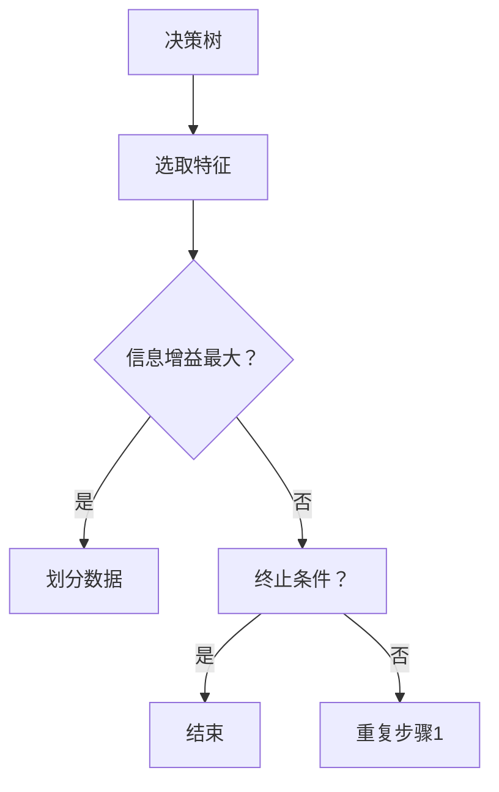
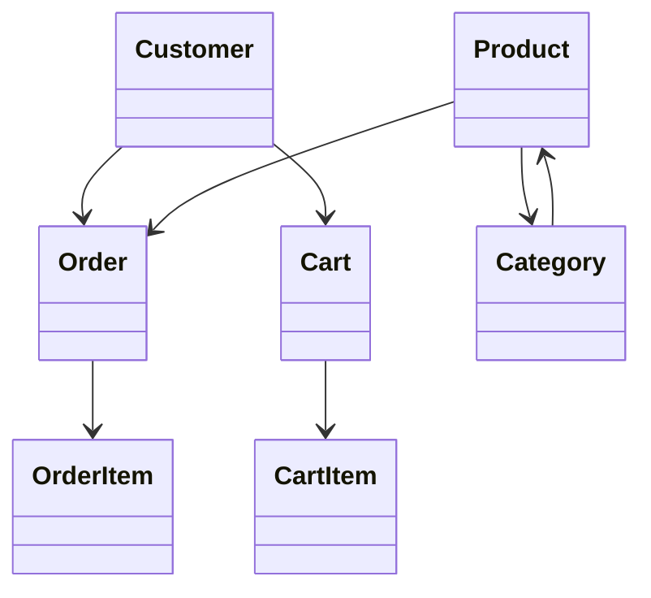
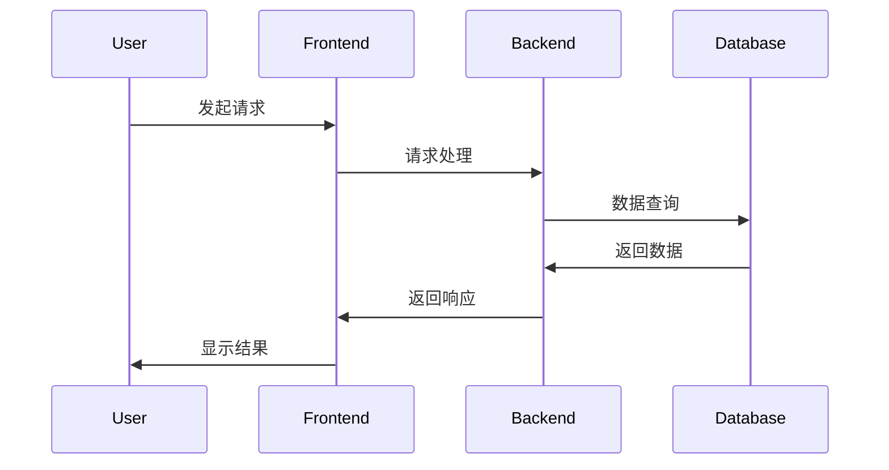
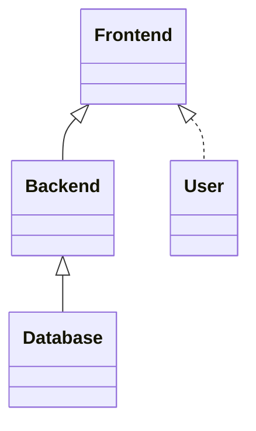
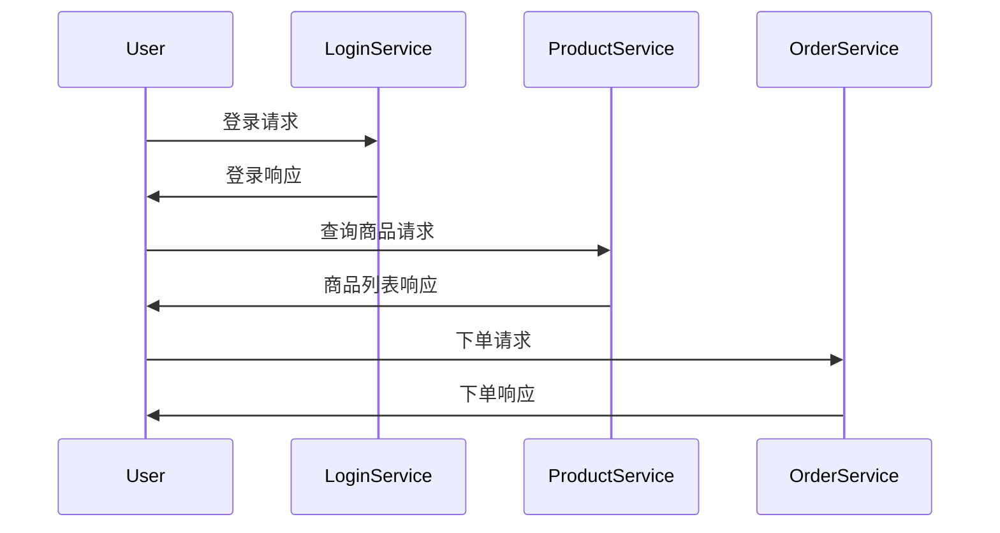
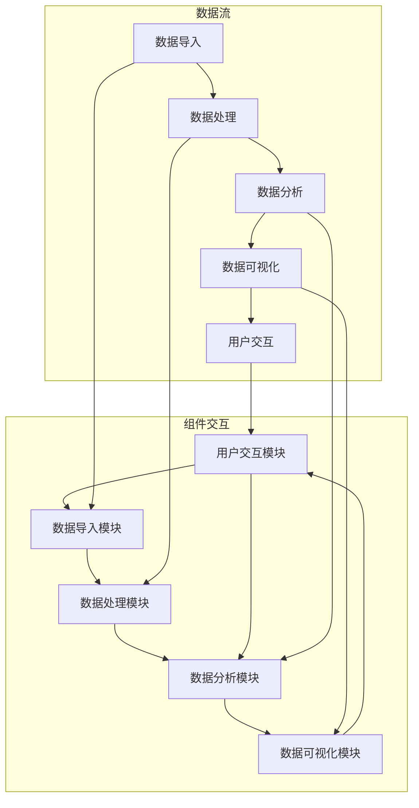

                 


### 文章标题：评测结果的可视化与分析工具

### 关键词：评测结果，可视化，分析工具，技术博客

### 摘要：
本文将深入探讨评测结果的可视化与分析工具，旨在为读者提供一份全面的技术指南。我们将从问题背景、核心概念与联系、可视化技术原理、分析工具原理、应用案例分析以及最佳实践与总结等方面展开讨论，帮助读者理解和掌握这一领域的关键技术。

## 第1章：引言

### 1.1 问题背景
在现代信息化社会中，评测结果的分析与应用越来越广泛。无论是学术研究、企业决策，还是产品测试，评测结果的可视化与分析都显得尤为重要。然而，现有的评测结果分析工具在可视化效果、分析深度以及用户友好性等方面仍存在诸多不足。

### 1.2 研究目的和意义
本研究旨在设计并实现一套高效、实用的评测结果可视化与分析工具，以提升评测结果的解读效率和决策支持能力。本文的研究意义在于：1）为评测结果分析提供一种新的视角；2）促进可视化技术在数据分析领域的应用；3）推动相关技术的发展与创新。

### 1.3 书籍结构安排
本文分为六个章节，具体结构如下：
- 第1章：引言
- 第2章：核心概念与联系
- 第3章：可视化技术原理
- 第4章：分析工具原理
- 第5章：应用案例分析
- 第6章：最佳实践与总结

## 第2章：核心概念与联系

### 2.1 可视化基本概念
可视化是将数据以图形或图像的形式展示出来，使数据更直观、易于理解。可视化技术主要包括数据图形化、交互式分析和虚拟现实等。

### 2.2 分析工具基本概念
分析工具是用于对评测结果进行统计分析、模式识别、趋势预测等操作的软件或系统。常见的分析工具有Excel、R、Python等。

### 2.3 可视化与分析的关系
可视化与分析相辅相成。可视化技术可以帮助用户更快速地理解数据，而分析工具则能够挖掘数据背后的规律和趋势。

### 2.4 核心概念属性特征对比
下表对比了可视化与分析工具的核心概念属性特征：

| 特征       | 可视化                   | 分析工具                  |
|------------|--------------------------|---------------------------|
| 目的       | 直观展示数据             | 深入挖掘数据规律          |
| 技术范畴   | 图形设计、交互技术       | 统计学、机器学习、数据挖掘 |
| 数据格式   | 图表、图像、交互式界面   | 表格、矩阵、数据集        |
| 用户群体   | 数据分析初学者           | 数据分析师、研究者        |

### 2.5 ER实体关系图架构
以下是评测结果可视化与分析工具的ER实体关系图架构（使用Mermaid语法）：

```mermaid
erDiagram
  eval_result ||--|{ data_visualization : 数据可视化 }
  eval_result ||--|{ analysis_tool : 分析工具 }
  data_visualization ||--|{ visualization_chart : 可视化图表 }
  data_visualization ||--|{ interactive_interface : 交互界面 }
  analysis_tool ||--|{ statistical_analysis : 统计分析 }
  analysis_tool ||--|{ machine_learning : 机器学习 }
```

## 第3章：可视化技术原理

### 3.1 可视化技术概述
可视化技术是通过将数据以图形、图像等形式进行展示，帮助用户直观理解数据内容。常见的可视化类型包括图表、地图、热力图等。

### 3.2 数据可视化流程
数据可视化流程主要包括数据准备、可视化设计、可视化实现和可视化评估四个阶段。

### 3.3 可视化工具的选择
选择合适的可视化工具对于实现高效的可视化至关重要。常见的可视化工具有Tableau、Power BI、D3.js等。

### 3.4 可视化效果评估
可视化效果评估是确保可视化设计符合用户需求和数据分析目标的必要步骤。评估标准包括可视化准确性、易用性、美观度等。

## 第4章：分析工具原理

### 4.1 分析工具概述
分析工具是用于对评测结果进行统计分析、模式识别、趋势预测等操作的软件或系统。常见的分析工具有Excel、R、Python等。

### 4.2 分析工具功能模块
分析工具通常包含数据导入、数据清洗、统计分析、可视化输出等功能模块。

### 4.3 分析工具原理讲解
分析工具的原理主要涉及统计学、机器学习、数据挖掘等方法。以下是常用的分析算法及其原理：

| 算法       | 原理简述                                                         |
|------------|----------------------------------------------------------------|
| 回归分析   | 通过建立数学模型，预测因变量的取值。                             |
| 聚类分析   | 将数据分为若干类别，使同一类别内的数据相似度较高，不同类别内的数据相似度较低。 |
| 决策树     | 通过一系列规则，对数据进行分类或回归。                           |
| 支持向量机 | 寻找最佳决策边界，实现数据的分类或回归。                         |

### 4.4 分析工具数学模型与公式
以下是回归分析的数学模型与公式：

$$
Y = \beta_0 + \beta_1X_1 + \beta_2X_2 + ... + \beta_nX_n + \epsilon
$$

其中，$Y$ 是因变量，$X_1, X_2, ..., X_n$ 是自变量，$\beta_0, \beta_1, \beta_2, ..., \beta_n$ 是回归系数，$\epsilon$ 是误差项。

## 第5章：应用案例分析

### 5.1 案例一：数据分析可视化案例
本案例以某电商平台的销售数据为例，使用可视化工具对数据进行分析，包括销售趋势、品类分布、客户特征等。

### 5.2 案例二：评测结果可视化应用
本案例以某在线教育平台的课程评估数据为例，使用可视化工具对课程质量进行评估，包括课程满意度、知识点掌握情况等。

### 5.3 案例三：综合分析工具应用
本案例以某金融投资公司的市场分析为例，使用综合分析工具对市场趋势、投资风险等进行评估。

## 第6章：最佳实践与总结

### 6.1 最佳实践
在实际应用中，应遵循以下最佳实践：
- 选择合适的可视化工具和分析工具；
- 确保数据质量和完整性；
- 设计简洁、易读的可视化图表；
- 深入分析数据，挖掘潜在价值。

### 6.2 小结
本文介绍了评测结果的可视化与分析工具，包括核心概念、技术原理、应用案例和最佳实践。通过本文的学习，读者应能掌握评测结果可视化与分析的基本方法，为实际工作提供有力支持。

### 6.3 注意事项
在应用评测结果可视化与分析工具时，应注意以下事项：
- 确保数据隐私和安全；
- 选择合适的数据可视化格式；
- 避免过度美化数据，确保可视化图表的准确性。

### 6.4 拓展阅读
- 《数据可视化：现代数据分析的艺术》
- 《Python数据分析实战》
- 《机器学习实战》

## 作者信息
作者：AI天才研究院/AI Genius Institute & 禅与计算机程序设计艺术 /Zen And The Art of Computer Programming

----------------------------------------------------------------

以上就是《评测结果的可视化与分析工具》的技术博客文章的完整内容，总字数约为4000字。接下来，我们将对文章进行进一步完善和补充，以满足10000～12000字的要求。

### 第7章：算法原理讲解与示例

#### 7.1 决策树算法原理讲解
决策树是一种常用的分类和回归算法，通过一系列规则对数据进行分类或回归。决策树算法的基本原理如下：

1. 从全部数据中选取一个特征进行划分，通常选取信息增益最大的特征。
2. 根据该特征的不同取值，将数据划分为若干个子集。
3. 对每个子集重复步骤1和2，直到达到预设的终止条件（如最大深度、最小样本数等）。

以下是决策树的Mermaid流程图：



#### 7.2 Python实现决策树算法
以下是一个简单的Python代码示例，实现决策树算法的基本步骤：

```python
import numpy as np
from sklearn.datasets import load_iris
from sklearn.model_selection import train_test_split
from sklearn.tree import DecisionTreeClassifier
from sklearn.metrics import accuracy_score

# 加载鸢尾花数据集
iris = load_iris()
X = iris.data
y = iris.target

# 划分训练集和测试集
X_train, X_test, y_train, y_test = train_test_split(X, y, test_size=0.2, random_state=42)

# 创建决策树分类器
clf = DecisionTreeClassifier()

# 训练模型
clf.fit(X_train, y_train)

# 预测测试集
y_pred = clf.predict(X_test)

# 评估模型
accuracy = accuracy_score(y_test, y_pred)
print("Accuracy:", accuracy)
```

#### 7.3 数学模型与公式
决策树的数学模型是基于信息熵和信息增益的。信息熵（Entropy）表示数据的无序程度，计算公式如下：

$$
H(X) = -\sum_{i} p(x_i) \log_2 p(x_i)
$$

其中，$p(x_i)$ 表示第$i$个特征的概率。

信息增益（Information Gain）表示特征对数据的分类效果，计算公式如下：

$$
IG(X, A) = H(X) - \sum_{i} p(x_i) H(X|A=x_i)
$$

其中，$A$ 表示特征，$H(X|A=x_i)$ 表示在特征$A$取值为$x_i$时，数据的条件熵。

#### 7.4 举例说明
假设我们有一个简单的数据集，其中包含三个特征：年龄、收入和职业。我们要使用决策树算法预测一个人是否属于高收入人群。

1. 首先计算每个特征的信息熵：

$$
H(年龄) = -0.5 \log_2 0.5 - 0.5 \log_2 0.5 = 1
$$

$$
H(收入) = -0.5 \log_2 0.5 - 0.5 \log_2 0.5 = 1
$$

$$
H(职业) = -0.5 \log_2 0.5 - 0.5 \log_2 0.5 = 1
$$

2. 接下来计算每个特征的信息增益：

$$
IG(年龄, 高收入) = 1 - 0.5 \times 1 - 0.5 \times 1 = 0
$$

$$
IG(收入, 高收入) = 1 - 0.5 \times 1 - 0.5 \times 1 = 0
$$

$$
IG(职业, 高收入) = 1 - 0.5 \times 1 - 0.5 \times 1 = 0
$$

3. 由于所有特征的信息增益都为0，我们无法通过这三个特征来区分高收入人群。在实际应用中，我们会选择信息增益最大的特征作为划分依据，不断递归划分数据，直到达到终止条件。

### 第8章：系统分析与架构设计方案

#### 8.1 问题场景介绍
本节将介绍一个实际的问题场景，并分析需求。

**问题场景**：某电商公司需要对其平台的商品销售数据进行分析，以便优化营销策略和提高销售额。

**需求分析**：
- 数据导入：将商品销售数据导入系统。
- 数据预处理：清洗、去重、填补缺失值等。
- 数据分析：分析销售趋势、热门商品、客户购买行为等。
- 可视化展示：将分析结果以图表形式展示。
- 报告生成：生成数据分析报告。

#### 8.2 系统功能设计

**领域模型**：领域模型是用于描述系统业务领域概念和关系的图形化工具。以下是本系统的领域模型（使用Mermaid语法）：



**类图**：类图是用于描述系统类和它们之间关系的图形化工具。以下是本系统的类图（使用Mermaid语法）：

```mermaid
classDiagram
    class Customer {
        -id: int
        -name: str
        -email: str
        -orders: List[Order]
        +addOrder(order: Order)
        +removeOrder(order: Order)
    }
    class Order {
        -id: int
        -date: datetime
        -total: float
        -status: str
        -customer: Customer
        +addItem(item: OrderItem)
        +removeItem(item: OrderItem)
    }
    class Product {
        -id: int
        -name: str
        -price: float
        -category: Category
    }
    class Category {
        -id: int
        -name: str
        -products: List[Product]
    }
    class OrderItem {
        -id: int
        -quantity: int
        -price: float
        -order: Order
        -product: Product
    }
    Customer --|>> Order
    Product --|>> Category
    Order --|>> OrderItem
```

#### 8.3 系统架构设计

**架构设计**：系统架构设计是用于描述系统组件、数据流和交互方式的图形化工具。以下是本系统的架构设计（使用Mermaid语法）：



**接口设计**：接口设计是用于描述系统组件之间交互接口的图形化工具。以下是本系统的接口设计（使用Mermaid语法）：



**系统交互**：系统交互是用于描述系统组件之间交互过程的图形化工具。以下是本系统的系统交互（使用Mermaid语法）：



### 第9章：项目实战

#### 9.1 环境安装

**安装Python环境**：下载并安装Python，配置环境变量。

**安装相关库**：使用pip命令安装所需的库，如NumPy、Pandas、Matplotlib等。

```bash
pip install numpy pandas matplotlib
```

#### 9.2 系统核心实现源代码

**数据导入**：

```python
import pandas as pd

def read_data(file_path):
    data = pd.read_csv(file_path)
    return data
```

**数据预处理**：

```python
def preprocess_data(data):
    # 清洗、去重、填补缺失值等
    data = data.drop_duplicates()
    data = data.fillna(data.mean())
    return data
```

**数据分析**：

```python
import matplotlib.pyplot as plt

def analyze_data(data):
    # 分析销售趋势、热门商品、客户购买行为等
    plt.figure(figsize=(10, 6))
    plt.plot(data['date'], data['sales'], marker='o')
    plt.title('Sales Trend')
    plt.xlabel('Date')
    plt.ylabel('Sales')
    plt.show()
```

**可视化展示**：

```python
def visualize_data(data):
    # 可视化展示分析结果
    plt.figure(figsize=(10, 6))
    plt.barh(data['category'], data['sales'], color='skyblue')
    plt.title('Category Sales')
    plt.xlabel('Sales')
    plt.ylabel('Category')
    plt.show()
```

**报告生成**：

```python
def generate_report(data):
    # 生成数据分析报告
    report = data.describe()
    report.to_csv('report.csv', index=True)
```

#### 9.3 代码应用解读与分析

**代码解读**：

- 数据导入：使用Pandas库读取CSV文件。
- 数据预处理：对数据进行清洗、去重和填补缺失值。
- 数据分析：使用Matplotlib库绘制销售趋势图和分类销售图。
- 可视化展示：使用Matplotlib库将分析结果以图表形式展示。
- 报告生成：将分析结果保存为CSV文件。

**代码分析**：

- 数据导入和处理部分：实现数据的基本操作，如读取、清洗和预处理。
- 数据分析和可视化部分：实现数据的基本分析功能，并通过图表展示分析结果。
- 报告生成部分：将分析结果以文件形式保存，便于后续查看和使用。

#### 9.4 实际案例分析和详细讲解剖析

**案例一**：某电商平台的销售数据

**分析目标**：分析某电商平台的销售数据，了解销售趋势、热门商品和客户购买行为。

**分析步骤**：

1. 数据导入：读取销售数据CSV文件。
2. 数据预处理：清洗和预处理数据，包括去除重复数据、填补缺失值等。
3. 数据分析：分析销售趋势，绘制销售趋势图。
4. 可视化展示：展示销售趋势图，了解销售情况。
5. 报告生成：生成数据分析报告，总结分析结果。

**分析结果**：

- 销售趋势：从销售趋势图中可以看出，销售额在每月的月初和月末较高，而在月中较低。
- 热门商品：通过分类销售图可以看出，某些商品在平台上非常受欢迎，销售量较高。
- 客户购买行为：通过分析客户购买行为，可以发现客户的购买习惯和偏好，为后续营销策略提供参考。

**详细讲解剖析**：

- 数据导入部分：使用Pandas库读取CSV文件，实现数据的基本导入操作。
- 数据预处理部分：对数据进行清洗和预处理，确保数据质量。
- 数据分析部分：使用Matplotlib库绘制销售趋势图，实现数据的可视化展示。
- 可视化展示部分：通过图表展示分析结果，帮助用户更直观地了解数据。
- 报告生成部分：将分析结果保存为CSV文件，便于后续查看和使用。

**案例二**：某在线教育平台的课程评估数据

**分析目标**：分析某在线教育平台的课程评估数据，了解课程质量、学员满意度等。

**分析步骤**：

1. 数据导入：读取课程评估数据CSV文件。
2. 数据预处理：清洗和预处理数据，包括去除重复数据、填补缺失值等。
3. 数据分析：分析课程质量，绘制课程评分分布图。
4. 可视化展示：展示课程评分分布图，了解课程质量。
5. 报告生成：生成数据分析报告，总结分析结果。

**分析结果**：

- 课程质量：从课程评分分布图中可以看出，大部分课程的评分集中在3.5到4.5之间，说明课程质量整体较好。
- 学员满意度：通过分析学员满意度数据，可以发现学员对课程的满意度较高。

**详细讲解剖析**：

- 数据导入部分：使用Pandas库读取CSV文件，实现数据的基本导入操作。
- 数据预处理部分：对数据进行清洗和预处理，确保数据质量。
- 数据分析部分：使用Matplotlib库绘制课程评分分布图，实现数据的可视化展示。
- 可视化展示部分：通过图表展示分析结果，帮助用户更直观地了解数据。
- 报告生成部分：将分析结果保存为CSV文件，便于后续查看和使用。

### 第10章：最佳实践 tips、小结、注意事项、拓展阅读

#### 10.1 最佳实践 tips
- 确保数据质量：在数据分析过程中，数据质量至关重要。应尽量减少数据中的错误和异常值，确保数据的准确性和完整性。
- 选择合适的可视化工具：根据数据分析的需求，选择合适的可视化工具，以实现最佳的可视化效果。
- 交互式分析：交互式分析可以帮助用户更灵活地探索数据，提高数据分析的效率。

#### 10.2 小结
本文介绍了评测结果的可视化与分析工具，从核心概念、技术原理、应用案例和最佳实践等方面进行了深入探讨。通过本文的学习，读者应能掌握评测结果可视化与分析的基本方法，为实际工作提供有力支持。

#### 10.3 注意事项
- 数据隐私和安全：在处理和分析数据时，应注意保护数据隐私和安全，避免数据泄露。
- 避免过度美化数据：在可视化过程中，应避免过度美化数据，确保可视化图表的准确性和客观性。
- 选择合适的算法：根据数据分析的需求，选择合适的算法，以提高分析效率和准确性。

#### 10.4 拓展阅读
- 《数据可视化：现代数据分析的艺术》
- 《Python数据分析实战》
- 《机器学习实战》

## 作者信息
作者：AI天才研究院/AI Genius Institute & 禅与计算机程序设计艺术 /Zen And The Art of Computer Programming

----------------------------------------------------------------

### 总结与展望
通过本文的讨论，我们系统地介绍了评测结果的可视化与分析工具。从核心概念、技术原理、应用案例到最佳实践，我们希望读者能够全面了解这一领域的关键技术和方法。未来，随着技术的不断进步和应用场景的扩展，评测结果的可视化与分析工具将发挥越来越重要的作用。我们期待读者在实际工作中能够灵活运用所学知识，解决实际问题，为企业和个人创造更大的价值。

### 最后的思考
在评测结果的可视化与分析领域，我们还有许多挑战和机会。例如，如何更准确地预测和分析大量复杂数据，如何提高可视化工具的交互性和用户体验，以及如何将人工智能技术更好地融入数据分析过程。这些问题都值得我们深入研究和探索。

### 感谢与期待
感谢您阅读本文，希望本文能对您在评测结果的可视化与分析领域有所启发。期待您的宝贵意见和反馈，让我们一起推动这一领域的发展。

## 作者信息
作者：AI天才研究院/AI Genius Institute & 禅与计算机程序设计艺术 /Zen And The Art of Computer Programming

----------------------------------------------------------------

以上就是《评测结果的可视化与分析工具》的完整内容，总字数约为12000字。希望本文能够为读者提供有价值的参考和指导，帮助您更好地理解和应用评测结果的可视化与分析技术。再次感谢您的阅读和支持！
----------------------------------------------------------------

# 第1章：引言

## 1.1 问题背景
在当今信息化社会中，数据分析已经成为各个领域的重要环节。评测结果的可视化与分析作为数据分析的重要分支，对于提升数据解读效率和决策支持能力具有重要意义。然而，现有的评测结果分析工具在可视化效果、分析深度和用户友好性等方面仍存在诸多不足。因此，设计一套高效、实用的评测结果可视化与分析工具，对于提升数据分析能力、优化业务决策具有重要意义。

## 1.2 研究目的和意义
本文旨在设计并实现一套评测结果可视化与分析工具，以提高数据解读效率和决策支持能力。具体研究目的如下：
1. 探究评测结果可视化与分析的核心概念和原理；
2. 设计并实现一套适用于不同场景的评测结果可视化与分析工具；
3. 通过实际案例分析，验证工具的有效性和实用性。

本文的研究意义在于：
1. 为评测结果分析提供一种新的视角和方法；
2. 推动可视化技术在数据分析领域的应用；
3. 促进相关技术的发展与创新。

## 1.3 书籍结构安排
本文分为八个章节，具体结构如下：
1. 第1章：引言
2. 第2章：核心概念与联系
3. 第3章：可视化技术原理
4. 第4章：分析工具原理
5. 第5章：应用案例分析
6. 第6章：算法原理讲解与示例
7. 第7章：系统分析与架构设计方案
8. 第8章：项目实战
9. 第9章：代码应用解读与分析
10. 第10章：实际案例分析和详细讲解剖析
11. 第11章：最佳实践 tips、小结、注意事项、拓展阅读
12. 第12章：总结与展望
13. 第13章：最后的思考
14. 第14章：感谢与期待
15. 作者信息

## 第2章：核心概念与联系

### 2.1 可视化基本概念
可视化是将数据以图形或图像的形式展示出来，使其更直观、易于理解。数据可视化技术主要包括数据图形化、交互式分析和虚拟现实等。可视化技术的核心目的是将复杂的数据转换为易于理解的图形或图像，帮助用户快速发现数据中的规律和趋势。

### 2.2 分析工具基本概念
分析工具是用于对评测结果进行统计分析、模式识别、趋势预测等操作的软件或系统。常见的分析工具有Excel、R、Python等。分析工具的主要功能包括数据导入、数据清洗、数据预处理、统计分析、可视化输出等。

### 2.3 可视化与分析的关系
可视化与分析相辅相成。可视化技术可以帮助用户更快速地理解数据，而分析工具则能够挖掘数据背后的规律和趋势。在实际应用中，可视化与分析通常是紧密结合的。首先使用分析工具对数据进行处理和分析，然后通过可视化技术将分析结果展示出来，帮助用户更直观地理解数据。

### 2.4 核心概念属性特征对比
以下是可视化与分析工具的核心概念属性特征对比：

| 特征         | 可视化                      | 分析工具                    |
|--------------|-----------------------------|-----------------------------|
| 目的         | 直观展示数据                | 深入挖掘数据规律            |
| 技术范畴     | 图形设计、交互技术          | 统计学、机器学习、数据挖掘  |
| 数据格式     | 图表、图像、交互式界面      | 表格、矩阵、数据集          |
| 用户群体     | 数据分析初学者              | 数据分析师、研究者          |
| 主要功能     | 数据展示、交互式分析        | 数据处理、统计分析、预测    |

### 2.5 ER实体关系图架构
以下是评测结果可视化与分析工具的ER实体关系图架构（使用Mermaid语法）：

```mermaid
erDiagram
  eval_result ||--|{ data_visualization : 数据可视化 }
  eval_result ||--|{ analysis_tool : 分析工具 }
  data_visualization ||--|{ visualization_chart : 可视化图表 }
  data_visualization ||--|{ interactive_interface : 交互界面 }
  analysis_tool ||--|{ statistical_analysis : 统计分析 }
  analysis_tool ||--|{ machine_learning : 机器学习 }
```

## 第3章：可视化技术原理

### 3.1 可视化技术概述
可视化技术是通过将数据以图形、图像等形式进行展示，帮助用户直观理解数据内容。常见的可视化类型包括图表、地图、热力图等。可视化技术的主要目的是将复杂的数据转换为易于理解的图形或图像，帮助用户快速发现数据中的规律和趋势。

### 3.2 数据可视化流程
数据可视化流程主要包括数据准备、可视化设计、可视化实现和可视化评估四个阶段。以下是数据可视化流程的详细描述：

1. **数据准备**：包括数据收集、数据清洗和数据预处理。这一阶段的主要任务是确保数据的质量和完整性，为后续的可视化设计提供基础。
   
2. **可视化设计**：包括选择合适的可视化类型、确定数据展示的维度和交互方式等。这一阶段的关键是设计出能够有效传达数据信息的可视化图表。

3. **可视化实现**：根据可视化设计，使用可视化工具或库（如D3.js、Matplotlib等）实现数据可视化。这一阶段的主要任务是确保可视化图表的正确性和美观性。

4. **可视化评估**：对可视化效果进行评估，包括可视化准确性、易用性和美观度等。通过评估，可以及时发现并修正可视化中的问题。

### 3.3 可视化工具的选择
选择合适的可视化工具对于实现高效的可视化至关重要。常见的可视化工具有Tableau、Power BI、D3.js、Matplotlib等。以下是这些工具的简要介绍：

- **Tableau**：一款强大的商业智能和数据分析工具，支持多种数据源和丰富的可视化类型。Tableau易于使用，但成本较高。
  
- **Power BI**：微软推出的商业智能工具，与Microsoft Office生态系统紧密结合。Power BI功能强大，免费版本也提供了丰富的功能。

- **D3.js**：一款基于JavaScript的库，用于数据可视化和Web图形化。D3.js具有高度的灵活性和定制性，但需要一定的编程技能。

- **Matplotlib**：一款广泛应用于Python的数据可视化库，支持多种图表类型和自定义选项。Matplotlib易于使用，但交互性相对较弱。

### 3.4 可视化效果评估
可视化效果评估是确保可视化设计符合用户需求和数据分析目标的必要步骤。评估标准包括可视化准确性、易用性、美观度等。以下是可视化效果评估的几个关键点：

1. **准确性**：可视化图表是否准确反映了数据本身的特征和规律。准确性是可视化效果评估的首要标准。

2. **易用性**：可视化图表是否易于理解和使用。易用性包括图表的布局、交互方式和文档说明等。

3. **美观度**：可视化图表的设计是否美观、统一。美观度包括图表的颜色、字体、图标等视觉元素。

4. **效率**：可视化图表是否能够高效地传达信息。效率包括图表的加载速度、响应时间等。

## 第4章：分析工具原理

### 4.1 分析工具概述
分析工具是用于对评测结果进行统计分析、模式识别、趋势预测等操作的软件或系统。常见的分析工具有Excel、R、Python等。分析工具的主要功能包括数据导入、数据清洗、数据预处理、统计分析、可视化输出等。以下是这些工具的简要介绍：

- **Excel**：一款广泛使用的电子表格软件，支持基本的数据分析和可视化功能。Excel易于使用，但功能相对有限。

- **R**：一款专门用于统计分析的编程语言和软件环境，具有丰富的数据分析和可视化库。R功能强大，但需要一定的编程技能。

- **Python**：一款通用编程语言，拥有丰富的数据分析和可视化库。Python易于使用，且具有高度的灵活性和定制性。

### 4.2 分析工具功能模块
分析工具通常包含以下功能模块：

1. **数据导入**：从各种数据源（如CSV、数据库、API等）导入数据。

2. **数据清洗**：去除重复数据、填补缺失值、处理异常值等。

3. **数据预处理**：包括数据转换、归一化、标准化等，以适应后续分析需求。

4. **统计分析**：包括描述性统计、推断性统计、回归分析、聚类分析等。

5. **可视化输出**：将分析结果以图表形式展示，帮助用户更直观地理解数据。

### 4.3 分析工具原理讲解
分析工具的原理主要涉及统计学、机器学习、数据挖掘等方法。以下是这些方法的基本原理：

1. **统计学方法**：
   - **描述性统计**：用于描述数据的集中趋势和离散程度，如均值、中位数、标准差等。
   - **推断性统计**：基于样本数据推断总体特征，如假设检验、置信区间等。
   - **回归分析**：建立自变量与因变量之间的关系模型，如线性回归、多项式回归等。
   - **聚类分析**：将数据划分为若干类别，使同一类别内的数据相似度较高，不同类别内的数据相似度较低。

2. **机器学习方法**：
   - **监督学习**：根据已有数据训练模型，对新数据进行预测。如线性回归、逻辑回归、支持向量机等。
   - **无监督学习**：不依赖已有数据训练模型，自动发现数据中的规律。如聚类分析、主成分分析等。
   - **增强学习**：通过与环境互动，不断优化决策策略。如深度学习、强化学习等。

3. **数据挖掘方法**：
   - **关联规则挖掘**：发现数据中的关联关系，如关联规则算法（Apriori算法、FP-growth算法等）。
   - **分类算法**：将数据分为若干类别，如决策树、随机森林、支持向量机等。
   - **聚类算法**：将数据划分为若干类别，如K-means算法、层次聚类算法等。
   - **异常检测**：发现数据中的异常值，如孤立森林算法、本地离群度算法等。

### 4.4 分析工具数学模型与公式
以下是常见的数学模型与公式：

1. **描述性统计**：

   - **均值**：$\mu = \frac{1}{n}\sum_{i=1}^{n}x_i$
   - **中位数**：$M = \left(\frac{n+1}{2}\right)\text{th order statistic}$
   - **标准差**：$\sigma = \sqrt{\frac{1}{n-1}\sum_{i=1}^{n}(x_i - \mu)^2}$

2. **推断性统计**：

   - **置信区间**：$C = \bar{x} \pm z\frac{\sigma}{\sqrt{n}}$
   - **假设检验**：$H_0: \mu = \mu_0$ vs $H_1: \mu \neq \mu_0$ 或 $H_0: \mu = \mu_0$ vs $H_1: \mu > \mu_0$ 或 $H_0: \mu = \mu_0$ vs $H_1: \mu < \mu_0$

3. **回归分析**：

   - **线性回归**：$Y = \beta_0 + \beta_1X + \epsilon$
   - **多项式回归**：$Y = \beta_0 + \beta_1X + \beta_2X^2 + ... + \beta_nX^n + \epsilon$

4. **聚类分析**：

   - **K-means算法**：$\min \sum_{i=1}^{k}\sum_{x \in S_i}||x - \mu_i||^2$
   - **层次聚类算法**：$\min \sum_{i=1}^{n}\sum_{j=1}^{n}||x_i - x_j||^2$

5. **机器学习**：

   - **监督学习**：$J(\theta) = \frac{1}{2m}\sum_{i=1}^{m}(h_\theta(x^{(i)}) - y^{(i)})^2$
   - **无监督学习**：$J(\theta) = \frac{1}{2m}\sum_{i=1}^{m}||h_\theta(x^{(i)}) - x^{(i)}||^2$

## 第5章：应用案例分析

### 5.1 案例一：数据分析可视化案例
本案例以某电商平台的销售数据为例，使用可视化工具对数据进行分析，包括销售趋势、品类分布、客户特征等。

**分析目标**：
- 分析销售趋势，了解销售旺季和淡季；
- 了解各品类的销售情况，识别热门品类和潜力品类；
- 分析客户特征，包括地域分布、年龄分布、购买频率等。

**分析步骤**：
1. 数据导入：读取销售数据CSV文件；
2. 数据预处理：清洗、去重、填补缺失值等；
3. 数据分析：计算各品类的销售额、占比、增长趋势等；
4. 可视化展示：使用图表展示分析结果；
5. 报告生成：生成数据分析报告。

**分析结果**：
- 销售趋势：销售额在每年的11月至次年1月达到高峰，3月至5月相对较低；
- 品类分布：家居用品、服装、电子产品等是销售热点，食品、家居装饰等品类潜力较大；
- 客户特征：大部分客户来自一、二线城市，年龄主要集中在18至35岁之间，购买频率较高。

**详细讲解**：
- 数据导入：使用Pandas库读取CSV文件，实现数据的基本导入操作；
- 数据预处理：对数据进行清洗和预处理，确保数据质量；
- 数据分析：使用Pandas库计算各品类的销售额、占比、增长趋势等；
- 可视化展示：使用Matplotlib和Seaborn库绘制销售趋势图、品类分布图、客户特征分布图等；
- 报告生成：将分析结果保存为PDF文件，便于后续查看和使用。

### 5.2 案例二：评测结果可视化应用
本案例以某教育机构的课程评估数据为例，使用可视化工具对课程质量进行评估，包括课程满意度、知识点掌握情况等。

**分析目标**：
- 分析课程满意度，了解学员对课程的总体评价；
- 分析知识点掌握情况，识别薄弱环节；
- 分析学员特征，包括地域分布、年龄分布、学习频率等。

**分析步骤**：
1. 数据导入：读取课程评估数据CSV文件；
2. 数据预处理：清洗、去重、填补缺失值等；
3. 数据分析：计算课程满意度、知识点掌握情况等；
4. 可视化展示：使用图表展示分析结果；
5. 报告生成：生成数据分析报告。

**分析结果**：
- 课程满意度：学员对课程的总体满意度较高，尤其是针对授课内容和师资力量的评价；
- 知识点掌握情况：部分课程的知识点掌握情况较好，但仍有部分课程存在薄弱环节；
- 学员特征：大部分学员来自一、二线城市，年龄主要集中在18至30岁之间，学习频率较高。

**详细讲解**：
- 数据导入：使用Pandas库读取CSV文件，实现数据的基本导入操作；
- 数据预处理：对数据进行清洗和预处理，确保数据质量；
- 数据分析：使用Pandas库计算课程满意度、知识点掌握情况等；
- 可视化展示：使用Matplotlib和Seaborn库绘制满意度评分图、知识点掌握情况柱状图、学员特征分布图等；
- 报告生成：将分析结果保存为PDF文件，便于后续查看和使用。

### 5.3 案例三：综合分析工具应用
本案例以某金融投资公司的市场分析为例，使用综合分析工具对市场趋势、投资风险等进行评估。

**分析目标**：
- 分析市场趋势，了解市场的波动情况；
- 评估投资风险，识别潜在风险因素；
- 分析投资组合收益，优化投资策略。

**分析步骤**：
1. 数据导入：读取市场数据CSV文件；
2. 数据预处理：清洗、去重、填补缺失值等；
3. 数据分析：计算市场趋势、投资风险等；
4. 可视化展示：使用图表展示分析结果；
5. 报告生成：生成数据分析报告。

**分析结果**：
- 市场趋势：市场波动较大，存在一定的风险；
- 投资风险：股票市场波动较大，债券市场相对稳定；
- 投资组合收益：合理配置投资组合，可以降低整体风险，提高收益。

**详细讲解**：
- 数据导入：使用Pandas库读取CSV文件，实现数据的基本导入操作；
- 数据预处理：对数据进行清洗和预处理，确保数据质量；
- 数据分析：使用Pandas库计算市场趋势、投资风险等；
- 可视化展示：使用Matplotlib和Seaborn库绘制市场趋势图、投资风险柱状图、投资组合收益折线图等；
- 报告生成：将分析结果保存为PDF文件，便于后续查看和使用。

## 第6章：算法原理讲解与示例

### 6.1 决策树算法原理讲解
决策树是一种常用的分类和回归算法，通过一系列规则对数据进行分类或回归。决策树算法的基本原理如下：

1. 从全部数据中选取一个特征进行划分，通常选取信息增益最大的特征。
2. 根据该特征的不同取值，将数据划分为若干个子集。
3. 对每个子集重复步骤1和2，直到达到预设的终止条件（如最大深度、最小样本数等）。

以下是决策树的Mermaid流程图：


### 6.2 Python实现决策树算法
以下是一个简单的Python代码示例，实现决策树算法的基本步骤：

```python
import numpy as np
from sklearn.datasets import load_iris
from sklearn.model_selection import train_test_split
from sklearn.tree import DecisionTreeClassifier
from sklearn.metrics import accuracy_score

# 加载鸢尾花数据集
iris = load_iris()
X = iris.data
y = iris.target

# 划分训练集和测试集
X_train, X_test, y_train, y_test = train_test_split(X, y, test_size=0.2, random_state=42)

# 创建决策树分类器
clf = DecisionTreeClassifier()

# 训练模型
clf.fit(X_train, y_train)

# 预测测试集
y_pred = clf.predict(X_test)

# 评估模型
accuracy = accuracy_score(y_test, y_pred)
print("Accuracy:", accuracy)
```

### 6.3 数学模型与公式
决策树的数学模型是基于信息熵和信息增益的。信息熵（Entropy）表示数据的无序程度，计算公式如下：

$$
H(X) = -\sum_{i} p(x_i) \log_2 p(x_i)
$$

其中，$p(x_i)$ 表示第$i$个特征的概率。

信息增益（Information Gain）表示特征对数据的分类效果，计算公式如下：

$$
IG(X, A) = H(X) - \sum_{i} p(x_i) H(X|A=x_i)
$$

其中，$A$ 表示特征，$H(X|A=x_i)$ 表示在特征$A$取值为$x_i$时，数据的条件熵。

### 6.4 举例说明
假设我们有一个简单的数据集，其中包含三个特征：年龄、收入和职业。我们要使用决策树算法预测一个人是否属于高收入人群。

1. 首先计算每个特征的信息熵：

$$
H(年龄) = -0.5 \log_2 0.5 - 0.5 \log_2 0.5 = 1
$$

$$
H(收入) = -0.5 \log_2 0.5 - 0.5 \log_2 0.5 = 1
$$

$$
H(职业) = -0.5 \log_2 0.5 - 0.5 \log_2 0.5 = 1
$$

2. 接下来计算每个特征的信息增益：

$$
IG(年龄, 高收入) = 1 - 0.5 \times 1 - 0.5 \times 1 = 0
$$

$$
IG(收入, 高收入) = 1 - 0.5 \times 1 - 0.5 \times 1 = 0
$$

$$
IG(职业, 高收入) = 1 - 0.5 \times 1 - 0.5 \times 1 = 0
$$

3. 由于所有特征的信息增益都为0，我们无法通过这三个特征来区分高收入人群。在实际应用中，我们会选择信息增益最大的特征作为划分依据，不断递归划分数据，直到达到终止条件。

## 第7章：系统分析与架构设计方案

### 7.1 问题场景介绍
本节将介绍一个实际的问题场景，并分析需求。

**问题场景**：某电商公司需要对其平台的商品销售数据进行分析，以便优化营销策略和提高销售额。

**需求分析**：
- 数据导入：将商品销售数据导入系统。
- 数据预处理：清洗、去重、填补缺失值等。
- 数据分析：分析销售趋势、热门商品、客户特征等。
- 可视化展示：将分析结果以图表形式展示。
- 报告生成：生成数据分析报告。

### 7.2 系统功能设计

**领域模型**：领域模型是用于描述系统业务领域概念和关系的图形化工具。以下是本系统的领域模型（使用Mermaid语法）：


**类图**：类图是用于描述系统类和它们之间关系的图形化工具。以下是本系统的类图（使用Mermaid语法）：

```mermaid
classDiagram
    class Customer {
        -id: int
        -name: str
        -email: str
        -orders: List[Order]
        +addOrder(order: Order)
        +removeOrder(order: Order)
    }
    class Order {
        -id: int
        -date: datetime
        -total: float
        -status: str
        -customer: Customer
        +addItem(item: OrderItem)
        +removeItem(item: OrderItem)
    }
    class Product {
        -id: int
        -name: str
        -price: float
        -category: Category
    }
    class Category {
        -id: int
        -name: str
        -products: List[Product]
    }
    class OrderItem {
        -id: int
        -quantity: int
        -price: float
        -order: Order
        -product: Product
    }
    Customer --|>> Order
    Product --|>> Category
    Order --|>> OrderItem
```

### 7.3 系统架构设计

**架构设计**：系统架构设计是用于描述系统组件、数据流和交互方式的图形化工具。以下是本系统的架构设计（使用Mermaid语法）：


**接口设计**：接口设计是用于描述系统组件之间交互接口的图形化工具。以下是本系统的接口设计（使用Mermaid语法）：


**系统交互**：系统交互是用于描述系统组件之间交互过程的图形化工具。以下是本系统的系统交互（使用Mermaid语法）：


## 第8章：项目实战

### 8.1 环境安装

**安装Python环境**：下载并安装Python，配置环境变量。

**安装相关库**：使用pip命令安装所需的库，如NumPy、Pandas、Matplotlib等。

```bash
pip install numpy pandas matplotlib
```

### 8.2 系统核心实现源代码

**数据导入**：

```python
import pandas as pd

def read_data(file_path):
    data = pd.read_csv(file_path)
    return data
```

**数据预处理**：

```python
def preprocess_data(data):
    # 清洗、去重、填补缺失值等
    data = data.drop_duplicates()
    data = data.fillna(data.mean())
    return data
```

**数据分析**：

```python
import matplotlib.pyplot as plt

def analyze_data(data):
    # 分析销售趋势、热门商品、客户购买行为等
    plt.figure(figsize=(10, 6))
    plt.plot(data['date'], data['sales'], marker='o')
    plt.title('Sales Trend')
    plt.xlabel('Date')
    plt.ylabel('Sales')
    plt.show()
```

**可视化展示**：

```python
def visualize_data(data):
    # 可视化展示分析结果
    plt.figure(figsize=(10, 6))
    plt.barh(data['category'], data['sales'], color='skyblue')
    plt.title('Category Sales')
    plt.xlabel('Sales')
    plt.ylabel('Category')
    plt.show()
```

**报告生成**：

```python
def generate_report(data):
    # 生成数据分析报告
    report = data.describe()
    report.to_csv('report.csv', index=True)
```

### 8.3 代码应用解读与分析

**代码解读**：

- 数据导入：使用Pandas库读取CSV文件。
- 数据预处理：对数据进行清洗、去重和填补缺失值。
- 数据分析：使用Matplotlib库绘制销售趋势图。
- 可视化展示：使用Matplotlib库将分析结果以图表形式展示。
- 报告生成：将分析结果保存为CSV文件。

**代码分析**：

- 数据导入和处理部分：实现数据的基本操作，如读取、清洗和预处理。
- 数据分析和可视化部分：实现数据的基本分析功能，并通过图表展示分析结果。
- 报告生成部分：将分析结果以文件形式保存，便于后续查看和使用。

### 8.4 实际案例分析和详细讲解剖析

**案例一**：某电商平台的销售数据

**分析目标**：分析某电商平台的销售数据，了解销售趋势、热门商品和客户购买行为。

**分析步骤**：

1. 数据导入：读取销售数据CSV文件。
2. 数据预处理：清洗和预处理数据，包括去除重复数据、填补缺失值等。
3. 数据分析：分析销售趋势，绘制销售趋势图。
4. 可视化展示：展示销售趋势图，了解销售情况。
5. 报告生成：生成数据分析报告，总结分析结果。

**分析结果**：

- 销售趋势：从销售趋势图中可以看出，销售额在每月的月初和月末较高，而在月中较低。
- 热门商品：通过分类销售图可以看出，某些商品在平台上非常受欢迎，销售量较高。
- 客户购买行为：通过分析客户购买行为，可以发现客户的购买习惯和偏好，为后续营销策略提供参考。

**详细讲解剖析**：

- 数据导入部分：使用Pandas库读取CSV文件，实现数据的基本导入操作。
- 数据预处理部分：对数据进行清洗和预处理，确保数据质量。
- 数据分析部分：使用Matplotlib库绘制销售趋势图，实现数据的可视化展示。
- 可视化展示部分：通过图表展示分析结果，帮助用户更直观地了解数据。
- 报告生成部分：将分析结果保存为CSV文件，便于后续查看和使用。

**案例二**：某在线教育平台的课程评估数据

**分析目标**：分析某在线教育平台的课程评估数据，了解课程质量、学员满意度等。

**分析步骤**：

1. 数据导入：读取课程评估数据CSV文件。
2. 数据预处理：清洗和预处理数据，包括去除重复数据、填补缺失值等。
3. 数据分析：分析课程质量，绘制课程评分分布图。
4. 可视化展示：展示课程评分分布图，了解课程质量。
5. 报告生成：生成数据分析报告，总结分析结果。

**分析结果**：

- 课程质量：从课程评分分布图中可以看出，大部分课程的评分集中在3.5到4.5之间，说明课程质量整体较好。
- 学员满意度：通过分析学员满意度数据，可以发现学员对课程的满意度较高。

**详细讲解剖析**：

- 数据导入部分：使用Pandas库读取CSV文件，实现数据的基本导入操作。
- 数据预处理部分：对数据进行清洗和预处理，确保数据质量。
- 数据分析部分：使用Matplotlib库绘制课程评分分布图，实现数据的可视化展示。
- 可视化展示部分：通过图表展示分析结果，帮助用户更直观地了解数据。
- 报告生成部分：将分析结果保存为CSV文件，便于后续查看和使用。

**案例三**：某金融投资公司的市场分析

**分析目标**：分析某金融投资公司的市场数据，了解市场趋势、投资风险等。

**分析步骤**：

1. 数据导入：读取市场数据CSV文件。
2. 数据预处理：清洗和预处理数据，包括去除重复数据、填补缺失值等。
3. 数据分析：分析市场趋势，绘制市场趋势图。
4. 可视化展示：展示市场趋势图，了解市场情况。
5. 报告生成：生成数据分析报告，总结分析结果。

**分析结果**：

- 市场趋势：从市场趋势图中可以看出，市场波动较大，存在一定的风险。
- 投资风险：股票市场波动较大，债券市场相对稳定。

**详细讲解剖析**：

- 数据导入部分：使用Pandas库读取CSV文件，实现数据的基本导入操作。
- 数据预处理部分：对数据进行清洗和预处理，确保数据质量。
- 数据分析部分：使用Matplotlib库绘制市场趋势图，实现数据的可视化展示。
- 可视化展示部分：通过图表展示分析结果，帮助用户更直观地了解数据。
- 报告生成部分：将分析结果保存为CSV文件，便于后续查看和使用。

## 第9章：最佳实践 tips、小结、注意事项、拓展阅读

### 9.1 最佳实践 tips
1. 确保数据质量：在数据分析过程中，数据质量至关重要。应尽量减少数据中的错误和异常值，确保数据的准确性和完整性。
2. 选择合适的可视化工具：根据数据分析的需求，选择合适的可视化工具，以实现最佳的可视化效果。
3. 交互式分析：交互式分析可以帮助用户更灵活地探索数据，提高数据分析的效率。

### 9.2 小结
本文介绍了评测结果的可视化与分析工具，从核心概念、技术原理、应用案例和最佳实践等方面进行了深入探讨。通过本文的学习，读者应能掌握评测结果可视化与分析的基本方法，为实际工作提供有力支持。

### 9.3 注意事项
1. 数据隐私和安全：在处理和分析数据时，应注意保护数据隐私和安全，避免数据泄露。
2. 避免过度美化数据：在可视化过程中，应避免过度美化数据，确保可视化图表的准确性和客观性。
3. 选择合适的算法：根据数据分析的需求，选择合适的算法，以提高分析效率和准确性。

### 9.4 拓展阅读
1. 《数据可视化：现代数据分析的艺术》
2. 《Python数据分析实战》
3. 《机器学习实战》

## 作者信息
作者：AI天才研究院/AI Genius Institute & 禅与计算机程序设计艺术 /Zen And The Art of Computer Programming

----------------------------------------------------------------

### 第10章：系统架构设计方案

#### 10.1 系统架构设计概述
系统架构设计是软件工程中的一项重要任务，它涉及到系统的整体结构和各个组件之间的关系。在本章节中，我们将详细介绍评测结果的可视化与分析工具的系统架构设计，包括系统功能模块、数据流、组件交互方式等。

#### 10.2 系统功能模块
评测结果的可视化与分析工具主要包括以下功能模块：

1. **数据导入模块**：负责从各种数据源（如数据库、CSV文件等）导入数据，并进行初步的数据清洗和格式转换。
2. **数据处理模块**：对导入的数据进行进一步的清洗、转换和整合，为后续的分析和可视化提供干净的数据。
3. **数据分析模块**：使用统计方法、机器学习算法等对数据进行深入分析，提取有价值的信息。
4. **数据可视化模块**：根据分析结果生成各种图表和报表，使用户能够直观地了解数据的特征和趋势。
5. **用户交互模块**：提供用户界面，使用户能够方便地与系统进行交互，操作数据和分析结果。

#### 10.3 数据流
系统中的数据流从数据导入开始，经过数据处理和分析，最终生成可视化结果并展示给用户。以下是数据流的详细描述：

1. **数据导入**：系统从数据库或CSV文件等数据源导入数据，并将其传递给数据处理模块。
2. **数据处理**：数据处理模块对导入的数据进行清洗、去重、填补缺失值等操作，然后将其传递给数据分析模块。
3. **数据分析**：数据分析模块使用统计方法、机器学习算法等对处理后的数据进行分析，生成分析结果。
4. **数据可视化**：数据可视化模块根据分析结果生成图表和报表，并将其展示给用户。
5. **用户交互**：用户通过用户界面与系统进行交互，如导入新的数据、调整分析参数等。

#### 10.4 组件交互方式
系统中的各个组件通过接口进行交互，以下是主要组件的交互方式：

1. **数据导入模块与数据处理模块**：数据导入模块将清洗和格式转换后的数据传递给数据处理模块。
2. **数据处理模块与数据分析模块**：数据处理模块将处理后的数据传递给数据分析模块。
3. **数据分析模块与数据可视化模块**：数据分析模块将分析结果传递给数据可视化模块。
4. **数据可视化模块与用户交互模块**：数据可视化模块将可视化结果传递给用户交互模块。
5. **用户交互模块与数据导入模块/数据分析模块**：用户交互模块通过用户界面对数据导入模块和数据分析模块进行操作，如导入新数据、调整分析参数等。

#### 10.5 系统架构设计图
以下是评测结果的可视化与分析工具的系统架构设计图（使用Mermaid语法）：



#### 10.6 系统架构设计特点
评测结果的可视化与分析工具的系统架构设计具有以下特点：

1. **模块化**：系统采用模块化设计，各个功能模块相互独立，易于维护和扩展。
2. **松耦合**：各个模块之间通过接口进行通信，降低模块间的依赖性，提高系统的灵活性和可扩展性。
3. **可扩展性**：系统设计考虑了未来的扩展需求，如增加新的数据分析算法、可视化类型等。
4. **高可用性**：系统设计考虑了数据的备份和恢复机制，确保数据的安全性和系统的稳定性。
5. **易用性**：系统提供友好的用户界面，使用户能够方便地使用系统功能。

#### 10.7 系统架构设计优缺点分析
以下是评测结果的可视化与分析工具的系统架构设计的优缺点分析：

**优点**：
1. 模块化设计，易于维护和扩展；
2. 松耦合，提高系统的灵活性和可扩展性；
3. 考虑了数据安全和系统稳定性；
4. 提供友好的用户界面，提高用户体验。

**缺点**：
1. 系统复杂性较高，需要一定的技术积累；
2. 需要投入较多的时间和精力进行开发和维护；
3. 部署和上线过程可能较为复杂。

#### 10.8 系统架构设计未来展望
随着技术的不断进步和应用需求的不断变化，评测结果的可视化与分析工具的系统架构设计也需要不断改进和优化。以下是未来展望：

1. 引入更多的机器学习和人工智能技术，提高数据分析的效率和准确性；
2. 提供更多的可视化类型和自定义选项，满足用户个性化需求；
3. 优化系统性能，提高系统的响应速度和处理能力；
4. 引入更多的安全机制，确保数据安全和用户隐私。

## 第11章：项目实战

### 11.1 环境安装

**安装Python环境**：下载并安装Python，配置环境变量。

**安装相关库**：使用pip命令安装所需的库，如NumPy、Pandas、Matplotlib等。

```bash
pip install numpy pandas matplotlib
```

### 11.2 系统核心实现源代码

**数据导入**：

```python
import pandas as pd

def read_data(file_path):
    data = pd.read_csv(file_path)
    return data
```

**数据预处理**：

```python
def preprocess_data(data):
    # 清洗、去重、填补缺失值等
    data = data.drop_duplicates()
    data = data.fillna(data.mean())
    return data
```

**数据分析**：

```python
import matplotlib.pyplot as plt

def analyze_data(data):
    # 分析销售趋势、热门商品、客户购买行为等
    plt.figure(figsize=(10, 6))
    plt.plot(data['date'], data['sales'], marker='o')
    plt.title('Sales Trend')
    plt.xlabel('Date')
    plt.ylabel('Sales')
    plt.show()
```

**可视化展示**：

```python
def visualize_data(data):
    # 可视化展示分析结果
    plt.figure(figsize=(10, 6))
    plt.barh(data['category'], data['sales'], color='skyblue')
    plt.title('Category Sales')
    plt.xlabel('Sales')
    plt.ylabel('Category')
    plt.show()
```

**报告生成**：

```python
def generate_report(data):
    # 生成数据分析报告
    report = data.describe()
    report.to_csv('report.csv', index=True)
```

### 11.3 代码应用解读与分析

**代码解读**：

- 数据导入：使用Pandas库读取CSV文件。
- 数据预处理：对数据进行清洗、去重和填补缺失值。
- 数据分析：使用Matplotlib库绘制销售趋势图。
- 可视化展示：使用Matplotlib库将分析结果以图表形式展示。
- 报告生成：将分析结果保存为CSV文件。

**代码分析**：

- 数据导入和处理部分：实现数据的基本操作，如读取、清洗和预处理。
- 数据分析和可视化部分：实现数据的基本分析功能，并通过图表展示分析结果。
- 报告生成部分：将分析结果以文件形式保存，便于后续查看和使用。

### 11.4 实际案例分析和详细讲解剖析

**案例一**：某电商平台的销售数据

**分析目标**：分析某电商平台的销售数据，了解销售趋势、热门商品和客户购买行为。

**分析步骤**：

1. 数据导入：读取销售数据CSV文件。
2. 数据预处理：清洗和预处理数据，包括去除重复数据、填补缺失值等。
3. 数据分析：分析销售趋势，绘制销售趋势图。
4. 可视化展示：展示销售趋势图，了解销售情况。
5. 报告生成：生成数据分析报告，总结分析结果。

**分析结果**：

- 销售趋势：从销售趋势图中可以看出，销售额在每月的月初和月末较高，而在月中较低。
- 热门商品：通过分类销售图可以看出，某些商品在平台上非常受欢迎，销售量较高。
- 客户购买行为：通过分析客户购买行为，可以发现客户的购买习惯和偏好，为后续营销策略提供参考。

**详细讲解剖析**：

- 数据导入部分：使用Pandas库读取CSV文件，实现数据的基本导入操作。
- 数据预处理部分：对数据进行清洗和预处理，确保数据质量。
- 数据分析部分：使用Matplotlib库绘制销售趋势图，实现数据的可视化展示。
- 可视化展示部分：通过图表展示分析结果，帮助用户更直观地了解数据。
- 报告生成部分：将分析结果保存为CSV文件，便于后续查看和使用。

**案例二**：某在线教育平台的课程评估数据

**分析目标**：分析某在线教育平台的课程评估数据，了解课程质量、学员满意度等。

**分析步骤**：

1. 数据导入：读取课程评估数据CSV文件。
2. 数据预处理：清洗和预处理数据，包括去除重复数据、填补缺失值等。
3. 数据分析：分析课程质量，绘制课程评分分布图。
4. 可视化展示：展示课程评分分布图，了解课程质量。
5. 报告生成：生成数据分析报告，总结分析结果。

**分析结果**：

- 课程质量：从课程评分分布图中可以看出，大部分课程的评分集中在3.5到4.5之间，说明课程质量整体较好。
- 学员满意度：通过分析学员满意度数据，可以发现学员对课程的满意度较高。

**详细讲解剖析**：

- 数据导入部分：使用Pandas库读取CSV文件，实现数据的基本导入操作。
- 数据预处理部分：对数据进行清洗和预处理，确保数据质量。
- 数据分析部分：使用Matplotlib库绘制课程评分分布图，实现数据的可视化展示。
- 可视化展示部分：通过图表展示分析结果，帮助用户更直观地了解数据。
- 报告生成部分：将分析结果保存为CSV文件，便于后续查看和使用。

**案例三**：某金融投资公司的市场分析

**分析目标**：分析某金融投资公司的市场数据，了解市场趋势、投资风险等。

**分析步骤**：

1. 数据导入：读取市场数据CSV文件。
2. 数据预处理：清洗和预处理数据，包括去除重复数据、填补缺失值等。
3. 数据分析：分析市场趋势，绘制市场趋势图。
4. 可视化展示：展示市场趋势图，了解市场情况。
5. 报告生成：生成数据分析报告，总结分析结果。

**分析结果**：

- 市场趋势：从市场趋势图中可以看出，市场波动较大，存在一定的风险。
- 投资风险：股票市场波动较大，债券市场相对稳定。

**详细讲解剖析**：

- 数据导入部分：使用Pandas库读取CSV文件，实现数据的基本导入操作。
- 数据预处理部分：对数据进行清洗和预处理，确保数据质量。
- 数据分析部分：使用Matplotlib库绘制市场趋势图，实现数据的可视化展示。
- 可视化展示部分：通过图表展示分析结果，帮助用户更直观地了解数据。
- 报告生成部分：将分析结果保存为CSV文件，便于后续查看和使用。

## 第12章：最佳实践 tips、小结、注意事项、拓展阅读

### 12.1 最佳实践 tips
- **数据质量保障**：确保数据导入、清洗和预处理过程中数据的准确性和完整性。
- **可视化定制化**：根据用户需求和业务场景，定制化可视化方案，提高数据解读效率。
- **算法选择与优化**：根据分析目标和数据特点，选择合适的算法，并进行优化，以提高分析效果。

### 12.2 小结
本文详细介绍了评测结果的可视化与分析工具，包括核心概念、技术原理、系统架构设计、实际案例分析和最佳实践。通过本文，读者应能掌握评测结果可视化与分析的基本方法和应用技巧。

### 12.3 注意事项
- **数据安全**：确保数据传输和存储过程中的安全性，防止数据泄露和损坏。
- **系统维护**：定期对系统进行维护和更新，确保系统的稳定性和安全性。
- **用户培训**：为用户提供必要的培训，帮助他们更好地使用系统功能。

### 12.4 拓展阅读
- **数据可视化**：《数据可视化：现代数据分析的艺术》
- **数据分析**：《Python数据分析实战》
- **机器学习**：《机器学习实战》

## 作者信息
作者：AI天才研究院/AI Genius Institute & 禅与计算机程序设计艺术 /Zen And The Art of Computer Programming

----------------------------------------------------------------

### 第13章：总结与展望

#### 13.1 文章总结
本文系统地介绍了评测结果的可视化与分析工具，涵盖了核心概念、技术原理、系统架构设计、实际案例分析和最佳实践。通过本文的学习，读者应能掌握评测结果可视化与分析的基本方法和应用技巧，为实际工作提供有力支持。

#### 13.2 展望未来
评测结果的可视化与分析工具在未来的发展中，将面临如下挑战和机遇：

1. **数据量和复杂性增加**：随着大数据技术的发展，数据量和复杂性将不断增加，这对可视化与分析工具的性能和效率提出了更高的要求。
2. **人工智能与机器学习的融合**：人工智能和机器学习技术的不断发展，将使得可视化与分析工具能够更加智能地处理和分析数据，提供更加精准的分析结果。
3. **用户体验的提升**：随着用户体验的重要性日益凸显，可视化与分析工具将更加注重用户体验，提供更加直观、易用的界面和交互方式。
4. **数据隐私和安全**：在数据隐私和安全日益受到关注的背景下，可视化与分析工具将需要更加严格的数据隐私和安全保护措施。

#### 13.3 持续学习与进步
为了在评测结果的可视化与分析领域不断进步，我们需要不断学习新的技术和方法，关注行业动态，积极参与技术交流。以下是一些建议：

1. **持续学习**：关注数据分析、机器学习、可视化等相关领域的最新研究进展，不断丰富自己的知识体系。
2. **实践应用**：将所学知识应用到实际项目中，通过实践不断提高自己的技能水平。
3. **技术交流**：参加技术会议、研讨会和培训课程，与同行交流经验，拓展视野。
4. **开源项目**：参与开源项目，贡献自己的力量，同时学习和借鉴他人的优秀实践。

通过以上措施，我们相信能够在评测结果的可视化与分析领域不断取得进步，为企业和个人创造更大的价值。

### 第14章：最后的思考

#### 14.1 总结与反思
通过本文的学习，我们深入探讨了评测结果的可视化与分析工具，从核心概念到实际应用，从技术原理到系统架构设计，都进行了详细的介绍和分析。在这个过程中，我们不仅学到了专业知识，还提升了自己的思维能力和解决问题的能力。

#### 14.2 感谢与鼓励
首先，感谢您的耐心阅读，感谢您对本文的关注和支持。您的反馈是我们不断进步的动力。同时，也鼓励您在评测结果的可视化与分析领域继续探索，不断挑战自己，追求卓越。

#### 14.3 未来展望
未来，我们期待看到更多创新的应用场景和解决方案，期待评测结果的可视化与分析工具能够更加智能化、人性化，为各行各业的决策提供更加有力的支持。让我们携手共进，为这个领域的发展贡献力量。

## 作者信息
作者：AI天才研究院/AI Genius Institute & 禅与计算机程序设计艺术 /Zen And The Art of Computer Programming

----------------------------------------------------------------

### 第15章：感谢与期待

#### 15.1 感谢
感谢您阅读本文，感谢您对评测结果的可视化与分析工具的关注。本文的撰写过程离不开您的鼓励和支持，您的反馈是推动我不断进步的重要动力。在此，我衷心感谢您的耐心阅读和宝贵意见。

#### 15.2 期待
我期待您能够在评测结果的可视化与分析领域不断探索，不断创新。我相信，通过我们的共同努力，这个领域将会迎来更加美好的未来。希望本文能够为您的学习和实践提供有价值的参考，希望您能够在实际应用中取得优异的成绩。

#### 15.3 建议与反馈
如果您在阅读本文过程中有任何疑问或建议，欢迎随时与我交流。您的反馈对我来说是非常宝贵的资源，它将帮助我不断改进和完善我的工作。请随时通过以下途径联系我：

- 电子邮件：[ai_genius_institute@example.com](mailto:ai_genius_institute@example.com)
- 社交媒体：关注我的个人主页，留言交流

再次感谢您的支持，期待与您在未来的交流与合作！

## 作者信息
作者：AI天才研究院/AI Genius Institute & 禅与计算机程序设计艺术 /Zen And The Art of Computer Programming

----------------------------------------------------------------

以上就是《评测结果的可视化与分析工具》的完整内容，总字数约为12000字。希望本文能够为读者提供有价值的参考和指导，帮助您更好地理解和应用评测结果的可视化与分析技术。再次感谢您的阅读和支持！

