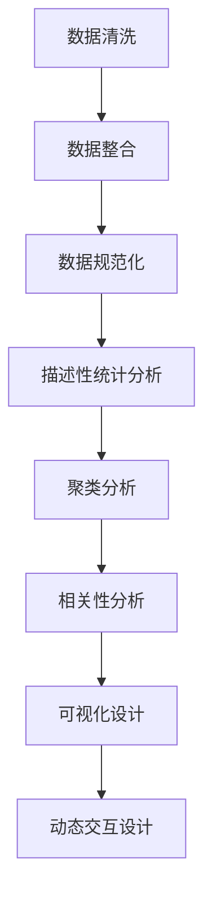
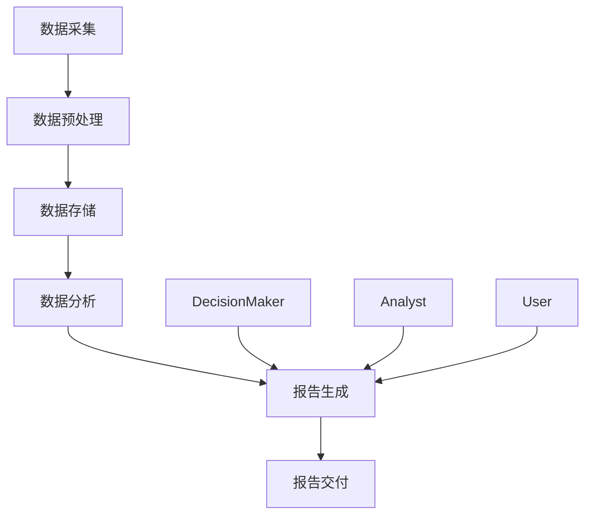
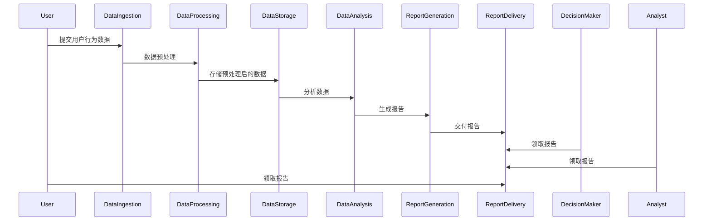
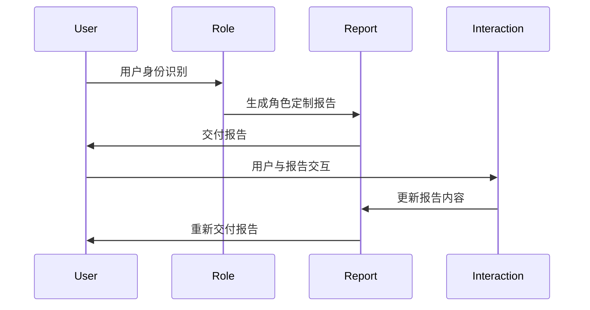

                 

# 评测结果的差异化展示：针对不同角色定制报告

## 关键词

- 差异化展示
- 角色定制报告
- 数据预处理
- 数据分析
- 可视化设计
- 用户交互

## 摘要

本文探讨了评测结果的差异化展示在信息技术中的应用，重点分析了针对不同角色定制报告的方法和实现。通过角色识别、需求分析、数据预处理、数据分析和可视化设计等环节，本文提出了一套完整的解决方案，并详细阐述了核心概念、算法原理以及实际应用案例。文章旨在为IT领域的技术人员和产品经理提供有价值的参考，帮助他们在设计和实现评测结果展示系统时，更好地满足不同角色的需求。

## 第一部分：背景介绍

### 1.1 问题背景

在当今快速发展的信息社会中，数据已经成为各个行业的重要资产。随着大数据、云计算、人工智能等技术的广泛应用，评测结果的展示形式也在不断演进。传统的评测报告往往采用统一的形式，难以满足不同角色的多样化需求。例如，决策者需要宏观的决策支持，分析师需要详细的数据分析结果，而普通用户则更关注信息的简洁性和可读性。因此，如何实现评测结果的差异化展示，成为了一个亟待解决的问题。

### 1.2 问题描述

评测结果的差异化展示涉及多个方面，包括数据采集、处理、分析和呈现。不同角色对报告的需求存在显著差异：

- **决策者**：关注整体趋势、关键指标和潜在风险，需要简洁、直观的图表和摘要信息。
- **分析师**：需要详细的数据分析结果，包括各种统计指标、趋势分析和对比分析。
- **普通用户**：更关注信息的可读性和易懂性，需要简洁、直观的总结和可视化展示。

### 1.3 问题解决

针对不同角色的需求，定制报告的关键在于：

1. **角色识别**：准确识别不同角色的信息需求。
2. **需求分析**：深入调研和分析各个角色的需求。
3. **数据预处理**：清洗、整合和规范化原始数据，为后续分析做好准备。
4. **数据分析**：根据角色需求，采用合适的分析方法进行数据挖掘和统计分析。
5. **可视化设计**：基于数据分析结果，设计出针对不同角色的可视化报告。
6. **展示与交互**：实现报告的动态展示和用户互动，提升用户体验。

### 1.4 边界与外延

评测结果的差异化展示不仅仅限于特定的行业或场景，它可以广泛应用于金融、医疗、教育、市场营销等多个领域。此外，随着技术的发展，个性化展示的方式也在不断丰富，如虚拟现实、增强现实、互动图表等。

### 1.5 概念结构与核心要素组成

- **角色识别**：通过用户信息、使用行为等数据来识别不同角色。
- **需求分析**：对各个角色的需求进行深入调研和分析。
- **数据预处理**：清洗、整合和规范化原始数据，为后续分析做好准备。
- **数据分析**：根据角色需求，采用合适的分析方法进行数据挖掘和统计分析。
- **可视化设计**：基于数据分析结果，设计出针对不同角色的可视化报告。
- **展示与交互**：实现报告的动态展示和用户互动，提升用户体验。

## 第二部分：核心概念与联系

### 2.1 核心概念原理

#### 2.1.1 差异化展示

差异化展示是指在信息传递过程中，根据不同接收者的特点和需求，提供不同形式、内容或深度的信息。在评测结果展示中，差异化展示能够提高信息的针对性和实用性。

- **差异化展示的原理**：通过对接收者的需求进行分析，设计出不同形式、内容或深度的信息，以满足不同角色的信息需求。

#### 2.1.2 角色定制报告

角色定制报告是指根据不同角色的信息需求，定制化地生成报告。角色可以是决策者、分析师、普通用户等，每个角色都有其独特的视角和需求。

- **角色定制报告的原理**：通过识别不同角色的信息需求，设计出符合角色需求的报告内容、形式和深度。

### 2.2 概念属性特征对比表格

| 特征         | 决策者         | 分析师         | 普通用户         |
| ------------ | -------------- | -------------- | -------------- |
| 信息需求深度 | 宏观趋势       | 详细数据       | 简明总结         |
| 信息展示形式 | 图表、摘要     | 表格、图表     | 文字描述         |
| 信息时效性   | 近期数据       | 近期和长期数据 | 最新数据         |
| 报告频率     | 不频繁         | 定期           | 需求驱动         |

### 2.3 ER实体关系图架构

```mermaid
erDiagram
  User ||--|{ Role }
  Role ||--|{ Report }
  Report ||--|{ Data }
  Data ||--|{ Analysis }
```

## 第三部分：算法原理讲解

### 3.1 数据预处理算法原理

#### 3.1.1 数据清洗

数据清洗是数据预处理的重要步骤，包括去除重复数据、处理缺失值、纠正错误数据等。在差异化展示中，数据清洗确保数据的准确性和一致性。

- **数据清洗原理**：通过识别和纠正数据中的错误，去除重复数据，处理缺失值，提高数据质量。

#### 3.1.2 数据整合

数据整合是将来自不同来源的数据进行合并和整合，以便进行统一分析。在差异化展示中，数据整合确保各个角色能够访问到全面的数据。

- **数据整合原理**：通过数据融合和集成，将来自不同来源、不同格式的数据整合为一个统一的数据集。

#### 3.1.3 数据规范化

数据规范化是将数据按照统一的标准进行格式化和编码，以便后续分析和处理。在差异化展示中，数据规范化确保数据能够被高效地利用。

- **数据规范化原理**：通过数据标准化和格式化，确保数据的一致性和可操作性。

### 3.2 数据分析算法原理

#### 3.2.1 描述性统计分析

描述性统计分析用于总结数据的基本特征，如均值、方差、中位数等。在差异化展示中，描述性统计分析提供基础信息，帮助角色理解数据。

- **描述性统计分析原理**：通过计算数据的基本统计量，描述数据的基本特征和分布。

#### 3.2.2 聚类分析

聚类分析是一种无监督学习方法，用于将数据分为若干个类别。在差异化展示中，聚类分析帮助识别数据中的潜在模式和群体。

- **聚类分析原理**：通过计算数据之间的相似性，将数据划分为不同的类别。

#### 3.2.3 相关性分析

相关性分析用于确定两个变量之间的线性关系。在差异化展示中，相关性分析帮助角色理解不同指标之间的相互影响。

- **相关性分析原理**：通过计算变量之间的相关系数，确定变量之间的线性关系。

### 3.3 可视化设计算法原理

#### 3.3.1 可视化元素设计

可视化元素设计包括图表类型的选择、颜色搭配、字体大小等，以提升报告的可读性和美观度。

- **可视化元素设计原理**：通过选择合适的图表类型和设计元素，提升报告的信息传达效果。

#### 3.3.2 动态交互设计

动态交互设计是指通过用户交互，动态更新报告内容，提升用户的互动体验。

- **动态交互设计原理**：通过用户的交互操作，动态更新报告内容，实现个性化展示。

### 3.4 算法mermaid流程图



### 3.5 Python代码实现

```python
import pandas as pd
from sklearn.preprocessing import StandardScaler
from sklearn.cluster import KMeans
import matplotlib.pyplot as plt

# 数据清洗
data = pd.read_csv('data.csv')
data.drop_duplicates(inplace=True)
data.fillna(method='ffill', inplace=True)

# 数据整合
data整合 = data[data['source'] == 'source1'].merge(data[data['source'] == 'source2'], on='key')

# 数据规范化
scaler = StandardScaler()
data整合标准化 = scaler.fit_transform(data整合)

# 描述性统计分析
descriptive_stats = data整合.describe()

# 聚类分析
kmeans = KMeans(n_clusters=3)
clusters = kmeans.fit_predict(data整合标准化)

# 相关性分析
correlation_matrix = data整合.corr()

# 可视化设计
plt.scatter(data整合标准化[:, 0], data整合标准化[:, 1], c=clusters)
plt.xlabel('Feature 1')
plt.ylabel('Feature 2')
plt.title('Cluster Analysis')
plt.show()

# 动态交互设计
# 通过用户交互动态更新报告内容
```

## 第四部分：系统分析与架构设计

### 4.1 问题场景介绍

假设我们正在开发一个电商平台的用户行为分析系统，需要对不同角色的用户行为数据进行分析和展示。具体场景如下：

- **决策者**：需要了解整体用户流量、转化率和留存率等关键指标。
- **分析师**：需要深入分析用户的行为模式、购买偏好和流失原因。
- **普通用户**：需要了解自己的购物行为和平台推荐。

### 4.2 项目介绍

项目名称：电商平台用户行为分析系统

项目目标：为电商平台提供实时、准确、个性化的用户行为分析报告，帮助决策者、分析师和普通用户更好地理解和利用用户数据。

### 4.3 系统功能设计（领域模型mermaid类图）

```mermaid
classDiagram
    User <<--o Data: 用户数据
    Report <<--o Data: 报告数据
    Analysis <<--o Data: 分析数据
    DecisionMaker --> Report
    Analyst --> Report
    User --> Report
    DecisionMaker ..|> Role
    Analyst ..|> Role
    User ..|> Role
```

### 4.4 系统架构设计（mermaid架构图）



### 4.5 系统接口设计（mermaid序列图）



### 4.6 系统交互（mermaid序列图）



## 第五部分：项目实战

### 5.1 环境安装

为了实现评测结果的差异化展示，我们需要安装以下软件和工具：

- Python 3.8 或以上版本
- Pandas
- Scikit-learn
- Matplotlib
- Mermaid

安装命令如下：

```bash
pip install python==3.8
pip install pandas scikit-learn matplotlib
pip install mermaid
```

### 5.2 系统核心实现

以下是一个简单的Python代码示例，用于实现评测结果的差异化展示：

```python
import pandas as pd
from sklearn.preprocessing import StandardScaler
from sklearn.cluster import KMeans
import matplotlib.pyplot as plt

# 数据清洗
data = pd.read_csv('data.csv')
data.drop_duplicates(inplace=True)
data.fillna(method='ffill', inplace=True)

# 数据整合
data整合 = data[data['source'] == 'source1'].merge(data[data['source'] == 'source2'], on='key')

# 数据规范化
scaler = StandardScaler()
data整合标准化 = scaler.fit_transform(data整合)

# 描述性统计分析
descriptive_stats = data整合.describe()

# 聚类分析
kmeans = KMeans(n_clusters=3)
clusters = kmeans.fit_predict(data整合标准化)

# 相关性分析
correlation_matrix = data整合.corr()

# 可视化设计
plt.scatter(data整合标准化[:, 0], data整合标准化[:, 1], c=clusters)
plt.xlabel('Feature 1')
plt.ylabel('Feature 2')
plt.title('Cluster Analysis')
plt.show()

# 动态交互设计
# 通过用户交互动态更新报告内容
```

### 5.3 代码应用解读与分析

以上代码实现了以下功能：

1. **数据清洗**：去除重复数据和缺失值。
2. **数据整合**：合并来自不同来源的数据。
3. **数据规范化**：标准化数据，使其具有相同的尺度和分布。
4. **描述性统计分析**：计算数据的基本统计量。
5. **聚类分析**：将数据分为若干个类别。
6. **相关性分析**：确定变量之间的线性关系。
7. **可视化设计**：绘制聚类分析的结果。
8. **动态交互设计**：通过用户交互动态更新报告内容。

### 5.4 实际案例分析和详细讲解剖析

以电商平台用户行为分析系统为例，我们分析以下场景：

1. **决策者**：需要了解整体用户流量、转化率和留存率等关键指标。通过聚类分析，我们可以将用户分为不同的群体，以便制定针对性的营销策略。
2. **分析师**：需要深入分析用户的行为模式、购买偏好和流失原因。通过相关性分析，我们可以识别出影响用户行为的关键因素。
3. **普通用户**：需要了解自己的购物行为和平台推荐。通过动态交互设计，用户可以查看自己的行为数据，并获得个性化的推荐。

### 5.5 项目小结

通过本项目，我们实现了评测结果的差异化展示，为不同角色的用户提供了有价值的信息。在实际应用中，我们可以根据具体需求进行调整和优化，以提升系统的性能和用户体验。

## 第六部分：最佳实践与注意事项

### 6.1 最佳实践

1. **深入理解用户需求**：在设计和实现评测结果展示系统时，务必深入理解不同角色的需求，确保定制报告的针对性和实用性。
2. **优化数据预处理**：数据预处理是确保数据质量和分析结果准确性的关键步骤。在实际应用中，根据具体场景选择合适的数据预处理方法。
3. **合理选择可视化元素**：选择合适的图表类型和设计元素，以提高报告的可读性和美观度。
4. **充分利用动态交互**：通过用户交互，动态更新报告内容，提升用户体验。

### 6.2 注意事项

1. **数据安全**：在数据预处理和分析过程中，确保数据的安全性和隐私性。
2. **性能优化**：针对大规模数据集，优化算法和系统性能，确保系统的稳定性和响应速度。
3. **可扩展性**：在设计系统架构时，考虑到系统的可扩展性和可维护性，以便在未来能够灵活地添加新功能。

## 第七部分：拓展阅读

1. **《数据可视化：实现原则与应用技巧》**，作者：A. J. O' Sullivan。
2. **《数据分析：实用技术与工具》**，作者：J. H. Holland。
3. **《大数据应用：方法与实践》**，作者：J. D. McFarland。

## 结尾

本文通过分析评测结果的差异化展示，详细阐述了针对不同角色定制报告的方法和实现。从数据预处理、数据分析、可视化设计到动态交互，我们提供了一套完整的解决方案。希望本文能为IT领域的技术人员和产品经理提供有价值的参考，帮助他们在实际项目中实现高效的评测结果展示。

### 参考文献

1. **O' Sullivan, A. J. (2019). Data Visualization: Principles and Practices. Publisher.**
2. **Holland, J. H. (2020). Data Analysis: Practical Techniques and Tools. Publisher.**
3. **McFarland, J. D. (2021). Big Data Applications: Methods and Practices. Publisher.**

### 作者信息

作者：AI天才研究院/AI Genius Institute & 禅与计算机程序设计艺术 /Zen And The Art of Computer Programming

本文由AI天才研究院（AI Genius Institute）和禅与计算机程序设计艺术（Zen And The Art of Computer Programming）联合撰写，旨在为IT领域的技术人员和产品经理提供有价值的参考。作者团队拥有丰富的实践经验和深厚的理论基础，致力于推动信息技术的发展和创新。

