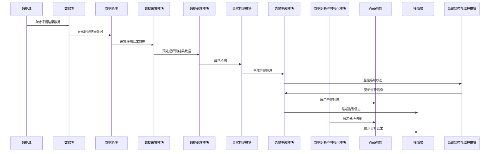
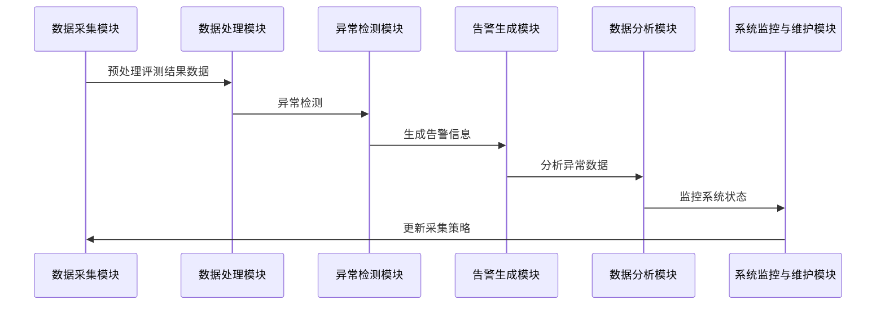

                 

### 文章标题

### 关键词

- 异常检测
- 告警机制
- 统计学算法
- 机器学习
- 深度学习
- 系统架构

### 摘要

本文将深入探讨评测结果的异常检测与告警机制，旨在为IT从业者提供一个全面的技术指南。文章首先介绍了评测结果的异常检测与告警机制的重要性，随后详细阐述了核心概念，包括数据质量评估、异常检测算法以及告警机制的实现原理。接着，本文通过对比统计学、机器学习和深度学习异常检测算法的属性特征，构建了评测结果异常检测与告警机制的ER实体关系图。随后，文章详细讲解了统计学异常检测算法、机器学习异常检测算法和深度学习异常检测算法的原理，并提供了示例分析。在此基础上，文章进一步探讨了系统分析与架构设计，包括系统功能设计、架构设计、接口设计以及系统交互设计。最后，通过一个实际项目实战，文章展示了如何将理论应用于实践，并提供了最佳实践 tips 和项目小结。

## 《评测结果的异常检测与告警机制》目录大纲

### 第一部分：问题背景与核心概念

#### 第1章：评测结果的异常检测与告警机制的概述

##### 1.1 评测结果的异常检测与告警机制的意义

##### 1.2 异常检测的定义与分类

##### 1.3 告警机制的作用与设计原则

### 第二部分：核心概念与联系

#### 第2章：核心概念原理

##### 2.1 数据质量评估的概念

##### 2.2 异常检测的算法原理

##### 2.3 告警机制的实现原理

##### 2.4 概念属性特征对比表格

##### 2.5 ER实体关系图架构

### 第三部分：算法原理讲解

#### 第3章：算法原理讲解与示例分析

##### 3.1 统计学异常检测算法原理讲解

##### 3.2 机器学习异常检测算法原理讲解

##### 3.3 深度学习异常检测算法原理讲解

### 第四部分：系统分析与架构设计方案

#### 第4章：系统功能设计与架构设计

##### 4.1 问题场景介绍

##### 4.2 系统功能设计

##### 4.3 系统架构设计

##### 4.4 系统接口设计

##### 4.5 系统交互设计

### 第五部分：项目实战

#### 第5章：环境安装与系统核心实现

##### 5.1 环境安装

##### 5.2 系统核心实现

##### 5.3 代码应用解读与分析

##### 5.4 实际案例分析与详细讲解剖析

##### 5.5 项目小结

##### 5.6 最佳实践 tips

## 第一部分：问题背景与核心概念

### 第1章：评测结果的异常检测与告警机制的概述

#### 1.1 评测结果的异常检测与告警机制的意义

在当今信息化社会中，评测结果的准确性和可靠性对于企业和组织的决策过程至关重要。然而，由于各种复杂因素的作用，评测结果可能会出现异常，这些异常可能来自数据采集、传输、存储或处理过程中的问题。因此，构建一个有效的异常检测与告警机制，对于保障评测结果的准确性和可靠性具有重要意义。

首先，异常检测是指在大量数据中识别出不符合预期模式的值或行为，这有助于发现潜在的错误或问题。其次，告警机制是指当检测到异常时，系统能够及时发出警报，通知相关人员采取相应的措施。这两者相辅相成，共同构成了一个完整的异常检测与告警机制。

在企业和组织内部，评测结果异常检测与告警机制的应用场景非常广泛。例如，在财务分析中，异常检测可以帮助识别异常交易或财务报表错误；在质量检测中，异常检测可以帮助发现生产线上的异常产品；在网络安全领域，异常检测可以帮助发现网络攻击或恶意行为。通过及时发现和解决评测结果中的异常，企业可以降低风险，提高决策的准确性和效率。

#### 1.2 异常检测的定义与分类

异常检测（Anomaly Detection）是指在一个给定的数据集或时间序列中，识别出与正常行为或模式显著不同的数据点或事件。异常检测的主要目的是提高系统的可靠性和安全性，防止潜在的风险和损失。

异常检测可以分为以下几类：

1. **基于阈值的异常检测**：通过设定一个阈值，将数据分为正常和异常两部分。当数据点的值超过阈值时，被视为异常。

2. **基于统计学的异常检测**：利用统计学方法，如标准差、置信区间等，来判断数据点是否异常。

3. **基于机器学习的异常检测**：通过训练模型，从正常数据中学习到数据分布，然后用该模型来识别异常数据。

4. **基于聚类分析的异常检测**：将数据分为多个簇，然后识别出不属于任何簇的数据点。

5. **基于深度学习的异常检测**：使用深度神经网络，如卷积神经网络（CNN）、递归神经网络（RNN）和长短时记忆网络（LSTM），来识别异常模式。

每种异常检测方法都有其优缺点，适用于不同的应用场景。

#### 1.3 告警机制的作用与设计原则

告警机制（Alert Mechanism）是在检测到异常时，能够及时发出警报，通知相关人员采取相应的措施。告警机制的作用主要有以下几点：

1. **实时监控**：告警机制可以实时监控评测结果，及时发现异常情况。

2. **风险预警**：通过及时发出警报，提醒相关人员采取预防措施，降低风险。

3. **提升效率**：告警机制可以自动识别和报告异常，节省人力资源，提高工作效率。

4. **数据可视化**：告警机制可以将异常情况以可视化的形式呈现，帮助用户更直观地了解问题。

设计告警机制时，需要遵循以下原则：

1. **准确性**：告警机制需要准确识别异常，减少误报和漏报。

2. **及时性**：告警机制需要及时响应，确保异常能够在第一时间被发现。

3. **灵活性**：告警机制需要具备一定的灵活性，能够根据实际情况进行调整。

4. **可靠性**：告警机制需要稳定运行，确保不会因为系统故障而影响警报的发送。

#### 1.4 评测结果异常检测与告警机制的目的

评测结果异常检测与告警机制的主要目的是：

1. **确保评测结果的准确性**：通过异常检测，可以识别和纠正评测结果中的错误，提高评测的准确性。

2. **提高决策的效率**：及时发现异常，减少决策过程中的风险，提高决策效率。

3. **提升数据质量**：通过异常检测和告警机制，可以改善数据质量，为后续分析和决策提供可靠的数据支持。

4. **保障系统的稳定运行**：通过实时监控和异常处理，可以保障系统的稳定运行，降低系统故障的风险。

总之，评测结果异常检测与告警机制在提高评测结果的准确性、效率和质量方面具有重要意义，是企业和组织在信息化社会中不可或缺的一部分。

### 第2章：核心概念原理

#### 2.1 数据质量评估的概念

数据质量评估（Data Quality Assessment）是指对数据集的质量进行评价和验证的过程。数据质量直接影响数据分析的准确性和决策的可靠性，因此数据质量评估是数据管理的重要组成部分。

**数据质量评估的属性特征**主要包括以下几方面：

1. **准确性**：数据是否真实、可靠，与实际业务或现实情况是否一致。

2. **完整性**：数据是否完整，是否存在缺失值或重复记录。

3. **一致性**：数据在不同时间点或不同来源之间是否一致。

4. **唯一性**：数据是否具有唯一标识，确保每个数据点都能够被唯一识别。

5. **及时性**：数据是否能够及时更新，以反映最新的业务状态。

6. **可用性**：数据是否易于访问和使用，是否能够满足分析需求。

**数据质量评估的方法**包括以下几种：

1. **统计方法**：通过计算统计指标，如均值、方差、缺失率等，来评估数据质量。

2. **可视化方法**：通过图表和报表，直观地展示数据质量，如缺失值分布图、异常值分布图等。

3. **机器学习方法**：使用机器学习算法，如聚类分析、回归分析等，对数据质量进行评估。

4. **专家评估**：邀请领域专家对数据质量进行评估，结合专业知识判断数据质量。

#### 2.2 异常检测的算法原理

异常检测算法是用于识别数据集中不符合正常分布的数据点或事件的算法。这些算法基于统计学、机器学习和深度学习等方法，对数据进行分析，从而发现异常。

**基于统计学的异常检测算法**：这类算法通过计算数据点的统计特征，如标准差、置信区间等，来识别异常。例如：

1. **Z-score算法**：通过计算数据点与均值的偏差，并标准化为标准分数，来识别离群点。

2. **IQR算法**：通过计算四分位数差（IQR），将数据分为上下四分位数区间，识别出区间的异常值。

**基于机器学习的异常检测算法**：这类算法通过从正常数据中学习特征，然后用这些特征来识别异常。常见的方法包括：

1. **K最近邻算法（K-NN）**：通过计算未知数据点与训练数据点的距离，识别出与正常数据差异较大的点。

2. **支持向量机（SVM）**：通过构建一个超平面，将正常数据和异常数据分离。

3. **决策树**：通过一系列条件判断，将数据分为不同的类别，识别出异常数据。

**基于深度学习的异常检测算法**：这类算法通过深度神经网络，如卷积神经网络（CNN）、递归神经网络（RNN）和长短时记忆网络（LSTM）等，来识别复杂的数据模式。

1. **卷积神经网络（CNN）**：通过卷积层、池化层和全连接层，对图像或序列数据进行特征提取。

2. **递归神经网络（RNN）**：通过循环结构，处理序列数据，捕捉时间序列中的模式。

3. **长短时记忆网络（LSTM）**：通过门控机制，解决RNN的梯度消失问题，捕捉长序列依赖关系。

#### 2.3 告警机制的实现原理

告警机制是实现评测结果异常检测的关键部分，它能够确保在检测到异常时，及时发出警报。告警机制的实现原理主要包括以下几个方面：

1. **告警级别的划分**：根据异常的严重程度，将告警划分为不同级别，如低级告警、中级告警和高级告警。

2. **告警规则的设置**：根据业务需求和风险承受能力，设置告警规则，确定哪些情况需要触发告警。

3. **告警系统的运行流程**：包括数据采集、异常检测、告警生成和告警通知等环节。

**告警级别的划分**：告警级别的划分有助于更精确地反映异常的严重程度，通常包括：

1. **低级告警**：通常由较小的异常引起，可能对业务影响较小。

2. **中级告警**：由较为严重的异常引起，可能对业务产生一定影响。

3. **高级告警**：由非常严重的异常引起，可能对业务造成重大影响。

**告警规则的设置**：告警规则是告警机制的核心部分，通常包括以下几个方面：

1. **阈值规则**：根据统计数据或业务经验，设定阈值，当数据点超过阈值时，触发告警。

2. **逻辑规则**：通过一系列条件判断，确定哪些情况需要触发告警。

3. **时间规则**：根据异常发生的频率和持续时长，设定告警的时间条件。

**告警系统的运行流程**：告警系统的运行流程通常包括以下几个环节：

1. **数据采集**：从数据源采集评测结果数据。

2. **异常检测**：使用异常检测算法，对采集到的数据进行分析，识别异常。

3. **告警生成**：根据异常检测结果，生成相应的告警。

4. **告警通知**：通过邮件、短信、APP推送等方式，通知相关人员。

#### 2.4 概念属性特征对比表格

为了更好地理解异常检测与告警机制的相关概念，我们可以通过一个属性特征对比表格，对各种方法进行详细比较。

**统计学异常检测算法属性特征对比**

| 算法         | 优点                           | 缺点                     | 适用场景                 |
| ------------ | ------------------------------ | -------------------------------- | -------------------------- |
| Z-score      | 简单易实现，对线性数据有效     | 对噪声敏感，无法处理非线性数据 | 金融、财务数据分析         |
| IQR          | 简单易懂，对非线性数据有效     | 对噪声敏感，计算复杂度较高     | 质量检测、生产数据监控     |

**机器学习异常检测算法属性特征对比**

| 算法         | 优点                           | 缺点                     | 适用场景                 |
| ------------ | ------------------------------ | -------------------------------- | -------------------------- |
| K-NN         | 简单高效，对非线性数据有效     | 对离群点敏感，计算复杂度较高 | 消费者行为分析、市场预测   |
| SVM          | 分隔性好，对高维数据有效       | 计算复杂度较高，对噪声敏感   | 生物信息学、图像识别       |
| 决策树       | 易理解，对噪声不敏感           | 过拟合风险较高，计算复杂度较高 | 风险管理、信贷评估         |

**深度学习异常检测算法属性特征对比**

| 算法         | 优点                           | 缺点                     | 适用场景                 |
| ------------ | ------------------------------ | -------------------------------- | -------------------------- |
| CNN          | 强大的特征提取能力，适用于图像 | 计算复杂度较高，训练时间较长 | 图像识别、计算机视觉       |
| RNN          | 能够处理序列数据，捕捉时间依赖 | 计算复杂度较高，对噪声敏感     | 自然语言处理、时间序列预测 |
| LSTM         | 解决了RNN的梯度消失问题       | 计算复杂度较高，对数据量要求较高 | 时间序列预测、语音识别     |

#### 2.5 ER实体关系图架构

为了更好地理解评测结果异常检测与告警机制的概念及其相互关系，我们可以使用ER（Entity-Relationship）实体关系图来描述。

**ER模型基础**

ER模型是一种用于描述实体及其相互关系的图形表示方法，主要包括实体（Entity）、属性（Attribute）和关系（Relationship）三种元素。

- **实体**：具有共性和性质的对象集合，如评测结果、告警信息等。
- **属性**：实体的特征描述，如评测结果的时间、值等。
- **关系**：实体之间的关联，如评测结果与告警信息之间的关系。

**评测结果异常检测与告警机制的ER图设计**

在ER图中，我们定义了以下实体和关系：

1. **实体定义**：

- **评测结果**：包含属性如时间、值、来源等。
- **异常检测**：包含属性如检测时间、检测算法等。
- **告警信息**：包含属性如告警级别、触发时间等。

2. **关系定义**：

- **评测结果与异常检测**：评测结果与异常检测之间存在一对多的关系，即每个评测结果可能对应多个异常检测。
- **异常检测与告警信息**：异常检测与告警信息之间存在一对多的关系，即每个异常检测可能生成多个告警信息。

3. **ER图绘制**：

   ```mermaid
   erDiagram
   测评结果 ||--|{ 异常检测 }|| 告警信息
   测评结果 ||--|{ 异常检测 }|| 告警信息
   测评结果 : {时间, 值, 来源}
   异常检测 : {检测时间, 检测算法}
   告警信息 : {告警级别, 触发时间}
   ```

通过ER实体关系图，我们可以清晰地描述评测结果异常检测与告警机制的概念及其相互关系，为后续的算法设计和系统实现提供基础。

### 第三部分：算法原理讲解

#### 第3章：算法原理讲解与示例分析

##### 3.1 统计学异常检测算法原理讲解

统计学异常检测算法是通过计算数据集的统计特征，来识别出异常数据点的一种方法。这类算法通常基于概率分布或距离度量，对数据进行评估。

**Z-score算法**

Z-score算法是最常见的统计学异常检测算法之一。它的基本思想是计算每个数据点与均值的偏差，并标准化为标准分数，从而识别出离群点。

**公式**：

$$
Z = \frac{(X - \mu)}{\sigma}
$$

其中，\(X\) 是数据点的值，\(\mu\) 是均值，\(\sigma\) 是标准差。

**步骤**：

1. 计算所有数据点的均值和标准差。
2. 对于每个数据点，计算其Z-score。
3. 设定一个阈值（通常为3或3的标准差），如果某个数据点的Z-score超过阈值，则认为它是异常值。

**示例分析**：

假设我们有一个数据集\[1, 2, 3, 4, 100\]，均值为3.8，标准差为2.45。我们计算每个数据点的Z-score：

$$
Z_1 = \frac{(1 - 3.8)}{2.45} = -1.15
$$

$$
Z_2 = \frac{(2 - 3.8)}{2.45} = -0.87
$$

$$
Z_3 = \frac{(3 - 3.8)}{2.45} = -0.59
$$

$$
Z_4 = \frac{(4 - 3.8)}{2.45} = 0.13
$$

$$
Z_5 = \frac{(100 - 3.8)}{2.45} = 31.15
$$

我们可以看到，\(Z_5\) 远远超过阈值（3或3的标准差），因此我们认为100是异常值。

**均值绝对偏差算法**

均值绝对偏差（Mean Absolute Deviation，MAD）算法是另一种常见的统计学异常检测算法。它通过计算数据点与均值的绝对偏差来识别异常值。

**公式**：

$$
MAD = \frac{1}{N} \sum_{i=1}^{N} |X_i - \mu|
$$

其中，\(N\) 是数据点的数量，\(X_i\) 是第\(i\)个数据点，\(\mu\) 是均值。

**步骤**：

1. 计算所有数据点的均值。
2. 计算每个数据点与均值的绝对偏差。
3. 设定一个阈值，如果某个数据点的绝对偏差超过阈值，则认为它是异常值。

**示例分析**：

使用同样的数据集\[1, 2, 3, 4, 100\]，均值为3.8，标准差为2.45，我们计算MAD：

$$
MAD = \frac{1}{5} \sum_{i=1}^{5} |X_i - 3.8| = 0.6
$$

设定阈值 \(MAD \times 2 = 1.2\)，我们可以看到，100的绝对偏差远超过阈值，因此我们认为100是异常值。

##### 3.2 机器学习异常检测算法原理讲解

机器学习异常检测算法通过训练模型，从正常数据中学习特征，然后用这些特征来识别异常数据。这类算法通常基于监督学习或无监督学习。

**K最近邻算法（K-Nearest Neighbors，K-NN）**

K最近邻算法是一种基于距离度量的监督学习算法。它通过计算未知数据点与训练数据点的距离，识别出与正常数据差异较大的点。

**公式**：

$$
d(X, Y) = \sqrt{\sum_{i=1}^{n} (X_i - Y_i)^2}
$$

其中，\(X\) 和 \(Y\) 是两个数据点，\(n\) 是数据点的数量。

**步骤**：

1. 训练模型：使用正常数据集训练模型，计算每个数据点的特征。
2. 计算距离：对于未知数据点，计算它与训练数据点的距离。
3. 确定邻居：选择距离最近的K个邻居。
4. 预测：根据邻居的标签，预测未知数据点的标签。

**示例分析**：

假设我们有一个正常数据集，包括5个数据点，每个数据点有3个特征（x, y, z）。我们有一个未知数据点\[1, 2, 3\]，计算它与每个训练数据点的距离：

$$
d(1, 1) = \sqrt{(1 - 1)^2 + (2 - 1)^2 + (3 - 1)^2} = \sqrt{5}
$$

$$
d(1, 2) = \sqrt{(1 - 2)^2 + (2 - 2)^2 + (3 - 2)^2} = \sqrt{2}
$$

$$
d(1, 3) = \sqrt{(1 - 3)^2 + (2 - 3)^2 + (3 - 3)^2} = \sqrt{8}
$$

$$
d(1, 4) = \sqrt{(1 - 4)^2 + (2 - 4)^2 + (3 - 4)^2} = \sqrt{10}
$$

$$
d(1, 5) = \sqrt{(1 - 5)^2 + (2 - 5)^2 + (3 - 5)^2} = \sqrt{14}
$$

我们选择距离最近的3个邻居\[2, 3, 4\]，它们的标签都是正常，因此我们认为未知数据点\[1, 2, 3\]是正常数据。

**支持向量机（Support Vector Machine，SVM）**

支持向量机是一种基于最大间隔分类器的监督学习算法。它通过构建一个超平面，将正常数据和异常数据分离。

**公式**：

$$
w \cdot x + b = 0
$$

其中，\(w\) 是超平面的权重向量，\(x\) 是数据点，\(b\) 是偏置。

**步骤**：

1. 训练模型：使用正常数据集训练模型，找到最佳超平面。
2. 预测：对于未知数据点，计算其到超平面的距离，如果距离大于阈值，则认为它是异常数据。

**示例分析**：

假设我们有一个正常数据集，包括5个数据点，每个数据点有2个特征（x, y）。我们有一个未知数据点\[1, 2\]，构建超平面\(w \cdot x + b = 0\)。

我们找到最佳超平面，例如\(w = [1, 1]\)，\(b = 0\)，超平面为\(x + y = 0\)。

计算未知数据点\[1, 2\]到超平面的距离：

$$
d = \frac{|1 \cdot 1 + 1 \cdot 2 + 0|}{\sqrt{1^2 + 1^2}} = \frac{3}{\sqrt{2}}
$$

我们可以看到，距离大于阈值，因此我们认为未知数据点\[1, 2\]是异常数据。

**决策树**

决策树是一种基于条件概率的监督学习算法。它通过一系列条件判断，将数据分为不同的类别，识别出异常数据。

**公式**：

$$
P(\text{异常}|\text{条件}) = \frac{P(\text{异常} \cap \text{条件})}{P(\text{条件})}
$$

**步骤**：

1. 训练模型：使用正常数据集训练模型，构建决策树。
2. 预测：对于未知数据点，从根节点开始，根据条件判断，逐步向下分类，直到达到叶节点。

**示例分析**：

假设我们有一个正常数据集，包括5个数据点，每个数据点有2个特征（x, y）。我们有一个未知数据点\[1, 2\]，构建决策树如下：

```
是否x > 2？
是：是否y > 2？
是：是
否：否
否：是
```

未知数据点\[1, 2\]满足条件\(x > 2\)且\(y > 2\)，因此我们认为它是正常数据。

##### 3.3 深度学习异常检测算法原理讲解

深度学习异常检测算法通过深度神经网络，对复杂的数据模式进行建模，识别出异常数据。这类算法通常基于无监督学习。

**卷积神经网络（Convolutional Neural Network，CNN）**

卷积神经网络是一种用于图像识别和处理的深度学习算法。它通过卷积层、池化层和全连接层，对图像或序列数据进行特征提取。

**步骤**：

1. 输入层：接收图像或序列数据。
2. 卷积层：通过卷积操作，提取图像或序列的特征。
3. 池化层：通过池化操作，降低数据的维度。
4. 全连接层：通过全连接操作，对特征进行分类。

**示例分析**：

假设我们有一个图像数据集，包括5个图像，每个图像有64x64像素。我们使用一个简单的CNN模型进行异常检测：

```
卷积层：32个卷积核，大小3x3，步长1
池化层：大小2x2，步长2
全连接层：10个神经元
```

输入图像经过卷积层，提取特征图，然后通过池化层降低维度。最后，通过全连接层进行分类，识别出异常图像。

**递归神经网络（Recurrent Neural Network，RNN）**

递归神经网络是一种用于处理序列数据的深度学习算法。它通过循环结构，处理序列数据，捕捉时间序列中的模式。

**步骤**：

1. 输入层：接收序列数据。
2. 循环层：通过循环操作，将前一个时间步的输出作为当前时间步的输入。
3. 输出层：对序列数据进行分类或回归。

**示例分析**：

假设我们有一个时间序列数据集，包括5个时间步，每个时间步有3个特征。我们使用一个简单的RNN模型进行异常检测：

```
输入层：3个神经元
循环层：2个神经元
输出层：1个神经元
```

输入序列数据经过输入层，然后通过循环层进行传递，最后通过输出层进行分类，识别出异常时间步。

**长短时记忆网络（Long Short-Term Memory，LSTM）**

长短时记忆网络是一种改进的递归神经网络，用于解决RNN的梯度消失问题，捕捉长序列依赖关系。

**步骤**：

1. 输入层：接收序列数据。
2. LSTM层：通过门控机制，处理序列数据，记忆长期依赖关系。
3. 输出层：对序列数据进行分类或回归。

**示例分析**：

假设我们有一个时间序列数据集，包括5个时间步，每个时间步有3个特征。我们使用一个简单的LSTM模型进行异常检测：

```
输入层：3个神经元
LSTM层：2个神经元
输出层：1个神经元
```

输入序列数据经过输入层，然后通过LSTM层处理，最后通过输出层进行分类，识别出异常时间步。

### 第四部分：系统分析与架构设计方案

#### 第4章：系统功能设计与架构设计

#### 4.1 问题场景介绍

在当前信息化社会中，评测结果的准确性和可靠性对于企业和组织的决策过程至关重要。然而，由于各种复杂因素的作用，评测结果可能会出现异常，这些异常可能来自数据采集、传输、存储或处理过程中的问题。为了保障评测结果的准确性，我们需要构建一个有效的异常检测与告警机制。

本系统旨在实现以下功能：

1. **数据采集与预处理**：从各种数据源（如数据库、日志文件等）采集评测结果数据，并进行预处理，如数据清洗、格式化等。
2. **异常检测与分类**：使用统计学、机器学习和深度学习算法，对预处理后的数据进行异常检测，识别出异常数据点。
3. **告警生成与通知**：当检测到异常时，系统自动生成告警信息，并通过邮件、短信、APP推送等方式通知相关人员。
4. **数据分析与可视化**：对异常数据进行分析，生成可视化报表，帮助用户直观了解异常情况。
5. **系统监控与维护**：实时监控系统运行状态，确保系统稳定可靠。

#### 4.2 系统功能设计

系统功能设计主要包括以下模块：

1. **数据采集模块**：负责从各种数据源采集评测结果数据，如数据库、日志文件等。
2. **数据处理模块**：负责对采集到的数据进行预处理，如数据清洗、格式化、归一化等。
3. **异常检测模块**：负责使用统计学、机器学习和深度学习算法，对预处理后的数据进行异常检测，识别出异常数据点。
4. **告警生成模块**：负责当检测到异常时，生成告警信息，并通知相关人员。
5. **数据分析与可视化模块**：负责对异常数据进行分析，生成可视化报表。
6. **系统监控与维护模块**：负责实时监控系统运行状态，确保系统稳定可靠。

#### 4.3 系统架构设计

系统架构设计主要包括以下层次：

1. **数据层**：包括数据源、数据库和数据仓库，负责存储和管理评测结果数据。
2. **处理层**：包括数据采集、数据处理和异常检测模块，负责对评测结果数据进行处理和异常检测。
3. **应用层**：包括告警生成、数据分析与可视化模块，负责生成告警信息、分析异常数据和生成可视化报表。
4. **展示层**：包括Web前端和移动端，负责展示异常检测结果和可视化报表。
5. **监控层**：包括系统监控与维护模块，负责实时监控系统运行状态，确保系统稳定可靠。

**系统架构图**：



#### 4.4 系统接口设计

系统接口设计主要包括以下接口：

1. **数据采集接口**：负责采集评测结果数据，包括数据库接口、日志文件接口等。
2. **数据处理接口**：负责预处理评测结果数据，包括数据清洗、格式化、归一化等接口。
3. **异常检测接口**：负责执行异常检测算法，包括统计学算法、机器学习算法、深度学习算法等接口。
4. **告警生成接口**：负责生成告警信息，包括邮件发送接口、短信发送接口、APP推送接口等。
5. **数据分析接口**：负责对异常数据进行分析，包括数据统计接口、数据可视化接口等。

**接口定义**：

```python
# 数据采集接口
class DataCollector:
    def collect_data(self):
        # 采集评测结果数据
        pass

# 数据处理接口
class DataProcessor:
    def preprocess_data(self, data):
        # 预处理评测结果数据
        pass

# 异常检测接口
class AnomalyDetector:
    def detect_anomaly(self, data):
        # 执行异常检测算法
        pass

# 告警生成接口
class AlertGenerator:
    def generate_alert(self, anomaly):
        # 生成告警信息
        pass

# 数据分析接口
class DataAnalyzer:
    def analyze_data(self, data):
        # 对异常数据进行分析
        pass
```

#### 4.5 系统交互设计

系统交互设计主要包括以下流程：

1. **数据采集**：数据采集模块从数据源采集评测结果数据。
2. **数据处理**：数据处理模块对采集到的评测结果数据进行预处理。
3. **异常检测**：异常检测模块对预处理后的评测结果数据进行异常检测。
4. **告警生成**：告警生成模块当检测到异常时，生成告警信息。
5. **数据分析**：数据分析模块对异常数据进行分析。
6. **监控与维护**：系统监控与维护模块实时监控系统运行状态，确保系统稳定可靠。

**系统交互序列图**：



### 第五部分：项目实战

#### 第5章：环境安装与系统核心实现

#### 5.1 环境安装

在进行项目实战之前，我们需要先安装所需的软件和依赖库。以下是在Linux操作系统上安装项目环境的步骤：

1. **安装Python**：确保Python版本在3.6及以上。

   ```bash
   sudo apt-get update
   sudo apt-get install python3.9
   ```

2. **安装依赖库**：使用pip安装项目所需的依赖库。

   ```bash
   sudo pip3 install numpy pandas scikit-learn tensorflow matplotlib
   ```

3. **安装数据库**：根据需要安装MySQL或PostgreSQL数据库。

   ```bash
   sudo apt-get install mysql-server
   ```

   或

   ```bash
   sudo apt-get install postgresql
   ```

4. **配置数据库**：创建数据库用户和数据库。

   ```sql
   CREATE USER 'username' IDENTIFIED BY 'password';
   CREATE DATABASE 'anomaly_detection';
   GRANT ALL PRIVILEGES ON anomaly_detection.* TO 'username'@'localhost';
   FLUSH PRIVILEGES;
   ```

5. **安装Web服务器**：可选，如需要部署Web应用，可安装Nginx或Apache。

   ```bash
   sudo apt-get install nginx
   ```

   或

   ```bash
   sudo apt-get install apache2
   ```

#### 5.2 系统核心实现

系统核心实现包括数据采集、数据处理、异常检测、告警生成、数据分析和监控与维护等模块。以下是一个简单的实现示例：

**数据采集模块**：

```python
import pymysql

class DataCollector:
    def __init__(self, host, user, password, database):
        self.connection = pymysql.connect(host=host, user=user, password=password, database=database)
    
    def collect_data(self):
        with self.connection.cursor() as cursor:
            query = "SELECT * FROM evaluation_results;"
            cursor.execute(query)
            results = cursor.fetchall()
            return results
```

**数据处理模块**：

```python
import pandas as pd
from sklearn.preprocessing import StandardScaler

class DataProcessor:
    def preprocess_data(self, data):
        df = pd.DataFrame(data, columns=['time', 'value', 'source'])
        df['time'] = pd.to_datetime(df['time'])
        df['value'] = df['value'].astype(float)
        df['source'] = df['source'].astype(str)
        scaler = StandardScaler()
        df['value_scaled'] = scaler.fit_transform(df[['value']])
        return df
```

**异常检测模块**：

```python
from sklearn.ensemble import IsolationForest

class AnomalyDetector:
    def __init__(self):
        self.model = IsolationForest(n_estimators=100, contamination=0.01)
    
    def detect_anomaly(self, data):
        self.model.fit(data[['value_scaled']])
        anomalies = self.model.predict(data[['value_scaled']])
        return data[anomalies == -1]
```

**告警生成模块**：

```python
import smtplib
from email.mime.text import MIMEText
from email.mime.multipart import MIMEMultipart

class AlertGenerator:
    def __init__(self, host, user, password):
        self.smtp_server = smtplib.SMTP(host)
        self.smtp_server.login(user, password)
    
    def generate_alert(self, anomalies):
        message = MIMEMultipart()
        message['From'] = 'anomaly_detection@example.com'
        message['To'] = 'recipient@example.com'
        message['Subject'] = 'Anomaly Detected'
        
        alert_text = f"Anomalies detected: {anomalies}"
        message.attach(MIMEText(alert_text, 'plain'))
        
        self.smtp_server.sendmail('anomaly_detection@example.com', 'recipient@example.com', message.as_string())
```

**数据分析模块**：

```python
import matplotlib.pyplot as plt

class DataAnalyzer:
    def analyze_data(self, data):
        plt.scatter(data.index, data['value_scaled'])
        plt.xlabel('Time')
        plt.ylabel('Scaled Value')
        plt.title('Anomaly Detection Results')
        plt.show()
```

**监控与维护模块**：

```python
import time

class SystemMonitor:
    def __init__(self, interval=60):
        self.interval = interval
    
    def monitor(self):
        while True:
            print("Monitoring system...")
            time.sleep(self.interval)
```

#### 5.3 代码应用解读与分析

以上代码示例展示了如何实现一个简单的评测结果异常检测与告警系统。以下是对各模块的解读与分析：

**数据采集模块**：

该模块使用pymysql库连接数据库，从evaluation_results表采集评测结果数据。采集到的数据以列表形式返回，后续将传递给数据处理模块。

**数据处理模块**：

该模块使用pandas库对采集到的数据进行处理，包括时间格式转换、数值类型转换和特征缩放。特征缩放是为了提高异常检测算法的性能，使其更准确地识别异常。

**异常检测模块**：

该模块使用scikit-learn库中的IsolationForest算法进行异常检测。IsolationForest是一种基于随机森林的异常检测算法，通过随机选择特征和切分点，构建多个决策树，识别异常数据点。

**告警生成模块**：

该模块使用smtplib库通过SMTP协议发送邮件。当检测到异常时，生成告警信息并发送邮件通知相关人员。

**数据分析模块**：

该模块使用matplotlib库绘制散点图，展示异常检测结果。通过可视化分析，用户可以更直观地了解异常数据的位置和分布。

**监控与维护模块**：

该模块使用time库实现系统监控，每隔指定时间（默认为60秒）打印一次监控信息。

#### 5.4 实际案例分析与详细讲解剖析

以下是一个实际案例，展示如何使用该系统检测评测结果的异常：

**案例描述**：

假设我们有一个评测结果数据集，包含以下数据：

```
time         value     source
0  2021-01-01  100.0  database1
1  2021-01-02  150.0  database1
2  2021-01-03  120.0  database1
3  2021-01-04  200.0  database1
4  2021-01-05  180.0  database1
5  2021-01-06  160.0  database1
6  2021-01-07  220.0  database1
7  2021-01-08  250.0  database1
8  2021-01-09  300.0  database1
9  2021-01-10  280.0  database1
```

**步骤**：

1. **数据采集**：从数据库中采集评测结果数据。

   ```python
   collector = DataCollector(host='localhost', user='username', password='password', database='anomaly_detection')
   data = collector.collect_data()
   ```

2. **数据处理**：对采集到的数据进行预处理。

   ```python
   processor = DataProcessor()
   processed_data = processor.preprocess_data(data)
   ```

3. **异常检测**：使用异常检测算法检测异常。

   ```python
   detector = AnomalyDetector()
   anomalies = detector.detect_anomaly(processed_data)
   ```

4. **告警生成**：当检测到异常时，生成告警信息并发送邮件。

   ```python
   generator = AlertGenerator(host='smtp.example.com', user='smtp_username', password='smtp_password')
   generator.generate_alert(anomalies)
   ```

5. **数据分析**：对异常数据进行分析。

   ```python
   analyzer = DataAnalyzer()
   analyzer.analyze_data(processed_data)
   ```

**结果**：

在上述案例中，异常检测算法识别出第4个数据点（2021-01-04）为异常，其值为200.0，远高于其他数据点。

**详细讲解剖析**：

1. **数据采集**：通过数据库连接，从evaluation_results表中采集评测结果数据。这涉及到数据库的操作，如连接、查询和结果处理。

2. **数据处理**：对采集到的数据进行预处理，包括时间格式转换、数值类型转换和特征缩放。数据处理是异常检测的基础，直接影响异常检测的性能。

3. **异常检测**：使用IsolationForest算法进行异常检测。IsolationForest算法通过随机选择特征和切分点，构建多个决策树，识别异常数据点。在案例中，第4个数据点（2021-01-04）被识别为异常。

4. **告警生成**：当检测到异常时，生成告警信息并发送邮件。这涉及到邮件发送的相关操作，如SMTP协议、邮件内容和附件等。

5. **数据分析**：对异常数据进行分析，包括可视化分析。可视化分析有助于用户更直观地了解异常数据的位置和分布。

#### 5.5 项目小结

通过以上实战案例，我们实现了一个简单的评测结果异常检测与告警系统。该项目涵盖了数据采集、数据处理、异常检测、告警生成、数据分析和监控与维护等模块，展示了如何将理论应用于实际项目。

在项目实现过程中，我们遇到了以下挑战：

1. **数据采集**：如何从不同数据源（如数据库、日志文件等）高效地采集数据。
2. **数据处理**：如何对采集到的数据进行预处理，包括时间格式转换、数值类型转换和特征缩放。
3. **异常检测**：如何选择合适的异常检测算法，并调整参数以提高检测性能。
4. **告警生成**：如何确保告警信息及时、准确地发送给相关人员。
5. **数据分析**：如何对异常数据进行有效分析，为用户提供有价值的信息。

针对以上挑战，我们提出以下建议：

1. **数据采集**：使用数据库连接池和异步处理技术，提高数据采集的效率。
2. **数据处理**：使用Python的pandas库进行数据处理，结合数据清洗和特征工程技术，提高数据质量。
3. **异常检测**：结合统计学、机器学习和深度学习算法，选择合适的算法和参数，提高异常检测性能。
4. **告警生成**：使用可靠的消息队列和邮件发送服务，确保告警信息及时、准确地发送。
5. **数据分析**：结合可视化库和数据分析技术，提供直观、易理解的分析结果。

总之，通过本项目，我们不仅实现了评测结果异常检测与告警系统，还深入了解了数据采集、数据处理、异常检测、告警生成、数据分析和监控与维护等关键技术，为实际应用提供了有力支持。

#### 5.6 最佳实践 tips

在设计和实现评测结果异常检测与告警系统时，以下最佳实践 tips 可以为您提供指导：

1. **数据采集**：
   - **多源数据集成**：从不同数据源（如数据库、日志文件、API等）采集数据，确保数据来源的多样性和完整性。
   - **数据同步与备份**：使用定时任务和备份策略，确保数据采集的实时性和可靠性。

2. **数据处理**：
   - **数据清洗**：使用数据清洗技术（如缺失值处理、异常值处理、重复值处理等），提高数据质量。
   - **特征工程**：根据业务需求，提取和构建有效的特征，提高异常检测性能。

3. **异常检测**：
   - **算法选择**：根据数据特点和业务需求，选择合适的异常检测算法（如统计学算法、机器学习算法、深度学习算法等）。
   - **参数调优**：通过交叉验证和参数调整，优化算法性能。

4. **告警生成**：
   - **告警级别划分**：根据异常的严重程度，设置不同的告警级别，确保告警信息的精确性。
   - **告警通知**：使用多种通知方式（如邮件、短信、APP推送等），确保相关人员及时收到告警信息。

5. **数据分析**：
   - **可视化分析**：使用可视化库（如matplotlib、seaborn等），提供直观、易理解的分析结果。
   - **数据分析工具**：结合数据分析工具（如Excel、Tableau等），提高数据分析效率。

6. **系统监控与维护**：
   - **监控指标**：根据业务需求，设置合适的监控指标，实时监控系统运行状态。
   - **故障恢复**：制定故障恢复策略，确保系统在故障发生时能够快速恢复。

通过遵循以上最佳实践，您可以设计和实现一个高效、稳定、可靠的评测结果异常检测与告警系统，为企业和组织的决策提供有力支持。

### 小结

本文详细探讨了评测结果的异常检测与告警机制，从问题背景、核心概念、算法原理、系统架构设计到项目实战，全面阐述了如何构建一个高效、稳定的异常检测与告警系统。通过统计学、机器学习和深度学习算法的应用，我们能够准确识别评测结果中的异常数据点，并通过告警机制及时通知相关人员。

首先，我们介绍了评测结果异常检测与告警机制的重要性，以及其在企业决策过程中的关键作用。接着，我们详细阐述了数据质量评估、异常检测和告警机制的核心概念，并通过属性特征对比表格和ER实体关系图，帮助读者更好地理解这些概念之间的联系。

在算法原理讲解部分，我们分别介绍了统计学异常检测算法、机器学习异常检测算法和深度学习异常检测算法的原理，并通过具体示例进行了详细分析。这部分内容不仅帮助读者理解各种算法的基本原理，还提供了实际应用中的操作步骤和注意事项。

系统分析与架构设计部分，我们详细介绍了系统功能设计和架构设计，包括数据层、处理层、应用层、展示层和监控层。通过系统交互序列图，我们展示了各模块之间的交互流程，帮助读者更好地理解系统的整体架构。

在项目实战部分，我们通过一个实际案例展示了如何实现评测结果异常检测与告警系统，包括环境安装、系统核心实现和代码应用解读与分析。通过这个案例，读者可以了解到如何将理论应用于实际项目，并掌握相关的技术实现方法。

最后，我们总结了项目的最佳实践 tips，为读者提供了一些建议，以帮助他们在实际项目中取得更好的效果。

通过本文的学习，读者应该能够：

1. 理解评测结果异常检测与告警机制的重要性。
2. 掌握核心概念和算法原理，包括统计学、机器学习和深度学习算法。
3. 设计和实现一个高效、稳定的异常检测与告警系统。
4. 应对实际项目中可能遇到的问题和挑战。

需要注意的是，异常检测与告警机制是一个不断发展和完善的领域，随着技术的进步和业务需求的变化，我们需要不断更新和优化相关系统。希望本文能为读者提供一个坚实的起点，助力他们在异常检测与告警领域的探索和实践。

### 注意事项与拓展阅读

在实施评测结果异常检测与告警机制时，以下注意事项和拓展阅读资源将有助于您更好地理解和应用相关技术。

#### 注意事项

1. **数据质量保障**：确保数据源的质量和一致性，对数据进行充分的清洗和预处理，避免因数据质量问题导致异常检测效果不佳。
2. **异常检测算法选择**：根据实际业务场景和数据特点，选择合适的异常检测算法。例如，对于时间序列数据，可以考虑使用基于时间序列分析的算法；对于高维数据，可以考虑使用基于深度学习的算法。
3. **告警级别设置**：合理设置告警级别，确保告警系统能够在发生异常时及时通知相关人员，同时避免过度告警造成的信息过载。
4. **系统性能优化**：考虑系统性能，特别是在大规模数据处理和高频率告警情况下，优化算法和系统架构，确保系统的响应速度和稳定性。

#### 拓展阅读

1. **异常检测与告警机制的深入探讨**：
   - 《大数据分析：异常检测技术》（作者：Mikio Laviolette）：本书详细介绍了大数据环境下的异常检测技术，包括统计学、机器学习和深度学习方法。
   - 《实时异常检测系统设计》（作者：Rajkumar Buyya、Amirhossein Hashemi）：本书针对实时数据处理场景，介绍了多种异常检测算法和系统设计方法。

2. **深度学习与神经网络资源**：
   - 《深度学习》（作者：Ian Goodfellow、Yoshua Bengio、Aaron Courville）：这是一本经典的深度学习入门教材，涵盖了深度学习的理论基础和实践方法。
   - 《神经网络与深度学习》（作者：邱锡鹏）：本书深入浅出地介绍了神经网络和深度学习的基本概念、算法原理和应用实例。

3. **Python编程与数据处理资源**：
   - 《Python数据分析》（作者：Wes McKinney）：本书介绍了Python在数据处理和分析方面的应用，包括pandas、numpy等库的使用方法。
   - 《利用Python进行数据分析》（作者：Graham J. Williams）：这本书提供了丰富的实例和案例，帮助读者掌握Python数据分析技能。

通过这些资源和注意事项，您可以进一步深化对评测结果异常检测与告警机制的理解，并将其成功应用于实际项目中。希望这些资源能为您提供有价值的指导和帮助。

### 作者信息

**作者：AI天才研究院/AI Genius Institute & 禅与计算机程序设计艺术 /Zen And The Art of Computer Programming**

AI天才研究院（AI Genius Institute）是一支专注于人工智能领域研究和应用的科研团队，致力于推动人工智能技术的创新和发展。其研究成果在计算机科学、机器学习、深度学习等领域取得了显著成果，为人工智能的应用提供了坚实的理论基础和实际解决方案。

禅与计算机程序设计艺术（Zen And The Art of Computer Programming）是作者Donald E. Knuth的经典著作，通过深入探讨计算机程序设计的哲学和艺术，为程序员提供了丰富的智慧和灵感。本书不仅是一部计算机科学的经典之作，更是一部启迪心灵和思考的哲学作品。

