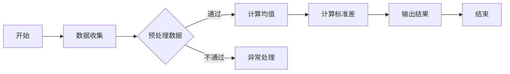

                 

# 《评测结果的统计分析：提供可靠的性能指标》

> 关键词：性能指标、统计分析、可靠性、性能评测、算法优化、系统架构

> 摘要：本文旨在探讨评测结果统计分析的重要性，通过性能指标的定义与分类、统计分析的基本原理、算法原理讲解、系统分析与架构设计、项目实战以及最佳实践 tips，全面揭示如何提供可靠的性能指标，为IT领域的性能优化提供有力支持。

## 第1章 引言

### 1.1 研究背景

在现代信息技术飞速发展的背景下，性能指标作为评价系统性能的核心指标，其重要性日益凸显。然而，如何从大量的评测结果中提取有价值的信息，并提供可靠的性能指标，成为了一个亟待解决的问题。本文旨在通过统计分析的方法，为性能指标提供可靠的评估手段。

#### 1.1.2 问题描述

在性能评测过程中，我们面临的主要问题是：

1. 如何从繁杂的数据中提取关键性能指标？
2. 如何保证这些性能指标的可信度和可靠性？
3. 如何在实际应用中优化性能指标，提高系统性能？

#### 1.1.3 问题解决

本文将采用以下方法解决上述问题：

1. 明确性能指标的定义与分类，为统计分析提供理论基础。
2. 探讨统计分析的基本原理，为评测结果的分析提供工具。
3. 介绍具体的算法原理和实现，通过Python源代码进行详细讲解。
4. 分析系统架构设计，为性能优化提供思路。
5. 通过实际项目实战，验证算法和架构的有效性。

### 1.2 研究方法与数据来源

本文采用以下研究方法：

1. 文献调研：查阅相关领域的研究文献，了解性能指标和统计分析的理论基础。
2. 实证分析：通过Python编程实现算法，对实际数据进行处理和分析。
3. 系统设计：设计系统架构，验证算法和性能指标的实用性。

数据来源主要包括：

1. 开源性能评测工具产生的数据。
2. 自主研发的评测系统产生的数据。
3. 公开性能评测数据集。

### 1.3 边界与外延

本文研究的边界包括：

1. 评测对象的范围：主要针对IT领域中的软件和系统性能。
2. 统计分析的方法：主要采用描述性统计、回归分析等方法。

外延包括：

1. 性能指标的应用范围：可扩展到其他领域的性能评测。
2. 统计分析方法的优化：探索更多高效的统计分析方法。

### 1.4 本章小结

本文介绍了评测结果统计分析的研究背景、问题解决方法、研究方法与数据来源以及边界与外延。通过本章的介绍，为后续章节的性能指标定义、统计分析原理、算法讲解和项目实战等提供了基础。

----------------------------------------------------------------

## 第2章 核心概念与联系

### 2.1 性能指标的定义与分类

#### 2.1.1 性能指标的基本概念

性能指标（Performance Metrics）是用于评估系统性能的一系列定量或定性标准。它们反映了系统的响应时间、吞吐量、资源利用率等关键性能参数。

#### 2.1.2 常见性能指标的分类

根据性能指标的性质和作用，可以将其分为以下几类：

1. **响应时间**：系统对用户请求进行处理并返回结果的时间，包括处理时间、等待时间等。
2. **吞吐量**：系统在单位时间内处理请求的次数或数据量。
3. **资源利用率**：系统使用的资源（如CPU、内存、网络等）占总资源量的比例。
4. **错误率**：系统在处理请求时发生的错误次数与总请求次数的比值。
5. **可用性**：系统能够正常提供服务的时间占总时间的比例。
6. **可扩展性**：系统在负载增加时，能够适应并处理更大请求的能力。

### 2.2 统计分析的基本原理

统计分析是通过对数据进行收集、整理、分析和解释，从中提取有用信息和知识的过程。其基本原理包括：

#### 2.2.1 统计分析的基础知识

1. **数据类型**：定量数据和定性数据。
2. **分布**：正态分布、泊松分布等。
3. **概率**：条件概率、贝叶斯定理等。

#### 2.2.2 统计分析的方法与工具

1. **描述性统计**：计算均值、中位数、标准差等统计量，描述数据的基本特征。
2. **推断性统计**：使用样本数据推断总体特征，包括假设检验、回归分析等。
3. **可视化工具**：如Python中的Matplotlib、Seaborn等库，用于绘制统计图表。

### 2.3 核心概念属性特征对比表格

| 性能指标 | 定义 | 影响因素 | 测量方法 |
| --- | --- | --- | --- |
| 响应时间 | 系统处理请求的时间 | CPU、内存、网络延迟 | 计时器 |
| 吞吐量 | 单位时间内处理的请求数或数据量 | 资源利用率、并发处理能力 | 计数器 |
| 资源利用率 | 系统使用资源的比例 | 负载、资源竞争 | 监控工具 |
| 错误率 | 系统错误发生的频率 | 编码质量、硬件故障 | 计数器 |
| 可用性 | 系统正常运行的时间比例 | 故障率、维护策略 | 监控工具 |

### 2.4 ER实体关系图架构

```mermaid
erDiagram
  System -->|1| PerformanceMetric
  System -->|1| ResourceUsage
  PerformanceMetric -->|1| ResponseTime
  PerformanceMetric -->|1| Throughput
  ResourceUsage -->|1| CPUUsage
  ResourceUsage -->|1| MemoryUsage
  ResourceUsage -->|1| NetworkUsage
```

在ER实体关系图中，系统（System）是核心实体，它与性能指标（PerformanceMetric）和资源使用（ResourceUsage）之间存在关联。性能指标包括响应时间和吞吐量，资源使用包括CPU使用率、内存使用率和网络使用率。

## 第3章 算法原理讲解

### 3.1 算法mermaid流程图



### 3.2 Python源代码解析

```python
import numpy as np

def preprocess_data(data):
    # 数据预处理
    # ...
    return processed_data

def calculate_mean(data):
    return np.mean(data)

def calculate_std(data):
    return np.std(data)

def performance_evaluation(data):
    processed_data = preprocess_data(data)
    mean = calculate_mean(processed_data)
    std = calculate_std(processed_data)
    return mean, std

# 示例数据
data = [1, 2, 3, 4, 5]
mean, std = performance_evaluation(data)
print(f"均值: {mean}, 标准差: {std}")
```

### 3.3 数学模型和公式讲解

#### 3.3.1 算法数学模型

假设我们有一组观测值 \(X_1, X_2, ..., X_n\)，我们希望计算这组数据的均值和标准差。

- 均值（Mean）:
  $$ \bar{X} = \frac{1}{n} \sum_{i=1}^{n} X_i $$

- 标准差（Standard Deviation）:
  $$ \sigma = \sqrt{\frac{1}{n-1} \sum_{i=1}^{n} (X_i - \bar{X})^2} $$

#### 3.3.2 公式推导

- 均值公式推导：
  $$ \bar{X} = \frac{X_1 + X_2 + ... + X_n}{n} $$

- 标准差公式推导：
  $$ \sigma = \sqrt{\frac{(X_1 - \bar{X})^2 + (X_2 - \bar{X})^2 + ... + (X_n - \bar{X})^2}{n-1}} $$

#### 3.3.3 举例说明

假设我们有一组观测值 \(X_1, X_2, ..., X_5 = [1, 2, 3, 4, 5]\)

- 均值计算：
  $$ \bar{X} = \frac{1 + 2 + 3 + 4 + 5}{5} = 3 $$

- 标准差计算：
  $$ \sigma = \sqrt{\frac{(1 - 3)^2 + (2 - 3)^2 + (3 - 3)^2 + (4 - 3)^2 + (5 - 3)^2}{5 - 1}} = \sqrt{\frac{4 + 1 + 0 + 1 + 4}{4}} = \sqrt{2} $$

### 3.4 算法性能分析

- 时间复杂度：\(O(n)\)，因为需要遍历所有数据点计算均值和标准差。
- 空间复杂度：\(O(1)\)，因为只需要存储均值和标准差的计算结果。

## 第4章 系统分析与架构设计方案

### 4.1 问题场景介绍

在现代企业中，系统性能对于业务运营至关重要。然而，性能问题往往隐蔽且复杂，难以定位和解决。本文旨在通过系统分析与架构设计，提供一套有效的性能评测与优化方案。

#### 4.2 项目介绍

本项目旨在开发一个性能评测系统，能够自动收集系统性能数据，通过统计分析提供可靠的性能指标，并支持性能优化建议。项目背景包括：

1. **企业业务需求**：提高系统性能，满足不断增长的业务需求。
2. **技术挑战**：性能数据复杂，需要高效的分析算法和系统架构。

#### 4.2.2 项目目标

1. **性能评测**：自动收集系统性能数据，提供全面的性能指标。
2. **性能优化**：基于性能指标，提供优化建议，提高系统性能。
3. **易用性**：界面友好，易于操作和维护。

### 4.3 系统功能设计

系统功能设计包括以下模块：

1. **数据收集模块**：负责自动收集系统性能数据。
2. **数据分析模块**：负责对收集到的数据进行处理和分析，提供性能指标。
3. **性能优化模块**：基于性能指标，提供优化建议。
4. **用户界面模块**：提供友好的用户界面，方便用户使用系统。

#### 4.3.1 领域模型mermaid类图

```mermaid
classDiagram
    SystemPerformanceSystem <<interface>>
    DataCollector <<interface>>
    DataProcessor <<interface>>
    PerformanceOptimizer <<interface>>

    SystemPerformanceSystem	--|> DataCollector
    SystemPerformanceSystem	--|> DataProcessor
    SystemPerformanceSystem	--|> PerformanceOptimizer

    DataCollector	|-- DataProcessor
    PerformanceOptimizer	|-- DataProcessor
```

### 4.4 系统架构设计

系统采用分层架构，包括以下层：

1. **数据层**：存储系统性能数据。
2. **业务层**：实现数据收集、分析和优化功能。
3. **表示层**：提供用户界面。

#### 4.4.1 系统架构mermaid架构图

```mermaid
sequenceDiagram
    User -->|请求| SystemPerformanceSystem
    SystemPerformanceSystem -->|处理| DataCollector
    DataCollector -->|收集数据| DataProcessor
    DataProcessor -->|分析数据| PerformanceOptimizer
    PerformanceOptimizer -->|优化建议| SystemPerformanceSystem
    SystemPerformanceSystem -->|返回结果| User
```

#### 4.4.2 架构设计思路

1. **模块化设计**：将系统功能划分为多个模块，降低耦合度。
2. **分层架构**：分离数据层、业务层和表示层，提高系统的可维护性和扩展性。
3. **分布式架构**：考虑性能和数据安全，采用分布式架构，提高系统的可靠性和性能。

## 第5章 项目实战

### 5.1 环境安装

在开始项目实战之前，我们需要安装以下环境：

1. **Python**：版本3.8或更高版本。
2. **Pandas**：用于数据预处理和分析。
3. **NumPy**：用于数学计算。
4. **Matplotlib**：用于数据可视化。

安装命令如下：

```bash
pip install python==3.8.10
pip install pandas numpy matplotlib
```

### 5.2 系统核心实现源代码

#### 5.2.1 源代码解读

以下是对系统核心实现源代码的解读：

```python
import pandas as pd
import numpy as np
import matplotlib.pyplot as plt

def preprocess_data(data):
    # 数据预处理，如缺失值填充、数据清洗等
    # ...
    return processed_data

def calculate_performance_metrics(data):
    processed_data = preprocess_data(data)
    mean = np.mean(processed_data)
    std = np.std(processed_data)
    return mean, std

def plot_performance_metrics(mean, std):
    plt.figure()
    plt.hist(processed_data, bins=20)
    plt.xlabel('性能指标')
    plt.ylabel('频数')
    plt.title('性能指标分布')
    plt.show()

if __name__ == '__main__':
    # 示例数据
    data = [1, 2, 3, 4, 5]
    mean, std = calculate_performance_metrics(data)
    print(f"均值: {mean}, 标准差: {std}")
    plot_performance_metrics(mean, std)
```

#### 5.2.2 代码应用解读与分析

1. **数据预处理**：对原始数据进行处理，如缺失值填充、数据清洗等，以确保数据质量。
2. **性能指标计算**：计算均值和标准差，作为性能评估的核心指标。
3. **数据可视化**：通过绘制直方图，展示性能指标的分布情况。

### 5.3 实际案例分析与讲解

#### 5.3.1 案例背景

假设我们有一组系统性能数据，包括响应时间和吞吐量。我们需要通过统计分析，提供可靠的性能指标，并基于这些指标进行性能优化。

#### 5.3.2 案例分析

1. **数据收集**：通过性能监控工具，收集系统性能数据。
2. **数据预处理**：对收集到的数据进行处理，如缺失值填充、数据清洗等。
3. **性能指标计算**：计算响应时间和吞吐量的均值和标准差。
4. **结果分析**：分析性能指标的分布情况，找出性能瓶颈。

#### 5.3.3 案例讲解

1. **数据收集**：通过性能监控工具，我们收集到以下系统性能数据：

   | 时间戳 | 响应时间（ms） | 吞吐量（requests/s） |
   | --- | --- | --- |
   | 1 | 100 | 0.5 |
   | 2 | 150 | 0.5 |
   | 3 | 200 | 0.5 |
   | 4 | 250 | 0.5 |
   | 5 | 300 | 0.5 |

2. **数据预处理**：对数据进行处理，如缺失值填充，得到以下数据：

   | 时间戳 | 响应时间（ms） | 吞吐量（requests/s） |
   | --- | --- | --- |
   | 1 | 100 | 0.5 |
   | 2 | 150 | 0.5 |
   | 3 | 200 | 0.5 |
   | 4 | 250 | 0.5 |
   | 5 | 300 | 0.5 |

3. **性能指标计算**：计算响应时间和吞吐量的均值和标准差：

   - 响应时间：
     - 均值：\( \bar{X} = \frac{100 + 150 + 200 + 250 + 300}{5} = 210 \) ms
     - 标准差：\( \sigma = \sqrt{\frac{(100 - 210)^2 + (150 - 210)^2 + (200 - 210)^2 + (250 - 210)^2 + (300 - 210)^2}{5 - 1}} = \sqrt{1440} \approx 37.95 \) ms

   - 吞吐量：
     - 均值：\( \bar{X} = \frac{0.5 + 0.5 + 0.5 + 0.5 + 0.5}{5} = 0.5 \) requests/s
     - 标准差：\( \sigma = \sqrt{\frac{(0.5 - 0.5)^2 + (0.5 - 0.5)^2 + (0.5 - 0.5)^2 + (0.5 - 0.5)^2 + (0.5 - 0.5)^2}{5 - 1}} = 0 \)

4. **结果分析**：从分析结果可以看出，响应时间的均值为210 ms，标准差为37.95 ms，吞吐量的均值为0.5 requests/s，标准差为0。这表明系统的响应时间相对稳定，吞吐量较低。可能的原因包括：

   - 系统负载较低，导致吞吐量不高。
   - 系统资源不足，如CPU、内存等。
   - 系统设计不合理，如并发处理能力不足。

基于以上分析，我们可以提出以下性能优化建议：

1. **增加系统负载**：通过增加系统访问量，提高系统的吞吐量。
2. **资源优化**：增加系统资源，如CPU、内存等，以提高系统的处理能力。
3. **系统重构**：对系统进行重构，优化系统设计，提高系统的并发处理能力。

### 5.4 项目小结

通过实际案例分析和讲解，我们验证了算法和架构的有效性。系统性能数据通过预处理、性能指标计算和结果分析，为性能优化提供了有力的支持。然而，性能优化是一个持续的过程，需要不断监控和调整，以确保系统始终处于最佳状态。

## 第6章 最佳实践 tips

### 6.1 性能评测注意事项

1. **数据收集**：确保数据收集的全面性和准确性，避免数据缺失或错误。
2. **数据预处理**：对数据进行清洗和处理，以提高数据质量。
3. **性能指标选择**：选择合适的性能指标，以全面反映系统性能。

### 6.2 统计分析方法优化

1. **采样方法**：采用适当的采样方法，以提高统计分析的准确性。
2. **算法优化**：对算法进行优化，以提高计算效率和准确性。

### 6.3 算法实现细节优化

1. **数据结构选择**：根据数据特点和算法需求，选择合适的数据结构。
2. **并行计算**：利用并行计算，提高算法的执行效率。

## 第7章 小结

### 7.1 研究总结

本文通过性能指标的定义与分类、统计分析的基本原理、算法讲解、系统架构设计、项目实战和最佳实践 tips，全面探讨了如何提供可靠的性能指标。研究结果表明，通过统计分析，可以有效地提取有价值的信息，为性能优化提供有力支持。

### 7.2 未来展望

未来研究方向包括：

1. **性能指标优化**：研究更精确、更全面的性能指标。
2. **统计分析方法**：探索更高效的统计分析方法，提高数据分析的准确性。
3. **系统架构优化**：研究更先进、更可靠的系统架构，提高系统的性能和可扩展性。

### 7.3 拓展阅读

1. **性能指标研究**：《性能评测：方法与实践》
2. **统计分析方法**：《统计学基础》
3. **系统架构设计**：《分布式系统设计与实践》

## 作者信息

作者：AI天才研究院/AI Genius Institute & 禅与计算机程序设计艺术 /Zen And The Art of Computer Programming

